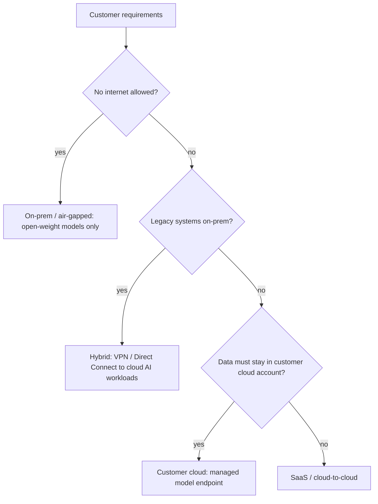
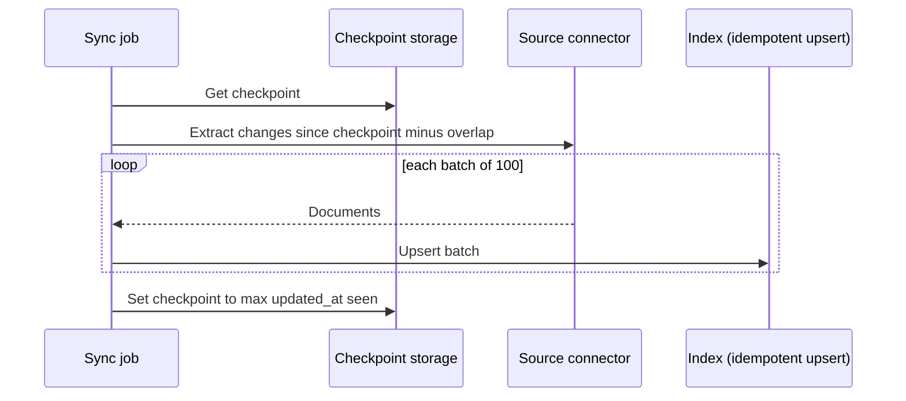
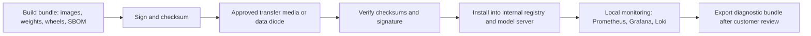
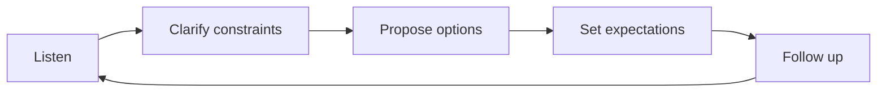
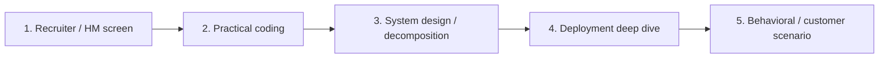
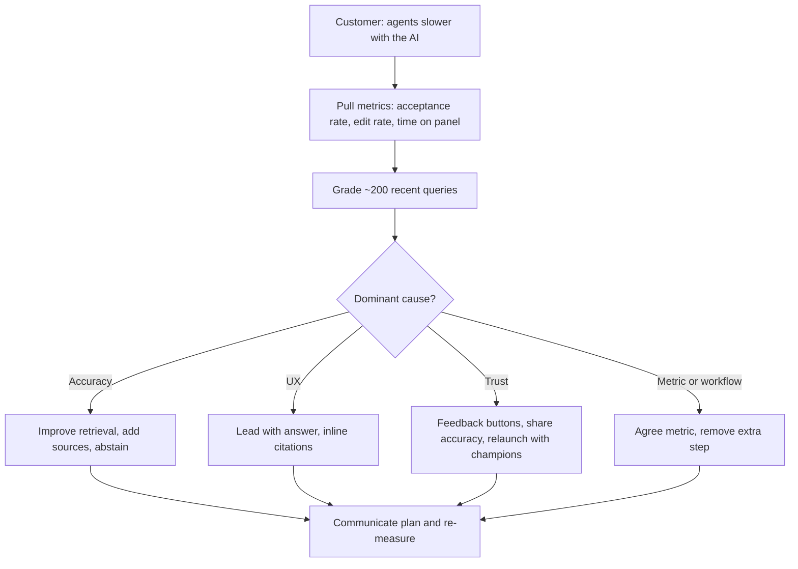

# 🚀 Forward Deploy Engineer — Comprehensive Preparation Guide

> **Target Role:** Forward Deployed Engineer (FDE) at AI companies  
> **Also known as:** Forward Deployed Software Engineer (Palantir's original title) · Applied AI Engineer · Solutions / Customer / Deployment Engineer (overlapping but usually less hands-on)  
> **Level:** Mid-Senior to Staff

!!! tip "30-second answer: what is an FDE?"
    An engineer who embeds with a customer and ships working software in *their* environment: integrating the product with the customer's data, identity, networks and workflows, and getting it to measurable production use. Palantir created the title; AI companies (including OpenAI and Anthropic, which both hire FDEs) adopted it because AI products are easy to demo and hard to deploy. Interviews test problem decomposition, practical full-stack and infrastructure skill, AI fundamentals (RAG, agents, evals), and customer judgement.

---

## Table of Contents

1. [What is a Forward Deployed Engineer?](#1-what-is-a-forward-deployed-engineer)
2. [Core FDE Skills](#2-core-fde-skills)
3. [Deployment Patterns for AI Systems](#3-deployment-patterns-for-ai-systems)
4. [Enterprise Integration & Security](#4-enterprise-integration-security)
5. [Data Pipeline Integration](#5-data-pipeline-integration)
6. [On-Premise & Air-Gapped Deployment](#6-on-premise-air-gapped-deployment)
7. [Monitoring & Observability in Customer Environments](#7-monitoring-observability-in-customer-environments)
8. [Customer-Facing Engineering](#8-customer-facing-engineering)
9. [The FDE Interview Process](#9-the-fde-interview-process)
10. [Interview Questions](#10-interview-questions)

---

## 1. What is a Forward Deployed Engineer?

### The FDE Mindset

```
"You are the bridge between what the product can do and what the customer needs."

As an FDE at an AI company:
- You deploy AI systems INTO customer environments (customer cloud, on-prem, hybrid)
- You solve problems that the product doesn't handle yet
- You represent engineering to the customer AND the customer to engineering
- You turn one-off fixes into reusable patterns the product team can absorb
- You ship fast, measure, and learn what actually works in the real world
```

### FDE vs Adjacent Roles

Generalisations; titles mean different things at different companies.

| Dimension | FDE | Solutions Architect | SWE (Product) | AI Engineer |
|-----------|-----|-------------------|---------------|-------------|
| **Primary focus** | Shipping into customer environments | Designing solutions, pre-sales | Building product features | Building AI features |
| **Customer exposure** | Daily, hands-on | Weekly, strategic | Rare | Occasional |
| **Code ownership** | High (integration, deployment) | Low (POCs) | High (product) | High (AI logic) |
| **Deployment target** | Customer infra (anywhere) | Reference architecture | Internal infra | Internal infra |
| **Problem type** | Messy, ambiguous | Structured, scoped | Well-defined | Semi-structured |
| **Travel** | Often (25-50% is common in postings) | Sometimes | Rarely | Rarely |
| **Success metric** | Customer in production, measurable outcome | Deal closed | Feature shipped | Model/feature quality |

### Why Companies Hire FDEs for AI

```
1. AI models are easy to demo, hard to deploy
   → FDEs close the "last mile" between a demo and a production workflow

2. Every enterprise has unique constraints
   → Legacy data, compliance, custom auth, data residency, air-gap needs

3. AI products need hands-on integration
   → Data pipelines, connectors (often MCP servers), agent workflows, evals

4. Customers need a technical partner
   → Someone who understands THEIR infra AND the AI product

5. Field learning feeds the roadmap
   → Repeated customer work becomes product features
```

---

## 2. Core FDE Skills

### Technical Skills

| Skill | Importance | Details |
|-------|------------|---------|
| **Full-stack engineering** | 🔴 Critical | End-to-end integrations: APIs, auth, databases, simple frontends |
| **Infrastructure (K8s, Docker, Terraform)** | 🔴 Critical | Deploy containerized applications into customer environments |
| **AI application fundamentals** | 🔴 Critical | RAG, tool use/agents, prompt and context design, **evals**: you deploy and debug these |
| **Networking** | 🟡 High | VPN, VPC peering, PrivateLink, proxies, DNS, TLS, egress controls |
| **Data engineering** | 🟡 High | ETL/CDC pipelines, connectors, schema mapping |
| **Security & auth** | 🟡 High | SSO (SAML/OIDC), RBAC, secrets management, encryption, audit |
| **Scripting & automation** | 🟢 Medium | Python, bash, Ansible |
| **Monitoring & logging** | 🟢 Medium | Prometheus, Grafana, OpenTelemetry, ELK/Loki, Datadog |

### Soft Skills

| Skill | Why it Matters |
|-------|----------------|
| **Problem decomposition** | Customers give vague requirements. You break them into actionable pieces. |
| **Communication** | Translate between customer stakeholders (CTO, engineers, ops, compliance) and your team. |
| **Empathy** | Understand customer pain points. Build trust. Handle frustration. |
| **Trade-off articulation** | "We can do X in 2 days or Y in 2 weeks. Here's what you get with each." |
| **Rapid learning** | Every customer environment is different. You figure it out fast. |
| **Saying no** | Protect the customer from a solution that won't work, and the product from one-off forks. |

---

## 3. Deployment Patterns for AI Systems

### Deployment Topology

```ascii
┌─────────────────────────────────────────────────────────────┐
│                    DEPLOYMENT TOPOLOGIES                    │
├─────────────────────────────────────────────────────────────┤
│                                                             │
│  SAAS / CLOUD-TO-CLOUD (Simplest)                           │
│  ┌──────────────┐  PrivateLink /   ┌──────────────┐         │
│  │ Customer VPC │◄─── peering ────►│ Vendor cloud │         │
│  └──────────────┘                  └──────────────┘         │
│                                                             │
│  CUSTOMER CLOUD (Model via customer's own cloud account)    │
│  ┌──────────────────────────────────────────────┐           │
│  │ Customer VPC: app + vector DB                │           │
│  │   └──► managed model endpoint in the same    │           │
│  │        cloud (e.g. Bedrock, Vertex, Foundry) │           │
│  └──────────────────────────────────────────────┘           │
│                                                             │
│  HYBRID (Common for enterprise)                             │
│  ┌──────────────────┐   ┌──────────────────┐                │
│  │ Customer on-prem │   │ Customer cloud   │                │
│  │ (DBs, apps)      │   │ (AI workloads)   │                │
│  └────────┬─────────┘   └────────┬─────────┘                │
│           └──────────┬───────────┘                          │
│               VPN / Direct Connect / ExpressRoute           │
│                                                             │
│  ON-PREMISE / AIR-GAPPED (Most challenging)                 │
│  ┌──────────────────────────────────────────────┐           │
│  │  Customer data center (no internet)          │           │
│  │  ┌──────────┐ ┌──────────┐ ┌──────────────┐  │           │
│  │  │ Open-    │ │  Agent   │ │ Customer     │  │           │
│  │  │ weight   │ │ service  │ │ apps         │  │           │
│  │  │ models   │ │          │ │              │  │           │
│  │  └──────────┘ └──────────┘ └──────────────┘  │           │
│  └──────────────────────────────────────────────┘           │
└─────────────────────────────────────────────────────────────┘
```

The **customer-cloud** option is often the answer to "our data can't leave our environment" when the customer is in a public cloud: frontier models such as Claude are offered through Amazon Bedrock, Google Cloud Vertex AI and Microsoft Foundry, so inference is billed and governed through the customer's own cloud account. Check each provider's current data-handling terms and regional availability. True **air-gapped** deployments need open-weight models you host yourself; frontier closed models are not generally available for self-hosting.

### Deployment Decision Matrix

| Factor | SaaS / cloud-to-cloud | Customer cloud | Hybrid | On-prem / air-gapped |
|--------|---------------|--------|------------|------|
| **Setup time** | Hours to days | Days | Days to weeks | Weeks to months |
| **Who operates it** | Vendor | Shared | Shared | Customer ops (with your runbooks) |
| **Model updates** | Vendor pushes | Provider-managed | Moderate | Manual bundle transfer |
| **Model choice** | Vendor's | Models offered by that cloud | Either | Open-weight only |
| **Data control** | Contractual (DPA, retention terms) | Stays in customer's cloud account | Mixed | Physically on-site |
| **Typical drivers** | Speed | Residency, procurement via cloud commit | Legacy systems on-prem | Classified, regulated, no-internet sites |
| **Cost** | Lowest | Medium | Medium | Highest (dedicated GPUs, ops) |

Network latency is rarely the deciding factor: LLM generation time (hundreds of milliseconds to seconds) dominates a few milliseconds of network.

*Figure: choosing a deployment topology from the customer data and network constraints.*



### Containerized AI Deployment Package

```yaml
# deployment-package/compose.yaml
# Standardized deployment for a single-host customer environment.
# (The top-level `version:` key is obsolete in the Compose Specification; omit it.)

services:
  ai-agent:
    image: registry.example.com/ai-agent:${VERSION}   # pinned version, never :latest
    ports:
      - "8080:8080"               # the only port exposed to the customer network
    environment:
      AUTH_PROVIDER: ${AUTH_PROVIDER}
      MODEL_ENDPOINT: ${MODEL_ENDPOINT}
      LOG_LEVEL: info
    secrets:
      - db_url                    # mounted as a file at /run/secrets/db_url
    volumes:
      - ./config:/app/config:ro
      - ./data:/app/data
    healthcheck:
      test: ["CMD", "curl", "-f", "http://localhost:8080/livez"]
      interval: 30s
      retries: 3
    depends_on: [vector-db, cache]

  vector-db:
    image: qdrant/qdrant:${QDRANT_VERSION}   # pin; no host port: internal network only
    volumes:
      - ./qdrant_storage:/qdrant/storage

  cache:
    image: valkey/valkey:${VALKEY_VERSION}   # or redis; pin either way, no host port

  prometheus:
    image: prom/prometheus:${PROMETHEUS_VERSION}
    volumes:
      - ./prometheus.yml:/etc/prometheus/prometheus.yml:ro

secrets:
  db_url:
    file: ./secrets/db_url
```

Notes: pin every image (ideally by digest) so what you tested is what the customer runs; expose only the application port; keep data stores on the internal Compose network. A GPU reservation belongs on the model-server container, not the API service.

### Kubernetes Deployment for Enterprise

```yaml
# k8s/ai-agent-deployment.yaml
apiVersion: apps/v1
kind: Deployment
metadata:
  name: ai-agent
  namespace: customer-ai
spec:
  replicas: 3
  strategy:
    type: RollingUpdate
    rollingUpdate:
      maxUnavailable: 0   # never drop below 3 ready pods...
      maxSurge: 1         # ...so the cluster needs capacity for one extra pod
  selector:
    matchLabels:
      app: ai-agent
  template:
    metadata:
      labels:
        app: ai-agent     # must match spec.selector or the API server rejects it
    spec:
      containers:
      - name: agent
        image: registry.example.com/ai-agent:2.1.0
        ports:
        - containerPort: 8080
        env:
        - name: DATABASE_URL
          valueFrom:
            secretKeyRef:
              name: customer-db-credentials
              key: url
        resources:
          requests:
            memory: "2Gi"
            cpu: "1"
          limits:
            memory: "4Gi"
        readinessProbe:          # gates traffic; may check dependencies
          httpGet: {path: /readyz, port: 8080}
          periodSeconds: 10
        livenessProbe:           # restarts the pod; must NOT check dependencies
          httpGet: {path: /livez, port: 8080}
          initialDelaySeconds: 30
          periodSeconds: 10
---
apiVersion: v1
kind: Service
metadata:
  name: ai-agent-service
  namespace: customer-ai
spec:
  type: ClusterIP  # internal only; expose via the customer's ingress/VPN
  ports:
  - port: 8080
    targetPort: 8080
  selector:
    app: ai-agent
---
apiVersion: networking.k8s.io/v1
kind: NetworkPolicy
metadata:
  name: agent-network-policy
  namespace: customer-ai
spec:
  podSelector:
    matchLabels:
      app: ai-agent
  policyTypes: [Ingress, Egress]
  ingress:
  - from:
    - namespaceSelector:
        matchLabels:
          kubernetes.io/metadata.name: customer-apps   # label set automatically on every namespace
    ports:
    - port: 8080
  egress:
  - to:                       # DNS, or nothing else resolves once egress is restricted
    - namespaceSelector:
        matchLabels:
          kubernetes.io/metadata.name: kube-system
    ports:
    - {port: 53, protocol: UDP}
    - {port: 53, protocol: TCP}
  - to:
    - podSelector: {matchLabels: {app: vector-db}}
    ports:
    - port: 6333
  - to:
    - podSelector: {matchLabels: {app: model-server}}
    ports:
    - port: 8000
```

The API service here is CPU-only; GPUs go on the model-server Deployment (`resources.limits: nvidia.com/gpu: N`, which requires the NVIDIA device plugin or GPU Operator on the cluster). NetworkPolicy only takes effect if the cluster's CNI enforces it (Calico, Cilium, etc.); verify that in the customer's cluster rather than assuming.

---

## 4. Enterprise Integration & Security

### Authentication Integration

Use a maintained library for the protocol (e.g. `python3-saml`/`pysaml2` for SAML, `authlib` or the IdP's SDK for OIDC); never hand-roll signature validation. The adapter pattern below keeps the rest of the app provider-agnostic:

```python
from abc import ABC, abstractmethod


class AuthAdapter(ABC):
    """Unified interface over customer identity providers."""

    @abstractmethod
    async def authenticate(self, request) -> "User": ...

    async def authorize(self, user: "User", action: str, resource: str) -> bool:
        return await policy_engine.check(user, action, resource)  # e.g. OPA, Cedar, app RBAC


class OIDCAuthAdapter(AuthAdapter):
    """Bearer-token APIs behind Okta, Auth0, Microsoft Entra ID, etc."""

    def __init__(self, issuer: str, audience: str, roles_claim: str = "roles"):
        self.verifier = JwtVerifier(issuer=issuer, audience=audience)  # fetches JWKS from discovery
        self.roles_claim = roles_claim  # claim name varies by IdP; make it configurable

    async def authenticate(self, request) -> "User":
        auth = request.headers.get("Authorization", "")
        if not auth.startswith("Bearer "):
            raise Unauthorized()
        # Verify signature against the IdP's JWKS, plus iss, aud, exp/nbf.
        claims = await self.verifier.verify(auth.removeprefix("Bearer "))
        return User(subject=claims["sub"], email=claims.get("email"),
                    roles=claims.get(self.roles_claim, []), tenant_id=claims.get("tid"))


class SAMLAuthAdapter(AuthAdapter):
    """Browser SSO. The IdP POSTs a signed SAMLResponse form field to your ACS endpoint;
    you validate it once, then issue your own session cookie."""

    async def authenticate(self, request) -> "User":
        session = await sessions.get(request.cookies.get("session"))
        if session is None:
            raise RedirectToIdP()  # the web layer turns this into a redirect
        return session.user
```

Points interviewers probe: identify users by the stable subject (`sub` / NameID), not email; map IdP groups to app roles in config, not code; support SCIM provisioning so deprovisioned users lose access; and for AI agents, make tool calls run with the **end user's** permissions, so the agent can't retrieve documents the user isn't allowed to see.

### Secrets Management

```python
class SecretsManager:
    """Pick a backend per deployment type."""

    def __init__(self, deployment_type: str):
        backends = {
            "cloud": AWSSecretsManager,        # or GCP Secret Manager / Azure Key Vault
            "on_prem": HashiCorpVault,
            "air_gapped": HashiCorpVault,      # Vault runs fine offline
        }
        self.backend = backends[deployment_type]()

    async def get(self, key: str) -> str:
        return await self.backend.get_secret(key)

# Deployment checklist for secrets:
# ❌ Never: hardcode secrets in code, config files, or Docker image layers
# ❌ Avoid: long-lived static credentials; plain env vars for high-value secrets
#           (they leak into crash dumps, `docker inspect`, child processes)
# ✅ Prefer: workload identity (IRSA / EKS Pod Identity, GKE Workload Identity,
#           Azure Workload Identity) so there's no secret to store at all
# ✅ Otherwise: secrets mounted as files from a secret manager, short-lived where possible
# ✅ Always: encrypt at rest and in transit, rotate, and audit access
```

### Network Security

```python
NETWORK_SECURITY_CHECKLIST = {
    "in_transit": [
        "TLS 1.2 minimum, 1.3 preferred, for all API traffic",
        "mTLS (or a service mesh) for service-to-service auth",
        "Private connectivity (PrivateLink, VPN, Direct Connect) for cloud-to-on-prem",
    ],
    "at_rest": [
        "Encrypted volumes (EBS encryption, LUKS)",
        "Database encryption at rest, customer-managed keys if required",
        "Encrypt model weights and vector indexes (they can leak training/source data)",
    ],
    "access_control": [
        "Kubernetes NetworkPolicy (default deny), security groups / firewall rules",
        "Egress allowlist: an agent that can reach the internet can exfiltrate data",
        "IP allowlisting for admin endpoints",
    ],
    "audit": [
        "Every API call and every agent tool call logged with user, time, and parameters",
        "Access attempts (successful and failed) logged",
        "Configuration and prompt/version changes tracked",
    ],
}
```

---

## 5. Data Pipeline Integration

### Common Enterprise Data Sources

```python
from abc import ABC, abstractmethod
from typing import AsyncIterator

import asyncpg


class DataSourceConnector(ABC):
    """Abstract connector for customer data sources."""

    @abstractmethod
    def extract(self, config: "ExtractionConfig") -> AsyncIterator["Document"]: ...


class PostgresConnector(DataSourceConnector):
    """PostgreSQL via asyncpg. (MySQL / SQL Server need their own drivers.)"""

    def __init__(self, pool: asyncpg.Pool):
        self.pool = pool

    @classmethod
    async def create(cls, dsn: str) -> "PostgresConnector":
        # __init__ can't await, so build the pool in an async factory
        return cls(await asyncpg.create_pool(dsn))

    async def extract(self, config: "ExtractionConfig") -> AsyncIterator["Document"]:
        query = f"""
            SELECT id, title, body, updated_at FROM {config.table}
            WHERE updated_at > $1
            ORDER BY updated_at, id
        """  # table name comes from trusted config; values are always bind parameters
        async with self.pool.acquire() as conn:
            async with conn.transaction():      # asyncpg cursors require a transaction
                async for row in conn.cursor(query, config.last_modified_after):
                    yield Document(
                        content=f"{row['title']}\n\n{row['body']}",
                        metadata={"source": config.table, "row_id": row["id"],
                                  "updated_at": row["updated_at"]},
                    )


class SharePointConnector(DataSourceConnector):
    """SharePoint/OneDrive via Microsoft Graph (app registration in Entra ID)."""

    def __init__(self, graph: "MicrosoftGraphClient"):
        self.graph = graph

    async def extract(self, config: "ExtractionConfig") -> AsyncIterator["Document"]:
        # Graph delta queries return only items changed since the last delta token
        async for item in self.graph.drive_delta(config.drive_id, config.delta_token):
            if item.deleted:
                yield Tombstone(source_id=item.id)   # propagate deletes to the index
                continue
            text = await self._parse_document(await self.graph.download(item.id), item.extension)
            yield Document(content=text, metadata={"source": "sharepoint", "file": item.name,
                                                   "acl": item.permissions})
```

For SaaS sources (Salesforce, Zendesk, ServiceNow) use the vendor's official SDK or change APIs, respect API rate limits, and **carry source permissions (ACLs) into the index** so retrieval can filter by what the asking user may see. Ingesting everything into one index that every user can query is the most common enterprise RAG security bug.

### Incremental Sync Strategy

```python
from datetime import timedelta


class IncrementalSync:
    """Sync rows changed since the last checkpoint (timestamp-polling variant)."""

    OVERLAP = timedelta(minutes=5)   # re-read a window to cover late commits and clock skew

    def __init__(self, storage):
        self.storage = storage

    async def run_sync(self, pipeline_id: str, connector: DataSourceConnector):
        checkpoint = await self.storage.get(f"checkpoint:{pipeline_id}")
        since = checkpoint - self.OVERLAP if checkpoint else None
        high_water = checkpoint
        batch = []

        async for doc in connector.extract(ExtractionConfig(last_modified_after=since)):
            batch.append(doc)
            high_water = max(high_water or doc.metadata["updated_at"], doc.metadata["updated_at"])
            if len(batch) >= 100:
                await self.upsert(batch)      # idempotent upsert keyed by source id
                batch = []
        if batch:
            await self.upsert(batch)

        # Advance to the max timestamp actually SEEN (source clock), not "now" (our clock)
        if high_water:
            await self.storage.set(f"checkpoint:{pipeline_id}", high_water)
```

Why it's written this way:

- Setting the checkpoint to `now()` at the end loses rows committed during the run and breaks under clock skew between your host and the database. Use the highest `updated_at` you saw, minus an overlap window, and make writes idempotent so the overlap is harmless.
- Timestamp polling **cannot see deletes** and misses rows whose `updated_at` isn't maintained. When freshness or deletes matter, use **CDC** (Debezium, Postgres logical replication, SQL Server CDC) or the source's delta API.

*Figure: incremental sync advances the checkpoint to the max timestamp seen, with an overlap window.*



---

## 6. On-Premise & Air-Gapped Deployment

### The Air-Gapped Challenge

```
AIR-GAPPED DEPLOYMENT: no internet, no external APIs, no pulling images.

1. Model weights must be carried in (approved transfer media or a one-way data diode)
   → Size ≈ parameters × bytes per parameter:
       70B at BF16/FP16 (2 bytes)  ≈ 140 GB
       70B at 4-bit (AWQ/GPTQ)     ≈ 35-40 GB (quantization scales add a little)
   → Sign and checksum everything; verify on arrival

2. No hosted LLM APIs: only open-weight models you serve yourself
   → e.g. Llama, Qwen, Mistral, gpt-oss families; check each licence
     (some restrict use or require attribution) and the customer's approved list

3. No package repositories: pre-bundle ALL dependencies
   → Container images (docker save), Python wheels, OS packages, Helm charts
   → Or stand up an internal registry/mirror inside the enclave

4. No vendor telemetry: monitoring is local only
   → Prometheus + Grafana + Loki inside the environment
   → Support happens via logs/diagnostic bundles the customer exports after review

5. Updates are slow: plan for quarterly bundles, not continuous delivery
```

```python
def build_airgap_bundle(version: str) -> dict:
    """Manifest of a self-contained bundle for an air-gapped site."""
    return {
        "images": {                                     # `docker save` / `skopeo copy` tarballs
            "ai-agent": f"ai-agent-{version}.tar",
            "model-server": "vllm-openai-<pinned>.tar",
            "embeddings": "text-embeddings-inference-<pinned>.tar",
            "vector-db": "qdrant-<pinned>.tar",
        },
        "model_weights": {
            "llm": "llm-70b-awq/",                      # ~35-40 GB
            "embedding-model": "bge-large-en-v1.5/",    # ~1.3 GB
        },
        "dependencies": {"python_wheels": "wheels/", "os_packages": "packages/"},
        "integrity": {
            "checksums": "SHA256SUMS",
            "signature": "SHA256SUMS.sig",              # verify with a key shipped out-of-band
            "sbom": "sbom.spdx.json",                   # customers' security teams will ask
        },
        "configs": ["compose.yaml or helm/", "prometheus.yml", "nginx.conf"],
        "scripts": ["install.sh", "verify.sh", "upgrade.sh", "rollback.sh", "backup.sh"],
        "docs": ["deployment_guide.pdf", "runbook.md", "troubleshooting.md"],
    }
```

*Figure: moving a bundle into an air-gapped site, with integrity checks at each step.*



### Local Model Server Setup

```yaml
# airgap/compose.model-server.yaml
services:
  vllm:
    image: vllm/vllm-openai:${VLLM_VERSION}     # pin; vLLM's flags change between releases
    command: >
      --model /models/llm-70b-awq
      --served-model-name llm
      --tensor-parallel-size 2
      --max-model-len 32768
      --gpu-memory-utilization 0.90
    ports:
      - "8000:8000"                              # OpenAI-compatible API
    volumes:
      - /mnt/models:/models:ro
    environment:
      HF_HUB_OFFLINE: "1"                        # never try to reach the Hub
    ipc: host                                    # PyTorch tensor parallelism needs shared memory
    deploy:
      resources:
        reservations:
          devices:
            - driver: nvidia
              count: 2
              capabilities: [gpu]

  embeddings:
    image: ghcr.io/huggingface/text-embeddings-inference:${TEI_VERSION}
    command: --model-id /models/bge-large-en-v1.5
    ports:
      - "8001:80"
    volumes:
      - /mnt/models:/models:ro
    deploy:
      resources:
        reservations:
          devices:
            - driver: nvidia
              count: 1
              capabilities: [gpu]
```

GPU sizing, as a back-of-envelope: memory ≈ weights + KV cache + overhead. A 4-bit 70B model (~40 GB of weights) fits on one 80 GB GPU but leaves limited room for KV cache, so two GPUs with tensor parallelism serve many more concurrent requests and longer contexts. The same model at BF16 (~140 GB) needs at least two 80 GB GPUs and realistically four. Then load-test with the customer's real prompt lengths; concurrency, not model size alone, sets the GPU count. Using more GPUs only helps if you tell the server to shard across them (`--tensor-parallel-size`).

---

## 7. Monitoring & Observability in Customer Environments

### Local Monitoring Stack

```yaml
# monitoring/compose.yaml
# Deployed inside the customer environment (no external access)

services:
  prometheus:
    image: prom/prometheus:${PROMETHEUS_VERSION}   # 3.x line as of 2026
    volumes:
      - ./prometheus.yml:/etc/prometheus/prometheus.yml:ro
      - prometheus_data:/prometheus

  grafana:
    image: grafana/grafana:${GRAFANA_VERSION}
    volumes:
      - ./grafana/provisioning:/etc/grafana/provisioning:ro
      - grafana_data:/var/lib/grafana
    ports:
      - "3000:3000"
    environment:
      GF_AUTH_GENERIC_OAUTH_ENABLED: "true"        # SSO against the customer's IdP
      GF_AUTH_DISABLE_LOGIN_FORM: "true"

  loki:
    image: grafana/loki:${LOKI_VERSION}
    volumes:
      - loki_data:/loki

volumes:
  prometheus_data:
  grafana_data:
  loki_data:
```

What to watch for an AI deployment, beyond the usual RED metrics: time to first token and tokens/second, GPU memory and KV-cache utilisation, queue depth at the model server, retrieval hit quality, guardrail block rate, user feedback (thumbs up/down, answer accepted/edited), and cost or GPU-hours per resolved task.

### Health Check Endpoints

```python
# Separate liveness from readiness; put metrics on /metrics.

@router.get("/livez")
async def liveness():
    """Is this process alive? No dependency checks: if the DB is down,
    restarting every pod makes things worse, not better."""
    return {"status": "ok"}


@router.get("/readyz")
async def readiness(response: Response):
    """Can this pod serve traffic right now? Failing removes it from the Service."""
    checks = {
        "model_server": await check_model_server(timeout=1.0),
        "vector_db": await check_vector_db(timeout=1.0),
        "migrations": await check_migrations_applied(),
    }
    ready = all(checks.values())
    response.status_code = 200 if ready else 503
    return {"ready": ready, "checks": checks}


@router.get("/version")
async def version():
    return {"version": APP_VERSION, "model": MODEL_NAME, "prompt_version": PROMPT_VERSION}

# Request counts, latency histograms, error rates, GPU utilisation → Prometheus /metrics,
# not a JSON health endpoint.
```

---

## 8. Customer-Facing Engineering

### The FDE Communication Framework

```
1. LISTEN first
   └── "Tell me more about the problem you're trying to solve."
   └── "What does success look like, and how is it measured today?"
   └── "What have you tried so far?"

2. CLARIFY constraints
   └── "What's your timeline?"
   └── "What compliance, residency and security reviews apply?"
   └── "Who will operate this after go-live?"

3. PROPOSE options
   └── "Option A: narrow pilot (2 weeks), limited scope"
   └── "Option B: full deployment (2 months), all features"
   └── Always explain trade-offs in business terms

4. SET expectations
   └── What will be ready by when
   └── What won't be in scope
   └── What risks exist, including "the model will sometimes be wrong"

5. FOLLOW UP relentlessly
   └── Frequent updates during deployment
   └── Regular check-ins after go-live, with metrics
   └── Document everything
```

*Figure: the five-step customer communication loop.*



### Handling Common Customer Objections

| Objection | Response |
|-----------|----------|
| "This is too expensive" | Frame in ROI and cost per resolved task; show the pilot's measured savings. Offer cheaper levers (smaller model for easy routes, caching, batch) |
| "We can't share our data" | Clarify what "share" means. Options: zero-data-retention terms, deployment via their own cloud account, or on-prem with open-weight models; each has capability trade-offs |
| "We need 99.99% uptime" | Ask what for. Multi-region/multi-provider failover and graceful degradation (fall back to search results) are possible; the end-to-end SLA can't exceed your dependencies' |
| "Our data is in a legacy system" | Connector or CDC from the legacy store; start with a read-only export if needed |
| "The model doesn't work well enough" | Build an eval set from their real cases first, then fix the biggest failure category: usually retrieval, missing context or prompt/tool design. Fine-tuning is a later, slower lever, used only when evals show the gap is behaviour the base model can't be prompted into |
| "Our team doesn't know AI" | Training, runbooks, and a clear escalation path; design so operators don't need ML expertise |

### Shipping and Iterating

```
The FDE loop: Ship, Measure, Iterate

Phase 1 — Pilot (2-4 weeks):
  └── Narrow use case, e.g. RAG answers over the knowledge base for internal agents
  └── Build the eval set (100-300 real questions with known good answers) on day one
  └── Human in the loop: drafts, not autonomous actions
  └── Customer sees measured value → builds trust → more access

Phase 2 — Improve (1-2 months):
  └── Fix the top failure categories from the eval set (retrieval, chunking, hybrid search)
  └── Add tool use for well-defined actions, with approval gates
  └── Wire user feedback into the eval set

Phase 3 — Scale (2+ months):
  └── Multi-tenant, full RBAC/ACL-aware retrieval
  └── Workflows for more departments
  └── More data sources; hand over operations with runbooks
  └── Feed reusable pieces back to the product team
```

---

## 9. The FDE Interview Process

### Typical Interview Flow

Loops vary by company; this is a common shape.

```
ROUND 1: Recruiter / hiring manager screen (30-45 min)
  ├── Background and experience
  ├── Why FDE? Why this company?
  └── A customer-facing example

ROUND 2: Practical coding (60 min)
  ├── Usually applied rather than pure LeetCode
  ├── "Build an API endpoint that...", "Parse and transform this data..."
  ├── At AI companies: "Build a small agent / RAG pipeline against our API"
  └── Python most common; sometimes Go, Java, TypeScript

ROUND 3: System design / decomposition (60 min)
  ├── Vague problem → decomposition → solution
  ├── "A customer wants to use AI for support"
  ├── "Design a deployment for an on-premise customer"
  └── Focus on trade-offs and decision-making

ROUND 4: Deployment / technical deep dive (60 min)
  ├── "How would you deploy our product in an air-gapped environment?"
  ├── "Walk me through a complex deployment you did"
  ├── Infrastructure, security, networking
  └── What went wrong and how you fixed it

ROUND 5: Behavioral / customer scenario (45-60 min)
  ├── Customer empathy stories, often a role-played customer conversation
  ├── Conflict resolution with customers
  ├── "Tell me about a time you shipped something imperfect"
  └── "Tell me about a time you had to say no to a customer"
```

*Figure: a common FDE interview loop.*



### What Interviewers Are Looking For

| Quality | How It Shows |
|---------|-------------|
| **Problem decomposition** | Breaks a vague requirement into clear steps before coding |
| **Customer empathy** | Leads with understanding user needs, not technical solutions |
| **Pragmatism** | Knows when perfect is the enemy of good |
| **Technical breadth** | Can discuss databases, networking, auth, deployment, and AI failure modes |
| **Ownership** | Takes responsibility for the full deployment, end-to-end |
| **Communication** | Explains technical concepts to non-technical stakeholders |
| **Measurement** | Defines success metrics and an eval set before building |

---

## 10. Interview Questions

### Question 1: Problem Decomposition

**Prompt:** *"A large bank wants to deploy our AI agent to help their customer support team. They have 2000 support agents, a knowledge base in a legacy on-premise database, and strict compliance requirements (data cannot leave their data center). They want to reduce response time by 50% in 6 months. Walk me through your approach."*

<details>
<summary>🎯 Answer Approach</summary>

**Step 1: Clarify requirements**
- What does "response time" mean: first response, handle time, or resolution time? What's the baseline?
- What compliance regimes apply (PCI DSS, SOX, GDPR, local banking regulators)?
- "Data cannot leave the data center": is the site air-gapped, or can it reach approved services? Does that rule out the bank's private cloud tenancy too?
- Who operates the system after go-live?

**Step 2: Map the constraints**
- Data stays on-prem → self-hosted open-weight model (unless the bank's approved private cloud counts as "inside")
- Legacy DB → connector or CDC into a vector index, with document-level access control
- 2000 agents → estimate peak concurrency (e.g. 20% active, a query every couple of minutes) to size GPUs; load-test rather than guess
- 6 months → phased approach with a measurable pilot early

**Step 3: Phased deployment plan**

```
Phase 1 (Weeks 1-4): Assessment & setup
  ├── Audit infra (GPUs available? K8s? network zones?)
  ├── Security review and threat model with the bank
  ├── Data pipeline: legacy DB → chunking → embeddings → vector store
  ├── Model selection by eval, not by size: test 2-3 open-weight candidates on
  │   a few hundred real support questions
  └── Size GPUs from measured concurrency and prompt lengths

Phase 2 (Weeks 5-8): Assisted support pilot (50-100 agents)
  ├── RAG answers with citations, for AGENTS (not customer-facing)
  ├── Agents edit/accept drafts; log accept/edit/reject
  └── Measure handle time vs a control group

Phase 3 (Weeks 9-16): Improve and extend
  ├── Fix top failure categories from logs and evals
  ├── Add more sources; ACL-aware retrieval
  └── Tool use for well-defined lookups (account status), read-only first

Phase 4 (Weeks 17-24): Scale & optimize
  ├── Roll out to all 2000 agents in waves
  ├── Capacity tuning, failover, runbooks, handover to bank ops
  └── Report against the agreed metric; plan next phase
```

**Step 4: Key risks**
- Legacy database load during extraction (run off a replica or off-hours)
- Answer accuracy on bank-specific terminology and policy
- Adoption: agents ignore a tool they don't trust
- Compliance sign-off timelines (often the critical path)
- Prompt injection through ingested documents or customer messages
</details>

### Question 2: Air-Gapped Deployment

**Prompt:** *"The customer wants to deploy our AI system in a completely air-gapped environment (no internet access). How do you get the software, models, and dependencies onto their systems? Walk me through the process."*

<details>
<summary>🎯 Answer</summary>

**1. Build a reproducible, signed bundle on your side**

```
Container images (docker save / skopeo)      → ~10-20 GB
Model weights (4-bit 70B ≈ 35-40 GB; BF16 ≈ 140 GB)
Embedding model, Python wheels, OS packages, Helm charts
SHA256SUMS + detached signature + SBOM
Install / verify / upgrade / rollback scripts and runbooks
```

**2. Transfer through the customer's approved process** (scanned media, cross-domain solution or data diode). Expect their security team to scan everything; the SBOM speeds that up.

**3. Verify on arrival**
```bash
gpg --verify SHA256SUMS.sig SHA256SUMS   # signing key delivered out-of-band
sha256sum -c SHA256SUMS                  # every file intact
docker load -i ai-agent-2.1.0.tar        # or push into their internal registry
```

**4. Configure for offline operation**
```bash
MODEL_ENDPOINT=http://vllm:8000/v1
EMBEDDING_ENDPOINT=http://embeddings:80
HF_HUB_OFFLINE=1                # libraries must not try to download anything
EXTERNAL_TELEMETRY_ENABLED=false
```

**5. Monitoring and support:** Prometheus + Grafana inside the enclave; for support, a script that produces a redacted diagnostic bundle the customer can review and export.

**6. Updates:** new signed bundle on a fixed cadence; blue/green or rolling upgrade; keep the previous bundle for rollback; database migrations must be backward-compatible so rollback works.
</details>

### Question 3: Customer Escalation

**Prompt:** *"You've deployed the AI system. After 2 weeks, the customer reports that response times have INCREASED — agents are spending more time double-checking the AI's answers than before. What do you do?"*

<details>
<summary>🎯 Answer</summary>

**Step 1: Investigate with data, before proposing fixes**
```python
metrics = await get_customer_metrics(customer_id)
print(metrics.avg_handle_time)       # up vs baseline?
print(metrics.ai_acceptance_rate)    # drafts accepted as-is
print(metrics.edit_rate)             # drafts heavily edited
print(metrics.time_on_ai_panel)      # time spent verifying
```

**Candidate root causes:**
1. **Low accuracy:** if many answers are wrong, rational agents verify everything
2. **Poor UX:** answers hard to scan, no citations, extra clicks to use them
3. **Low trust:** a few early bad answers poisoned adoption
4. **Wrong metric / workflow:** first response improved but the tool added a step elsewhere

**Step 2: Find the specific issue**
```python
samples = await get_recent_queries(customer_id, n=200)
graded = await grade(samples)                    # human or calibrated LLM grader
print(graded.accuracy)
print(graded.failure_breakdown)
# e.g. {"missing_context": 0.45, "wrong_article": 0.30,
#       "hallucination": 0.15, "correct_but_unclear": 0.10}
```

**Step 3: Action plan**
```
If accuracy is the problem:
  └── Improve retrieval (hybrid search, chunking, reranking, metadata filters)
  └── Add missing sources
  └── Abstain when retrieval finds nothing relevant ("I don't know" beats a wrong answer)

If UX is the problem:
  └── Lead with the answer, show citations inline (click to verify)
  └── One-click "use as draft"

If trust is the problem:
  └── Feedback buttons wired into the eval set
  └── Share measured accuracy with agents
  └── Re-launch with champions on a subset of agents

If it's the metric or workflow:
  └── Agree the metric (handle time vs first response vs resolution)
  └── Remove the extra step the tool introduced
```

Avoid promising "the AI only shows answers it's 90% confident about": a model's self-reported confidence isn't calibrated. Thresholds should come from signals you've validated against graded data (retrieval scores, citation coverage, a verifier model), and you should report the precision/coverage trade-off they give.

**Step 4: Communicate with the customer**
```
"I understand the frustration. We graded 200 recent questions: the assistant is
right about 65% of the time, so agents are rightly checking its work. Most failures
come from answers the knowledge base doesn't contain or from retrieving the wrong
article. Here's the plan:

1. This week: the assistant abstains when it can't find a supporting article, so
   agents only see answers with citations.
2. Next two weeks: retrieval fixes for the two biggest failure categories,
   re-measured on the same 200 questions.
3. Ongoing: feedback buttons feed our test set; we review the numbers with you weekly."
```
</details>

*Figure: investigate with data before proposing fixes to the escalation.*



### Question 4: System Design — AI for Enterprise

**Prompt:** *"Design a system that takes a customer's on-premise SQL database of product information, indexes it for RAG, and serves queries through an API. The customer must be able to update their data and see results within 5 minutes."*

<details>
<summary>🎯 Answer</summary>

**Architecture:**

```ascii
Customer on-premise                   Customer cloud / our infra
┌─────────────────────┐              ┌──────────────────────────┐
│ SQL database        │              │                          │
│ (products table)    │──CDC events─►│ Kafka / queue            │
└─────────────────────┘ (VPN or      │      │                   │
                         PrivateLink)│      ▼                   │
                                     │ ┌──────────────────┐     │
                                     │ │ Embedding worker │     │
                                     │ │ (upsert/delete)  │     │
                                     │ └────────┬─────────┘     │
                                     │          ▼               │
                                     │ ┌──────────────────┐     │
                                     │ │ Vector DB        │     │
                                     │ │ (+ keyword index)│     │
                                     │ └────────▲─────────┘     │
                                     │          │               │
                                     │ ┌────────┴─────────┐     │
                                     │ │ Query API / agent│     │
                                     │ └──────────────────┘     │
                                     └──────────────────────────┘
```

**Key decisions:**
- **CDC** (Debezium, or native logical replication / SQL Server CDC) captures inserts, updates **and deletes**; deletes become vector deletions so stale products disappear.
- **Embedding worker** processes only changed rows, upserts by product ID (idempotent, so replays are safe), and re-embeds only when embedded fields change.
- **Retrieval:** hybrid (vector + keyword/BM25) because product queries contain SKUs and exact names that embeddings handle poorly; metadata filters (category, region, in-stock).
- **5-minute SLA budget:** CDC lag (seconds) + queue + embedding (seconds per batch) + index refresh (seconds). Comfortably achievable; **monitor end-to-end freshness** (now − source commit time of the last indexed change) and alert at, say, 3 minutes.
- **Network:** CDC from on-prem to cloud needs a private link and the customer's approval to move this data; if data must stay on-prem, run the whole pipeline on-prem.

**Scaling:**
- 1M products is small for a vector DB (single node, a few GB of vectors); scale for **query load** with replicas before thinking about sharding.
- Bulk re-embedding (model change) runs as a separate backfill job writing to a new index, then switch an alias: blue/green for indexes.
- 1000 QPS: the bottleneck is usually LLM generation, not retrieval. Cache frequent queries, size the model tier from measured latency, and stream responses.
</details>

---

## FDE Quick Reference

| Situation | Do This |
|-----------|---------|
| Customer gives vague requirement | Ask clarifying questions, agree a metric, decompose into phases |
| Deployment in air-gapped env | Signed self-contained bundle, SBOM, offline config, local monitoring |
| "Data can't leave" but customer is in a public cloud | Model via their own cloud account (Bedrock / Vertex AI / Foundry) before jumping to self-hosting |
| Customer unhappy with results | Grade real samples first, then fix the biggest failure category |
| Legacy system integration | Connector or CDC, idempotent upserts, propagate deletes |
| Compliance requirements | Data flow diagram, encryption, audit logs, ACL-aware retrieval |
| Model accuracy issues | Eval set → retrieval/context fixes → prompt/tools → fine-tuning last |
| Customer wants everything now | Prioritize: what delivers measurable value in 2 weeks? |
