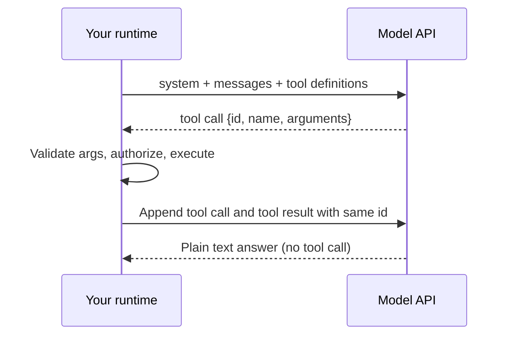
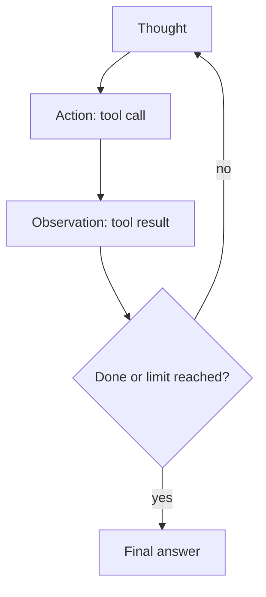
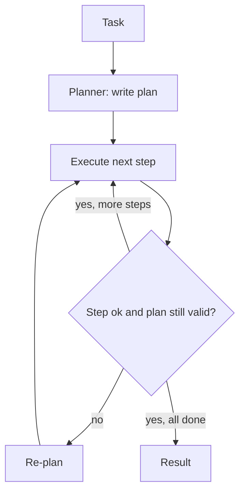
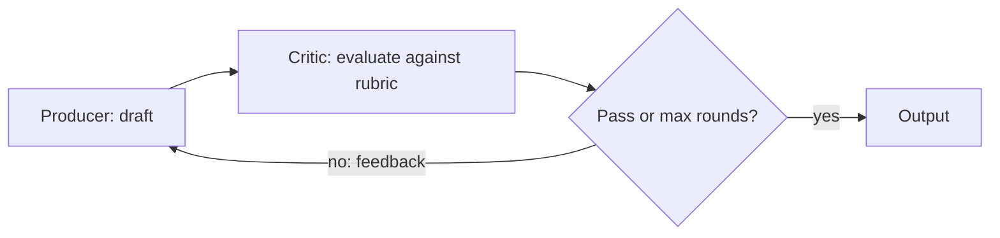
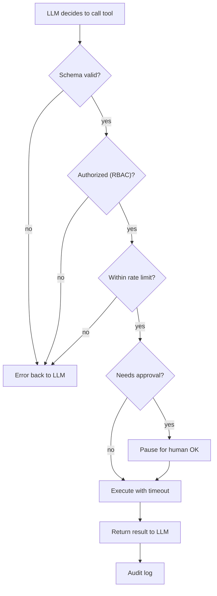
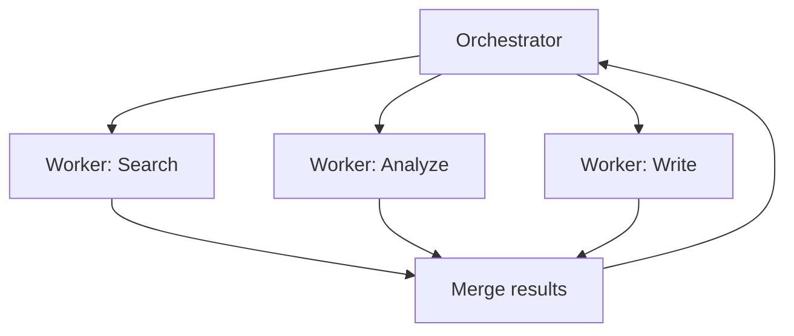

# 🤖 AI Agent Fundamentals — Architectures, Patterns & Orchestration

> **Target:** Staff/Principal Engineer | **Focus:** Production-grade agent system design from first principles | **Reviewed:** October 2026

---

## 1. WHAT IS AN AI AGENT?

!!! tip "30-second answer"
    An agent is **an LLM running in a loop that chooses its own next action**: it reads the goal and the context, emits a tool call (structured JSON the runtime executes), sees the result, and repeats until it decides it is done or hits a budget. The model supplies the *decisions*; your code supplies the tools, the loop, the limits, the state and the permissions. Most of the engineering is in the second half.

An **AI agent** is a system that uses an LLM to reason, plan, and execute actions in pursuit of a goal. Unlike a chatbot that only generates text, an agent can:

- **Reason** about its goal and break it into sub-tasks
- **Use tools** to interact with external systems (databases, APIs, file systems)
- **Maintain memory** across interactions (conversation history, state, learned facts)
- **Execute actions** and observe their results
- **Adapt** its plan based on new information or errors

```
User Goal
    │
    ▼
┌─────────────────────────────────────────────────────┐
│                    AI AGENT                           │
│                                                       │
│  ┌─────────┐  ┌──────────┐  ┌────────┐  ┌────────┐ │
│  │ Perceive│→ │  Reason  │→ │  Plan  │→ │  Act   │ │
│  │ (Input) │  │ (LLM)    │  │ (Steps)│  │ (Tool) │ │
│  └─────────┘  └──────────┘  └────────┘  └────┬───┘ │
│       ▲                                       │     │
│       └─────────── Observe ←──────────────────┘     │
└─────────────────────────────────────────────────────┘
```

<p align="center">
  <video controls width="800" style="border-radius: 12px; box-shadow: 0 4px 24px rgba(0,0,0,0.3);" loop playsinline preload="metadata">
    <source src="../../../assets/videos/agent-react-loop.mp4" type="video/mp4" />
    Your browser does not support the video tag.
  </video>
  <br/>
  <em>🎬 Animated Agent ReAct Loop — Perceive → Reason → Plan → Act → Observe cycle with tool call pipeline. Click ▶ to play/pause. Created with <a href="https://remotion.dev">Remotion</a>.</em>
</p>

### 1.1 Agent vs Workflow

| Dimension | Workflow | Agent |
|-----------|----------|-------|
| **Execution** | Deterministic, predefined steps | Non-deterministic, LLM-decided |
| **Flexibility** | Fixed DAG of operations | Dynamic planning at runtime |
| **Reliability** | Highly predictable | Probabilistic, needs guardrails |
| **Complexity** | Simple, multi-step tasks | Open-ended, novel situations |
| **Best for** | Known processes, high-stakes | Exploration, adaptation, tool-use |
| **Example** | Document processing pipeline | Customer support ticket resolver |

**Rule of thumb:** Start with a workflow. Graduate to an agent only when the problem requires dynamic decision-making that can't be pre-programmed.

The useful vocabulary (from Anthropic's *Building effective agents*, now widely used) is a ladder of increasing autonomy:

| Rung | Who decides the control flow | Example |
|------|------------------------------|---------|
| Single LLM call (+ retrieval) | Your code | Classify a ticket |
| **Prompt chaining** | Your code, fixed sequence | Draft → check → translate |
| **Routing** | LLM picks one of N fixed paths | Send billing questions to the billing prompt |
| **Parallelization** | Your code fans out, then votes or merges | Run 3 graders, take the majority |
| **Orchestrator-workers** | LLM decomposes, code runs the workers | Multi-file code change |
| **Evaluator-optimizer** | LLM critiques and retries | Translation with a reviewer |
| **Agent** | LLM decides every step and when to stop | Open-ended debugging |

Every rung up buys flexibility and costs predictability, latency, tokens and testability. In an interview, justify the rung you pick.

### 1.2 How a tool call actually works

The model never executes anything. With native tool calling (Anthropic Messages `tools`, OpenAI Responses/Chat Completions `tools`), the loop is:

```
1. Request: system prompt + messages + tool definitions (name, description, JSON Schema)
2. Model reply: a structured tool call {id, name, arguments}  (stop_reason "tool_use" on Anthropic)
3. Your runtime: validate args → authorize → execute → capture result or error
4. Next request: append the model's tool call AND a tool result that references its id
5. Repeat until the model replies with plain text (no tool call) or you hit a limit
```

Consequences interviewers probe:

- **The API is stateless.** The whole transcript, including every tool result, is resent each turn, so cost grows roughly quadratically with turn count unless you use prompt caching, result truncation or compaction.
- **Tool definitions are prompt.** Names, descriptions and schemas consume tokens on every call and steer selection quality more than almost anything else.
- **Parallel tool calls:** one model turn can request several tools; run them concurrently and return all results together in the next message.
- **Errors are observations.** Return a tool error as a result (Anthropic: `is_error: true`) so the model can recover, rather than crashing the loop.
- **Schema guarantees:** strict/structured modes (Anthropic `strict: true`, OpenAI `strict` function schemas) make arguments schema-valid, but not *correct*; still validate business rules server-side.

*Figure: the model proposes tool calls; your runtime executes them and resends the transcript.*



---

## 2. CORE AGENT ARCHITECTURES

### 2.1 ReAct (Reasoning + Acting)

The most fundamental agent pattern. The LLM iterates through a loop of **Thought → Action → Observation**.

```
Loop:
  1. Thought: "I need to look up the user's account to check their subscription"
  2. Action: call_tool("query_database", {sql: "SELECT * FROM users WHERE id=123"})
  3. Observation: "User has 'basic' subscription, expires 2026-08-01"
  4. Thought: "The user's subscription is basic. I should offer an upgrade."
  5. Action: call_tool("send_message", {user_id: 123, message: "..."})
```

**When to use:** Interactive problem-solving, debugging, customer support — any scenario where the agent needs to adapt based on intermediate results.

**Key consideration:** The agent can loop indefinitely if not bounded. Always set a step limit *and* a token/cost budget.

**Then vs now:** the original ReAct paper (Yao et al., 2022) had the model write `Thought:` / `Action:` text that the harness parsed. Today the "Action" is a native structured tool call and the "Thought" is either visible text or the model's built-in reasoning (Anthropic adaptive thinking, OpenAI reasoning models). The loop is the same; the parsing failure mode is gone.

**Failure modes:** repeating the same failing call (detect identical consecutive calls), drifting off-goal over long runs (restate the goal, keep a task list in state), and acting on stale or injected tool output (treat tool results as untrusted data).

*Figure: the ReAct loop, bounded by a step limit and budget.*



### 2.2 Plan-and-Execute

The agent generates a complete plan **first**, then executes it step by step.

```
Phase 1 — Plan:
  "To analyze this sales report, I will:
    1. Read the CSV file
    2. Compute monthly aggregates
    3. Identify top-5 products
    4. Generate a summary chart
    5. Email the report"

Phase 2 — Execute:
  Step 1: read_file("sales_report.csv") → data
  Step 2: call_tool("aggregate", {data, group: "month"})
  Step 3: call_tool("top_n", {data, n: 5, metric: "revenue"})
  ...
```

**When to use:** Complex, multi-step tasks that benefit from upfront planning (data analysis, research reports, code generation).

**Advantage:** More predictable and observable than ReAct. Easier to audit and resume after failures.

**Disadvantage:** The plan may be wrong from the start, wasting time on a bad plan.

**Fix in practice:** allow *re-planning* when a step fails or an observation contradicts the plan, and use a cheaper model for executing well-specified steps while the stronger model plans.

*Figure: plan first, execute step by step, re-plan when a step fails.*



### 2.3 Orchestrator-Worker

A central **orchestrator** agent decomposes tasks and delegates to specialized **worker** agents.

```
                  ┌──────────────────┐
                  │   Orchestrator    │
                  │  (Task Decomposer)│
                  └──┬────┬────┬─────┘
                     │    │    │
          ┌──────────┘    │    └──────────┐
          ▼               ▼               ▼
    ┌──────────┐   ┌──────────┐   ┌──────────┐
    │ Worker A │   │ Worker B │   │ Worker C │
    │ (Search) │   │ (Analyze)│   │ (Write)  │
    └──────────┘   └──────────┘   └──────────┘
```

**When to use:** Complex tasks requiring multiple distinct capabilities (research + analysis + writing). Common in enterprise automation.

**Key challenge:** Workers can run in parallel or sequentially, and the orchestrator must merge results coherently.

**Why it works:** each worker gets a fresh, focused context window instead of one context bloated with every intermediate result. **Why it costs:** tokens multiply. Anthropic reported its multi-agent research system used roughly 15x the tokens of a chat interaction, so it only pays off for high-value, parallelizable tasks. Workers also lose context the orchestrator had, so the delegation message must be self-contained (objective, output format, boundaries, tools).

### 2.4 Reflection (Critic-Refiner)

A two-agent loop where a **producer** generates output and a **critic** evaluates it against quality rubrics.

```
Loop:
  1. Producer generates draft answer
  2. Critic evaluates: "Missing citations. Fact 2 is unsupported."
  3. Producer revises based on feedback
  4. Repeat until critic passes or max iterations reached
```

**When to use:** Code generation, writing, any task where quality iteration matters more than speed.

**Trade-off:** each critique round adds a full generate-and-review cycle of latency and tokens. It helps most when the critic has a signal the producer lacked: tests to run, a linter, a rubric, retrieved sources. A critic that is the same model with no new information often just rubber-stamps or churns. Cap the rounds.

*Figure: producer and critic loop until the critic passes or rounds run out.*



### 2.5 Memory-Augmented Agent

An agent with explicit **memory systems** — short-term (conversation), working (task context), and long-term (learned facts, user preferences).

```
┌──────────────────────────────────────────┐
│              AGENT MEMORY                 │
│                                            │
│  ┌──────────────┐  ┌────────────────────┐ │
│  │ Short-term    │  │ Working Memory     │ │
│  │ (last N turns)│  │ (current task ctx) │ │
│  └──────────────┘  └────────────────────┘ │
│  ┌──────────────┐  ┌────────────────────┐ │
│  │ Long-term     │  │ Episodic Memory    │ │
│  │ (facts, prefs)│  │ (past resolutions) │ │
│  └──────────────┘  └────────────────────┘ │
└──────────────────────────────────────────┘
```

---

## 3. TOOL-USE PATTERNS

### 3.1 Tool Registry & Schema

Every tool an agent can call must be registered with a strict schema:

```python
@dataclass
class ToolSpec:
    name: str                      # Unique, descriptive name
    description: str               # What the tool does (for LLM consumption)
    input_schema: dict             # JSON Schema for parameters
    output_schema: Optional[dict]  # Expected output shape
    requires_approval: bool = False  # Human-in-the-loop?
    timeout_seconds: int = 30
    rate_limit_rps: float = 10     # Max calls per second
```

**Tool design matters more than the loop.** Fewer, well-scoped tools beat many overlapping ones; names and descriptions should say *when* to use the tool and what it returns; return concise, high-signal results (paginate or summarize large payloads) because every byte goes back into the context. With very large tool catalogues, load tools on demand (tool search) instead of sending every schema on every call.

### 3.2 Tool Categories

| Category | Examples | Security Model |
|----------|----------|---------------|
| **Read-only** | `query_database`, `read_file`, `search_web` | Read-only credentials, output filtering |
| **Write** | `send_email`, `create_ticket`, `update_record` | Human approval for high-impact writes |
| **Idempotent** | `set_status("closed")`, `upsert_record` | Has side effects, but repeating the call gives the same end state, so it is safe to retry. Make non-idempotent writes retry-safe with an idempotency key |
| **Destructive** | `delete_record`, `drop_table` | Always requires human approval |

### 3.3 Tool Call Lifecycle

```
LLM decides to call tool
    │
    ▼
1. Schema Validation — Reject if params don't match schema
    │
    ▼
2. Authorization — Check RBAC permissions
    │
    ▼
3. Rate Limit — Check per-client rate limits
    │
    ▼
4. Approval — If requires_approval, pause for human OK
    │
    ▼
5. Execute — Run with timeout
    │
    ▼
6. Observe — Return result to LLM (or error)
    │
    ▼
7. Audit — Log full trace: prompt, params, result, latency
```

*Figure: every tool call passes validation, authorization, limits and approval before it runs.*



---

## 4. MEMORY SYSTEMS

### 4.1 Short-Term Memory (Conversation Context)

The LLM's context window. Managed via:

- **Sliding window:** Keep last N turns, drop oldest
- **Summary compression (compaction):** Summarize early turns; some APIs now do this server-side (e.g. Anthropic's compaction beta)
- **Tool-result clearing:** Drop or truncate old, bulky tool outputs once they have been used (Anthropic "context editing")
- **Token budget:** Cap each section (system, tools, retrieved docs, history, tool results) explicitly. The split is workload-specific; measure rather than copying a fixed ratio. Leave headroom for the response and reasoning tokens

### 4.2 Working Memory (Task Context)

Temporary state for the current task:

```python
@dataclass
class WorkingMemory:
    current_goal: str
    completed_steps: List[str]
    remaining_steps: List[str]
    intermediate_results: Dict[str, Any]
    errors: List[str]
```

### 4.3 Long-Term Memory (Persistent Facts)

Stored externally and retrieved on demand:

```python
class LongTermMemory:
    def __init__(self):
        self.store = {}  # Could be Redis, PostgreSQL, or vector DB
    
    def remember(self, key: str, value: Any, ttl: Optional[int] = None):
        """Store a fact with optional TTL."""
        self.store[key] = {
            "value": value,
            "expires": time.time() + ttl if ttl else None
        }
    
    def recall(self, key: str) -> Optional[Any]:
        """Retrieve a stored fact if not expired."""
        entry = self.store.get(key)
        if entry and (entry["expires"] is None or time.time() < entry["expires"]):
            return entry["value"]
        return None
    
    def search_by_similarity(self, query: str, top_k: int = 5) -> List[Dict]:
        """Semantic search over stored facts (uses embeddings)."""
        # Encode query, find nearest neighbors in vector space
        pass
```

Two rules that interviewers check: **scope long-term memory per user/tenant** (a shared store leaks data across users), and **treat writes to memory as a security boundary** (an injected instruction saved as a "fact" will be replayed into every future session: memory poisoning).

### 4.4 Episodic Memory (Past Resolutions)

Store how similar problems were solved before:

```python
episodic_memory.store(
    problem="Database connection timeout",
    resolution="Applied exponential backoff with jitter",
    outcome="successful",
    tags=["database", "networking", "retry"]
)
```

---

## 5. MULTI-AGENT PATTERNS

### 5.1 Delegation Pattern

One agent delegates sub-tasks to specialized agents:

```
Orchestrator: "Research the latest AI chip benchmarks"
    ├── Worker(Search): "Find Q1 2026 GPU benchmarks"
    ├── Worker(Analyze): "Compare performance/Watt across vendors"
    └── Worker(Write): "Generate executive summary"
```

*Figure: an orchestrator delegates to workers with isolated contexts and merges their results.*



### 5.2 Debate Pattern

Two agents debate a question, improving answer quality:

```
Agent A (Pro): "Use PostgreSQL — ACID compliance, mature tooling, 20 years of optimization"
Agent B (Con): "Use MongoDB — schema flexibility, horizontal scaling, better for document data"
Synthesizer: "For this use case (heterogeneous document data with infrequent joins),
              MongoDB is the better choice due to schema flexibility, but PostgreSQL
              would be preferred if query complexity increases."
```

### 5.3 Hierarchical Pattern

```
                    ┌──────────────────┐
                    │   CEO Agent       │
                    │ (High-level goal) │
                    └───────┬──────────┘
                            │
              ┌─────────────┼─────────────┐
              ▼             ▼             ▼
     ┌────────────┐ ┌────────────┐ ┌────────────┐
     │ Product    │ │ Engineering│ │  Ops       │
     │ Manager    │ │  Lead      │ │  Lead      │
     └──────┬─────┘ └──────┬─────┘ └──────┬─────┘
            │              │              │
       ┌────┴────┐   ┌────┴────┐    ┌────┴────┐
       │ PM-1    │   │ Dev-1   │    │ Infra-1 │
       │ PM-2    │   │ Dev-2   │    │ Infra-2 │
       └─────────┘   └─────────┘    └─────────┘
```

Deep org-chart hierarchies look appealing but compound errors and latency at every level, and each hand-off loses context. In practice, one level of orchestrator → workers covers most real systems; add depth only with evidence.

---

## 6. AGENT FRAMEWORKS COMPARISON (2026)

Frameworks churn quickly; know the *shape* of each and why you would pick one, not version trivia.

| Framework | Model | Best for | Notes |
|-----------|-------|----------|-------|
| **LangGraph** (1.x) | Explicit graph/state machine with checkpointing | Long-running, resumable, human-in-the-loop workflows | Durable state per `thread_id`, `interrupt()` for approvals. LangChain v1's `create_agent` runs on it |
| **OpenAI Agents SDK** | Agents + tools + handoffs + guardrails + tracing | Multi-agent handoffs, quick start on OpenAI's Responses API | Supports MCP servers; other providers via adapters |
| **Claude Agent SDK** (Anthropic) | The Claude Code harness as a library: built-in file/shell/web tools, subagents, hooks | Coding and file-system agents on your own infra | MCP-native. Distinct from the Messages API "tool runner" helper |
| **Google ADK** | Hierarchical agents, workflow agents | GCP/Vertex-centric stacks | MCP and A2A support |
| **Pydantic AI** | Type-safe agents, validated structured outputs | Python teams that want typing and testability | Provider-agnostic, MCP support |
| **CrewAI** | Role-based crews | Fast prototyping of role-play multi-agent flows | Less control over the loop |
| **No framework** | Your own `while` loop over the provider SDK | Simple agents, maximum control and debuggability | Often the right answer: the loop is ~50 lines |

**What interviewers probe:** "Why a framework at all?" Good answer: you want durable state, resumability, human approval, streaming and tracing without building them. Bad answer: "because everyone uses it". The cost is abstraction you must debug through and churn you must track.

**Protocols to name:** **MCP** (Model Context Protocol) standardizes how an agent host connects to tool/data servers (tools, resources, prompts) over stdio or Streamable HTTP; it turns N agents × M tools integrations into N + M. **A2A** (Agent2Agent) targets agent-to-agent delegation across vendors. Neither does orchestration for you.

---

## 7. PRODUCTION READINESS CHECKLIST

| Requirement | Implementation |
|------------|---------------|
| **Bounded execution** | Step limit (tuned per task, often 10-30) plus a token/cost budget and a wall-clock timeout |
| **Human-in-the-loop** | Approval gate for irreversible or high-impact actions; durable pause/resume |
| **Least privilege** | Per-tool scoped credentials, per-user authorization, no ambient admin tokens |
| **Prompt-injection posture** | Treat tool output and retrieved text as untrusted data; separate read and write tools; confirm side effects |
| **Rate limiting** | Per-user and per-provider limits; backoff on 429s |
| **Observability** | Trace every model call and tool call (OpenTelemetry GenAI conventions), with tokens, latency, cost |
| **Error recovery** | Retry transient errors with backoff and jitter; idempotency keys on writes; circuit breakers on flaky tools |
| **Context management** | Caching of stable prefixes, truncation/compaction of history and tool results |
| **Evaluation** | Offline eval set (task success, trajectory checks) run in CI on every prompt/model/tool change, plus online monitoring |

---

## 8. WHAT INTERVIEWERS PROBE NEXT

- **"Workflow or agent here?"** Show you can name the cheapest rung that works and what would make you move up.
- **"How do you stop it looping or running up a bill?"** Step and token budgets, repeated-call detection, a final "give up and escalate" path.
- **"How do you test something non-deterministic?"** Fixed eval sets with graded outcomes, trajectory assertions on tool choice, LLM-as-judge calibrated against human labels, pass@k for reliability.
- **"What happens when a tool returns malicious text?"** Indirect prompt injection: the model may follow it. Mitigate with least privilege, approvals on writes and output filtering; you cannot fully solve it with prompting.
- **"Single agent or multi-agent?"** Single by default; multi-agent when sub-tasks are parallel and context isolation helps, accepting the token multiplier.

---

> **Next:** [Agent Interview Questions](02_AGENT_INTERVIEW_QUESTIONS.md) → Staff/Principal-level Q&A
