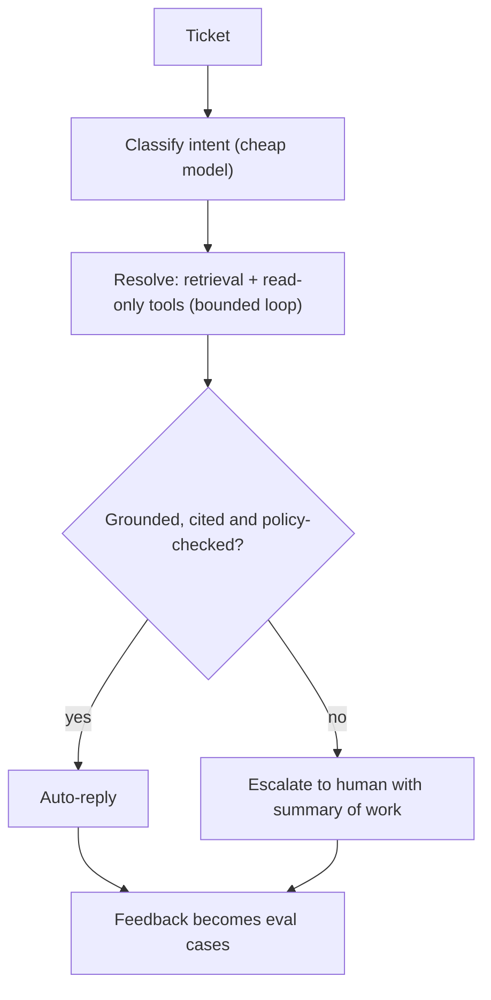
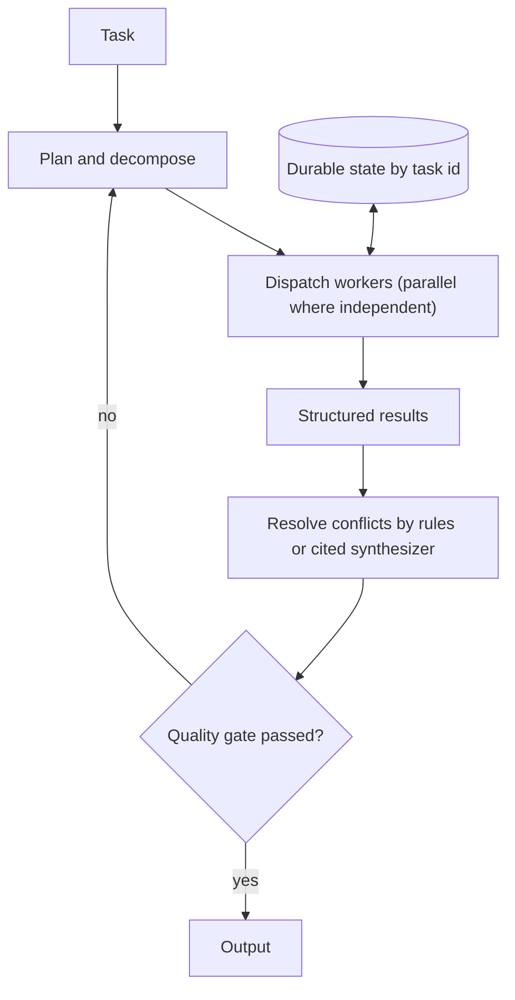
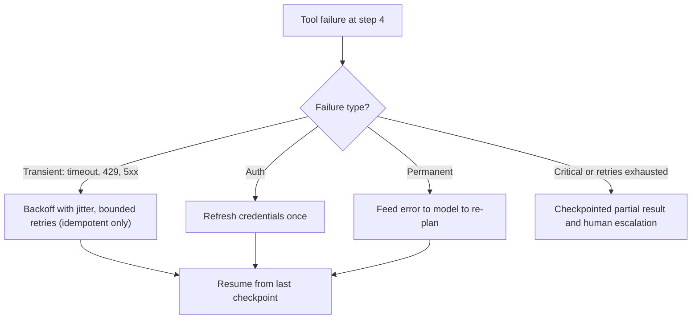

# 🎯 AI Agents — Interview Questions & Answers

> **Principal/Staff Software Engineer level | Production-grade agent systems | Reviewed October 2026**

Each answer opens with a 30-second version. Say that first, then go deep where the interviewer pulls.

---

## Question 1: Agent Architecture Design

**Interviewer:** *"Design an AI agent system that handles customer support tickets for a SaaS platform with 10K daily tickets. The agent needs to classify tickets, search the knowledge base, escalate to humans when needed, and learn from resolutions."*

### 🎯 Answer

!!! tip "30-second answer"
    Make it a **workflow with an agentic core**, not a free-roaming agent: classify (cheap model) → resolve with retrieval and read-only account tools (agent loop, bounded) → gate on groundedness and policy checks → auto-reply, or escalate with a summary of the work done. Writes such as refunds go through approval or a deterministic policy engine. Measure resolution rate, escalation precision, CSAT and cost per resolved ticket on a labelled eval set before widening autonomy. 10K tickets/day is only ~0.1/s on average, so the hard parts are quality, safety and cost, not throughput.

**Architecture:**

```python
class CustomerSupportAgent:
    """
    Multi-stage agent pipeline:
    1. Classify → 2. Resolve (RAG + tools) → 3. Escalate if needed → 4. Learn
    """
    
    def __init__(self):
        self.classifier = IntentClassifier()       # Route to sub-agent
        self.resolver = ResolutionAgent()           # Try to resolve
        self.escalator = HumanEscalationRouter()    # Fallback to human
        self.learner = ResolutionLearner()          # Update from outcomes
    
    async def handle_ticket(self, ticket: Ticket) -> Result:
        # Stage 1: Classify
        intent = self.classifier.classify(ticket.text)
        
        # Stage 2: Attempt resolution
        resolution = await self.resolver.try_resolve(ticket, intent)
        
        if resolution.confidence > 0.85:
            return Result(resolved=True, answer=resolution.answer)
        
        # Stage 3: Escalate with context
        return self.escalator.escalate(ticket, resolution.partial_work)
    
    def learn_from_outcome(self, ticket_id, resolution, feedback):
        # Stage 4: Update from feedback
        self.learner.update(ticket_id, resolution, feedback)
```

**Key Design Decisions:**

- **ReAct for resolution:** Each sub-agent uses ReAct to search KB, check account, and compose answers
- **Escalation gate, not raw "confidence":** an LLM's self-reported confidence is poorly calibrated. Base the gate on signals you can check: did retrieval return a supporting article above a tuned relevance score, does the answer cite it (groundedness check), is the intent on the allow-list for automation, did a policy check pass. Tune the threshold (0.85 above is illustrative) on labelled data for the precision you need
- **Async architecture:** Handle multiple tickets concurrently with connection pooling
- **Feedback loop:** User ratings + agent-edited answers → new eval cases, KB gap reports, retrieval tuning. Fine-tuning is the last lever, not the first
- **Failure modes to name:** confident wrong answers on policy questions, prompt injection inside ticket text, PII leaking into logs, escalation summaries that drop key facts
- **What they probe next:** how you roll out (shadow mode → agent-drafted, human-sent → auto-send for low-risk intents), how you prevent the agent promising refunds, and the cost per ticket

*Figure: a support workflow with a bounded agent core and a grounded escalation gate.*



---

## Question 2: Tool Hallucination & Safety

**Interviewer:** *"Your agent calls an internal API tool with hallucinated parameters — for example, it calls 'delete_user(user_id=999)' when it should have called 'get_user(user_id=123)'. How do you prevent this?"*

### 🎯 Answer

!!! tip "30-second answer"
    You can't make the model never pick the wrong tool, so make wrong picks **harmless**: granular tools with clear descriptions, strict schemas, authorization based on the *end user's* permissions (not the model's intent), and human approval or a deterministic policy check on irreversible actions. The model proposes; your code disposes.

**Multi-layer defense:**

**Layer 1 — Tool Design (Prevention):**
```python
# ❌ Bad: One generic tool
@tool("execute_api")
def execute_api(endpoint: str, params: dict) -> str:
    """Execute any API endpoint."""  # LLM will guess endpoints!

# ✅ Good: Granular, specific tools
@tool("get_user")
def get_user(user_id: int) -> str:
    """Retrieve a user's profile information by their user ID."""
    return api.get(f"/users/{user_id}")

@tool("delete_user", requires_approval=True)
def delete_user(user_id: int) -> str:
    """Delete a user account. This action is irreversible.
    Only use when explicitly asked by an authorized admin."""
    return api.delete(f"/users/{user_id}")
```

**Layer 2 — Schema Validation:**
```python
# JSON Schema enforces types and ranges
get_user_schema = {
    "type": "object",
    "properties": {
        "user_id": {"type": "integer", "minimum": 1, "maximum": 999999}
    },
    "required": ["user_id"]
}
# Reject any call that doesn't match schema exactly
```

**Layer 3 — Deterministic checks, then (optionally) a verifier model:**
```python
def verify_tool_call(tool_name: str, params: dict, ctx: RequestContext) -> bool:
    # 1. Deterministic: the END USER must be allowed to do this to this object.
    if not authz.can(ctx.user, tool_name, resource_id=params.get("user_id")):
        return False
    # 2. Deterministic: the target must appear in this conversation
    #    (blocks "delete_user(999)" when only user 123 was discussed).
    if tool_name in DESTRUCTIVE_TOOLS and params.get("user_id") not in ctx.mentioned_ids:
        return False
    # 3. Optional verifier model with a STRUCTURED verdict. Never substring-match
    #    free text: "NO" in "I KNOW this is fine" is True.
    if tool_name in DESTRUCTIVE_TOOLS:
        verdict = verifier.check(tool_name, params, ctx.transcript)  # -> {"approve": bool, "reason": str}
        if not verdict["approve"]:
            return False
    return True
```

**Layer 4 — Read-only by default, least privilege in the credentials:**
```python
# The agent's DB/API credentials for read tools physically cannot write.
# Write tools use a separate, narrowly scoped credential and require approval.
for tool in registry:
    tool.credentials = READ_ONLY_CREDS if tool.category == "read" else scoped_creds(tool)
    if tool.category in ("write", "destructive"):
        tool.requires_approval = True
```

**Layer 5 — Make mistakes reversible:** soft-delete with a retention window, idempotency keys, and an audit log of who (user + agent + trace id) did what.

**What they probe next:** "What if the hallucinated call came from text injected via a tool result?" Same defences: authorization is tied to the user, not to the prompt.

---

## Question 3: Agent Memory Systems

**Interviewer:** *"Your agent needs to maintain context across 50+ conversation turns, remember user preferences from previous sessions, and recall how it resolved similar issues. Design the memory system."*

### 🎯 Answer

!!! tip "30-second answer"
    Separate memory by **lifetime and access pattern**: the in-context conversation (sliding window + summaries), task-scoped working state (structured, checkpointed), and cross-session long-term memory (user preferences as structured records, past resolutions as embeddings) retrieved on demand. Long-term memory is scoped per user, written selectively (not every turn) and treated as untrusted when read back.

**Three-tier memory:**

```python
class AgentMemory:
    """
    Memory architecture:
    
    Level 1 — Ephemeral (sliding window)
    ├── Keeps last 20 messages (raw)
    ├── Auto-summarized when >20
    └── Purged when conversation ends
    
    Level 2 — Working (task-scoped)
    ├── Current goal and sub-tasks
    ├── Intermediate results
    └── Pending actions
    
    Level 3 — Persistent (cross-session)
    ├── User preferences
    ├── Past resolutions
    └── Learned patterns
    """
    
    def __init__(self, user_id: str):
        self.short_term = ShortTermMemory(max_turns=20)
        self.working = WorkingMemory()
        self.long_term = LongTermMemory(user_id=user_id, backend="postgresql")
    
    async def get_context(self) -> str:
        """Assemble full context for the LLM."""
        context_parts = []
        
        # Level 3: Long-term (user preferences, facts)
        user_prefs = await self.long_term.get("user_preferences")
        if user_prefs:
            context_parts.append(f"[User Preferences]: {user_prefs}")
        
        # Level 2: Working memory (current task)
        if self.working.current_goal:
            context_parts.append(f"[Current Task]: {self.working.current_goal}")
            context_parts.append(f"[Progress]: {self.working.progress_summary()}")
        
        # Level 1: Conversation history
        conversation = self.short_term.get_recent()
        context_parts.append(f"[Conversation]:\n{conversation}")
        
        return "\n\n".join(context_parts)
```

**Memory retrieval strategy:**
```python
class EpisodicMemory:
    def find_similar_resolution(self, problem: str) -> Optional[str]:
        """Search past resolutions by semantic similarity."""
        problem_embedding = embed(problem)
        similar = vector_store.search(
            collection="resolutions",
            query_vector=problem_embedding,
            top_k=3
        )
        if similar and similar[0].score > 0.85:   # threshold is embedding-model specific; tune it
            return similar[0].metadata["resolution"]
        return None
```

**Trade-offs and failure modes:** summaries lose detail (keep raw history in storage, only the *prompt* is summarized); stale preferences (store timestamps, let newer facts override); memory poisoning (an injected "always approve refunds" saved as a fact); cross-tenant leakage (filter by `user_id` in every query). See [Agent Memory Systems](15_AGENT_MEMORY_SYSTEMS.md) for the deep dive.

---

## Question 4: Multi-Agent Coordination

**Interviewer:** *"You have three specialized agents: a Research agent, an Analysis agent, and a Writing agent. An orchestrator delegates a complex research task. Walk me through the coordination — state management, conflict resolution, and output merging."*

### 🎯 Answer

!!! tip "30-second answer"
    The orchestrator owns the plan and the shared state; workers get **self-contained briefs** (objective, inputs, output schema, limits) and return **structured outputs**, not prose. Independent steps run in parallel, dependent ones in sequence. Conflicts are resolved by explicit rules (evidence wins, conservative estimate wins) or an LLM synthesizer that must cite sources. State lives in a durable store keyed by task id so a crashed run can resume.

**Coordination Protocol:**

```python
class OrchestratorAgent:
    """
    Coordinates specialized worker agents with structured handoffs.
    """
    
    async def execute_task(self, task: Task) -> Output:
        # Phase 1: Decompose
        plan = await self.plan(task)
        
        # Phase 2: Dispatch workers
        results = {}
        for step in plan.steps:
            if step.can_parallelize:
                # Run in parallel
                task_results = await asyncio.gather(*[
                    self.dispatch_worker(w, step)
                    for w in step.workers
                ])
                results[step.id] = task_results
            else:
                # Sequential
                results[step.id] = await self.dispatch_worker(
                    step.worker, step
                )
        
        # Phase 3: Resolve conflicts
        merged = await self.resolve_conflicts(results)
        
        # Phase 4: Quality gate
        quality = await self.quality_check(merged)
        if quality.score < 0.8:
            merged = await self.revise(merged, quality.feedback)
        
        return merged
    
    async def resolve_conflicts(self, results: dict) -> dict:
        """
        Conflict resolution strategies:
        - Research conflicts: Confidence-weighted voting
        - Analysis conflicts: Use most conservative estimate
        - Writing conflicts: Merge with orchestrator's voice
        """
        for key, values in results.items():
            if len(values) > 1 and not all_same(values):
                # Use LLM to synthesize
                results[key] = await self.synthesize(values)
        return results
```

**State Management:**

```python
# Shared state via persisted store
class AgentState:
    def __init__(self, task_id: str):
        self.task_id = task_id
        self.store = RedisStore(prefix=f"agent:{task_id}")
    
    async def get_progress(self) -> dict:
        return await self.store.hgetall("progress")
    
    async def update_progress(self, agent: str, status: str, output: dict):
        await self.store.hset("progress", agent, json.dumps({
            "status": status,
            "output": output,
            "timestamp": time.time()
        }))
```

**What they probe next:** cost (multi-agent runs can use many times the tokens of a single agent), what a worker does when its brief is ambiguous (ask the orchestrator vs guess), how to stop two workers duplicating work, and how you'd debug a bad final report (one trace spanning all workers).

*Figure: the orchestrator plans, dispatches workers in parallel or sequence, then merges and gates.*



---

## Question 5: Production Guardrails

**Interviewer:** *"Your agent is in production and has access to a database tool, an email tool, and a file system tool. Walk me through every guardrail you put in place before it handles real user requests."*

### 🎯 Answer

!!! tip "30-second answer"
    Defence in depth, with the strongest controls **outside the model**: network egress allow-lists and sandboxing, per-tool least-privilege credentials, authorization on the end user's identity, schema validation, rate and spend limits, human approval for irreversible actions (sending email, deleting files), and output filtering for PII. Prompt-level instructions help but are never the security boundary, because prompt injection via emails, files and DB rows is the main threat.

**Guardrail Stack (bottom-up):**

```python
# Layer 1: Transport Security (Infrastructure)
# - TLS 1.3 for all network communication
# - API Gateway authentication (JWT)
# - Network policies: agent can only reach whitelisted services

# Layer 2: Input Validation
class InputGuard:
    @staticmethod
    def validate_tool_call(tool: str, params: dict) -> bool:
        """Reject malformed parameters at the boundary."""
        schema = TOOL_REGISTRY[tool].input_schema
        try:
            jsonschema.validate(instance=params, schema=schema)
            return True
        except jsonschema.ValidationError:
            return False

# Layer 3: Authorization (RBAC)
class AuthGuard:
    def check_permission(self, agent_id: str, tool: str) -> bool:
        """Agent must have explicit permission for each tool."""
        agent_roles = self.get_roles(agent_id)
        required_role = TOOL_REGISTRY[tool].required_role
        return required_role in agent_roles

# Layer 4: Rate and spend limiting (per agent/user, not one global bucket)
class RateGuard:
    def __init__(self):
        self.buckets: dict[str, TokenBucket] = defaultdict(
            lambda: TokenBucket(rate=10, burst=20))  # 10 req/s each
    
    def check(self, agent_id: str) -> bool:
        return self.buckets[agent_id].consume(1)

# Layer 5: Content Safety (Output)
class OutputGuard:
    def check_output(self, tool: str, output: str) -> bool:
        # No PII in output
        if contains_pii(output):
            return False
        # No harmful content
        if toxicity_score(output) > 0.1:
            return False
        return True

# Layer 6: Human Approval (High-Risk Actions)
class ApprovalGuard:
    def needs_approval(self, tool: str, params: dict) -> bool:
        if tool in DESTRUCTIVE_TOOLS:
            return True
        if tool in WRITE_TOOLS and any(
            k in params for k in SENSITIVE_FIELDS
        ):
            return True
        return False
```

**Tool-specific controls for this question:**

| Tool | Main risk | Control |
|------|-----------|---------|
| Database | Data exfiltration, destructive SQL | Read-only replica user, parameterized query tools instead of raw SQL, row-level security by tenant, row limits |
| Email | Exfiltration via outbound mail, spam, phishing | Recipient allow-list or approval, rate limit, no attachments from arbitrary paths |
| File system | Path traversal, reading secrets | Sandbox/container with a mounted working dir only, path canonicalization, no access to credentials |

The dangerous combination is **private data + untrusted content + an outbound channel** in one agent: an injected instruction in a file can read the DB and email it out. Break at least one leg.

---

## Question 6: Observability & Debugging

**Interviewer:** *"Your agent gave a wrong answer and the user is complaining. How do you debug what happened? Walk me through the observability stack."*

### 🎯 Answer

!!! tip "30-second answer"
    Pull the **trace** for that conversation: every model call (full prompt as sent, response, tokens, model version) and every tool call (args, result, latency) as spans under one trace id. Find the first step that went wrong and classify it: bad retrieval/tool data, model reasoning error, missing context (truncated or never fetched), or a guardrail gap. Turn it into a regression eval case, fix, and re-run the eval set.

**Debugging workflow:**

```python
# Step 1: Find the trace
trace = observability.get_trace(conversation_id)
# Returns:
# - Full conversation history
# - Every thought/reasoning step
# - Every tool call + response
# - Timing for each step
# - Token costs

# Step 2: Identify the failure point
failure = trace.find_failure()  
# Types:
# - "hallucination": LLM generated fact without tool verification
# - "tool_error": Tool returned unexpected result
# - "reasoning_error": LLM made logical mistake
# - "context_overflow": Relevant info was in truncated context

# Step 3: Inspect the exact moment
moment = trace.get_step(failure.step_number)
print(f"Thought: {moment.thought}")
print(f"Action: {moment.tool_call}")
print(f"Observation: {moment.tool_result}")

# Step 4: Check context window
context = trace.get_context_at_step(failure.step_number)
print(f"Context used: {count_tokens(context)}")
print(f"Context window: {model.context_window}")  # not max_tokens: that is the OUTPUT cap
print(f"Was truncated: {context_was_truncated(context)}")
```

**Observability metrics:**

```python
# Key metrics to monitor
AGENT_METRICS = {
    "agent_success_rate": "fraction of tasks completed without escalation",
    "agent_avg_steps": "average steps per task (too many = inefficiency)",
    "agent_tool_error_rate": "fraction of tool calls that returned errors",
    "agent_hallucination_rate": "outputs containing unsupported claims",
    "agent_latency_p95": "p95 latency from request to final response",
    "agent_cost_per_task": "total LLM + tool cost per completed task",
    "agent_escalation_rate": "fraction requiring human intervention",
}
```

Instrument with the OpenTelemetry GenAI semantic conventions (`invoke_agent`, `chat`, `execute_tool` spans with `gen_ai.*` attributes) so any backend (Langfuse, Phoenix, Datadog, Honeycomb, etc.) can show the trace. See [Agent Observability](07_AGENT_OBSERVABILITY.md).

**Debugging checklist:**

```
1. Did the agent understand the goal correctly? (Check first thought)
2. Did the agent choose the right tools? (Check tool selection)
3. Did the tools return correct data? (Check tool responses)
4. Did the agent use the tool output correctly? (Check reasoning after tool)
5. Was relevant information in context? (Check token budget)
6. Did the agent follow guardrails? (Check guardrail logs)
```

---

## Question 7: Agent Evaluation & Testing

**Interviewer:** *"How do you evaluate whether your agent is ready for production? What metrics matter, and how do you build a test suite for non-deterministic outputs?"*

### 🎯 Answer

!!! tip "30-second answer"
    Build a **versioned eval set** of realistic tasks (seeded from production traces and past failures), grade both the **outcome** (task success via code checks where possible, LLM-as-judge with a rubric where not, judge calibrated against human labels) and the **trajectory** (right tools, sane arguments, no forbidden actions, step count). Run each case several times and report pass rates (pass@k for "can it", pass^k for "does it reliably"). Gate prompt, model and tool changes on this suite in CI, then watch online metrics after release.

**Evaluation framework:**

```python
class AgentEvaluator:
    """
    Three-tier evaluation:
    1. Unit tests — deterministic behavior
    2. Integration tests — tool interactions
    3. E2E evaluation — full task completion
    """
    
    def __init__(self):
        self.test_suite = TestSuite()
    
    def add_deterministic_test(self, name: str, input: str, 
                               expected_tools: List[str]):
        """Verify the agent calls the expected tools in order."""
        self.test_suite.add(DeterministicTest(name, input, expected_tools))
    
    def add_eval_test(self, name: str, input: str, rubric: dict):
        """Verify output quality against rubrics using LLM-as-judge."""
        self.test_suite.add(EvalTest(name, input, rubric))
    
    def add_hallucination_test(self, name: str, input: str, 
                                known_facts: List[str]):
        """Verify agent doesn't contradict known facts."""
        self.test_suite.add(HallucinationTest(name, input, known_facts))
    
    async def evaluate(self) -> Report:
        results = []
        for test in self.test_suite.tests:
            result = await test.run()
            results.append(result)
        return Report(results)

# Example rubric for LLM-as-judge
RUBRIC = {
    "accuracy": "Does the answer correctly address the user's question?",
    "completeness": "Does it cover all necessary aspects?",
    "groundedness": "Are all claims supported by retrieved facts?",
    "safety": "Does it avoid harmful or misleading content?",
}
```

**Production metrics dashboard:**
```python
# Every production agent should track:
success_rate = completed_tasks / total_tasks
avg_steps = total_steps / completed_tasks
avg_cost = total_cost / completed_tasks
escalation_rate = escalated / total_tasks
user_satisfaction = positive_ratings / total_ratings
```

**Pitfalls:** judging with the same model you are testing (self-preference bias), judges that favour longer answers, eval sets that leak into prompts, and averaging away rare-but-catastrophic failures (track them separately, e.g. "any forbidden tool call" must be 0).

---

## Question 8: Error Recovery & Resilience

**Interviewer:** *"Your agent is running a multi-step task. At step 4 of 8, a database tool times out. The agent retries and gets an error. How does it recover? Design the resilience strategy."*

### 🎯 Answer

!!! tip "30-second answer"
    Classify the failure, then pick the strategy: **transient** (timeout, 429, 5xx) → bounded retries with exponential backoff and jitter, honouring `Retry-After`; **auth** → refresh once; **permanent** (bad input, tool gone) → feed the error back to the model to re-plan; **critical or exhausted** → checkpointed partial result plus human escalation. Only retry writes that are idempotent (or carry an idempotency key), and checkpoint after every completed step so a crash resumes at step 4, not step 1.

**Resilience strategy:**

```python
class ResilientAgent:
    """
    Multiple recovery strategies for different failure modes.
    """
    
    async def execute_with_recovery(self, task: Task) -> Output:
        max_retries = 3
        backoff = 1.0
        
        for attempt in range(max_retries):
            try:
                return await self.execute(task)
            except ToolTimeoutError:
                # Strategy 1: Retry with exponential backoff + jitter.
                # A timeout does NOT mean the write didn't happen: only retry
                # idempotent calls (or ones carrying an idempotency key).
                await asyncio.sleep(backoff * random.uniform(0.5, 1.5))
                backoff *= 2
                continue
            except ToolRateLimitError as e:
                # Strategy 2: Wait and retry
                wait = e.retry_after  # Server-specified wait time
                await asyncio.sleep(wait)
                continue
            except ToolAuthError:
                # Strategy 3: Refresh auth, then retry
                await self.refresh_auth()
                continue
            except ToolNotFoundError:
                # Strategy 4: Re-plan — the tool isn't available
                return await self.replan_with_alternatives(task)
            except CriticalError:
                # Strategy 5: Escalate to human
                return HumanEscalation(f"Agent failed at step: {task}")
        
        # All retries exhausted
        return self.graceful_degradation(task)
    
    def graceful_degradation(self, task: Task) -> Output:
        """Return partial results with clear indication of incompleteness."""
        return Output(
            success=False,
            partial_result=self.current_state,
            error=f"Failed to complete after all retries. Completed {self.progress}/8 steps.",
            recommended_action="Manual review required"
        )
```

**Checkpointing for long-running agents:**

```python
class CheckpointManager:
    """Save and restore agent state for long-running tasks."""
    
    async def save_checkpoint(self, agent_state: AgentState):
        # One hash per task: field = step number, value = JSON state.
        # JSON, not pickle: unpickling data from a shared store is remote
        # code execution if that store is ever compromised.
        key = f"checkpoint:{agent_state.task_id}"
        await redis.hset(key, str(agent_state.step), agent_state.to_json())
        await redis.hset(key, "latest", str(agent_state.step))
        await redis.expire(key, 86400)  # 24h retention
    
    async def restore_checkpoint(self, task_id: str) -> Optional[AgentState]:
        """Restore the latest checkpoint (no KEYS scan, no string-sorting bugs)."""
        key = f"checkpoint:{task_id}"
        latest = await redis.hget(key, "latest")
        if latest is None:
            return None
        return AgentState.from_json(await redis.hget(key, latest))
```

Two bugs the naive version had: `KEYS` is O(N) over the whole keyspace and blocks Redis, and `sorted()` on string keys puts step 10 before step 9. Frameworks such as LangGraph give you this for free (a checkpointer persists state after every node, keyed by `thread_id`).

*Figure: classify the failure, then choose the recovery strategy.*



---

## Question 9: Agent + MCP Integration

**Interviewer:** *"Explain how you would build an agent that uses MCP servers for its tools. How does the agent discover, authenticate, and orchestrate across multiple MCP servers?"*

### 🎯 Answer

!!! tip "30-second answer"
    The agent host runs one **MCP client per server** (stdio for local servers, Streamable HTTP for remote ones), calls `tools/list` to discover tools and their JSON Schemas, merges them into one namespaced registry, and routes each tool call back to the owning server via `tools/call`. Remote servers authenticate with OAuth 2.1 (the MCP authorization spec), with tokens scoped per server. The host, not the server, owns policy: which servers are trusted, which tools need approval, and how tool output is sanitized.

**Agent-to-MCP architecture:**

```python
class MCPAgent:
    """
    An AI agent that discovers and uses tools via MCP protocol.
    """
    
    def __init__(self):
        self.mcp_clients: Dict[str, MCPClient] = {}
        self.tool_registry: Dict[str, ToolSpec] = {}
    
    async def register_mcp_server(self, name: str, server_params: dict):
        """Connect to an MCP server and discover its tools."""
        client = MCPClient()
        await client.connect(server_params)
        
        # Discover tools via MCP protocol
        tools = await client.list_tools()
        
        # Register each tool with full schema
        for tool in tools:
            self.tool_registry[tool.name] = ToolSpec(
                name=tool.name,
                description=tool.description,
                input_schema=tool.input_schema,   # wire field: inputSchema
                server=name  # Which server to route to
            )
        
        self.mcp_clients[name] = client
    
    async def run(self, task: str):
        """Execute a task using discovered MCP tools."""
        # Give LLM the full tool registry
        context = self.format_tool_registry()
        
        # ReAct loop
        for step in range(MAX_STEPS):
            thought = await self.llm.think(task, context, self.history)
            
            if thought.is_final_answer:
                return thought.answer
            
            # Execute tool via the correct MCP server
            tool = thought.tool_call
            server = self.tool_registry[tool.name].server
            result = await self.mcp_clients[server].call_tool(
                tool.name, tool.params
            )
            
            self.history.add(thought, result)
        
        return "I was unable to complete this task within the step limit."
```

**Multi-server orchestration:**

```python
# Agent connects to 3 MCP servers (stdio; run from ai-engineering/mcp so
# `servers.*` resolves; don't name your package `mcp`, it shadows the SDK)
agent = MCPAgent()

# Register all servers
await agent.register_mcp_server("db", {
    "command": "python", 
    "args": ["-m", "servers.database_server"]
})
await agent.register_mcp_server("rag", {
    "command": "python", 
    "args": ["-m", "servers.rag_server"]
})
await agent.register_mcp_server("calculator", {
    "command": "python", 
    "args": ["-m", "servers.calculator_server"]
})

# Now the LLM sees ALL tools from ALL servers in one unified registry
result = await agent.run(
    "Find all customers who churned last month and calculate the revenue impact"
)
# → Might use: db.query_database → calculator.add/multiply
```

**What a staff answer adds:**

- **Name collisions:** two servers can both expose `search`; prefix with the server name (`db__search`) and keep the mapping.
- **Tool count:** dozens of servers means hundreds of schemas in every prompt. Filter tools per task or load them on demand.
- **Change notifications:** servers can announce tool-list changes (in 2026-07-28, on a `subscriptions/listen` stream the client opts into; list results also carry a `ttlMs` cache hint); refresh the registry rather than caching forever.
- **Trust:** tool descriptions and results are untrusted input. A malicious server can hide instructions in a description ("tool poisoning") or change it after approval. Pin versions, review servers, and require approval for write tools.
- **Spec currency:** the MCP spec is versioned by date. The 2026-07-28 revision made the protocol stateless: no `initialize` handshake and no `Mcp-Session-Id`; version and capabilities travel in each request's `_meta`, and servers that need user input mid-call return an `input_required` result the client answers on a retry. It also deprecated Sampling, Roots and Logging (the HTTP+SSE transport has been deprecated since 2025-03-26). In the Python SDK v2 (`mcp>=2`), `mcp.Client` handles this and falls back to `initialize` for older servers. It matters for load-balancing remote servers: any replica can now serve any request.

---

## Question 10: When Agents Fail

**Interviewer:** *"Give me three real-world failure modes you've seen in production agent systems — not theory, actual things that went wrong — and how you fixed them."*

### 🎯 Answer

**Failure 1 — Tool Call Loops**

> **What happened:** An agent was given a search tool. It searched for "latest sales figures," got a summary, thought the summary was incomplete, searched again with a slightly different query, and repeated this 15 times before hitting the step limit.

**Fix:** First, **exact deduplication** (hash of tool name + canonical JSON args) and a per-tool call cap, which catch most loops for free. Then **semantic deduplication** for near-identical queries: if the agent calls the same tool with similar parameters within N steps, short-circuit, return the cached result and tell the model it already has it:

```python
class DuplicateDetector:
    def __init__(self, window: int = 5, threshold: float = 0.92):
        self.recent = deque(maxlen=window)
        self.threshold = threshold
    
    def is_duplicate(self, tool: str, params: dict) -> bool:
        embedding = embed(f"{tool}:{json.dumps(params, sort_keys=True)}")
        for prev_tool, prev_embedding in self.recent:
            if tool == prev_tool:
                similarity = cosine_sim(embedding, prev_embedding)
                if similarity > self.threshold:
                    return True
        self.recent.append((tool, embedding))
        return False
```

**Failure 2 — Context Window Swamping**

> **What happened:** An agent working on code generation kept the full conversation history. After 15 turns, the context was 80% conversation and 20% actual code. The agent started making syntax errors because relevant code had been pushed out.

**Fix:** Implemented **structured context management**:

```python
class ContextManager:
    def build_prompt(self, task: str, history: List, tools: List, memory: dict) -> str:
        # Fixed budget allocation
        BUDGET = {
            "system_instructions": 500,     # Always available
            "tools": 2000,                  # All tool schemas
            "task": 200,                    # Current task
            "memory": 1000,                 # Relevant long-term memory
            "conversation": 3000,           # Recent history
        }
        
        # Truncate conversation to fit budget
        conversation = self.truncate_to_budget(history, BUDGET["conversation"])
        
        # Only include relevant memory
        relevant_memory = self.filter_relevant(memory, task, top_k=3)
        
        return assemble_prompt(
            system=SYSTEM_PROMPT,
            tools=format_tools(tools),
            task=task,
            memory=relevant_memory,
            conversation=conversation
        )
```

**Failure 3 — Non-Deterministic Outputs in Tests**

> **What happened:** The agent would pass integration tests 7 out of 10 times. The test suite had no way to distinguish between a legitimate improvement and random variance.

**Fix:** Moved to **statistical evaluation**: run each test several times and report the pass rate. For a release gate on reliability, track pass^k (all k runs pass), not just "passed at least once". With n=5, a 4/5 vs 5/5 difference is noise; compare suites of many cases, not single tests.

```python
class StatisticalTest:
    def __init__(self, name: str, test_fn, min_pass_rate: float = 0.8):
        self.name = name
        self.test_fn = test_fn
        self.min_pass_rate = min_pass_rate
    
    async def run(self, n_runs: int = 5) -> TestResult:
        # Test with production settings. (Several newer models no longer accept
        # temperature at all, so don't make tests depend on it.)
        results = [await self.test_fn() for _ in range(n_runs)]
        
        pass_rate = sum(results) / n_runs
        return TestResult(
            name=self.name,
            pass_rate=pass_rate,
            passed=pass_rate >= self.min_pass_rate,
            variance=compute_variance(results),
            details=f"Passed {sum(results)}/{n_runs} runs"
        )
```

---

## Evaluation Rubric

| Criteria | Expected Level | Excellent Level |
|----------|----------------|-----------------|
| **Architecture** | Can describe ReAct, Plan-and-Execute | Deep knowledge of trade-offs between patterns, when to use each |
| **Memory** | Mentions short/long-term memory | Three-tier design with retrieval strategies, compression, TTL |
| **Safety** | Schema validation | Defense-in-depth: validation, auth, rate limits, content safety, approval gates |
| **Observability** | Basic logging | Full traceability with step-by-step replay, token budgeting, cost tracking |
| **Multi-Agent** | Can describe delegation | Conflict resolution, state management, quality gates, hierarchical coordination |
| **Error Recovery** | Retry logic | Exponential backoff, graceful degradation, checkpointing, alternative strategy |
| **Evaluation** | Unit tests | Statistical testing with LLM-as-judge, rubrics, variance tracking |
