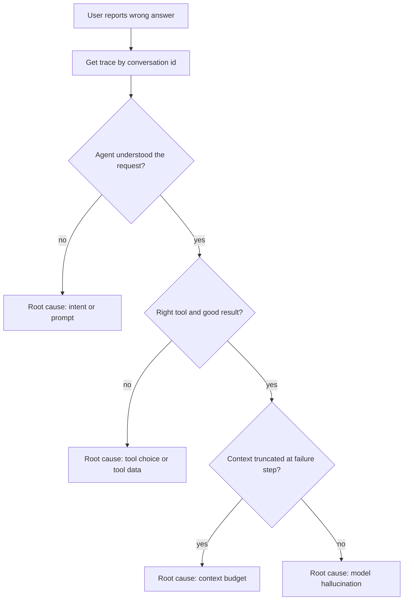
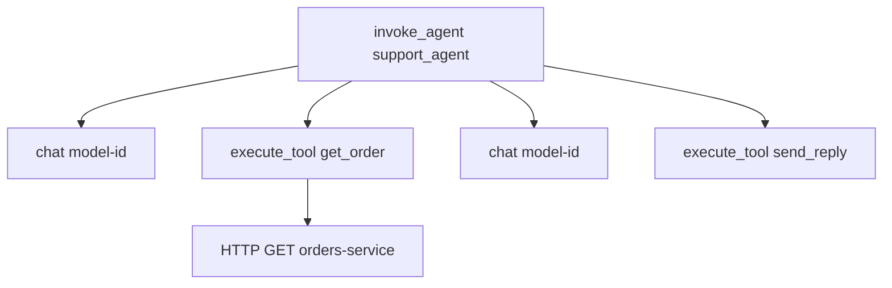
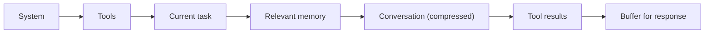

# 🔍 Agent Observability — Debugging, Monitoring & Production Visibility

> **Target:** Principal Engineer | **Focus:** Full observability stack for AI agent systems in production | **Reviewed:** October 2026

!!! tip "30-second answer"
    Agent observability = **one trace per run** with a span for every model call and every tool call (OpenTelemetry, using the GenAI semantic conventions so any backend can read it), carrying model id, token usage, latency, finish reason and, when enabled and redacted, the actual prompts and outputs. On top of traces: metrics for rates and cost, **online evaluations** that score a sample of production traces (groundedness, task success, policy violations), and user feedback joined back to the trace. Debugging a bad answer means opening the trace, finding the first wrong step, and turning it into a regression eval.

---

## 1. DEBUGGING AGENT FAILURES

### 1.1 The Observability Stack

When a user complains about a wrong answer, here's how to debug it:

```
User: "Your agent gave me wrong information!"
                │
                ▼
┌────────────────────────────────────────────────────────┐
│              OBSERVABILITY STACK                         │
│                                                          │
│  Layer 1: Conversation History          ← Who said what │
│  Layer 2: Traces (OpenTelemetry)       ← What happened │
│  Layer 3: LLM Calls & Responses        ← What was said │
│  Layer 4: Tool Calls & Results         ← What was done │
│  Layer 5: Context Window State         ← What was seen │
│  Layer 6: Guardrail Logs              ← What was caught│
│  Layer 7: Metrics & Alerts            ← Trend analysis │
└────────────────────────────────────────────────────────┘
```

### 1.2 Step-by-Step Debugging Workflow

```python
# Step 1: Get the conversation trace
trace = await observability.get_trace(conversation_id="conv_abc123")

# Step 2: Check if the agent understood the user
first_thought = trace.steps[0].thought
print(f"Agent understood: '{first_thought}'")
# Inconsistency → "User asked about billing" but thought was "User is asking about refund"

# Step 3: Check tool selection
tool_calls = [s for s in trace.steps if s.type == "tool_call"]
for call in tool_calls:
    print(f"Tool: {call.tool_name}({call.params}) → {call.result[:200]}")
# Wrong tool → Used search_kb instead of get_user_account

# Step 4: Check context window at the failure point
failure_step = trace.failure_step  # Detected by sudden drop in quality
context = trace.get_context_at_step(failure_step)
print(f"Context tokens: {context.token_count}/{context.max_tokens}")
print(f"Was truncated: {context.was_truncated}")
print(f"Relevant info pushed out: {context.find_missing_info()}")
```

*Figure: debugging a wrong answer by walking the trace.*



### 1.3 Conversation History Storage

#### 1.3.1 Storage Architecture

```
┌────────────────────────────────────────────────────┐
│            CONVERSATION STORAGE                      │
│                                                      │
│  Hot Storage (30 days):                              │
│  ┌──────────────────────────────────────────────┐   │
│  │  PostgreSQL (TimescaleDB)                     │   │
│  │  ├── conversations (metadata)                │   │
│  │  ├── messages (individual messages)          │   │
│  │  ├── tool_calls (tool interactions)          │   │
│  │  └── traces (step-by-step execution)         │   │
│  │  Partitioned BY RANGE (created_at)           │   │
│  └──────────────────────────────────────────────┘   │
│                                                      │
│  Warm Storage (30-90 days):                          │
│  ┌──────────────────────────────────────────────┐   │
│  │  S3 / GCS (Parquet compressed)               │   │
│  │  ├── conv_{id}.parquet (full conversation)   │   │
│  │  └── indexed by conversation_id + timestamp  │   │
│  └──────────────────────────────────────────────┘   │
│                                                      │
│  Cold Storage (90+ days):                            │
│  ┌──────────────────────────────────────────────┐   │
│  │  S3 Glacier / GCS Archive                   │   │
│  │  └── Retained for compliance (1-7 years)    │   │
│  └──────────────────────────────────────────────┘   │
└──────────────────────────────────────────────────────┘
```

#### 1.3.2 Conversation ID Setup

```python
import uuid
from datetime import datetime, UTC   # datetime.utcnow() is deprecated since 3.12
from typing import Optional

class ConversationManager:
    """
    Manages conversation IDs and persistence across the system.
    
    Conversation ID format: {session_type}_{timestamp}_{uuid}
    Example: agent_20260707_143022_a1b2c3d4
    """
    
    def __init__(self, storage_backend: str = "postgresql"):
        self.storage = self._init_storage(storage_backend)
    
    def create_conversation(self, user_id: str, session_type: str = "agent") -> str:
        """Create a new conversation with a unique ID."""
        conv_id = (
            f"{session_type}_"
            f"{datetime.now(UTC).strftime('%Y%m%d_%H%M%S')}_"
            f"{uuid.uuid4().hex[:8]}"
        )
        
        self.storage.store_conversation({
            "conversation_id": conv_id,
            "user_id": user_id,
            "created_at": datetime.now(UTC),
            "status": "active",
            "message_count": 0,
            "total_tokens_used": 0,
            "total_cost": 0.0,
            "metadata": {}
        })
        
        return conv_id
    
    async def append_message(self, conv_id: str, message: dict):
        """Append a message to the conversation."""
        message["conversation_id"] = conv_id
        message["timestamp"] = datetime.now(UTC).isoformat()
        message["message_id"] = f"msg_{uuid.uuid4().hex[:12]}"
        
        await self.storage.store_message(message)
        
        # Update conversation metadata
        await self.storage.increment_message_count(conv_id)
        await self.storage.update_token_usage(
            conv_id, 
            message.get("tokens_used", 0),
            message.get("cost", 0.0)
        )
    
    async def get_conversation(self, conv_id: str) -> dict:
        """Retrieve full conversation history."""
        return await self.storage.get_conversation_with_messages(conv_id)
    
    async def find_conversations(self, user_id: str, limit: int = 10) -> list:
        """Find recent conversations for a user."""
        return await self.storage.find_conversations_by_user(user_id, limit)
```

#### 1.3.3 Database Schema

PostgreSQL syntax. Two rules that trip people up: on a partitioned table every PRIMARY KEY or UNIQUE constraint **must include the partition key**, and indexes are created with separate `CREATE INDEX` statements (inline `INDEX ...` is MySQL syntax).

```sql
-- Conversations table
CREATE TABLE conversations (
    conversation_id    VARCHAR(64) NOT NULL,
    user_id           VARCHAR(128) NOT NULL,
    session_type      VARCHAR(32) NOT NULL DEFAULT 'agent',
    created_at        TIMESTAMPTZ NOT NULL DEFAULT NOW(),
    updated_at        TIMESTAMPTZ NOT NULL DEFAULT NOW(),
    status            VARCHAR(16) NOT NULL DEFAULT 'active',
    message_count     INTEGER NOT NULL DEFAULT 0,
    total_tokens      BIGINT NOT NULL DEFAULT 0,
    total_cost        DECIMAL(10,6) NOT NULL DEFAULT 0.0,
    metadata          JSONB DEFAULT '{}',
    PRIMARY KEY (conversation_id, created_at)      -- must include the partition key
) PARTITION BY RANGE (created_at);

-- Index for fast user lookup (created on each partition automatically)
CREATE INDEX idx_conversations_user ON conversations (user_id, created_at DESC);

-- Monthly partitions
CREATE TABLE conversations_2026_07 PARTITION OF conversations
    FOR VALUES FROM ('2026-07-01') TO ('2026-08-01');

-- Messages table (separate for efficient partial loading)
-- (No FK to conversations: a FK must reference a unique key, and
--  conversation_id alone isn't unique on the partitioned parent.)
CREATE TABLE messages (
    message_id        VARCHAR(64) NOT NULL,
    conversation_id   VARCHAR(64) NOT NULL,
    role              VARCHAR(16) NOT NULL,  -- system, user, assistant, tool
    content           TEXT NOT NULL,
    tool_calls        JSONB,
    tool_results      JSONB,
    tokens_used       INTEGER,
    cost              DECIMAL(10,6),
    created_at        TIMESTAMPTZ NOT NULL DEFAULT NOW(),
    PRIMARY KEY (message_id, created_at)
) PARTITION BY RANGE (created_at);
CREATE INDEX idx_messages_conv ON messages (conversation_id, created_at);

-- Traces table (step-by-step execution)
CREATE TABLE agent_traces (
    trace_id          VARCHAR(64) NOT NULL,     -- OTel trace id (32 hex chars)
    span_id           VARCHAR(32) NOT NULL,
    conversation_id   VARCHAR(64) NOT NULL,
    step_number       INTEGER NOT NULL,
    step_type         VARCHAR(32) NOT NULL,  -- thought, tool_call, tool_result, error
    input             TEXT,
    output            TEXT,
    duration_ms       INTEGER,
    tokens_used       INTEGER,
    model             VARCHAR(64),
    created_at        TIMESTAMPTZ NOT NULL DEFAULT NOW(),
    PRIMARY KEY (trace_id, span_id, created_at)
) PARTITION BY RANGE (created_at);
CREATE INDEX idx_traces_conv ON agent_traces (conversation_id, step_number);

-- Feedback table
CREATE TABLE agent_feedback (
    feedback_id       VARCHAR(64) PRIMARY KEY,
    conversation_id   VARCHAR(64) NOT NULL,
    trace_id          VARCHAR(64),              -- join feedback to the exact run
    rating            INTEGER CHECK (rating >= 1 AND rating <= 5),
    is_correct        BOOLEAN,
    user_comment      TEXT,
    reviewed_by       VARCHAR(64),
    created_at        TIMESTAMPTZ NOT NULL DEFAULT NOW()
);
```

In practice many teams don't hand-roll the traces table: they send OTel spans to a tracing backend (Langfuse, Arize Phoenix, LangSmith, Datadog, Honeycomb, Grafana Tempo) and keep only conversations, feedback and audit records in their own database, linked by `trace_id`.

### 1.4 Failure Identification: Reactive vs Proactive

#### Reactive: Debugging After Complaint

| Step | Action | Tool |
|------|--------|------|
| 1 | Find the conversation by user ID + timestamp | Database query |
| 2 | Replay the trace step-by-step | Trace viewer |
| 3 | Check if the LLM hallucinated or got bad tool data | LLM call log |
| 4 | Check if context was truncated | Context analyzer |
| 5 | Identify root cause | Root cause analysis |

#### Proactive: Automated Detection

```python
class ProactiveMonitor:
    """
    Automatically detects agent quality issues BEFORE users complain.
    """
    
    def __init__(self):
        self.alert_thresholds = {
            "wrong_answer_rate": 0.05,    # Alert if >5% answers are wrong
            "user_negative_sentiment": 0.3, # Alert if >30% negative
            "escalation_rate": 0.15,       # Alert if >15% escalated
            "tool_error_rate": 0.10,       # Alert if >10% tool errors
            "cost_anomaly": 50.0,          # Alert if >$50/hour
        }
        
        self.sliding_window_minutes = 15
    
    async def analyze_conversation_quality(self, conv_id: str) -> dict:
        """Analyze a single conversation for quality issues."""
        conversation = await get_conversation(conv_id)
        
        signals = {
            "conv_id": conv_id,
            "user_id": conversation["user_id"],
            "issues": []
        }
        
        # Signal 1: User expresses dissatisfaction
        sentiment = await self._analyze_user_sentiment(conversation)
        if sentiment["negative"] > 0.5:
            signals["issues"].append({
                "type": "negative_sentiment",
                "score": sentiment["negative"],
                "evidence": sentiment["evidence"]
            })
        
        # Signal 2: Agent contradicts itself
        contradictions = await self._detect_contradictions(conversation)
        if contradictions:
            signals["issues"].append({
                "type": "contradiction",
                "count": len(contradictions),
                "evidence": contradictions
            })
        
        # Signal 3: Agent didn't use tools when needed
        tool_usage = await self._analyze_tool_usage(conversation)
        if tool_usage["gaps"]:
            signals["issues"].append({
                "type": "tool_usage_gap",
                "gaps": tool_usage["gaps"]
            })
        
        # Signal 4: Response was too short or too long
        response_length = await self._check_response_length(conversation)
        if response_length["anomaly"]:
            signals["issues"].append({
                "type": "response_length_anomaly",
                "expected": response_length["expected"],
                "actual": response_length["actual"]
            })
        
        return signals
    
    async def proactive_scan(self, time_window_minutes: int = 15):
        """Scan recent conversations for quality issues proactively."""
        recent_convs = await self.storage.get_recent_conversations(
            since=datetime.now(UTC) - timedelta(minutes=time_window_minutes),
            limit=500
        )
        
        results = []
        for conv in recent_convs:
            signals = await self.analyze_conversation_quality(conv["conversation_id"])
            if signals["issues"]:
                results.append(signals)
        
        # Aggregate and alert. Rates must use ALL scanned conversations as
        # the denominator, not just the ones that had issues.
        if results:
            await self._aggregate_and_alert(results, scanned=len(recent_convs))
        
        return {
            "scanned": len(recent_convs),
            "issues_found": len(results),
            "issue_rate": len(results) / len(recent_convs) if recent_convs else 0
        }
    
    async def _aggregate_and_alert(self, issues: list, scanned: int):
        """Aggregate issues and trigger alerts if thresholds exceeded."""
        # Calculate rates over everything scanned (dividing by len(issues)
        # would make every rate look huge)
        total = scanned
        
        wrong_answers = sum(
            1 for i in issues 
            if any(iss["type"] == "contradiction" for iss in i["issues"])
        )
        
        negative_sentiment = sum(
            1 for i in issues 
            if any(iss["type"] == "negative_sentiment" for iss in i["issues"])
        )
        
        # Check thresholds and alert
        alerts = []
        
        if wrong_answers / total > self.alert_thresholds["wrong_answer_rate"]:
            alerts.append(Alert(
                severity="critical",
                title="High wrong answer rate detected",
                message=f"{wrong_answers / total * 100:.1f}% of conversations have contradictions",
                threshold=self.alert_thresholds["wrong_answer_rate"]
            ))
        
        if negative_sentiment / total > self.alert_thresholds["user_negative_sentiment"]:
            alerts.append(Alert(
                severity="warning",
                title="User sentiment declining",
                message=f"{negative_sentiment / total * 100:.1f}% of conversations have negative sentiment",
                threshold=self.alert_thresholds["user_negative_sentiment"]
            ))
        
        # Send alerts
        for alert in alerts:
            await self.alerting_service.send(alert)
```

### 1.5 Tracing with OpenTelemetry GenAI Semantic Conventions

OpenTelemetry defines `gen_ai.*` semantic conventions for model calls, agents and tools. They are still marked **Development** (not stable), so attribute names can change; instrumentation libraries let you opt into the latest version. The point is portability: the same spans render in any OTel-compatible backend.

**Span tree for one agent run:**

```
invoke_agent support_agent                 (gen_ai.operation.name=invoke_agent, gen_ai.agent.name)
├── chat <model-id>                        (operation=chat: tokens, finish reason)
├── execute_tool get_order                 (gen_ai.tool.name, gen_ai.tool.call.id)
│   └── HTTP GET orders-service/...        (ordinary OTel HTTP span: propagation still works)
├── chat <model-id>
└── execute_tool send_reply
```

| Attribute | Example | Why |
|-----------|---------|-----|
| `gen_ai.operation.name` | `chat`, `invoke_agent`, `execute_tool`, `embeddings` | Span type |
| `gen_ai.provider.name` | `anthropic`, `openai`, `aws.bedrock` | Replaced the older `gen_ai.system` |
| `gen_ai.request.model` / `gen_ai.response.model` | requested alias vs the exact snapshot that answered | Catch silent model changes |
| `gen_ai.usage.input_tokens` / `gen_ai.usage.output_tokens` | `1834` / `212` | Cost and context pressure (older names `prompt_tokens`/`completion_tokens` are deprecated) |
| `gen_ai.response.finish_reasons` | `["tool_use"]`, `["max_tokens"]` | Truncation and refusal detection |
| `gen_ai.conversation.id` | `conv_abc123` | Group runs into a conversation |
| `gen_ai.tool.name`, `gen_ai.tool.call.id` | `get_order`, `toolu_01...` | Join tool spans to model tool calls |

Standard metrics: `gen_ai.client.token.usage` and `gen_ai.client.operation.duration` (histograms). Span naming is `"{operation} {target}"`, e.g. `chat claude-sonnet-...` or `execute_tool get_order`.

**Content capture** (prompts, completions, tool arguments) is opt-in in the conventions because it carries PII and secrets. Common practice: capture full content for a sample or for internal users, redact at the collector, restrict access, and set a short retention. Without content you can see *that* step 3 went wrong but not *why*, so decide this deliberately rather than by default.

Propagate trace context across MCP calls and sub-agents (the MCP spec documents `traceparent` in request `_meta`), so a multi-agent run is one trace, not ten.

*Figure: one agent run as a single trace with child spans for model and tool calls.*



---

## 2. WHY HALLUCINATIONS OCCUR

### 2.1 Root Causes

| Cause | Description | Typical prevalence (qualitative) | Mitigation |
|-------|-------------|-----------|------------|
| **Extrapolation** | LLM fills in gaps when it doesn't know | High | RAG + tool use for facts |
| **Context pressure** | Relevant info was pushed out of context | Medium | Better context management |
| **Instruction confusion** | Conflicting instructions in prompt | Medium | Clear system prompts |
| **Auto-regressive drift** | Small errors compound over long generation | Medium | Chunk generation + verify |
| **Overconfidence** | LLM states guesses as facts | High | Allow and reward "I don't know"; require citations to tool results |
| **Training data bias** | Recency or popularity bias | Low | Fact-checking layer |

### 2.2 Hallucination Detection

The heuristics below are cheap first-pass signals. Embedding similarity measures *topic overlap*, not *support*: "The refund was approved" and "The refund was denied" embed very close together. For real groundedness checks, use an NLI model or an LLM judge that is asked, per claim, whether the retrieved evidence entails it, and calibrate that judge against human labels.

```python
class HallucinationDetector:
    """
    Detects potential hallucinations in agent outputs.
    Uses multiple signals to flag suspicious content.
    """
    
    async def detect(self, response: str, context: dict) -> dict:
        signals = []
        
        # Signal 1: Claims without tool evidence
        claims = self._extract_factual_claims(response)
        for claim in claims:
            if not self._is_supported_by_tools(claim, context["tool_results"]):
                signals.append({
                    "type": "unsupported_claim",
                    "claim": claim,
                    "severity": "high",
                    "explanation": "Claim not backed by tool results"
                })
        
        # Signal 2: Excessive specificity
        specific_patterns = [
            r"\d{4}-\d{2}-\d{2}",      # Specific dates
            r"\d+\.\d+%",               # Precise percentages
            r"\$[\d,]+\.\d{2}",         # Specific amounts
        ]
        for pattern in specific_patterns:
            matches = re.findall(pattern, response)
            for match in matches:
                if not self._is_in_context(match, context):
                    signals.append({
                        "type": "likely_hallucinated_detail",
                        "detail": match,
                        "severity": "medium"
                    })
        
        # Signal 3: Uncertainty analysis
        certainty = self._analyze_certainty(response)
        if certainty["overall"] > 0.8 and certainty["has_speculation"]:
            signals.append({
                "type": "overconfidence_with_speculation",
                "severity": "medium",
                "certainty_score": certainty["overall"]
            })
        
        return {
            "has_hallucination": len(signals) > 0,
            "severity": max((s["severity"] for s in signals), default="none"),
            "signals": signals,
            "confidence": self._aggregate_confidence(signals)
        }
    
    def _extract_factual_claims(self, text: str) -> list:
        """Extract statements that make factual claims."""
        claims = []
        sentences = nltk.sent_tokenize(text)
        for sent in sentences:
            # Look for factual assertion patterns
            if any(marker in sent.lower() for marker in [
                "is ", "was ", "are ", "were ", "has ", "have ",
                "contains ", "consists ", "located ", "founded ",
                "released ", "launched ", "acquired ", "sold "
            ]):
                claims.append(sent)
        return claims
    
    def _is_supported_by_tools(self, claim: str, tool_results: list) -> bool:
        """Check if a claim is supported by tool outputs."""
        claim_embedding = embed(claim)
        for result in tool_results:
            result_embedding = embed(str(result))
            similarity = cosine_similarity(claim_embedding, result_embedding)
            if similarity > 0.85:
                return True
        return False
```

---

## 3. CONTEXT BUDGET & WINDOW MANAGEMENT

### 3.1 What Are Budget Values?

An agent system has a **finite context window**. Current frontier models offer from a few hundred thousand up to about a million tokens (check the model's documentation or models API; these numbers change). Even with a large window, budgets still matter: every token is paid for on every turn, latency grows with input size, and answer quality tends to degrade as relevant facts get buried in long contexts. The **budget** defines how tokens are allocated across different types of content:

```python
CONTEXT_BUDGET = {
    "system_instructions": 1000,     # 1K tokens — always reserved
    "tool_definitions": 2000,        # 2K tokens — tool schemas
    "conversation_history": 3000,    # 3K tokens — recent messages
    "working_memory": 1000,          # 1K tokens — current task context
    "long_term_memory": 2000,        # 2K tokens — retrieved facts
    "response_room": 1000,           # 1K tokens — space for LLM output
    
    "total": 10000                   # a deliberately small working set, far below the window
}
```

### 3.2 Why Budget Values Matter

**Real Example: Code Generation Agent**

> **What happened:** An agent working on code generation kept the full conversation history. After 15 turns, the context was 80% conversation and 20% actual code. The agent started making syntax errors because relevant code had been pushed out.

**Analysis:**
```
Turn 1:  Context = [System(500) + Code(1500)]  = 2,000 tokens ✓
Turn 5:  Context = [System(500) + Code(1500) + History(3000)] = 5,000 tokens ✓
Turn 10: Context = [System(500) + Code(1500) + History(8000)] = 10,000 tokens ⚠️
Turn 15: Context = [System(500) + Code(200) + History(12,000)] = 12,700 tokens ❌
                                                         ^^^^^
                                                    Code got truncated!
```

**Budget allocation without management:**
- System prompt: 500 tokens (4%)
- Conversation history: 12,000 tokens (94%)
- Code context: 200 tokens (2%) ← **Way too little for code generation**

**Budget allocation with management:**
- System prompt: 500 tokens (4%)
- Conversation history: 3,000 tokens (24%) ← Summarized!
- Code context: 8,000 tokens (63%) ← Reserved for what matters
- Tool results: 1,200 tokens (9%)

### 3.3 Implementing Budget-Aware Context Management

```python
class BudgetAwareContextManager:
    """
    Manages the context window with explicit token budgets.
    Prioritizes the most important content.
    """
    
    def __init__(self, max_tokens: int):
        self.max_tokens = max_tokens   # from the model's config, minus output headroom
        self.budget = {
            "system": {"max": 2000, "priority": 1},     # Always included
            "tools": {"max": 4000, "priority": 2},       # Always included
            "current_task": {"max": 500, "priority": 3}, # Always included
            "relevant_memory": {"max": 3000, "priority": 4},
            "conversation": {"max": 4000, "priority": 5}, # Compressed
            "tool_results": {"max": 2000, "priority": 6},
            "buffer": {"max": 1000, "priority": 7},     # For response
        }
    
    def build_context(self, state: AgentState) -> str:
        """Build the context respecting token budgets."""
        sections = []
        remaining = self.max_tokens
        
        # Start with highest priority
        for section, config in sorted(
            self.budget.items(), key=lambda x: x[1]["priority"]
        ):
            if remaining <= 0:
                break
            
            content = self._get_section_content(section, state)
            
            # Truncate to budget
            alloc = min(config["max"], remaining)
            if section == "conversation":
                content = self._summarize_and_truncate(content, alloc)
            else:
                content = self._truncate(content, alloc)
            
            if content:
                sections.append(content)
            remaining -= alloc
        
        return "\n\n".join(sections)
    
    def _summarize_and_truncate(self, history: list, budget: int) -> str:
        """
        Summarize older messages, keep recent ones.
        This is the key function that prevents context swamping.
        """
        # Count tokens for recent messages
        recent_tokens = 0
        recent_messages = []
        
        for msg in reversed(history):
            msg_tokens = count_tokens(msg)
            if recent_tokens + msg_tokens > budget * 0.6:  # 60% for recent
                break
            recent_messages.insert(0, msg)
            recent_tokens += msg_tokens
        
        # Summarize the rest. (Careful: history[:-0] is [], so handle the
        # case where not even the newest message fit.)
        older_messages = history[:len(history) - len(recent_messages)]
        if older_messages:
            summary = self._summarize_conversation(older_messages, budget * 0.4)
            return f"[Previous conversation summary]: {summary}\n\n" + \
                   "\n".join(recent_messages)
        
        return "\n".join(recent_messages)
    
    def _summarize_conversation(self, messages: list, budget: int) -> str:
        """Use LLM to summarize older conversation turns."""
        if not messages:
            return ""
        
        # Could call a fast, cheap LLM for summarization
        summary_prompt = (
            "Summarize this conversation in 3-5 bullet points, "
            "focusing on: user's goal, completed actions, pending items, "
            "and important facts learned."
        )
        # ... call LLM ...
        return summary
```

*Figure: context is assembled in priority order and trimmed to fit the budget.*



### 3.4 Monitoring Budget Usage

```python
class BudgetMonitor:
    """Monitor and alert on context budget usage."""
    
    def __init__(self, context_window: int):
        self.context_window = context_window   # per model, from config / models API

    def analyze_budget_usage(self, state: AgentState) -> dict:
        """Analyze how the budget is being used."""
        context = state.get("context", "")
        tool_results = state.get("tool_results", [])
        conversation = state.get("messages", [])
        
        return {
            "total_tokens": count_tokens(context),
            "max_tokens": self.context_window,
            "usage_percentage": count_tokens(context) / self.context_window * 100,
            "by_category": {
                "conversation_history": sum(
                    count_tokens(m) for m in conversation
                ),
                "tool_results": sum(
                    count_tokens(str(r)) for r in tool_results
                ),
                "working_memory": count_tokens(
                    str(state.get("working_memory", {}))
                ),
            },
            "warnings": self._get_warnings(state),
        }
    
    def _get_warnings(self, state: AgentState) -> list:
        """Generate warnings based on budget analysis."""
        warnings = []
        total = count_tokens(str(state))
        
        if total > 0.8 * self.context_window:
            warnings.append({
                "type": "context_window_critical",
                "message": "Context window >80% full — quality degradation likely",
                "action": "Trigger summarization or prune low-value content"
            })
        
        conversation_tokens = sum(count_tokens(m) for m in state.get("messages", []))
        if conversation_tokens / total > 0.7:
            warnings.append({
                "type": "conversation_dominated",
                "message": f"Conversation is {conversation_tokens/total*100:.0f}% of context",
                "action": "Summarize older turns to free space for tools/code"
            })
        
        return warnings
```

---

## 4. TEMPERATURE IN LLMs

### 4.1 What Temperature Controls

**Temperature** rescales the model's next-token probability distribution before sampling: low values sharpen it toward the most likely token, high values flatten it.

| Temperature | Behavior | Use Case |
|-------------|----------|----------|
| `0.0` | Near-greedy: (almost) always the most likely token | Extraction, classification |
| `0.2 - 0.5` | Low variance | Structured output, most agent work |
| `0.7 - 1.0` | More diverse | Brainstorming, creative writing |

Three facts that matter more than the table:

- **`temperature=0` is not fully deterministic** on hosted APIs: batching, hardware and floating-point effects still change outputs between identical requests. Some providers offer a `seed` parameter for best-effort reproducibility.
- **Many current models don't expose it.** Reasoning models commonly reject or ignore sampling parameters (several recent Anthropic and OpenAI models return an error if you send `temperature`); you control behaviour through reasoning effort and prompting instead. Check each model's docs before baking temperature into config.
- **Variance in an agent isn't only sampling.** Tool results, retrieval, timing and model snapshot changes all vary between runs, so even a "deterministic" model gives a non-deterministic agent.

### 4.2 Temperature and the Example

> **What happened:** The agent would pass integration tests 7 out of 10 times. The test suite had no way to distinguish between a legitimate improvement and random variance.

**Root cause:** the tests treated a stochastic system as deterministic. Lowering temperature reduces variance but does not remove it (see above), and testing at a different temperature from production tests the wrong system.

**The fix:** measure, don't assume.

- Run each eval case several times **with production settings** and score pass rates.
- Report **pass@k** (succeeds at least once in k tries: "can it do this?") and **pass^k** (succeeds in all k tries: "will it do this reliably?"). For user-facing agents, pass^k is the one that hurts.
- Compare two versions on the **same cases**, paired, and only call it an improvement if the difference is bigger than run-to-run noise.

```python
import random
import statistics

async def pass_rates(agent, cases, n_runs: int = 5) -> dict[str, float]:
    """Pass rate per case, using production settings."""
    rates = {}
    for case in cases:
        results = [await case.check(await agent.run(case.input)) for _ in range(n_runs)]
        rates[case.id] = sum(results) / n_runs
    return rates

def compare(baseline: dict, candidate: dict, n_boot: int = 10_000) -> dict:
    """Paired bootstrap over cases: is the mean improvement distinguishable from 0?"""
    ids = list(baseline)
    diffs = [candidate[i] - baseline[i] for i in ids]
    boot = []
    for _ in range(n_boot):
        sample = [random.choice(diffs) for _ in ids]
        boot.append(statistics.mean(sample))
    boot.sort()
    lo, hi = boot[int(0.025 * n_boot)], boot[int(0.975 * n_boot)]
    return {
        "mean_improvement": statistics.mean(diffs),
        "ci95": (lo, hi),
        "significant": lo > 0 or hi < 0,
        # Never let an average hide a new catastrophic failure:
        "regressed_cases": [i for i in ids if candidate[i] < baseline[i] - 0.5],
    }
```

With a few dozen cases and 5 runs each, only fairly large differences are detectable. Grow the eval set before trusting small wins, and gate releases on "no regressions in critical cases" as well as the average.

---

## 5. LOG STORAGE & DATA POLICIES

### 5.1 Storage Requirements

Agent logs are **much larger** than traditional application logs:

Illustrative sizes (they vary by an order of magnitude with conversation length and how much content you capture):

| Type | Size per Interaction | Monthly (1M conversations) |
|------|---------------------|---------------------------|
| Application logs | ~1 KB | 1 GB |
| Agent traces | ~50 KB | 50 GB |
| LLM prompts/responses | ~10 KB | 10 GB |
| Full conversation history | ~100 KB | 100 GB |
| **Total** | **~161 KB** | **~161 GB** |

### 5.2 Storage Architecture

```python
class LogStorageManager:
    """
    Tiered storage strategy for agent logs.
    
    Hot (30 days):  PostgreSQL/TimescaleDB — fast query, indexed
    Warm (90 days): S3/Parquet — columnar, compressed
    Cold (7 years): S3 Glacier — cheap, archived

    Logs are always written HOT. Moving them to warm/cold happens later via
    batch export jobs and storage lifecycle rules (e.g. S3 lifecycle
    transitions), not by routing at write time.
    """
    
    STORAGE_TIERS = {
        "hot": {
            "backend": "timescaledb",
            "retention_days": 30,
            "compression": False,
            "cost_per_gb_month": 0.50,   # rough managed-DB storage cost; check current pricing
        },
        "warm": {
            "backend": "s3_parquet",
            "retention_days": 90,
            "compression": True,  # Parquet + gzip ≈ 10x compression
            "cost_per_gb_month": 0.023,  # S3 Standard list price (us-east-1, first tier); check current
        },
        "cold": {
            "backend": "s3_glacier",
            "retention_days": 2555,  # 7 years
            "compression": True,
            "cost_per_gb_month": 0.001,  # S3 Glacier Deep Archive is ~$0.001/GB-month; retrieval takes hours
        }
    }
    
    async def store_log(self, log_entry: dict):
        """New logs always land in the hot tier."""
        await self._store_hot(log_entry)

    async def tier_down(self):
        """Nightly job: export partitions older than 30 days to Parquet on S3,
        then drop them from the database. S3 lifecycle rules move objects to
        Glacier after 90 days and expire them at the retention limit."""
        ...
    
    async def query_logs(self, conversation_id: str, 
                         time_range: tuple) -> list:
        """Query logs across storage tiers."""
        hot_results = await self._query_hot(conversation_id, time_range)
        
        if len(hot_results) < self._expected_count(conversation_id):
            warm_results = await self._query_warm(conversation_id)
            cold_results = await self._query_cold(conversation_id)
            return hot_results + warm_results + cold_results
        
        return hot_results
```

### 5.3 Data Retention Policy

```python
DATA_RETENTION_POLICY = {
    "conversation_history": {
        "retention": "90 days in hot, 7 years in cold",
        "justification": "Customer support SLA, compliance, model improvement",
        "anonymization": "PII redacted after 30 days",
        "deletion": "Hard delete after 7 years"
    },
    "agent_traces": {
        "retention": "30 days in hot, 90 days in warm",
        "justification": "Debugging and quality improvement",
        "anonymization": "Sampled and aggregated after 90 days",
        "deletion": "Aggregated into statistical models after 90 days"
    },
    "llm_prompts_responses": {
        "retention": "90 days",
        "justification": "Cost analysis, prompt optimization",
        "anonymization": "PII stripped at ingestion",
        "deletion": "Deleted after 90 days"
    },
    "tool_call_logs": {
        "retention": "30 days",
        "justification": "Debugging tool failures",
        "anonymization": "N/A (structured data)",
        "deletion": "Aggregated into error stats after 30 days"
    },
    "user_feedback": {
        "retention": "Indefinite (anonymized)",
        "justification": "Model training, quality measurement",
        "anonymization": "All PII removed",
        "deletion": "N/A (anonymized)"
    },
    "cost_logs": {
        "retention": "7 years",
        "justification": "Financial auditing, capacity planning",
        "anonymization": "N/A (financial data)",
        "deletion": "After 7 years"
    }
}
```

Two compliance points interviewers like: **deletion requests** (GDPR right to erasure and similar) must reach every tier, including warm Parquet files, trace backends and eval datasets built from production data, so keep user ids in a form you can find and purge; and **using customer conversations for training or evals** needs a legal basis and usually consent or a contract clause. Redacting PII at ingestion is far easier than redacting it later.

---

## 6. ALERTING & MONITORING RULES

```yaml
# prometheus/agent-alerts.yml
groups:
  - name: agent-quality-alerts
    rules:
    - alert: HighWrongAnswerRate
      # Ratio of judged-wrong to judged answers (rate() alone is events/second)
      expr: |
        sum(rate(agent_wrong_answer_total[15m]))
          / sum(rate(agent_judged_answers_total[15m])) > 0.05
      for: 5m
      labels:
        severity: critical
        team: agent-ai
      annotations:
        summary: "Wrong answer rate > 5% in last 15 minutes"
        description: >
          Agent is producing wrong answers at {{ $value | humanizePercentage }}.
          Check recent model deploys or context management changes.
    
    - alert: ConversationQualityDropped
      expr: agent_quality_score < 0.7
      for: 10m
      labels:
        severity: warning
      annotations:
        summary: "Agent quality score dropped below 0.7"
    
    - alert: HallucinationSpike
      expr: |
        sum(rate(agent_hallucination_detected_total[5m]))
          / sum(rate(agent_responses_total[5m])) > 0.1
      for: 2m
      labels:
        severity: critical
      annotations:
        summary: "Hallucination rate spike detected"
    
    - alert: ContextWindowPressure
      expr: agent_context_usage_percentage > 80
      for: 5m
      labels:
        severity: warning
      annotations:
        summary: "Context window >80% full — quality degradation likely"
    
    - alert: CostAnomalyPerTenant
      # increase() over 1h gives dollars per hour; rate() would be dollars/second.
      # Label by tenant or plan, NOT user_id: per-user labels explode
      # Prometheus cardinality. Enforce per-user budgets in the app instead.
      expr: sum by (tenant) (increase(agent_cost_total[1h])) > 50
      for: 5m
      labels:
        severity: warning
      annotations:
        summary: "Tenant {{ $labels.tenant }} spent > $50 in the last hour"
```

---

> **Next:** [Multi-LLM Architecture](08_MULTI_LLM_ARCHITECTURE.md) → Designing systems that work with GPT, Claude, DeepSeek, and more
