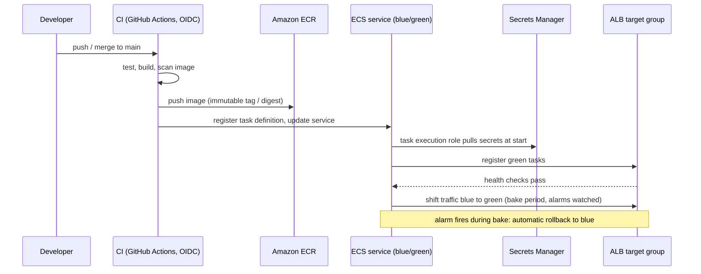
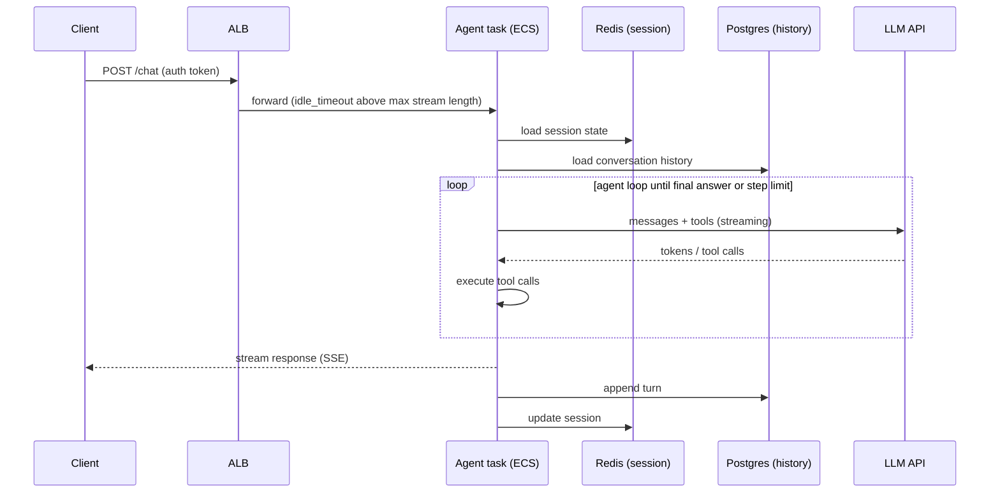

# 🚀 Agent Deployment on AWS ECS — Production Infrastructure

> **Target:** Principal Engineer | **Focus:** Full production deployment architecture for AI agents on AWS ECS | **Reviewed:** October 2026

!!! tip "30-second answer"
    Run the agent as a stateless **ECS service on Fargate** in private subnets behind an **ALB**, with conversation/run state in RDS (Postgres) and hot session data in ElastiCache, secrets injected from Secrets Manager by the task **execution role**, and outbound LLM calls through a NAT gateway. Agent-specific choices: raise the **ALB idle timeout** (default 60 s) for streaming responses, give tasks a long `stopTimeout` and deregistration delay so in-flight runs can drain, **scale on concurrent sessions per task** rather than CPU (agents are I/O-bound), push long or async work through SQS workers, and deploy with ECS's built-in **blue/green** (or rolling with the deployment circuit breaker).

---

## 1. ARCHITECTURE OVERVIEW

```
                      ┌──────────────────────┐
                      │   Route 53 / CloudFront│
                      └──────────┬───────────┘
                                 │
                      ┌──────────▼───────────┐
                      │   Application Load    │
                      │   Balancer (ALB)      │
                      └──────────┬───────────┘
                                 │
                    ┌────────────┼────────────┐
                    ▼            ▼            ▼
             ┌──────────┐ ┌──────────┐ ┌──────────┐
             │ ECS Task │ │ ECS Task │ │ ECS Task │
             │ Agent #1 │ │ Agent #2 │ │ Agent #N │
             └────┬─────┘ └────┬─────┘ └────┬─────┘
                  │            │            │
     ┌────────────┼────────────┼────────────┼──────────┐
     │            ▼            ▼            ▼          │
     │      ┌─────────────────────────────────────┐    │
     │      │         AWS Services                │    │
     │      │                                     │    │
     │      │  ┌────────┐ ┌────────┐ ┌────────┐  │    │
     │      │  │ElastiCache│ │RDS    │ │ SQS   │  │    │
     │      │  │(Redis) │ │(PG)   │ │(Queue)│  │    │
     │      │  └────────┘ └────────┘ └────────┘  │    │
     │      │  ┌────────┐ ┌────────┐ ┌────────┐  │    │
     │      │  │S3 (Logs)│ │CW Logs│ │X-Ray  │  │    │
     │      │  └────────┘ └────────┘ └────────┘  │    │
     │      └─────────────────────────────────────┘    │
     └────────────────────────────────────────────────┘
```

### Sequence Diagram — Deployment Flow



### Sequence Diagram — Request Processing Flow



---

## 2. ECS INFRASTRUCTURE (Terraform)

### 2.1 ECS Cluster & Service

```hcl
# terraform/ecs/main.tf

resource "aws_ecs_cluster" "agent_cluster" {
  name = "agent-production"
  
  setting {
    name  = "containerInsights"
    value = "enabled"
  }
  
  tags = {
    Name        = "agent-production"
    Environment = "production"
  }
}

resource "aws_ecs_task_definition" "agent" {
  family                   = "agent-orchestrator"
  requires_compatibilities = ["FARGATE"]
  network_mode            = "awsvpc"
  cpu                     = 2048   # 2 vCPU
  memory                  = 8192   # 8 GB RAM
  execution_role_arn      = aws_iam_role.ecs_execution.arn
  task_role_arn           = aws_iam_role.agent_task.arn
  
  container_definitions = jsonencode([
    {
      name  = "agent-orchestrator"
      # Immutable tag (git SHA) set by CI; never deploy :latest
      image = "${aws_ecr_repository.agent.repository_url}:${var.image_tag}"
      
      portMappings = [{
        containerPort = 8080
        protocol      = "tcp"
      }]
      
      environment = [
        { name = "ENVIRONMENT",        value = "production" },
        { name = "LOG_LEVEL",          value = "INFO" },
        { name = "MAX_STEPS",          value = "25" },
        { name = "RATE_LIMIT_RPS",     value = "100" },
      ]
      
      secrets = [
        { name = "OPENAI_API_KEY",      valueFrom = "arn:aws:secretsmanager:us-east-1:xxxxx:secret:openai-api-key" },
        { name = "ANTHROPIC_API_KEY",   valueFrom = "arn:aws:secretsmanager:us-east-1:xxxxx:secret:anthropic-api-key" },
        { name = "DATABASE_URL",        valueFrom = "arn:aws:secretsmanager:us-east-1:xxxxx:secret:database-url" },
        { name = "REDIS_URL",           valueFrom = "arn:aws:secretsmanager:us-east-1:xxxxx:secret:redis-url" },
      ]
      
      logConfiguration = {
        logDriver = "awslogs"
        options = {
          "awslogs-group"         = "/ecs/agent-orchestrator"
          "awslogs-region"        = "us-east-1"
          "awslogs-stream-prefix" = "ecs"
        }
      }
      
      # Give in-flight agent runs / SSE streams time to finish on SIGTERM.
      # Fargate allows up to 120 seconds.
      stopTimeout = 120

      healthCheck = {
        # curl must exist in the image (slim images often lack it)
        command     = ["CMD-SHELL", "curl -f http://localhost:8080/health || exit 1"]
        interval    = 30
        timeout     = 5
        retries     = 3
        startPeriod = 60
      }
      
      ulimits = [{
        name        = "nofile"
        softLimit   = 65536
        hardLimit   = 65536
      }]
      # No GPU here: Fargate does not support GPUs. Agents calling hosted
      # LLM APIs don't need one; self-hosted inference runs on ECS with EC2
      # GPU instances (or EKS / SageMaker), as a separate service.
    }
  ])
  
  tags = {
    Environment = "production"
  }
}

resource "aws_ecs_service" "agent" {
  name            = "agent-orchestrator-service"
  cluster         = aws_ecs_cluster.agent_cluster.id
  task_definition = aws_ecs_task_definition.agent.arn
  desired_count   = 5
  launch_type     = "FARGATE"
  
  network_configuration {
    subnets         = aws_subnet.private[*].id
    security_groups = [aws_security_group.agent_sg.id]
  }
  
  load_balancer {
    target_group_arn = aws_lb_target_group.blue.arn
    container_name   = "agent-orchestrator"
    container_port   = 8080

    # ECS built-in blue/green (since July 2025; AWS provider v6+):
    advanced_configuration {
      alternate_target_group_arn = aws_lb_target_group.green.arn
      production_listener_rule   = aws_lb_listener_rule.prod.arn
      test_listener_rule         = aws_lb_listener_rule.test.arn  # optional pre-traffic tests
      role_arn                   = aws_iam_role.ecs_infrastructure.arn
    }
  }
  
  # The default ECS deployment controller now supports BLUE_GREEN, LINEAR and
  # CANARY strategies natively, so CodeDeploy is no longer required.
  deployment_configuration {
    strategy             = "BLUE_GREEN"
    bake_time_in_minutes = 15     # keep blue alive for instant rollback
  }

  # Auto-rollback when new tasks fail to reach steady state. With blue/green,
  # also wire CloudWatch alarms and lifecycle hooks into the rollback decision.
  deployment_circuit_breaker {
    enable   = true
    rollback = true
  }

  # desired_count is managed by Application Auto Scaling below
  lifecycle {
    ignore_changes = [desired_count]
  }
}

# Streaming responses: the ALB closes a connection that sends no bytes for
# idle_timeout seconds (default 60). Raise it, and send SSE heartbeats.
resource "aws_lb" "agent" {
  name               = "agent-alb"
  load_balancer_type = "application"
  subnets            = aws_subnet.public[*].id
  security_groups    = [aws_security_group.alb_sg.id]
  idle_timeout       = 300
}

resource "aws_lb_target_group" "blue" {
  name                 = "agent-blue"
  port                 = 8080
  protocol             = "HTTP"
  target_type          = "ip"          # required for awsvpc / Fargate
  vpc_id               = aws_vpc.main.id
  deregistration_delay = 120           # let in-flight runs drain
  health_check {
    path = "/ready"
  }
}
# aws_lb_target_group.green: identical, name = "agent-green"

# Auto-scaling
resource "aws_appautoscaling_target" "agent" {
  service_namespace  = "ecs"
  resource_id        = "service/${aws_ecs_cluster.agent_cluster.name}/${aws_ecs_service.agent.name}"
  scalable_dimension = "ecs:service:DesiredCount"
  min_capacity       = 3
  max_capacity       = 20
}

resource "aws_appautoscaling_policy" "cpu" {
  name               = "cpu-scaling"
  service_namespace  = "ecs"
  resource_id        = aws_appautoscaling_target.agent.resource_id
  scalable_dimension = "ecs:service:DesiredCount"
  
  target_tracking_scaling_policy_configuration {
    target_value       = 70.0
    scale_in_cooldown  = 300
    scale_out_cooldown = 60
    
    predefined_metric_specification {
      predefined_metric_type = "ECSServiceAverageCPUUtilization"
    }
  }
}

resource "aws_appautoscaling_policy" "memory" {
  name               = "memory-scaling"
  service_namespace  = "ecs"
  resource_id        = aws_appautoscaling_target.agent.resource_id
  scalable_dimension = "ecs:service:DesiredCount"
  
  target_tracking_scaling_policy_configuration {
    target_value       = 70.0
    scale_in_cooldown  = 300
    scale_out_cooldown = 60
    
    predefined_metric_specification {
      predefined_metric_type = "ECSServiceAverageMemoryUtilization"
    }
  }
}

# Custom metric scaling (agent session count). This is the primary signal:
# an agent task waiting on LLM calls shows low CPU while being saturated.
# Target tracking needs a metric that FALLS as tasks are added, so use
# sessions PER TASK (Average across tasks), not the service-wide Sum.
resource "aws_appautoscaling_policy" "sessions" {
  name               = "active-sessions-scaling"
  service_namespace  = "ecs"
  resource_id        = aws_appautoscaling_target.agent.resource_id
  scalable_dimension = "ecs:service:DesiredCount"
  
  target_tracking_scaling_policy_configuration {
    target_value       = 40.0     # sessions per task you have load-tested
    scale_in_cooldown  = 300
    scale_out_cooldown = 60
    
    customized_metric_specification {
      metrics = [{
        id        = "m1"
        return_data = true
        metric_stat {
          metric {
            namespace   = "Agent"
            metric_name = "ActiveSessions"
            dimensions  = [{
              name  = "Service"
              value = "agent-orchestrator"
            }]
          }
          stat = "Average"   # each task publishes its own ActiveSessions
          unit  = "Count"
        }
      }]
    }
  }
}
```

### 2.2 Networking & Security

```hcl
# terraform/network/main.tf

resource "aws_vpc" "main" {
  cidr_block           = "10.0.0.0/16"
  enable_dns_hostnames = true
  
  tags = { Name = "agent-production" }
}

resource "aws_subnet" "private" {
  count             = 3
  vpc_id            = aws_vpc.main.id
  cidr_block        = "10.0.${count.index}.0/24"
  availability_zone = data.aws_availability_zones.available.names[count.index]
  
  tags = { Name = "agent-private-${count.index}" }
}

resource "aws_subnet" "public" {
  count             = 3
  vpc_id            = aws_vpc.main.id
  cidr_block        = "10.0.${count.index + 3}.0/24"
  availability_zone = data.aws_availability_zones.available.names[count.index]
  
  map_public_ip_on_launch = true
  tags = { Name = "agent-public-${count.index}" }
}

# Security group for agent tasks
resource "aws_security_group" "agent_sg" {
  name        = "agent-orchestrator-sg"
  description = "Security group for agent orchestrator tasks"
  vpc_id      = aws_vpc.main.id
  
  ingress {
    from_port       = 8080
    to_port         = 8080
    protocol        = "tcp"
    security_groups = [aws_security_group.alb_sg.id]
  }
  
  egress {
    from_port   = 0
    to_port     = 0
    protocol    = "-1"
    cidr_blocks = ["0.0.0.0/0"]
  }
}

# Private subnets still need a route to the internet for LLM provider APIs:
# a NAT gateway per AZ (in the public subnets) for availability.
resource "aws_nat_gateway" "nat" {
  count         = 3
  allocation_id = aws_eip.nat[count.index].id
  subnet_id     = aws_subnet.public[count.index].id
}

# VPC endpoints keep AWS traffic off the NAT (cheaper, private).
# Fargate pulling from ECR needs: ecr.api, ecr.dkr (interface) + s3 (gateway);
# plus logs and secretsmanager.
resource "aws_vpc_endpoint" "secretsmanager" {
  vpc_id              = aws_vpc.main.id
  service_name        = "com.amazonaws.us-east-1.secretsmanager"
  vpc_endpoint_type   = "Interface"
  subnet_ids          = aws_subnet.private[*].id
  security_group_ids  = [aws_security_group.vpce_sg.id]
  private_dns_enabled = true
}
```

Egress is wide open (`0.0.0.0/0`) above. For an agent that can be prompt-injected into calling arbitrary URLs, consider restricting egress to the LLM providers and known tool endpoints (an egress proxy or AWS Network Firewall with domain allow-lists).

### 2.3 IAM Roles & Policies

```hcl
# terraform/iam/main.tf

resource "aws_iam_role" "ecs_execution" {
  name = "ecs-execution-role"
  
  assume_role_policy = jsonencode({
    Version = "2012-10-17"
    Statement = [{
      Effect = "Allow"
      Principal = { Service = "ecs-tasks.amazonaws.com" }
      Action = "sts:AssumeRole"
    }]
  })
}

resource "aws_iam_role_policy_attachment" "ecs_execution" {
  role       = aws_iam_role.ecs_execution.name
  policy_arn = "arn:aws:iam::aws:policy/service-role/AmazonECSTaskExecutionRolePolicy"
}

# Secrets in the task definition's `secrets` block are fetched by the
# EXECUTION role at task start (the managed policy above doesn't cover
# Secrets Manager). Scope it to exactly those secrets.
resource "aws_iam_role_policy" "execution_secrets" {
  role = aws_iam_role.ecs_execution.id
  policy = jsonencode({
    Version = "2012-10-17"
    Statement = [{
      Effect   = "Allow"
      Action   = ["secretsmanager:GetSecretValue"]
      Resource = [
        "arn:aws:secretsmanager:us-east-1:xxxxx:secret:openai-api-key-*",
        "arn:aws:secretsmanager:us-east-1:xxxxx:secret:anthropic-api-key-*",
        "arn:aws:secretsmanager:us-east-1:xxxxx:secret:database-url-*",
        "arn:aws:secretsmanager:us-east-1:xxxxx:secret:redis-url-*",
      ]
    }]
  })
}

resource "aws_iam_role" "agent_task" {
  name = "agent-task-role"
  
  assume_role_policy = jsonencode({
    Version = "2012-10-17"
    Statement = [{
      Effect = "Allow"
      Principal = { Service = "ecs-tasks.amazonaws.com" }
      Action = "sts:AssumeRole"
    }]
  })
}

# Task role: what the APPLICATION can do at runtime. Least privilege;
# no wildcard access to every secret in the account.
resource "aws_iam_policy" "agent_task" {
  name = "agent-task-policy"
  
  policy = jsonencode({
    Version = "2012-10-17"
    Statement = [
      {
        Effect = "Allow"
        Action = [
          "s3:PutObject",
          "s3:GetObject"
        ]
        Resource = ["arn:aws:s3:::agent-logs/*"]
      },
      {
        Effect = "Allow"
        Action = [
          "sqs:SendMessage",
          "sqs:ReceiveMessage",
          "sqs:DeleteMessage"
        ]
        Resource = ["arn:aws:sqs:us-east-1:xxxxx:agent-queue"]
      },
      {
        # Traces via the ADOT collector / CloudWatch OTLP endpoint. (The X-Ray
        # SDKs and daemon entered maintenance mode in Feb 2026, end of support
        # Feb 2027; AWS recommends OpenTelemetry instrumentation.)
        Effect = "Allow"
        Action = [
          "xray:PutTraceSegments",
          "xray:PutTelemetryRecords"
        ]
        Resource = ["*"]
      }
    ]
  })
}
```

---

## 3. API & DATA FLOW

### 3.1 API Design

```python
# app/main.py — FastAPI application
from fastapi import FastAPI, HTTPException, Depends
from pydantic import BaseModel, Field
from typing import Optional

app = FastAPI(
    title="Agent Orchestrator API",
    version="1.0.0",
    docs_url="/api/docs"
)

# ─── Request/Response Models ──────────────────────

class AgentRequest(BaseModel):
    query: str = Field(..., min_length=1, max_length=4000)
    conversation_id: Optional[str] = None
    # No user_id in the body: a client could claim to be anyone. Identity
    # comes from the verified auth token (see the dependency below).
    max_steps: int = Field(25, ge=1, le=50)   # server-capped
    model_preference: str = "auto"

class AgentResponse(BaseModel):
    response: str
    conversation_id: str
    model_used: str
    tokens_used: int
    cost: float
    latency_ms: int
    tool_calls: list

class HealthResponse(BaseModel):
    status: str = "healthy"
    version: str = "1.0.0"
    active_sessions: int
    uptime_seconds: float

# ─── API Endpoints ────────────────────────────────

@app.post("/api/v1/chat", response_model=AgentResponse)
async def chat(request: AgentRequest, user: User = Depends(current_user)):
    """
    Main agent endpoint.
    Handles user queries and returns agent responses.
    """
    try:
        result = await agent_orchestrator.process(
            query=request.query,
            conversation_id=request.conversation_id,  # must belong to `user`
            user_id=user.id,
            max_steps=request.max_steps,
        )
        return AgentResponse(**result)
    except BudgetExceeded as e:
        raise HTTPException(status_code=429, detail=str(e))
    except Exception:
        logger.exception("agent error")             # details go to logs/traces,
        raise HTTPException(status_code=500,        # not to the client
                            detail="Agent error")

@app.post("/api/v1/chat/stream")
async def chat_stream(request: AgentRequest, user: User = Depends(current_user)):
    """
    Streaming endpoint for real-time agent responses.
    Uses Server-Sent Events (SSE): yield "data: ...\n\n" strings, plus
    periodic ": keepalive\n\n" comments so the ALB idle timeout never fires.
    """
    return StreamingResponse(
        agent_orchestrator.process_stream(
            query=request.query,
            conversation_id=request.conversation_id,
            user_id=user.id,
        ),
        media_type="text/event-stream"
    )

@app.get("/health", response_model=HealthResponse)
async def health_check():
    """Liveness: the process is up. Keep it cheap and dependency-free.
    A separate /ready (used by the ALB) checks DB/Redis reachability and
    returns 503 while draining, so the ALB stops sending new requests."""
    return HealthResponse(
        status="healthy",
        active_sessions=session_manager.active_count(),
        uptime_seconds=time.time() - startup_time
    )

@app.post("/api/v1/conversations/{conv_id}/feedback")
async def submit_feedback(conv_id: str, rating: int, comment: str = None):
    """Submit user feedback for a conversation."""
    await feedback_service.store(conv_id, rating, comment)
    return {"status": "ok"}
```

### 3.2 Database Flow

```
User Request
    │
    ▼
┌──────────────────────────────┐
│  API Gateway / ALB            │
│  - Auth (JWT validation)      │
│  - Rate limiting              │
│  - Request logging            │
└──────────┬───────────────────┘
           │
           ▼
┌──────────────────────────────┐
│  Agent Orchestrator (ECS)     │
│                               │
│  1. Validate input            │
│  2. Load conversation history │ ← RDS (PostgreSQL)
│  3. Route to LLM model       │
│  4. Execute ReAct loop       │
│  5. Store conversation state │ → RDS (PostgreSQL)
│  6. Store session state     │ → ElastiCache (Redis)
│  7. Log traces               │ → CloudWatch Logs
└──────────────────────────────┘
```

### 3.3 Database Schema

```sql
-- Sessions table (for active agent sessions)
CREATE TABLE agent_sessions (
    session_id       UUID PRIMARY KEY DEFAULT gen_random_uuid(),
    conversation_id  VARCHAR(64) UNIQUE NOT NULL,
    user_id          VARCHAR(128) NOT NULL,
    state            JSONB NOT NULL,          -- Full agent state
    step_count       INTEGER DEFAULT 0,
    max_steps        INTEGER DEFAULT 25,
    total_cost       DECIMAL(10,6) DEFAULT 0.0,
    status           VARCHAR(16) DEFAULT 'active',
    created_at       TIMESTAMPTZ DEFAULT NOW(),
    updated_at       TIMESTAMPTZ DEFAULT NOW(),
    expires_at       TIMESTAMPTZ DEFAULT NOW() + INTERVAL '24 hours'
);
-- PostgreSQL: indexes are separate statements (inline INDEX is MySQL syntax)
CREATE INDEX idx_sessions_user ON agent_sessions (user_id, created_at DESC);
CREATE INDEX idx_sessions_active ON agent_sessions (updated_at) WHERE status = 'active';

-- Cost tracking table
CREATE TABLE llm_cost_log (
    id               BIGINT GENERATED ALWAYS AS IDENTITY,
    conversation_id  VARCHAR(64) NOT NULL,
    model            VARCHAR(64) NOT NULL,
    input_tokens     INTEGER NOT NULL,
    output_tokens    INTEGER NOT NULL,
    cost             DECIMAL(10,6) NOT NULL,
    latency_ms       INTEGER,
    created_at       TIMESTAMPTZ NOT NULL DEFAULT NOW(),
    PRIMARY KEY (id, created_at)          -- must include the partition key
) PARTITION BY RANGE (created_at);
CREATE INDEX idx_cost_conv ON llm_cost_log (conversation_id);

-- Monthly cost partitions
CREATE TABLE llm_cost_2026_07 PARTITION OF llm_cost_log
    FOR VALUES FROM ('2026-07-01') TO ('2026-08-01');
```

---

## 4. MONITORING & ALERTING

### 4.1 CloudWatch Dashboard

```hcl
# terraform/monitoring/dashboard.tf

resource "aws_cloudwatch_dashboard" "agent" {
  dashboard_name = "agent-production"
  
  dashboard_body = jsonencode({
    widgets = [
      {
        type = "metric"
        properties = {
          metrics = [
            ["ECS/ContainerInsights", "CpuUtilized", { "stat": "Average" }],
            [".", "MemoryUtilized", { "stat": "Average" }]
          ]
          period = 300
          stat   = "Average"
          region = "us-east-1"
          title  = "ECS Resource Utilization"
        }
      },
      {
        type = "metric"
        properties = {
          metrics = [
            ["Agent", "RequestCount", { "stat": "Sum" }],
            [".", "SuccessCount", { "stat": "Sum" }],
            [".", "ErrorCount", { "stat": "Sum" }]
          ]
          period = 60
          stat   = "Sum"
          region = "us-east-1"
          title  = "API Request Metrics"
        }
      },
      {
        type = "metric"
        properties = {
          metrics = [
            ["Agent", "Latency", { "stat": "p95" }],
            [".", "Latency", { "stat": "p99" }]
          ]
          period = 60
          stat   = "p95"
          region = "us-east-1"
          title  = "Latency Percentiles"
        }
      },
      {
        type = "metric"
        properties = {
          metrics = [
            ["Agent", "LLMCost", { "stat": "Sum", "period": 3600 }]
          ]
          period = 3600
          stat   = "Sum"
          region = "us-east-1"
          title  = "LLM Cost ($/hour)"
        }
      },
      {
        type = "log"
        properties = {
          query   = "fields @timestamp, @message | filter @message like /ERROR/ | sort @timestamp desc | limit 20"
          logGroupNames = ["/ecs/agent-orchestrator"]
          title   = "Recent Errors"
          region  = "us-east-1"
        }
      }
    ]
  })
}
```

### 4.2 Alert Rules

```hcl
# terraform/monitoring/alarms.tf

# High error rate alarm
resource "aws_cloudwatch_metric_alarm" "high_error_rate" {
  alarm_name          = "agent-high-error-rate"
  comparison_operator = "GreaterThanThreshold"
  evaluation_periods  = "3"
  metric_name         = "ErrorCount"
  namespace           = "Agent"
  period              = "300"
  statistic           = "Sum"
  threshold           = "50"
  alarm_description   = "More than 50 errors in 5 minutes (prefer an error-RATE alarm via metric math: errors / requests)"
  alarm_actions       = [aws_sns_topic.agent_alerts.arn]
  
  dimensions = {
    Service = "agent-orchestrator"
  }
}

# High latency alarm
resource "aws_cloudwatch_metric_alarm" "high_latency" {
  alarm_name          = "agent-high-latency"
  comparison_operator = "GreaterThanThreshold"
  evaluation_periods  = "3"
  metric_name         = "Latency"
  namespace           = "Agent"
  period              = "300"
  extended_statistic  = "p95"     # percentiles use extended_statistic, not statistic
  threshold           = "30000"  # 30 seconds
  alarm_description   = "P95 latency > 30 seconds"
  alarm_actions       = [aws_sns_topic.agent_alerts.arn]
}

# Cost anomaly alarm
resource "aws_cloudwatch_metric_alarm" "cost_anomaly" {
  alarm_name          = "agent-cost-anomaly"
  comparison_operator = "GreaterThanThreshold"
  evaluation_periods  = "2"
  metric_name         = "LLMCost"
  namespace           = "Agent"
  period              = "3600"
  statistic           = "Sum"
  threshold           = "50"  # $50/hour
  alarm_description   = "LLM cost exceeded $50/hour"
  alarm_actions       = [aws_sns_topic.agent_alerts.arn]
}

# SNS topic for alerts
resource "aws_sns_topic" "agent_alerts" {
  name = "agent-production-alerts"
}

resource "aws_sns_topic_subscription" "email" {
  topic_arn = aws_sns_topic.agent_alerts.arn
  protocol  = "email"
  endpoint  = "team@example.com"  # Configure with actual email
}

# Slack: don't subscribe a Slack incoming webhook to SNS directly (it can't
# confirm the subscription and the payload format doesn't match). Use AWS
# Chatbot (now "Amazon Q Developer in chat applications") or a small Lambda.
```

### 4.3 Custom Metrics (Embedded Metric Format)

```python
# app/monitoring/metrics.py
from aws_embedded_metrics import metric_scope
from prometheus_client import Counter, Histogram, Gauge
import boto3

# Prometheus metrics (for local/self-hosted)
agent_requests = Counter('agent_requests_total', 'Total requests', ['status'])
agent_latency = Histogram('agent_latency_seconds', 'Request latency', 
                          buckets=[0.1, 0.5, 1, 2, 5, 10, 30])
agent_cost = Counter('agent_cost_total', 'Total cost in USD', ['model'])

# CloudWatch EMF metrics
@metric_scope
async def emit_agent_metrics(metrics):
    """Emit custom metrics to CloudWatch via Embedded Metric Format."""
    metrics.set_namespace("Agent")
    metrics.set_dimensions({"Service": "agent-orchestrator"})
    
    # Rate this request
    metrics.put_metric("RequestCount", 1, "Count")
    
    # Track latency: emit the raw value; CloudWatch computes p95/p99
    metrics.put_metric("Latency", latency_ms, "Milliseconds")
    
    # Track cost
    metrics.put_metric("LLMCost", cost, "None")
    
    # Track active sessions
    metrics.put_metric("ActiveSessions", active_count, "Count")
```

---

## 5. CI/CD PIPELINE

```yaml
# .github/workflows/deploy-agent.yml
name: Deploy Agent to ECS

on:
  push:
    branches: [main]
    paths:
      - 'agent/**'
      - 'Dockerfile'
      - 'docker-compose.yml'

env:
  AWS_REGION: us-east-1
  ECR_REPOSITORY: agent-orchestrator
  ECS_SERVICE: agent-orchestrator-service
  ECS_CLUSTER: agent-production

jobs:
  test:
    runs-on: ubuntu-latest
    steps:
      - uses: actions/checkout@v4
      
      - name: Set up Python
        uses: actions/setup-python@v5
        with:
          python-version: '3.12'
      
      - name: Install dependencies
        run: |
          python -m pip install --upgrade pip
          pip install -r requirements.txt
          pip install pytest pytest-asyncio
      
      - name: Run tests
        run: pytest tests/ -v --cov=app --cov-report=xml
      
      - name: Run type checking
        run: mypy app/
      
      - name: Run security scan
        run: bandit -r app/ -f json -o security-report.json
  
  build-and-deploy:
    needs: test
    runs-on: ubuntu-latest
    permissions:
      id-token: write     # required for OIDC
      contents: read
    steps:
      - uses: actions/checkout@v4
      
      # OIDC federation: short-lived credentials, no long-lived access keys
      - name: Configure AWS credentials
        uses: aws-actions/configure-aws-credentials@v4
        with:
          role-to-assume: arn:aws:iam::xxxxx:role/github-deploy
          aws-region: ${{ env.AWS_REGION }}
      
      - name: Login to Amazon ECR
        id: login-ecr
        uses: aws-actions/amazon-ecr-login@v2
      
      - name: Build, tag, and push image
        env:
          ECR_REGISTRY: ${{ steps.login-ecr.outputs.registry }}
          IMAGE_TAG: ${{ github.sha }}
        run: |
          docker build -t $ECR_REGISTRY/$ECR_REPOSITORY:$IMAGE_TAG .
          docker push $ECR_REGISTRY/$ECR_REPOSITORY:$IMAGE_TAG
      
      # Register a NEW task definition revision pointing at the SHA tag;
      # redeploying ":latest" makes rollbacks and audits ambiguous.
      - name: Render task definition
        id: render
        uses: aws-actions/amazon-ecs-render-task-definition@v1
        with:
          task-definition: task-definition.json
          container-name: agent-orchestrator
          image: ${{ steps.login-ecr.outputs.registry }}/${{ env.ECR_REPOSITORY }}:${{ github.sha }}
      
      - name: Deploy (the service's blue/green strategy applies) and wait
        uses: aws-actions/amazon-ecs-deploy-task-definition@v2
        with:
          task-definition: ${{ steps.render.outputs.task-definition }}
          service: ${{ env.ECS_SERVICE }}
          cluster: ${{ env.ECS_CLUSTER }}
          wait-for-service-stability: true
      
      - name: Run smoke tests
        run: |
          curl -f https://$API_HOST/health
          curl -f -X POST https://$API_HOST/api/v1/chat \
            -H "Authorization: Bearer $SMOKE_TEST_TOKEN" \
            -H "Content-Type: application/json" \
            -d '{"query":"Hello"}'
```

Better still, run smoke tests against the **test listener** before traffic shifts, using an ECS blue/green lifecycle hook, so a bad build never takes production traffic.

---

## 6. COST MONITORING

```python
# app/monitoring/cost_monitor.py

class ECSCostMonitor:
    """Monitor and optimize ECS + LLM costs."""
    
    def __init__(self):
        self.ce_client = boto3.client('ce')  # Cost Explorer
        self.ecs_client = boto3.client('ecs')
    
    def get_daily_cost(self) -> dict:
        """Get daily cost breakdown."""
        end = datetime.now(UTC).date()           # End is exclusive
        start = end - timedelta(days=1)
        
        response = self.ce_client.get_cost_and_usage(
            TimePeriod={
                'Start': start.strftime('%Y-%m-%d'),
                'End': end.strftime('%Y-%m-%d')
            },
            Granularity='DAILY',
            Metrics=['UnblendedCost'],
            # Group by SERVICE only; grouping by two keys and then keying the
            # dict by Keys[0] would silently overwrite per-usage-type rows.
            GroupBy=[{'Type': 'DIMENSION', 'Key': 'SERVICE'}]
        )
        
        return {
            'total': sum(
                float(g['Metrics']['UnblendedCost']['Amount'])
                for g in response['ResultsByTime'][0]['Groups']
            ),
            'by_service': {
                g['Keys'][0]: float(g['Metrics']['UnblendedCost']['Amount'])
                for g in response['ResultsByTime'][0]['Groups']
            }
        }
    
    def get_optimization_recommendations(self) -> list:
        """Get cost optimization recommendations."""
        recommendations = []
        
        # Check ECS Fargate right-sizing
        for task in self._get_task_metrics():
            cpu_utilization = task['cpu_utilization']
            memory_utilization = task['memory_utilization']
            
            if cpu_utilization < 20 and memory_utilization < 30:
                recommendations.append({
                    'type': 'ecs_rightsizing',
                    'current': f"{task['cpu']}vCPU, {task['memory']}GB",
                    'suggested': 'Downsize to next tier',
                    'annual_savings': self._estimate_savings(task)
                })
        
        # Check idle resources
        if self._has_idle_tasks():
            recommendations.append({
                'type': 'idle_resources',
                'detail': 'Scheduled scaling (lower min capacity off-hours) or Fargate Spot for async workers',
                'annual_savings': self._estimate_idle_savings()
            })
        
        # Check LLM model usage
        llm_report = self._get_llm_usage_report()
        if llm_report['cheaper_model_opportunity']:
            recommendations.append({
                'type': 'model_optimization',
                'detail': f"${llm_report['potential_savings']}/month could be saved "
                         f"by routing simple queries to cheaper models",
                'annual_savings': f"${llm_report['potential_savings'] * 12}"
            })
        
        return recommendations
```

---

## 7. INTERVIEW QUESTIONS & ANSWERS

### Q1: How do you deploy an AI agent system to production on AWS ECS?

**Answer:** 

1. **Containerize**: Build a Docker image with the agent code, dependencies, and health checks
2. **Push to ECR**: Store images in Amazon Elastic Container Registry with version tags
3. **Define task**: Create ECS task definition with Fargate (serverless) or EC2 launch type
4. **Configure service**: Set up ECS service behind ALB with auto-scaling (CPU/memory/custom metrics)
5. **Set up networking**: VPC, subnets, security groups, VPC endpoints for Secrets Manager
6. **Configure secrets**: Store API keys in Secrets Manager, reference via task definition
7. **CI/CD**: GitHub Actions pipeline for testing, building, and blue/green deployment
8. **Monitor**: CloudWatch dashboards, custom metrics, alerting via SNS → Slack/Email
9. **Scale**: Auto-scaling primarily on active sessions per task (agents are I/O-bound), with CPU/memory as backstops
10. **Long-running work**: Anything that can exceed a few minutes goes through SQS to worker tasks, with the client polling or subscribing for results, instead of holding an HTTP request open

### Q2: How do you handle rate limiting for LLM APIs in production?

**Answer:**

```python
class LLMRateLimiter:
    """Multi-layer rate limiting for LLM APIs.

    With many ECS tasks, buckets must be SHARED (e.g. a Redis Lua token
    bucket); an in-process bucket only limits one task.
    """
    
    def __init__(self, redis):
        self.redis = redis
    
    async def check_limits(self, user_id: str, model: str, est_tokens: int) -> bool:
        """Check all rate limits before making an API call."""
        return (
            await redis_bucket(self.redis, f"rl:user:{user_id}", rate=2, burst=10)
            # Providers limit requests AND tokens per minute (RPM/TPM, often
            # separate input/output limits): budget both.
            and await redis_bucket(self.redis, f"rl:rpm:{model}", rate=50, burst=100)
            and await redis_bucket(self.redis, f"rl:tpm:{model}", rate=40_000,
                                   burst=200_000, cost=est_tokens)
        )
```

Then honour `429` responses and the `retry-after` header with exponential backoff and jitter; the provider's view of your usage is the ground truth. The checks above aren't atomic as a group (a request can spend a user token and then fail the model check); that's usually acceptable, or do all three in one Lua script.

### Q3: How do you ensure zero-downtime deployments?

**Answer:**
- Use ECS **built-in blue/green** (or canary/linear) deployments: the new revision is provisioned alongside the old, can be tested on a test listener, traffic shifts, and the old revision stays for a bake period for instant rollback (CodeDeploy is no longer required)
- Or use **rolling updates** with `deployment_minimum_healthy_percent = 100` and `deployment_maximum_percent = 200` (ECS's equivalents of maxUnavailable=0 / maxSurge), plus the **deployment circuit breaker** for automatic rollback
- Set a **health check grace period** so slow-starting tasks aren't killed
- **Drain**: target group `deregistration_delay`, container `stopTimeout` (up to 120 s on Fargate), and a SIGTERM handler that stops accepting work and finishes or checkpoints in-flight runs
- For runs longer than the drain window, checkpoint state so another task can resume them

### Q4: How do you monitor LLM costs at scale?

**Answer:**
- Track every LLM call with model, input/output tokens, and cost
- Set per-user, per-session, and per-month budgets
- Alert on cost anomalies (e.g. spend per hour far above the same hour last week), and reconcile against the provider's usage/billing data
- Use budget-aware routing (downgrade model when budget is tight)
- Regular cost optimization reports with action recommendations

---

> **Next:** [System/User/Assistant Roles](10_SYSTEM_USER_ASSISTANT_ROLES.md) → Understanding message roles in LLM interactions
