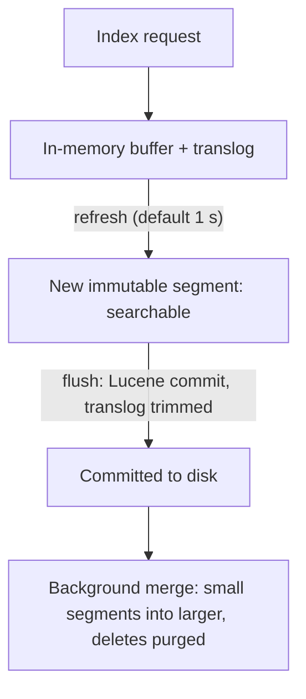
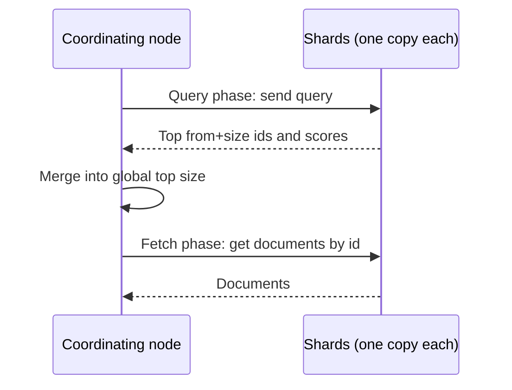
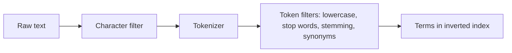

# 📊 Elasticsearch: Architecture & Internals

> **Target:** Staff/Principal Engineer | **Focus:** Elasticsearch architecture, inverted index, BM25 scoring, analysis pipeline, and fuzzy search | **Reviewed:** October 2026 (Elasticsearch 9.x / Lucene 10; OpenSearch is the Apache-licensed fork with the same core)

!!! tip "30-second answer"
    An index is split into **shards**, each a Lucene index made of immutable **segments**. Writes go to an in-memory buffer and a **translog**; a **refresh** (every 1 s by default) turns the buffer into a new searchable segment, which is why search is *near* real-time; a **flush** commits segments to disk and trims the translog; background **merges** combine small segments and purge deleted docs. Text is **analyzed** into terms stored in an **inverted index** (term → postings list); a query is analyzed the same way, run on every relevant shard (*query phase*: each returns its top-k doc ids and scores), merged by the coordinating node, then the winners are fetched (*fetch phase*). Relevance is **BM25** by default.

---

## 1. ARCHITECTURE OVERVIEW

```
                     ┌──────────────────┐
                     │    Client / API    │
                     └────────┬─────────┘
                              │
         ┌────────────────────┼────────────────────┐
         ▼                    ▼                    ▼
   ┌──────────┐         ┌──────────┐         ┌──────────┐
   │  Node 1   │         │  Node 2   │         │  Node 3   │
   │            │         │            │         │            │
   │ ┌────────┐ │         │ ┌────────┐ │         │ ┌────────┐ │
   │ │Index A │ │         │ │Index A │ │         │ │Index B │ │
   │ │Shard 0 │ │         │ │Shard 1 │ │         │ │Shard 0 │ │
   │ │(Primary)││         │ │(Primary)││         │ │(Primary)││
   │ └────────┘ │         │ └────────┘ │         │ └────────┘ │
   │ ┌────────┐ │         │ ┌────────┐ │         │ ┌────────┐ │
   │ │Index A │ │         │ │Index B │ │         │ │Index A │ │
   │ │Shard 1 │ │         │ │Shard 0 │ │         │ │Shard 0 │ │
   │ │(Replica)││         │ │(Replica)││         │ │(Replica)││
   │ └────────┘ │         │ └────────┘ │         │ └────────┘ │
   └────────────┘         └────────────┘         └────────────┘

Index A: 2 primary shards, 1 replica each. Index B: 1 primary, 1 replica.
A primary and its replica are never placed on the same node.
```

A document's shard is `hash(_routing) % number_of_primary_shards` (routing defaults to `_id`), which is why the primary shard count is fixed at index creation: changing it means `_split`, `_shrink` or a reindex. Replicas can be changed any time and also serve reads.

## 2. CORE CONCEPTS

| Concept | Description | Analogy |
|---------|-------------|---------|
| **Cluster** | Collection of nodes (servers) | A data center |
| **Node** | Single Elasticsearch instance | A server in the data center |
| **Index** | Collection of documents (one mapping per index; mapping *types* were removed in 7.x/8.x) | A database table |
| **Shard** | Horizontal partition of an index | A partition of a table |
| **Replica** | Copy of a shard for redundancy | A backup partition |
| **Document** | A JSON record | A database row |
| **Mapping** | Schema definition for documents | Table schema |
| **Inverted Index** | Maps terms → documents | Book index at the back |

## 3. INVERTED INDEX — The Core Data Structure

The **inverted index** is what makes Elasticsearch fast. Instead of scanning every document, it stores a mapping from each term to the documents containing it.

```
Documents:
Doc 1: "Harry Potter and the Sorcerer's Stone"
Doc 2: "Harry Potter and the Chamber of Secrets"
Doc 3: "The Lord of the Rings"

Inverted Index:
"harry"    → [Doc 1, Doc 2]
"potter"   → [Doc 1, Doc 2]
"sorcerer" → [Doc 1] 
"chamber"  → [Doc 2]
"lord"     → [Doc 3]
"rings"    → [Doc 3]

Search: "Harry Potter"
  → Look up "harry" → [Doc 1, Doc 2]
  → Look up "potter" → [Doc 1, Doc 2]
  → Intersection → [Doc 1, Doc 2]
  → Score by relevance (TF-IDF / BM25)
```

Real postings lists also store term frequencies and positions (for phrase queries), and the term dictionary is kept compact as an FST. Next to the inverted index, Lucene keeps **doc values** (a column store per field) for sorting and aggregations, and `_source` (the original JSON) for returning documents.

### 3.1 Segments, Refresh, Flush and Merge

```
index request ─► in-memory buffer + translog (append, fsync per request by default)
                     │ refresh (default every 1 s; skipped while an index is search-idle)
                     ▼
              new immutable SEGMENT  ─── now searchable (near real-time)
                     │ flush: Lucene commit to disk, translog trimmed
                     ▼
              background MERGE: small segments → larger ones, deleted docs purged
```

- Segments are **immutable**, so an update is "mark old doc deleted + index new doc", and deletes only free space at merge time.
- The **translog** makes acknowledged writes durable between Lucene commits; on crash, it is replayed.
- Bulk loading: set `refresh_interval: -1` (and replicas to 0) during the load, then restore. Use `?refresh=wait_for` when a caller must read its own write.

### 3.2 Distributed Search: Query Then Fetch

1. The **coordinating node** sends the query to one copy (primary or replica) of every shard.
2. **Query phase:** each shard returns only the ids and scores of its top `from + size` hits.
3. The coordinator merges them into the global top `size`.
4. **Fetch phase:** it fetches those documents from the shards that hold them.

Consequences: deep pagination costs `shards × (from + size)` (capped by `index.max_result_window`, 10,000 by default), so use `search_after` with a point-in-time (PIT) instead; and scores use *per-shard* term statistics, which can skew relevance on small indexes (`dfs_query_then_fetch` fixes it at extra cost).

*Figure: write path from indexing request to searchable segment and merge.*



*Figure: query-then-fetch across shards.*



## 4. TEXT ANALYSIS PIPELINE

```
Input Text: "Harry Potter and the Chamber of Secrets"
    │
    ▼
┌─────────────────────────────────────────────┐
│           ANALYSIS PIPELINE                   │
│                                                │
│  1. Character Filter                           │
│     └─ Remove HTML tags, convert &amp; → &     │
│                                                │
│  2. Tokenizer                                  │
│     └─ Split into tokens: ["Harry", "Potter",  │
│         "and", "the", "Chamber", "of",         │
│         "Secrets"]                              │
│                                                │
│  3. Token Filters                              │
│     ├─ Lowercase → ["harry", "potter", ...]   │
│     ├─ Stop words → ["harry", "potter",        │
│     │                "chamber", "secrets"]     │
│     ├─ Stemming (Porter) → ["harri", "potter",│
│     │                "chamber", "secret"]      │
│     └─ Synonyms → e.g. "hp" ↔ "harry potter"  │
│                                                │
│  Output: ["harri", "potter", "chamber",        │
│           "secret"]                            │
└─────────────────────────────────────────────┘
```

The built-in `standard` analyzer only tokenizes and lowercases (stop words are off by default); stemming and stop words come from language analyzers such as `english` or a custom analyzer. The **same analysis must apply at index and query time** (or a deliberately compatible `search_analyzer`), otherwise the query terms won't match the indexed terms. Use the `_analyze` API to see exactly what a field produces.

*Figure: analysis turns raw text into index terms; the same chain must apply at query time.*



## 5. SEARCH SCORING: BM25

```python
import math
import re

class BM25Scorer:
    """
    BM25 (Best Matching 25): The default relevance scoring algorithm in Elasticsearch.
    
    Key features:
    - Term frequency (TF): More occurrences → higher score (diminishing returns)
    - Inverse document frequency (IDF): Rare terms → higher weight
    - Field length normalization: Shorter fields → more significant matches
    """
    
    def __init__(self, k1: float = 1.2, b: float = 0.75):
        """
        k1: Controls term frequency saturation (default 1.2)
            Higher = more weight on frequency
        b:  Controls length normalization (default 0.75)
            b=0: No length normalization
            b=1: Full length normalization
        """
        self.k1 = k1
        self.b = b
    
    def score(self, term: str, document: str, 
              avg_doc_length: float, total_docs: int, 
              docs_with_term: int) -> float:
        """
        Compute BM25 score for a term in a document.
        
        BM25(t, d) = IDF(t) × (TF(t,d) × (k1 + 1)) / (TF(t,d) + k1 × (1 - b + b × |d|/avgdl))

        (Lucene drops the constant (k1 + 1) factor; it doesn't change ranking.)
        """
        tokens = re.findall(r"\w+", document.lower())  # toy analyzer
        tf = tokens.count(term)       # count TOKENS: str.count("cat") also matches "category"
        doc_length = len(tokens)      # length in terms, not characters
        
        # IDF component
        idf = math.log(1 + (total_docs - docs_with_term + 0.5) / (docs_with_term + 0.5))
        
        # TF component with saturation and length normalization
        tf_component = (tf * (self.k1 + 1)) / (
            tf + self.k1 * (1 - self.b + self.b * doc_length / avg_doc_length)
        )
        
        return idf * tf_component
```

Why BM25 beats plain TF-IDF: term frequency **saturates** (the 10th occurrence adds far less than the 2nd, controlled by `k1`), and length normalization (`b`) stops long documents winning just by containing more words.

### 5.1 Beyond BM25: Vector and Hybrid Search

Elasticsearch and OpenSearch also do approximate kNN over `dense_vector` fields (HNSW graphs per segment, with scalar or binary quantization to cut memory). Common production setups run **hybrid search**: BM25 and vector kNN in one request, fused with reciprocal rank fusion (RRF) or a learned/linear combination, then optionally re-ranked by a cross-encoder. Lexical matching still matters for exact terms (SKUs, names, error codes) that embeddings blur.

## 6. ELASTICSEARCH QUERY: Fuzzy Search Implementation

```json
// Fuzzy search for misspellings
GET /books/_search
{
  "query": {
    "match": {
      "title": {
        "query": "Harry Poter",
        "fuzziness": "AUTO",  // Auto-calculate edit distance
        "operator": "or",
        "minimum_should_match": "70%"
      }
    }
  }
}

// Autocomplete (edge n-grams). (Each PUT /books below is an alternative
// index definition; creating an existing index fails. Settings like the
// analyzer can't be changed on a live index without close/reopen or reindex.)
PUT /books
{
  "settings": {
    "analysis": {
      "analyzer": {
        "autocomplete_analyzer": {
          "tokenizer": "standard",
          "filter": ["lowercase", "autocomplete_filter"]
        }
      },
      "filter": {
        "autocomplete_filter": {
          "type": "edge_ngram",
          "min_gram": 1,
          "max_gram": 20
        }
      }
    }
  },
  "mappings": {
    "properties": {
      "title": {
        "type": "text",
        "analyzer": "autocomplete_analyzer",
        "search_analyzer": "standard"
      }
    }
  }
}

// Phonetic search (Soundex/Metaphone): needs the analysis-phonetic plugin
PUT /books
{
  "settings": {
    "analysis": {
      "filter": {
        "phonetic_filter": {
          "type": "phonetic",
          "encoder": "double_metaphone"
        }
      },
      "analyzer": {
        "phonetic_analyzer": {
          "tokenizer": "standard",
          "filter": ["lowercase", "phonetic_filter"]
        }
      }
    }
  }
}
```

## 7. IMPLEMENTATION: Elasticsearch Client for Search

```python
from elasticsearch import Elasticsearch
# The DSL lives inside the client since 8.18 / 9.0 (the separate
# elasticsearch-dsl package is now just a compatibility shim).
from elasticsearch.dsl import Search, Q

class SearchEngine:
    """
    Search with fuzzy fallback and "did you mean" (uses Autocorrect from
    the previous note).
    """
    
    def __init__(self, hosts: list | None = None, index: str = "books"):
        self.es = Elasticsearch(hosts or ["http://localhost:9200"])
        self.index = index
        self.autocorrect = Autocorrect(self._load_dictionary(index))
    
    def search(self, query: str, index: str = "books", 
               size: int = 10) -> dict:
        """Search with automatic fallback to fuzzy."""
        
        # Step 1: Try exact search first
        exact_results = self._exact_search(query, index, size)
        
        if exact_results["hits"]["total"]["value"] > 0:
            return exact_results
        
        # Step 2: Apply autocorrect (whole query, token by token)
        suggestions = self.autocorrect.suggest(query)
        corrected = suggestions[0] if suggestions else query
        if corrected != query:
            fuzzy_results = self._fuzzy_search(corrected, index, size)
            fuzzy_results["did_you_mean"] = corrected
            return fuzzy_results
        
        # Step 3: Fuzzy search with original query
        fuzzy_results = self._fuzzy_search(query, index, size)
        fuzzy_results["did_you_mean"] = None
        return fuzzy_results
    
    def _exact_search(self, query: str, index: str, size: int) -> dict:
        s = Search(using=self.es, index=index)
        s = s.query("match", title={"query": query, "operator": "and"})
        s = s.extra(size=size)
        return s.execute().to_dict()
    
    def _fuzzy_search(self, query: str, index: str, size: int) -> dict:
        s = Search(using=self.es, index=index)
        s = s.query(Q({
            "match": {
                "title": {
                    "query": query,
                    "fuzziness": "AUTO",
                    "operator": "or",
                    "minimum_should_match": "60%"
                }
            }
        }))
        s = s.extra(size=size)
        return s.execute().to_dict()
    
    def suggest(self, query: str, index: str = "books") -> list:
        """Get search suggestions using completion suggester."""
        s = Search(using=self.es, index=index)
        s = s.suggest("title_suggest", query, completion={
            "field": "title_suggest",
            "size": 5,
            "fuzzy": {
                "fuzziness": 2
            }
        })
        response = s.execute()
        return response.suggest.title_suggest[0].options
    
    def _load_dictionary(self, index: str) -> dict:
        """Word -> frequency for autocorrect.

        A terms aggregation on `title.keyword` would return whole TITLES, not
        words. Better sources: your query logs, or a separate keyword field
        holding individual words. In practice ES's own term/phrase suggesters
        often replace this custom dictionary entirely.
        """
        s = Search(using=self.es, index=index)
        s.aggs.bucket("words", "terms", field="title_words", size=10000)  # keyword field of single words
        response = s.execute()
        return {b.key: b.doc_count for b in response.aggregations.words.buckets}
```

## 8. SEARCH ARCHITECTURE SUMMARY

```
User Query: "Harry Poter"
    │
    ▼
┌─────────────────────────────────────────────┐
│            QUERY PROCESSING                   │
│                                                │
│  1. Tokenize & Normalize                       │
│     ├─ Lowercase: "harry poter"               │
│     ├─ Stop word removal                      │
│     └─ Stemming                               │
│                                                │
│  2. Search Execution                           │
│     ├─ Exact match (OR query)                 │
│     ├─ Fuzzy match (Levenshtein distance)     │
│     ├─ Phonetic match (Soundex/Metaphone)     │
│     └─ N-gram match (trigrams)               │
│                                                │
│  3. Scoring (BM25)                             │
│     ├─ TF × IDF × length norm                │
│     └─ Sort by relevance score                │
│                                                │
│  4. Post-processing                            │
│     ├─ Spelling correction                    │
│     │   └─ "Showing results for: Harry Potter"│
│     ├─ Query suggestions                      │
│     └─ Result deduplication                   │
│                                                │
│  5. Response                                   │
│     └─ Return results + metadata              │
└─────────────────────────────────────────────┘
```

---

> **Previous:** [Search Autocorrect & Misspelling Handling](12_SEARCH_AUTOCORRECT.md)
> **Next:** See [Job Scheduling Design](../../python-low-level-design/job-scheduling-system/NEW_AIRFLOW_LIKE_DESIGN.md) for the Airflow-like job scheduler LLD.
