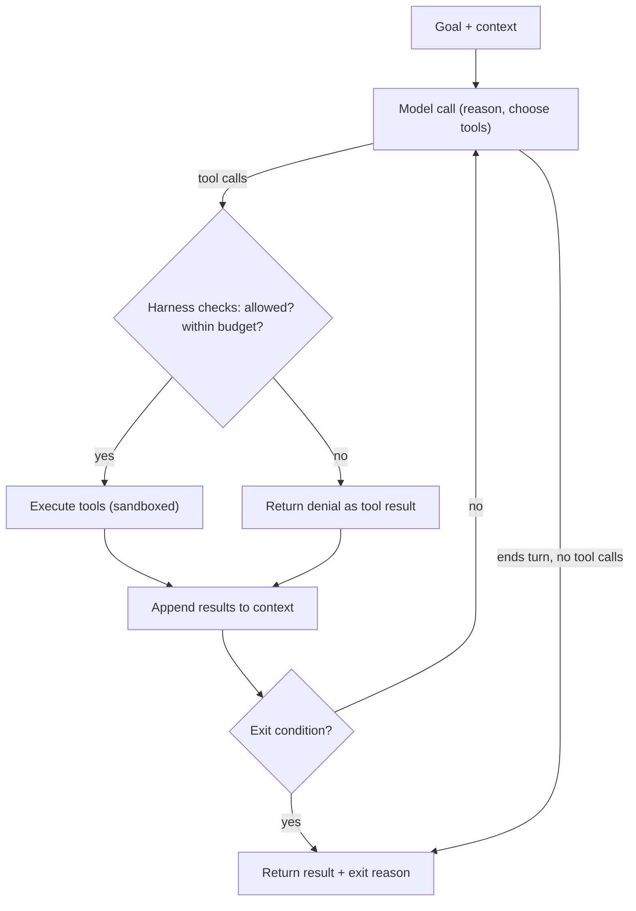

# 🔄 Loop Engineering — Designing Autonomous Agentic Loops

> **Target:** Staff/Principal Engineer | **Focus:** Production-grade agent loops — from the basic tool-use loop to enterprise orchestration

!!! tip "30-second answer"
    An agentic loop is: build context → call the model → if it asked for tools, run them and append the results → repeat until the model ends its turn or a limit trips. The model decides *what* to do next; your code decides *whether it is allowed*, *how long it may run* and *when to stop*. Start with the simplest structure that works (a single call, then a fixed workflow), and use an open-ended loop only when the steps can't be known in advance. Every loop needs several independent exit conditions (done, step cap, wall-clock, token/dollar budget, repeated-failure detection), idempotent tools, and a trace of every iteration.

---

## 1. WHAT IS LOOP ENGINEERING?

**Loop engineering** is designing the control flow that lets a model work iteratively towards a goal. It shifts the AI engineer's role:

> From "writing the perfect prompt" → to "writing the system that prompts the model, runs its tools and decides when it is done"

An agentic loop gives a model a goal, tools, and an environment, then lets it **reason, act, observe, and iterate** until it reaches an exit condition.



Planning, self-critique and delegation to sub-agents are not separate boxes in this loop; they are things the model (or a fixed workflow around it) does *inside* iterations.

---

## 2. LOOP PRIMITIVES

One useful decomposition of what a production loop needs:

| Primitive | Function | Implementation |
|-----------|----------|---------------|
| **Triggers** | Start a run | Cron, webhooks, queue messages, a user request |
| **Workspace** | Isolated environment per run | Git worktrees, temp directories, containers |
| **Skills / instructions** | Codified know-how the agent loads when relevant | `SKILL.md` files (Agent Skills format), `AGENTS.md` / `CLAUDE.md` |
| **Connectors** | Access to external systems | MCP servers, REST APIs, SDKs |
| **Sub-agents** | Delegated work in a fresh context | Orchestrator-worker pattern |
| **External state** | Durable progress across restarts and context resets | Progress files, to-do lists, databases, workflow-engine state |

```python
from dataclasses import dataclass, field


@dataclass
class LoopConfig:
    """Configuration for an agentic loop (illustrative)."""
    max_iterations: int = 25
    timeout_minutes: int = 60
    max_tokens_per_run: int = 200_000
    workspace_type: str = "git_worktree"     # or "temp_directory", "container"
    skills_path: str = ".claude/skills/"
    connectors: list["MCPConfig"] = field(default_factory=list)
    external_state_path: str = "progress.md"
```

---

## 3. THE CORE LOOP PATTERNS

Anthropic's "Building effective agents" (Dec 2024) draws a line worth using in interviews:

- **Workflows:** your code defines the steps; models fill them in. Prompt chaining, routing, parallelization, orchestrator-workers, evaluator-optimizer.
- **Agents:** the model decides the steps and tool calls in a loop until done.

Workflows are cheaper, faster and easier to test; agents handle problems whose path you can't predict. The patterns below sit along that spectrum.

### 3.1 ReAct Loop (Reason + Act)

The foundational pattern (Yao et al., 2022): the model alternates **Thought → Action → Observation**. Modern APIs implement it natively through tool use: the model returns tool-call blocks, you execute them and send back tool-result blocks. You no longer parse "Action:" lines out of text.

```
Iteration 1:
  Thought:     "I need the customer's subscription before answering."
  Action:      get_customer(email="user@example.com")
  Observation: {"id": 123, "plan": "basic", "renews": "2026-08-01"}

Iteration 2:
  Thought:     "They asked why a feature is missing; it's a Pro feature."
  Action:      search_kb(query="feature X plan availability")
  Observation: "Feature X is available on Pro and Enterprise."

Iteration 3:
  (no tool call) Final answer to the user, loop exits.
```

The manual loop with the Claude Messages API (Python SDK). This is the shape every agent framework wraps:

```python
import anthropic

client = anthropic.Anthropic()
MODEL = "claude-opus-5-5"  # model IDs change: check the current models overview


def run_agent(goal: str, tools: list[dict], handlers: dict, max_steps: int = 25) -> str:
    messages = [{"role": "user", "content": goal}]

    for _ in range(max_steps):
        response = client.messages.create(
            model=MODEL, max_tokens=16_000, tools=tools, messages=messages,
        )
        # Append the FULL content (text, thinking and tool_use blocks), not just text.
        messages.append({"role": "assistant", "content": response.content})

        if response.stop_reason == "end_turn":
            return "".join(b.text for b in response.content if b.type == "text")

        if response.stop_reason == "pause_turn":
            continue  # a long server-side tool turn paused; send it back to resume

        if response.stop_reason != "tool_use":
            # max_tokens, refusal, ...: don't execute anything, surface it
            raise RuntimeError(f"Stopped early: {response.stop_reason}")

        # Run every requested tool, then return ALL results in ONE user message.
        results = []
        for block in response.content:
            if block.type != "tool_use":
                continue
            try:
                output = handlers[block.name](**block.input)
                results.append({"type": "tool_result", "tool_use_id": block.id,
                                "content": str(output)})
            except Exception as e:  # report failures to the model instead of crashing
                results.append({"type": "tool_result", "tool_use_id": block.id,
                                "content": f"Error: {e}", "is_error": True})
        messages.append({"role": "user", "content": results})

    raise RuntimeError(f"Exceeded {max_steps} steps")
```

Details interviewers check:

- Every `tool_use` block needs a matching `tool_result` (same `tool_use_id`) in the next user message, including failed ones, marked `is_error`.
- The API is stateless: you resend the whole history each step, so cost grows with every iteration. Prompt caching of the stable prefix (tools, system prompt, earlier turns) is what keeps long loops affordable.
- The Anthropic SDKs also ship a beta **tool runner** that drives this loop for you, and the Claude Agent SDK packages the full Claude Code harness. Know the manual loop anyway; it's what you debug.

**When to use:** interactive problem-solving, debugging, support: anywhere the next step depends on the last result.

**Key risk:** it can wander or loop indefinitely. Always set step, time and token limits (section 4).

### 3.2 Plan-and-Execute Loop

The agent writes a plan **first**, then executes it step by step, re-planning when a step fails.

```
Phase 1 — Planning:
  "To analyze this sales report, I will:
    1. Read the CSV file
    2. Compute monthly aggregates
    3. Identify top-5 products by revenue
    4. Generate a summary chart
    5. Email the report"

Phase 2 — Execution:
  Step 1: read_file("sales_report.csv") → ✅ data loaded
  Step 2: aggregate(data, group="month") → ✅ monthly totals
  Step 3: top_n(data, n=5, metric="revenue") → ✅ top products
  Step 4: generate_chart(data) → ✅ chart saved
  Step 5: send_email("report@example.com", attachment="chart.png") → needs approval
```

```python
async def plan_and_execute(goal: str, tools, max_replans: int = 3, max_retries: int = 2):
    """Plan-and-execute with bounded retries and re-planning (sketch)."""
    plan = await llm.generate_plan(goal)
    done: list[StepResult] = []
    replans = 0

    while plan.steps:
        step = plan.steps.pop(0)
        for attempt in range(max_retries + 1):
            try:
                done.append(StepResult(step, "success", await execute_step(step, tools)))
                break
            except RetryableError:
                if attempt == max_retries:
                    raise
            except Exception as e:
                replans += 1
                if replans > max_replans:
                    raise PlanExecutionError(f"Gave up after {max_replans} re-plans: {e}")
                plan = await llm.replan(goal, completed=done, failed_step=step, error=str(e))
                break  # continue with the new plan's remaining steps

    return done
```

**When to use:** multi-step tasks whose structure is clear up front (reports, migrations, data analysis).

**Advantages:** predictable, auditable, resumable (persist the plan and completed steps), and independent steps can run in parallel.

**Disadvantage:** the plan can be wrong from the start. Re-planning on failure is the fallback; a human review of the plan before execution is a cheap, effective gate for risky tasks.

### 3.3 Critic-Refiner Loop (Reflection / Evaluator-Optimizer)

A **producer** generates output and a **critic** evaluates it against a rubric; the producer revises until the critic passes it or the iteration cap is hit.

```python
async def critic_refiner_loop(task, producer, critic, rubric, max_iterations: int = 3):
    """Evaluator-optimizer loop (sketch)."""
    draft = await producer.generate(task)
    for i in range(max_iterations):
        evaluation = await critic.evaluate(draft, rubric)
        if evaluation.passed:
            return draft, i + 1
        draft = await producer.revise(draft, evaluation.feedback)
    return draft, max_iterations  # best effort: flag for human review
```

**When to use:** writing, translation, code: tasks with clear quality criteria where feedback demonstrably improves the result.

**Trade-offs and failure modes:**

- Each round adds at least one producer call and one critic call, so latency and cost scale with rounds. Measure the gain on your eval set; don't assume it.
- **The critic is the weak point.** A model critiquing its own output without new information often fails to find its own reasoning errors and can even make correct answers worse (Huang et al., 2023, "Large Language Models Cannot Self-Correct Reasoning Yet"). Reflection works best when the critic has an **external signal**: test results, a compiler, retrieved sources, a different model, or a specific rubric.
- Oscillation: the producer flips between two versions. Cap rounds and keep the best-scoring draft, not the last one.

### 3.4 Orchestrator-Worker Loop

A central **orchestrator** decomposes the task, delegates sub-tasks to **workers** (often in parallel, each with its own fresh context), then synthesizes their results.

```
                ┌───────────────────┐
                │   Orchestrator    │
                │ (task decomposer) │
                └──┬──────┬──────┬──┘
                   │      │      │
        ┌──────────┘      │      └──────────┐
        ▼                 ▼                 ▼
  ┌──────────┐      ┌──────────┐      ┌──────────┐
  │ Worker A │      │ Worker B │      │ Worker C │
  │ (search) │      │ (analyze)│      │ (write)  │
  └────┬─────┘      └────┬─────┘      └────┬─────┘
       └─────────────────┼─────────────────┘
                         ▼
                ┌───────────────────┐
                │    Synthesizer    │
                │  (merge results)  │
                └───────────────────┘
```

```python
import asyncio


async def orchestrator_loop(goal: str, workers: dict[str, "Agent"], orchestrator: "Agent"):
    """Orchestrator-worker with parallel dispatch (Python 3.11+ TaskGroup)."""
    tasks = await orchestrator.decompose(goal)

    async with asyncio.TaskGroup() as tg:  # cancels siblings if one raises
        futures = {t.id: tg.create_task(workers[t.worker_type].run(t)) for t in tasks}

    results = {task_id: f.result() for task_id, f in futures.items()}
    return await orchestrator.synthesize(goal, results)
```

**When to use:** breadth-first work that splits cleanly: research across many sources, per-file or per-record processing, or anything where one context would overflow with reading.

**Trade-offs:** multi-agent runs use several times the tokens of a single agent; it pays off only when parallelism or context isolation buys real quality or latency. Workers that need to share evolving state (e.g. editing the same code) coordinate badly; keep shared-write tasks in one agent. Decide whether one worker's failure should fail the whole run (`TaskGroup`) or degrade gracefully (`asyncio.gather(..., return_exceptions=True)`).

---

## 4. LOOP SAFETY & TERMINATION

### 4.1 Exit Conditions

Every loop must have several independent, verifiable exit conditions. "The model said it was done" is necessary but never sufficient.

| Condition | Trigger | Implementation |
|-----------|---------|---------------|
| **Task complete** | Model ends its turn without tool calls, **and** verification passes | `stop_reason == "end_turn"` + tests/validators |
| **Max iterations** | Hard cap on steps | `max_iterations=25` |
| **Timeout** | Wall-clock limit | `timeout_seconds=300` |
| **Token budget** | Token consumption cap | Sum `usage` from each response |
| **Cost budget** | Dollar cap | Tokens × current prices, including cache reads/writes |
| **Error threshold** | Consecutive failures | `max_consecutive_errors=3` |
| **No progress** | Same tool call with same arguments repeated, or no state change for N steps | Hash `(tool, args)` per step |

```python
import time


class LoopTerminator:
    """Decides whether the loop must stop, independently of the model."""

    def __init__(self, config: "LoopConfig", max_consecutive_errors: int = 3, max_repeats: int = 3):
        self.config = config
        self.max_consecutive_errors = max_consecutive_errors
        self.max_repeats = max_repeats
        self.start = time.monotonic()
        self.seen_calls: dict[int, int] = {}

    def record_call(self, tool: str, args: dict) -> None:
        key = hash((tool, repr(sorted(args.items()))))
        self.seen_calls[key] = self.seen_calls.get(key, 0) + 1

    def should_terminate(self, state: "LoopState") -> tuple[bool, str]:
        if state.task_complete and state.verified:
            return True, "task_complete"
        if state.iteration >= self.config.max_iterations:
            return True, "max_iterations"
        if time.monotonic() - self.start > self.config.timeout_minutes * 60:
            return True, "timeout"
        if state.token_count >= self.config.max_tokens_per_run:
            return True, "token_budget_exceeded"
        if state.consecutive_errors >= self.max_consecutive_errors:
            return True, "too_many_errors"
        if any(n >= self.max_repeats for n in self.seen_calls.values()):
            return True, "no_progress"
        return False, ""
```

When a limit trips, don't just throw: return the partial result, the exit reason and a summary of what was done, so a human or a later run can continue.

A softer alternative to hard cut-offs is telling the model its remaining budget so it can wrap up gracefully. The Claude API has a beta **task budget** feature for this (an advisory token budget the model can see); check current docs for supported models. Keep your own hard limit regardless.

### 4.2 Circuit Breaker Pattern

Stop hammering a failing dependency (a tool's backend, a rate-limited API) and fail fast instead:

```python
import time


class LoopCircuitBreaker:
    """closed → open after N failures → half-open after a cool-down → closed on success."""

    def __init__(self, failure_threshold: int = 5, recovery_timeout: float = 60.0):
        self.failure_threshold = failure_threshold
        self.recovery_timeout = recovery_timeout
        self.failure_count = 0
        self.state = "closed"
        self.opened_at = 0.0
        self.probe_in_flight = False

    def allow_request(self) -> bool:
        if self.state == "closed":
            return True
        if self.state == "open":
            if time.monotonic() - self.opened_at < self.recovery_timeout:
                return False
            self.state = "half-open"
        # half-open: let exactly one probe through
        if self.probe_in_flight:
            return False
        self.probe_in_flight = True
        return True

    def record_success(self) -> None:
        self.failure_count = 0
        self.state = "closed"
        self.probe_in_flight = False

    def record_failure(self) -> None:
        self.probe_in_flight = False
        self.failure_count += 1
        if self.state == "half-open" or self.failure_count >= self.failure_threshold:
            self.state = "open"
            self.opened_at = time.monotonic()
```

When the breaker is open, return a tool result saying the tool is temporarily unavailable, so the model can choose another path instead of retrying blindly. (Single-threaded sketch; guard state with a lock if tools run concurrently.)

---

## 5. LOOP OBSERVABILITY

### 5.1 Tracing the Loop

Every iteration must be reconstructable after the fact: what the model saw, what it asked for, what the tools returned, and why the loop stopped.

```python
from dataclasses import dataclass
from typing import Any, Optional


@dataclass
class LoopSpan:
    """Trace span for one model call or tool call."""
    iteration: int
    kind: str                     # "model_call" | "tool_call" | "guardrail"
    name: str                     # model ID or tool name
    input_tokens: int
    output_tokens: int
    cache_read_tokens: int
    latency_ms: float
    tool_args: Optional[dict] = None
    tool_result_summary: Optional[str] = None
    error: Optional[str] = None


@dataclass
class LoopTrace:
    """Complete trace of one loop run."""
    session_id: str
    goal: str
    spans: list[LoopSpan]
    total_cost_usd: float
    exit_reason: str
    final_output: Optional[Any]
```

Emit these as OpenTelemetry spans (the GenAI semantic conventions define standard attribute names) so they land in whatever tracing backend you already use.

### 5.2 Key Metrics to Track

Thresholds below are illustrative; set yours from your own baseline.

| Metric | What It Measures | Example alert |
|--------|-----------------|----------------|
| **Task success rate** | Runs that end verified-complete | Drops vs 7-day baseline |
| **Iterations per run** | Steps to finish | p95 well above baseline |
| **Step latency** | Time per model + tool call | p95 regression |
| **Tool error rate** | Fraction of tool calls that fail | > 10% |
| **Cost per completed task** | All tokens and tool costs ÷ successful tasks | Above budget |
| **Cache hit ratio** | Cached input tokens ÷ total input tokens | Sudden drop (a prefix changed) |
| **Exit-reason mix** | Share of `timeout`, `no_progress`, `max_iterations` | Any non-success reason trending up |

---

## 6. PRODUCTION LOOP DESIGN PATTERNS

### 6.1 The "Comprehension Debt" Problem

Agents can produce code faster than a team can understand it. Code that ships without anyone understanding it is a debt you pay later in incidents and slow changes.

Loop engineering is not a replacement for human understanding. It is a way to **delegate mechanical iteration** while keeping humans in charge of design.

**Mitigation strategies:**
- Require human review of architectural decisions and of the plan before large changes
- Have the loop produce a summary of what it changed and why, alongside the diff
- Use sub-agents for exploration and drafts; keep final decisions with a reviewer

### 6.2 When to Loop (vs. When Not To)

| Loop-worthy | Not loop-worthy |
|-------------|----------------|
| Multi-step research | Single-turn Q&A |
| Code changes with tests to run | Simple text transformation |
| Bug investigation | Known lookup queries |
| Report generation over many sources | Static template filling |
| Debugging a data pipeline | A deterministic ETL job (use the scheduler) |

**Rule of thumb:** loop when

1. the next step depends on intermediate results,
2. you have a **reliable signal** of progress (tests, validators, a checkable end state), and
3. the value of the task justifies the extra latency and the cost of resending context every step.

### 6.3 Enterprise Loop Runtime

For production loops at scale:

```yaml
loop_runtime:
  orchestration:
    - State persistence: PostgreSQL, or a durable-execution engine (Temporal, Step Functions)
    - Concurrency control: leases/locks with fencing tokens (a Redis lease alone is not safe)
    - Queue management: SQS / RabbitMQ / Kafka for run dispatch

  isolation:
    - Per-run workspace: container or microVM with resource limits
    - Credential scoping: short-lived tokens per run, end-user permissions

  governance:
    - Approval gates: human-in-the-loop for destructive or outbound actions
    - Audit trail: append-only log of every model call, tool call and approval
    - Budget enforcement: per-run and per-tenant token/cost budgets

  reliability:
    - Retry policy: exponential backoff with jitter; honour retry-after on 429
    - Dead letter queue: failed runs for manual review
    - Idempotency: tool calls carry a request ID so retries don't duplicate side effects
    - Checkpointing: resume a crashed run from the last completed step
```

Durable-execution engines fit agent loops well: each model call and tool call becomes a recorded activity, so a crashed worker resumes without re-running completed side effects.

### 6.4 Context Management in Long-Running Loops

Long loops fill the context window with tool output. Past a point the model gets slower, costlier and worse at recalling earlier constraints. Options, roughly in the order to try them:

1. **Return less:** tools return concise, relevant output (paginate, truncate, summarise server-side).
2. **Clear old tool results** once they've been used; the record of the call stays.
3. **Compaction:** summarise the history into a fresh context when near the limit.
4. **External memory:** the agent keeps a progress file / to-do list / git log it re-reads after compaction or on a fresh start. Anthropic's "Effective harnesses for long-running agents" describes this for multi-session coding: an initializer run writes a feature list and progress notes, and each later session reads them, works on one item, and commits.
5. **Sub-agents** for reading-heavy sub-tasks, returning short summaries.

The Claude API offers server-side compaction and context editing; check current docs for which models and betas apply.

---

## 7. LOOP ENGINEERING INTERVIEW QUESTIONS

| Question | Key Topics | Evaluation Rubric |
|----------|-----------|-------------------|
| "Design an agentic loop for automated bug fixing." | Tool-use loop + test verification, worktrees, PR creation | Sandboxed execution, reproduce-first, tests as the exit signal, iteration limits, human review before merge |
| "How would you prevent an agent from looping forever?" | Step cap, timeout, budget, repetition detection, circuit breaker | Multiple independent exit conditions, enforced outside the model, plus a kill switch |
| "Compare ReAct vs Plan-and-Execute for a data analysis agent." | Flexibility vs predictability, observability, failure modes | Matches pattern to task (exploratory vs structured); mentions re-planning |
| "Design a cost-effective loop for support ticket resolution." | Routing, retrieval before the model, budgets, escalation | Cheap model/route for easy tickets, caching, token budgets, human escalation |
| "How would you make a loop observable in production?" | Traces, metrics, audit trail, cost attribution | One trace per run, spans per call, cost per completed task, exit-reason alerts |

**What they probe next:** "Your loop retried a tool call that charges a credit card; what happens?" (idempotency keys). "The agent says it's done but the tests fail" (verification gates the exit, not the model's claim). "A run crashed at step 40 of 50" (checkpointing, durable execution). "Cost per run doubled overnight" (cache hit ratio dropped because something volatile entered the prefix, or iterations increased).

---

## 8. LOOP PERFORMANCE OPTIMIZATION

| Technique | Effect | Trade-off |
|-----------|--------|-----------|
| **Parallel tool calls / sub-agents** | Lower wall-clock time for independent work | Higher peak cost; merging results |
| **Prompt caching of the stable prefix** | Much cheaper and faster repeated input | Prefix must stay byte-identical; cache entries expire |
| **Cached tool results** | Fewer redundant calls | Staleness for time-sensitive data |
| **Smaller/cheaper model or lower effort for easy steps** | Lower cost and latency | Quality drop; measure per route |
| **Early exit when verification passes** | Fewer iterations on easy tasks | Must trust the verifier |
| **Token budgets** | Predictable cost | May cut off complex tasks |

Measure each on your own eval set; gains vary too much by workload for generic percentages to be meaningful.

---

## 9. LOOP ENGINEERING CHECKLIST

| Requirement | Implementation | Status |
|------------|---------------|--------|
| **Exit conditions** | Verified completion, step cap, timeout, budget, no-progress detection | 📋 |
| **Circuit breaker** | Per-dependency, with half-open probe | 📋 |
| **Observability** | One trace per run, spans per call, exit-reason metrics | 📋 |
| **Isolation** | Per-run workspace, scoped short-lived credentials | 📋 |
| **Error recovery** | Retry with backoff, re-planning, dead letter queue | 📋 |
| **Human-in-the-loop** | Approval gates for irreversible or outbound actions | 📋 |
| **Cost governance** | Per-run and per-tenant budgets, cost per completed task | 📋 |
| **Idempotency** | Request IDs on side-effecting tools | 📋 |
| **State persistence** | Checkpoints / durable execution across restarts | 📋 |
| **Context management** | Concise tools, result clearing, compaction, progress notes | 📋 |
| **Comprehension debt** | Plan review, change summaries, human review | 📋 |

---

> **Prev:** [Harness Engineering](01_HARNESS_ENGINEERING.md) | **Next:** Related → [Agent Fundamentals](../agents/01_AGENT_FUNDAMENTALS.md)
