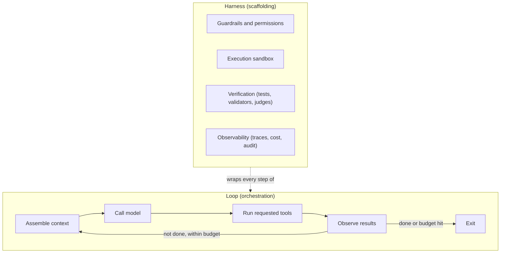

# 🔧 Harness & Loop Engineering

> **Building the production scaffolding around a model (the harness) and the iterative control flow that drives it (the loop).**

---

## Overview

A model on its own only turns tokens into tokens. Everything that lets it act safely in production (tools, sandboxes, permissions, verification, memory, tracing) is the **harness**, and the control flow that repeatedly calls the model, runs tools and decides when to stop is the **loop**. When teams use comparable frontier models, these two layers decide most of the reliability, cost and safety differences you see in production.

The common shorthand is **Agent = Model + Harness**: the harness is everything except the model weights. The term was popularised in early 2026 by OpenAI's write-up on building with Codex and by Birgitta Böckeler's article on martinfowler.com, which frames the harness as *guides* (feedforward controls) and *sensors* (feedback controls). Anthropic's engineering posts ("Building effective agents", "Effective harnesses for long-running agents", "Effective context engineering for AI agents") cover the same ground with concrete patterns.

---

## Contents

| # | Document | Description |
|---|----------|-------------|
| 1 | [Harness Engineering](01_HARNESS_ENGINEERING.md) | Evaluation vs agent harnesses, guardrails, prompt-injection containment, sandboxing, verification, budgets |
| 2 | [Loop Engineering](02_LOOP_ENGINEERING.md) | The tool-use loop, ReAct, plan-and-execute, evaluator-optimizer, orchestrator-workers, termination, context management in long loops |

---

## Key Insight

- **Harness engineering** answers: *How do we make the agent safe, observable and controllable?*
- **Loop engineering** answers: *How do we make the agent make progress towards a goal, and stop at the right time?*

---

## Related Modules

- **[Agents](../agents/README.md)**: agent architectures, orchestration, tool-use patterns
- **[MCP](../mcp/README.md)**: the protocol for connecting tools and data sources to the harness
- **[RAG](../rag/README.md)**: retrieval as one of the harness's memory sources
