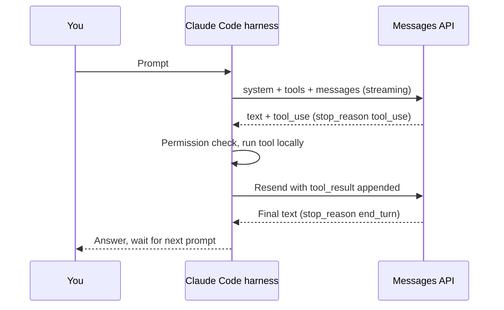
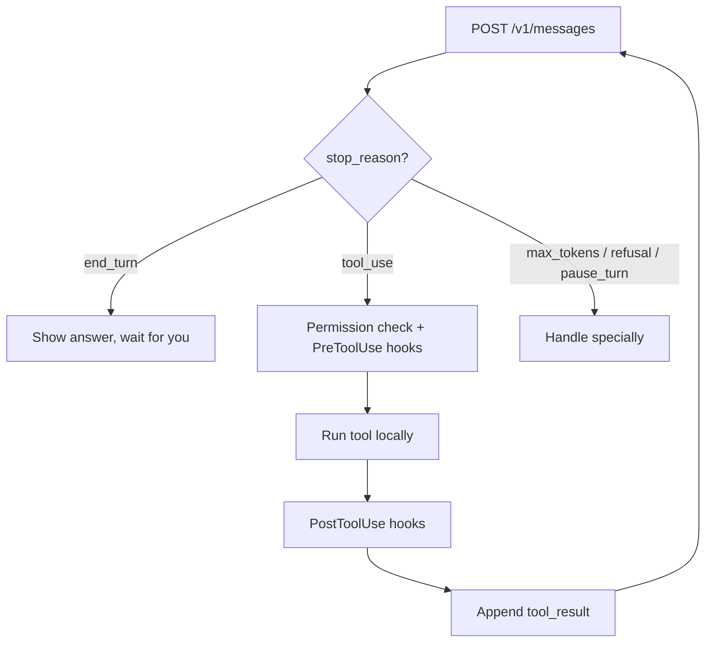
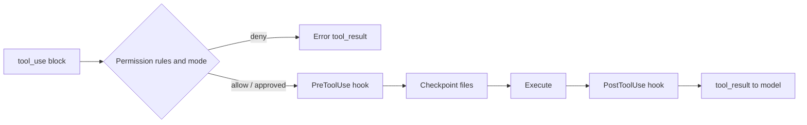

# 💻 Claude Code — How It Interacts with the Model

> **What actually happens when you type a prompt into Claude Code: the agentic loop, what goes into each model request, how tool calls come back and get executed, and how context is managed. Based on the official docs at [code.claude.com](https://code.claude.com/docs/en/how-claude-code-works), checked October 2026.**

!!! warning "Documented vs. inferred"
    Anthropic documents Claude Code's behaviour (tools, permissions, context management, memory), but not the exact text of its system prompt or every field of its API requests. Where this page shows a request body, it shows the **public Messages API shape** that any client, including Claude Code, has to use; the specific values are illustrative. Run `/context` in a session to see what is actually occupying the window.

**30-second answer:** Claude Code is an *agentic harness*: a loop around a Claude model that supplies tools (read/edit files, run shell commands, search, fetch the web, spawn sub-agents) and manages the context the model sees. Each step is one Messages API call: Claude Code sends the system prompt, tool definitions and the full conversation; the model replies with text and/or `tool_use` blocks; Claude Code checks permissions, runs the tools on your machine, appends `tool_result` blocks, and calls the model again. The loop ends when the model replies without asking for a tool.

---

## 1. WHAT IS CLAUDE CODE?

**Claude Code** is Anthropic's agentic coding tool. In the docs' words, "Claude Code is the layer around the model that provides the tools and manages the context the model sees. This surrounding layer is what the term agentic harness refers to."

Same loop, many front-ends: the terminal CLI, IDE extensions (VS Code, JetBrains), a desktop app, the web (claude.ai/code, running in Anthropic-managed cloud VMs), Slack, and CI (GitHub Actions). The **Claude Agent SDK** exposes the same harness as a Python/TypeScript library. There is no separate product called "Claude Editor"; the IDE integration *is* Claude Code.

```ascii
┌──────────────────────────────────────────────────────────────────┐
│                  CLAUDE CODE = MODEL + HARNESS                   │
│                                                                  │
│  ┌──────────┐    ┌────────────────────────────┐   ┌────────────┐ │
│  │  You     │───►│  Claude Code (harness)     │──►│ Claude API │ │
│  │ terminal │◄───│  • agentic loop            │◄──│ (or Bedrock│ │
│  │ IDE, web │    │  • tools: Read, Edit,      │   │ / Vertex / │ │
│  └──────────┘    │    Write, Bash, WebFetch,  │   │ Foundry)   │ │
│                  │    WebSearch, Agent, Skill │   └────────────┘ │
│                  │    + MCP tools             │                  │
│                  │  • permissions & hooks     │                  │
│                  │  • context mgmt (compact)  │                  │
│                  │  • checkpoints, sessions   │                  │
│                  └─────────────┬──────────────┘                  │
│                                ▼                                 │
│                  Your files, shell, git, network                 │
└──────────────────────────────────────────────────────────────────┘
```

The model runs remotely; **tools run locally** (or in the cloud VM for web sessions). The model never touches your disk directly; it only asks.

---

## 2. THE FULL INTERACTION CYCLE

The docs describe three blended phases: **gather context → take action → verify results**, repeated until done. Mechanically:

```ascii
┌─────────────────────────────────────────────────────────────────────┐
│  YOU: "Add a /health endpoint to the FastAPI app"                   │
│   │                                                                 │
│   ▼                                                                 │
│  STEP 1  Session context is already loaded                          │
│          system prompt, tool definitions, CLAUDE.md files,          │
│          auto memory, skill descriptions, MCP tool names,           │
│          environment info (cwd, git state, platform)                │
│   │                                                                 │
│   ▼                                                                 │
│  STEP 2  POST /v1/messages  (streaming)                             │
│          system + tools + messages[] (whole conversation so far)    │
│   │                                                                 │
│   ▼                                                                 │
│  STEP 3  Stream back: text ("I'll look at main.py") + tool_use      │
│          stop_reason = "tool_use"                                   │
│   │                                                                 │
│   ▼                                                                 │
│  STEP 4  For each tool_use: permission check (rules, mode, hooks)   │
│          → run it locally → collect output                          │
│   │                                                                 │
│   ▼                                                                 │
│  STEP 5  Append assistant turn + a user turn of tool_result blocks  │
│          → back to STEP 2                                           │
│   │                                                                 │
│   ▼  (when stop_reason = "end_turn")                                │
│  STEP 6  Final text is already on screen; wait for your next prompt │
└─────────────────────────────────────────────────────────────────────┘
```

Two things candidates get wrong:

- **Claude Code doesn't pre-scan your repo.** It doesn't read every file before the first call. The model *chooses* to search and read via tools. What's preloaded is a small, deliberate set: CLAUDE.md, memory, git status, environment info, tool and skill descriptions.
- **You're in the loop.** Press `Esc` to stop the current step, or type a message while Claude works; it's queued and read after the current tool calls finish.

*Figure: one Claude Code turn as messages between you, the harness and the API.*



---

## 3. WHAT DATA IS SENT TO THE MODEL?

Every model call carries the full state, because the API is stateless.

### 3.1 System Prompt and Injected Context

The exact system prompt isn't published. What the docs say goes into context:

| Source | When it loads |
|--------|---------------|
| Claude Code's own instructions (tool usage, safety, git/commit conventions, output style) | Every request |
| **CLAUDE.md** files (user, project, and directory-level) | Session start; Claude Code also re-injects them as reminders |
| **Auto memory** (`MEMORY.md`: first 200 lines or 25KB) | Session start |
| **Skills**: descriptions only; full skill body only when invoked | Session start / on use |
| **MCP tools**: names and server instructions; full schemas deferred and loaded via tool search when needed | Session start / on use |
| Environment: working directory, git branch/status, platform, date | Session start |
| System reminders: e.g. "file X changed on disk", attribution lines | As they occur |

### 3.2 Tool Definitions

Built-in tool names are exact strings you use in permission rules and hooks ([tools reference](https://code.claude.com/docs/en/tools-reference)). The core ones:

| Tool | Purpose | Asks permission (Manual mode)? |
|------|---------|----------------|
| `Read` | Read a file (with line numbers); also images, PDFs, notebooks | No (inside the working dir) |
| `Edit` | Exact-string replacement in a file | Yes |
| `Write` | Create or fully overwrite a file | Yes |
| `Bash` | Run a shell command | Yes (a built-in set of read-only commands doesn't prompt) |
| `Glob` / `Grep` | Find files by pattern / search contents (ripgrep). On macOS/Linux they're off by default and Claude uses `find`/`grep` through Bash | No |
| `WebFetch` / `WebSearch` | Fetch a URL / search the web | Yes |
| `Agent` | Spawn a sub-agent with its own context window | No |
| `Skill` | Load and run a skill | Yes |
| `AskUserQuestion` | Ask you multiple-choice clarifying questions | No |
| `TaskCreate` / `TaskUpdate` … | Session task list (replaced `TodoWrite`) | No |
| `LSP`, `NotebookEdit`, MCP tools… | Code intelligence, notebooks, external services | Varies |

A tool definition is just `name` + `description` + JSON-Schema `input_schema`. Illustrative example in the Messages API format:

```json
{
  "name": "Edit",
  "description": "Performs exact string replacement in a file...",
  "input_schema": {
    "type": "object",
    "properties": {
      "file_path":   {"type": "string"},
      "old_string":  {"type": "string"},
      "new_string":  {"type": "string"},
      "replace_all": {"type": "boolean"}
    },
    "required": ["file_path", "old_string", "new_string"]
  }
}
```

### 3.3 Messages Array

The conversation is a list of alternating `user` / `assistant` turns. Tool results go back in a **user** turn, matched by `tool_use_id`:

```json
[
  {"role": "user", "content": "Add a /health endpoint to the FastAPI app"},
  {"role": "assistant", "content": [
    {"type": "text", "text": "Let me find the app entry point."},
    {"type": "tool_use", "id": "toolu_01A", "name": "Bash",
     "input": {"command": "grep -rn \"FastAPI()\" --include=*.py ."}}
  ]},
  {"role": "user", "content": [
    {"type": "tool_result", "tool_use_id": "toolu_01A",
     "content": "./app/main.py:3:app = FastAPI()"}
  ]}
]
```

If the model asks for several tools in one turn (parallel tool use), *all* their results go back together in the next user message.

### 3.4 The Request

Claude Code calls the Claude API directly, or Bedrock / Vertex AI / Foundry, or any gateway that exposes the Messages API format. A raw call looks like this (illustrative values):

```http
POST https://api.anthropic.com/v1/messages
x-api-key: $ANTHROPIC_API_KEY          (subscription logins use an OAuth bearer token instead)
anthropic-version: 2023-06-01
content-type: application/json

{
  "model": "claude-opus-5-5",
  "max_tokens": 32000,
  "stream": true,
  "system": [ ... ],          // cache_control breakpoints on the stable prefix
  "tools": [ ... ],
  "messages": [ ... ]
}
```

What you *can* rely on: the model is whatever `/model` shows (Sonnet for most coding, Opus for harder reasoning, Haiku for cheap sub-agents); thinking is on by default and tuned with `/effort`; prompt caching is applied automatically. Claims like "Claude Code always sends `temperature: 0`" aren't documented, and current models don't accept a non-default temperature anyway.

---

## 4. HOW RESPONSES COME BACK

Responses stream as **server-sent events (SSE)**. Event order for a turn that says something and then calls a tool:

```ascii
message_start          { message: { id, model, usage: { input_tokens, cache_read_input_tokens, ... } } }
content_block_start    { index: 0, content_block: { type: "text" } }
content_block_delta    { index: 0, delta: { type: "text_delta", text: "Let me find" } }
content_block_delta    { index: 0, delta: { type: "text_delta", text: " the entry point." } }
content_block_stop     { index: 0 }
content_block_start    { index: 1, content_block: { type: "tool_use", id: "toolu_01A", name: "Bash", input: {} } }
content_block_delta    { index: 1, delta: { type: "input_json_delta", partial_json: "{\"command\": \"grep" } }
content_block_delta    { index: 1, delta: { type: "input_json_delta", partial_json: " -rn ...\"}" } }
content_block_stop     { index: 1 }
message_delta          { delta: { stop_reason: "tool_use" }, usage: { output_tokens: 84 } }
message_stop
```

Details that matter:

- **Tool arguments stream as partial JSON** (`input_json_delta`); the client concatenates and parses at `content_block_stop`.
- **Thinking** arrives as `thinking` blocks (`thinking_delta`, then a `signature_delta`) before the text. Thinking blocks must be passed back unchanged with tool results.
- `ping` events keep the connection alive; an `error` event (e.g. `overloaded_error`) can arrive mid-stream.
- `usage` in `message_start` reports input-side counts (including cache reads/writes); `message_delta` carries the cumulative output count.

Non-streaming responses return the same content blocks in one JSON `Message` object.

---

## 5. THE TOOL USE LOOP

```ascii
            ┌──────────────────────────────┐
            │  POST /v1/messages           │◄──────────────────┐
            └──────────────┬───────────────┘                   │
                           ▼                                   │
            ┌──────────────────────────────┐                   │
            │ stop_reason?                 │                   │
            └──┬────────────┬──────────┬───┘                   │
     end_turn  │   tool_use │          │ max_tokens / refusal  │
               ▼            ▼          ▼ / pause_turn ...      │
        show answer   ┌─────────────────────┐  handle specially │
        wait for you  │ permission check    │                   │
                      │ PreToolUse hooks    │                   │
                      │ run tool(s) locally │                   │
                      │ PostToolUse hooks   │                   │
                      │ append tool_result  │───────────────────┘
                      └─────────────────────┘
```

| Task | Typical model calls |
|------|--------------------|
| Answer a question about the code | 2–6 (search, read, answer) |
| Small edit | 3–6 (find, read, edit, verify) |
| New feature | 10–40 |
| Large refactor or debugging session | dozens to hundreds |

These are rough orders of magnitude, not documented figures. Parallel tool calls reduce the count: one turn can read five files at once.

*Figure: the loop branches on stop_reason after every call.*



---

## 6. HOW CONTEXT GROWS AND IS MANAGED

Every call resends everything, so input per call grows with each turn:

```
Call 1:   system + tools + CLAUDE.md + prompt          ~ 15–30K tokens
Call 5:   + 4 assistant turns + tool results            ~ 40K
Call 20:  + file contents, test output, diffs           ~ 100K+
```

(Illustrative. Run `/context` to see the real breakdown for your session.)

Claude Code's levers, all documented:

| Mechanism | What it does |
|-----------|-------------|
| **Prompt caching** | Automatic. The stable prefix (system, tools, earlier turns) is read from cache at a fraction of the input price |
| **Auto-compaction** | Near the limit, clears older tool outputs first, then summarises the conversation. Early detailed instructions can be lost, so durable rules belong in CLAUDE.md |
| `/compact [focus]` | Summarise now, optionally telling it what to keep |
| `/clear` | Start a fresh context (cheapest reset when switching tasks) |
| `/context`, `/usage` | See what's using the window; session token/cost totals |
| **Sub-agents** (`Agent` tool) | Run noisy work (test runs, log reading, broad searches) in a separate context; only a summary comes back |
| **Skills / deferred MCP schemas** | Load detailed instructions or tool schemas only when needed |

---

## 7. SAFETY: PERMISSIONS, HOOKS, CHECKPOINTS

| Control | Behaviour |
|---------|-----------|
| **Permission modes** (`Shift+Tab` cycles) | **Manual**: asks before edits and shell commands. **Accept edits**: edits and common filesystem commands without asking. **Plan**: explores and proposes a plan, no source edits. **Auto**: a classifier approves most actions and blocks risky ones |
| **Permission rules** | `allow` / `ask` / `deny` patterns in `.claude/settings.json`, e.g. `Bash(npm test)`, `Read(~/secrets/**)`, `WebFetch(domain:example.com)`; deny wins |
| **Hooks** | Your scripts run on events (`PreToolUse`, `PostToolUse`, `Stop`, …) and can block, allow, or rewrite a tool call |
| **Checkpoints** | Files are snapshotted before edits; `Esc Esc` or `/rewind` restores. Remote side effects (DB writes, deploys, pushed commits) can't be rewound |
| **Sessions** | Stored locally as JSONL under `~/.claude/projects/`; `--continue`, `--resume`, and forking |

*Figure: where permissions, hooks and checkpoints sit around a tool call.*



---

## 8. CLAUDE CODE vs CLAUDE.AI CHAT vs RAW API

| Aspect | Claude Code | claude.ai chat | Messages API (your app) |
|--------|-------------|----------------|-------------------------|
| **Loop** | Built in (agentic) | Built in (chat, with tools like search/artifacts) | You write it (or use the SDK tool runner / Agent SDK) |
| **Tools** | Files, shell, web, sub-agents, MCP | Web search, artifacts, connectors | Whatever you define, plus server tools |
| **Where tools run** | Your machine (or cloud VM) | Anthropic's side | Your servers (client tools) or Anthropic's (server tools) |
| **Context** | Your repo via tools + CLAUDE.md | What you paste/upload, projects | Whatever you send |
| **Billing** | Subscription allowance or API tokens | Subscription | API tokens |

---

## 9. SUMMARY: THE COMPLETE DATA FLOW

```ascii
YOU                         CLAUDE CODE                         CLAUDE API
 │ "Add /health"                 │                                   │
 │──────────────────────────────►│                                   │
 │                               │ POST /v1/messages (stream)        │
 │                               │ system+tools+CLAUDE.md+history ──►│
 │                               │◄── text + tool_use(Bash: grep)    │
 │                               │    stop_reason: tool_use          │
 │                               │ permission ok → run grep locally  │
 │                               │ POST (history + tool_result) ────►│
 │                               │◄── tool_use(Read: app/main.py)    │
 │                               │ run Read → POST ─────────────────►│
 │                               │◄── tool_use(Edit: main.py)        │
 │  "Allow edit to main.py?"     │                                   │
 │◄──────────────────────────────│ (Manual mode)                     │
 │  yes ────────────────────────►│ snapshot file, apply edit → POST ►│
 │                               │◄── tool_use(Bash: pytest)         │
 │                               │ run tests → POST ────────────────►│
 │  "Added GET /health; tests    │◄── text, stop_reason: end_turn    │
 │   pass."                      │                                   │
 │◄──────────────────────────────│                                   │
```

### What Interviewers Probe Next

- **"Why does the same task cost more late in a session?"** Each call re-sends the accumulated history; caching softens it, compaction or `/clear` resets it.
- **"How does it avoid clobbering files you changed?"** `Edit` matches exact text against the current file and fails (or re-reads) if it no longer matches; checkpoints allow undo.
- **"How would you build this yourself?"** A while-loop over `stop_reason`, a tool registry, a permission layer, output truncation, and context management. See [How Claude Makes Code Changes](06_HOW_CLAUDE_MAKES_CODE_CHANGES.md) and [Harness Engineering](../harness-engineering/01_HARNESS_ENGINEERING.md).

---

> **Next:** [The Request/Response Cycle](03_REQUEST_RESPONSE_CYCLE.md) → Complete end-to-end flow with token accounting
