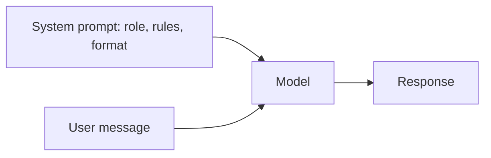
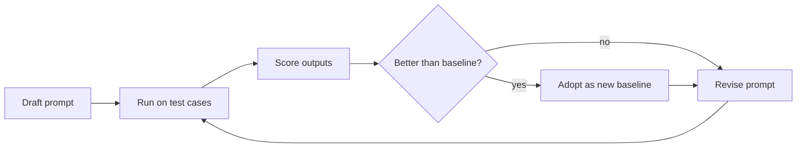

# 🎯 System Prompt Engineering — Principles, Patterns & Best Practices

> **How to write system prompts that reliably steer current Claude models, grounded in Anthropic's [prompting best practices](https://platform.claude.com/docs/en/build-with-claude/prompt-engineering/claude-prompting-best-practices) (checked October 2026), plus how to test them like code.**

**30-second answer:** A system prompt sets the role, the task context, the rules and the output contract for a conversation. What works on current models: be clear and direct (the "would a new colleague understand this?" test), explain *why* a rule exists, structure inputs with XML tags, show 3–5 diverse examples, put long documents first and the question last, say what to do rather than what not to do, and drop the ALL-CAPS "CRITICAL: you MUST" style, which makes modern models over-apply rules. Then treat the prompt as code: version it and evaluate every change against a test set.

---

## 1. WHAT IS A SYSTEM PROMPT?

The **system prompt** (the `system` parameter in the Messages API) is operator-level instruction that applies to the whole conversation: role, context, constraints, tools guidance and output format.

```ascii
┌────────────────────────────────────────────────────────────────────┐
│                    WHO SAYS WHAT TO THE MODEL                      │
│                                                                    │
│  MODEL TRAINING (values, safety behaviour; constitution)           │
│    └─ not overridable by prompts: the floor for everything below   │
│                                                                    │
│  SYSTEM PROMPT (operator: the app developer)                       │
│    "You are a security reviewer for a fintech codebase..."         │
│    └─ sets defaults and boundaries; users are generally given      │
│       less latitude than the operator                              │
│                                                                    │
│  USER MESSAGES (the end user)                                      │
│    "Review this function: ..."                                     │
│    └─ works within what the operator allows                        │
│                                                                    │
│  TOOL RESULTS / DOCUMENTS (data, not instructions)                 │
│    └─ may contain injected instructions; treat as untrusted        │
└────────────────────────────────────────────────────────────────────┘
```

Two corrections to common folklore:

- The system prompt does **not** "override model training". It customises behaviour within what the model will do; safety training and hard limits still apply.
- Priority isn't absolute. Models weigh system and user instructions together; a well-designed system prompt anticipates user requests rather than relying on "the system always wins".

Newer models (Opus 4.8+, Opus 5.x, Sonnet 5.5, Fable 5.x) also accept **mid-conversation system messages**: append `{"role": "system", ...}` to `messages` to add an operator instruction later without editing the top-level `system` (which would invalidate the prompt cache).

---

## 2. THE ANATOMY OF A GOOD SYSTEM PROMPT

### 2.1 The Components

| Component | Purpose | Example |
|-----------|---------|---------|
| **Role** | Focuses tone and expertise. Even one sentence helps | "You are a senior backend engineer reviewing Python services for production readiness." |
| **Context & motivation** | Lets the model generalise instead of pattern-matching rules | "Reviews feed an automated gate, so be precise: a false 'critical' blocks a deploy." |
| **Task & rules** | What to do, in priority order | "Prioritise security > correctness > performance > style." |
| **Output contract** | Exact shape of the answer | Headings, JSON schema, or XML tags |
| **Examples** | The most reliable way to steer format and tone | 3–5 in `<example>` tags |
| **Boundaries** | What's out of scope and what to do instead | "If asked about unrelated code, say it's out of scope for this review." |

### 2.2 Complete Example

Note the XML sections, the reasons behind rules, and positive phrasing.

```python
SYSTEM_PROMPT = """You are a senior software engineer reviewing code at a fintech company.

<context>
Stack: Python 3.12, FastAPI, PostgreSQL, Redis, deployed on ECS.
Your review is posted as a PR comment and read by the author and a
security reviewer. False alarms waste their time, and missed injection
or auth bugs can leak card data, so be specific and evidence-based.
</context>

<instructions>
1. Read the whole diff before commenting.
2. Report issues in this priority order: security, correctness,
   performance, maintainability.
3. Cite the file and line for every issue and show a corrected snippet.
4. When a requirement is unclear, state your assumption and continue.
5. Keep secrets out of your output; refer to them as "<redacted>".
</instructions>

<output_format>
## Summary
One or two sentences.

## Issues
- [Severity: High|Medium|Low] file:line: problem → fix

## Looks good
Brief note on what is solid (omit if nothing notable).
</output_format>"""
```

*Figure: a system prompt feeds every turn of the conversation.*



---

## 3. PROMPT ENGINEERING PRINCIPLES

### 3.1 Clear, Specific, Motivated

| Principle | ❌ Weak | ✅ Strong |
|-----------|--------|---------|
| **Clear and direct** | "Be helpful with code." | "Return a runnable Python function with type hints and a pytest test." |
| **Specific** | "Review the code." | "Check every raw SQL string for injection and every endpoint for an auth dependency." |
| **Motivated (say why)** | "Never use ellipses." | "Your output is read by a text-to-speech engine, so avoid ellipses; it can't pronounce them." |
| **Consistent** | Mixed bullet styles and terms | One term per concept, one format throughout |

Anthropic's "golden rule": show the prompt to a colleague with minimal context. If they'd be confused, the model will be too.

### 3.2 Say What To Do (Not Only What Not To Do)

Anthropic's guidance for format control is to "tell Claude what to do instead of what not to do". Negative rules still have a place for hard boundaries, but pair them with the desired behaviour.

```ascii
❌ NEGATIVE ONLY                       ✅ POSITIVE (with the boundary kept)
──────────────────────                 ──────────────────────────────────────
"Don't use markdown."                  "Write in flowing prose paragraphs."
"Don't use threading."                 "Use asyncio for concurrency (the
                                        service runs on a single event loop)."
"Don't make assumptions."              "State assumptions explicitly, then proceed."
"Don't ignore errors."                 "Handle expected errors explicitly and
                                        let unexpected ones propagate."
```

### 3.3 Position Effects (Long Context)

Models use information at the start and end of long inputs more reliably than information buried in the middle ("lost in the middle", Liu et al. 2023). Anthropic's concrete guidance for prompts with long documents (20K+ tokens):

```ascii
┌────────────────────────────────────────────────────────────────────┐
│  SYSTEM: role, rules, output format                                │
├────────────────────────────────────────────────────────────────────┤
│  <documents>                                                       │
│    <document><source>spec.md</source>                              │
│      <document_content>...</document_content></document>          │
│    ...                                                             │
│  </documents>                     ← long material near the TOP     │
├────────────────────────────────────────────────────────────────────┤
│  Question / task / specific instructions  ← at the END             │
└────────────────────────────────────────────────────────────────────┘
```

Anthropic reports that putting queries at the end "can improve response quality by up to 30 percent in tests, especially with complex, multidocument inputs". Asking the model to first quote the relevant passages (in `<quotes>` tags) before answering also helps it cut through noise.

### 3.4 Tone Down the Shouting

Prompts written for older models often used "CRITICAL", "MUST", "NEVER" in capitals to overcome under-triggering. Anthropic notes that recent models are much more responsive to the system prompt and may now **over-trigger** on such language. Write "Use this tool when…" instead of "CRITICAL: You MUST use this tool when…". Reserve emphasis for the one or two rules that truly matter.

### 3.5 Things That Changed with Recent Models

| Old technique | Status on current Claude models |
|---------------|-------------------------------|
| **Prefilling** the assistant turn (e.g. starting with `{`) | Not supported from the Claude 4.6 generation on (400 error). Use structured outputs (`output_config.format`), XML tags, or instructions |
| **"Think step by step"** in the prompt | Use the model's thinking (adaptive thinking + `effort`) instead; prescriptive step lists can make newer models worse. Ask for a brief rationale in the output only if the user needs it |
| **Few-shot as the only format control** | Still useful, but **structured outputs** guarantee JSON shape |
| **`temperature: 0` for consistency** | Not accepted on models released after Opus 4.6; consistency comes from clear specs, examples, schemas and evals |

---

## 4. COMMON PATTERNS

### 4.1 Role Pattern

```python
ROLE_SYSTEM_PROMPT = """You are a staff engineer who specialises in distributed
systems (consensus, replication, CRDTs) and database internals (PostgreSQL,
Redis). You explain trade-offs, not just solutions, and you say when you're
unsure rather than guessing. Cite well-known papers or docs where they help
the reader go deeper."""
```

### 4.2 Constraint Pattern

```python
CONSTRAINT_SYSTEM_PROMPT = """You generate production Python code.

<constraints>
- Python 3.12+, FastAPI, SQLAlchemy 2.0 async, pytest with async fixtures.
- Add type hints to every function and an OpenAPI description to every endpoint.
- Use only dependencies already listed in requirements.txt; if something new is
  needed, say so and explain why instead of adding it.
- Use asyncio for concurrency; the service runs on one event loop, so blocking
  calls stall every request.
- Read secrets from environment variables.
</constraints>"""
```

### 4.3 Few-Shot Pattern

Make examples **relevant**, **diverse** (so the model doesn't copy one surface pattern) and **clearly delimited**.

```python
FEW_SHOT_SYSTEM_PROMPT = """You are a code reviewer. Report each issue in the
same structure as the examples.

<examples>
<example>
Issue: SQL injection
File: app/routes/users.py, line 42
Severity: High
Problem: User input is interpolated into a raw SQL string.
Fix: Use a bound parameter: text("... WHERE id = :id"), {"id": user_id}
</example>
<example>
Issue: N+1 queries
File: app/services/orders.py, line 85
Severity: Medium
Problem: Each order's items are loaded in a loop, one query per order.
Fix: Load them up front with selectinload(Order.items).
</example>
</examples>"""
```

### 4.4 Reasoning Pattern (with Thinking)

Instead of scripting the model's internal steps, enable thinking and describe the *deliverable* and the checks you care about:

```python
REASONING_SYSTEM_PROMPT = """Solve algorithm problems for interview practice.

In your answer include: the approach in two or three sentences, time and space
complexity, the code, and the edge cases you tested. Before finalising, check
the code against those edge cases."""

# Request side: let the model think; tune depth with effort, not prompt text.
# thinking={"type": "adaptive"}, output_config={"effort": "high"}
```

---

## 5. ANTIPATTERNS TO AVOID

### 5.1 Vague, Conflicting Pile-Up

```ascii
❌ "You are a helpful assistant. Be nice. Be concise.   ✅ "You review Python PRs for security,
   Be thorough. Be creative. Be professional.              correctness and performance, in that
   Consider the user's feelings..."                        order. Keep each finding to two lines."
   (conflicting adjectives, no task)                       (one task, one priority order)
```

### 5.2 The Negative Spiral

```python
# ❌ A wall of "don'ts" with no target behaviour
BAD = """Don't use threading. Don't use global state. Don't forget error handling.
Don't skip type hints. Don't use magic numbers. Don't over-engineer."""

# ✅ Desired behaviour, with the reason where it isn't obvious
GOOD = """Use asyncio for concurrency. Pass state through dependency injection so
handlers stay testable. Handle expected errors explicitly. Type-hint every
function. Name constants. Build the simplest thing that meets the spec."""
```

### 5.3 The Vague Persona

```python
# ❌ Adds nothing
BAD = "You are a helpful assistant."

# ✅ Specific role + audience + purpose
GOOD = """You are a senior backend engineer (Python, PostgreSQL, AWS ECS). You review
code for production readiness for a team that ships several times a day."""
```

### 5.4 Instructions Hidden in Data

Putting rules inside a pasted document, or concatenating user input into the system prompt without delimiters, invites prompt injection and confusion. Keep instructions in the system prompt and wrap untrusted input in clearly labelled tags (`<user_document>…</user_document>`), and tell the model that content inside those tags is data.

---

## 6. TESTING SYSTEM PROMPTS

### 6.1 The Checklist

```ascii
□  1. Role, audience and purpose are stated?
□  2. Rules say what to do, and explain why where non-obvious?
□  3. Output format defined (or enforced with structured outputs)?
□  4. Long inputs on top, question at the bottom?
□  5. Inputs and examples wrapped in XML tags?
□  6. No conflicting instructions; no ALL-CAPS shouting?
□  7. Examples relevant and diverse?
□  8. Stable content first so it caches (no timestamps in the prefix)?
□  9. Evaluated on a fixed test set, including edge and adversarial cases?
□ 10. Versioned, with results recorded per version?
```

### 6.2 A/B Evaluation Harness

Run each prompt variant over the same test set and compare pass rates. Grade with deterministic checks where you can; use an LLM grader with a rubric only where you can't.

```python
import anthropic

client = anthropic.Anthropic()
MODEL = "claude-opus-5-5"   # pin the model you deploy


def first_text(response) -> str:
    """Responses can start with a thinking block; return the first text block."""
    return next((b.text for b in response.content if b.type == "text"), "")


def passes(output: str, criteria: dict) -> bool:
    """Deterministic checks; swap in an LLM-as-judge rubric for fuzzy criteria."""
    must = all(s.lower() in output.lower() for s in criteria.get("must_include", []))
    must_not = not any(s.lower() in output.lower() for s in criteria.get("must_not_include", []))
    return must and must_not


def evaluate(system_prompt: str, test_cases: list[dict]) -> float:
    results = []
    for case in test_cases:
        response = client.messages.create(
            model=MODEL,
            max_tokens=2000,
            system=system_prompt,
            messages=[{"role": "user", "content": case["input"]}],
        )
        if response.stop_reason in ("refusal", "max_tokens"):
            results.append(False)
            continue
        results.append(passes(first_text(response), case["criteria"]))
    return sum(results) / len(results)


tests = [
    {"input": "Review: cursor.execute(f\"SELECT * FROM users WHERE id={uid}\")",
     "criteria": {"must_include": ["injection"], "must_not_include": ["LGTM"]}},
    # ... 20-100 cases: typical, edge, adversarial
]

for name, prompt in {"v1": PROMPT_V1, "v2": PROMPT_V2}.items():
    print(name, f"{evaluate(prompt, tests):.0%}")
```

For real comparisons: use enough cases to see a difference (a handful is noise), run each case a few times because outputs vary, and use the Batch API (50% cheaper) for large eval runs.

*Figure: iterate on a system prompt with an evaluation loop.*



---

## 7. TEMPLATES FOR COMMON USE CASES

### 7.1 Code Reviewer

```python
CODE_REVIEW_SYSTEM_PROMPT = """You are a code reviewer for a production Python service.

<focus>
1. Security vulnerabilities (OWASP Top 10)
2. Logic errors and bugs
3. Performance issues
4. Maintainability
</focus>

<output_format>
## Critical
Security issues, data-loss risks.
## Warnings
Performance and maintainability concerns.
## Suggestions
Optional refinements.
</output_format>

Cite file and line numbers, and show a before/after snippet for each fix.
If you find nothing significant, reply "LGTM" with one sentence on why."""
```

### 7.2 Code Generator

```python
CODE_GENERATE_SYSTEM_PROMPT = """You write production-ready Python.

<deliverable>
For each request: a one-paragraph plan, the code, pytest tests for the
critical paths, and docstrings on public functions.
</deliverable>

<constraints>
- Python 3.12+, type hints everywhere, Black formatting (88 columns).
- Prefer the standard library; justify any new dependency.
- Handle expected errors explicitly; avoid bare `except:`.
- Avoid mutable default arguments and module-level mutable state.
- Use async I/O where the surrounding code is async.
</constraints>"""
```

### 7.3 Technical Writer

```python
TECH_WRITER_SYSTEM_PROMPT = """You write technical documentation for senior
backend engineers (Python/Go) who know the fundamentals but not this system.

<style>
Clear, concise, active voice, consistent terminology. Explain why, not just how.
Every code example must run as written.
</style>

<structure>
Title, two-sentence overview (what and why), prerequisites, numbered steps,
a complete example, troubleshooting for the common failures.
</structure>"""
```

---

## 8. KEY TAKEAWAYS

| Principle | Why It Works |
|-----------|-------------|
| **Be clear, specific, and say why** | The model generalises from reasons; bare rules get applied too literally or too loosely |
| **Say what to do** | Positive targets steer output better than lists of prohibitions |
| **Long context first, question last** | Anthropic measured up to 30% better answers on multi-document inputs |
| **Use XML tags** | Unambiguous separation of instructions, context, examples and inputs |
| **3–5 diverse examples** | Most reliable format/tone control; structured outputs for strict JSON |
| **No shouting** | Current models over-apply "CRITICAL/MUST" rules |
| **Use thinking + effort, not CoT scripts** | Current models reason internally; prefill and temperature tricks are gone |
| **Evaluate every change** | A prompt is code: version it, test it, measure it |

### What Interviewers Probe Next

- *"How do you stop prompt injection from a retrieved document?"* Separate instructions from data, least-privilege tools, human approval for consequential actions, output filtering; no prompt alone is a complete defence.
- *"How do you know a prompt change helped?"* A fixed eval set, statistically meaningful sample, side-by-side comparison, and regression checks on old failures.
- *"System prompt vs fine-tuning?"* Prompting first (cheap, fast iteration); fine-tune when you need behaviour you can't reliably prompt, have the data, and the volume justifies it.

---

> **Next:** [How Claude Makes Code Changes](06_HOW_CLAUDE_MAKES_CODE_CHANGES.md) → The code-change loop in Claude Code, step by step
