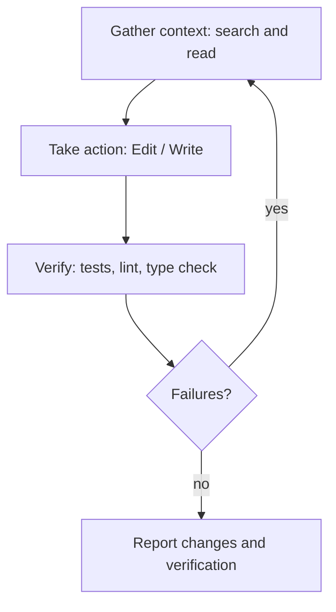
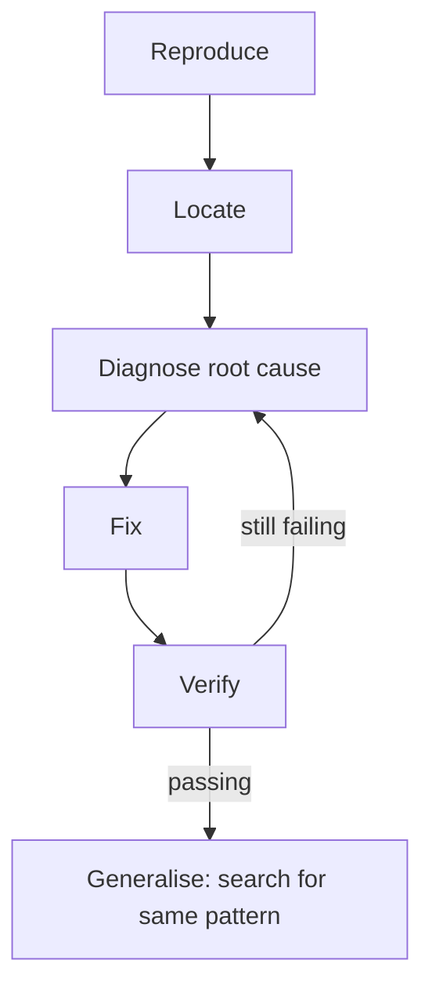
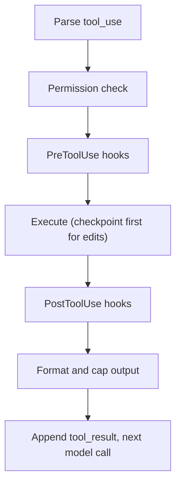

# 🔧 How Claude Makes Code Changes — The Step-by-Step Flow

> **What happens when you ask Claude Code to add a feature, fix a bug or refactor: every model call, tool execution, permission check and decision point. Tool names and behaviours follow the official [tools reference](https://code.claude.com/docs/en/tools-reference) (checked October 2026).**

!!! warning "Mechanism vs. model judgement"
    Two kinds of statements appear on this page. **Harness mechanics** (which tools exist, how `Edit` matches text, when permission is asked, how checkpoints work) are documented and deterministic. **Model behaviour** (which file to read next, when to ask you a question, what order to edit files in) is the model's judgement, shaped by its training, Claude Code's system prompt and your CLAUDE.md. Those parts are described as typical behaviour and good practice, not as a fixed algorithm.

**30-second answer:** Claude Code runs a loop: the model looks for the relevant code (search via `Grep`/`Glob` or shell `grep`/`find`, then `Read`), proposes edits as `Edit` calls (exact-string replacement that must match the file uniquely) or `Write` calls (whole file), runs tests or a build through `Bash`, reads the results, and repeats until it's satisfied, then summarises. Each tool call is one model round-trip with the whole conversation resent. Every action passes a permission layer (mode, allow/ask/deny rules, hooks), and file edits are checkpointed so you can rewind.

---

## 1. THE BIG PICTURE

```ascii
                    THE CODE-CHANGE LOOP
                    ────────────────────
  You: "Add a health check endpoint"
         │
         ▼
  ┌─────────────────────────────────────────────────────────────┐
  │ GATHER CONTEXT   search for the app entry point, read files │
  │                  (CLAUDE.md conventions already in context) │
  │       ▼                                                     │
  │ TAKE ACTION      Edit / Write files; maybe add a test       │
  │       ▼                                                     │
  │ VERIFY           run tests, linters, type checks via Bash   │
  │       ▼                                                     │
  │ failures? ──yes──► diagnose and fix (back to GATHER/ACTION) │
  │       │ no                                                  │
  │       ▼                                                     │
  │ REPORT           summarise what changed and how it was      │
  │                  verified; flag open questions              │
  └─────────────────────────────────────────────────────────────┘
```

Those three phases (gather context, take action, verify) are how Anthropic describes the loop. They blend: a question about the code may only need the first; a bug fix cycles through all three many times.

*Figure: the gather, act, verify loop.*



---

## 2. A TRACED EXAMPLE

**Task:** "Add a health check endpoint to the FastAPI app." Token counts are illustrative.

### Step 0: What's Already in Context

Nothing is scanned up front beyond a small, documented set: Claude Code's system prompt and tool definitions, your CLAUDE.md files, auto memory, skill descriptions, MCP tool names, and environment info (working directory, git status). The model has *not* read `main.py` yet.

### Step 1: First Model Call

```json
{
  "model": "claude-opus-5-5",
  "max_tokens": 32000,
  "stream": true,
  "system": "<Claude Code system prompt + CLAUDE.md + environment>",
  "tools": ["Read", "Edit", "Write", "Bash", "WebFetch", "Agent", "..."],
  "messages": [
    {"role": "user", "content": "Add a health check endpoint to the FastAPI app"}
  ]
}
```

(Tools abbreviated to names; real definitions carry descriptions and JSON schemas. The system prompt's exact text isn't published.)

### Step 2: The Model Searches

The response streams back with some text and a tool call:

```json
{
  "content": [
    {"type": "text", "text": "Let me find where the FastAPI app is created."},
    {"type": "tool_use", "id": "toolu_01", "name": "Bash",
     "input": {"command": "grep -rn \"FastAPI(\" --include=*.py ."}}
  ],
  "stop_reason": "tool_use"
}
```

On macOS/Linux, Claude Code's default tool set omits the dedicated `Glob`/`Grep` tools and Claude searches with `find`/`grep` through `Bash` (embedded fast implementations); on Windows, or when you enable them, it uses `Glob` and `Grep` (ripgrep-based). Read-only commands like this run without a permission prompt.

### Step 3: Read the File

Result: `./app/main.py:3:app = FastAPI()`. Next call, the model reads it:

```json
{"type": "tool_use", "id": "toolu_02", "name": "Read",
 "input": {"file_path": "/Users/me/project/app/main.py"}}
```

`Read` returns the file with line numbers. Large files come back as a first page with a "PARTIAL view" notice and the model pages with `offset`/`limit`. Images, PDFs and notebooks are supported too.

### Step 4: Edit

```json
{"type": "tool_use", "id": "toolu_03", "name": "Edit",
 "input": {
   "file_path": "/Users/me/project/app/main.py",
   "old_string": "@app.get(\"/\")\ndef read_root():\n    return {\"Hello\": \"World\"}",
   "new_string": "@app.get(\"/\")\ndef read_root():\n    return {\"Hello\": \"World\"}\n\n\n@app.get(\"/health\")\ndef health_check() -> dict[str, str]:\n    return {\"status\": \"ok\"}"
 }}
```

Before applying it, Claude Code:

1. **Checks permissions.** In Manual mode you're asked "allow edit to main.py?"; in Accept-edits or Auto mode it proceeds (Auto runs a classifier on riskier actions).
2. **Snapshots the file** (checkpoint) so you can rewind.
3. **Validates the edit** (documented behaviour of the `Edit` tool):
   - *Read-before-edit*: the file must have been read in this conversation (newer models may skip this when reading wouldn't need a permission prompt).
   - *Exact match*: `old_string` must appear exactly, whitespace included. No regex, no fuzzy matching.
   - *Uniqueness*: it must appear exactly once, unless `replace_all: true`. Otherwise the model retries with more surrounding context.
4. **Applies it** and returns a short result (with a snippet of the edited region) as the `tool_result`.

### Step 5: Verify

```json
{"type": "tool_use", "id": "toolu_04", "name": "Bash",
 "input": {"command": "pytest -q"}}
```

Bash commands run in a fresh process each time (the working directory carries over within the project, exported env vars don't), under a default 2-minute timeout the model can raise (10-minute ceiling by default). Long outputs are truncated inline (around 30,000 characters for a successful command, with the full output saved to a file the model can read).

### Step 6: Final Answer

Tests pass, so the model replies with text only (`stop_reason: "end_turn"`):

```ascii
Added GET /health to app/main.py returning {"status": "ok"}.
Ran the test suite: 14 passed. Consider adding it to your load-balancer
health-check config.
```

---

## 3. THE COMPLETE CALL SEQUENCE

```ascii
YOU                      CLAUDE CODE                          CLAUDE API
 │ "Add health check"         │                                     │
 │───────────────────────────►│ call 1: system+tools+prompt ───────►│ ~20K in
 │                            │◄──── Bash(grep "FastAPI(")          │
 │                            │ run grep (read-only, no prompt)     │
 │                            │ call 2: + tool_result ─────────────►│
 │                            │◄──── Read(app/main.py)              │
 │                            │ read file                           │
 │                            │ call 3: + file contents ───────────►│
 │                            │◄──── Edit(main.py, old→new)         │
 │  "Allow edit?" (Manual)    │                                     │
 │◄───────────────────────────│                                     │
 │  yes ─────────────────────►│ checkpoint, validate, apply         │
 │                            │ call 4: + "edit applied" ──────────►│
 │                            │◄──── Bash(pytest -q)                │
 │  "Allow pytest?" (unless   │                                     │
 │   allow-listed)            │ run tests                           │
 │                            │ call 5: + test output ─────────────►│
 │  "Added GET /health..."    │◄──── text, stop_reason: end_turn    │
 │◄───────────────────────────│                                     │
```

Five model calls for a two-line change. With prompt caching, calls 2–5 mostly pay cache-read rates for the shared prefix. The model can also issue **several tool calls in one turn** (e.g. read three files at once), which cuts round-trips.

---

## 4. HOW DEBUGGING WORKS

Bug fixing leans harder on the gather and verify phases:

```ascii
  "The /users endpoint returns 500 with KeyError: 'username'"
         │
  REPRODUCE   run the failing request or test; read the traceback
         │
  LOCATE      search for the handler; read it and its callers
         │
  DIAGNOSE    form a hypothesis about the root cause, not the symptom
         │    (here: request body accessed without validation)
         │
  FIX         Edit: validate input (e.g. a Pydantic model → 422 on
         │    missing fields) instead of data["username"]
         │
  VERIFY      re-run the reproduction and the related tests;
         │    if still failing, loop back to DIAGNOSE
         │
  GENERALISE  search for the same pattern elsewhere (data["...] on
              raw request bodies), report what was found
```

Habits that make Claude Code better at this, all things you control: give the exact error and how to reproduce it, point to the test that should pass, and ask it to write a failing test first.

*Figure: debugging loops between diagnose and verify.*



---

## 5. WHEN DOES CLAUDE ASK YOU?

Two different mechanisms decide this.

### 5.1 The Harness Asks: Permissions (deterministic)

| Mode / rule | What triggers a prompt |
|-------------|------------------------|
| **Manual** | File edits and shell commands (read-only commands and reads inside the project don't prompt) |
| **Accept edits** | Shell commands beyond common filesystem ones; edits proceed |
| **Plan** | No source edits at all; Claude explores and presents a plan for approval (`ExitPlanMode`) |
| **Auto** | A classifier approves routine actions and blocks risky ones instead of asking |
| **Rules** (`settings.json`) | `deny` blocks, `ask` always prompts, `allow` skips the prompt; e.g. `Bash(npm test)`, `Edit(/src/**)`, `Read(./.env)` |
| **Hooks** | A `PreToolUse` hook can allow, deny, ask, or rewrite the input of any tool call |

### 5.2 The Model Asks: Clarifying Questions (judgement)

The model can stop and ask in text, or with the `AskUserQuestion` tool (multiple-choice). Whether it does is judgement guided by its instructions. A sensible heuristic, and one you can make explicit in CLAUDE.md:

| Situation | Reasonable behaviour |
|-----------|---------------------|
| Request is clear | Proceed |
| Low-impact ambiguity (naming, formatting) | Follow project conventions, proceed |
| Medium-impact choice (which library, where code lives) | Make a choice, state it in the summary |
| High-impact or hard-to-reverse (auth design, schema migrations, deleting data, pushing, deploying) | Ask first, or present options in plan mode |
| Tool failure it can explain (test failure, stale `old_string`) | Fix and retry; an `Edit` mismatch usually just means "re-read the file" |
| Unexplained state (unexpected files, failing setup) | Report it and ask |

If you want more or fewer questions, say so in CLAUDE.md or the prompt ("ask before adding dependencies"; "don't ask, make reasonable assumptions and list them"). Plan mode is the structural way to force a checkpoint before edits.

---

## 6. MULTI-FILE CHANGES

There's no built-in dependency solver; ordering is the model's judgement. What works well, and what Claude typically does on a task like "add a `/users` endpoint with database support":

```ascii
1. EXPLORE         read the existing route, model, schema and test files
                   to learn the project's patterns
2. PLAN            list files to touch (plan mode makes this explicit
                   and reviewable)
3. EDIT            usually leaf-first: models.py → schemas.py →
                   crud/database → main.py routes → tests, so each
                   step's imports exist when the next one is written
4. VERIFY          import check, type check, the new tests, then the
                   whole suite
5. FIX             iterate on failures
```

Ordering matters less than you'd think, because nothing runs between edits; what matters is that the final verification passes. For large changes, Claude may delegate exploration or independent pieces to **sub-agents** (`Agent` tool), each with its own context window, so the main conversation only receives summaries. Separate sessions in **git worktrees** let several Claude Code instances work on different branches in parallel.

Cost: each edit is a round-trip carrying the whole history. Five edits at ~30K input tokens each is ~150K input tokens before caching, which is why caching and batching edits into fewer turns matter.

---

## 7. EDIT vs WRITE

| | `Edit` | `Write` |
|---|--------|---------|
| **What it does** | Replaces an exact `old_string` with `new_string` | Creates a file, or overwrites it with the full content |
| **Preconditions** | File read in this conversation (relaxed on newer models when no permission prompt would be needed); `old_string` matches exactly and uniquely (or `replace_all`) | For an existing file, the same read-before-overwrite rule applies; new files need nothing |
| **Output tokens** | Only the changed region (both old and new text) | The whole file |
| **Failure mode** | Fails loudly on mismatch, protecting against stale views of the file | Silently replaces everything, including changes you made meanwhile (but checkpoints allow rewind) |
| **Typical use** | Most changes to existing files | New files; complete rewrites of small files |

The model chooses between them. Output tokens are the expensive ones, so `Edit` is usually cheaper for small changes to big files, while `Write` can be simpler when most of a small file changes. There's no fixed "> 50% of the file" rule.

---

## 8. THE TOOL EXECUTION PIPELINE

What Claude Code does with each `tool_use` block (documented behaviour; details evolve between versions):

```ascii
┌──────────────────────────────────────────────────────────────────┐
│ 1. PARSE         tool name, id, JSON input; unknown tool or bad  │
│                  input → error tool_result, model corrects itself│
├──────────────────────────────────────────────────────────────────┤
│ 2. PERMISSION    deny rules → ask rules → allow rules; then the  │
│                  permission mode (Manual / Accept edits / Plan / │
│                  Auto classifier); paths outside the working and │
│                  added directories need approval                 │
├──────────────────────────────────────────────────────────────────┤
│ 3. PreToolUse    your hooks may block, approve, or rewrite input │
│    HOOKS         (e.g. filter test output to failures only)      │
├──────────────────────────────────────────────────────────────────┤
│ 4. EXECUTE       checkpoint files first for edits; Bash in a new │
│                  process with a timeout; optional sandboxing     │
│                  isolates filesystem and network for Bash        │
├──────────────────────────────────────────────────────────────────┤
│ 5. PostToolUse   your hooks see the result (e.g. run a formatter │
│    HOOKS         after every edit, feed lint errors back)        │
├──────────────────────────────────────────────────────────────────┤
│ 6. FORMAT        cap large outputs (inline limit, rest saved to  │
│                  a file the model can read); build tool_result   │
│                  (is_error on failure)                           │
├──────────────────────────────────────────────────────────────────┤
│ 7. CONTINUE      append to history; next model call; compaction  │
│                  kicks in automatically near the context limit   │
└──────────────────────────────────────────────────────────────────┘
```

Things Claude Code does **not** claim to do: automatically mask secrets in tool output, or rate-limit individual tools. Protect secrets with `deny` rules (e.g. `Read(./.env)`), sandboxing, and hooks.

*Figure: what the harness does with each tool_use block.*



---

## 9. SUMMARY

```ascii
┌─────────────────────────────────────────────────────────────────────┐
│ 1. You send a request; context = system prompt, tools, CLAUDE.md,  │
│    memory, git/env info (no repo pre-scan)                          │
│ 2. Model searches and reads (Bash grep/find or Grep/Glob, Read)     │
│ 3. Model edits (Edit exact-match, or Write) → permission check →   │
│    checkpoint → apply                                               │
│ 4. Model verifies (Bash: tests, build, lint) and iterates           │
│ 5. Model reports (stop_reason: end_turn)                            │
│                                                                     │
│ Each tool call = one model round-trip with the full history         │
│ Decision points: more context? ask the user? retry? → model         │
│ Safety points: permissions, hooks, checkpoints → harness            │
└─────────────────────────────────────────────────────────────────────┘
```

---

## 10. KEY TAKEAWAYS

| Concept | Why It Matters |
|---------|---------------|
| **Each tool call is a round-trip** | Cost and latency scale with calls × context size; parallel calls and caching help |
| **Search, read, then edit** | `Edit` requires a prior read (on most models) and an exact, unique match, so stale or ambiguous edits fail loudly instead of corrupting files |
| **`Edit` for most changes, `Write` for new files** | Output tokens cost 5× input; full rewrites are expensive and riskier |
| **Verification is the model's job, enabled by you** | Give it a test command and a definition of done |
| **Asking is judgement; permissions are mechanism** | Shape the first with CLAUDE.md and plan mode, the second with modes, rules and hooks |
| **Checkpoints cover files only** | Database writes, deploys and pushes can't be rewound, so gate them with permissions |
| **No temperature tricks** | Consistency comes from clear instructions and verification, not `temperature: 0` |

### What Interviewers Probe Next

- *"Why exact string replacement instead of line numbers or diffs?"* Line numbers go stale after the first edit; exact-match with a uniqueness check is robust to concurrent changes and fails safely.
- *"How would you stop an agent from running `rm -rf` or leaking `.env`?"* Deny rules, sandboxing, PreToolUse hooks, least-privilege credentials, human approval for irreversible actions.
- *"How do you keep a long refactor within the context window?"* Sub-agents for exploration, compaction with focus instructions, CLAUDE.md for durable rules, and splitting work into sessions.

---

> **Next:** See the [Request/Response Cycle](03_REQUEST_RESPONSE_CYCLE.md) for token accounting, or [System Prompt Engineering](05_SYSTEM_PROMPT_ENGINEERING.md) for how to shape the model's behaviour.
