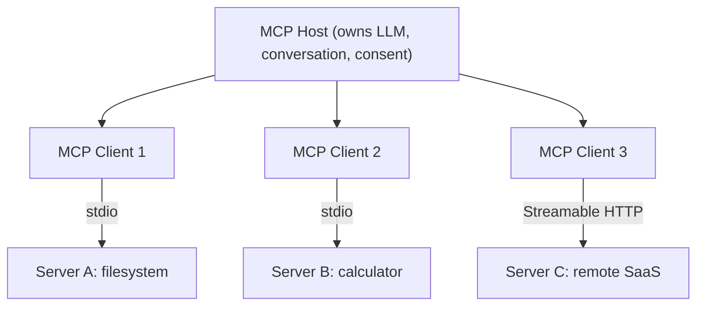
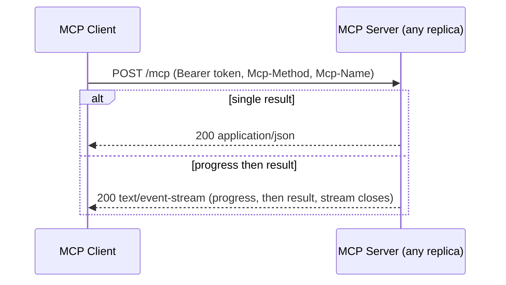
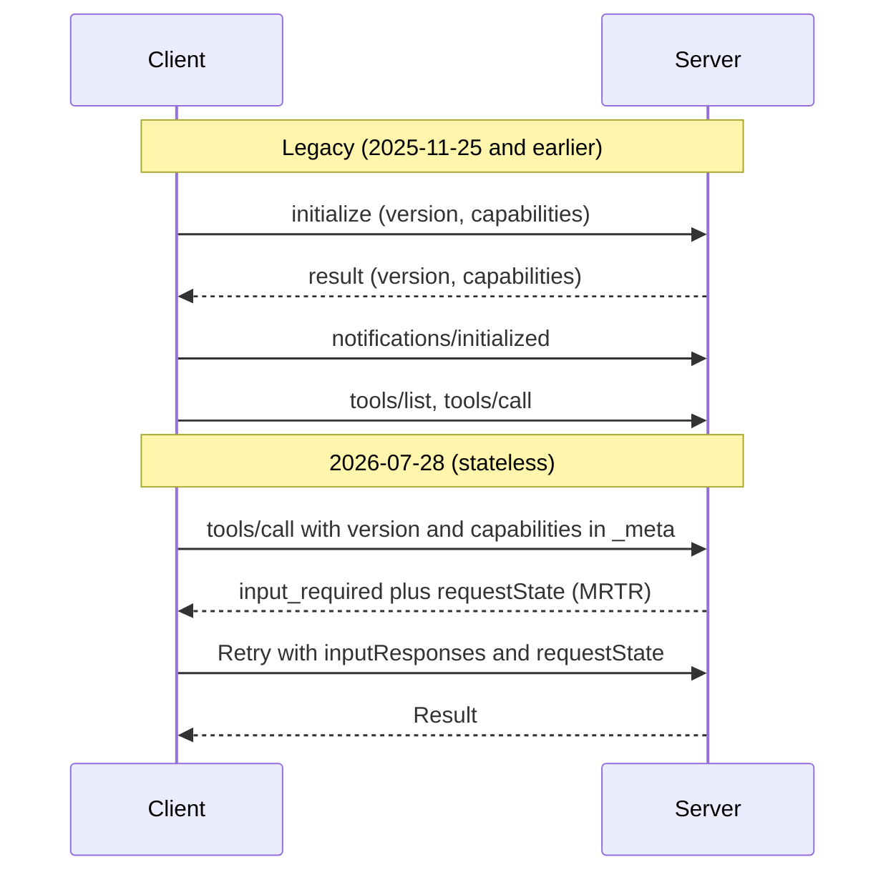

# 🔌 MCP Fundamentals — Architecture, Protocol Mechanics & Setup Guide

> **Target:** Staff/Principal-level understanding of the Model Context Protocol (MCP), current as of the **2026-07-28** spec revision and Python SDK v2.

---

## 1. WHAT IS MCP?

!!! tip "30-second answer"
    MCP is an open, JSON-RPC 2.0 based protocol that lets an AI application (the **host**) discover and use **tools**, **resources** and **prompts** exposed by **servers**, over stdio (local subprocess) or Streamable HTTP (remote). It turns an N×M integration problem (every app × every tool) into N+M: write a server once and every MCP host can use it. Anthropic released it in November 2024; OpenAI, Google and Microsoft adopted it in 2025, and in December 2025 it moved to the Linux Foundation's Agentic AI Foundation.

### Why MCP? (Why not just use custom API endpoints?)

| Problem | Without MCP | With MCP |
|---------|-------------|----------|
| **Integration fragmentation** | Every AI app writes its own adapter per tool | One server works in any MCP host |
| **Discovery** | Tool definitions hard-coded in the app | Runtime discovery (`tools/list`, `resources/list`, `prompts/list`) |
| **Context** | Each app invents how to fetch and inject data | Standard Resources, Tools and Prompts |
| **Auth for remote tools** | Bespoke per integration | One OAuth 2.1 profile for every HTTP server |
| **Portability** | Tied to one LLM provider's function-calling format | Model- and vendor-neutral |

**What MCP is not:** it is not function calling. Function calling is how a *model* asks the host to run something; MCP is how the *host* finds and runs it. A host typically converts `tools/list` output into the provider's tool format, lets the model choose, then executes the call with `tools/call`.

### Spec revisions you should know

Versions are dates (`YYYY-MM-DD`) of the last backwards-incompatible change.

| Revision | What changed (headline items) |
|---|---|
| 2024-11-05 | Initial release. Transports: stdio and HTTP+SSE (two endpoints). |
| 2025-03-26 | **Streamable HTTP** replaces HTTP+SSE. First **OAuth 2.1** authorization framework. Tool annotations (`readOnlyHint`, `destructiveHint`...). Audio content. |
| 2025-06-18 | **Structured tool output** (`outputSchema` / `structuredContent`). **Elicitation**. **Resource links** in tool results. MCP server formally an OAuth **resource server** (RFC 9728 metadata, RFC 8707 resource indicators). JSON-RPC batching removed. `MCP-Protocol-Version` HTTP header. |
| 2025-11-25 | Experimental **tasks** (long-running calls). URL-mode elicitation. Tool calling inside sampling. **Client ID Metadata Documents** for client registration. Icons. |
| **2026-07-28** (current) | **Stateless protocol**: no `initialize` handshake and no sessions; every request carries version and capabilities in `_meta`. `server/discover`. **Multi round-trip requests (MRTR)** replace server-to-client requests. `subscriptions/listen` replaces the GET stream. Tasks moved to an extension. **Roots, Sampling and Logging deprecated**; Dynamic Client Registration deprecated. |

Interviewers often learned MCP on 2025-era material ("initialize handshake", "Mcp-Session-Id", "sticky sessions"). Know both, and say which revision you mean.

---

## 2. CORE ARCHITECTURE

MCP has three roles. The host owns the model and the user; each client is one connection to one server.

```
┌──────────────────────────────────────────────────────────────┐
│                          MCP HOST                            │
│   (Claude Desktop/Code, Cursor, VS Code, your agent)         │
│   - owns the LLM, the conversation and user consent          │
│   - decides which tools to expose and when to call them      │
│                                                              │
│   ┌────────────┐     ┌────────────┐     ┌────────────┐       │
│   │ MCP Client │     │ MCP Client │     │ MCP Client │       │
│   └─────┬──────┘     └─────┬──────┘     └─────┬──────┘       │
└─────────┼──────────────────┼──────────────────┼──────────────┘
          │ stdio            │ stdio            │ Streamable HTTP
          ▼                  ▼                  ▼
   ┌─────────────┐    ┌─────────────┐    ┌──────────────┐
   │  Server A   │    │  Server B   │    │   Server C   │
   │ (filesystem)│    │ (calculator)│    │ (remote SaaS)│
   └─────────────┘    └─────────────┘    └──────────────┘
```

<p align="center">
  <video controls width="800" style="border-radius: 12px; box-shadow: 0 4px 24px rgba(0,0,0,0.3);" loop playsinline preload="metadata">
    <source src="../../../assets/videos/mcp-protocol-flow.mp4" type="video/mp4" />
    Your browser does not support the video tag.
  </video>
  <br/>
  <em>🎬 Animated MCP Protocol Flow — User → MCP Host → Client → Server, with transport, discovery and execution. Click ▶ to play/pause. Created with <a href="https://remotion.dev">Remotion</a>.</em>
</p>

### Role Breakdown

| Role | Responsibility | Examples |
|------|---------------|----------|
| **MCP Host** | The AI application: runs the model, aggregates tools from many servers, enforces user consent | Claude Desktop, Claude Code, Cursor, VS Code, custom agents |
| **MCP Client** | Protocol endpoint inside the host, one per server | `mcp.Client` (Python SDK v2), `Client` (TypeScript SDK) |
| **MCP Server** | Exposes tools, resources and prompts over the protocol | GitHub, Postgres, filesystem, Slack, your internal APIs |

**Why one client per server:** isolation. Each server gets its own connection, credentials and failure domain; a compromised or crashing server can't read another server's traffic.

*Figure: one host owns several clients, each connected to one server.*



---

## 3. CORE PRIMITIVES

Servers expose three primitives. The useful distinction is **who controls them**:

| Primitive | Controlled by | Analogy | Example |
|---|---|---|---|
| **Tools** | The **model** decides to call them | POST endpoint | `create_issue`, `run_query` |
| **Resources** | The **application** decides what to attach | GET endpoint / file | `file:///README.md`, `db://schema` |
| **Prompts** | The **user** picks them (e.g. slash commands) | Saved template | `/review-pr` |

Clients can also offer features to servers: **elicitation** (ask the user for input), and the now-deprecated **sampling** (ask the host's LLM for a completion) and **roots** (which directories the server may work in).

### 3.1 Resources

**Purpose:** Data the host can read and put into the model's context. Identified by URI; parameterised families use **resource templates** (RFC 6570, e.g. `db://tables/{name}`).

```json
// resources/list result (abridged)
{
  "resources": [
    {
      "uri": "file:///logs/app-2026-01-01.txt",
      "name": "app-log-2026-01-01",
      "title": "Application Logs (Jan 1)",
      "description": "Error logs for January 1st",
      "mimeType": "text/plain"
    }
  ]
}
```

**Key characteristics:**

- **Application-controlled:** the host (or user) chooses which resources enter context. Models don't fetch them on their own unless a tool does it.
- **Read-only:** `resources/read` returns text or base64 blob contents. Changing data is a tool's job.
- **Subscribable:** a client can ask to be told when a resource or the list changes. In 2026-07-28 that's done by opting in on a `subscriptions/listen` stream.
- Resources do **not** carry a JSON Schema; they carry a `mimeType`.

### 3.2 Tools

**Purpose:** Functions the model can invoke, possibly with side effects.

```json
// tools/list result (abridged)
{
  "tools": [
    {
      "name": "execute_sql",
      "title": "Run SQL",
      "description": "Execute a read-only SQL query against the analytics database",
      "inputSchema": {
        "type": "object",
        "properties": {
          "query": { "type": "string", "description": "SQL SELECT query" },
          "max_rows": { "type": "integer", "default": 100 }
        },
        "required": ["query"]
      },
      "outputSchema": {
        "type": "object",
        "properties": {
          "columns": { "type": "array", "items": { "type": "string" } },
          "rows": { "type": "array" }
        }
      },
      "annotations": { "readOnlyHint": true, "openWorldHint": false }
    }
  ]
}
```

**Key characteristics:**

- **Model-controlled**, but the host must keep a human in the loop for anything risky (confirmation prompts, allow-lists).
- **Input validation:** `inputSchema` is JSON Schema (2020-12 by default). Servers must still validate; the model can and will send bad arguments. Since 2025-11-25, validation failures should come back as **tool execution errors** (`isError: true`) rather than protocol errors, so the model can see the message and retry.
- **Structured output (2025-06-18+):** with an `outputSchema`, results include `structuredContent` (machine-readable JSON) alongside `content` (blocks for the model).
- **Result content types:** text, image, audio, embedded resource, and **resource links** (a URI the client can fetch later instead of inlining a large payload).
- **Annotations are hints, not guarantees.** `readOnlyHint`/`destructiveHint` come from the server; a host must not trust them from an untrusted server.
- **Two kinds of errors:** a protocol error (JSON-RPC `error`: unknown tool, malformed request) vs a tool execution error (a normal result with `isError: true`). Only the second reaches the model.

### 3.3 Prompts

**Purpose:** Reusable, parameterised message templates, usually surfaced to users as slash commands.

```json
// prompts/list result
{
  "prompts": [
    {
      "name": "analyze_error_log",
      "title": "Analyze error log",
      "description": "Analyze application error logs and suggest fixes",
      "arguments": [
        { "name": "log_date", "description": "Date (YYYY-MM-DD)", "required": true },
        { "name": "severity", "description": "Minimum severity", "required": false }
      ]
    }
  ]
}
```

`prompts/get` returns a list of messages (which can embed resources), so a server can ship a workflow ("review this PR with our checklist") rather than just a string. Prompt arguments have no `default` field; defaults live in the server's implementation.

---

## 4. TRANSPORT LAYER

The spec defines two standard transports. Messages are JSON-RPC 2.0 either way; JSON-RPC batching was removed in 2025-06-18.

### 4.1 Stdio Transport (Standard Input/Output)

```
┌─────────────────────────────────────────┐
│                MCP HOST                 │
│   ┌─────────────────────────────────┐   │
│   │          MCP Client             │   │
│   └───────┬─────────────────▲───────┘   │
│     stdin │ JSON-RPC,        │ stdout   │
│           │ one per line     │          │
│   ┌───────▼─────────────────┴───────┐   │
│   │   MCP Server (child process)    │   │
│   │   logs → stderr only            │   │
│   └─────────────────────────────────┘   │
└─────────────────────────────────────────┘
```

**Best for:** local tools (filesystem, git, IDE integrations), desktop apps, CLIs.

**Characteristics:**

- The host launches the server as a subprocess; messages are newline-delimited JSON on stdin/stdout. **Anything else written to stdout corrupts the stream**, so servers log to stderr.
- No network listener, so no remote attack surface. That is not the same as "safe": the server runs with **the user's full OS privileges**, so installing a stdio server is like installing any other program.
- **No OAuth.** The spec says stdio servers take credentials from the environment (env vars, local config, OS keychain).
- One client per process; the server's lifetime is tied to the host.

### 4.2 Streamable HTTP

```
┌──────────────┐  POST /mcp  (one JSON-RPC request per POST)   ┌──────────────────┐
│  MCP Client  │ ────────────────────────────────────────────► │   MCP Server     │
│              │  Authorization: Bearer <OAuth access token>   │  (any replica)   │
│              │  MCP-Protocol-Version, Mcp-Method, Mcp-Name   │                  │
│              │ ◄──────────────────────────────────────────── │                  │
└──────────────┘  200 application/json  (single result)        └──────────────────┘
                  or 200 text/event-stream (progress
                  notifications, then the result; stream
                  closes)
```

**Best for:** remote and multi-tenant servers (SaaS integrations, internal platforms).

**How it works (2026-07-28):**

- **One endpoint** (e.g. `https://example.com/mcp`) that accepts POST. Each JSON-RPC request is its own POST.
- The server replies with either plain JSON or an **SSE stream scoped to that request** (progress notifications, then the final result). SSE survives as a response format; it is no longer a separate transport.
- No sessions, no GET stream, no `Last-Event-ID` resumption. A dropped stream loses that request; the client re-sends it with a new id. Closing the stream is how a client cancels.
- Long-lived change notifications use an explicit `subscriptions/listen` request.
- Required headers mirror the body (`MCP-Protocol-Version`, `Mcp-Method`, `Mcp-Name`) so gateways can route and rate-limit without parsing JSON; servers reject mismatches.
- Security musts: validate `Origin` (DNS-rebinding defence, 403 on bad Origin), bind to 127.0.0.1 when local, authenticate every request.

**What changed from earlier revisions:**

| | HTTP+SSE (2024-11-05) | Streamable HTTP (2025-03-26 → 2025-11-25) | Streamable HTTP (2026-07-28) |
|---|---|---|---|
| Endpoints | GET `/sse` + POST `/messages` | One endpoint: POST, optional GET stream | One endpoint: POST only |
| Sessions | Implicit in the SSE connection | Optional `Mcp-Session-Id` | None |
| Server → client requests | On the SSE stream | On SSE streams | Returned in results (MRTR) |
| Load balancing | Sticky connection required | Sticky or shared session store | Any replica, round-robin |
| Status | Deprecated | Legacy | Current |

**Limitations:** network latency, TLS and an OAuth deployment to run, and proxies that buffer SSE (send `X-Accel-Buffering: no`).

*Figure: Streamable HTTP (2026-07-28) sends one POST per request and gets JSON or a request-scoped SSE stream.*



---

## 5. PROTOCOL LIFECYCLE

```
┌─────────────────────────────────────────────────────────────┐
│               LIFECYCLE (2026-07-28, stateless)             │
├─────────────────────────────────────────────────────────────┤
│  1. Connect                                                 │
│     stdio: host spawns the server   HTTP: nothing to open   │
│                                                             │
│  2. (Optional) server/discover                              │
│     → supported versions, capabilities, server identity     │
│                                                             │
│  3. Discovery: tools/list, resources/list, prompts/list     │
│     (results carry ttlMs/cacheScope so clients can cache)   │
│                                                             │
│  4. Operation: tools/call, resources/read, prompts/get      │
│     every request carries protocolVersion + capabilities    │
│     in _meta; server may answer "input_required" (MRTR)     │
│                                                             │
│  5. Shutdown                                                │
│     stdio: close stdin, then SIGTERM/SIGKILL                │
│     HTTP: nothing to tear down                              │
└─────────────────────────────────────────────────────────────┘
```

### Initialization Handshake

**Legacy revisions (2025-11-25 and earlier)** opened every connection with a handshake, and many servers in the wild still speak it:

```json
// Client → Server
{ "jsonrpc": "2.0", "id": 1, "method": "initialize",
  "params": { "protocolVersion": "2025-11-25",
              "capabilities": { "elicitation": {} },
              "clientInfo": { "name": "my-agent", "version": "1.0.0" } } }

// Server → Client
{ "jsonrpc": "2.0", "id": 1,
  "result": { "protocolVersion": "2025-11-25",
              "capabilities": { "tools": { "listChanged": true }, "resources": {}, "prompts": {} },
              "serverInfo": { "name": "my-db-server", "version": "1.0.0" } } }

// Client → Server (notification, no id)
{ "jsonrpc": "2.0", "method": "notifications/initialized" }
```

**2026-07-28 removed it.** Every request is self-describing, so any replica can serve it:

```json
{ "jsonrpc": "2.0", "id": 7, "method": "tools/call",
  "params": { "name": "execute_sql", "arguments": { "query": "SELECT 1" },
    "_meta": {
      "io.modelcontextprotocol/protocolVersion": "2026-07-28",
      "io.modelcontextprotocol/clientCapabilities": { "elicitation": {} },
      "io.modelcontextprotocol/clientInfo": { "name": "my-agent", "version": "1.0.0" } } } }
```

An unsupported version gets `UnsupportedProtocolVersionError` listing what the server supports, and the client retries. Dual-era clients (like the Python SDK v2 `Client`) probe with `server/discover` and fall back to `initialize` for legacy servers.

**Multi round-trip requests (MRTR).** When a server needs something mid-call (a user confirmation via elicitation, for example), it returns `{"resultType": "input_required", "inputRequests": {...}, "requestState": "..."}`. The client gathers the input and **retries the original request** with `inputResponses` and the opaque `requestState`. The server keeps no state between the two, so it must integrity-protect `requestState` (HMAC/AEAD) and bind it to the user, a short expiry and the original request.

*Figure: legacy initialize handshake versus the stateless 2026-07-28 flow.*



---

## 6. SETUP GUIDE — INSTALLING & RUNNING MCP

### 6.1 Python SDK

**Prerequisites:** Python 3.10+, and `uv` or `pip`.

```bash
pip install "mcp[cli]"      # installs SDK v2.x (stable since July 2026)
# or
uv add "mcp[cli]"
```

!!! warning "SDK v1 vs v2"
    In v2, `FastMCP` was renamed **`MCPServer`** and `from mcp.server.fastmcp import FastMCP` raises `ModuleNotFoundError`. Python attribute names became snake_case (`input_schema`, `structured_content`, `is_error`; the JSON on the wire is unchanged), transport options moved from the constructor to `run()`, and `mcp.Client` replaced `stdio_client` + `ClientSession` + `initialize()`. Most blog posts and tutorials still show v1. To keep v1 code running, pin `mcp<2`. (The separate `fastmcp` package on PyPI is a different, third-party framework.)

### 6.2 Creating Your First MCP Server

```python
# server.py
import sys

from mcp.server.mcpserver import MCPServer
from mcp.server.mcpserver.exceptions import ToolError

mcp = MCPServer("MyFirstMCPServer")


@mcp.tool()
def divide(a: float, b: float) -> float:
    """Divide a by b."""   # the docstring becomes the tool description the model reads
    if b == 0:
        raise ToolError("b must not be zero")   # returned as isError=true with this message
    return a / b                                  # -> float becomes outputSchema


@mcp.resource("config://app")
def get_config() -> str:
    """Application configuration."""
    return "version: 1.0.0\nregion: eu-west-1"


@mcp.prompt()
def analyze_error(error: str) -> str:
    """Prompt template for error analysis."""
    return f"Analyze the following error and suggest a fix:\n\n{error}"


if __name__ == "__main__":
    print("starting", file=sys.stderr)   # never print to stdout on stdio
    mcp.run()                            # stdio by default
```

Type hints generate the JSON Schemas, so use precise types (`Literal[...]`, Pydantic models) instead of bare `str` where you can. In v2, an unexpected exception reaches the client only as "Error executing tool divide"; raise `ToolError` when the model should see the message.

### 6.3 Testing Your Server

```bash
# Browser-based inspector (official package)
npx @modelcontextprotocol/inspector python server.py

# Or the SDK's dev runner, which wraps the inspector
uv run mcp dev server.py
```

For unit tests, connect in-process with no subprocess: `async with Client(mcp) as c: await c.call_tool(...)`.

### 6.4 Connecting from a Client

**Claude Desktop (macOS)**: add to `~/Library/Application Support/Claude/claude_desktop_config.json`:

```json
{
  "mcpServers": {
    "my-server": {
      "command": "/absolute/path/to/venv/bin/python",
      "args": ["/absolute/path/to/server.py"]
    }
  }
}
```

Use absolute paths: the host doesn't run in your shell, so it won't see your virtualenv or working directory.

**Custom Python client (SDK v2):**

```python
import asyncio

from mcp import Client, StdioServerParameters


async def main() -> None:
    params = StdioServerParameters(command="python", args=["server.py"])
    async with Client(params) as client:      # discovery/handshake handled for you
        tools = await client.list_tools()
        print([t.name for t in tools.tools])

        result = await client.call_tool("divide", {"a": 6, "b": 3})
        if result.is_error:
            print("tool failed:", result.content[0].text)
        else:
            print(result.structured_content)   # {'result': 2.0}

        resources = await client.list_resources()
        print([str(r.uri) for r in resources.resources])


asyncio.run(main())
```

### 6.5 Running with Streamable HTTP (Production)

```python
# server_http.py
from mcp.server.mcpserver import MCPServer

mcp = MCPServer("ProductionMCP")


@mcp.tool()
def query_database(sql: str) -> str:
    """Execute a read-only SQL query."""
    return f"Results for: {sql}"


if __name__ == "__main__":
    mcp.run(transport="streamable-http", host="127.0.0.1", port=8000)
```

```bash
python server_http.py
# MCP endpoint: http://127.0.0.1:8000/mcp   (POST only)
```

For anything beyond localhost, put it behind TLS and add OAuth: `MCPServer(token_verifier=..., auth=AuthSettings(...))` makes the server an OAuth resource server that validates every request's bearer token. See [Production Architecture](04_MCP_PRODUCTION_ARCHITECTURE.md).

---

## 7. MCP vs TRADITIONAL APPROACHES

| Aspect | MCP | Custom REST integration | Provider function calling |
|--------|-----|--------------------|--------------------------|
| **What it standardises** | Host ↔ tool server | Nothing beyond HTTP | Model ↔ host |
| **Discovery** | Runtime (`*/list`) | Docs / OpenAPI | Tools passed in each request |
| **Reuse across apps/models** | Any MCP host | Per app | Per provider format |
| **Auth** | OAuth 2.1 profile (HTTP), env (stdio) | Anything | Your app's problem |
| **Beyond tools** | Resources, prompts, elicitation | No | No |
| **State** | Stateless requests (2026-07-28) | Your design | Stateless |

They compose: the model emits a function call, the host maps it to an MCP `tools/call`.

---

## 8. KEY DESIGN PRINCIPLES

1. **Host in control.** The host owns the model, the context window and user consent; servers can't see the conversation or other servers.
2. **Discoverability.** Capabilities are listed at runtime, not compiled into the app.
3. **Small, focused servers.** Each server does one integration well; the host composes them.
4. **Transport agnostic.** Same messages over stdio and HTTP.
5. **Stateless requests (2026-07-28).** Each request carries its version and capabilities, so remote servers scale like any stateless HTTP service. Cross-call state goes in explicit handles passed as tool arguments.
6. **Progressive features.** Capabilities and extensions (tasks, MCP Apps UI) are opt-in, so simple servers stay simple.

---

## 9. COMMON MCP CHALLENGES

| Challenge | Problem | Solution |
|-----------|---------|----------|
| **Tool overload** | Dozens of servers × tools flood the context and confuse tool selection | Expose fewer, higher-level tools; let the host filter or search tools; deterministic `tools/list` order helps prompt caching |
| **Context overflow** | A tool returns megabytes | Pagination, truncation with a "narrow your query" hint, resource links instead of inline data |
| **Prompt injection** | Tool output (web pages, tickets, emails) contains instructions | Treat tool output as untrusted data; confirm side effects with the user; least-privilege tokens |
| **Tool poisoning / rug pulls** | A malicious server's descriptions instruct the model, or change after approval | Allow-list and pin servers; re-review on `list_changed`; show users what changed |
| **Bad arguments** | Model invents parameters | Strict schemas plus server-side validation returning `isError` so the model can self-correct |
| **Runaway loops** | Model retries a failing tool forever | Retry budgets in the host, idempotency keys, circuit breakers |
| **Cross-call state** | Protocol is stateless | Server-minted handles in tool arguments; `requestState` for MRTR |
| **Auth propagation** | Server must call downstream APIs as the user | OAuth token exchange / on-behalf-of. **Never pass the client's token through**: the spec forbids it |

---

> **Next:** [MCP Interview Questions](02_MCP_INTERVIEW_QUESTIONS.md) → Staff/Principal-level Q&A transcript
