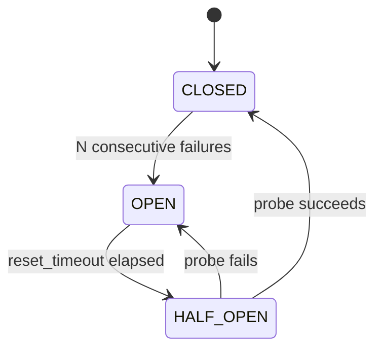

# 🛠️ MCP Implementation — Building Custom Servers & RAG Integration

> **Target:** Staff/Principal Engineer | **Focus:** production-minded MCP server code, schema design, RAG integration.
> All code targets the official Python SDK **v2** (`pip install "mcp>=2"`) and runs: `python -m pytest tests/` in `ai-engineering/mcp/` exercises it.

!!! tip "30-second summary"
    A good MCP server is a thin, well-described adapter: precise types (they become the JSON Schemas the model reads), `ToolError` for failures the model should see, hard limits on output size, logging to stderr, and the real security boundary in the system behind it (read-only DB role, allowed root directory, scoped tokens). Test it in-process with `Client(server)`, plus one end-to-end test over the real transport.

---

## 1. PROJECT STRUCTURE

```
ai-engineering/mcp/
├── requirements.txt               # mcp>=2, pyjwt, psycopg2-binary, pytest
├── servers/
│   ├── calculator_server.py       # Tutorial: tools, resources, prompts, structured output
│   ├── database_server.py         # Read-only PostgreSQL + auth, rate limit, breaker
│   └── rag_server.py              # Wraps ../rag/implementation
├── clients/
│   ├── python_client.py           # CLI client on mcp.Client
│   └── claude_config.json         # Example desktop-host config
├── common/
│   ├── auth.py                    # Bearer-JWT validation, per-request identity (ContextVar)
│   ├── rate_limiter.py            # Per-client token bucket
│   └── circuit_breaker.py         # Thread-safe CLOSED/OPEN/HALF_OPEN breaker
└── tests/
    ├── test_calculator.py         # In-process + one stdio end-to-end test
    └── test_rag_server.py         # Mock LLM, throwaway vector store
```

Servers import `common.*`, so run everything from `ai-engineering/mcp/` as modules (`python -m servers.calculator_server`).

---

## 2. IMPLEMENTATION — CALCULATOR MCP SERVER

### 2.1 Basic Server

```python
# servers/calculator_server.py (abridged)
import sys

from mcp.server.mcpserver import MCPServer          # v1: from mcp.server.fastmcp import FastMCP
from mcp.server.mcpserver.exceptions import ToolError

mcp = MCPServer("Calculator")


@mcp.tool()
def add(a: float, b: float) -> float:
    """Add two numbers together."""
    return a + b


@mcp.tool()
def divide(a: float, b: float) -> float:
    """Divide a by b. Returns error if b is zero."""
    if b == 0:
        raise ToolError("Division by zero is not allowed")
    return a / b


@mcp.resource("calculator://constants")
def get_constants() -> str:
    """Common mathematical constants."""
    return "pi: 3.141592653589793\ne: 2.718281828459045"


@mcp.prompt()
def solve_equation(equation: str) -> str:
    """Create a prompt template for solving mathematical equations."""
    return f"Solve the following equation step by step:\n\nEquation: {equation}"


if __name__ == "__main__":
    print("Starting Calculator MCP Server (stdio)...", file=sys.stderr)   # stderr, never stdout
    mcp.run(transport="stdio")
```

What the SDK derives from this:

| Python | MCP |
|---|---|
| function name, docstring | tool `name`, `description` (what the model reads to choose a tool) |
| `a: float, b: float` | `inputSchema` with `"type": "number"`, both required |
| `-> float` | `outputSchema` `{"result": number}`; results carry `structuredContent: {"result": 8.0}` plus a text block `"8.0"` |
| `raise ToolError(msg)` | result with `isError: true` and `msg`, so the model can recover |
| any other exception | result with `isError: true` and only "Error executing tool divide"; details stay in the server log |

### 2.2 Testing the Server

```bash
# Interactive, in the browser
npx @modelcontextprotocol/inspector python -m servers.calculator_server
```

```python
# tests/test_calculator.py (abridged)
from mcp import Client
from servers.calculator_server import mcp as calculator


async def test_divide_by_zero_is_a_tool_error():
    async with Client(calculator) as client:          # in-process: no subprocess, no JSON framing
        result = await client.call_tool("divide", {"a": 1, "b": 0})
        assert result.is_error
        assert "Division by zero" in result.content[0].text


async def test_structured_output():
    async with Client(calculator) as client:
        result = await client.call_tool("add", {"a": 5, "b": 3})
        assert result.structured_content == {"result": 8.0}
```

Open the `Client` inside the test rather than in an async-generator fixture: it holds an anyio cancel scope that must be exited by the task that entered it, and pytest-asyncio may tear fixtures down in a different task ("Attempted to exit cancel scope in a different task").

---

## 3. IMPLEMENTATION — DATABASE MCP SERVER

### 3.1 Production-Ready Server

The full file is [`servers/database_server.py`](servers/index.md). The parts worth discussing in an interview:

```python
mcp = MCPServer("DatabaseConnector")
rate_limiter = MCPRateLimiter(rate=10, burst=20)
db_circuit_breaker = CircuitBreaker(failure_threshold=5, reset_timeout=30, name="database")


def get_connection():
    conn = psycopg2.connect(
        DB_URL,
        cursor_factory=RealDictCursor,
        options=f"-c statement_timeout={QUERY_TIMEOUT_SECONDS * 1000}",   # kill runaway queries
    )
    conn.set_session(readonly=True, autocommit=True)                      # read-only transactions
    return conn


def execute_query(sql, params=None, max_rows=100):
    # Friendly early rejection only. NOT a security boundary:
    # "WITH x AS (DELETE ...)", side-effecting functions and pg_sleep all pass it.
    if not sql.strip().upper().startswith(("SELECT", "WITH")):
        raise ValueError("Only SELECT queries are allowed for security reasons.")
    conn = get_connection()
    try:
        with conn.cursor() as cur:
            cur.execute(sql, params)
            columns = [d[0] for d in cur.description] if cur.description else []
            limit = min(max_rows, MAX_ROWS)
            rows = cur.fetchmany(limit + 1) if cur.description else []   # +1: exact "truncated" flag
            return {"columns": columns, "rows": [dict(r) for r in rows[:limit]],
                    "total_returned": min(len(rows), limit), "truncated": len(rows) > limit}
    finally:
        conn.close()


@mcp.tool()
@as_tool_errors                      # ValueError / AuthorizationError / rate limit → ToolError
@require_permission("database:read")
def query(sql: str, max_rows: int = 100) -> str:
    """Execute a read-only SQL query against the analytics database. ..."""
    client_id = get_current_client_id()                 # tenant:user from the caller's identity
    if not rate_limiter.check_rate_limit(client_id):
        raise MCPRateLimitError(f"Rate limit exceeded. Try again in "
                                f"{rate_limiter.get_retry_after(client_id):.1f}s.")
    try:
        return db_circuit_breaker.call(_format_results, sql, int(min(max_rows, MAX_ROWS)))
    except CircuitBreakerOpenError:
        raise MCPRateLimitError("Database is temporarily unavailable. Please try again later.")
```

Design points:

- **Decorator order matters.** `@mcp.tool()` must be outermost so the *checked* function is what gets registered; `functools.wraps` keeps the signature so the schema is still generated from `sql` and `max_rows`.
- **Read-only is enforced three times**, strongest first: a database role with `SELECT` on an allow-list of views (you create this; it's the real guarantee), a read-only session with a statement timeout, then the prefix check for a friendlier error.
- **Identity is per request.** `common/auth.py` keeps the caller in a `ContextVar`. Over stdio the identity comes from the environment (`MCP_STDIO_PERMISSIONS=database:read` grants it locally); over HTTP it would come from the validated OAuth token. Without either, protected tools fail closed.
- **Schema listing uses the catalog.** `pg_class.reltuples` gives an estimated row count without scanning every table; `COUNT(*)` per table would.
- **Health output is sanitised.** Raw driver errors can include hostnames and credentials, so the health resource returns only the exception type.

---

## 4. IMPLEMENTATION — RAG MCP SERVER

### 4.1 Full RAG Integration

The full file is [`servers/rag_server.py`](servers/index.md); it wraps the pipeline in `ai-engineering/rag/implementation/`.

```python
mcp = MCPServer("RAGPipeline")

# The RAG library prints progress to stdout; on stdio that would corrupt JSON-RPC.
with contextlib.redirect_stdout(sys.stderr):
    pipeline = RAGPipeline(embedder=SentenceTransformerEmbedding(), store=ChromaVectorStore(),
                           llm=llm, loader=TextFileLoader())


@mcp.tool()
def rag_query(question: str, top_k: int = 5) -> str:
    """Complete RAG query: retrieve context and generate an answer. ..."""
    with contextlib.redirect_stdout(sys.stderr):
        result = pipeline.query(question, top_k=max(1, min(top_k, 10)))
    return f"**Answer:** {result['answer']}" + format_sources(result.get("sources", []))


@mcp.tool()
def retrieve(question: str, top_k: int = 5) -> str:
    """Retrieve relevant document chunks WITHOUT generating an answer. ..."""
    results = pipeline._retriever.retrieve(question, top_k=max(1, min(top_k, 10)))
    return format_chunks(results)          # SearchResult(.chunk.text, .chunk.metadata, .score)


@mcp.tool()
def index_document(file_path: str) -> str:
    """Index a file or directory into the RAG knowledge base. ..."""
    real = os.path.realpath(file_path)                     # resolve "..", and symlinks first
    if os.path.commonpath([real, RAG_ALLOWED_ROOT]) != RAG_ALLOWED_ROOT:
        raise ToolError(f"Path '{file_path}' is outside the allowed root '{RAG_ALLOWED_ROOT}'.")
    ...


if __name__ == "__main__":
    if MCP_TRANSPORT == "streamable-http":
        mcp.run(transport="streamable-http", host="127.0.0.1", port=RAG_PORT)   # /mcp
    else:
        mcp.run(transport="stdio")
```

Why these choices:

- **Two granularities.** `retrieve` returns evidence the host's model can reason over and cite; `rag_query` is a one-shot convenience. Many hosts already have a stronger model than your server's, so retrieval-first is usually the better default.
- **Path containment on `index_document`.** Without an allowed root, a prompt-injected model can index `~/.ssh/id_ed25519` and then retrieve it. `realpath` before the check defeats `../` and symlink tricks.
- **stdio by default, Streamable HTTP opt-in.** Desktop hosts launch servers over stdio. The deprecated HTTP+SSE transport (`transport="sse"`) is not offered.
- **No temperature parameter on the tool.** Sampling settings are an operator decision; exposing them lets the model (or an injected instruction) change them, and some current models reject non-default values anyway.

### 4.2 MCP + RAG Architecture

```
┌──────────────────────────────────────────────────────────────────┐
│                       AI AGENT (Host)                            │
│   LLM decides: "I need the docs on chunking"                     │
│   → tools/call retrieve {"question": "How does chunking work?"}  │
└─────────────────────────────┬────────────────────────────────────┘
                              │ MCP (JSON-RPC 2.0 over stdio or Streamable HTTP)
                              ▼
┌──────────────────────────────────────────────────────────────────┐
│                       MCP RAG SERVER                             │
│                                                                  │
│   tools: retrieve, rag_query, index_document                     │
│   resources: rag://status, rag://documents                       │
│                         │                                        │
│          ┌──────────────┼──────────────┬───────────────┐         │
│          ▼              ▼              ▼               ▼         │
│   ┌────────────┐ ┌────────────┐ ┌────────────┐ ┌────────────┐    │
│   │ Embedding  │ │ Vector     │ │ LLM        │ │ Cache      │    │
│   │ model      │ │ store      │ │ (LM Studio │ │ (TTL, keyed│    │
│   │            │ │ (Chroma)   │ │  or mock)  │ │ by index   │    │
│   │            │ │            │ │            │ │ version)   │    │
│   └────────────┘ └────────────┘ └────────────┘ └────────────┘    │
└──────────────────────────────────────────────────────────────────┘
```

The cache is a production addition, not in the demo code. Key it by normalised query, filters, tenant/ACL and index version.

### 4.3 Client Connection to RAG MCP Server

```python
import asyncio

from mcp import Client, StdioServerParameters


async def query_rag(question: str) -> str:
    params = StdioServerParameters(
        command="python",
        args=["-m", "servers.rag_server"],
        env={"USE_MOCK_LLM": "true"},          # no LM Studio needed
    )
    async with Client(params) as client:
        result = await client.call_tool("rag_query", {"question": question, "top_k": 5})
        if result.is_error:
            raise RuntimeError(result.content[0].text)
        return result.content[0].text


print(asyncio.run(query_rag("What are the main components of RAG?")))
```

The child does **not** inherit your whole environment: the SDK passes a small safe default set (`PATH`, `HOME`, ...) and merges `env` over it (v2). Secrets the server needs must be passed explicitly, which is the point.

---

## 5. SCHEMA DISCOVERY & DESIGN PATTERNS

### 5.1 Tool Schema Design Guidelines

The model sees only names, descriptions and schemas; design them like an API for a capable but literal new colleague.

| Principle | Bad | Good |
|-----------|-----|------|
| **Task-shaped tools** | `http_get(url)`, `run_sql(sql)` for everything | `get_invoice(invoice_id)`, `revenue_by_region(start, end)` |
| **Few tools** | 80 tools mirroring every REST endpoint | A handful of high-level tools; tool overload hurts selection accuracy and burns context |
| **Descriptions say when to use it** | "A tool" | "Search the knowledge base. Prefer this over `answer` when you need to cite sources." |
| **Typed, constrained parameters** | `args: str` (a JSON blob) | `max_rows: Annotated[int, Field(ge=1, le=1000)]` → `minimum`/`maximum` in the schema |
| **Enums for closed sets** | `status: str` | `status: Literal["open", "closed"]` |
| **Actionable errors** | "Error" | "Rate limited; retry after 2 s or add a WHERE clause" |
| **Bounded output** | Whole table or file | Truncate, paginate (cursor), or return a resource link |
| **Honest annotations** | Missing | `readOnlyHint`, `destructiveHint`, `idempotentHint`, `openWorldHint` (hosts may use them for confirmation UI; they are hints, not enforcement) |
| **Stable naming** | Renaming tools casually | Names are an API: keep them stable, version behaviour behind them |

### 5.2 Resource URI Design

```
# Hierarchical URIs; {braces} make resource templates (RFC 6570)
database://schema/tables
database://schema/table/{table_name}

# System resources
system://config
system://metrics

# RAG-specific resources
rag://status
rag://documents
rag://document/{document_id}
```

Avoid putting the tenant in the URI (`database://{tenant_id}/...`) as the *source* of tenancy: the model can write any URI. Derive the tenant from the caller's token; if a tenant segment is in the URI, it must match the token.

### 5.3 Prompt Design

Prompts are user-invoked templates (often slash commands). They can return several messages and embed resources, which makes them a way to ship a workflow, not just a string.

```python
from mcp.server.mcpserver.prompts.base import UserMessage


@mcp.prompt()
def debug_query(sql: str, error: str) -> list[UserMessage]:
    """Help debug a failed SQL query with context."""
    return [UserMessage(
        f"I ran this SQL and got an error. Explain what went wrong and give a fixed query.\n\n"
        f"Query:\n{sql}\n\nError:\n{error}\n\n"
        "Use the database://schema/tables resource to check table and column names."
    )]
```

---

## 6. COMMON UTILITIES

### 6.1 Rate Limiter

[`common/rate_limiter.py`](common/index.md): a token bucket per client key. Each key holds `tokens` (up to `burst`) refilled at `rate` per second; a request takes one token or is rejected. The lock makes check-and-take atomic across worker threads.

```python
def check_rate_limit(self, client_id: str) -> bool:
    with self._lock:
        client = self._clients[client_id]
        now = time.time()
        client["tokens"] = min(self.burst, client["tokens"] + (now - client["last_refill"]) * self.rate)
        client["last_refill"] = now
        if client["tokens"] < 1:
            return False
        client["tokens"] -= 1
        return True
```

Limits: in-memory and per replica (use Redis or the gateway when you scale out), and the per-client map grows without bound (evict idle keys).

### 6.2 Circuit Breaker

[`common/circuit_breaker.py`](common/index.md):



Three details that are easy to get wrong, all handled in the repo version:

1. **Consecutive** means a success resets the failure count. Without that, five failures spread over a day trip the breaker.
2. **Exactly one probe** in HALF_OPEN; concurrent callers are rejected until it finishes.
3. **A lock around state changes**, because sync MCP tools run on worker threads. The lock is never held while the protected call runs, or one slow query would serialise every caller.

---

## 7. TESTING MCP SERVERS

```python
# tests/test_rag_server.py (abridged)
import os, tempfile
import pytest

_TMP = tempfile.mkdtemp(prefix="rag-mcp-test-")
os.environ.update(USE_MOCK_LLM="true", RAG_ALLOWED_ROOT=_TMP,
                  PERSIST_DIRECTORY=os.path.join(_TMP, "vector_store"))   # set BEFORE import
pytest.importorskip("chromadb")

from mcp import Client
from servers.rag_server import mcp as rag_server


async def test_index_outside_allowed_root_is_refused():
    async with Client(rag_server) as client:
        result = await client.call_tool("index_document", {"file_path": "/etc/passwd"})
        assert result.is_error
        assert "outside the allowed root" in result.content[0].text
```

What a solid MCP test suite covers:

| Layer | Test |
|---|---|
| Contract | `list_tools` names, input/output schemas, annotations (a schema change is an API change) |
| Behaviour | Happy paths, with `structured_content` checked |
| Errors | `ToolError` → `is_error` with a useful message; bad arguments → `is_error`; unexpected exceptions don't leak details |
| Security | Path containment, permission checks fail closed, tenant isolation |
| Transport | One end-to-end run over stdio (catches stray stdout prints) and, for HTTP servers, Origin/auth checks |
| Model-in-the-loop (evals) | Given realistic prompts, does a model pick the right tool with the right arguments? Run these on description changes |

---

> **Next:** [MCP Production Architecture](04_MCP_PRODUCTION_ARCHITECTURE.md) → Security, deployment, tradeoffs
