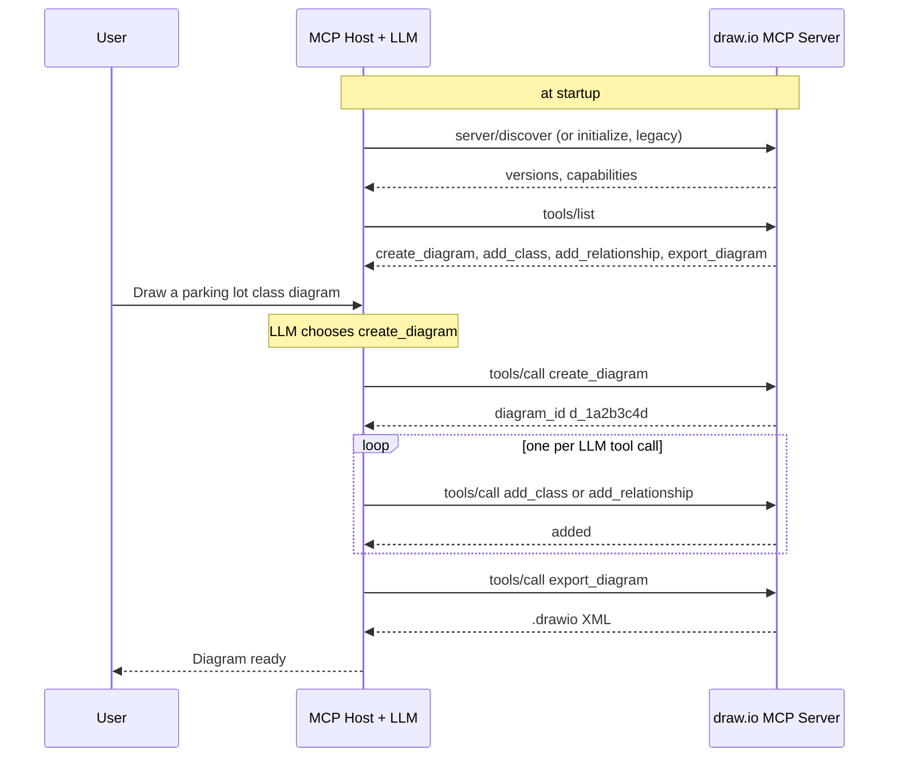

# 🎯 MCP Explained — Step by Step with a Live Example (draw.io)

> **A hands-on walkthrough of how the Model Context Protocol works, using a draw.io diagramming server as the concrete example.** Current as of spec **2026-07-28** and Python SDK v2; the server code below runs as written.

!!! tip "30-second version"
    The user asks the host for a diagram. The host already fetched the server's tool list and gave those tool definitions to the model. The model answers with a tool call; the host turns it into a JSON-RPC `tools/call`, the server runs a Python function and returns content (plus `structuredContent` if the tool has an output schema), and the host feeds that back to the model as a tool result. Repeat until the model answers the user. MCP is only the host ↔ server leg.

---

## 1. THE BIG PICTURE

Before the code, here is **where MCP fits**:

```ascii
┌──────────────────────────────────────────────────────────────────────┐
│                         USER (You)                                   │
│   "Create a class diagram for a parking lot system"                  │
└──────────────────────────┬───────────────────────────────────────────┘
                           │
                           ▼
┌──────────────────────────────────────────────────────────────────────┐
│               MCP HOST (Claude Desktop / Claude Code / agent)        │
│                                                                      │
│  0. At startup: launch/connect to servers, call tools/list           │
│  1. Send the user message + tool definitions to the LLM              │
│  2. LLM replies with a tool call: create_diagram(...)                │
│  3. Host sends tools/call to the server (after any user approval)    │
│  4. Server executes, returns a result                                │
│  5. Host gives the result to the LLM; LLM calls more tools or        │
│     answers the user                                                 │
└──────────────────────────┬───────────────────────────────────────────┘
                           │
                           │ MCP: JSON-RPC 2.0 over stdio or Streamable HTTP
                           ▼
┌──────────────────────────────────────────────────────────────────────┐
│                     MCP SERVER (drawio-diagrammer)                   │
│  ┌────────────────────────────────────────────────────────────────┐  │
│  │ • create_diagram(title)                    → new diagram id    │  │
│  │ • add_class(diagram_id, name, attrs, methods) → UML class box  │  │
│  │ • add_relationship(diagram_id, from, to, type) → arrow         │  │
│  │ • export_diagram(diagram_id)               → .drawio XML       │  │
│  └────────────────────────────────────────────────────────────────┘  │
└──────────────────────────────────────────────────────────────────────┘
```

The model never talks to the server and never sees JSON-RPC. It sees tool definitions and tool results in its own API format; the host translates.

### Key Concept: MCP Decouples Intent from Execution

| Component | Role | Example |
|-----------|------|---------|
| **You** | Express intent | "Draw a class diagram" |
| **LLM** | Chooses tools and arguments | "Call `create_diagram`, then `add_class` ×5" |
| **MCP Host** | Owns the model loop, user approval, and the MCP clients | Translates tool calls to `tools/call` |
| **MCP Server** | Executes the work | Builds the diagram |
| **draw.io** | Renders the result | Opens the `.drawio` file |

---

## 2. THE LIVE EXAMPLE: draw.io MCP Server

### 2.1 Server Implementation

A `.drawio` file is just mxGraph XML, so the server builds it directly; no draw.io library is needed. Save as `drawio_mcp_server.py`, `pip install "mcp>=2"`, and run it under the Inspector (`npx @modelcontextprotocol/inspector python drawio_mcp_server.py`).

```python
# drawio_mcp_server.py
"""A draw.io MCP server: builds UML class diagrams as .drawio (mxGraph XML) files.

No draw.io binding is needed: a .drawio file is XML that diagrams.net opens directly.
"""
import sys
import uuid
from typing import Literal, TypedDict
from xml.sax.saxutils import escape

from mcp.server.mcpserver import MCPServer
from mcp.server.mcpserver.exceptions import ToolError

mcp = MCPServer("drawio-diagrammer")

# In-memory store keyed by a server-minted handle. Fine for one stdio process;
# a multi-replica HTTP deployment would keep diagrams in Redis/a database.
diagrams: dict[str, dict] = {}


class DiagramRef(TypedDict):
    """A TypedDict (or Pydantic model) return type becomes the tool's outputSchema.
    A bare `dict` has no known shape, so it is returned as text only."""
    diagram_id: str
    title: str


EDGE_STYLES = {
    "inheritance": "endArrow=block;endFill=0;",
    "composition": "endArrow=diamondThin;endFill=1;startArrow=none;",
    "aggregation": "endArrow=diamondThin;endFill=0;",
    "dependency": "endArrow=open;dashed=1;",
    "association": "endArrow=open;",
}


def _get(diagram_id: str) -> dict:
    if diagram_id not in diagrams:
        known = ", ".join(diagrams) or "none"
        raise ToolError(f"Diagram {diagram_id!r} not found. Known diagrams: {known}")
    return diagrams[diagram_id]


@mcp.tool()
def create_diagram(title: str) -> DiagramRef:
    """Create a new, empty UML class diagram and return its diagram_id."""
    diagram_id = f"d_{uuid.uuid4().hex[:8]}"
    diagrams[diagram_id] = {"title": title, "classes": {}, "edges": []}
    return DiagramRef(diagram_id=diagram_id, title=title)


@mcp.tool()
def add_class(diagram_id: str, class_name: str,
              attributes: list[str], methods: list[str]) -> dict:
    """Add a UML class box.

    attributes: e.g. ["-floors: list[Floor]"]; methods: e.g. ["+park(v: Vehicle): Ticket"]
    """
    d = _get(diagram_id)
    if class_name in d["classes"]:
        raise ToolError(f"Class {class_name!r} already exists in {diagram_id}")
    d["classes"][class_name] = {"attributes": attributes, "methods": methods,
                                "index": len(d["classes"])}
    return {"status": "added", "class": class_name,
            "attributes": len(attributes), "methods": len(methods)}


@mcp.tool()
def add_relationship(diagram_id: str, from_class: str, to_class: str,
                     relationship_type: Literal["inheritance", "composition", "aggregation",
                                                "dependency", "association"]) -> dict:
    """Connect two existing classes. For inheritance, from_class is the subclass."""
    d = _get(diagram_id)
    missing = [c for c in (from_class, to_class) if c not in d["classes"]]
    if missing:
        raise ToolError(f"Unknown class(es) {missing}; add them with add_class first")
    d["edges"].append((from_class, to_class, relationship_type))
    return {"status": "added", "from": from_class, "to": to_class, "type": relationship_type}


@mcp.tool()
def export_diagram(diagram_id: str) -> str:
    """Return the diagram as .drawio XML (open it in diagrams.net or the draw.io app)."""
    d = _get(diagram_id)
    cells, ids = ['<mxCell id="0"/>', '<mxCell id="1" parent="0"/>'], {}
    for name, c in d["classes"].items():
        ids[name] = cid = f"c{c['index']}"
        body = "<hr>".join([escape("<br>".join(c["attributes"])), escape("<br>".join(c["methods"]))])
        label = escape(f"<b>{escape(name)}</b><hr>{body}")
        x, y = 40 + (c["index"] % 4) * 240, 40 + (c["index"] // 4) * 220
        cells.append(f'<mxCell id="{cid}" value="{label}" style="rounded=0;whiteSpace=wrap;html=1;'
                     f'align=left;verticalAlign=top;" vertex="1" parent="1">'
                     f'<mxGeometry x="{x}" y="{y}" width="200" height="160" as="geometry"/></mxCell>')
    for i, (src, dst, kind) in enumerate(d["edges"]):
        cells.append(f'<mxCell id="e{i}" style="{EDGE_STYLES[kind]}html=1;" edge="1" parent="1" '
                     f'source="{ids[src]}" target="{ids[dst]}"><mxGeometry relative="1" as="geometry"/></mxCell>')
    return (f'<mxfile><diagram name="{escape(d["title"])}"><mxGraphModel><root>'
            + "".join(cells) + "</root></mxGraphModel></diagram></mxfile>")


if __name__ == "__main__":
    print("drawio-diagrammer starting (stdio)", file=sys.stderr)
    mcp.run()
```

Things this small server demonstrates:

| Detail | Why it matters |
|---|---|
| `Literal[...]` on `relationship_type` | Becomes an `enum` in the JSON Schema, so the model sees the valid values and bad values are rejected before your code runs |
| `-> DiagramRef` (a `TypedDict`) | Becomes the tool's `outputSchema`; results carry `structuredContent`. A bare `dict` return has no schema and comes back as text only |
| `ToolError` with a helpful message | Comes back as `isError: true`. "Known diagrams: d_1a2b..." lets the model fix its own mistake |
| Server-minted `diagram_id` | Cross-call state is an explicit handle passed as a tool argument, the pattern the 2026-07-28 spec recommends now that sessions are gone |
| In-memory `diagrams` dict | Fine for one stdio process. Behind a load balancer, put diagrams in Redis or a database, because the next call may hit another replica |
| Log to stderr | stdout is the protocol channel |

---

## 🔍 DEEP DIVE: What Does `mcp.run(transport="stdio")` Actually Do?

`mcp.run()` (stdio is the default) starts the server and blocks until the host closes the pipe.

### 1. The Call Chain

```ascii
mcp.run(transport="stdio")                       # synchronous entry point
    │
    ▼
anyio.run(mcp.run_stdio_async)                   # start an event loop
    │
    ├── 1. stdio_server()
    │       • wraps fd 0 (stdin) as the read stream, fd 1 (stdout) as the write stream
    │       • one JSON-RPC message per line, UTF-8
    │
    ├── 2. low-level Server.run(read, write, ...)
    │       • tools/resources/prompts were registered when the
    │         @mcp.tool()/@mcp.resource()/@mcp.prompt() decorators ran at import
    │       • a dispatcher reads messages, routes by method, runs handlers
    │         (sync tools run on a worker thread so they don't block the loop)
    │
    └── 3. Shutdown
            • stdin EOF (host closed the pipe) → loop ends → process exits
            • hosts follow up with SIGTERM, then SIGKILL, if it doesn't
```

### 2. What Happens at Each Level

#### Level 1: `MCPServer.run()` — The High-Level Entry

`run()` validates the transport name and starts the matching async runner: `run_stdio_async`, or `run_streamable_http_async` for HTTP (which builds an ASGI app served by uvicorn). Decorators did the registration earlier, so `run()` only wires a transport to the already-built server.

#### Level 2: `StdioServerTransport` — The I/O Layer

Conceptually (the SDK's real code uses anyio streams):

```python
import json
import sys

for line in sys.stdin:                      # blocks until the host writes a line; EOF ends the loop
    message = json.loads(line)              # one JSON-RPC message per line, no embedded newlines
    response = dispatch(message)            # None for notifications
    if response is not None:
        sys.stdout.write(json.dumps(response) + "\n")
        sys.stdout.flush()                  # stdout to a pipe is block-buffered: flush every message
```

This is also why `print()` in a stdio server breaks things: that text lands in the protocol stream and the host fails to parse it.

#### Level 3: `Server` — The Protocol Handler

Routes each message by `method` and wraps the outcome as a JSON-RPC result or error:

| Incoming | Handler result |
|---|---|
| `server/discover` (2026-07-28) | Supported versions, capabilities, server info |
| `initialize` (legacy clients) | Negotiated version, capabilities; the SDK serves both eras |
| `tools/list`, `resources/list`, `prompts/list` | Definitions generated from your decorated functions |
| `tools/call` | Validate arguments → call the function → content (+ `structuredContent`), or `isError` |
| Unknown method | JSON-RPC error `-32601 Method not found` |

### 3. The Complete stdio Transport Lifecycle

```ascii
HOST (Claude Desktop)                     SERVER (Python process)
────────────────────────                  ────────────────────────

1. Spawns the server as a child process:
   $ python drawio_mcp_server.py
                                          imports module, registers tools,
                                          blocks reading stdin

2. Probe (dual-era client):
   {"method":"server/discover","id":1}
                                     ──►
                                     ◄──  {"result":{"supportedVersions":[...],
                                                     "capabilities":{"tools":{...}}},"id":1}
   (a legacy server would reject this; the client then falls back to initialize)

3. {"method":"tools/list","id":2,"params":{"_meta":{...}}}
                                     ──►
                                     ◄──  {"result":{"tools":[...]},"id":2}

4. {"method":"tools/call","id":3,"params":{"name":"create_diagram",...}}
                                     ──►  runs create_diagram()
                                     ◄──  {"result":{"content":[...],
                                                     "structuredContent":{...}},"id":3}
... one tools/call per model tool call ...

5. Closes the server's stdin
                                     ──►  EOF → exits
```

### 4. Technical Details & Timing

| Aspect | Detail |
|--------|--------|
| **Process model** | One child process per configured server, started by the host |
| **IPC** | Anonymous pipes on stdin/stdout. No sockets, no ports |
| **Message format** | Newline-delimited JSON-RPC 2.0, UTF-8 |
| **Latency** | Pipe overhead is negligible (well under a millisecond); tool work and the model's turn dominate |
| **Memory** | A Python process plus the SDK and your dependencies: tens of MB at least, far more if you load ML models |
| **Lifecycle** | Lives as long as the host keeps it; the host closes stdin, then signals |
| **Logging** | stderr only: `print("debug", file=sys.stderr)` or `logging` (which defaults to stderr) |
| **Credentials** | From the environment the host passes in; no OAuth over stdio |

### 5. What This Means in Practice

```python
from mcp.server.mcpserver import MCPServer

mcp = MCPServer("my-server")


@mcp.tool()
def my_tool(x: int) -> int:
    """Double a number."""
    return x * 2


if __name__ == "__main__":
    mcp.run()

# 1. Python starts; the decorator registers my_tool with schema {"x": integer}
# 2. The process blocks on stdin
# 3. Host: server/discover (or initialize, for older hosts) → capabilities
# 4. Host: tools/list → [{"name": "my_tool", "inputSchema": {...}, "outputSchema": {...}}]
# 5. Host: tools/call {"name": "my_tool", "arguments": {"x": 5}}
# 6. Server: {"content": [{"type": "text", "text": "10"}], "structuredContent": {"result": 10}}
# 7. Host closes stdin → EOF → process exits
```

### 6. The "stdin/stdout" Architecture Diagram

```ascii
┌────────────────────────────────────────────────────────────────┐
│                      HOST PROCESS                              │
│   ┌────────────────────────────────────────────────────────┐   │
│   │  MCP Client                                            │   │
│   │   write(child.stdin,  json_request + "\n")             │   │
│   │   read_line(child.stdout) → json_response              │   │
│   │   read(child.stderr)      → host's log file            │   │
│   └────────────┬───────────────────────────────────────────┘   │
└────────────────┼───────────────────────────────────────────────┘
                 │  stdin  ──────── JSON-RPC ────────►
                 │  stdout ◄─────── JSON-RPC ─────────
                 │  stderr ──────── logs only ───────►
┌────────────────┼───────────────────────────────────────────────┐
│                ▼        SERVER PROCESS (child)                 │
│   for line in stdin:   parse → dispatch → write line + flush   │
│   EOF → exit                                                   │
└────────────────────────────────────────────────────────────────┘
```

### 7. Why No Network Port?

`mcp.run(transport="stdio")` opens no network port; it uses the file descriptors every process already has:

| File descriptor | Direction | Used for |
|----------------|-----------|----------|
| `stdin` (fd 0) | Host → Server | JSON-RPC requests (and responses to anything the server asked) |
| `stdout` (fd 1) | Server → Host | JSON-RPC responses and notifications |
| `stderr` (fd 2) | Server → Host's logs | Logging, debug output |

**What this does and doesn't buy you:** there's no remote attack surface, so no firewall rules or listener to secure. But the server is **not sandboxed**: it runs as you, with your files, network and credentials. A malicious or prompt-injected stdio server can do anything you can. Treat installing one like installing any program, and run untrusted ones in a container or sandbox.

---

## 3. STEP-BY-STEP: WHAT HAPPENS WHEN YOU SAY "DRAW A PARKING LOT CLASS DIAGRAM"

### Step 1: User Sends a Request

```
You: "Create a class diagram for a parking lot system"
```

### Step 2: LLM Receives the Request

The host sends the conversation **and the tool definitions** (converted from `tools/list`) to the model. Shown here in a generic chat-completions style; each provider's format differs slightly:

```json
{
  "messages": [
    { "role": "system", "content": "You are a helpful assistant." },
    { "role": "user", "content": "Create a class diagram for a parking lot system" }
  ],
  "tools": [
    {
      "type": "function",
      "function": {
        "name": "create_diagram",
        "description": "Create a new, empty UML class diagram and return its diagram_id.",
        "parameters": { "type": "object", "properties": { "title": { "type": "string" } }, "required": ["title"] }
      }
    }
  ]
}
```

(Other tools omitted. Hosts with many servers often prefix names, e.g. `drawio__create_diagram`, to avoid collisions.)

### Step 3: LLM Decides to Use a Tool

```json
{
  "role": "assistant",
  "content": "I'll start by creating the diagram.",
  "tool_calls": [
    {
      "id": "call_abc123",
      "type": "function",
      "function": { "name": "create_diagram", "arguments": "{\"title\": \"Parking Lot System\"}" }
    }
  ]
}
```

### Step 4: Host Sends JSON-RPC Request to MCP Server

If the tool needs approval, the host asks the user first. Then:

```json
{
  "jsonrpc": "2.0",
  "id": 3,
  "method": "tools/call",
  "params": {
    "name": "create_diagram",
    "arguments": { "title": "Parking Lot System" },
    "_meta": {
      "io.modelcontextprotocol/protocolVersion": "2026-07-28",
      "io.modelcontextprotocol/clientCapabilities": {},
      "io.modelcontextprotocol/clientInfo": { "name": "claude-desktop", "version": "x.y.z" }
    }
  }
}
```

**This is the MCP message on the wire:** a line on the server's stdin, or the body of a POST to `/mcp` (with `Mcp-Method: tools/call` and `Mcp-Name: create_diagram` headers) over Streamable HTTP.

### Step 5: MCP Server Processes the Request

1. Parse the JSON-RPC message and look up the tool.
2. Validate `arguments` against the tool's input schema (generated from type hints: `title` must be a string; `relationship_type` must be one of the `Literal` values).
3. Call the Python function.
4. Convert the return value: text content for the model, plus `structuredContent` when there's an output schema. A `ToolError` becomes `isError: true`.

### Step 6: Server Sends JSON-RPC Response

```json
{
  "jsonrpc": "2.0",
  "id": 3,
  "result": {
    "resultType": "complete",
    "content": [
      { "type": "text", "text": "{\"diagram_id\": \"d_1a2b3c4d\", \"title\": \"Parking Lot System\"}" }
    ],
    "structuredContent": { "diagram_id": "d_1a2b3c4d", "title": "Parking Lot System" },
    "isError": false
  }
}
```

### Step 7: LLM Receives the Result and Plans Next Steps

The host appends the result as a tool message:

```json
{
  "role": "tool",
  "tool_call_id": "call_abc123",
  "content": "{\"diagram_id\": \"d_1a2b3c4d\", \"title\": \"Parking Lot System\"}"
}
```

and calls the model again, which continues:

```json
{
  "role": "assistant",
  "content": "Now the main classes.",
  "tool_calls": [
    {
      "id": "call_def456",
      "type": "function",
      "function": {
        "name": "add_class",
        "arguments": "{\"diagram_id\": \"d_1a2b3c4d\", \"class_name\": \"ParkingLot\", \"attributes\": [\"-floors: list[ParkingFloor]\"], \"methods\": [\"+park_vehicle(v: Vehicle): Ticket\", \"+unpark_vehicle(t: Ticket): bool\"]}"
      }
    }
  ]
}
```

Models can emit several independent tool calls in one turn; hosts may run them in parallel.

### Step 8: Multiple Tool Calls Build the Complete Diagram

Each step is a model turn plus a `tools/call` round trip:

```
LLM: add_class("ParkingLot", ...)                              → Server: added
LLM: add_class("Vehicle", ...)                                 → Server: added
LLM: add_class("Car", ...)                                     → Server: added
LLM: add_relationship("Car", "Vehicle", "inheritance")         → Server: added
LLM: add_class("ParkingSpot", ...)                             → Server: added
LLM: add_relationship("ParkingLot", "ParkingSpot", "composition") → Server: added
LLM: export_diagram("d_1a2b3c4d")                              → Server: .drawio XML
```

Seven model turns is slow and costly. A better-designed server would offer `create_class_diagram(classes: list[ClassSpec], relationships: list[RelSpec])` and do it in one call. **Fewer, coarser tools** is the most common MCP design improvement.

### Step 9: Final Response to User

```json
{
  "role": "assistant",
  "content": "I've created the Parking Lot class diagram (saved as parking_lot.drawio; open it in diagrams.net). It includes ParkingLot, ParkingFloor, ParkingSpot, an abstract Vehicle with Car/Truck/Motorcycle subclasses, ParkingTicket and FeeCalculator, with inheritance, composition and dependency relationships."
}
```

---

## 4. THE COMPLETE JSON-RPC FLOW (DIAGRAM)



---

## 5. WHERE IS MCP ACTUALLY?

**MCP is a protocol: it lives in the messages between the host's MCP client and the server.** Not in the model, and not between the host and the model.

```ascii
┌─────────────────────────────────────────────────────────────┐
│                       YOUR COMPUTER                         │
│                                                             │
│  ┌───────────────────────────────────────────────────────┐  │
│  │                CLAUDE DESKTOP (Host)                  │  │
│  │                                                       │  │
│  │   conversation + tool definitions                     │  │
│  │        │  HTTPS to the model provider's API           │  │
│  │        ▼  (NOT MCP: the provider's own tool format)   │  │
│  │   ┌───────────────────────────┐                       │  │
│  │   │  LLM (remote API)         │                       │  │
│  │   └───────────────────────────┘                       │  │
│  │        │ tool call                                    │  │
│  │        ▼                                              │  │
│  │   ┌───────────────────────────┐                       │  │
│  │   │  MCP CLIENT               │                       │  │
│  │   └────────────┬──────────────┘                       │  │
│  └────────────────┼──────────────────────────────────────┘  │
│                   │ MCP: JSON-RPC 2.0 over stdin/stdout     │
│                   ▼                                         │
│  ┌───────────────────────────────────────────────────────┐  │
│  │  MCP SERVER (drawio_mcp_server.py)                    │  │
│  │   MCPServer (Python SDK): parse, validate, dispatch   │  │
│  │   Your functions: create_diagram, add_class, ...      │  │
│  └───────────────────────────────────────────────────────┘  │
└─────────────────────────────────────────────────────────────┘
```

It's not a library or a framework but a **contract** both sides speak; the SDKs are just convenient implementations of it.

---

## 6. WHAT REQUESTS DO WE SEND? WHAT RESPONSES DO WE GET?

### 6.1 Request Types

| Method | Purpose | When |
|--------|---------|------|
| `server/discover` | Supported versions, capabilities, identity (2026-07-28) | Optional, before other requests |
| `initialize` + `notifications/initialized` | Handshake (legacy, ≤ 2025-11-25) | Connection start, older servers |
| `tools/list` / `tools/call` | Discover / execute tools | Startup / when the model asks |
| `resources/list` / `resources/read` | Discover / read data | When the host or user attaches context |
| `resources/templates/list` | Parameterised resource URIs | Startup |
| `prompts/list` / `prompts/get` | Discover / expand templates | Startup / when the user picks one (slash command) |
| `subscriptions/listen` | Long-lived stream of opted-in change notifications (2026-07-28) | When the host wants `list_changed` / resource updates |
| `completion/complete` | Autocomplete for prompt or resource-template arguments | While the user types |

### 6.2 Response Types

| Type | Structure | Example |
|------|-----------|---------|
| **Result** | `{"jsonrpc":"2.0","id":1,"result":{"resultType":"complete",...}}` | Tool result (possibly `isError: true`), resource contents |
| **Input required** | `{"result":{"resultType":"input_required","inputRequests":{...},"requestState":"..."}}` | Server needs elicitation before finishing (2026-07-28 MRTR) |
| **Error** | `{"jsonrpc":"2.0","id":1,"error":{"code":-32602,"message":"..."}}` | Unknown tool, malformed params |
| **Notification** | `{"jsonrpc":"2.0","method":"notifications/progress","params":{...}}` (no `id`) | Progress, list changes |

### 6.3 Concrete Request/Response Pair

**Request** (Host → Server):

```json
{
  "jsonrpc": "2.0",
  "id": 7,
  "method": "tools/call",
  "params": {
    "name": "add_class",
    "arguments": {
      "diagram_id": "d_1a2b3c4d",
      "class_name": "ParkingTicket",
      "attributes": ["-ticket_id: str", "-entry_time: datetime", "-exit_time: datetime | None"],
      "methods": ["+close(fee_calculator: FeeCalculator): float"]
    },
    "_meta": { "io.modelcontextprotocol/protocolVersion": "2026-07-28" }
  }
}
```

**Response** (Server → Host):

```json
{
  "jsonrpc": "2.0",
  "id": 7,
  "result": {
    "resultType": "complete",
    "content": [
      { "type": "text", "text": "{\"status\": \"added\", \"class\": \"ParkingTicket\", \"attributes\": 3, \"methods\": 1}" }
    ],
    "isError": false
  }
}
```

(`add_class` returns a plain `dict`, so there's no `structuredContent`; compare `create_diagram`.)

### 6.4 Error Response Example

Two different failures, two different shapes:

**The tool ran and failed** (unknown diagram id): a normal result with `isError`, which the model sees and can act on:

```json
{
  "jsonrpc": "2.0",
  "id": 8,
  "result": {
    "resultType": "complete",
    "isError": true,
    "content": [
      { "type": "text", "text": "Error executing tool add_class: Diagram 'd_99' not found. Known diagrams: d_1a2b3c4d" }
    ]
  }
}
```

**The request itself is bad** (no such tool, malformed params): the spec's answer is a JSON-RPC error, handled by the host and usually not shown to the model. (SDKs vary at the edges: Python SDK v2 reports an unknown tool as an `isError` result so the model can see it.)

```json
{
  "jsonrpc": "2.0",
  "id": 9,
  "error": { "code": -32602, "message": "Unknown tool: add_klass" }
}
```

---

## 7. MCP IN PRODUCTION

Local tools (files, git, the IDE) stay on **stdio** in production: they need the user's machine. Shared tools that many users or agents call become **remote MCP servers** over Streamable HTTP, deployed like any stateless web service:

```ascii
┌──────────────────────────────────────────────────────────────────┐
│                     PRODUCTION ARCHITECTURE                      │
│                                                                  │
│  ┌────────────┐     ┌──────────────┐     ┌────────────────────┐  │
│  │  User      │────►│  AI host /   │────►│  Gateway / LB      │  │
│  │            │     │  agent       │     │  • TLS             │  │
│  └────────────┘     └──────────────┘     │  • coarse limits   │  │
│                        OAuth token       │  • round-robin     │  │
│                                          └─────────┬──────────┘  │
│                         ┌──────────────────────────┴─────┐       │
│                         ▼                                ▼       │
│          ┌────────────────────────┐    ┌────────────────────┐    │
│          │  draw.io MCP server    │    │  DB MCP server     │    │
│          │  N replicas, stateless │    │  N replicas        │    │
│          │  POST /mcp             │    │  POST /mcp         │    │
│          │  diagrams in Redis/DB  │    │  read-only role    │    │
│          └────────────────────────┘    └────────────────────┘    │
│                         │ traces, metrics, audit logs            │
│                         ▼                                        │
│          ┌──────────────────────────────────────────────┐        │
│          │  OpenTelemetry → metrics / logs / traces     │        │
│          └──────────────────────────────────────────────┘        │
└──────────────────────────────────────────────────────────────────┘
```

### Production vs Development

| Aspect | Local server (stdio) | Remote server (Streamable HTTP) |
|--------|-------------------|------------------------------|
| **Who runs it** | The host, as a child process | You, as a service |
| **Transport** | Pipes | HTTPS POST; JSON or a per-request SSE stream |
| **Overhead** | Negligible | A network round trip (more across regions) |
| **Scaling** | One process per host | Many clients, many stateless replicas |
| **Auth** | Environment credentials | OAuth 2.1 bearer token per request, audience-checked |
| **State** | Process memory is fine | Externalise it (handles + Redis/DB) |
| **Deployment** | Package on PyPI/npm, or a binary | Container → Kubernetes / serverless |
| **Failure** | Process dies, host restarts it | Health checks, retries, circuit breakers |

### Production Deployment Steps

```bash
# 1. Build and push a versioned image (never deploy :latest)
docker build -t myregistry/mcp-drawio-server:1.0.0 .
docker push myregistry/mcp-drawio-server:1.0.0

# 2. Deploy (Deployment + Service + HPA; full manifest in 04_MCP_PRODUCTION_ARCHITECTURE.md)
kubectl apply -f k8s/mcp-drawio-server.yaml

# 3. Register the URL in the host, e.g. https://mcp.company.com/drawio/mcp
#    The host discovers the auth server from the 401 + protected-resource metadata.
```

**Kubernetes config** (abridged; see [Production Architecture §1.2](04_MCP_PRODUCTION_ARCHITECTURE.md#12-kubernetes-deployment) for probes, security context and autoscaling):

```yaml
apiVersion: apps/v1
kind: Deployment
metadata:
  name: mcp-drawio-server
spec:
  replicas: 3
  selector:
    matchLabels:
      app: mcp-drawio-server
  template:
    metadata:
      labels:
        app: mcp-drawio-server
    spec:
      containers:
      - name: server
        image: myregistry/mcp-drawio-server:1.0.0
        ports:
        - containerPort: 8000
        env:
        - name: MAX_DIAGRAM_BYTES
          value: "10485760"
        - name: REDIS_URL
          valueFrom:
            secretKeyRef: { name: drawio-redis, key: url }
        resources:
          requests: { memory: "256Mi", cpu: "250m" }
          limits:   { memory: "512Mi" }
---
apiVersion: v1
kind: Service
metadata:
  name: mcp-drawio-service
spec:
  selector:
    app: mcp-drawio-server
  ports:
  - port: 80
    targetPort: 8000
```

---

## 8. COMPLETE FLOW SUMMARY

```ascii
┌─────────────────────────────────────────────────────────────────────┐
│                       THE COMPLETE MCP FLOW                         │
│                                                                     │
│  PHASE 1: CONNECTION                                                │
│    stdio: host spawns the server.  HTTP: nothing to open.           │
│    Optional server/discover → versions + capabilities               │
│    (legacy servers: initialize → result → notifications/initialized)│
│                                                                     │
│  PHASE 2: DISCOVERY                                                 │
│    tools/list → [{"name":"create_diagram","inputSchema":...}, ...]  │
│    host converts these into the model's tool definitions            │
│                                                                     │
│  PHASE 3: EXECUTION (repeats)                                       │
│    model emits a tool call → host (user approval if needed)         │
│    → tools/call {"name":"add_class","arguments":{...}}              │
│    → server validates, runs the function                            │
│    → {"content":[...], "structuredContent":{...}, "isError":false}  │
│    → host feeds the result back → model calls more tools or answers │
│                                                                     │
│  PHASE 4: SHUTDOWN                                                  │
│    stdio: host closes stdin → server exits.  HTTP: nothing to close.│
└─────────────────────────────────────────────────────────────────────┘
```

---

## 9. KEY TAKEAWAYS

1. **MCP is a protocol, not a product**: JSON-RPC 2.0 messages between a host's MCP client and a server.
2. **The model doesn't know MCP exists**: it sees tool definitions and results in its provider's API format; the host translates both ways.
3. **The host owns the loop and the user**: tool selection happens in the model, execution approval and routing in the host.
4. **Round trips are model turns**: each tool call usually costs a full LLM turn. Prefer fewer, coarser tools.
5. **Schemas guide, servers enforce**: type hints and `Literal`s produce schemas that steer the model and reject bad types; business validation and security checks stay in your code.
6. **Both transports are production transports**: stdio for local tools, Streamable HTTP for shared remote ones. HTTP+SSE is deprecated.
7. **The draw.io example generalises**: the same pattern works for databases, filesystems, SaaS APIs and internal services.

---

> **Next:** See [MCP Fundamentals](01_MCP_FUNDAMENTALS.md) for protocol mechanics, and [MCP Production Architecture](04_MCP_PRODUCTION_ARCHITECTURE.md) for production deployment.
