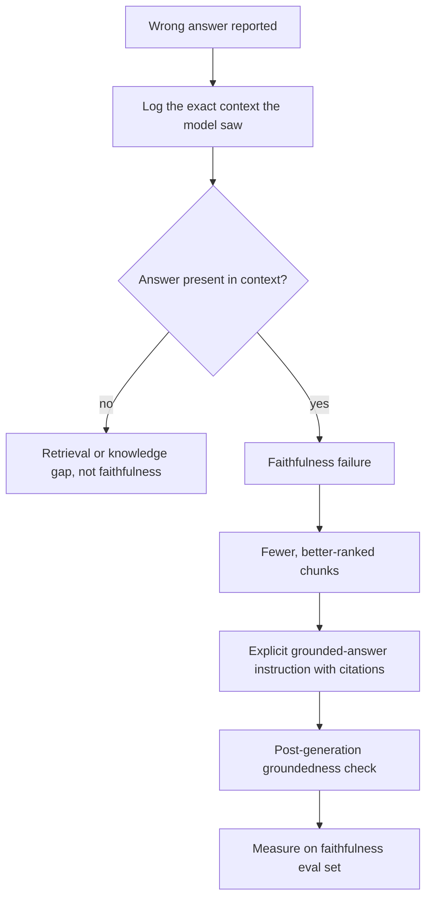
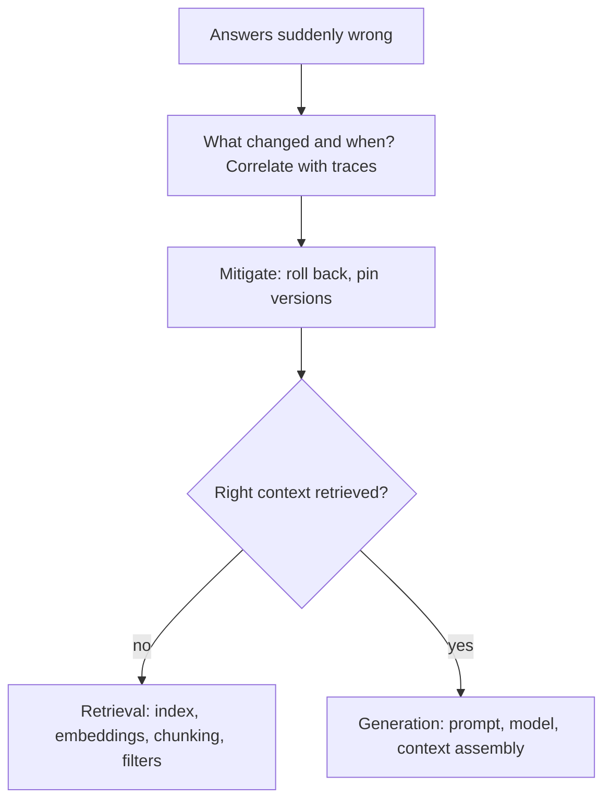
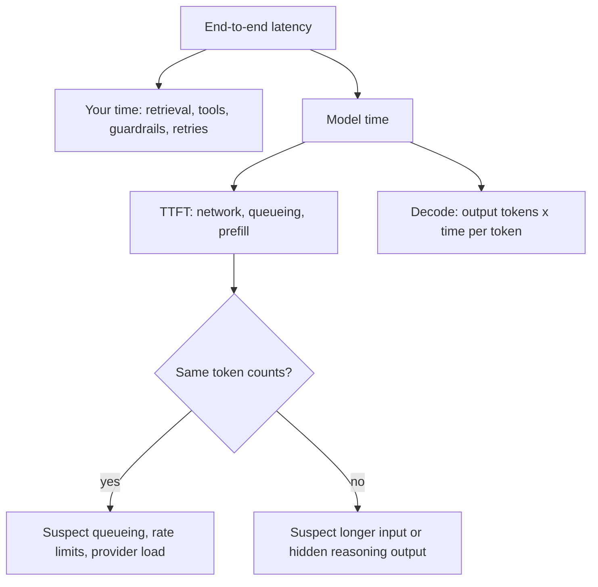
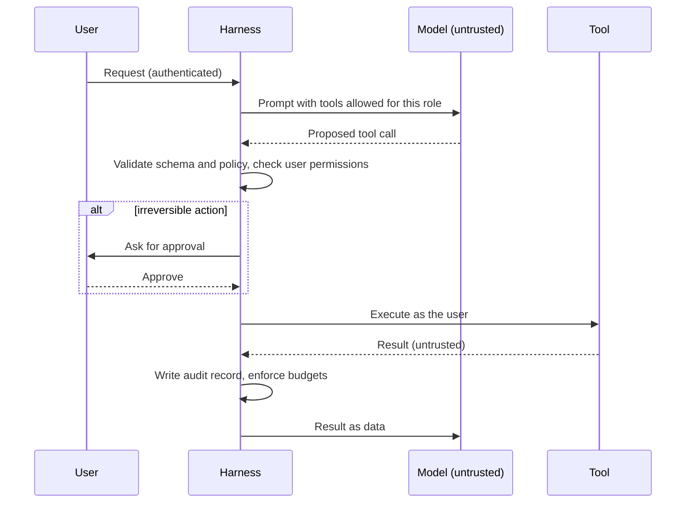
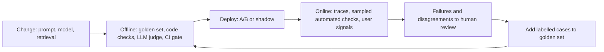

# 🏭 Production AI Engineering — Interview Questions & Answers

> **Principal/Staff Software Engineer level | Production-grade AI systems, MLOps & RAG**

---

## Table of Contents

### Part I — RAG & LLM Debugging
1. [RAG hallucinates despite having the right context](#1-rag-hallucinates-despite-having-the-right-context)
2. [RAG retrieval is too slow on large knowledge base](#2-rag-retrieval-is-too-slow-on-large-knowledge-base)
3. [Model gives confident but wrong answers in high-risk situations](#3-model-gives-confident-but-wrong-answers-in-high-risk-situations)
4. [RAG fails on multi-document reasoning](#4-rag-fails-on-multi-document-reasoning)
5. [PM wants to ship an AI feature that hallucinates on 15% of edge cases](#5-pm-wants-to-ship-an-ai-feature-that-hallucinates-on-15-of-edge-cases)

### Part II — Production AI Systems Design
6. [RAG suddenly gives wrong answers](#6-rag-suddenly-gives-wrong-answers)
7. [Design a production AI coding assistant](#7-design-a-production-ai-coding-assistant)
8. [LLM latency jumps from 2s to 15s](#8-llm-latency-jumps-from-2s-to-15s)
9. [Design an enterprise AI agent](#9-design-an-enterprise-ai-agent)
10. [Build a multi-agent workflow](#10-build-a-multi-agent-workflow)
11. [Same prompt gives different outputs](#11-same-prompt-gives-different-outputs)
12. [AI inference costs increased by 40%](#12-ai-inference-costs-increased-by-40)
13. [AI assistant works in testing but fails in production](#13-ai-assistant-works-in-testing-but-fails-in-production)
14. [How to evaluate an LLM in production](#14-how-to-evaluate-an-llm-in-production)
15. [Design an enterprise MCP-based AI application](#15-design-an-enterprise-mcp-based-ai-application)

---

## Part I — RAG & LLM Debugging

---

## 1. RAG hallucinates despite having the right context

**Interviewer:** *"Your RAG system is hallucinating even though it has the right context. How do you fix it?"*

### 🎯 Answer

!!! tip "30-second answer"
    First prove it really is a **faithfulness** failure: log the exact context the model saw and confirm the answer is in it. Then fix in order of cost: put fewer, better-ranked chunks in the prompt; make the "answer only from the documents, cite them, say 'not found' otherwise" instruction explicit; require citations; add a post-generation groundedness check (NLI or LLM judge) that blocks or regenerates unsupported answers. Measure with a faithfulness eval set, not anecdotes.

This is a **faithfulness failure** — the model has the correct information but isn't using it. This is distinct from a retrieval failure (wrong context) or a factuality gap (context doesn't contain the answer).

**Diagnosis pipeline:**

```python
def diagnose_hallucination(question, context, answer):
    """
    Determine WHY the model hallucinated despite having the right context.
    """
    # Test 1: Can the model extract the answer from context?
    prompt_1 = f"""Context: {context}
    
    Question: {question}
    
    Extract the EXACT answer from the context above.
    If the answer is not in the context, say 'NOT FOUND'."""
    
    extraction = llm.generate(prompt_1)   # lowest-variance settings the model allows
    
    if extraction == "NOT FOUND":
        # The model genuinely can't find it — context might be poorly structured
        return "context_formatting_issue"
    
    # Test 2: Can the model follow instruction to use context only?
    prompt_2 = f"""You MUST answer using ONLY the context below.
    Do NOT use any prior knowledge.
    
    Context: {context}
    
    Question: {question}"""
    
    forced_result = llm.generate(prompt_2)
    
    if "hallucination" in evaluate_faithfulness(forced_result, context):
        # Even with explicit instruction, model ignores context
        return "instruction_following_failure"
    
    return "prompt_competition"  # Model's prior knowledge overrides context
```

**Root causes and fixes:**

| Root Cause | Symptoms | Fix |
|-----------|----------|-----|
| **Context position bias / lost-in-the-middle** | Answer is in chunk 5 of 10; model uses first/last chunks and ignores the middle (Liu et al., 2023). Newer long-context models suffer less, but it still shows up with many noisy chunks | Fewer chunks (rerank, keep top-3 to top-5); put the most relevant first (and optionally last); summarize secondary chunks |
| **Distractor chunks** | Near-duplicate or outdated chunks sit next to the right one | Dedupe, filter by freshness/version metadata, drop chunks below a reranker score threshold |
| **Prior knowledge override** | Model knows a "better" answer from training | Harder system prompt: *"Answer EXCLUSIVELY from context. If context disagrees with your knowledge, the context is authoritative."* |
| **Instruction drift** | Earlier turns dilute the "answer from context" instruction | Re-inject the instruction every turn; keep system prompt short and reinforced |
| **Contradictory context** | Two chunks say different things | Add contradiction detection: if chunks conflict, surface both and flag uncertainty |

**Concrete fix — rerank, order deliberately, cite, then verify:**

```python
class FaithfulRAG:
    """
    RAG pipeline engineered to maximize faithfulness.
    (self.retrieve, self.llm, self.verifier_llm and extract_supporting_spans are app-specific.)
    """
    def __init__(self):
        self.reranker = CrossEncoder("cross-encoder/ms-marco-MiniLM-L-6-v2")

    def build_faithful_context(self, chunks: list[str], question: str) -> str:
        # Step 1: Rerank — CrossEncoder.rank returns [{"corpus_id", "score"}, ...] sorted by score
        ranked = self.reranker.rank(question, chunks, top_k=3)
        ordered = [chunks[r["corpus_id"]] for r in ranked]
        # Most relevant first. Some teams also repeat the top chunk at the end
        # to counter lost-in-the-middle; measure it on your eval set before keeping it.

        # Step 2: Clear boundaries + stable IDs so the model can cite
        return "\n---\n".join(f"[Document {i+1}]: {c}" for i, c in enumerate(ordered))

    async def generate(self, question: str) -> str:
        chunks = self.retrieve(question)
        context = self.build_faithful_context(chunks, question)

        system_prompt = """You are a precise answer generator.
RULES:
1. Answer ONLY using the provided documents. They override anything you believe.
2. If the documents don't contain the answer, say "I don't have enough information."
3. If documents contradict each other, say so and cite both.
4. Cite the supporting document IDs after each claim, e.g. [Document 2]."""
        user_prompt = f"Documents:\n{context}\n\nQuestion: {question}"

        answer = await self.llm.generate(system=system_prompt, user=user_prompt)

        # Step 3: Post-hoc groundedness check
        if not await self.verify_faithfulness(answer, context):
            return await self.extractive_fallback(question, chunks)
        return answer

    async def verify_faithfulness(self, answer: str, context: str) -> bool:
        """A separate judge (or NLI model) checks every claim against the context."""
        verdict = await self.verifier_llm.generate(
            f"Context:\n{context}\n\nAnswer:\n{answer}\n\n"
            "List every claim in the answer and label it SUPPORTED or UNSUPPORTED "
            "by the context. End with one line: VERDICT: PASS or VERDICT: FAIL."
        )
        return verdict.strip().endswith("VERDICT: PASS")

    async def extractive_fallback(self, question: str, chunks: list[str]) -> str:
        """Safer degraded mode: quote verbatim supporting spans instead of free generation,
        or say 'I don't have enough information' if none exist."""
        spans = self.extract_supporting_spans(chunks, question)
        if not spans:
            return "I don't have enough information."
        return "From the source documents:\n" + "\n".join(f'> "{s}"' for s in spans)
```

**Trade-offs and failure modes:** every verification step adds a model call (latency and cost), so many teams run it synchronously only on high-risk intents and asynchronously (sampled) elsewhere. LLM judges have their own error rate; calibrate them against a few hundred human labels before trusting the gate. Citations help users and evaluation, but a model can cite a document that does not actually support the claim, so check citations too.

**🔴 Follow-up:** *"What if the fix still doesn't work?"*

**✅ Answer:** If faithfulness remains broken after prompt changes and reranking, run the same faithfulness eval set against other models; instruction-following on grounded tasks varies a lot between model families and sizes, so this is an empirical choice, not a brand choice. Use the provider's citation/grounding features where they exist (several APIs can return citations tied to supplied documents). As a hard gate, add **factored verification**: split the answer into claims and check each with an NLI model or judge; reject or regenerate answers whose claims are not entailed. Finally, consider fine-tuning on grounded QA examples if the volume justifies it.

*Figure: confirm it is a faithfulness failure, then fix in order of cost.*



---

## 2. RAG retrieval is too slow on large knowledge base

**Interviewer:** *"Your RAG retrieval is too slow on a large knowledge base. How do you speed it up?"*

### 🎯 Answer

!!! tip "30-second answer"
    Measure first: split the retrieval span into query embedding, ANN search, metadata filtering, reranking and network hops. The usual big wins are an **approximate** index (HNSW, IVF, or a disk-based index such as DiskANN) tuned for a recall target, **vector compression** (scalar/product/binary quantization with full-precision re-scoring), a **cheap first stage + reranker on a small candidate set**, and **caching** of query embeddings and hot results. Every speedup trades recall, so track recall@k against an exact-search baseline while you tune.

Retrieval latency in RAG comes from embedding, vector search, and re-ranking. On a large knowledge base (10M+ chunks), each of these must be optimized.

**Where the time goes (illustrative; measure your own):**

| Component | Typical cause of slowness | Technique |
|-----------|---------------------------|-----------|
| Query embedding | Large model on CPU, remote API round trip | Cache embeddings for repeated queries, GPU/batched inference, smaller model **for both queries and documents** |
| Vector search | Brute-force kNN, index larger than RAM, restrictive filters | ANN index (HNSW/IVF/DiskANN), quantization, pre-filter partitions |
| Reranking | Cross-encoder over too many candidates | Rerank only the top 50–100 candidates; smaller reranker |

**1. Query embedding optimization:**

!!! warning "Queries and documents must use the same embedding model"
    Two different models (e.g. MiniLM for queries, mpnet for documents) produce vectors in unrelated spaces, so cosine similarity between them is meaningless. If you want a cheaper query path, switch **both** sides and re-embed the corpus, or use a model family designed for asymmetric search that shares one space (e.g. models that take a "query:" / "passage:" prefix).

```python
from cachetools import TTLCache
from sentence_transformers import SentenceTransformer

class FastEmbedding:
    def __init__(self, model_name: str = "all-MiniLM-L6-v2"):
        # ONE model for queries and documents (same vector space)
        self.encoder = SentenceTransformer(model_name)
        self.query_cache = TTLCache(maxsize=10_000, ttl=300)  # 5 min TTL

    def embed_query(self, query: str):
        key = query.strip().lower()
        if (hit := self.query_cache.get(key)) is not None:
            return hit
        emb = self.encoder.encode(query, normalize_embeddings=True)
        self.query_cache[key] = emb
        return emb

    def embed_documents(self, docs: list[str]):
        # Offline, batched; re-run for the whole corpus whenever the model changes
        return self.encoder.encode(docs, batch_size=256, normalize_embeddings=True)
```

**2. Vector search optimization:**

```python
import numpy as np
from typing import List

class TieredVectorStore:
    """
    Multi-tier vector search for speed.
    """
    def __init__(self, dimension: int = 768):
        # Option A: IVF (approximate; good with quantization, cheap to build)
        self.ivf_index = self._build_ivf(nlist=1000, nprobe=10)

        # Option B: HNSW graph (approximate; usually best recall/latency in RAM,
        # but memory-hungry: full vectors + graph links)
        self.hnsw_index = self._build_hnsw(M=16, ef_construction=200)

        # Exact brute force: only for small corpora or to measure ground-truth recall
        self.full_store = None

    def search(self, query_vector: np.ndarray, top_k: int = 10,
               latency_budget_ms: int = 50) -> List[str]:
        """
        Adaptive search: the knobs (nprobe for IVF, ef_search for HNSW)
        trade latency for recall at query time.
        """
        if latency_budget_ms < 20:
            return self.ivf_search(query_vector, top_k, nprobe=5)    # low nprobe: fastest, lowest recall
        elif latency_budget_ms < 50:
            return self.ivf_search(query_vector, top_k, nprobe=20)   # more probes: better recall
        elif latency_budget_ms < 200:
            return self.hnsw_search(query_vector, top_k, ef=100)     # higher ef: better recall
        else:
            return self.exact_search(query_vector, top_k)            # exact, O(N·d)

    def _build_ivf(self, nlist: int, nprobe: int):
        """
        IVF (Inverted File Index):
        - k-means clusters vectors into nlist lists
        - At query time: compare against nlist centroids, then scan only nprobe lists
        - Cost per query ≈ O(nlist·d + (nprobe/nlist)·N·d)
        - Trade-off: nprobe controls speed vs recall
        
        Example: 10M docs, 1000 clusters, nprobe=20
        → Search 20/1000 * 10M = 200K docs
        → ~50x fewer vectors scanned than a full scan (recall depends on clustering)
        
        Implementation with FAISS:
        quantizer = faiss.IndexFlatIP(dimension)
        index = faiss.IndexIVFFlat(quantizer, dimension, nlist, faiss.METRIC_INNER_PRODUCT)
        index.train(embeddings)
        index.add(embeddings)
        index.nprobe = nprobe  # Set at query time
        D, I = index.search(query_vector, top_k)
        """
        pass

# Other options: ScaNN (Google; partitioning + anisotropic quantization),
# DiskANN-style graph indexes for corpora larger than RAM (vectors on SSD,
# compressed copies in RAM), or a managed vector DB exposing the same knobs.
# ScaNN usage sketch:
# searcher = scann.scann_ops_pybind.builder(normalized_dataset, 10, "dot_product") \
#     .tree(num_leaves=2000, num_leaves_to_search=100, training_sample_size=250_000) \
#     .score_ah(2, anisotropic_quantization_threshold=0.2) \
#     .reorder(100).build()
```

**3. Quantization for speed and memory:**

Size is exact arithmetic; recall and speed depend heavily on the embedding model and data, so treat the right-hand columns as directional and measure on your corpus.

| Quantization | Size vs float32 | Recall impact | Notes |
|-------------|-----------------|---------------|-------|
| Float16 / bfloat16 | 50% | Negligible | Easy default |
| Int8 (scalar) | 25% | Small | Widely supported in vector DBs |
| Product Quantization (PQ) | Configurable (e.g. 16–64 bytes/vector) | Moderate | Re-score top candidates with full vectors |
| Binary (1-bit) | ~3% (1/32) | Large unless re-scored | Works best with models trained for it; always oversample + re-score |

```python
class QuantizedIndex:
    """
    Product Quantization compresses vectors by:
    1. Split each vector into M sub-vectors
    2. Cluster each sub-vector space into K centroids
    3. Store only centroid IDs (log2(K) * M bits)
    
    Search: compute partial distances on-the-fly using pre-computed centroid distances
    → Asymmetric Distance Computation (ADC)
    """
    def __init__(self, M=16, K=256):
        self.M = M  # Number of sub-vector spaces
        self.K = K  # Centroids per sub-space
        # Storage: log2(256) * 16 = 128 bits per vector
        # Instead of 768 * 32 = 24,576 bits (floats) per vector
```

**4. Two-stage retrieval:**

```python
class TwoStageRetriever:
    """
    Stage 1: Fast bi-encoder ANN search (often hybrid with BM25) → top-100
    Stage 2: Slower, more accurate cross-encoder reranker → top-5

    A cross-encoder scores (query, doc) pairs jointly, so it cannot be
    pre-computed or indexed: running it over the whole corpus is infeasible.
    Its cost scales with the candidate count, which is the knob to tune.
    """
    def __init__(self):
        self.stage1 = FastVectorIndex()   # bi-encoder ANN (+ BM25)
        self.stage2 = CrossEncoder("cross-encoder/ms-marco-MiniLM-L-6-v2")

    def retrieve(self, query: str, top_k: int = 5) -> List[Document]:
        candidates = self.stage1.search(query, top_k=100)               # cheap, high recall
        ranked = self.stage2.rank(query, [c.text for c in candidates],  # expensive, high precision
                                  top_k=top_k)
        return [candidates[r["corpus_id"]] for r in ranked]
```

**5. Caching strategy:**

```python
class FullCacheStrategy:
    """
    Multi-level cache for RAG.
    """
    def __init__(self):
        # L1: Exact query cache (identical questions)
        self.exact_cache = Cache(ttl=3600, maxsize=10000)
        
        # L2: Semantic cache (similar questions)
        self.semantic_cache = SemanticCache(similarity_threshold=0.95, ttl=300)
        
        # L3: Document cache (frequently retrieved docs)
        self.doc_cache = Cache(ttl=600, maxsize=50000)
    
    def get_response(self, query: str) -> Optional[str]:
        # L1: Exact match
        cached = self.exact_cache.get(query)
        if cached:
            return cached
        
        # L2: Semantic match
        cached = self.semantic_cache.find_similar(query)
        if cached:
            return cached
        
        return None
```

!!! warning "Semantic-cache failure modes"
    A similarity threshold cannot tell "cancel my order" from "don't cancel my order", or one tenant's question from another's. Scope cache keys by tenant/user/permissions and by the index version, keep thresholds strict, exclude personalised or time-sensitive intents, and invalidate on re-index.

**🔴 Follow-up:** *"What's the one optimization you'd do first?"*

**✅ Answer:** Profile first. If the time is in vector search and you are doing brute-force kNN (or the index does not fit in RAM), move to an **ANN index with compression**: HNSW if it fits in memory, IVF-PQ (`faiss.IndexIVFPQ`) or a disk-based graph index if it doesn't.
- Memory math: 10M vectors × 768 dims × 4 bytes ≈ **31 GB** as float32; PQ at 16 bytes/vector is ≈ **160 MB** of codes (plus IDs and centroids).
- Order-of-magnitude speedups are typical, at some recall cost; recover recall by oversampling (e.g. fetch 100) and re-scoring with full-precision vectors.
- Set a recall@k target against exact search and tune `nprobe`/`ef_search` to the cheapest setting that meets it.

**What they probe next:** filtered search (metadata filters can wreck HNSW recall if applied after the search; prefer pre-filtering or filter-aware indexes), index rebuild/update cost for fresh data, and hybrid lexical + vector retrieval for exact IDs and rare terms.

---

## 3. Model gives confident but wrong answers in high-risk situations

**Interviewer:** *"Your model gives confident but wrong answers in high risk situations. How do you find the cause and fix it?"*

### 🎯 Answer

!!! tip "30-second answer"
    An LLM's tone is not a confidence score. Build an **external** uncertainty signal (sampling-based consistency / semantic entropy, retrieval support, a verifier, token log-probs only where the API exposes them), **calibrate** it on labelled examples from the risky domain, and use it to **abstain or route to a human** above a risk-specific threshold. For the cause, slice the failures: missing knowledge, out-of-distribution queries, ignored context, or reasoning shortcuts each have a different fix.

This is the **most dangerous failure mode** — the model doesn't know it doesn't know. In high-risk domains (healthcare, finance, legal, safety-critical), confident wrong answers can cause real harm.

**Diagnosis framework:**

```python
class HallucinationDiagnosis:
    """
    Systematic approach to find WHY the model is confidently wrong.
    """
    def analyze_failure(self, question: str, answer: str, 
                        context: dict, model_confidence: float):
        
        # Axis 1: Knowledge boundary
        knowledge_types = [
            "parametric_knowledge",   # Model's training data
            "provided_context",        # In-context information
            "reasoning_chain"          # Step-by-step derivation
        ]
        
        # Axis 2: Calibration
        calibration = self.check_calibration(question, answer)
        
        # Axis 3: Data distribution
        distribution = self.check_distribution(question)
        
        return {
            "root_cause": self._identify_root_cause(
                knowledge_types, calibration, distribution
            ),
            "confidence": model_confidence,
            "correctness": self._external_verification(answer),
            "evidence": context
        }
```

**Root causes and fixes:**

| Root Cause | Indicator | Fix |
|-----------|-----------|-----|
| **Epistemic overconfidence** | Model was trained on similar but not identical data | Add epistemic uncertainty estimation; reject low-evidence answers |
| **Distribution shift** | Question is out-of-distribution from training data | OOD detection; route to human |
| **Reasoning shortcut** | Model skips verification steps | Chain-of-thought with mandatory verification step |
| **Context ignoring** | Model relies on parametric knowledge over context | Reinforced instruction; context-grounded generation |
| **Calibration collapse** | Scores are miscalibrated (everything comes out 0.9+) | Recalibrate the *external* score (temperature scaling, Platt scaling or isotonic regression) on a held-out labelled set |

**Fix 1 — Uncertainty estimation:**

!!! note "What works with hosted models in 2026"
    MC Dropout (sampling with dropout on) needs access to the weights and a model trained with dropout, so it applies to your own classifiers, not to hosted LLMs. Token log-probs are exposed by some APIs and by self-hosted servers (e.g. vLLM), but not by every hosted frontier model, and reasoning models often hide the reasoning tokens. **Sampling-based** methods (self-consistency, semantic entropy) work against any API, at N× the cost.

```python
import numpy as np

class UncertaintyEstimator:
    """
    Methods to estimate when the model doesn't know.
    """
    def __init__(self, model):
        self.model = model

    def mean_token_probability(self, answer_logprobs: list[float]) -> float:
        """
        Method 1 (only if the API/server returns logprobs):
        exp(mean log-prob) = geometric-mean token probability, in (0, 1].
        Long answers and stylistic tokens dilute it; score the key span
        (e.g. the entity or number) rather than the whole answer.
        """
        return float(np.exp(np.mean(answer_logprobs)))

    def semantic_entropy(self, question: str, n: int = 5) -> float:
        """
        Method 2: Semantic entropy (Kuhn, Gal & Farquhar, ICLR 2023;
        Farquhar et al., Nature 2024). Sample N answers, cluster them by
        meaning (bidirectional entailment), take entropy over clusters.
        0 = all answers mean the same thing; max = ln(N) (≈1.61 for N=5).
        """
        answers = [self.model.generate(question) for _ in range(n)]  # default sampling settings
        clusters = self._cluster_by_bidirectional_entailment(answers)
        p = np.array([len(c) for c in clusters]) / n
        return float(-(p * np.log(p)).sum())
```

**Fix 2 — Calibrated confidence thresholds:**

```python
class CalibratedGuardrail:
    """
    Reject answers when confidence is below threshold.
    Threshold is calibrated on a validation set.
    """
    def __init__(self, calibration_data: List[tuple], risk_level: str):
        # Starting points only: pick the threshold from the precision/coverage
        # curve on labelled data so that accepted answers meet the target accuracy.
        self.risk_levels = {
            "critical": 0.95,   # Healthcare, safety
            "high": 0.90,       # Financial, legal
            "medium": 0.80,     # Customer support
            "low": 0.70,        # Content generation
        }
        self.threshold = self.risk_levels[risk_level]

        # Map raw scores (e.g. 1 - normalised semantic entropy) to calibrated
        # probabilities: Platt scaling (Platt, 1999) or isotonic regression;
        # temperature scaling (Guo et al., 2017) if you own the logits.
        self.calibrator = self._fit_calibrator(calibration_data)

    def should_accept(self, raw_score: float) -> bool:
        confidence = self.calibrator.predict(raw_score)
        return confidence >= self.threshold   # else abstain / route to human
```

**Fix 3 — Verification chain for high-risk queries:**

```python
class VerifiedGeneration:
    """
    For high-risk queries: generate → verify → conditional output.
    """
    HIGH_RISK_DOMAINS = ["medical", "financial", "legal", "safety"]
    
    def generate_verified(self, question: str, domain: str) -> Output:
        if domain in self.HIGH_RISK_DOMAINS:
            return self._high_risk_generation(question)
        return self._normal_generation(question)
    
    def _high_risk_generation(self, question: str) -> Output:
        # Step 1: Generate with explicit citations
        answer = self.model.generate(
            question,
            system_prompt="""Answer step by step. For EACH claim, cite your source.
            If you're unsure about any claim, mark it with [UNCERTAIN]."""
        )
        
        # Step 2: Extract claims and verify each
        claims = self._extract_claims(answer)
        verified = []
        
        for claim in claims:
            if claim.is_uncertain:
                # Automatically flag
                verified.append(FlaggedClaim(claim, "UNCERTAIN"))
                continue
            
            # Verify against knowledge base
            evidence = self.retrieve_evidence(claim.text)
            if evidence:
                verified.append(VerifiedClaim(claim, evidence))
            else:
                verified.append(FlaggedClaim(claim, "NO_EVIDENCE"))
        
        # Step 3: If any claim is unverified, reject or add disclaimer
        unverified = [c for c in verified if not c.is_verified]
        if unverified:
            return Output(
                text=answer,
                warnings=[f"Claim '{c.text}' could not be verified" for c in unverified],
                requires_review=True
            )
        
        return Output(text=answer, requires_review=False)
```

**Production monitoring for this:**

```python
# Alert when:
# 1. Confidence > 0.9 AND answer is wrong → calibration drift
# 2. Share of high-semantic-entropy queries jumps → new, unfamiliar traffic or a model change
# 3. Human override rate increases → trust degradation

class CalibrationMonitor:
    def check_calibration_drift(self, batch: List[Inference]):
        """
        Expected: when model says 90% confident, it should be right 90% of the time.
        If it's right only 70% at 90% confidence → calibration is broken.
        """
        for confidence_bin in [0.5, 0.6, 0.7, 0.8, 0.9, 0.95]:
            subset = [x for x in batch 
                      if confidence_bin - 0.05 < x.confidence <= confidence_bin + 0.05]
            if subset:
                accuracy = sum(x.is_correct for x in subset) / len(subset)
                calibration_error = abs(accuracy - confidence_bin)
                
                if calibration_error > 0.15:
                    self.alert(f"Calibration drift at {confidence_bin}: "
                               f"expected {confidence_bin:.0%}, got {accuracy:.0%}")
```

**🔴 Follow-up:** *"How do you detect hallucinations in real-time without ground truth?"*

**✅ Answer:** Use **self-consistency / semantic entropy**: sample 3–5 answers and cluster them by meaning; disagreement means the model is uncertain. Where the API exposes log-probs, add the **mean token log-probability** of the key answer span, with a threshold calibrated on labelled data (there is no universal value). For RAG, check **groundedness** against the retrieved context with NLI or a judge. These signals catch different failures, so combine them, and remember the cost: sampling N answers multiplies spend, so apply it to high-risk intents or a sample of traffic.

---

## 4. RAG fails on multi-document reasoning

**Interviewer:** *"Your RAG system fails on questions that need facts from multiple documents combined. What do you do?"*

### 🎯 Answer

!!! tip "30-second answer"
    Single-shot top-k retrieval embeds the *whole* question once, so it often fetches only one of the facts needed. Fix retrieval first: **decompose** the question into sub-queries (or iterate with an agentic retrieve-reason loop), retrieve per hop, then compose. For "summarize everything about X" use **map-reduce**; for relationship-heavy corpora consider a **graph index**. Evaluate with a multi-hop test set, because each extra hop adds latency, cost and error compounding.

This is a **compositional reasoning failure** — the model has all the pieces but can't assemble them. Standard RAG retrieves independent chunks, but multi-document reasoning requires synthesized understanding.

**The root problem:**

```python
# Standard RAG retrieves:
chunk_1 = "Amazon's total net sales in 2023 were $574.8B"     # 10-K
chunk_2 = "Microsoft's cloud revenue kept growing in 2023"     # distractor
chunk_3 = "AWS segment net sales were $90.8B in 2023"          # different document

# Question: "What share of Amazon's 2023 revenue came from AWS?"
# Need to COMBINE chunk_1 and chunk_3: 90.8 / 574.8 ≈ 15.8%
# Often only one of them is retrieved (the query embedding sits "between" them),
# or the model doesn't connect facts from different sources.
```

**Solution 1 — Query decomposition (Multi-Hop RAG):**

```python
class MultiHopRAG:
    """
    Decompose complex questions into sub-questions, answer each,
    then compose the final answer.
    """
    def __init__(self):
        self.decomposer = LLM()   # Breaks down questions
        self.retriever = Retriever()
        self.composer = LLM()     # Answers sub-questions and combines answers
    
    async def answer(self, question: str) -> str:
        # Phase 1: Decompose into sub-questions (ask for JSON / structured output)
        raw = await self.decomposer.generate(f"""
        Decompose this question into sub-questions.
        Each sub-question must be answerable from a single document.
        Question: {question}
        Return JSON: {{"sub_questions": ["...", "..."]}}
        """)
        sub_questions = json.loads(raw)["sub_questions"]

        # Phase 2: Answer independent sub-questions in parallel.
        # (Dependent hops, e.g. "who is X's CEO" then "where did they study",
        #  must run sequentially, feeding answer N into query N+1.)
        async def solve(sq: str) -> str:
            docs = self.retriever.retrieve(sq)
            return await self.answer_sub_question(sq, docs)

        sub_answers = await asyncio.gather(*(solve(sq) for sq in sub_questions))
        
        # Phase 3: Compose final answer from sub-answers
        final = await self.composer.generate(f"""
        Sub-questions and answers:
        {self._format_sub_answers(sub_questions, sub_answers)}
        
        Original question: {question}
        
        Synthesize a complete answer using ALL the sub-answers above.
        """)
        
        return final
    
    async def answer_sub_question(self, question: str, docs: list[str]) -> str:
        return await self.composer.generate(f"""
        Context: {' '.join(docs)}
        Question: {question}
        Answer based ONLY on the context above.
        """)
```

**Solution 2 — Map-Reduce RAG:**

```python
import asyncio

class MapReduceRAG:
    """
    Map phase: process each document independently.
    Reduce phase: combine all findings.
    """
    def __init__(self, max_concurrency: int = 5):
        self.sem = asyncio.Semaphore(max_concurrency)   # respect provider rate limits

    def retrieve_and_divide(self, question: str) -> List[Document]:
        """
        Retrieve MORE documents than standard RAG (top-15 instead of top-5)
        because we need breadth for multi-document reasoning.
        """
        return self.retriever.retrieve(question, top_k=15)

    async def answer(self, question: str) -> str:
        docs = self.retrieve_and_divide(question)

        async def bounded(doc):
            async with self.sem:
                return await self._extract_relevant_info(doc, question)

        # MAP: process each doc independently, in parallel
        extracts = await asyncio.gather(*(bounded(d) for d in docs))
        extracts = [e for e in extracts if e]  # drop IRRELEVANT

        # REDUCE: combine all extracts (hierarchically if they exceed the context budget)
        return await self._synthesize(extracts, question)

    async def _extract_relevant_info(self, doc: str, question: str) -> Optional[str]:
        """Extract only the parts of each document relevant to the question."""
        prompt = f"""Document: {doc}
        
        Question: {question}
        
        Extract ONLY the specific facts from this document that are relevant 
        to answering the question. If nothing is relevant, say "IRRELEVANT".
        """
        result = await self.llm.generate(prompt)
        return None if result.strip() == "IRRELEVANT" else result

    async def _synthesize(self, extracts: list[str], question: str) -> str:
        """Combine all extracted facts into a coherent answer."""
        combined = "\n\n".join(extracts)
        prompt = f"""Facts gathered from multiple documents:
        
        {combined}
        
        Question: {question}
        
        Synthesize a complete answer using ALL relevant facts above.
        If facts are contradictory, note the contradiction.
        If the facts are insufficient to fully answer, say what's missing.
        """
        return await self.llm.generate(prompt)
```

**Solution 3 — Graph-based RAG:**

```python
class GraphRAG:
    """
    Build a knowledge graph from documents.
    Multi-hop questions become graph traversal problems.
    """
    def __init__(self):
        self.graph = NetworkGraph()
        self.entity_extractor = EntityExtractor()
        self.relation_extractor = RelationExtractor()
    
    def index_documents(self, docs: list[str]):
        """Extract entities and relations into a graph."""
        for doc in docs:
            entities = self.entity_extractor.extract(doc)
            relations = self.relation_extractor.extract(doc, entities)
            
            for entity in entities:
                self.graph.add_node(entity.name, 
                                    type=entity.type, 
                                    metadata=entity.metadata)
            
            for relation in relations:
                self.graph.add_edge(relation.subject, 
                                    relation.object, 
                                    relation.type)
    
    def retrieve(self, question: str) -> List[str]:
        # Step 1: Identify entities in the question
        entities = self.entity_extractor.extract(question)
        
        # Step 2: For multi-hop, traverse the graph
        # Question: "What share of Amazon's 2023 revenue came from AWS?"
        # Entities: ["AWS", "Amazon"]
        # Relations: [AWS→(segment_of)→Amazon, Amazon→(net_sales_2023)→$574.8B,
        #             AWS→(net_sales_2023)→$90.8B]
        # Traversal collects both figures' source chunks; the LLM does the division.
        
        paths = self.graph.find_paths(
            start_entities=[e.name for e in entities],
            max_depth=3,  # Allow up to 3 hops
            max_paths=5
        )
        
        # Gather chunks along the paths
        result_chunks = []
        for path in paths:
            for node in path:
                result_chunks.extend(node.associated_chunks)
        
        return result_chunks
```

**Solution 4 — ReAct with tool loops:**

```python
class ReActMultiDoc:
    """
    Use ReAct pattern to iteratively gather and reason.
    Sketch only: matching keywords in free text is brittle. In production,
    expose search/compute as tools via the provider's native tool calling
    (schema-validated arguments) and let the model loop until it answers.
    """
    def answer(self, question: str) -> str:
        thought_history = []
        
        for step in range(5):  # Max 5 reasoning steps
            thought = self.llm.generate(f"""
            Previous reasoning: {thought_history}
            Question: {question}
            
            Think about what information you need next.
            Do you need to: 
            - search for a specific fact?
            - compute something from retrieved facts?
            - combine what you already know?
            - give the final answer?
            """)
            
            if "search" in thought:
                query = self._extract_search_query(thought)
                docs = self.retriever.retrieve(query)
                thought_history.append(f"Searched: {query}\n" + 
                                      f"Found: {' '.join(docs[:3])}")
            
            elif "compute" in thought:
                result = self._compute(thought)
                thought_history.append(f"Computed: {result}")
            
            elif "final answer" in thought.lower():
                return self.llm.generate(f"""
                All gathered information: {thought_history}
                Question: {question}
                Provide the final answer.
                """)
```

**🔴 Follow-up:** *"When do you use each approach?"*

**✅ Answer:** 
- **Query decomposition:** Best for questions with clear sub-steps (e.g., "Compare Q1 and Q2 revenue"). Simple to implement, works well.
- **Map-Reduce:** Best when you need breadth (e.g., "Summarize all customer feedback about feature X"). Handles large document sets well.
- **Graph RAG:** Best for complex relational questions (e.g., "Which suppliers of our top 3 customers were acquired recently?") and corpus-wide "themes" questions. Costly to build and keep fresh (LLM-based entity/relation extraction over the whole corpus), and extraction errors become retrieval errors.
- **ReAct / agentic retrieval:** Best when the retrieval strategy itself needs to be dynamic (e.g., "Find and compare all products from vendors that meet our compliance standards"). Most flexible, but latency, cost and quality are the most variable; cap steps and tokens.

**What they probe next:** how you'd evaluate it (a multi-hop test set with per-hop retrieval recall, not just final-answer accuracy), and when long-context models make this unnecessary (if the whole relevant corpus fits in the context window and prompt caching makes it affordable, stuffing it in can beat a fragile multi-hop pipeline).

---

## 5. PM wants to ship an AI feature that hallucinates on 15% of edge cases

**Interviewer:** *"Your PM wants to ship an AI feature that hallucinates on 15% of edge cases. How do you handle it?"*

### 🎯 Answer

This is an **engineering leadership and risk management question**, not a technical one. The answer hinges on: (1) understanding the actual risk, (2) building guardrails that reduce the risk below an acceptable threshold, (3) getting organizational alignment, and (4) having a rollback plan.

**Framework — Risk Acceptance Decision:**

```python
class RiskAssessment:
    """
    Guide the PM and stakeholders through a structured risk evaluation.
    """
    def evaluate(self, feature: Feature, hallucination_rate: float) -> Decision:
        # Dimension 1: Severity of harm
        severity = self._assess_severity(feature.domain)
        # Options: critical, high, medium, low, cosmetic
        
        # Dimension 2: Detectability (can we catch it before the user sees?)
        detectability = self._assess_detectability(feature)
        # Options: pre-hoc, post-hoc real-time, post-hoc batch, undetectable
        
        # Dimension 3: Controllability (can we limit blast radius?)
        controllability = self._assess_controllability(feature)
        # Options: full, partial, none
        
        # Dimension 4: User impact
        user_impact = self._assess_user_impact(feature)
        # How many users hit edge cases? 15% of all users or 15% of edge cases (which are 1% of traffic)?
        
        return self._make_decision(severity, detectability, controllability, user_impact)

# Decision matrix:
# | Severity | Detectability | Decision |
# |----------|--------------|----------|
# | Critical | Pre-hoc     | Ship with auto-fallback |
# | Critical | Post-hoc    | Don't ship |
# | High     | Real-time   | Ship with human-in-loop |
# | Medium   | Post-hoc    | Ship with monitoring + alert |
# | Low      | Undetectable| Ship with disclaimer |
```

**Negotiation playbook:**

**Step 1: Quantify the actual risk.** Ask: "What does '15% of edge cases' mean in absolute numbers, and what does one bad answer cost?"

- 15% of 0.1% of traffic = 0.015% of requests affected
- 15% of 10% of traffic = 1.5% of requests affected

If it's 0.015% in a low-harm domain, the answer might be "yes, with guardrails." If it's 1.5% in a regulated domain, it's "not yet." Also check how the 15% was measured: a small or unrepresentative eval set gives a wide confidence interval.

**Step 2: Propose guardrails instead of saying "no."** "Here's what I need to ship this safely." Put effort and measured impact next to each item from your own eval set; don't quote generic percentages.

| Guardrail | What it buys |
|-----------|--------------|
| Detect the edge-case class (classifier/rules) and route it to a fallback, a human, or a scoped "I can't help with that" | Removes the riskiest traffic from the model entirely |
| Calibrated abstention threshold (see Q3) | Trades coverage for precision on what remains |
| Post-generation verifier (groundedness/NLI or judge) | Blocks a share of unsupported answers; adds latency and cost |
| Shadow mode (log only, not user-facing), then analyse | Measures real-traffic rate instead of eval-set rate |
| Monitoring, alerting, feature flag, auto-rollback | Limits blast radius when you are wrong |

Commit to a measured target ("hallucination rate on the edge-case set below X% at Y% coverage"), not a promised number before you've measured.

**Step 3: Define the rollout plan.**

```python
rollout_plan = {
    "Phase 1 (Day 1-2)": "Shadow mode — run alongside existing system, log all outputs",
    "Phase 2 (Day 3-5)": "Internal beta — 10 employees, guardrails active, manual review",
    "Phase 3 (Week 2)": "5% of users — confidence threshold + monitoring",
    "Phase 4 (Week 3)": "25% of users — add LLM verifier, human review for flagged cases",
    "Phase 5 (Week 4)": "100% — auto-rollback if hallucination rate > 3%",
}
```

**Step 4: Define the "stop ship" criteria** (thresholds are examples; agree them with the PM up front).

```python
# Pre-defined conditions that would trigger rollback:
STOP_SHIP_CONDITIONS = [
    "User-reported hallucination rate > 3%",
    "Any safety-critical hallucination (P0)",
    "Customer support ticket volume up > 20%",
    "User satisfaction score drops > 10%",
    "P95 latency exceeds 5s",
]
```

**Step 5: The conversation template.**

> "I understand we want to ship fast. Here's my concern: 15% hallucination rate in [domain] means [concrete harm]. Let me propose a path forward: give me [N weeks] to build guardrails and measure them, with a target of [X%] on the edge-case set, and we start with a [5% canary rollout]. If the guardrails hit the target, we ramp to full. If not, we learn and iterate. Here's the specific work I'd need to prioritize..."

**What NOT to do:**

```text
# ❌ Don't just flat-out refuse
"Sorry, I can't ship this."

# ❌ Don't use technical jargon as a shield
"The model's calibration matrix doesn't converge."

# ❌ Don't avoid making a decision
"Let's talk about it in the next sprint."

# ✅ Do this instead
"I can ship this safely with a few weeks of guardrails and a phased rollout. 
Here's the plan. If we can't invest that, we should defer the feature to [next quarter] 
and ship the low-risk parts now."
```

**🔴 Follow-up:** *"What if the PM insists on shipping anyway?"*

**✅ Answer:** Escalate with a written risk assessment document that: (1) quantifies the concrete harm (e.g., "15% hallucination rate in financial advice could result in regulatory fines of $X"), (2) proposes the minimum guardrails needed, and (3) documents that you advised against it. This is an organizational risk, not just a technical one. If leadership accepts the risk after being informed, implement the best guardrails you can and make sure monitoring is in place for rapid rollback.

---

## Part II — Production AI Systems Design

---

## 6. RAG suddenly gives wrong answers

**Interviewer:** *"Your RAG system suddenly starts giving wrong answers. What's the first thing you debug?"*

### 🎯 Answer

!!! tip "30-second answer"
    "Suddenly" means something changed. First ask **what changed and when** (deploys, prompt/config, index rebuild, embedding or model version, provider alias, data source), and correlate it with the start of the regression in your traces. Then split the failing requests: **was the right context retrieved?** If no, it's retrieval (index, embeddings, chunking, filters); if yes, it's generation (prompt, model, context assembly). Mitigate first (roll back the change, pin versions), then root-cause.

**First: isolate whether it's a retrieval failure or a generation failure.**

```python
class IncidentResponse:
    """
    Systematic triage for RAG degradation.
    """
    def triage(self, failed_query: str, wrong_answer: str):
        # Step 0: Is it a data issue or a model issue?
        
        # Check 1: Has the underlying data changed?
        data_changes = self.check_recent_changes(
            tables=["embeddings", "documents", "chunks"],
            time_window="24h"
        )
        if data_changes:
            return "DATA_CHANGE", data_changes
        
        # Check 2: Has the model changed?
        model_changes = self.check_model_changes()
        if model_changes:
            return "MODEL_CHANGE", model_changes
        
        # Check 3: Are the embeddings still correct?
        query_embedding = self.embed(failed_query)
        retrieved = self.vector_store.search(query_embedding, top_k=5)
        
        # Manual inspection: are retrieved chunks relevant?
        retrieval_quality = self.judge_relevance(failed_query, retrieved)
        
        if retrieval_quality < 0.7:
            return "RETRIEVAL_FAILURE", {
                "retrieved_chunks": retrieved,
                "relevance_score": retrieval_quality
            }
        
        # Check 4: Is the generation wrong despite good retrieval?
        generation_quality = self.evaluate_generation(wrong_answer, retrieved)
        
        if generation_quality < 0.7:
            return "GENERATION_FAILURE", {
                "context": retrieved,
                "answer": wrong_answer
            }
        
        return "UNKNOWN", "Further investigation needed"
```

**Common root causes (no universal ranking; check the cheapest-to-verify first):**

```python
ROOT_CAUSES = {
    1: ("Data drift", 
        "Vector store re-indexed with different chunk sizes",
        "Fix: Check embedding pipeline config; re-run with previous settings"),
    
    2: ("Embedding drift",
        "Embedding model was updated or changed",
        "Fix: Pin embedding model version; re-embed all docs if model changes"),
    
    3: ("Token limit change",
        "Context window configuration changed (fewer chunks returned)",
        "Fix: Check top_k parameter; increase if needed"),
    
    4: ("LLM provider change",
        "An unpinned alias (e.g. a '-latest' name) now points to a new snapshot, or the old snapshot was retired",
        "Fix: Pin dated model snapshots; track provider deprecation schedules; run evals before switching"),
    
    5: ("Prompt regression",
        "Someone changed the system prompt",
        "Fix: Version control prompts; diff against last known good version"),
    
    6: ("Reranker degradation",
        "Cross-encoder was updated or deprecated",
        "Fix: Pin reranker version; monitor score distribution"),
    
    7: ("Data corruption",
        "Embeddings in vector store were partially corrupted",
        "Fix: Full re-index; add checksums to embedding pipeline"),
}
```

**Quick triage dashboard:**

```bash
# First 5 things to check (in order):

# 1. Did any config change?
git diff HEAD~1 -- config/
git diff HEAD~1 -- prompts/

# 2. Is the vector store healthy?
curl vector_store:8000/health     # Returns index size, last updated
curl vector_store:8000/stats      # Returns dimension count, version

# 3. Can we reproduce with the exact same retrieval context?
echo "SELECT * FROM retrieval_logs WHERE query_hash = 'abc123'" \
  | psql -h logs-db

# 4. Replay the logged request (same prompt, context, model snapshot) several times.
#    Consistent wrong answer → deterministic cause; varies → sampling/model noise.
#    (Many current hosted models reject temperature/top_p, and temperature=0 never
#     guaranteed identical outputs anyway; see Q11.)

# 5. What was the last deployment?
kubectl rollout history deployment/rag-service
kubectl logs -l app=rag-service --tail=100 --since=1h
```

**🔴 Follow-up:** *"What observability metrics do you add to catch this faster?"*

**✅ Answer:** 
1. **Embedding drift monitor**: track the distribution of cosine similarities between query and retrieved docs. If the average similarity drops >5%, alert.
2. **Retrieval freshness**: track the average age (time since last re-index) of retrieved documents.
3. **Faithfulness score**: use a small NLI model to check answer against context on every response. Track the percentage of unfaithful answers.
4. **Human override rate**: if users are frequently editing or correcting answers, that's a leading indicator of degradation before explicit error reporting.
5. **Version tags on every trace**: prompt version, model snapshot, embedding model, index build ID and retriever config attached to each request trace, so "what changed" is a query, not an investigation.
6. **Canary eval on every change**: run a golden set against any new prompt, model, or index build before it takes traffic.

*Figure: isolate what changed, then split retrieval from generation.*



---

## 7. Design a production AI coding assistant

**Interviewer:** *"Design a production AI coding assistant."*

### 🎯 Answer

!!! tip "30-second answer"
    Clarify the surfaces first: inline completion (very latency-sensitive, small fast model, tight context), chat, and agentic tasks (multi-step edits that run tools and tests). Core components: a **code context engine** (repo index with lexical + symbol/AST + embedding search, plus open files and recent edits), **model routing** by task, a **sandbox** for executing code and tests, **prompt caching** of repo/system context, and **guardrails** (secret scanning, licence/PII filters, prompt-injection defences for content read from repos and the web). Measure acceptance and retained-code rate, not just latency.

```python
class CodingAssistantArchitecture:
    """
    Production AI coding assistant:
    - Multi-model: cheap model for simple tasks, expensive model for complex
    - Context-aware: retrieves relevant code, docs, and git history
    - Secure: no prompt injection, no data leakage
    - Observable: latency, quality, cost per request
    """
    
    def __init__(self):
        # Model IDs come from config, not code: names and prices change every few months.
        # Typical 2026 split: a small, fast tier and a frontier tier that costs
        # roughly an order of magnitude more per token.
        self.fast_model = LLM(config.FAST_MODEL_ID)
        self.slow_model = LLM(config.FRONTIER_MODEL_ID)
        self.code_indexer = CodeIndexer()               # AST-based retrieval
        self.sandbox = SecureSandbox()                  # For code execution
        self.conversation_store = PostgresConversations()
    
    async def handle_request(self, request: ChatRequest) -> Response:
        # Phase 1: Classify complexity
        complexity = self.classify_complexity(request.query)
        
        # Phase 2: Retrieve context
        context = await self.code_indexer.retrieve(
            query=request.query,
            repo=request.repository,
            files=request.open_files,
            language=request.language,
            max_tokens=4000
        )
        
        # Phase 3: Select model
        model = self.slow_model if complexity == "high" else self.fast_model
        
        # Phase 4: Generate (with safety checks)
        response = await self._safe_generate(
            model=model,
            query=request.query,
            context=context,
            history=request.recent_messages
        )
        
        # Phase 5: Post-processing
        if response.contains_code:
            response.verified_code = await self.sandbox.verify(response.code)
        
        return response
    
    HIGH_COMPLEXITY_KEYWORDS = (
        "architecture", "refactor", "design pattern", "performance",
        "security", "distributed", "thread safety", "implement", "design",
    )

    def classify_complexity(self, query: str) -> str:
        """
        Cheap heuristic router. (Bug to avoid: putting bare strings in a list and
        calling any() on it is always True, because non-empty strings are truthy.)
        In production, prefer a small trained classifier and measure routing
        quality against "always use the frontier model" on an eval set.
        """
        q = query.lower()
        if len(q.split()) > 100 or any(kw in q for kw in self.HIGH_COMPLEXITY_KEYWORDS):
            return "high"
        return "low"
```

**Key subsystems:**

```python
class CodeIndexer:
    """
    Indexes code for retrieval using multiple strategies.
    """
    def __init__(self):
        # Strategy 1: Token-based search (fast)
        self.bm25 = BM25Index()
        
        # Strategy 2: Code-aware search (AST-based)
        self.ast_index = ASTIndex()
        
        # Strategy 3: Semantic search (embeddings)
        self.vector_index = VectorStore(dimension=768)
    
    async def retrieve(self, query: str, repo: str, 
                       files: list[str], max_tokens: int) -> Context:
        """
        Multi-strategy retrieval, merged by relevance.
        """
        results = await asyncio.gather(
            self.bm25.search(query, repo),
            self.ast_index.search(query, repo),
            self.vector_index.search(query, repo),
        )
        
        merged = self._merge_results(results)
        
        # Focus on files the user has open
        open_file_hits = [r for r in merged if r.file in files]
        other_hits = [r for r in merged if r.file not in files]
        
        # Prioritize open files, then similar files
        ordered = open_file_hits + other_hits
        
        return self._to_context(ordered, max_tokens)

class SecureSandbox:
    """
    Code execution for verification.
    Plain Docker shares the host kernel, so for untrusted, model-generated code
    use a stronger boundary: gVisor, Firecracker/Kata microVMs, or a managed
    sandbox service. Ephemeral per task, no credentials, egress denied by default.
    """
    def __init__(self):
        # Container-style config (run under gVisor/microVM runtime)
        self.container = DockerContainer(
            image="sandbox:python-3.12",
            memory_limit="256m",
            cpu_limit="0.5",
            network=False,  # No network access
            timeout=10,     # Kill after 10s
            read_only=True  # No writes
        )
    
    async def verify(self, code: str) -> VerificationResult:
        """
        Run the code and check for errors.
        """
        # Inject test harness
        wrapped = f"""
import sys, traceback
try:
{self._indent(code)}
    print("[SUCCESS]")
except Exception as e:
    print(f"[ERROR] {{e}}")
    traceback.print_exc()
"""
        output = await self.container.run(wrapped)
        
        if "[ERROR]" in output:
            return VerificationResult(safe=False, error=output)
        return VerificationResult(safe=True, output=output)

class ConversationManager:
    """
    Manage conversation context efficiently.
    """
    def __init__(self):
        self.store = RedisConversations()
    
    async def get_context(self, session_id: str, max_tokens: int = 8000) -> str:
        messages = await self.store.get(session_id)
        
        # Strategy: keep system prompt + last N turns
        # Automatically summarize older turns
        system = messages[0] if messages else ""
        recent = messages[-6:]   # Last 3 rounds (6 messages)
        older = messages[1:-6]   # Everything else
        
        if older:
            summary = await self.summarize(older)
            return f"{system}\n[Previous conversation summary]: {summary}\n{recent}"
        
        return f"{system}\n{recent}"
```

**Observability stack:**

```python
class CodingAssistantObservability:
    """
    Key metrics for a coding assistant.
    """
    METRICS = {
        # Quality metrics
        "acceptance_rate": "How often users accept/reject suggestions",
        "edit_distance": "How much users edit the output",
        "copy_rate": "How often users copy code vs typing",
        
        # Performance
        "latency_p50_p95_p99": "Response time percentiles",
        "first_token_latency": "Time to first token (streaming)",
        "context_load_time": "Time to retrieve code context",
        
        # Cost
        "cost_per_request": "Average inference cost",
        "model_usage_split": "Fast vs slow model request ratio",
        "tokens_per_request": "Prompt + completion token count",
        
        # Safety
        "blocked_prompts": "Prompts caught by safety filters",
        "code_execution_failures": "Syntax/runtime errors in generated code",
        "pii_detection_rate": "PII in inputs or outputs",
    }
```

**🔴 Follow-up:** *"How do you measure hallucinations?"*

**✅ Answer:**
- **Unit test pass rate**: for generated code, run via sandbox against existing tests. If the code doesn't compile or tests fail, it's likely hallucinated.
- **Self-consistency**: generate 3 implementations, check if they're semantically equivalent.
- **Static analysis**: use linters and type checkers (mypy, ESLint) — hallucinated APIs will cause type errors.
- **User signal**: acceptance rate, edit distance, and copy rate are leading indicators. If users consistently edit outputs, the assistant is likely hallucinating.

---

## 8. LLM latency jumps from 2s to 15s

**Interviewer:** *"Your LLM latency jumps from 2s to 15s. Walk me through your debugging strategy."*

### 🎯 Answer

!!! tip "30-second answer"
    Decompose end-to-end latency into **your own time** (retrieval, tool calls, guardrails, retries) and **model time**, and split model time into **TTFT** (time to first token: network + queueing + prefill) and **decode time** (output tokens × time per output token). Then ask what changed: more input tokens, more output (including hidden **reasoning tokens**), a model/effort setting, retries after 429s, an extra agent step, or provider-side load. A 2s → 15s jump with the same token counts points at queueing/rate limits/provider; with more tokens it points at you.

With a hosted API you can't see the provider's internal queue or prefill directly; you see TTFT, output tokens, total time and response headers. Inside your own serving stack (vLLM, SGLang, TensorRT-LLM) you can measure queue time, prefill and decode separately. The code below models the general case.

```python
class LatencyTriage:
    """
    Systematic approach to diagnosing LLM latency spikes.
    """
    def diagnose(self, trace: Trace) -> Diagnosis:
        # Step 1: Isolate the phase
        phases = {
            "network": trace.network_time,         # Time to reach provider
            "queue": trace.queue_time,             # Time in provider's queue
            "prefill": trace.prefill_time,         # Time to process prompt
            "decode": trace.decode_time,           # Time to generate tokens
            "post": trace.post_processing_time,    # Validation, safety checks
        }
        
        slowest_phase = max(phases, key=phases.get)
        
        return self._investigate_phase(slowest_phase, trace)
    
    def _investigate_phase(self, phase: str, trace: Trace):
        investigations = {
            "network": self._check_network,
            "queue": self._check_queue,
            "prefill": self._check_prefill,
            "decode": self._check_decode,
            "post": self._check_post_processing,
        }
        handler = investigations.get(phase)
        return handler(trace) if handler else "Unknown"
    
    def _check_network(self, trace: Trace) -> str:
        """
        Network latency investigation.
        
        Check: provider region, DNS, TLS handshake, proxy.
        
        Commands:
        curl -w "TCP handshake: %{time_connect}s\n\
                 TLS: %{time_appconnect}s\n\
                 Total: %{time_total}s" \
             -o /dev/null -s https://<provider-api-host>/
        
        mtr --report-wide <provider-api-host>  # Continuous traceroute
        """
        if trace.tcp_handshake > 1:
            return "NETWORK: High TCP handshake time — check DNS/proxy/firewall"
        if trace.tls_handshake > 1:
            return "NETWORK: High TLS time — check certificate revocation"
        if trace.first_byte_time > trace.network_time * 0.5:
            return "NETWORK: Slow first byte — provider load or routing issue"
        return "NETWORK: Check further"
    
    def _check_queue(self, trace: Trace) -> str:
        """
        Queue time = time between request arrival and start of processing.
        """
        if trace.queue_time > 5:
            return "QUEUE: Provider is overloaded. Check: provider status page, rate limits, tier"
        if trace.queue_time > 2:
            return "QUEUE: Moderate queueing. Consider: higher tier, different model, fallback"
        return "QUEUE: Normal"
    
    def _check_prefill(self, trace: Trace) -> str:
        """
        Prefill (prompt processing) grows with uncached prompt tokens
        (attention makes it super-linear at very long contexts).
        Compare against YOUR baseline for this model, not a universal constant.
        """
        uncached = trace.prompt_tokens - trace.cached_prompt_tokens
        expected = uncached * self.baseline_prefill_s_per_token[trace.model]
        if trace.prefill_time > expected * 2:
            return (f"PREFILL: Slower than expected. "
                    f"Prompt: {trace.prompt_tokens} tokens, "
                    f"Expected: {expected:.1f}s, "
                    f"Actual: {trace.prefill_time:.1f}s. "
                    f"Check: prompt grew? Prompt-cache hit rate dropped?")
        return "PREFILL: Normal"

    def _check_decode(self, trace: Trace) -> str:
        """
        Decode time = output tokens × time per output token.
        Output tokens include hidden reasoning/thinking tokens on reasoning
        models, which are billed and add latency even though you don't see them.
        """
        tokens_per_second = trace.completion_tokens / trace.decode_time

        # Baseline per model snapshot from your own metrics (e.g. p50 over the
        # last 7 days). Never hard-code: throughput differs by model, provider,
        # region, time of day, and changes with every release.
        expected_tps_val = self.baseline_tps[trace.model]

        if tokens_per_second < expected_tps_val * 0.5:
            return (f"DECODE: Very slow. {tokens_per_second:.0f} t/s vs "
                    f"expected {expected_tps_val} t/s. "
                    f"Check: output length or reasoning tokens increased? "
                    f"max_tokens / effort / thinking budget changed? Provider degraded?")
        return "DECODE: Normal"
```

**Quick triage checklist:**

1. **Provider status page and your error rates.** A provider incident shows up as rising TTFT, 429/5xx/overloaded errors across all your services at once.
2. **Rate limits.** Look for 429s and client-side retries (each retry with backoff adds seconds). Read the rate-limit headers that come back **on real inference responses** (e.g. OpenAI's `x-ratelimit-remaining-*`, Anthropic's `anthropic-ratelimit-*` and `retry-after`); limits are typically per org/project and per model, in requests and tokens per minute.
3. **Input tokens.** Did average prompt tokens grow (more history, more RAG chunks, bigger tool definitions)? Did the **prompt-cache hit rate** drop (e.g. someone put a timestamp or user ID at the start of the system prompt, which breaks prefix caching)?
4. **Output tokens.** Did `max_tokens` rise, did the prompt start asking for longer answers, or did a **reasoning effort / thinking budget** setting change? Reasoning tokens are generated (and billed) before the visible answer.
5. **Model change.** Did an alias move to a new snapshot, or did a deploy change the model or route more traffic to the larger tier?
6. **Your own pipeline.** More agent steps or tool calls per request, slower retrieval, a new synchronous guardrail call.
7. **Network/region.** New proxy hop, cross-region traffic, DNS/TLS issues.

**Common causes and fixes:**

| Cause | Symptoms | Fix |
|-------|----------|-----|
| **Prompt bloat / cache misses** | TTFT up; input tokens up or cache-read tokens down | Token budgets; summarize history; keep static content first so prefix caching hits |
| **Output or reasoning bloat** | Decode time up; output (incl. reasoning) tokens up | Cap `max_tokens`; lower effort/thinking budget for simple intents; ask for concise output |
| **Provider queueing / overload** | TTFT up at same token counts; status page incident | Fallback model/provider/region; priority or provisioned-throughput tier; load shedding |
| **Rate limiting** | 429s; client-side retries | Exponential backoff with jitter honouring `retry-after`; client-side token-bucket per key; raise limits; batch API for offline work |
| **Agent loop growth** | More LLM calls per request | Cap steps; trace per step; parallelize independent tool calls |
| **Network issue** | High TCP/TLS handshake time; new proxy hop | Check proxy, DNS; connection pooling/keep-alive |
| **Shared infrastructure overload** | All your services are slow, not just the LLM | Check CPU/memory/threads of your own services |

**If you self-host the model** (vLLM, SGLang, TensorRT-LLM), the levers are serving-level: **continuous batching** (higher throughput, but long prompts in the batch slow everyone's decode unless you use **chunked prefill**), **PagedAttention**/KV-cache memory (cache exhaustion causes preemption and recompute), **automatic prefix caching**, **speculative decoding** (draft tokens verified by the big model; helps decode latency at low batch sizes), quantization, tensor parallelism, and **prefill/decode disaggregation** at scale. Track TTFT, time per output token (TPOT/ITL), queue depth and KV-cache utilisation.

**🔴 Follow-up:** *"What's the most impactful long-term fix?"*

**✅ Answer:** Make latency a managed budget rather than a surprise: (1) per-route **SLOs on TTFT and total latency** with alerts tied to token counts, cache hit rate and retry rate, so a regression points at its cause; (2) **prompt (prefix) caching**: put the static system prompt, tool definitions and shared documents first so repeated prefixes skip prefill, which cuts TTFT and input cost on cache hits (it does not speed up decode); (3) **token budgets** on history, retrieval and output; (4) **streaming** so users see the first tokens quickly; (5) **exact/semantic response caching** only for safe, repeatable intents; and (6) a **fallback path** (smaller model, other region/provider) behind a circuit breaker.

*Figure: decompose end-to-end latency into your time and model time (TTFT plus decode).*



---

## 9. Design an enterprise AI agent

**Interviewer:** *"Design an enterprise AI agent."*

### 🎯 Answer

!!! tip "30-second answer"
    The model is untrusted; the **harness** enforces security. Authenticate the user and act **on their behalf** with their permissions (never a god-mode service account), expose only the tools their role allows, validate every tool call against a schema and policy *outside* the model, require **human approval** for irreversible actions, treat all tool output and retrieved content as untrusted (prompt injection), isolate tenants at the data layer, and keep an immutable audit trail of every step. Bound the loop with step, token, time and cost budgets, and make tool calls idempotent so retries are safe.

```python
class EnterpriseAgent:
    """
    Enterprise-grade AI agent with security, compliance, and scale.
    
    Key constraints:
    - SOC 2 / HIPAA compliant
    - Multi-tenant (100+ enterprises)
    - RBAC across tools and data
    - Audit trail for every action
    - Human-in-loop for high-risk actions
    - Data isolation between tenants
    """
    
    def __init__(self, tenant_id: str, user_role: str):
        self.tenant_id = tenant_id
        self.user_role = user_role
        
        # Security layers
        self.auth = TenantAuth()
        self.policy_engine = PolicyEngine()
        self.audit_logger = AuditLogger()
        self.pii_scanner = PIIRedactor()
        
        # Core agent
        self.planner = Planner()
        self.memory = EnterpriseMemory(tenant_id)
        self.tool_registry = ScopedToolRegistry(tenant_id, user_role)
    
    async def handle_task(self, request: TaskRequest) -> TaskResult:
        # Step 1: Authentication + Tenant isolation
        identity = await self.auth.verify(request.token)
        if identity.tenant_id != self.tenant_id:
            raise PermissionError("Cross-tenant access denied")
        
        self.identity = identity

        # Step 2: Redact/pseudonymize PII from input. Use reversible tokens
        # (e.g. <EMAIL_1> mapped in a vault) if tools legitimately need the real value.
        safe_input = self.pii_scanner.redact(request.input)
        
        # Step 3: Check policy
        policy = self.policy_engine.evaluate(
            action="execute_task",
            user=identity,
            resource=safe_input,
            context={"tenant": self.tenant_id}
        )
        if not policy.allowed:
            return TaskResult(
                denied=True,
                reason=policy.reason,
                alternative=safe_input
            )
        
        # Step 4: Execute with full audit trail
        trace_id = self.audit_logger.start_trace(
            tenant_id=self.tenant_id,
            user=identity.user_id,
            # Not Python's hash(): it is salted per process, so it can't be compared later
            input_hash=hashlib.sha256(safe_input.encode()).hexdigest()
        )
        
        try:
            # Step 5: Run agent loop
            result = await self._agent_loop(safe_input, trace_id)
            
            # Step 6: Post-process (PII check on output)
            safe_result = self.pii_scanner.redact(result.output)
            
            # Step 7: Log
            self.audit_logger.complete(trace_id, output=safe_result)
            
            return TaskResult(output=safe_result)
        
        except Exception as e:
            self.audit_logger.fail(trace_id, error=str(e))
            raise
    
    async def _agent_loop(self, task: str, trace_id: str) -> AgentOutput:
        """
        ReAct loop with enterprise guardrails.
        """
        steps = []
        for iteration in range(10):  # Max 10 steps
            # Think
            thought = await self.planner.think(
                task=task,
                available_tools=self.tool_registry.get_descriptions(),
                history=steps
            )
            
            if thought.is_final:
                return AgentOutput(
                    result=thought.answer,
                    steps=steps,
                    total_cost=sum(s.cost for s in steps)
                )
            
            # Verify tool call against policy
            tool_allowed = self.policy_engine.evaluate(
                action=f"use_tool:{thought.tool_name}",
                user=self.identity,
                resource=thought.tool_params
            )

            if not tool_allowed.allowed:
                steps.append(Step(
                    action=f"BLOCKED: {thought.tool_name}",
                    reason=tool_allowed.reason
                ))
                continue
            
            # Check if tool needs human approval
            if self._needs_human_approval(thought.tool_name, thought.tool_params):
                approval = await self._request_human_approval(
                    tool=thought.tool_name,
                    params=thought.tool_params,
                    context=task
                )
                if not approval.granted:
                    steps.append(Step(
                        action=f"REJECTED: {thought.tool_name}",
                        reason="Human declined"
                    ))
                    continue
            
            # Execute tool
            tool_result = await self.tool_registry.execute(
                thought.tool_name, 
                thought.tool_params
            )
            
            # Log everything
            self.audit_logger.log_step(
                trace_id=trace_id,
                step_number=iteration,
                thought=thought.text,
                tool_call={
                    "name": thought.tool_name,
                    "params": thought.tool_params,
                    "result": tool_result
                }
            )
            
            steps.append(Step(
                action=thought.tool_name,
                params=thought.tool_params,
                result=tool_result,
                cost=tool_result.cost
            ))
        
        return AgentOutput(
            result="Task incomplete: step limit reached",
            steps=steps,
            partial=True
        )
```

**Enterprise memory & isolation:**

```python
class EnterpriseMemory:
    """
    Memory with tenant isolation and compliance.
    """
    def __init__(self, tenant_id: str):
        # Separate tables/indexes per tenant
        self.tenant = tenant_id
        self.vector_store = VectorStore(collection=f"memory_{tenant_id}")
        self.relational_db = TenantDatabase(tenant_id)
        self.retention_policy = RetentionPolicy()
    
    async def store(self, key: str, value: dict, ttl_days: int = 90):
        """
        Store with automatic TTL for compliance.
        """
        await self.relational_db.execute("""
            INSERT INTO agent_memory (tenant_id, key, value, expires_at)
            VALUES (:tenant, :key, :value, NOW() + CAST(:ttl AS INTERVAL))
        """, {
            "tenant": self.tenant,
            "key": key,
            "value": json.dumps(value),
            "ttl": f"{ttl_days} days"
        })
        
        # Also store embedding for semantic search
        embedding = embed(f"{key}: {value}")
        await self.vector_store.upsert(
            id=key,
            vector=embedding,
            metadata={"tenant": self.tenant, "key": key}
        )
    
    async def search(self, query: str, top_k: int = 5) -> List[Memory]:
        """
        Semantic search — ISOLATED to this tenant.
        """
        query_vector = embed(query)
        results = await self.vector_store.search(
            vector=query_vector,
            filter={"tenant": self.tenant},
            top_k=top_k
        )
        return results
    
    async def cleanup_expired(self):
        """
        Enforce data retention policy.
        """
        await self.relational_db.execute("""
            DELETE FROM agent_memory 
            WHERE tenant_id = :tenant AND expires_at < NOW()
        """, {"tenant": self.tenant})
```

**Tool security:**

```python
class ScopedToolRegistry:
    """
    Tools are scoped by user role AND tenant.
    """
    def __init__(self, tenant_id: str, user_role: str):
        self.tenant_id = tenant_id
        self.user_role = user_role
        
        # Tool definitions with access control
        self.tools = {
            "read_document": {
                "allowed_roles": ["viewer", "editor", "admin"],
                "read_only": True,
                "rate_limit": 100  # requests/min
            },
            "write_document": {
                "allowed_roles": ["editor", "admin"],
                "read_only": False,
                "rate_limit": 30,
                "requires_approval": True  # Human-in-loop
            },
            "delete_document": {
                "allowed_roles": ["admin"],
                "read_only": False,
                "rate_limit": 5,
                "requires_approval": True
            },
            "query_database": {
                "allowed_roles": ["analyst", "admin"],
                "read_only": True,
                "rate_limit": 50,
                # Enforce read-only with a read-only DB role + row-level security +
                # statement timeout; string checks like "SELECT only" are bypassable
                "db_role": "agent_readonly",
            },
            "send_email": {
                "allowed_roles": ["admin"],
                "read_only": False,
                "rate_limit": 10,
                "requires_approval": True,
                "recipient_allowlist": ["@company.com"]  # Prevent data exfiltration
            },
        }
    
    def get_available_tools(self) -> List[Tool]:
        """Return only tools this user/tenant can access."""
        return [
            Tool(name=t, desc=d)
            for t, d in self.tools.items()
            if self.user_role in d["allowed_roles"]
        ]
    
    async def execute(self, tool_name: str, params: dict) -> ToolResult:
        tool = self.tools.get(tool_name)
        
        # Rate limit check
        await self._check_rate_limit(tool_name, tool["rate_limit"])
        
        # Read-only enforcement
        if tool["read_only"] and self._is_mutating(params):
            return ToolResult(error="Cannot mutate with read-only tool")
        
        # Execute
        return await self._call_tool(tool_name, params)
    
    def _is_mutating(self, params: dict) -> bool:
        """Defence-in-depth heuristic only. The real guarantee is that read-only
        tools run with credentials that cannot write."""
        mutation_keywords = ["create", "update", "delete", "insert", "drop"]
        params_str = json.dumps(params).lower()
        return any(kw in params_str for kw in mutation_keywords)
```

**Structured outputs for tool calls and machine-read responses.** As of 2026 the major APIs (OpenAI, Anthropic, Gemini) and self-hosted servers (vLLM, SGLang via grammar backends) support **schema-constrained decoding**: you pass a JSON Schema and the decoder can only emit tokens that keep the output valid, either for the response body or for tool arguments ("strict" tool use). This removes parse failures, but:

- It guarantees **shape, not truth**: values can still be wrong, so keep business validation (IDs exist, amounts within limits, user may act on that resource).
- Each provider supports a **subset of JSON Schema** (e.g. some reject numeric/string-length constraints, recursion or open `additionalProperties`); enforce the rest yourself.
- The first request with a new schema can be slower while the grammar compiles (providers cache it).
- Refusals and `max_tokens` cut-offs can still produce non-conforming output; check the stop reason.

**🔴 Follow-up:** *"How do you prevent prompt injection and data leakage?"*

**✅ Answer:** Assume injection **will** succeed sometimes (no filter or prompt reliably stops it, especially *indirect* injection hidden in emails, web pages, documents or tool results), and design so a hijacked model can't do much damage:
1. **Least privilege**: each user role sees only permitted tools, and tools run with the *user's* scoped, short-lived credentials.
2. **Break the "lethal trifecta"**: avoid giving one agent session private-data access, exposure to untrusted content, *and* an exfiltration channel (outbound email, arbitrary URLs, rendering remote images). Remove at least one.
3. **Treat tool output as data, not instructions**: delimit it, and for high-risk flows use a privileged/quarantined split (a planner that never sees raw untrusted content; a quarantined model that processes it but can't call tools).
4. **Validate tool calls outside the model**: schema validation, policy checks, allowlisted destinations, egress controls at the network layer.
5. **Human approval for writes/destructive or external actions**, showing the exact parameters.
6. **Input/output filters as a layer, not the defence**: injection classifiers and PII/secret scanning on inputs and outputs catch the obvious cases and give you telemetry.
7. **Tenant data isolation**: enforced in the data layer (row-level security, per-tenant indexes/namespaces, per-tenant keys), not by the prompt.

**What they probe next:** how you red-team it (an injection test suite in CI), how approvals avoid rubber-stamping (risk-tiered, batched, with clear diffs), and how you'd detect a compromised session (anomalous tool sequences, unusual destinations).

*Figure: the harness, not the model, enforces security on each tool call.*



---

## 10. Build a multi-agent workflow

**Interviewer:** *"Build a multi-agent workflow."*

### 🎯 Answer

!!! tip "30-second answer"
    Start by asking whether you need agents at all: a fixed **workflow** (prompt chain, router, parallel fan-out, evaluator-optimizer loop) is cheaper, faster and easier to debug than autonomous agents. Use multiple agents when the work is **broad and parallelizable** (e.g. research across many sources) or needs isolated contexts. The usual shape is an **orchestrator** that plans and delegates to subagents with clean, focused contexts and returns condensed results. Key design points: explicit task specs per subagent, shared state in a durable store (not just chat history), budgets per agent, idempotent tools, per-step tracing, and an evaluation of the whole system. Expect it to burn many more tokens than a single call.

```python
class MultiAgentWorkflow:
    """
    Design a multi-agent system with:
    - Specialized agents (research, analysis, writing)
    - Orchestrator for coordination
    - State management and conflict resolution
    """
    
    def __init__(self):
        # Worker agents
        self.researcher = ResearchAgent()
        self.analyst = AnalysisAgent()
        self.writer = WritingAgent()
        self.verifier = VerificationAgent()
        
        # Orchestrator
        self.orchestrator = Orchestrator()
        
        # Shared state
        self.workflow_store = WorkflowStore()
    
    async def run(self, task: ComplexTask) -> Output:
        """
        Execute a complex task through multiple specialized agents.
        """
        # Phase 1: Decompose
        plan = await self.orchestrator.decompose(task)
        
        # Phase 2: Parallel research
        research_results = await asyncio.gather(*[
            self.researcher.investigate(step)
            for step in plan.research_steps
        ])
        
        # Phase 3: Analysis (depends on research)
        analysis = await self.analyst.analyze(research_results)
        
        # Phase 4: Writing (depends on analysis)
        draft = await self.writer.compose(analysis, task.style)
        
        # Phase 5: Verification by a separate agent (fresh context, ideally
        # different prompt or model, so it doesn't share the writer's blind spots)
        verification = await self.verifier.verify(draft)
        
        # Phase 6: Quality gate
        if verification.score < 0.8:
            revision = await self.writer.revise(draft, verification.feedback)
            return self._finalize(revision)
        
        return self._finalize(draft)
```

**Agent definitions:**

```python
class ResearchAgent:
    """
    Specialized in finding and retrieving information.
    """
    async def investigate(self, step: ResearchStep) -> ResearchResult:
        # Uses RAG + web search + database queries
        docs = await asyncio.gather(
            self.rag_search(step.query),
            self.web_search(step.query),
            self.db_query(step.query)
        )
        return ResearchResult(
            sources=docs,
            confidence=self._assess_confidence(docs),
            uncovered_gaps=self._find_gaps(docs, step)
        )


class AnalysisAgent:
    """
    Specialized in synthesizing and identifying patterns.
    """
    async def analyze(self, research: List[ResearchResult]) -> Analysis:
        # Synthesize multiple sources
        synthesis = await self.synthesize(research)
        
        # Check for contradictions
        conflicts = self.find_conflicts(research)
        
        # Extract key insights
        insights = await self.extract_insights(synthesis, conflicts)
        
        return Analysis(
            summary=synthesis,
            conflicts=conflicts,
            insights=insights,
            confidence_estimate=self._estimate_confidence(insights)
        )


class WritingAgent:
    """
    Specialized in producing clear, structured output.
    """
    async def compose(self, analysis: Analysis, style: str) -> Draft:
        prompt = f"""
        Write a {style} document based on this analysis:
        
        Summary: {analysis.summary}
        Key Insights: {analysis.insights}
        
        Conflicts/Uncertainties: {analysis.conflicts}
        
        Rules:
        - Clearly mark confidence levels for each claim
        - Note any disagreements between sources
        - Cite sources inline
        """
        
        return await self.llm.generate(prompt)
    
    async def revise(self, draft: Draft, feedback: Feedback) -> Draft:
        """Revise based on verification feedback."""
        prompt = f"""
        Original: {draft}
        
        Revision needed: {feedback.issues}
        Suggestions: {feedback.suggestions}
        
        Rewrite addressing ALL issues above.
        """
        return await self.llm.generate(prompt)


class Orchestrator:
    """
    Coordinates agents, manages state, resolves conflicts.
    """
    def __init__(self):
        self.state = WorkflowState()
        self.conflict_resolver = ConflictResolver()
    
    async def decompose(self, task: ComplexTask) -> Plan:
        """Break a complex task into sub-tasks for different agents."""
        return await self.llm.generate(f"""
        Decompose this task into sub-tasks:
        
        {task.description}
        
        For each sub-task, specify:
        - Which agent should handle it (research, analysis, writing)
        - Dependencies on other sub-tasks
        - Whether it can be parallelized
        
        Return structured plan.
        """)
    
    def resolve_conflict(self, conflict: Conflict) -> Resolution:
        """
        Resolve conflicts between agents using strategies:
        1. Confidence-weighted: trust the agent with higher confidence
        2. Citation-weighted: trust claims with more supporting evidence
        3. Conservative: when uncertain, choose the safer option
        4. Escalation: ask a human for ambiguous conflicts
        """
        return self.conflict_resolver.resolve(conflict)
```

**Multi-agent patterns & when to use them:**

```python
PATTERNS = {
    "Sequential Pipeline": {
        "description": "Agent A → Agent B → Agent C (each depends on previous)",
        "when_to_use": "Clear linear dependency, e.g., research → analysis → writing",
        "example": "Report generation, data pipeline"
    },
    "Fan-Out Parallel": {
        "description": "Orchestrator dispatches to N agents in parallel",
        "when_to_use": "Independent sub-tasks, latency sensitive",
        "example": "Multi-source research, parallel data validation"
    },
    "Debate/Consensus": {
        "description": "Multiple agents independently solve and compare",
        "when_to_use": "High-stakes decisions, need multiple perspectives",
        "example": "Code review, fact-checking, risk assessment"
    },
    "Supervisor/Subordinate": {
        "description": "One agent delegates to others, reviews output",
        "when_to_use": "Complex tasks requiring quality control at each step",
        "example": "Complex software development, document generation"
    },
    "Marketplace": {
        "description": "N agents compete; best solution wins (voting)",
        "when_to_use": "Optimization problems, creative tasks",
        "example": "Creative writing variants, solution exploration"
    }
}
```

**🔴 Follow-up:** *"When is a single agent the better architecture?"*

**✅ Answer:** A single agent is better when:
1. **Task is simple and linear**: no benefit to decomposition overhead.
2. **Context coherence matters**: splitting context across agents can lose nuance.
3. **Latency critical**: each handoff is usually at least one more LLM call (seconds, not milliseconds), plus the orchestrator's planning and synthesis calls.
4. **Cost sensitive**: token use multiplies. Anthropic reported (June 2025) that in their research system agents used about 4× the tokens of chat and multi-agent systems about 15×; it paid off only because the task was high-value and parallelizable.
5. **Debugging simplicity**: multi-agent failure modes (deadlock, conflict, circular reasoning) are harder to debug.
6. **One model is sufficient**: the task doesn't require different capabilities.

Rule of thumb: start with a single agent, extract to multi-agent only when you hit a specific bottleneck (e.g., context window, specialized knowledge, need for parallel work).

**Failure modes to name:** subagents duplicating work or drifting from vague task specs, errors compounding across steps, infinite delegation or retry loops (cap depth, steps and spend), lost state on crash (checkpoint workflow state durably so you can resume rather than restart), and non-reproducible runs (trace every call with inputs, outputs and versions). Cross-agent and cross-vendor communication standards exist (MCP for tools/context; A2A for agent-to-agent), but most production systems still orchestrate in their own code.

---

## 11. Same prompt gives different outputs

**Interviewer:** *"The same prompt gives different outputs. Explain Temperature, Top-P, and Seed with examples."*

### 🎯 Answer

!!! tip "30-second answer"
    The model outputs a probability distribution over the next token and the decoder **samples** from it. **Temperature** reshapes that distribution (divide logits by T: lower is sharper, higher is flatter), **top-p** keeps only the smallest set of tokens whose cumulative probability reaches p, and a **seed** fixes the random number generator. Even with temperature 0 and a seed, hosted APIs are **not guaranteed deterministic**: batching, kernel and hardware differences change the logits slightly. And in 2026 many frontier reasoning models no longer accept these knobs at all, so in production you design for variability (evals with pass rates, structured outputs, caching of answers you must repeat) rather than trying to switch it off.

!!! warning "Version-sensitive (as of October 2026)"
    - **Anthropic:** current Claude models reject non-default `temperature`, `top_p` and `top_k` with a 400 error (Claude Opus 4.7 and later, per Anthropic's migration guide); several earlier 4.x models accepted temperature *or* top_p but not both. Steering is done with prompting and the effort setting. There has never been a `seed` parameter.
    - **OpenAI:** reasoning models don't accept `temperature`/`top_p`; `seed` on Chat Completions has only ever been best-effort (compare `system_fingerprint` to spot backend changes).
    - **Google Gemini:** accepts temperature but recommends leaving Gemini 3-generation models at the default of 1.0.
    - **Open-weight / self-hosted models** (vLLM, SGLang, llama.cpp): all of these knobs are available and behave as described below.

    Check the current docs for the exact model you use; this changes with every model generation.

**Temperature.** `P(token) = softmax(logits / T)`.

- T → 0 approaches **greedy decoding** (argmax). Many APIs treat 0 as greedy.
- T = 1 samples from the model's raw distribution.
- T > 1 flattens it, giving tail tokens more mass (more diverse, more errors).
- Ranges differ by provider (historically 0–1 for Anthropic, 0–2 for OpenAI and Gemini).

Worked example: the next-token distribution below re-weighted by temperature (computed, rounded):

| Token | T = 0.5 | T = 1.0 (raw) | T = 1.5 |
|-------|---------|---------------|---------|
| A | 0.683 | 0.45 | 0.353 |
| B | 0.211 | 0.25 | 0.238 |
| C | 0.076 | 0.15 | 0.169 |
| D | 0.022 | 0.08 | 0.111 |
| E | 0.005 | 0.04 | 0.070 |
| F | 0.003 | 0.03 | 0.058 |

**Top-p (nucleus sampling).** Sort tokens by probability and keep the smallest prefix whose cumulative probability is ≥ p, renormalise, then sample. With the raw distribution and p = 0.9:

- A (0.45) → cumulative 0.45
- B (0.25) → 0.70
- C (0.15) → 0.85
- D (0.08) → 0.93 ≥ 0.9, stop
- Sample from {A, B, C, D}; the tail {E, F} is discarded.

Top-p is **adaptive**: when the model is confident, the nucleus is one or two tokens; when it's uncertain, it widens. Top-k always keeps exactly k tokens regardless of the shape. Providers that support both generally advise tuning temperature *or* top-p, not both.

**Seed.** Fixes the sampler's random sequence, so the same seed, input, model snapshot and settings *should* reproduce the same sample. In practice it's best-effort:

- A different model snapshot means different logits and different outputs.
- **Batch invariance:** a request's logits can differ slightly depending on what else is in the server's batch, because GPU kernels reduce in different orders for different batch sizes. Thinking Machines Lab (Sept 2025, "Defeating Nondeterminism in LLM Inference") showed this, not random concurrency, is the main reason temperature-0 output varies on inference servers, and that batch-invariant kernels make it bitwise reproducible at a throughput cost. Hosted APIs generally don't offer that mode.
- Once one token differs, everything after it can diverge.

**Illustration** (the haiku text is made up; the behaviour is the point):

```python
prompt = "Write a haiku about AI:"
# Greedy / temperature≈0 (where supported): usually the same haiku, but not guaranteed.
# temperature=0.7 + fixed seed (where supported): usually repeatable on the same snapshot.
# temperature=0.7, no seed: a different haiku most of the time.
# temperature=1.5: more unusual word choices, more risk of incoherence.
```

**Starting points where the knobs exist** (tune one of temperature/top-p, then measure on your eval set):

| Use case | Setting |
|----------|---------|
| Extraction, classification, code | Low temperature (≈0–0.2) |
| Summarization, Q&A | Low to moderate (≈0.2–0.5) |
| Creative writing, brainstorming | Higher (≈0.8–1.0+) |
| Reasoning models | Leave sampling at provider defaults; use effort/thinking settings and prompting |

**🔴 Follow-up:** *"How do you handle non-determinism in production testing?"*

**✅ Answer:** Don't rely on byte-for-byte equality.
- **Unit tests of your code:** record/replay or mock the LLM so your logic is tested deterministically.
- **Behavioural tests:** assert on properties (valid JSON against a schema, contains the required fields, cites a source, judge score above a bar), not on exact strings.
- **Regression evals:** run each case several times and compare **pass rates** with a confidence interval between the old and new prompt/model; small eval sets can't detect small regressions.
- **Pin model snapshots** and log the snapshot ID, settings and any `system_fingerprint` with every call, so a change in behaviour can be traced.
- **When users need the same answer twice** (e.g. a compliance answer), cache and return the stored output rather than regenerating.

---

## 12. AI inference costs increased by 40%

**Interviewer:** *"AI inference costs increased by 40%. Which optimization gives the biggest ROI first?"*

### 🎯 Answer

!!! tip "30-second answer"
    First **attribute** the 40% before optimizing: cost = Σ (requests × (uncached input tokens × input price + cached tokens × cache price + output tokens incl. reasoning × output price)) per model. Find which term moved: more traffic (maybe fine), longer prompts, a lower prompt-cache hit rate, more output or reasoning tokens, a model-mix shift, retries, or agents taking more steps. Then pull levers in ROI order: fix the regression itself; **prompt caching** (structure prompts so the static prefix is reused); **trim tokens** (history, RAG chunks, tool definitions, verbose output); **route** easy traffic to a smaller model; move non-interactive work to the **batch API**; and only then fine-tuning/distillation or self-hosting.

**Step 1: Attribute the increase.**

```python
class CostAnalysis:
    """
    Break the bill down per (route/feature, model, tenant) and per token type.
    Requires that every call logs: model snapshot, input/cached/output/reasoning
    tokens, route, tenant, agent step, retry count.
    """
    def analyze(self, now: CostReport, before: CostReport) -> list[str]:
        insights = []
        for key in now.group_keys(["route", "model"]):
            a, b = now[key], before.get(key)
            if b is None:
                insights.append(f"New spend: {key} ({a.cost:.0f})")
                continue
            # Which factor moved? requests, tokens/request, cache hit rate, price
            if a.requests > 1.2 * b.requests:
                insights.append(f"{key}: traffic up {a.requests / b.requests - 1:.0%}")
            if a.input_tokens_per_req > 1.2 * b.input_tokens_per_req:
                insights.append(f"{key}: prompts grew; check history/RAG/tool definitions")
            if a.cache_hit_rate < b.cache_hit_rate - 0.1:
                insights.append(f"{key}: prompt-cache hit rate fell; check prefix stability")
            if a.output_tokens_per_req > 1.2 * b.output_tokens_per_req:
                insights.append(f"{key}: outputs/reasoning grew; check max_tokens/effort")
            if a.llm_calls_per_task > 1.2 * b.llm_calls_per_task:
                insights.append(f"{key}: more calls per task; agent loops or retries")
        return insights
```

**Step 2: Levers, in rough ROI order.** Savings depend entirely on your traffic; the right-hand column says what drives them.

| Lever | Effort | What determines the saving | Risk |
|-------|--------|----------------------------|------|
| **Revert the regression** (bloated prompt, broken cache prefix, extra agent step, retry storm) | Low | Whatever caused the 40% | Low |
| **Prompt (prefix) caching** | Low | Share of input tokens that are a stable, repeated prefix | Low; quality unchanged |
| **Token hygiene**: trim history, fewer/better RAG chunks, smaller tool definitions, concise output, cap `max_tokens` | Low–medium | Input/output token reduction | Quality regressions; run evals |
| **Lower reasoning effort / thinking budget** for simple intents | Low | Reasoning tokens are billed as output | Quality on hard cases |
| **Model routing / cascades** | Medium | Share of traffic a smaller model handles at acceptable quality; price gap between tiers (often ~10×) | Router mistakes; needs evals per route |
| **Batch API** for offline work (evals, enrichment, backfills) | Low–medium | Batch discount (50% at OpenAI and Anthropic as of 2026), results within 24h (often much sooner) | Not for interactive traffic |
| **Response caching** (exact, then semantic) | Medium | Repeat rate of safe, non-personalised questions | Stale or wrong-for-context answers |
| **Fine-tune/distil a smaller model**, or self-host open weights | High | Volume; GPU utilisation if self-hosting | Ops burden, quality drift, retraining |

**Prompt caching, the mechanism.** Providers cache the processed (KV) state of a prompt **prefix**. A later request that starts with exactly the same tokens skips recomputing them, so cached input is billed at a fraction of the normal input price and TTFT drops. Version-sensitive details (as of Oct 2026; check your provider's docs):

| | OpenAI | Anthropic |
|---|---|---|
| How | Automatic on supported models; `prompt_cache_key` to improve routing/accounting | Explicit `cache_control` breakpoints (up to 4), or a single top-level automatic mode |
| Read price | Fraction of input price (commonly 0.1×; lower on some models) | 0.1× base input on most models (lower on some newer ones) |
| Write price | No surcharge on older models; 1.25× on the newest ones | 1.25× (5-minute TTL) or 2× (1-hour TTL) |
| Minimum prefix | ~1,024 tokens (model-dependent) | 512–4,096 tokens depending on model |
| Rate limits | Cached tokens still counted as input | Cache reads don't count toward input-tokens-per-minute limits |

Because writes can cost more than uncached input, caching only pays when a prefix is reused within its TTL; a prefix written once and never read is a net loss. Design rules: put static content first (system prompt, tool definitions, shared documents) and variable content last; never put timestamps, request IDs or user names at the top; keep tool lists deterministic in order; monitor cached-token counts from the usage fields to verify hits.

**🔴 Follow-up:** *"Which optimization gives the biggest ROI first?"*

**✅ Answer:** Whatever **caused** the 40%, once attributed: usually a prompt that grew, a cache prefix that broke, more output/reasoning tokens, or more calls per task. After that, **prompt caching and token hygiene** are the cheapest wins because they need no quality trade-off or infrastructure; **routing** usually has the largest ceiling but needs per-route evals; the **batch API** is a near-free halving for anything not user-facing. Put a cost-per-successful-task metric and a budget alert on every route so the next 40% is caught in a day, not a billing cycle.

---

## 13. AI assistant works in testing but fails in production

**Interviewer:** *"Your AI assistant works in testing but fails in production. Which observability metrics do you check first?"*

### 🎯 Answer

!!! tip "30-second answer"
    Treat it as **test/prod mismatch** and diff the two along three axes: **inputs** (length, language, multi-turn, topics your eval set never covered), **system** (model snapshot, prompt version, config, retrieval index, rate limits, concurrency, timeouts), and **behaviour** (error/timeout rate, refusals, tool-call failures, user corrections) sliced by input type. You can only do this if production requests are traced end to end with versions attached. The lasting fix is to feed sampled, labelled production failures back into the eval set.

This is usually a **distribution shift** problem — the testing environment doesn't match production. The fix is to systematically compare the two environments.

```python
class ProductionDebug:
    """
    Systematic approach to debugging production-only failures.
    """
    
    # Tier 1: Data distribution (input mismatch)
    DATA_CHECKS = {
        "input_distribution": """
        Compare input distributions:
        - Testing: curated, clean, short queries
        - Production: real user input, typos, slang, ambiguous, multi-lingual
        
        Check:
        1. Average input length (test vs prod)
        2. Vocabulary diversity (unique words per query)
        3. Language distribution (English vs others)
        4. Query complexity (named entities, technical terms)
        5. Noise level (misspellings, incomplete sentences)
        """,
        
        "query_freshness": """
        Testing uses recent data. Production queries can be about anything.
        
        Check: 
        - How many queries reference things not in the knowledge base?
        - How many queries require REAL-TIME data (prices, weather, stock)?
        """,
        
        "conversation_context": """
        Testing: single turn, well-formed
        Production: multi-turn, with context, ambiguous references
        
        Check:
        - Average conversation length
        - Anaphora resolution (pronouns, references to previous turns)
        """,
    }
    
    # Tier 2: Latency, timeouts and rate limits under real load
    LATENCY_CHECKS = {
        "p95_latency": """
        Testing: consistent < 2s (local/CI environment)
        Production: can spike to 15s+
        
        Check latency breakdown:
        1. Network latency (new proxies, regions, CDN issues)
        2. Rate limiting (exceeded in production but not test)
        3. Concurrency (testing is sequential, production is parallel)
        4. Cold starts (serverless environments)
        """,
        
        "timeout_patterns": """
        Check if failures correlate with:
        - Long inputs (prompt processing spikes)
        - Specific hours (peak traffic)
        - Certain models (provider degradation)
        """
    }
    
    # Tier 3: Model behavior shifts
    MODEL_CHECKS = {
        "model_version": """
        Testing may use one model version, production another.
        
        Check:
        - Did the provider auto-upgrade the model?
        - Are you pinning a version in test but not production?
        - Is the production deployment using a different model entirely?
        """,
        
        "prompt_drift": """
        The same prompt can work differently with:
        - Different model versions
        - Different system prompt configurations
        - Different conversation contexts (history accumulation)
        """,
        
        "calibration_shift": """
        Model confidence may differ between test and production:
        - Testing: known, curated inputs → high confidence
        - Production: novel, edge-case inputs → low/overconfident
        
        Check:
        - Average confidence scores (test vs prod)
        - Confidence vs accuracy correlation
        """
    }
```

**Immediate triage metrics:**

```python
# First 5 metrics to check (in order):

class TriageMetrics:
    """What you check in the first 10 minutes."""
    
    @staticmethod
    def first_5_checks():
        return [
            ("1. Input length distribution",
             "Is production input significantly longer/shorter than test?",
             "action: If yes → adjust token budgets, update test data"),
            
            ("2. P95 vs P50 latency",
             "Is there a wide gap? (P50=2s, P95=15s indicates tail latency issue)",
             "action: If wide → check queueing, rate limits, concurrency"),
            
            ("3. Error rate by input type",
             "Which inputs fail most? Long inputs? Specific topics? Multi-turn?",
             "action: If pattern found → update test suite to cover those inputs"),
            
            ("4. Human override/feedback rate",
             "Are users frequently correcting the assistant's outputs?",
             "action: If high → the assistant is confidently wrong in production"),
            
            ("5. Model version diff",
             "Is production running the same model version as tests?",
             "action: If different → pin version, re-test, re-deploy")
        ]
```

**Root cause framework:**

```python
CAUSES = {
    "distribution_shift": {
        "fix": "Update test data to match production distribution",
        "prevention": "Continuous monitoring of input distribution; automated drift detection",
    },
    "latency_spikes": {
        "fix": "Optimize slow path; add timeouts; implement queuing",
        "prevention": "Load testing with production traffic patterns",
    },
    "model_version_mismatch": {
        "fix": "Pin model version in production",
        "prevention": "CI/CD checks: test must pass with production model version",
    },
    "environment_differences": {
        "fix": "Match staging to production env (GPU type, batch size, network)",
        "prevention": "Production parity in staging environment",
    },
    "prompt_accumulation": {
        "fix": "Implement conversation compression/summarization",
        "prevention": "Token budget tracking; alert on prompt growth",
    },
    "data_freshness": {
        "fix": "Add real-time data retrieval for time-sensitive queries",
        "prevention": "Tag data by freshness; route time-sensitive queries to real-time sources",
    },
}
```

**🔴 Follow-up:** *"Which observability metrics do you check first?"*

**✅ Answer:** The **three-cornered view**: (1) input distribution (length, vocabulary, complexity), (2) latency breakdown (your pipeline vs model; TTFT vs decode; retries and 429s), and (3) error/quality rate by input type. These three tell you quickly whether it's a data mismatch, a performance issue, or a model behavior issue.

The enabler is **LLM tracing**: one trace per request with spans for retrieval, each model call (model snapshot, prompt version, input/cached/output tokens, latency, finish reason), each tool call and each guardrail. OpenTelemetry's GenAI semantic conventions define standard attribute names for these spans (they now live in their own repository and are still evolving, so pin the version you emit), and most LLM observability tools ingest them. Mind privacy: prompts and outputs often contain PII, so redact or sample them and set retention.

---

## 14. How to evaluate an LLM in production

**Interviewer:** *"How do you evaluate an LLM in production?"*

### 🎯 Answer

!!! tip "30-second answer"
    Three loops. **Offline**: a versioned golden set built from real (sampled, labelled) traffic plus edge and adversarial cases, scored with code-based checks where possible and **LLM-as-judge** where not, run as a CI gate on every prompt/model/retrieval change. **Online**: trace everything, run cheap automated checks (groundedness, format, safety) on a sample of live traffic, and track user signals (acceptance, edits, regenerations, escalations); A/B or shadow-test changes. **Feedback**: route failures and disagreements to human review, and add them to the golden set. Judges must be calibrated against human labels or they quietly measure the wrong thing.

```python
class ProductionEvaluation:
    """
    Multi-layered LLM evaluation in production.
    """
    def __init__(self):
        # Online metrics (real-time, from user behavior)
        self.online = OnlineMetrics()
        
        # Offline metrics (scheduled, from labeled data)
        self.offline = OfflineMetrics()
        
        # Safety metrics (always-on)
        self.safety = SafetyMetrics()
        
        # Cost metrics
        self.cost = CostMetrics()
```

**Online metrics (real-time, user-driven):**

```python
class OnlineMetrics:
    """
    Metrics collected from real user interactions.
    These are the most reliable signal of actual quality.
    """
    
    def collect(self, interaction: Interaction) -> dict:
        return {
            # User behavior signals
            "acceptance_rate": self._acceptance_rate(interaction),
            # How often do users accept the output? (copy code, click confirm)
            
            "edit_distance": self._edit_distance(interaction),
            # How much do users edit the output? (Levenshtein distance)
            # Low acceptance + high edit = poor quality
            
            "rejection_rate": self._rejection_rate(interaction),
            # How often do users explicitly reject/regenerate?
            
            "completion_rate": self._completion_rate(interaction),
            # For multi-turn: how often does the conversation complete 
            # successfully vs. the user abandoning?
            
            "explicit_feedback": self._explicit_feedback(interaction),
            # Thumbs up/down, star ratings
        }
    
    def _acceptance_rate(self, interaction) -> float:
        """
        For coding assistants: user accepts the generated code.
        For chat: user doesn't request regeneration.
        For content: user publishes/submits the output.
        """
        return interaction.accepted / interaction.total_suggestions


class OfflineMetrics:
    """
    Metrics from labeled evaluation datasets.
    Run periodically (daily/weekly) to detect regression.
    """
    
    EVAL_DATASETS = {
        "correctness": {
            "description": "Does the model give correct factual answers?",
            "metrics": ["accuracy", "hallucination_rate"],
            "source": "Curated QA pairs with verified answers",
        },
        "faithfulness": {
            "description": "Does the model stick to provided context?",
            "metrics": ["faithfulness_score", "context_adherence"],
            "source": "RAG test set with known answers in context",
        },
        "safety": {
            "description": "Does the model refuse harmful requests?",
            "metrics": ["toxicity_rate", "refusal_rate", "jailbreak_rate"],
            "source": "Red-teaming dataset",
        },
        "instruction_following": {
            "description": "Does the model follow explicit instructions?",
            "metrics": ["format_compliance", "constraint_satisfaction"],
            "source": "Instruction following test set (e.g., IFEval)",
        },
        "consistency": {
            "description": "Does the model give consistent answers to similar questions?",
            "metrics": ["semantic_consistency", "factual_consistency"],
            "source": "Paraphrased question pairs",
        },
    }
    
    def run_evaluation(self, dataset_name: str) -> EvalResult:
        dataset = self.EVAL_DATASETS[dataset_name]
        results = {}
        
        for example in dataset:
            output = self.model.generate(example.input)
            
            if dataset_name == "correctness":
                results[example.id] = {
                    "accuracy": self._exact_match(output, example.expected),
                    "hallucination": self._detect_hallucination(output, example.expected),
                }
            elif dataset_name == "faithfulness":
                results[example.id] = {
                    "faithfulness": self._nli_entailment(output, example.context),
                }
            # ... etc
        
        return EvalResult(
            dataset=dataset_name,
            metrics=aggregate(results),
            regressions=self._detect_regression(results, baseline),
        )
    
    def _nli_entailment(self, answer: str, context: str) -> float:
        """
        Use a Natural Language Inference model to get P(ENTAILMENT) of the
        answer (hypothesis) given the context (premise).

        Example (illustrative):
        Context: "Amazon's net sales in 2023 were $574.8 billion."
        "Amazon's 2023 revenue was about $575 billion."  → high P(entailment)
        "Amazon's 2023 revenue was $500 billion."         → CONTRADICTION
        "Amazon is an e-commerce company."                → NEUTRAL (not in context)

        Caveats: MNLI models have a ~512-token input limit, so check claim by
        claim against the most relevant chunk, not the whole context at once.
        """
        # Load once (e.g. in __init__), not per call:
        # self.nli = pipeline("text-classification", model="roberta-large-mnli", top_k=None)
        scores = self.nli({"text": context, "text_pair": answer})
        return next(s["score"] for s in scores if s["label"] == "ENTAILMENT")
```

**LLM-as-judge, used carefully.** Most production quality criteria (helpfulness, tone, policy compliance, groundedness of long answers) are scored by another model with a rubric. Make it trustworthy:

- Give the judge a **specific rubric** and ask for a reason before the score; prefer binary or small-scale labels over 1–10.
- **Calibrate** against a few hundred human labels and report agreement; re-check when you change the judge model.
- Know the biases: **position bias** in pairwise comparisons (evaluate both orders), **verbosity bias**, and **self-preference** (a judge tends to favour outputs from its own model family).
- Pin the judge's model snapshot and prompt version; a judge upgrade can shift every metric.

**Hallucination detection without ground truth:**

```python
class HallucinationDetector:
    """
    Detect hallucinations when you don't have a ground truth answer.
    """
    
    def __init__(self, model):
        self.model = model
        self.nli_model = pipeline("text-classification",
                                  model="microsoft/deberta-large-mnli")

    def check_with_context(self, answer: str, context: str) -> Detection:
        """
        Method 1: Context-grounding check.
        Does the answer contradict the provided context?
        """
        claims = self._extract_claims(answer)
        verdicts = []

        for claim in claims:
            # Does context support this claim? (premise=context, hypothesis=claim)
            scores = self.nli_model({"text": context, "text_pair": claim}, top_k=None)
            entailment = max(scores, key=lambda s: s["score"])   # top label
            
            if entailment["label"] == "CONTRADICTION":
                verdicts.append(ClaimVerdict(claim, "CONTRADICTED", entailment["score"]))
            elif entailment["label"] == "ENTAILMENT":
                verdicts.append(ClaimVerdict(claim, "SUPPORTED", entailment["score"]))
            else:
                # NEUTRAL — claim not in context
                verdicts.append(ClaimVerdict(claim, "UNVERIFIABLE", entailment["score"]))
        
        contradictions = [v for v in verdicts if v.status == "CONTRADICTED"]
        unverifiable = [v for v in verdicts if v.status == "UNVERIFIABLE"]
        
        return Detection(
            # Unverifiable claims also matter in RAG: anything not supported
            # by the context is ungrounded, even if it happens to be true.
            hallucination_probability=len(contradictions) / max(len(claims), 1),
            contradictions=contradictions,
            unverifiable_claims=unverifiable,
            verdict="HALLUCINATION" if len(contradictions) > 0 else "LIKELY_GROUNDED"
        )
    
    def check_without_context(self, question: str, n_samples: int = 5) -> Detection:
        """
        Method 2: Self-consistency check (no context needed; SelfCheckGPT-style).
        Re-ask the ORIGINAL question several times (sampling on) and check
        whether the answers agree with each other.
        """
        versions = [self.model.generate(question) for _ in range(n_samples)]

        # Pairwise agreement = P(entailment) between answers
        pairwise_agreement = []
        for i in range(n_samples):
            for j in range(i + 1, n_samples):
                scores = self.nli_model({"text": versions[i], "text_pair": versions[j]},
                                        top_k=None)
                pairwise_agreement.append(
                    next(s["score"] for s in scores if s["label"] == "ENTAILMENT"))
        
        avg_agreement = sum(pairwise_agreement) / len(pairwise_agreement)
        
        return Detection(
            hallucination_probability=1 - avg_agreement,
            consistency_score=avg_agreement,
            verdict="POSSIBLE_HALLUCINATION" if avg_agreement < 0.7 else "CONSISTENT"
        )
```

**Production monitoring dashboard:**

```python
class EvalDashboard:
    """
    Key metrics every production LLM system should track.
    """
    DASHBOARD = {
        "Quality": {
            "Accuracy": "Automated eval on golden dataset (daily)",
            "Hallucination rate": "Context-contradiction detection (real-time)",
            "Faithfulness score": "NLI-based verification (real-time)",
            "Consistency score": "Self-consistency check (hourly)",
        },
        "User signal": {
            "Acceptance rate": "How often users accept output",
            "Edit distance": "How much users modify output",
            "Explicit rating": "Thumbs up/down rate",
            "Regeneration rate": "How often users ask for alternatives",
        },
        "Safety": {
            "Refusal rate": "Rate of appropriate refusals",
            "Toxicity rate": "Harmful content in outputs",
            "Jailbreak attempts": "Detected prompt injection attempts",
            "PII detection rate": "PII in inputs or outputs",
        },
        "Performance": {
            "P50 latency": "Median response time",
            "P95 latency": "95th percentile response time",
            "Token throughput": "Tokens per second",
            "Error rate": "API errors and timeouts",
        },
        "Cost": {
            "Cost per request": "Average inference cost",
            "Cost by model": "Cost breakdown by model tier",
            "Cost by endpoint": "Cost breakdown by API endpoint",
        },
        "Drift": {
            "Input distribution": "Changes in query patterns",
            "Output distribution": "Changes in response patterns",
            "Embedding drift": "Changes in retrieval similarity scores",
        },
    }
```

**🔴 Follow-up:** *"How do you detect hallucinations without ground truth?"*

**✅ Answer:** Three complementary methods:
1. **Context-grounding (NLI)**: extract claims from the answer, check each against the provided context using an NLI model. If claims are contradicted or unsupported by context, flag as hallucination.
2. **Self-consistency**: generate 3-5 answers at higher temperature, check semantic agreement. If they disagree significantly, the model is uncertain and likely hallucinating.
3. **Semantic entropy**: sample several answers, cluster them by meaning (bidirectional entailment), and compute entropy over the clusters, not over raw token probabilities. High entropy = the model gives semantically different answers = likely confabulation. (Token-level entropy/log-probs are a cheaper, weaker signal, and only available where the API exposes them.)

Combine them, but be honest about cost: methods 2 and 3 multiply inference spend, so run them on high-risk intents or a sample of traffic, and validate every detector against human labels before using it as a gate.

*Figure: offline, online and feedback loops that keep the golden set current.*



---

## 15. Design an enterprise MCP-based AI application

**Interviewer:** *"Design an enterprise MCP-based AI application."*

### 🎯 Answer

!!! tip "30-second answer"
    MCP standardises how an AI host (the app running the model) discovers and calls **tools**, reads **resources** and uses **prompts** exposed by MCP servers, over stdio locally or **Streamable HTTP** remotely. MCP itself is not a security boundary, so the enterprise design puts an **MCP gateway** in front of an **allowlisted registry** of vetted servers: OAuth 2.1 authentication with audience-bound tokens (no token passthrough), per-user/per-tool authorization and schema validation, human approval for write/destructive tools, DLP on inputs and outputs, rate limits, and an audit trail with OpenTelemetry traces. Treat tool descriptions and tool output as untrusted input to the model (tool poisoning, indirect prompt injection).

!!! note "MCP spec status (as of October 2026)"
    The current revision is **2026-07-28** (previous: 2025-11-25); MCP is now governed under the Linux Foundation's Agentic AI Foundation. The 2026-07-28 revision makes the protocol **stateless**: no `initialize` handshake and no `Mcp-Session-Id` (each request carries its protocol version and capabilities in `_meta`; servers that need cross-call state mint explicit handles), a new `server/discover` RPC, `subscriptions/listen` for change notifications, server-initiated requests replaced by a multi-round-trip "input required" pattern, tasks moved to an official extension, and Roots, Sampling and Logging deprecated. Authorization keeps the OAuth 2.1 model (MCP servers are resource servers; clients use resource indicators so tokens are audience-bound) and now prefers Client ID Metadata Documents over Dynamic Client Registration. Statelessness makes MCP servers much easier to put behind ordinary load balancers and gateways.

```python
class EnterpriseMCPApplication:
    """
    Enterprise MCP-based AI application with security,
    permission management, and memory isolation.

    MCP (Model Context Protocol): open protocol for connecting AI
    applications to tools, data sources and services. Governance
    (auth, policy, audit) is the deployer's job, which is what this design adds.
    """
    
    def __init__(self, config: EnterpriseConfig):
        self.config = config
        
        # Core MCP components
        self.mcp_gateway = MCPGateway()
        self.server_registry = ServerRegistry()
        self.tool_policy = ToolPolicyEngine()
        
        # Security layers
        self.auth = EnterpriseAuth(config.auth_provider)
        self.permissions = PermissionManager()
        self.audit = AuditLogger()
        self.data_guard = DataLossPrevention()
        
        # Memory systems
        self.ephemeral_memory = EphemeralMemory()
        self.persistent_memory = EnterpriseMemory(
            backend="postgresql",
            encryption_key=config.encryption_key
        )
```

**Architecture:**

```python
class MCPGateway:
    """
    Central gateway that all MCP requests flow through.
    Provides auth, routing, rate limiting, and audit.
    (Simplified: on the wire this is a JSON-RPC `tools/call` request.)

    Token rule: validate that the incoming token was issued FOR the gateway
    (audience check), and never forward it downstream. Obtain a separate,
    narrowly scoped credential for each upstream server/API (e.g. OAuth token
    exchange). Forwarding the client's token ("token passthrough") is
    forbidden by the MCP spec and creates confused-deputy bugs.
    """
    def __init__(self):
        self.servers = {}       # Registered MCP servers
        self.rate_limiter = SlidingWindowRateLimiter(
            requests_per_minute=1000,
            burst=200
        )
    
    async def handle_request(self, request: MCPRequest) -> MCPResponse:
        # 1. Authenticate
        identity = await self.auth.verify(request.token)
        
        # 2. Rate limit
        if not self.rate_limiter.allow(identity.tenant_id):
            return MCPResponse.error("Rate limit exceeded", status_code=429)
        
        # 3. Route to appropriate server
        server = self.servers.get(request.server_name)
        if not server:
            return MCPResponse.error(f"Server {request.server_name} not found")
        
        # 4. Check permissions for this specific tool
        allowed = await self.permissions.check(
            user=identity,
            tool=request.tool_name,
            resource=request.params
        )
        if not allowed:
            self.audit.log_denied(identity, request)
            return MCPResponse.error("Permission denied", status_code=403)
        
        # 5. Execute with audit trail
        self.audit.log_start(identity, request)
        try:
            upstream_cred = await self.credentials.for_server(identity, server)  # not request.token
            response = await server.call_tool(request.tool_name, request.params,
                                              credential=upstream_cred)
            self.audit.log_success(identity, request, response)
            return response
        except Exception as e:
            self.audit.log_failure(identity, request, str(e))
            raise
```

**Tool security:**

```python
class ToolPolicyEngine:
    """
    Governs what tools can be called, by whom, with what parameters.
    """
    def __init__(self):
        self.policies = {
            # Read-only tools: anyone with 'read' role
            "search_documents": ToolPolicy(
                allowed_roles=["viewer", "editor", "admin"],
                param_schema={   # real JSON Schema keywords
                    "type": "object",
                    "properties": {
                        "query": {"type": "string", "maxLength": 500},
                        "max_results": {"type": "integer", "minimum": 1, "maximum": 50},
                    },
                    "required": ["query"],
                    "additionalProperties": False,
                },
                rate_limit=100,
                requires_approval=False,
            ),

            # Write tools: restricted + approval required
            "update_document": ToolPolicy(
                allowed_roles=["editor", "admin"],
                param_schema={
                    "type": "object",
                    "properties": {
                        "document_id": {"type": "string", "pattern": "^doc_[a-z0-9]+$"},
                        "content": {"type": "string", "maxLength": 10000},
                    },
                    "required": ["document_id", "content"],
                    "additionalProperties": False,
                },
                rate_limit=30,
                requires_approval=True,  # Human must approve
            ),

            # Destructive tools: admin only + always requires approval
            "delete_document": ToolPolicy(
                allowed_roles=["admin"],
                param_schema={
                    "type": "object",
                    "properties": {
                        "document_id": {"type": "string", "pattern": "^doc_[a-z0-9]+$"},
                        "reason": {"type": "string", "minLength": 1},
                    },
                    "required": ["document_id", "reason"],
                    "additionalProperties": False,
                },
                rate_limit=5,
                requires_approval=True,
            ),

            # External API calls: restricted with allowlist
            "call_external_api": ToolPolicy(
                allowed_roles=["admin"],
                param_schema={
                    "type": "object",
                    "properties": {
                        "url": {"type": "string", "format": "uri"},
                        "method": {"type": "string", "enum": ["GET", "POST"]},
                    },
                    "required": ["url", "method"],
                    "additionalProperties": False,
                },
                rate_limit=20,
                requires_approval=True,
                # Only allow calls to the company's own API host (checked on the
                # PARSED URL, not with a glob/regex over the raw string)
                allowed_hosts={"api.company.com"},
            ),
        }

    async def evaluate(self, user: User, tool_name: str, 
                       params: dict) -> PolicyDecision:
        policy = self.policies.get(tool_name)
        if not policy:
            return PolicyDecision(allowed=False, reason="Tool not found")
        
        # Check role
        if user.role not in policy.allowed_roles:
            return PolicyDecision(
                allowed=False, 
                reason=f"Role '{user.role}' not allowed for '{tool_name}'"
            )
        
        # Validate parameters
        try:
            jsonschema.validate(params, policy.param_schema)
        except jsonschema.ValidationError as e:
            return PolicyDecision(allowed=False, reason=f"Invalid params: {e}")
        
        # Check destination allowlist (if applicable)
        if policy.allowed_hosts and "url" in params:
            u = urllib.parse.urlsplit(params["url"])
            if u.scheme != "https" or u.hostname not in policy.allowed_hosts:
                return PolicyDecision(
                    allowed=False,
                    reason=f"Destination not allowed: {u.hostname}"
                )
            # Also enforce egress at the network layer; DNS rebinding and
            # redirects can defeat app-level checks alone.
        
        return PolicyDecision(
            allowed=True,
            requires_approval=policy.requires_approval
        )
```

**Data leakage prevention:**

```python
class DataLossPrevention:
    """
    Prevents sensitive data from being leaked through MCP responses.
    """
    def __init__(self, config, audit: AuditLogger):
        self.config = config
        self.audit = audit
        self.pii_detector = PIIDetector()
        self.allowlist = DataAllowlist()
    
    async def inspect_output(self, tool_name: str, 
                              params: dict, 
                              response: MCPResponse) -> MCPResponse:
        # Scan response for PII
        pii_findings = self.pii_detector.scan(response.data)
        
        if pii_findings:
            # Check if this tool is expected to return PII
            if tool_name in self.allowlist.pii_approved_tools:
                # Log but allow (e.g., "get_user_profile" legitimately returns email)
                self.audit.log_pii_access(tool_name, len(pii_findings))
                return response
            else:
                # Redact PII from response
                response.data = self.pii_detector.redact(response.data)
                self.audit.log_pii_redaction(tool_name, pii_findings)
        
        # Check response size limits
        response_size = len(str(response.data))
        if response_size > self.config.max_response_size:
            response.data = {"truncated": True, "message": "Response too large. Narrow your query."}
        
        return response
    
    def scan_input(self, user_input: str) -> InputVerdict:
        """
        Check user input for prompt injection or sensitive data leaks.
        A keyword list only catches naive attacks (paraphrases, other languages,
        encodings and injections hidden in documents get through). Use it for
        telemetry, add a trained injection classifier, and rely on least
        privilege + approvals for actual safety.
        """
        # Check for prompt injection patterns
        injection_patterns = [
            "ignore previous instructions",
            "you are now", 
            "system prompt",
            "forget your instructions",
            "<|im_start|>",
        ]
        
        for pattern in injection_patterns:
            if pattern in user_input.lower():
                return InputVerdict(
                    safe=False,
                    reason=f"Potential injection: contains '{pattern}'"
                )
        
        # Check for sensitive data in input
        sensitive = self.pii_detector.scan(user_input)
        if sensitive:
            return InputVerdict(
                safe=False,
                reason=f"Input contains sensitive data: {sensitive}"
            )
        
        return InputVerdict(safe=True)
```

**Memory isolation:**

```python
class EnterpriseMemory:
    """
    Multi-tenant memory with encryption and strict isolation.

    Simplified: one Fernet key (AES-128-CBC + HMAC-SHA256, from the
    `cryptography` package; key = 32 url-safe base64-encoded bytes).
    Production: envelope encryption with a per-tenant data key from a KMS
    (e.g. AES-256-GCM), so one tenant's key can be rotated or revoked
    (crypto-shredding) without touching others.
    """
    def __init__(self, backend, encryption_key: bytes):
        self.backend = backend          # DB client, e.g. Postgres + pgvector
        self.cipher = Fernet(encryption_key)
    
    async def store(self, tenant_id: str, user_id: str, 
                    key: str, value: dict, ttl_days: int = 30):
        """
        Store memory with tenant + user isolation and encryption.
        """
        # Encrypt the value
        encrypted_value = self.cipher.encrypt(json.dumps(value).encode())
        
        # Store with tenant/user scope
        await self.backend.execute("""
            INSERT INTO agent_memory 
            (tenant_id, user_id, key, encrypted_value, expires_at)
            VALUES (:tenant, :user, :key, :value, NOW() + CAST(:ttl_days AS INTERVAL))
            ON CONFLICT (tenant_id, user_id, key) 
            DO UPDATE SET encrypted_value = :value, 
                          updated_at = NOW()
        """, {
            "tenant": tenant_id,
            "user": user_id,
            "key": key,
            "value": encrypted_value,
            "ttl_days": f"{ttl_days} days"
        })
    
    async def retrieve(self, tenant_id: str, user_id: str, 
                       key: str) -> Optional[dict]:
        """
        Retrieve memory — strictly scoped to tenant + user.
        """
        result = await self.backend.fetch_one("""
            SELECT encrypted_value FROM agent_memory
            WHERE tenant_id = :tenant 
              AND user_id = :user
              AND key = :key
              AND expires_at > NOW()
        """, {
            "tenant": tenant_id,
            "user": user_id,
            "key": key
        })
        
        if result:
            decrypted = self.cipher.decrypt(result["encrypted_value"])
            return json.loads(decrypted)
        
        return None
    
    async def search(self, tenant_id: str, user_id: str, 
                     query: str, top_k: int = 5) -> List[Memory]:
        """
        Semantic search across memory — WITHIN tenant + user scope ONLY.
        Note: the embeddings themselves can't be encrypted if the DB must
        search them, and embeddings can be partially inverted back to text,
        so treat the vector index as sensitive data too.
        """
        query_vector = embed(query)
        
        # Search with strict tenant+user filter
        results = await self.backend.vector_search(
            collection=f"memory_{tenant_id}",
            user_filter=user_id,  # Only this user's memories
            query_vector=query_vector,
            top_k=top_k
        )
        
        # Decrypt results
        for r in results:
            r.value = json.loads(self.cipher.decrypt(r.encrypted_value))
        
        return results
    
    async def cleanup(self):
        """
        Enforce data retention policy.
        """
        await self.backend.execute("""
            DELETE FROM agent_memory 
            WHERE expires_at < NOW()
        """)
```

**Agent orchestration over MCP:**

```python
class MCPAgent:
    """
    Enterprise AI agent that uses MCP servers for tools.
    """
    def __init__(self):
        self.gateway = MCPGateway()
        self.dlp = DataLossPrevention()
        self.memory = EnterpriseMemory(...)
        self.conversation_manager = ConversationManager()
    
    async def run(self, task: str, user: User) -> Output:
        # Load user's memory and conversation
        context = await self.memory.retrieve(
            user.tenant_id, user.user_id, "context"
        )
        history = await self.conversation_manager.get_history(
            user.session_id
        )
        
        for step in range(10):  # Max 10 steps
            # Let the LLM decide what to do
            action = await self.llm.decide(
                task=task,
                available_tools=await self.gateway.list_tools(user),
                memory=context,
                history=history
            )
            
            if action.type == "final_answer":
                return action.answer
            
            if action.type == "tool_call":
                # DLP check on input
                input_verdict = self.dlp.scan_input(json.dumps(action.params))
                if not input_verdict.safe:
                    return Output(
                        error=f"Input blocked: {input_verdict.reason}"
                    )
                
                # Execute through gateway
                response = await self.gateway.handle_request(
                    MCPRequest(
                        server_name=action.server,
                        tool_name=action.tool_name,
                        params=action.params,
                        token=user.token
                    )
                )
                
                # DLP check on output
                response = await self.dlp.inspect_output(
                    action.tool_name, action.params, response
                )
                
                history.append((action, response))
        
        return Output(error="Step limit reached") 
```

**🔴 Follow-up:** *"How do you secure tools, permissions, and memory?"*

**✅ Answer:**

**Tools security:**
1. **Server allowlist and supply chain**: only vetted, version-pinned MCP servers from an internal registry; review tool descriptions on every update, because a server can change them after approval ("rug pull") or hide instructions in them ("tool poisoning").
2. **Schema validation**: every tool has a JSON Schema that parameters must match; reject calls that don't.
3. **Destination allowlisting**: external API tools can only reach pre-approved hosts, enforced on the parsed URL and at the network egress layer.
4. **Read-only by default**: all tools are read-only unless explicitly marked write/destructive. MCP tool annotations such as `readOnlyHint`/`destructiveHint` are hints from the server, so don't trust them from untrusted servers; your own policy decides.
5. **Human-in-loop**: write and destructive operations require explicit human approval before execution.
6. **Rate limiting**: per-tool, per-user, per-tenant rate limits prevent abuse.
7. **Isolation for local servers**: stdio servers run as local processes with the user's privileges, so sandbox them (container, restricted filesystem and network).

**Permissions (RBAC):**
1. **Role-based access**: viewer < editor < admin. Each role has a defined set of allowed tools.
2. **Act as the user**: OAuth 2.1 with audience-bound tokens; the gateway exchanges the user's token for narrowly scoped upstream credentials, so the agent can never exceed the user's own permissions and the upstream audit log shows the real user.
3. **Tenant isolation**: every query includes tenant_id, enforced by the data layer (row-level security, per-tenant indexes), not by the prompt.
4. **Audit trail**: every tool call is logged with user, timestamp, params, and response in an append-only store, with trace IDs propagated into MCP requests (the 2026-07-28 spec documents W3C trace context in `_meta`).

**Memory security:**
1. **Encryption at rest**: persistent memory is encrypted with per-tenant data keys from a KMS (envelope encryption), so a tenant's data can be crypto-shredded by destroying its key.
2. **TTL-based expiration**: memory automatically expires after configurable TTL (default 30-90 days).
3. **Strict scoping**: queries are scoped to tenant_id + user_id. One tenant can never see another tenant's memory.
4. **PII redaction**: memory content is scanned for PII before storage. PII can be redacted or excluded.
5. **Retention policy**: automated cleanup of expired memories enforces compliance with data retention regulations.

---

## Evaluation Rubric

| Criteria | Expected Level | Excellent Level |
|----------|----------------|-----------------|
| **Debugging methodology** | Can identify the failure type | Systematic approach: isolate → diagnose → fix, with concrete tools at each step |
| **RAG architecture** | Understands retrieval and generation pipeline | Deep knowledge of chunking, embedding, retrieval, re-ranking trade-offs |
| **Production monitoring** | Mentions latency and error rate | Full observability stack: input distribution, calibration, faithfulness, drift detection |
| **Cost optimization** | Knows about prompt compression | Attributes the increase first; then prompt caching, token budgets, routing, batch API, with evals guarding quality |
| **Safety & security** | Mentions prompt injection | Defense-in-depth: input validation, RBAC, tenant isolation, encryption, human-in-loop |
| **Enterprise concerns** | Mentions auth | Full enterprise stack: multi-tenancy, audit, compliance, data retention, SLA management |

---

> **💡 Key Principle:** In production AI engineering, the question is never "does it work?" but "**how do I know it's working, how quickly can I detect when it stops, and how do I mitigate the impact when it does?**"
