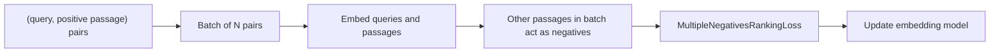
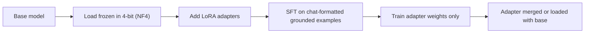
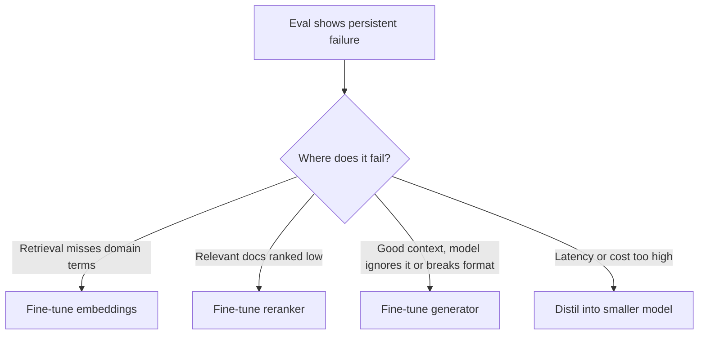

# 🔧 Fine-Tuning Guide for RAG Pipelines

> **Which RAG component to fine-tune, when it's worth it, and how.**

!!! tip "30-second answer"
    Fine-tune the **cheapest component that fixes the measured failure**. Retrieval misses on domain jargon → fine-tune the **embedding model** (contrastive pairs, hours on one GPU). Right documents but badly ordered → add, then fine-tune, a **reranker**. Retrieval is fine but the model ignores context, won't abstain or breaks your format → fine-tune the **generator** (LoRA/QLoRA, ideally RAFT-style with distractor documents). Don't fine-tune to *add knowledge*: that's what retrieval is for. Before any of it, try better parsing, hybrid search, an off-the-shelf reranker and prompt fixes; and have an eval set, or you can't tell whether fine-tuning helped.

---

## 1. OVERVIEW: WHAT CAN BE FINE-TUNED?

```
┌──────────────┐   ┌──────────────┐   ┌──────────────┐
│  Embedding   │   │   Reranker   │   │  Generator   │
│  model       │   │ (cross-enc.) │   │  (LLM)       │
├──────────────┤   ├──────────────┤   ├──────────────┤
│ Fixes: wrong │   │ Fixes: right │   │ Fixes: weak  │
│ docs in the  │   │ docs ranked  │   │ grounding,   │
│ top-k        │   │ too low      │   │ format, tone │
├──────────────┤   ├──────────────┤   ├──────────────┤
│ Cost: low    │   │ Cost: low    │   │ Cost: medium │
│ Data: pairs  │   │ Data: pairs  │   │ Data: (q,ctx,│
│ Re-index: YES│   │ Re-index: no │   │ answer)      │
└──────────────┘   └──────────────┘   └──────────────┘
```

**The hidden cost of embedding fine-tuning:** a new embedding model means **re-embedding the whole corpus**, and query and document vectors must come from the same model version. Rerankers and generators can be swapped without touching the index.

---

## 2. FINE-TUNING THE EMBEDDING MODEL

**Why?** General embeddings may not know that "SEV1" ≈ "critical incident", or that two of your product names are different things.

### Method: contrastive learning with in-batch negatives

The standard recipe is `(query, relevant passage)` pairs with **MultipleNegativesRankingLoss** (InfoNCE): every other passage in the batch acts as a negative, so you don't have to mine negatives by hand, and larger batches give more negatives. Adding a **hard negative** per pair (a similar-looking but wrong passage, e.g. mined with BM25 or the current model) helps most.

```python
from datasets import Dataset
from sentence_transformers import (
    SentenceTransformer, SentenceTransformerTrainer, SentenceTransformerTrainingArguments,
)
# sentence-transformers 6.x path; on 3.x–5.x use: from sentence_transformers.losses import ...
from sentence_transformers.sentence_transformer.losses import MultipleNegativesRankingLoss

model = SentenceTransformer("all-MiniLM-L6-v2")   # or your production embedding model

train = Dataset.from_dict({
    "anchor":   ["How do I reset my password?", "How do I get a refund?"],
    "positive": ["To reset your password, open Settings > Security...",
                 "Refunds are issued within 14 days of..."],
    # optional third column "negative" with hard negatives
})

args = SentenceTransformerTrainingArguments(
    output_dir="./fine-tuned-embedding",
    num_train_epochs=1,
    per_device_train_batch_size=64,   # bigger batch = more in-batch negatives
    learning_rate=2e-5,
)
trainer = SentenceTransformerTrainer(
    model=model, args=args, train_dataset=train,
    loss=MultipleNegativesRankingLoss(model),
)
trainer.train()
```

(The older `model.fit(...)` API with `InputExample` and `TripletLoss` still exists, but the Trainer API is the current one and in-batch-negative losses usually beat plain triplet loss for retrieval.)

**Where the training pairs come from:** click/feedback logs, support tickets matched to the article that solved them, or **synthetic queries**: have an LLM write questions for each chunk, then filter the low-quality ones. Hold out a test split of *real* queries.

**Useful variations:** `MatryoshkaLoss` (train so that truncated vectors still work, which shrinks the index), `CachedMultipleNegativesRankingLoss` (large effective batch on small GPUs).

### When to fine-tune embeddings

| Scenario | Off-the-shelf | Fine-tuned |
|----------|---------------|------------|
| General knowledge Q&A | Usually enough | Small gain |
| Heavy jargon (medical, legal, internal acronyms) | Misses synonyms | Often a clear gain |
| Code / logs / IDs | Weak on exact tokens | Better, but **hybrid BM25** often fixes it cheaper |
| Company-internal names | Unknown terms | Learns them from pairs |

Gains vary by domain and data quality, so measure Recall@k and nDCG on a held-out set before and after.

*Figure: contrastive training with in-batch negatives.*



---

## 3. FINE-TUNING THE RETRIEVER (RERANKER)

**Why?** First-stage retrieval (bi-encoder) embeds query and document **separately**, which is fast but coarse. A **cross-encoder** reads `(query, document)` **together** and scores relevance with full attention, so it is much more precise but costs one forward pass per candidate. Hence the two-stage pattern: retrieve 50–100 candidates cheaply, rerank them, keep the top 3–10.

```python
from sentence_transformers import CrossEncoder

reranker = CrossEncoder("cross-encoder/ms-marco-MiniLM-L6-v2")  # small English baseline

def rerank(query: str, documents: list[str], top_k: int = 3) -> list[str]:
    ranked = reranker.rank(query, documents, top_k=top_k)   # [{'corpus_id', 'score'}, ...]
    return [documents[r["corpus_id"]] for r in ranked]
```

**Production options (2026):** hosted rerank APIs (Cohere Rerank, Voyage rerank, Jina) or open-weight rerankers (BGE-reranker-v2-m3, Qwen3-Reranker, mxbai-rerank). LLM-as-reranker (listwise prompting) is the highest-quality and most expensive option.

**Fine-tuning:** same data as embeddings (query, positive, hard negatives), trained with `CrossEncoderTrainer` and a binary or listwise loss. Cheap, and no re-indexing.

**Impact:** a reranker improves **precision at the top** (MRR/nDCG@5) and can raise recall@5 *only* if the relevant doc was in the candidate set. It can't recover what first-stage retrieval missed. Cost: +tens to hundreds of ms per query, depending on candidates, model size and hardware.

---

## 4. FINE-TUNING THE LLM (GENERATOR)

**Why?** Small models often ignore context, answer from memory, fail to abstain, or ignore output format.

### Parameter-efficient fine-tuning (LoRA / QLoRA)

**LoRA** freezes the base weights and trains small low-rank adapter matrices; **QLoRA** additionally loads the frozen base in 4-bit (NF4), so a few-billion-parameter model fits on one consumer GPU.

```python
import torch
from transformers import AutoModelForCausalLM, AutoTokenizer, BitsAndBytesConfig
from peft import LoraConfig, get_peft_model, prepare_model_for_kbit_training

MODEL_ID = "google/gemma-3-1b-it"   # any small text-only instruct model; check its licence

bnb_config = BitsAndBytesConfig(       # 4-bit quantised base (needs a CUDA GPU)
    load_in_4bit=True,
    bnb_4bit_quant_type="nf4",
    bnb_4bit_use_double_quant=True,
    bnb_4bit_compute_dtype=torch.bfloat16,
)
tokenizer = AutoTokenizer.from_pretrained(MODEL_ID)
model = AutoModelForCausalLM.from_pretrained(
    MODEL_ID, quantization_config=bnb_config, device_map="auto"
)
model = prepare_model_for_kbit_training(model)

lora_config = LoraConfig(
    r=16,
    lora_alpha=32,
    target_modules="all-linear",   # current common practice; ["q_proj","v_proj"] is the
                                   # original-LoRA minimum and usually underfits
    lora_dropout=0.05,
    bias="none",
    task_type="CAUSAL_LM",
)
model = get_peft_model(model, lora_config)
model.print_trainable_parameters()   # typically well under 1–2% of weights
# Train with TRL's SFTTrainer on chat-formatted examples (below).
```

### Dataset format: train for grounding, not facts

Use the model's **chat template**, with the retrieved context in the prompt and the grounded answer as the target:

```json
{"messages": [
  {"role": "system", "content": "Answer using ONLY the context. Cite [Source N]. If the answer is not in the context, say you don't know."},
  {"role": "user", "content": "<context>[Source 1] RAG stands for Retrieval-Augmented Generation...\n[Source 2] (unrelated distractor)</context>\nQuestion: What does RAG stand for?"},
  {"role": "assistant", "content": "RAG stands for Retrieval-Augmented Generation [Source 1]."}
]}
```

**RAFT (Retrieval-Augmented Fine-Tuning, Zhang et al., 2024):** train with the relevant document **plus distractors**, and for a fraction of examples **only distractors**, with answers that quote the evidence. This teaches the model to pick the right chunk and to abstain, which is exactly the RAG failure mode. Include "not in context → I don't know" examples, or the model learns to always answer.

*Figure: QLoRA keeps the quantised base frozen and trains small adapters.*



---

## 5. WHEN TO FINE-TUNE VS. WHEN TO USE RAG

| Approach | Best For | Cost | Fresh knowledge? |
|----------|----------|------|------------------|
| **RAG only** | Changing or private knowledge, citations, access control | Low to start; ongoing index ops | Yes, re-index |
| **Fine-tune only** | Behaviour: style, format, task skills, domain language | Training + eval + re-training on change | No: frozen at training time |
| **RAG + fine-tune** | Knowledge from retrieval, behaviour from tuning | Highest | Yes |

**Fine-tuning teaches behaviour, retrieval supplies knowledge.** Facts learned by fine-tuning are hard to update, impossible to cite, and can increase confident hallucination on near-miss questions.

**Recommendation:** start with RAG. Fine-tune only after an eval shows a specific, persistent failure:

- Retrieval misses on domain terms after trying hybrid search → **embeddings**
- Relevant docs present but ranked low → **reranker**
- Good context, but the model ignores it, won't abstain, or breaks the output schema after prompt work → **generator** (and check if structured outputs / a bigger model fixes it first)
- Latency or cost: **distil** a large model's behaviour into a smaller fine-tuned one

*Figure: start with RAG and tune only the component that eval shows is failing.*



---

## 6. EVALUATING FINE-TUNING

Measure the component you changed, on a **held-out** set the training data never saw (watch for leakage when synthetic queries are generated from the same chunks):

| Component tuned | Measure before and after | Also check for regressions |
|---|---|---|
| Embeddings | Recall@k, nDCG@10 on real queries | Out-of-domain queries; re-index done? |
| Reranker | MRR, nDCG@5; latency p95 | Queries where the old order was right |
| Generator | Faithfulness, answer correctness, abstain rate on unanswerable questions, format validity | General instruction-following, safety behaviour |

Then run the **end-to-end** eval: a better component can still make the whole pipeline worse (for example, a generator that now abstains too often).
