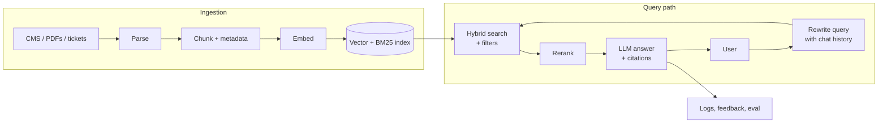

# 🎯 RAG — Interview Questions & Answers

> **Senior / Staff level.** Each question has a 30-second answer first, then the mechanism, trade-offs, failure modes, and what the interviewer is likely to ask next. Numbers are illustrative unless a source is given; quote your own measurements in a real interview.

**Contents:** [1 Architecture](#question-1-rag-architecture-design) · [2 Chunking](#question-2-chunking-strategy) · [3 Debugging quality](#question-3-improving-retrieval-quality) · [4 Scaling](#question-4-production-scaling) · [5 Hallucination](#question-5-handling-hallucination) · [6 RAG vs fine-tuning](#question-6-rag-vs-fine-tuning) · [7 Multimodal](#question-7-multi-modal-rag) · [8 Evaluation](#question-8-evaluation-metrics) · [9 Hybrid search](#question-9-hybrid-search-and-reranking) · [10 Context-aware chunk embeddings](#question-10-contextual-retrieval-late-chunking-and-colbert) · [11 Embedding choice](#question-11-choosing-an-embedding-model) · [12 GraphRAG and agentic RAG](#question-12-graphrag-and-agentic-rag) · [13 Long context vs RAG](#question-13-long-context-vs-rag) · [14 Security and multi-tenancy](#question-14-security-access-control-and-multi-tenancy)

---

## Question 1: RAG Architecture Design

**Interviewer:** *"Design a RAG system for a customer support chatbot over 10K product documents."*

!!! tip "30-second answer"
    Two pipelines. **Ingestion** (async): parse → structure-aware chunks with metadata (product, version, ACL, updated_at) → embed → upsert into a vector index **and** a BM25 index, keyed by deterministic chunk IDs so re-indexing is idempotent. **Query**: (optionally rewrite the query) → hybrid search for ~50 candidates with metadata filters → rerank to top ~5 → prompt with numbered sources and an abstain rule → stream the answer with citations → log everything for evaluation. 10K docs is small (~100K–500K chunks): one vector DB node, or pgvector, is enough. The hard parts are parsing, freshness, evaluation and access control, not scale.

### 🎯 Expected Answer



**Key decisions and why:**

| Decision | Choice | Why / trade-off |
|---|---|---|
| Chunking | Split by headings, ~200–500 tokens, keep the heading path in the chunk | Support docs are structured; the heading gives the chunk context |
| Embeddings | A current open model (BGE-M3, Qwen3-Embedding...) or an API (OpenAI, Cohere, Voyage, Gemini) chosen by eval on real tickets | Self-hosting = data control + fixed cost; API = less ops |
| Retrieval | Hybrid (BM25 + dense, RRF) → cross-encoder rerank | Support queries mix error codes/SKUs (keyword) with paraphrase (semantic) |
| Store | pgvector if you already run Postgres; else Qdrant/Weaviate/managed | 10K docs doesn't need a distributed DB |
| LLM | Hosted frontier model, or a self-hosted open model if data can't leave | Quality vs cost vs privacy |
| Conversation | Rewrite follow-ups ("what about the pro plan?") into standalone queries | Otherwise retrieval sees a meaningless fragment |

**Failure modes:** outdated doc versions retrieved (filter on version/updated_at, delete superseded chunks); answers for the wrong product (metadata filter from user context); the bot answers when it should hand off (abstain + escalation path).

**🔴 Follow-up:** *"How do you handle documents with tables and images?"*

**✅ Answer:** Parse tables into Markdown/HTML so row and column structure survives; keep a whole table in one chunk with its caption and heading, and optionally add an LLM-written summary for retrieval. For images, generate captions/descriptions with a vision model and index the text, or use multimodal embeddings (see Q7). For scanned PDFs, OCR or a vision model. Test parsing quality on your nastiest documents first.

**What they probe next:** how you keep the index fresh (CDC/webhooks → re-index changed docs only), how you evaluate before launch (Q8), how you stop the bot leaking another customer's data (Q14).

---

## Question 2: Chunking Strategy

**Interviewer:** *"Your RAG keeps retrieving incomplete answers. How do you fix chunking?"*

!!! tip "30-second answer"
    First confirm it's chunking: look at the retrieved chunks for failing queries. If the answer is **split across chunks**, or a chunk is **meaningless without its document** ("it increased 3%"), fix the chunk boundaries and context: structure-aware splitting, modest overlap, prepend the title/heading path, or retrieve small chunks but return the **parent** section. If chunks are huge and mixed-topic, their embeddings get diluted: go smaller. Tune size on an eval set; there is no universal right number.

### 🎯 Answer

**Diagnosis by symptom:**

| Symptom (from inspecting retrieved chunks) | Likely cause | Fix |
|---|---|---|
| Relevant chunk found, but the answer continues in the next chunk | Chunks too small / boundary cuts | Larger chunks, split on structure, or parent-document retrieval |
| Relevant section never retrieved; chunks cover many topics | Chunks too large → diluted embedding | Smaller chunks, semantic or heading-based splitting |
| Chunk retrieved but ambiguous ("the policy", "it") | Chunk lost document context | Prepend title/heading path; contextual retrieval or late chunking (Q10) |
| Tables or code broken mid-way | Splitter ignores structure | Structure-aware splitting; never split inside a table or code block |

**Parent Document Retriever (small-to-big):**
```python
from langchain_text_splitters import RecursiveCharacterTextSplitter

child_splitter = RecursiveCharacterTextSplitter(chunk_size=400, chunk_overlap=40)    # chars
parent_splitter = RecursiveCharacterTextSplitter(chunk_size=4000, chunk_overlap=0)

# Index: embed child chunks, store child -> parent_id in metadata
# Query: search children (precise match) -> dedupe parent_ids -> send parents to the LLM
```

**Trade-offs:** bigger chunks mean fewer fit in the prompt and more irrelevant tokens (cost, distraction); overlap increases index size and returns near-duplicates (dedupe or use MMR); semantic chunking costs embeddings at ingest time and is not reliably better than good structural splitting.

**What they probe next:** "How would you choose chunk size?" Grid-search size and overlap against Recall@k and answer quality on a golden set. "Characters or tokens?" Tokens, measured with the embedding model's tokenizer, and stay under its max input length (silently truncated otherwise).

---

## Question 3: Improving Retrieval Quality

**Interviewer:** *"Users complain the chatbot gives wrong answers. How do you debug?"*

!!! tip "30-second answer"
    Collect failing examples, then **localise the failure** for each: (1) is the answer in the corpus at all? (2) did retrieval return it in the top k? (3) did it survive into the prompt? (4) did the model use it faithfully? Each stage has a different fix. Most production failures are retrieval and data problems (missing docs, bad parsing, stale versions, keyword misses), not the LLM. Turn the failures into a regression eval set so fixes stay fixed.

### 🎯 Answer

**Debugging pipeline:**
```
Failing question
  │
  ├─ 0. Is the answer in the corpus (current version)?      no → content / ingestion gap
  ├─ 1. Is a relevant chunk in the top-k?                   no → retrieval: hybrid search, query
  │                                                              rewriting, better/fine-tuned
  │                                                              embeddings, chunking fixes
  ├─ 2. Is it in the top-n that reaches the prompt?         no → reranker, larger candidate set
  ├─ 3. Is the answer supported by the provided context?    no → faithfulness: prompt rules,
  │                                                              citations, stronger model
  └─ 4. Supported but still judged wrong?                        → conflicting/stale docs, or
                                                                    the reference answer is wrong
```

**Evaluation framework (per question, logged for every trace):**
```python
def evaluate_rag(question, reference_answer, relevant_ids, retrieved, answer, judge):
    retrieved_ids = [c.id for c in retrieved]
    return {
        # Retrieval: needs labelled relevant chunk ids
        "hit@k": any(i in relevant_ids for i in retrieved_ids),
        "mrr": next((1 / r for r, i in enumerate(retrieved_ids, 1) if i in relevant_ids), 0.0),
        # Generation: LLM-as-judge, validated against human labels
        "faithfulness": judge.claims_supported_fraction(answer, retrieved),
        "answer_relevancy": judge.addresses_question(question, answer),
        "correctness": judge.matches_reference(answer, reference_answer),
    }
```

Note: comparing the answer to a reference with embedding cosine similarity measures *similarity*, not correctness: a fluent wrong answer can score high. Use an LLM judge or claim-level comparison.

**What they probe next:** how you get labelled data (production logs + LLM-generated questions + SME review); how you know the LLM judge is right (agreement with human labels on a sample); how you prevent regressions (eval in CI on every prompt/model/index change).

---

## Question 4: Production Scaling

**Interviewer:** *"How do you scale RAG to 10M documents with < 1s response time?"*

!!! tip "30-second answer"
    Retrieval scales fine: 10M docs is maybe 100M chunks, served by a sharded, replicated ANN index (HNSW or IVF with quantisation) with p99 in tens of ms. **The LLM is the latency problem**: a full answer takes seconds, so "< 1s" has to mean **time to first token** with streaming, or very short answers from a small/fast model. Budget: query embedding ~10–30 ms, hybrid search ~20–50 ms, rerank ~50–150 ms, then LLM TTFT. Cut tail latency with caching, fewer prompt tokens, prompt caching of the static prefix, and autoscaled GPU inference with continuous batching.

### 🎯 Answer

**Architecture:**
```
User ─▶ API GW ─▶ Orchestrator
                    ├─▶ Cache (exact + semantic answer cache, per tenant)
                    ├─▶ Embedding service (GPU, batched)
                    ├─▶ Vector DB  ── shards: partition by tenant/hash
                    │              ── replicas: read throughput + HA
                    ├─▶ BM25 index (OpenSearch/Elasticsearch)
                    ├─▶ Reranker (GPU)
                    └─▶ LLM serving (vLLM/SGLang/TGI or a hosted API), streaming
```

**Sizing the index:** 100M chunks × 1024 dims × 4 bytes (float32) ≈ 410 GB of raw vectors, before HNSW graph overhead. Options: fewer dims (Matryoshka truncation), int8 (4× smaller) or binary quantisation (32× smaller) with rescoring of the top candidates at full precision, disk-based indexes (DiskANN-style), and sharding.

**Latency budget (target: first token < 1s):**

| Stage | Typical | Levers |
|---|---|---|
| Query rewrite (optional LLM call) | 100–500 ms | Small model, skip for standalone queries |
| Query embedding | 10–30 ms | Small model, GPU, cache |
| Hybrid search | 20–50 ms | ANN params (`ef_search`), filters on indexed fields |
| Rerank 50 candidates | 50–150 ms | Smaller reranker, fewer candidates |
| LLM time to first token | 200–800 ms | Shorter prompt, prompt caching, GPU headroom |
| LLM full answer | 1–10 s | Streaming hides it; shorter answers |

**Caching:**
- **Exact answer cache** keyed on normalised query + filters + index version + model/prompt version, so an index update or prompt change invalidates it.
- **Semantic cache** (embedding similarity ≥ a tuned threshold): high hit rate on FAQs, but risky: "cancel my order" vs "don't cancel my order" can be close. Use it only for non-personalised answers, and tune the threshold on real pairs.
- **Prompt (prefix) caching** at the LLM provider for the static system prompt.
- **Never** share cached answers across tenants or permission scopes.

**What they probe next:** ingestion throughput (batch embedding, backpressure, queue-based workers); re-embedding 100M chunks after a model change (blue-green index: build the new index alongside, dual-read to compare, then switch); HNSW vs IVF memory/recall trade-off; how filtering interacts with ANN (pre-filter vs post-filter: post-filtering can return fewer than k results).

---

## Question 5: Handling Hallucination

**Interviewer:** *"How do you ensure the LLM doesn't make up information?"*

!!! tip "30-second answer"
    You can't *ensure* it; you reduce and detect it. Reduce: good retrieval (most "hallucinations" are missing context), an explicit "answer only from context, otherwise say you don't know" rule, numbered sources with required citations, low temperature. Detect: a post-generation **groundedness check** (an NLI model or LLM judge verifies each claim against the cited chunks) and citation validation. Act: abstain or regenerate on failure, and route high-stakes answers to a human. Measure faithfulness and the abstain rate continuously.

### 🎯 Answer

**Multi-layer approach:**

1. **Retrieval quality first:** if the right chunk isn't there, no prompt fixes it.
2. **Prompt:** "Answer only from the context; if it isn't there, say you don't know. Cite [Source N] after each claim."
3. **Decoding:** temperature 0–0.3 reduces randomness (it does *not* make the model truthful).
4. **Verify after generation:**
```python
def verify_faithfulness(answer: str, context: str, judge) -> bool:
    prompt = f"""Split the ANSWER into factual claims. For each claim, decide whether
the CONTEXT supports it. Reply with JSON: {{"unsupported_claims": [...]}}

CONTEXT:
{context}

ANSWER:
{answer}"""
    result = judge.generate_json(prompt)       # structured output, not substring matching
    return len(result["unsupported_claims"]) == 0
```
   Checking `"UNSUPPORTED" not in text` is fragile ("NOT UNSUPPORTED", formatting drift); use structured output.
5. **Citations:** check that every cited source exists and was actually retrieved; show them in the UI so users can verify.
6. **Fallback:** if verification fails, regenerate once with stricter instructions or return "I don't have enough information" plus links to the closest documents.
7. **Human-in-the-loop** for high-stakes domains (medical, legal, financial).

**Trade-offs:** a verification pass adds a second LLM call (latency + cost); a strict judge raises the abstain rate. Tune on labelled data and track both faithfulness and helpfulness, since an assistant that always abstains is 100% faithful.

**What they probe next:** "What if the documents themselves are wrong or conflict?" Faithfulness ≠ correctness: add source quality/recency ranking and surface conflicts. "How do you measure hallucination in production?" Sample traces, run the judge offline, track the trend, spot-check with humans.

---

## Question 6: RAG vs Fine-Tuning

**Interviewer:** *"When would you use RAG vs. fine-tune a model?"*

!!! tip "30-second answer"
    **RAG for knowledge, fine-tuning for behaviour.** Use RAG when facts change, must be cited, or depend on who is asking. Fine-tune when you need a consistent format, tone, a specialised skill, or a smaller/cheaper model that behaves like a bigger one. They combine well: fine-tune the generator to *use retrieved context* better (RAFT) or fine-tune embeddings for domain retrieval. Start with RAG plus prompting; fine-tune when evals show a persistent behaviour gap.

| Criteria | RAG | Fine-Tune |
|----------|-----|-----------|
| **Knowledge updates** | Re-index the changed docs (minutes) | Retrain + re-evaluate (days) |
| **Citations / audit** | Yes, answers point to sources | No |
| **Per-user access control** | Yes, filter at retrieval | No: whatever is in the weights is visible to everyone |
| **Behaviour, format, style** | Limited to prompting | Strong |
| **Data needed** | Documents | Hundreds to thousands of high-quality examples (task-dependent) |
| **Latency** | + retrieval (+ rerank) and longer prompts | Base-model latency, shorter prompts |
| **Cost profile** | Index + retrieval infra; more input tokens per call | Training + eval + hosting a custom model |
| **Failure mode** | Retrieval misses → wrong/no answer | Confident hallucination of outdated or blended facts |

**What they probe next:** "Can fine-tuning add knowledge?" Somewhat, but unreliably, and it can increase hallucination on unfamiliar facts. "What about long-context models?" See Q13.

---

## Question 7: Multi-Modal RAG

**Interviewer:** *"How would you extend RAG to handle images and visually rich documents?"*

!!! tip "30-second answer"
    Three options. (1) **Convert to text**: OCR plus vision-model captions/descriptions, indexed with the text pipeline. Simplest, works with any LLM, but loses visual detail. (2) **Multimodal embeddings** (CLIP-style or current multimodal embedding models) put images and text in one vector space, so text queries retrieve images. (3) **Page-image retrieval** (ColPali-style late interaction over page screenshots) skips fragile PDF parsing for charts and slides. Then send the retrieved images to a vision-capable LLM. Choose by document type and whether answers need the pixels.

**✅ Answer:**
```python
class MultiModalRAG:
    def index_image(self, image_path, page_meta):
        # Option 1: text surrogate (simple, works with any LLM)
        caption = vision_llm.describe(image_path)            # description + any visible text
        text_index.add(text=f"[IMAGE] {caption}", meta={**page_meta, "image": image_path})

        # Option 2: multimodal embedding (text query <-> image in one space)
        image_index.add(vector=mm_embedder.embed_image(image_path),
                        meta={**page_meta, "image": image_path})

    def retrieve(self, query, k=5):
        text_hits = text_index.search(text_embedder.embed(query), k)
        image_hits = image_index.search(mm_embedder.embed_text(query), k)
        return rrf_fuse(text_hits, image_hits)               # scores aren't comparable: fuse ranks
```

**Trade-offs:** captions are cheap to search but lossy; multimodal and page-image indexes are larger (ColPali stores many vectors per page) and need a vision LLM at answer time (more tokens, higher cost).

**What they probe next:** charts and tables (keep the underlying data if you have it); evaluating image retrieval; cost of vision tokens.

---

## Question 8: Evaluation & Metrics

**Interviewer:** *"How do you measure RAG quality, before launch and in production?"*

!!! tip "30-second answer"
    Separate **retrieval** and **generation**. Offline: a golden set of real questions with relevant chunk IDs and reference answers. Retrieval → Recall@k, MRR, nDCG. Generation → faithfulness, answer relevancy and correctness (RAGAS-style LLM-judged metrics, with the judge checked against human labels). Online: thumbs up/down, abstain and escalation rate, citation click-through, latency p50/p95, cost per query, plus sampled traces judged offline. Run the offline suite in CI on every change to prompt, model, chunking or index.

### 🎯 Answer

**RAGAS-style metrics (what each actually computes):**

| Metric | Computed as | Needs reference? |
|---|---|---|
| **Faithfulness** | Split the answer into claims; fraction supported by the retrieved context | No |
| **Answer / response relevancy** | Generate questions from the answer; mean embedding similarity to the original question (penalises incomplete or off-topic answers) | No |
| **Context precision** | Are relevant chunks ranked near the top? (precision@k averaged over relevant positions) | Reference answer or labels |
| **Context recall** | Fraction of reference-answer claims attributable to the retrieved context | Yes |

**Production metrics:**
- **Retrieval:** Recall@k on a periodically labelled sample
- **Faithfulness:** LLM judge over sampled traces
- **User signal:** thumbs up/down, follow-up rephrasing (implicit failure), escalation to human
- **Abstain rate:** too high = retrieval gaps; too low = possibly hallucinating
- **Latency p95 / TTFT, cost per query**

**A/B testing:**
```python
# Offline first: same golden set, compare configs
control = RAGPipeline(chunk_size=500, top_k=5)
variant = RAGPipeline(chunk_size=800, top_k=10, reranker=True)
report = compare(control, variant, golden_set,
                 metrics=["recall@5", "faithfulness", "correctness", "latency_p95", "cost"])
# Then online: split traffic, compare thumbs-up rate and escalation rate,
# with enough traffic for statistical significance.
```

**Failure modes of evaluation:** a golden set that doesn't look like production queries; an LLM judge that favours long answers or its own model family; synthetic questions copied from the chunk (too easy for retrieval); not versioning the eval set.

**What they probe next:** how big the golden set is (start with 50–200 real queries, grow it from production failures); how you label relevance cheaply (LLM pre-labels, human review); how you catch drift (weekly eval on fresh sampled traffic).

---

## Question 9: Hybrid Search and Reranking

**Interviewer:** *"Why not just use vector search? How do you combine it with keyword search?"*

!!! tip "30-second answer"
    Dense vectors are good at paraphrase but weak on **exact tokens**: error codes, SKUs, names, rare acronyms, numbers. BM25 is the opposite. Run both and fuse with **Reciprocal Rank Fusion**: `score(d) = Σ 1/(k + rank_i(d))` with k ≈ 60. It uses only ranks, so you never normalise incomparable scores. Then a **cross-encoder reranker** rescores the top ~50 fused candidates, reading query and document together, and you keep the top 5. Hybrid + rerank is the standard production baseline.

**Mechanism:**
```python
def rrf(result_lists, k=60):
    """result_lists: ranked lists of doc ids (best first), e.g. [dense_ids, bm25_ids]."""
    scores = {}
    for results in result_lists:
        for rank, doc_id in enumerate(results, start=1):     # ranks start at 1
            scores[doc_id] = scores.get(doc_id, 0.0) + 1.0 / (k + rank)
    return sorted(scores, key=scores.get, reverse=True)
```

| Option | How | Trade-off |
|---|---|---|
| RRF | Rank-based fusion | Robust, no tuning; ignores score magnitudes |
| Weighted score fusion | α·dense + (1−α)·bm25 after min-max normalisation | Can be better when tuned; fragile across queries |
| Learned sparse (SPLADE, BGE-M3 sparse) | Model-weighted term vectors in an inverted index | Keyword precision + expansion; more indexing cost |
| Cross-encoder rerank | Score (query, doc) pairs jointly | Big precision gain; latency grows linearly with candidates |
| LLM rerank | Prompt an LLM to order candidates | Highest quality, highest cost and latency |

**Failure modes:** the reranker can't fix recall (if it's not among the candidates, it's gone); BM25 with the wrong analyser (stemming/tokenisation for code or non-English text); rerankers with a short max input silently truncating long chunks.

**What they probe next:** bi-encoder vs cross-encoder (independent encoding enables precomputed ANN; joint encoding is more accurate but can't be precomputed); how many candidates to rerank (tune: recall of the candidate set vs latency); where ColBERT sits (Q10).

---

## Question 10: Contextual Retrieval, Late Chunking and ColBERT

**Interviewer:** *"Chunks lose their context when embedded alone. What can you do?"*

!!! tip "30-second answer"
    Three techniques, at different points in the pipeline. **Contextual retrieval** (Anthropic, Sept 2024): before indexing, an LLM writes a 50–100-token blurb situating each chunk in its document and prepends it, for both the embedding and the BM25 index. Anthropic reported top-20 retrieval failures down 35% with contextual embeddings, 49% adding contextual BM25, and 67% adding reranking, on their benchmarks. **Late chunking** (Jina, 2024): run a long-context embedding model over the **whole document**, then mean-pool token embeddings per chunk span, so each chunk vector "saw" the full document; no LLM calls. **ColBERT / late interaction**: keep one vector **per token** and score with MaxSim, which gives finer matching at a large storage cost.

| Technique | Where | Cost | Trade-off |
|---|---|---|---|
| Contextual retrieval | Ingestion: LLM call per chunk | LLM tokens ≈ document length × chunks (prompt caching cuts this a lot) | Best-documented gains; re-run whenever a document changes |
| Late chunking | Ingestion: one long-context embedding pass per doc | Embedding compute only | Needs a long-context embedding model that exposes token embeddings; docs longer than the model's window must be split |
| ColBERT (late interaction) | Index + query scoring | Many vectors per chunk (compression in ColBERTv2/PLAID helps) | Strong, out-of-domain-robust retrieval; heavier infra; also used as a reranker |
| Simple baseline | Prepend title + heading path to each chunk | Free | Gets a surprising share of the benefit |

**ColBERT mechanism:** score(q, d) = Σ over query tokens of the max similarity to any document token ("MaxSim"). Documents are encoded offline (unlike cross-encoders), but token-level matching keeps much of a cross-encoder's precision. ColPali applies the same idea to page images.

**What they probe next:** cost of contextualising a 10M-chunk corpus and how prompt caching changes it; whether it still helps with a strong reranker (usually yes, but measure); how to roll it out (new index version, A/B on Recall@k).

---

## Question 11: Choosing an Embedding Model

**Interviewer:** *"Which embedding model would you use, and how would you decide?"*

!!! tip "30-second answer"
    Shortlist by constraints (language coverage, max input length, hosting/data residency, cost, latency), using the **retrieval** columns of the MTEB leaderboard rather than the overall average. Then decide on **your** golden set: the leaderboard is a filter, not an answer. As of 2026, strong options include open models (Qwen3-Embedding, BGE-M3, GTE, Nomic, Jina, EmbeddingGemma) and APIs (OpenAI text-embedding-3, Cohere Embed v4, Voyage, Gemini Embedding). Consider **Matryoshka** models: you can truncate vectors (e.g. 3072 → 512) to cut storage and latency with a small, measurable quality loss.

**Things that bite in practice:**

- **Query/document asymmetry:** many models expect prefixes or instructions (E5: `"query: "` / `"passage: "`; BGE and Qwen3 use a query instruction). Forgetting them costs recall silently.
- **Max input length:** text beyond it is truncated without an error.
- **Normalisation and metric:** use what the model was trained with (usually cosine on unit vectors).
- **Changing models = re-embedding everything.** Plan a blue-green index, and version your vectors with the model name.
- **Dimensions vs cost:** memory ≈ N × dims × bytes; int8/binary quantisation plus rescoring cuts it 4–32×.

**Matryoshka Representation Learning (Kusupati et al., 2022):** training puts the most important information in the leading dimensions, so a prefix of the vector is itself a usable embedding. OpenAI's text-embedding-3 exposes it via a `dimensions` parameter; many open models support it too. Use short vectors for a fast first pass and full vectors to rescore.

**What they probe next:** fine-tuning embeddings (see [Fine-Tuning Guide](03_FINE_TUNING.md)); multilingual corpora; cost of API embeddings at re-index time.

---

## Question 12: GraphRAG and Agentic RAG

**Interviewer:** *"When is plain top-k retrieval not enough?"*

!!! tip "30-second answer"
    Top-k retrieval answers **local** questions whose answer sits in a few chunks. It fails on **global** questions ("what are the main themes across all incident reports?") and **multi-hop** questions ("which team owns the service that caused last week's outage?"). **GraphRAG** (Microsoft, 2024) has an LLM extract entities and relationships into a knowledge graph, clusters it into communities and pre-summarises them, so global questions are answered from the summaries. Indexing is expensive. **Agentic RAG** lets the LLM decide *whether*, *what* and *how many times* to retrieve, using tools (search, SQL, APIs), and reflect on the results. It handles multi-hop questions at the cost of latency, cost and predictability.

| Approach | Good for | Costs / risks |
|---|---|---|
| Plain RAG | Local factual questions | Misses global and multi-hop questions |
| Query decomposition / multi-query | Multi-part questions | Extra LLM call; more retrieval |
| GraphRAG | Corpus-wide themes; relationship questions | LLM extraction over the whole corpus; graph quality; harder updates (cheaper variants like LazyGraphRAG and LightRAG exist) |
| Agentic RAG | Multi-hop, mixed sources (docs + DB + APIs) | Unbounded loops, latency, cost; harder to evaluate and debug |

**Guardrails for agentic RAG:** cap steps, tokens and wall-clock time; give tools least privilege and log every call; evaluate final answers and trajectories (tool choice, number of steps); fall back to single-shot RAG on timeout.

**What they probe next:** how you'd decide (route by query type: a classifier or a cheap LLM decides between direct answer, single retrieval and an agent loop); how you keep a knowledge graph fresh; how to evaluate multi-hop answers.

---

## Question 13: Long Context vs RAG

**Interviewer:** *"Models now take very long contexts. Is RAG still needed?"*

!!! tip "30-second answer"
    For a **small, stable corpus** (Anthropic suggests under ~200K tokens), put it all in the prompt with prompt caching: simpler and often more accurate. Beyond that, RAG still wins on **cost and latency** (you pay for every input token on every call), **scale** (corpora far exceed any window), **freshness**, **access control** (only send what this user may see) and **citations**. Long context also degrades: recall in the middle of very long prompts is weaker ("lost in the middle"). In practice they combine: retrieve generously, then use the long window for whole sections instead of tiny chunks.

**What they probe next:** cost arithmetic (tokens per call × calls per day); prompt caching economics; when you would switch from long-context to RAG as the corpus grows.

---

## Question 14: Security, Access Control and Multi-Tenancy

**Interviewer:** *"How do you stop the assistant from leaking documents a user shouldn't see?"*

!!! tip "30-second answer"
    Enforce permissions **in retrieval, not in the prompt**. Store ACL metadata (tenant, groups, document permissions) on every chunk, and apply it as a filter **inside** the vector/BM25 query from the authenticated identity, never from what the model or user says. Isolate tenants (a namespace or collection per tenant, or a mandatory tenant filter), keep caches per permission scope, and sync permission changes quickly (a revoked user must stop seeing the chunks). Treat retrieved text as untrusted input because of **indirect prompt injection**.

**Threats and mitigations:**

| Threat | Mitigation |
|---|---|
| Cross-tenant / unauthorised retrieval | Mandatory filter or per-tenant index; tests asserting no cross-tenant hits |
| Stale permissions | ACL sync on change events; short TTL on cached permission sets |
| Post-filtering returns too few results | Use filtered ANN (pre-filter) or over-fetch; check the store's filtered-search behaviour |
| Indirect prompt injection (malicious text in a retrieved doc) | Delimit context as data; no high-privilege tools in the same turn; confirm side-effecting actions with the user; output filtering |
| Data exfiltration via output (e.g. markdown image URLs) | Strip or allowlist links and images in rendered answers |
| Sensitive data in logs and eval sets | Redact PII; access-control the traces |
| Shared answer cache | Key caches by tenant + permission scope |

**What they probe next:** how embeddings themselves can leak content (embedding inversion attacks: treat vectors as sensitive data); right-to-be-forgotten deletes (delete by source ID across vector store, BM25 index, caches and backups); auditing (log which chunks were shown to whom).
