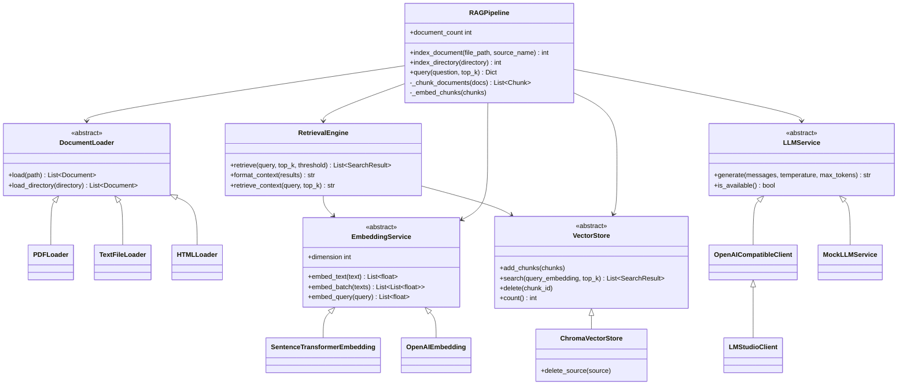
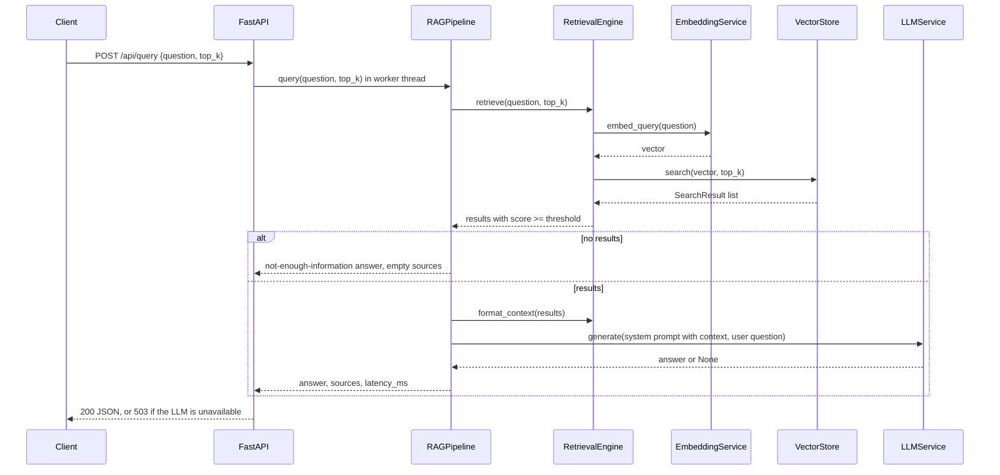
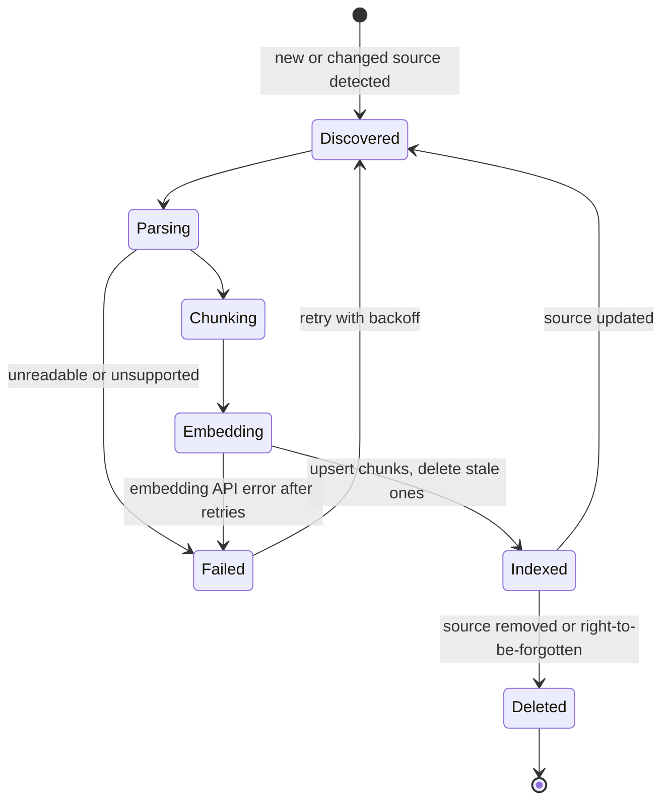

# 🧩 Low-Level Design — RAG Chatbot

> **Class diagram, data models, sequence diagram, API contract and storage schema for the code in [`implementation/`](implementation/index.md).** Items marked *(extension)* are the production version, not the repo.

---

## 1. CLASS DIAGRAM



`LLMService.generate` returns `None` on failure (the diagram shows the success type).

---

## 2. DATA MODELS

The repo uses small plain classes; the dataclass form below is equivalent and adds the fields a production system needs (marked).

```python
from dataclasses import dataclass, field
from datetime import datetime, timezone
from typing import Dict, List, Optional


@dataclass
class Document:
    """A loaded file (or PDF page) before chunking."""
    content: str
    source: str = ""
    metadata: Dict[str, object] = field(default_factory=dict)      # source, page, type, title
    loaded_at: datetime = field(default_factory=lambda: datetime.now(timezone.utc))


@dataclass
class Chunk:
    """A retrievable unit. chunk_id is deterministic: hash(source|page|chunk_index)."""
    text: str
    chunk_id: str
    metadata: Dict[str, object] = field(default_factory=dict)      # + chunk_index
    embedding: Optional[List[float]] = None
    # (extension) tenant_id, acl_groups, doc_version, embedding_model


@dataclass
class SearchResult:
    chunk: Chunk
    score: float              # cosine similarity = 1 - Chroma cosine distance


@dataclass
class QueryResult:
    answer: str
    sources: List[Dict]       # [{"text": first 200 chars, "score": ..., "source": ...}]
    latency_ms: float
    error: bool = False
```

Chroma metadata values must be `str`, `int`, `float` or `bool` (no `None`, no nested objects), which is why the store drops `None` values before upserting.

---

## 3. SEQUENCE DIAGRAM — Query Flow



---

## 4. API CONTRACT

### Index Documents
```http
POST /api/index
Content-Type: multipart/form-data

file: @document.pdf            # .pdf .txt .md .html .htm, else 415
---
200 OK
{
  "status": "success",
  "chunks_created": 42,
  "message": "Indexed 42 chunks from document.pdf"
}
```

Re-uploading the same filename replaces its chunks (deterministic IDs + delete-by-source), so indexing is idempotent.

### Index a server directory
```http
POST /api/index-directory
Content-Type: application/json

{"path": "sub/folder"}          # relative to DATA_DIRECTORY; escaping it → 400
```

### Query
```http
POST /api/query
Content-Type: application/json

{
  "question": "What is RAG?",      # 1–4000 chars
  "top_k": 5                       # 1–20, else 422
}
---
200 OK
{
  "answer": "RAG stands for Retrieval-Augmented Generation... [Source 1]",
  "sources": [
    {"text": "RAG combines retrieval...", "score": 0.62, "source": "data/01_rag_architecture_overview.md"}
  ],
  "latency_ms": 845.2
}
```
`503` when the LLM is unreachable. *(Extension)* a `filter` object (e.g. `{"product": "pro"}`) passed to Chroma's `where`, and an `answer_id` for feedback.

### Health
```http
GET /health  →  {"status": "healthy", "documents_indexed": 49, "llm_connected": true}
```
`documents_indexed` counts **chunks**; `llm_connected` probes `GET /v1/models`.

---

## 5. DATABASE SCHEMA (for persistent storage)

*(Extension)* the same model on Postgres + pgvector, which is a strong choice when you already run Postgres:

```sql
CREATE EXTENSION IF NOT EXISTS vector;

CREATE TABLE documents (
    id          TEXT PRIMARY KEY,           -- stable source key (path/URL/CMS id)
    tenant_id   TEXT NOT NULL,
    title       TEXT,
    version     INT  NOT NULL DEFAULT 1,
    acl_groups  TEXT[] NOT NULL DEFAULT '{}',
    metadata    JSONB,
    updated_at  TIMESTAMPTZ NOT NULL DEFAULT now()
);

CREATE TABLE chunks (
    id              TEXT PRIMARY KEY,       -- hash(document_id|page|chunk_index)
    document_id     TEXT NOT NULL REFERENCES documents(id) ON DELETE CASCADE,
    tenant_id       TEXT NOT NULL,          -- denormalised for filtered search
    chunk_index     INT  NOT NULL,
    text            TEXT NOT NULL,
    embedding       vector(384) NOT NULL,   -- must match the embedding model's dimension
    embedding_model TEXT NOT NULL,          -- know which vectors need re-embedding
    tsv             tsvector GENERATED ALWAYS AS (to_tsvector('english', text)) STORED
);

-- ANN index: HNSW (pgvector >= 0.5) is the usual default: better recall/latency than
-- IVFFlat and no training step. IVFFlat builds faster and uses less memory but must be
-- built after data is loaded (lists ≈ rows/1000) and queried with enough probes.
CREATE INDEX chunks_embedding_hnsw ON chunks USING hnsw (embedding vector_cosine_ops);
CREATE INDEX chunks_tsv_gin ON chunks USING gin (tsv);   -- keyword side of hybrid search
CREATE INDEX chunks_tenant ON chunks (tenant_id);

-- Query: <=> is cosine distance with vector_cosine_ops
SELECT id, text, 1 - (embedding <=> $1) AS score
FROM chunks
WHERE tenant_id = $2
ORDER BY embedding <=> $1
LIMIT 5;
```

**Filtering gotcha:** with a selective `WHERE`, an approximate index can return fewer than `LIMIT` rows, because it finds the nearest neighbours first and filters afterwards. pgvector 0.8 added iterative index scans (`SET hnsw.iterative_scan = relaxed_order`) to keep scanning; alternatives are partial indexes or partitions per large tenant.

---

## 6. CONFIGURATION

The real `config.py` (pydantic-settings v2). Every field can be set by an environment variable of the same name or in `.env`.

```python
from pydantic_settings import BaseSettings, SettingsConfigDict

class Settings(BaseSettings):
    model_config = SettingsConfigDict(env_file=".env", env_file_encoding="utf-8")

    # Embedding
    embedding_model: str = "all-MiniLM-L6-v2"
    embedding_dimension: int = 384
    embedding_device: str = "cpu"            # "cpu", "cuda" or "mps"

    # Chunking (characters, not tokens)
    chunk_size: int = 500
    chunk_overlap: int = 50

    # Retrieval
    top_k: int = 5
    similarity_threshold: float = 0.3        # cosine; calibrate per embedding model
    use_reranker: bool = False               # reserved

    # LLM
    llm_provider: str = "lm_studio"
    lm_studio_url: str = "http://localhost:1234"
    llm_model: str = "google/gemma-4-e4b"    # must match GET /v1/models
    temperature: float = 0.3
    max_tokens: int = 1024

    # Vector store
    vector_store: str = "chroma"
    persist_directory: str = "./data/vector_store"

    # API / paths
    host: str = "127.0.0.1"
    port: int = 8000
    data_directory: str = "./data"
```

**Why the threshold is 0.3, not 0.7:** similarity scores are model-specific. Small models like MiniLM give relevant pairs cosine scores of roughly 0.3–0.7, so a 0.7 floor drops most good results. Calibrate on labelled pairs, or skip the absolute threshold and rely on a reranker's score.

---

## 7. STATE MACHINE — RAG Pipeline Lifecycle

The pipeline object holds no per-request state; one instance serves all requests (the API runs blocking calls in worker threads). The state that matters in production is each **document's indexing lifecycle**:



Track this per document (in a table like `documents` above) so you can answer "is the index fresh?", retry failures, and re-embed by `embedding_model` when you change models.
