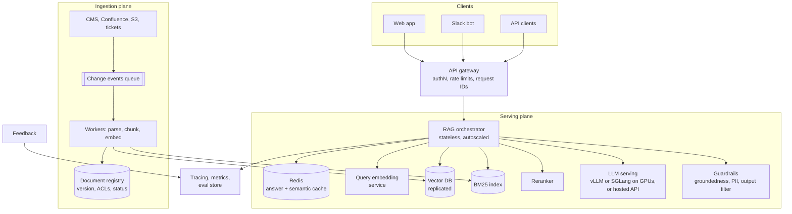

# 🏗️ High-Level Design — RAG Chatbot in Production

> **Target:** Senior/Staff system design | **Focus:** architecture, capacity estimates, latency, freshness, evaluation, security. Figures are back-of-envelope estimates for this scenario, not benchmarks.

!!! tip "30-second answer"
    Split it into an **ingestion plane** (connectors → parse → chunk → embed → upsert into vector + keyword indexes, event-driven and idempotent) and a **serving plane** (gateway → orchestrator → cache → hybrid retrieval with ACL filters → rerank → LLM with streaming → guardrails). At 1M queries/day (~12 QPS average, ~50 QPS peak) retrieval is cheap; **the LLM dominates latency and cost**, so design around time-to-first-token, prompt size and caching. The staff-level concerns are freshness, permission-aware retrieval, evaluation in CI, and graceful degradation when the LLM is slow or down.

---

## 1. SYSTEM OVERVIEW

**Purpose:** answer user questions from a knowledge base of 100K+ documents, with citations.

**Scale:** 1M queries/day, 100K documents (~1–2M chunks), p95 time-to-first-token < 2s, 99.9% availability.

**Users:** end customers, content managers (publish docs), ML/platform engineers (quality, ops).

**Use cases:** ask a question, get a grounded answer with sources, give feedback, publish/update/delete documents, evaluate quality.

**Constraints:** data stays in our VPC (self-hosted or a provider with VPC/private networking and no training on our data), per-user document permissions, cost target < $0.01/query.

### Back-of-envelope

| Quantity | Estimate |
|---|---|
| Average QPS | 1M / 86,400 ≈ **12 QPS**; plan for **~50 QPS** peak (4× peak factor) |
| Prompt size | system ~300 + 5 chunks × ~400 + history/question ~300 ≈ **2.5–3K input tokens** |
| Output size | ~200–400 tokens |
| Daily tokens | ~3B input, ~0.3B output |
| Vector memory | 1.5M chunks × 1024 dims × 4 B ≈ **6 GB** float32 (+ HNSW graph overhead); ~1.5 GB as int8 |
| Peak decode load | 50 QPS × ~300 output tokens ≈ **15K output tokens/s** across the fleet (plus prefill of 50 × 3K = 150K input tokens/s) |

Conclusion: the vector index fits on one node (replicate it for HA and throughput); LLM inference needs a GPU fleet or a hosted API.

---

## 2. HIGH-LEVEL ARCHITECTURE



---

## 3. COMPONENT BREAKDOWN & INTERVIEW Q&A

### 3.1 RAG Orchestrator (Python/FastAPI)

**Responsibilities:**
- Resolve identity → tenant + ACL groups (from the gateway's token, never from the prompt)
- Conversation handling: rewrite follow-ups into standalone queries
- Hybrid retrieval with ACL filters → RRF → rerank → top 5
- Prompt assembly with numbered sources; stream the response
- Post-checks (groundedness, citation validation, output filtering); log the full trace

Stateless: conversation state lives in Redis or a DB, so pods scale horizontally. Use async I/O and timeouts on every downstream call.

**🔴 Interview Question:** *"How would you design query caching in RAG?"*

**✅ Answer:** Multi-level cache:

1. **Exact match:** key = hash(normalised query + tenant/permission scope + filters + **index version** + model + prompt version). TTL of hours, plus explicit invalidation when the index version changes.
2. **Semantic cache:** a nearby previous query (similarity ≥ a threshold tuned on real query pairs) returns its answer. Only for non-personalised content, because negations and entity swaps ("cancel" vs "don't cancel", "plan A" vs "plan B") embed close together.
3. **Retrieval cache:** cache query → chunk IDs (cheaper to keep correct than answers).
4. **Prompt caching** at the LLM layer for the static system-prompt prefix.
5. **Invalidation:** bump the index version on publish (coarse but correct), or track doc → cached-answer dependencies (precise but complex).

Never let a cache entry cross a tenant or permission boundary.

---

### 3.2 Embedding Service (GPU Pod)

**Responsibilities:**
- Online: embed queries (low latency, small batches)
- Offline: embed changed chunks (high throughput, large batches)
- Pin the model version; every vector is tagged with the model that produced it

**Scale:** 1.5M chunks × 1024 dims × 4 bytes ≈ 6 GB of float32 vectors. Note the unit: documents ≠ chunks; a document typically yields 10–20 chunks.

**🔴 Interview Question:** *"How do you embed 100K documents efficiently, and keep them fresh?"*

**✅ Answer:**
1. **Batching on GPU:** embedding throughput comes from batching (typically 32–256 inputs, sorted by length to reduce padding). Measure throughput; don't assume a multiplier.
2. **Separate online and batch paths** so a re-index doesn't hurt query latency (separate deployments or priority queues).
3. **Incremental, event-driven indexing:** change events (webhooks/CDC) → queue → workers. Hash the content and skip unchanged chunks; delete chunks of removed or shortened docs.
4. **Idempotency:** deterministic chunk IDs + upsert, so retries and replays don't duplicate.
5. **Model change = full re-embed:** build a new index alongside the old one (blue-green), backfill, compare Recall@k on the golden set, then switch reads.
6. **Hosted embedding APIs:** respect rate limits with backoff, use batch endpoints where offered, budget the re-embed cost.

---

### 3.3 Vector Store (Pinecone/Weaviate)

**Responsibilities:**
- Store ~1–2M vectors with metadata (tenant, ACL groups, product, updated_at)
- Filtered ANN search, p99 in the tens of ms
- Replication for HA and read throughput; snapshots and backups

**🔴 Interview Question:** *"How do you choose between Pinecone, Weaviate, Qdrant, pgvector and Chroma for production?"*

| Option | Strengths | Watch out for |
|---|---|---|
| **pgvector** | One database for data, metadata and vectors; transactions and joins; familiar ops | Filtered ANN tuning; very large indexes need lots of RAM or partitioning |
| **Qdrant / Weaviate / Milvus** | Purpose-built: rich filtering, hybrid search, quantisation, sharding | Another stateful system to run (or pay for managed) |
| **Pinecone** | Fully managed and serverless; no ops | Vendor lock-in, data residency, cost at scale |
| **OpenSearch / Elasticsearch** | Strong BM25 + kNN in one engine, mature ops | Vector performance and memory vs dedicated engines |
| **Chroma** | Simplest developer experience; embedded mode | Fewer production features; fine for prototypes and small apps |

**How to decide:** filtering needs (ACLs on every query), hybrid search support, scale (vectors × dims), latency SLO, team ops capacity, data residency, and cost. **Benchmark with your data and filters**: vendor latency numbers are measured on unfiltered queries with their chosen recall setting.

---

### 3.4 LLM Inference

*(Renamed from "LM Studio Cluster". LM Studio is right for local development; a production fleet uses a serving engine built for concurrency.)*

**Responsibilities:**
- Serve the generator with streaming, at the p95 TTFT target under peak load
- Health checks, autoscaling, failover to a secondary model or provider
- Admission control: queue limits and load shedding instead of unbounded latency

**🔴 Interview Question:** *"How do you scale LLM inference for production?"*

**✅ Answer:**
1. **Use a serving engine:** vLLM, SGLang, TGI or TensorRT-LLM give **continuous batching** (new requests join the running batch), paged KV cache and prefix caching. Throughput per GPU is many times higher than one-request-at-a-time servers.
2. **Size from measurements:** benchmark tokens/s per GPU at your TTFT/p95 target with realistic prompt lengths; GPUs needed ≈ peak output tokens/s ÷ per-GPU throughput, plus headroom and N+1 for failures.
3. **Shrink the work:** fewer/shorter chunks (input tokens drive prefill and TTFT), shorter answers, prefix caching for the system prompt, quantisation (FP8/INT4) or a smaller model where evals allow.
4. **Route by difficulty:** a small model for simple questions, a larger one for hard ones (a classifier or confidence-based cascade).
5. **Autoscale on queue depth / KV-cache utilisation** (not CPU), with warm capacity because model load times are long.
6. **Fallback:** secondary provider/model on errors or timeouts; if everything fails, return the top sources without a generated answer.
7. **Hosted API alternative:** no GPU ops, but you get rate limits, provider latency variance and data-handling terms; private networking may be required.

---

## 4. DATA FLOW — Complete Request Lifecycle

```
1. Client → API gateway (auth, rate limit, request ID) → orchestrator
2. Load conversation; rewrite follow-up into a standalone query        ~100–300 ms (if needed)
3. Cache lookup (exact, then semantic) → HIT: return cached answer
4. Embed query                                                         ~10–30 ms
5. Parallel: vector search + BM25, both with tenant/ACL filters        ~20–50 ms
6. RRF fuse → rerank top ~50 → keep top 5                              ~50–150 ms
7. Assemble prompt (~2.5–3K tokens) → LLM, streaming                   TTFT ~300–800 ms
8. Stream tokens to the client                                         full answer 2–6 s
9. Post-check: citations valid, groundedness check (sync for high-stakes, else async)
10. Cache answer; log trace (query, chunk IDs, prompt version, answer, latencies)
```

Users perceive **TTFT** (~0.5–1.5 s end to end here), not total generation time, which is why streaming matters more than shaving the last token.

---

## 5. SCALABILITY ANALYSIS

**Bottlenecks:**
1. **LLM inference:** dominant latency and cost; scales with GPUs or provider quota.
2. **Reranker:** latency grows linearly with the number of candidates; GPU-bound.
3. **Ingestion bursts:** a bulk import or embedding-model change means millions of embedding calls.
4. **Filtered vector search:** highly selective ACL filters can hurt recall or latency on ANN indexes.

**Solutions:**
- LLM: continuous batching, prefix caching, smaller prompts, model routing, autoscaling on queue depth.
- Vector search: HNSW with tuned `ef_search`; quantisation; filter-aware indexes or per-tenant partitions for big tenants; replicas for read QPS.
- Ingestion: queue-based workers with backpressure; separate batch embedding capacity; blue-green index rebuilds.
- Orchestrator: stateless, horizontally scaled; timeouts and circuit breakers on each dependency.

---

## 6. MONITORING & OBSERVABILITY

| Metric | Alert Threshold (example) | Action |
|--------|----------------|--------|
| **TTFT p95** | > 2 s for 10 min | Scale LLM serving; check prompt sizes and queue depth |
| **LLM error/timeout rate** | > 2% | Fail over to the secondary model/provider |
| **Retrieval empty-result rate** | Sudden rise | Check the index, filters and embedding service |
| **Recall@k on the golden set** (nightly) | Drop vs baseline | Block the deploy or roll back the index/model change |
| **Faithfulness (sampled, LLM-judged)** | Drop vs baseline | Check the prompt/model change; inspect failing traces |
| **Thumbs-down / escalation rate** | Rise vs baseline | Triage traces; add to the eval set |
| **Index freshness lag** | > SLA (e.g. 15 min) | Check ingestion queue and workers |
| **Cost per query** | > budget | Prompt size, cache hit rate, model routing |

**Tracing:** one trace per request with spans for rewrite, embed, search, rerank, LLM and checks, recording chunk IDs, scores, prompt version, model and token counts. This is how you debug "why did it say that?" (OpenTelemetry or an LLM-observability tool).

---

## 7. COST BREAKDOWN (Monthly)

Prices change too fast to hard-code, so present a **cost model** and plug in current prices:

```
cost/query ≈ input_tokens × P_in + output_tokens × P_out           (LLM, dominant)
           + rerank cost + embedding cost (small) + infra share

Example with illustrative prices P_in = $1 / 1M tokens, P_out = $4 / 1M tokens:
  3,000 × $1/1M + 300 × $4/1M = $0.003 + $0.0012 ≈ $0.0042 per query
  × 1M queries/day × 30 ≈ $126K/month before caching
```

| Lever | Effect |
|---|---|
| Answer cache hit rate 30% | −30% LLM spend |
| Prompt/prefix caching of the static system prompt | Cuts cost and TTFT for the repeated prefix (provider-specific discounts) |
| 5 → 3 chunks, shorter chunks | Input tokens scale linearly |
| Route easy queries to a small model | Often the biggest saving |
| Self-host vs API | Self-hosting wins at sustained high utilisation; APIs win for spiky or low volume and save ops headcount |

Infrastructure (orchestrator pods, vector DB, Redis, observability) is usually small next to LLM spend at this volume; size it from the capacity estimates in §1.

---

## 8. SECURITY CONSIDERATIONS

- **Permission-aware retrieval:** ACL and tenant filters applied inside the search query, derived from the authenticated identity; permission changes synced quickly; tests that assert no cross-tenant results.
- **Indirect prompt injection:** retrieved documents are untrusted input. Delimit them as data, tell the model to ignore instructions inside them, give the model no high-privilege tools in the same turn, and filter output (e.g. strip external image/link URLs that could exfiltrate data). Input "sanitisation" of user queries alone does not solve this.
- **Data isolation:** VPC-only inference (self-hosted or private endpoints), encryption at rest and in transit; embeddings are sensitive too (inversion attacks can recover text).
- **Rate limiting and abuse:** per-user and per-tenant quotas; cap prompt and output tokens.
- **Audit and privacy:** log which chunks were shown to whom; redact PII in logs and eval sets; support deletion across the vector store, keyword index, caches and backups.
