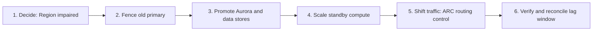
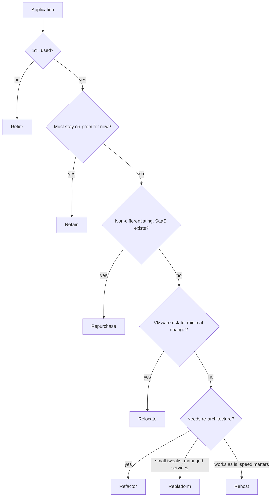
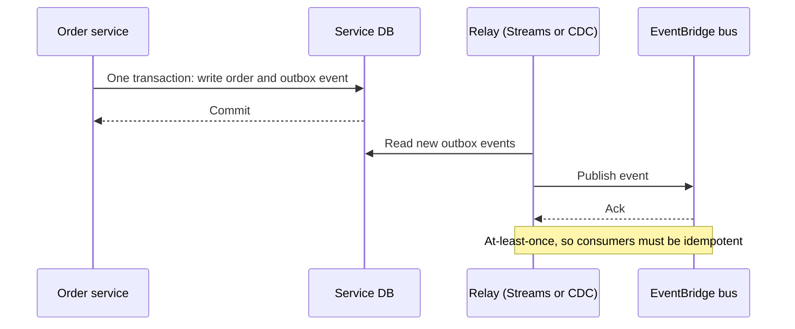
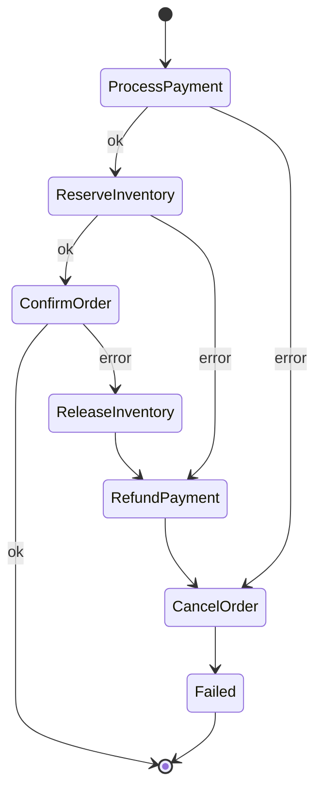
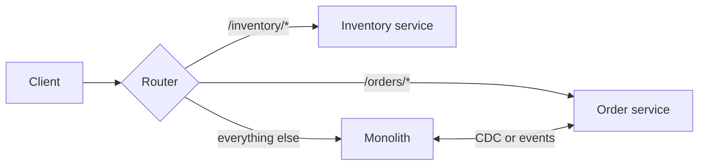
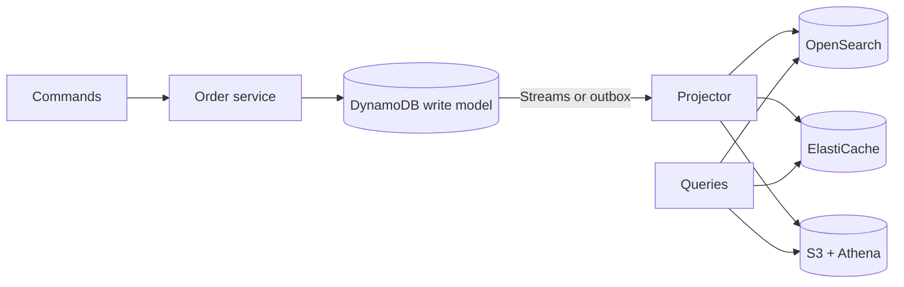

# ☁️ AWS Architecture — Staff-Level Interview Questions

> *8 questions covering the Well-Architected Framework, multi-Region DR, migration strategy, cost governance, microservices, serverless vs containers, cloud-native patterns and resilience engineering. Each answer leads with the 30-second version, then the mechanism, trade-offs, failure modes and what interviewers probe next. Service facts checked against AWS documentation, October 2026.*

---

## Table of Contents

1. [AWS Well-Architected Framework: The Six Pillars](#1-aws-well-architected-framework-the-six-pillars)
2. [Multi-Region Architecture & Disaster Recovery](#2-multi-region-architecture-disaster-recovery)
3. [Cloud Migration Strategies: The 6 Rs](#3-cloud-migration-strategies-the-6-rs)
4. [Cost Optimization Architecture at Scale](#4-cost-optimization-architecture-at-scale)
5. [Microservices Architecture Patterns on AWS](#5-microservices-architecture-patterns-on-aws)
6. [Serverless vs Containers: Architecture Decision](#6-serverless-vs-containers-architecture-decision)
7. [Cloud-Native Design Patterns: Strangler Fig, CQRS, Saga](#7-cloud-native-design-patterns-strangler-fig-cqrs-saga)
8. [Resilience Engineering & Chaos Engineering](#8-resilience-engineering-chaos-engineering)

---

## 1. AWS Well-Architected Framework: The Six Pillars

**Q:** "Your CTO wants a formal Well-Architected Framework review of a production system processing $10M/month in transactions. Walk through the six pillars, the key questions you'd ask in each, and how you'd prioritize remediation. How do you operationalize WA reviews across 50 microservices?"

**What They're Really Testing:** Whether you understand the Well-Architected Framework as an operational tool — not just theory — and can drive continuous improvement at scale across an organization.

### Answer

!!! tip "30-second answer"
    Six pillars: Operational Excellence, Security, Reliability, Performance Efficiency, Cost Optimization and Sustainability (added December 2021). A review is a structured conversation per **workload** (a set of components that deliver business value together, not each microservice) that produces **high- and medium-risk issues (HRIs/MRIs)**. For a payments system, prioritise by blast radius on money and data: security and reliability HRIs first, then operational gaps that slow recovery, then cost and efficiency. Operationalise with the Well-Architected Tool (custom lenses, review templates, milestones), automated evidence from Security Hub CSPM, Config and Trusted Advisor, and a recurring cadence tied to architecture changes, not a one-off audit.

**What to ask per pillar (a payments workload):**

| Pillar | Questions that find real risk | Evidence |
|---|---|---|
| Operational Excellence | How do you know it's healthy right now? How do you deploy and roll back? When did you last run the incident runbook? | SLO dashboards, deployment frequency, change failure rate, MTTR, post-incident reviews |
| Security | Who can move money or read card data, and how do you know? How are secrets and keys managed? How fast do you detect a leaked credential? | IAM Access Analyzer, CloudTrail, GuardDuty/Security Hub findings, KMS key policies |
| Reliability | What happens when an AZ, a dependency or the database fails? What are RTO/RPO and when were they last tested? Are retries idempotent? | Multi-AZ design, quotas headroom, DR test results, FIS experiments |
| Performance Efficiency | What limits throughput first? How do you load test? | Load test reports, p99 under peak, saturation metrics |
| Cost Optimization | What's the cost per transaction and how is it trending? What's idle? | Tagged cost allocation, unit costs, Savings Plans coverage |
| Sustainability | Are you using efficient instance types and scaling to demand? What data do you keep that you don't need? | Utilisation, Graviton share, storage lifecycle, Customer Carbon Footprint Tool |

Lenses add domain-specific questions (Serverless, SaaS, Financial Services, Container Build, Generative AI and others); use the Financial Services lens here.

**Prioritising remediation:**

- Rank HRIs by likelihood × impact, with impact expressed in business terms (lost transactions per minute, regulatory exposure).
- Typical top findings in payments systems: overly broad IAM (`*` on production data), untested DR, retries without idempotency keys (double charges), single-AZ dependencies hidden in "managed" components, no alarms on queue age or DLQs.
- Fix HRIs within a fixed window (e.g. one sprint), MRIs within a quarter, and record decisions to accept risk explicitly with an owner.

**Operationalising across 50 microservices:**

- Group services into a handful of workloads (payments core, ledger, notifications) and review those; service-level checks are automated rather than questionnaire-based.
- WA Tool: review templates pre-fill org-wide answers (shared platform controls), profiles set business priorities, **custom lenses** encode internal standards, milestones snapshot progress. The WA Tool API exports risks to your tracker.
- Continuous evidence: Security Hub CSPM controls, Config conformance packs and Trusted Advisor checks feed the review, so the questionnaire focuses on design and process.
- Cadence: on major architecture changes and at least annually per workload, with a light quarterly risk check. Track the HRI count and age, not a vanity score.

### 🔍 Staff-Level Evaluation

| Criterion | What I'm Looking For |
|-----------|----------------------|
| **Pillar depth** | Asks evidence-seeking questions per pillar, tied to the business |
| **Prioritization** | Ranks HRIs by business impact and tracks accepted risk explicitly |
| **Operationalization** | Reviews per workload with templates, lenses and recurring cadence |
| **Automation** | Uses WA Tool API and continuous evidence from Security Hub, Config, Trusted Advisor |

### 🎬 Animated Sequence Diagram

<p align="center">
  <video controls width="800" style="border-radius: 12px; box-shadow: 0 4px 24px rgba(0,0,0,0.3);" loop playsinline preload="metadata">
    <source src="../../../assets/videos/arch-well-architected.mp4" type="video/mp4" />
    Your browser does not support the video tag.
  </video>
  <br/>
  <em>🎬 Animated Well-Architected Framework Six Pillars — Operational Excellence, Security, Reliability, Performance Efficiency, Cost Optimization, and Sustainability — Click ▶ to play/pause. Created with <a href="https://remotion.dev">Remotion</a>.</em>
</p>

---

## 2. Multi-Region Architecture & Disaster Recovery

**Q:** "Design a multi-region architecture for a financial services platform with RPO of 1 second and RTO of 5 minutes. 99.999% availability required. Compare active-passive vs active-active strategies. How do you handle data replication across regions with strong consistency requirements?"

**What They're Really Testing:** Whether you understand the operational and architectural trade-offs of multi-region deployment — the hard realities of cross-region replication lag, DNS propagation, and failover complexity.

### Answer

!!! tip "30-second answer"
    99.999% is ~5 minutes of downtime a year, so failover must be pre-provisioned, rehearsed and mostly automated. RPO 1 s rules out backup/restore and pilot light; it means continuous replication with bounded lag (Aurora Global Database with an RPO limit, DynamoDB global tables) or synchronous multi-Region writes (DynamoDB **MRSC**, **Aurora DSQL**) where you need RPO 0. An RTO of 5 minutes fits **warm standby** with a scripted, operator-triggered Region switch (Route 53 ARC). Active-active is only worth it when you partition data by home Region or use a multi-Region strongly consistent store; otherwise you're trading failover time for conflict resolution bugs.

**DR strategies:**

| Strategy | RPO | RTO | Standby cost | Notes |
|---|---|---|---|---|
| Backup & restore | Hours (backup interval) | Hours | Lowest | AWS Backup cross-Region copies; IaC to rebuild |
| Pilot light | Minutes or less (data replicated) | Tens of minutes | Low | Data live, compute off; AWS Elastic Disaster Recovery for server workloads |
| Warm standby | Seconds | Minutes | Medium | Scaled-down full stack, scale up on failover |
| Active-active (multi-site) | Seconds to zero | Near zero for reads; seconds for writes | Highest | Requires data partitioning or multi-Region consistency |

**Warm standby for RPO 1 s / RTO 5 min:**

```
us-east-1 (primary)                         us-west-2 (standby)
Route 53 ARC routing control: ON            routing control: OFF
ALB → ECS (100 tasks)                       ALB → ECS (20 tasks, pre-scaled minimum)
Aurora Global DB writer ───storage repl───► Aurora secondary cluster (readers)
DynamoDB global table   ◄──── MREC ─────►   replica
ElastiCache Global Datastore ────────────►  replica (warm cache)
S3 (CRR + RTC)          ─────────────────►  bucket
SQS / in-flight work    (not replicated: rebuild from DB/outbox state)
```

**Failover runbook (ARC Region switch or Step Functions), in this order:**

1. **Decide** (T+0–1 min): a human (or a strict multi-signal rule) declares the Region impaired. Fully automatic failover on a single health check risks flapping and split brain.
2. **Fence** the old primary: stop writers (routing control off, app write-disable flag) so nothing commits there after promotion.
3. **Promote data** (T+1–2): Aurora Global Database *failover* (unplanned; RPO = lag at that moment) or *switchover* (planned; RPO 0). Use the global writer endpoint so apps don't need new connection strings.
4. **Scale** standby compute (pre-warmed minimums so you're not waiting on capacity).
5. **Shift traffic** (T+3–4): ARC routing control on in us-west-2; DNS TTLs of 60 s or less; or Global Accelerator traffic dials for near-instant shifts.
6. **Verify** with synthetic transactions; reconcile the replication-lag window (idempotency keys make replays safe).

*Region failover runbook order: decide, fence the old primary, promote data, scale, shift traffic, verify.*




**Making RPO 1 s real:** Aurora Global Database lag is *typically* under a second, not guaranteed. Aurora PostgreSQL's `rds.global_db_rpo` parameter makes the primary block commits when secondaries fall further behind than the limit, trading availability for a hard RPO. DynamoDB MREC typically replicates in under a second with last-writer-wins; for balances use MRSC (RPO 0, exactly three Regions, higher write latency, no transactions).

**Active-active options:**

| Approach | Consistency | Cost of the choice |
|---|---|---|
| Partition by home Region (user/tenant pinned to a Region) | Strong within the home Region | Re-homing users, cross-Region reads for shared data |
| DynamoDB MREC | Eventual, last writer wins per item | Conflicts silently overwrite; design commutative or idempotent writes |
| DynamoDB MRSC / Aurora DSQL | Strong across Regions | Higher write latency (cross-Region round trips), feature limits |
| CRDTs / custom merge | Convergent | Application complexity |

Reads stay local; route users to their nearest healthy Region with Route 53 latency records or Global Accelerator.

**Testing:** run Region evacuation game days quarterly (ARC Region switch plans, FIS cross-Region connectivity scenario), measure real RTO/RPO, and keep quotas (instance limits, concurrency, IPs) raised in the standby Region; failover fails most often on quotas and stale config.

### 🔍 Staff-Level Evaluation

| Criterion | What I'm Looking For |
|----------|----------------------|
| **DR strategies** | Can quantitatively compare backup/pilot/warm/active-active with RPO, RTO, cost |
| **Failover sequence** | Fences, promotes data, scales, then shifts traffic, with timing for each step |
| **Cross-region data** | Uses Aurora Global DB (with RPO limit), DynamoDB global tables (MREC vs MRSC), Global Datastore |
| **Active-active** | Understands conflict resolution (LWW, CRDTs, home-Region partitioning) and idempotent writes |

### 🎬 Animated Sequence Diagram

<p align="center">
  <video controls width="800" style="border-radius: 12px; box-shadow: 0 4px 24px rgba(0,0,0,0.3);" loop playsinline preload="metadata">
    <source src="../../../assets/videos/arch-multi-region-dr.mp4" type="video/mp4" />
    Your browser does not support the video tag.
  </video>
  <br/>
  <em>🎬 Animated Multi-Region Disaster Recovery — Aurora Global DB replication, Route53 failover, and RPO 1s/RTO 5min active-passive strategy — Click ▶ to play/pause. Created with <a href="https://remotion.dev">Remotion</a>.</em>
</p>

---

## 3. Cloud Migration Strategies: The 6 Rs

**Q:** "Your company has 200 on-premises servers running a mix of legacy .NET applications, Java microservices, and Oracle databases. The CFO wants 40% cost reduction in 18 months. Walk through the migration strategy: how do you assess, prioritize, and execute? What are the 6 Rs and when do you use each?"

**What They're Really Testing:** Whether you understand cloud migration as a business transformation — not just a technical lift-and-shift — and can navigate the trade-offs between speed, cost, and risk.

### Answer

!!! tip "30-second answer"
    AWS now uses **7 Rs**: Retire, Retain, Rehost, **Relocate** (added for VMware Cloud on AWS), Replatform, Repurchase, Refactor. Assess first (discovery data on utilisation and dependencies, plus a business case), then move in waves grouped by dependency, starting with low-risk rehosts that build the factory. Savings come mostly from **right-sizing during migration, retiring what nobody uses, licence changes (Oracle/SQL Server/Windows), and commitments**, not from the move itself. A 40% cut in 18 months is achievable if you plan those levers up front and track unit costs.

**The 7 Rs:**

| R | What | When | Typical tooling |
|---|---|---|---|
| Retire | Switch it off | Unused or duplicate apps (often 10%+ of a portfolio) | Discovery data, owner sign-off |
| Retain | Keep on-prem for now | Recent hardware investment, compliance, pending replacement | Revisit later |
| Rehost | Lift and shift to EC2 | Speed matters, app works as is | **AWS Application Migration Service (MGN)** |
| Relocate | Move VMware VMs without converting them | Large VMware estates, minimal change | VMware Cloud on AWS / VMware HCX |
| Replatform | Small changes for managed services | Self-managed DB → RDS, app server → containers | DMS, MGN with modernisation options |
| Repurchase | Move to SaaS | Non-differentiating apps (CRM, HR, ITSM) | Vendor tools |
| Refactor | Re-architect | Apps needing scale, agility or licence escape | AWS Transform (.NET, mainframe, VMware), containers/serverless |

*Choosing an R for each application in the portfolio.*




AWS Server Migration Service and CloudEndure Migration were retired in favour of MGN, and **AWS Migration Hub stopped accepting new customers in November 2025**; its planning features moved into **AWS Transform** (agentic AI assistance for .NET porting, mainframe and VMware migrations).

**Assessment:**

- Discovery: AWS Application Discovery Service agents/collectors or existing CMDB/monitoring data → utilisation (CPU p95, memory), dependencies (network connections), software inventory.
- Business case: **Migration Evaluator** or equivalent, using actual utilisation for right-sized targets and licence-included vs BYOL options.
- Prioritise with a matrix of business value, technical complexity and dependency coupling. Move tightly coupled apps together in one wave; chatty cross-premises calls over a VPN are where migrations stall.

**Example plan for 200 servers (illustrative):**

| Wave | Months | Content | Strategy |
|---|---|---|---|
| 0 | 1–2 | Landing zone, network (Direct Connect), identity, migration factory | — |
| 1 | 3–5 | 30 low-risk stateless apps; retire 20 servers | Rehost with right-sizing |
| 2 | 6–11 | .NET apps → Windows containers or .NET 8 on Linux; SQL Server → RDS | Replatform/refactor (AWS Transform for .NET) |
| 3 | 9–15 | Oracle → Aurora PostgreSQL for apps that can change; RDS for Oracle (BYOL) for those that can't | Replatform/refactor with DMS |
| 4 | 15–18 | Remaining apps, data centre exit | Rehost/retain decisions |

**Where the 40% comes from:**

- Right-sizing at migration time (on-prem servers commonly run at low average CPU).
- Retiring idle and duplicate servers.
- Licence: Windows → Linux for .NET 8, Oracle → PostgreSQL, SQL Server Enterprise → Standard where features allow.
- Commitments: Compute Savings Plans and Database Savings Plans once usage stabilises.
- Elasticity: scale-to-demand and non-prod schedules.
- Exit costs avoided: hardware refresh, data centre lease, power.

Track it: tag every migrated resource with the app and wave (MGN can tag automatically), measure monthly run-rate vs the on-prem baseline, and watch for the "double bubble" of paying for both environments during overlap. AWS's Migration Acceleration Program (MAP) credits can offset migration costs.

### 🔍 Staff-Level Evaluation

| Criterion | What I'm Looking For |
|-----------|----------------------|
| **7 Rs fluency** | Can explain each R (including Relocate), when to use it, and current tooling |
| **Assessment process** | Uses discovery data to catalog servers, dependencies, and utilization |
| **Prioritization** | Creates dependency-aware wave plan (quick wins first, strategic refactors later) |
| **Cost optimization** | Identifies where savings actually come from and tracks them against a baseline |

### 🎬 Animated Sequence Diagram

<p align="center">
  <video controls width="800" style="border-radius: 12px; box-shadow: 0 4px 24px rgba(0,0,0,0.3);" loop playsinline preload="metadata">
    <source src="../../../assets/videos/arch-cloud-migration-6rs.mp4" type="video/mp4" />
    Your browser does not support the video tag.
  </video>
  <br/>
  <em>🎬 Animated Cloud Migration 6 Rs — Retire, Retain, Rehost, Replatform, Refactor, Repurchase with prioritization matrix (AWS has since added a seventh R, Relocate) — Click ▶ to play/pause. Created with <a href="https://remotion.dev">Remotion</a>.</em>
</p>

---

## 4. Cost Optimization Architecture at Scale

**Q:** "Your AWS bill is $2M/month and growing 15% month over month. Your CFO wants a cost optimization strategy that doesn't sacrifice growth. Design a cloud cost governance framework covering tagging, budgets, anomaly detection, and automated remediation. How do you build a culture of cost awareness?"

**What They're Really Testing:** Whether you understand cloud cost management as a cultural and operational discipline — not just a one-time rightsizing exercise — and can design a governance framework that scales with the organization.

### Answer

!!! tip "30-second answer"
    15% month over month is 5x a year; first ask whether revenue is growing with it. Govern with **unit economics** (cost per transaction or per customer), not total spend. Three layers: **visibility** (account-per-team structure plus enforced tags, CUR 2.0 data in Athena/QuickSight, showback/chargeback), **guardrails** (budgets with alerts and actions, Cost Anomaly Detection per account and tag, SCPs/tag policies on expensive choices), and **optimisation loops** (Cost Optimization Hub and Compute Optimizer recommendations, commitment management, architecture changes). Automate shutdown only in non-prod; in prod, automate detection and routing to owners.

**Visibility:**

- Accounts are the cleanest cost boundary (one team or product per account); tags handle what accounts can't (shared clusters, per-feature cost).
- Required tags (`team`, `service`, `env`) enforced with **tag policies** (allowed values) and SCP conditions on `aws:RequestTag` for create calls; activate them as cost allocation tags. Untagged spend is reported weekly as a team's debt.
- Shared costs (EKS clusters, data platforms) allocated with split cost allocation data for EKS/ECS, or by a documented formula.
- Data: **CUR 2.0 via Data Exports** into S3 → Athena/QuickSight (or the CUDOS dashboards); Cost Explorer for ad-hoc questions.

**Guardrails:**

| Control | Use |
|---|---|
| AWS Budgets (per account, per tag) | Alerts on actual and *forecasted* spend; budget actions can apply an IAM/SCP policy or stop EC2/RDS in non-prod |
| Cost Anomaly Detection | ML monitors per service, account, cost category or tag; alerts to SNS/Slack/email (immediate, daily or weekly) with root-cause dimensions |
| SCPs / declarative policies | Deny unapproved instance families or Regions in sandboxes, require tags on create |
| Service Quotas | Keep quotas near expected use in sandboxes as a blast-radius cap |

**Optimisation loop:**

- **Cost Optimization Hub** consolidates recommendations (right-sizing, Graviton, idle resources, Savings Plans/RI purchases) across accounts and ranks them by savings, de-duplicating overlaps.
- **Compute Optimizer** for EC2, ASGs, EBS, Lambda, ECS on Fargate, RDS.
- Commitments: Compute Savings Plans for the stable compute baseline, **Database Savings Plans** (Dec 2025, up to 35%) or RIs for databases, laddered quarterly so commitments track growth. Target high utilisation (>95%) and rising coverage.
- Architecture: Graviton, Spot for interruptible work, gp3 instead of gp2, S3 lifecycle/Intelligent-Tiering, VPC endpoints to cut NAT processing, cross-AZ traffic reduction, log retention and sampling (CloudWatch Logs is a frequent surprise).

**Anomaly handler (SNS-subscribed Lambda):**

```python
import json
import boto3

ecs = boto3.client("ecs")
sns = boto3.client("sns")

def handler(event, context):
    msg = json.loads(event["Records"][0]["Sns"]["Message"])     # Cost Anomaly Detection alert
    impact = msg["impact"]["totalImpact"]
    causes = msg.get("rootCauses", [])                          # service, region, account, usage type

    owners = route_to_owners(causes)                            # via account → team mapping
    for owner in owners:
        sns.publish(TopicArn=owner.topic_arn, Subject=f"Cost anomaly ${impact:,.0f}",
                    Message=json.dumps({"anomalyId": msg["anomalyId"], "rootCauses": causes}))

    # Automatic action only for non-production accounts with an explicit opt-in tag
    for svc in non_prod_services_opted_in(causes):
        ecs.update_service(cluster=svc.cluster, service=svc.name, desiredCount=0)
```

Stopping production resources because spend spiked is how a successful launch becomes an outage. Make the default action "page the owner with root cause", and reserve automatic stops for sandboxes and non-prod.

**Culture:**

- Each team sees its own spend and unit cost on its dashboard; cost is reviewed in the same forum as reliability.
- Engineers estimate the cost of a design in design reviews (data transfer, request counts and log volume are where estimates miss).
- Celebrate removed waste the same way as shipped features; give teams the savings to reinvest.
- A central FinOps function owns commitments and tooling; teams own their usage.

### 🔍 Staff-Level Evaluation

| Criterion | What I'm Looking For |
|-----------|----------------------|
| **Governance framework** | Designs visibility, guardrails and optimisation loops around unit cost |
| **Anomaly detection** | Uses ML-based detection that routes to owners; automates only safe actions |
| **Tagging strategy** | Enforces required tags via tag policies/SCPs, uses accounts as primary boundary |
| **Cost culture** | Implements team dashboards, design-time cost estimates, shared ownership |

### 🎬 Animated Sequence Diagram

<p align="center">
  <video controls width="800" style="border-radius: 12px; box-shadow: 0 4px 24px rgba(0,0,0,0.3);" loop playsinline preload="metadata">
    <source src="../../../assets/videos/arch-cost-governance.mp4" type="video/mp4" />
    Your browser does not support the video tag.
  </video>
  <br/>
  <em>🎬 Animated Cloud Cost Governance Framework — tagging, budgets, anomaly detection, rightsizing, and cost culture — Click ▶ to play/pause. Created with <a href="https://remotion.dev">Remotion</a>.</em>
</p>

---

## 5. Microservices Architecture Patterns on AWS

**Q:** "Your team is migrating a monolithic .NET application to microservices on AWS. Design the architecture covering: service decomposition, inter-service communication, data management, and observability. How do you handle distributed transactions? How do you manage service discovery?"

**What They're Really Testing:** Whether you understand the real challenges of microservices — data consistency, service discovery, observability, and deployment complexity — not just the theoretical benefits.

### Answer

!!! tip "30-second answer"
    Decompose by **bounded context** and team ownership, extract incrementally with the strangler fig, and give each service its own data store. Default to **asynchronous events** between services (EventBridge/SNS+SQS, published via a transactional outbox) and keep synchronous calls for queries that need an immediate answer, with timeouts, retries with backoff and circuit breakers. Replace distributed transactions with **sagas**: Step Functions orchestration when the flow has many steps or needs audit, choreography when it's short. Discovery is ECS Service Connect, Kubernetes services, or VPC Lattice across accounts. Observability is OpenTelemetry traces, structured logs with trace IDs, and RED metrics per service.

**Decomposition:**

```
           API Gateway / ALB (routing, auth, throttling)
     ┌───────────────┬──────────────┬──────────────┬───────────────┐
     │ Orders        │ Payments     │ Inventory    │ Notifications │
     │ DynamoDB      │ Aurora PG    │ DynamoDB     │ DynamoDB      │
     │ outbox→Stream │ outbox table │              │               │
     └───────┬───────┴──────┬───────┴──────┬───────┴───────┬───────┘
             └──────────────┴── EventBridge bus ───────────┘
```

- **Data ownership:** no shared tables. Other services get data via APIs or events and keep their own read copies.
- **Size:** a service should be owned by one team and deployable alone; if two services always deploy together, they're one service.
- **Start with the seams** that change most often or need to scale differently; leave the stable core in the monolith longer.

**Communication patterns:**

| Pattern | Use | AWS building blocks | Watch out for |
|---|---|---|---|
| Async event | State changes others react to | EventBridge, SNS→SQS, Kinesis/MSK for streams | At-least-once delivery → idempotent consumers; schema evolution |
| Async command | "Do this work" | SQS queue owned by the receiver | Backpressure, DLQs |
| Sync request/response | Queries needing an answer now | HTTP/gRPC via Service Connect, VPC Lattice, ALB | Latency chains, cascading failure; set timeouts below the caller's |
| Workflow | Multi-step business process | Step Functions | State machine becomes a coupling point; version it |

Publish events reliably with a **transactional outbox**: write the business row and the event row in one DB transaction, then relay (DynamoDB Streams → EventBridge Pipes, or Debezium/DMS CDC for relational DBs). Without it, a crash between "commit" and "publish" loses or invents events.

*Transactional outbox: the business row and event row commit together, a relay publishes afterwards.*




**Orchestrated saga (Step Functions):**

```json
{
  "Comment": "Order saga with compensations",
  "StartAt": "ProcessPayment",
  "States": {
    "ProcessPayment": {
      "Type": "Task",
      "Resource": "arn:aws:states:::lambda:invoke",
      "Parameters": { "FunctionName": "process-payment", "Payload.$": "$" },
      "Retry": [{ "ErrorEquals": ["Lambda.TooManyRequestsException", "States.Timeout"],
                  "IntervalSeconds": 1, "BackoffRate": 2, "MaxAttempts": 3, "JitterStrategy": "FULL" }],
      "Catch": [{ "ErrorEquals": ["States.ALL"], "ResultPath": "$.error", "Next": "CancelOrder" }],
      "ResultPath": "$.payment",
      "Next": "ReserveInventory"
    },
    "ReserveInventory": {
      "Type": "Task",
      "Resource": "arn:aws:states:::lambda:invoke",
      "Parameters": { "FunctionName": "reserve-inventory", "Payload.$": "$" },
      "Catch": [{ "ErrorEquals": ["States.ALL"], "ResultPath": "$.error", "Next": "RefundPayment" }],
      "ResultPath": "$.inventory",
      "Next": "ConfirmOrder"
    },
    "ConfirmOrder": {
      "Type": "Task",
      "Resource": "arn:aws:states:::lambda:invoke",
      "Parameters": { "FunctionName": "confirm-order", "Payload.$": "$" },
      "Catch": [{ "ErrorEquals": ["States.ALL"], "ResultPath": "$.error", "Next": "ReleaseInventory" }],
      "End": true
    },
    "ReleaseInventory": { "Type": "Task", "Resource": "arn:aws:states:::lambda:invoke",
                          "Parameters": { "FunctionName": "release-inventory", "Payload.$": "$" },
                          "Next": "RefundPayment" },
    "RefundPayment":    { "Type": "Task", "Resource": "arn:aws:states:::lambda:invoke",
                          "Parameters": { "FunctionName": "refund-payment", "Payload.$": "$" },
                          "Next": "CancelOrder" },
    "CancelOrder":      { "Type": "Task", "Resource": "arn:aws:states:::lambda:invoke",
                          "Parameters": { "FunctionName": "cancel-order", "Payload.$": "$" },
                          "Next": "Failed" },
    "Failed": { "Type": "Fail", "Error": "OrderSagaFailed" }
  }
}
```

*The order saga from the state machine above: failures route through compensations in reverse order.*




- Compensations run in reverse order of completed steps and must themselves be idempotent and retried until they succeed (a refund that fails needs alerting, not silence).
- Pass a saga ID / idempotency key to every participant so retries don't double-charge.
- Step Functions retries only what you declare in `Retry`; Standard workflows suit long-running sagas (up to a year, exactly-once state transitions), Express suits high-volume short ones.

**Service discovery:**

- **ECS Service Connect** (managed proxy, Cloud Map namespace) inside ECS; Kubernetes Services/DNS inside EKS.
- **VPC Lattice** for service-to-service traffic across VPCs and accounts, with IAM auth policies and no need for peering or non-overlapping CIDRs.
- Plain Cloud Map DNS when you just need names; mind client DNS caching.

**Observability:**

- **Traces:** OpenTelemetry (ADOT or the CloudWatch agent) to X-Ray / CloudWatch Application Signals. The X-Ray SDKs and daemon entered maintenance mode in February 2026 (end of support February 2027), so new code should instrument with OpenTelemetry. X-Ray's default sampling records the first request each second and 5% of the rest; tail-based sampling of errors is worth adding.
- **Logs:** structured JSON with trace ID, request ID, tenant; central log account; retention policies set deliberately.
- **Metrics:** RED (rate, errors, duration) per endpoint, plus business metrics (orders/min) and queue age for async paths. SLOs with error budgets per service (Application Signals supports SLOs).

### 🔍 Staff-Level Evaluation

| Criterion | What I'm Looking For |
|-----------|----------------------|
| **Decomposition** | Uses bounded contexts, Strangler Fig pattern, data autonomy per service |
| **Async-first** | Prefers events with an outbox; uses sagas with idempotent compensations |
| **Service discovery** | Chooses Service Connect, Kubernetes services or VPC Lattice appropriately |
| **Observability** | Implements OpenTelemetry tracing, structured logs with correlation IDs, RED metrics and SLOs |

---

## 6. Serverless vs Containers: Architecture Decision

**Q:** "Your team is building a new data processing platform with unpredictable traffic: 0-50K requests/second. Half the workload is latency-sensitive (API responses <100ms), half is batch processing (can take minutes). Walk through the decision framework for serverless (Lambda + Fargate) vs containers (ECS/EKS). When would you use each, and how do you combine them?"

**What They're Really Testing:** Whether you have a pragmatic decision framework — not dogmatic about serverless or containers — and can match the right compute model to the workload's actual requirements.

### Answer

!!! tip "30-second answer"
    Decide on **utilisation, latency and constraints**, not fashion. Lambda wins for spiky or low average utilisation, event-driven glue and teams that want zero infrastructure; it gets expensive at sustained high request rates, and cold starts plus a 15-minute limit rule it out for some work. Containers on ECS/EKS (Fargate for no-node operations, EC2 for price, GPUs and tuning) win for steady high throughput, long-running or stateful processes, and special hardware. For 0–50K req/s with a <100 ms API: put the API on containers with autoscaling (or Lambda with provisioned concurrency if traffic is truly bursty and near zero most of the time), and batch on Fargate/EC2 Spot or AWS Batch fed by SQS.

**Decision factors:**

| Factor | Lambda | Fargate (ECS/EKS) | ECS/EKS on EC2 |
|---|---|---|---|
| Max duration | 15 minutes | Unlimited | Unlimited |
| Scale-out speed | 1,000 environments per function every 10 s | Tens of seconds to minutes per task | Minutes (new instances), seconds with spare capacity |
| Cold start | Yes (mitigate: SnapStart, provisioned concurrency) | Task start time | None for warm capacity |
| Memory / CPU | Up to 10 GB / 6 vCPU | Up to 120 GB / 16 vCPU | Any instance type |
| GPU | No | No | Yes |
| Concurrency model | One request per environment (except Lambda Managed Instances) | Many requests per task | Many requests per task |
| Idle cost | Zero | Per running task | Per node |
| Ops burden | Lowest | Low | Highest (patching, capacity), reduced by EKS Auto Mode / ECS Managed Instances |

**Where serverless gets expensive (us-east-1 list prices):**

```
Steady 1B requests/month, 128 MB, 100 ms:
  Lambda   requests 1B × $0.20/M = $200 + duration 12.5M GB-s × $0.0000166667 = $208  → ~$408
  ECS      2 × c6g.large on-demand (~385 req/s average is easy for 2 vCPU each)       → ~$99

Sustained 50K req/s (131B requests/month), 512 MB, 100 ms:
  Lambda   requests ≈ $26,000 + duration ≈ $109,500                                   → ~$135,000
  Same load on containers is typically a small fraction of that if utilisation stays high.

Provisioned concurrency 50 × 1 GB for a month:
  50 GB × 2.63M s × $0.0000041667 ≈ $548 (before invocation charges), vs ~$30 for a t3.medium
```

The break-even depends on average utilisation: Lambda charges only for busy time, containers charge for provisioned time. A service that's busy 5% of the day favours Lambda; one at 60% sustained utilisation favours containers. Run the numbers with your traffic shape.

**Combined design for this platform:**

```
Clients → API Gateway or ALB
            ├── API: ECS on Fargate/EC2, autoscaled on request count (p99 < 100 ms, no cold starts)
            │      or Lambda + provisioned concurrency for the bursty, low-volume endpoints
            └── async submissions → SQS
                     └── workers: ECS on Spot (scale on backlog per task) or AWS Batch
                             └── results → S3; completion events → EventBridge/SNS
Lambda for glue: S3 events, EventBridge rules, scheduled jobs, light transformations
```

- The queue decouples the API's latency from batch capacity and absorbs the 0→50K bursts.
- Scale workers on **backlog per task** (queue depth ÷ tasks) and `ApproximateAgeOfOldestMessage`, not CPU.
- The lines are blurring: **Lambda Managed Instances** (Lambda on EC2 you don't manage, multi-concurrency, EC2 pricing) and **ECS Managed Instances / EKS Auto Mode** (EC2 capacity AWS manages) let you pick the programming model and the cost model somewhat independently.

### 🔍 Staff-Level Evaluation

| Criterion | What I'm Looking For |
|-----------|----------------------|
| **Decision framework** | Has structured criteria (utilisation, latency, duration, hardware, ops) for choosing Lambda vs containers |
| **Cost awareness** | Quantifies where Lambda gets expensive with correct pricing math |
| **Hybrid architecture** | Designs API + queue + workers with the right compute for each part |
| **Provisioned concurrency** | Knows what provisioned concurrency costs relative to always-on capacity |

### 🎬 Animated Sequence Diagram

<p align="center">
  <video controls width="800" style="border-radius: 12px; box-shadow: 0 4px 24px rgba(0,0,0,0.3);" loop playsinline preload="metadata">
    <source src="../../../assets/videos/arch-serverless-vs-containers.mp4" type="video/mp4" />
    Your browser does not support the video tag.
  </video>
  <br/>
  <em>🎬 Animated Serverless vs Containers Decision Framework — Lambda front-end + ECS back-end with SQS buffer — Click ▶ to play/pause. Created with <a href="https://remotion.dev">Remotion</a>.</em>
</p>

---

## 7. Cloud-Native Design Patterns: Strangler Fig, CQRS, Saga

**Q:** "Your legacy monolith is 500K lines of code, serving 10K customers. You need to modernize without downtime. Walk through the Strangler Fig pattern for incremental migration. When would you use CQRS? How does the Saga pattern handle distributed transactions across microservices?"

**What They're Really Testing:** Whether you understand cloud-native patterns as practical tools for incremental modernization — not just theoretical concepts — and can sequence them for real-world migration.

### Answer

!!! tip "30-second answer"
    **Strangler fig:** put a routing layer (API Gateway, ALB rules, or a proxy) in front of the monolith, then move one capability at a time behind it, with an **anti-corruption layer** translating between old and new models, and data synchronised (CDC or events) until the old path is gone. **CQRS:** separate the write model from purpose-built read models when read and write shapes or scales diverge a lot; accept eventual consistency on the read side. **Saga:** a sequence of local transactions with compensations instead of a distributed transaction; choreographed via events for short flows, orchestrated (Step Functions, see Q5) for long or audited ones.

**Strangler fig, step by step:**

```
Phase 1  Client → Router ──────────────────────────────► Monolith (everything)
Phase 2  Client → Router ─ /inventory/* ─► Inventory svc (new feature, own DynamoDB)
                         └ everything else ─► Monolith
Phase 3  Client → Router ─ /orders/*  ─► Order svc ◄─ CDC/events ─ Monolith DB (sync both ways during transition)
                         ├ /inventory/* ─► Inventory svc
                         └ rest ─► Monolith
Phase 4  Monolith handles nothing; zero traffic for N weeks; archive and delete
```

*Strangler fig: the router sends migrated capabilities to new services and everything else to the monolith.*




- Route by path, header, tenant or percentage (canary per capability), so you can move a few tenants first and roll back by flipping the route.
- The hard part is **data**: during transition both systems may need the same data. Pick one owner per entity at each phase, replicate with DMS/Debezium CDC or domain events, and avoid dual writes from application code.
- Expect the long tail: reports, batch jobs and integrations that hit the monolith's database directly. Inventory them early.

**CQRS:**

```
Commands: POST /orders ──► Order service ──► DynamoDB (write model, single-item writes)
                                                 │ DynamoDB Streams / outbox
                                                 ▼
Queries:  GET /orders/search, /dashboards ◄── OpenSearch (search), ElastiCache (hot views),
                                              S3 + Athena (analytics) — each a projection
```

*CQRS: commands hit the write model, a stream feeds read-optimised projections that queries use.*




| Use CQRS when | Avoid it when |
|---|---|
| Reads need shapes the write model can't serve efficiently (search, aggregates) | Simple CRUD |
| Read and write volumes differ by orders of magnitude | Users must always read their own writes from the read model |
| Several consumers need different views | A small team can't operate the extra pipeline |

Propagation is usually sub-second but unbounded under load or failure; show "pending" states, read-your-writes from the write model where it matters, and make projections rebuildable from the source (event log or table export).

**Saga by choreography:**

```
Order svc ──OrderCreated──► Payment svc ──PaymentAuthorized──► Inventory svc ──InventoryReserved──► Shipping svc
    ▲                           │                                   │
    └──── PaymentFailed ────────┘                                   │
    ▲                                                               │
    └──── OrderCancelled ◄── Payment svc refunds ◄── InventoryFailed┘
```

| | Choreography | Orchestration (Step Functions) |
|---|---|---|
| Coupling | Services know event types, not each other | Orchestrator knows every step |
| Visibility | Reconstruct from traces and events | Execution history shows the whole flow |
| Change | Easy to add listeners; hard to change the flow | Change in one place |
| Best for | 2–4 steps, independent teams | Many steps, branching, timeouts, human approval, audit |

Either way: idempotent participants, compensations that can't be skipped, a timeout for "stuck" sagas, and a semantic lock (e.g. `PENDING` order status) so other operations don't act on half-finished state.

### 🔍 Staff-Level Evaluation

| Criterion | What I'm Looking For |
|-----------|----------------------|
| **Strangler Fig** | Plans incremental migration with routing, anti-corruption layer and a data ownership plan |
| **CQRS** | Separates read/write paths, uses streams for sync, knows when NOT to use it |
| **Saga** | Compares choreography and orchestration, with idempotency, compensations and timeouts |

### 🎬 Animated Sequence Diagram

<p align="center">
  <video controls width="800" style="border-radius: 12px; box-shadow: 0 4px 24px rgba(0,0,0,0.3);" loop playsinline preload="metadata">
    <source src="../../../assets/videos/arch-strangler-fig.mp4" type="video/mp4" />
    Your browser does not support the video tag.
  </video>
  <br/>
  <em>🎬 Animated Strangler Fig Pattern — incremental monolith migration with API Gateway routing and anti-corruption layer — Click ▶ to play/pause. Created with <a href="https://remotion.dev">Remotion</a>.</em>
</p>

---

## 8. Resilience Engineering & Chaos Engineering

**Q:** "Design a resilience strategy for a payment processing system processing $1M/hour. How do you implement circuit breakers, bulkheads, and retry with exponential backoff? How do you use Chaos Engineering to validate resilience? Walk through a Game Day scenario."

**What They're Really Testing:** Whether you understand resilience as an engineering discipline — not just HA configuration — and can design failure injection experiments to validate system behavior under real failure conditions.

### Answer

!!! tip "30-second answer"
    Contain failures so they degrade one feature, not the system: **timeouts** on every call, **retries** with capped exponential backoff and full jitter plus a retry budget, **idempotency keys** so a retried charge never double-charges, **circuit breakers** to fail fast when a dependency is down, **bulkheads** (separate pools, queues, cells) so one dependency can't exhaust shared resources, and **load shedding** to protect the core path. Validate with **AWS Fault Injection Service (FIS)** experiments that have explicit hypotheses and CloudWatch-alarm stop conditions, first in staging then in production at small blast radius, and run game days that exercise people and runbooks, not just software.

**Patterns:**

| Pattern | What it prevents | Key settings |
|---|---|---|
| Timeout | Threads stuck forever on a slow dependency | Below the caller's timeout; budget across hops |
| Retry with backoff + jitter | Synchronised retry storms | Cap attempts (2–3), cap delay, full jitter, retry only idempotent or idempotency-keyed operations |
| Retry budget / token bucket | Retries amplifying an outage | e.g. retries ≤ 10% of requests (AWS SDKs' adaptive/standard retry modes do this) |
| Circuit breaker | Hammering a failed dependency; slow failures | Open on error rate or slow-call rate over a window, half-open probes |
| Bulkhead | One dependency consuming all threads/connections | Separate pools or separate queues/workers per dependency |
| Load shedding / admission control | Collapse under overload | Reject early with 429/503, prioritise payments over reports |
| Cell-based architecture | Region-wide blast radius | Independent cells (stacks) each serving a subset of customers |

**Retry with idempotency (payment calls):**

```python
import random
import time

class TransientError(Exception): ...

def call_with_retries(op, *, idempotency_key, attempts=3, base=0.2, cap=2.0):
    for attempt in range(attempts):
        try:
            return op(idempotency_key=idempotency_key)   # gateway dedups on this key
        except TransientError:
            if attempt == attempts - 1:
                raise
            time.sleep(random.uniform(0, min(cap, base * 2 ** attempt)))   # full jitter
```

Without the idempotency key, a timeout after the gateway charged the card plus a retry is a double charge, which is the most expensive bug in this system.

**Circuit breaker behaviour:**

```
CLOSED ──(error rate > 50% over 20 calls, or slow calls > threshold)──► OPEN
OPEN ──(after 30 s)──► HALF_OPEN ──(probe calls succeed)──► CLOSED
                                  └──(probe fails)────────► OPEN
```

While open, the payment API returns "pending" and enqueues the charge to SQS for a worker to retry later, rather than failing the checkout. Use a library (resilience4j, Polly, or a service-mesh/proxy policy) rather than hand-rolling state machines.

**Chaos engineering with FIS:**

```yaml
Experiment: payment-gateway-degradation
Hypothesis: >99% of checkouts complete or are queued; p99 < 2 s; no double charges
Targets: payment-service ECS tasks in one AZ (25%)
Actions:
  - aws:ecs:task-network-latency        # +500 ms to the gateway's port
  - aws:ecs:task-network-blackhole-port # then drop traffic to it entirely
  - aws:ecs:stop-task                   # kill 25% of tasks
Stop conditions:                         # CloudWatch alarms; FIS halts the experiment
  - CheckoutErrorRate > 2% for 1 minute
  - PaymentDLQDepth > 0
Rollback: actions end and faults are removed; your system must recover on its own
```

FIS (renamed from Fault Injection Simulator to Fault Injection *Service* in 2023) also provides scenarios such as AZ power interruption and cross-Region connectivity disruption, and integrates with ARC zonal shift so you can practise moving traffic away from an impaired AZ.

**Game day: payment gateway outage:**

| Time | Expected | Check |
|---|---|---|
| T−1 week | Hypothesis, blast radius, abort criteria, comms plan agreed | Runbooks reviewed |
| T+0 | FIS blackholes gateway traffic for 25% of tasks | — |
| T+1 min | Breaker opens; checkouts return "pending"; charges queued | Alarm fires, on-call paged, dashboard shows breaker state |
| T+5 min | Fault removed; breaker half-opens and closes | Queue drains via autoscaling on backlog |
| T+15 min | Error rate and queue age back to baseline | Reconcile: every queued charge processed exactly once |
| After | Review: what surprised us, action items with owners | Track to completion |

Typical findings: alarms on averages that hid the problem, retries in two layers multiplying load, a runbook step that no longer matches the console, autoscaling too slow to drain backlog.

**Resilience metrics:** availability per SLO (successful checkouts / attempts), p99 latency, queue age and DLQ depth, breaker open time, MTTD/MTTR, and error-budget burn rate alerts rather than static thresholds.

### 🔍 Staff-Level Evaluation

| Criterion | What I'm Looking For |
|-----------|----------------------|
| **Circuit breaker** | Implements with rate-based thresholds, half-open probes, fail-fast with a fallback |
| **Retries and idempotency** | Uses capped backoff with jitter and idempotency keys for payments |
| **Chaos Engineering** | Designs FIS experiments with hypotheses and alarm-based stop conditions |
| **Post-incident culture** | Runs game days and reviews with concrete action items and ownership |

### 🎬 Animated Sequence Diagram

<p align="center">
  <video controls width="800" style="border-radius: 12px; box-shadow: 0 4px 24px rgba(0,0,0,0.3);" loop playsinline preload="metadata">
    <source src="../../../assets/videos/arch-resilience-chaos.mp4" type="video/mp4" />
    Your browser does not support the video tag.
  </video>
  <br/>
  <em>🎬 Animated Resilience & Chaos Engineering — circuit breaker, bulkhead, retry backoff, and FIS Game Day scenario — Click ▶ to play/pause. Created with <a href="https://remotion.dev">Remotion</a>.</em>
</p>

---

> *All 8 questions cover the full breadth of AWS architecture — from Well-Architected reviews and multi-region DR to cloud-native patterns and chaos engineering.*
