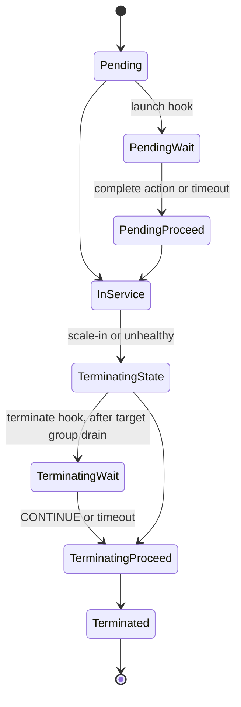
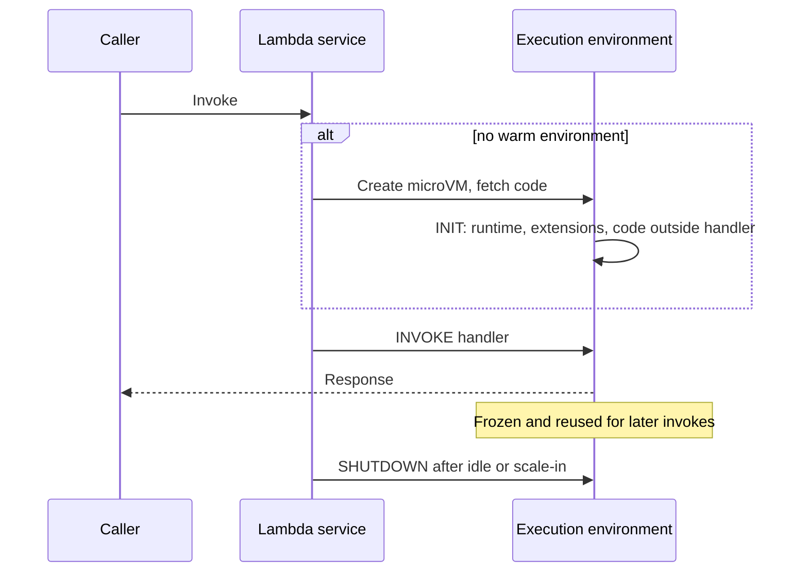
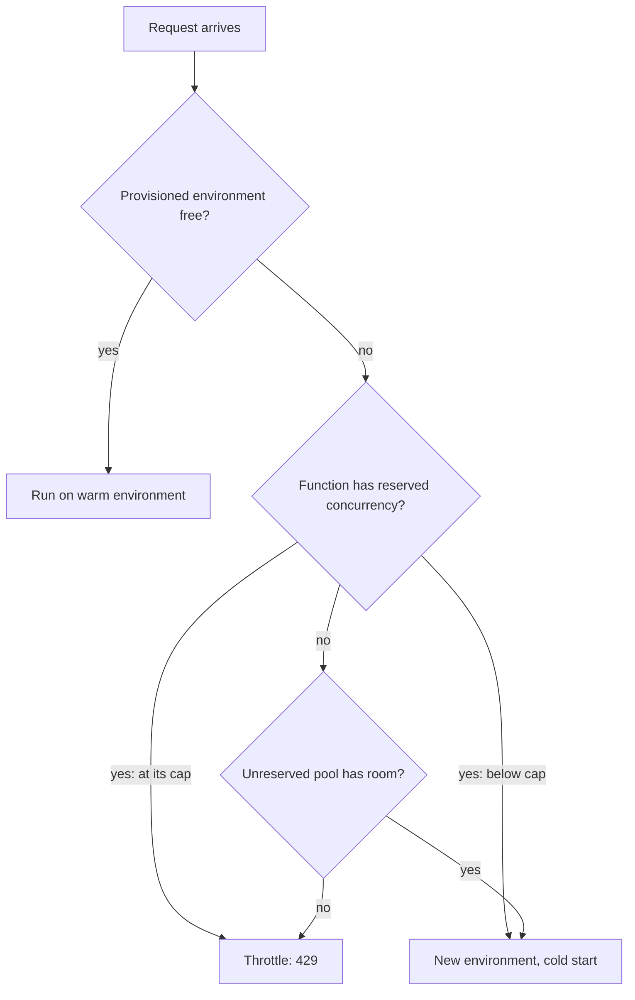
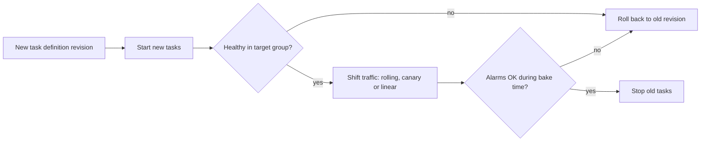
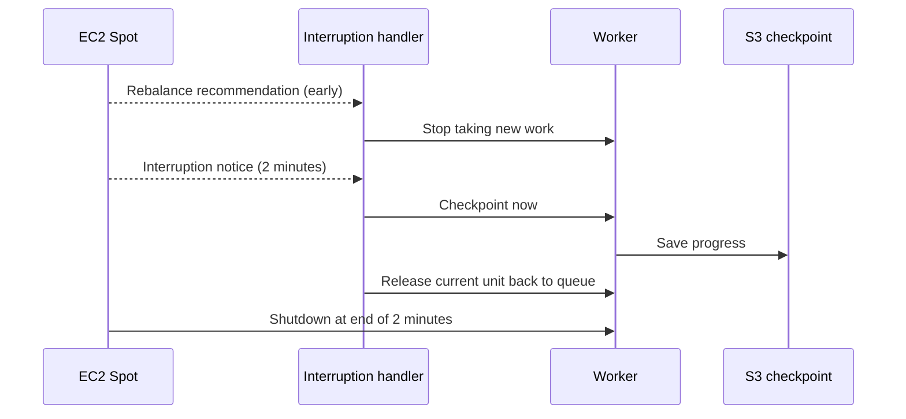
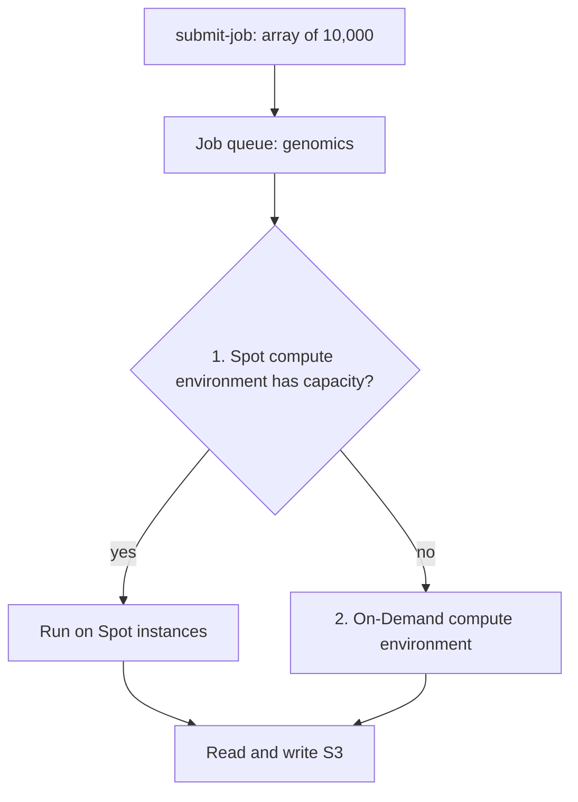

# ☁️ AWS Compute — Staff-Level Interview Questions

> *10 questions covering EC2, Lambda, ECS, EKS, Fargate, Auto Scaling, Batch and compute cost. Each answer leads with the 30-second version, then the mechanism, trade-offs, failure modes and what interviewers probe next. Limits and features checked against AWS documentation, October 2026.*

---

## Table of Contents

1. [EC2: Instance Types, ENI, Enhanced Networking](#1-ec2-instance-types-eni-enhanced-networking)
2. [EC2 Auto Scaling Groups: Policies & Lifecycle](#2-ec2-auto-scaling-groups-policies-lifecycle)
3. [AWS Lambda: Execution Model & Cold Starts](#3-aws-lambda-execution-model-cold-starts)
4. [Lambda Performance: Concurrency & Reservations](#4-lambda-performance-concurrency-reservations)
5. [ECS: Task Definition, Service, Cluster](#5-ecs-task-definition-service-cluster)
6. [EKS: Control Plane, Node Groups, Fargate](#6-eks-control-plane-node-groups-fargate)
7. [Fargate: Serverless Containers & Networking](#7-fargate-serverless-containers-networking)
8. [Spot Instances: Interruption Handling & Strategies](#8-spot-instances-interruption-handling-strategies)
9. [AWS Batch: Job Scheduling & Compute Environments](#9-aws-batch-job-scheduling-compute-environments)
10. [Hybrid: EC2 Reserved, Savings Plans, Cost Optimization](#10-hybrid-ec2-reserved-savings-plans-cost-optimization)

---

## 1. EC2: Instance Types, ENI, Enhanced Networking

**Q:** "Your application needs 100Gbps network throughput, NVMe local storage, and GPU compute. Walk through the EC2 instance families, how ENA (Enhanced Networking) works at the kernel level, and how to maximize network performance."

**What They're Really Testing:** Whether you understand the EC2 virtualization layer — Nitro hypervisor, ENA driver, and instance type selection for specific workload profiles.

### Answer

!!! tip "30-second answer"
    Pick the family by the bottleneck: M (balanced), C (CPU), R/X (memory), I/D (local NVMe/HDD), P/G/Trn/Inf (accelerators), Hpc (tightly coupled HPC). Suffixes tell you the CPU and extras: `g` Graviton, `i` Intel, `a` AMD, `d` local NVMe, `n` extra network, `e` extra memory. On Nitro, networking is SR-IOV through the **ENA** driver straight to the Nitro card, with multiple queues spread across vCPUs. "100 Gbps" is the instance aggregate: a **single TCP flow is capped at 5 Gbps** (10 Gbps in a cluster placement group, 25 Gbps with ENA Express), so you need many flows, a cluster placement group and jumbo frames. For RDMA-style HPC/ML collectives use **EFA**.

**Reading instance names** (examples current in 2026):

| Family | Examples | Notes |
|---|---|---|
| General purpose | M8g (Graviton4), **M9g** (Graviton5, GA June 2026), M8i (Intel Xeon 6), M8a (AMD) | Default starting point |
| Compute optimised | C8g, C8gn (network-optimised), C8i | Batch, encoding, high-RPS services |
| Memory optimised | R8g, R8i, X2iedn, X8g | Caches, in-memory DBs, large JVM heaps |
| Storage optimised | I8g, I7ie (local NVMe), D3 (dense HDD) | Self-managed databases, Kafka, search |
| Accelerated | P5/P5en (H100/H200), P6 (Blackwell), G6/G6e (L4/L40S), Trn2 (Trainium), Inf2 (Inferentia) | Training vs inference, cost per token |
| HPC | Hpc7g, Hpc7a | 200 Gbps EFA, tightly coupled MPI |

Graviton generally gives the best price-performance for code that builds for arm64 (most JVM, Go, Python, Node workloads); check native dependencies and vendor agents first.

**Nitro and ENA:**

```
 guest OS (ENA driver, N queues ≈ vCPUs)
        │ SR-IOV virtual function: no hypervisor in the data path
        ▼
 Nitro card (VPC networking, security groups, encryption, EBS as NVMe)
        │
        ▼
 AWS network fabric (SRD for ENA Express and EFA)
```

- The **Nitro System** (first shipped with C5 in 2017) moves networking, EBS and management to dedicated cards and uses a thin KVM-based hypervisor, so nearly all host CPU goes to the guest. It replaced the Xen-based platform for new instance types; it is not a VirtIO design.
- **ENA** exposes SR-IOV virtual functions with multiple TX/RX queues; Receive Side Scaling spreads flows across vCPUs. Check per-queue interrupts are spread (irqbalance) at high packet rates.
- **ENA Express** uses AWS's Scalable Reliable Datagram (SRD) protocol to spray one flow over many paths, raising single-flow bandwidth to 25 Gbps and cutting tail latency between supported instances in the same AZ.
- **EFA** adds OS-bypass (libfabric) for MPI/NCCL. It is what makes multi-node GPU training scale.

**Getting to 100 Gbps in practice:**

1. Choose an instance whose *documented* bandwidth meets the target (many "up to" figures are burst; sustained baseline is lower on smaller sizes).
2. Place communicating instances in a **cluster placement group** in one AZ.
3. Use **jumbo frames (MTU 9001)** inside the VPC. Traffic through an internet gateway, VPN or inter-Region peering is limited to 1500; Transit Gateway supports 8500.
4. Use many parallel flows (or ENA Express). Watch `ethtool -S` counters such as `bw_in_allowance_exceeded` and `pps_allowance_exceeded`: they show the instance hitting its allowance, not the network failing.
5. Traffic leaving the Region or going to the internet gets a smaller share (typically 5 Gbps, or 50% of bandwidth on instances with 32+ vCPUs).

**Instance store (NVMe) caveat:** fastest local I/O, but data survives only a reboot. It is lost on stop, hibernate, terminate or host failure, so use it for caches, scratch, or replicated stores (Kafka, Cassandra, Elasticsearch) that tolerate node loss.

**What they probe next:** EBS-optimised bandwidth as a separate limit from network bandwidth; placement group types (cluster, spread, partition) and their failure-domain trade-offs; why burstable T instances fail under sustained load (CPU credits).

### 🔍 Staff-Level Evaluation

| Criterion | What I'm Looking For |
|-----------|----------------------|
| **Instance families** | Can match workload to appropriate family (M, C, R, I, P, etc.) |
| **Nitro architecture** | Understands hardware offloading for network/storage/control |
| **ENA deep dive** | Knows per-flow limits, placement groups, MTU and allowance counters, not just "enable ENA" |
| **EFA for HPC** | Knows Elastic Fabric Adapter provides OS-bypass for MPI/NCCL |

### 🎬 Animated Sequence Diagram

<p align="center">
  <video controls width="800" style="border-radius: 12px; box-shadow: 0 4px 24px rgba(0,0,0,0.3);" loop playsinline preload="metadata">
    <source src="../../../assets/videos/aws-ec2-nitro-ena.mp4" type="video/mp4" />
    Your browser does not support the video tag.
  </video>
  <br/>
  <em>🎬 Animated EC2 Nitro Hypervisor & ENA Enhanced Networking — SR-IOV, multi-queue, jumbo frames, and 100 Gbps throughput — Click ▶ to play/pause. Created with <a href="https://remotion.dev">Remotion</a>.</em>
</p>

---

## 2. EC2 Auto Scaling Groups: Policies & Lifecycle

**Q:** "Your web service handles variable traffic: 10K requests/s during the day, 2K at night. Design an Auto Scaling Group with dynamic scaling policies, lifecycle hooks, and graceful shutdown. How does the ASG interact with the ALB target group?"

**What They're Really Testing:** Whether you understand ASG deeply — scaling policies (target tracking vs step scaling), lifecycle hooks, and integration with load balancers.

### Answer

!!! tip "30-second answer"
    Use **target tracking** on a load metric that scales linearly with instances (ALB `RequestCountPerTarget` beats CPU for web tiers), add **predictive scaling** or scheduled actions for the known daily curve, and set a **default instance warmup** so new instances don't count until they're ready. On scale-in, the ASG first **deregisters the instance from the target group** (deregistration delay drains in-flight requests), then a **termination lifecycle hook** holds it in `Terminating:Wait` so you can flush logs or finish work before it dies. Enable ELB health checks on the ASG so instances failing the target-group check get replaced.

**ASG + ALB architecture:**

```
Application Load Balancer
    │
    └── Target group (port 8080, health check /health)
            ├── instance A  InService
            ├── instance B  InService
            ├── instance C  draining (deregistration delay) → Terminating:Wait
            └── instance D  Pending:Wait → registered → InService

Auto Scaling group: my-app-asg
    ├── Launch template v3 (AMI, IMDSv2 required, user data)
    ├── Mixed instances policy (m8g/m7g/c8g; On-Demand base + Spot)
    ├── min 2 / max 20, 3 AZs, health check type ELB
    └── Policies: target tracking (RequestCountPerTarget = 1000)
                  + predictive scaling (forecast from 14 days of history)
```

**Scaling policy types:**

| Policy | How it works | Use when |
|---|---|---|
| **Target tracking** | Keeps a metric at a target; creates and manages the CloudWatch alarms; scales out fast, in conservatively | Default choice |
| **Step scaling** | Alarm breach size maps to step adjustments; uses instance warmup, not cooldown | You need asymmetric or aggressive steps |
| **Simple scaling** | One adjustment per alarm, then a cooldown | Legacy; avoid |
| **Scheduled** | Changes min/max/desired at a cron time (with time zone) | Known events, business hours |
| **Predictive** | Forecasts load from history and launches capacity ahead of the curve | Strong daily/weekly cycles with slow boot times |

```yaml
TargetTracking:
  PredefinedMetricType: ALBRequestCountPerTarget
  ResourceLabel: app/my-alb/abc123/targetgroup/my-tg/def456
  TargetValue: 1000          # requests per target per minute
  DisableScaleIn: false

ScheduledActions:
  - Recurrence: "0 8 * * 1-5"
    TimeZone: "America/New_York"
    MinSize: 5
  - Recurrence: "0 22 * * 1-5"
    TimeZone: "America/New_York"
    MinSize: 2

DefaultInstanceWarmup: 120   # seconds before a new instance's metrics count
```

*ASG instance states with lifecycle hooks on both launch and terminate.*




**Lifecycle on scale-in (the order matters):**

```
scale-in decision
   │
   ▼
deregister from target group ──► ALB stops new requests; in-flight ones get
   │                              up to the deregistration delay (default 300 s)
   ▼
Terminating:Wait (lifecycle hook) ──► EventBridge event → your handler
   │      heartbeat to extend; default timeout 1 hour
   ▼
complete_lifecycle_action(CONTINUE) or timeout ──► Terminating:Proceed ──► terminated
```

```python
import boto3

autoscaling = boto3.client("autoscaling")
ssm = boto3.client("ssm")

def handler(event, context):
    """EventBridge rule: 'EC2 Instance-terminate Lifecycle Action'."""
    d = event["detail"]
    # Kick off an on-host drain script and return quickly; the script itself
    # calls complete-lifecycle-action when done (it may take minutes).
    ssm.send_command(
        InstanceIds=[d["EC2InstanceId"]],
        DocumentName="AWS-RunShellScript",
        Parameters={"commands": [
            "systemctl stop my-worker",          # stop pulling new work
            "/opt/app/flush-and-upload-logs.sh",
            "aws autoscaling complete-lifecycle-action"
            f" --lifecycle-hook-name {d['LifecycleHookName']}"
            f" --auto-scaling-group-name {d['AutoScalingGroupName']}"
            f" --lifecycle-action-token {d['LifecycleActionToken']}"
            " --lifecycle-action-result CONTINUE",
        ]},
    )
```

Don't make a Lambda sit and wait for connections to drain: it has a 15-minute ceiling and you pay for idle time. Start the work and let the instance (or Step Functions) complete the action, sending `record-lifecycle-action-heartbeat` if it needs longer.

**Warm-up and health:**

- Launch: the `Pending:Wait` hook is where you pre-warm caches or wait for config. The instance registers with the target group just before `InService`.
- `HealthCheckGracePeriod` is an **ASG** setting (how long to ignore failed health checks after launch); the target group has its own `HealthyThresholdCount`/interval.
- **Warm pools** keep pre-initialised stopped (or hibernated) instances to cut scale-out time for slow-booting apps.
- **Instance refresh** rolls a new launch template through the group with a minimum healthy percentage, checkpoints and automatic rollback on alarm.

**Failure modes and probes:**

- *Scaling on CPU for an I/O-bound service* never triggers; scale on request count or queue backlog per instance.
- *Flapping:* scale-in too eager after scale-out; target tracking already scales in slowly, and warmup prevents double-counting.
- *AZ imbalance:* the ASG rebalances across AZs, which can terminate healthy instances. Use the instance maintenance policy to launch-before-terminate.
- *Health check mismatch:* ASG with EC2 checks only will keep an instance whose app is dead. Use `HealthCheckType: ELB`.

### 🔍 Staff-Level Evaluation

| Criterion | What I'm Looking For |
|-----------|----------------------|
| **Scaling policy types** | Can compare target tracking vs step vs scheduled vs predictive for different patterns |
| **Lifecycle hooks** | Understands deregistration happens before Terminating:Wait, and how to complete the action asynchronously |
| **ALB integration** | Knows target group health checks, deregistration delay, ELB health check type on the ASG |
| **Warm-up tuning** | Uses instance warmup (not cooldowns) to avoid scaling flapping |

### 🎬 Animated Sequence Diagram

<p align="center">
  <video controls width="800" style="border-radius: 12px; box-shadow: 0 4px 24px rgba(0,0,0,0.3);" loop playsinline preload="metadata">
    <source src="../../../assets/videos/aws-asg-lifecycle.mp4" type="video/mp4" />
    Your browser does not support the video tag.
  </video>
  <br/>
  <em>🎬 Animated EC2 Auto Scaling Group Lifecycle — ALB target group, scaling policies, lifecycle hooks, and graceful shutdown — Click ▶ to play/pause. Created with <a href="https://remotion.dev">Remotion</a>.</em>
</p>

---

## 3. AWS Lambda: Execution Model & Cold Starts

**Q:** "Your Lambda processes API requests with a 200ms latency SLA. Cold starts are causing 2-3 second delays for 5% of requests. Diagnose the cold start causes and design mitigation strategies including VPC cold starts, SnapStart, and provisioned concurrency."

**What They're Really Testing:** Whether you understand Lambda's execution environment lifecycle — sandbox creation, Firecracker microVM, and the trade-offs of each cold start mitigation.

### Answer

!!! tip "30-second answer"
    A cold start is Lambda creating a new Firecracker microVM, fetching your code, starting the runtime and running your init code; it happens on first invoke and every time concurrency grows. Measure it with the `Init Duration` in the REPORT log line. 2–3 s is almost always **runtime plus init code** (JVM class loading, framework DI, big imports, secrets fetched at startup), not VPC: VPC networking stopped adding per-cold-start ENI time in 2019. Fixes in order of cost: shrink init (lazy load, smaller package, more memory = more CPU), **SnapStart** (Java 11+, Python 3.12+, .NET 8+), then **provisioned concurrency** sized to steady-state concurrency for a hard SLA.

**Execution environment lifecycle:**

```
INIT  (cold only; up to 10 s for on-demand functions)
  ├─ create microVM + fetch code (zip from Lambda storage / image from ECR, cached)
  ├─ start runtime + extensions
  └─ run code outside the handler (clients, config, frameworks)
INVOKE (every request)
  └─ run handler; environment is frozen between invocations and reused
SHUTDOWN
  └─ after an idle period (not documented, not guaranteed), or on scale-in/updates
```

*Lambda execution environment: INIT runs once on a cold start, INVOKE repeats on the reused environment.*




Since **August 1, 2025** the INIT phase is billed for all on-demand functions (previously free for zip packages on managed runtimes), so heavy init now costs money as well as latency.

**Typical cold-start contributors (orders of magnitude, measure your own):**

| Contributor | Typical | Fix |
|---|---|---|
| Node.js / Python small function | ~100–400 ms | Bundle and tree-shake (esbuild), lazy imports |
| Java / .NET with frameworks | 1–6 s | SnapStart; avoid reflection-heavy DI; GraalVM native / .NET Native AOT |
| Large packages / images | Hundreds of ms | Trim dependencies; images are cached and lazily loaded, so size matters less than you'd think |
| Low memory setting | Init is CPU-bound | More memory gives proportionally more CPU (1,769 MB = 1 vCPU) |
| VPC | ~0 per cold start today | Hyperplane ENIs are created when the function is created or its VPC config changes, then shared |

**Mitigations compared:**

| Option | Effect | Cost | Caveats |
|---|---|---|---|
| **Provisioned concurrency** | N environments initialised ahead of time; double-digit ms start | Hourly charge per GB of provisioned concurrency plus lower duration rate | Over N, you get normal cold starts; scale it with Application Auto Scaling (scheduled or target tracking on utilisation) |
| **SnapStart** | Snapshot of the initialised microVM taken at version publish; new environments restore from it, often sub-second | Free for Java; caching + per-restore charges for Python and .NET | Published versions/aliases only; not with provisioned concurrency, EFS or >512 MB `/tmp`; uniqueness (random seeds, IDs, connections) must be re-established in `afterRestore` hooks |
| **Reduce init work** | Faster for every cold start | Free | Move rarely used clients to lazy init; don't fetch secrets synchronously at startup if they can be cached via the Parameters and Secrets extension |
| **"Keep-warm" pings** | Keeps one or a few environments alive | Cheap | Doesn't help concurrent bursts; mostly obsolete |
| **Lambda Managed Instances** (Dec 2025) | Functions run on EC2 instances Lambda manages in your account; each environment serves many concurrent requests | EC2 price + management fee + per-request charge; Savings Plans apply | For steady high-volume traffic; scaling is instance-based, not per request |

**Execution context reuse:**

```python
import os
import boto3

# Runs once per execution environment (INIT), reused on warm invokes
table = boto3.resource("dynamodb").Table(os.environ["TABLE_NAME"])

def handler(event, context):
    # Runs on every invocation
    return table.get_item(Key={"pk": event["key"]}).get("Item")
```

Reused across invocations in the same environment: globals, SDK clients and their keep-alive connections, `/tmp` (512 MB default, up to 10,240 MB). Never store per-request or per-user state in globals.

**Hard limits to know (2026):** memory 128–10,240 MB; timeout 15 minutes; synchronous payload 6 MB each way, **streamed responses up to 200 MB**; asynchronous payload 1 MB; zip package 50 MB zipped / 250 MB unzipped including layers; container image 10 GB; 5 layers; 4 KB of environment variables.

**What they probe next:** how you'd prove the fix (p99 of `Init Duration` and of end-to-end latency, by cold vs warm), SnapStart's uniqueness pitfalls, why API Gateway + Lambda for a 200 ms SLA might be the wrong tool versus a container service with always-warm processes.

### 🎬 Animated Sequence Diagram

<p align="center">
  <video controls width="800" style="border-radius: 12px; box-shadow: 0 4px 24px rgba(0,0,0,0.3);" loop playsinline preload="metadata">
    <source src="../../../assets/videos/aws-lambda-lifecycle.mp4" type="video/mp4" />
    Your browser does not support the video tag.
  </video>
  <br/>
  <em>🎬 Animated Lambda Cold Start & Execution Lifecycle — download → Firecracker µVM → runtime init → handler → warm reuse — Click ▶ to play/pause. Created with <a href="https://remotion.dev">Remotion</a>.</em>
</p>

### 🔍 Staff-Level Evaluation

| Criterion | What I'm Looking For |
|-----------|----------------------|
| **Cold start causes** | Breaks down init (microVM, code fetch, runtime, init code) and measures with `Init Duration` |
| **VPC cold start** | Knows Hyperplane ENIs (2019) removed per-cold-start ENI cost |
| **Provisioned concurrency** | Understands cost vs latency trade-off and sizing to concurrency, not RPS |
| **SnapStart** | Knows supported runtimes, restrictions and uniqueness hooks |

---

## 4. Lambda Performance: Concurrency & Reservations

**Q:** "You have 3 Lambda functions sharing the same account: one processes API requests, one processes SQS messages, one runs a scheduled job. The API function is throttling during peak hours. How does Lambda concurrency work? How do reserved concurrency and provisioned concurrency differ?"

**What They're Really Testing:** Whether you understand Lambda's concurrency model — the account-level burst concurrency, reserved concurrency as a guarantee, and how throttling works.

### Answer

!!! tip "30-second answer"
    Concurrency = requests per second × average duration in seconds. All functions in a Region share one account pool (1,000 by default, raisable to tens of thousands). Each function can add **1,000 execution environments every 10 seconds**. **Reserved concurrency** carves out a slice that is both a floor and a ceiling for one function, free of charge. **Provisioned concurrency** pre-initialises environments to remove cold starts, for a fee. For the scenario: request a quota increase, reserve concurrency for the API function, and cap the SQS consumer with the event source mapping's **maximum concurrency** so it can't starve the API.

*How a request is admitted against reserved, provisioned and shared concurrency.*




**The shared pool:**

```
Account concurrency (Region): 1,000
┌──────────────────────────────────────────────────────────────┐
│ API handler        reserved 500  (always available, max 500) │
│ SQS consumer       ESM MaximumConcurrency 200 (cap only)     │
│ Scheduled job      unreserved                                │
│ Unreserved pool    500 (Lambda always keeps ≥100 unreserved) │
└──────────────────────────────────────────────────────────────┘
Without reservations, a burst in the SQS consumer can take the
whole pool and the API function gets 429 TooManyRequestsException.
```

Sizing example: 2,000 requests/s at 150 ms average needs about 300 concurrent environments. Halving duration halves concurrency, which is why tuning memory (more CPU) often fixes "throttling".

**Scaling rate (since Nov 2023):** each function scales independently by up to 1,000 concurrent environments every 10 seconds until the account limit. The old Region-wide "burst 500–3,000 then +500/min" model no longer applies.

**Reserved vs provisioned:**

| | Reserved concurrency | Provisioned concurrency |
|---|---|---|
| Purpose | Guarantee and cap | Remove cold starts |
| Cold starts | Still happen | None up to the provisioned amount |
| Cost | Free | Charged per GB-second provisioned, whether used or not |
| Applies to | Function | Version or alias |
| Side effect | Caps the function; reserving 0 disables it (kill switch) | Counts against the function's reserved or the account pool |

**Throttling behaviour depends on the invocation type:**

| Invocation | On throttle |
|---|---|
| Synchronous (API Gateway, ALB, SDK) | Caller gets 429; client must retry with backoff |
| Asynchronous (S3, SNS, EventBridge) | Lambda's internal queue retries for up to 6 hours (configurable max event age), then on-failure destination or DLQ |
| SQS event source mapping | Pollers back off; messages stay in the queue and reappear after the visibility timeout; repeated failures count toward `maxReceiveCount` |
| Kinesis/DynamoDB Streams | Retries the batch, blocking that shard until success, record expiry or max retries |

**SQS event source mapping, configured correctly:**

```json
{
  "BatchSize": 10,
  "MaximumBatchingWindowInSeconds": 5,
  "ScalingConfig": { "MaximumConcurrency": 200 },
  "FunctionResponseTypes": ["ReportBatchItemFailures"]
}
```

- `MaximumConcurrency` (minimum 2) caps how many concurrent invocations the mapping drives. Prefer it to reserved concurrency for capping consumers: reserved concurrency makes pollers hit throttles, which burns receive counts and can push good messages into the DLQ.
- `ParallelizationFactor` applies to Kinesis and DynamoDB Streams only, not SQS.
- Default SQS mappings scale to about 1,250 concurrent invocations. **Provisioned mode** for SQS mappings (Nov 2025) lets you set minimum/maximum event pollers for faster and higher scaling.
- Set the queue visibility timeout to at least 6× the function timeout.

**Memory and throughput:** CPU scales with memory; 1,769 MB equals one vCPU and 10,240 MB gives up to 6 vCPUs. For CPU-bound code, more memory often costs the same or less because duration drops. Use Lambda Power Tuning to find the knee.

**Timeouts to align:** API Gateway REST APIs default to a 29 s integration timeout (raisable for Regional and private REST APIs since June 2024); HTTP APIs max out at 30 s. Set the function timeout just above the caller's.

### 🔍 Staff-Level Evaluation

| Criterion | What I'm Looking For |
|-----------|----------------------|
| **Concurrency pool** | Understands account-level shared concurrency and the per-function scaling rate |
| **Reserved vs provisioned** | Can explain guarantee/cap vs pre-warming difference |
| **SQS throttling** | Uses ESM maximum concurrency rather than reserved concurrency to cap consumers |
| **Memory scaling** | Understands CPU scales with memory allocation and concurrency = RPS × duration |

### 🎬 Animated Sequence Diagram

<p align="center">
  <video controls width="800" style="border-radius: 12px; box-shadow: 0 4px 24px rgba(0,0,0,0.3);" loop playsinline preload="metadata">
    <source src="../../../assets/videos/aws-lambda-concurrency.mp4" type="video/mp4" />
    Your browser does not support the video tag.
  </video>
  <br/>
  <em>🎬 Animated Lambda Concurrency & Reservations Model — shared pool, reserved concurrency, provisioned concurrency, and SQS throttling safety — Click ▶ to play/pause. Created with <a href="https://remotion.dev">Remotion</a>.</em>
</p>

---

## 5. ECS: Task Definition, Service, Cluster

**Q:** "Design an ECS deployment for a microservice using Fargate launch type with service discovery, rolling updates, and canary deployments. How does the ECS service scheduler work? How does Service Connect differ from classic service discovery?"

**What They're Really Testing:** Whether you understand ECS deeply — task definition (CPU/memory/port mappings), service scheduling, deployment strategies, and service discovery.

### Answer

!!! tip "30-second answer"
    A **task definition** is the immutable recipe (image, CPU/memory, ports, IAM roles, secrets, logging); a **service** keeps N copies running, spreads them across AZs, registers them with a target group and replaces failures. Rolling updates use `minimumHealthyPercent`/`maximumPercent` plus the **deployment circuit breaker** and CloudWatch alarm rollback. Since July 2025 ECS has **built-in blue/green**, and since October 2025 **linear and canary** strategies, so you no longer need CodeDeploy for traffic shifting. **Service Connect** adds a managed proxy per task for client-side load balancing, retries, timeouts and per-service metrics; plain Cloud Map discovery is DNS only.

**Task definition (Fargate):**

```json
{
  "family": "my-app",
  "taskRoleArn": "arn:aws:iam::123456789012:role/my-app-task-role",
  "executionRoleArn": "arn:aws:iam::123456789012:role/ecsTaskExecutionRole",
  "networkMode": "awsvpc",
  "requiresCompatibilities": ["FARGATE"],
  "runtimePlatform": { "cpuArchitecture": "ARM64", "operatingSystemFamily": "LINUX" },
  "cpu": "512",
  "memory": "1024",
  "containerDefinitions": [{
    "name": "my-app",
    "image": "123456789012.dkr.ecr.us-east-1.amazonaws.com/my-app:1.42.0",
    "essential": true,
    "portMappings": [{ "name": "http", "containerPort": 8080, "protocol": "tcp" }],
    "secrets": [
      { "name": "DB_PASSWORD", "valueFrom": "arn:aws:secretsmanager:us-east-1:123456789012:secret:db-pass" }
    ],
    "logConfiguration": {
      "logDriver": "awslogs",
      "options": {
        "awslogs-group": "/ecs/my-app",
        "awslogs-region": "us-east-1",
        "awslogs-stream-prefix": "ecs"
      }
    },
    "healthCheck": {
      "command": ["CMD-SHELL", "curl -f http://localhost:8080/health || exit 1"],
      "interval": 10, "timeout": 5, "retries": 3, "startPeriod": 60
    }
  }]
}
```

- **Task role**: what your code can call. **Execution role**: what the ECS agent needs to pull the image, fetch secrets and write logs. Mixing them up is a classic least-privilege mistake.
- Pin images by immutable tag or digest; `:latest` makes rollbacks and audits meaningless.
- Fargate CPU/memory come in fixed combinations (0.25 vCPU/0.5 GB up to 16 vCPU/120 GB).

**Service and deployment:**

```yaml
service: my-app
launchType: FARGATE            # or a capacity provider strategy (FARGATE / FARGATE_SPOT / Managed Instances)
desiredCount: 4
networkConfiguration:
  awsvpcConfiguration:
    subnets: [subnet-private-a, subnet-private-b, subnet-private-c]
    securityGroups: [sg-app]
    assignPublicIp: DISABLED
loadBalancers:
  - targetGroupArn: arn:aws:elasticloadbalancing:...:targetgroup/my-app/abc
    containerName: my-app
    containerPort: 8080
deploymentConfiguration:
  strategy: CANARY               # ROLLING (default) | BLUE_GREEN | LINEAR | CANARY
  minimumHealthyPercent: 100     # used by ROLLING
  maximumPercent: 200
  deploymentCircuitBreaker: { enable: true, rollback: true }
  alarms: { alarmNames: [my-app-5xx-rate], enable: true, rollback: true }
  bakeTimeInMinutes: 10          # keep the old revision for fast rollback
```

*ECS service deployment: the new revision is checked, traffic shifts, and an alarm or circuit breaker rolls back.*




**Deployment strategies:**

| Strategy | How traffic moves | Rollback | Notes |
|---|---|---|---|
| Rolling (`ECS` controller) | Replace tasks in batches bounded by min/max percent | Circuit breaker or alarm | Both versions serve traffic at once; needs backward-compatible changes |
| Built-in blue/green | New revision stands up fully, then the listener switches 100% | Instant during bake time | Lifecycle hooks (Lambda) for tests before traffic |
| Built-in linear / canary | Shift X% per step, or a small canary % then the rest | Alarm-driven | Replaces most CodeDeploy use cases |
| CodeDeploy controller | Same patterns via AppSpec | Alarm-driven | Still supported; legacy for new services |

**How the scheduler places tasks:** spreads across AZs by default; with EC2 capacity it also applies placement strategies (`spread`, `binpack`, `random`) and constraints. Capacity providers decide *where* (Fargate, Fargate Spot, an ASG, or **ECS Managed Instances**, where AWS runs and patches the EC2 instances for you).

**Service Connect vs Cloud Map DNS:**

| | Cloud Map service discovery | Service Connect |
|---|---|---|
| Mechanism | DNS A/SRV records (or API discovery) | Managed proxy (Envoy-based) injected into each task; still uses a Cloud Map namespace |
| Load balancing | Client DNS resolution; stale records until TTL expires | Proxy-side, health-aware, outlier detection |
| Retries / timeouts | Your code | Configurable |
| Metrics | None built in | Per-service request metrics in CloudWatch |
| Cost | Cloud Map queries | Proxy CPU/memory in your task |
| Cross-cluster / cross-account | Namespace sharing | Same namespace across clusters; for cross-VPC/account, consider VPC Lattice |

**What they probe next:** why tasks fail health checks only during deploys (start period, slow JVM warm-up), ECS vs EKS for a 10-engineer team (ECS is less to operate; EKS if you need Kubernetes ecosystem portability), and **ECS Express Mode** (Nov 2025), which provisions the service, ALB, scaling and roles from just an image and is the migration path AWS recommends for App Runner, which closed to new customers on April 30, 2026.

### 🔍 Staff-Level Evaluation

| Criterion | What I'm Looking For |
|-----------|----------------------|
| **Task definition fields** | Knows task role vs execution role, port mappings, secrets |
| **Deployment strategies** | Compares rolling vs built-in blue/green vs linear/canary, with alarm rollback |
| **Service Connect** | Understands managed proxy for inter-service comm vs DNS discovery |
| **Auto scaling** | Uses target tracking with request count or CPU, and scales on the right metric |

---

## 6. EKS: Control Plane, Node Groups, Fargate

**Q:** "Design an EKS cluster for a multi-tenant SaaS platform with 50 microservices. Compare self-managed node groups, managed node groups, and EKS Fargate. How does the EKS control plane work? How do you secure cluster access?"

**What They're Really Testing:** Whether you understand the EKS architecture — the managed control plane, node group types, and the security model with IRSA and pod identity.

### Answer

!!! tip "30-second answer"
    AWS runs the control plane (API servers and etcd across three AZs in an AWS-owned account); you choose how nodes are run: **EKS Auto Mode** (AWS runs Karpenter-style provisioning, nodes and core add-ons, for a per-instance management fee), **managed node groups** (AWS-managed ASGs, you pick types), **Karpenter on your own nodes**, **self-managed** nodes, or **Fargate** (one pod per microVM, many restrictions). Secure it with **access entries** (not the old `aws-auth` ConfigMap) for humans, **EKS Pod Identity** (or IRSA) for pods, a private API endpoint, network policies, and namespaces with quotas per tenant.

**Architecture:**

```
EKS control plane (AWS-managed, per cluster)
  ├─ kube-apiserver instances behind an NLB, across AZs
  ├─ etcd across 3 AZs, encrypted (envelope encryption of Secrets with KMS)
  ├─ scheduler, controller-manager
  └─ standard tier ($0.10/hr), extended support for older versions ($0.60/hr),
     or Provisioned Control Plane tiers (XL–8XL) for predictable large-scale API capacity
          │ cross-account ENIs in your subnets
          ▼
Data plane (your VPC)
  ├─ Auto Mode nodes | managed node groups | Karpenter | self-managed | Fargate
  ├─ Amazon VPC CNI: each pod gets a VPC IP (no overlay)
  └─ add-ons: CoreDNS, kube-proxy, EBS CSI, Pod Identity agent, ...
```

**Data plane options:**

| Option | Who manages nodes | Strengths | Watch out for |
|---|---|---|---|
| **EKS Auto Mode** (Dec 2024) | AWS: provisioning, Bottlerocket AMIs, patching (nodes max ~21 days), core add-ons, load balancer and storage controllers | Least ops; uses Karpenter-style NodePools | Management fee on top of EC2 (not covered by Savings Plans); less node customisation |
| Managed node groups | AWS manages the ASG lifecycle; you choose AMI type, sizes, update timing | Simple, predictable | Scaling is per-group; pair with Cluster Autoscaler or Karpenter |
| Karpenter (self-run) | You run Karpenter; it launches right-sized instances per pending pod | Fast, bin-packing, Spot diversification, consolidation | You own its upgrades and NodePool design |
| Self-managed nodes | You | Full control (custom kernels, special AMIs) | All patching and draining is yours |
| Fargate | AWS; one pod per microVM | Strong isolation, no nodes | No DaemonSets, privileged pods, hostNetwork, GPUs or EBS (EFS only); slower pod start; pricier at density |

GPU workloads no longer need self-managed nodes: managed node groups, Karpenter and Auto Mode all support accelerated AMIs.

**Networking (VPC CNI):** pods get real VPC IPs, so security groups, flow logs and routing work natively. Pod density is limited by ENIs × IPs per ENI; enable **prefix delegation** (/28 prefixes per ENI slot) to raise it, plan subnets generously or use **IPv6**, and use **security groups for pods** for per-workload network policy at the VPC level. Kubernetes `NetworkPolicy` is supported natively by the VPC CNI.

**Access control:**

```bash
# Humans/CI: access entries map IAM principals to Kubernetes permissions
aws eks create-access-entry --cluster-name prod \
  --principal-arn arn:aws:iam::123456789012:role/platform-admins
aws eks associate-access-policy --cluster-name prod \
  --principal-arn arn:aws:iam::123456789012:role/platform-admins \
  --policy-arn arn:aws:eks::aws:cluster-access-policy/AmazonEKSClusterAdminPolicy \
  --access-scope type=cluster
```

```bash
# Pods: EKS Pod Identity (Nov 2023) — no OIDC provider or trust-policy per cluster
aws eks create-pod-identity-association --cluster-name prod \
  --namespace payments --service-account payments-api \
  --role-arn arn:aws:iam::123456789012:role/payments-api
# Role trust policy principal: pods.eks.amazonaws.com (actions sts:AssumeRole, sts:TagSession)
```

| | IRSA | EKS Pod Identity |
|---|---|---|
| Mechanism | Projected service-account token, `AssumeRoleWithWebIdentity` via the cluster's OIDC provider | Pod Identity agent on the node exchanges the token via the EKS Auth API |
| Per-cluster setup | IAM OIDC provider and role trust policy naming the cluster's issuer | None; same role reusable across clusters |
| Session tags (ABAC) | No | Yes (cluster, namespace, service account tags) |
| Where it still wins | Fargate pods, other Kubernetes distributions | Default choice on EKS EC2 nodes |

Also block pod access to the node's instance role: require IMDSv2 with hop limit 1 so pods can't steal node credentials.

**Multi-tenancy for 50 services:** namespace per team/service with ResourceQuotas and LimitRanges, NetworkPolicies default-deny, Pod Security Admission (`restricted`), separate NodePools for noisy or sensitive tenants, and a separate cluster (or account) when tenants need hard isolation. Soft multi-tenancy in one cluster is not a security boundary against a hostile tenant.

**Cost comparison (illustrative):** 100 small pods at 0.25 vCPU / 0.5 GB on Fargate cost roughly $900/month in us-east-1; the same pods bin-packed onto a few m8g.xlarge nodes cost a fraction of that, plus the cluster fee. Fargate wins for spiky, low-count or isolation-sensitive workloads; nodes win at density.

**What they probe next:** cluster upgrade strategy (in-place vs blue/green clusters; versions move ~3 times a year and fall into paid extended support after ~14 months), control-plane scaling and API priority/fairness, and how you'd handle IP exhaustion.

### 🔍 Staff-Level Evaluation

| Criterion | What I'm Looking For |
|-----------|----------------------|
| **Node group types** | Can compare managed vs self-managed vs Fargate vs Auto Mode vs Karpenter |
| **VPC CNI** | Understands native VPC IPs vs overlay networking, prefix delegation, IP exhaustion |
| **Pod IAM** | Explains Pod Identity and IRSA, and blocking IMDS from pods |
| **Fargate limitations** | Knows DaemonSet, host networking, GPU, and EBS limitations |

### 🎬 Animated Sequence Diagram

<p align="center">
  <video controls width="800" style="border-radius: 12px; box-shadow: 0 4px 24px rgba(0,0,0,0.3);" loop playsinline preload="metadata">
    <source src="../../../assets/videos/aws-eks-architecture.mp4" type="video/mp4" />
    Your browser does not support the video tag.
  </video>
  <br/>
  <em>🎬 Animated EKS Architecture — managed control plane, VPC CNI, managed/self-managed node groups, Fargate profiles, and IRSA — Click ▶ to play/pause. Created with <a href="https://remotion.dev">Remotion</a>.</em>
</p>

---

## 7. Fargate: Serverless Containers & Networking

**Q:** "Your ECS service on Fargate needs to connect to an RDS database in a private subnet and an external API via the internet. Design the networking. How does Fargate's network stack work? Compare Fargate platform versions 1.3 vs 1.4."

**What They're Really Testing:** Whether you understand Fargate's network architecture — the task ENI, NAT requirements, and platform version differences.

### Answer

!!! tip "30-second answer"
    Every Fargate task gets its own ENI in your subnet (`awsvpc` mode) with its own security group. Put tasks in private subnets; the RDS security group allows the task security group on 5432/3306; outbound internet goes through a NAT gateway. On platform **1.4.0** (the current `LATEST` for Linux), *all* task traffic, including image pulls from ECR, Secrets Manager lookups and log shipping, uses that task ENI, so private subnets need either NAT or VPC endpoints (ECR API, ECR DKR, S3 gateway, Logs, Secrets Manager). Endpoints keep AWS traffic private and are usually cheaper than NAT at volume.

**Network layout:**

```
VPC 10.0.0.0/16
├── Public subnets (per AZ)          IGW, ALB
├── Private app subnets (per AZ)     Fargate task ENIs  ── sg-app
│      route 0.0.0.0/0 → NAT gateway (zonal per AZ, or one regional NAT gateway)
│      S3 / DynamoDB prefix lists → gateway endpoints (free)
│      ECR, Logs, Secrets Manager → interface endpoints (per-AZ ENIs)
└── Private data subnets             RDS  ── sg-db allows 5432 from sg-app only
```

**Platform versions:**

| | 1.3.0 (legacy) | 1.4.0 (`LATEST` for Linux) |
|---|---|---|
| Image pulls, secrets, logs | Through a separate Fargate-owned ENI | Through the **task ENI**, so they obey your routes, SGs and endpoints |
| EFS volumes | No | Yes |
| Ephemeral storage | Fixed 10 GB container + 4 GB volume | 20 GiB default, configurable up to 200 GiB |
| Network metrics, SYS_PTRACE, etc. | No | Yes |

There is no Linux 1.5. Features added since (EBS volumes attached to ECS tasks on Fargate in Jan 2024, Graviton/ARM64, Windows containers on their own 1.0.0 version line, Fargate Spot) arrived as capabilities, not platform versions. Fargate does **not** offer GPUs; use EC2 capacity (or ECS Managed Instances) for that. Migrating from 1.3 to 1.4 commonly breaks image pulls in private subnets that relied on the old Fargate-owned path: add the endpoints or NAT first.

**NAT gateway cost and alternatives (us-east-1 list prices):**

| Option | Price | Use for |
|---|---|---|
| NAT gateway | ~$0.045/hour (~$33/month) per gateway + $0.045/GB processed | Internet egress |
| Gateway endpoints (S3, DynamoDB) | Free | Always add them |
| Interface endpoints | ~$0.01/hour per AZ + ~$0.01/GB | High-volume AWS API traffic (ECR pulls, Logs) |
| Regional NAT gateway (Nov 2025) | NAT pricing; one ID spanning AZs, no public subnet needed | Simpler multi-AZ egress |
| Centralised egress VPC via Transit Gateway | TGW attachment + data charges | Many VPCs, central inspection |

Example: 50 tasks pulling 5 TB/month of images and logs through NAT costs ~$225 in processing; through interface endpoints ~$50 plus endpoint hours. Zonal NAT gateways: deploy one per AZ, or an AZ failure takes out egress for the others and cross-AZ data charges apply.

**Other Fargate facts:** tasks up to 16 vCPU / 120 GB; each task is its own microVM (no shared kernel with other customers); Fargate Spot gives a 2-minute warning (task receives SIGTERM) at up to 70% off; Graviton tasks are ~20% cheaper than x86.

**What they probe next:** task startup time (image size and pull path dominate; use smaller images, SOCI lazy loading), why public IP assignment on tasks is a smell (and costs $0.005/hour per public IPv4 since February 2024), and IPv6-only task networking.

### 🔍 Staff-Level Evaluation

| Criterion | What I'm Looking For |
|-----------|----------------------|
| **Fargate networking** | Understands awsvpc mode, task ENI, NAT/endpoint requirement |
| **Platform versions** | Knows 1.4.0 routes all traffic through the task ENI and is the latest Linux version |
| **NAT cost optimization** | Uses gateway endpoints always and interface endpoints where volume justifies them |
| **Security groups** | Applies per-task security groups for micro-segmentation |

### 🎬 Animated Sequence Diagram

<p align="center">
  <video controls width="800" style="border-radius: 12px; box-shadow: 0 4px 24px rgba(0,0,0,0.3);" loop playsinline preload="metadata">
    <source src="../../../assets/videos/aws-fargate-networking.mp4" type="video/mp4" />
    Your browser does not support the video tag.
  </video>
  <br/>
  <em>🎬 Animated Fargate Networking — Hyperplane ENI, NAT Gateway, VPC Endpoints, and platform version comparison — Click ▶ to play/pause. Created with <a href="https://remotion.dev">Remotion</a>.</em>
</p>

---

## 8. Spot Instances: Interruption Handling & Strategies

**Q:** "You run a batch processing workload on EC2 that costs $50K/month in on-demand. How would you migrate to Spot Instances to reduce costs by 70%? Design the interruption handling strategy: how to checkpoint, handle termination notices, and diversify instance types."

**What They're Really Testing:** Whether you understand the Spot market — capacity pools, interruption notices, diversification strategies, and checkpointing for fault tolerance.

### Answer

!!! tip "30-second answer"
    Spot is spare capacity at up to ~90% off, reclaimed with a **2-minute warning** when EC2 needs it back. There is no bidding: prices move slowly, and interruptions are driven by capacity. Make the work interruptible (idempotent units, checkpoints to S3, work pulled from a queue), diversify across **many instance types and all AZs** with the **price-capacity-optimized** allocation strategy, react to the **rebalance recommendation** (early) and the **interruption notice** (2 minutes), and keep a small On-Demand base for anything that must finish on time.

**Signals you get:**

| Signal | When | Where |
|---|---|---|
| Rebalance recommendation | Elevated interruption risk; often well before a notice | IMDS `meta-data/events/recommendations/rebalance`, EventBridge `EC2 Instance Rebalance Recommendation` |
| Interruption notice | 2 minutes before stop/terminate/hibernate | IMDS `meta-data/spot/instance-action`, EventBridge `EC2 Spot Instance Interruption Warning` |
| OS shutdown | At the end of the 2 minutes | ACPI shutdown → your service gets SIGTERM from systemd/the container runtime, with little time left |

Interruption reasons: capacity (the vast majority), your optional max price being lower than the current Spot price, or constraints you set (launch group, AZ group).

**Interruption handler (runs on the instance):**

```python
import json
import time
import urllib.request

IMDS = "http://169.254.169.254/latest"

def imds_get(path: str, token: str):
    req = urllib.request.Request(f"{IMDS}/{path}", headers={"X-aws-ec2-metadata-token": token})
    try:
        with urllib.request.urlopen(req, timeout=1) as r:
            return r.read().decode()
    except urllib.error.HTTPError as e:
        if e.code == 404:          # no notice yet
            return None
        raise

def imds_token() -> str:
    req = urllib.request.Request(
        f"{IMDS}/api/token", method="PUT",
        headers={"X-aws-ec2-metadata-token-ttl-seconds": "21600"},
    )
    with urllib.request.urlopen(req, timeout=1) as r:
        return r.read().decode()

def watch(worker):
    token = imds_token()
    while True:
        if imds_get("meta-data/events/recommendations/rebalance", token):
            worker.stop_taking_new_work()          # finish current unit, don't start more
        notice = imds_get("meta-data/spot/instance-action", token)
        if notice:
            action = json.loads(notice)            # {"action": "terminate", "time": "..."}
            worker.checkpoint_to_s3()              # must finish well inside 2 minutes
            worker.release_current_unit()          # e.g. ChangeMessageVisibility to 0
            return action
        time.sleep(5)
```

(Refresh the token before its TTL in long-running processes. In containers, the AWS Node Termination Handler on Kubernetes, or Karpenter's interruption queue, does this for you; ECS drains Spot tasks automatically when `ECS_ENABLE_SPOT_INSTANCE_DRAINING=true`.)

*Spot interruption timeline: rebalance recommendation first, then the 2-minute notice, then shutdown.*




**Checkpointing design:** the unit of work should be small enough to redo cheaply (minutes, not hours). For long jobs, checkpoint every N minutes to S3 with a version or sequence number, and make resume idempotent. Two minutes is not enough to upload a 50 GB checkpoint; plan for losing the work since the last periodic checkpoint.

**Diversification:**

```yaml
# ASG mixed instances policy (or EC2 Fleet / Karpenter NodePool)
MixedInstancesPolicy:
  InstancesDistribution:
    OnDemandBaseCapacity: 2
    OnDemandPercentageAboveBaseCapacity: 10
    SpotAllocationStrategy: price-capacity-optimized
  LaunchTemplate:
    Overrides:                      # or attribute-based selection: vCPU 16, memory 32-64 GiB
      - InstanceType: c7g.4xlarge
      - InstanceType: c8g.4xlarge
      - InstanceType: m7g.4xlarge
      - InstanceType: c6i.4xlarge
      - InstanceType: c7i.4xlarge
      - InstanceType: m6i.4xlarge
      - InstanceType: c6a.4xlarge
      - InstanceType: m7a.4xlarge
CapacityRebalance: true             # launch a replacement on rebalance recommendation
VPCZoneIdentifier: subnet-a,subnet-b,subnet-c
```

- A capacity pool is (instance type, AZ). Ten types × three AZs = 30 pools; losing one pool barely dents the fleet.
- `price-capacity-optimized` is AWS's recommended strategy: it picks the deepest pools and then the cheapest of those. `lowest-price` concentrates you in the pool most likely to be reclaimed.
- Mixing architectures (x86 and Graviton) needs multi-arch AMIs or images.
- Use the Spot placement score and the Spot Instance Advisor's interruption frequency bands to choose types; don't quote a fixed interruption percentage.

**Cost estimate (illustrative, us-east-1):** 100 × c6i.4xlarge On-Demand at $0.68/hour ≈ $49,600/month. If diversified Spot averages ~65–70% off and you keep ~10% On-Demand for deadlines, the blended bill lands near $17,000–20,000/month, a 60–65% saving. Getting to 70%+ usually also needs Graviton and right-sizing, plus accounting for rework lost to interruptions.

**What they probe next:** Spot for stateful services (only with replication and fast replacement), Spot for Kubernetes (Karpenter consolidation and disruption budgets), and why "Spot price exceeds max bid" is mostly a historical concern.

### 🔍 Staff-Level Evaluation

| Criterion | What I'm Looking For |
|-----------|----------------------|
| **Termination notice handling** | Uses rebalance recommendation and instance-action, checkpoints, releases work |
| **Capacity pool diversification** | Diversifies across types, sizes, architectures and AZs |
| **Fleet allocation** | Uses price-capacity-optimized and capacity rebalancing |
| **Reserved + spot mix** | Combines Savings Plans/On-Demand for baseline, Spot for elasticity |

### 🎬 Animated Sequence Diagram

<p align="center">
  <video controls width="800" style="border-radius: 12px; box-shadow: 0 4px 24px rgba(0,0,0,0.3);" loop playsinline preload="metadata">
    <source src="../../../assets/videos/aws-spot-interruption.mp4" type="video/mp4" />
    Your browser does not support the video tag.
  </video>
  <br/>
  <em>🎬 Animated Spot Instance Interruption Handling — 2-min termination notice, checkpoint to S3, fleet diversification, and 78% cost savings — Click ▶ to play/pause. Created with <a href="https://remotion.dev">Remotion</a>.</em>
</p>

---

## 9. AWS Batch: Job Scheduling & Compute Environments

**Q:** "You need to run 10,000 genomics analysis jobs daily. Each job takes 1-60 minutes on 16 vCPU, 64GB RAM. Design an AWS Batch architecture. How does Batch optimize resource utilization across job queues? How does it handle job dependencies?"

**What They're Really Testing:** Whether you understand AWS Batch's job scheduling — compute environments, job queues, job definitions, and the scheduling strategy for diverse job types.

### Answer

!!! tip "30-second answer"
    Submit the 10,000 samples as one **array job** (up to 10,000 children, each gets `AWS_BATCH_JOB_ARRAY_INDEX`). The job queue feeds an ordered list of **compute environments**: a Spot environment first (`SPOT_PRICE_CAPACITY_OPTIMIZED`, many instance types, `minvCpus: 0`) and an On-Demand one as fallback. Batch launches instances sized to the queued jobs' vCPU/memory and scales back to zero. Pipelines use `dependsOn` (with `N_TO_N` between array jobs of equal size), or Step Functions for anything with branching. **Fair-share scheduling policies** divide capacity between teams. Watch the memory math: a 64 GB job will not fit on a 64 GB instance.

**Architecture:**

```
submit-job (array size 10,000)
        │
        ▼
Job queue: genomics (priority 10, fair-share policy)
        │ tries compute environments in order
        ├── 1. genomics-spot   (EC2 Spot, price-capacity-optimized, 0–4,096 vCPU)
        └── 2. genomics-od     (EC2 On-Demand, 0–1,024 vCPU)
        ▼
ECS tasks on Batch-managed instances  (or Fargate / EKS compute environments)
        │ inputs/outputs: S3; shared reference data: EFS or FSx for Lustre
```

*AWS Batch: jobs flow through a queue to compute environments in priority order, Spot first then On-Demand.*




**Job definition:**

```json
{
  "jobDefinitionName": "genomics-analysis",
  "type": "container",
  "containerProperties": {
    "image": "123456789012.dkr.ecr.us-east-1.amazonaws.com/genomics:2.3.1",
    "command": ["analysis.py", "Ref::input_prefix", "Ref::output_bucket"],
    "resourceRequirements": [
      { "type": "VCPU",   "value": "16" },
      { "type": "MEMORY", "value": "61440" }
    ],
    "volumes": [{
      "name": "ref_data",
      "efsVolumeConfiguration": {
        "fileSystemId": "fs-abc123",
        "transitEncryption": "ENABLED",
        "authorizationConfig": { "accessPointId": "fsap-abc123", "iam": "ENABLED" }
      }
    }],
    "mountPoints": [{ "sourceVolume": "ref_data", "containerPath": "/ref", "readOnly": true }],
    "linuxParameters": { "sharedMemorySize": 16384 },
    "logConfiguration": { "logDriver": "awslogs" }
  },
  "retryStrategy": {
    "attempts": 3,
    "evaluateOnExit": [
      { "onStatusReason": "Host EC2*",           "action": "RETRY" },
      { "onReason":       "OutOfMemoryError*",   "action": "EXIT"  },
      { "onExitCode":     "*",                   "action": "EXIT"  }
    ]
  },
  "timeout": { "attemptDurationSeconds": 7200 }
}
```

- Use `resourceRequirements`, not the deprecated top-level `vcpus`/`memory`.
- **Memory fit:** the ECS agent and OS reserve some memory, so a "64 GB" request does not fit an m-family 4xlarge (64 GiB). Request ~60 GiB, or allow 8xlarge / r-family 4xlarge (128 GiB) in the compute environment. A job whose request fits no allowed instance type stays `RUNNABLE` forever, the most common Batch support ticket.
- `retryStrategy` retries Spot reclaims (status reason starts with `Host EC2`) and gives up on application errors. Rules are evaluated in order; patterns are globs.

**Dependencies and array jobs:**

```bash
# 10,000-way fan-out
ALIGN=$(aws batch submit-job --job-name align --job-queue genomics \
  --job-definition genomics-analysis --array-properties size=10000 \
  --parameters input_prefix=s3://data/inputs/,output_bucket=s3://data/aligned/ \
  --query jobId --output text)

# Child i of variant-calling waits only for child i of align
CALL=$(aws batch submit-job --job-name call --job-queue genomics \
  --job-definition variant-calling --array-properties size=10000 \
  --depends-on jobId=$ALIGN,type=N_TO_N --query jobId --output text)

# Report waits for the whole variant-calling array
aws batch submit-job --job-name report --job-queue genomics \
  --job-definition report --depends-on jobId=$CALL
```

- Plain `dependsOn` (no type) waits for the parent to **succeed**; if a parent fails, dependents fail too.
- `N_TO_N` links array children index-to-index; `SEQUENTIAL` (only within one array job) runs children one after another.
- A job can list up to 20 dependencies. For conditional logic, retries per stage or human approval, orchestrate with **Step Functions** (which has a native Batch integration).

**Compute environment:**

```yaml
genomics-spot:
  type: MANAGED
  computeResources:
    type: SPOT
    allocationStrategy: SPOT_PRICE_CAPACITY_OPTIMIZED   # recommended; no Spot Fleet role needed
    minvCpus: 0                                         # scale to zero overnight
    maxvCpus: 4096
    instanceTypes: [m6i.8xlarge, m7i.8xlarge, m6a.8xlarge, r6i.4xlarge, r7i.4xlarge, r6a.4xlarge]
    subnets: [subnet-a, subnet-b, subnet-c]
    launchTemplate: { launchTemplateName: genomics-lt }   # e.g. larger gp3 root volume
```

`BEST_FIT` (the legacy default) picks the single cheapest fitting type and waits if it is unavailable; `BEST_FIT_PROGRESSIVE` and the Spot strategies are what you want at scale.

**Fair share between teams:**

```yaml
genomics-fairshare:
  fairsharePolicy:
    shareDecaySeconds: 3600     # how far back usage counts
    computeReservation: 10      # hold back capacity so an idle share identifier can start promptly
    shareDistribution:
      - { shareIdentifier: teamA, weightFactor: 1.0 }
      - { shareIdentifier: teamB, weightFactor: 0.5 }   # lower weight = larger share
```

Without a scheduling policy the queue is FIFO, so one team's 10,000-job array starves everyone else. Note that in Batch fair share a **lower** weight factor gets **more** capacity.

**What they probe next:** Batch vs Step Functions Distributed Map vs EKS jobs (Batch for container jobs needing big instances and queueing; Distributed Map for many short Lambda tasks over S3 objects), multi-node parallel jobs for MPI, and data locality (FSx for Lustre linked to S3 for heavy reads).

### 🔍 Staff-Level Evaluation

| Criterion | What I'm Looking For |
|-----------|----------------------|
| **Compute environment** | Optimizes spot with fallback to on-demand, and checks memory fit |
| **Job dependencies** | Uses N_TO_N between arrays and plain dependsOn for fan-in |
| **Fair share scheduling** | Implements resource sharing across teams/projects |
| **Array jobs** | Uses array jobs for embarrassingly parallel workloads |

### 🎬 Animated Sequence Diagram

<p align="center">
  <video controls width="800" style="border-radius: 12px; box-shadow: 0 4px 24px rgba(0,0,0,0.3);" loop playsinline preload="metadata">
    <source src="../../../assets/videos/aws-batch-job-scheduling.mp4" type="video/mp4" />
    Your browser does not support the video tag.
  </video>
  <br/>
  <em>🎬 Animated AWS Batch Job Scheduling — compute environments, array jobs, spot + on-demand mix, fair share, and job dependencies — Click ▶ to play/pause. Created with <a href="https://remotion.dev">Remotion</a>.</em>
</p>

---

## 10. Hybrid: EC2 Reserved, Savings Plans, Cost Optimization

**Q:** "Your AWS bill is $500K/month for EC2, Lambda, and Fargate. 30% is compute. Design a cost optimization strategy covering Reserved Instances, Savings Plans, right-sizing, and graviton migration. How do you track and prove cost savings?"

**What They're Really Testing:** Whether you understand AWS cost optimization holistically — purchase options, right-sizing, architecture changes, and observability.

### Answer

!!! tip "30-second answer"
    Order matters: **eliminate waste first** (idle and over-sized resources, old-generation instances, unattached volumes), **then re-architect** (Graviton, Spot for interruptible work, scale to zero), and only **then commit** (Savings Plans sized to the post-optimisation baseline, laddered over time). Committing first locks in waste. Prove savings with tagged cost allocation, unit costs (cost per request/customer), and Cost Explorer or CUR 2.0 data, compared against a usage-normalised baseline.

**Purchase options (discounts are AWS's "up to" figures):**

| Option | Max discount | Commitment | Flexibility |
|---|---|---|---|
| On-Demand | 0% | None | Full |
| Spot | Up to 90% | None | Interruptible |
| **Compute Savings Plan** | Up to 66% | $/hour for 1 or 3 years | Any EC2 family, size, OS, Region, plus Fargate and Lambda |
| EC2 Instance Savings Plan | Up to 72% | $/hour, 1 or 3 years | One instance family in one Region; any size, OS, tenancy |
| Standard Reserved Instance | Up to 72% | 1 or 3 years | Fixed attributes; can be sold on the RI Marketplace; **zonal** RIs also reserve capacity |
| Convertible RI | Up to 66% | 1 or 3 years | Exchangeable |
| Database Savings Plans (Dec 2025) | Up to 35% | $/hour, 1 year | RDS, Aurora, DynamoDB, ElastiCache and other managed databases |
| On-Demand Capacity Reservations | 0% (combine with SPs) | None | Guarantees capacity in an AZ; you pay whether used or not |

Scheduled RIs are no longer offered. For new compute commitments, Savings Plans have largely replaced RIs; RIs remain relevant for RDS/ElastiCache/OpenSearch (alongside Database Savings Plans) and when you need zonal capacity.

**Strategy:**

1. **Visibility:** enforce cost allocation tags (`team`, `service`, `env`) with tag policies; activate them in Billing; use CUR 2.0 / Data Exports into Athena or Cost Explorer.
2. **Right-size:** AWS Compute Optimizer recommendations for EC2, ASGs, EBS, Lambda and ECS on Fargate; Cost Optimization Hub to rank all recommendations by savings.
3. **Modernise:** Graviton (commonly 20–40% better price-performance; Lambda and Fargate arm64 are ~20% cheaper per unit), current-generation instances, gp3 instead of gp2.
4. **Spot** for CI, batch, stateless and Kubernetes worker capacity.
5. **Schedule** non-prod to stop outside working hours (often 60%+ of non-prod compute).
6. **Commit** with Savings Plans to cover ~70–90% of the steady baseline, purchased in tranches (e.g. quarterly) so commitments track a shrinking or growing baseline.

**Blended cost model:**

```python
def blended_cost(baseline_od, elastic_od, sp_discount=0.45, spot_discount=0.65, spot_fraction=0.8):
    """Monthly cost given On-Demand-equivalent spend.

    baseline_od: steady 24/7 usage, priced at On-Demand ($/month)
    elastic_od:  variable usage above the baseline, priced at On-Demand ($/month)
    """
    baseline = baseline_od * (1 - sp_discount)                # covered by a Savings Plan
    spot = elastic_od * spot_fraction * (1 - spot_discount)   # interruptible part on Spot
    on_demand = elastic_od * (1 - spot_fraction)              # part that must not be interrupted
    total = baseline + spot + on_demand
    return round(total), round(1 - total / (baseline_od + elastic_od), 2)

print(blended_cost(baseline_od=100_000, elastic_od=50_000))   # (79000, 0.47)
```

A realistic blended saving is 40–55%, not 75%: not everything can run on Spot, and 3-year all-upfront discounts aren't free money if your architecture changes.

**Lambda cost example (us-east-1, 1M invocations, 128 MB, 100 ms):**

```
requests:  1M × $0.20 per million                      = $0.20
duration:  1M × 0.1 s × 0.125 GB = 12,500 GB-s
           x86   × $0.0000166667                        = $0.21
           arm64 × $0.0000133334                        = $0.17
total ≈ $0.41 (x86) vs $0.37 (arm64)
```

At low memory, request charges are half the bill, so batching (SQS batch size, fewer invocations) matters as much as memory tuning. SnapStart is free for Java but charges for caching and restores on Python and .NET.

**Proving savings:** report unit cost (e.g. $ per 1,000 orders) month over month, Savings Plans **coverage** and **utilisation** (aim for >95% utilisation), and the Compute Optimizer savings realised. AWS Budgets with alerts at forecasted 80/100%, and Cost Anomaly Detection per service and per cost-allocation tag, catch regressions. Automatic shutdown of production resources on a budget alarm is dangerous; reserve it for sandboxes.

### 🔍 Staff-Level Evaluation

| Criterion | What I'm Looking For |
|-----------|----------------------|
| **Savings Plan vs RI** | Can explain flexibility difference and when to use each |
| **Graviton migration** | Plans multi-arch builds for ARM migration |
| **Spot + SP mix** | Uses SP for baseline after right-sizing, spot for elasticity |
| **Cost attribution** | Uses tags, unit costs, CUR, budgets, anomaly detection and Compute Optimizer for tracking |

### 🎬 Animated Sequence Diagram

<p align="center">
  <video controls width="800" style="border-radius: 12px; box-shadow: 0 4px 24px rgba(0,0,0,0.3);" loop playsinline preload="metadata">
    <source src="../../../assets/videos/aws-cost-optimization-compute.mp4" type="video/mp4" />
    Your browser does not support the video tag.
  </video>
  <br/>
  <em>🎬 Animated Compute Cost Optimization — Savings Plans, Spot Instances, Graviton migration, and rightsizing for 75% savings — Click ▶ to play/pause. Created with <a href="https://remotion.dev">Remotion</a>.</em>
</p>

---

> *All 10 questions cover the full breadth of AWS Compute — from EC2 Nitro internals to Lambda cold start mitigation, ECS/EKS architectures, and cost optimization at scale.*
