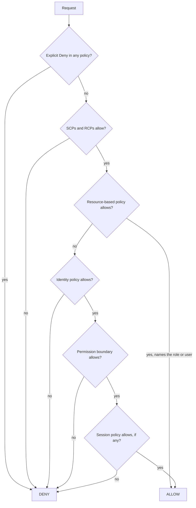

# ☁️ AWS Security — Staff-Level Interview Questions

> *8 questions covering IAM, KMS, Cognito, WAF, Secrets Manager, GuardDuty, Security Hub and multi-account security architecture. Each answer leads with the 30-second version, then the mechanism, trade-offs, failure modes and what interviewers probe next. Features and limits checked against AWS documentation, October 2026.*

---

## Table of Contents

1. [IAM: Policies, Roles, Permission Boundaries](#1-iam-policies-roles-permission-boundaries)
2. [IAM: Least Privilege at Scale](#2-iam-least-privilege-at-scale)
3. [KMS: Key Management, Encryption at Rest](#3-kms-key-management-encryption-at-rest)
4. [AWS Cognito: AuthN/AuthZ for Applications](#4-aws-cognito-authnauthz-for-applications)
5. [AWS WAF & Managed Rules](#5-aws-waf-managed-rules)
6. [Secrets Manager: Rotation & Vault Architecture](#6-secrets-manager-rotation-vault-architecture)
7. [GuardDuty & Security Hub: Threat Detection](#7-guardduty-security-hub-threat-detection)
8. [AWS Security Reference Architecture](#8-aws-security-reference-architecture)

---

## 1. IAM: Policies, Roles, Permission Boundaries

**Q:** "Design an IAM architecture for a multi-account AWS organization with 50 AWS accounts, 500 developers, and 10 CI/CD pipelines. How do IAM permission boundaries prevent privilege escalation? How does SCP differ from IAM policies? Walk through a cross-account role assumption flow."

**What They're Really Testing:** Whether you understand IAM's delegation model — the relationship between SCPs, IAM policies, and permission boundaries — and can design for least privilege at organizational scale.

### Answer

!!! tip "30-second answer"
    Humans get no IAM users: they sign in through **IAM Identity Center** (federated to the corporate IdP) and receive short-lived role sessions via permission sets per account. Pipelines use **OIDC federation** (e.g. GitHub Actions → `AssumeRoleWithWebIdentity`) into deploy roles, never stored keys. Guardrails come from the organisation: **SCPs** cap what principals in an account can do, **RCPs** (Nov 2024) cap what can be done *to* resources, neither grants anything. **Permission boundaries** cap a single role, which is what lets teams create their own roles without escalating. Evaluation starts from implicit deny; any explicit deny wins; an action is allowed only if every applicable cap allows it and some policy grants it.

**Policy evaluation (single account, simplified):**



- The default is **implicit deny**. SCPs, RCPs, boundaries and session policies only *limit*; identity and resource policies *grant*.
- **Cross-account:** both sides must allow: the caller's identity policy *and* the resource policy (or role trust policy) in the other account.
- SCPs don't affect the management account or service-linked roles. Since September 2025 SCPs support the full IAM policy language (conditions, resource ARNs, `NotResource`, `NotAction` with Allow).

**Permission boundaries for safe delegation:**

```json
{
  "Version": "2012-10-17",
  "Statement": [
    {
      "Sid": "CreateRolesOnlyWithBoundary",
      "Effect": "Allow",
      "Action": ["iam:CreateRole", "iam:PutRolePolicy", "iam:AttachRolePolicy"],
      "Resource": "arn:aws:iam::*:role/app/*",
      "Condition": {
        "StringEquals": { "iam:PermissionsBoundary": "arn:aws:iam::123456789012:policy/app-boundary" }
      }
    },
    {
      "Sid": "NoBoundaryTampering",
      "Effect": "Deny",
      "Action": ["iam:DeleteRolePermissionsBoundary", "iam:PutRolePermissionsBoundary",
                 "iam:CreatePolicyVersion", "iam:DeletePolicy", "iam:SetDefaultPolicyVersion"],
      "Resource": ["arn:aws:iam::123456789012:policy/app-boundary", "arn:aws:iam::*:role/app/*"]
    }
  ]
}
```

A role created this way can be granted `AdministratorAccess` and still only do what `app-boundary` allows. Without the condition and the tamper-deny, "can create roles" equals "is admin" (create a role with admin, assume it).

**Cross-account role assumption:**

```json
{
  "Version": "2012-10-17",
  "Statement": [{
    "Effect": "Allow",
    "Principal": { "AWS": "arn:aws:iam::111111111111:role/ci-deployer" },
    "Action": ["sts:AssumeRole", "sts:TagSession"],
    "Condition": {
      "StringEquals": { "aws:PrincipalOrgID": "o-abc123xyz" }
    }
  }]
}
```

```bash
aws sts assume-role \
  --role-arn arn:aws:iam::222222222222:role/prod-deploy \
  --role-session-name "deploy-${GITHUB_RUN_ID}" \
  --duration-seconds 3600
```

- Trust a specific role ARN, not the whole account (`:root` delegates the decision to every admin in that account).
- Third-party (SaaS) access: require an `sts:ExternalId` to prevent the confused-deputy problem.
- `aws:MultiFactorAuthPresent` works for IAM users with MFA but isn't set for federated or chained sessions; with Identity Center, enforce MFA at the IdP.
- Sessions last 15 minutes to the role's maximum (up to 12 hours); role chaining is capped at 1 hour.
- Source identity and session tags propagate who did what into CloudTrail across hops.

**What they probe next:** RCPs for "nobody outside my organisation can access my S3/KMS/SQS resources" (`aws:PrincipalOrgID` in a Deny); centralised root access management (Nov 2024: remove root credentials from member accounts); ABAC with tags vs RBAC; and escalation paths like `iam:PassRole` + `lambda:CreateFunction`.

### 🔍 Staff-Level Evaluation

| Criterion | What I'm Looking For |
|-----------|----------------------|
| **Evaluation chain** | Explains implicit deny, explicit deny wins, SCP/RCP/boundary as caps, cross-account needs both sides |
| **Permission boundaries** | Uses boundaries with `iam:PermissionsBoundary` conditions to delegate role creation safely |
| **Cross-account access** | Designs trust policies with specific principals and conditions (org ID, external ID) |
| **STS assume-role** | Understands temporary credentials, session duration limits, role chaining |

### 🎬 Animated Sequence Diagram

<p align="center">
  <video controls width="800" style="border-radius: 12px; box-shadow: 0 4px 24px rgba(0,0,0,0.3);" loop playsinline preload="metadata">
    <source src="../../../assets/videos/aws-iam-permission-boundary.mp4" type="video/mp4" />
    Your browser does not support the video tag.
  </video>
  <br/>
  <em>🎬 Animated IAM Permission Boundary Flow — policy evaluation chain: DENY always wins, boundaries cap max permissions — Click ▶ to play/pause. Created with <a href="https://remotion.dev">Remotion</a>.</em>
</p>

---

## 2. IAM: Least Privilege at Scale

**Q:** "Your team manages 200 microservices, each needing different IAM permissions. How do you implement least privilege without managing hundreds of individual IAM roles? Design a CI/CD pipeline that dynamically generates IAM roles per service. How do you audit and detect over-privileged roles?"

**What They're Really Testing:** Whether you understand IAM automation at scale — using IAM Roles Anywhere, service-linked roles, and policy simulation for auditing.

### Answer

!!! tip "30-second answer"
    One role per service is fine when it's generated: each service's IaC module declares the resources it touches, and a shared module emits a role scoped to those ARNs, with a permission boundary and naming/path conventions. Reduce the count of hand-written policies with **ABAC** (tag-based conditions such as `aws:ResourceTag/service = ${aws:PrincipalTag/service}`). Shift checks left with **IAM Access Analyzer** policy validation and custom policy checks in CI, and keep shrinking with **unused access** findings and **policy generation** from CloudTrail. Off-AWS workloads use **IAM Roles Anywhere** (X.509) instead of access keys.

**Generated per-service role (Terraform-style pseudocode):**

```hcl
module "order_service_iam" {
  source            = "./modules/service-role"
  service           = "order-service"
  runtime           = "ecs-tasks"                 # trust: ecs-tasks / lambda / pods.eks
  boundary_arn      = "arn:aws:iam::123456789012:policy/app-boundary"
  dynamodb_tables   = [aws_dynamodb_table.orders.arn, "${aws_dynamodb_table.orders.arn}/index/*"]
  sqs_send_queues   = [aws_sqs_queue.order_events.arn]
  sns_publish       = [aws_sns_topic.order_events.arn]
  # module emits narrow actions (GetItem/PutItem/Query, SendMessage, Publish) on exactly these ARNs
}
```

Logging and tracing permissions come from narrow shared policies (write to the service's own log group), not `CloudWatchLogsFullAccess`.

**ABAC to avoid per-resource policy sprawl:**

```json
{
  "Effect": "Allow",
  "Action": ["dynamodb:GetItem", "dynamodb:PutItem", "dynamodb:Query"],
  "Resource": "*",
  "Condition": {
    "StringEquals": { "aws:ResourceTag/service": "${aws:PrincipalTag/service}" }
  }
}
```

One policy serves every service, provided tags are protected (deny tag changes outside the pipeline, enforce with tag policies/SCPs). ABAC support varies by service, so check the "authorization based on tags" column per action.

**IAM Access Analyzer capabilities:**

| Capability | What it does | Where it fits |
|---|---|---|
| Policy validation | Findings typed ERROR, SECURITY_WARNING, WARNING, SUGGESTION | CI lint for every policy |
| Custom policy checks | `CheckNoNewAccess` (vs a reference), `CheckAccessNotGranted` (e.g. no `iam:PassRole` on `*`), `CheckNoPublicAccess` | CI gate on pull requests |
| External access analysis | Resources shared outside your organisation or account | Continuous, free |
| Internal access analysis (2025) | Which principals inside your organisation can reach critical resources | Continuous, paid |
| Unused access analysis | Unused roles, keys, passwords and unused actions per role | Continuous, paid; feeds clean-up |
| Policy generation | Builds a policy from CloudTrail activity for a role | Bootstrap least privilege for legacy roles |

```bash
aws accessanalyzer start-policy-generation \
  --policy-generation-details principalArn=arn:aws:iam::123456789012:role/order-service-role \
  --cloud-trail-details '{
    "trails": [{"cloudTrailArn": "arn:aws:cloudtrail:us-east-1:123456789012:trail/org-trail", "allRegions": true}],
    "accessRole": "arn:aws:iam::123456789012:role/AccessAnalyzerMonitorServiceRole",
    "startTime": "2026-07-01T00:00:00Z", "endTime": "2026-10-01T00:00:00Z"}'
```

Generated policies reflect observed behaviour, including rare paths you didn't exercise in the window (quarterly jobs, error handlers), so review before enforcing.

**IAM Roles Anywhere for on-prem workloads:**

```bash
aws rolesanywhere create-trust-anchor --name corporate-ca --enabled \
  --source 'sourceType=CERTIFICATE_BUNDLE,sourceData={x509CertificateData=-----BEGIN CERTIFICATE-----...}'
aws rolesanywhere create-profile --name on-prem-app --enabled \
  --role-arns arn:aws:iam::123456789012:role/on-prem-app-role --duration-seconds 3600

# ~/.aws/config on the server
[profile onprem]
credential_process = aws_signing_helper credential-process \
  --certificate /etc/pki/app.pem --private-key /etc/pki/app.key \
  --trust-anchor-arn arn:aws:rolesanywhere:...:trust-anchor/... \
  --profile-arn arn:aws:rolesanywhere:...:profile/... \
  --role-arn arn:aws:iam::123456789012:role/on-prem-app-role
```

Certificates come from your PKI or AWS Private CA; the role trust policy can require certificate attributes (e.g. the CN) via conditions.

### 🔍 Staff-Level Evaluation

| Criterion | What I'm Looking For |
|-----------|----------------------|
| **Per-service roles** | Generates roles from IaC declarations with boundaries, scoped to exact ARNs |
| **Access Analyzer** | Uses validation and custom checks in CI, plus CloudTrail-based policy generation |
| **Unused permissions** | Audits and removes unused permissions continuously |
| **Roles Anywhere** | Extends IAM to on-premises with certificate-based auth instead of keys |

---

## 3. KMS: Key Management, Encryption at Rest

**Q:** "Design a KMS key hierarchy for a PCI-DSS compliant application. You need envelope encryption for data at rest in S3, EBS, and RDS. How does KMS key rotation work? How do you manage cross-account access to KMS keys? What is the difference between AWS managed keys and customer managed keys?"

**What They're Really Testing:** Whether you understand KMS's key hierarchy — KMS key, data key, envelope encryption — and the operational aspects of key management for compliance.

### Answer

!!! tip "30-second answer"
    A **KMS key** (formerly "CMK") never leaves KMS's FIPS 140-3 validated HSMs; services call `GenerateDataKey` to get a **data key** in plaintext and encrypted form, encrypt locally with the plaintext key, discard it, and store the encrypted key next to the ciphertext (**envelope encryption**). Use **customer managed keys** for PCI: you control the key policy, grants, rotation and deletion, and every use is in CloudTrail. Automatic rotation keeps the same key ID and keeps old key material for decryption, so nothing needs re-encrypting; the period is configurable from **90 to 2,560 days**, and you can also rotate **on demand**. Cross-account use needs both the key policy and the caller's IAM policy, and works only with customer managed keys.

**Envelope encryption:**

```
KMS key (in HSM)  ──encrypts──►  data key (AES-256)  ──encrypts──►  your data
                                   │
                                   └─ stored encrypted alongside the data;
                                      plaintext copy discarded after use
```

```python
import boto3

kms = boto3.client("kms")
KEY = "alias/payments-prod"
ctx = {"service": "payment", "env": "prod"}          # encryption context: bound to the ciphertext

dk = kms.generate_data_key(KeyId=KEY, KeySpec="AES_256", EncryptionContext=ctx)
plaintext_key, encrypted_key = dk["Plaintext"], dk["CiphertextBlob"]
# encrypt locally (AES-GCM), store encrypted_key with the ciphertext, then drop plaintext_key

plaintext_key = kms.decrypt(CiphertextBlob=encrypted_key, EncryptionContext=ctx)["Plaintext"]
```

- Use the **AWS Encryption SDK** rather than hand-rolling this; it handles data key caching, framing and context.
- `Encrypt` directly with a KMS key is limited to 4 KB of plaintext; that's for small secrets, not data.
- KMS has per-Region request quotas for cryptographic operations (thousands to tens of thousands per second depending on the Region). High-volume S3 use needs **S3 Bucket Keys**, which cut KMS calls by up to 99%.

### 🎬 Animated Sequence Diagram

<p align="center">
  <video controls width="800" style="border-radius: 12px; box-shadow: 0 4px 24px rgba(0,0,0,0.3);" loop playsinline preload="metadata">
    <source src="../../../assets/videos/aws-kms-envelope-encryption.mp4" type="video/mp4" />
    Your browser does not support the video tag.
  </video>
  <br/>
  <em>🎬 Animated KMS Envelope Encryption — KMS key encrypts data key, data key encrypts data, encrypted data key stored alongside ciphertext — Click ▶ to play/pause. Created with <a href="https://remotion.dev">Remotion</a>.</em>
</p>

**Key hierarchy for PCI:** a key per environment × data classification × service owner (e.g. `prod/pci/payments`), in the account that owns the data, with key administrators separated from key users (dual control). Too few keys means a blast radius you can't revoke selectively; too many means policy sprawl. Multi-Region keys only where you need to decrypt the same ciphertext in another Region (DR, global tables).

**Rotation:**

| | What happens | Re-encrypt data? |
|---|---|---|
| Automatic rotation (customer managed) | New key material every N days (90–2,560, default 365); key ID, ARN and policy unchanged; old material kept for decrypting | No |
| On-demand rotation (2024) | Same mechanism, triggered now (limited number per key) | No |
| Manual rotation | New key, repoint the alias, re-encrypt if policy requires retiring the old key | Only if you must stop using old material |
| AWS managed keys | Rotated automatically every year | No |
| Imported key material / asymmetric / HMAC keys | No automatic rotation; rotate manually | Depends |

```python
kms.enable_key_rotation(KeyId=key_id, RotationPeriodInDays=180)
kms.rotate_key_on_demand(KeyId=key_id)
```

PCI DSS asks you to define a cryptoperiod and rotate at its end; automatic rotation satisfies that for keys KMS generates. Re-encrypting S3 data in bulk (S3 Batch Operations copy in place with the new key) is only needed when you retire a key entirely.

**Deletion:** scheduled with a 7–30 day waiting period, cancellable until then; afterwards every ciphertext under that key is unrecoverable. Prefer *disabling* keys, alarm on `ScheduleKeyDeletion` in CloudTrail, and deny it via SCP except for a break-glass role.

**Cross-account access:**

```json
{
  "Sid": "AllowPaymentsAppInAccountB",
  "Effect": "Allow",
  "Principal": { "AWS": "arn:aws:iam::222222222222:role/payments-app" },
  "Action": ["kms:Decrypt", "kms:GenerateDataKey"],
  "Resource": "*",
  "Condition": {
    "StringEquals": {
      "kms:EncryptionContext:service": "payment",
      "kms:ViaService": "s3.us-east-1.amazonaws.com"
    }
  }
}
```

The role in account B also needs an IAM policy allowing those actions on the key's **ARN** (aliases don't work across accounts). `kms:ViaService` restricts use to calls made through a specific service; encryption-context conditions bind the key to a purpose, and the context appears in CloudTrail for audit.

**AWS managed vs customer managed keys:**

| | AWS managed (`aws/s3`, `aws/ebs`, ...) | Customer managed |
|---|---|---|
| Key policy | Viewable, not editable | Yours |
| Cross-account use | No | Yes |
| Rotation | Yearly, automatic | Configurable, on demand |
| Disable/delete | No | Yes |
| Cost | No monthly fee (requests charged) | $1/month per key (rotations add up to $2/month more) + $0.03 per 10,000 requests |

For maximum control: **external key store** (keys in your own HSM outside AWS) or CloudHSM-backed custom key stores, at the cost of availability you now own.

### 🔍 Staff-Level Evaluation

| Criterion | What I'm Looking For |
|-----------|----------------------|
| **Envelope encryption** | Explains KMS key encrypts data key, data key encrypts data, encrypted data key stored with data |
| **Key rotation** | Knows rotation keeps key ID and old material, no re-encryption, configurable periods |
| **Cross-account** | Configures key policy + IAM policy, with encryption context and ViaService conditions |
| **Managed vs customer** | Chooses customer managed for compliance (policy control, cross-account, deletion control) |

---

## 4. AWS Cognito: AuthN/AuthZ for Applications

**Q:** "Design an authentication system for a B2B SaaS platform with multi-tenancy. Users belong to organizations, each with role-based access. How does Cognito User Pools handle user registration, MFA, and federation? How do you map Cognito groups to IAM roles for fine-grained authorization?"

**What They're Really Testing:** Whether you understand Cognito's architecture — user pools vs identity pools, group-based authorization, and federation with external identity providers.

### Answer

!!! tip "30-second answer"
    A **user pool** is the OIDC identity provider: sign-up, sign-in, MFA, federation to customers' SAML/OIDC IdPs, and JWTs (ID, access, refresh). An **identity pool** exchanges those tokens for temporary AWS credentials, and is only needed when clients call AWS services directly. For B2B multi-tenancy, put the **tenant ID in the token** (an immutable attribute set at onboarding, or a claim added by the **pre token generation** trigger), authorise every request against it in the API layer, and keep fine-grained permissions in your app or **Amazon Verified Permissions** (Cedar) rather than in hundreds of Cognito groups. Choose the feature plan deliberately: **Lite, Essentials (default) or Plus** (Nov 2024) determines whether you get managed login, passkeys, access-token customisation and threat protection.

**User pools vs identity pools:**

| | User pool | Identity pool |
|---|---|---|
| Output | JWTs for your APIs | Temporary AWS credentials (STS) |
| Features | Directory, MFA (TOTP, SMS, email), passwordless (passkeys, email/SMS OTP on Essentials+), federation, Lambda triggers, managed login UI | Role mapping by token claims, guest access |
| Typical use | Web/mobile apps calling API Gateway/ALB/your services | Mobile clients uploading to S3 or reading DynamoDB directly |

```
User → User pool (authenticate; SAML/OIDC federation to the customer IdP) → JWTs
JWT  → API Gateway (Cognito authorizer) / ALB / service validates signature, aud, exp, tenant claim
JWT  → Identity pool (optional) → STS credentials scoped by role mapping → S3/DynamoDB
```

### 🎬 Animated Sequence Diagram

<p align="center">
  <video controls width="800" style="border-radius: 12px; box-shadow: 0 4px 24px rgba(0,0,0,0.3);" loop playsinline preload="metadata">
    <source src="../../../assets/videos/aws-cognito-auth-flow.mp4" type="video/mp4" />
    Your browser does not support the video tag.
  </video>
  <br/>
  <em>🎬 Animated Cognito Authentication & Authorization Flow — User Pool → JWT → Identity Pool → AWS credentials → Resources — Click ▶ to play/pause. Created with <a href="https://remotion.dev">Remotion</a>.</em>
</p>

**Multi-tenant models:**

| Model | Isolation | Trade-offs |
|---|---|---|
| Pool per tenant | Strong; per-tenant password/MFA policy and IdP | Quotas (user pools per account), routing users to the right pool, per-pool ops |
| App client per tenant | Medium; per-tenant IdP and callback URLs | Client quotas; shared directory |
| **Shared pool + tenant claim** (most common) | Logical; enforced by your app | Simplest; app must check the tenant claim on every request |

- Store `custom:tenant_id` as **immutable** (set once at creation) or in your own tenant directory, so users can't change their own tenant. Remember app clients can be configured with write access to custom attributes; restrict it.
- Roles: small fixed set of groups (`admin`, `member`) plus tenant in the token, not `tenant-123-admin` groups for every tenant (group quotas and token bloat).
- Fine-grained authorisation: Verified Permissions with Cedar policies, or ABAC via identity pools (principal tags from claims → `aws:PrincipalTag/tenant_id` conditions) for direct AWS access, e.g. S3 prefixes per tenant.

**Federation:** each enterprise customer gets a SAML or OIDC IdP on the pool, with attribute mapping (email, name, groups) and IdP identifiers so users are routed by email domain. Federated users are created on first sign-in. SAML `memberOf` maps to a custom attribute; translate it into app roles in your pre-token trigger rather than trusting raw IdP group names.

**Triggers, done right:**

```python
import boto3

cognito = boto3.client("cognito-idp")

def pre_sign_up(event, context):
    """PreSignUp: reject unknown domains. It can auto-confirm, but can't set attributes."""
    email = event["request"]["userAttributes"]["email"]
    if lookup_tenant_by_domain(email.split("@")[1]) is None:
        raise Exception("Unknown organization")
    return event

def post_confirmation(event, context):
    """PostConfirmation: persist the tenant link and default role."""
    email = event["request"]["userAttributes"]["email"]
    tenant_id = lookup_tenant_by_domain(email.split("@")[1])
    cognito.admin_update_user_attributes(
        UserPoolId=event["userPoolId"], Username=event["userName"],
        UserAttributes=[{"Name": "custom:tenant_id", "Value": tenant_id}],
    )
    cognito.admin_add_user_to_group(
        UserPoolId=event["userPoolId"], Username=event["userName"], GroupName="member"
    )
    return event

def pre_token_generation(event, context):
    """PreTokenGeneration V2 (Essentials/Plus): add claims to ID and access tokens."""
    tenant_id = event["request"]["userAttributes"].get("custom:tenant_id")
    event["response"]["claimsAndScopeOverrideDetails"] = {
        "idTokenGeneration":     {"claimsToAddOrOverride": {"tenant_id": tenant_id}},
        "accessTokenGeneration": {"claimsToAddOrOverride": {"tenant_id": tenant_id}},
    }
    return event
```

Don't auto-confirm or auto-verify email just because the domain matches: that lets anyone register `ceo@customer.com` without proving they own it.

**What they probe next:** token lifetimes and revocation (refresh token revocation, short access tokens), machine-to-machine auth (client credentials grant, priced per token request), and Cognito's limits vs a dedicated CIAM product.

### 🔍 Staff-Level Evaluation

| Criterion | What I'm Looking For |
|-----------|----------------------|
| **Pool vs identity** | Distinguishes user directory (user pool) from AWS credential exchange (identity pool) |
| **Multi-tenancy** | Puts an immutable tenant claim in tokens and enforces it on every request |
| **SAML federation** | Maps enterprise SAML assertions to attributes and app roles |
| **Lambda triggers** | Uses the right trigger for each job (pre sign-up, post confirmation, pre token generation) |

---

## 5. AWS WAF & Managed Rules

**Q:** "Design a WAF strategy for a global web application. Compare the AWS WAF managed rule groups (Core rule set, SQL injection, XSS, etc.). How do you tune WAF rules to minimize false positives? How do you use WAF logs for security analytics?"

**What They're Really Testing:** Whether you understand WAF rule evaluation, managed rule group tuning, and the operational challenge of balancing security with user experience.

### Answer

!!! tip "30-second answer"
    One web ACL on CloudFront (plus regional ACLs for anything not behind it), rules in priority order: allow-lists, IP reputation, rate limits, then managed rule groups (Core rule set, Known bad inputs, SQLi, plus language/OS sets matching your stack), Bot Control and fraud rule groups where needed. Deploy every new group in **Count**, study the logs, then fix false positives with **scope-down statements** and **rule action overrides** for the specific noisy rules, not by excluding whole paths. Log to S3 or CloudWatch Logs and query with Athena or Logs Insights. Managed rule groups cost WCUs; a web ACL's base capacity is 1,500 WCUs.

**Managed rule groups worth knowing:**

| Group | Purpose | Notes |
|---|---|---|
| `AWSManagedRulesCommonRuleSet` | OWASP-style generic protections (XSS, LFI/RFI, size limits, EC2 metadata SSRF) | `SizeRestrictions_BODY` (8 KB) is the classic false positive for uploads/large JSON |
| `AWSManagedRulesKnownBadInputsRuleSet` | Known exploit patterns (e.g. Log4j, Java deserialization) | Low false-positive rate; block early |
| `AWSManagedRulesSQLiRuleSet` | SQL injection | Inspects body, query, URI, cookies |
| `AWSManagedRulesAmazonIpReputationList` / `AnonymousIpList` | Known-bad IPs, VPNs/Tor/hosting providers | Anonymous list can hurt legitimate privacy users |
| OS / language sets (Linux, Unix, Windows, PHP, WordPress) | Stack-specific | Enable only what you run |
| Bot Control (COMMON / TARGETED) | Bot detection and management | Paid per request; use labels to act per path |
| ATP / ACFP | Credential stuffing on login; fake account creation | You configure the login/registration path and field names; works on CloudFront, ALB, API Gateway |
| Anti-DDoS rule group (2025) | Detects and mitigates L7 floods from traffic baselines | Complements rate-based rules |

**Tuning without throwing away protection:**

```json
{
  "Name": "AWS-CommonRuleSet",
  "Priority": 30,
  "OverrideAction": { "None": {} },
  "Statement": {
    "ManagedRuleGroupStatement": {
      "VendorName": "AWS",
      "Name": "AWSManagedRulesCommonRuleSet",
      "RuleActionOverrides": [
        { "Name": "SizeRestrictions_BODY", "ActionToUse": { "Count": {} } }
      ],
      "ScopeDownStatement": {
        "NotStatement": { "Statement": { "ByteMatchStatement": {
          "SearchString": "/webhooks/stripe",
          "FieldToMatch": { "UriPath": {} },
          "PositionalConstraint": "STARTS_WITH",
          "TextTransformations": [{ "Priority": 0, "Type": "NONE" }]
        } } }
      }
    }
  },
  "VisibilityConfig": { "SampledRequestsEnabled": true, "CloudWatchMetricsEnabled": true, "MetricName": "CRS" }
}
```

- `RuleActionOverrides` set one noisy rule to Count while the rest keep blocking; the counted rule still adds a **label** (`awswaf:managed:aws:core-rule-set:SizeRestrictions_Body`), so a follow-up custom rule can block oversized bodies everywhere *except* the upload endpoint.
- `ScopeDownStatement` exempts a narrow path (a signed webhook) from the whole group.
- Process: Count for one to two weeks → review top-matching rules and sample requests → override/scope → Block, one group at a time, highest-confidence groups first. Use version pinning on managed groups and test new versions in Count.

**Logging and analytics:**

```python
wafv2.put_logging_configuration(LoggingConfiguration={
    "ResourceArn": web_acl_arn,
    "LogDestinationConfigs": ["arn:aws:firehose:us-east-1:123456789012:deliverystream/aws-waf-logs-prod"],
    "RedactedFields": [{"SingleHeader": {"Name": "authorization"}}],
})
```

Destinations are CloudWatch Logs, S3 or Data Firehose, and their names must start with `aws-waf-logs-`. Logging filters can keep only BLOCK/COUNT records to cut cost.

```sql
-- Top terminating rules and clients blocked in the last day (Athena over WAF logs)
SELECT terminatingruleid, httprequest.clientip, httprequest.country, COUNT(*) AS requests
FROM waf_logs
WHERE action = 'BLOCK' AND from_unixtime(timestamp / 1000) > now() - interval '1' day
GROUP BY 1, 2, 3
ORDER BY requests DESC
LIMIT 50;

-- Rules that only COUNT today: candidates to promote or tune
SELECT r.ruleid, COUNT(*) AS matches, COUNT(DISTINCT httprequest.clientip) AS ips
FROM waf_logs
CROSS JOIN UNNEST(rulegrouplist) AS t(rg)
CROSS JOIN UNNEST(rg.nonterminatingmatchingrules) AS t2(r)
WHERE r.action = 'COUNT'
GROUP BY 1
ORDER BY matches DESC;
```

**What they probe next:** WAF on CloudFront vs ALB (edge blocks before you pay origin costs), body inspection limits (WAF inspects only the first 8 KB of a body on ALB; 16 KB by default on CloudFront and API Gateway, configurable up to 64 KB at extra cost) and the "oversize handling" setting, and centrally managing web ACLs across accounts with **Firewall Manager**.

### 🔍 Staff-Level Evaluation

| Criterion | What I'm Looking For |
|-----------|----------------------|
| **Rule groups** | Knows which AWS managed rule groups to enable for the stack and in what order |
| **Tuning methodology** | Count → analyse → rule action overrides / scope-down → Block |
| **False positives** | Uses labels and narrow exemptions rather than disabling groups |
| **Security analytics** | Queries WAF logs (Athena/Logs Insights) for attack patterns and tuning |

### 🎬 Animated Sequence Diagram

<p align="center">
  <video controls width="800" style="border-radius: 12px; box-shadow: 0 4px 24px rgba(0,0,0,0.3);" loop playsinline preload="metadata">
    <source src="../../../assets/videos/aws-waf-managed-rules.mp4" type="video/mp4" />
    Your browser does not support the video tag.
  </video>
  <br/>
  <em>🎬 Animated AWS WAF Managed Rules & Rate Limiting — Core Rule Set, SQLi/XSS detection, rate-based rules, and multi-layer DDoS defense — Click ▶ to play/pause. Created with <a href="https://remotion.dev">Remotion</a>.</em>
</p>

---

## 6. Secrets Manager: Rotation & Vault Architecture

**Q:** "Design a secrets management strategy for 500 microservices. Each service needs database credentials, API keys, and TLS certificates. How does AWS Secrets Manager handle automatic rotation? Compare Secrets Manager vs Parameter Store vs Vault. How do you audit secret access?"

**What They're Really Testing:** Whether you understand secrets management at scale — rotation strategies, caching vs direct access, and integration with IAM for access control.

### Answer

!!! tip "30-second answer"
    First, remove secrets you don't need: IAM auth for RDS/Aurora and RDS Proxy, IAM roles for AWS APIs, ACM for TLS certificates (public certs auto-renew; private certs via AWS Private CA). For what's left, use **Secrets Manager**: one secret per service per environment, encrypted with a customer managed KMS key, resource policies plus ABAC so a service can read only its own secrets, rotation on a schedule (as often as every 4 hours) using **managed rotation** for RDS/Redshift/DocumentDB or a rotation Lambda for others. Services cache secrets (Secrets Manager Agent, Lambda extension or caching client) and refresh on authentication failure. Audit with CloudTrail `GetSecretValue` events.

**Rotation mechanics:** every secret version carries staging labels: `AWSCURRENT`, `AWSPENDING`, `AWSPREVIOUS`. A rotation runs four steps:

| Step | Action |
|---|---|
| `createSecret` | Generate a new credential, store it as `AWSPENDING` |
| `setSecret` | Apply it in the target system (e.g. `ALTER USER ... PASSWORD`) |
| `testSecret` | Log in with the pending version |
| `finishSecret` | Move `AWSCURRENT` to the new version (the old one becomes `AWSPREVIOUS`) |

```python
import json
import boto3

sm = boto3.client("secretsmanager")

def lambda_handler(event, context):
    arn, token, step = event["SecretId"], event["ClientRequestToken"], event["Step"]

    if step == "createSecret":
        current = json.loads(sm.get_secret_value(SecretId=arn, VersionStage="AWSCURRENT")["SecretString"])
        try:
            sm.get_secret_value(SecretId=arn, VersionId=token, VersionStage="AWSPENDING")
        except sm.exceptions.ResourceNotFoundException:      # idempotent: only create once
            pwd = sm.get_random_password(PasswordLength=32, ExcludeCharacters="/@\"'\\")["RandomPassword"]
            sm.put_secret_value(SecretId=arn, ClientRequestToken=token,
                                SecretString=json.dumps({**current, "password": pwd}),
                                VersionStages=["AWSPENDING"])

    elif step == "setSecret":
        pending = json.loads(sm.get_secret_value(SecretId=arn, VersionId=token,
                                                 VersionStage="AWSPENDING")["SecretString"])
        set_db_password(pending)                  # ALTER USER app_user PASSWORD ... via an admin secret

    elif step == "testSecret":
        pending = json.loads(sm.get_secret_value(SecretId=arn, VersionId=token,
                                                 VersionStage="AWSPENDING")["SecretString"])
        test_login(pending)                       # raise on failure → rotation stops, CURRENT unchanged

    elif step == "finishSecret":
        meta = sm.describe_secret(SecretId=arn)
        current_version = next(v for v, stages in meta["VersionIdsToStages"].items() if "AWSCURRENT" in stages)
        if current_version != token:
            sm.update_secret_version_stage(SecretId=arn, VersionStage="AWSCURRENT",
                                           MoveToVersionId=token, RemoveFromVersionId=current_version)
```

- **Single-user** rotation changes the password in place; apps with a cached old password fail until they refresh. **Alternating-users** rotation keeps two DB users and flips between them, so the previous credential still works during the transition.
- For RDS, the simplest option is letting RDS manage the master password in Secrets Manager (managed rotation, no Lambda).
- Rotation Lambdas need network access to both the database and the Secrets Manager endpoint (VPC endpoint in private subnets).

**Secrets Manager vs Parameter Store vs Vault:**

| | Secrets Manager | SSM Parameter Store | HashiCorp Vault |
|---|---|---|---|
| Rotation | Built in (managed or Lambda) | None | Dynamic secrets (per-lease credentials) |
| Cross-Region | Replica secrets | No | Enterprise replication |
| Size | 64 KB | 4 KB standard, 8 KB advanced | Configurable |
| Price | $0.40 per secret-month + $0.05 per 10,000 calls | Standard free (10,000 params); advanced $0.05 per param-month | Self-run or HCP pricing; operational cost |
| Best for | Credentials that rotate, cross-account sharing | Config, feature flags, non-rotating values (`SecureString` with KMS) | Multi-cloud, dynamic DB creds, PKI, existing Vault estates |

**Caching:**

```python
import time
import json

class SecretCache:
    def __init__(self, client, ttl_seconds=300):
        self.client, self.ttl, self.cache = client, ttl_seconds, {}

    def get(self, name):
        hit = self.cache.get(name)
        if hit and time.monotonic() < hit[1]:
            return hit[0]
        value = json.loads(self.client.get_secret_value(SecretId=name)["SecretString"])
        self.cache[name] = (value, time.monotonic() + self.ttl)
        return value

    def refresh(self, name):            # call when the DB rejects the cached credential
        self.cache.pop(name, None)
        return self.get(name)
```

500 services × 12 calls an hour ≈ 144,000 calls a day ≈ $0.72/day; the cost is trivial. The real reasons to cache are latency, API throttling during mass restarts, and availability. Off the shelf: the **AWS Secrets Manager Agent** (local HTTP cache, 2024), the Parameters and Secrets Lambda extension, the ECS/EKS secret injection (env vars at task start, refreshed only on restart; the Secrets Store CSI driver can sync on EKS).

**Audit and detection:** CloudTrail logs every `GetSecretValue` with the caller; alert on access from unexpected roles, on `DeleteSecret`/`PutResourcePolicy`, and on secrets that haven't rotated (Security Hub control, Config rule `secretsmanager-rotation-enabled-check`). Secrets Manager can block resource policies that grant broad access (`BlockPublicPolicy`).

### 🔍 Staff-Level Evaluation

| Criterion | What I'm Looking For |
|-----------|----------------------|
| **Rotation mechanism** | Explains the four steps, staging labels, single vs alternating users |
| **Service comparison** | Compares Secrets Manager vs Parameter Store vs Vault on features, not just price |
| **Caching** | Caches secrets with refresh-on-auth-failure, explains why (latency, throttling) |
| **Monitoring** | Uses CloudTrail and Config/Security Hub to audit access and rotation |

### 🎬 Animated Sequence Diagram

<p align="center">
  <video controls width="800" style="border-radius: 12px; box-shadow: 0 4px 24px rgba(0,0,0,0.3);" loop playsinline preload="metadata">
    <source src="../../../assets/videos/aws-secrets-manager.mp4" type="video/mp4" />
    Your browser does not support the video tag.
  </video>
  <br/>
  <em>🎬 Animated Secrets Manager Rotation & Vault Architecture — KMS envelope encryption, Lambda-based rotation, cross-account access, and secret caching — Click ▶ to play/pause. Created with <a href="https://remotion.dev">Remotion</a>.</em>
</p>

---

## 7. GuardDuty & Security Hub: Threat Detection

**Q:** "Your CISO wants a centralized security monitoring platform across 50 AWS accounts. Design a multi-account GuardDuty and Security Hub architecture. How does GuardDuty detect threats? How do you prioritize and automate remediation of security findings?"

**What They're Really Testing:** Whether you understand AWS security services at organizational scale — delegated administrators, cross-account aggregation, and automated remediation workflows.

### Answer

!!! tip "30-second answer"
    Make a dedicated security-tooling account the **delegated administrator** for GuardDuty, Security Hub, Inspector, Macie, Detective and Access Analyzer, auto-enable them for every current and future account in every Region, and aggregate findings to one home Region. **GuardDuty** analyses CloudTrail, VPC flow logs and DNS logs (no need to enable them yourself) plus optional protection plans (S3, EKS, Runtime Monitoring, Malware Protection, RDS, Lambda), using threat intel and anomaly models; **Extended Threat Detection** (Dec 2024) correlates signals into multi-stage *attack sequence* findings rated Critical. **Security Hub** (re-launched as a unified console in Dec 2025, with the posture checks now called **Security Hub CSPM**) correlates threats, vulnerabilities and misconfigurations into exposure findings. Route findings through EventBridge: auto-remediate the unambiguous ones, ticket and page for the rest.

**Architecture:**

```
Organization
├── Management account          (enables delegated admin; nothing else runs here)
├── Security tooling account    ← delegated admin: GuardDuty, Security Hub (+CSPM), Inspector,
│                                  Macie, Detective, Access Analyzer; home-Region aggregation;
│                                  EventBridge rules → Step Functions/Lambda, SNS, ticketing
├── Log archive account         ← org CloudTrail, Config, flow logs, Security Lake (OCSF)
└── Workload accounts (50 × Regions): detectors auto-enabled, findings flow to the admin
```

### 🎬 Animated Sequence Diagram

<p align="center">
  <video controls width="800" style="border-radius: 12px; box-shadow: 0 4px 24px rgba(0,0,0,0.3);" loop playsinline preload="metadata">
    <source src="../../../assets/videos/aws-guardduty-multi-account.mp4" type="video/mp4" />
    Your browser does not support the video tag.
  </video>
  <br/>
  <em>🎬 Animated GuardDuty Multi-Account Threat Detection — 50 member accounts report to delegated admin with auto-remediation — Click ▶ to play/pause. Created with <a href="https://remotion.dev">Remotion</a>.</em>
</p>

Enable GuardDuty in **every** Region, including ones you don't use: attackers with stolen keys mine crypto in Regions nobody watches. (Or block unused Regions with an SCP, and still monitor.)

**Example GuardDuty finding types:**

| Tactic | Finding type |
|---|---|
| Reconnaissance | `Recon:EC2/Portscan`, `Recon:IAMUser/TorIPCaller` |
| Compromised instance | `CryptoCurrency:EC2/BitcoinTool.B`, `Backdoor:EC2/C&CActivity.B`, `Behavior:EC2/NetworkPortUnusual` |
| Credential misuse | `UnauthorizedAccess:IAMUser/InstanceCredentialExfiltration.OutsideAWS`, `Policy:IAMUser/RootCredentialUsage` |
| Defense evasion | `Stealth:IAMUser/CloudTrailLoggingDisabled` |
| Data access | `Exfiltration:S3/AnomalousBehavior`, `Exfiltration:S3/MaliciousIPCaller` |
| Multi-stage | `AttackSequence:IAM/CompromisedCredentials`, `AttackSequence:S3/CompromisedData` |

**Automated remediation (EC2 isolation):**

```python
import boto3

ec2 = boto3.client("ec2")
asg = boto3.client("autoscaling")

def isolate_instance(instance_id: str, finding_id: str) -> None:
    inst = ec2.describe_instances(InstanceIds=[instance_id])["Reservations"][0]["Instances"][0]

    # 1. Stop the ASG from replacing/terminating it (keeps evidence)
    for tag in inst.get("Tags", []):
        if tag["Key"] == "aws:autoscaling:groupName":
            asg.detach_instances(InstanceIds=[instance_id], AutoScalingGroupName=tag["Value"],
                                 ShouldDecrementDesiredCapacity=False)
    ec2.modify_instance_attribute(InstanceId=instance_id, DisableApiTermination={"Value": True})

    # 2. Quarantine security group: no inbound rules, egress revoked
    sg = ec2.create_security_group(GroupName=f"quarantine-{instance_id}",
                                   Description=f"Quarantine for {finding_id}", VpcId=inst["VpcId"])
    ec2.revoke_security_group_egress(GroupId=sg["GroupId"],
                                     IpPermissions=[{"IpProtocol": "-1", "IpRanges": [{"CidrIp": "0.0.0.0/0"}]}])
    ec2.modify_instance_attribute(InstanceId=instance_id, Groups=[sg["GroupId"]])

    # 3. Preserve evidence
    ec2.create_snapshots(InstanceSpecification={"InstanceId": instance_id},
                         TagSpecifications=[{"ResourceType": "snapshot",
                                             "Tags": [{"Key": "forensic-finding", "Value": finding_id}]}])
```

Caveats a staff engineer should raise: changing security groups does **not** cut already-tracked connections, so isolation may also need a NACL deny on the subnet or stopping the instance; capture memory (via SSM) before stopping if forensics matter; revoke the instance role's sessions (`aws:TokenIssueTime` deny policy) because stolen credentials keep working elsewhere; and run the whole flow as an auditable Step Functions workflow rather than one Lambda. The AWS **Automated Forensic Orchestrator** and Security Hub automation rules are reference starting points.

**Prioritisation:**

- Severity: GuardDuty uses Low / Medium / High / Critical (Critical for attack sequences). Security Hub normalises to INFORMATIONAL → CRITICAL.
- Context: production vs sandbox (account tags), data sensitivity (Macie classification), internet exposure (Security Hub exposure findings, Inspector network reachability).
- Workflow states: NEW → NOTIFIED → RESOLVED or SUPPRESSED. Use **suppression rules** (GuardDuty filters with auto-archive) for known-benign patterns, e.g. a vulnerability scanner's port scans from a tagged instance, never for root credential usage.
- Measure mean time to detect and respond, and the share of findings closed by automation.

### 🔍 Staff-Level Evaluation

| Criterion | What I'm Looking For |
|-----------|----------------------|
| **Multi-account architecture** | Uses delegated admin in a security account, auto-enable, all Regions |
| **Threat detection** | Explains GuardDuty data sources, protection plans, attack sequences |
| **Auto-remediation** | Isolates safely, preserves evidence, revokes credentials, knows SG tracking caveat |
| **Prioritization** | Triages findings by severity, resource criticality, exposure and attack chain |

---

## 8. AWS Security Reference Architecture

**Q:** "Design a complete security architecture for a new AWS organization with 10 accounts. Cover: identity management, network security, data protection, monitoring, and incident response. How do you implement the principle of least privilege at the organizational level?"

**What They're Really Testing:** Whether you can design a comprehensive security architecture covering all aspects of AWS security — from governance (SCPs) to detective controls (GuardDuty) to data protection (KMS).

### Answer

!!! tip "30-second answer"
    Follow the AWS Security Reference Architecture: start from **Control Tower** (or an equivalent landing zone) for the account structure, organisation CloudTrail, Config and guardrails. Accounts are the primary blast-radius boundary: security tooling and log archive accounts separate from workloads, prod separate from non-prod. Identity flows through IAM Identity Center; root credentials are removed from member accounts. Preventive controls are SCPs (what principals can do), RCPs (who can touch your resources), declarative policies (e.g. block public AMI sharing, enforce IMDSv2) and permission boundaries. Detective controls are GuardDuty, Security Hub, Config, Inspector, Macie and Access Analyzer, aggregated in the security account. Data protection is KMS everywhere, Block Public Access, and backups vaulted in a separate account.

**Organisation structure:**

```
Root
├── Security OU
│   ├── Security tooling (delegated admin for security services, IR roles)
│   └── Log archive (org CloudTrail, Config, flow logs; Object Lock, tight bucket policies)
├── Infrastructure OU
│   ├── Network (Transit Gateway / Cloud WAN, inspection VPC, egress, DNS, Direct Connect)
│   └── Shared services (CI/CD, artifact repos, directory services)
├── Workloads OU
│   ├── Prod OU (prod accounts)
│   └── Non-prod OU (dev, staging)
├── Sandbox OU (individual experimentation; budget alerts, no connectivity to corporate network)
└── Suspended OU (closing accounts; deny-all SCP)
```

IAM Identity Center is administered from the management account or a delegated admin account; the management account itself runs no workloads.

**SCP examples (deny-list style, with break-glass exemptions):**

```json
{
  "Version": "2012-10-17",
  "Statement": [
    {
      "Sid": "ProtectSecurityTooling",
      "Effect": "Deny",
      "Action": [
        "cloudtrail:StopLogging", "cloudtrail:DeleteTrail", "cloudtrail:UpdateTrail",
        "guardduty:DeleteDetector", "guardduty:DisassociateFromAdministratorAccount",
        "config:StopConfigurationRecorder", "config:DeleteConfigurationRecorder",
        "securityhub:DisableSecurityHub", "ec2:DeleteFlowLogs",
        "s3:PutAccountPublicAccessBlock", "kms:ScheduleKeyDeletion"
      ],
      "Resource": "*",
      "Condition": { "ArnNotLike": { "aws:PrincipalArn": "arn:aws:iam::*:role/BreakGlass" } }
    },
    {
      "Sid": "NoIAMUsersOrKeys",
      "Effect": "Deny",
      "Action": ["iam:CreateUser", "iam:CreateAccessKey"],
      "Resource": "*"
    },
    {
      "Sid": "ApprovedRegionsOnly",
      "Effect": "Deny",
      "NotAction": ["iam:*", "organizations:*", "sts:*", "support:*", "cloudfront:*",
                    "route53:*", "budgets:*", "waf:*", "wafv2:*", "health:*"],
      "Resource": "*",
      "Condition": { "StringNotEquals": { "aws:RequestedRegion": ["us-east-1", "eu-west-1"] } }
    }
  ]
}
```

- Allow-listing services per OU uses a Deny with `NotAction` (deny everything except the approved list), not a Deny on the services you want.
- Don't write a blanket "deny unless `aws:MultiFactorAuthPresent`" SCP: it breaks AWS service roles, federated sessions and automation. Enforce MFA at the IdP / Identity Center.
- Test SCPs in a non-prod OU first; a bad SCP can lock everyone out of every account below it.

**RCP example (data perimeter):**

```json
{
  "Version": "2012-10-17",
  "Statement": [{
    "Sid": "OnlyMyOrgCanAccessMyBuckets",
    "Effect": "Deny",
    "Principal": "*",
    "Action": "s3:*",
    "Resource": "*",
    "Condition": {
      "StringNotEqualsIfExists": { "aws:PrincipalOrgID": "o-abc123xyz" },
      "BoolIfExists": { "aws:PrincipalIsAWSService": "false" }
    }
  }]
}
```

Together with VPC endpoint policies (`aws:ResourceOrgID`) and SCPs, this forms a **data perimeter**: trusted identities, accessing trusted resources, from expected networks.

**Network security:** hub-and-spoke via Transit Gateway with an inspection VPC (AWS Network Firewall) for east-west and egress; centralised egress so NAT and filtering live in one place; interface endpoints for AWS APIs; WAF + Shield on internet entry points; no direct internet access in data subnets; VPC Block Public Access as a guardrail; flow logs to the log archive.

**Data protection:** customer managed KMS keys per data classification; S3 Block Public Access at the account level (and organisation-level policies); Macie for discovering sensitive data; AWS Backup with cross-account, cross-Region copies into a **logically air-gapped vault** with vault lock for ransomware resilience.

**Monitoring and response:**

| Layer | Service |
|---|---|
| Audit | Organisation CloudTrail (management events everywhere, data events for sensitive S3/Lambda/DynamoDB), CloudTrail Lake or Security Lake for queries |
| Configuration | Config with conformance packs; Security Hub CSPM standards (AWS Foundational Security Best Practices, CIS) |
| Threats | GuardDuty (all protection plans that match your workloads), Detective for investigation |
| Vulnerabilities | Inspector for EC2, ECR images, Lambda; code scanning |
| Response | Pre-provisioned IR roles in every account, runbooks (SSM documents/Step Functions), game days |

**Incident response tiers:**

- *Automated:* public S3 bucket → re-enable Block Public Access; exposed access key (AWS Health / `AWSCompromisedKeyQuarantine` policy applied by AWS) → deactivate key, revoke sessions; crypto mining → isolate instance.
- *Playbook:* compromised role → deny sessions issued before now (`aws:TokenIssueTime`), rotate, investigate in CloudTrail Lake/Detective; ransomware → isolate, restore from air-gapped backups.
- *Escalation:* data exfiltration, regulated data exposure → legal/compliance, AWS Customer Incident Response Team (CIRT) via support.

### 🔍 Staff-Level Evaluation

| Criterion | What I'm Looking For |
|-----------|----------------------|
| **Organization structure** | Separates duties via OU and account structure (security, log archive, network, workloads) |
| **SCP guardrails** | Writes correct deny-list SCPs with break-glass, uses RCPs for data perimeters, avoids lock-out designs |
| **Defense in depth** | Applies controls at every layer: identity, network, data, detection, backup |
| **Incident response** | Designs tiered response (automated → playbook → escalation) with pre-provisioned access |

---

> *All 8 questions cover the full breadth of AWS security — from IAM architecture and KMS key management to multi-account threat detection and automated remediation.*
