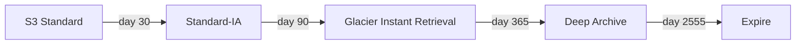
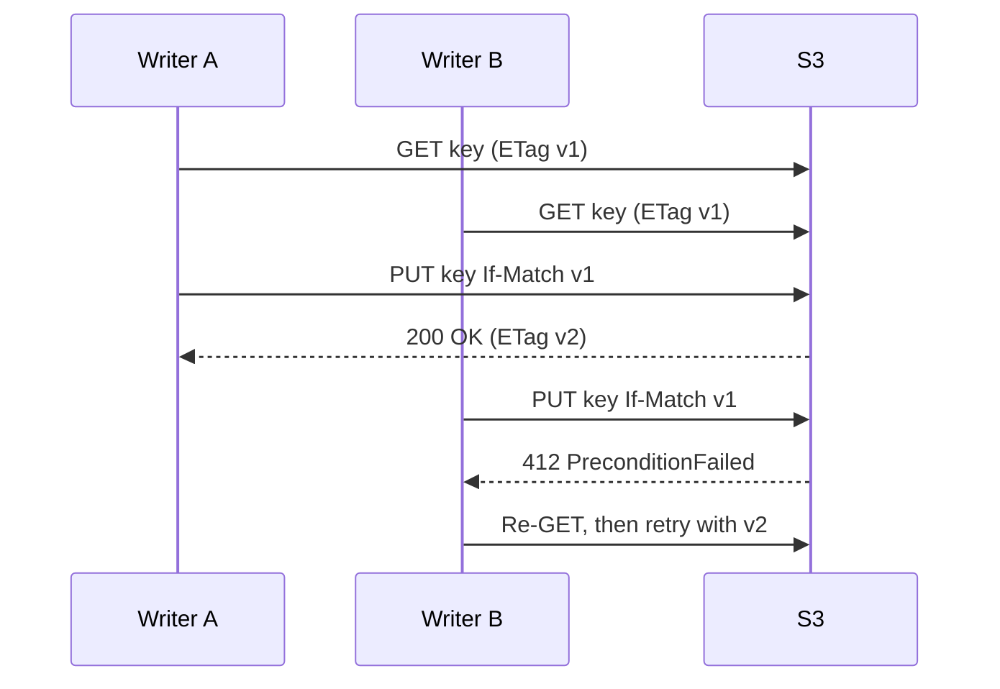
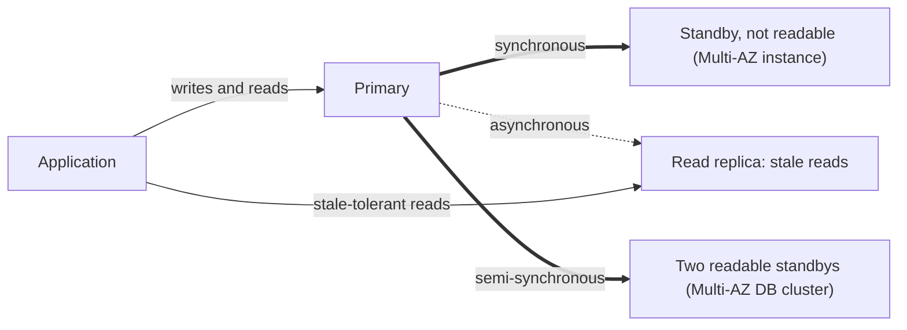
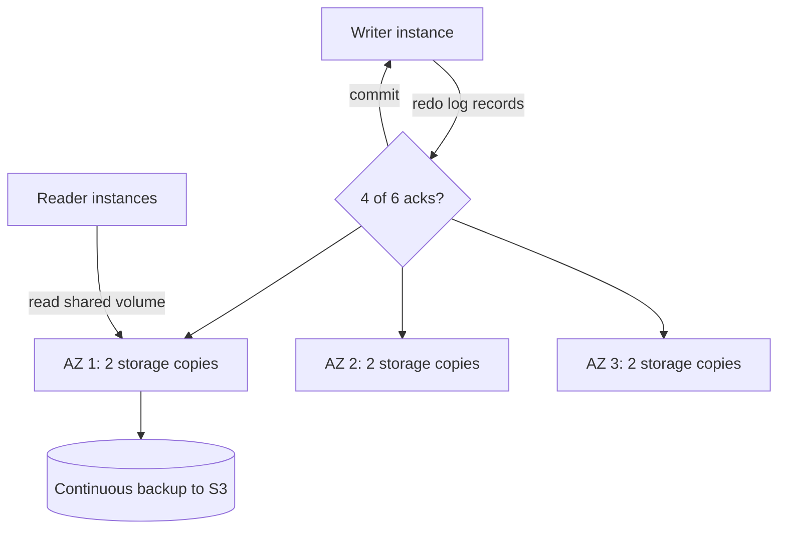
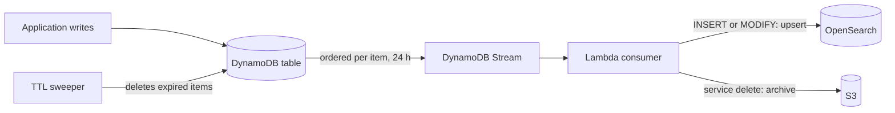
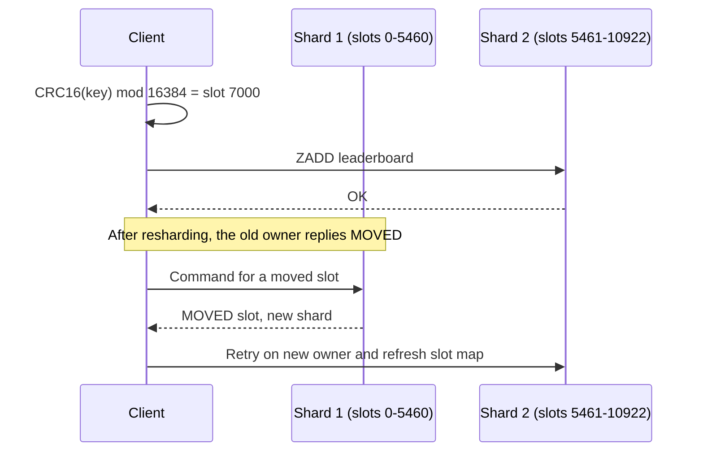
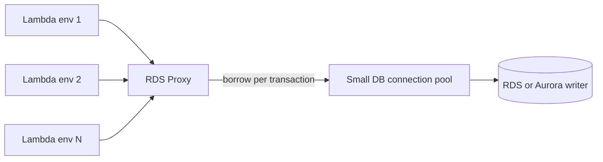
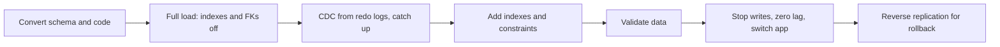

# ☁️ AWS Storage & Database — Staff-Level Interview Questions

> *10 questions covering S3, RDS, Aurora, DynamoDB, ElastiCache/MemoryDB, RDS Proxy, DMS and archival. Each answer leads with the 30-second version, then the mechanism, trade-offs, failure modes and what interviewers probe next. Prices are us-east-1 list prices; limits and features checked against AWS documentation, October 2026.*

---

## Table of Contents

1. [S3: Storage Classes, Lifecycle, Performance](#1-s3-storage-classes-lifecycle-performance)
2. [S3: Data Consistency, Versioning, Replication](#2-s3-data-consistency-versioning-replication)
3. [RDS: Multi-AZ, Read Replicas, Performance Insights](#3-rds-multi-az-read-replicas-performance-insights)
4. [Aurora: Architecture, Storage, Serverless v2](#4-aurora-architecture-storage-serverless-v2)
5. [DynamoDB: Data Modeling, Partitioning, Hot Keys](#5-dynamodb-data-modeling-partitioning-hot-keys)
6. [DynamoDB: DAX, TTL, Streams, Global Tables](#6-dynamodb-dax-ttl-streams-global-tables)
7. [ElastiCache: Redis Cluster, Replication, Persistence](#7-elasticache-redis-cluster-replication-persistence)
8. [RDS Proxy & Connection Pooling](#8-rds-proxy-connection-pooling)
9. [Database Migration: DMS & Schema Conversion](#9-database-migration-dms-schema-conversion)
10. [S3 Glacier & Archival Strategies](#10-s3-glacier-archival-strategies)

---

## 1. S3: Storage Classes, Lifecycle, Performance

**Q:** "Design a data lake architecture storing 500TB of data with mixed access patterns: hot data (accessed daily), warm data (accessed monthly), cold data (accessed quarterly), and archive data (regulatory compliance, accessed <1%/year). How do S3 storage classes and lifecycle policies optimize cost? What are the performance limits of S3 for 10K PUTs/second?"

**What They're Really Testing:** Whether you understand S3's storage class economics and the performance characteristics of S3 at scale — including the impact of partition allocation on throughput.

### Answer

!!! tip "30-second answer"
    Match class to access frequency, but remember the hidden terms: minimum storage durations (30/90/180 days), minimum billable object sizes (128 KB for IA classes), per-GB retrieval fees, and per-object transition and monitoring charges. Use lifecycle rules where access is predictable by age, **Intelligent-Tiering** where it isn't. S3 supports at least **3,500 writes and 5,500 reads per second per prefix**, and scales by splitting busy prefixes automatically, so 10K PUT/s needs the keys spread over several prefixes and a ramp-up (or retries on `503 SlowDown`) while S3 repartitions. For a data lake, store columnar files (Parquet) in **S3 Tables** (managed Iceberg) or a self-managed Iceberg catalog rather than millions of small JSON objects.

**Storage classes:**

| Class | $/GB-month | Min duration | Min billable size | Retrieval | Use |
|---|---|---|---|---|---|
| S3 Standard | 0.023 | — | — | Free, ms | Hot data |
| S3 Express One Zone | Higher per GB, cheaper requests | — | — | Single-digit ms, one AZ, directory buckets | Latency-critical scratch, ML training, query engines |
| Intelligent-Tiering | 0.023 → 0.0125 → 0.004 (auto) | — | Objects <128 KB stay in the frequent tier, unmonitored | Free | Unknown or changing access; $0.0025 per 1,000 monitored objects |
| Standard-IA | 0.0125 | 30 days | 128 KB | $0.01/GB | Monthly access |
| One Zone-IA | 0.01 | 30 days | 128 KB | $0.01/GB | Re-creatable data (single AZ) |
| Glacier Instant Retrieval | 0.004 | 90 days | 128 KB | $0.03/GB, ms | Quarterly access, needs instant reads |
| Glacier Flexible Retrieval | 0.0036 | 90 days | 40 KB overhead per object | Minutes (expedited) to 3–5 h (standard) to 5–12 h (bulk, free) | Archives with occasional restores |
| Glacier Deep Archive | 0.00099 | 180 days | 40 KB overhead per object | Within 12 h (standard), 48 h (bulk) | Compliance retention |

Durability is designed for 11 nines in every class (One Zone and Express One Zone keep data in a single AZ, so an AZ loss can lose it).

**Lifecycle rules (API class names):**

```yaml
Rules:
  - ID: raw-events
    Filter: { Prefix: "raw/" }
    Status: Enabled
    Transitions:
      - { Days: 30,  StorageClass: STANDARD_IA }
      - { Days: 90,  StorageClass: GLACIER_IR }     # Glacier Instant Retrieval
      - { Days: 365, StorageClass: DEEP_ARCHIVE }
    Expiration: { Days: 2555 }                      # ~7 years
  - ID: unpredictable
    Filter: { Prefix: "curated/" }
    Status: Enabled
    Transitions:
      - { Days: 0, StorageClass: INTELLIGENT_TIERING }
  - ID: cleanup-multipart
    Filter: { Prefix: "" }
    Status: Enabled
    AbortIncompleteMultipartUpload: { DaysAfterInitiation: 7 }
```

*The raw/ lifecycle rule above: objects age down through storage classes and finally expire.*




- Lifecycle transitions cost a per-object request fee, and since September 2024 objects smaller than 128 KB are not transitioned by default. Millions of tiny objects can cost more to transition than to keep; compact them first.
- Moving from IA to Glacier at day 31 is fine; deleting from Glacier IR before day 90 bills the remaining days.
- Measure before choosing: **S3 Storage Lens** and **Storage Class Analysis** show actual access patterns per prefix.

**Performance at 10K PUT/s:**

```
s3://lake/events/dt=2026-10-07/hour=13/part-<uuid>.parquet       # one prefix → ~3,500 PUT/s at first
s3://lake/events/shard=07/dt=2026-10-07/hour=13/part-<uuid>.parquet   # 16 shards → room for ~56K PUT/s
```

- A "prefix" is any leading key string S3 chooses to partition on; random hashing of key names hasn't been necessary since 2018, but you still need *distinct* prefixes to get multiple partitions' worth of throughput.
- S3 scales a hot prefix up over minutes; during that window it returns `503 SlowDown`. SDKs retry with backoff; for a launch, ramp traffic or pre-spread keys.
- Large objects: multipart upload (5 MiB–5 GiB parts, up to 10,000 parts) and byte-range GETs in parallel; use the AWS CRT-based transfer manager. Maximum object size is **50 TB** since December 2025 (was 5 TB).
- **Transfer Acceleration** speeds long-distance uploads over CloudFront edges ($0.04/GB extra, charged only when it's faster).
- Request costs matter at this rate: 10K PUT/s ≈ 26 billion PUTs a month ≈ $130K/month at $0.005 per 1,000. Batch small records into bigger objects (Firehose, or buffering in the writer) before storing them.

**What they probe next:** small-file problem for Athena/Spark (target 128 MB–1 GB files; Iceberg compaction or S3 Tables automatic compaction), S3 Metadata tables for querying object metadata, S3 Vectors for low-cost vector storage, and whether your hot tier should be S3 at all.

### 🔍 Staff-Level Evaluation

| Criterion | What I'm Looking For |
|-----------|----------------------|
| **Storage class economics** | Quantifies cost difference including min duration, min size, retrieval and request fees |
| **Performance limits** | Knows 3,500 PUT / 5,500 GET per prefix, gradual scaling and 503 SlowDown |
| **Lifecycle rules** | Applies transitions at appropriate intervals, includes expiration and multipart cleanup |
| **Multipart upload** | Uses parallel parts for large objects, knows part and object size limits |

### 🎬 Animated Sequence Diagram

<p align="center">
  <video controls width="800" style="border-radius: 12px; box-shadow: 0 4px 24px rgba(0,0,0,0.3);" loop playsinline preload="metadata">
    <source src="../../../assets/videos/aws-s3-lifecycle.mp4" type="video/mp4" />
    Your browser does not support the video tag.
  </video>
  <br/>
  <em>🎬 Animated S3 Storage Classes & Lifecycle Management — Standard → IA → Glacier → Deep Archive with automated tiering saves 80%+ — Click ▶ to play/pause. Created with <a href="https://remotion.dev">Remotion</a>.</em>
</p>

---

## 2. S3: Data Consistency, Versioning, Replication

**Q:** "You're designing a system that writes objects to S3 and immediately reads them. Users report seeing stale data. Explain S3's read-after-write consistency model for new objects vs overwrite PUTs. How does S3 versioning prevent data loss? Design cross-region replication with RTO < 15 minutes."

**What They're Really Testing:** Whether you understand S3's consistency guarantees — strong consistency for PUTs of new objects (since Dec 2020) and the nuances of eventual consistency for other operations.

### Answer

!!! tip "30-second answer"
    Since December 2020, S3 is **strongly consistent** for every object operation: GET, HEAD and **LIST** after a PUT (new or overwrite) or DELETE all see the latest state, at no extra cost. So "stale data" today comes from somewhere else: a CDN or client cache, a read from a *replica* bucket, or two writers racing (S3 is last-writer-wins). Fix races with **conditional writes**: `If-None-Match: *` (create only if absent, Aug 2024) and `If-Match: <ETag>` (compare-and-swap, Nov 2024). Versioning keeps every overwrite and turns deletes into delete markers. Replication is asynchronous; **Replication Time Control** gives an SLA of 99.99% of objects within 15 minutes, which is your RPO, not your RTO.

**What is and isn't strongly consistent:**

| Operation | Consistency |
|---|---|
| PUT/DELETE then GET, HEAD, LIST in the same bucket | Strong |
| Object tags, ACLs, metadata changes | Strong |
| Bucket configuration (policy, versioning, lifecycle, CORS) | Eventually consistent; can take minutes |
| Reads from a replicated destination bucket | Eventually consistent (async replication) |
| Two concurrent PUTs to the same key | Last writer wins; no locking unless you use conditional writes |

**Conditional writes, the building block for safe concurrency:**

```python
import boto3
from botocore.exceptions import ClientError

s3 = boto3.client("s3")

def put_if_absent(bucket, key, body):
    try:
        s3.put_object(Bucket=bucket, Key=key, Body=body, IfNoneMatch="*")
        return True
    except ClientError as e:
        if e.response["Error"]["Code"] in ("PreconditionFailed", "ConditionalRequestConflict"):
            return False          # someone else created it first
        raise

def compare_and_swap(bucket, key, new_body, expected_etag):
    s3.put_object(Bucket=bucket, Key=key, Body=new_body, IfMatch=expected_etag)
```

*Compare-and-swap on S3: the second writer's stale ETag fails the conditional PUT, so it must re-read and retry.*




This is what lets table formats and simple "leader lease" or manifest files work on S3 without an external lock service. Bucket policies can require conditional writes (`s3:if-none-match` / `s3:if-match` condition keys).

### 🎬 Animated Sequence Diagram

<p align="center">
  <video controls width="800" style="border-radius: 12px; box-shadow: 0 4px 24px rgba(0,0,0,0.3);" loop playsinline preload="metadata">
    <source src="../../../assets/videos/aws-s3-consistency.mp4" type="video/mp4" />
    Your browser does not support the video tag.
  </video>
  <br/>
  <em>🎬 Animated S3 Strong Consistency Model — read-after-write and strong deletes. Note: since December 2020 LIST is strongly consistent too; only bucket configuration changes and cross-bucket replication are eventual — Click ▶ to play/pause. Created with <a href="https://remotion.dev">Remotion</a>.</em>
</p>

**Versioning:**

- States: unversioned → enabled → suspended (can never return to unversioned).
- DELETE without a version ID adds a **delete marker**; the data is still there and you can restore by deleting the marker. DELETE with a version ID removes that version permanently.
- Cost control: `NoncurrentVersionExpiration` (e.g. keep 30 days or the last N versions) and `ExpiredObjectDeleteMarker` cleanup, or a versioned bucket quietly doubles in size.
- Stronger protection: **S3 Object Lock** (WORM, governance or compliance mode, legal holds) and MFA Delete (root user, CLI only). For ransomware resilience, also replicate to a separate account with its own Object Lock.

**Cross-Region Replication with RTC:**

```yaml
ReplicationConfiguration:
  Role: arn:aws:iam::123456789012:role/s3-crr-role
  Rules:
    - ID: crr-critical
      Status: Enabled
      Priority: 1
      Filter: { Prefix: "critical-data/" }
      DeleteMarkerReplication: { Status: Enabled }
      SourceSelectionCriteria:
        SseKmsEncryptedObjects: { Status: Enabled }
      Destination:
        Bucket: arn:aws:s3:::dr-bucket-us-west-2
        Account: "210987654321"                     # separate DR account
        AccessControlTranslation: { Owner: Destination }
        EncryptionConfiguration:
          ReplicaKmsKeyID: arn:aws:kms:us-west-2:210987654321:key/...   # required for SSE-KMS objects
        ReplicationTime: { Status: Enabled, Time: { Minutes: 15 } }
        Metrics:         { Status: Enabled, EventThreshold: { Minutes: 15 } }
```

- Requires versioning on both buckets. Only **new** objects replicate; use **S3 Batch Replication** to backfill existing ones or retry failures.
- Without RTC most objects replicate within minutes but there's no bound; some take hours. RTC adds a per-GB fee and the SLA.
- Monitor `ReplicationLatency`, `BytesPendingReplication`, `OperationsPendingReplication`, `OperationsFailedReplication`, and subscribe to `s3:Replication:OperationMissedThreshold` events.
- Deletes of specific versions are never replicated (by design, protecting the DR copy from malicious deletes).
- **RTO** comes from how fast clients switch buckets: use an **S3 Multi-Region Access Point** with failover controls (active/passive routing you can flip in about a minute) or app-level config, and test it.

**S3 Batch Operations:** run one operation over billions of objects from an S3 Inventory or CSV manifest: copy, replicate, invoke Lambda, restore from Glacier, set tags/Object Lock, with a completion report. Use it for re-encryption, storage class changes and backfills.

### 🔍 Staff-Level Evaluation

| Criterion | What I'm Looking For |
|-----------|----------------------|
| **Consistency model** | Knows object reads and LIST are strongly consistent since Dec 2020; config and replicas are eventual |
| **Concurrency** | Uses conditional writes (If-None-Match / If-Match) for races |
| **CRR with RTC** | Configures S3 RTC for a 15-minute replication SLA and separates RPO from RTO |
| **Delete marker replication** | Replicates delete markers deliberately and protects the DR copy |

---

## 3. RDS: Multi-AZ, Read Replicas, Performance Insights

**Q:** "Your PostgreSQL database is experiencing performance degradation during peak hours (10K TPS). Queries are taking 5-10 seconds during spikes. Design an RDS scaling strategy using Multi-AZ, read replicas, and Performance Insights. How do you identify the bottleneck queries? When does Multi-AZ not help with read performance?"

**What They're Really Testing:** Whether you understand the operational differences between Multi-AZ (HA, not scaling) and read replicas (read scaling, not HA) — and how to use Performance Insights to identify bottlenecks.

### Answer

!!! tip "30-second answer"
    Diagnose before scaling: look at database load by **wait event** and **top SQL** (Performance Insights, now surfaced through **CloudWatch Database Insights**), plus `pg_stat_statements`. 5–10 s spikes are usually a missing index, lock contention, connection storms or I/O limits, and none of those are fixed by adding replicas. Classic **Multi-AZ instance** deployments are for availability only (the standby isn't readable). A **Multi-AZ DB cluster** has two *readable* standbys and faster failover. Read replicas scale reads asynchronously, so they serve stale data and don't help writes.

**Deployment options:**

| | Multi-AZ instance | Multi-AZ DB cluster | Read replica |
|---|---|---|---|
| Purpose | HA | HA + some read scaling | Read scaling, DR (cross-Region) |
| Replication | Synchronous block-level to one standby | Semi-synchronous to two readable standbys | Asynchronous (engine-native) |
| Readable standby | No | Yes (reader endpoint) | Yes |
| Failover | Automatic, typically 60–120 s | Automatic, typically under 35 s | Manual promotion |
| Write latency cost | Small | Small (commit waits for one standby) | None on primary |

Multi-AZ doesn't help read performance with the instance deployment, and no option helps a write bottleneck: that needs query/index work, a bigger instance, batching, Aurora, or partitioning/sharding.

*Multi-AZ gives availability with an unreadable standby, replicas give asynchronous read scaling, and a Multi-AZ DB cluster does both partly.*




**Using wait events (PostgreSQL names):**

| Dominant wait | Usually means | Fix |
|---|---|---|
| `CPU` | Expensive plans, too many concurrent queries | Indexes, plan fixes, bigger instance |
| `IO:DataFileRead` | Working set doesn't fit in memory, sequential scans | Indexes, more RAM, Optimized Reads (local NVMe) |
| `IO:WALWrite`, `IO:XactSync` | Commit-heavy, tiny transactions | Batch commits, gp3/io2 IOPS, Optimized Writes (MySQL) |
| `Lock:transactionid`, `Lock:tuple` | Row contention (hot rows, long transactions) | Shorter transactions, avoid hot counters, `SKIP LOCKED` queues |
| `LWLock:*` | Internal contention (buffer mapping, lock manager with many partitions) | Fewer connections, partition pruning |
| `Client:ClientRead` | App holding transactions open | Fix the app; idle-in-transaction timeouts |

Rule of thumb: when database load (average active sessions) exceeds the vCPU count, sessions are queueing. Performance Insights' own console reached end of life on July 31, 2026; the same data lives on in CloudWatch Database Insights (Standard and Advanced modes) and the PI API.

**A plausible plan for the 10K TPS case:**

1. Fix the top 3 SQL by load (indexes, rewrite N+1s); usually the biggest win.
2. Put **RDS Proxy** (or PgBouncer) in front if connection count spikes with traffic (see Q8).
3. Move read-only, staleness-tolerant traffic (reports, search) to replicas or a Multi-AZ DB cluster's reader endpoint; keep read-your-writes paths on the primary.
4. Right-size storage: gp3 with provisioned IOPS/throughput or io2 Block Express; check `ReadIOPS`/`WriteIOPS` against limits.
5. If writes are still the bottleneck: Aurora, partitioning, or sharding by tenant.

**Operational features worth knowing:** **Blue/Green Deployments** for major-version upgrades and schema changes with a switchover usually under a minute; **RDS Extended Support** (paid) when you can't upgrade off an end-of-life major version in time; and storage autoscaling.

### 🔍 Staff-Level Evaluation

| Criterion | What I'm Looking For |
|-----------|----------------------|
| **Multi-AZ vs replicas** | Distinguishes HA (Multi-AZ) from read scaling (replicas) and knows Multi-AZ DB clusters have readable standbys |
| **Performance Insights** | Uses real wait events and top SQL to diagnose bottlenecks |
| **Connection pooling** | Uses RDS Proxy or PgBouncer for connection storms |
| **Scaling strategy** | Fixes queries first, then replicas for reads, then architecture for writes |

### 🎬 Animated Sequence Diagram

<p align="center">
  <video controls width="800" style="border-radius: 12px; box-shadow: 0 4px 24px rgba(0,0,0,0.3);" loop playsinline preload="metadata">
    <source src="../../../assets/videos/aws-rds-multi-az.mp4" type="video/mp4" />
    Your browser does not support the video tag.
  </video>
  <br/>
  <em>🎬 Animated RDS Multi-AZ & Read Replicas — synchronous standby for HA, async cross-region replicas for read scaling, and auto-failover — Click ▶ to play/pause. Created with <a href="https://remotion.dev">Remotion</a>.</em>
</p>

---

## 4. Aurora: Architecture, Storage, Serverless v2

**Q:** "Design a database architecture for a global SaaS application requiring: 99.99% availability, <10ms write latency in-region, <100ms cross-region read latency, and automatic scaling from 100 to 100K transactions per second. How does Aurora's distributed storage layer work? Compare Aurora Serverless v2 vs provisioned."

**What They're Really Testing:** Whether you understand Aurora's architecture at the storage layer — the 6-replica quorum, log-structured storage, and how the cluster volume enables fast cloning and replication.

### Answer

!!! tip "30-second answer"
    Aurora separates compute from a shared, log-structured storage volume: the writer sends only **redo log records** to six storage copies across three AZs and commits when **4 of 6** acknowledge; storage nodes materialise pages themselves. That's why replicas share storage (lag typically under 100 ms), crash recovery doesn't replay a long log, and clones and backups are cheap. **Serverless v2** scales the same instances in fine-grained ACU steps (down to 0 with auto-pause); **provisioned** is cheaper for steady load. **Global Database** gives cross-Region reads with typically sub-second lag. If you need multi-Region *writes* with strong consistency, look at **Aurora DSQL**; for write scale beyond one instance, **Aurora PostgreSQL Limitless Database**.

**Storage architecture:**

```
writer ─────── redo log records ───────► 6 storage copies (2 per AZ × 3 AZs)
readers ◄──── page cache invalidations      write quorum 4/6, read quorum 3/6 (used for repair)
                                            10 GiB protection groups, repaired in parallel
                                            continuous backup to S3 (PITR), up to 256 TiB
```

*Aurora separates compute from a shared storage volume; the writer ships redo records and commits at 4 of 6 acknowledgements.*




- Survives loss of an entire AZ plus one more node for reads (AZ+1), and an AZ for writes.
- Normal reads go to the one storage node known to be current; quorum reads only happen during recovery.
- The Aurora paper (SIGMOD 2017) reports far fewer I/Os per transaction than mirrored MySQL because only log records cross the network; don't quote a fixed multiplier for your workload.
- Storage limit is 256 TiB on supported versions (raised from 128 TiB in July 2025).

**Storage pricing models:** Aurora Standard ($0.10/GB-month + $0.20 per million I/Os) vs **Aurora I/O-Optimized** (~$0.225/GB-month, higher instance price, no I/O charges). Switch to I/O-Optimized when I/O exceeds roughly 25% of the Aurora bill.

**Serverless v2 vs provisioned:**

| | Provisioned | Serverless v2 |
|---|---|---|
| Capacity | Fixed instance class | 0 (auto-pause) or 0.5 up to 256 ACU, in 0.5 ACU steps; 1 ACU ≈ 2 GiB RAM with matching CPU/network |
| Scaling | Change class (failover to a resized reader, brief interruption) | In place, seconds, without dropping connections |
| Auto-pause | No | Since Nov 2024: scales to 0 ACU after a configurable idle period; resume takes seconds (around 15 s), so not for latency-critical prod |
| Price | Instance-hours (RIs available) | ~$0.12 per ACU-hour (Standard storage config) |
| Best for | Steady, predictable load | Spiky, dev/test, multi-tenant fleets, unknown load |

You can mix both in one cluster (provisioned writer, Serverless v2 readers, or the reverse). Size the minimum ACU so the buffer cache isn't evicted at night; scaling up from a cold, tiny instance is slower and the cache needs re-warming.

**Meeting the stated requirements:**

- 99.99%: writer plus at least one reader in another AZ (failover typically ~30 s, faster with RDS Proxy or the AWS JDBC/Python wrappers that track topology).
- <10 ms in-Region writes: normal for Aurora; commit latency is a cross-AZ quorum write.
- <100 ms cross-Region reads: **Aurora Global Database**: one primary Region plus up to **10 secondary Regions** (since May 2025), storage-level replication with typically sub-second lag, **write forwarding** from secondaries, a global writer endpoint, managed **switchover** (planned, RPO 0) and **failover** (unplanned, RPO = replication lag).
- 100 → 100K TPS: reads scale with up to 15 replicas; writes scale vertically on one writer. If 100K TPS is mostly writes, consider **Aurora PostgreSQL Limitless Database** (transparent sharding with routers and shards, Serverless-based) or DynamoDB.

**Aurora DSQL (GA May 2025):** serverless, PostgreSQL-compatible, distributed SQL with active-active multi-Region strong consistency (optimistic concurrency; transactions can fail on conflict and must be retried). Trade-offs: a subset of PostgreSQL (no foreign keys, limited extensions, transaction size limits). Pick it for multi-Region active-active SQL; pick Aurora for full PostgreSQL/MySQL compatibility.

### 🔍 Staff-Level Evaluation

| Criterion | What I'm Looking For |
|-----------|----------------------|
| **Storage architecture** | Explains 6-copy quorum, redo-log-only writes, shared storage for replicas |
| **Serverless v2** | Understands ACU model, scaling behaviour, auto-pause trade-offs |
| **Global Database** | Designs multi-Region reads with switchover vs failover semantics |
| **Write scaling** | Knows single-writer limit and when to reach for Limitless, DSQL or DynamoDB |

### 🎬 Animated Sequence Diagram

<p align="center">
  <video controls width="800" style="border-radius: 12px; box-shadow: 0 4px 24px rgba(0,0,0,0.3);" loop playsinline preload="metadata">
    <source src="../../../assets/videos/aws-aurora-serverless.mp4" type="video/mp4" />
    Your browser does not support the video tag.
  </video>
  <br/>
  <em>🎬 Animated Aurora Serverless v2 — auto-scaling ACUs in seconds without dropping connections, shared storage with 6-copy quorum (current range: 0–256 ACU) — Click ▶ to play/pause. Created with <a href="https://remotion.dev">Remotion</a>.</em>
</p>

---

## 5. DynamoDB: Data Modeling, Partitioning, Hot Keys

> For the full walkthrough (indexes, single-table design, capacity math, bulk update/read scenarios), see the [DynamoDB Deep Dive](../../cs-interview/database-systems/DYNAMODB_DEEP_DIVE.md).

**Q:** "Design a DynamoDB table for a social media feed service: 10K writes/second (new posts), 100K reads/second (feed queries), each user has up to 1000 followers. How do you model the data for efficient access patterns? What happens when a celebrity posts and 1M followers query simultaneously? How do you prevent hot keys?"

**What They're Really Testing:** Whether you understand DynamoDB's partition mechanics — how partition key design affects throughput, and how to use access patterns to drive table design (single-table design).

### Answer

!!! tip "30-second answer"
    Start from access patterns, not entities. Each physical partition serves at most **3,000 RCU and 1,000 WCU** (and holds about 10 GB); DynamoDB splits partitions automatically, including "split for heat", but a **single partition key value** can never exceed one partition's limits. So the design goal is high-cardinality keys with even traffic. For feeds, fan out on write into per-user feed items for normal authors, and fan out on **read** for celebrities (their posts are fetched and merged at read time and cached). A celebrity's post read by 1M followers is a single hot item: put a cache (DAX or ElastiCache) in front, not more partitions.

**Partition mechanics in numbers:**

- 1 RCU = one strongly consistent read of up to 4 KB per second, or two eventually consistent reads. 1 WCU = one write of up to 1 KB.
- One hot item read with eventual consistency tops out around 6,000 reads/s (3,000 RCU × 2); everything above that throttles, regardless of table capacity.
- **Adaptive capacity** shifts throughput to hot partitions and isolates hot items onto their own partitions automatically. It fixes uneven *partitions*, not a single over-limit *key*.
- **On-demand** mode (prices cut ~50% in November 2024) absorbs spikes up to double the previous peak instantly; **warm throughput** (Nov 2024) lets you pre-warm a table or index for a known launch. You can cap on-demand spend with maximum throughput settings.

**Key design (single table):**

| Access pattern | Key condition |
|---|---|
| Get profile | `PK = USER#alice`, `SK = PROFILE` |
| Author's posts, newest first | `PK = USER#alice`, `SK begins_with POST#`, `ScanIndexForward = false` |
| Who follows Alice | `PK = USER#alice`, `SK begins_with FOLLOWER#` |
| Whom Alice follows | GSI1: `GSI1PK = FOLLOWER#bob` (inverted edge), or store a `FOLLOWING#` edge item |
| Alice's feed | `PK = FEED#alice`, `SK begins_with TS#` (Query, newest first, `Limit 50`) |

```
PK              SK                          attributes
USER#alice      PROFILE                     name, avatar, followerCount
USER#alice      POST#2026-10-07T10:30:00Z#p1 text, media
USER#alice      FOLLOWER#bob                followedAt
FEED#bob        TS#2026-10-07T10:30:00Z#p1  authorId=alice, postId=p1   (fan-out copy, TTL 30 days)
```

**Hybrid fan-out:**

```python
CELEBRITY_THRESHOLD = 10_000

def create_post(author, post):
    posts.put_item(Item=post_item(author, post))           # always store the post once
    if author.follower_count < CELEBRITY_THRESHOLD:
        # async: a Streams/SQS consumer writes FEED#<follower> items in batches of 25
        enqueue_fanout(author.id, post.id)

def get_feed(user_id, limit=50):
    items = query_feed(f"FEED#{user_id}", limit)            # pre-computed part
    for celeb_id in followed_celebrities(user_id):          # usually a short list, cached
        items += cached_recent_posts(celeb_id, limit=10)    # one hot read, served from cache
    return sorted(items, key=lambda i: i["createdAt"], reverse=True)[:limit]
```

Write math: 10K posts/s × average 200 followers = 2M feed writes/s if done synchronously. That's why fan-out is asynchronous, capped, and skipped for big accounts; feed items also get a TTL so the table doesn't grow forever.

**Hot key mitigations (pick by read vs write heat):**

```python
import random

SHARDS = 10

def increment_like_count(post_id):                 # write-hot key: shard it
    shard = random.randrange(SHARDS)
    table.update_item(
        Key={"PK": f"LIKES#{post_id}#{shard}", "SK": "COUNT"},
        UpdateExpression="ADD likeCount :one",
        ExpressionAttributeValues={":one": 1},
    )

def get_like_count(post_id):                       # read: gather all shards (BatchGetItem)
    keys = [{"PK": f"LIKES#{post_id}#{s}", "SK": "COUNT"} for s in range(SHARDS)]
    resp = dynamodb.batch_get_item(RequestItems={"social": {"Keys": keys}})
    return sum(i.get("likeCount", 0) for i in resp["Responses"]["social"])
```

- **Read-hot** (celebrity profile, viral post): cache. DAX gives microsecond reads for eventually consistent `GetItem`/`Query`; ElastiCache gives you control over TTLs and invalidation. Request coalescing in the app avoids stampedes.
- **Write-hot** (counters, a global leaderboard row): write sharding as above, or aggregate in a stream processor and write once per second.
- Use **CloudWatch Contributor Insights** for DynamoDB to see the most-accessed and most-throttled keys.

### 🔍 Staff-Level Evaluation

| Criterion | What I'm Looking For |
|-----------|----------------------|
| **Partition math** | Knows per-partition and per-key limits, and what adaptive capacity can and can't do |
| **Hot key handling** | Uses caching for read heat, write sharding for write heat, hybrid fan-out |
| **Single-table design** | Models access patterns with composite keys and GSIs |
| **Fan-out trade-off** | Explains push vs pull for different scale users, with the write math |

### 🎬 Animated Sequence Diagram

<p align="center">
  <video controls width="800" style="border-radius: 12px; box-shadow: 0 4px 24px rgba(0,0,0,0.3);" loop playsinline preload="metadata">
    <source src="../../../assets/videos/aws-dynamodb-partitioning.mp4" type="video/mp4" />
    Your browser does not support the video tag.
  </video>
  <br/>
  <em>🎬 Animated DynamoDB Partitioning & Hot Key Mitigation — hash keys, partition limits, hot key throttling, adaptive capacity, DAX, and write sharding — Click ▶ to play/pause. Created with <a href="https://remotion.dev">Remotion</a>.</em>
</p>

---

## 6. DynamoDB: DAX, TTL, Streams, Global Tables

**Q:** "You need to add a TTL-based data expiration, real-time streaming to a search index, and global replication for your DynamoDB table. How does DynamoDB TTL work? How do DynamoDB Streams enable event-driven processing? Compare Global Tables vs application-level replication."

**What They're Really Testing:** Whether you understand DynamoDB's built-in features for time-based expiration, change data capture, and multi-region replication.

### Answer

!!! tip "30-second answer"
    **TTL** is a background sweeper: set a Number attribute to an epoch-seconds expiry, and DynamoDB deletes expired items for free, *typically within a few days*, so filter expired items out of reads yourself. **Streams** give an ordered (per item) 24-hour change log; Lambda consumes it to keep OpenSearch in sync, or use the managed **zero-ETL integration** to OpenSearch Service. **Global tables** replicate across Regions: the default **MREC** mode is asynchronous (usually under a second) with last-writer-wins per item; **MRSC** mode (GA June 2025) gives multi-Region strong consistency and RPO 0 across exactly three Regions, at higher write latency and without transactions or TTL.

**TTL behaviour:**

```json
{ "PK": "SESSION#abc123", "SK": "TOKEN", "expiresAt": 1791331200 }
```

- The attribute must be a Number in epoch **seconds**; anything else is ignored.
- Expired-but-not-yet-deleted items are still returned by `GetItem`/`Query`/`Scan`: add `FilterExpression: expiresAt > :now` (or check in code).
- TTL deletes consume no write capacity in the Region where they happen; in global tables, the replicated deletes are charged in the other Regions.
- They appear in Streams as service deletions: `userIdentity = {"type": "Service", "principalId": "dynamodb.amazonaws.com"}`, which lets consumers tell expiry from a user delete (e.g. archive expired items to S3).
- Metric: `TimeToLiveDeletedItemCount`.

*DynamoDB change flow: TTL deletes and writes land in the stream, which feeds a consumer that updates search or archives expired items.*




**Streams → search index:**

```python
from boto3.dynamodb.types import TypeDeserializer

deser = TypeDeserializer()

def to_python(image):
    return {k: deser.deserialize(v) for k, v in image.items()}

def handler(event, context):
    failures = []
    for record in event["Records"]:
        try:
            keys = to_python(record["dynamodb"]["Keys"])
            doc_id = f'{keys["PK"]}|{keys["SK"]}'
            if record["eventName"] in ("INSERT", "MODIFY"):
                doc = to_python(record["dynamodb"]["NewImage"])
                opensearch.index(index="users", id=doc_id, body=doc)   # idempotent upsert
            else:  # REMOVE (including TTL expiry)
                opensearch.delete(index="users", id=doc_id, ignore=[404])
        except Exception:
            failures.append({"itemIdentifier": record["dynamodb"]["SequenceNumber"]})
            break   # stop here to keep per-item ordering; retry from this record
    return {"batchItemFailures": failures}
```

- Stream images are DynamoDB JSON (`{"S": "..."}`); deserialize before indexing.
- Records for the same item are ordered within a shard; Lambda processes shards in order, so a poison record blocks its shard. Use `ReportBatchItemFailures`, `BisectBatchOnFunctionError`, a max retry count and an on-failure destination.
- Use the item's key as the document ID so retries are idempotent.
- Alternatives: **Kinesis Data Streams for DynamoDB** (longer retention, more consumers, but no per-item ordering guarantee and possible duplicates), and the managed **DynamoDB zero-ETL integration with OpenSearch Service**.

**Global tables:**

| | MREC (default) | MRSC |
|---|---|---|
| Replication | Async, typically ≤1 s | Synchronous to at least one other Region before ack |
| Regions | Any number | Exactly 3 (three replicas, or two replicas + a witness) |
| Conflicts | Last writer wins per item; conditions are evaluated against the local Region's copy | Concurrent writes to the same item fail with `ReplicatedWriteConflictException` (retryable) |
| Strongly consistent reads | Only reflect writes made in that Region | Always latest, any Region |
| RPO | Replication lag | Zero |
| Not supported | — | Transactions, TTL, LSIs |

Availability SLA is 99.999% for global tables (99.99% single-Region). Writes bypass DAX in other Regions, so DAX caches there go stale until their TTL.

**Conflict handling in MREC:** a version check like the one below protects you within a Region, but two Regions can each pass their local check and the later write silently wins.

```python
table.update_item(
    Key={"PK": f"USER#{user_id}", "SK": "BALANCE"},
    UpdateExpression="SET balance = balance + :d, version = version + :one",
    ConditionExpression="version = :v",
    ExpressionAttributeValues={":d": delta, ":one": 1, ":v": expected_version},
    ReturnValues="UPDATED_NEW",
)
```

Practical patterns: give each item a **home Region** and route its writes there (e.g. by user's geography), design writes to be commutative or idempotent, or use MRSC for the items that must never diverge (balances, inventory). Application-level replication only makes sense when you need custom merge logic (CRDTs) or a different target store.

### 🔍 Staff-Level Evaluation

| Criterion | What I'm Looking For |
|-----------|----------------------|
| **TTL mechanics** | Knows TTL is free, delayed (days), and expired items must be filtered on read |
| **Stream processing** | Uses Streams → Lambda idempotently with ordered failure handling |
| **Global Tables** | Understands MREC last-writer-wins vs MRSC strong consistency trade-offs |
| **Conflict handling** | Knows conditional writes are Region-local under MREC; uses home-Region routing or MRSC |

---

## 7. ElastiCache: Redis Cluster, Replication, Persistence

**Q:** "Design a Redis cluster for a real-time leaderboard with 10M users and 100K score updates/second. How does Redis Cluster shard data? How do you choose between persistence options (AOF vs RDB)? Compare ElastiCache for Redis vs MemoryDB for Redis."

**What They're Really Testing:** Whether you understand Redis Cluster's hash slot partitioning, the trade-offs of Redis persistence, and when to choose MemoryDB over ElastiCache.

### Answer

!!! tip "30-second answer"
    Redis Cluster maps every key to one of **16,384 hash slots** (`CRC16(key) mod 16384`) and each shard owns a range of slots, so a **single sorted set lives on one shard**. Adding shards doesn't speed up one global leaderboard key: you either keep it on one shard (a sorted-set `ZADD` is O(log N), and one shard can often take 100K/s, but check your node size) or split it (per-region/per-bucket boards merged for the top-K). On AWS the engine choice is now **Valkey** (the open-source Redis fork; cheaper on ElastiCache) or Redis OSS. **ElastiCache** is a cache: replicas are asynchronous and failover can lose the last writes. **MemoryDB** writes to a Multi-AZ transaction log before acknowledging, so it can be the system of record, at higher write latency (single-digit ms) and cost.

**Cluster sharding:**

```
3 shards × (1 primary + 1 replica), cluster mode enabled
  shard 1: slots 0–5460        shard 2: 5461–10922        shard 3: 10923–16383

key "leaderboard:global"          → one slot → one shard (all ZADDs land there)
keys "{lb:2026-10-07}:eu", ":us"  → hash tag {…} forces the same slot, so multi-key ops work
```

*Redis Cluster routing: the client hashes the key to a slot and sends it to the owning shard, following MOVED redirects after resharding.*




- Clients cache the slot map and follow `MOVED`/`ASK` redirects during resharding.
- Multi-key commands (`ZUNIONSTORE`, `MGET`, transactions) only work when all keys share a slot; use **hash tags** to co-locate related keys deliberately (and accept they share one shard's limits).

**Leaderboard commands:**

```redis
ZADD   lb:global 1500 user:alice                 # set score (or ZINCRBY to add)
ZRANGE lb:global 0 9 REV WITHSCORES              # top 10 (ZREVRANGE is deprecated since 6.2)
ZREVRANK lb:global user:alice                    # 0-based rank
ZRANGE lb:global +inf -inf BYSCORE REV LIMIT 0 10  # by score range

# weekly board from daily boards (same hash tag so they share a slot)
ZUNIONSTORE {lb}:week41 7 {lb}:d1 {lb}:d2 {lb}:d3 {lb}:d4 {lb}:d5 {lb}:d6 {lb}:d7 AGGREGATE SUM
```

Sizing: a sorted set with 10M members uses roughly 1 GB or more (skiplist + hash overhead per member), so memory isn't the problem; the single-shard write rate and `ZUNIONSTORE` cost over millions of members are. Options at 100K updates/s: batch updates through a pipeline, coalesce frequent updates per user in the app, shard the board by user hash and compute the global top-K by merging each shard's top-K.

**Persistence (self-managed Redis/Valkey) vs what ElastiCache gives you:**

| | RDB snapshots | AOF | ElastiCache | MemoryDB |
|---|---|---|---|---|
| Mechanism | Periodic fork + dump | Append every write; fsync every second typical | In-memory replicas (async) + daily/manual snapshots to S3 | Multi-AZ durable transaction log, then memory |
| Data loss on failure | Since last snapshot | ~1 s with `everysec` | Writes not yet replicated at failover | None for acknowledged writes |
| Write latency | Sub-ms | Sub-ms (fsync in background) | Sub-ms | Single-digit ms |

ElastiCache doesn't offer AOF on current engine versions; durability there comes from replicas across AZs (Multi-AZ with automatic failover) plus snapshots. Both ElastiCache (Multi-AZ) and MemoryDB carry a 99.99% availability SLA.

**ElastiCache vs MemoryDB:**

| | ElastiCache (Valkey / Redis OSS / Memcached) | MemoryDB (Valkey / Redis OSS) |
|---|---|---|
| Role | Cache, sessions, rate limiting, pub/sub | Primary database needing Redis data structures |
| Durability | Lose recent writes on failover | Durable on ack |
| Options | Node-based clusters or **ElastiCache Serverless** (pay per GB and ECPU) | Node-based; multi-Region active-active (2024) |
| Read replicas | Up to 5 per shard | Up to 5 per shard |
| Cost | Lower (Valkey ~20% below Redis OSS on nodes) | Higher per node plus per-GB data written |

**What they probe next:** cache-aside vs write-through and how you invalidate, thundering herds on a hot key expiry (jittered TTLs, request coalescing), big keys and hot keys (`--bigkeys`, `--hotkeys`), and Redis/Valkey licensing (Redis moved to source-available licences in 2024 and added AGPL in Redis 8; AWS standardised on Valkey).

### 🔍 Staff-Level Evaluation

| Criterion | What I'm Looking For |
|-----------|----------------------|
| **Cluster sharding** | Explains hash slots, hash tags, and that one key lives on one shard |
| **Sorted sets** | Uses ZADD/ZRANGE REV for real-time leaderboard and plans for a hot key |
| **Persistence trade-offs** | Compares RDB vs AOF and knows ElastiCache relies on replicas + snapshots |
| **MemoryDB** | Knows when to choose durable MemoryDB over cache-only ElastiCache |

### 🎬 Animated Sequence Diagram

<p align="center">
  <video controls width="800" style="border-radius: 12px; box-shadow: 0 4px 24px rgba(0,0,0,0.3);" loop playsinline preload="metadata">
    <source src="../../../assets/videos/aws-elasticache-redis.mp4" type="video/mp4" />
    Your browser does not support the video tag.
  </video>
  <br/>
  <em>🎬 Animated ElastiCache Redis — cache-aside, write-through, session store patterns, Redis Cluster sharding, and ElastiCache vs MemoryDB comparison — Click ▶ to play/pause. Created with <a href="https://remotion.dev">Remotion</a>.</em>
</p>

---

## 8. RDS Proxy & Connection Pooling

**Q:** "Your serverless application uses 1000 Lambda functions that each create a new database connection on every invocation. At 100 TPS, you're hitting 'too many connections' errors. Design a connection pooling strategy using RDS Proxy. How does it handle IAM authentication vs password-based auth?"

**What They're Really Testing:** Whether you understand the connection overhead problem in serverless architectures and how RDS Proxy solves it with connection multiplexing.

### Answer

!!! tip "30-second answer"
    First stop creating a connection per invocation: open it in init code so each execution environment reuses one. Then put **RDS Proxy** between Lambda and the database: clients open cheap connections to the proxy, and the proxy multiplexes them onto a small pool of database connections, reusing a DB connection between **transactions**. That works until a session **pins** (session-level state such as `SET`, temp tables, advisory locks or, for MySQL, certain statements), which ties a client to one DB connection. Authenticate apps to the proxy with **IAM tokens**; since September 2025 the proxy can also use IAM end-to-end to the database, removing the Secrets Manager secret.

**Why connections run out:**

- Concurrency, not TPS, drives connections: 100 TPS × 0.5 s = 50 concurrent requests, but Lambda bursts and environment churn can create hundreds of short-lived connections, each a PostgreSQL backend process with several MB of memory.
- PostgreSQL's default `max_connections` on RDS is `LEAST(DBInstanceClassMemory / 9531392, 5000)`, about 1,700 on a 16 GiB instance; MySQL's is memory-based too. Raising it trades memory for connections and often makes things worse.

**RDS Proxy:**

```
Lambda environments (hundreds) ──TLS──► RDS Proxy (multi-AZ, scales itself)
                                          │  borrows a DB connection per transaction
                                          ▼
                                   DB pool (e.g. 20–50 connections) ──► RDS / Aurora writer
                                                                      (read-only endpoint → readers)
```

*RDS Proxy multiplexes many client connections onto a small database pool, borrowing one per transaction.*




- During Aurora or RDS Multi-AZ failover the proxy keeps client connections open and routes to the new writer, cutting failover time (AWS cites up to ~66% faster) and avoiding DNS caching issues.
- Pricing: per vCPU-hour of the underlying instance (or per ACU-hour for Aurora Serverless v2), with a minimum.

**Configuration (validated against the RDS API):**

```python
rds.create_db_proxy(
    DBProxyName="my-app-proxy",
    EngineFamily="POSTGRESQL",
    RoleArn="arn:aws:iam::123456789012:role/rds-proxy-role",
    DefaultAuthScheme="IAM_AUTH",          # end-to-end IAM, no Secrets Manager secret
    RequireTLS=True,
    IdleClientTimeout=1800,
    VpcSubnetIds=["subnet-a", "subnet-b", "subnet-c"],
    VpcSecurityGroupIds=["sg-proxy"],
)
rds.modify_db_proxy_target_group(
    DBProxyName="my-app-proxy",
    TargetGroupName="default",
    ConnectionPoolConfig={
        "MaxConnectionsPercent": 80,        # leave headroom for admin/migration connections
        "MaxIdleConnectionsPercent": 20,
        "ConnectionBorrowTimeout": 30,      # seconds a client waits for a pooled connection
        "SessionPinningFilters": ["EXCLUDE_VARIABLE_SETS"],   # MySQL only
        "InitQuery": "SET application_name = 'my_app'",
    },
)
```

**IAM authentication:**

```python
import boto3
import psycopg   # psycopg 3

PROXY = "my-app-proxy.proxy-abc123.us-east-1.rds.amazonaws.com"
rds = boto3.client("rds")

def connect():
    token = rds.generate_db_auth_token(DBHostname=PROXY, Port=5432,
                                       DBUsername="app_user", Region="us-east-1")
    return psycopg.connect(host=PROXY, port=5432, dbname="mydb", user="app_user",
                           password=token, sslmode="verify-full", sslrootcert="global-bundle.pem")

conn = connect()     # module scope: reused by warm invocations
```

```json
{
  "Effect": "Allow",
  "Action": "rds-db:connect",
  "Resource": "arn:aws:rds-db:us-east-1:123456789012:dbuser:prx-0123456789abcdef0/app_user"
}
```

- The token is a SigV4-signed string valid for 15 minutes, used only to *open* a connection; existing connections aren't cut when it expires.
- The resource ARN uses the **proxy's resource ID** (`prx-…`) when connecting through a proxy.
- Benefits: no passwords in config, per-function IAM roles, CloudTrail audit of who can connect. Without a proxy, direct IAM auth to the DB has a connection-rate limit (about 200 new connections/s for MySQL), another reason to pool.

**Alternatives:** PgBouncer in transaction mode (cheaper, more control, you run it), the RDS Data API for Aurora (HTTP calls, no connections at all, good for Lambda), or DynamoDB if the access pattern fits.

### 🔍 Staff-Level Evaluation

| Criterion | What I'm Looking For |
|-----------|----------------------|
| **Connection overhead** | Explains concurrency-driven connection counts and per-backend memory |
| **Multiplexing** | Explains transaction-level reuse and pinning |
| **IAM auth** | Generates auth tokens without storing passwords; knows end-to-end IAM |
| **Pool sizing** | Configures connection pool based on workload and DB capacity, leaving headroom |

---

## 9. Database Migration: DMS & Schema Conversion

**Q:** "You need to migrate a 5TB Oracle database to Aurora PostgreSQL with minimal downtime. Design the migration strategy using AWS DMS (Database Migration Service). How does CDC work? How do you handle schema conversion (Oracle-specific types)? What validation steps ensure data integrity?"

**What They're Really Testing:** Whether you understand database migration at scale — full load + CDC, schema conversion challenges, and validation strategies for zero-data-loss migration.

### Answer

!!! tip "30-second answer"
    Convert the schema first with **DMS Schema Conversion** (the managed successor to the Schema Conversion Tool), fix the code it can't convert (PL/SQL packages, `CONNECT BY`, empty-string-is-NULL semantics), and create the target schema yourself. Then run a DMS task in **full load + CDC** mode: bulk copy with secondary indexes and FKs off, CDC from Oracle redo/archive logs starting at the load's start point, then add indexes and let CDC catch up. Validate with DMS data validation plus your own aggregate checks. Cut over by stopping writes, waiting for zero CDC lag, switching the app, and keeping a reverse replication task ready for rollback. Never split live writes across both databases.

*DMS migration phases: convert schema, full load, CDC catch-up, validate, then cut over.*




**Schema and type conversion (Oracle → PostgreSQL):**

| Oracle | PostgreSQL | Watch out |
|---|---|---|
| `NUMBER(10)` | `BIGINT` (or `NUMERIC(10)`) | 10 digits overflow `INTEGER` (max 2,147,483,647) |
| `NUMBER(p,s)` / `NUMBER` | `NUMERIC(p,s)` / `NUMERIC` | Unconstrained `NUMBER` → `NUMERIC` is slow; map deliberately |
| `VARCHAR2(n)` | `VARCHAR(n)` | Oracle `n` may be bytes, Postgres is characters |
| `DATE` | `TIMESTAMP(0)` | Oracle `DATE` includes time |
| `CLOB` / `BLOB` | `TEXT` / `BYTEA` | LOB handling mode in DMS (limited vs full) affects speed |
| Sequences | Sequences or `IDENTITY` | Reset sequence values after the load |
| Synonyms | `search_path` or views | No direct equivalent |
| Packages | Schemas + functions | Package state needs redesign |
| `''` treated as NULL | `''` is not NULL | Silent logic changes in `WHERE col IS NULL` |
| `NVL`, `DECODE`, `ROWNUM`, `CONNECT BY` | `COALESCE`, `CASE`, `LIMIT`/`ROW_NUMBER()`, recursive CTE | Use the `orafce` extension sparingly |

**DMS task (created with `MigrationType: full-load-and-cdc`), task settings excerpt:**

```json
{
  "TargetMetadata": {
    "TargetSchema": "app",
    "SupportLobs": true, "LimitedSizeLobMode": true, "LobMaxSize": 64,
    "BatchApplyEnabled": true
  },
  "FullLoadSettings": { "TargetTablePrepMode": "DO_NOTHING", "MaxFullLoadSubTasks": 16, "CommitRate": 50000 },
  "ChangeProcessingTuning": { "BatchApplyTimeoutMin": 1, "BatchApplyTimeoutMax": 30 },
  "ValidationSettings": { "EnableValidation": true, "ThreadCount": 8 }
}
```

- Table mappings: selection rules (include `APP.%`, exclude `APP.TMP_%`), transformation rules (rename, lowercase), and **table-settings** with `parallel-load` (by partition or by key ranges) to split big tables across subtasks.
- Source prerequisites: ARCHIVELOG mode, supplemental logging (database and table level), retention of archive logs long enough for the full load plus catch-up. Binary Reader is usually faster than LogMiner for high change volumes.
- DMS Serverless can replace sizing a replication instance yourself; otherwise size the instance for memory (CDC transactions are cached until commit) and test on a copy.

**Timeline:** 5 TB at a sustained 500 Mbit/s takes ~22 hours for the full load; plan the network (Direct Connect) and load from a standby or snapshot-restored copy to keep load off production.

**Validation:**

- **DMS data validation** compares rows between source and target after load and during CDC, and reports mismatches per table (`awsdms_validation_failures_v1`).
- Your own checks per table or per partition: row counts, `SUM`/`MIN`/`MAX` of numeric and date columns, and counts of NULL vs empty strings, compared between engines. Hashes of concatenated rows rarely match across engines because of type formatting, so compare aggregates.
- Application-level checks: replay a read-only sample of production queries against both and diff results.

**Cutover and rollback:**

1. CDC lag near zero for days; validation clean; performance tested on the target.
2. Freeze writes (maintenance mode), wait for `CDCLatencySource`/`CDCLatencyTarget` to reach zero, run final validation.
3. Reset sequences on the target, switch the app's connection config (or the RDS Proxy target / DNS name).
4. Start a **reverse** DMS task (Aurora → Oracle) before reopening writes, so rollback doesn't lose new data.
5. Keep Oracle read-only until you're confident, then decommission.

Weighted DNS that sends some *writes* to each database creates two diverging sources of truth; only use gradual shifting for read-only traffic.

### 🔍 Staff-Level Evaluation

| Criterion | What I'm Looking For |
|----------|----------------------|
| **Schema conversion** | Anticipates Oracle→PostgreSQL type mapping issues (NUMBER, DATE, NULL, sequences) |
| **Full load + CDC** | Designs phased migration with ongoing change replication and source prerequisites |
| **Validation** | Uses DMS validation plus aggregate comparisons that survive type differences |
| **Cutover** | Plans minimal-downtime cutover with reverse replication for rollback |

---

## 10. S3 Glacier & Archival Strategies

**Q:** "Design a data archival strategy for regulatory compliance: 100TB of financial transactions that must be retained for 7 years. Access pattern: <1% of data accessed per year, but when accessed, retrieval must happen within 12 hours. Cost is the primary constraint. How do S3 Glacier and Deep Archive compare? How do you manage the retrieval process?"

**What They're Really Testing:** Whether you understand the cost trade-offs of archival storage and can design an end-to-end retrieval workflow that meets compliance requirements.

### Answer

!!! tip "30-second answer"
    **S3 Glacier Deep Archive** fits exactly: cheapest storage (~$1/TB-month), 180-day minimum, standard restores complete within 12 hours. Write objects to it directly (or after 30 days in Standard), aggregate small records into large objects first (each archived object carries ~40 KB of billing overhead), lock them with **Object Lock in compliance mode** for 7 years, and expire them by lifecycle afterwards. Restores are asynchronous: request them (individually or with **S3 Batch Operations**), get an EventBridge event when they complete, and read the temporary copy. Use the S3 storage classes; the original vault-based Amazon Glacier service stopped accepting new customers in December 2025.

**Archive classes:**

| | Glacier Instant Retrieval | Glacier Flexible Retrieval | Glacier Deep Archive |
|---|---|---|---|
| Storage $/GB-month | 0.004 | 0.0036 | 0.00099 |
| Minimum duration | 90 days | 90 days | 180 days |
| Retrieval time | Milliseconds | Expedited 1–5 min; Standard 3–5 h; Bulk 5–12 h | Standard within 12 h; Bulk within 48 h |
| Retrieval $/GB | 0.03 | Expedited 0.03; Standard 0.01; Bulk free | Standard 0.02; Bulk 0.0025 |
| Per-object overhead | 128 KB minimum billable | 40 KB (32 KB at Glacier rate + 8 KB at Standard rate) | 40 KB, same split |

**7-year storage cost for 100 TB (storage only, 84 months):**

```
S3 Standard          100,000 GB × $0.023   × 84 = $193,200
Standard-IA          100,000 GB × $0.0125  × 84 = $105,000
Glacier Instant      100,000 GB × $0.004   × 84 =  $33,600
Glacier Flexible     100,000 GB × $0.0036  × 84 =  $30,240
Deep Archive         100,000 GB × $0.00099 × 84 =   $8,316
```

Retrieving 1% a year (1 TB) from Deep Archive costs ~$20 at Standard or ~$2.50 at Bulk, negligible next to storage. The real cost risks are per-object fees: 100 TB as 1 KB records would be 100 billion objects, with transition and overhead charges that dwarf the storage bill. Pack records into daily or hourly files of 100 MB–1 GB.

**Lifecycle and retention:**

```yaml
# Bucket created with Object Lock enabled (versioning is required)
ObjectLockConfiguration:
  ObjectLockEnabled: Enabled
  Rule:
    DefaultRetention: { Mode: COMPLIANCE, Years: 7 }

LifecycleConfiguration:
  Rules:
    - ID: archive-transactions
      Filter: { Prefix: "transactions/" }
      Status: Enabled
      Transitions:
        - { Days: 30, StorageClass: DEEP_ARCHIVE }   # or upload with StorageClass=DEEP_ARCHIVE directly
      Expiration: { Days: 2585 }                     # after the 7-year retention ends
      NoncurrentVersionExpiration: { NoncurrentDays: 1 }
    - ID: cleanup-delete-markers
      Filter: { Prefix: "transactions/" }
      Status: Enabled
      Expiration: { ExpiredObjectDeleteMarker: true }   # can't be combined with Days in one rule
```

- **Compliance mode**: nobody, including the root user, can shorten retention or delete a locked version until it expires. Test in **governance** mode first; a wrong compliance setting can only be fixed by waiting it out (or closing the account).
- Lifecycle expiration of a locked object only adds a delete marker; the locked version stays until retention ends, then the noncurrent-version rule removes it.
- Add cross-Region (and cross-account) replication if the regulation requires geographic separation.

**Retrieval workflow:**

```python
import boto3

s3 = boto3.client("s3")

def request_restore(bucket: str, key: str, tier: str = "Standard") -> None:
    """Start an async restore; a temporary copy is readable for `Days` once done."""
    s3.restore_object(
        Bucket=bucket, Key=key,
        RestoreRequest={"Days": 7, "GlacierJobParameters": {"Tier": tier}},  # Standard | Bulk
    )

def is_restored(bucket: str, key: str) -> bool:
    restore = s3.head_object(Bucket=bucket, Key=key).get("Restore", "")
    return 'ongoing-request="false"' in restore
```

Prefer events over polling: enable EventBridge notifications on the bucket and react to `Object Restore Completed`.

**Bulk restores for an audit (S3 Batch Operations):**

```python
s3control = boto3.client("s3control")

job = s3control.create_job(
    AccountId="123456789012",
    ConfirmationRequired=False,
    Operation={"S3InitiateRestoreObject": {"ExpirationInDays": 30, "GlacierJobTier": "BULK"}},
    Manifest={
        "Spec": {"Format": "S3BatchOperations_CSV_20180820", "Fields": ["Bucket", "Key"]},
        "Location": {"ObjectArn": "arn:aws:s3:::audit-manifests/2026-10/restore.csv",
                     "ETag": manifest_etag},
    },
    Report={"Bucket": "arn:aws:s3:::audit-reports", "Format": "Report_CSV_20180820",
            "Enabled": True, "Prefix": "restore-jobs", "ReportScope": "FailedTasksOnly"},
    Priority=10,
    RoleArn="arn:aws:iam::123456789012:role/s3-batch-restore",
    ClientRequestToken="audit-2026-10-07",
)
```

Build the manifest from **S3 Inventory** queried with Athena (e.g. all objects for account X in 2023), or let Batch Operations generate it from a filter.

**Cost levers recap:** compress (columnar formats or gzip typically shrink transaction data several-fold), aggregate small objects, choose Bulk retrieval when the deadline allows, avoid early deletion (180-day minimum), and keep an index of what's in each archive object (in DynamoDB or the S3 Metadata tables) so audits restore only what they need.

### 🔍 Staff-Level Evaluation

| Criterion | What I'm Looking For |
|-----------|----------------------|
| **Storage class economics** | Quantifies Deep Archive vs Standard and spots per-object overheads |
| **Retrieval tiers** | Knows expedited (minutes), standard (hours), bulk (up to 48 h) retrieval times and prices |
| **Object Lock** | Uses COMPLIANCE mode for regulatory retention enforcement and knows its irreversibility |
| **Bulk retrieval** | Uses S3 Batch Operations and restore events for mass restores during audits |

---

> *All 10 questions cover the full breadth of AWS storage and database — from S3 lifecycle and DynamoDB single-table design to Redis clustering and zero-downtime migration.*
