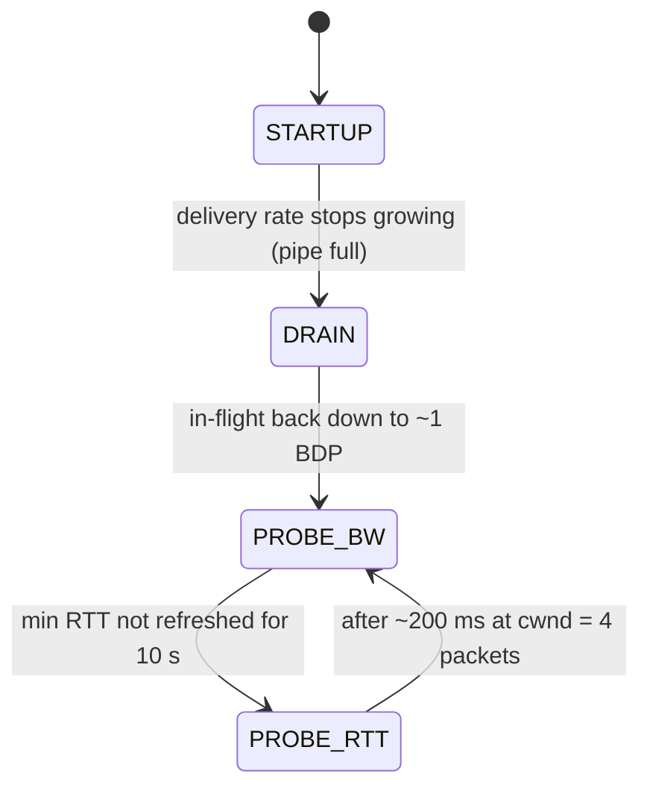

# 🌐 Computer Networks — Staff-Level Interview Questions

> *12 questions covering TCP/IP internals, HTTP/2/3, DNS, TLS, load balancing, and network architecture. Each answer leads with the 30-second version, then the mechanism, then trade-offs and what the interviewer probes next. Current as of October 2026.*

---

## Table of Contents

1. [TCP Congestion Control (BBR vs Cubic)](#1-tcp-congestion-control-bbr-vs-cubic)
2. [HTTP/2 Multiplexing & Head-of-Line Blocking](#2-http2-multiplexing-head-of-line-blocking)
3. [HTTP/3 & QUIC](#3-http3-quic)
4. [TLS 1.3 Handshake & 0-RTT](#4-tls-13-handshake-0-rtt)
5. [DNS Resolution Deep Dive](#5-dns-resolution-deep-dive)
6. [Load Balancing: L4 vs L7, Consistent Hashing](#6-load-balancing-l4-vs-l7-consistent-hashing)
7. [Connection Pooling & Keep-Alive](#7-connection-pooling-keep-alive)
8. [gRPC vs REST: Wire Protocol Comparison](#8-grpc-vs-rest-wire-protocol-comparison)
9. [CDN Architecture & Caching Strategies](#9-cdn-architecture-caching-strategies)
10. [TCP TIME_WAIT & Ephemeral Port Exhaustion](#10-tcp-time_wait-ephemeral-port-exhaustion)
11. [Network Namespaces & Overlay Networks](#11-network-namespaces-overlay-networks)
12. [Packet Capture Analysis: Production Debugging](#12-packet-capture-analysis-production-debugging)

---

## 1. TCP Congestion Control (BBR vs Cubic)

**Q:** "We're rolling out a new video streaming service that sends large chunks (1-4MB) over long-fat pipes (100ms RTT, 1Gbps). Our Cubic-based TCP stack is underutilizing the bandwidth — we're seeing only 200Mbps. Diagnose the problem and compare how BBR would handle this differently."

**What They're Really Testing:** Whether you understand TCP congestion control at the level of actual algorithms, not just textbook "slow start, congestion avoidance."

### Answer

!!! tip "30-second answer"
    The pipe holds a bandwidth-delay product of **12.5 MB**, so the sender needs ~8,300 full-size packets in flight. First rule out the boring cause: socket buffers (`tcp_wmem`/`tcp_rmem` max) smaller than the BDP cap throughput regardless of algorithm. If buffers are fine, Cubic is the problem: it treats **packet loss** as the congestion signal, so on a long path even a tiny random loss rate (shallow cloud buffers, policers) keeps cutting the window, and regrowth to 8,300 packets takes many seconds. **BBR** instead **models** the path (max delivery rate × min RTT) and paces at that rate, so random loss barely affects it. Trade-off: BBRv1 ignores loss, so it can cause high retransmit rates and be unfair to Cubic flows sharing a bottleneck.

**Step 1: the numbers**

```
BDP = 1 Gbit/s × 0.1 s = 100 Mbit = 12.5 MB
Packets in flight to fill the pipe = 12.5 MB / 1500 B ≈ 8,300

Observed 200 Mbit/s means the average window is only ~2.5 MB (~1,700 packets).
```

**Step 2: rule out non-congestion limits first**

| Check | Why it caps throughput | Command |
|---|---|---|
| Send/receive buffer max | Window can never exceed the socket buffer; old defaults (e.g. 4–6 MB `tcp_rmem` max) are below a 12.5 MB BDP | `sysctl net.ipv4.tcp_rmem net.ipv4.tcp_wmem` |
| Receive window / window scaling | Without `wscale` the window is capped at 64 KB (≈5 Mbit/s at 100 ms) | look for `wscale` in the SYN in `tcpdump` |
| Application-limited sender | App doesn't keep the socket full (small writes, blocking reads upstream) | `ss -ti` shows `app_limited` |
| Retransmits | Confirms loss is the limiter | `ss -ti` (`retrans`), `nstat TcpRetransSegs` |

**Step 3: why Cubic struggles here**

- Linux starts with `cwnd = 10` segments (RFC 6928) and an effectively infinite `ssthresh`; slow start doubles cwnd per RTT until the first loss.
- On loss, Cubic multiplies cwnd by **β = 0.7** (Reno halves it), then regrows along a cubic curve anchored at the previous max (`W_max`). Growth depends on wall-clock time since the loss, not on RTT, which helps on long paths but still needs seconds to recover thousands of packets.
- Loss-based control is extremely sensitive at high BDP. The Mathis model for Reno-style flows, `throughput ≈ (MSS/RTT) × 1.22/√p`, says 200 Mbit/s at 100 ms RTT needs a loss rate below ~5×10⁻⁷. Cubic tolerates more than Reno, but the shape of the problem is the same: **random, non-congestive loss looks like congestion**.

```
Cubic cwnd over time (random loss on a shallow-buffer path):

cwnd │    /‾‾\        /‾‾\        /‾‾\
     │   /    |      /    |      /    |      ← each loss: cwnd × 0.7
     │  /     |_____/     |_____/     |___
     └──────────────────────────────────── time
BBR  │ ─────────────────────────────────── ← paced at estimated BtlBw
```

**Step 4: how BBR works**

BBR (Bottleneck Bandwidth and Round-trip propagation time) keeps a model of the path:

1. **BtlBw**: windowed **max** of measured delivery rate (over ~10 round trips).
2. **RTprop**: windowed **min** RTT (over ~10 seconds).

It sends at `pacing_rate = pacing_gain × BtlBw` and caps in-flight data at `cwnd_gain × BtlBw × RTprop`. Loss is not the primary signal.



| State | What it does |
|---|---|
| STARTUP | Gain ~2.89: doubles sending rate per round, like slow start, until measured bandwidth plateaus for ~3 rounds |
| DRAIN | Gain below 1 to drain the queue STARTUP built |
| PROBE_BW | Steady state. BBRv1 cycles pacing gain through 8 phases `[1.25, 0.75, 1, 1, 1, 1, 1, 1]`: probe up, drain, cruise |
| PROBE_RTT | Briefly drops in-flight to 4 packets so the queue empties and a fresh min RTT can be measured |

**Why BBR suits this workload:** random loss on the path doesn't collapse the rate, pacing avoids the bursts that overflow shallow buffers, and queues stay short so RTT stays near propagation delay (good for latency-sensitive traffic sharing the link). It is **sender-side only**: you switch the video servers, not the clients.

```bash
sysctl -w net.ipv4.tcp_congestion_control=bbr
sysctl -w net.core.default_qdisc=fq   # fq pacing; since Linux 4.13 TCP can pace internally too
```

**Trade-offs and versions:**

| | Cubic | BBRv1 (mainline Linux `tcp_bbr`) | BBRv3 |
|---|---|---|---|
| Signal | Loss | Bandwidth + RTT model | Model + loss and ECN as bounds |
| Random loss | Large throughput drop | Mostly ignores it | Tolerates up to a loss threshold |
| Fairness | Fair among Cubic flows | Can starve Cubic in shallow buffers; can lose to Cubic in deep buffers | Much better coexistence |
| Retransmits | Low | Can be high in shallow buffers (keeps sending into loss) | Lower |
| Availability | Linux default | In mainline since 4.9 | Google's out-of-tree `google/bbr` v3 branch; not merged upstream as of 2025. Deployed at Google |

**What they probe next:**

- "Would you turn on BBR for everything?" Good answer: for long-haul, lossy or shallow-buffer egress (video, CDN edges), yes after a canary that watches retransmit rate and fairness; inside a datacenter with ECN-capable switches, DCTCP or Cubic may be better.
- "How does QUIC change this?" QUIC runs congestion control in userspace, so you can ship BBR (or anything) with the app, without a kernel change.
- "What's bufferbloat?" Deep buffers let loss-based senders fill queues, so RTT balloons before any loss signal arrives. BBR targets the BDP and keeps queues small.

### 🔍 Staff-Level Evaluation

| Criterion | What I'm Looking For |
|-----------|----------------------|
| **BDP concept** | Calculates BDP = 12.5MB, checks socket buffers and window scaling before blaming the algorithm |
| **Loss-based vs model-based** | Can articulate the fundamental paradigm shift and why random loss hurts loss-based CC at high BDP |
| **BBR internals** | Explains BtlBw, RTprop, pacing gain, state machine |
| **Production nuance** | Knows BBRv1 can be unfair and retransmit-heavy; canary, measure, know which version the kernel actually ships |

---

## 2. HTTP/2 Multiplexing & Head-of-Line Blocking

**Q:** "We migrated from HTTP/1.1 to HTTP/2 expecting performance gains, but we're seeing WORSE latency on our mobile app (high packet loss, ~3%). One TCP connection carries 20+ concurrent streams. Explain the head-of-line blocking problem in HTTP/2 and how HTTP/3 fixes it."

**What They're Really Testing:** Understanding of HTTP/2's fundamental architectural limitation at the transport layer.

### Answer

!!! tip "30-second answer"
    HTTP/2 fixed **application-layer** head-of-line blocking (one slow response no longer blocks the connection) but moved everything onto **one TCP connection**. TCP delivers a single ordered byte stream, so one lost packet stalls **every** stream until it is retransmitted, and the loss shrinks the **one** congestion window all 20 streams share. HTTP/1.1's six connections each had their own window and their own loss recovery, so a loss hurt only one-sixth of the traffic. At 3% loss that difference dominates. HTTP/3 runs over QUIC, which delivers each stream independently, so a loss stalls only the streams whose data was in the lost packet.

**HTTP/1.1 vs HTTP/2 vs HTTP/3:**

```
HTTP/1.1 (browsers open up to 6 connections per origin):
┌─Connection 1─┐  ┌─Connection 2─┐   ...   ┌─Connection 6─┐
│ Req1→Resp1   │  │ Req2→Resp2   │         │ Req6→Resp6   │
│ Req7→Resp7   │  │ Req8→Resp8   │         │ ...          │
└──────────────┘  └──────────────┘         └──────────────┘
Each connection: own cwnd, own loss recovery, one request at a time
Cost: 6 handshakes, 6 slow starts, app-layer HoL inside each connection

HTTP/2 (1 TCP connection, frames from many streams interleaved):
┌─One TCP connection──────────────────────────────────┐
│ S1 S2 S3 S1 S5 S4 S2 ... ← one ordered byte stream  │
│ Packet with S5 data lost → TCP holds back ALL bytes │
│ after it, including S1..S4 frames that did arrive   │
└─────────────────────────────────────────────────────┘

HTTP/3 (QUIC over UDP, streams delivered independently):
┌─QUIC connection─────────────────────────────────────┐
│ Packet with S5 data lost → only S5 waits            │
│ S1..S4, S6.. are delivered to the app immediately   │
└─────────────────────────────────────────────────────┘
```

**The HTTP/2 HoL Blocking Problem — Deep Dive:**

### 🎬 Animated Sequence Diagram
<p align="center">
  <video controls width="900" style="border-radius: 12px; box-shadow: 0 4px 24px rgba(0,0,0,0.3);" loop playsinline preload="metadata">
    <source src="../../../assets/videos/net-http2-vs-quic.mp4" type="video/mp4" />
    Your browser does not support the video tag.
  </video>
  <br/>
  <em>🎬 Animated Sequence — HTTP/2 vs HTTP/3 (QUIC) — One lost packet blocks H2 entirely, QUIC isolates per-stream. Click ▶ to play/pause. Created with <a href="https://remotion.dev">Remotion</a>.</em>
</p>

```
TCP receiver, packet P5 lost:

  P1  P2  P3  P4  ✗P5  P6  P7     ← arrived on the wire
 └──── delivered ───┘ └─ held ─┘   ← P6, P7 sit in the kernel's
                                     out-of-order queue until P5
                                     is retransmitted (≥ 1 RTT)

The browser sees nothing from P6/P7, even though they carry frames
for streams that have nothing to do with P5.
```

**Why 3% loss makes HTTP/2 worse than HTTP/1.1 (the reasoning, not a formula):**

| Effect of one lost packet | HTTP/1.1 × 6 connections | HTTP/2 × 1 connection |
|---|---|---|
| Streams stalled | Only requests on that connection | All streams with data after the gap |
| Congestion window cut | 1 of 6 windows (aggregate drops ~1/6 × 30%) | The only window (aggregate drops ~30% with Cubic) |
| Recovery | Independent per connection | Serialized for everyone |

Loss-based throughput scales roughly with `1/√p` **per connection**, so N connections get roughly N times the share of a single one. On a clean network HTTP/2 wins (one handshake, header compression, no app-layer HoL); on a lossy mobile network the single shared window and transport HoL can make it lose.

**Mitigations before HTTP/3:** keep the connection warm (avoid repeated slow start), enable SACK/RACK (on by default in Linux), use BBR on the server, and for very lossy clients consider a second connection for large downloads.

**The fix: HTTP/3 over QUIC**

```
QUIC packet (after decryption):
┌─────────────────────────────────────────────┐
│ Short header: DCID, packet number           │
├─────────────────────────────────────────────┤
│ STREAM frame: stream 0, offset 0,  len 100  │
│ STREAM frame: stream 8, offset 200, len 50  │
│ ACK frame                                   │
└─────────────────────────────────────────────┘
```

- **Ordering is per stream.** Each STREAM frame carries a stream ID and byte offset, so the receiver can deliver stream 0 even if a packet with stream 8 data is missing.
- **Loss detection is per connection, per packet.** Packet numbers are never reused; lost **frames** are re-sent in **new** packets. This also removes TCP's retransmission ambiguity (you always know which transmission an ACK refers to).
- **Congestion control is still per connection.** QUIC removes transport HoL blocking, not the shared congestion window. A loss still slows all streams, but it no longer **stalls** them.
- **Header compression changed too.** HPACK assumes in-order delivery; HTTP/3 uses **QPACK** (RFC 9204), which lets the encoder trade compression ratio for avoiding cross-stream blocking.

**What they probe next:** "Is HTTP/2 prioritization the answer?" The original RFC 7540 priority tree was widely unimplemented and was deprecated in RFC 9113 (2022); the replacement is the simpler Extensible Priorities scheme (RFC 9218, `Priority` header), used by HTTP/2 and HTTP/3. "Why not just HTTP/1.1?" Fine for a few large transfers; poor for many small requests.

### 🔍 Staff-Level Evaluation

| Criterion | What I'm Looking For |
|-----------|----------------------|
| **TCP byte stream** | Explains that TCP HoL is inherent — bytes must be delivered in order |
| **HTTP/2 framing** | Understands that frames serialize over TCP regardless of stream |
| **Loss reasoning** | Explains shared cwnd vs per-connection windows, not just "packets get stuck" |
| **QUIC streams** | Knows QUIC removes HoL stalls per stream but still shares one congestion controller |

---

## 3. HTTP/3 & QUIC

**Q:** "Walk me through the QUIC handshake end-to-end. How does 0-RTT work, and what security implications does it have? Compare connection establishment time vs TCP+TLS 1.3."

**What They're Really Testing:** Whether you understand QUIC's cryptographic and transport design at the level of actual packet formats.

### Answer

!!! tip "30-second answer"
    QUIC (RFC 9000/9001/9002, 2021) is a UDP-based transport with TLS 1.3 built in, so the transport and crypto handshakes happen **together**: a new connection can send its request after **1 RTT** (vs 2 for TCP + TLS 1.3), and a resumed one can send it in the **first flight (0-RTT)**. 0-RTT data is **replayable** because the server hasn't contributed any fresh randomness yet, so it must be limited to idempotent requests. QUIC also identifies connections by **connection IDs**, not the IP/port 4-tuple, so a phone switching from Wi-Fi to cellular can migrate without a new handshake. HTTP/3 (RFC 9114, 2022) is HTTP over QUIC.

**Handshake comparison (time until the client can send its first request):**

```
TCP + TLS 1.3                      QUIC, new connection          QUIC, resumed with 0-RTT
C ── SYN ──────────► S             C ── Initial[ClientHello] ─► S  C ── Initial[ClientHello]
C ◄── SYN-ACK ────── S   RTT 1     C ◄─ Initial[ServerHello]       │   + 0-RTT[GET /] ──────► S
C ── ACK + ClientHello ► S           ◄─ Handshake[EE,Cert,         C ◄─ Initial + Handshake
C ◄── ServerHello..Finished S RTT 2      CertVerify,Finished]  RTT1  ◄─ 1-RTT[response]  RTT 1
C ── Finished + GET / ──► S         ── Handshake[Finished]
C ◄── response ────────── S RTT 3      + 1-RTT[GET /] ──────► S
                                   C ◄─ 1-RTT[response]       RTT 2

Request sent after: 2 RTT          1 RTT                          0 RTT
Response arrives at: 3 RTT         2 RTT                          1 RTT
```

On a 100 ms mobile RTT, that is 300 ms → 200 ms → 100 ms to first byte of the response (ignoring server time). TCP Fast Open could save a TCP round trip but is rarely usable because middleboxes interfere with it.

**QUIC Initial packet (client → server):**

```
┌─────────────────────────────────────────────────────────┐
│ First byte: 1 (long header) 1 (fixed) 00 (Initial) ...  │
│ Version (4 bytes)                                       │
│ DCID len + DCID (client-chosen, random)                 │
│ SCID len + SCID                                         │
│ Token length + Token  (from a Retry or NEW_TOKEN;       │
│                        proves address ownership)        │
│ Length                                                  │
│ Packet number (1-4 bytes, masked by header protection)  │
├─────────────────────────────────────────────────────────┤
│ AEAD-protected payload                                  │
│   CRYPTO frame (TLS ClientHello)                        │
│   PADDING frames: client datagram must be ≥ 1200 bytes  │
├─────────────────────────────────────────────────────────┤
│ AEAD tag (16 bytes)                                     │
└─────────────────────────────────────────────────────────┘
```

Details interviewers like:

- **Initial packets are obfuscated, not secret.** Their keys are derived from the client's DCID and a version-specific public salt, so any on-path observer can decrypt them. They protect against off-path tampering and ossification, not eavesdropping. Handshake and 1-RTT packets use real TLS-derived keys.
- **Header protection** masks the packet number and some header bits, so middleboxes can't build logic around them (anti-ossification).
- **Anti-amplification:** until the client's address is validated, the server may send at most **3×** the bytes it received. That is why the client pads its first datagram to 1200 bytes, and why a large certificate chain (or post-quantum key shares) can cost an extra round trip. A server under attack can send a **Retry** with a token, forcing the client to prove it can receive at its claimed address.

**0-RTT security:**

0-RTT data is encrypted with keys from the **resumption PSK** of a previous session. Because the server hasn't sent anything yet, an attacker who records the first flight can **replay** it to the same or another server in the cluster. The attacker can't read or modify it, but a replayed `POST /transfer` executes twice.

| Defence | How it works | Limit |
|---|---|---|
| Only allow idempotent requests in 0-RTT | Server (or CDN) rejects or defers non-safe methods | Standard practice; RFC 8470 defines `Early-Data: 1` and status **425 Too Early** so the origin can ask the client to retry after the handshake |
| Single-use tickets | Server remembers which tickets it has accepted | Needs shared state across all servers that accept the ticket |
| ClientHello recording + freshness window | Store a digest of each ClientHello seen within a short window; reject duplicates and stale ticket ages (RFC 8446 §8) | Window-bound, still per cluster |
| Application idempotency keys | Dedupe mutating operations regardless of transport | Needed anyway for client retries |

0-RTT data also lacks forward secrecy with respect to the ticket key: if the server's ticket encryption key leaks, recorded early data can be decrypted.

**QUIC vs TCP:**

| Feature | TCP (+TLS) | QUIC |
|---------|-----|------|
| **Handshake** | 1 RTT (TCP) + 1 RTT (TLS 1.3) | 1 RTT, or 0-RTT on resumption |
| **Implementation** | Kernel | Mostly userspace libraries (quiche, msquic, ngtcp2, quic-go, lsquic) |
| **Evolution** | Needs OS upgrade; middleboxes ossified options | Ship with the app; almost everything encrypted |
| **Connection identity** | 4-tuple | Connection IDs |
| **Loss recovery** | SACK, RACK-TLP; retransmission ambiguity | Monotonic packet numbers, ACK ranges, no ambiguity |
| **HoL blocking** | Across all streams | Per stream only |
| **CPU cost** | Mature offloads (TSO, GRO) | Historically higher per byte; GSO/GRO for UDP and sendmmsg narrow the gap |

**Connection migration:**

```
Phone moves Wi-Fi → cellular. Source IP changes.

TCP:   4-tuple no longer matches → connection is dead → reconnect, new handshake.
QUIC:  packets keep carrying a connection ID the server issued
       → server finds the connection by CID
       → PATH_CHALLENGE / PATH_RESPONSE validates the new path
         (stops an attacker redirecting traffic at a victim)
       → congestion state resets for the new path
       → client switches to a fresh CID so observers can't link the two paths
```

**What they probe next (deployment):**

- **UDP blocked or rate-limited** by some enterprise firewalls: clients race or fall back to TCP. Servers advertise HTTP/3 with `Alt-Svc` or the DNS **HTTPS record** (RFC 9460), so the first visit is usually HTTP/2.
- **Load balancing:** an L4 balancer hashing on the 4-tuple breaks migration, because the new path hashes elsewhere. Production deployments encode a server ID in the connection ID so the balancer routes by CID (the IETF QUIC-LB draft).
- **Kernel tuning:** large UDP receive buffers (`net.core.rmem_max`) and GSO matter at scale.

### 🔍 Staff-Level Evaluation

| Criterion | What I'm Looking For |
|-----------|----------------------|
| **Wire format** | Knows Initial packet structure, that Initial keys are public, header protection |
| **0-RTT risks** | Explains replay precisely and the realistic defences (idempotent-only, 425 Too Early) |
| **Connection migration** | Understands CIDs, path validation, and the load-balancer implication |
| **Deployment** | Knows about UDP blocking, Alt-Svc / HTTPS records, fallback to TCP |

---

## 4. TLS 1.3 Handshake & 0-RTT

**Q:** "Design a TLS termination strategy for a microservices architecture processing 50K connections/second. Compare TLS termination at the load balancer (L4) vs at each service (L7). How does TLS 1.3 change the equation vs TLS 1.2?"

**What They're Really Testing:** Whether you understand TLS 1.3's latency improvements at scale and the operational trade-offs of termination strategies.

### Answer

!!! tip "30-second answer"
    Terminate TLS for external traffic at an L7 edge tier (managed LB or Envoy/NGINX fleet) and use mTLS inside (mesh or service-to-service). TLS 1.3 cuts the full handshake to **1 RTT**, removes static-RSA key exchange (so every connection has forward secrecy) and encrypts the certificate. At 50K new connections/s, server CPU is dominated by the **certificate signature**, so use **ECDSA P-256** certificates (an order of magnitude cheaper to sign than RSA-2048), keep a high **session resumption** rate with tickets whose keys are shared and rotated across the fleet, and leave 0-RTT off unless you can restrict it to idempotent requests. In 2026, also expect **hybrid post-quantum key exchange** (X25519MLKEM768) from browsers by default.

**TLS 1.2 vs 1.3 Handshake:**

### 🎬 Animated Sequence Diagram
<p align="center">
  <video controls width="900" style="border-radius: 12px; box-shadow: 0 4px 24px rgba(0,0,0,0.3);" loop playsinline preload="metadata">
    <source src="../../../assets/videos/net-tls-handshake.mp4" type="video/mp4" />
    Your browser does not support the video tag.
  </video>
  <br/>
  <em>🎬 Animated Sequence — TLS 1.3 Handshake — 1-RTT handshake vs TLS 1.2's 2-RTT with 0-RTT resumption. Click ▶ to play/pause. Created with <a href="https://remotion.dev">Remotion</a>.</em>
</p>


```
TLS 1.2 full handshake (2 RTT):
Client                      Server
  ├── ClientHello ───────────►│
  │◄── ServerHello, Certificate,
  │    ServerKeyExchange, ServerHelloDone ─┤  ← RTT 1
  ├── ClientKeyExchange,
  │   ChangeCipherSpec, Finished ─────────►│
  │◄── ChangeCipherSpec, Finished ─────────┤  ← RTT 2
  ├── Application Data ─────►│

TLS 1.3 full handshake (1 RTT):
Client                      Server
  ├── ClientHello + key_share ───────────►│  ← client guesses the group
  │◄── ServerHello + key_share,           │
  │    {EncryptedExtensions, Certificate, │  ← everything after ServerHello
  │     CertificateVerify, Finished} ─────┤    is encrypted
  ├── {Finished} + Application Data ─────►│  ← RTT 1
```

If the client guessed a group the server doesn't support, the server sends `HelloRetryRequest`, costing an extra RTT.

**What TLS 1.3 removed (and why it matters):**

| Removed | Why |
|---|---|
| Static RSA key exchange | No forward secrecy: a stolen private key decrypts all recorded traffic |
| CBC modes, RC4, SHA-1, compression, renegotiation | Source of real attacks (Lucky13, POODLE, CRIME) |
| Arbitrary DH groups | Only named, vetted groups |
| 5 cipher suites remain | `TLS_AES_128_GCM_SHA256`, `TLS_AES_256_GCM_SHA384`, `TLS_CHACHA20_POLY1305_SHA256` (+ 2 CCM ones) |

**Where the CPU goes at 50K handshakes/s:**

The expensive asymmetric operations per full handshake are the server's **key agreement** and its **signature** in CertificateVerify. Bulk encryption afterwards is cheap with AES-NI or ChaCha20.

| Operation | Relative cost (single core, order of magnitude) |
|---|---|
| RSA-2048 sign | Most expensive: ~1–2K ops/s per core |
| ECDSA P-256 sign | ~10× cheaper than RSA-2048 |
| X25519 key agreement | Tens of thousands of ops/s per core |
| ML-KEM-768 decapsulation | Similar order to X25519; the cost is mostly **bytes** (≈1.1 KB extra per side), not CPU |

So 50K full handshakes/s with RSA-2048 certificates needs dozens of cores just for signatures; with ECDSA it needs a few. Run `openssl speed rsa2048 ecdsap256 x25519` on your hardware to get real numbers. Public CAs do not issue Ed25519 certificates for the web PKI, so ECDSA P-256 (often alongside an RSA fallback certificate for old clients) is the practical choice.

**Post-quantum key exchange (current as of 2026):** the hybrid group **X25519MLKEM768** (X25519 combined with NIST's ML-KEM, FIPS 203) is on by default in Chrome (since 131), Firefox, Apple's OSes, Cloudflare, and OpenSSL 3.5+ (April 2025, which offers it as a default key share). It defends against "harvest now, decrypt later". Operational impact: the ClientHello grows past one packet, which has broken some middleboxes and fragile TLS implementations, and it adds bytes to QUIC Initial flights. Certificates and signatures are still classical; post-quantum signatures (ML-DSA) in the web PKI are not deployed yet.

**Termination Strategies:**

```
Option A: L4 pass-through (TCP proxy, e.g. NLB TCP listener, HAProxy mode tcp)
Client ══TLS══► LB (forwards bytes) ══TLS══► Backend terminates TLS
Pros: LB is cheap and protocol-agnostic; keys stay on backends
Cons: No L7 routing, retries or header injection; every backend manages certs;
      client IP needs PROXY protocol; SNI is the only routing hint

Option B: L7 termination at the edge (ALB, Envoy, NGINX)
Client ══TLS══► LB terminates ──plain or mTLS──► Backend
Pros: L7 routing, WAF, retries, observability; certs and policy in one place;
      resumption state lives in one tier
Cons: Edge tier holds the private keys (use KMS/HSM or keyless designs);
      plaintext inside unless you re-encrypt

Option C: Edge termination + mTLS to services (service mesh)
Client ══TLS══► Edge ══mTLS══► sidecar or ambient proxy ──► service
Pros: Encryption and service identity everywhere (zero trust)
Cons: Two handshakes per new connection path; cert rotation infrastructure;
      mitigated by long-lived pooled connections between proxies
```

**Session resumption at 50K connections/s:**

- **Session tickets (stateless):** the server encrypts session state with a **ticket encryption key (STEK)** and hands it to the client. Any server holding the same STEK can resume, so there is **no session cache to store**; you distribute and rotate the STEK across the fleet (e.g. new key every hour, accept the previous few). Rotation matters: a long-lived STEK undermines forward secrecy.
- **Session IDs (stateful, TLS 1.2):** needs a shared cache. Avoid at this scale.
- TLS 1.3 resumption normally still does a fresh (EC)DHE exchange (`psk_dhe_ke`) for forward secrecy, but it skips the certificate and the signature, which is the expensive part.

```nginx
# NGINX edge, TLS 1.3 preferred
ssl_protocols       TLSv1.2 TLSv1.3;          # keep 1.2 for old clients
ssl_ecdh_curve      X25519MLKEM768:X25519:prime256v1;   # needs OpenSSL 3.5+
ssl_certificate     /etc/tls/ecdsa.crt;        # ECDSA P-256 first
ssl_certificate     /etc/tls/rsa.crt;          # RSA fallback
ssl_session_tickets on;
ssl_session_ticket_key /etc/tls/stek.current;  # rotate; same file on every node
ssl_session_ticket_key /etc/tls/stek.previous;
ssl_early_data      off;                       # 0-RTT off unless idempotent-only
```

**Verdict for 50K connections/s:** Option B or C. L7 termination at a horizontally scaled edge tier with ECDSA certs, shared rotating ticket keys, and keep-alive so most requests reuse connections. Inside, mTLS between services via a mesh or library, with long-lived pooled connections so handshake cost is amortised. Enable 0-RTT only at the CDN/edge for safe methods.

**What they probe next:** "Where do you store the private key?" (KMS/HSM, or keyless TLS where the edge asks a key server to sign). "How do you rotate certs for 2,000 services?" (short-lived certs from an internal CA, SPIFFE identities, automated renewal; public certificate lifetimes are also shrinking, with the CA/Browser Forum schedule reducing maximum validity in steps toward 47 days by 2029, so automation via ACME is mandatory).

### 🔍 Staff-Level Evaluation

| Criterion | What I'm Looking For |
|-----------|----------------------|
| **RTT savings** | Knows TLS 1.3 = 1 RTT vs 1.2 = 2 RTT, and that 0-RTT is resumption-only and replayable |
| **CPU cost** | Knows the signature dominates, prefers ECDSA, and measures with `openssl speed` |
| **Session management** | Stateless tickets with fleet-wide, rotated STEKs; no giant session cache |
| **Architecture** | Compares pass-through vs termination vs mesh, knows when mTLS is needed |
| **Currency** | Knows hybrid PQ key exchange is the default in browsers and its MTU/middlebox impact |

---

## 5. DNS Resolution Deep Dive

**Q:** "A user reports that your SaaS platform is intermittently unreachable. When they `nslookup saas.example.com`, they get different IPs each time — some work, some timeout. Trace the entire DNS resolution path from browser to root server. How does DNS caching, TTL, and anycast routing affect your diagnosis?"

**What They're Really Testing:** Whether you understand DNS at the protocol level — caching hierarchy, anycast, stub vs recursive resolvers.

### Answer

!!! tip "30-second answer"
    "Different IPs each time, some time out" almost always means **the authoritative answer still contains a dead IP** (round-robin A records with no health checking), so roughly 1 in N connection attempts hits it. DNS is behaving correctly. Confirm by querying the authoritative servers directly, then fix it at the source: health-checked records (or put a load balancer behind a single stable name) and a TTL low enough that a removal propagates quickly. Caches you don't control (ISP resolvers, JVMs, browsers) keep the bad answer until their TTL expires, and some clamp or ignore TTLs.

**Full DNS Resolution Path:**

```
Browser: https://saas.example.com
  │
  ├─1. Browser host cache (Chrome keeps its own; ~1 min when it can't see TTLs)
  │
  ├─2. OS stub resolver (getaddrinfo → nsswitch.conf order: usually `files dns`)
  │     ├─ /etc/hosts
  │     └─ local caching daemon if present (systemd-resolved, nscd, dnsmasq)
  │
  ├─3. Recursive resolver from /etc/resolv.conf or DHCP
  │     (ISP, corporate, 8.8.8.8, 1.1.1.1; possibly over DoH/DoT)
  │     If not cached, it walks the delegation chain:
  │
  │     a. Root servers: 13 named identities (a–m.root-servers.net),
  │        each anycast to many instances worldwide.
  │        → referral: ".com is served by a.gtld-servers.net ..."
  │        (resolvers cache TLD delegations for days, so roots are rarely asked)
  │
  │     b. .com TLD servers (Verisign)
  │        → referral: "example.com NS ns1.example.com, ns2.example.com" (+ glue)
  │
  │     c. Authoritative server for example.com
  │        → saas.example.com 300 IN A 203.0.113.10 / .20 / .30 / .40
  │
  └─4. Client gets the list. Order is often rotated by servers or resolvers.
        Happy Eyeballs (RFC 8305) races IPv6 and IPv4; browsers fall back
        to the next address after a connect timeout.
```

**The Problem — Intermittent Failures:**

### 🎬 Animated Sequence Diagram
<p align="center">
  <video controls width="900" style="border-radius: 12px; box-shadow: 0 4px 24px rgba(0,0,0,0.3);" loop playsinline preload="metadata">
    <source src="../../../assets/videos/net-dns-resolution.mp4" type="video/mp4" />
    Your browser does not support the video tag.
  </video>
  <br/>
  <em>🎬 Animated Sequence — DNS Resolution Path — Browser → Stub → Root → TLD → Authoritative → IP Address. Click ▶ to play/pause. Created with <a href="https://remotion.dev">Remotion</a>.</em>
</p>


```dns
; Answer from the authoritative nameserver:
saas.example.com.     300     IN      A     203.0.113.10  ; healthy
saas.example.com.     300     IN      A     203.0.113.20  ; healthy
saas.example.com.     300     IN      A     203.0.113.30  ; DEAD (server down)
saas.example.com.     300     IN      A     203.0.113.40  ; healthy
```

A client that picks .30 waits for a connect timeout. Browsers then try another address, so users often see "slow" rather than "down"; non-browser clients (SDKs, curl, many HTTP libraries) may simply fail.

**Diagnosis:**

```bash
# 1. Ask the authoritative servers directly: is the dead IP still published?
dig @ns1.example.com saas.example.com +norecurse

# 2. Compare what public resolvers have cached (and remaining TTL)
dig @8.8.8.8 saas.example.com +ttlid
dig @1.1.1.1 saas.example.com +ttlid

# 3. Walk the delegation from the root (rules out stale NS/glue at the TLD)
dig +trace saas.example.com

# 4. Test each IP directly
for ip in 203.0.113.10 203.0.113.20 203.0.113.30 203.0.113.40; do
  curl -s -o /dev/null -w "$ip %{http_code} %{time_connect}\n" \
       --connect-timeout 3 --resolve saas.example.com:443:$ip https://saas.example.com/health
done
```

**Caching layers (TTL = 300 s):**

| Layer | Behaviour |
|---|---|
| Browser | Own cache; short |
| Runtime | **JVM** caches positive lookups for 30 s by default (forever if a security manager is installed); some apps cache resolved IPs for the process lifetime, which is a classic outage cause |
| OS cache | systemd-resolved, nscd: respects TTL |
| Recursive resolver | Respects TTL but may clamp (minimum TTLs) or serve stale (RFC 8767) when authoritative servers are unreachable |
| Negative answers | NXDOMAIN cached for the SOA `minimum`/negative TTL (RFC 2308), so publishing a record late can still fail for a while |

Worst case after you fix the authoritative answer: most clients converge within one TTL; misbehaving caches take longer. **Lower the TTL before planned changes**, not during the incident (the old TTL is already cached).

**Anycast effect:** large public resolvers are anycast. Your query lands at a nearby site, and each site (often each server) has its own cache, so two users, or the same user minutes apart, can see different cached answers with different remaining TTLs. That explains inconsistency during convergence but is not the root cause here.

**The fix — health-checked DNS, or don't put backends in DNS at all:**

```yaml
# Route 53: one record per IP, each tied to a health check, multivalue answer routing
HealthCheck:
  Type: HTTPS
  IPAddress: 203.0.113.30
  ResourcePath: /health
  RequestInterval: 10        # 10 or 30 seconds
  FailureThreshold: 2        # consecutive failures before unhealthy
# Unhealthy records are omitted from answers (multivalue returns up to 8 healthy records).
# Set TTL low (e.g. 60s) ahead of time; Route 53 does not lower TTL during failover.
```

Better for most SaaS: publish one name pointing at a load balancer (or anycast VIP) that health-checks backends itself, so a dead backend is removed in seconds and DNS changes are rare.

**What they probe next:** DNS cache poisoning (Kaminsky attack; mitigated by source-port and query-ID randomisation, and DNSSEC for integrity), DNS over HTTPS/TLS for privacy, and why `CNAME` at the zone apex is not allowed (providers offer ALIAS/flattening).

### 🔍 Staff-Level Evaluation

| Criterion | What I'm Looking For |
|-----------|----------------------|
| **Full path** | Traces browser cache → stub → recursive → root → TLD → authoritative |
| **Caching** | Explains TTL, negative caching, application-level caches (JVM) that ignore TTL |
| **Anycast** | Knows anycast resolvers have per-site caches, so views differ during convergence |
| **Fix** | Health-checked records or an LB behind a stable name; lower TTL in advance |

---

## 6. Load Balancing: L4 vs L7, Consistent Hashing

**Q:** "Design a load balancing strategy for a real-time chat service (WebSocket-based, 1M concurrent connections). Compare L4 (TCP) vs L7 (HTTP/2) load balancers. How do you handle connection draining for WebSocket persistence?"

**What They're Really Testing:** Whether you understand the architectural trade-offs between L4 and L7 load balancing, and can design for connection affinity at scale.

### Answer

!!! tip "30-second answer"
    A WebSocket is one long-lived TCP connection, so **any** load balancer keeps it on the same backend for its whole life. "Stickiness" only matters for **reconnects**, and the best design makes it unnecessary: any chat node can serve any user because messages fan out through a pub/sub layer (Redis, Kafka, NATS) keyed by user or room. Use an L4 tier (NLB, Maglev-style ECMP) for raw connection scale, with an L7 tier (Envoy/NGINX) if you need TLS termination, auth on upgrade, or path routing. The hard part is **draining**: connections never finish on their own, so you tell clients to reconnect (close code 1001/1012) in jittered batches to avoid a reconnect storm.

**L4 vs L7:**

| | L4 (NLB, IPVS, Maglev, HAProxy `mode tcp`) | L7 (Envoy, NGINX, ALB, HAProxy `mode http`) |
|---|---|---|
| Sees | IP/port (+ SNI if it peeks at TLS) | HTTP method, path, headers, cookies |
| Decision | Per connection | Per request (or per upgrade for WebSockets) |
| Cost | Very cheap per packet; some designs use DSR or kernel bypass | Full TCP + TLS + HTTP parsing per connection |
| TLS | Pass-through, or terminate (e.g. NLB TLS listener) without HTTP awareness | Terminates, can inspect and re-encrypt |
| Good for | Millions of long-lived connections, non-HTTP protocols | Routing, auth, retries, rate limits, observability |

For 1M WebSockets, the usual shape is **L4 in front of an L7 fleet** (or a managed L7 LB sized for it), each L7 proxy holding tens of thousands of connections. Watch per-proxy limits: file descriptors, memory per connection (TLS buffers dominate), and ephemeral ports from proxy to backend (Q10).

**WebSocket upgrade path:**

```
Client                     L7 LB                      Backend
  ├── GET /ws HTTP/1.1 ───►│                           │
  │   Upgrade: websocket   ├── pick backend (any      │
  │   Connection: Upgrade  │   healthy one, or hash)──►│
  │◄── 101 Switching ──────┤◄── 101 Switching ─────────┤
  │◄══ frames both ways ══►│◄══ frames both ways ═════►│
  (WebSockets over HTTP/2 use extended CONNECT, RFC 8441)
```

**Affinity options (for reconnects or stateful nodes):**

| Option | Pros | Cons |
|---|---|---|
| Hash of client IP | No state | Uneven behind carrier-grade NAT; changes when a phone changes network |
| Cookie / token with node ID | Survives IP changes | Leaks topology; node loss still forces a move |
| Consistent hash on user ID (header or query param) | Only ~1/N users move when a node is added | Needs L7; hot users still hot |
| **No affinity + pub/sub fan-out** | Nodes are interchangeable; simplest failover | Extra hop through the broker; presence and ordering need care |

**Connection draining — graceful shutdown of a chat node:**

1. Mark the node **draining**: fail its readiness check so the LB stops sending new upgrades (Kubernetes: the pod leaves the Endpoints set; give it a `preStop` hook and a long enough `terminationGracePeriodSeconds`).
2. Send a WebSocket **close frame** (1001 Going Away or 1012 Service Restart) to connected clients **in batches**, spread over the drain window.
3. Clients reconnect with **exponential backoff plus jitter**; they land on other nodes and resume from the last message ID they acknowledged.
4. After the deadline, close whatever is left, then exit.

Draining 50K connections at once on every deploy is a self-inflicted thundering herd: auth, presence and history services all get a spike. Rolling deploys therefore need a max-unavailable that the rest of the fleet can absorb.

**Consistent hashing for affinity:**

```python
import bisect
import hashlib


def _h(s: str) -> int:
    # Stable across processes and machines. Python's built-in hash() is
    # salted per process (PYTHONHASHSEED), so two LB instances would build
    # different rings and disagree about where a client belongs.
    return int.from_bytes(hashlib.blake2b(s.encode(), digest_size=8).digest(), "big")


class ConsistentHashRing:
    def __init__(self, vnodes: int = 150):
        self.vnodes = vnodes
        self._ring: dict[int, str] = {}
        self._keys: list[int] = []

    def add(self, backend: str) -> None:
        for i in range(self.vnodes):
            self._ring[_h(f"{backend}#{i}")] = backend
        self._keys = sorted(self._ring)

    def remove(self, backend: str) -> None:
        for i in range(self.vnodes):
            self._ring.pop(_h(f"{backend}#{i}"), None)
        self._keys = sorted(self._ring)

    def get(self, key: str) -> str | None:
        if not self._keys:
            return None
        i = bisect.bisect_right(self._keys, _h(key)) % len(self._keys)  # wrap around
        return self._ring[self._keys[i]]


# Going from 4 → 5 backends with 100K keys:
#   hash(key) % N  : 80% of keys move (only keys where h%4 == h%5 stay)
#   ring, 150 vnodes: ~17-20% move (ideal is 1/5)
```

Alternatives worth naming: **Maglev hashing** (Google's L4 LB; lookup table, even spread, minimal disruption) and **rendezvous (HRW) hashing** (no ring; pick the backend with the highest `hash(key, backend)`). Envoy supports `RING_HASH` and `MAGLEV`.

**Envoy snippet (the parts that matter):**

```yaml
# Route: allow the upgrade, disable the request timeout, hash on user ID
routes:
- match: { prefix: "/ws" }
  route:
    cluster: chat_backends
    timeout: 0s              # no overall timeout for a long-lived stream
    idle_timeout: 3600s
    upgrade_configs:
    - upgrade_type: websocket
    hash_policy:             # without a hash_policy, ring hash has no key to use
    - header: { header_name: x-user-id }

# Cluster
clusters:
- name: chat_backends
  lb_policy: MAGLEV          # or RING_HASH
  health_checks:             # a list
  - timeout: 1s
    interval: 5s
    unhealthy_threshold: 2
    healthy_threshold: 2
    http_health_check: { path: /health }
```

### 🔍 Staff-Level Evaluation

| Criterion | What I'm Looking For |
|-----------|----------------------|
| **L4 vs L7 trade-offs** | Knows per-connection vs per-request decisions, and why L4 + L7 tiers are common at 1M connections |
| **WebSocket affinity** | Realises the connection is already pinned; affinity is about reconnects; prefers stateless nodes + pub/sub |
| **Connection draining** | Close frames in batches, jittered client reconnect, readiness + preStop, thundering herd awareness |
| **Hashing** | Consistent/Maglev hashing, stable hash functions, knows modulo remaps (N-1)/N of keys |

---

## 7. Connection Pooling & Keep-Alive

**Q:** "Our microservice handles 10K requests/second but we're seeing 'connection refused' errors and high TIME_WAIT counts. Each request creates a new TCP connection. Walk through connection pooling: pool sizing with Little's Law, keep-alive tuning, and HTTP/2 multiplexing benefits."

**What They're Really Testing:** Whether you understand the queuing theory behind connection pooling and can size pools correctly using Little's Law.

### Answer

!!! tip "30-second answer"
    A new connection per request costs an RTT (plus a TLS handshake) and leaves a TIME_WAIT socket behind on whoever closes first. Opening 10K/s to the **same** destination exhausts the ~28K default ephemeral ports in a few seconds (60 s TIME_WAIT on Linux), so `connect()` fails with **EADDRNOTAVAIL**. Use a bounded, reused pool. Size it with Little's Law: in-flight connections = request rate × time each request holds a connection (10K/s × 50 ms = 500), plus headroom, with an acquire timeout so overload fails fast instead of growing the pool. Keep the client's idle timeout **shorter** than the server's to avoid reset races.

**The problem — connection per request:**

```
Per request: TCP handshake (1 RTT before the request can be sent)
           + TLS handshake (1 more RTT for TLS 1.3)
           + request/response
           + close → TIME_WAIT on the side that closed first

10K new connections/s to one backend IP:port
  Linux TIME_WAIT = 60 s → up to 600K TIME_WAIT sockets
  Default ephemeral ports: 32768-60999 = 28,232 per destination
  → ports run out in ~3 s; connect() returns EADDRNOTAVAIL
```

!!! note "Which error do you actually see?"
    Port exhaustion gives `EADDRNOTAVAIL` ("Cannot assign requested address") on the **client**. `ECONNREFUSED` means the destination answered with RST (nothing listening, or a proxy refusing). A full accept queue usually shows up as **timeouts** (SYNs dropped), not refusals. Getting this right is half the diagnosis.

**Little's Law for pool sizing:**

```python
# L = λ × W
#   L = connections busy at once
#   λ = request rate (req/s)
#   W = time a request holds a connection (s)

request_rate = 10_000
hold_time = 0.050                     # 50 ms per request
busy = request_rate * hold_time       # 500 connections in use on average

pool_size = int(busy * 1.5)           # 750: headroom for bursts and variance
# Keep-alive does NOT shrink L much: W is still the request time.
# It removes handshake time from W and, more importantly, stops the churn
# (new sockets, TIME_WAIT, ephemeral ports, TLS CPU).
```

If the pool is spread over N client instances, each instance needs roughly `pool_size / N`. Also check the **server's** limits: 750 connections × 40 client pods is 30,000 connections to a database that might allow a few hundred. That is when you add a server-side pooler (PgBouncer, RDS Proxy) or switch to multiplexed protocols.

**Keep-alive tuning:**

| Setting | Guidance |
|---|---|
| Client idle timeout | **Shorter than** the server/LB idle timeout. If the server closes an idle connection at the moment the client reuses it, the request gets a reset or a 502. Classic pairing: AWS ALB idle timeout 60 s default, Node.js `server.keepAliveTimeout` 5 s default; clients should drop idle connections before either. |
| Max requests / max age per connection | Forces periodic reconnects so load rebalances after scale-out (otherwise new backends get no traffic from old pooled connections) |
| Pool acquire timeout | Bounded wait; fail fast instead of piling up |
| Validation | Validate or retry once on a stale connection for idempotent requests |

```nginx
# NGINX as a client to upstreams (proxy → backend pooling)
upstream backend {
    server 10.0.0.10:8080;
    keepalive 64;                 # idle connections kept per worker
    keepalive_timeout 50s;        # below the backend's idle timeout
    keepalive_requests 1000;
}
server {
    location / {
        proxy_http_version 1.1;          # needed for upstream keep-alive
        proxy_set_header Connection "";  # don't forward "Connection: close"
        proxy_pass http://backend;
    }
}
```

**Connection starvation under high concurrency:**

```
1. Normal: 10K req/s × 50 ms → 500 busy connections
2. Backend slows: latency 50 ms → 200 ms
3. Little's Law: 10K × 0.2 = 2,000 connections needed
4. Unbounded pool: opens 1,500 more connections → more load on the slow backend
   → slower still (positive feedback) → port exhaustion or DB connection limit
5. Bounded pool: requests wait for a connection, time out, fail fast
```

Fixes: bounded pools with acquire timeouts, deadlines propagated to the backend, load shedding at the edge, circuit breakers, and retry budgets (unbounded retries multiply load during exactly this event).

**HTTP/2 multiplexing:**

- One connection carries many concurrent streams, limited by the peer's `SETTINGS_MAX_CONCURRENT_STREAMS` (commonly 100–250). A pool of a few connections replaces hundreds.
- No application-layer HoL blocking; HPACK compresses repeated headers.
- Watch out: TCP-level HoL (Q2) still applies, and a few long-lived connections defeat **L4** load balancing (Q8): all requests on a connection go to one backend.

### 🔍 Staff-Level Evaluation

| Criterion | What I'm Looking For |
|-----------|----------------------|
| **Little's Law** | Applies L = λW correctly, knows keep-alive removes churn rather than shrinking L |
| **Keep-alive trade-offs** | Client idle timeout < server idle timeout; max age for rebalancing |
| **Connection starvation** | Traces the feedback loop, proposes bounded pools, deadlines, circuit breakers |
| **Error literacy** | Distinguishes EADDRNOTAVAIL, ECONNREFUSED and timeouts |

---

## 8. gRPC vs REST: Wire Protocol Comparison

**Q:** "A mobile app sends 500-byte payloads at 100 req/s per device. Currently using REST/JSON. The team proposes migrating to gRPC. Compare wire formats, performance, and streaming capabilities. When would you NOT use gRPC?"

**What They're Really Testing:** Whether you understand the protocol-level differences — serialization, framing, streaming — not just buzzwords.

### Answer

!!! tip "30-second answer"
    gRPC = Protobuf messages over HTTP/2 with a strict schema, generated clients, deadlines and four call types (unary, server-streaming, client-streaming, bidi). Protobuf payloads are typically several times smaller than JSON and faster to parse, but for small requests the bigger win is HTTP/2 itself (one connection, compressed headers), which REST can also use. Choose gRPC for internal service-to-service calls and streaming; keep REST/JSON for browsers, public APIs, and anything that relies on HTTP caching. Before migrating a mobile app, ask why it sends 100 req/s: **batching** probably saves more than the encoding.

**Wire format:**

```
REST/JSON, compact body (68 bytes):
{"name":"Alice","email":"alice@example.com","role":"admin","age":30}
+ HTTP/1.1 request line and headers: typically several hundred bytes
  (User-Agent, Authorization, cookies...). On HTTP/2, HPACK shrinks
  repeated headers to a few bytes each.
```

```protobuf
message CreateUserRequest {
  string name  = 1;
  string email = 2;
  string role  = 3;
  int32  age   = 4;
}
```

```
Protobuf encoding (tag = field_number << 3 | wire_type):
  0A 05 "Alice"               field 1, length-delimited  →  7 bytes
  12 11 "alice@example.com"   field 2, len 17            → 19 bytes
  1A 05 "admin"               field 3, len 5             →  7 bytes
  20 1E                       field 4, varint 30         →  2 bytes
                                                    total: 35 bytes
```

Field **names** never go on the wire, only numbers. That is why you must never reuse or renumber a field: add new numbers, mark removed ones `reserved`.

**Performance, honestly:** protobuf is usually several times smaller and faster to encode/decode than JSON, but the ratio depends heavily on the language and library (JSON with a fast library like simdjson narrows it; gzip narrows size). For a 500-byte payload at 100 req/s per device, measure. Common real wins come from HTTP/2 connection reuse, header compression, and streaming instead of polling.

**Framing on the wire:**

```
HTTP/2 frame header (9 bytes):  Length (3) | Type (1) | Flags (1) | R + Stream ID (4)

A unary gRPC call on one stream:
  HEADERS  :method POST, :path /pkg.UserService/CreateUser,
           content-type: application/grpc, grpc-timeout: 200m
  DATA     gRPC length-prefixed message:
             Compressed-Flag (1 byte) | Message-Length (4 bytes) | protobuf bytes
  HEADERS  (trailers) grpc-status: 0, grpc-message: ...   ← END_STREAM
```

The status lives in **trailers**. Browsers' `fetch` can't read HTTP trailers, which is why browsers need gRPC-Web or the Connect protocol.

**Streaming patterns:**

```protobuf
service ChatService {
  rpc SendMessage(SendMessageRequest) returns (SendMessageResponse);   // unary
  rpc SubscribeMessages(SubscribeRequest) returns (stream Message);    // server streaming
  rpc UploadFiles(stream FileChunk) returns (UploadResponse);          // client streaming
  rpc Chat(stream ChatMessage) returns (stream ChatMessage);           // bidirectional
}
```

**Operational gotchas a staff engineer raises:**

| Gotcha | Why | Fix |
|---|---|---|
| **Load imbalance** | Clients hold a few long-lived HTTP/2 connections; an L4 LB balances connections, not requests, so new pods get nothing | L7 proxy (Envoy) or client-side LB (xDS, DNS + round robin over subchannels); `MAX_CONNECTION_AGE` on servers |
| **Deadlines** | No default deadline means calls can hang forever | Always set one; gRPC propagates remaining time downstream |
| **Retries** | Retry storms across layers | gRPC retry policy with budgets/throttling, only for idempotent methods |
| **Schema evolution** | Renumbering breaks old clients silently | `reserved`, linting in CI (e.g. `buf breaking`) |
| **Debuggability** | Binary payloads | Server reflection, `grpcurl`, structured logging |

**When NOT to use gRPC:**

- **Browsers:** gRPC-Web supports unary and server-streaming only (no client or bidi streaming) and needs a proxy or server support; Connect is an alternative that also speaks plain HTTP/JSON.
- **Public APIs:** consumers expect curl-able JSON, OpenAPI, and HTTP caching (ETags, CDNs).
- **Simple CRUD** where the team has no protobuf tooling and the payloads are small.

**Typical hybrid:** REST/JSON (or GraphQL) at the edge through an API gateway, gRPC between internal services. For the mobile case: gRPC is reasonable on mobile (official clients exist), but fixing the request pattern (batching, server push via streaming) matters more than the encoding.

### 🔍 Staff-Level Evaluation

| Criterion | What I'm Looking For |
|-----------|----------------------|
| **Wire format knowledge** | Explains protobuf tags/varints, HTTP/2 framing, trailers |
| **Performance realism** | Gives size math, admits speed ratios depend on library, says "measure" |
| **Streaming modes** | Knows all 4 gRPC call types and their use cases |
| **Operations** | Raises L4 load imbalance, deadlines, retries, schema evolution |
| **Trade-off decision** | Clear criteria for when NOT to use gRPC (browsers, public APIs, caching) |

---

## 9. CDN Architecture & Caching Strategies

**Q:** "Design a CDN caching strategy for a global news website with 500M monthly visitors. Articles are updated frequently (breaking news), images are mostly static, and APIs need <50ms response. How do you handle cache invalidation, origin shielding, and stale-while-revalidate?"

**What They're Really Testing:** Whether you understand CDN internals at the architecture level — cache hierarchy, purge mechanics, and HTTP caching directives.

### Answer

!!! tip "30-second answer"
    Three content classes, three policies. **Static assets**: fingerprinted URLs, `max-age=31536000, immutable`, never purge. **Articles**: short edge TTL (seconds to minutes) plus `stale-while-revalidate` and `stale-if-error`, tagged with **surrogate keys** so an edit purges every page that shows the article. **APIs**: cache what is shared (short TTL, normalized cache key), compute the rest at the edge or close to users. An **origin shield** tier plus **request collapsing** means each object is fetched from origin roughly once per TTL, not once per PoP or per user. The usual killers of hit ratio are cookies, `Vary`, and query-string noise in the cache key.

**CDN cache hierarchy:**

```
                       ┌──────────────────────┐
                       │   Origin (us-east-1) │
                       └──────────┬───────────┘
                                  │ misses only
                       ┌──────────┴───────────┐
                       │   Origin shield      │  mid-tier cache in one region,
                       │  (pull-through)      │  collapses concurrent misses
                       └──────────┬───────────┘
        ┌────────────┬────────────┼────────────┬────────────┐
   ┌────▼───┐   ┌────▼───┐   ┌────▼───┐   ┌────▼───┐   ┌────▼───┐
   │NYC PoP │   │LON PoP │   │SGP PoP │   │SYD PoP │   │SAO PoP │
   └────────┘   └────────┘   └────────┘   └────────┘   └────────┘

Breaking news published, cache cold, 50K users hit it in the same second:
  No shield, no collapsing: every PoP (and many concurrent requests per PoP)
                            go to origin → origin melts
  Request collapsing:       one request per PoP goes upstream, the rest wait
  + shield:                 one request reaches origin; PoPs fill from the shield
```

**Cache-Control by content type:**

```http
# Fingerprinted static assets (app.3f9a1c.js, images with content hash)
Cache-Control: public, max-age=31536000, immutable

# Article HTML: browsers revalidate, CDN caches briefly and serves stale safely
Cache-Control: public, max-age=0, s-maxage=60, stale-while-revalidate=300, stale-if-error=86400
Surrogate-Key: article-123 section-world author-jdoe homepage

# Shared API responses (e.g. "top stories")
Cache-Control: public, s-maxage=5, stale-while-revalidate=30
```

`s-maxage` applies only to shared caches (CDN), `max-age` to everyone. Some CDNs also honour a CDN-only `CDN-Cache-Control` header (RFC 9213) or `Surrogate-Control`.

How `stale-while-revalidate=300` behaves with `s-maxage=60`:

| Age | Behaviour |
|---|---|
| 0–60 s | Fresh: served from cache |
| 60–360 s | Stale: served immediately, one background request refreshes it |
| > 360 s | Must fetch (blocking) unless `stale-if-error` applies because origin is failing |

**Invalidation:**

| Method | Use | Notes |
|---|---|---|
| TTL expiry | Default for everything | Choose TTL = how stale you can tolerate |
| Purge by URL | One page changed | Must know every URL variant (AMP, query strings, mobile) |
| **Purge by tag (surrogate key)** | Article edit touches article page, section pages, homepage, feeds | Tag responses at origin, purge one key. Fastly purges globally in about 150 ms; Cloudflare offers cache tags; CloudFront invalidations are path-based and slower |
| **Soft purge** | Mark stale instead of evicting | Combined with SWR, users keep getting the old copy while one request refreshes, so a purge doesn't stampede origin |
| Versioned URLs | Static assets | Deploy new filenames; no purge needed |

```bash
# Fastly: purge everything tagged article-123 (soft purge)
curl -X POST -H "Fastly-Key: $FASTLY_API_TOKEN" -H "Fastly-Soft-Purge: 1" \
     "https://api.fastly.com/service/$SERVICE_ID/purge/article-123"
```

**Routing users to a PoP:**

- **Anycast** (Cloudflare, Fastly): the same IP is announced via BGP from every PoP; routers pick the "closest" by BGP policy, which is not always lowest latency. Load is shed by adjusting announcements and by L4 balancing inside the PoP.
- **DNS steering** (Akamai and others): the authoritative DNS returns a PoP IP based on the resolver's (or EDNS Client Subnet) location and PoP load.
- Many CDNs combine both.

**Fastly VCL sketch:**

```vcl
sub vcl_recv {
  if (req.method != "GET" && req.method != "HEAD") {
    return(pass);                          # never cache mutations
  }
  # normalize the cache key: drop tracking params and cookies on public pages
  set req.url = querystring.regfilter(req.url, "^(utm_.*|fbclid|gclid)$");
  if (req.url !~ "^/account/") {
    unset req.http.Cookie;
  }
}

sub vcl_fetch {
  if (req.url.ext ~ "^(js|css|png|jpg|webp|woff2)$") {
    set beresp.ttl = 365d;
  } else if (req.url ~ "^/article/") {
    set beresp.ttl = 60s;
    set beresp.stale_while_revalidate = 300s;
    set beresp.stale_if_error = 86400s;
  } else if (req.url ~ "^/api/") {
    set beresp.ttl = 5s;
    set beresp.stale_while_revalidate = 30s;
  }
}
```

**Metrics to watch:** edge hit ratio by content class (static should be very high; HTML lower), origin request rate and bandwidth (the number the origin team cares about), shield hit ratio, purge latency, stale-served count (too high means origin trouble or TTLs too short), and p95 latency at the edge vs at origin.

**What they probe next:** personalization (cache the shell, fetch personalized fragments client-side or with edge compute / ESI), paywalls (authorise at the edge with signed tokens), and protecting origin from cache-busting attacks (random query strings) with key normalization and rate limits.

### 🔍 Staff-Level Evaluation

| Criterion | What I'm Looking For |
|-----------|----------------------|
| **Cache hierarchy** | Explains edge → shield → origin and request collapsing |
| **Invalidation** | Surrogate keys, soft purge, versioned URLs; knows URL purge doesn't scale |
| **Stale patterns** | Uses s-maxage + stale-while-revalidate + stale-if-error correctly |
| **Cache key hygiene** | Cookies, Vary, query strings; protects origin from cache busting |

---

## 10. TCP TIME_WAIT & Ephemeral Port Exhaustion

**Q:** "A high-traffic web server handling 50K connections/second is experiencing intermittent 'address already in use' errors and connections timing out. You notice thousands of sockets in TIME_WAIT. Diagnose the problem and propose solutions."

**What They're Really Testing:** Whether you understand TCP connection lifecycle at the system level — TIME_WAIT purpose, port exhaustion math, and mitigation strategies.

### Answer

!!! tip "30-second answer"
    TIME_WAIT sits on whichever side **closes first** and lasts 60 s on Linux. On an inbound server, thousands (even hundreds of thousands) of TIME_WAIT sockets are **normal and harmless**: they don't consume ports, just a little memory. Port exhaustion happens on the **outbound** side, when this box opens many short connections to the **same destination** IP:port (a proxy to its upstream, a service to Redis or a database): ~28K ports ÷ 60 s ≈ **470 new connections/s per destination** sustained. Fix it with connection pooling first; then `tcp_tw_reuse`, a wider port range, or more destination/source IPs. "Address already in use" (EADDRINUSE) is a **bind** error, often a restart without `SO_REUSEADDR` or a client calling `bind()` before `connect()`.

**TCP connection lifecycle (close sequence):**

```
Active closer (sends FIN first)          Passive closer
ESTABLISHED                              ESTABLISHED
   │ send FIN                               │
   ▼                                        │ receive FIN, send ACK
FIN_WAIT_1 ──── receive ACK ──►             ▼
FIN_WAIT_2                               CLOSE_WAIT   ← app hasn't called close() yet
   │                                        │ app calls close(), send FIN
   │ receive FIN, send ACK                  ▼
   ▼                                     LAST_ACK
TIME_WAIT  (2×MSL; Linux: fixed 60 s)       │ receive ACK
   │                                        ▼
   ▼                                     CLOSED
CLOSED
```

Thousands of sockets stuck in **CLOSE_WAIT** are a different problem: your application isn't closing sockets (a leak).

**The purpose of TIME_WAIT:**

1. **Reliable close.** If the final ACK is lost, the peer retransmits its FIN; the socket in TIME_WAIT can re-ACK it instead of answering with RST.
2. **No old duplicates in a new connection.** A delayed segment from an earlier connection with the same 4-tuple could otherwise be accepted as valid data by a new one. Waiting 2×MSL lets old segments die. RFC 793 set MSL at 2 minutes (so 4 minutes); Linux hard-codes 60 s (`TCP_TIMEWAIT_LEN`).

**Ephemeral port exhaustion math:**

```python
TIME_WAIT_SECONDS = 60          # Linux: hard-coded TCP_TIMEWAIT_LEN
PORTS = 60999 - 32768 + 1       # default ip_local_port_range = 28,232


def max_new_conns_per_sec(ports: int = PORTS) -> float:
    """Sustained new outbound connections/s to ONE (dst_ip, dst_port)
    before every local port is parked in TIME_WAIT."""
    return ports / TIME_WAIT_SECONDS


print(f"{max_new_conns_per_sec():.0f} conn/s per destination")              # ~471
print(f"{max_new_conns_per_sec(65535 - 1024):.0f} conn/s with 1024-65535")  # ~1075
```

A local port can be reused toward a **different** destination, so the limit is per `(src_ip, dst_ip, dst_port)`. Inbound connections to a server's port 443 use the **client's** ephemeral ports, so 50K inbound connections/s never exhaust the server's ports.

**Diagnosis:**

```bash
ss -s                                     # totals by state, incl. timewait
ss -tan state time-wait | awk '{print $4}' | sort | uniq -c | sort -rn | head
                                           # which remote endpoints dominate?
ss -tan state close-wait | wc -l          # leak check
nstat -az | grep -i -E 'TcpExtTW|ListenOverflows|ListenDrops'
sysctl net.ipv4.ip_local_port_range net.ipv4.tcp_tw_reuse
```

**Mitigations, in priority order:**

| # | Mitigation | Effect | Caveats |
|---|---|---|---|
| 1 | **Connection pooling / keep-alive** (incl. proxy → upstream keep-alive) | 50K requests/s over a few hundred reused connections; TIME_WAIT rate drops by orders of magnitude | Tune idle timeouts (Q7) |
| 2 | `net.ipv4.tcp_tw_reuse=1` | Lets **outbound** `connect()` reuse a TIME_WAIT port when TCP timestamps prove the new connection is newer (after ~1 s) | Outbound only. Default is `2` (loopback only) |
| 3 | Wider `ip_local_port_range` (e.g. `1024 65535`) | ~2.3× more ports | Avoid ports your services listen on (`ip_local_reserved_ports`) |
| 4 | More 4-tuples: several upstream IPs/ports, or several source IPs (`IP_BIND_ADDRESS_NO_PORT` before `bind()` so the kernel still picks ports per destination) | Multiplies the limit | More config |
| 5 | Let the **server** close first (HTTP keep-alive with server-side close) | TIME_WAIT lands on the server, which has no port problem | Protocol-dependent |
| 6 | `SO_LINGER` with timeout 0 | Close with RST, no TIME_WAIT | Loses unsent data; peer sees a reset. Last resort |

**Myths to avoid:**

- `net.ipv4.tcp_fin_timeout` does **not** shorten TIME_WAIT; it controls how long an orphaned socket stays in **FIN_WAIT_2**.
- `SO_REUSEADDR` lets a server **bind** its listening port while old connections sit in TIME_WAIT (fixes "address already in use" on restart). It doesn't help outbound exhaustion. `SO_REUSEPORT` lets several sockets listen on one port with kernel load balancing.
- `tcp_tw_recycle` broke clients behind NAT (per-host timestamp checks) and was **removed in Linux 4.12**. Don't recommend it.

### 🔍 Staff-Level Evaluation

| Criterion | What I'm Looking For |
|-----------|----------------------|
| **TIME_WAIT purpose** | Explains both functions; knows it's on the active closer; Linux 60 s |
| **Port exhaustion math** | Limit is per destination: ~28K/60 s ≈ 470 conn/s; inbound servers aren't affected |
| **Mitigation priority** | Pooling first, then tw_reuse, port range, more tuples |
| **Kernel specifics** | tcp_tw_reuse vs removed tcp_tw_recycle; tcp_fin_timeout myth; SO_REUSEADDR scope |

---

## 11. Network Namespaces & Overlay Networks

**Q:** "Design the container networking for a Kubernetes cluster with 1000 nodes. Containers on different nodes need to communicate as if they're on the same flat network. Walk through network namespaces, veth pairs, and overlay networks (VXLAN, Calico)."

**What They're Really Testing:** Whether you understand Linux networking primitives at the namespace level — veth, bridges, iptables, and overlay encapsulation.

### Answer

!!! tip "30-second answer"
    Each pod gets its own **network namespace** (its own interfaces, routes, iptables/nftables, ARP table), connected to the host by a **veth pair**. Kubernetes requires every pod to reach every other pod without NAT; a **CNI plugin** makes that true across nodes in one of three ways: **overlay** (VXLAN/Geneve: wrap pod packets in UDP between nodes; works anywhere, costs 50 bytes of MTU and some CPU), **native routing** (advertise each node's pod CIDR via BGP or cloud route tables; no encapsulation, needs the underlay to cooperate), or **cloud-native IPs** (AWS VPC CNI and similar give pods real VPC addresses). At 1,000 nodes the scale problems are elsewhere: Service routing (kube-proxy iptables mode is O(n) per packet), BGP full mesh, and IP address planning.

**Network namespace — the isolation primitive:**

```bash
ip netns add pod1
ip netns exec pod1 ip addr        # only lo, and it's DOWN
ip netns exec pod1 ip link set lo up
```

**Veth pairs — connecting namespaces:**

```
Host network namespace
┌────────────────────────────────────────────┐
│  cni0 bridge (10.244.1.1/24)               │
│   ├── vethA ─┐   ├── vethB ─┐               │
└──────────────┼───────────────┼─────────────┘
          ┌────┴────┐     ┌────┴────┐
          │ eth0    │     │ eth0    │   ← other end of each veth,
          │ pod1 NS │     │ pod2 NS │     moved into the pod namespace
          └─────────┘     └─────────┘
```

```bash
# Create the pair with a temporary name: "eth0" would clash with the host's eth0
ip link add veth-pod1 type veth peer name tmp-pod1
ip link set tmp-pod1 netns pod1
ip netns exec pod1 ip link set tmp-pod1 name eth0
ip netns exec pod1 ip addr add 10.244.1.5/24 dev eth0
ip netns exec pod1 ip link set eth0 up
ip netns exec pod1 ip route add default via 10.244.1.1

ip link set veth-pod1 master cni0     # plug host end into the bridge
ip link set veth-pod1 up
```

Many CNIs (Calico, Cilium) skip the bridge and route to each veth directly (`/32` routes per pod), which avoids bridge learning and ARP flooding.

**Address planning for 1,000 nodes:** Kubernetes gives each node a pod CIDR from the cluster CIDR (default per-node mask `/24` for IPv4, ~110 pods per node by default). 1,000 nodes × `/24` needs at least a `/14` (1,024 `/24`s), e.g. cluster CIDR `10.64.0.0/14`. Plan Service CIDR, node subnets and peering ranges so they never overlap with other VPCs you'll connect to.

**Overlay networks — VXLAN:**

```
Outer Ethernet | Outer IP (node A → node B) | UDP (dst 4789) | VXLAN (VNI) | Inner Ethernet | Inner IP (pod → pod) | payload

VXLAN header (8 bytes):
  Flags (8 bits, I-flag = VNI valid) | Reserved (24) | VNI (24 bits, ~16M segments) | Reserved (8)
```

```bash
# Node A (10.0.0.1): a VXLAN device (VTEP); the CNI agent programs routes and FDB entries
ip link add vxlan0 type vxlan id 100 dstport 4789 local 10.0.0.1 dev eth0 nolearning
ip link set vxlan0 up
# Pods on node B live in 10.244.2.0/24: route them via the VTEP
ip route add 10.244.2.0/24 via 10.244.2.0 dev vxlan0 onlink
# Tell the VTEP which node IP owns node B's VTEP MAC (flannel does this from the API server)
bridge fdb append <nodeB-vtep-mac> dev vxlan0 dst 10.0.0.2
```

**MTU:** VXLAN adds 50 bytes inside a 1500-byte underlay MTU: outer IPv4 (20) + UDP (8) + VXLAN (8) + inner Ethernet header (14). So pod MTU = **1450** (Geneve is larger and variable). A pod MTU that is too large shows up as connections that hang on large responses only (PMTU black hole). On cloud networks with jumbo frames (e.g. 9001 in AWS), the overhead matters much less.

**CNI options:**

| CNI / mode | Datapath | Strengths | Watch out for |
|---|---|---|---|
| Flannel (VXLAN) | Overlay | Simple | No NetworkPolicy by itself; basic |
| Calico (BGP) | Native L3 routing, or IP-in-IP/VXLAN overlay | No encap in BGP mode; mature NetworkPolicy; iptables, nftables or eBPF dataplane | BGP needs fabric support; full mesh doesn't scale (use **route reflectors** beyond ~100 nodes); cloud needs src/dst check off or overlay |
| Cilium | eBPF; overlay (VXLAN/Geneve) or native routing | Replaces kube-proxy with eBPF maps (O(1) service lookup), L7-aware policy, Hubble observability, WireGuard/IPsec encryption | Kernel version requirements; eBPF debugging skill |
| AWS VPC CNI (and Azure/GKE equivalents) | Pods get VPC IPs on ENIs | No overlay, VPC-native security groups and flow logs | IP exhaustion in subnets (prefix delegation helps); pods per node bound by ENIs |
| Weave Net | Overlay | — | **Discontinued**: Weaveworks shut down in 2024; don't pick it for new clusters |

**Service routing at scale:** kube-proxy in **iptables** mode evaluates long rule chains and does full rewrites on every change, which gets slow with thousands of Services and endpoints. The **nftables** mode (GA in Kubernetes 1.33) fixes this and is the recommended replacement; **IPVS** mode is deprecated as of 1.35. Or replace kube-proxy entirely with Cilium's eBPF implementation.

**Packet walk — pod A on node A to pod B on node B (flannel VXLAN):**

```
1. Pod A (10.244.1.5) sends to 10.244.2.10. Not on its /24 → default route
   → gateway 10.244.1.1 (cni0). Pod A only ARPs for its gateway.
2. Packet crosses the veth to the host, hits cni0, enters the host routing table.
3. Route: 10.244.2.0/24 via flannel.1 (the VTEP). (iptables/nftables or eBPF
   apply NetworkPolicy and Service DNAT along the way.)
4. VTEP looks up the next hop's MAC in its neighbour table and the FDB entry
   → underlay IP of node B (10.0.0.2). Entries are programmed by the CNI agent
   from the Kubernetes API, not learned by flooding.
5. Encapsulate: outer IP 10.0.0.1 → 10.0.0.2, UDP dst 4789 (src port is a hash of
   the inner flow, so ECMP spreads flows across links), VNI.
6. Node B's kernel receives UDP 4789 → vxlan device → decapsulates.
7. Inner packet routed to cni0 → veth → pod B.
```

### 🔍 Staff-Level Evaluation

| Criterion | What I'm Looking For |
|-----------|----------------------|
| **Namespace isolation** | Knows namespaces have separate routing, iptables, interfaces |
| **Veth pairs** | Explains how veth connects namespaces, bridge vs routed designs |
| **Overlay encapsulation** | VXLAN header, 50-byte overhead, MTU black holes |
| **Scale** | IP planning for 1,000 nodes, route reflectors, kube-proxy nftables/eBPF, current CNI landscape |

---

## 12. Packet Capture Analysis: Production Debugging

**Q:** "Users report intermittent slow page loads. Using tcpdump, you capture traffic and see retransmissions, dup ACKs, and zero-window probes. Walk through how you'd analyze the capture to identify the root cause."

**What They're Really Testing:** Whether you can use packet-level analysis to diagnose real network problems — not just tool knowledge but protocol-level reasoning.

### Answer

!!! tip "30-second answer"
    Separate the three signals, because they point at different culprits. **Retransmissions and duplicate ACKs** mean packets are being lost (or reordered) **in the network**: check where (both ends of the capture), whether it correlates with load (congestion) or size (MTU black hole). **Zero-window** means the **receiving application** isn't reading its socket fast enough: the network is fine and the problem is a slow consumer (GC pause, blocked thread, CPU). Then look at timing: a slow SYN→SYN-ACK points to accept-queue overflow; a slow request→first byte points to the server application. Capture headers only, on both sides, with a ring buffer.

**Capture safely in production:**

```bash
# Ring buffer: 10 files × 100 MB, headers only, only the traffic you care about
tcpdump -i eth0 -n -s 128 -C 100 -W 10 -w /var/tmp/cap.pcap 'tcp port 443'
#   -s 128  snap length: keep headers, drop payload (TLS payload is useless anyway)
#   -C 100  rotate every 100 MB (units of 1,000,000 bytes)
#   -W 10   keep at most 10 files
#   -n      don't resolve names (avoids DNS lookups while capturing)
```

**Useful filters:**

```bash
'host 10.0.0.5'                                        # one peer
'tcp[tcpflags] & tcp-syn != 0'                         # SYN and SYN-ACK
'tcp[tcpflags] & (tcp-syn|tcp-ack) == (tcp-syn|tcp-ack)'  # SYN-ACK only
'tcp[tcpflags] & tcp-rst != 0'                         # resets
'tcp[13] & 18 == 18'                                   # SYN-ACK by raw byte (0x12)
```

**TCP flags (byte 13 of the TCP header):**

| Bit | Flag | Meaning |
|---|---|---|
| 0x01 | FIN | Sender is done sending |
| 0x02 | SYN | Synchronize sequence numbers (handshake) |
| 0x04 | RST | Abort |
| 0x08 | PSH | Deliver to the app now |
| 0x10 | ACK | Acknowledgment field valid |
| 0x20 | URG | Urgent pointer valid (rarely used) |
| 0x40 | ECE | ECN-Echo |
| 0x80 | CWR | Congestion Window Reduced |

Common combinations: SYN-ACK `0x12`, PSH-ACK `0x18`, FIN-ACK `0x11`.

**Reading the three symptoms:**

```
1. Retransmissions
   00:00.000 A.443 > B.54321: seq 1000:2448
   00:00.210 A.443 > B.54321: seq 1000:2448   ← RTO retransmit (Linux min RTO 200 ms)
   00:00.630 A.443 > B.54321: seq 1000:2448   ← backoff doubles
   Causes: congestion drops, policers, bad links/NICs (check interface error
   counters), stateful firewalls dropping mid-flow, PMTU black hole (big
   packets with DF set are dropped and the ICMP "fragmentation needed" is
   filtered; small packets work, large responses hang).

2. Duplicate ACKs → fast retransmit
   B > A: ack 1000
   B > A: ack 1000, sack 2448:3896     ← dup ACK 1: receiver has later data
   B > A: ack 1000, sack 2448:5344     ← dup ACK 2
   B > A: ack 1000, sack 2448:6792     ← dup ACK 3
   A > B: seq 1000:2448                ← fast retransmit, no RTO wait
   Cause: one segment lost (or reordered). Three dup ACKs is the classic
   trigger; modern Linux also uses SACK and RACK-TLP to detect loss by time.

3. Zero window
   B > A: ack 5000, win 0              ← B's receive buffer is full
   A > B: seq 4999:5000                ← zero-window probe (old byte, forces an ACK)
   B > A: ack 5000, win 0              ← still full
   ...
   B > A: ack 5000, win 65535          ← app finally read; transfer resumes
   Cause: the receiving APPLICATION isn't calling read() fast enough (GC pause,
   blocked thread pool, CPU saturation). Not a network problem.
```

**Which side to capture on:** capture both ends if you can. A packet seen leaving A but never arriving at B was lost in between; a retransmission seen at B means the original arrived late or the ACK was lost. Capturing only on the sender can't tell those apart.

**TShark for summaries:**

```bash
# Per-second counters of the interesting expert events
tshark -r cap.pcap -q -z io,stat,1,\
"COUNT(tcp.analysis.retransmission)tcp.analysis.retransmission",\
"COUNT(tcp.analysis.duplicate_ack)tcp.analysis.duplicate_ack",\
"COUNT(tcp.analysis.zero_window)tcp.analysis.zero_window",\
"AVG(tcp.analysis.ack_rtt)tcp.analysis.ack_rtt"

# All expert notes (retransmits, out-of-order, window full...)
tshark -r cap.pcap -q -z expert

# Handshake RTT per connection (SYN → SYN-ACK)
tshark -r cap.pcap -Y 'tcp.flags.syn==1 && tcp.flags.ack==1' \
       -T fields -e ip.src -e tcp.srcport -e tcp.time_delta
```

HTTPS payloads are encrypted, so `http.*` fields are empty unless you decrypt: export the client's TLS keys with `SSLKEYLOGFILE` and load them into Wireshark. For server-side visibility without captures, `ss -ti` (per-socket cwnd, RTT, retransmits) and eBPF tools (`tcpretrans`, `tcplife`, `tcpconnlat` from bcc/bpftrace) are often faster.

**Real-world example: 3-second page loads**

```
00:00.000 Client → Server: SYN
00:01.000 Client → Server: SYN          ← retransmitted (Linux initial SYN RTO = 1 s)
00:03.000 Client → Server: SYN          ← next retry 2 s later
00:03.001 Server → Client: SYN-ACK      ← finally accepted
00:03.002 Client → Server: ACK, GET /page
00:03.050 Server → Client: response
```

Diagnosis: the server dropped the first SYNs. Typical cause: the **accept queue** is full because the application isn't calling `accept()` fast enough.

```bash
ss -lnt 'sport = :443'
# State  Recv-Q  Send-Q  Local Address:Port
# LISTEN 129     128     *:443
#   For LISTEN sockets: Recv-Q = connections waiting in the accept queue,
#                       Send-Q = the queue's limit (backlog)
nstat -az TcpExtListenOverflows TcpExtListenDrops   # non-zero and rising = confirmed
```

Fixes: first find out why the app accepts slowly (event loop blocked, too few acceptor threads). Then raise the backlog: the effective limit is `min(listen(backlog), net.core.somaxconn)`; `somaxconn` defaults to 4096 since Linux 5.4. In NGINX: `listen 443 ssl backlog=4096;`. A bigger queue alone only hides an application that can't keep up.

**Rough health heuristics** (they vary by network; compare against your own baseline): sustained retransmission above ~1% on a datacenter path is a real problem; handshake RTT should be close to the ping RTT; any `ListenOverflows` growth is worth investigating; frequent zero-window events from your own servers point at the application.

### 🔍 Staff-Level Evaluation

| Criterion | What I'm Looking For |
|-----------|----------------------|
| **tcpdump fluency** | Precise filters, ring buffers, snaplen, capturing on both sides |
| **Flag reading** | Reads TCP flags from hex, understands flag combinations |
| **Issue diagnosis** | Network loss (retransmit/dup ACK) vs slow receiver (zero window) vs accept queue (SYN retries) |
| **Tooling** | TShark stats, SSLKEYLOGFILE, ss -ti, eBPF tools |

---
