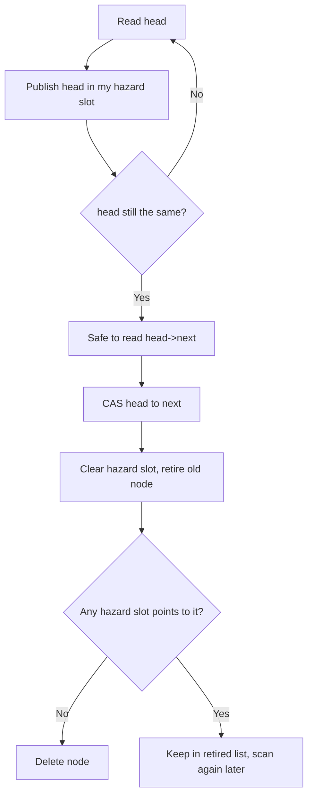
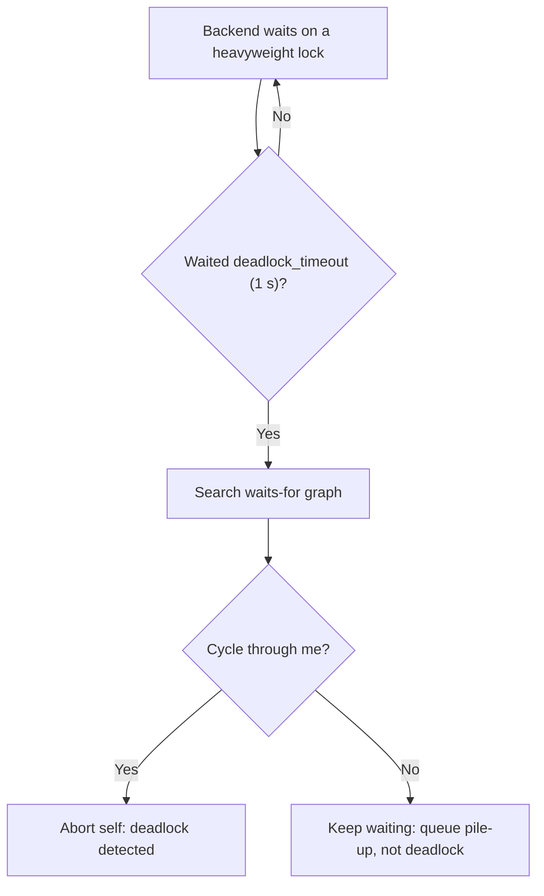
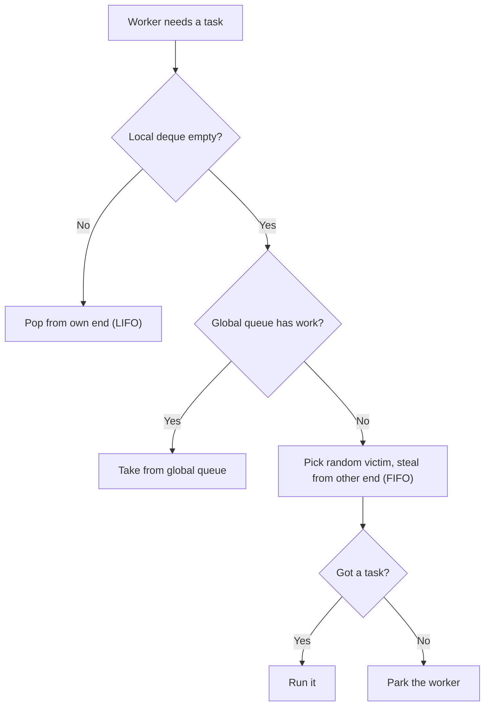
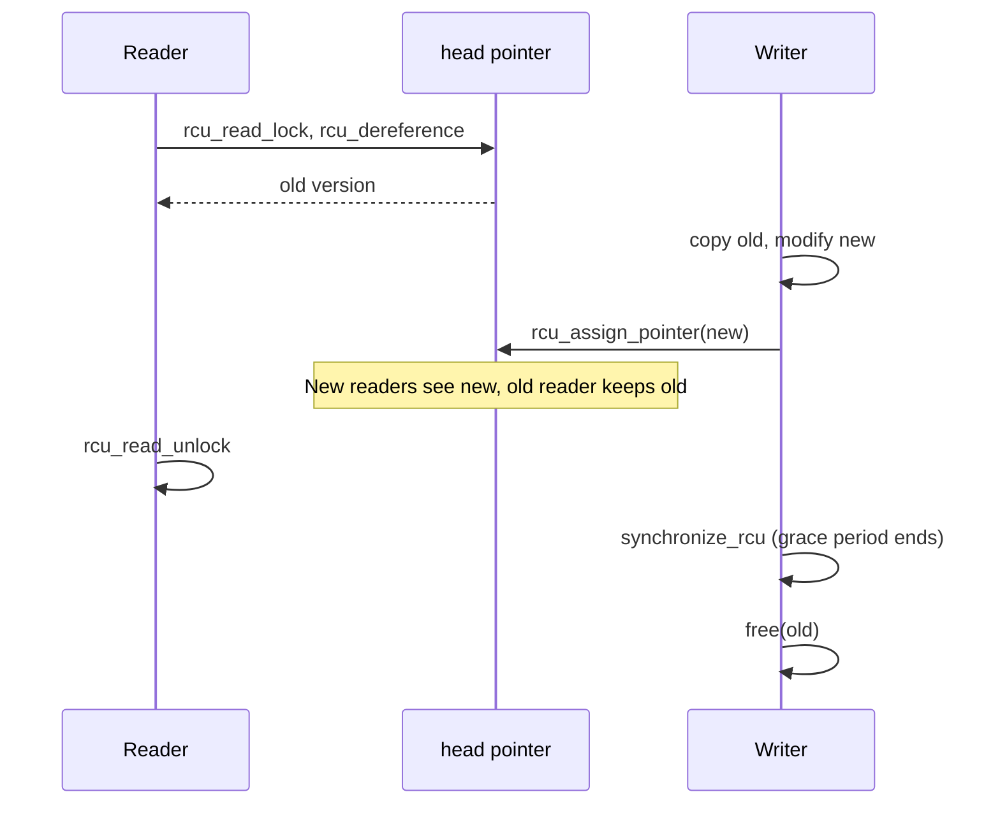
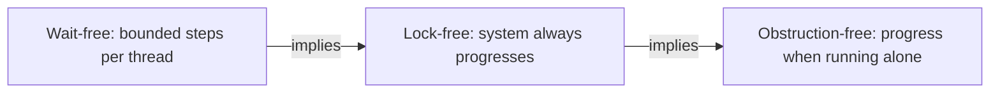

# ⚡ Concurrency & Parallelism — Staff-Level Interview Questions

> *9 questions covering lock-free data structures, memory models, scalability laws, deadlocks, schedulers, RCU, lock contention, thread pools and progress guarantees. Each answer leads with the 30-second version, then the mechanism, then trade-offs and what the interviewer probes next. Current as of October 2026 (C++26, JDK 25/26, Go 1.25, Python 3.14).*

---

## Table of Contents

1. [Lock-Free Data Structures & Hazard Pointers](#1-lock-free-data-structures-hazard-pointers)
2. [Memory Models: Happens-Before & Ordering](#2-memory-models-happens-before)
3. [Amdahl's Law & Universal Scalability Law](#3-amdahls-law-universal-scalability-law)
4. [Deadlock Analysis & Prevention](#4-deadlock-analysis-prevention)
5. [Work-Stealing Schedulers](#5-work-stealing-schedulers)
6. [Read-Copy-Update (RCU)](#6-read-copy-update-rcu)
7. [Futex & Lock Contention Profiling](#7-futex-lock-contention-profiling)
8. [Thread Pools: Design & Tuning](#8-thread-pools-design-tuning)
9. [Non-Blocking Progress Guarantees](#9-non-blocking-progress-guarantees)

---

## 1. Lock-Free Data Structures & Hazard Pointers

**Q:** "Design a lock-free stack (Treiber's stack) in C++. Now a thread pops an element that another thread has already freed. How do hazard pointers solve this ABA problem? Show the implementation."

**What They're Really Testing:** Whether you understand the memory reclamation problem in lock-free programming, not just the atomic operations.

### Answer

!!! tip "30-second answer"
    Treiber's stack is a singly linked list whose `head` is updated with compare-and-swap. The hard part is **memory reclamation**: in `pop`, a thread reads `head` and then `head->next`, but another thread may have popped and **freed** that node in between (use-after-free), or freed and **reused** its address so the CAS succeeds against a different node (ABA). **Hazard pointers** fix both: before dereferencing a node, a thread publishes its address in a per-thread slot and re-checks that it is still `head`; nodes are never freed directly, only **retired**, and a retired node is deleted only when no hazard slot points to it. Alternatives: epoch-based reclamation/RCU (cheaper reads, unbounded garbage if a thread stalls), tagged pointers (fix ABA but not use-after-free), or a garbage collector. C++26 standardises both `std::hazard_pointer` and `std::rcu`.

*Diagram: the hazard-pointer protect-then-validate step in pop.*




**The naive stack and its two bugs:**

```cpp
template <typename T>
class NaiveStack {
    struct Node { T data; Node* next; };
    std::atomic<Node*> head_{nullptr};
public:
    void push(T v) {
        Node* n = new Node{std::move(v), head_.load(std::memory_order_relaxed)};
        while (!head_.compare_exchange_weak(n->next, n,
                   std::memory_order_release, std::memory_order_relaxed)) {}
        // on failure, compare_exchange_weak reloads n->next with the current head
    }

    std::optional<T> pop() {
        Node* old = head_.load(std::memory_order_acquire);
        while (old && !head_.compare_exchange_weak(old, old->next,   // ← reads old->next
                   std::memory_order_acquire, std::memory_order_acquire)) {}
        if (!old) return std::nullopt;
        T v = std::move(old->data);
        delete old;   // ← another thread may be about to read old->next
        return v;
    }
};
```

**ABA, step by step:**

```
Stack: head → N1 → N2 → N3

Thread A (pop):  reads head = N1, reads N1->next = N2 ... preempted

Thread B:        pop()  → removes N1, frees it      head → N2 → N3
                 pop()  → removes N2, frees it      head → N3
                 push(x)→ allocator reuses N1's address for the new node
                                                    head → N1' → N3

Thread A resumes: CAS(head, expected N1, new N2) SUCCEEDS (same address)
                  head → N2, which was freed. The stack now points at garbage
                  and N3 is lost.
```

Even without address reuse, Thread A's read of `N1->next` after Thread B freed N1 is already a use-after-free.

**Hazard pointers (one slot per thread, tested with ASan and TSan):**

```cpp
#include <algorithm>
#include <atomic>
#include <optional>
#include <vector>

constexpr int kMaxThreads = 64;
std::atomic<void*> g_hazard[kMaxThreads];      // slot i: "thread i is reading this node"
std::atomic<int>   g_next_slot{0};

struct ThreadHP {
    int slot = g_next_slot.fetch_add(1);       // simplification: slots are never reused
    std::vector<void*> retired;                // nodes this thread removed but hasn't freed
    std::atomic<void*>& hp() { return g_hazard[slot]; }
};
thread_local ThreadHP t_hp;

template <typename T>
class TreiberStack {
    struct Node { T data; Node* next; };
    std::atomic<Node*> head_{nullptr};
    static constexpr size_t kScanThreshold = 2 * kMaxThreads;   // amortises the scan

    void retire(Node* n) {
        auto& r = t_hp.retired;
        r.push_back(n);
        if (r.size() < kScanThreshold) return;
        std::vector<void*> hazards;                              // snapshot every slot
        for (int i = 0; i < g_next_slot.load(); ++i)
            if (void* p = g_hazard[i].load(std::memory_order_seq_cst)) hazards.push_back(p);
        std::sort(hazards.begin(), hazards.end());
        auto keep = std::partition(r.begin(), r.end(), [&](void* p) {
            return std::binary_search(hazards.begin(), hazards.end(), p);  // still in use
        });
        for (auto it = keep; it != r.end(); ++it) delete static_cast<Node*>(*it);
        r.erase(keep, r.end());                                  // protected ones wait
    }

public:
    void push(T v) {
        Node* n = new Node{std::move(v), head_.load(std::memory_order_relaxed)};
        while (!head_.compare_exchange_weak(n->next, n,
                   std::memory_order_release, std::memory_order_relaxed)) {}
    }

    std::optional<T> pop() {
        auto& hp = t_hp.hp();
        Node* old;
        for (;;) {
            old = head_.load(std::memory_order_acquire);
            if (!old) { hp.store(nullptr); return std::nullopt; }
            hp.store(old, std::memory_order_seq_cst);                    // 1. announce
            if (head_.load(std::memory_order_seq_cst) != old) continue;  // 2. re-validate
            // 3. old is protected: nobody will free it, so old->next is safe to read
            if (head_.compare_exchange_strong(old, old->next,
                    std::memory_order_acq_rel, std::memory_order_acquire)) break;
        }
        hp.store(nullptr, std::memory_order_release);   // we own old exclusively now
        T value = std::move(old->data);
        retire(old);                                    // freed once no hazard points to it
        return value;
    }
};
```

Why each step matters:

- **Announce, then re-validate.** If `head` still equals `old` after the hazard is visible, any thread that later removes `old` will see the hazard during its scan. That argument needs the hazard store to be ordered before the re-read of `head`: a store followed by a load to a different location is the one reordering x86 allows, so use `seq_cst` (or a full fence). Release is not enough.
- **ABA is solved too**: a node's address can't be reused while it is protected, because it is never freed.
- **Bounded garbage**: at most about `threads × threshold` retired nodes exist, even if a thread stalls. That's the main advantage over epoch-based schemes.
- A `continue` inside a `do { } while (CAS)` loop would jump to the CAS with an unvalidated pointer, a common bug in published snippets; hence the `for (;;)`.

**Reclamation options compared:**

| Scheme | Read-side cost | Garbage bound | Notes |
|---|---|---|---|
| Hazard pointers | A seq_cst store + re-check per protected pointer | Bounded | C++26 `<hazard_pointer>`; Folly has production versions |
| Epoch-based / RCU | Nearly free (enter/exit an epoch) | **Unbounded** if a reader stalls | crossbeam-epoch (Rust), liburcu, C++26 `<rcu>` |
| Reference counting | Atomic RMW per access (contended cache line) | Bounded | Hard to make correct lock-free (split counts) |
| Tagged pointers (version counter in the CAS word) | None | — | Fixes ABA only, not use-after-free; needs double-width CAS or spare pointer bits |
| GC (Java, Go) | None | — | ABA on addresses can't happen while a reference exists; this is why lock-free code is much easier in GC'd languages |

**What they probe next:** "Is lock-free faster?" Not necessarily: under contention, every thread's CAS on one `head` line bounces the cache line between cores; a mutex-protected stack can be competitive, and elimination/backoff schemes help. Use lock-free structures for progress guarantees (no thread can block others while holding a lock) and for latency tails, and measure.

### 🔍 Staff-Level Evaluation

| Criterion | What I'm Looking For |
|-----------|----------------------|
| **ABA awareness** | Explains ABA and use-after-free with a concrete interleaving |
| **Hazard pointers** | Knows the announce, re-validate, retire, scan lifecycle and why the store needs seq_cst |
| **Memory ordering** | Uses acquire/release correctly, not just seq_cst everywhere |
| **Alternatives** | RCU/epochs (unbounded garbage), tagged pointers (ABA only), GC; C++26 standardisation |

---

## 2. Memory Models & Happens-Before

**Q:** "This concurrent counter code produces incorrect results despite using atomic operations. Diagnose why and fix it."

```cpp
struct Counter {
    std::atomic<uint64_t> a{0};
    std::atomic<uint64_t> b{0};
    uint64_t c{0};

    void update() {
        a.store(1, std::memory_order_relaxed);
        b.store(1, std::memory_order_relaxed);
        c = 1;  // ← non-atomic!
    }

    bool check() {
        if (b.load(std::memory_order_relaxed)) {
            return a.load(std::memory_order_relaxed) == 1;  // Can be false!
        }
        return true;
    }
};
```

### Answer

!!! tip "30-second answer"
    `relaxed` atomics are atomic but impose **no ordering** with other memory operations, so a thread can see `b == 1` and still `a == 0` (the compiler or CPU reordered the stores or the loads). Make `b` the "flag": store it with **release** and load it with **acquire**. That creates a *synchronizes-with* edge, so everything the writer did before the release (including the write to `a` and even to the plain `c`) *happens-before* everything the reader does after the acquire. If `c` were read concurrently without that edge, it would be a **data race**, which is undefined behaviour in C++.

**Why it fails:**

```
Thread 1 (update)                 Thread 2 (check)
a.store(1, relaxed)               r1 = b.load(relaxed)   // 1
b.store(1, relaxed)               r2 = a.load(relaxed)   // may be 0

Allowed outcome: r1 == 1 && r2 == 0
- the compiler may reorder independent relaxed stores or loads
- weakly ordered CPUs (ARM, POWER) may make the stores visible out of order
- on x86 (TSO) the hardware wouldn't reorder these two stores or two loads,
  so the bug often hides on x86 and appears on ARM servers (Graviton, Apple silicon)
```

**Fix with release/acquire:**

```cpp
struct Counter {
    std::atomic<uint64_t> a{0};
    std::atomic<uint64_t> b{0};
    uint64_t c{0};

    void update() {
        a.store(1, std::memory_order_relaxed);
        c = 1;                                    // plain write, published by the release below
        b.store(1, std::memory_order_release);    // "publish"
    }

    bool check() {
        if (b.load(std::memory_order_acquire)) {  // "subscribe"
            // everything sequenced before the release store is visible here
            return a.load(std::memory_order_relaxed) == 1 && c == 1;   // guaranteed true
        }
        return true;
    }
};

// Happens-before chain:
// a = 1, c = 1  ──sequenced-before──►  b.store(release)
//                                            │ synchronizes-with (reads the value 1)
// b.load(acquire) ──sequenced-before──►  read a, read c
```

**The memory orders in one table:**

| Order | Guarantees | Typical use |
|---|---|---|
| `relaxed` | Atomicity and a single modification order per variable; nothing else | Statistics counters |
| `release` (store) / `acquire` (load) | Writes before the release are visible after a matching acquire | Publishing data, locks, SPSC queues |
| `acq_rel` | Both, for read-modify-write | CAS in lock-free structures |
| `seq_cst` (default) | Acquire/release plus one global order of all seq_cst operations | Store-then-load patterns (Dekker, hazard pointers); the safe default |
| `consume` | Intended "dependency ordering"; never implemented as specified (compilers treat it as acquire), deprecated for C++26 | Don't use |

**Across languages (what interviewers expect you to know in 2026):**

| Language | Model in one line |
|---|---|
| C/C++ | Data races are undefined behaviour. Atomics with explicit orders as above. DRF-SC: race-free programs using only seq_cst atomics behave sequentially consistent |
| Java (JMM, JSR-133) | `volatile` reads/writes and `synchronized`/locks create happens-before edges; `volatile` is sequentially consistent. `VarHandle` (Java 9+) adds plain/opaque/acquire-release/volatile modes. Racy programs aren't UB: you get some value written by some thread, never out-of-thin-air, but `long`/`double` writes may tear without `volatile` |
| Go | 2022 memory model revision: `sync/atomic` operations are **sequentially consistent** and create happens-before edges; channels, mutexes, `sync.Once`, `WaitGroup` define the rest. Races on multi-word values (interfaces, slices, strings) can corrupt memory; run tests with `-race` |
| Python | With the GIL, bytecodes are atomic but statements like `x += 1` are not. The **free-threaded build** (PEP 703; experimental in 3.13, officially supported but still optional in 3.14 per PEP 779) removes the GIL: the interpreter keeps built-in objects internally consistent with per-object locks, but your invariants need `threading.Lock` exactly as in any other language |
| Rust | C++20 orders, but the type system (`Send`/`Sync`, ownership) rules out data races in safe code |

**Compiler vs CPU:** both reorder. A `volatile` variable in C/C++ stops some compiler optimisations but gives neither atomicity nor CPU ordering; it's for memory-mapped I/O, not threads.

**What they probe next:** "Write Dekker's / Peterson's lock with atomics." Each thread stores its own flag and then loads the other's: this **store→load** pattern needs `seq_cst` (or a full fence) even on x86, because TSO allows a later load to pass an earlier store through the store buffer.

### 🔍 Staff-Level Evaluation

| Criterion | What I'm Looking For |
|-----------|----------------------|
| **Relaxed semantics** | Knows relaxed = atomic but no ordering |
| **Release/acquire** | Explains synchronizes-with and that it publishes non-atomic writes too |
| **SC-DRF** | Knows race-free programs with seq_cst atomics behave sequentially consistent |
| **Hardware** | x86 TSO hides bugs that ARM exposes; store→load needs seq_cst |
| **Cross-language** | Java volatile/VarHandle, Go 2022 model, free-threaded Python |

---

## 3. Amdahl's Law & Universal Scalability Law

**Q:** "A database query takes 100ms, of which 20ms is sequential (connection setup, query parsing) and 80ms is parallelizable (scanning 8 partitions). If we double the CPUs from 8 to 16, what speedup do we get? Now factor in the Universal Scalability Law's contention and coherence costs."

**What They're Really Testing:** Whether you understand the fundamental limits of parallelism — not just Amdahl's Law's formula, but the real-world overheads of contention and coherence that the Universal Scalability Law captures.

### Answer

!!! tip "30-second answer"
    Amdahl: `speedup = 1 / (S + P/N)`. With S = 0.2: 8 CPUs give 3.33×, 16 give 4.0×, and no number of CPUs beats 5×. **But read the question:** the parallel part is 8 partitions, so with one partition per worker, CPUs 9–16 have nothing to do: going from 8 to 16 CPUs gives **no** speedup until you split the data into more partitions. Amdahl is also optimistic: it ignores the cost of coordination. The **Universal Scalability Law** adds a contention term σ (queueing on shared resources) and a coherence term κ (pairwise cross-talk, growing ~N²), which predicts a **peak** at `N* = √((1−σ)/κ)` and **retrograde** scaling beyond it. Fit σ and κ from load tests at a few concurrency levels and size pools near the peak.

**Amdahl's Law — the idealized limit:**

```
Speedup(N) = 1 / (S + P/N),   S + P = 1,  here S = 0.2, P = 0.8

N = 8   → 1 / (0.2 + 0.100)  = 3.33×   (query: 30 ms)
N = 16  → 1 / (0.2 + 0.050)  = 4.00×   (query: 25 ms)  ← only if work splits 16 ways
N = 32  → 1 / (0.2 + 0.025)  = 4.44×
N = 64  → 1 / (0.2 + 0.0125) = 4.71×
N = ∞   → 1 / 0.2            = 5.00×   ← hard ceiling set by the serial 20 ms
```

Doubling 8 → 16 improves speedup by 4.00/3.33 = 1.2× (+0.67), 16 → 32 by 1.11×, 32 → 64 by 1.06×. Each doubling buys less. The practical lever is usually **shrinking S** (cache the parsed plan, pool connections), not adding CPUs.

**What Amdahl ignores:** synchronisation and communication cost, load imbalance (skewed partitions, stragglers), shared-resource limits (memory bandwidth, locks, the database itself). Gustafson's law is the optimistic counterpoint: if the problem size grows with N (bigger scans), the parallel fraction grows and speedup scales better.

**Universal Scalability Law (Neil Gunther):**

```
C(N) = N / (1 + σ(N−1) + κ·N(N−1))

σ = contention: fraction of work that serialises (locks, a single queue, a hot row)
κ = coherence: cost of keeping N workers consistent with each other
    (cache-line bouncing, cross-node chatter); grows with the number of pairs
κ = 0 → Amdahl's law (σ plays the role of S)
Peak at N* = √((1 − σ) / κ); beyond it, throughput DROPS
```

**Fitting USL to measurements:**

```python
import math

n_values = [1, 2, 4, 8, 16]
throughput = [1000, 1800, 3200, 4800, 5200]       # measured req/s at each concurrency
relative = [x / throughput[0] for x in throughput]


def usl(n: float, sigma: float, kappa: float) -> float:
    return n / (1 + sigma * (n - 1) + kappa * n * (n - 1))


def sse(sigma: float, kappa: float) -> float:
    return sum((usl(n, sigma, kappa) - c) ** 2 for n, c in zip(n_values, relative))


# Coarse grid search; in practice use scipy.optimize.curve_fit
sigma, kappa = min(((s / 1000, k / 100000) for s in range(500) for k in range(2000)),
                   key=lambda p: sse(*p))
print(f"sigma={sigma:.3f} kappa={kappa:.5f} peak N≈{math.sqrt((1 - sigma) / kappa):.0f}")
for n in [1, 2, 4, 8, 16, 32, 64]:
    print(f"N={n:3d}  usl={usl(n, sigma, kappa):.2f}x")

# sigma=0.057 kappa=0.00506 peak N≈14
# N=  1  usl=1.00x
# N=  2  usl=1.87x
# N=  4  usl=3.25x
# N=  8  usl=4.76x
# N= 16  usl=5.21x   ← near the peak (measured 5.2x)
# N= 32  usl=4.11x   ← predicted retrograde
# N= 64  usl=2.56x
```

The fit says: this service peaks around 14 concurrent workers. Values beyond the measured range are a **prediction**; confirm with one more load test before acting on them.

**Three regimes:**

| Regime | What dominates | What you see |
|---|---|---|
| Near-linear | Little contention | Each worker adds almost a full unit |
| Saturation | σ: queueing on a shared resource | Throughput flattens, latency rises |
| Retrograde | κ: coherence (lock handoffs, cache-line bouncing, false sharing, cross-node coordination) | Adding workers **reduces** throughput |

**Using it in practice:**

1. Load test at 5–8 concurrency levels (e.g. `wrk -t4 -c<N>`, k6, or the DB's own benchmark).
2. Fit σ and κ; compute N*.
3. Size thread pools, connection pools and partitions near N* (with headroom below it), and investigate what σ and κ are physically: a hot lock, a single-threaded component, a shared counter.
4. USL also models **load** (concurrent users) on a fixed system, which is why database connection pools far larger than the core count make throughput worse.

### 🔍 Staff-Level Evaluation

| Criterion | What I'm Looking For |
|-----------|----------------------|
| **Amdahl's Law** | Calculates speedup = 1/(S+P/N), identifies the 5× limit |
| **Reads the question** | Notices 8 partitions can't use 16 CPUs without repartitioning |
| **USL understanding** | Knows σ (contention) and κ (coherence), the N² term and the peak formula |
| **Practical application** | Fits USL from measurements, sizes pools near N*, flags extrapolation |

---

## 4. Deadlock Analysis & Prevention

**Q:** "A production PostgreSQL database is experiencing periodic complete hangs. Analysis shows all active queries are waiting on `LWLock` or `transactionid` locks. Walk through the deadlock detection algorithm and propose prevention."

**What They're Really Testing:** Whether you understand deadlock at the system level — the waits-for graph algorithm, detection vs prevention strategies, and how real databases like PostgreSQL handle this under load.

### Answer

!!! tip "30-second answer"
    A true deadlock in PostgreSQL doesn't hang forever: after a backend has waited `deadlock_timeout` (1 s default) on a heavyweight lock, it searches the **waits-for graph** for a cycle and, if it finds one, aborts **itself** with `deadlock detected`. So "complete hangs" usually mean something else: a **lock queue pile-up** behind one long-running or idle-in-transaction session (often a DDL statement waiting for `ACCESS EXCLUSIVE` and blocking everyone queued behind it), or LWLock contention, which is short-term internal locking that the deadlock detector doesn't cover. Diagnose with `pg_blocking_pids()` to find the head of the chain. Prevent real deadlocks by acquiring locks in a consistent order, keeping transactions short, and using `lock_timeout` for DDL; treat detection as the safety net.

**The four Coffman conditions** (all must hold; break any one to prevent deadlock):

| Condition | Database example | How to break it |
|---|---|---|
| Mutual exclusion | Row lock held by one transaction | Use MVCC reads / shared locks where possible |
| Hold and wait | Holds row 1, waits for row 2 | Acquire everything up front (`SELECT ... FOR UPDATE` on all rows in one statement) |
| No preemption | Locks aren't taken away | Timeouts (`lock_timeout`, `NOWAIT`) act as self-preemption |
| Circular wait | A waits for B, B waits for A | **Global lock order** (most effective) |

*Diagram: how PostgreSQL turns a lock wait into a deadlock abort or a plain wait.*




**Waits-for graph cycle detection:**

```python
from collections import defaultdict


class WaitsForGraph:
    """Edge A → B means 'A waits for a lock that B holds'."""

    def __init__(self) -> None:
        self.graph: dict[int, set[int]] = defaultdict(set)

    def add_wait(self, waiter: int, holder: int) -> None:
        self.graph[waiter].add(holder)

    def find_cycle_from(self, start: int) -> list[int] | None:
        """DFS from the waiting backend; return a cycle through `start`, if any."""
        path: list[int] = []
        on_path: set[int] = set()
        visited: set[int] = set()

        def dfs(node: int) -> list[int] | None:
            path.append(node)
            on_path.add(node)
            visited.add(node)
            for nxt in self.graph.get(node, ()):
                if nxt == start:
                    return path + [start]           # cycle back to the waiter
                if nxt not in visited:
                    found = dfs(nxt)
                    if found:
                        return found
            path.pop()
            on_path.discard(node)
            return None

        return dfs(start)


g = WaitsForGraph()
g.add_wait(12345, 12346)
g.add_wait(12346, 12347)
g.add_wait(12347, 12345)
print(g.find_cycle_from(12345))   # [12345, 12346, 12347, 12345]
```

**How PostgreSQL actually does it:**

- Detection is **lazy**: a backend sleeps on a heavyweight lock; only if it is still waiting after `deadlock_timeout` does it run the check. Most lock waits resolve before then, so the expensive check rarely runs.
- If it finds a cycle, the **backend that ran the check** aborts its own transaction. There is no "cheapest victim" selection. (Before aborting, it may also try to rearrange wait queues to resolve "soft" deadlocks.)
- LWLocks (buffer mapping, WAL insertion, lock manager partitions...) are short-lived internal locks with no deadlock detection; heavy waiting on them points at contention or a hot spot, not a cycle.

**What the log looks like:**

```
ERROR:  deadlock detected
DETAIL:  Process 12345 waits for ShareLock on transaction 1045; blocked by process 12346.
         Process 12346 waits for ShareLock on transaction 1044; blocked by process 12345.
         Process 12345: UPDATE accounts SET balance = balance + 100 WHERE id = 2;
         Process 12346: UPDATE accounts SET balance = balance + 100 WHERE id = 1;
HINT:  See server log for query details.
CONTEXT:  while updating tuple (0,2) in relation "accounts"
```

"ShareLock on transaction" means "waiting for that transaction to finish", which is how row-lock waits appear.

**Find the head of a blocking chain (PostgreSQL 9.6+):**

```sql
SELECT pid,
       pg_blocking_pids(pid)          AS blocked_by,
       state,
       wait_event_type || ':' || wait_event AS waiting_on,
       now() - xact_start             AS xact_age,
       left(query, 80)                AS query
FROM pg_stat_activity
WHERE cardinality(pg_blocking_pids(pid)) > 0
   OR pid IN (SELECT unnest(pg_blocking_pids(pid)) FROM pg_stat_activity)
ORDER BY xact_start;
```

Look for a session that blocks others but isn't blocked itself: often `idle in transaction` (application forgot to commit) or a migration.

**The classic "hang" that isn't a deadlock:**

```
T1: long analytics query on orders      (holds ACCESS SHARE)
T2: ALTER TABLE orders ADD COLUMN ...   (wants ACCESS EXCLUSIVE → queues behind T1)
T3..T500: ordinary SELECT/UPDATE on orders → queue BEHIND T2 (lock queue is FIFO-ish)
→ the whole application stalls until T1 finishes
```

Fix: run DDL with `SET lock_timeout = '3s'` and retry, and set `idle_in_transaction_session_timeout` so abandoned transactions can't hold locks forever.

**Reproduce and fix a real deadlock:**

```sql
-- Session A                                   -- Session B
BEGIN;                                          BEGIN;
UPDATE accounts SET balance = balance - 100
  WHERE id = 1;                                 UPDATE accounts SET balance = balance - 100
                                                  WHERE id = 2;
UPDATE accounts SET balance = balance + 100
  WHERE id = 2;   -- waits for B
                                                UPDATE accounts SET balance = balance + 100
                                                  WHERE id = 1;   -- cycle → one session aborts after ~1 s

-- Fix: lock rows in a consistent order before updating them
BEGIN;
SELECT id FROM accounts WHERE id IN (1, 2) ORDER BY id FOR UPDATE;
UPDATE accounts SET balance = balance - 100 WHERE id = 1;
UPDATE accounts SET balance = balance + 100 WHERE id = 2;
COMMIT;
```

(PostgreSQL's `UPDATE` has no `ORDER BY`; the ordered `SELECT ... FOR UPDATE` takes the locks in a deterministic order.) Also note: an unindexed foreign key or a multi-row `UPDATE` without an index doesn't lock the whole table in PostgreSQL (it locks only rows it modifies), but it makes statements slower and lock-holding longer; in MySQL/InnoDB, a missing index can make next-key locking lock far more rows.

**Prevention strategies, in order of effectiveness:**

1. **Consistent lock ordering** (by primary key, or by a canonical resource order).
2. **Short transactions**: no network calls or user think-time inside a transaction; batch large updates.
3. **Timeouts**: `lock_timeout` for DDL and optimistic paths; `NOWAIT` / `SKIP LOCKED` for queue-like tables.
4. **Retry on serialization failures and deadlocks** (SQLSTATE `40P01`, `40001`) in the application, with jittered backoff; deadlocks become a rare, handled event rather than an outage.
5. **Monitor**: `pg_stat_database.deadlocks`, `log_lock_waits = on` (logs any wait longer than `deadlock_timeout`).

**In application code:**

```java
// Java: acquire both locks or neither (breaks hold-and-wait)
static void withBoth(Lock a, Lock b, Runnable critical) throws InterruptedException {
    while (true) {
        if (a.tryLock(100, TimeUnit.MILLISECONDS)) {
            try {
                if (b.tryLock(100, TimeUnit.MILLISECONDS)) {
                    try {
                        critical.run();
                        return;
                    } finally {
                        b.unlock();
                    }
                }
            } finally {
                a.unlock();              // only reached when a was acquired
            }
        }
        // randomized backoff so two threads don't retry in lockstep (livelock)
        Thread.sleep(ThreadLocalRandom.current().nextInt(1, 20));
    }
}
```

```go
// Go: the runtime detects only TOTAL deadlock
var mu1, mu2 sync.Mutex

go func() { mu1.Lock(); defer mu1.Unlock(); mu2.Lock(); defer mu2.Unlock() }()
go func() { mu2.Lock(); defer mu2.Unlock(); mu1.Lock(); defer mu1.Unlock() }()
// If main is still running (e.g. serving HTTP), these two goroutines hang forever
// silently. "fatal error: all goroutines are asleep - deadlock!" appears only when
// EVERY goroutine is blocked. Use a goroutine dump (SIGQUIT, /debug/pprof/goroutine)
// to find the stuck pair, and fix it with a consistent lock order.
```

Java has a built-in detector for monitor/`ReentrantLock` cycles: `jstack` prints "Found one Java-level deadlock", and `ThreadMXBean.findDeadlockedThreads()` works at runtime.

### 🔍 Staff-Level Evaluation

| Criterion | What I'm Looking For |
|-----------|----------------------|
| **Coffman conditions** | Can enumerate all 4 conditions and knows which to break |
| **Waits-for graph** | Explains cycle detection, lazy detection after deadlock_timeout, self-abort |
| **Real database knowledge** | Distinguishes deadlocks from lock-queue pile-ups and LWLock contention; uses pg_blocking_pids |
| **Prevention vs detection** | Lock ordering, short transactions, timeouts, retries; detection as safety net |

---

## 5. Work-Stealing Schedulers

**Q:** "Design a work-stealing scheduler for a distributed task system processing 100K tasks/second. Compare the Go scheduler's GMP model with Java's ForkJoinPool. How do you prevent thread starvation while maintaining cache locality?"

**What They're Really Testing:** Whether you understand the fundamentals of work-stealing — the tradeoff between locality and load balancing, and the specifics of production scheduler implementations.

### Answer

!!! tip "30-second answer"
    Each worker owns a **deque**: it pushes and pops new work at one end (LIFO, so recently created tasks run while their data is still in cache), and idle workers **steal** from the other end (FIFO, the oldest and usually largest tasks, which also minimises contention with the owner). A global queue takes externally submitted work and is checked periodically for fairness. **Go** applies this to goroutines: per-P local run queues, a global queue checked every 61 schedule ticks, stealing half of a victim's queue, and the netpoller to park goroutines on I/O. **Java's ForkJoinPool** applies it to fork/join tasks and is also the default scheduler for **virtual threads**. Starvation is prevented with the global queue checks, time-slice preemption (Go), and bounded local queues that spill to the global queue.

**The core algorithm (illustrative Python; real deques are lock-free, e.g. Chase-Lev):**

```python
import random
from collections import deque
from typing import Callable

Task = Callable[[], None]


class Worker:
    def __init__(self, scheduler: "Scheduler") -> None:
        self.scheduler = scheduler
        self.local: deque[Task] = deque()

    def find_task(self) -> Task | None:
        if self.local:
            return self.local.pop()                 # own end: LIFO, cache-hot
        if task := self.scheduler.poll_global():    # external submissions
            return task
        victims = [w for w in self.scheduler.workers if w is not self]
        random.shuffle(victims)
        for v in victims:                           # steal from the other end: FIFO
            if v.local:
                try:
                    return v.local.popleft()
                except IndexError:                  # victim emptied it meanwhile
                    continue
        return None                                 # caller parks the worker
```

*Diagram: the order in which an idle worker looks for work.*




**Go scheduler — G, M, P:**

| | What it is |
|---|---|
| **G** | Goroutine: starts with a 2 KB stack that grows by copying |
| **M** | OS thread |
| **P** | Scheduling context; `GOMAXPROCS` of them (default = CPUs; since **Go 1.25** it also respects the container's cgroup CPU limit). An M needs a P to run Go code |

Finding work (`findRunnable`, simplified):

1. Every 61st schedule, take one G from the **global** queue first (fairness).
2. The P's `runnext` slot (a just-readied G, e.g. the receiver of a channel send) then the P's **local queue** (256 slots; overflow moves half to the global queue).
3. The global queue.
4. Poll the **network poller** (non-blocking) for goroutines whose sockets became ready.
5. **Steal** half of another P's local queue (random order, a few rounds), including timers.
6. Nothing found: release the P and park the M (some Ms "spin" briefly first to cut wake-up latency).

Other mechanics: there is **no dedicated poller thread**; schedulers and `sysmon` poll epoll/kqueue. A goroutine in a blocking **syscall** keeps its M, and `sysmon` hands the P to another M so other goroutines keep running. Since Go 1.14, `sysmon` preempts a goroutine that runs for more than ~10 ms by sending the thread a signal (asynchronous preemption), so tight loops can't starve a P.

**Java ForkJoinPool:**

```java
class SumTask extends RecursiveTask<Long> {
    private static final int THRESHOLD = 10_000;
    private final long[] array;
    private final int lo, hi;

    SumTask(long[] array, int lo, int hi) { this.array = array; this.lo = lo; this.hi = hi; }

    @Override
    protected Long compute() {
        if (hi - lo <= THRESHOLD) {
            long sum = 0;
            for (int i = lo; i < hi; i++) sum += array[i];
            return sum;
        }
        int mid = (lo + hi) >>> 1;
        SumTask left = new SumTask(array, lo, mid);
        SumTask right = new SumTask(array, mid, hi);
        left.fork();                    // push onto this worker's deque
        long r = right.compute();       // work on the other half directly
        long l = left.join();           // if not done: run it ourselves or help others
        return l + r;
    }
}
long total = ForkJoinPool.commonPool().invoke(new SumTask(data, 0, data.length));
```

`join()` doesn't simply block: if the forked task is still in the local deque the worker runs it, otherwise it helps by running other tasks (including ones stolen from the thief). Blocking inside a ForkJoin task (I/O, locks) starves the pool unless you use `ForkJoinPool.ManagedBlocker`, which lets the pool add a compensating thread.

**Virtual threads (JDK 21+)** run on a ForkJoinPool of carrier threads. When a virtual thread blocks on I/O or a `java.util.concurrent` lock, it unmounts and the carrier runs another one. Since **JDK 24 (JEP 491)**, blocking inside `synchronized` no longer pins the carrier; native calls still do. Structured concurrency (`StructuredTaskScope`) is still a **preview** API in JDK 25/26.

**Comparison:**

| Aspect | Go scheduler | ForkJoinPool (incl. virtual threads) | Tokio (Rust) |
|---|---|---|---|
| Unit | Goroutine (own growable stack) | ForkJoinTask, or virtual thread continuation | Future (stackless state machine) |
| Preemption | Asynchronous (signals) since 1.14 | None for tasks; virtual threads yield only at blocking points | Cooperative (`.await` points; budget per task) |
| Local queue | Per-P ring buffer + `runnext` | Per-worker deque | Per-worker queue + LIFO slot |
| Stealing | Half of victim's queue | Tasks from the victim's base | Half of victim's queue |
| Blocking I/O | Netpoller parks the G | Virtual threads unmount; platform FJ tasks must not block | Must not block the worker (`spawn_blocking`) |

**Starvation and fairness:**

- **Global queue checks** (Go's every-61-ticks rule) so external work isn't starved by tasks that keep spawning local work.
- **Preemption or budgets** so one long task can't monopolise a worker (Go's async preemption; Tokio's per-task budget).
- **LIFO slot limits**: Go and Tokio cap how often the "run next" slot can bypass the queue, so two goroutines ping-ponging can't starve the rest.
- **Separate pools for blocking work**, so blocked tasks don't take scheduler threads.

For a **distributed** task system at 100K tasks/s, work stealing applies inside each node; across nodes you need a partitioned queue (Kafka partitions, SQS) plus pull-based consumers, which is the distributed equivalent: idle consumers pull, so busy ones aren't overloaded.

### 🔍 Staff-Level Evaluation

| Criterion | What I'm Looking For |
|-----------|----------------------|
| **Local deque design** | LIFO for owner (cache hot) vs FIFO for thief (big, cold tasks, less contention) |
| **Go GMP model** | G/M/P, findRunnable order, netpoller without a dedicated thread, syscall handoff, async preemption |
| **ForkJoinPool join()** | Knows join helps instead of blocking; ManagedBlocker; virtual threads on FJP |
| **Starvation** | Global queue fairness, preemption/budgets, separate blocking pools |

---

## 6. Read-Copy-Update (RCU)

**Q:** "Design a concurrent linked list that supports wait-free reads (millions/sec) while writers update nodes. You can't use reader-writer locks because the read path is too hot. Use RCU."

**What They're Really Testing:** Whether you understand RCU's fundamental insight — that reads can be wait-free if you defer reclamation until all concurrent readers are done.

### Answer

!!! tip "30-second answer"
    RCU splits an update into **removal** and **reclamation**. Writers never modify data in place: they build a new version, publish it with one pointer store (release), and only **free** the old version after a **grace period**, when every reader that might have seen it has finished. Readers just mark a read-side section and follow pointers (acquire/dependency loads): no locks, no atomic read-modify-writes, no writes to shared memory, so reads scale perfectly across cores. The cost moves to writers: they serialise among themselves (usually with a lock) and must wait for, or defer, reclamation. Ideal for read-mostly data: routing tables, configuration, membership lists.

**The RCU protocol:**

```
Readers                              Writer (holds the writer lock)
rcu_read_lock()                      1. new = copy(old); modify new
p = rcu_dereference(head)            2. rcu_assign_pointer(head, new)   ← release store
... use *p ...                          new readers see new; old readers keep old
rcu_read_unlock()                    3. synchronize_rcu()  (or call_rcu(free, old))
                                        wait until every pre-existing reader is done
                                     4. free(old)
```

*Diagram: readers keep running on the old version while the writer swaps and later frees it.*




**RCU-protected linked list (Linux kernel style):**

```c
struct node { int key; int value; struct node __rcu *next; struct rcu_head rcu; };
static struct node __rcu *head;
static DEFINE_SPINLOCK(writer_lock);

/* Reader: wait-free */
int lookup(int key, int *value) {
    int found = 0;
    rcu_read_lock();
    for (struct node *n = rcu_dereference(head); n; n = rcu_dereference(n->next)) {
        if (n->key == key) { *value = n->value; found = 1; break; }
    }
    rcu_read_unlock();
    return found;
}

/* Insert at head: publish a fully initialised node. No grace period needed:
   nothing is being freed. */
void insert(struct node *n) {
    spin_lock(&writer_lock);
    RCU_INIT_POINTER(n->next, rcu_dereference_protected(head, lockdep_is_held(&writer_lock)));
    rcu_assign_pointer(head, n);            /* release: n's fields visible first */
    spin_unlock(&writer_lock);
}

/* Delete: unlink, then free after a grace period */
void delete(int key) {
    spin_lock(&writer_lock);
    struct node __rcu **pp = &head;
    struct node *n;
    while ((n = rcu_dereference_protected(*pp, lockdep_is_held(&writer_lock)))) {
        if (n->key == key) {
            rcu_assign_pointer(*pp, rcu_dereference_protected(n->next, 1));
            spin_unlock(&writer_lock);
            kfree_rcu(n, rcu);              /* readers already on n can still walk n->next */
            return;
        }
        pp = &n->next;
    }
    spin_unlock(&writer_lock);
}
```

(The kernel has ready-made versions: `list_add_rcu`, `list_del_rcu`, `hlist_*_rcu`.) **Updating** a node's value follows the same pattern: copy the node, change the copy, swap it in with `rcu_assign_pointer`, free the old one after a grace period.

**How grace periods are detected:**

| Flavour | Read side | Grace period ends when |
|---|---|---|
| Kernel (non-preemptible) | `rcu_read_lock` = disable preemption (often zero instructions) | Every CPU has passed a **quiescent state** (context switch, idle, user mode) |
| Kernel preemptible RCU / SRCU | Per-task or per-CPU counters | Counters for the old phase drain |
| liburcu QSBR (userspace) | Free; threads periodically announce `rcu_quiescent_state()` | All registered threads announced since the update |
| liburcu memb / epoch-based | Per-thread counter with a phase bit, plus a memory barrier | All threads seen in the new phase or offline |

`synchronize_rcu()` takes milliseconds or more, so writers that can't block use `call_rcu`/`kfree_rcu` to defer the free.

**The everyday version in garbage-collected languages:** copy-on-write behind an atomic reference. The GC is the grace-period mechanism: the old version is reclaimed when no reader references it.

```go
type Config struct{ Routes map[string]string } // treat as immutable once published

var current atomic.Pointer[Config]

func Lookup(k string) string { return current.Load().Routes[k] } // wait-free read

var writeMu sync.Mutex

func Update(k, v string) {
	writeMu.Lock()
	defer writeMu.Unlock()
	old := current.Load()
	next := &Config{Routes: make(map[string]string, len(old.Routes)+1)}
	for key, val := range old.Routes {
		next.Routes[key] = val
	}
	next.Routes[k] = v
	current.Store(next) // publish; readers holding old keep a consistent snapshot
}
```

Java: an `AtomicReference<ImmutableMap>` (or `volatile` field) works the same way; `CopyOnWriteArrayList` is the library version. C++20 `std::atomic<std::shared_ptr<T>>` is the portable version without a GC (not lock-free on most implementations), and C++26 adds `std::rcu_obj_base`/`std::rcu_retire`.

**When RCU fits and when it doesn't:**

| Fits | Doesn't fit |
|---|---|
| Reads vastly outnumber writes | Write-heavy data: every update copies and defers frees |
| Readers tolerate seeing the old version briefly | Readers need the latest value or atomic multi-object updates |
| Pointer-linked or whole-object-replaceable data | Huge objects that are expensive to copy for small changes |
| Kernel: routing tables, dcache lookups, module lists, many netfilter structures | Memory-constrained systems if grace periods are long (garbage piles up) |

### 🔍 Staff-Level Evaluation

| Criterion | What I'm Looking For |
|-----------|----------------------|
| **Read-side cost** | Readers take no locks and write no shared memory |
| **Grace period** | Explains quiescent states / counters, synchronize_rcu vs call_rcu |
| **Write-side** | Writers serialise, publish with release, defer frees; inserts need no grace period |
| **Practical mapping** | Copy-on-write + atomic pointer in Go/Java; kernel usage; when not to use it |

---

## 7. Futex & Lock Contention Profiling

**Q:** "A high-frequency trading application shows 8% CPU time spent in `futex_wait` and `futex_wake` syscalls. Walk through how you'd diagnose and fix this: profiling, adaptive spinning, and lock-free alternatives."

**What They're Really Testing:** Whether you understand the fast-path/slow-path design of modern mutexes and can profile/optimize lock contention in production.

### Answer

!!! tip "30-second answer"
    A futex-based mutex is an integer in user memory: uncontended lock/unlock is one atomic instruction (tens of ns), and the kernel is involved only when a thread must sleep (`FUTEX_WAIT`) or be woken (`FUTEX_WAKE`). Time in futex syscalls therefore means **contention**: threads repeatedly find the lock held, sleep, and pay a syscall plus a context switch (µs) per handoff. Find **which** lock (off-CPU profiling of futex call stacks, or language-level lock profilers), then reduce contention: shorten the critical section, shard the lock, give each piece of state a single writer, or spin briefly before sleeping if hold times are sub-µs. For an HFT system the usual end state is **single-writer-per-shard** with queues between threads, not a cleverer lock.

**A correct futex mutex (Ulrich Drepper, "Futexes Are Tricky"):**

```c
/* state: 0 = unlocked, 1 = locked, no waiters, 2 = locked, maybe waiters */
void lock(atomic_int *f) {
    int c = 0;
    if (atomic_compare_exchange_strong(f, &c, 1))
        return;                                   /* fast path: no syscall */
    if (c != 2)
        c = atomic_exchange(f, 2);                /* announce: there may be waiters */
    while (c != 0) {
        futex_wait(f, 2);                         /* sleeps only if *f is still 2 */
        c = atomic_exchange(f, 2);                /* retry; keep "contended" marked */
    }
}

void unlock(atomic_int *f) {
    if (atomic_fetch_sub(f, 1) != 1) {            /* was 2: someone may be sleeping */
        atomic_store(f, 0);
        futex_wake(f, 1);                         /* syscall only when contended */
    }
}
```

The kernel's `FUTEX_WAIT` checks atomically that the value is still the expected one before sleeping, which avoids the lost-wakeup race. Writing the "contended" marker with a plain store instead of `atomic_exchange` (a common simplification) can overwrite an unlock and break mutual exclusion.

**Spin, then sleep:**

```c
void lock_adaptive(atomic_int *f) {
    for (int i = 0; i < 100; i++) {               /* bounded spin */
        int c = 0;
        if (atomic_compare_exchange_weak(f, &c, 1)) return;
        cpu_relax();                              /* x86 PAUSE / ARM YIELD */
    }
    lock(f);                                      /* fall back to sleeping */
}
```

Spinning helps only when the holder is **running** on another core and releases within roughly the cost of a sleep/wake. It wastes CPU when the holder is preempted, and is harmful when threads outnumber cores.

| Runtime | Behaviour |
|---|---|
| glibc `pthread_mutex` | Default type doesn't spin; `PTHREAD_MUTEX_ADAPTIVE_NP` spins briefly |
| Java `synchronized` | CAS-based lightweight locking, inflating to a monitor that spins adaptively before parking. (Biased locking was removed in JDK 18.) `ReentrantLock` parks via `LockSupport` |
| Go `sync.Mutex` | Spins a few times on multicore, then sleeps; switches to **starvation mode** (direct handoff) if a waiter waits more than 1 ms |
| Rust `std::sync::Mutex` | Futex-based on Linux since 1.62, spins briefly before sleeping |

**Profiling contention:**

```bash
# Which call stacks block in futex, and for how long (off-CPU time, eBPF)
offcputime -p $(pidof app) -f 30 > offcpu.folded    # bcc; feed into flamegraph.pl
# or count futex syscalls by user stack
bpftrace -e 'tracepoint:syscalls:sys_enter_futex /pid == $1/ { @[ustack] = count(); }' $(pidof app)

# Syscall summary for the process
perf trace -s -p $(pidof app) -- sleep 10

# Kernel lock contention (BPF-based, Linux 6.x perf); covers kernel locks,
# not your userspace mutexes
perf lock contention -a -b -- sleep 10
```

Language-level profilers are usually faster to act on: Go `runtime.SetMutexProfileFraction` + `pprof -mutex` (and the block profile), Java Flight Recorder `jdk.JavaMonitorEnter` / `jdk.ThreadPark` events or async-profiler `-e lock`.

**Reducing contention, in order of preference:**

1. **Shorten the critical section:** move allocation, logging, I/O and computation outside the lock.
2. **Shard the lock** (lock striping): one lock per symbol/key bucket. Java's `ConcurrentHashMap` and `LongAdder` are this idea.
3. **Avoid sharing:** per-thread or per-core state aggregated periodically (counters, histograms).
4. **Single writer:** give each shard (e.g. each symbol's order book) to exactly one thread and send it commands through SPSC/MPSC queues (the LMAX Disruptor model). No locks on the hot path, perfect cache locality, and deterministic ordering. This is how most low-latency matching engines are built.
5. **Read-mostly data:** RCU/copy-on-write (Q6) instead of reader-writer locks, whose reader count is itself a contended cache line.
6. **Lock-free structures** where the progress guarantee matters; they don't remove cache-line contention by themselves.

**Example diagnosis (illustrative):** off-CPU flame graph shows most futex waits under `OrderBook::apply()`, a single lock shared by 48 threads with a ~200 ns critical section. Sharding by symbol cuts waits sharply; moving each symbol group to a dedicated pinned thread fed by a ring buffer removes futex calls from the hot path entirely. Verify with p99/p99.9 latency, not just CPU.

### 🔍 Staff-Level Evaluation

| Criterion | What I'm Looking For |
|-----------|----------------------|
| **Futex mechanics** | Userspace fast path, kernel only on contention, value check in FUTEX_WAIT |
| **Adaptive spinning** | Knows when spinning helps (holder running, short hold) and when it hurts |
| **Profiling** | Off-CPU/eBPF stacks, language profilers; knows `perf lock` targets kernel locks |
| **Mitigation strategy** | Shorter sections → sharding → single writer → lock-free, measured on tail latency |

---

## 8. Thread Pools: Design & Tuning

**Q:** "Design a thread pool for a web server handling 50K requests/second with mixed CPU-bound (image processing) and I/O-bound (database queries) tasks. How do you size the pool? What happens under overload (backpressure)?"

**What They're Really Testing:** Whether you understand the queuing theory behind thread pool sizing and can size pools correctly and have practical overload protection strategies.

### Answer

!!! tip "30-second answer"
    First do capacity math, then size pools. Don't mix CPU-bound and I/O-bound work in one pool: use **bulkheads**. CPU pool ≈ number of cores. I/O pool ≈ `cores × (1 + wait/compute)`, or in Java 21+ use **virtual threads** and bound concurrency with a semaphore matched to the real limit (usually the DB connection pool). Every pool gets a **bounded queue** and an explicit **rejection policy** (shed with 503, or caller-runs to push back), plus deadlines so queued work that's already too late is dropped. An unbounded queue turns overload into unbounded latency and eventually an OOM.

**Capacity math first (Little's Law):**

```
50K req/s × 2 ms CPU (image work)  = 100 CPU-seconds per second → ~100 cores busy
50K req/s × 20 ms total latency     = 1,000 requests in flight at any moment

On one 16-core box: max CPU-bound throughput = 16 × (1000 ms / 2 ms) = 8,000 req/s.
So 50K req/s needs ~7+ such machines (more with headroom), whatever the pool size.
```

**Sizing formulas (Goetz, *Java Concurrency in Practice*):**

```
CPU-bound pool:  N_threads ≈ N_cores            (maybe +1 to cover page faults/GC pauses)
I/O-bound pool:  N_threads ≈ N_cores × U × (1 + W/C)
                 U = target CPU utilisation, W = wait time, C = compute time per task

Example: 16 cores, C = 2 ms, W = 18 ms, U = 0.9
         16 × 0.9 × (1 + 9) = 144 threads → about 144 / 20 ms = 7,200 req/s per box
```

Then check the **downstream** limit: 144 threads per box × 10 boxes = 1,440 concurrent DB queries. If the database can only usefully run ~100 (Q3's USL peak), the thread count isn't the constraint; the DB connection pool is, and extra threads only queue.

**Bulkheads and backpressure in Java:**

```java
int cores = Runtime.getRuntime().availableProcessors();

// CPU-bound bulkhead: fixed size, BOUNDED queue, explicit rejection policy
ThreadPoolExecutor imagePool = new ThreadPoolExecutor(
        cores, cores, 0L, TimeUnit.MILLISECONDS,
        new ArrayBlockingQueue<>(500),
        new ThreadPoolExecutor.CallerRunsPolicy());   // or AbortPolicy → map to HTTP 503

// I/O-bound work on virtual threads (JDK 21+); the semaphore is the real limit
Semaphore dbPermits = new Semaphore(50);              // = DB connection pool size
try (ExecutorService io = Executors.newVirtualThreadPerTaskExecutor()) {
    io.submit(() -> {
        if (!dbPermits.tryAcquire(50, TimeUnit.MILLISECONDS)) {
            throw new RejectedExecutionException("DB saturated");   // shed, don't queue forever
        }
        try {
            return repository.load(id);
        } finally {
            dbPermits.release();
        }
    });
}
```

!!! warning "The `ThreadPoolExecutor` growth trap"
    `ThreadPoolExecutor` adds threads beyond `corePoolSize` **only when the queue is full**. With an unbounded `LinkedBlockingQueue` (what `Executors.newFixedThreadPool` uses), `maximumPoolSize` is never reached and the queue grows without limit. Use a bounded queue, and size core = max for predictable behaviour.

**Rejection policies:**

| Policy | Behaviour | Use when |
|---|---|---|
| Abort / shed (HTTP 503 or 429 with `Retry-After`) | Fail fast | Request/response services; clients retry with backoff and jitter |
| Caller-runs | Submitting thread runs the task, slowing the producer | Internal pipelines where slowing the producer is the right feedback. Dangerous if the caller is an event-loop/acceptor thread |
| Discard oldest | Drop stale queued work | Real-time feeds where old data is worthless |
| Block the producer with a timeout | Bounded wait for queue space | Batch ingestion |

Beyond fixed limits: **adaptive concurrency limits** (TCP-like AIMD on latency, e.g. Netflix's concurrency-limits library, Envoy's adaptive concurrency filter) and **deadline propagation** (drop a queued request whose caller already timed out; it's pure wasted work).

**ForkJoinPool vs ThreadPoolExecutor vs virtual threads:**

| | ForkJoinPool | ThreadPoolExecutor | Virtual threads |
|---|---|---|---|
| Best for | Recursive divide-and-conquer CPU work | Independent tasks with explicit queue/rejection control | Thread-per-request I/O-bound code |
| Queues | Per-worker deques + stealing | One shared `BlockingQueue` | Scheduled on a ForkJoinPool of carriers |
| Sizing | ≈ cores | Explicit core/max/queue | Millions are fine; bound the **resources** (semaphores, connection pools) |
| Pitfall | Blocking inside tasks starves it | Tasks that wait on other tasks in the same bounded pool can deadlock (thread-starvation deadlock) | Pinning in native code; `ThreadLocal`-heavy code multiplies memory |

### 🔍 Staff-Level Evaluation

| Criterion | What I'm Looking For |
|-----------|----------------------|
| **Capacity math** | Little's Law first; notices one box can't do 50K req/s of 2 ms CPU work |
| **Sizing formula** | N_cores for CPU, N × U × (1 + W/C) for I/O; checks downstream limits |
| **Backpressure** | Bounded queues, rejection policy, deadlines, adaptive limits |
| **Bulkheads & runtime** | Separate pools; knows the TPE growth trap and virtual threads + semaphores |

---

## 9. Non-Blocking Progress Guarantees

**Q:** "Your team is designing a concurrent hash table for a real-time ad bidding system. One engineer proposes a wait-free design, another says lock-free is sufficient, a third suggests obstruction-free. Walk through the tradeoffs and recommend an approach."

**What They're Really Testing:** Whether you understand the non-blocking progress hierarchy — wait-free vs lock-free vs obstruction-free — and can make practical engineering tradeoffs.

### Answer

!!! tip "30-second answer"
    **Wait-free**: every thread finishes each operation in a bounded number of its own steps. **Lock-free**: some thread always finishes, but an individual thread can retry forever. **Obstruction-free**: a thread finishes if it eventually runs alone. All three avoid the core weakness of locks: a preempted or crashed lock holder can't stall everyone. Stronger guarantees cost complexity and often average speed. For ad bidding, where the table is read on every request and updated in batches every few minutes, the best answer is none of the three bespoke designs: **publish an immutable snapshot behind an atomic pointer** (Q6). Lookups become a single atomic load plus a plain hash lookup, which is wait-free; updates build a new table and swap it in. If writes were frequent, use a proven lock-free or fine-grained-locked map (Java `ConcurrentHashMap`, Folly/libcds/Rust `dashmap`/`papaya`), not a home-grown one.

**The progress hierarchy:**

```
Wait-free        ⊂  Lock-free           ⊂  Obstruction-free
(every thread       (the system always      (a thread finishes
 finishes in         makes progress;         if it runs alone
 bounded steps)      a thread may starve)    long enough)

Blocking (locks) offers none of these: if the lock holder is descheduled,
crashes or page-faults, every waiter stalls.
```

*Diagram: each progress guarantee implies the weaker ones.*




| Guarantee | Typical technique | Example |
|---|---|---|
| Wait-free | Hardware atomics with no retry loop; **helping** (threads complete each other's pending operations) | `fetch_add` counters on x86 (`LOCK XADD`); RCU/snapshot readers; Kogan–Petrank wait-free queue (2011) |
| Lock-free | CAS retry loops: a failed CAS means someone else succeeded | Treiber stack, Michael–Scott queue, Harris linked list, Cliff Click's NonBlockingHashMap |
| Obstruction-free | Optimistic attempt, abort on interference, retry with backoff (needs a contention manager to avoid livelock) | Herlihy–Luchangco–Moir obstruction-free deque (2003), many software transactional memories |

Nuances interviewers like:

- On LL/SC architectures (ARM without LSE atomics, POWER), `fetch_add` compiles to a retry loop, so it's lock-free rather than wait-free; ARMv8.1 LSE adds single-instruction atomics.
- A **seqlock** gives writers progress but readers can retry forever while writes keep happening: readers are not lock-free.
- Lock-free does not mean fast: CAS loops on a hot cache line can be slower than a well-designed lock. The benefit is **tail latency and robustness** (no convoying behind a preempted holder).
- Wait-free designs exist even for hash maps, but they are complex, rarely available in production libraries, and usually slower on average; "fast-path-slow-path" designs run a lock-free fast path and fall back to wait-free helping only under starvation.

**A small wait-free example: read side of a published snapshot**

```cpp
#include <atomic>
#include <memory>
#include <string>
#include <unordered_map>

using BidTable = std::unordered_map<std::string, double>;

// C++20: atomic<shared_ptr> handles reclamation (implementations typically use a
// small internal lock, so check is_lock_free(); the RCU/hazard-pointer versions avoid it).
// Supported by libstdc++ (GCC 12+) and MSVC; libc++ (Clang on macOS) doesn't ship it yet,
// so there you'd use the older std::atomic_load/atomic_store overloads for shared_ptr.
std::atomic<std::shared_ptr<const BidTable>> g_table{std::make_shared<const BidTable>()};

double lookup(const std::string& key) {
    auto snap = g_table.load(std::memory_order_acquire);   // one atomic load
    auto it = snap->find(key);                              // plain read of immutable data
    return it == snap->end() ? 0.0 : it->second;
}

void publish(BidTable next) {                               // every few minutes, one writer
    g_table.store(std::make_shared<const BidTable>(std::move(next)),
                  std::memory_order_release);
}
```

**Recommendation for ad bidding:**

| Option | Verdict |
|---|---|
| Wait-free hash table | Highest complexity and risk; tail-latency benefit over the snapshot approach is nil when writes are rare |
| Obstruction-free | Under real contention, conflicting operations abort and retry; tail latency is unpredictable |
| Lock-free hash map | Right if writes are frequent and concurrent; use a proven library, mind memory reclamation |
| **Immutable snapshot + atomic pointer (RCU-style)** | **Recommended**: wait-free reads, trivial correctness, consistent view per request; cost is memory for two copies during a swap and rebuild time on update |

Whatever you pick, the hard parts of non-blocking code are the same: **memory reclamation** (Q1), **ABA**, **false sharing** (pad hot fields to 64-byte lines), and **testing** (ThreadSanitizer, model checkers like CDSChecker/GenMC, stress tests on ARM, where weak ordering exposes bugs that x86 hides).

### 🔍 Staff-Level Evaluation

| Criterion | What I'm Looking For |
|-----------|----------------------|
| **Hierarchy clarity** | Clearly distinguishes wait-free, lock-free, obstruction-free, and blocking |
| **Practical tradeoffs** | Recommends based on the read/write mix, not the strongest guarantee |
| **Wait-free complexity** | Knows helping, fast-path-slow-path, LL/SC nuance, seqlock readers |
| **Real-world examples** | Names proven libraries and data structures; snapshot publishing for read-mostly data |

---

> *All 9 topics include code examples, algorithmic analysis, and evaluation rubrics at staff-engineer depth. For complementary resources, see the [cs-interview README](../README.md).*
