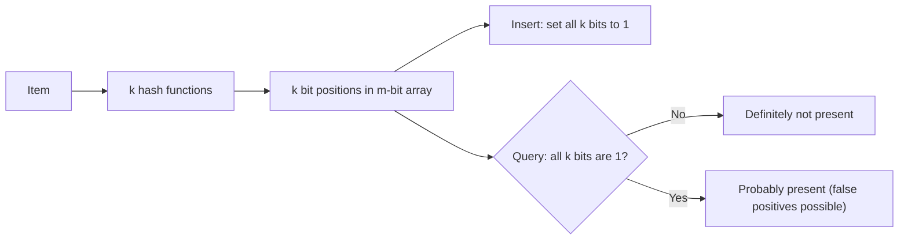
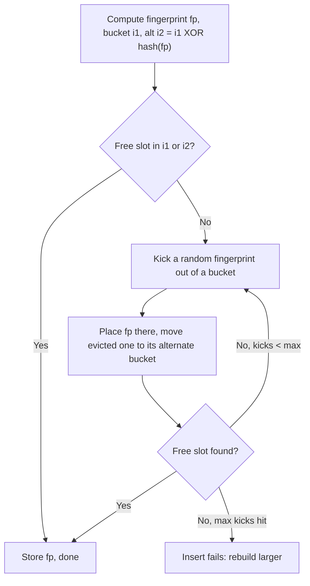
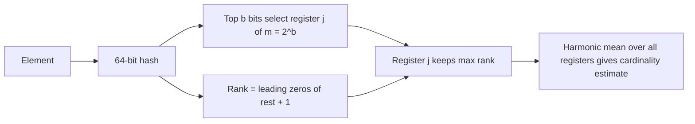
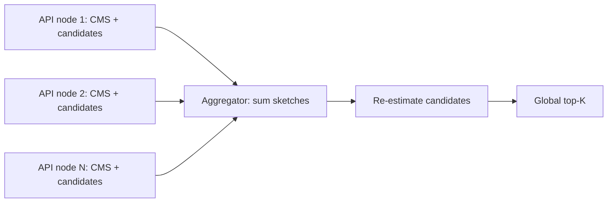

# 📐 Data Structures for Scale — Staff/Principal-Level Interview Q&A

> *12 deep-dive topics covering probabilistic data structures, spatial indexes, and ordered structures used at scale in production systems. Every code block below runs as-is (Python 3.10+, standard library only, except the H3 section which needs `pip install h3`, v4 API).*

---

## Table of Contents

1. [Bloom Filter: Approximate Membership](#1-bloom-filter-approximate-membership)
2. [Cuckoo Filter: Better Bloom](#2-cuckoo-filter-better-bloom)
3. [HyperLogLog: Cardinality Estimation](#3-hyperloglog-cardinality-estimation)
4. [Count-Min Sketch: Frequency Estimation](#4-count-min-sketch-frequency-estimation)
5. [MinHash: Set Similarity](#5-minhash-set-similarity)
6. [Geohash: Spatial Encoding](#6-geohash-spatial-encoding)
7. [S2 Geometry: Hierarchical Spatial Indexing](#7-s2-geometry-hierarchical-spatial-indexing)
8. [H3: Hexagonal Grid System](#8-h3-hexagonal-grid-system)
9. [Quad Tree: 2D Spatial Partitioning](#9-quad-tree-2d-spatial-partitioning)
10. [R-Tree: Bounding Box Index](#10-r-tree-bounding-box-index)
11. [Skip List: Probabilistic Ordered Structure](#11-skip-list-probabilistic-ordered-structure)
12. [Merkle Tree: Tamper-Evident Verification](#12-merkle-tree-tamper-evident-verification)

---

## 1. Bloom Filter: Approximate Membership

**Q:** "We run a news aggregator serving 500M unique URLs per day. We need to avoid re-crawling the same URL twice. Design a system that tracks seen URLs with < 1GB memory. What false-positive rate can you guarantee? Walk me through the math."

**What They're Really Testing:** Whether you can reason about the trade-off space between memory, false-positive rate, and capacity — and whether you know which variant to use when.

!!! tip "30-second answer"
    With m bits, n items and k hashes, FP ≈ (1 − e^(−kn/m))^k, minimised at k = (m/n)·ln 2. 1 GB = 8×10⁹ bits for 5×10⁸ URLs is 16 bits per URL → k = 11 → **FP ≈ 0.046%**: about 1 in 2,200 new URLs is wrongly skipped. Bloom filters never give false negatives, so no URL is crawled twice, but a false positive means a page is *never* crawled, which is the real product cost. "500M per day" also means the set keeps growing: plan for **time-partitioned filters** (one per day, query the last N) or a scalable Bloom filter, and shard by host so each crawler node owns its filter.

### Answer

**Classic Bloom Filter Math:**

```text
n = 5×10⁸ URLs, m = 1 GB = 8×10⁹ bits → m/n = 16 bits per URL

Optimal k = (m/n)·ln 2 = 16 × 0.693 = 11.1 → 11 hash functions

p = (1 − e^(−k·n/m))^k
  = (1 − e^(−11/16))^11
  = (1 − 0.503)^11
  ≈ 0.00046  → 0.046% false positives

Rule of thumb: bits per key = 1.44·log₂(1/p)
  1%    → 9.6 bits/key        0.1%  → 14.4 bits/key
  0.01% → 19.2 bits/key       each 10× lower p costs ~4.8 more bits/key

What would 1.8 GB buy? 28.8 bits/URL, k = 20 → p ≈ 0.0001% (1 in a million).
Whether that's worth 800 MB depends on how much a never-crawled page costs.
```

*Diagram: a Bloom filter sets or checks k bit positions per item.*




**Production version: a scalable Bloom filter for an unbounded stream:**

```python
import hashlib
import math


class BloomFilter:
    def __init__(self, capacity: int, fp_rate: float = 0.01):
        self.capacity = capacity
        self.m = math.ceil(-capacity * math.log(fp_rate) / math.log(2) ** 2)   # bits
        self.k = max(1, round(self.m / capacity * math.log(2)))                # hashes
        self.bits = bytearray((self.m + 7) // 8)
        self.count = 0

    def _positions(self, item: str):
        d = hashlib.blake2b(item.encode(), digest_size=16).digest()
        h1 = int.from_bytes(d[:8], "little")
        h2 = int.from_bytes(d[8:], "little") | 1
        for i in range(self.k):                  # Kirsch–Mitzenmacher double hashing
            yield (h1 + i * h2) % self.m

    def add(self, item: str) -> None:
        for p in self._positions(item):
            self.bits[p >> 3] |= 1 << (p & 7)
        self.count += 1

    def might_contain(self, item: str) -> bool:
        return all(self.bits[p >> 3] & (1 << (p & 7)) for p in self._positions(item))

    def is_full(self) -> bool:
        return self.count >= self.capacity


class ScalableBloomFilter:
    """Almeida et al. (2007): when the current filter reaches capacity, add a
    filter `growth`× larger whose FP target is tightened by `ratio`. The
    overall FP rate stays below p0 / (1 - ratio), so start at p0 = p·(1 - ratio)."""

    def __init__(self, initial_capacity: int, fp_rate: float = 0.01,
                 growth: int = 2, ratio: float = 0.9):
        self.growth, self.ratio = growth, ratio
        self.next_fp = fp_rate * (1 - ratio)
        self.filters = [BloomFilter(initial_capacity, self.next_fp)]

    def add(self, item: str) -> None:
        if self.filters[-1].is_full():
            self.next_fp *= self.ratio
            self.filters.append(BloomFilter(self.filters[-1].capacity * self.growth,
                                            self.next_fp))
        self.filters[-1].add(item)

    def might_contain(self, item: str) -> bool:
        return any(f.might_contain(item) for f in reversed(self.filters))


sbf = ScalableBloomFilter(initial_capacity=10_000, fp_rate=0.01)
for i in range(200_000):
    sbf.add(f"https://example.com/{i}")
assert all(sbf.might_contain(f"https://example.com/{i}") for i in range(0, 200_000, 7))
fp = sum(sbf.might_contain(f"https://other.org/{i}") for i in range(100_000)) / 100_000
print(f"filters={len(sbf.filters)} observed FP={fp:.4f} (target ≤ 0.01)")
```

Sample output: 5 filters, observed FP ≈ 0.3% against a 1% bound (the bound is conservative).

**Production Variants and When to Use Them:**

| Variant | Key Feature | Use Case |
|---------|-------------|----------|
| **Classic Bloom** | Simple, smallest for p ≳ 3% | Per-SSTable "is the key in this file?" checks (Cassandra, HBase, RocksDB) |
| **Scalable Bloom** | Grows by adding tighter filters | Unknown cardinality: crawlers, dedup streams |
| **Counting Bloom** | 4-bit counters allow deletion | Rarely worth 4× memory; prefer a cuckoo filter |
| **Blocked Bloom** | All k bits in one 64-byte cache line | One cache miss per lookup instead of k; slightly higher FP for the same memory. RocksDB's format |
| **Cuckoo / xor / Ribbon** | Fingerprint-based | Deletion (cuckoo), static sets 15–30% smaller (xor, Ribbon) |

**Staff-Level Trade-Offs:**

- **Which error is acceptable?** A false positive here means "skip a new URL", so you lose content, not CPU. If that's unacceptable, use the filter only as a fast path and confirm positives against an exact store (a key-value lookup) for important domains.
- **Rotate, don't grow forever:** one filter per day (500M URLs → ~1 GB each at 0.05%) and check the last 30 days, or recrawl policy will want "seen in the last N days" anyway.
- **Shard by host:** crawler nodes partitioned by hostname each keep a small local filter; no cross-node lookups on the hot path.
- **Hashing:** one 128-bit hash split into h1/h2 (Kirsch–Mitzenmacher) instead of k hashes; keyed if adversaries choose the input.

### 🔍 Staff-Level Evaluation

| Criterion | What I'm Looking For |
|-----------|----------------------|
| **Math** | Calculates m, k, p correctly from scratch; knows 1.44·log₂(1/p) bits/key |
| **Hash independence** | Names Kirsch-Mitzenmacher double hashing |
| **Scaling** | Scalable or time-partitioned filters for an unbounded stream |
| **Product impact** | Explains what a false positive costs in *this* system |

---

## 2. Cuckoo Filter: Better Bloom

**Q:** "Your caching layer needs to support deletion of stale entries from the probabilistic filter. A counting Bloom filter uses 4× memory. Design a better alternative. What's the Cuckoo filter's advantage, and what's its Achilles' heel?"

**What They're Really Testing:** Whether you understand the fundamental trade-off between Bloom filters (bit array + hashes) and Cuckoo filters (hash table + fingerprints). Most engineers know Bloom filters; staff engineers know when Bloom isn't enough.

!!! tip "30-second answer"
    A cuckoo filter (Fan et al., 2014) stores a short **fingerprint** of each item in one of two buckets (4 slots each); the alternate bucket is `i ⊕ hash(fingerprint)`, so entries can be moved without the original key. Lookup checks 2 buckets (≤ 2 cache misses); **delete** just removes the fingerprint. FP ≈ 2b/2^f, so 12-bit fingerprints give ~0.2%, and below ~3% FP it uses **less** space than a Bloom filter. Its weaknesses: inserts can **fail** once the table is ~95% full (so you must size it or resize/rebuild), deleting an item that was never inserted can remove another item's fingerprint, and the same item can only be inserted 2b times.

### Answer

**Cuckoo Filter — Core Idea (runnable):**

```python
import hashlib
import random


class CuckooFilter:
    """Fan et al. (2014). Stores an f-bit fingerprint of each item in one of two
    candidate buckets of b slots. The second bucket is i1 XOR hash(fp), so it can
    be computed from (bucket, fingerprint) alone during relocation.
    False-positive rate ≈ 2b / 2^f  (b = 4, f = 12 → ~0.2%)."""

    def __init__(self, capacity: int, fp_bits: int = 12, bucket_size: int = 4,
                 max_kicks: int = 500):
        self.b, self.f, self.max_kicks = bucket_size, fp_bits, max_kicks
        n = 1
        while n * bucket_size * 0.95 < capacity:   # ~95% load is achievable with b = 4
            n <<= 1                                # power of two so XOR stays in range
        self.n = n
        self.buckets: list[list[int]] = [[] for _ in range(n)]
        self.victim: int | None = None             # stashed fingerprint after a failed insert

    def _h(self, data: bytes) -> int:
        return int.from_bytes(hashlib.blake2b(data, digest_size=8).digest(), "little")

    def _fp_and_index(self, item: str) -> tuple[int, int]:
        h = self._h(item.encode())
        fp = (h >> 32) % ((1 << self.f) - 1) + 1   # never 0 (0 often marks an empty slot)
        return fp, h % self.n

    def _alt(self, i: int, fp: int) -> int:
        return (i ^ self._h(fp.to_bytes(4, "little"))) % self.n

    def insert(self, item: str) -> bool:
        if self.victim is not None:
            return False                           # full: resize/rebuild before inserting more
        fp, i1 = self._fp_and_index(item)
        i2 = self._alt(i1, fp)
        for i in (i1, i2):
            if len(self.buckets[i]) < self.b:
                self.buckets[i].append(fp)
                return True
        i = random.choice((i1, i2))
        for _ in range(self.max_kicks):            # relocate ("kick") existing fingerprints
            slot = random.randrange(self.b)
            fp, self.buckets[i][slot] = self.buckets[i][slot], fp
            i = self._alt(i, fp)
            if len(self.buckets[i]) < self.b:
                self.buckets[i].append(fp)
                return True
        self.victim = fp    # keep the evicted fingerprint, or that item gets a false negative
        return False

    def contains(self, item: str) -> bool:
        fp, i1 = self._fp_and_index(item)
        return fp in self.buckets[i1] or fp in self.buckets[self._alt(i1, fp)] or fp == self.victim

    def delete(self, item: str) -> bool:
        """Only delete items you inserted: deleting a never-inserted item that
        shares a fingerprint removes someone else's entry (false negative)."""
        fp, i1 = self._fp_and_index(item)
        for i in (i1, self._alt(i1, fp)):
            if fp in self.buckets[i]:
                self.buckets[i].remove(fp)
                return True
        return False


random.seed(3)
cf = CuckooFilter(capacity=100_000)
ok = sum(cf.insert(f"k{i}") for i in range(100_000))
assert ok == 100_000 and all(cf.contains(f"k{i}") for i in range(100_000))
fp = sum(cf.contains(f"x{i}") for i in range(100_000)) / 100_000
load = sum(map(len, cf.buckets)) / (cf.n * cf.b)
for i in range(50_000):
    cf.delete(f"k{i}")
assert all(cf.contains(f"k{i}") for i in range(50_000, 100_000))
print(f"buckets={cf.n} load={load:.2f} fp={fp:.4f} (2b/2^f = {8 / 4096:.4f})")
```

Sample output: FP ≈ 0.18% (formula 0.20%), all 100,000 inserts succeed at 76% load, and deletions leave the other items intact.

*Diagram: cuckoo filter insert, relocating fingerprints between two candidate buckets.*




**The Achilles' Heels:**

| Problem | Why | Mitigation |
|---|---|---|
| Insert failure | When both buckets are full, relocation chains grow; past ~95% load (b = 4) the kick limit is hit | Size for known capacity; on failure, rebuild into a 2× table (needs the original keys, or grow by stacking filters) |
| Unsafe delete | Delete matches on fingerprint, not key | Only delete keys you know were inserted (e.g. tracked in the source of truth) |
| Duplicate inserts | Each insert of the same item takes a slot in one of the same 2 buckets | Check `contains` first, or accept the 2b limit |
| Fingerprints vs FP rate | FP grows with bucket size: ≈ 2b/2^f | Larger f for lower FP; semi-sorting saves ~1 bit per item |

**Bloom vs Cuckoo Comparison:**

| Property | Bloom Filter | Cuckoo Filter |
|----------|-------------|---------------|
| **Lookup** | k probes, up to k cache misses (1 if blocked) | 2 buckets, ≤ 2 cache misses |
| **Insert** | Always succeeds; FP rises as it overfills | O(1) amortized, can fail near capacity |
| **Delete** | No (counting variant: 4× memory) | Yes |
| **Space per item** | 1.44·log₂(1/p) | ≈ (log₂(1/p) + 3)/α with load α ≈ 0.95 (≈ +2 with semi-sorting) |
| **Example, p = 0.1%** | 14.4 bits | ≈ 13.6 bits |
| **Example, p = 5%** | 6.2 bits | ≈ 7.7 bits (Bloom smaller) |

**When would you pick Cuckoo over Bloom?** You need deletion; you want lower space at FP ≲ 3%; you want predictable lookups (2 cache lines). Pick Bloom when inserts must never fail, when the set size is unknown, or when FP can be a few percent. RedisBloom offers both (`BF.*`, `CF.*`).

### 🔍 Staff-Level Evaluation

| Criterion | What I'm Looking For |
|-----------|----------------------|
| **Fingerprint concept** | Explains partial-key cuckoo hashing — alternative bucket via XOR |
| **FP formula** | ≈ 2b/2^f; sizes f for a target FP |
| **Insert failure** | Understands the load-factor limit, kick threshold, and keeping the evicted victim |
| **Comparison to Bloom** | Knows the ~3% crossover and the unsafe-delete caveat |

---

## 3. HyperLogLog: Cardinality Estimation

**Q:** "We need to count distinct users visiting our site every hour — 10M DAU, 1B events/hour. Exact counting needs one entry per distinct user per window (80 MB of raw 64-bit IDs, several times that in a hash set). Design a system that uses < 2KB per time window and gives < 2% error. Walk me through the stochastic averaging math."

**What They're Really Testing:** Whether you understand the algorithm's internal mechanics — not just how to use a library.

!!! tip "30-second answer"
    Hash each user; the number of leading zeros in a hash is ≥ k with probability 2^−k, so the maximum seen estimates log₂(n). HLL splits users into m = 2^b buckets by the first b bits, keeps the max rank per bucket, and combines them with a bias-corrected harmonic mean; error ≈ **1.04/√m**. The two constraints conflict slightly: < 2% needs m ≥ 2,704 → 4,096 registers, which is 3 KB at 6 bits (2.5 KB at 5 bits); fitting under 2 KB means m = 2,048 at ~2.3%. Say so, then offer options: 4-bit registers with an exception table (Apache DataSketches' HLL_4 ≈ 2 KB for m = 4,096), or accept 2.3%. Hourly sketches **merge** into daily/weekly uniques by taking register-wise max.

### Answer

**The Core Insight:**

HyperLogLog exploits a simple probabilistic fact: if you hash each element uniformly, the probability that a hash has at least `ρ−1` leading zeros is `2^−(ρ−1)`. The maximum rank observed gives a rough estimate of `log₂(n)`.

*Diagram: HyperLogLog splits the hash stream across registers and combines them.*




The problem with a single register is high variance (±1 = 2× error). **Stochastic averaging** splits the stream into `m = 2^b` registers using the first `b` bits of the hash and combines them with a harmonic mean.

```python
import hashlib
import math


class HyperLogLog:
    """Dense HLL, leading-zero form: top b bits pick the register, rank = leading
    zeros of the remaining 64-b bits + 1. 6-bit registers (rank ≤ 65 - b)."""

    def __init__(self, b: int = 12):
        self.b, self.m = b, 1 << b
        self.registers = bytearray(self.m)

    def _rank(self, x: int) -> tuple[int, int]:
        j = x >> (64 - self.b)
        rest = x & ((1 << (64 - self.b)) - 1)
        return j, (64 - self.b) - rest.bit_length() + 1

    def add(self, value: str) -> None:
        x = int.from_bytes(hashlib.blake2b(value.encode(), digest_size=8).digest(), "big")
        j, rho = self._rank(x)
        if rho > self.registers[j]:
            self.registers[j] = rho

    def count(self) -> float:
        m = self.m
        alpha = 0.7213 / (1 + 1.079 / m)            # m ≥ 128
        e = alpha * m * m / sum(2.0 ** -r for r in self.registers)
        zeros = self.registers.count(0)
        if e <= 2.5 * m and zeros:
            e = m * math.log(m / zeros)            # linear counting for small n
        return e                                    # no large-range fix needed with 64-bit hashes

    def merge(self, other: "HyperLogLog") -> None:
        assert self.b == other.b, "precision must match"
        self.registers = bytearray(map(max, self.registers, other.registers))


class SparseFirstHLL(HyperLogLog):
    """HLL++ idea: while few registers are set, keep {index: rank} instead of
    the full array; convert to dense once the map would cost more than it saves."""

    def __init__(self, b: int = 12):
        super().__init__(b)
        self.sparse: dict[int, int] | None = {}
        self.registers = None                       # allocated on conversion

    def add(self, value: str) -> None:
        if self.sparse is None:
            return super().add(value)
        x = int.from_bytes(hashlib.blake2b(value.encode(), digest_size=8).digest(), "big")
        j, rho = self._rank(x)
        if rho > self.sparse.get(j, 0):
            self.sparse[j] = rho
        if len(self.sparse) > self.m // 8:          # threshold is a tuning knob
            self.registers = bytearray(self.m)
            for j, r in self.sparse.items():
                self.registers[j] = r
            self.sparse = None

    def count(self) -> float:
        if self.sparse is not None:                 # few registers set → linear counting is exact-ish
            return self.m * math.log(self.m / (self.m - len(self.sparse)))
        return super().count()


for cls in (HyperLogLog, SparseFirstHLL):
    for n in (100, 10_000, 1_000_000):
        h = cls(12)
        for i in range(n):
            h.add(f"u{i}")
        print(cls.__name__, n, f"{(h.count() - n) / n:+.2%}")
```

Sample output: errors of +0.2%, +3.8% and +0.4% for 100, 10,000 and 1,000,000 users with m = 4,096. The 10,000 case sits right where the estimator switches from linear counting to raw HLL (≈ 2.5m), a region where raw HLL is biased. That's exactly what **HLL++**'s empirical bias correction fixes. The full trailing-zero implementation with merge is in [Interview Questions Q3](./INTERVIEW_QUESTIONS.md#3-hyperloglog-cardinality-estimation).

**HyperLogLog++ (Heule, Nunkesser & Hall, Google, 2013)** adds:

1. 64-bit hashes, so no large-range correction is needed.
2. A **sparse representation** for small cardinalities (as above, but with compressed sorted lists and higher internal precision), which matters when you keep millions of hourly sketches that mostly see few users.
3. Empirically measured **bias correction** around the 2.5m transition.

**Error Bounds (6-bit registers):**

```
σ ≈ 1.04 / √m

b = 8,  m = 256:    σ ≈ 6.5%    192 bytes
b = 10, m = 1024:   σ ≈ 3.25%   768 bytes
b = 11, m = 2048:   σ ≈ 2.3%    1.5 KB   ← fits < 2 KB
b = 12, m = 4096:   σ ≈ 1.6%    3 KB     ← meets < 2% error
b = 14, m = 16384:  σ ≈ 0.81%   12 KB    (Redis)
b = 16, m = 65536:  σ ≈ 0.41%   48 KB
```

**Real-World Use:**

| System | API | Configuration |
|--------|-----|---------------|
| Redis | `PFADD` / `PFCOUNT` / `PFMERGE` | m = 16,384, 0.81% std error, ≤ 12 KB (sparse encoding when small) |
| BigQuery | `APPROX_COUNT_DISTINCT`, `HLL_COUNT.INIT/MERGE/EXTRACT` | HLL++; precision configurable (10–24) for `HLL_COUNT` |
| Presto / Trino | `approx_distinct(x, e)` | Default max standard error 2.3% |
| Elasticsearch / OpenSearch | `cardinality` aggregation | HLL++; near-exact below `precision_threshold` (default 3,000) |

**Staff-Level Trade-Offs:**

- **HLL vs exact bitmaps:** if user IDs are dense integers, a compressed bitmap (Roaring) is exact, supports intersections, and is often only a few bits per user. HLL wins when IDs are arbitrary strings or you need fixed tiny memory per window.
- **Intersections** ("users active both today and yesterday") aren't native to HLL; inclusion–exclusion on unions is very noisy for small overlaps. Use Theta sketches (DataSketches) when set operations matter.
- **Mergeability is the killer feature:** per-server, per-hour sketches roll up into any time range without re-reading events.

### 🔍 Staff-Level Evaluation

| Criterion | What I'm Looking For |
|-----------|----------------------|
| **Stochastic averaging** | Explains harmonic mean over registers, not arithmetic |
| **Sizing honesty** | Computes m from the error target and notices the 2 KB / 2% tension |
| **Bias correction** | Knows linear counting for small n and HLL++'s bias table; no large-range fix with 64-bit hashes |
| **When not to use** | Roaring bitmaps for dense integer IDs; Theta sketches for intersections |

---

## 4. Count-Min Sketch: Frequency Estimation

**Q:** "Design a system to detect the top-K most frequent search queries in real-time from 100K queries/second. We can tolerate approximate counts but need to guarantee no undercounts. How do you size the sketch? What are the error bounds?"

**What They're Really Testing:** Understanding of the sketch's asymmetric error guarantee — it only overcounts, never undercounts — and how d, w parameters control that.

!!! tip "30-second answer"
    d rows of w counters, one hash per row; add increments one counter per row, estimate takes the **minimum**. Never undercounts (insert-only); overcount ≤ **ε·N** with probability ≥ 1 − δ when **w = ⌈e/ε⌉, d = ⌈ln(1/δ)⌉**, N = total events. ε = 0.001, δ = 0.001 → 2,719 × 7 counters ≈ 76 KB. Keep a heap of the K best candidates for top-K, use **conservative update** to cut overcounting, a keyed hash against adversarial queries, and one sketch per time window (merged by addition) for "trending in the last 5 minutes".

### Answer

**Sizing:**

```text
ε (error as a fraction of N) and δ (probability the bound fails):
    width  w = ⌈e / ε⌉
    depth  d = ⌈ln(1 / δ)⌉

ε = 0.001, δ = 0.001:  w = 2,719,  d = 7  → 19,033 counters × 4 B ≈ 76 KB
100K queries/s → N = 6M per minute → overcount ≤ 6,000 per query per minute
(with 99.9% probability). Heavy hitters are far above that; rare queries are noise.
```

The full runnable implementation (keyed hashing, conservative update, top-K tracker) is in [Interview Questions Q5](./INTERVIEW_QUESTIONS.md#5-count-min-sketch-frequency-estimation). Key pieces:

```python
import math

def cms_dimensions(epsilon: float, delta: float) -> tuple[int, int]:
    return math.ceil(math.e / epsilon), math.ceil(math.log(1 / delta))

def conservative_add(table, cols, count=1):
    """cols = [(row, col), ...] for the item. Raise each counter only to
    (current estimate + count): counters already above that are left alone."""
    target = min(table[r][c] for r, c in cols) + count
    for r, c in cols:
        table[r][c] = max(table[r][c], target)

def count_mean_min(table, cols, total, width):
    """Subtract each row's expected collision noise (total − c)/(w − 1) and take
    the median. Less biased for rare items, but it CAN undercount."""
    ests = sorted(c - (total - c) / (width - 1) for c in (table[r][k] for r, k in cols))
    return ests[len(ests) // 2]

print(cms_dimensions(0.001, 0.001))   # (2719, 7)
```

**The Heavy Hitters (Top-K) Pipeline at 100K QPS:**

```
API nodes ──(sample or full stream)──► per-node CMS + top-K candidates (1 s windows)
         └── every few seconds ship sketch (76 KB) + candidates ─► aggregator
aggregator: sum sketches (same seed & dims) → re-estimate candidates → global top-K
"last 5 minutes" = sum of the last 300 one-second sketches (ring buffer),
or exponential decay (halve all counters periodically).
```

*Diagram: the heavy-hitters pipeline merges per-node sketches.*




- **No false negatives for top-K?** Only if every true heavy hitter gets a chance to enter the candidate set. With per-node candidate lists that's usually fine because heavy items are heavy everywhere; to be safe, track more candidates (e.g. 10K) than K and re-rank at the aggregator.
- **Alternatives:** Space-Saving (k counters, deterministic, error ≤ N/k) is often simpler when you *only* need top-K. Misra–Gries is similar and mergeable. CMS earns its place when you also need point queries for arbitrary keys ("how often was X searched?").

**Error Analysis:**

```text
estimate(x) ≤ true(x) + ε·N   with probability ≥ 1 − δ
  w = 2,719 → ε = e/w ≈ 0.001
  d = 7     → δ = e^−7 ≈ 0.0009   (bound holds 99.9% of the time)

For N = 10M queries: overcount ≤ ~10K per item.
Conservative update keeps the same guarantee and is much tighter on skewed
(Zipfian) traffic, but you can no longer decrement or subtract sketches.
```

### 🔍 Staff-Level Evaluation

| Criterion | What I'm Looking For |
|-----------|----------------------|
| **Error guarantee** | Explains asymmetry: never undercounts, may overcount, relative to N |
| **Parameter sizing** | Calculates w, d from ε, δ mathematically |
| **Conservative update** | Knows the rule (raise to min + count) and its no-deletion cost |
| **Heavy hitters** | Candidate set + sketch, windowing, merge across nodes; knows Space-Saving |

---

## 5. MinHash: Set Similarity

**Q:** "We run a plagiarism detection system with 10M documents. For each new document, we need to find the top-10 most similar documents. Each document contains ~500 unique shingles. A naive pairwise Jaccard calculation is O(N²). Design a system using MinHash. How does the signature size affect accuracy?"

**What They're Really Testing:** Whether you understand the connection between MinHash and Jaccard similarity — and can design the LSH indexing layer for sub-linear retrieval.

!!! tip "30-second answer"
    For a random hash h, P(min h(A) = min h(B)) = |A∩B| / |A∪B| = Jaccard(A, B). A signature of k such minimums estimates J as the fraction of matching positions, with standard error √(J(1−J)/k) ≤ 0.5/√k (k = 128 → ≤ 4.4%), and shrinks every document to k integers. To avoid comparing against all 10M signatures, **LSH banding** splits the signature into b bands of r rows and indexes each band; documents sharing any band become candidates. P(candidate) = 1 − (1 − J^r)^b, an S-curve with threshold ≈ (1/b)^(1/r). Then rank candidates by estimated (or exact) Jaccard.

### Answer

**The Core Insight:**

```text
Pick a random permutation (hash) of all shingles. The first shingle of A ∪ B
under that order is equally likely to be any element of A ∪ B; it is the
minimum of BOTH sets exactly when it lies in A ∩ B. Hence
    P(min h(A) == min h(B)) = |A ∩ B| / |A ∪ B| = J(A, B)
With k independent hashes, the match rate is an unbiased estimate of J.
```

**MinHash + LSH (runnable):**

```python
import hashlib
import random
from collections import defaultdict

PRIME = (1 << 61) - 1          # Mersenne prime for universal hashing


class MinHasher:
    """k-permutation MinHash. P(minhash_i(A) == minhash_i(B)) = Jaccard(A, B),
    so the fraction of matching positions estimates J with standard error
    sqrt(J(1-J)/k) ≤ 0.5/√k (k = 128 → at most ±4.4%)."""

    def __init__(self, k: int = 128, seed: int = 1):
        rnd = random.Random(seed)
        self.k = k
        self.coeffs = [(rnd.randrange(1, PRIME), rnd.randrange(PRIME)) for _ in range(k)]

    def signature(self, shingles: set[str]) -> list[int]:
        base = [int.from_bytes(hashlib.blake2b(s.encode(), digest_size=8).digest(), "little")
                for s in shingles]                       # hash each shingle once
        return [min((a * x + b) % PRIME for x in base) for a, b in self.coeffs]

    @staticmethod
    def similarity(s1: list[int], s2: list[int]) -> float:
        return sum(x == y for x, y in zip(s1, s2)) / len(s1)


class MinHashLSH:
    """Banding: split the k-length signature into b bands of r rows. Two docs
    become candidates if ANY band matches exactly:
        P(candidate | J) = 1 - (1 - J^r)^b,   threshold ≈ (1/b)^(1/r)."""

    def __init__(self, k: int = 128, bands: int = 16):
        assert k % bands == 0
        self.bands, self.rows = bands, k // bands
        self.tables = [defaultdict(list) for _ in range(bands)]
        self.signatures: dict[str, list[int]] = {}

    def _keys(self, sig):
        for band in range(self.bands):
            yield band, tuple(sig[band * self.rows:(band + 1) * self.rows])

    def insert(self, doc_id: str, sig: list[int]) -> None:
        self.signatures[doc_id] = sig
        for band, key in self._keys(sig):
            self.tables[band][key].append(doc_id)

    def query(self, sig: list[int], min_similarity: float = 0.5) -> list[tuple[str, float]]:
        candidates = {d for band, key in self._keys(sig) for d in self.tables[band].get(key, [])}
        scored = [(d, MinHasher.similarity(sig, self.signatures[d])) for d in candidates]
        return sorted([x for x in scored if x[1] >= min_similarity], key=lambda x: -x[1])


def shingles(text: str, w: int = 3) -> set[str]:
    words = text.lower().split()
    return {" ".join(words[i:i + w]) for i in range(len(words) - w + 1)}


mh, lsh = MinHasher(k=128), MinHashLSH(k=128, bands=16)        # 16 bands × 8 rows, threshold ≈ 0.71
base = " ".join(f"w{i}" for i in range(300))
docs = {
    "original": base,
    "near_copy": base.replace("w150", "x150").replace("w151", "x151"),
    "unrelated": " ".join(f"z{i}" for i in range(300)),
}
for d, text in docs.items():
    lsh.insert(d, mh.signature(shingles(text)))
q = mh.signature(shingles(docs["near_copy"]))
true_j = len(shingles(docs["original"]) & shingles(docs["near_copy"])) / len(shingles(docs["original"]) | shingles(docs["near_copy"]))
print("true J(original, near_copy) =", round(true_j, 3))
print(lsh.query(q))
```

Sample output: true J = 0.974 between the original and the near-copy (2 of 300 words changed); the LSH query finds both near-identical documents and not the unrelated one.

**How to Tune b and r (k = b × r):**

| Bands × rows | Threshold ≈ (1/b)^(1/r) | P(candidate) at J = 0.9 / 0.7 / 0.5 / 0.3 |
|---|---|---|
| 50 × 4 | 0.38 | 1.00 / 1.00 / 0.96 / 0.33 |
| 40 × 5 | 0.48 | 1.00 / 1.00 / 0.72 / 0.09 |
| 25 × 8 | 0.67 | 1.00 / 0.77 / 0.09 / 0.002 |
| 20 × 10 | 0.74 | 1.00 / 0.44 / 0.02 / 0.0001 |

More bands → more recall (fewer missed near-duplicates) but more false candidates to verify; more rows per band → sharper cut-off. Pick the threshold slightly *below* the similarity you care about, then verify candidates.

**System design for 10M documents:**

- Signatures: 10M × 128 × 4–8 bytes ≈ 5–10 GB; store them in a KV store or columnar file.
- LSH index: b hash tables keyed by band hash → doc IDs. Shard by band (each shard owns some bands) or by band-hash range.
- Query: compute the new doc's signature (500 shingles × 128 hashes), probe b buckets, verify a few hundred candidates, return top-10.
- Cost tricks: hash each shingle once and derive k values with universal hashing (as above) or **one-permutation hashing** with densification; drop over-full buckets (boilerplate shingles shared by everything).

**Weighted and alternative schemes:** Weighted MinHash / consistent weighted sampling (Ioffe, 2010) handles TF-IDF-style weights; **SimHash** (Charikar, 2002) estimates cosine similarity with 64-bit fingerprints and was used by Google for near-duplicate web pages (Manku et al., 2007).

**Real-World Use:**

| System | Application |
|--------|-------------|
| AltaVista (Broder et al., 1997) | Original shingling + min-wise hashing for near-duplicate web pages |
| Apache Spark MLlib | `MinHashLSH` for approximate similarity joins |
| LLM pre-training pipelines | Fuzzy deduplication of web text (e.g. GPT-3 used Spark's `MinHashLSH`) |
| `datasketch` (Python) | MinHash, LSH, LSH Forest for practitioners |

### 🔍 Staff-Level Evaluation

| Criterion | What I'm Looking For |
|-----------|----------------------|
| **Core probability** | Explains P(min-hash match) = Jaccard |
| **Signature accuracy** | Relates k to standard error √(J(1−J)/k) |
| **LSH bands** | Tunes b, r for a similarity threshold and explains the S-curve |
| **System design** | Sizes signatures and index, verifies candidates, handles boilerplate buckets |

---

## 6. Geohash: Spatial Encoding

**Q:** "Design a system to find nearby restaurants within 500m of a user's location. We have 1M restaurants globally. We can't afford to compute Haversine distance on every query. How does Geohash enable efficient proximity search? What's the encoding scheme, and what are its failure modes?"

**What They're Really Testing:** Whether you understand spatial indexing fundamentals — the precision/length trade-off, edge cases at cell boundaries, and when to use Geohash vs alternatives.

!!! tip "30-second answer"
    Geohash bisects longitude and latitude alternately and interleaves the bits (a Z-order curve), then writes 5 bits per base-32 character; a longer string is a smaller cell nested inside its prefix. For a 500 m search pick the longest precision whose cells are **at least 500 m** on each side (precision 6, ~1.2 × 0.6 km at the equator), query the user's cell **plus its 8 neighbours**, then filter by exact distance. Failure modes: points a few metres apart across a cell edge can share no prefix at all (Z-order jumps), cell width shrinks with cos(latitude), and cells are rectangles, not circles, so you always over-fetch and post-filter.

### Answer

**Geohash Encoding — Interleaving Bits (runnable):**

```python
import math

BASE32 = "0123456789bcdefghjkmnpqrstuvwxyz"


def encode(lat: float, lng: float, precision: int = 9) -> str:
    """Interleave longitude/latitude bisection bits (lng first), 5 bits per char."""
    lat_rng, lng_rng = [-90.0, 90.0], [-180.0, 180.0]
    out, bits, ch, even = [], 0, 0, True
    while len(out) < precision:
        rng, val = (lng_rng, lng) if even else (lat_rng, lat)
        mid = (rng[0] + rng[1]) / 2
        ch <<= 1
        if val >= mid:
            ch |= 1
            rng[0] = mid
        else:
            rng[1] = mid
        even, bits = not even, bits + 1
        if bits == 5:
            out.append(BASE32[ch])
            bits, ch = 0, 0
    return "".join(out)


def bounds(gh: str) -> tuple[float, float, float, float]:
    lat_rng, lng_rng, even = [-90.0, 90.0], [-180.0, 180.0], True
    for c in gh:
        v = BASE32.index(c)
        for shift in range(4, -1, -1):
            rng = lng_rng if even else lat_rng
            mid = (rng[0] + rng[1]) / 2
            if (v >> shift) & 1:
                rng[0] = mid
            else:
                rng[1] = mid
            even = not even
    return lat_rng[0], lat_rng[1], lng_rng[0], lng_rng[1]


def neighbors(gh: str) -> list[str]:
    """The 8 surrounding cells: step one cell-size from the centre and re-encode."""
    s, n, w, e = bounds(gh)
    clat, clng, dlat, dlng = (s + n) / 2, (w + e) / 2, n - s, e - w
    out = []
    for dy in (-1, 0, 1):
        for dx in (-1, 0, 1):
            if dx or dy:
                lat = clat + dy * dlat
                if -90 <= lat <= 90:
                    lng = (clng + dx * dlng + 180) % 360 - 180   # wrap the antimeridian
                    out.append(encode(lat, lng, len(gh)))
    return out


def cell_size_m(precision: int, lat: float) -> tuple[float, float]:
    """(height, width) of a cell in metres at a given latitude."""
    lng_bits = (5 * precision + 1) // 2
    lat_bits = 5 * precision // 2
    height = 180 / 2 ** lat_bits * 111_320
    width = 360 / 2 ** lng_bits * 111_320 * math.cos(math.radians(lat))
    return height, width


def precision_for_radius(radius_m: float, lat: float) -> int:
    """Longest geohash whose cells are at least `radius_m` in both directions,
    so the 3×3 block around the user is guaranteed to contain the whole circle."""
    p = 1
    while p < 12 and min(cell_size_m(p + 1, lat)) >= radius_m:
        p += 1
    return p


gh = encode(37.7749, -122.4194, 7)
print(gh, len(neighbors(gh)), [round(x) for x in cell_size_m(7, 0)], [round(x) for x in cell_size_m(7, 60)])
print("500 m at the equator → precision", precision_for_radius(500, 0),
      "| at 60°N →", precision_for_radius(500, 60))
print("boundary:", encode(0.0001, -0.0001, 5), "vs", encode(-0.0001, 0.0001, 5))
```

Sample output: `9q8yyk8` (San Francisco) has 8 neighbours; a precision-7 cell is 153 × 153 m at the equator but 153 × 76 m at 60°N; a 500 m radius needs precision 6; and two points 30 m apart straddling the equator and the prime meridian (`ebpbp` vs `kpbpb`) share no prefix.

**Cell sizes at the equator (height × width):**

| Precision | Cell size | Precision | Cell size |
|---|---|---|---|
| 1 | 5,000 km × 5,000 km | 6 | 1.2 km × 0.61 km |
| 2 | 1,250 km × 625 km | 7 | 153 m × 153 m |
| 3 | 156 km × 156 km | 8 | 38 m × 19 m |
| 4 | 39 km × 19.5 km | 9 | 4.8 m × 4.8 m |
| 5 | 4.9 km × 4.9 km | 12 | ~3.7 cm × 1.9 cm |

(Odd precisions give square-ish cells; even ones are 2:1. Width in metres scales with cos(latitude).)

**The Failure Modes:**

1. **Boundary effect.** A user near a cell edge has neighbours in the adjacent cell, so always query the 3×3 block. And that block only covers the circle if cell size ≥ radius: querying precision 7 (153 m cells) for a 500 m radius silently misses most of the circle.
2. **Z-order discontinuities.** Adjacent cells across the equator, the prime meridian, or any high-level split boundary have completely different prefixes, so "shared prefix ⇒ close" holds but "close ⇒ shared prefix" doesn't. Never use a single `LIKE 'prefix%'` for proximity.
3. **Latitude distortion.** Cells narrow towards the poles (precision 7 at 89° is ~153 m × 2.7 m), so choose precision per latitude and expect odd cell shapes at high latitudes.
4. **Rectangles vs circles.** The 3×3 block covers up to 9 cells of area for a circle that needs far less, so expect to discard most candidates in the distance filter.

**Query Pattern:**

```sql
-- restaurants(geohash6 CHAR(6), lat, lng, ...) with a B-tree index on geohash6.
-- :cells = the user's precision-6 cell + 8 neighbours (computed in the app)
SELECT id, name, lat, lng
FROM restaurants
WHERE geohash6 = ANY(:cells)
-- then compute haversine(user, restaurant) in the app (or SQL) and keep < 500 m,
-- order by distance, LIMIT 50.
```

**What production systems use:** Redis `GEOADD`/`GEOSEARCH` stores a 52-bit geohash as the score of a sorted set and does the neighbour-cell search for you; Elasticsearch/OpenSearch index `geo_point` in BKD trees (geohash is used for aggregations/grids); PostGIS uses an R-tree (GiST) and `ST_DWithin`. For 1M restaurants, any of these on a single node answers a 500 m query in milliseconds; geohash in your own table is mainly useful when your store only offers B-tree indexes.

### 🔍 Staff-Level Evaluation

| Criterion | What I'm Looking For |
|-----------|----------------------|
| **Encoding** | Explains bit-interleaving of lat/lng → base32 |
| **Edge cells** | 9-cell query *and* cell size ≥ radius |
| **Discontinuities** | Knows nearby points can share no prefix (Z-order) |
| **Distortion** | Knows width shrinks with cos(latitude) |

---

## 7. S2 Geometry: Hierarchical Spatial Indexing

**Q:** "Uber needs to match riders with drivers within 500ms globally. Geohash has edge cases at cell boundaries and poles. Design a better spatial indexing system. How does Google's S2 geometry solve these problems? Walk me through the projection from the sphere to a Hilbert curve."

**What They're Really Testing:** Whether you understand the fundamental problems with lat/lng indexing on a sphere and how S2's design choices (cube projection + space-filling curve) fix them.

!!! tip "30-second answer"
    S2 projects the sphere onto the 6 faces of a cube, warps each face with a cheap quadratic transform so cells have similar areas (max/min area ratio ≈ 2.1 instead of 5.2 for a plain projection), and orders the cells on each face along a **Hilbert curve**. A cell at level L (0–30) is a 64-bit ID: 3 face bits, 2 bits per level, and a trailing 1 bit. Hilbert order has no jumps (consecutive IDs are adjacent cells), parent/child relationships are bit operations, and **S2RegionCoverer** approximates any circle or polygon as a handful of cell-ID ranges, so "drivers near me" becomes a few B-tree range scans on an integer column. It still has cell edges, so you still post-filter by distance.

### Answer

**S2's Three-Step Pipeline:**

```text
1. (lat, lng) → unit vector (x, y, z) on the sphere
2. (x, y, z) → cube face (largest |coordinate|) + (u, v) ∈ [-1, 1]²
3. (u, v) → (s, t) ∈ [0, 1]² via the quadratic transform
          → integer (i, j) on a 2^30 × 2^30 grid → position on that face's Hilbert curve

Cell ID (64 bits):  [face: 3 bits][Hilbert position: 2 bits × level][1][zeros]
The trailing 1 marks the level, so a parent ID is the child ID with its low bits
reset, and "all descendants of cell C" is the contiguous range
[C.range_min, C.range_max]: one B-tree range scan.
```

```python
import math

def lat_lng_to_face_uv(lat_deg: float, lng_deg: float) -> tuple[int, float, float]:
    """Steps 1–2 (simplified: real S2 also permutes axes per face so the
    Hilbert curve stays continuous across face edges)."""
    lat, lng = math.radians(lat_deg), math.radians(lng_deg)
    x, y, z = math.cos(lat) * math.cos(lng), math.cos(lat) * math.sin(lng), math.sin(lat)
    ax, ay, az = abs(x), abs(y), abs(z)
    if ax >= ay and ax >= az:
        return (0 if x > 0 else 3), y / ax, z / ax
    if ay >= az:
        return (1 if y > 0 else 4), x / ay, z / ay
    return (2 if z > 0 else 5), x / az, y / az

def uv_to_st(u: float) -> float:
    """S2's quadratic transform: maps u ∈ [-1, 1] to s ∈ [0, 1], stretching the
    face centre and compressing the edges so cell areas even out."""
    return 0.5 * math.sqrt(1 + 3 * u) if u >= 0 else 1 - 0.5 * math.sqrt(1 - 3 * u)

face, u, v = lat_lng_to_face_uv(37.7749, -122.4194)
print(face, round(uv_to_st(u), 4), round(uv_to_st(v), 4))
assert uv_to_st(-1) == 0 and uv_to_st(0) == 0.5 and uv_to_st(1) == 1
```

*Diagram: S2 maps a lat/lng to a 64-bit cell ID.*


**Why a Quadratic Transform?** Equal steps in u near a face's edge cover less of the sphere than near its centre. S2's documentation compares the ratio of largest to smallest cell area at a given level: linear 5.2×, quadratic 2.08×, tangent 1.41×. The tangent projection is most uniform but needs `tan`/`atan`; quadratic costs one square root and is close enough.

**Hilbert Curve vs Z-order:** both map 2D cells to 1D. In Z-order (geohash) consecutive positions can jump across the map; on a Hilbert curve consecutive positions are always adjacent cells, so a region maps to fewer, longer ID ranges. No curve keeps *every* pair of neighbours close (cells across a curve "fold" can be far apart in ID), which is why queries use coverings rather than a single range.

**Cell sizes (average):**

| Level | Area | ~Edge | Typical use |
|---|---|---|---|
| 7 | 5,200 km² | 72 km | Metro area sharding |
| 10 | 81 km² | 9 km | City districts |
| 12 | 5.1 km² | 2.3 km | Dispatch regions |
| 13 | 1.3 km² | 1.1 km | Neighbourhoods |
| 15 | 0.08 km² | 280 m | "Nearby" searches |
| 20 | 77 m² | 9 m | Buildings |
| 30 | 0.74 cm² | 9 mm | Leaf cells |

Areas vary by up to ~2× around these averages depending on position on the face.

**S2RegionCoverer — The Killer Feature:**

```text
Given a region (a 500 m cap around the rider, or a delivery polygon) and
limits (min_level, max_level, max_cells), the coverer returns a small set of
cells of mixed levels whose union contains the region:
    big cells fully inside, small cells along the boundary, ≤ max_cells total.

Indexing: store each driver's leaf (or level-15) cell ID in an integer column.
Query:    for each covering cell C:  WHERE cell_id BETWEEN C.range_min AND C.range_max
          then post-filter by exact distance.
Fewer cells = fewer range scans but more over-coverage; ~8–20 cells is typical.
```

**For Uber-style matching:** drivers' locations change every few seconds, so instead of a persistent index, bucket drivers in memory by cell at a fixed level (e.g. level 12–13), shard servers by cell, and on a request scan the covering cells of the search radius, rank by ETA (road network), not straight-line distance. Uber evaluated S2 and built H3 (next section) for this kind of analysis.

**S2 vs Geohash:**

| Property | Geohash | S2 |
|----------|---------|----|
| **Projection** | Lat/lng rectangle | Cube + quadratic transform |
| **Cell shape** | Rectangles, narrowing towards poles | Quadrilaterals, ≤ ~2× area variation |
| **Curve** | Z-order (jumps) | Hilbert (no jumps) |
| **Covering** | 3×3 cells at one precision | Multi-level covering of any region |
| **Levels** | 12 characters (60 bits) | 31 levels (0–30) |
| **Cell ID** | String (or integer) | 64-bit integer |

**Real-World Use:** MongoDB `2dsphere` indexes, Google BigQuery `GEOGRAPHY`, CockroachDB spatial indexes, Google Maps/Earth, Pokémon Go's map cells.

### 🔍 Staff-Level Evaluation

| Criterion | What I'm Looking For |
|-----------|----------------------|
| **Three transforms** | Explains sphere → cube → quadratic → Hilbert pipeline |
| **Quadratic justification** | Knows it evens out cell areas cheaply |
| **Hilbert vs Z-order** | Explains fewer, longer ID ranges for the same region |
| **RegionCoverer** | Describes multi-level covering → B-tree range scans + post-filter |

---

## 8. H3: Hexagonal Grid System

**Q:** "Uber wants to price surge areas dynamically in real-time. Geohash and S2 use square/rectangular cells — but squares have unequal distances to neighbors (4 edge-neighbors at distance d, 4 corner-neighbors at distance d√2). Design a hexagonal grid system that solves this. Why did Uber build H3 instead of using S2?"

**What They're Really Testing:** Whether you understand the constraints of using square grids for spatial problems that need uniform distance metrics — and the unique design of the hexagon-based H3 system.

!!! tip "30-second answer"
    H3 (Uber, open-sourced 2018) tiles the globe with hexagons at 16 resolutions by projecting onto an **icosahedron**. Every hexagon has 6 neighbours, all at the same centre-to-centre distance, so "k rings around this cell" is a natural, roughly circular neighbourhood: ideal for smoothing supply/demand, surge zones and movement analysis. Costs: 12 **pentagons** per resolution (placed in the oceans), and hexagons can't be split exactly into smaller hexagons, so parent/child containment is approximate (aperture 7). Use H3 for analytics and aggregation over areas; S2 for exact hierarchical containment and indexing.

### Answer

**Why Hexagons?**

```text
Square grid:   edge neighbours at distance d, corner neighbours at d·√2
               → "neighbourhood" depends on direction; diffusion and smoothing look boxy
Hexagon grid:  6 neighbours, all at the same distance, no corner-only neighbours
               → k-ring ≈ a circle of radius k; gradients and flows look natural
```

**H3's Hierarchical Structure:**

- Project the sphere onto an **icosahedron** (20 triangular faces) with a gnomonic projection, oriented so all 12 vertices fall in the ocean.
- Lay a hexagonal grid on each face; 122 base cells at resolution 0 (110 hexagons + 12 pentagons).
- Each finer resolution has ~7× more cells (aperture 7); cells are rotated relative to the parent, so a parent's 7 children only approximately cover it.
- 64-bit index: mode, resolution, base cell, then 3 bits per resolution digit.

Average hexagon area by resolution (from `h3.average_hexagon_area`):

| Res | Avg area | Res | Avg area |
|---|---|---|---|
| 0 | 4,357,449 km² | 9 | 0.105 km² |
| 5 | 252.9 km² | 10 | 0.015 km² |
| 7 | 5.16 km² | 12 | 307 m² |
| 8 | 0.737 km² | 15 | 0.9 m² |

**H3's Key Operations (h3-py v4 API):**

```python
import h3   # pip install h3   (v4 renamed most functions from v3)

center = h3.latlng_to_cell(37.7749, -122.4194, 9)          # was geo_to_h3

disk = h3.grid_disk(center, 3)                               # was k_ring
print(len(disk))                                             # 37 = 1 + 6 + 12 + 18 (no pentagon nearby)

rings = [h3.grid_ring(center, k) for k in range(4)]          # was hex_ring / k_ring_distances
print([len(r) for r in rings])                               # [1, 6, 12, 18]
# Tiered surge: ring 0–1 → 1.5×, ring 2 → 1.2×, ring 3 → 1.0×

other = h3.latlng_to_cell(37.7849, -122.4094, 9)
print(h3.grid_distance(center, other))                       # was h3_distance; in grid steps

zone = h3.LatLngPoly([(37.7749, -122.4194), (37.7849, -122.4194),
                      (37.7849, -122.4094), (37.7749, -122.4094)])
cells = h3.polygon_to_cells(zone, 9)                         # was polyfill (cell centres inside)
print(len(cells), len(h3.compact_cells(cells)))              # was compact

print(h3.is_pentagon(center), len(h3.get_pentagons(9)))     # False, 12 per resolution
```

Output (h3 4.x): `37`, `[1, 6, 12, 18]`, `5`, `9 9`, `False 12`. Note `grid_disk` returns O(k²) cells (3k² + 3k + 1).

**Surge pricing design:** aggregate ride requests and available drivers per res-8/9 cell every few seconds (stream processor keyed by cell ID), compute the demand/supply ratio, smooth it over `grid_disk(cell, 1–2)` so neighbouring cells don't flip-flop, and publish multipliers per cell. Riders look up their cell; drivers see a heatmap of the same cells.

**The Pentagon Problem and Other Caveats:**

- 12 pentagons at every resolution, all in the ocean; they have 5 neighbours, and some grid functions (e.g. ring traversal across them) return errors or different counts. Production code should handle `H3 error` cases rather than assume 6 neighbours.
- **Approximate hierarchy:** a parent cell's children don't exactly tile it, so rolling res-9 counts up to res-7 via `cell_to_parent` slightly misassigns area at the borders. Fine for analytics, not for legal boundaries.
- `polygon_to_cells` includes a cell if its *centre* is inside the polygon, so small polygons can return few or zero cells: use a finer resolution or a containment mode that fits the use case.

**H3 vs S2 — When to Use Which:**

| Criterion | H3 | S2 |
|-----------|----|----|
| **Neighbour uniformity** | ✅ 6 equidistant neighbours | ❌ edge vs corner neighbours |
| **Neighbourhood queries** | ✅ `grid_disk` / `grid_ring` | Coverings of a cap |
| **Hierarchy** | ❌ Approximate (aperture 7) | ✅ Exact (each cell = 4 children) |
| **Distortion** | 12 pentagons; areas vary by ~2× | ~2× area variation |
| **Levels** | 16 resolutions | 31 levels |
| **Typical use** | Movement analytics, surge, aggregation, ML features | Indexing, exact containment, coverings |

**Real-World Use:** Uber (surge, dispatch analytics, forecasting); native H3 functions in Snowflake, Databricks and ClickHouse; DuckDB and PostGIS extensions (`h3`, `h3-pg`).

### 🔍 Staff-Level Evaluation

| Criterion | What I'm Looking For |
|-----------|----------------------|
| **Hex uniformity** | Explains 6 equidistant neighbours vs 4+4 in squares |
| **Icosahedron projection** | Knows the 12 pentagons and why they're in the ocean |
| **Approximate hierarchy** | Knows children don't exactly tile parents |
| **H3 vs S2** | Gives a principled trade-off (analytics/neighbourhoods vs exact indexing) |

---

## 9. Quad Tree: 2D Spatial Partitioning

**Q:** "Design a real-time collision detection system for a multiplayer game with 10K entities moving simultaneously on a 2D map. Brute-force pairwise comparison is O(N²) ≈ 50M pair checks per frame. Design a spatial partitioning structure. How does a Quad Tree compare to a uniform grid? Walk me through insertion, query, and rebalancing."

**What They're Really Testing:** Whether you can reason about the adaptability of Quad Trees vs fixed-grid approaches for non-uniform distributions.

!!! tip "30-second answer"
    A point quadtree recursively splits a square into 4 quadrants once a node holds more than a few points, so dense areas get small cells and empty areas stay coarse. For collisions you query each entity's neighbourhood and prune whole subtrees whose box can't intersect the query circle. For 10K moving entities the simplest robust approach is to **rebuild the structure every frame** (10K inserts take well under a millisecond in C++/Rust); for roughly uniform density a **uniform grid / spatial hash** with cell size ≈ interaction radius is even simpler and faster. Use a quadtree when density is very uneven (crowds in a few towns); use loose quadtrees or BVHs when objects have extents.

### Answer

**Point Quadtree with Circle Queries (runnable):**

```python
class QuadTree:
    """Point quadtree over the rectangle [x0, x1) × [y0, y1).
    A node holds up to `capacity` points, then splits into 4 quadrants."""

    def __init__(self, x0, y0, x1, y1, capacity: int = 8, depth: int = 0, max_depth: int = 12):
        self.box = (x0, y0, x1, y1)
        self.capacity, self.depth, self.max_depth = capacity, depth, max_depth
        self.points: list[tuple[float, float, int]] = []    # (x, y, entity_id)
        self.children: list["QuadTree"] | None = None

    def _contains(self, x, y) -> bool:
        x0, y0, x1, y1 = self.box
        return x0 <= x < x1 and y0 <= y < y1

    def insert(self, x: float, y: float, eid: int) -> bool:
        if not self._contains(x, y):
            return False
        if self.children is None:
            if len(self.points) < self.capacity or self.depth == self.max_depth:
                self.points.append((x, y, eid))
                return True
            self._split()
        return any(c.insert(x, y, eid) for c in self.children)

    def _split(self) -> None:
        x0, y0, x1, y1 = self.box
        mx, my = (x0 + x1) / 2, (y0 + y1) / 2
        args = (self.capacity, self.depth + 1, self.max_depth)
        self.children = [QuadTree(x0, y0, mx, my, *args), QuadTree(mx, y0, x1, my, *args),
                         QuadTree(x0, my, mx, y1, *args), QuadTree(mx, my, x1, y1, *args)]
        pts, self.points = self.points, []
        for p in pts:
            any(c.insert(*p) for c in self.children)

    def query_circle(self, cx, cy, r, out=None) -> list[int]:
        out = [] if out is None else out
        x0, y0, x1, y1 = self.box
        # closest point of this box to the circle centre; prune if it's outside the circle
        nx, ny = min(max(cx, x0), x1), min(max(cy, y0), y1)
        if (nx - cx) ** 2 + (ny - cy) ** 2 > r * r:
            return out
        for x, y, eid in self.points:
            if (x - cx) ** 2 + (y - cy) ** 2 <= r * r:
                out.append(eid)
        for c in self.children or ():
            c.query_circle(cx, cy, r, out)
        return out


import random
random.seed(0)
ents = {i: (random.uniform(0, 1000), random.uniform(0, 1000)) for i in range(10_000)}
qt = QuadTree(0, 0, 1000, 1000)
for i, (x, y) in ents.items():          # rebuild every frame: 10K inserts is cheap
    qt.insert(x, y, i)
hits = qt.query_circle(500, 500, 20)
brute = [i for i, (x, y) in ents.items() if (x - 500) ** 2 + (y - 500) ** 2 <= 400]
assert sorted(hits) == sorted(brute)
print("neighbours within 20 units:", len(hits))
```

**Uniform Grid vs Quad Tree:**

| | Uniform grid / spatial hash | Quadtree |
|---|---|---|
| Build per frame | O(N), one hash insert per entity | O(N log N) typical |
| Neighbour query | Check the 3×3 cells around the entity | Descend, pruning by box |
| Uneven density | Degrades: a crowded cell holds hundreds | Adapts: crowded areas split deeper |
| Memory | Cells × bucket overhead (or a hash map of non-empty cells) | Nodes proportional to points |
| Moving objects | Trivial (rebuild or move between buckets) | Rebuild each frame, or remove/reinsert |
| Depth bound | n/a | `max_depth` stops infinite splitting when points coincide |

Rule of thumb: start with a grid whose cell size is about the interaction radius. Switch to a quadtree only if profiling shows crowded cells dominate.

**Handling movement:**

- **Rebuild each frame** (shown above): no stale positions, no deletion code, predictable cost. 10K inserts × 60 fps = 600K inserts/s, fine in a compiled language.
- **Incremental update**: remove + reinsert only entities that crossed a cell boundary; needs parent pointers and node merging when cells empty out.
- **Loose quadtree**: each node's bounds are enlarged (e.g. 2×) so objects with extents rarely need to move between nodes.
- Broad phase only: after finding candidate pairs, run exact narrow-phase collision tests on the shapes.

**Worst cases:** a quadtree query is typically O(log N + k), but depth depends on the data: many points at nearly the same spot force deep chains (hence `max_depth`), and a large query circle can visit many nodes. Grids have the analogous problem in crowded cells.

### 🔍 Staff-Level Evaluation

| Criterion | What I'm Looking For |
|-----------|----------------------|
| **Adaptive partitioning** | Explains why fixed grids struggle with uneven density, and when a grid is still the better answer |
| **Range query** | Prunes subtrees by box–circle distance |
| **Movement** | Rebuild per frame or incremental; knows loose quadtrees |
| **Broad vs narrow phase** | Spatial structure finds candidates; exact tests confirm |

---

## 10. R-Tree: Bounding Box Index

**Q:** "Design a map-based ride-sharing app that needs to find all available drivers within a user's visible map viewport (a rectangular area on screen). The world has 1M drivers. How does an R-Tree organize bounding boxes to enable fast rectangular range queries? What makes it different from a Quad Tree?"

**What They're Really Testing:** Understanding of R-Trees as dynamic, balanced spatial structures optimized for rectangle (not point) storage — and the trade-off between area overlap and query speed.

!!! tip "30-second answer"
    An R-tree is a balanced, B-tree-like tree in which every entry is a **minimum bounding rectangle (MBR)**: leaves hold object MBRs, internal nodes hold the MBR of each child. A query descends only into children whose MBR overlaps the query rectangle. Unlike a quadtree, it partitions the *data* rather than space, stores rectangles (roads, polygons) as well as points, stays balanced, and maps to disk pages, which is why databases use it (PostGIS via GiST, SQLite, MySQL InnoDB). Its weakness is MBR **overlap**, which forces multi-path searches; R*-tree insertion heuristics and **STR bulk loading** minimise it. For 1M drivers whose positions change every few seconds, an in-memory grid/geohash bucket per region usually beats maintaining an R-tree.

### Answer

**Structure and Invariants:**

```text
Node capacity M (fan-out, e.g. 16–200 so a node fills a disk page), minimum m ≤ M/2
(R*-trees use m ≈ 0.4·M). All leaves at the same depth; root has ≥ 2 children unless it's a leaf.
Leaf entry:     (MBR of object, object id)
Internal entry: (MBR covering the child's entries, child pointer)

Insert (Guttman, 1984): descend choosing the child whose MBR needs the LEAST
area enlargement; on overflow split the node and propagate the split and the
updated MBRs up to the root. Delete: remove, condense under-full nodes, reinsert
their orphaned entries.
```

**STR Bulk Loading + Search (runnable):**

```python
import math


class Node:
    def __init__(self, entries, leaf: bool):
        self.entries = entries          # leaf: [(mbr, obj_id)], internal: [(mbr, Node)]
        self.leaf = leaf
        self.mbr = (min(e[0][0] for e in entries), min(e[0][1] for e in entries),
                    max(e[0][2] for e in entries), max(e[0][3] for e in entries))


def _pack(entries, M, leaf):
    """One STR pass: sort by x-centre into √(n/M) vertical slices, sort each
    slice by y-centre, cut into runs of M entries → one node per run."""
    n = len(entries)
    pages = math.ceil(n / M)
    slices = math.ceil(math.sqrt(pages))
    per_slice = slices * M
    entries = sorted(entries, key=lambda e: e[0][0] + e[0][2])
    nodes = []
    for s in range(0, n, per_slice):
        part = sorted(entries[s:s + per_slice], key=lambda e: e[0][1] + e[0][3])
        nodes += [Node(part[i:i + M], leaf) for i in range(0, len(part), M)]
    return nodes


def str_bulk_load(items, M: int = 16) -> Node:
    """Sort-Tile-Recursive (Leutenegger et al., 1997): nearly 100% full nodes,
    little overlap, built bottom-up level by level."""
    level = _pack(items, M, leaf=True)
    while len(level) > 1:
        level = _pack([(n.mbr, n) for n in level], M, leaf=False)
    return level[0]


def overlaps(a, b) -> bool:
    return a[0] <= b[2] and b[0] <= a[2] and a[1] <= b[3] and b[1] <= a[3]


def search(node: Node, q, out=None, stats=None):
    out = [] if out is None else out
    if stats is not None:
        stats["nodes"] += 1
    for mbr, child in node.entries:
        if overlaps(mbr, q):
            if node.leaf:
                out.append(child)
            else:
                search(child, q, out, stats)
    return out


import random
random.seed(1)
drivers = []
for i in range(1_000_000 // 10):      # 100K points keeps the demo fast
    x, y = random.uniform(-180, 180), random.uniform(-85, 85)
    drivers.append(((x, y, x, y), f"d{i}"))
root = str_bulk_load(drivers, M=32)
viewport = (-5.0, -5.0, 5.0, 5.0)
stats = {"nodes": 0}
found = search(root, viewport, stats=stats)
brute = [d for (b, d) in drivers if overlaps(b, viewport)]
assert sorted(found) == sorted(brute)
print(f"{len(found)} drivers in viewport, visited {stats['nodes']} nodes")
```

Sample output: 178 drivers found in a 10° × 10° box while visiting 16 of the ~3,200 nodes.

**R*-tree (Beckmann et al., 1990) — why it beats Guttman's original:**

1. **ChooseSubtree:** at the level above the leaves, pick the child whose **overlap** with siblings grows least (not just area).
2. **Split:** choose the split axis by minimum total *margin* (perimeter), then the distribution with minimum overlap.
3. **Forced reinsert:** on the first overflow at a level, remove the ~30% of entries farthest from the node's centre and reinsert them; this often finds better homes and avoids a split.

**R-Tree vs Quad Tree vs Geohash-in-B-tree:**

| | R-tree | Quadtree | Geohash / S2 cell in a B-tree |
|---|---|---|---|
| Partitions | The data (MBRs) | Space (fixed quadrants) | Space (fixed cells) |
| Balanced | Always | Depends on data | B-tree is balanced |
| Stores rectangles/polygons | Natively | Awkward (straddling items) | Via coverings |
| Overlap between nodes | Yes, the main cost | None | None |
| Disk-friendly | Yes (node = page) | Not naturally | Yes (ordinary index) |
| Frequent point updates | Costly (reinsert, MBR updates) | Moderate | Cheap (update one key) |
| Best for | Static/slow-changing geometry, viewport and intersection queries | In-memory, uneven point density | Moving points, simple stores, sharding by cell |

**For the 1M moving drivers:** drivers report every ~4 s, i.e. ~250K updates/s. Keep them in memory bucketed by S2/H3/geohash cell (sharded by region), and answer a viewport query with the cells covering the viewport plus an exact filter. Reserve R-trees for the static layers (road segments, zones, POIs) that the map also needs.

**Real-World Use:**

| System | What it indexes | Variant |
|--------|----------------|---------|
| PostgreSQL / PostGIS | Geometry, geography | R-tree implemented on GiST (also SP-GiST quadtrees/k-d trees) |
| SQLite | Any rectangles | R*Tree module |
| MySQL / InnoDB | `SPATIAL` indexes | R-tree |
| Oracle Spatial | Geometry | R-tree |
| Lucene / Elasticsearch / OpenSearch | `geo_point`, `geo_shape` | BKD trees (the older quadtree/geohash prefix trees are deprecated) |

### 🔍 Staff-Level Evaluation

| Criterion | What I'm Looking For |
|-----------|----------------------|
| **MBR overlap problem** | Explains why overlapping MBRs cause multi-path searches |
| **R*-Tree heuristics** | Mentions overlap-aware choose/split and forced reinsert |
| **Bulk loading** | Knows STR packing for read-mostly data |
| **Fit to workload** | Picks cell bucketing for fast-moving points, R-trees for static geometry |

---

## 11. Skip List: Probabilistic Ordered Structure

**Q:** "Design a real-time leaderboard for a multiplayer game with 10M players. Scores update frequently (100K/sec). We need O(log N) insert, update, delete, and range queries (e.g., 'top 100 players around rank 5000'). A balanced BST works but rebalancing is complex. Design a simpler alternative. How does the Skip List achieve O(log N) with pure probability?"

**What They're Really Testing:** Whether you understand that the Skip List's probabilistic balancing is a simpler alternative to the deterministic balancing of red-black or AVL trees — and how it handles concurrent access.

!!! tip "30-second answer"
    A skip list is a sorted linked list plus "express lanes": each node is promoted to the next level with probability p (1/2 or 1/4), so level i holds ~N·pⁱ nodes and a search drops down ~log_{1/p} N levels, O(log N) expected, with no rotations. Storing a **span** (how many nodes each pointer skips) on every link gives rank and select-by-rank in O(log N), which is exactly what "players around rank 5000" needs. Order by (score desc, player id) so ties don't collide, and pair it with a hash map from player to score. That's precisely a **Redis sorted set**: in practice you'd use `ZADD` / `ZREVRANK` / `ZREVRANGE` and shard or approximate when one node isn't enough.

### Answer

**Indexable Skip List + Leaderboard (runnable):**

```python
import random


class _Node:
    __slots__ = ("key", "next", "span")

    def __init__(self, key, level: int):
        self.key = key                   # (sort key, member) — unique even with equal scores
        self.next = [None] * level       # forward pointer per level
        self.span = [0] * level          # how many level-0 nodes each pointer jumps over


class IndexableSkipList:
    """Skip list with spans (Redis zskiplist style): insert, delete, rank and
    select-by-rank all in expected O(log N). Each node is promoted to the next
    level with probability p, so it carries 1/(1-p) pointers on average
    (2 for p = 1/2; Redis uses p = 1/4 → 1.33)."""

    MAX_LEVEL, P = 32, 0.25

    def __init__(self):
        self.head = _Node(None, self.MAX_LEVEL)
        self.level, self.size = 1, 0

    def _random_level(self) -> int:
        lvl = 1
        while lvl < self.MAX_LEVEL and random.random() < self.P:
            lvl += 1
        return lvl

    def insert(self, key) -> None:
        update, rank = [None] * self.MAX_LEVEL, [0] * self.MAX_LEVEL
        x = self.head
        for i in range(self.level - 1, -1, -1):
            rank[i] = rank[i + 1] if i + 1 < self.level else 0
            while x.next[i] and x.next[i].key < key:
                rank[i] += x.span[i]
                x = x.next[i]
            update[i] = x
        lvl = self._random_level()
        if lvl > self.level:
            for i in range(self.level, lvl):
                rank[i], update[i] = 0, self.head
                self.head.span[i] = self.size
            self.level = lvl
        node = _Node(key, lvl)
        for i in range(lvl):
            node.next[i], update[i].next[i] = update[i].next[i], node
            node.span[i] = update[i].span[i] - (rank[0] - rank[i])
            update[i].span[i] = rank[0] - rank[i] + 1
        for i in range(lvl, self.level):
            update[i].span[i] += 1                     # pointers that now jump one more node
        self.size += 1

    def delete(self, key) -> bool:
        update = [None] * self.MAX_LEVEL
        x = self.head
        for i in range(self.level - 1, -1, -1):
            while x.next[i] and x.next[i].key < key:
                x = x.next[i]
            update[i] = x
        x = x.next[0]
        if x is None or x.key != key:
            return False
        for i in range(self.level):
            if update[i].next[i] is x:
                update[i].span[i] += x.span[i] - 1
                update[i].next[i] = x.next[i]
            else:
                update[i].span[i] -= 1
        while self.level > 1 and self.head.next[self.level - 1] is None:
            self.level -= 1
        self.size -= 1
        return True

    def rank(self, key) -> int:
        """1-based position of key, or 0 if absent."""
        r, x = 0, self.head
        for i in range(self.level - 1, -1, -1):
            while x.next[i] and x.next[i].key <= key:
                r += x.span[i]
                x = x.next[i]
            if x.key == key:
                return r
        return 0

    def by_rank(self, r: int):
        """Node at 1-based rank r (walk forward from it for a range)."""
        t, x = 0, self.head
        for i in range(self.level - 1, -1, -1):
            while x.next[i] and t + x.span[i] <= r:
                t += x.span[i]
                x = x.next[i]
            if t == r:
                return x
        return None


class Leaderboard:
    """Highest score first; ties broken by player id. Same design as a Redis
    ZSET: skip list for order + hash map for member → score."""

    def __init__(self):
        self.sl, self.score = IndexableSkipList(), {}

    def set_score(self, player: str, score: float) -> None:
        if player in self.score:
            self.sl.delete((-self.score[player], player))
        self.score[player] = score
        self.sl.insert((-score, player))

    def rank(self, player: str) -> int:
        return self.sl.rank((-self.score[player], player))

    def around(self, player: str, window: int) -> list[tuple[int, str, float]]:
        r = self.rank(player)
        start = max(1, r - window)
        node, out = self.sl.by_rank(start), []
        for k in range(start, min(self.sl.size, r + window) + 1):
            out.append((k, node.key[1], -node.key[0]))
            node = node.next[0]
        return out


random.seed(42)
lb = Leaderboard()
scores = {f"p{i}": random.randint(0, 5000) for i in range(20_000)}
for p, s in scores.items():
    lb.set_score(p, s)
for p in random.sample(sorted(scores), 2_000):           # score updates
    scores[p] = random.randint(0, 5000)
    lb.set_score(p, scores[p])
expected = sorted(scores, key=lambda p: (-scores[p], p))
assert all(lb.rank(p) == i + 1 for i, p in enumerate(expected[:500]))
assert [x[1] for x in lb.around(expected[5000], 3)] == expected[4997:5004]
print("rank/around correct; size", lb.sl.size)
```

How the pieces work:

- **Search** starts at the top level, moves right while the next key is smaller, then drops a level. Expected comparisons ≈ (1/p)·log_{1/p} N.
- **Random level**: P(level ≥ k) = p^(k−1). Expected pointers per node = 1/(1−p): 2 for p = ½, 1.33 for p = ¼.
- **Spans** make rank queries cheap: summing the spans of the pointers you follow is your rank; following pointers until the sum reaches r selects by rank.
- **Ties**: keys are (−score, player_id), so equal scores order deterministically and never overwrite each other.

**Skip List vs Balanced BST:**

| | Skip list | Red-black / AVL tree |
|---|---|---|
| Balance | Randomised, no rotations | Deterministic rotations |
| Search/insert/delete | O(log N) **expected** (worst case O(N), astronomically unlikely) | O(log N) worst case |
| Range scan | Walk level 0 | In-order traversal |
| Rank / select | Span counters | Subtree-size counters (order-statistic tree) |
| Memory | 1/(1−p) forward pointers + key per node (Redis also stores a backward pointer and a span per level) | 2 child pointers (+ parent) + colour/balance per node |
| Lock-free concurrency | Practical: insert = CAS on level-0 link, then index levels (Java `ConcurrentSkipListMap`) | Hard: rotations touch several nodes at once |
| Cache locality | Poor (pointer chasing) | Also pointer-based; B-trees win on locality |

**Why Redis uses skip lists for sorted sets** (per its author): they're simpler to implement and debug than balanced trees, range operations (`ZRANGE`, `ZRANGEBYSCORE`) are a level-0 walk, memory can be tuned with p (Redis uses p = ¼, max 32 levels), and span counters give `ZRANK` cheaply. Concurrency isn't the reason: Redis executes commands on a single thread. A ZSET is a skip list **plus a hash table** (member → score); small ZSETs use a compact listpack instead.

**Production Design for 10M players, 100K updates/s:**

- One Redis primary handles ~100K simple ops/s, so this is near one node's limit: `ZADD lb <score> <player>` (O(log N)), `ZREVRANK lb <player>`, `ZREVRANGE lb <start> <stop> WITHSCORES` for "around me" (O(log N + M)).
- Memory: 10M members ≈ ~1 GB in a ZSET (skip list + dict + strings). Fine for one node.
- Beyond one node: shard players by hash into several ZSETs and compute global rank as the sum of `ZCOUNT(score, +inf)` across shards (exact, one round trip per shard), or keep an approximate rank from a score histogram (bucket counts) for "you're in the top 3%" displays.
- Ties: encode a tiebreak into the score (e.g. score × 2^k + (max_ts − ts)) if "who got there first" should win; Redis otherwise orders equal scores lexicographically by member.

### 🔍 Staff-Level Evaluation

| Criterion | What I'm Looking For |
|-----------|----------------------|
| **Probabilistic balancing** | Explains how random levels give O(log N) expected time |
| **Rank queries** | Uses span counters (or knows ZSETs provide them) |
| **Ties** | Orders by (score, id) so equal scores don't collide |
| **Production** | Knows Redis ZSET internals and how to scale past one node |

---

## 12. Merkle Tree: Tamper-Evident Verification

**Q:** "Design a system to verify data consistency across 1000 database replicas without transferring full snapshots. Replicas may diverge due to network partitions. How would you use Merkle trees to reconcile differences efficiently? What's the communication cost in terms of hashes vs data?"

**What They're Really Testing:** Whether you understand the anti-entropy protocol — specifically, that Merkle tree comparison localizes differences to O(log N) hash exchanges instead of O(N) data transfer.

!!! tip "30-second answer"
    Each replica builds a hash tree over **fixed key ranges** (leaves = hash of all rows in a range). Two replicas compare roots; if they differ, they compare children and descend only where hashes differ, then stream just the differing ranges. Cost ≈ **D × 2·log₂(L)** hashes for D differing leaves out of L, versus shipping everything. The catch is local work: building the tree reads and hashes all the data, so systems either build trees on demand during repair (Cassandra) or maintain them incrementally on every write (Riak AAE, Merkle B-trees). With 1,000 replicas you don't compare all pairs: each replica syncs with a few peers (or its replica set), and gossip spreads the repairs.

### Answer

**Core Concept:**

A Merkle tree is a tree where each leaf is the hash of a data block and each internal node is the hash of its children, so the root commits to the entire dataset: any change to any block changes the root. The runnable tree, inclusion proofs (with leaf/node domain separation) and hash-range anti-entropy are in [Interview Questions Q4](./INTERVIEW_QUESTIONS.md#4-merkle-trees-anti-entropy-verification). This section covers the protocol, costs and the variants used at scale.

**Anti-Entropy Protocol:**

```text
Both replicas agree on the leaf layout: 2^d buckets of the key-hash (token) space.

1. Exchange root hashes. Equal → done (the common case).
2. Exchange the 2 child hashes of each differing node; recurse into differing children.
3. At the leaves, stream the rows of differing buckets (or per-row hashes, then rows).
4. Resolve each differing row by the store's rule (latest timestamp, vector clock, CRDT merge).

Choosing d: more leaves → less over-streaming per difference, more memory and
more hashes to exchange. Cassandra bounds repair-tree size (2^15 leaves per
range before 4.0, configurable since), which is why repairing a huge range can
stream far more than the changed rows.
```

**Communication Cost Analysis:**

```text
N rows in L leaf buckets, D buckets differ:
  Naive full comparison: ship all rows                      → O(N)
  Merkle: about 2 hashes per level along each differing path → O(D·log L) hashes
          + the rows in D buckets

Example: L = 2^20 buckets, D = 5, 32-byte hashes, ~1,000 rows of 1 KB per bucket
  Hashes: 5 × 20 levels × 2 × 32 B ≈ 6.4 KB
  Data:   5 buckets × 1 MB = 5 MB  (vs ~1 TB for everything)
  The data, not the hashes, dominates; smaller buckets cut it but cost memory.

Local cost: hashing every row once per tree build, which is why trees are
built during repair (a "validation compaction" in Cassandra), throttled.
```

| Technique | Bandwidth | Local CPU | Notes |
|---|---|---|---|
| Full snapshot | O(N) | O(N) | Simple; for bootstrapping a new replica |
| Merkle tree | O(D·log L) + D buckets | O(N) per build (or incremental) | Best when differences are rare |
| Per-row version/timestamp scan | O(N) small records | O(N) | Easy if rows carry versions |
| rsync rolling checksums | O(N / block) + changed blocks | O(N) | Files, not key-value replicas |
| Hinted handoff / read repair | O(changes) | O(1) per write/read | Fixes most divergence before anti-entropy runs |

**Sparse Merkle Tree — Proving Membership AND Absence (runnable):**

A Merkle tree over the whole 2²⁵⁶ space of key hashes, where empty subtrees have precomputed default hashes. Every key has a fixed position, so you can prove a key is *absent* (its leaf is the empty default), which a plain Merkle tree over a sorted list can't do without extra structure.

```python
import hashlib

DEPTH = 256


def H(*parts: bytes) -> bytes:
    return hashlib.sha256(b"".join(parts)).digest()


# DEFAULT[d] = hash of an empty subtree whose root is at depth d (leaves at depth 256)
DEFAULT = [b""] * (DEPTH + 1)
DEFAULT[DEPTH] = H(b"\x00empty")
for d in range(DEPTH - 1, -1, -1):
    DEFAULT[d] = H(b"\x01", DEFAULT[d + 1], DEFAULT[d + 1])


def bits(key: bytes) -> str:
    return format(int.from_bytes(hashlib.sha256(key).digest(), "big"), "0256b")


class SparseMerkleTree:
    """Merkle tree over all 2^256 key hashes. Only non-default nodes are stored
    (dict keyed by path prefix), so memory is O(n · 256) for n keys. Empty
    subtrees use precomputed DEFAULT hashes, which makes NON-membership provable:
    the leaf for an absent key is the default empty leaf."""

    def __init__(self):
        self.nodes: dict[str, bytes] = {}           # prefix → hash ("" = root)

    def _get(self, prefix: str) -> bytes:
        return self.nodes.get(prefix, DEFAULT[len(prefix)])

    @property
    def root(self) -> bytes:
        return self._get("")

    def update(self, key: bytes, value: bytes) -> None:
        path = bits(key)
        self.nodes[path] = H(b"\x00", value)
        for d in range(DEPTH - 1, -1, -1):          # recompute 256 ancestors
            p = path[:d]
            self.nodes[p] = H(b"\x01", self._get(p + "0"), self._get(p + "1"))

    def prove(self, key: bytes) -> list[bytes]:
        """Sibling hashes from the leaf up to the root (256 entries; real
        systems compress default siblings into a bitmap)."""
        path = bits(key)
        return [self._get(path[:d] + ("1" if path[d] == "0" else "0"))
                for d in range(DEPTH - 1, -1, -1)]

    @staticmethod
    def verify(root: bytes, key: bytes, value: bytes | None, proof: list[bytes]) -> bool:
        """value=None verifies NON-membership."""
        path = bits(key)
        h = DEFAULT[DEPTH] if value is None else H(b"\x00", value)
        for d, sib in zip(range(DEPTH - 1, -1, -1), proof):
            h = H(b"\x01", h, sib) if path[d] == "0" else H(b"\x01", sib, h)
        return h == root


smt = SparseMerkleTree()
for i in range(100):
    smt.update(f"user:{i}".encode(), f"balance={i}".encode())
r = smt.root
assert SparseMerkleTree.verify(r, b"user:7", b"balance=7", smt.prove(b"user:7"))
assert not SparseMerkleTree.verify(r, b"user:7", b"balance=999", smt.prove(b"user:7"))
assert SparseMerkleTree.verify(r, b"user:12345", None, smt.prove(b"user:12345"))   # absent
print("inclusion and non-inclusion proofs verified; stored nodes:", len(smt.nodes))
```

Real systems compress the 256 siblings (most are defaults) with a bitmap, or shortcut single-key subtrees (Diem/Aptos's Jellyfish Merkle Tree, a sparse Merkle radix tree). Uses: authenticated blockchain state (Diem/Aptos; Ethereum uses a related Merkle Patricia trie), key-transparency logs, verifiable key-value maps.

**Keeping trees cheap under constant writes:**

- **Incremental updates:** change one leaf → rehash its path (log L hashes). Riak's AAE keeps persistent hash trees per partition, updated on every write.
- **Merkle B-trees / Prolly trees:** hash each B-tree page and its children (Dolt, Noms). Updates touch one root-to-leaf path, and content-defined page boundaries make two versions' trees share unchanged subtrees, so diffing two snapshots is proportional to the changes.
- **Append-only logs** (Certificate Transparency, RFC 6962/9162): a dense Merkle tree over a growing list, with inclusion proofs and **consistency proofs** that a later tree extends an earlier one.

**Production Lessons:**

- Repair is an operational process: run it within the tombstone GC window (Cassandra's `gc_grace_seconds`, default 10 days), or deleted data can resurrect from a replica that missed the delete.
- Throttle tree builds and streaming; anti-entropy competes with foreground traffic.
- Read repair and hinted handoff fix most divergence cheaply; Merkle repair is the backstop for what they miss.

### 🔍 Staff-Level Evaluation

| Criterion | What I'm Looking For |
|-----------|----------------------|
| **Anti-entropy protocol** | Fixed hash-range leaves; recursive comparison; stream differing ranges |
| **Communication cost** | Quantifies O(D log L) hashes and notes data volume dominates |
| **Local cost** | Knows building the tree is O(N) and how systems avoid rebuilding |
| **Sparse variant** | Knows sparse Merkle trees give non-membership proofs |

---

## Summary: Choosing the Right Structure

| Problem | Best Structure | Why |
|---------|---------------|-----|
| **Set membership** (insert only) | Bloom filter (blocked) | Simple, never fails to insert, ~1.44·log₂(1/p) bits/key |
| **Set membership** (with deletes, p ≲ 3%) | Cuckoo filter | Deletion, smaller than Bloom at low FP |
| **Static membership** | Xor / binary-fuse / Ribbon filter | 15–30% smaller than Bloom |
| **Cardinality estimation** | HyperLogLog (++) | Fixed KBs per counter, mergeable, ~1.04/√m error |
| **Frequency estimation** | Count-Min Sketch | Never undercounts (insert-only), mergeable |
| **Top-K only** | Space-Saving | k counters, deterministic bound |
| **Set similarity** | MinHash + LSH | Jaccard estimate + sub-linear candidate search |
| **Neighbourhood analytics** | H3 | Uniform hex neighbours, k-rings |
| **Spatial indexing on a sphere** | S2 | 64-bit cell IDs, exact hierarchy, coverings → range scans |
| **Simple geo in a KV/B-tree store** | Geohash | String/int prefix, 3×3 neighbour query |
| **2D points, uneven density, in memory** | Quadtree (or uniform grid) | Adaptive partitioning |
| **Rectangles / polygons, on disk** | R-tree (R*, STR-loaded) | Balanced, page-oriented |
| **Ranked leaderboard** | Skip list with spans (Redis ZSET) | O(log N) update, rank and range |
| **Replica reconciliation / integrity** | Merkle tree | O(D log L) comparison, inclusion proofs |
