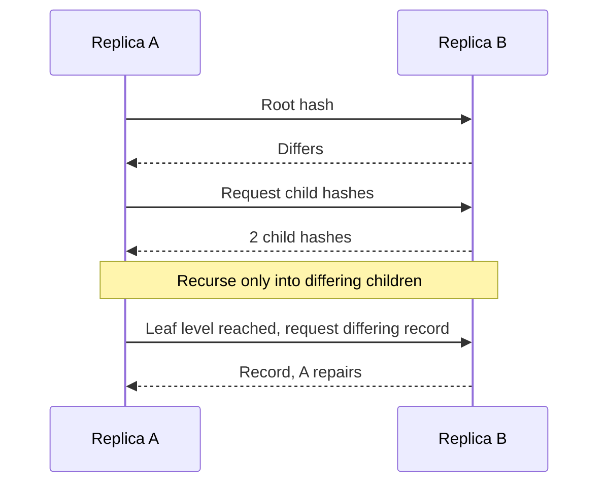
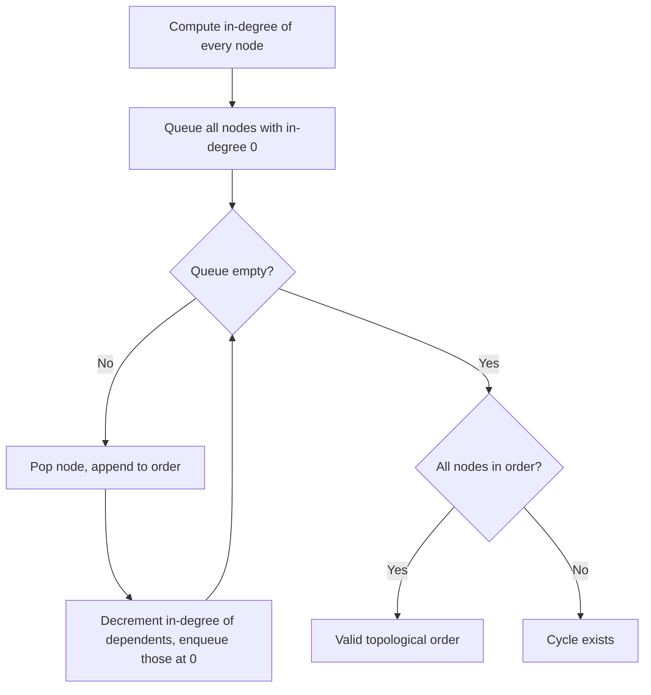
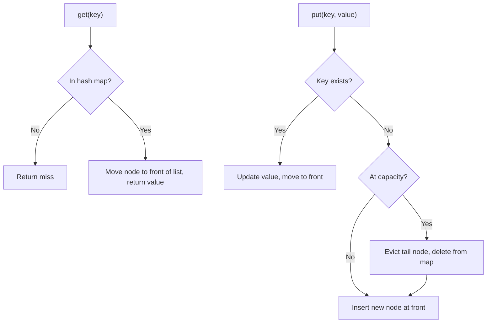
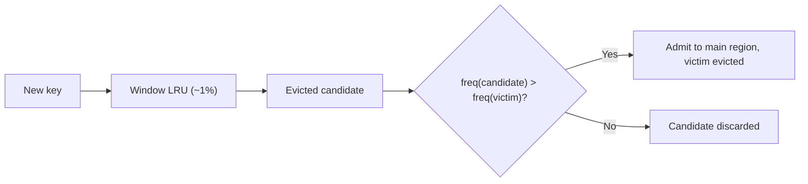

# 📊 Data Structures & Algorithms (Backend) — Staff-Level Interview Questions

> *10 questions covering probabilistic data structures, trees, hashing, and algorithmic patterns relevant to backend systems — every question expects principal engineer-level depth.*

📘 **Companion resource:** For an expanded treatment of scale-oriented data structures (Cuckoo Filter, MinHash, Geohash, S2, H3, Quad Tree, R-Tree, Skip List, and deeper dives on Bloom, HyperLogLog, Count-Min Sketch, and Merkle Trees), see [DATA_STRUCTURES_FOR_SCALE.md](./DATA_STRUCTURES_FOR_SCALE.md).

---

## Table of Contents

1. [Bloom Filters: Design & Math](#1-bloom-filters-design-math)
2. [Consistent Hashing: Ring Design](#2-consistent-hashing)
3. [HyperLogLog: Cardinality Estimation](#3-hyperloglog-cardinality-estimation)
4. [Merkle Trees: Anti-Entropy & Verification](#4-merkle-trees-anti-entropy-verification)
5. [Count-Min Sketch: Frequency Estimation](#5-count-min-sketch-frequency-estimation)
6. [Trie vs FST: Autocomplete & Search](#6-trie-vs-fst-autocomplete-search)
7. [Priority Queues: Scheduling at Scale](#7-priority-queues-scheduling-at-scale)
8. [Topological Sort: DAG Scheduling](#8-topological-sort-dag-scheduling)
9. [LRU/LFU/TTL Cache Design](#9-lrulfuttl-cache-design)
10. [Rate Limiting Algorithms](#10-rate-limiting-algorithms)

---

## 1. Bloom Filters: Design & Math

**Q:** "Design a Bloom filter for a caching layer that prevents 99.9% of unnecessary database lookups for keys that don't exist. We have 1 billion unique keys and can tolerate 0.1% false positives. Calculate the optimal size and number of hash functions."

**What They're Really Testing:** Whether you understand the math behind probabilistic data structures, not just the concept.

!!! tip "30-second answer"
    A Bloom filter is an m-bit array with k hash functions: add sets k bits, a lookup checks them. It never gives false negatives; false positives occur at rate p ≈ (1 − e^(−kn/m))^k. Optimal sizing is **m = −n·ln p / (ln 2)² ≈ 1.44·log₂(1/p) bits per key** and **k = (m/n)·ln 2**. For 1B keys at p = 0.1%: ~14.4 bits/key → **1.8 GB**, **k = 10**. Each additional 10× reduction in p costs ~4.8 more bits per key. In practice you don't build one 1.8 GB filter: shard it by key alongside the data (RocksDB/Cassandra keep one per SSTable), use a cache-line-blocked layout, and remember it can't delete or grow without a variant.

### Answer

**Bloom Filter Math:**

```text
# Given:
n = 1_000_000_000 (1 billion keys)
p = 0.001 (0.1% false positive rate)

# Optimal size (m) in bits:
m = -n * ln(p) / (ln(2))^2
m = -1e9 * ln(0.001) / (0.693)^2
m = -1e9 * (-6.907) / 0.480
m = 6.907e9 / 0.480
m = 14.38e9 bits ≈ 1.8 GB (14.4 bits per key)

# Optimal number of hash functions (k):
k = (m/n) * ln(2)
k = (14.39e9 / 1e9) * 0.693
k = 14.39 * 0.693 ≈ 10 hash functions

# Expected false positive rate with these parameters:
fp = (1 - e^(-kn/m))^k
fp = (1 - e^(-10*1e9/14.39e9))^10
fp = (1 - e^(-0.695))^10
fp = (1 - 0.499)^10
fp = (0.501)^10 ≈ 0.00098 ✓ (≈0.1%)
```

**Optimal Hash Functions:**

```python
# We need 10 hash functions. Don't compute 10 hashes:
# compute one 128-bit hash, split it into h1 and h2, and derive the rest.

def bloom_index(h1: int, h2: int, i: int, m: int) -> int:
    # Kirsch–Mitzenmacher (2006): g_i = h1 + i·h2 has the same asymptotic
    # false-positive rate as k independent hashes.
    # ("Enhanced double hashing" adds a cubic/quadratic term to avoid some
    # degenerate cycles when h2 is a multiple of a factor of m.)
    return (h1 + i * h2) % m

# Use a fast non-cryptographic hash (xxHash, MurmurHash3 128-bit).
# If attackers choose the keys, use a keyed hash (SipHash) or they can
# pick keys that all hit the same bits.
```

**Counting Bloom Filter (for Deletable Entries, runnable):**

```python
import hashlib
import math


class CountingBloomFilter:
    """Bloom filter with 4-bit counters instead of bits, so keys can be removed.
    Costs 4× the memory of a plain Bloom filter."""

    MAX = 15  # 4-bit counter

    def __init__(self, capacity: int, fp_rate: float):
        self.m = math.ceil(-capacity * math.log(fp_rate) / math.log(2) ** 2)
        self.k = max(1, round(self.m / capacity * math.log(2)))
        self.counters = bytearray((self.m + 1) // 2)   # two 4-bit counters per byte

    def _indexes(self, key: str):
        d = hashlib.blake2b(key.encode(), digest_size=16).digest()
        h1, h2 = int.from_bytes(d[:8], "little"), int.from_bytes(d[8:], "little") | 1
        for i in range(self.k):                         # Kirsch–Mitzenmacher double hashing
            yield (h1 + i * h2) % self.m

    def _get(self, i: int) -> int:
        b = self.counters[i >> 1]
        return (b >> 4) if i & 1 else (b & 0x0F)

    def _set(self, i: int, v: int) -> None:
        b = self.counters[i >> 1]
        self.counters[i >> 1] = ((b & 0x0F) | (v << 4)) if i & 1 else ((b & 0xF0) | v)

    def add(self, key: str) -> None:
        for i in self._indexes(key):
            v = self._get(i)
            if v < self.MAX:
                self._set(i, v + 1)

    def remove(self, key: str) -> None:
        """Only call for keys that were added, or you create false negatives."""
        for i in self._indexes(key):
            v = self._get(i)
            if 0 < v < self.MAX:        # a saturated counter is "sticky": its true
                self._set(i, v - 1)     # count is unknown, so never decrement it

    def might_contain(self, key: str) -> bool:
        return all(self._get(i) > 0 for i in self._indexes(key))


cbf = CountingBloomFilter(capacity=100_000, fp_rate=0.01)
for i in range(100_000):
    cbf.add(f"k{i}")
assert all(cbf.might_contain(f"k{i}") for i in range(100_000))       # no false negatives
fp = sum(cbf.might_contain(f"x{i}") for i in range(100_000)) / 100_000
for i in range(50_000):
    cbf.remove(f"k{i}")
assert all(cbf.might_contain(f"k{i}") for i in range(50_000, 100_000))
print(f"m={cbf.m} k={cbf.k} fp={fp:.4f} bytes={len(cbf.counters)}")
```

**Production Considerations:**
- **Sharding**: route keys by hash to per-shard filters (or keep a filter per data file, like RocksDB and Cassandra). Smaller filters, independent rebuilds.
- **Blocked Bloom filter**: all k bits of a key fall in one 64-byte cache line, so a lookup costs one cache miss instead of k; slightly higher FP rate for the same memory. RocksDB's default format.
- **Partitioned Bloom filter**: the m bits are split into k slices, one per hash function (each hash sets exactly one bit in its own slice).
- **Scalable Bloom filter**: when full, add a new, larger filter with a tighter FP target; lookups check all of them. Use when n is unknown.
- **Alternatives**: Cuckoo filters (support deletion, better than Bloom below ~3% FP), xor/binary-fuse and Ribbon filters (static sets, roughly 15–30% smaller than Bloom at equal FP rate; RocksDB offers Ribbon).
- **Rebuild, don't delete**: for a "does this key exist" cache guard, rebuild periodically from the source of truth rather than tracking deletes.

### 🔍 Staff-Level Evaluation

| Criterion | What I'm Looking For |
|-----------|----------------------|
| **Math** | Correctly calculates m, k, and verifies p |
| **Hash independence** | Mentions Kirsch-Mitzenmacher double hashing technique |
| **Counting variant** | Knows counting BF for deletable entries, sticky saturated counters, 4× memory |
| **Production** | Sharding, blocked layout, scalable variant, cuckoo/xor alternatives |

---

## 2. Consistent Hashing

**Q:** "Design a consistent hashing ring for a distributed cache with 100 nodes. How do you handle node additions and removals with minimal key redistribution? What if request distribution isn't uniform (hot keys)?"

**What They're Really Testing:** Whether you understand the ring topology, virtual nodes, and can reason about hot spots.

!!! tip "30-second answer"
    Hash nodes and keys onto the same ring; a key belongs to the first node clockwise. Adding or removing one of N nodes moves only ~1/N of the keys (modulo hashing moves almost all). Give each node ~100–200 **virtual nodes** so ranges average out and a removed node's load spreads over many peers; weight vnode counts by **capacity**. Hot *keys* are a different problem: one key always maps to one point, so fix them with replicas/key splitting and local caching, and cap per-node load with **bounded-load** consistent hashing. See [Distributed Systems Q5](../distributed-systems/INTERVIEW_QUESTIONS.md#5-consistent-hashing-ring-design) for the simulated numbers.

### Answer

**Basic Consistent Hash Ring:**

```python
from hashlib import sha256
import bisect

class ConsistentHashRing:
    def __init__(self, nodes: list[str], replicas: int = 100):
        self.replicas = replicas  # Virtual nodes
        self.ring: list[int] = []  # Sorted list of hash positions
        self.mapping: dict[int, str] = {}  # position → node

        for node in nodes:
            self.add_node(node)

    def _hash(self, key: str) -> int:
        return int(sha256(key.encode()).hexdigest(), 16)

    def add_node(self, node: str):
        for i in range(self.replicas):
            position = self._hash(f"{node}:vnode:{i}")
            bisect.insort(self.ring, position)
            self.mapping[position] = node

    def remove_node(self, node: str):
        for i in range(self.replicas):
            position = self._hash(f"{node}:vnode:{i}")
            self.ring.remove(position)
            del self.mapping[position]

    def get_node(self, key: str) -> str:
        if not self.ring:
            return ""
        hash_val = self._hash(key)
        idx = bisect.bisect_right(self.ring, hash_val) % len(self.ring)
        return self.mapping[self.ring[idx]]
```

*Diagram: a key is hashed onto the ring and owned by the first virtual node clockwise.*


**Key Redistribution (Virtual Nodes):**

```
Without virtual nodes (replicas=1):
Node A: ─────■────────────────────────────
Node B: ──────────■───────────────────────
Node C: ────────────────■─────────────────

Remove B: B's keys (the range between A and B) → C, the next node clockwise
Keys moved: ~33% of total, ALL landing on C (C's load doubles)

With virtual nodes (replicas=100):
Node A: ■ ■    ■   ■ ■   ■  ■     ■
Node B:   ■  ■   ■   ■ ■    ■   ■
Node C: ■  ■  ■ ■   ■   ■  ■    ■  ■
         ^ each ■ is a virtual node

Remove B: each of B's 100 small ranges goes to whichever vnode follows it
Keys moved: B's share = ~33% (same amount), but now SPLIT across A and C
           roughly in proportion to their vnode counts
```

**Hot Key Handling:**

```python
class WeightedConsistentHashRing(ConsistentHashRing):
    def __init__(self, nodes: dict[str, float]):
        self.ring, self.mapping = [], {}
        for node, weight in nodes.items():
            # Weight = CAPACITY: a node with 2× the RAM/CPU gets 2× the vnodes.
            # (Giving a node that is already hot MORE vnodes makes it hotter.)
            for i in range(int(100 * weight)):
                position = self._hash(f"{node}:vnode:{i}")
                bisect.insort(self.ring, position)
                self.mapping[position] = node

    def get_nodes(self, key: str, count: int = 3) -> list[str]:
        """Preference list: the first `count` DISTINCT physical nodes clockwise.
        Consecutive ring positions are often vnodes of the same machine, so
        they must be skipped, or 'replicas' end up on one host."""
        idx = bisect.bisect_right(self.ring, self._hash(key))
        nodes: list[str] = []
        for i in range(len(self.ring)):
            node = self.mapping[self.ring[(idx + i) % len(self.ring)]]
            if node not in nodes:
                nodes.append(node)
                if len(nodes) == count:
                    break
        return nodes

# Hot keys: route reads for keys flagged hot (by a sampled Count-Min Sketch)
# to ANY node in get_nodes(key), writes to all of them; or split the key into
# key#0..key#k-1 so its copies land on unrelated ring positions.
```

**Production Considerations:**
- **Client-side routing**: clients cache the ring (versioned by epoch) and refresh asynchronously; a node receiving a key it doesn't own redirects (Redis Cluster's `MOVED`) or proxies.
- **Bounded load** (Mirrokni et al., 2016): cap each node at (1+ε)× average load; overflow walks clockwise. Used by HAProxy (`hash-balance-factor`).
- **Alternatives**: rendezvous hashing (no ring, O(N) per lookup), jump consistent hash (no memory, numbered shards only), Maglev (O(1) lookup table). Redis Cluster uses neither ring nor vnodes: 16,384 fixed hash slots assigned to nodes, which makes rebalancing an explicit slot migration.

### 🔍 Staff-Level Evaluation

| Criterion | What I'm Looking For |
|-----------|----------------------|
| **Virtual nodes** | Explains why they're needed for load balancing |
| **Hot key mitigation** | Separates hot keys (replicas, key splitting, local cache) from uneven ranges (vnodes) |
| **Distinct replicas** | Skips vnodes of already-chosen physical nodes |
| **Client caching** | Understands client-side ring caching for performance |
| **Bounded load** | Mentions capacity-aware routing, not just uniform distribution |

---

## 3. HyperLogLog: Cardinality Estimation

**Q:** "Design a system to count the number of unique visitors to a website with 10M visitors/day using less than 2KB of memory. Explain the HyperLogLog algorithm mathematically."

**What They're Really Testing:** Whether you understand the probabilistic insight behind HLL — the relationship between leading zeros and cardinality — and how stochastic averaging with bias correction achieves near-exact accuracy.

!!! tip "30-second answer"
    Hash every item; a run of k leading (or trailing) zero bits shows up about once per 2^k distinct items, so the longest run seen estimates log₂(n). One such estimate is far too noisy, so HLL splits items into m buckets by hash prefix, keeps the max run per bucket, and combines them with a bias-corrected harmonic mean. Error ≈ **1.04/√m**, memory = m small registers. For < 2 KB: m = 2048 six-bit registers = 1.5 KB at ~2.3% error. Sketches **merge** by taking per-register maxima, which is why HLL is the standard for distributed distinct counts (Redis uses m = 16384, 12 KB, 0.81%).

### Answer

**The Core Insight — Estimating n from Leading Zeros:**

```
If you hash each element uniformly (64-bit hash):
  - P(hash ends with at least 1 zero) = 1/2
  - P(hash ends with at least 2 zeros) = 1/4
  - P(hash ends with at least k zeros) = 1/2^k

If we observe ρ_max = max number of trailing zeros across all hashes:
  - Expected ρ_max ≈ log₂(n)
  - Estimated n ≈ 2^ρ_max

Problem: Single-register estimate has HIGH VARIANCE.
  - If ρ_max = 30 → estimate = 2^30 = 1B
  - If ρ_max = 25 → estimate = 2^25 = 33M
  - One extra zero bit = 2× difference!
  - ±1 bit either direction = 50% or 200% of true value
  (Leading or trailing zeros work equally well; the code below uses trailing.)
```

**Stochastic Averaging — The Fix:**

Split the stream into m = 2^b registers using b bits of the hash; each register tracks the max rank of its ~n/m elements; combine with a **harmonic mean** (robust to a few outlier registers) times a bias constant α_m. Standard error ≈ **1.04/√m**.

```python
import hashlib
import math


class HyperLogLog:
    """HyperLogLog with a 64-bit hash (Flajolet et al. 2007 + the 64-bit tweak
    from Google's HLL++). Registers hold ranks up to 64 - b + 1, so they need
    6 bits each: m = 2^14 registers → 12 KB, standard error 1.04/√m ≈ 0.81%
    (exactly Redis's PFADD/PFCOUNT configuration)."""

    def __init__(self, b: int = 14):
        self.b = b
        self.m = 1 << b
        self.registers = [0] * self.m          # real systems pack 6-bit registers

    @staticmethod
    def _hash64(value: str) -> int:
        return int.from_bytes(hashlib.blake2b(value.encode(), digest_size=8).digest(), "big")

    def add(self, value: str) -> None:
        x = self._hash64(value)
        j = x & (self.m - 1)                   # low b bits pick the register
        w = x >> self.b                        # remaining 64 - b bits
        # rank = position of the lowest set bit (trailing zeros + 1)
        rho = (w & -w).bit_length() if w else 64 - self.b + 1
        if rho > self.registers[j]:
            self.registers[j] = rho

    def merge(self, other: "HyperLogLog") -> None:
        """Union of two sketches = element-wise max. Lossless."""
        self.registers = [max(a, c) for a, c in zip(self.registers, other.registers)]

    def count(self) -> float:
        m = self.m
        alpha = {16: 0.673, 32: 0.697, 64: 0.709}.get(m, 0.7213 / (1 + 1.079 / m))
        z = sum(2.0 ** -r for r in self.registers)   # harmonic mean of 2^register
        e = alpha * m * m / z
        if e <= 2.5 * m:                             # small range: linear counting
            zeros = self.registers.count(0)
            if zeros:
                e = m * math.log(m / zeros)
        # No large-range correction needed with a 64-bit hash (collisions
        # only matter near 2^64); the original paper's correction was for 32-bit.
        return e


if __name__ == "__main__":
    for n in (1_000, 100_000, 1_000_000):
        h = HyperLogLog(14)
        for i in range(n):
            h.add(f"user_{i}")
        print(n, round(h.count()), f"{(h.count() - n) / n:+.2%}")
    a, c = HyperLogLog(11), HyperLogLog(11)
    for i in range(10_000_000 // 100):          # scaled-down "10M/day" check
        (a if i % 2 else c).add(f"v{i}")
    a.merge(c)
    print("m=2048 merged", round(a.count()), "expected 100000")
```

Sample output: 1,000 → 1,005 (+0.5%); 100,000 → 98,990 (−1.0%); 1,000,000 → 991,701 (−0.8%), all within ~1–2 standard errors of 0.81%.

**Meeting the "< 2 KB" requirement:**

```
Registers need ⌈log₂(64 − b + 1)⌉ = 6 bits with a 64-bit hash
(5 bits suffice with a 32-bit hash, which is fine up to ~10⁸ distinct items).

  m = 2048 (b = 11):  2048 × 6 bits = 1.5 KB     error 1.04/√2048 ≈ 2.3%
  m = 2048, 5-bit registers (32-bit hash): 1.25 KB, same error

10M visitors/day is far below where a 32-bit hash collides meaningfully, so
either works. Need ±1%? That takes m ≈ (1.04/0.01)² ≈ 10,816 → 16,384 registers, 12 KB.
```

**Memory vs Error (6-bit registers, 64-bit hash):**

```
Registers (m)    Memory     Std. error (1.04/√m)    Notes
─────────────    ───────    ────────────────────    ─────────────────────────
16               12 B       26%                     Too noisy to be useful
1024             768 B      3.25%
2048             1.5 KB     2.3%                    Fits the 2 KB budget
4096             3 KB       1.63%
16384            12 KB      0.81%                   Redis PFADD/PFCOUNT (dense)
65536            48 KB      0.41%

Exact counting for comparison:
  10M distinct 64-bit hashes = 80 MB raw (a Python set is several times more)
  HLL with m = 16384: 12 KB, i.e. ~6,700× smaller, ±0.81% (1σ)
```

**Why HLL wins in practice (beyond memory):**

- **Mergeable**: union of two sketches = element-wise max of registers. Count per server/per hour, merge for "unique visitors this week". (Intersections are not directly supported; inclusion–exclusion on unions is very noisy.)
- **Sparse representation** (HLL++, Redis's sparse encoding): small cardinalities are stored as a compact list, so millions of mostly-small counters stay cheap.
- **Bias correction** at low cardinality: linear counting below 2.5m; HLL++ adds an empirical bias table.
- Available in Redis (`PFADD`/`PFCOUNT`/`PFMERGE`), BigQuery (`APPROX_COUNT_DISTINCT`, `HLL_COUNT.*`), Presto/Trino (`approx_distinct`), Druid, Elasticsearch (`cardinality` aggregation, HLL++).

**Deriving the Standard Error Formula:**

```
Standard Error (SE) ≈ 1.04 / √m

For m = 16384:
  SE ≈ 1.04 / 128 ≈ 0.0081 ≈ 0.81%

So: ~95% of estimates fall within ±1.6% of the true value (2σ).
Inverting: m = (1.04 / SE)².
```

### 🔍 Staff-Level Evaluation

| Criterion | What I'm Looking For |
|-----------|----------------------|
| **Probabilistic insight** | Explains why leading zeros estimate log₂(n) and why variance is high with 1 register |
| **Stochastic averaging** | Describes splitting into m registers, harmonic mean vs arithmetic mean |
| **Bias correction** | Knows linear counting for small ranges; knows a 64-bit hash removes the large-range correction |
| **Mergeability** | Unions by register-wise max; knows intersections are hard |
| **Memory formula** | Can compute m from error tolerance: m = (1.04 / SE)² |

---

## 4. Merkle Trees: Anti-Entropy & Verification

**Q:** "Design a system to verify data consistency across 1000 database replicas. How would Merkle trees enable efficient comparison, and what's the O(log N) proof size?"

**What They're Really Testing:** Whether you understand Merkle trees as a mechanism for efficient set reconciliation — trading hash computation for bandwidth — and can apply them to real distributed systems problems.

!!! tip "30-second answer"
    A Merkle tree hashes data blocks, then hashes pairs of hashes up to a single root. Equal roots mean (with overwhelming probability) equal data; different roots let two replicas **descend only into subtrees whose hashes differ**, so they exchange O(d·log N) hashes to find d differences instead of shipping everything. A proof that one block belongs under a known root is the log₂N sibling hashes on its path (~30 × 32 B for a billion leaves). Real deployments build trees over **hash ranges** so replicas with different key sets still line up, use leaf/internal **domain separation**, and pay a full read-and-hash pass to build the tree.

### Answer

**The Problem — Anti-Entropy at Scale:**

```
1000 replicas × 1B records each.

Naive comparison between two replicas:
  - Transfer ALL 1B records to compare them → 1B × 1KB = 1TB transferred
  - Or: build a hash of each record, transfer 1B hashes → 1B × 32B = 32GB
  - Both are IMPRACTICAL

Merkle tree solution:
  - Build a balanced binary hash tree over the data
  - Compare roots (1 hash = 32 bytes)
  - If different: recurse down the tree until the differing leaf is found
  - Total data exchanged: O(log N) hashes per differing record
    (2 child hashes per level on the way down)
  - For 1B records and 1 difference: ~60 hashes + 1 record ≈ 3 KB
  - Catch: each side still reads and hashes its 1 TB locally to build the tree
```

*Diagram: anti-entropy compares roots, then recurses only into differing subtrees.*




**Merkle Tree Construction, Proofs and Anti-Entropy (runnable):**

```python
import hashlib


def _leaf(data: bytes) -> bytes:
    return hashlib.sha256(b"\x00" + data).digest()          # 0x00 = leaf (RFC 6962 style)


def _node(left: bytes, right: bytes) -> bytes:
    return hashlib.sha256(b"\x01" + left + right).digest()  # 0x01 = internal node


class MerkleTree:
    """Binary Merkle tree over an ordered list of blocks.
    Leaf/internal prefixes stop an attacker passing an internal node off as a
    leaf (second-preimage attack). An odd node is promoted to the next level
    unchanged (as in RFC 6962), instead of being paired with itself
    (Bitcoin's duplication caused CVE-2012-2459)."""

    def __init__(self, blocks: list[bytes]):
        assert blocks
        self.levels = [[_leaf(b) for b in blocks]]
        while len(self.levels[-1]) > 1:
            cur = self.levels[-1]
            nxt = [_node(cur[i], cur[i + 1]) for i in range(0, len(cur) - 1, 2)]
            if len(cur) % 2:
                nxt.append(cur[-1])                              # promote odd node
            self.levels.append(nxt)

    @property
    def root(self) -> bytes:
        return self.levels[-1][0]

    def proof(self, index: int) -> list[tuple[bytes, str]]:
        """Sibling hashes from leaf to root: O(log N) entries."""
        path = []
        for level in self.levels[:-1]:
            sib = index ^ 1
            if sib < len(level):                                 # no sibling → promoted
                path.append((level[sib], "left" if sib < index else "right"))
            index //= 2
        return path

    @staticmethod
    def verify(root: bytes, block: bytes, path: list[tuple[bytes, str]]) -> bool:
        h = _leaf(block)
        for sib, side in path:
            h = _node(sib, h) if side == "left" else _node(h, sib)
        return h == root


blocks = [f"block_{i}".encode() for i in range(11)]          # odd count on purpose
t = MerkleTree(blocks)
for i in range(len(blocks)):
    assert MerkleTree.verify(t.root, blocks[i], t.proof(i))
assert not MerkleTree.verify(t.root, b"tampered", t.proof(3))
print("proof length for 11 leaves:", len(t.proof(3)), "hashes")


# ---- Anti-entropy: compare two replicas over FIXED hash ranges ----
def bucket_tree(data: dict[str, str], depth: int) -> list[list[bytes]]:
    """Leaves = 2^depth buckets of the key-hash space (like Cassandra's token
    ranges), so both replicas' trees have the same shape even when their key
    sets differ. levels[0] = root level, levels[depth] = leaves."""
    n = 1 << depth
    buckets = [hashlib.sha256() for _ in range(n)]
    for k in sorted(data):
        b = int.from_bytes(hashlib.sha256(k.encode()).digest()[:4], "big") % n
        buckets[b].update(f"{k}={data[k]};".encode())
    level = [b.digest() for b in buckets]
    levels = [level]
    while len(level) > 1:
        level = [_node(level[i], level[i + 1]) for i in range(0, len(level), 2)]
        levels.append(level)
    return levels[::-1]


def diff_buckets(a, b, level=0, i=0) -> list[int]:
    """Descend only where hashes differ. Returns differing leaf buckets."""
    if a[level][i] == b[level][i]:
        return []
    if level == len(a) - 1:
        return [i]
    return diff_buckets(a, b, level + 1, 2 * i) + diff_buckets(a, b, level + 1, 2 * i + 1)


r1 = {f"user:{i}": "v1" for i in range(100_000)}
r2 = dict(r1)
r2["user:42"] = "v2"          # one changed value
del r2["user:7"]              # one missing key
ta, tb = bucket_tree(r1, 10), bucket_tree(r2, 10)
print("differing buckets:", diff_buckets(ta, tb), "of", 1 << 10)
```

Two details matter in the anti-entropy part:

- **Leaves are fixed hash ranges, not "the i-th key".** If one replica is missing a key, index-based leaves shift and every subtree differs. Bucketing by key hash keeps both trees the same shape (Cassandra builds its repair trees over token ranges; Riak AAE does the same per partition).
- **Bandwidth vs work.** The exchange is O(differences × log buckets) hashes, but each replica still reads and hashes all its data to build the tree. That's why Cassandra builds trees only during repair (a "validation compaction"), and why incremental repair (the `nodetool repair` default since 2.2, reworked to be reliable in 4.0) skips already-repaired SSTables. Riak keeps persistent trees updated on every write instead.

**SPV Proof — Light Client Verification:**

```
Bitcoin Simplified Payment Verification (SPV):

Light client (mobile wallet) wants to verify a transaction is in a block.
Instead of downloading the entire block (1MB+), it requests:
  - The Merkle root from the block header (already has it)
  - The Merkle proof from a full node

Example: Prove TX3 is in a block with 8 transactions:

Block Header:
┌──────────────────────────────┐
│ Merkle Root: 0x7a3b...      │ ← Already known by light client
│ Timestamp, Nonce, Prev Hash │
└──────────────────────────────┘

Full node provides the Merkle proof for TX3:
  [H(TX4), H(H(TX1)+H(TX2)), H(H(L0)+H(L1))]
  Size: 3 × 32 bytes = 96 bytes (vs downloading 1MB block)

Light client verifies (Bitcoin uses double SHA-256 and pairs left+right):
  H(TX3) + H(TX4)  → H34
  H12 + H34        → L0          (H12 = H(H(TX1)+H(TX2)), supplied in the proof)
  L0 + L1          → Root == 0x7a3b... ✅   (L1 supplied in the proof)

Proof size: O(log N) hashes
  - 1000 txns in block: ~10 hashes = 320 bytes
  - 10000 txns in block: ~14 hashes = 448 bytes
```

**Real-World Applications:**

```yaml
Cassandra anti-entropy:
  - Each replica builds Merkle tree over its partition range
  - Periodic tree comparison detects inconsistencies
  - Only the differing subtrees are repaired
  - Tradeoff: Tree rebuild is CPU-intensive (hash all data)

Git version control:
  - Content-addressed Merkle DAG: blobs (files) → trees (directories) → commits
  - A commit hash pins the entire history and snapshot
  - Fetch/push negotiate which commits each side has and skip every object
    reachable from shared ones; identical subdirectories are never re-sent
  - (Git uses SHA-1 by default; SHA-256 repositories are supported)

Certificate Transparency (RFC 6962 / 9162):
  - Append-only Merkle log of issued TLS certificates
  - Inclusion proof: this certificate is in the log
  - Consistency proof: today's log extends yesterday's log (nothing was
    removed or rewritten). Detecting mis-issuance is done by domain owners
    monitoring the logs, not by the proof itself

Amazon Dynamo (2007 paper) / Riak / Cassandra:
  - One Merkle tree per key range (Dynamo: per virtual node's range)
  - Depth trades precision (smaller leaf ranges, less over-streaming) vs memory/CPU
  - Cassandra builds them on demand during repair; Riak AAE persists them
    and updates them on writes

Also: ZFS/Btrfs block checksums, IPFS content addressing, Merkle Patricia
tries in Ethereum, key-transparency logs.
```

### 🔍 Staff-Level Evaluation

| Criterion | What I'm Looking For |
|-----------|----------------------|
| **Tree construction** | Understands bottom-up hash chaining, balanced tree requirement |
| **Proof of inclusion** | Can explain SPV proof: sibling hashes + hashing order matters |
| **Anti-entropy** | Describes recursive subtree comparison over fixed hash ranges, early termination on match |
| **Cost awareness** | Knows building the tree requires reading all data; knows when systems build it |
| **Real applications** | Mentions Cassandra, Git, Bitcoin SPV, Certificate Transparency |

---

## 5. Count-Min Sketch: Frequency Estimation

**Q:** "Design a system to detect the top 100 most frequent IP addresses making requests to your API in real time, using constant memory. You cannot store all IPs, and you need a guarantee that no item is severely undercounted."

**What They're Really Testing:** Whether you understand probabilistic frequency estimation, the tradeoff between bias and memory, and how to use Count-Min Sketch for heavy hitters detection.

!!! tip "30-second answer"
    A Count-Min Sketch is d rows of w counters with one hash per row; increment one counter per row, estimate with the **minimum**. Counts are never undercounted (insert-only), and with w = ⌈e/ε⌉, d = ⌈ln(1/δ)⌉ the overcount is at most **ε·N** with probability 1 − δ, where N is the total stream size. Pair it with a size-k min-heap of candidates to get the top 100 IPs in fixed memory. Use a **keyed** hash so attackers can't aim collisions, **conservative update** to cut overestimation, windows or decay for "recent" heavy hitters, and merge per-node sketches by adding them. If you only need top-K, **Space-Saving** is simpler and deterministic.

### Answer

**The Algorithm (runnable, with heavy hitters):**

```
d rows × w counters. add(x): for each row r, table[r][h_r(x)] += 1.
estimate(x) = min over rows. Collisions only ADD, so estimate ≥ true count,
and taking the min picks the least-polluted row.

Sizing: w = ⌈e/ε⌉, d = ⌈ln(1/δ)⌉ → estimate ≤ true + ε·N with prob ≥ 1 − δ
  ε = 0.001, δ = 0.01 → w = 2,719, d = 5 → 13,595 counters ≈ 54 KB (int32)
  N = 1B requests → overcount ≤ 1M (0.1% of N) for 99% of queries
The error is relative to the WHOLE stream (N), so CMS is accurate for heavy
items and useless for rare ones: exactly what heavy-hitter detection needs.
```

```python
import hashlib
import heapq
import math
import os


class CountMinSketch:
    """Frequency estimates that never undercount (for insert-only streams).
    With w = ⌈e/ε⌉ and d = ⌈ln(1/δ)⌉: estimate ≤ true + ε·N with prob ≥ 1 − δ,
    where N is the total of all counts added."""

    def __init__(self, epsilon: float, delta: float, conservative: bool = False):
        self.w = math.ceil(math.e / epsilon)
        self.d = math.ceil(math.log(1 / delta))
        self.table = [[0] * self.w for _ in range(self.d)]
        self.seed = os.urandom(16)            # secret salt: attackers can't aim collisions
        self.conservative = conservative

    def _cols(self, item: str):
        for row in range(self.d):
            h = hashlib.blake2b(item.encode(), key=self.seed, digest_size=8,
                                person=row.to_bytes(16, "little")).digest()
            yield row, int.from_bytes(h, "little") % self.w

    def add(self, item: str, count: int = 1) -> None:
        cols = list(self._cols(item))
        if self.conservative:
            # Conservative update: raise each counter only as far as needed
            # (new estimate = old min + count). Less overestimation; no deletions.
            target = min(self.table[r][c] for r, c in cols) + count
            for r, c in cols:
                self.table[r][c] = max(self.table[r][c], target)
        else:
            for r, c in cols:
                self.table[r][c] += count

    def estimate(self, item: str) -> int:
        return min(self.table[r][c] for r, c in self._cols(item))


class TopK:
    """Heavy hitters: CMS for counts + a size-k candidate set (min-heap)."""

    def __init__(self, k: int, epsilon=1e-4, delta=1e-3):
        self.k, self.cms = k, CountMinSketch(epsilon, delta, conservative=True)
        self.top: dict[str, int] = {}

    def add(self, item: str) -> None:
        self.cms.add(item)
        est = self.cms.estimate(item)
        if item in self.top or len(self.top) < self.k:
            self.top[item] = est
            return
        victim = min(self.top, key=self.top.get)   # O(k); use an indexed heap for big k
        if est > self.top[victim]:
            del self.top[victim]
            self.top[item] = est

    def result(self) -> list[tuple[str, int]]:
        return heapq.nlargest(self.k, self.top.items(), key=lambda kv: kv[1])


import random
random.seed(1)
stream = [f"10.0.0.{i}" for i in range(1, 6) for _ in range(5000)]       # 5 heavy IPs
stream += [f"192.168.{random.randrange(256)}.{random.randrange(256)}" for _ in range(200_000)]
random.shuffle(stream)
tk = TopK(5)
for ip in stream:
    tk.add(ip)
print(tk.result())
print("w,d =", tk.cms.w, tk.cms.d)
```

Sample output: the five injected IPs at 5,000 each, despite 200,000 noise requests.

**Making it work in production:**

- **Adversarial keys:** the error bound assumes the attacker can't predict your hash. Use a **keyed hash with a secret seed** (as above; SipHash or keyed BLAKE2), not a public unkeyed function.
- **Conservative update** (shown above): increase each counter only up to `min + count`. Noticeably less overestimation on skewed streams; the price is that you can no longer subtract.
- **Count-Mean-Min:** subtract each row's estimated noise, `(row_sum − counter)/(w − 1)`, and take the **median** across rows. Less bias for low-frequency items, but it can underestimate.
- **Time decay:** "top IPs in the last minute" needs windowing: one sketch per time bucket (sum the last k), or periodically halve all counters (as Caffeine's TinyLFU does).
- **Distributed:** sketches with the same seed and dimensions **merge by element-wise addition**, so each API node keeps a local sketch and ships it to an aggregator every few seconds.

**Comparison with Alternatives:**

| Algorithm | Memory | Error | Underestimates? | Notes |
|-----------|--------|-------|-----------------|-------|
| Count-Min Sketch | w×d counters = O((1/ε)·log(1/δ)) | ≤ ε·N w.p. 1−δ | Never (insert-only) | Estimates any key; mergeable; needs a heap for top-K |
| CMS + conservative update | same | Lower in practice | Never | No deletions |
| Count-Mean-Min | same | Lower bias | Yes, possibly | Median of de-noised rows |
| Count Sketch | same | ε·‖f‖₂ (better on skew) | Yes (unbiased) | Signed counters, median |
| Space-Saving | k counters | ≤ N/k per item | Never | Deterministic top-K; best choice when you *only* need top-K |
| Misra–Gries | k counters | ≤ N/(k+1) | Always ≤ | Deterministic, mergeable |

### 🔍 Staff-Level Evaluation

| Criterion | What I'm Looking For |
|-----------|----------------------|
| **Algorithm mechanics** | Explains w (width) and d (depth) correctly |
| **Error bounds** | Mentions ε·N bound and 1-δ confidence |
| **Heavy hitters** | Shows how to combine CMS with heap for top-K, or uses Space-Saving |
| **Overestimation** | Understands CMS only overestimates; knows conservative update and Count-Mean-Min |
| **Production** | Keyed hashing, time windows, merging sketches across nodes |

---

## 6. Trie vs FST: Autocomplete & Search

**Q:** "Design the autocomplete system for a search engine serving 10K queries/second with a dictionary of 10M phrases. Compare a traditional Trie with a Finite State Transducer (FST). Why would Lucene choose FST over Trie?"

**What They're Really Testing:** Whether you understand the memory/performance tradeoffs between prefix trees and minimal acyclic automata, and can reason about real-world search engine internals.

!!! tip "30-second answer"
    A trie shares prefixes; for fast autocomplete each node caches its **top-K completions**, so a query is O(prefix length). Its weakness is memory: one node object per character. An **FST** is a minimal acyclic automaton that shares prefixes *and* suffixes and attaches outputs (ordinals, pointers, weights) to arcs. Built in one pass from **sorted** input, it's typically several times smaller, immutable, and memory-mappable, which fits Lucene's immutable segments. Lucene uses it for the terms index and for weighted completion suggesters.

### Answer

**Trie with precomputed top-K (runnable):**

A plain trie answers "complete this prefix" by walking the whole subtree under the prefix, which for "a" is a large fraction of 10M phrases. At 10K QPS you precompute instead:

```python
import heapq


class TrieNode:
    __slots__ = ("children", "freq", "top")

    def __init__(self):
        self.children: dict[str, "TrieNode"] = {}
        self.freq = 0                          # > 0 if a phrase ends here
        self.top: list[tuple[int, str]] = []   # cached top-K completions of this prefix


class AutocompleteTrie:
    """Precompute the top-K completions at every node, so a query is
    O(len(prefix)) with no subtree walk. Memory grows by K entries per node;
    rebuild offline (e.g. hourly) from query logs and swap atomically."""

    def __init__(self, k: int = 10):
        self.root, self.k = TrieNode(), k

    def insert(self, phrase: str, freq: int) -> None:
        node = self.root
        for ch in phrase:
            node = node.children.setdefault(ch, TrieNode())
        node.freq += freq

    def build(self) -> None:
        def dfs(node: TrieNode, path: str) -> list[tuple[int, str]]:
            cands = [(node.freq, path)] if node.freq else []
            for ch, child in node.children.items():
                cands.extend(dfs(child, path + ch))
            node.top = heapq.nlargest(self.k, cands)
            return node.top                      # each node passes up only K items
        dfs(self.root, "")

    def suggest(self, prefix: str) -> list[str]:
        node = self.root
        for ch in prefix:
            node = node.children.get(ch)
            if node is None:
                return []
        return [p for _, p in node.top]


t = AutocompleteTrie(k=3)
for phrase, f in [("the", 500), ("there", 90), ("they", 300), ("then", 120), ("theme", 10)]:
    t.insert(phrase, f)
t.build()
print(t.suggest("the"))
print(t.suggest("ther"))
```

Memory reality check: 10M phrases × ~20 chars is up to 200M nodes before prefix sharing. Realistically tens of millions of nodes after sharing, and each node in a pointer-based trie costs tens to hundreds of bytes (a Python object with a dict: several hundred). That's why production systems either shard the trie by prefix across servers, or use a compact automaton.

**Finite State Transducer (FST):**

A trie shares **prefixes** only. A minimal acyclic automaton also shares **suffixes**: any two states with identical "remaining continuations" are merged. A transducer additionally emits an **output** along each path (a term ordinal, a file pointer, a weight), split across the arcs.

```
Words: cat, cats, rat, rats

Trie (8 nodes after the root):            Minimal FST (5 states):
  c → a → t✓ → s✓                          ┌─ c ─┐
  r → a → t✓ → s✓                         [0]     [1] ─a→ [2] ─t→ [3]✓ ─s→ [4]✓
                                           └─ r ─┘
"ca" and "ra" have the same set of continuations {t, ts}, so the FST merges
everything after the first letter. Natural-language vocabularies share huge
numbers of suffixes ("-ing", "-tion", "-ed"), which is where the savings come from.
```

Construction (Daciuk et al., 2000; Lucene's `FSTCompiler`): insert keys in **sorted order**; when the next key diverges from the previous one, the suffix that will never change again is "frozen" and looked up in a hash table (the *register*) of already-frozen states, and replaced by an equivalent one if it exists. One pass, memory proportional to the output. Unsorted inserts can't be minimized this way, which is why FSTs are rebuilt rather than updated.

**Comparison (qualitative: real sizes depend heavily on the vocabulary):**

| Structure | Prefix query | Memory | Updates | Used by |
|-----------|-------------|--------|---------|---------|
| Hash map | No (exact only) | Moderate | O(1) | Exact lookups |
| Pointer trie | Yes, O(L) to the node | Highest (one object per char) | Easy | Interviews, small dictionaries |
| Radix / Patricia tree | Yes | Lower (collapses single-child chains) | Easy | Linux routing (LC-trie), Redis (`rax` for streams and cluster key tracking) |
| Sorted array + binary search | Yes, O(log n) | Low | Rebuild | Simple, cache-friendly baseline |
| **FST** | Yes, plus outputs | Lowest (prefix *and* suffix sharing, byte-packed arcs) | Rebuild (immutable) | Lucene / Elasticsearch / OpenSearch, Tantivy |

**Why Lucene Uses FSTs:**

- **Terms index**: each segment's terms dictionary is stored in blocks on disk (`.tim`); the FST in the terms index (`.tip`) maps term *prefixes* to the block that contains them. A lookup walks the FST, then scans one block. The FST is small enough to keep memory-mapped (off-heap by default since Lucene 8.x).
- **Segments are immutable**, so "rebuild on change" is free: each new segment builds its own FST at flush/merge time.
- **Automaton intersection**: prefix, wildcard, regex and fuzzy (Levenshtein automaton) queries intersect a query automaton with the FST instead of scanning terms.
- **Autocomplete**: the completion suggester (Lucene's `WFSTCompletionLookup`/`AnalyzingSuggester`, Elasticsearch's `completion` field) stores **weights as FST outputs**, so the top-N completions for a prefix come from a best-first search along the highest-weight arcs, without enumerating the subtree. That's the FST version of the "top-K per node" trick above.

**For the 10K QPS / 10M phrase design:** build a weighted FST (or top-K trie) offline from query logs every hour or so, ship it to stateless suggest servers that memory-map it, serve from RAM with p99 in the low milliseconds, and layer personalization and fresh trending queries (a small, frequently rebuilt structure) on top.

### 🔍 Staff-Level Evaluation

| Criterion | What I'm Looking For |
|-----------|----------------------|
| **Trie vs FST** | Explains suffix sharing as the key memory advantage |
| **Latency** | Precomputes top-K per node (or uses weights on FST arcs) instead of walking subtrees |
| **FST construction** | Mentions sorted insertion requirement and "register" minimization |
| **Lucene context** | Knows why FST is the industry standard for search engines |

---

## 7. Priority Queues: Scheduling at Scale

**Q:** "Design a priority-based job scheduler for a system processing 100K jobs/second with mixed priorities (urgent, normal, background). Some jobs have deadlines, others are FIFO. Compare binary heap, Fibonacci heap, pairing heap, and calendar queue for this use case."

**What They're Really Testing:** Whether you understand the real-world performance characteristics of different priority queue implementations, not just textbook asymptotic complexity.

!!! tip "30-second answer"
    At 100K jobs/s, a **binary heap** (array-backed, cache-friendly, O(log n) push/pop, ~17 levels for 100K items) is fast enough; the hard parts are fairness and durability, not the heap. Fibonacci and pairing heaps win on paper (O(1) insert, cheap decrease-key) but lose in practice to pointer chasing, except pairing heaps in decrease-key-heavy graph algorithms. For deadlines and delays use a **timing wheel** (O(1) schedule/cancel). Avoid starvation with **per-class queues + weighted fair dequeue** or aging, and if jobs must survive crashes the queue lives in a durable store (Redis sorted sets, a DB table with `SKIP LOCKED`, Kafka/SQS per priority), not in process memory.

### Answer

**Binary Heap — The Workhorse:**

```python
import heapq
import itertools
import time
from dataclasses import dataclass, field

_seq = itertools.count()

@dataclass(order=True)
class Job:
    priority: int                                   # Lower = higher priority
    seq: int = field(default_factory=lambda: next(_seq))  # FIFO tiebreak
    deadline: float = field(default=0.0, compare=False)   # 0 = no deadline
    job_id: str = field(default="", compare=False)

class PriorityJobScheduler:
    """
    Binary heap based scheduler.
    O(log N) insert, O(log N) pop, O(1) peek.
    """
    def __init__(self):
        self.heap: list[Job] = []

    def enqueue(self, job: Job):
        heapq.heappush(self.heap, job)

    def dequeue(self) -> Job | None:
        if not self.heap:
            return None
        # Pop highest priority (lowest priority number)
        while self.heap:
            job = heapq.heappop(self.heap)
            if job.deadline and time.time() > job.deadline:
                continue  # Skip expired jobs (loop, not recursion)
            return job
        return None

    def peek(self) -> Job | None:
        while self.heap:
            job = self.heap[0]
            if job.deadline and time.time() > job.deadline:
                heapq.heappop(self.heap)  # Remove expired
                continue
            return job
        return None
```

**Pairing Heap — Practical Efficient Merge:**

```python
class PairingHeapNode:
    """
    Pairing heap: O(1) insert and meld, O(log N) amortized pop-min.
    Simpler and faster in practice than a Fibonacci heap.
    """
    __slots__ = ['key', 'subheaps']

    def __init__(self, key):
        self.key = key
        self.subheaps = []  # List of child heaps

class PairingHeap:
    def __init__(self):
        self.root = None

    def insert(self, key) -> PairingHeapNode:
        node = PairingHeapNode(key)
        self.root = self._merge(self.root, node)
        return node

    # decrease_key(node, k): cut the node's subtree from its parent and meld
    # it with the root. Needs a parent pointer (or the child-sibling
    # representation); without the cut the node would be reachable twice.
    # Amortized cost is o(log N); the exact bound is open (lower bound
    # Ω(log log N), Fredman 1999), unlike the Fibonacci heap's O(1).

    def _merge(self, a: PairingHeapNode | None, b: PairingHeapNode | None):
        if a is None:
            return b
        if b is None:
            return a
        if a.key < b.key:
            a.subheaps.append(b)
            return a
        else:
            b.subheaps.append(a)
            return b

    def pop_min(self):
        if not self.root:
            return None
        min_key = self.root.key
        # Merge subheaps in pairs (two-pass: left-to-right, then right-to-left)
        if self.root.subheaps:
            # Phase 1: Pairwise merge
            merged = []
            i = 0
            while i < len(self.root.subheaps) - 1:
                merged.append(self._merge(
                    self.root.subheaps[i],
                    self.root.subheaps[i + 1]
                ))
                i += 2
            if i < len(self.root.subheaps):
                merged.append(self.root.subheaps[i])
            # Phase 2: Right-to-left merge
            self.root = None
            for subheap in reversed(merged):
                self.root = self._merge(self.root, subheap)
        else:
            self.root = None
        return min_key
```

**Timing Wheel — Time-Based Scheduling (what production systems actually use):**

A **calendar queue** (Brown, 1988) is a bucketed priority queue for event simulation: O(1) average insert and pop when event times are evenly spread, with periodic resizing. For timeouts and delayed jobs, systems use its simpler cousin, the **timing wheel**:

```python
class TimingWheel:
    """Hashed timing wheel (Varghese & Lauck, 1987): O(1) schedule and cancel,
    O(1) amortized per tick. Used for timeouts in Netty (HashedWheelTimer),
    Kafka (delayed operations purgatory, hierarchical wheels), and the Linux kernel."""

    def __init__(self, tick_ms: int = 10, slots: int = 512):
        self.tick_ms, self.slots = tick_ms, slots
        self.wheel: list[dict[str, tuple[int, object]]] = [{} for _ in range(slots)]
        self.where: dict[str, int] = {}          # task id → slot (for O(1) cancel)
        self.now_tick = 0

    def schedule(self, task_id: str, delay_ms: int, task) -> None:
        ticks = max(1, -(-delay_ms // self.tick_ms))           # ceil
        slot = (self.now_tick + ticks) % self.slots
        rounds = (ticks - 1) // self.slots                       # full laps to wait
        self.wheel[slot][task_id] = (rounds, task)
        self.where[task_id] = slot

    def cancel(self, task_id: str) -> None:
        slot = self.where.pop(task_id, None)
        if slot is not None:
            self.wheel[slot].pop(task_id, None)

    def tick(self) -> list:
        """Advance one tick; return tasks that are due."""
        self.now_tick += 1
        bucket = self.wheel[self.now_tick % self.slots]
        due = []
        for tid, (rounds, task) in list(bucket.items()):
            if rounds == 0:
                due.append(task)
                del bucket[tid]
                self.where.pop(tid, None)
            else:
                bucket[tid] = (rounds - 1, task)
        return due


w = TimingWheel(tick_ms=10, slots=8)
w.schedule("a", 30, "A")          # due at tick 3
w.schedule("b", 100, "B")         # due at tick 10 (one extra lap)
w.schedule("c", 50, "C"); w.cancel("c")
fired = {t: w.tick() for t in range(1, 12)}
print({t: v for t, v in fired.items() if v})
```

Hierarchical wheels (seconds → minutes → hours, like a clock) cover long delays with few slots; Kafka's purgatory cascades tasks from coarse wheels to finer ones. Trade-off: precision is one tick, which is fine for timeouts and retries.

**Real-World Priority Queue Comparison:**

```
Metric           Binary Heap    Pairing Heap        Fib. Heap          Timing Wheel
──────────       ───────────    ────────────        ─────────          ────────────
Insert           O(log N)       O(1)                O(1) amort.        O(1)
Pop Min          O(log N)       O(log N) amort.     O(log N) amort.    O(1) per tick*
Decrease-Key     O(log N)       o(log N) amort.     O(1) amort.        cancel+reinsert O(1)
Merge            O(N)           O(1)                O(1)               N/A
Cache friendly   Excellent      Poor (pointers)     Poor (pointers)    Good
Complexity       Trivial        Small               Large, rarely used Small

* Timing wheel: ordering only to tick precision; long delays need
  multiple laps or hierarchical wheels.

Recommendation for 100K jobs/sec:
  - Priority classes: one FIFO queue per class (urgent/normal/background)
    and weighted round-robin between them (e.g. 70/25/5), so background
    work can't starve and urgent work can't be blocked
  - Within a class with real priorities: binary heap
  - Deadlines / delayed jobs / timeouts: timing wheel
  - Decrease-key heavy (Dijkstra on huge graphs): pairing heap, or a binary
    heap with lazy deletion (push the new key, skip stale entries on pop)
  - Durability or multiple workers: Redis ZSET (ZADD/ZPOPMIN, O(log N)),
    a DB table polled with SKIP LOCKED, or one SQS/Kafka queue per class
```

### 🔍 Staff-Level Evaluation

| Criterion | What I'm Looking For |
|-----------|----------------------|
| **Algorithm choice** | Explains why binary heap is often sufficient despite O(log N) |
| **Time-based queues** | Knows timing wheels (and calendar queues) for deadlines and timeouts |
| **Decrease-key** | Understands why it matters (Dijkstra, priority updates) and the lazy-deletion alternative |
| **Fairness & durability** | Prevents starvation across classes; keeps jobs in a durable queue |

---

## 8. Topological Sort: DAG Scheduling

**Q:** "Design a dependency resolver for a build system like Bazel or Make. You have 10K build targets with dependencies forming a DAG. How do you compute the build order efficiently, detect cycles, and parallelize independent targets?"

**What They're Really Testing:** Whether you understand topological ordering as a practical distributed systems problem, not just a textbook algorithm.

!!! tip "30-second answer"
    Model targets as a DAG and run **Kahn's algorithm**: repeatedly take nodes whose remaining dependency count is zero; O(V + E), and any nodes left over form or depend on a cycle (find the exact cycle with a three-colour DFS). Don't execute in rigid layers: a **dynamic ready queue** (start a target the moment its last dependency finishes) keeps workers busy, and prioritising targets on the **critical path** shortens the build. At Bazel scale the real wins are content-hash **caching** (skip unchanged subgraphs entirely) and remote execution.

### Answer

**Kahn's Algorithm (BFS-based, runnable):**

```python
from collections import defaultdict, deque


class DependencyResolver:
    def __init__(self):
        self.deps: dict[str, set[str]] = defaultdict(set)        # target → its dependencies
        self.dependents: dict[str, set[str]] = defaultdict(set)  # dependency → targets needing it

    def add_target(self, target: str, dependencies: list[str]) -> None:
        self.deps[target]                       # register target even with no deps
        for dep in dependencies:
            self.deps[dep]                      # register dependency as a node too
            self.deps[target].add(dep)
            self.dependents[dep].add(target)

    def build_layers(self) -> list[list[str]]:
        """Kahn's algorithm, O(V + E). Each layer's targets are independent."""
        indegree = {t: len(d) for t, d in self.deps.items()}
        ready = deque(sorted(t for t, n in indegree.items() if n == 0))
        layers, done = [], 0
        while ready:
            layer = list(ready)
            ready.clear()
            layers.append(layer)
            done += len(layer)
            for t in layer:
                for nxt in sorted(self.dependents[t]):
                    indegree[nxt] -= 1
                    if indegree[nxt] == 0:
                        ready.append(nxt)
        if done != len(self.deps):
            stuck = sorted(t for t, n in indegree.items() if n > 0)
            raise ValueError(f"cycle among (or depending on) {stuck}")
        return layers


r = DependencyResolver()
r.add_target("app", ["lib", "proto"])
r.add_target("lib", ["util"])
r.add_target("test", ["app"])
print(r.build_layers())          # [['proto', 'util'], ['lib'], ['app'], ['test']]
r.add_target("util", ["test"])
try:
    r.build_layers()
except ValueError as e:
    print(e)
```

*Diagram: Kahn's algorithm repeatedly removes nodes with no remaining dependencies.*




**Cycle Detection with the Exact Cycle (DFS, runnable):**

Kahn's algorithm tells you *that* a cycle exists (some nodes never reach indegree 0). To show the user *which* targets form it, run a three-colour DFS: reaching a GRAY node means you found a back edge.

```python
def find_cycle(graph: dict[str, list[str]]) -> list[str] | None:
    """Iterative DFS with white/gray/black colouring. Returns one cycle as a
    path [a, b, ..., a], or None. Iterative so 10K-deep chains don't hit
    Python's recursion limit."""
    WHITE, GRAY, BLACK = 0, 1, 2
    color = {n: WHITE for n in graph}
    for start in graph:
        if color[start] != WHITE:
            continue
        stack = [(start, iter(graph[start]))]
        path = [start]                       # current DFS path (all GRAY)
        color[start] = GRAY
        while stack:
            node, children = stack[-1]
            nxt = next(children, None)
            if nxt is None:                  # all children done
                color[node] = BLACK
                stack.pop()
                path.pop()
            elif color.get(nxt, WHITE) == GRAY:   # back edge → cycle
                return path[path.index(nxt):] + [nxt]
            elif color.get(nxt, WHITE) == WHITE:
                color[nxt] = GRAY
                path.append(nxt)
                stack.append((nxt, iter(graph.get(nxt, []))))
    return None


print(find_cycle({"a": ["b"], "b": ["c"], "c": ["a"], "d": ["a"]}))   # ['a', 'b', 'c', 'a']
print(find_cycle({"app": ["lib"], "lib": ["util"], "util": []}))      # None
```

**Parallel Execution with Resource Constraints:**

```python
import asyncio

class ParallelBuildExecutor:
    """
    Executes build layers in parallel with bounded concurrency.
    """
    def __init__(self, max_parallel: int = 4):
        self.max_parallel = max_parallel
        self.semaphore = asyncio.Semaphore(max_parallel)

    async def execute_layer(self, targets: list[str], build_func):
        async def build_with_limit(target: str):
            async with self.semaphore:
                print(f"Building: {target}")
                result = await build_func(target)
                print(f"✅ {target}: {result}")
                return result

        tasks = [build_with_limit(t) for t in targets]
        return await asyncio.gather(*tasks)

    async def build_all(self, layers: list[list[str]], build_func):
        for i, layer in enumerate(layers):
            print(f"\n📍 Phase {i+1}: {len(layer)} targets")
            await self.execute_layer(layer, build_func)
```

Layer barriers waste parallelism: one slow target in layer 2 stalls every layer-3 target, even those that don't depend on it. Real schedulers keep a **ready queue**: when a target finishes, decrement its dependents' counters and enqueue any that hit zero immediately (Kahn's algorithm run incrementally, driven by completion events). Within the ready queue, start the targets with the **longest remaining path to the end** first (critical-path / HLFET scheduling).

**Production Build System Design:**

```yaml
# How Bazel/Make handles topological sort at scale:

# 1. Remote caching: build output keyed by content hash
#    - If target's deps haven't changed, reuse cached result
#    - Skips entire subgraph traversal!

# 2. Dynamic scheduling: not all targets have equal cost
#    - Profile build times per target
#    - Start critical-path targets first, as soon as they're ready
#    - Keeps CPU utilization high

# 3. Incremental builds: track file changes
#    - Only re-resolve targets affected by changed files
#    - Partial topological sort on affected subgraph
#    - Bazel's "action graph" → O(changed) instead of O(total)
```

### 🔍 Staff-Level Evaluation

| Criterion | What I'm Looking For |
|-----------|----------------------|
| **Kahn's algorithm** | Implements BFS-based topological sort with indegree tracking |
| **Cycle detection** | Can trace the exact cycle path, not just detect existence |
| **Parallel execution** | Uses a ready queue (not layer barriers) and critical-path priority |
| **Production concerns** | Mentions caching, incremental builds, resource constraints |

---

## 9. LRU/LFU/TTL Cache Design

**Q:** "Design a multi-strategy cache that supports LRU, LFU, and TTL eviction policies simultaneously. The cache stores session data for a web application with 100M users. How do you achieve O(1) operations for all policies?"

**What They're Really Testing:** Whether you understand modern caching algorithms (TinyLFU, W-TinyLFU) and can design a cache that balances multiple eviction strategies.

!!! tip "30-second answer"
    **LRU** = hash map + doubly linked list, O(1), but one scan flushes the cache. **LFU** = hash map + frequency buckets (each an LRU list for ties), O(1), but it never forgets old popularity. **TTL** = expiry time per entry with lazy checks plus a heap or timing wheel for proactive cleanup. The modern answer is **W-TinyLFU** (Caffeine): a small LRU window, a segmented-LRU main region, and an *admission* test using an aging Count-Min frequency sketch, which beats both LRU and LFU on most real traces. For 100M sessions the policy that matters most is TTL in a distributed cache; Redis approximates LRU/LFU by sampling.

### Answer

**LRU — Doubly-Linked List + Hash Map:**

```python
class LRUCache:
    """
    O(1) get, O(1) put.
    Doubly-linked list maintains access order.
    Hash map provides key→node lookup.
    """
    class Node:
        __slots__ = ['key', 'value', 'prev', 'next']
        def __init__(self, key, value):
            self.key = key
            self.value = value
            self.prev = None
            self.next = None

    def __init__(self, capacity: int):
        self.capacity = capacity
        self.cache: dict[str, self.Node] = {}
        # Dummy head/tail for sentinel pattern
        self.head = self.Node(None, None)
        self.tail = self.Node(None, None)
        self.head.next = self.tail
        self.tail.prev = self.head

    def get(self, key: str):
        if key not in self.cache:
            return None
        node = self.cache[key]
        self._move_to_head(node)
        return node.value

    def put(self, key: str, value):
        if key in self.cache:
            node = self.cache[key]
            node.value = value
            self._move_to_head(node)
        else:
            if len(self.cache) >= self.capacity:
                # Evict LRU (node before tail)
                lru = self.tail.prev
                self._remove_node(lru)
                del self.cache[lru.key]
            node = self.Node(key, value)
            self.cache[key] = node
            self._add_to_head(node)

    def _add_to_head(self, node):
        node.prev = self.head
        node.next = self.head.next
        self.head.next.prev = node
        self.head.next = node

    def _remove_node(self, node):
        node.prev.next = node.next
        node.next.prev = node.prev

    def _move_to_head(self, node):
        self._remove_node(node)
        self._add_to_head(node)
```

*Diagram: LRU get and put using a hash map plus a doubly-linked list.*




**LFU — Frequency Buckets (runnable):**

```python
from collections import OrderedDict, defaultdict


class LFUCache:
    """O(1) get/put. freq → OrderedDict of keys, so ties are broken by LRU."""

    def __init__(self, capacity: int):
        self.capacity = capacity
        self.values: dict = {}
        self.freq: dict = {}
        self.buckets: dict[int, OrderedDict] = defaultdict(OrderedDict)
        self.min_freq = 0

    def _touch(self, key) -> None:
        f = self.freq[key]
        del self.buckets[f][key]
        if not self.buckets[f]:
            del self.buckets[f]
            if self.min_freq == f:
                self.min_freq = f + 1
        self.freq[key] = f + 1
        self.buckets[f + 1][key] = None

    def get(self, key):
        if key not in self.values:
            return None
        self._touch(key)
        return self.values[key]

    def put(self, key, value) -> None:
        if self.capacity <= 0:
            return
        if key in self.values:
            self.values[key] = value
            self._touch(key)
            return
        if len(self.values) >= self.capacity:
            victim, _ = self.buckets[self.min_freq].popitem(last=False)  # least recent among least frequent
            if not self.buckets[self.min_freq]:
                del self.buckets[self.min_freq]
            del self.values[victim], self.freq[victim]
        self.values[key], self.freq[key] = value, 1
        self.buckets[1][key] = None
        self.min_freq = 1


c = LFUCache(2)
c.put("a", 1); c.put("b", 2); c.get("a"); c.put("c", 3)   # evicts b (freq 1)
assert c.get("b") is None and c.get("a") == 1 and c.get("c") == 3
c.put("d", 4)                                              # a:3, c:2 → evict c
assert c.get("c") is None and c.get("a") == 1
print("LFU ok")
```

Plain LFU has two production problems: items that were popular yesterday never leave (no aging), and every new item enters at frequency 1 and is the first evicted, so the cache can't adapt. TinyLFU (below) fixes both.

**TTL — Time-To-Live Heap:**

```python
import heapq
import time
from typing import Any

class TTLCache:
    """
    O(1) get, O(log N) put (due to heap).
    Uses a min-heap keyed by expiry time.
    Lazy eviction: clean expired entries on access.
    """
    def __init__(self):
        self.cache: dict[str, tuple[Any, float]] = {}  # key → (value, expiry)
        self.expiry_heap: list[tuple[float, str]] = []  # (expiry, key)

    def get(self, key: str):
        self._evict_expired()
        if key not in self.cache:
            return None
        value, expiry = self.cache[key]
        if time.time() > expiry:
            del self.cache[key]
            return None
        return value

    def put(self, key: str, value, ttl_seconds: int):
        expiry = time.time() + ttl_seconds
        self.cache[key] = (value, expiry)
        heapq.heappush(self.expiry_heap, (expiry, key))

    def _evict_expired(self):
        now = time.time()
        while self.expiry_heap and self.expiry_heap[0][0] < now:
            expiry, key = heapq.heappop(self.expiry_heap)
            if key in self.cache:
                _, stored_expiry = self.cache[key]
                if stored_expiry == expiry:  # Avoid stale heap entries
                    del self.cache[key]
```

**W-TinyLFU — The Modern Standard (Caffeine, Ristretto-style):**

```
           admission window (LRU, ~1%)           main region (Segmented LRU, ~99%)
new key ─► [ window ] ──evicted "candidate"──►  compare frequency  ─►  [ probation 20% | protected 80% ]
                                                 candidate vs main's        hit in probation → promote
                                                 eviction "victim"          to protected
           frequency sketch: 4-bit Count-Min counters over recent accesses (all keys,
           including ones not in the cache); every W accesses all counters are HALVED (aging)
```

*Diagram: W-TinyLFU admits a window candidate only if it beats the main region's victim.*




- **Admission, not just eviction:** a new key gets in only if it's been accessed more often (per the sketch) than the key it would displace. One-off scans never pollute the main region.
- **The window** gives brand-new keys a short LRU life so bursty keys can build up frequency before facing admission.
- **Aging by halving** (not resetting) keeps the sketch biased towards recent popularity while keeping relative order.
- Caffeine adapts the window size with hill climbing and adds a little randomness to admission so attackers can't pin entries via hash collisions.

```python
class TinyLFUAdmission:
    """Simplified admission filter: frequency sketch with periodic halving."""

    def __init__(self, sample_size: int = 100_000, width: int = 1 << 16, depth: int = 4):
        self.width, self.depth = width, depth
        self.rows = [[0] * width for _ in range(depth)]
        self.sample_size, self.additions = sample_size, 0

    def _cols(self, key: str):
        return [hash((i, key)) % self.width for i in range(self.depth)]

    def record_access(self, key: str) -> None:
        for row, c in zip(self.rows, self._cols(key)):
            if row[c] < 15:                     # 4-bit counters saturate at 15
                row[c] += 1
        self.additions += 1
        if self.additions >= self.sample_size:  # aging: halve everything
            self.rows = [[v >> 1 for v in row] for row in self.rows]
            self.additions //= 2

    def frequency(self, key: str) -> int:
        return min(row[c] for row, c in zip(self.rows, self._cols(key)))

    def admit(self, candidate: str, victim: str) -> bool:
        return self.frequency(candidate) > self.frequency(victim)
```

**Putting it together for 100M users' sessions:**

- Sessions are TTL-driven, not popularity-driven: the dominant policy is **expire-after-access** (sliding expiry), with LRU only as a memory safety net.
- Size it: 100M sessions × ~1 KB = ~100 GB, so this is a **distributed** cache (Redis Cluster / Memcached), with an optional small in-process W-TinyLFU cache for the hottest sessions.
- Redis implements LRU/LFU **approximately**: on eviction it samples `maxmemory-samples` keys (default 5) and evicts the best candidate, and its LFU uses an 8-bit logarithmic counter with time decay (`lfu-log-factor`, `lfu-decay-time`). Expiry is lazy (on access) plus an active background cycle that samples keys with TTLs.
- Combining policies in one process: hash map for lookup, one intrusive linked list for recency, and a timing wheel or expiry heap for TTLs; each entry holds pointers into each structure so all removals are O(1) (or O(log N) for the heap).

### 🔍 Staff-Level Evaluation

| Criterion | What I'm Looking For |
|-----------|----------------------|
| **LRU mechanics** | Explains O(1) via doubly-linked list + hash map sentinel pattern |
| **LFU buckets** | Uses frequency-bucket design (not min-heap) for O(1) eviction, LRU among ties |
| **TinyLFU** | Knows admission vs eviction, the window, SLRU main region, and aging by halving |
| **Real systems** | Knows Redis's sampled approximations and sizes the session cache |
| **Multi-strategy** | Can combine LRU/LFU/TTL in a single cache design |

---

## 10. Rate Limiting Algorithms

**Q:** "Your API has three different rate limiting requirements: (a) smooth traffic with occasional bursts for a chat app, (b) strict burst prevention for a payment API, and (c) accurate per-second counting for a reporting API. Compare token bucket, leaky bucket, sliding window log, sliding window counter, and GCRA. Which would you choose for each?"

**What They're Really Testing:** Whether you understand the nuances between rate limiting algorithms — not just the names — and can match them to real-world traffic patterns.

!!! tip "30-second answer"
    **Token bucket** (or its one-timestamp form, **GCRA**) for most APIs: a long-run rate plus a bounded burst, O(1) state. A **leaky bucket used as a queue** smooths output to a constant rate at the cost of added latency; used as a meter it's identical to a token bucket. **Sliding window log** is exact but stores a timestamp per request; the **sliding window counter** approximates it with two counters. Chat: token bucket with a generous burst. Payments: token bucket/GCRA with burst ≈ 1 (or a queue if you'd rather delay than reject), plus per-account concurrency limits. Reporting: sliding window log or counter. Distributed: atomic Redis Lua/GCRA per key, and decide up front whether to fail open or closed when Redis is unavailable.

### Answer

**Algorithm 1: Token Bucket (Smooth with Bursts)**

```python
import time
import threading

class TokenBucket:
    """
    Best for: Chat apps, social media feeds (variable traffic).
    Properties:
      - Allows bursts up to bucket capacity
      - Long-term average = refill rate
      - Zero latency (no queuing)
    """
    def __init__(self, capacity: int, refill_rate: float):
        self.capacity = capacity         # Max tokens (burst size)
        self.refill_rate = refill_rate    # Tokens per second
        self.tokens = capacity            # Start full
        self.last_refill = time.monotonic()
        self.lock = threading.Lock()

    def consume(self, tokens: int = 1) -> bool:
        with self.lock:
            now = time.monotonic()
            elapsed = now - self.last_refill
            self.tokens = min(
                self.capacity,
                self.tokens + elapsed * self.refill_rate
            )
            self.last_refill = now

            if self.tokens >= tokens:
                self.tokens -= tokens
                return True  # Allowed
            return False  # Rate limited

# Chat app: 1000 msg/hour, burst to 200
bucket = TokenBucket(capacity=200, refill_rate=1000/3600)
```

**Algorithms 2–5: Leaky Bucket, Sliding Window Log, Sliding Window Counter, GCRA (runnable, with deterministic clock checks):**

```python
import time
from collections import deque


class LeakyBucketMeter:
    """Leaky bucket as a meter: the bucket drains at `rate`; each request adds 1.
    Reject when it would overflow. (Equivalent to a token bucket viewed upside
    down. The leaky bucket as a QUEUE instead delays requests to a constant
    output rate: that's traffic shaping, e.g. NGINX limit_req without `nodelay`.)"""

    def __init__(self, rate: float, capacity: int):
        self.rate, self.capacity = rate, capacity
        self.level, self.last = 0.0, None

    def allow(self, now: float | None = None) -> bool:
        now = time.monotonic() if now is None else now
        if self.last is not None:
            self.level = max(0.0, self.level - (now - self.last) * self.rate)
        self.last = now
        if self.level + 1 <= self.capacity:
            self.level += 1
            return True
        return False


class SlidingWindowLog:
    """Exact: keeps one timestamp per accepted request in the window."""

    def __init__(self, max_requests: int, window_seconds: float):
        self.max_requests, self.window = max_requests, window_seconds
        self.log: deque[float] = deque()

    def allow(self, now: float | None = None) -> bool:
        now = time.monotonic() if now is None else now
        while self.log and self.log[0] <= now - self.window:
            self.log.popleft()                      # amortized O(1)
        if len(self.log) < self.max_requests:
            self.log.append(now)
            return True
        return False


class SlidingWindowCounter:
    """Approximate: two fixed-window counters, previous window weighted by overlap."""

    def __init__(self, max_requests: int, window_seconds: float):
        self.max_requests, self.window = max_requests, window_seconds
        self.window_start = 0.0                     # aligned to multiples of window
        self.prev = self.curr = 0

    def allow(self, now: float | None = None) -> bool:
        now = time.monotonic() if now is None else now
        start = now - (now % self.window)
        if start != self.window_start:
            # moved exactly one window → current becomes previous;
            # moved two or more → both are stale
            self.prev = self.curr if start - self.window_start == self.window else 0
            self.curr, self.window_start = 0, start
        overlap = 1 - (now - start) / self.window    # fraction of previous window still in view
        if self.prev * overlap + self.curr < self.max_requests:
            self.curr += 1
            return True
        return False


class GCRA:
    """Generic Cell Rate Algorithm: one timestamp (TAT) per key.
    T = emission interval (1/rate); up to `burst` requests may arrive at once."""

    def __init__(self, rate: float, burst: int):
        self.T = 1.0 / rate
        self.limit = burst * self.T                 # how far TAT may run ahead of now
        self.tat = 0.0                              # theoretical arrival time

    def allow(self, now: float | None = None) -> bool:
        now = time.monotonic() if now is None else now
        new_tat = max(self.tat, now) + self.T
        if new_tat - now <= self.limit:
            self.tat = new_tat
            return True
        return False                                # retry after: new_tat - limit - now


# deterministic checks with explicit clocks
g = GCRA(rate=10, burst=5)
assert sum(g.allow(100.0) for _ in range(10)) == 5          # burst of 5
assert g.allow(100.1) and not g.allow(100.1)                 # then 1 per 100 ms
g1 = GCRA(rate=1, burst=1)
assert g1.allow(0.0) and not g1.allow(0.5) and g1.allow(1.0)

lb = LeakyBucketMeter(rate=5, capacity=10)
assert sum(lb.allow(0.0) for _ in range(20)) == 10
assert lb.allow(0.2) and not lb.allow(0.2)

sw = SlidingWindowCounter(100, 60)
assert sum(sw.allow(30.0) for _ in range(150)) == 100        # window [0,60)
assert sum(sw.allow(75.0) for _ in range(50)) == 25         # 100·0.75 + curr < 100
print("rate limiter checks passed")
```

How they differ:

| Algorithm | State per key | Bursts | Accuracy | Notes |
|---|---|---|---|---|
| Token bucket | tokens + timestamp | Up to capacity | Exact for its model | The default; AWS API Gateway, Stripe, Envoy local rate limit |
| Leaky bucket (meter) | level + timestamp | Up to capacity | Same as token bucket | Mathematically the mirror image of a token bucket |
| Leaky bucket (queue) | queue | Absorbed, released at a constant rate | Smooths output | Adds latency; NGINX `limit_req` (use `burst` + `nodelay` to avoid the delay) |
| Fixed window counter | 1 counter | Up to 2× limit at the window boundary | Coarse | Simplest in Redis (`INCR` + `EXPIRE`) |
| Sliding window log | one timestamp per request | None beyond limit | Exact | O(limit) memory per key; expensive at high limits |
| Sliding window counter | 2 counters | Small boundary error | Approximate (assumes even spread in the previous window) | Cloudflare reported ~0.003% of requests misjudged in production |
| GCRA | 1 timestamp (TAT) | Up to `burst` | Exact for its model | Token bucket expressed as a single "theoretical arrival time"; ideal for Redis (`redis-cell`'s `CL.THROTTLE`) |

**Algorithm Selection Guide:**

```yaml
Use Case                          Best Algorithm             Why
────────────────────────────────  ─────────────────────────  ──────────────────────────────
Chat app (variable traffic)       Token bucket               Allows bursts, smooth average
Payment API (no bursts)           GCRA/token bucket, burst≈1 Strict spacing; or leaky-bucket
                                  (or leaky-bucket queue)    queue to delay instead of reject
Reporting (exact counts)          Sliding window log         Exact, limits are small
General API (distributed)         Sliding window counter     O(1) state, cheap in Redis
                                  or GCRA
Scraping protection               Token bucket + CMS         Per-key limits + heavy-hitter
                                                             detection across keys

# For distributed rate limiting:
#   - Store state in Redis; make check-and-update atomic with a Lua script
#     (or redis-cell's CL.THROTTLE), keyed by user/API key
#   - Clock: use Redis's TIME inside the script, not each client's clock
#   - Hot path: local token buckets per instance with limit/N each, or
#     periodic sync, trade accuracy for latency
#   - Redis down: fail OPEN for availability-sensitive APIs, fail CLOSED
#     (or to a conservative local limit) for abuse-sensitive ones
#   - Return 429 with Retry-After and RateLimit headers
```

### 🔍 Staff-Level Evaluation

| Criterion | What I'm Looking For |
|-----------|----------------------|
| **Algorithm nuances** | Distinguishes burst vs no-burst vs exact behaviors |
| **GCRA** | Knows this algorithm (emission interval + burst tolerance) and that it's a token bucket in disguise |
| **Distributed sync** | Atomic Redis Lua, server-side clock, fail-open vs fail-closed decision |
| **Memory/compute** | Compares O(1) vs O(N) memory and computational overhead |

---

> *See also [DATA_STRUCTURES_FOR_SCALE.md](./DATA_STRUCTURES_FOR_SCALE.md) for Cuckoo filters, MinHash, geospatial indexes, skip lists and deeper dives on the sketches above.*

---


