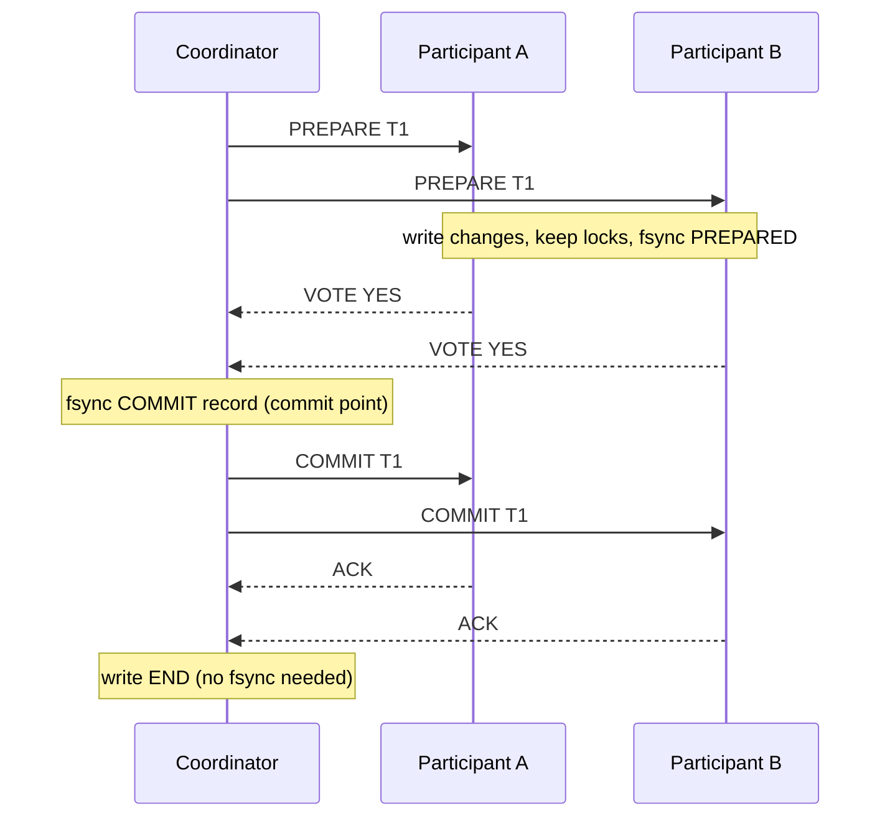

# 🔄 Distributed Transaction Patterns — Principal Engineer Deep-Dive

> *12 patterns & interview questions covering 2PC, 3PC, Saga, Outbox, TCC, Idempotency, Dual-Write, and production trade-offs — every answer expects principal engineer-level depth.*

---

## Table of Contents

1. [The Core Problem: Distributed Consistency](#1-the-core-problem-distributed-consistency)
2. [Two-Phase Commit (2PC) — Detailed Protocol & Failure Modes](#2-two-phase-commit-2pc-detailed-protocol-failure-modes)
3. [Three-Phase Commit (3PC) — Why It's Rarely Used](#3-three-phase-commit-3pc-why-its-rarely-used)
4. [Saga Pattern — Choreography vs Orchestration](#4-saga-pattern-choreography-vs-orchestration)
5. [Transactional Outbox Pattern — Reliable Event Publishing](#5-transactional-outbox-pattern-reliable-event-publishing)
6. [TCC (Try-Confirm/Cancel) Pattern](#6-tcc-try-confirmcancel-pattern)
7. [Dual-Write Problem & Solutions](#7-dual-write-problem-solutions)
8. [Idempotency & Exactly-Once Semantics](#8-idempotency-exactly-once-semantics)
9. [Compensating Transaction Design](#9-compensating-transaction-design)
10. [Pattern Comparison & Decision Matrix](#10-pattern-comparison-decision-matrix)
11. [Production Anti-Patterns & Pitfalls](#11-production-anti-patterns-pitfalls)
12. [End-to-End System Design Interview](#12-end-to-end-system-design-interview)

---

## 1. The Core Problem: Distributed Consistency

**Q:** "A customer places an order: we need to reserve inventory, charge the payment card, and schedule shipping across three different microservices, each with its own database. Explain why a simple ACID transaction can't work here, and what fundamental trade-offs any solution must make."

**What They're Really Testing:** Whether you deeply understand the impossibility of distributed ACID without coordination overhead, and can articulate the consistency/availability/latency trade-off space.

!!! tip "30-second answer"
    A database transaction only covers data that one transaction manager controls. Three services with three databases (plus a card network) need **atomic commitment** across independent participants, and the only ways to get it are coordination protocols like 2PC, which hold locks across network round trips and block when the coordinator fails. Most microservice systems therefore give up atomic *isolation* and accept **eventual consistency with explicit recovery**: sagas (compensate on failure), TCC (reserve, then confirm or cancel), and the transactional outbox (never lose the event that drives the next step). Every option trades among consistency, availability, latency and operational complexity; none removes the need for idempotent operations.

### Answer

**Why Local ACID Doesn't Stretch Across Services:**

```
Order Service
  BEGIN
    INSERT INTO orders (id, status) VALUES (1, 'pending')
    POST http://inventory/reserve      ← not part of this transaction
    POST http://payment/charge         ← not part of this transaction
    POST http://shipping/schedule      ← not part of this transaction
    UPDATE orders SET status = 'confirmed'
  COMMIT

Failure cases:
  • payment succeeds, then COMMIT fails → customer charged, no order exists
  • shipping call times out → did it happen? A retry may double-schedule
  • the open transaction holds row locks and a DB connection for the
    duration of three network calls
```

The order DB's `ROLLBACK` can't undo a charge in someone else's system. You need either a protocol all participants take part in (2PC/XA) or application-level recovery (sagas, TCC).

**The Trade-off Space:**

| Approach | Atomicity | Isolation | Availability under failure | Latency | Where it fits |
|---|---|---|---|---|---|
| Single DB transaction | Yes | Yes | DB's own | Lowest | Data that can live in one database (often the right answer: merge the services' data) |
| 2PC / XA | Yes | Yes (locks held until commit) | Blocks if coordinator fails | ≥ 2 RTT + forced log writes, locks held across them | Few participants, same datacenter, all support XA |
| Consensus-replicated 2PC (Spanner, CockroachDB) | Yes | Yes | Survives minority failures | Consensus round trips per participant | Distributed SQL, not across services |
| TCC | Eventually (confirm/cancel) | Partial: reservations are visible | High | Try + Confirm round trips | Resources that support holds (seats, rooms, card authorizations) |
| Saga (+ outbox) | Eventually (compensate) | **None**: intermediate states visible | High | Each step commits locally | Long-running, cross-service business workflows |

**What theory says (and doesn't):**

- **Atomic commit needs agreement**, so it inherits consensus limits. 2PC is blocking: it waits on one coordinator. Non-blocking atomic commit is possible if the decision is replicated with consensus (Gray & Lamport's *Paxos Commit*, 2006), which is what distributed SQL databases do.
- **FLP** (1985) says no deterministic protocol can *guarantee termination* in a fully asynchronous system with even one crash. It doesn't force a choice between 2PC and sagas; it says any protocol that is always safe may, in bad periods, stall. Paxos/Raft live with this by being safe always and live when timing is reasonable.
- **CAP** applies too: during a partition, a protocol that never shows inconsistent state (2PC) must refuse or block; one that stays available (saga) must expose intermediate states.

**Choosing a Pattern:**

| Question | If yes |
|---|---|
| Can the data live in one database (or one distributed SQL cluster)? | Do that. Local transactions beat any pattern below |
| Must all-or-nothing be visible instantly, participants support XA, few of them, low latency? | 2PC/XA, with an HA transaction manager and lock-timeout monitoring |
| Can each resource be *held* cheaply and released on timeout? | TCC |
| Long-running, many services, each step has a business undo (or can be made retriable)? | Orchestrated saga |
| In every case | Transactional outbox for events, idempotency keys on every step |

### 🔍 Staff-Level Evaluation

| Criterion | What I'm Looking For |
|-----------|----------------------|
| **Root cause** | One transaction manager per database; network calls can't join a local transaction |
| **Trade-off space** | Maps atomicity, isolation, availability and latency per approach |
| **Theory used correctly** | 2PC blocking, Paxos Commit, FLP as a termination (not safety) result |
| **First question** | Asks whether the data should be in one database before reaching for a pattern |

---

## 2. Two-Phase Commit (2PC) — Detailed Protocol & Failure Modes

**Q:** "Walk me through the 2PC protocol in detail, including the write-ahead log contents. What happens when the coordinator crashes after phase 1? What happens when a participant crashes during phase 2? How do XA transactions implement 2PC in practice? What is the 'blocking problem' exactly and how long can it last?"

**What They're Really Testing:** Whether you understand 2PC at the protocol level — not just the high-level flow — including the write-ahead log records, timeout handling, and the specific conditions that cause blocking.

!!! tip "30-second answer"
    Phase 1: the coordinator asks every participant to **prepare**; a participant makes its changes durable, keeps its locks, **forces a PREPARED record to disk**, then votes YES (or votes NO and aborts). Phase 2: if all voted YES the coordinator **forces a COMMIT record** (the commit point) and tells everyone; otherwise it aborts. A participant that voted YES is **in doubt**: it may not commit or abort on its own, so if the coordinator dies after the votes and before participants hear the decision, they block with locks held until the coordinator (or its log) comes back. That can be seconds with an HA transaction manager or hours without one. Operators can force a **heuristic** outcome, which may break atomicity.

### Answer

**Log Records (presumed-abort 2PC, the variant most systems use):**

```
PARTICIPANT
  [PREPARED, T1, undo/redo info, coordinator id]   FORCED (fsync) before voting YES
  [COMMITTED, T1] or [ABORTED, T1]                 written when the decision arrives
                                                   (commit forced, then ACK)

COORDINATOR
  [COMMIT, T1, participants=[A,B,C]]               FORCED before sending any COMMIT
                                                   ← the commit point
  [END, T1]                                        lazily, after all ACKs
  (no abort record needed: "no record" means ABORT — hence "presumed abort")
```

The two forced writes are the whole trick: the participant's PREPARED record lets it survive a crash while still able to commit; the coordinator's COMMIT record makes the decision survive the coordinator's crash.

**Protocol Flow:**



**Failure Modes:**

| When | Who | What happens |
|---|---|---|
| Before voting | Participant crashes | Coordinator times out → ABORT. On restart the participant finds no PREPARED record and aborts locally |
| After voting YES | Participant crashes | On restart it finds PREPARED, re-acquires locks, and asks the coordinator for the outcome. It cannot decide alone |
| Before writing COMMIT | Coordinator crashes | No decision exists → recovery presumes ABORT. YES-voters stay in doubt until they can ask |
| After writing COMMIT, before all hear it | Coordinator crashes | **The blocking case.** YES-voters hold locks and can't learn the outcome until the coordinator's log is readable again |
| During phase 2 | Network drops COMMIT to B | Coordinator keeps resending; B is in doubt, holding locks, until it arrives |

**How long can blocking last?** Exactly as long as the coordinator's decision is unavailable:

- Transaction manager with a replicated log / standby: failover time, typically seconds to tens of seconds.
- Single coordinator on a dead host: until someone restores it, possibly hours. Meanwhile every row the in-doubt transactions touched is locked.
- Way out: heuristic commit/rollback by an operator. If they guess differently from the logged decision you get a *heuristic mixed* outcome, which XA reports as an error and someone must repair by hand.

Participants that time out *before* voting may abort freely. Cooperative termination (asking other participants) helps only if some participant already knows the outcome or hasn't voted.

**XA in Practice:**

```sql
-- MySQL / InnoDB: XA statements (the transaction manager, e.g. a JTA
-- implementation such as Narayana or Atomikos, issues these on each resource)
XA START 'order-42';
  UPDATE inventory SET stock = stock - 1 WHERE id = 42;
XA END 'order-42';
XA PREPARE 'order-42';        -- phase 1: durable, locks kept
XA COMMIT 'order-42';         -- phase 2 (or XA ROLLBACK 'order-42')
XA RECOVER;                   -- list in-doubt branches after a crash

-- PostgreSQL: same idea, different syntax.
-- Disabled by default: set max_prepared_transactions > 0.
BEGIN;
  UPDATE payments SET balance = balance - 100 WHERE user_id = 7;
PREPARE TRANSACTION 'order-42';
COMMIT PREPARED 'order-42';   -- or ROLLBACK PREPARED 'order-42'
SELECT * FROM pg_prepared_xacts;   -- in-doubt transactions; they hold locks
                                   -- and block VACUUM until resolved
```

Kafka can't be an XA participant. Its transactions are 2PC-like *inside* Kafka only, so DB + Kafka atomicity is done with the outbox pattern instead.

**Performance Model:**

```
Latency for one transaction (coordinator in the same DC as participants):
  prepare round trip      1 RTT     + participant forced write
  coordinator decision              + 1 forced write
  commit round trip       1 RTT     (+ participant commit write)
  ≈ 2 RTT + 2–3 sequential fsyncs + the work itself

  Same DC:  RTT ≈ 0.5 ms, fsync on NVMe ≈ 0.05–1 ms   → a few ms
  Cross-region: RTT ≈ 50–100 ms                        → 100–200+ ms

Throughput is NOT 1/latency: a coordinator runs many transactions in parallel.
The real limit is lock hold time on contended rows. A hot row locked for the
whole 2PC (say 5 ms same-DC, 150 ms cross-region) caps that row at roughly
200 or ~7 commits per second, however many machines you add.
```

**When 2PC Is Acceptable:**

- A few participants that all speak XA, same datacenter, short transactions.
- Low contention on the rows involved.
- An HA transaction manager and monitoring for in-doubt transactions (`XA RECOVER`, `pg_prepared_xacts`).
- Avoid it across regions, across organisations, with long-running steps, or with participants that can't prepare (HTTP APIs, email, card networks).

### 🔍 Staff-Level Evaluation

| Criterion | What I'm Looking For |
|-----------|----------------------|
| **Log details** | Names the two forced writes (participant PREPARED, coordinator COMMIT) and why each exists |
| **Blocking** | Defines "in doubt" precisely and ties blocking duration to the decision's availability |
| **Crash recovery** | Walks through each crash point, including presumed abort |
| **XA mechanics** | Knows the prepare/commit/recover commands and that prepared transactions hold locks |
| **Performance** | Models latency from RTTs and fsyncs; knows contention (lock hold time) is the real throughput limit |

---

## 3. Three-Phase Commit (3PC) — Why It's Rarely Used

**Q:** "Explain how 3PC attempts to solve the blocking problem of 2PC. Why is 3PC still vulnerable to network partitions? Why is it rarely used in production despite being 'non-blocking'?"

**What They're Really Testing:** Whether you understand that 3PC's non-blocking property depends on network assumptions that don't hold in practice, and can articulate the subtle failure modes.

!!! tip "30-second answer"
    3PC (Skeen, 1981) inserts a **PreCommit** phase between voting and committing, so no participant can commit while another is still "uncertain". That lets surviving participants finish without the coordinator: if anyone reached PreCommit they commit, otherwise they abort. The catch is the assumption that a node that doesn't answer has **crashed**. With real networks (partitions, long delays) a silent node may be alive and deciding differently, so one side commits while the other aborts: 3PC trades 2PC's *blocking* for possible *inconsistency*, at the price of an extra round trip. Systems that need non-blocking commit replicate 2PC's decision with Paxos/Raft instead.

### Answer

**3PC Protocol — The Three Phases:**

```
Phase 1  CanCommit?   coordinator → all     participants vote YES/NO (and prepare)
Phase 2  PreCommit    coordinator → all     only if every vote was YES; participants ACK
Phase 3  DoCommit     coordinator → all     participants commit and ACK

Participant states:  INITIAL → UNCERTAIN (voted YES) → PRECOMMITTED → COMMITTED
                                  └────────────────→ ABORTED
Key property: no participant is COMMITTED while another is still UNCERTAIN.
```

**Termination Protocol (coordinator failed):**

The surviving participants elect a new coordinator, which collects their states:

| States found among reachable participants | Decision |
|---|---|
| Any COMMITTED | Commit |
| Any ABORTED | Abort |
| Any PRECOMMITTED (none committed/aborted) | Send PreCommit to the rest, then commit |
| All UNCERTAIN | Abort (no one can have committed, because commit requires everyone to have been PreCommitted first) |

It's not a majority vote. It's a rule based on the furthest state any reachable participant reached, and it's only correct if "unreachable" really means "crashed".

**Why 3PC Fails Under Network Partitions:**

```
Coordinator sends PreCommit to A, then the network partitions {A} | {B, C}.

Side {A}:     A is PRECOMMITTED, times out, runs termination alone:
              "someone is PRECOMMITTED" → COMMIT
Side {B, C}:  both UNCERTAIN, time out, run termination:
              "all UNCERTAIN" → ABORT

Partition heals: A committed, B and C aborted. Atomicity violated.
```

So under asynchrony 3PC doesn't merely "degrade to blocking", it can be **unsafe**. Making it safe would require a quorum-based termination protocol (e.g. Skeen's quorum-based 3PC, or E3PC), which can block again in the minority, and at that point you're building consensus.

**Why 3PC Is Rarely Used:**

1. **Its assumption is false in practice.** Bounded message delay and perfect failure detection don't exist on real networks; a GC pause looks like a crash.
2. **Extra round trip** on every transaction (3 RTTs vs 2), with no benefit in the common no-failure case.
3. **More states to get right** in recovery code that rarely runs.
4. **Better alternatives:** 2PC with a consensus-replicated coordinator (Spanner, CockroachDB, YugabyteDB) is non-blocking as long as a majority of each group is up; sagas for cross-service workflows.

**3PC vs 2PC:**

| Property | 2PC | 3PC |
|---|---|---|
| Phases / RTTs | 2 | 3 |
| Coordinator crash | Blocks YES-voters | Survivors can terminate |
| Network partition | Blocks (safe) | May commit on one side and abort on the other (unsafe) |
| Network assumption for its guarantees | None for safety | Synchronous (bounded delays, accurate failure detection) |
| Production adoption | XA/JTA, `PREPARE TRANSACTION`, inside distributed DBs | Essentially none |

### 🔍 Staff-Level Evaluation

| Criterion | What I'm Looking For |
|-----------|----------------------|
| **PreCommit purpose** | Explains that it removes the state where some committed while others are uncertain |
| **Termination rule** | States the actual rule (furthest state reached), not "majority vote" |
| **Partition failure** | Shows the split where one side commits and the other aborts |
| **Practical answer** | Points to consensus-replicated 2PC as the real non-blocking solution |

---

## 4. Saga Pattern — Choreography vs Orchestration

**Q:** "Design an order-to-shipment workflow that spans 5 microservices using the Saga pattern. Walk through both choreography and orchestration approaches. What happens when a compensating transaction fails? How do you handle the 'lost compensation' problem? How do you ensure idempotent compensations? Now make it resilient to production failures."

**What They're Really Testing:** Whether you understand Sagas not just as a pattern, but as a distributed state machine with real failure modes: lost compensations, partial failures, timeout cascades, and zombie transactions.

!!! tip "30-second answer"
    A saga is a durable state machine: run local transactions in order, and on a business failure run the compensations of the completed steps in reverse. Order steps as **compensatable → pivot → retriable** (you can't "unsend" an email, so it goes last and is simply retried). **Choreography** (services react to each other's events) suits short flows; **orchestration** (one coordinator, persisted state) suits anything with more than a few steps, timeouts or compliance needs. Three rules make it production-safe: persist saga state before and after every step, make every step and compensation **idempotent** (a timeout means "unknown", so you will retry things that already happened), and treat a failing compensation as something to **retry until it succeeds** or escalate, never as "done".

### Answer

**Choreography Saga — Event-Driven Flow:**

```
ORDER SERVICE        INVENTORY SVC       PAYMENT SVC       SHIPPING SVC       NOTIFICATION SVC
    │                     │                    │                  │                    │
    │──OrderCreated─────► │                    │                  │                    │
    │                     │──StockReserved───► │                  │                    │
    │                     │                    │──PaymentCharged─►│                    │
    │                     │                    │                  │──LabelCreated─────►│
    │                     │                    │                  │                    │──EmailSent
    │                     │                    │                  │                    │
    │                     │                    │                  │                    │
    │           ── FAILURE PATH ──            │                  │                    │
    │                     │    StockReserveFailed                │                    │
    │◄────────────────────┤                    │                  │                    │
    │(no compensation     │                    │                  │                    │
    │ needed — nothing    │                    │                  │                    │
    │ happened before)    │                    │                  │                    │
    │                     │                    │                  │                    │
    │                     │  PaymentFailed     │                  │                    │
    │◄────────────────────┤◄───────────────────┤                  │                    │
    │ (compensate:        │   (compensate:     │                  │                    │
    │  notify user)       │    release stock)  │                  │                    │
    │                     │                    │                  │                    │
    │                     │                    │  ShipFailed      │                    │
    │◄────────────────────┤◄───────────────────┤◄─────────────────┤                    │
    │ (compensate:        │   (compensate:     │  (compensate:    │                    │
    │  notify user)       │    release stock)  │   refund charge) │                    │
    │                     │                    │                  │                    │
┌──────────────────────────────────────────────────────────────────────────────────────────┐
│ PROBLEM: How does Inventory know to release stock for a payment failure?                  │
│ Answer: Payment service publishes "PaymentFailed" event. Inventory subscribes.            │
│                                                                                           │
│ PROBLEM: What if Inventory was DOWN when PaymentFailed was published?                     │
│ Answer: Event is persisted in Kafka. Inventory replays from last offset.                  │
│                                                                                           │
│ PROBLEM: What if PaymentFailed was delivered but Inventory crashed before releasing?      │
│ Answer: At-least-once delivery. On restart, Inventory replays from committed offset.       │
│         ReleaseStock must be IDEMPOTENT (using order_id as idempotency key).              │
└──────────────────────────────────────────────────────────────────────────────────────────┘
```

**Orchestration Saga — Central Coordinator:**

```python
import asyncio
import enum
import json
from dataclasses import dataclass, field
from typing import Optional

class SagaStatus(enum.Enum):
    PENDING = "PENDING"
    STEP_COMPLETED = "STEP_COMPLETED"
    COMPLETED = "COMPLETED"
    COMPENSATING = "COMPENSATING"
    COMPENSATED = "COMPENSATED"
    FAILED = "FAILED"

@dataclass
class SagaState:
    saga_id: str
    status: SagaStatus
    current_step: int
    completed_steps: list[int]
    compensating_steps: list[int]          # steps whose compensation succeeded
    error_message: Optional[str] = None
    payload: dict = field(default_factory=dict)  # Business data

class OrchestrationSaga:
    """
    Saga coordinator with persistent state machine.
    Each step is idempotent. Compensations are retriable.
    """

    # compensatable → pivot → retriable
    STEPS = [
        ("reserve_stock", InventoryService.reserve, InventoryService.release),
        ("charge_card", PaymentService.charge, PaymentService.refund),       # pivot
        ("create_label", ShippingService.create_label, ShippingService.void_label),
        ("send_email", NotificationService.send, None),  # can't be undone: retry only
    ]

    def __init__(self, db, event_bus, max_retries=3):
        self.db = db  # PostgreSQL for saga state
        self.event_bus = event_bus  # Kafka for step execution
        self.max_retries = max_retries

    async def start_saga(self, saga_id: str, payload: dict) -> SagaState:
        state = SagaState(
            saga_id=saga_id,
            status=SagaStatus.PENDING,
            current_step=0,
            completed_steps=[],
            compensating_steps=[],
            payload=payload,
        )
        await self._persist_state(state)
        await self._execute_step(state)
        return state

    async def _execute_step(self, state: SagaState):
        """Execute the current step with retries and timeout."""
        step_name, step_fn, _ = self.STEPS[state.current_step]

        for attempt in range(1, self.max_retries + 1):
            try:
                # Send command to the service via event bus; service replies
                # with a result event. The command carries an idempotency key
                # (saga_id + step) because a timeout does NOT mean "didn't happen":
                # the retry may hit a step that already succeeded.
                result = await self._send_command_with_timeout(
                    step_name,
                    state.payload,
                    idempotency_key=f"{state.saga_id}:{step_name}",
                    timeout_seconds=30,
                )

                # Update state
                state.current_step += 1
                state.completed_steps.append(state.current_step - 1)
                state.status = SagaStatus.STEP_COMPLETED
                await self._persist_state(state)

                # Check if saga is complete
                if state.current_step >= len(self.STEPS):
                    state.status = SagaStatus.COMPLETED
                    await self._persist_state(state)
                    await self._notify_completion(state.saga_id)
                    return

                # Execute next step (a real engine would loop or enqueue
                # the next command instead of recursing)
                await self._execute_step(state)
                return

            except TimeoutError as e:
                if attempt < self.max_retries:
                    await asyncio.sleep(2 ** attempt)  # Exponential backoff
                    continue
                # Outcome unknown. Before the pivot, compensating is safe
                # (compensations are idempotent and tolerate "never happened").
                # After the pivot, keep retrying forward instead.
                await self._fail_saga(state, f"Step {step_name} failed after {self.max_retries} retries: {e}")
                return

            except NonRetriableError as e:
                # e.g., payment declined, insufficient stock
                await self._fail_saga(state, f"Step {step_name} failed: {e}")
                return

    async def _fail_saga(self, state: SagaState, error: str):
        """Execute compensating transactions in REVERSE order."""
        state.status = SagaStatus.COMPENSATING
        state.error_message = error
        await self._persist_state(state)

        # Execute compensations for completed steps, in reverse
        all_ok = True
        for step_idx in reversed(state.completed_steps):
            step_name, _, comp_fn = self.STEPS[step_idx]
            if comp_fn is None or step_idx in state.compensating_steps:
                continue
            try:
                await self._send_command_with_timeout(
                    f"compensate_{step_name}",
                    state.payload,
                    idempotency_key=f"{state.saga_id}:{step_name}:undo",
                    timeout_seconds=30,
                )
                state.compensating_steps.append(step_idx)
                await self._persist_state(state)
            except Exception as comp_error:
                # Compensation failed. Do NOT mark the saga compensated:
                # leave it COMPENSATING so the recovery worker retries it,
                # and alert. Stop here so compensations stay in reverse order.
                all_ok = False
                await self._alert(state.saga_id, step_name, str(comp_error))
                break

        if all_ok:
            state.status = SagaStatus.COMPENSATED
            await self._persist_state(state)
            await self._notify_failure(state.saga_id, error)
```

**The "Lost Compensation" Problem — And How to Solve It:**

```python
# PROBLEM:
# Compensation for step 2 (refund) succeeded, but compensation for step 1
# (release stock) failed. The system is now in an inconsistent state:
#   - Payment refunded
#   - Stock NOT released
#
# The compensation was "lost" — the failure means the system is in an
# intermediate state that no one is acting on.

# SOLUTION 1: Saga recovery daemon (background worker)
class SagaRecoveryWorker:
    """
    Background worker that scans for stuck sagas and retries compensations.
    Runs every 30 seconds.
    """

    async def recover_stuck_sagas(self):
        stuck = await self.db.query("""
            SELECT * FROM saga_state
            WHERE status = 'COMPENSATING'
              AND updated_at < NOW() - INTERVAL '5 minutes'
        """)

        for saga in stuck:
            await self._retry_compensations(saga)

    async def _retry_compensations(self, saga: SagaState):
        """Retry, in reverse order, all compensations not yet acknowledged."""
        for step_idx in reversed(saga.completed_steps):
            step_name, _, comp_fn = self.STEPS[step_idx]
            if comp_fn is None or step_idx in saga.compensating_steps:
                continue  # Nothing to undo, or already compensated

            try:
                await comp_fn(saga.payload,
                              idempotency_key=f"{saga.saga_id}:{step_name}:undo")
                saga.compensating_steps.append(step_idx)
                await self._persist_state(saga)
            except Exception:
                return  # Will retry in next recovery cycle (keeps reverse order)

        # Check if all compensations done
        needed = {i for i in saga.completed_steps if self.STEPS[i][2] is not None}
        if needed <= set(saga.compensating_steps):
            saga.status = SagaStatus.COMPENSATED
            await self._persist_state(saga)

# SOLUTION 2: Escalation, not silent parking
# Keep backoff state in the saga row (next_retry_at, retry_count) so the
# recovery worker above does the waiting; never sleep inside a consumer
# (it stalls the partition and triggers a rebalance).
# After N attempts or a deadline: page a human, show the saga in an ops UI
# with full context, and let them retry, force-complete or fix data.
# Common causes: the downstream API changed, the resource was already
# modified by a later business action (refund after chargeback), a bug.

# SOLUTION 3: Idempotent compensations
# Every compensation must be IDEMPOTENT — running it multiple times
# must produce the same result as running it once.

class IdempotentPaymentService:
    def refund(self, order_id: str, amount: float) -> None:
        # 1. Record intent first (unique on order_id). A retry finds the row.
        self.db.execute(
            "INSERT INTO refunds (order_id, amount, status) "
            "VALUES (%s, %s, 'PENDING') ON CONFLICT (order_id) DO NOTHING",
            (order_id, amount),
        )
        row = self.db.query_one(
            "SELECT status FROM refunds WHERE order_id = %s", (order_id,))
        if row["status"] == "COMPLETED":
            return  # already done: idempotent no-op

        # 2. Call the gateway with a deterministic idempotency key. If we
        #    crashed after the gateway refunded but before step 3, the retry
        #    gets the original result instead of a second refund.
        self.payment_gateway.refund(order_id, amount,
                                    idempotency_key=f"refund-{order_id}")

        # 3. Mark complete.
        self.db.execute(
            "UPDATE refunds SET status = 'COMPLETED' WHERE order_id = %s",
            (order_id,))
        # Note: check-then-insert without the gateway key would double-refund
        # if the process crashed between the gateway call and the INSERT.
```

**Choreography vs Orchestration — Production Trade-offs:**

```yaml
CHOREOGRAPHY SAGA:
  Pros:
    + Decentralized — no single point of failure
    + Each service only knows about its own events
    + Scales naturally with event bus partitioning
  Cons:
    - Impossible to see the full workflow in one place
    - "Saga is all over the place" — hard to debug
    - Eventual consistency chain can break at any point
    - Cyclic dependencies between services (event spaghetti)
    - No single place for timeout management
  Use: Simple linear flows with < 5 participants

ORCHESTRATION SAGA:
  Pros:
    + Centralized state machine — full visibility
    + Timeout, retry, and compensation logic in one place
    + Easy to add monitoring, metrics, and tracing
    + No cyclic dependencies between services
  Cons:
    - Coordinator is a potential bottleneck
    - Coordinator is a SPOF (unless HA)
    - Coordinator must be versioned and backward-compatible
  Use: Complex workflows, long-running sagas, compliance-heavy

DEFAULT CHOICE for non-trivial workflows:
  ORCHESTRATION SAGA + OUTBOX PATTERN
  (or a durable workflow engine: Temporal, AWS Step Functions, Camunda)
```

### 🔍 Staff-Level Evaluation

| Criterion | What I'm Looking For |
|-----------|----------------------|
| **Failed compensation** | Articulates the "lost compensation" problem; saga stays COMPENSATING, recovery worker retries, humans get escalations |
| **Idempotent compensations** | Records intent, then calls downstream with a deterministic idempotency key |
| **Choreography vs orchestration** | Gives concrete trade-offs with examples, not just abstract benefits |
| **Timeout management** | Uses exponential backoff, distinguishes retriable vs non-retriable errors |
| **Recovery daemon** | Designs a background worker that rescues stuck sagas |

---

## 5. Transactional Outbox Pattern — Reliable Event Publishing

**Q:** "We have a microservice that needs to publish events to Kafka whenever a database row changes. The naive approach (write to DB then publish to Kafka) has a race condition: what if the DB write succeeds but Kafka publish fails? Or the Kafka publish succeeds but the DB transaction rolls back? Design a reliable solution. How do you scale it to 10K events/second? Compare polling vs CDC-based approaches."

**What They're Really Testing:** Whether you understand the dual-write problem in depth and can design a production-grade outbox implementation with concrete trade-offs.

!!! tip "30-second answer"
    Write the business row **and** an event row into an `outbox` table in the **same local transaction**, so both exist or neither does. A separate relay publishes outbox rows to Kafka, either by **polling** (`SELECT ... FOR UPDATE SKIP LOCKED`, simple, 100s of ms latency) or by **CDC** (Debezium tailing the WAL/binlog, lower latency, no polling load, more infrastructure). Delivery is **at-least-once**: the relay can crash after publishing and before marking the row, so consumers must deduplicate by event ID. Key messages by **aggregate ID** to keep per-entity ordering, and keep the outbox small (delete or partition-drop published rows).

### Answer

**The Dual-Write Problem:**

```python
# NAIVE APPROACH — RACE CONDITION:
def create_order(order_data):
    with db.transaction():
        order = db.execute("INSERT INTO orders VALUES (...)")

    # ⚠️ If this fails, we have an order in DB but no event!
    # ⚠️ If this succeeds but DB transaction rolls back, event with phantom data!
    kafka.produce("order.created", order.to_json())

# PROBLEM 1: DB succeeds, Kafka fails
#   → Order exists in DB, no event published
#   → Downstream services don't know about the order
#   → Silent data loss!

# PROBLEM 2: Kafka succeeds, DB rolls back
#   → Event published but order doesn't exist
#   → Phantom event consumed by downstream services
#   → Inventory reserved for nothing!

# PROBLEM 3: Duplicates
#   → The idempotent producer (default since Kafka 3.0) removes duplicates
#     caused by the producer's own retries within one session...
#   → ...but not an application that crashes and re-sends, or a consumer that
#     processes and crashes before committing its offset
#   → Downstream must handle duplicates anyway
```

**The Outbox Pattern — Solution:**

```sql
-- Same database transaction writes to an OUTBOX table:
CREATE TABLE outbox (
    id UUID PRIMARY KEY DEFAULT gen_random_uuid(),
    aggregate_type VARCHAR(100) NOT NULL,    -- e.g., 'order'
    aggregate_id VARCHAR(100) NOT NULL,      -- e.g., order_id
    event_type VARCHAR(100) NOT NULL,        -- e.g., 'OrderCreated'
    payload JSONB NOT NULL,                  -- event data
    created_at TIMESTAMPTZ NOT NULL DEFAULT NOW(),
    published_at TIMESTAMPTZ,               -- NULL = not yet published
    retry_count INT NOT NULL DEFAULT 0,
    next_retry_at TIMESTAMPTZ,
    idempotency_key VARCHAR(255) UNIQUE     -- prevent duplicate events from API retries
);

-- Partial index: only unpublished rows, in publish order
CREATE INDEX idx_outbox_unpublished ON outbox (created_at)
    WHERE published_at IS NULL;
```

```python
# CORRECT APPROACH — Outbox in same DB transaction:
def create_order_with_outbox(order_data):
    with db.transaction():
        # 1. Business operation
        order = db.execute(
            "INSERT INTO orders (...) VALUES (...) RETURNING id"
        )

        # 2. Outbox record in SAME transaction
        db.execute("""
            INSERT INTO outbox (aggregate_type, aggregate_id, event_type,
                                payload, idempotency_key)
            VALUES ('order', %s, 'OrderCreated', %s, %s)
        """, (
            order['id'],
            json.dumps(order_data),
            f"order-created-{order['id']}",  # Idempotency key
        ))

    # ⚠️ Both or neither — guaranteed by ACID!
    # If this line fails, the DB transaction rolls back.
    # The outbox publisher handles eventual delivery.
```

**Outbox Publisher — Polling-Based:**

```python
class PollingOutboxPublisher:
    """
    Background worker that polls the outbox table and publishes
    events to Kafka. Designed for at-least-once delivery.
    """

    def __init__(self, db_pool, kafka_producer, batch_size=100, poll_interval_ms=100):
        self.db = db_pool
        self.kafka = kafka_producer
        self.batch_size = batch_size
        self.poll_interval_ms = poll_interval_ms
        self.running = True

    async def run(self):
        """Main loop — runs as a background task."""
        while self.running:
            try:
                messages = await self._fetch_unpublished()
                if messages:
                    await self._publish_batch(messages)
                else:
                    await asyncio.sleep(self.poll_interval_ms / 1000)
            except Exception as e:
                logger.error(f"Outbox publisher error: {e}")
                await asyncio.sleep(1.0)  # Back off on error

    async def _fetch_unpublished(self) -> list[dict]:
        """Fetch unpublished messages, oldest first."""
        return await self.db.fetch("""
            SELECT id, aggregate_type, aggregate_id, event_type, payload
            FROM outbox
            WHERE published_at IS NULL
              AND retry_count < 10             -- Max retries before DLQ
              AND (next_retry_at IS NULL OR next_retry_at <= NOW())
            ORDER BY created_at ASC
            LIMIT $1
            FOR UPDATE SKIP LOCKED             -- Don't block other publishers
        """, self.batch_size)

    async def _publish_batch(self, messages: list[dict]):
        """Publish messages to Kafka and mark as published.

        (Simplified: in production, fetch + publish + mark run in one DB
        transaction so the row locks from FOR UPDATE SKIP LOCKED are held
        until the rows are marked.)"""
        for msg in messages:
            try:
                await self.kafka.produce(
                    topic=f"{msg['aggregate_type']}.events",
                    key=msg['aggregate_id'],   # same aggregate → same partition → ordered
                    value=msg['payload'],
                    headers={'event_id': str(msg['id']),        # consumers dedupe on this
                             'event_type': msg['event_type']},
                )   # wait for the broker ack (acks=all) before marking
            except Exception:
                await self.db.execute("""
                    UPDATE outbox
                    SET retry_count = retry_count + 1,
                        next_retry_at = NOW() + INTERVAL '1 second' * power(2, retry_count)
                    WHERE id = $1
                """, msg['id'])
                break   # stop: publishing later rows now would reorder events

            await self.db.execute(
                "UPDATE outbox SET published_at = NOW() WHERE id = $1", msg['id'])
            # Crash here → row is re-published on restart → at-least-once.
```

**Ordering caveat:** multiple relays with `SKIP LOCKED` can publish two events of the *same* aggregate out of order. If per-aggregate order matters, run one relay per outbox partition (hash of aggregate ID) or use CDC, which reads in commit order. Also, `created_at` order isn't commit order: a transaction that started earlier can commit later, so a poller can skip past it; poll with a small safety lag or use CDC.

**Outbox Publisher — CDC-Based (Change Data Capture):**

```sql
-- Alternative: Use PostgreSQL logical replication / Debezium
-- Instead of polling, let the DB's WAL push changes to us

-- 1. Create a publication for the outbox table
CREATE PUBLICATION outbox_pub FOR TABLE outbox;

-- 2. Debezium's Postgres connector reads the WAL through a logical
--    replication slot; its Outbox Event Router transform turns each outbox
--    INSERT into a domain event on topic <aggregate_type>, keyed by aggregate_id.
--    The relay can DELETE rows right after inserting (or in the same
--    transaction): the INSERT is already in the WAL, so the table stays tiny.

-- Benefits of CDC approach:
--   • Latency typically tens to a few hundred ms end to end (no poll interval)
--   • No polling queries against the primary
--   • Events emitted in commit order
--   • At-least-once by default; Kafka Connect supports exactly-once source
--     connectors since Kafka 3.3 (KIP-618), which recent Debezium versions
--     support for some connectors.
--     Consumers should still dedupe on event ID.

-- Drawbacks:
--   • Infrastructure complexity (Debezium, Kafka Connect)
--   • A stalled connector makes the replication slot retain WAL until the
--     disk fills: cap it with max_slot_wal_keep_size (PG 13+) and alert on lag
--   • Slot/failover handling (logical slot failover needs PG 17+ or tooling)
--   • Schema changes require careful handling
```

**Polling vs CDC — Comparison:**

```yaml
Aspect               Polling-Based                  CDC-Based (Debezium)
────────────────────────────────────────────────────────────────────
Latency              poll interval + publish        tens to hundreds of ms
DB Load              SELECT queries on outbox       Minimal (WAL reader)
                    table (can be optimized)
Complexity           Simple SQL + background        Kafka Connect cluster,
                    worker                         Debezium config
Scaling              Multiple publishers with       Partitions by table/row
                    FOR UPDATE SKIP LOCKED
Delivery             At-least-once (dedup on        At-least-once by default
                    consumer side)                  (EOS possible via KIP-618)
Ordering             Per aggregate only with one    Commit order
                    relay per partition
Schema changes       Easy (add columns to           Must handle schema
                    outbox table)                   evolution carefully
Dependency           Only the application DB        Requires Kafka + Connect
Monitoring           Check outbox table size,       Check Debezium lag,
                    lag (created_at vs NOW())       Connect task status
```

**Scaling the Outbox to 10K Events/Second:**

10K events/s is modest for Kafka; the bottlenecks are the outbox table and the relay.

```sql
-- STRATEGY 1: Hash-partition the outbox by aggregate, one relay per partition
-- (keeps per-aggregate ordering while parallelising). The partition key must
-- be part of the primary key in PostgreSQL.
CREATE TABLE outbox (
    id UUID NOT NULL,
    aggregate_id VARCHAR(100) NOT NULL,
    -- ... other columns as above ...
    PRIMARY KEY (aggregate_id, id)
) PARTITION BY HASH (aggregate_id);
CREATE TABLE outbox_p0 PARTITION OF outbox FOR VALUES WITH (MODULUS 4, REMAINDER 0);
CREATE TABLE outbox_p1 PARTITION OF outbox FOR VALUES WITH (MODULUS 4, REMAINDER 1);
-- ... p2, p3

-- STRATEGY 2: Keep the table small. Delete published rows in batches (or use
-- time partitions and DROP old ones) so the unpublished-rows index stays hot and
-- autovacuum keeps up. A huge outbox is the most common cause of relay lag.
```

- **Strategy 3, batch everything:** fetch 500–1000 rows per poll, produce asynchronously with `linger.ms`/compression, wait for all acks, then mark the batch with one `UPDATE ... WHERE id = ANY($1)`.
- **Strategy 4, switch to CDC** when polling load or latency becomes a problem.
- Don't move the outbox to a separate database: then writing business data and outbox row is itself a dual write.

```python
# Related: API-level idempotency in the same transaction
# Since idempotency_key is UNIQUE, duplicate inserts fail silently.
# This allows retrying the entire business transaction safely:
def create_order_safe(order_data):
    # Generate idempotency key at the API level
    idempotency_key = order_data.get('idempotency_key', str(uuid4()))

    with db.transaction():
        # Try to insert outbox record first — if exists, it's a retry
        result = db.execute("""
            INSERT INTO outbox (idempotency_key, ...)
            VALUES (%s, ...)
            ON CONFLICT (idempotency_key) DO NOTHING
            RETURNING id
        """, (idempotency_key,))

        if result:
            # First time processing — execute business logic
            order = db.execute("INSERT INTO orders (...) VALUES (...)")
        else:
            # Already processed — fetch previous result
            order = db.execute("SELECT * FROM orders WHERE ...")

    return order
```

### 🔍 Staff-Level Evaluation

| Criterion | What I'm Looking For |
|-----------|----------------------|
| **Dual-write problem** | Explains both failure modes (DB succeeds/Kafka fails and vice versa) |
| **Transactional outbox** | Implements outbox in same DB transaction with idempotency key |
| **Polling vs CDC** | Compares both with concrete latency, load, and complexity numbers |
| **Scaling** | Partitions by aggregate, batches, keeps the table small, knows when to move to CDC |
| **Ordering & duplicates** | Keys by aggregate ID; consumers dedupe on event ID; knows SKIP LOCKED can reorder |

---

## 6. TCC (Try-Confirm/Cancel) Pattern

**Q:** "Explain the TCC pattern. How is it different from Saga? When would you use TCC instead of Saga? Walk through a concrete example of reserving a hotel room using TCC."

**What They're Really Testing:** Whether you understand TCC as a reservation-based pattern that bridges the gap between 2PC (strong locks) and Saga (no locks).

!!! tip "30-second answer"
    TCC is 2PC moved into the business layer. **Try** reserves the resource with a business-level hold that expires (seat held 15 min, card *authorized* but not captured); **Confirm** turns holds into real effects once every Try succeeded; **Cancel** releases them. Unlike a saga, nothing irreversible happens until Confirm, so other users never see a "charged but not booked" state, only "held". Costs: every participant must implement three idempotent operations plus hold expiry, and the coordinator must handle the classic TCC anomalies: Cancel arriving for a Try that never ran (**empty cancel**), a delayed Try arriving after Cancel (**suspension**), and duplicates.

### Answer

**TCC Overview:**

```
TCC is a compromise between 2PC and Saga:

  2PC:  Lock resources → Commit or Abort  (blocking on locks)
  TCC:  Try (reserve) → Confirm (use) or Cancel (release)  (short-lived holds)
  Saga: Do → Compensate (no holds, full rollback needed)

TCC Three Phases:

Phase 1: Try
  - Reserve the resource (hold, don't consume)
  - Example: authorize $100 on credit card, don't capture yet
  - Example: mark hotel room as "pending" but not "booked"
  - Returns: "tentative confirmation ID" for later reference

Phase 2: Confirm
  - Actually consume the reserved resource
  - Example: capture the authorized payment
  - Example: mark hotel room as "booked"
  - Must succeed (retry until done)
  - Called AFTER all Try phases succeeded

Phase 3: Cancel
  - Release the reserved resource
  - Example: void the authorization
  - Example: mark hotel room as "available" again
  - Called if ANY Try phase fails
```

**Concrete Example — Hotel Booking:**

```python
class TCCHotelBooking:
    """
    TCC pattern for booking a hotel room.
    Phase 1: Try — hold the room temporarily
    Phase 2: Confirm — finalize the booking
    Phase 3: Cancel — release the hold
    """

    # ── Phase 1: Try (reserve) ──────────────────────────
    def try_book_room(self, booking_id: str, room_id: str,
                      guest: str, checkin: date, checkout: date) -> str:
        """
        Reserve the room for a limited time (e.g., 15 minutes).
        Returns a hold_id for confirmation/cancellation.
        """
        with self.db.transaction():
            # Suspension guard: if Cancel for this booking already ran
            # (it arrived before this delayed Try), refuse to reserve.
            if self.db.fetch("SELECT 1 FROM tcc_cancelled WHERE booking_id = $1",
                             booking_id):
                raise BookingAlreadyCancelled(booking_id)

            # SELECT ... FOR UPDATE on overlapping rows can't stop a concurrent
            # INSERT of a new overlapping row (phantom), so either lock the room
            # row first or let an exclusion constraint enforce no-overlap:
            #   ALTER TABLE reservations ADD CONSTRAINT no_double_booking
            #     EXCLUDE USING gist (room_id WITH =,
            #                         daterange(checkin, checkout) WITH &&)
            #     WHERE (status IN ('HELD', 'CONFIRMED'));   -- needs btree_gist
            self.db.execute("SELECT 1 FROM rooms WHERE id = $1 FOR UPDATE", room_id)

            existing = self.db.fetch("""
                SELECT 1 FROM reservations
                WHERE room_id = $1
                  AND status IN ('CONFIRMED', 'HELD')
                  AND checkin < $3 AND checkout > $2
            """, room_id, checkin, checkout)

            if existing:
                raise RoomNotAvailable(room_id, checkin, checkout)

            # Create a HOLD (not confirmed); booking_id is UNIQUE → a duplicate
            # Try returns the existing hold instead of creating a second one
            hold = self.db.fetch("""
                INSERT INTO reservations (booking_id, room_id, guest, checkin,
                                          checkout, status, hold_expires_at)
                VALUES ($1, $2, $3, $4, $5, 'HELD', NOW() + INTERVAL '15 minutes')
                ON CONFLICT (booking_id) DO UPDATE SET booking_id = EXCLUDED.booking_id
                RETURNING id
            """, booking_id, room_id, guest, checkin, checkout)

            # Start a background timer to auto-cancel if not confirmed
            self._schedule_auto_cancel(hold['id'], timeout_minutes=15)

            return hold['id']  # Return the hold_id

    # ── Phase 2: Confirm (use) ──────────────────────────
    def confirm_booking(self, hold_id: str):
        """
        Confirm the booking. Must be idempotent.
        Called after ALL Try phases succeeded across all services.
        """
        with self.db.transaction():
            hold = self.db.fetch("""
                SELECT status, hold_expires_at FROM reservations
                WHERE id = $1 FOR UPDATE
            """, hold_id)

            if not hold:
                raise BookingNotFound(hold_id)

            if hold['status'] == 'CONFIRMED':
                return  # Already confirmed — idempotent

            if hold['status'] == 'CANCELLED':
                raise HoldExpired(hold_id)  # Auto-cancelled by timer

            if hold['hold_expires_at'] < datetime.now(timezone.utc):
                raise HoldExpired(hold_id)  # Hold timed out
            # If Confirm can fail like this, the coordinator must Cancel the
            # other participants: holds must outlive the coordinator's
            # Try→Confirm window by a safe margin.

            # Confirm the booking
            self.db.execute("""
                UPDATE reservations
                SET status = 'CONFIRMED', hold_expires_at = NULL
                WHERE id = $1
            """, hold_id)

    # ── Phase 3: Cancel (release) ───────────────────────
    def cancel_booking(self, booking_id: str):
        """
        Cancel the booking and release the room. Keyed by booking_id (not
        hold_id) because Cancel may arrive when Try never ran or failed.
        Must be idempotent.
        """
        with self.db.transaction():
            # Record the cancel first: makes an "empty cancel" succeed and lets
            # a late Try detect it (suspension guard above).
            self.db.execute("""
                INSERT INTO tcc_cancelled (booking_id) VALUES ($1)
                ON CONFLICT DO NOTHING
            """, booking_id)
            self.db.execute("""
                UPDATE reservations
                SET status = 'CANCELLED', hold_expires_at = NULL
                WHERE booking_id = $1 AND status = 'HELD'
            """, booking_id)
            # Already cancelled, or never held: still success (idempotent)
```

**TCC vs Saga vs 2PC:**

```yaml
Aspect              2PC                  TCC                   Saga
──────────────────────────────────────────────────────────────────────────
Resource locking    Long (tx duration)  Short (hold timeout)  None (immediate
                                                                 release)
Consistency         Atomic + isolated   Eventual, but no      Eventual; intermediate
                                        irreversible effect   effects are visible
                                        before Confirm
Latency             High (locks held)   Medium (short hold)   Low (no hold)
Compensation        Rollback (automatic) Cancel (explicit)     Compensating action
Failure handling    Coordinator decides  Timeout auto-cancel   DLQ + recovery
Implementation      DB/XA support       Application code      Application code
Use case            Financial, short     Hotel booking,        Long-running
                    transactions         payment auth          workflows

PRODUCTION RECOMMENDATION:
  - Resources support cheap, expiring holds (inventory, seats, card auths) → TCC
  - All participants are XA-capable databases in one DC → 2PC/XA
  - Long-running workflows, third-party APIs without holds → Saga
```

**The three TCC anomalies (frameworks like Apache Seata handle these for you):**

| Anomaly | Cause | Handling |
|---|---|---|
| Empty cancel | Try timed out before reaching the participant; coordinator sends Cancel | Cancel succeeds with nothing to release, and records that it ran |
| Suspension (hanging) | Delayed Try arrives *after* Cancel | Try checks the cancel record and refuses, otherwise the hold would never be released (until expiry) |
| Duplicates | Retries of Try/Confirm/Cancel | All three idempotent, keyed by the global transaction / booking ID |

### 🔍 Staff-Level Evaluation

| Criterion | What I'm Looking For |
|-----------|----------------------|
| **Hold semantics** | Explains the temporary hold with timeout, auto-cancel for expired holds |
| **Idempotent confirm/cancel** | Both confirm and cancel must be safe to retry |
| **TCC vs Saga** | Explains TCC as the middle ground between 2PC and Saga |
| **Auto-cancel** | Mentions background timer to clean up expired holds |
| **Anomalies** | Handles empty cancel, suspension, and phantom double-booking (lock or exclusion constraint) |

---

## 7. Dual-Write Problem & Solutions

**Q:** "Define the dual-write problem in distributed systems. List all the known solutions and their trade-offs. How do you ensure atomicity when writing to a database AND publishing a message to a message queue?"

**What They're Really Testing:** Whether you know the full landscape of dual-write solutions, not just the outbox pattern.

!!! tip "30-second answer"
    A dual write is any request that must change two systems that don't share a transaction (DB + Kafka, DB + cache, DB + search index). Ordering the two writes can't fix it: whichever goes second can fail. The fixes all reduce it to **one atomic write plus asynchronous propagation**: transactional outbox or CDC (DB is the source of truth), "listen to yourself" / event sourcing (the log is the source of truth), or true 2PC where both sides support it. For caches, prefer **delete** over set and let reads repopulate.

### Answer

**The Dual-Write Problem Defined:**

```
Any time you need to write to TWO different systems atomically,
you have a dual-write problem. Common examples:

  1. Database + Message Queue (most common)
     - INSERT INTO orders + kafka.produce("order_created")
  
  2. Database + Cache
     - UPDATE users SET name = 'X' + redis.set("user:123", new_data)
  
  3. Database + Search Index
     - INSERT INTO products + elasticsearch.index(product)
  
  4. Database + Another Database
     - INSERT INTO service_a.users + INSERT INTO service_b.accounts

The fundamental challenge:
  You need atomicity across two independent systems.
  No single transaction coordinator spans both.
  Any one of them can fail independently.
```

**Solutions Landscape:**

| Solution | How | Guarantee | Cost |
|---|---|---|---|
| Best-effort + reconciliation | Write DB, then the second system; a periodic job repairs drift | None in the moment; eventually repaired | Simplest; only for non-critical derived data (caches) |
| Transactional outbox | Event row in the same DB transaction; relay publishes | Atomic intent, at-least-once delivery | Outbox table + relay; consumers dedupe |
| CDC (Debezium) on business tables | Stream the WAL itself to Kafka | Every committed change, in commit order | Kafka Connect ops; events mirror table schema (leaks internals) unless you use an outbox table |
| 2PC / XA | Both systems are XA resources | Atomic | Blocking, latency; most brokers/caches/search engines can't participate |
| Listen to yourself | Write only to Kafka; your own service consumes it to update its DB | One write, ordered | Read-your-writes is lost: the API returns before the DB reflects the change |
| Event sourcing | The event store *is* the database; projections are built from it | One write | Biggest modelling and operational change |

**Pattern 1: Best-Effort Dual Write with Retry:**

```python
# ⚠️ SIMPLEST BUT WEAKEST APPROACH:
# No atomicity guarantee. Use only for non-critical data.

def update_user_and_cache(user_id, name):
    try:
        # Write to DB
        db.execute("UPDATE users SET name = %s WHERE id = %s", (name, user_id))

        # Invalidate cache (best-effort). DELETE, not SET: two concurrent
        # writers doing SET can leave the older value cached indefinitely.
        try:
            redis.delete(f"user:{user_id}")
        except Exception:
            logger.error(f"Cache invalidation failed for user {user_id}")
            # Stale until TTL expires: keep TTLs short, or invalidate via CDC
            pass

    except Exception:
        # DB failed — nothing to do
        raise
```

**Pattern 2: Transactional Outbox (recommended):**

```python
# Covered in detail in Section 5.
# The gold standard for production systems.
```

**Pattern 3: CDC-Based (Kafka Connect / Debezium):**

```python
# Covered in detail in Section 5.
# Best latency, no application-level polling.
```

**Pattern 4: Event Sourcing (events as source of truth):**

```python
# Instead of writing to both DB and queue, write ONLY events:
class EventSourcedOrderService:
    def create_order(self, order_data):
        # The EVENT is the source of truth — not the DB!
        event = OrderCreated(
            order_id=order_data['id'],
            user_id=order_data['user_id'],
            amount=order_data['amount'],
            items=order_data['items'],
        )

        # Append to event store
        self.event_store.append("orders", event)

        # Event store publishes to all subscribers
        # Downstream services build their own state from events

    # NO DUAL-WRITE! Single write to event store.
    # Subscribers: OrderService builds current state
    #              PaymentService processes payment
    #              InventoryService reserves stock
    #              NotificationService sends email
```

**Pattern 5: Kafka as Source of Truth + Compacted Topic:**

```python
# Write ONLY to Kafka, use compacted topic + state store
# to rebuild database state:

class KafkaFirstOrderService:
    def create_order(self, order_data):
        # 1. Write to Kafka FIRST
        produce_result = self.kafka.produce(
            topic="orders",
            key=order_data['id'],  # Key for compaction
            value=order_data,
            headers={'event_type': 'OrderCreated'},
        )

        # 2. Kafka consumer updates the database
        # This is ASYNC — the DB eventually reflects Kafka
        # We told the client "order created" before the DB has it, so a
        # read right after may 404. Validation that needs current state
        # (e.g. "is there stock?") can't happen before the write either.

    def get_order(self, order_id):
        # Option A: Read from DB (eventually consistent)
        # Option B: Read from a Kafka Streams state store (also eventually
        #           consistent: it lags the log too)
        ...

# The insight: Kafka log = source of truth.
# Database = materialized view of the log.
# No dual-write because you only write to ONE system (Kafka).
```

### 🔍 Staff-Level Evaluation

| Criterion | What I'm Looking For |
|-----------|----------------------|
| **Full landscape** | Can list 5+ dual-write solutions with trade-offs |
| **Outbox depth** | Explains the outbox pattern as the pragmatic choice for most systems |
| **Kafka-first** | Mentions writing to Kafka first and rebuilding state from log |
| **Event sourcing** | Knows it removes the dual write but changes the whole data model |
| **Caches** | Invalidates rather than sets, and explains why |

---

## 8. Idempotency & Exactly-Once Semantics

**Q:** "We need exactly-once processing for a payment system. Explain why true exactly-once is impossible in distributed systems. Then design a practical implementation that achieves 'effectively once' using idempotency keys. Include the API design, database schema, and failure scenarios."

**What They're Really Testing:** Whether you understand that exactly-once means idempotent-at-least-once, and can design the full idempotency infrastructure: API → service → persistence → messaging.

!!! tip "30-second answer"
    A sender that times out can't know whether the request or the response was lost, so it must choose between maybe-never (at-most-once) and maybe-twice (at-least-once). Payments pick at-least-once and make every hop **idempotent**: the client sends an `Idempotency-Key`; the server atomically claims it, runs the side effect passing the same key downstream, and stores the response so retries get the identical answer. Consumers dedupe on an **event ID** in the same transaction as their state change. That's "effectively once". Kafka's exactly-once semantics only cover reading from and writing to Kafka.

### Answer

**Why "Exactly-Once Delivery" Is Impossible (and What We Build Instead):**

```
Client ── charge($100) ──► Server ── processes ──► response lost / timeout

The client can't distinguish "request lost" from "response lost"
(the Two Generals problem: no finite exchange over a lossy channel makes both
sides certain). Its only options:
  • don't retry  → at-most-once  (may lose the payment)
  • retry        → at-least-once (may charge twice)

"Exactly-once" in practice = at-least-once delivery + idempotent processing
(or deduplication), so repeated deliveries have the effect of one.
```

Where the term is used legitimately: **Kafka EOS** (idempotent producer + transactions + `read_committed` consumers) gives exactly-once *read-process-write within Kafka*. As soon as the processing has an external side effect (DB row, HTTP call, email), you're back to idempotency keys. Flink's exactly-once is the same idea: exactly-once *state*, with two-phase-commit sinks for supported outputs.

**API-level idempotency (runnable, SQLite standing in for the real DB):**

```python
import hashlib
import json
import sqlite3

db = sqlite3.connect(":memory:", isolation_level=None)
db.executescript("""
CREATE TABLE idempotency_keys (
    key           TEXT PRIMARY KEY,           -- client-supplied Idempotency-Key
    request_hash  TEXT NOT NULL,              -- detect the same key reused for a different request
    status        TEXT NOT NULL,              -- STARTED | COMPLETED
    response      TEXT,                       -- cached response once COMPLETED
    locked_until  TEXT                        -- lease so a crashed worker's key can be resumed
);
""")


class Conflict(Exception): ...
class InProgress(Exception): ...


def charge(key: str, request: dict, gateway) -> dict:
    req_hash = hashlib.sha256(json.dumps(request, sort_keys=True).encode()).hexdigest()

    # 1. Claim the key atomically (INSERT ... ON CONFLICT DO NOTHING).
    db.execute("BEGIN IMMEDIATE")
    claimed = db.execute(
        "INSERT INTO idempotency_keys (key, request_hash, status, locked_until) "
        "VALUES (?, ?, 'STARTED', datetime('now', '+60 seconds')) "
        "ON CONFLICT (key) DO NOTHING", (key, req_hash)).rowcount == 1
    row = db.execute("SELECT request_hash, status, response, locked_until > datetime('now') "
                     "FROM idempotency_keys WHERE key = ?", (key,)).fetchone()
    if not claimed:
        if row[0] != req_hash:
            db.execute("ROLLBACK")
            raise Conflict("Idempotency-Key reused with a different request body")
        if row[1] == "COMPLETED":
            db.execute("ROLLBACK")
            return json.loads(row[2])                  # replay the original response
        if row[3]:
            db.execute("ROLLBACK")
            raise InProgress("retry later")            # another worker holds the lease
        # STARTED but lease expired: previous worker crashed; take over.
        db.execute("UPDATE idempotency_keys SET locked_until = datetime('now', '+60 seconds') "
                   "WHERE key = ?", (key,))
    db.execute("COMMIT")

    # 2. Side effect, passing the SAME key downstream. If we crashed after the
    #    gateway charged but before step 3, the takeover above re-calls the
    #    gateway, which returns the original charge instead of charging twice.
    result = gateway.charge(request["amount"], request["source"], idempotency_key=key)

    # 3. Store the response.
    response = {"charge_id": result, "status": "succeeded"}
    db.execute("UPDATE idempotency_keys SET status = 'COMPLETED', response = ?, "
               "locked_until = NULL WHERE key = ?", (json.dumps(response), key))
    return response


class FakeGateway:
    def __init__(self): self.charges = {}
    def charge(self, amount, source, idempotency_key):
        return self.charges.setdefault(idempotency_key, f"ch_{len(self.charges) + 1}")


gw = FakeGateway()
req = {"amount": 1000, "currency": "usd", "source": "tok_visa"}
first = charge("key-1", req, gw)
again = charge("key-1", req, gw)                       # client retry
assert first == again and len(gw.charges) == 1
try:
    charge("key-1", {**req, "amount": 5}, gw)
except Conflict as e:
    print("conflict:", e)
print(first, "charges:", len(gw.charges))
```

Design points:

- **The client generates the key** (UUID per logical operation, reused across retries). A server-generated key can't dedupe anything.
- **Store a hash of the request**: same key with a different body is a client bug; return an error rather than the old response (Stripe does this).
- **A lease, not a permanent lock:** if the worker dies mid-request, the key is resumable after the lease expires instead of stuck forever.
- **Pass the key downstream.** The local table alone can't protect the gap between "gateway charged" and "we recorded it"; the gateway's own idempotency closes it. If a downstream has no idempotency support, query it for the outcome before retrying.
- **Retention:** keep keys at least as long as clients may retry (Stripe: 24 hours), then purge by time partition.
- **What to cache:** final results (success *and* deterministic failures such as "card declined"). Don't cache transient errors (timeouts, 503s); let the client retry.

**Consumer-side idempotency (messaging):**

```python
async def process_message(self, message):
    event_id = message.headers["event_id"]       # unique per event, set by the producer/outbox

    async with self.db.transaction():
        # Dedup record and business effect commit TOGETHER.
        claimed = await self.db.fetchval("""
            INSERT INTO processed_events (event_id, processed_at)
            VALUES ($1, NOW())
            ON CONFLICT (event_id) DO NOTHING
            RETURNING event_id
        """, event_id)
        if claimed is None:
            return                               # duplicate: already applied

        await self._apply_business_change(message)   # same DB, same transaction

    await self.consumer.commit(message)          # offset commit AFTER the DB commit
```

- If the process crashes before the DB commit, nothing was recorded and the redelivered message is processed normally. If it crashes after the DB commit but before the offset commit, the redelivery hits the dedup row and is skipped. Committing the claim in a separate transaction from the effect would turn a crash into a **lost** message.
- Dedup on a unique **event ID**, never on the Kafka message key: many different events share a key (all events of one order).
- Alternative without a dedup table: make the effect naturally idempotent (`UPSERT` with a version check, `SET status = 'PAID' WHERE status = 'PENDING'`), or store the consumed offset in the same DB transaction and seek to it on startup.
- If the side effect is in *another* system (an HTTP call), pass the event ID as that system's idempotency key.

### 🔍 Staff-Level Evaluation

| Criterion | What I'm Looking For |
|-----------|----------------------|
| **Why not exactly-once** | Lost request vs lost response (Two Generals), not FLP; knows what Kafka EOS does and doesn't cover |
| **Idempotency key flow** | Client-generated key, request hash, lease, key passed downstream |
| **Concurrent requests** | Atomic claim (`INSERT ... ON CONFLICT`) so only one worker runs the side effect |
| **Crash windows** | Can point to each crash point and say why it's safe |
| **Consumer dedup** | Dedup row and business change in one transaction; offset committed after |

---

## 9. Compensating Transaction Design

**Q:** "Design a compensating transaction framework for a flight booking system. What makes a good compensating transaction? How do you handle compensations that fail? How do you prevent compensations from being lost?"

**What They're Really Testing:** Whether you understand that compensations are business actions, not technical rollbacks, and can design them with the same care as forward transactions.

!!! tip "30-second answer"
    A compensation is a new business transaction that semantically cancels an earlier one (refund, release seats, void ticket); it doesn't restore the old bytes, and the world may have moved on (the customer got an email, a loyalty point was spent). Good compensations are **idempotent**, **retriable until they succeed** (so they must not fail for business reasons), tolerant of the forward step **never having happened**, and recorded durably so a crash can't lose them. Steps that can't be compensated (emails, irreversible captures) go after the pivot and are retried forward instead. When retries are exhausted, a human gets a ticket with full context.

### Answer

**What Makes a Good Compensation:**

```
GOOD compensation: A business action that semantically undoes
                   a previous action.

  Forward:  Reserve inventory → Compensation: Release inventory
  Forward:  Charge credit card → Compensation: Refund credit card
  Forward:  Book hotel room    → Compensation: Cancel hotel booking
  Forward:  Send email         → Compensation: Send follow-up email
                                     ("We're sorry, your order was cancelled")

BAD compensation: Trying to "rollback" a side effect.

  Forward:  Send notification → Compensation: "Unsend" the notification
  (IMPOSSIBLE — you can't un-ring a bell)
  (Instead: send a corrective notification)

PRINCIPLES:
  1. Compensations are SEMANTIC — they mirror business actions, not DB changes
  2. Compensations must be IDEMPOTENT — retrying is safe
  3. Compensations must not fail for BUSINESS reasons — only transiently,
     so retrying eventually succeeds (design the forward step so that's true,
     e.g. refunds are always allowed for N days)
  4. Compensations must tolerate "forward step never happened" (timeout on
     the forward call) and "compensation already ran"
  5. Each compensation is a durable, persisted intent — a crash must not lose it
  6. Compensations should have a DEADLINE — eventually they must succeed or
     escalate to manual intervention
```

**Concrete Implementation — Flight Booking Saga:**

```python
class FlightBookingSaga:
    """
    Saga for booking a flight with compensation support.

    Steps:
      1. Reserve seats (hold for 15 min)
      2. Charge payment
      3. Issue ticket
      4. Send confirmation

    Compensations:
      1. Cancel seat reservation
      2. Refund payment
      3. Void ticket
      4. (No compensation needed for email — or send cancellation email)
    """

    # ── STEP 1: Reserve seats ────────────────────────────
    async def step_reserve_seats(self, booking: Booking) -> StepResult:
        """Reserve seats on the flight. Hold for 15 minutes."""
        try:
            reservation = await self.flight_api.hold_seats(
                flight_id=booking.flight_id,
                seats=booking.seats,
                hold_duration_minutes=15,
                reference=booking.booking_id,
            )
            return StepResult(
                step="reserve_seats",
                success=True,
                data={'reservation_code': reservation.code},
            )
        except FlightFullError:
            return StepResult(step="reserve_seats", success=False,
                              error="Flight is full", retriable=False)
        except TimeoutError:
            return StepResult(step="reserve_seats", success=False,
                              error="Flight API timeout", retriable=True)

    # ── COMPENSATION 1: Cancel reservation ───────────────
    async def compensate_reserve_seats(self, booking: Booking,
                                       step_data: dict) -> CompResult:
        """
        Cancel the seat reservation.

        IDEMPOTENT: If already cancelled, return success.
        MUST SUCCEED: Retry with backoff.
        """
        reservation_code = step_data['reservation_code']
        for attempt in range(5):
            try:
                await self.flight_api.cancel_hold(reservation_code)
                return CompResult(step="reserve_seats", success=True)
            except Exception as e:
                if attempt == 4:
                    # Failed after all retries — DLQ
                    return CompResult(
                        step="reserve_seats",
                        success=False,
                        error=str(e),
                        dlq=True,  # Requires manual intervention
                    )
                await asyncio.sleep(2 ** attempt)

    # ── STEP 2: Charge payment ───────────────────────────
    async def step_charge_payment(self, booking: Booking) -> StepResult:
        """Charge the customer's payment method."""
        try:
            charge = await self.payment_gateway.charge(
                amount=booking.total_amount,
                currency='USD',
                source=booking.payment_token,
                idempotency_key=f"charge-{booking.booking_id}",
            )
            return StepResult(
                step="charge_payment",
                success=True,
                data={'charge_id': charge.id, 'amount': charge.amount},
            )
        except CardDeclinedError:
            return StepResult(step="charge_payment", success=False,
                              error="Card declined", retriable=False)
        except InsufficientFundsError:
            return StepResult(step="charge_payment", success=False,
                              error="Insufficient funds", retriable=False)

    # ── COMPENSATION 2: Refund payment ───────────────────
    async def compensate_charge_payment(self, booking: Booking,
                                        step_data: dict) -> CompResult:
        """
        Refund the charged amount.

        IMPORTANT: Different from void! A void cancels an authorization or an
        unsettled charge (typically same day); a refund returns money after
        settlement. Both should be called with an idempotency key.
        """
        charge_id = step_data['charge_id']
        amount = step_data['amount']
        try:
            # Check if already refunded
            refund_status = await self.payment_gateway.get_refund_status(
                charge_id=charge_id,
                idempotency_key=f"refund-{booking.booking_id}",
            )
            if refund_status in ('completed', 'pending'):
                return CompResult(step="charge_payment", success=True)

            # Process refund
            await self.payment_gateway.refund(
                charge_id=charge_id,
                amount=amount,
                reason="booking_cancelled",
                idempotency_key=f"refund-{booking.booking_id}",
            )
            return CompResult(step="charge_payment", success=True)

        except Exception as e:
            return CompResult(step="charge_payment", success=False,
                              error=str(e), dlq=True)
```

**Handling Failed Compensations — The Compensation Store:**

```sql
-- Every compensation attempt is recorded:
CREATE TABLE compensation_attempts (
    id BIGSERIAL PRIMARY KEY,
    saga_id UUID NOT NULL,
    step_name VARCHAR(100) NOT NULL,
    status VARCHAR(20) NOT NULL,  -- 'PENDING', 'IN_PROGRESS', 'SUCCEEDED', 'FAILED'
    error_message TEXT,
    attempt_number INT NOT NULL,
    created_at TIMESTAMPTZ NOT NULL DEFAULT NOW(),
    completed_at TIMESTAMPTZ
);

-- Unresolved compensations (DLQ for sagas):
CREATE TABLE unresolved_compensations (
    id BIGSERIAL PRIMARY KEY,
    saga_id UUID NOT NULL,
    booking_id UUID NOT NULL,
    step_name VARCHAR(100) NOT NULL,
    payload JSONB NOT NULL,
    error_message TEXT NOT NULL,
    retry_count INT NOT NULL DEFAULT 0,
    status VARCHAR(20) NOT NULL DEFAULT 'PENDING',  -- PENDING, RESOLVED, ESCALATED
    created_at TIMESTAMPTZ NOT NULL DEFAULT NOW(),
    updated_at TIMESTAMPTZ NOT NULL DEFAULT NOW(),
    last_retry_at TIMESTAMPTZ,
    escalated_at TIMESTAMPTZ
);
```

```python
# ── Saga Compensation Monitor ─────────────────────────────
class SagaCompensationMonitor:
    """
    Background worker that monitors and retries failed compensations.
    Runs every minute.
    """

    async def retry_failed_compensations(self):
        """Find and retry failed compensations."""
        unresolved = await self.db.fetch("""
            SELECT * FROM unresolved_compensations
            WHERE status = 'PENDING'
              AND retry_count < 10
              AND (last_retry_at IS NULL OR last_retry_at < NOW() - INTERVAL '5 minutes')
            ORDER BY created_at ASC
            LIMIT 100
        """)

        for comp in unresolved:
            await self._attempt_compensation(comp)

    async def _attempt_compensation(self, comp):
        """Attempt a compensation with full context."""
        saga = await self._load_saga(comp['saga_id'])
        step_data = saga['step_data'][comp['step_name']]

        try:
            # Execute the compensation with full business context
            await self._execute_compensation(
                step_name=comp['step_name'],
                booking_id=comp['booking_id'],
                step_data=step_data,
            )

            # Mark as resolved
            await self.db.execute("""
                UPDATE unresolved_compensations
                SET status = 'RESOLVED', updated_at = NOW()
                WHERE id = $1
            """, comp['id'])

        except Exception as e:
            retry_count = await self.db.fetchval("""
                UPDATE unresolved_compensations
                SET retry_count = retry_count + 1,
                    last_retry_at = NOW(), updated_at = NOW()
                WHERE id = $1
                RETURNING retry_count
            """, comp['id'])

            if retry_count >= 10:
                await self._escalate_to_human(comp)   # sets status = 'ESCALATED'
```

### 🔍 Staff-Level Evaluation

| Criterion | What I'm Looking For |
|-----------|----------------------|
| **Semantic compensations** | Explains compensations as business actions (refund), not DB rollbacks |
| **Idempotent compensation** | Checks if already compensated before acting (GET-refund-status before refund) |
| **Failed compensation handling** | Designs retry queue, escalation to humans for stuck compensations |
| **Compensation store** | Persists compensation attempts and unresolved compensations |

---

## 10. Pattern Comparison & Decision Matrix

**Q:** "I have 6 different scenarios. Walk through which pattern you'd choose for each and why."

**What They're Really Testing:** Whether you can apply patterns to real scenarios with concrete rationale.

### Answer

**Decision Matrix:**

```yaml
SCENARIO 1: Payment transfer between two accounts in the same bank
Constraints: Strong consistency required, short duration, < 100ms
Pattern: Local ACID transaction (same ledger DB); 2PC only if the two
         accounts genuinely live in different XA-capable databases
Rationale: Short transaction, strong consistency needed, one ledger.
           No compensations needed (just ROLLBACK on failure).
           Cross-bank transfers are the opposite: async messages + reconciliation.

SCENARIO 2: Order processing across 5 microservices (inventory, payment, shipping, notification, analytics)
Constraints: 1000 orders/second, < 2s total, compensations possible
Pattern: Orchestration Saga + Transactional Outbox
Rationale: Independent services and databases (and a card network that
           can't take part in 2PC). Compensations are business
           actions (refund, restock). Orchestrator provides visibility.
           Outbox ensures reliable event publishing. Analytics is not a saga
           step at all: it just consumes events.

SCENARIO 3: Hotel reservation system with 15-minute hold
Constraints: Must guarantee room isn't double-booked, temporary hold
Pattern: TCC (Try-Confirm/Cancel)
Rationale: Short-term hold prevents double-booking without long locks.
           Auto-cancel if confirmation doesn't arrive in 15 minutes.
           Confirm is idempotent.

SCENARIO 4: Cross-cloud data replication (AWS → GCP)
Constraints: 50ms RTT, 10K events/second
Pattern: CDC-based Outbox (Debezium)
Rationale: 2PC across clouds would hold locks for multiple 50ms round
           trips. CDC streams committed changes asynchronously, in commit
           order, typically within a second, with no application changes.
           Replicate via Kafka (MirrorMaker 2 / Confluent replication) and
           make the target apply idempotent upserts.

SCENARIO 5: Legacy monolith migration to microservices
Constraints: 200K LOC, 30 tables, 2-month migration timeline
Pattern: Strangler Fig + Outbox (or CDC on the monolith's tables) for events
Rationale: Events are the "strangler" interface — new microservices
           consume events from the monolith without reading its DB directly.
           Route traffic piece by piece; avoid two-way sync where possible.

SCENARIO 6: Audit log that must NEVER lose events
Constraints: Zero data loss, 100 events/second, multi-cloud
Pattern: Outbox in the business transaction + CDC to Kafka
Rationale: Audit event commits atomically with the business change, so it
           can't be lost if the DB's commit is durable (synchronous replica).
           CDC delivers at-least-once; the audit store dedupes on event ID.
           Kafka with replication.factor=3, min.insync.replicas=2, acks=all.
           Reconcile periodically (counts/hashes per hour) to prove nothing
           went missing.
```

### 🔍 Staff-Level Evaluation

| Criterion | What I'm Looking For |
|-----------|----------------------|
| **Scenario application** | Maps patterns to concrete constraints, not abstract preferences |
| **Trade-off reasoning** | Explains WHY a pattern works for each scenario with quantifiable reasons |
| **Pattern combinations** | Combines patterns (Saga + Outbox, Strangler Fig + Outbox) |

---

## 11. Production Anti-Patterns & Pitfalls

**Q:** "What are the most common distributed transaction anti-patterns you've seen in production? How do you detect and fix them?"

**What They're Really Testing:** Real production experience with distributed transactions gone wrong.

### Answer

**Anti-Pattern 1: Distributed Transaction as a Service Call**

```python
# 🔴 ANTI-PATTERN: Making HTTP calls inside a DB transaction
def create_order(order_data):
    with db.transaction():
        order = db.execute("INSERT INTO orders ...")

        # HTTP call INSIDE transaction — LOCKS held during network!
        response = requests.post(
            "http://payment-service/charge",
            json={'order_id': order['id']},
            timeout=30,  # Lock held for 30 seconds!
        )

        # Wait, what if payment times out?
        # Transaction is open — holding row locks on orders table
        # Other operations on orders table now BLOCK
    # Transaction finally commits or rolls back after 30 seconds

# PROBLEMS:
# - Locks held during network I/O (can be seconds or minutes!)
# - Transaction scope is unbounded — can't predict duration
# - Cascading lock contention across the system
# - Connection pool exhaustion from long-held connections

# ✅ FIX: Outbox pattern — write to outbox in transaction,
#        let background publisher handle the HTTP call
```

**Anti-Pattern 2: Nested Sagas (Saga Inception)**

```python
# 🔴 ANTI-PATTERN: A compensation step starts ANOTHER saga
async def compensate_order(booking_id):
    # This compensation starts a saga that could FAIL
    result = await cancel_flight_saga(booking_id)
    if result.status == 'COMPENSATED':
        # What if cancel_flight_saga triggers ITS OWN compensation path?
        # → CASCADING ROLLBACKS that never settle
        pass

# PROBLEMS:
# - Cascading compensations: A compensates, compensation triggers B,
#   B's compensation triggers C... theoretically infinite
# - Can't reason about the system's state
# - Compensations that should be simple become complex sagas

# ✅ FIX: Compensations should be SIMPLE and ISOLATED
#        One compensation = one idempotent action
#        No saga inside a saga
```

**Anti-Pattern 3: Mixing Sync and Async in the Same Flow**

```python
# 🔴 ANTI-PATTERN: Part sync, part async
def create_order(order_data):
    # Sync: must complete immediately
    order = order_service.create(order_data)

    # Async: fire and forget
    kafka.produce("order.created", order)

    # Sync: must happen after async?!
    payment = payment_service.charge(order.id)
    # ⚠️ Payment might process BEFORE inventory reserves stock
    # ⚠️ Or inventory might reserve AFTER payment

# PROBLEM: Unclear ordering between sync and async paths
#          Race conditions in the time window between sync and async

# ✅ FIX: All-or-nothing. Either:
#   - Everything sync (orchestration saga with step-by-step execution)
#   - Everything async (choreography saga via events)
#   Don't mix sync and async for the same workflow
```

**Anti-Pattern 4: Forgetting About Compensation TTL**

```python
# 🔴 ANTI-PATTERN: No timeout on holds
# TCC for hotel room: Try holds the room indefinitely
def try_book_room(room_id):
    hold = db.execute("""
        INSERT INTO holds (room_id, status) VALUES ($1, 'HELD')
    """, room_id)
    return hold['id']
    # ⚠️ No expiry! If Confirm never comes, room is held forever.

# ✅ FIX: Always set TTL on holds
def try_book_room(room_id):
    hold = db.execute("""
        INSERT INTO holds (room_id, status, hold_expires_at)
        VALUES ($1, 'HELD', NOW() + INTERVAL '15 minutes')
    """, room_id)

    # Schedule auto-cleanup
    schedule(hold['id'], cancel_hold, delay=16 * 60)  # After TTL + grace period
    return hold['id']
```

**Anti-Pattern 5: State Without Recovery**

```python
# 🔴 ANTI-PATTERN: Saga state is only in memory
class SagaCoordinator:
    def __init__(self):
        self.state = {}  # In-memory only!

    async def execute(self, saga_id, steps):
        self.state[saga_id] = SagaState(current_step=0)
        # ⚠️ If coordinator crashes, ALL sagas are lost!

# ✅ FIX: Persist saga state to database
class SagaCoordinator:
    def __init__(self, db):
        self.db = db

    async def save_checkpoint(self, saga_id, step, status):
        await self.db.execute("""
            INSERT INTO saga_state (saga_id, current_step, status, updated_at)
            VALUES ($1, $2, $3, NOW())
            ON CONFLICT (saga_id) DO UPDATE
            SET current_step = $2, status = $3, updated_at = NOW()
        """, saga_id, step, status)
```

**Anti-Pattern 6: Non-Idempotent Compensations**

```python
# 🔴 ANTI-PATTERN: Compensation is NOT idempotent
def refund_payment(order_id):
    # What if this is called TWICE?
    payment_gateway.refund(order_id)  # ⚠️ Refunds the customer TWICE!

# ✅ FIX: Record intent, call with a deterministic idempotency key, then mark done
def refund_payment(order_id):
    db.execute("""
        UPDATE payment_transactions
        SET refund_status = 'PENDING'
        WHERE order_id = $1 AND refund_status IS NULL
    """, order_id)

    status = db.fetchval(
        "SELECT refund_status FROM payment_transactions WHERE order_id = $1", order_id)
    if status == 'REFUNDED':
        return                                   # already done

    # Safe to repeat: the gateway dedupes on the key, so a retry after a
    # crash (status still PENDING) can't refund twice.
    payment_gateway.refund(order_id, idempotency_key=f"refund-{order_id}")

    db.execute("""
        UPDATE payment_transactions
        SET refund_status = 'REFUNDED', refunded_at = NOW()
        WHERE order_id = $1
    """, order_id)

# Marking REFUNDED *before* calling the gateway (and skipping the call when
# the row is already marked) loses the refund if the process crashes between
# the UPDATE and the gateway call.
```

### 🔍 Staff-Level Evaluation

| Criterion | What I'm Looking For |
|-----------|----------------------|
| **Real anti-patterns** | Identifies concrete anti-patterns with code examples from production |
| **HTTP in transaction** | Spots the lock-holding-during-I/O anti-pattern immediately |
| **Cascading compensations** | Understands the saga-inception problem |
| **State persistence** | Knows that saga state must be persisted for crash recovery |

---

## 12. End-to-End System Design Interview

**Q:** "Design a ticket booking system (like Ticketmaster) that handles:
- 10,000 concurrent users trying to book the same popular event
- 1M events/day with 10,000 seats max per event
- Payment processing with exactly-once semantics
- Seat selection with guaranteed no-double-booking
- The system MUST NOT oversell"

**What They're Really Testing:** Whether you can compose multiple distributed transaction patterns into a coherent system design, handling contention, consistency, and scale.

### Answer

**System Architecture Overview:**

```yaml
┌─────────────────────────────────────────────────────────────────┐
│                        API GATEWAY                               │
│  ┌─────────────┐  ┌─────────────┐  ┌───────────────────────┐   │
│  │ Search      │  │ Seat Select │  │ Booking               │   │
│  │ (read-only) │  │ (read-only) │  │ (write, idempotent)   │   │
│  └─────────────┘  └─────────────┘  └───────────┬───────────┘   │
└──────────────────────────────────────────────────┼──────────────┘
                                                   │
┌──────────────────────────────────────────────────┼──────────────┐
│                                                  │              │
│  ┌───────────────────────────────────────────────▼────────────┐ │
│  │              BOOKING ORCHESTRATOR (Saga Coordinator)       │ │
│  │                                                           │ │
│  │  Step 1: Reserve Seats (TCC Try — 10 min hold)           │ │
│  │  Step 2: Process Payment (idempotent, outbox)            │ │
│  │  Step 3: Issue Tickets (idempotent)                      │ │
│  │  Step 4: Send Confirmation (email outbox)                │ │
│  │                                                           │ │
│  │  Compensation 3: Void Tickets                             │ │
│  │  Compensation 2: Refund Payment                           │ │
│  │  Compensation 1: Release Seats (auto if TTL expires)     │ │
│  └───────────────────────────────────────────────────────────┘ │
│                                                                │
│  ┌────────────┐  ┌────────────┐  ┌────────────┐  ┌─────────┐  │
│  │ Seat       │  │ Payment    │  │ Ticket     │  │ Outbox  │  │
│  │ Service    │  │ Service    │  │ Service    │  │ Pub.    │  │
│  │ (TCC)      │  │ (idempotent)│  │ (idempotent)│  │(CDC)   │  │
│  └────────────┘  └────────────┘  └────────────┘  └─────────┘  │
│                                                                │
└────────────────────────────────────────────────────────────────┘
```

**Seat Reservation (TCC Try as a conditional update):**

```sql
CREATE TABLE seats (
    id BIGINT PRIMARY KEY,
    event_id BIGINT NOT NULL,
    section VARCHAR(10),
    row_num INT,
    seat_num INT,
    status VARCHAR(20) NOT NULL DEFAULT 'AVAILABLE',  -- AVAILABLE, HELD, BOOKED
    hold_expires_at TIMESTAMPTZ,
    booking_id UUID,
    updated_at TIMESTAMPTZ NOT NULL DEFAULT NOW()
);
CREATE INDEX idx_seats_event ON seats (event_id, status);
```

```python
# TCC Try: hold all requested seats or none, in one local transaction.
def reserve_seats(event_id, seat_ids, booking_id):
    with db.transaction():
        held = db.fetch("""
            UPDATE seats
            SET status = 'HELD',
                hold_expires_at = NOW() + INTERVAL '10 minutes',
                booking_id = $1,
                updated_at = NOW()
            WHERE event_id = $2
              AND id = ANY($3)
              AND (status = 'AVAILABLE'
                   OR (status = 'HELD' AND hold_expires_at < NOW()))  -- reclaim expired holds
            RETURNING id
        """, booking_id, event_id, seat_ids)

        if len(held) != len(seat_ids):
            raise SeatNotAvailable(set(seat_ids) - {r['id'] for r in held})
            # exception → transaction rolls back → no partial hold
    return True
```

Why this can't oversell: the `WHERE status = 'AVAILABLE'` condition is re-checked on the latest row version under a row lock, so of two concurrent updates on the same seat exactly one matches; the other updates zero rows. That's a compare-and-set, so no separate version column is needed. Taking all seats in one statement (and in a consistent order) avoids deadlocks between bookings that want overlapping seats.

Contention is the real limit: thousands of users hammering the same few rows serialize on row locks. That's why the waiting room below exists, and why general-admission inventory is often modelled as a counter decremented with `UPDATE ... SET remaining = remaining - $n WHERE remaining >= $n`, or split into several counter rows (buckets) to spread the hotspot.

**Payment Processing (Idempotent + Outbox):**

```python
# Payment step with exactly-once semantics:
def process_payment(booking_id, amount, payment_token):
    # Outbox pattern — write to outbox in same transaction
    with db.transaction():
        # 1. Insert payment record
        payment = db.execute("""
            INSERT INTO payments (booking_id, amount, status)
            VALUES ($1, $2, 'PROCESSING')
            RETURNING id
        """, booking_id, amount)

        # 2. Write to outbox (same transaction!)
        db.execute("""
            INSERT INTO outbox (event_type, aggregate_id, payload,
                               idempotency_key)
            VALUES ('payment.process', $1, $2, $3)
        """, booking_id, json.dumps({
            'payment_id': payment['id'],
            'amount': amount,
            'token': payment_token,
        }), f"payment-{booking_id}")

    # 3. Outbox publisher sends payment to external gateway
    # 4. Gateway webhook updates payment status
    # 5. On webhook: update payment + booking status in same transaction
```

**Exactly-Once Webhook Handling:**

```python
# Payment gateway sends webhooks at-least-once, possibly out of order.
@app.route('/webhook/payment', methods=['POST'])
async def payment_webhook():
    verify_signature(request)          # reject forged webhooks (HMAC header)
    payload = request.json
    event_id = payload['event_id']     # unique event ID from the gateway

    async with db.transaction():
        # Dedup row and state change commit together: a crash can't leave
        # "marked processed" without the effect.
        processed = await db.fetchval("""
            INSERT INTO webhook_events (event_id, payload, processed_at)
            VALUES ($1, $2, NOW())
            ON CONFLICT (event_id) DO NOTHING
            RETURNING event_id
        """, event_id, json.dumps(payload))
        if processed is None:
            return jsonify({'status': 'duplicate'}), 200

        # Out-of-order safe: only move forward from PROCESSING
        new_status = 'SUCCEEDED' if payload['status'] == 'succeeded' else 'FAILED'
        await db.execute("""
            UPDATE payments SET status = $1
            WHERE booking_id = $2 AND status = 'PROCESSING'
        """, new_status, payload['booking_id'])

        # Tell the orchestrator via the outbox (same transaction), not a direct call
        await db.execute("""
            INSERT INTO outbox (aggregate_type, aggregate_id, event_type, payload)
            VALUES ('booking', $1, $2, $3)
        """, payload['booking_id'], f"payment.{new_status.lower()}", json.dumps(payload))

    return jsonify({'status': 'processed'}), 200   # 2xx quickly; gateway retries otherwise

# Also: if the webhook never arrives, a reconciliation job polls the gateway
# for payments stuck in PROCESSING longer than a few minutes.
```

**Scaling for Popular Events (The Taylor Swift Problem):**

```yaml
PROBLEM: hundreds of thousands of users arrive at on-sale time for ≤10,000 seats
SOLUTION: Virtual waiting room (admission control) + conditional-update holds

1. Pre-booking queue:
   - Users join a virtual waiting room (e.g. Cloudflare Waiting Room, or custom)
   - Users who arrive before the on-sale time get a random position (so
     refreshing early buys nothing); later arrivals queue FIFO
   - Admission rate is set to what the booking path can sustain
   - Admitted users get a signed, short-lived token checked by the API

2. Booking session:
   - User has 5 minutes to select and book seats
   - During this time, selected seats are HELD (TCC Phase 1)
   - If session expires, seats are released

3. The conditional UPDATE handles conflicts:
   - If two users select the same seat, the second updates 0 rows
   - "Seat A12 is no longer available. Please select another seat."
   - User can immediately select a different seat (cache refreshes)

4. Payment:
   - 10-minute window to complete payment
   - After 10 minutes, held seats are released (auto cancellation)

5. Monitoring (what to put on the dashboard):
   - users waiting / admitted per minute
   - seats available / held / booked, holds expired
   - payment success rate and latency, sagas stuck in PROCESSING
   - outbox lag, webhook dedup hits
   - invariant check: booked seats ≤ capacity (alert on any violation)
```

### 🔍 Staff-Level Evaluation

| Criterion | What I'm Looking For |
|-----------|----------------------|
| **Pattern composition** | Combines TCC (seat hold), Saga (booking flow), Outbox (reliable events) |
| **Contention handling** | Conditional updates (compare-and-set) for seats; admission control so the hotspot isn't the database |
| **Scalability** | Designs virtual waiting room, TTL-based holds, auto-expiry |
| **End-to-end flow** | Walks through the complete flow from seat selection to ticket issuance |

---

