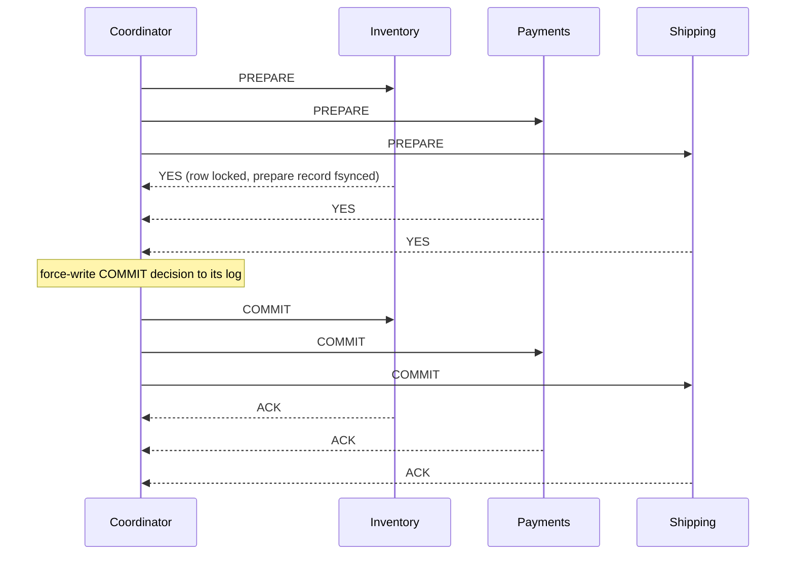
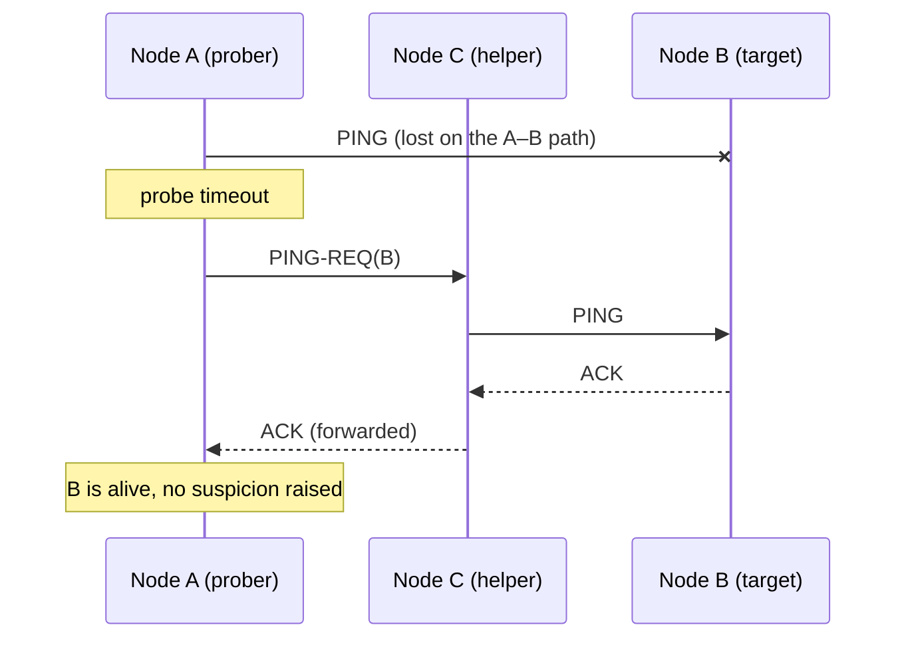

# 🌍 Distributed Systems — Staff-Level Interview Questions

> *12 questions covering consensus, CAP, distributed transactions, clock sync, gossip protocols — every question expects principal engineer-level depth.*

---

## Table of Contents

1. [CAP Theorem & PACELC](#1-cap-theorem-pacelc)
2. [Raft Consensus — Detailed Walkthrough](#2-raft-consensus-detailed-walkthrough)
3. [Distributed Transactions: 2PC vs 3PC vs Saga](#3-distributed-transactions-2pc-vs-3pc-vs-saga)
4. [Vector Clocks & Lamport Timestamps](#4-vector-clocks-lamport-timestamps)
5. [Consistent Hashing & Ring Design](#5-consistent-hashing-ring-design)
6. [Gossip Protocols: SWIM & Hybrid](#6-swim-gossip-protocol)
7. [Distributed Caching: Coherence Protocols](#7-distributed-caching-coherence-protocols-stampede-prevention)
8. [Leader Election: Bully Algorithm vs Raft](#8-leader-election-bully-algorithm-vs-raft)
9. [CRDTs & Conflict-Free Replication](#9-crdts-conflict-free-replicated-data-types)
10. [Distributed Consensus: Paxos Made Simple](#10-distributed-consensus-paxos-made-simple)
11. [Distributed UUID Generation](#11-distributed-uuid-generation)
12. [Byzantine Fault Tolerance](#12-byzantine-fault-tolerance)

---

## 1. CAP Theorem & PACELC

**Q:** "Your CTO says 'Since we're using Cassandra, we get AP out of the CAP theorem, so we don't need to worry about consistency.' Critique this statement and explain PACELC. Then design a system that needs both strong consistency (financial data) AND high availability (customer-facing dashboard)."

**What They're Really Testing:** Whether you know what CAP actually proves (and how narrow it is), whether you know PACELC covers the far more common no-partition case, and whether you treat consistency as a per-operation choice rather than a database label.

!!! tip "30-second answer"
    CAP (Gilbert & Lynch, 2002) says: during a network partition, a replicated system must give up either **linearizability** (C) or **every non-failed node answering** (A). It says nothing about the 99.9% of the time there is no partition. **PACELC** (Abadi, 2012) adds: *else*, you trade **latency vs consistency**. Cassandra is not "AP": it is tunable per query (PA/EL by default, close to PC/EC with `QUORUM`/`QUORUM`), and even at `QUORUM` it is not linearizable without lightweight transactions. "AP" never means "consistency isn't our problem"; it means the application must tolerate stale reads and resolve concurrent writes.

### Answer

**What the letters actually mean (the source of most mistakes):**

| Term | Precise meaning in CAP | Common misreading |
|------|------------------------|-------------------|
| C | Linearizability: every read sees the latest completed write, as if there were one copy | "ACID consistency" (that's about invariants, unrelated) |
| A | Every request to a **non-failed** node eventually gets a non-error response | "99.99% uptime" |
| P | The network may drop/delay messages between nodes arbitrarily | Something you can opt out of. You can't: partitions happen, so the real choice is C or A *when* one occurs |

So "CA system" only makes sense for a single node (or a system that simply stops when partitioned, which is CP).

**Why the CTO is wrong:**

```
Cassandra, RF=3, writes at ONE, a partition separates node N1 from N2/N3.

  client X ─ write x=5 ─► N1            N2 ◄─ write x=10 ─ client Y
                          │  partition  │
  client X ─ read x ────► N1 → 5        N2 → 10 ◄─ read x ─ client Y

After healing, Cassandra keeps the cell with the highest write timestamp
(last-write-wins). One write is silently discarded, and with clock skew the
"later" write in real time can lose.
```

Consequences the application must own: stale reads, lost updates under concurrent writes, no read-modify-write safety (`balance = balance - 10` is unsafe without LWT/Paxos), and tombstone/repair behaviour.

**PACELC — the missing half:**

```
if Partition:  choose Availability or Consistency      (the CAP part)
Else:          choose Latency      or Consistency      (the everyday part)
```

| System (default config) | PACELC | Why |
|---|---|---|
| Cassandra, DynamoDB (eventually consistent reads), Riak | PA/EL | Serve from any replica, async repair |
| Cassandra with `QUORUM` reads+writes | PC/EC (mostly) | Waits for a majority on every op |
| DynamoDB strongly consistent reads | PC/EC for that read | Read goes to the leader replica |
| Spanner, CockroachDB, etcd, ZooKeeper writes | PC/EC | Consensus per write; minority side stops |
| MongoDB `w:majority` + `readConcern: linearizable` | PC/EC | Majority-acked, leader-confirmed reads |

Note ZooKeeper reads are served locally by default (can be stale): it is linearizable for writes, sequentially consistent for reads unless you `sync()` first.

**Quorum math — and what it does NOT buy you:**

```
N = replicas, W = write acks, R = replicas read.
R + W > N  → every read set intersects every write set.
N=3: W=2, R=2 → 4 > 3 ✓      W=1, R=1 → 2 ≤ 3 ✗ (may read a replica that missed the write)
Majority = floor(N/2) + 1   (N=3 → 2, N=4 → 3, N=5 → 3)
```

Overlap alone is **not** linearizability in leaderless stores: a write that failed (acked by 1 of 3) may still be visible to some reads and not others; concurrent writes are ordered by client timestamps (LWW); sloppy quorums + hinted handoff (Dynamo, Riak) break the overlap during failures. Cassandra's blocking read repair at `QUORUM` gives monotonic reads but you need LWT (Paxos) for compare-and-set.

```sql
-- CQL has no per-statement USING CONSISTENCY clause (removed in CQL3).
-- Consistency is set per request by the driver, or per session in cqlsh:
CONSISTENCY QUORUM;
SELECT balance FROM accounts WHERE id = '123';

-- Conditional (compare-and-set) write: runs Paxos, linearizable for this partition
UPDATE accounts SET balance = 900 WHERE id = '123' IF balance = 1000;
```

**Design: strong consistency for money, high availability for the dashboard**

The two requirements belong to different data paths, so split them instead of forcing one store to do both:

```
           write (money)                         read (dashboard)
client ──► Ledger service ──► PostgreSQL primary   ◄── CDC (Debezium/outbox) ──► read store
                              + synchronous standby                              (Cassandra / Redis /
                              (quorum commit, failover                           Elasticsearch), async,
                              via Patroni)                                        "updated 4s ago"
```

| Path | Choice under partition | What the user sees |
|---|---|---|
| Ledger writes, balance checks | **C**: if no synchronous standby/quorum is reachable, reject or queue the *request* and say so | "Payment pending", never a double spend |
| Dashboard reads | **A**: serve the last replicated state from the nearest replica | Slightly stale numbers with a freshness label |

Do not "queue financial writes and replay later" and call it strongly consistent: a queued debit can't check the balance at enqueue time, so the system is now asynchronous with compensation (a saga), and the product must expose a pending state.

**What they probe next:**

- *Is linearizability the same as serializability?* No. Linearizability is a single-object, real-time recency guarantee; serializability is a multi-object transaction isolation guarantee with no real-time requirement. **Strict serializability** = both (Spanner, FoundationDB). CockroachDB is serializable with per-key linearizability, slightly weaker than strict serializability.
- *How does Spanner get C and very high availability?* It's CP, but Google's private network makes partitions rare enough that availability exceeds 5 nines; TrueTime's commit-wait (~a few ms) is the "EC" latency cost.
- *What about consistency levels between eventual and linearizable?* Read-your-writes, monotonic reads, causal consistency (achievable while staying available).

### 🔍 Staff-Level Evaluation

| Criterion | What I'm Looking For |
|-----------|----------------------|
| **Precise definitions** | C = linearizability, A = every non-failed node responds; P isn't optional |
| **PACELC** | Knows the latency-vs-consistency trade-off exists without partitions |
| **Tunability** | Treats consistency as per-operation (QUORUM, LWT, strong reads), not a product label |
| **Quorum limits** | Knows R+W>N is necessary but not sufficient for linearizability in leaderless systems |
| **Practical design** | Splits ledger (CP) from read model (AP) and exposes pending/stale states honestly |

---

## 2. Raft Consensus — Detailed Walkthrough

**Q:** "Walk me through the Raft consensus algorithm — specifically, what happens during a leader election when the existing leader fails. How does Raft prevent split-brain? What happens if a new leader hasn't replicated all entries from the old leader's term?"

**What They're Really Testing:** Whether you understand Raft's design rationale and can reason about edge cases in leader election.

!!! tip "30-second answer"
    Followers that miss heartbeats for a **randomized** election timeout become candidates, bump the **term**, and ask for votes. A node grants at most one vote per term, and only to a candidate whose log is **at least as up-to-date** (higher last term, or same last term and ≥ last index). Winning needs a **majority**, and any two majorities intersect, so there is at most one leader per term. A deposed leader in a minority partition can't commit anything (it can't reach a majority), and the up-to-date vote rule guarantees the new leader already holds every **committed** entry. Uncommitted entries from the old leader may be overwritten. A leader only counts replicas to commit entries from its **own** term; earlier entries commit indirectly (which is why a new leader appends a no-op).

### Answer

**Raft Terms & States:**

```
Raft divides time into TERMS:
┌──────┐┌──────┐┌──────┐┌──────┐┌──────┐
│Term 1││Term 2││Term 3││Term 4││Term 5│← terms (monotonically increasing)
└──┬───┘└──┬───┘└──┬───┘└──┬───┘└──┬───┘
   │       │       │       │       │
   ▼       ▼       ▼       ▼       ▼
  Leader  Leader  No      Leader  Leader
                    Leader
                    (split vote)

Server states:
                election timeout          timeout (split vote):
┌──────────┐  ─────────────────►  ┌───────────┐ ◄─┐ new term, retry
│ Follower │                      │ Candidate │ ──┘
└──────────┘  ◄─────────────────  └─────┬─────┘
     ▲         sees current leader      │ receives votes
     │         or a higher term         │ from a majority
     │                                  ▼
     │   sees a higher term       ┌──────────┐
     └─────────────────────────── │  Leader  │
                                  └──────────┘
A leader never steps down because of a missing heartbeat; it steps down
only when it sees a higher term (or, with CheckQuorum, when it can't hear
from a majority for an election timeout).
```

**Leader Election — Step by Step:**

### 🎬 Animated Sequence Diagram
<p align="center">
  <video controls width="900" style="border-radius: 12px; box-shadow: 0 4px 24px rgba(0,0,0,0.3);" loop playsinline preload="metadata">
    <source src="../../../assets/videos/ds-raft-leader-election.mp4" type="video/mp4" />
    Your browser does not support the video tag.
  </video>
  <br/>
  <em>🎬 Animated Sequence — Raft Leader Election — Term increment, randomized timeouts, majority vote, split-brain prevention. Click ▶ to play/pause. Created with <a href="https://remotion.dev">Remotion</a>.</em>
</p>


```
Initial state: 3 nodes, Node 1 is leader
┌─────────────────────────────────────┐
│ Node 1 (Leader)                     │
│ term = 3, log = [1,2,3]           │
│ Sends heartbeats every 50ms         │
├─────────────────────────────────────┤
│ Node 2 (Follower)                   │
│ term = 3, log = [1,2,3]           │
│ Last heartbeat: 10ms ago            │
├─────────────────────────────────────┤
│ Node 3 (Follower)                   │
│ term = 3, log = [1,2,3]           │
│ Last heartbeat: 10ms ago            │
└─────────────────────────────────────┘

Step 1: Node 1 crashes
┌─────────────────────────────────────┐
│ Node 1 (CRASHED)                    │
├─────────────────────────────────────┤
│ Node 2                              │
│ ... 10ms ... 20ms ... 30ms          │
│ No heartbeat!                       │
│ Election timeout (random 150-300ms) │
├─────────────────────────────────────┤
│ Node 3                              │
│ Same — also waiting                 │
└─────────────────────────────────────┘

Step 2: Node 2's timeout fires first (e.g., 180ms)
┌─────────────────────────────────────┐
│ Node 2 becomes CANDIDATE            │
│ • term = 4 (incremented)           │
│ • votes for itself                 │
│ • sends RequestVote RPC to all      │
│   ┌────────────────────────┐        │
│   │ RequestVote:            │        │
│   │   term = 4             │        │
│   │   candidateId = 2      │        │
│   │   lastLogIndex = 3     │        │
│   │   lastLogTerm = 3      │        │
│   └────────────────────────┘        │
├─────────────────────────────────────┤
│ Node 3 receives RequestVote         │
│ • Node 3's term = 3 < 4 → update   │
│ • Check: is Node 3's log up-to-date?│
│   • Node 3: lastLogIndex=3, term=3 │
│   • Candidate: lastLogIndex=3, term=3│
│   • Candidate is at least as up-to-date → GRANT vote │
│ • Node 3 → Node 2: vote granted     │
└─────────────────────────────────────┘

Step 3: Node 2 wins (2/3 votes)
┌─────────────────────────────────────┐
│ Node 2 becomes LEADER               │
│ • term = 4                         │
│ • Sends AppendEntries (heartbeat)   │
│   ┌────────────────────────┐        │
│   │ AppendEntries:          │        │
│   │   term = 4             │        │
│   │   leaderId = 2         │        │
│   │   prevLogIndex = 3     │        │
│   │   prevLogTerm = 3      │        │
│   │   entries = []         │        │
│   │   leaderCommit = 3     │        │
│   └────────────────────────┘        │
├─────────────────────────────────────┤
│ Node 3 receives heartbeat           │
│ • term = 4 matches                  │
│ • Accepts leadership                │
└─────────────────────────────────────┘
```

**How Raft Prevents Split-Brain:**

```
Scenario: Network partition splits 5 nodes into {1,2} and {3,4,5}

┌───────────────────┐         ┌───────────────────┐
│ Partition A       │         │ Partition B       │
│ ┌─────┐ ┌─────┐  │         │ ┌─────┐ ┌─────┐  │
│ │ 1   │ │ 2   │  │         │ │ 3   │ │ 4   │  │
│ └─────┘ └─────┘  │         │ └─────┘ └─────┘  │
│ Leader (old)      │         │ ┌─────┐          │
│                   │         │ │ 5   │          │
│ Can't reach 3/4/5 │         │ └─────┘          │
└───────────────────┘         └───────────────────┘

Partition A (old leader 1, term 4, plus node 2):
  Node 1 still believes it is leader and keeps heartbeating node 2.
  Any new write reaches only 2 of 5 nodes → never COMMITTED, never acked.
  (If node 2 timed out instead, it could collect at most 2 votes < 3.)

Partition B (3 nodes):
  Node 3 times out, term=5, gets votes from 4 and 5 → 3 ≥ 3 → LEADER (term 5)
  Commits new writes with 3/5 acks.

Two nodes may BELIEVE they are leader (terms 4 and 5), but only the
term-5 leader can commit. On heal, node 1 sees term 5 and steps down;
its uncommitted entries are overwritten.

The catch — stale READS: if node 1 answers reads from local state, clients
in partition A read stale data. Linearizable reads need either
  • ReadIndex: leader confirms it's still leader with a heartbeat round to a
    majority before serving the read (etcd's default), or
  • Leader lease: skip the round trip while a lease (< election timeout) is
    valid; relies on bounded clock drift.
CheckQuorum makes node 1 step down after an election timeout without
majority contact; Pre-Vote stops a partitioned node from inflating its term
and disrupting the cluster when it rejoins.
```

**Log Entry Commitment & Safety:**

```
Now Node 1 comes back from crash!
Node 2 (current leader, term=4) has:
  log = [index:1 term:1, index:2 term:1, index:3 term:3]

Node 1 (old leader, term=3) has:
  log = [index:1 term:1, index:2 term:1, index:3 term:3, index:4 term:3]
        ^^^^^^^^^^^^^^^^^^^^^^^^^^^^^^^^^^^  ^^^^^^^^^^^^^^^^^^
        These match Node 2's log               EXTRA entry not committed!

Safety rule: a leader NEVER commits entries from previous terms by counting
replicas. It commits an entry of its CURRENT term by majority; everything
before it commits with it (Log Matching). Without this rule, an entry stored
on a majority could still be overwritten (Figure 8 of the Raft paper).
That's why a new leader immediately appends a no-op entry in its own term.

When Node 1 receives AppendEntries from Node 2:
  Node 1: "prevLogIndex=3, prevLogTerm=3" → matches!
  Node 1: "entries=[index:4 term:4]"
  Node 1: its index 4 has term 3 ≠ 4 → conflict → truncates from index 4,
          appends the leader's entry

This is how Raft resolves log inconsistencies — the LEADER's log is authority.
Followers overwrite conflicting entries to match the leader.
```

**Log Matching & Conflict Resolution:**

```
Scenario: Different followers have diverged logs after crash

Leader (term=4):   [1:1, 2:1, 3:3, 4:4]
Follower A:        [1:1, 2:1, 3:3, 4:3, 5:3] ← old leader's uncommitted entries
Follower B:        [1:1, 2:1, 3:3]           ← missed some
Follower C:        [1:1, 2:1, 3:1, 4:1]      ← from older term

Leader sends AppendEntries to each follower:
To Follower A: prevLogIndex=4, prevLogTerm=4, entries=[]
  A checks: log[4].term = 3, leader says prevLogTerm=4 → CONFLICT!
  A: "NACK — prevLogIndex=4 term mismatch"
  Leader: decrements nextIndex[A] to 3
  Retry: prevLogIndex=3, prevLogTerm=3, entries=[4:4]
  A: log[3].term = 3 matches! → delete log[4..5], append [4:4]
  → Follower A now matches leader

To Follower B: prevLogIndex=4, prevLogTerm=4, entries=[]
  B: log[4] doesn't exist! (only has 3 entries)
  B: "NACK — prevLogIndex=4 not found"
  Leader: decrements nextIndex[B] to 3
  Retry: prevLogIndex=3, prevLogTerm=3, entries=[4:4]
  B: log[3].term = 3 matches! → append [4:4]
  → Follower B now matches leader

To Follower C: prevLogIndex=4, prevLogTerm=4, entries=[]
  C: log[4].term = 1, leader says prevLogTerm=4 → CONFLICT!
  Leader: decrements nextIndex[C]... eventually at index 2:
  Retry: prevLogIndex=2, prevLogTerm=1, entries=[3:3, 4:4]
  C: log[2].term = 1 matches! → delete log[3..4], append [3:3, 4:4]
  → Follower C now matches leader

(Real implementations don't back off one index per RPC: the follower returns
the conflicting term and its first index, so the leader skips a whole term.)
```

**Log Matching Property** (why the consistency check is enough): if two logs have an entry with the same index and term, they hold the same command there *and* are identical in all earlier entries. It holds because a leader creates at most one entry per index in its term, and a follower only appends after `prevLogIndex/prevLogTerm` match.

**What they probe next:**

| Topic | Crisp answer |
|---|---|
| Why 3 or 5 nodes, not 4? | Majority of 4 is 3, so 4 nodes tolerate 1 failure, same as 3, with more write latency |
| Membership change | Switching configs at once can create two disjoint majorities. Raft uses **joint consensus** (C_old,new needs majorities of *both*) or the simpler **one server at a time** change (etcd, most libraries); add new nodes as non-voting **learners** first so they catch up |
| Log growth | Periodic **snapshots** + log truncation; slow followers get `InstallSnapshot` |
| Election timeout choice | `broadcastTime ≪ electionTimeout ≪ MTBF`; ~10× the heartbeat interval (etcd defaults: 100 ms heartbeat, 1000 ms election) |
| Disruptive rejoining node | **Pre-Vote**: a candidate first checks it *could* win before bumping its term |
| Scaling writes | One Raft group is bounded by its leader; systems shard into thousands of groups (multi-Raft: CockroachDB ranges, TiKV regions) |

### 🔍 Staff-Level Evaluation

| Criterion | What I'm Looking For |
|-----------|----------------------|
| **Term mechanics** | Understands monotonically increasing terms act as a logical clock that fences stale leaders |
| **Quorum math** | Knows floor(N/2)+1 majorities intersect, so at most one leader per term |
| **Log matching** | Can trace through conflict resolution with different follower states |
| **Safety** | Knows Raft only commits current term entries by majority (safety first) |

---

## 3. Distributed Transactions: 2PC vs 3PC vs Saga

**Q:** "Design an order processing system that spans three microservices (Inventory, Payments, Shipping). The system must handle partial failures gracefully. Compare 2-Phase Commit, 3-Phase Commit, and the Saga pattern. Walk through the failure scenarios for each. Which would you use and why?"

**What They're Really Testing:** Whether you understand the fundamental tension between ACID guarantees and distributed system failures — and whether you can reason about coordinator failures, blocking, and long-running transactions in production.

!!! tip "30-second answer"
    **2PC** gives atomicity across resource managers but is **blocking**: a participant that voted YES holds its locks until it learns the decision, so a coordinator crash at the wrong moment stalls everyone. **3PC** removes blocking only under a synchronous, partition-free model; with real partitions it can reach *inconsistent* decisions, so nobody ships it. For microservices that each own a database, use an **orchestrated saga**: a sequence of local transactions with business-level compensations, a durable orchestrator, the **transactional outbox** to avoid dual writes, and idempotent steps. You trade atomic isolation for availability, so design for intermediate states (semantic locks, "pending" statuses) and order steps around the **pivot** (the step that can't be undone).

### Answer

**The Problem — Local ACID vs Distributed Atomicity:**

```
Inventory service          Payments service           Shipping service
reserve_item()             charge_card()              create_label()
own DB, own transaction    own DB, own transaction    own DB, own transaction

We need all three effects or none, but no single transaction spans three databases.
```

**2-Phase Commit (2PC) — The Coordinator Problem:**

### 🎬 Animated Sequence Diagram
<p align="center">
  <video controls width="900" style="border-radius: 12px; box-shadow: 0 4px 24px rgba(0,0,0,0.3);" loop playsinline preload="metadata">
    <source src="../../../assets/videos/ds-twopc-vs-saga.mp4" type="video/mp4" />
    Your browser does not support the video tag.
  </video>
  <br/>
  <em>🎬 Animated Sequence — 2PC vs Saga — Coordinator crash blocks 2PC; Saga's compensating actions handle failure gracefully. Click ▶ to play/pause. Created with <a href="https://remotion.dev">Remotion</a>.</em>
</p>



- **Phase 1 (prepare/vote):** each participant makes the transaction durable-but-undecided (writes a prepare record, keeps its locks) and votes YES/NO. After voting YES it gives up the right to abort on its own.
- **Phase 2 (decision):** all YES → COMMIT; any NO or timeout → ABORT. The coordinator logs the decision before sending it.

**Failure analysis:**

| Crash point | Outcome |
|---|---|
| Participant crashes before voting | Coordinator times out → ABORT. Safe. |
| Coordinator crashes before deciding | Participants that haven't voted can abort; those that voted YES are **in doubt** and must wait |
| Coordinator crashes after deciding, before everyone hears | YES-voters stay in doubt, **holding locks**, until the coordinator recovers (or a peer that knows the outcome tells them) |
| Participant crashes after voting YES | On recovery it reads its prepare record and asks the coordinator for the outcome |

Escape hatches are *heuristic* commit/abort by an operator, which can violate atomicity. Fixing blocking for real means replicating the coordinator's decision with consensus (Spanner and CockroachDB run 2PC where every participant and the coordinator is itself a Paxos/Raft group, so "coordinator crash" means "leader fails over").

Where 2PC is still used: XA between a database and a message broker, PostgreSQL `PREPARE TRANSACTION` (off by default: `max_prepared_transactions = 0`), and inside distributed SQL databases. Kafka transactions are 2PC-like internally (transaction coordinator + commit markers).

**3-Phase Commit (3PC) — Non-Blocking Only on Paper:**

```
Phase 1  CanCommit?  → participants vote YES/NO        (like 2PC prepare)
Phase 2  PreCommit   → "everyone voted YES"; participants ack
Phase 3  DoCommit    → commit

The extra phase means no participant can commit while another may still
be uncertain-and-able-to-abort. Recovery rule after a coordinator timeout:
  any surviving participant in PreCommit → the group may commit
  no one in PreCommit                    → the group may abort
```

That rule assumes failures are detectable (bounded message delay, no partitions). Partition the participants so one side has a PreCommit node and the other doesn't: each side times out, one commits, the other aborts. 3PC trades blocking for possible inconsistency, costs an extra round trip, and is essentially unused. Consensus-replicated 2PC is the practical non-blocking answer.

**Saga Pattern — The Production Choice for Microservices:**

A saga is a sequence of local transactions T1..Tn, each with a compensation C1..Cn that semantically undoes it (refund, not "rollback"). If Tk fails, run Ck-1..C1.

Ordering rule: put **compensatable** steps first, then the **pivot** (the go/no-go step that can't be undone, often the payment capture), then **retriable** steps that must eventually succeed (create label, send email).

```
Reserve stock (compensatable) → Charge card (pivot) → Create label (retriable)
     ▲ Release stock                ▲ Refund                retry until success
```

**Orchestration (recommended here)** — a durable state machine drives the steps:

```python
class OrderSaga:
    """Orchestrator. State lives in the orchestrator's DB, so a crash resumes
    from the last recorded step. Every step and compensation must be
    idempotent (keyed by saga_id + step) because a crash between 'call
    service' and 'record result' causes a retry."""

    STEPS = [
        ("reserve_stock", inventory.reserve, inventory.release),
        ("charge_card",   payments.charge,   payments.refund),
        ("create_label",  shipping.create,   None),  # retriable, no compensation
    ]

    def run(self, saga_id: str):
        state = db.load_saga(saga_id)               # e.g. {"next_step": 1, "status": "RUNNING"}
        for i in range(state.next_step, len(self.STEPS)):
            name, action, _ = self.STEPS[i]
            try:
                action(idempotency_key=f"{saga_id}:{name}")
            except BusinessRejection:               # card declined, out of stock
                return self.compensate(saga_id, failed_at=i)
            except TransientError:
                raise                               # retry later from the same step
            db.record_step_done(saga_id, i)         # persist progress
        db.mark(saga_id, "COMPLETED")

    def compensate(self, saga_id: str, failed_at: int):
        db.mark(saga_id, "COMPENSATING")
        for j in reversed(range(failed_at)):
            name, _, undo = self.STEPS[j]
            if undo:
                undo(idempotency_key=f"{saga_id}:{name}:undo")  # retried until it succeeds
        db.mark(saga_id, "COMPENSATED")
```

**Choreography** — each service reacts to the previous service's event:

```python
@kafka_listener("stock.reserved")
def on_stock_reserved(event):              # Payments service
    try:
        charge_card(event.order_id, event.amount, idempotency_key=event.order_id)
        publish_via_outbox("payment.charged", event)
    except PaymentDeclined:
        publish_via_outbox("payment.failed", event)

@kafka_listener("payment.failed")
def on_payment_failed(event):              # Inventory service
    release_stock(event.order_id)          # idempotent: no-op if already released
    publish_via_outbox("stock.released", event)
```

Choreography avoids a central component but the workflow exists only implicitly across services: hard to see, version and debug past 3–4 steps, and prone to cyclic event dependencies. Orchestration engines (Temporal, AWS Step Functions, Camunda) give you durable state, retries and timers for free.

**The dual-write problem and the transactional outbox:**

```python
# WRONG: commit to DB, then publish. A crash between the two loses the event;
# publishing first and then failing to commit emits an event for nothing.

# RIGHT: business change + outbox row in ONE local transaction.
with db.transaction():
    db.execute("UPDATE stock SET reserved = reserved + 1 WHERE sku = %s", (sku,))
    db.execute(
        "INSERT INTO outbox (id, topic, key, payload) VALUES (%s, %s, %s, %s)",
        (event_id, "stock.reserved", order_id, json.dumps(payload)),
    )
# A relay (poller or CDC such as Debezium) publishes outbox rows to Kafka.
# Delivery is at-least-once, so consumers dedupe on event_id (inbox table).
```

"Exactly-once" across services is always **at-least-once delivery + idempotent (or deduplicated) processing**. Kafka's exactly-once semantics cover read-process-write *within Kafka*; side effects in other systems still need idempotency keys.

**Failure Handling Matrix:**

| Failure | 2PC | 3PC | Orchestration saga | Choreography saga |
|---------|-----|-----|-------------------|-------------------|
| Participant crashes mid-step | Abort if before vote; in doubt if after YES | Same as 2PC before PreCommit | Retry step (idempotent) or compensate | Same, driven by events |
| Coordinator crashes | **Blocks** YES-voters holding locks | Survivors decide by rule | Resume from persisted state | No coordinator; consumer retries from offsets |
| Network partition | Blocks | Can commit on one side and abort on the other | Steps delayed and retried; saga stays "in progress" | Events delayed in the broker, not lost |
| Compensation fails | N/A | N/A | Retry forever + alert; park in DLQ for manual repair | Same |
| Long-running workflow | Locks held for the duration | Locks held | Locks released after each local commit | Same |

**The isolation gap (what interviewers probe next):** a saga is ACD without I. Other transactions see intermediate states (stock reserved, card not yet charged) and can act on them. Countermeasures:

- **Semantic lock:** status column (`PENDING`) that other operations respect.
- **Commutative updates:** `reserved = reserved + 1` instead of read-then-write.
- **Reread value / version check** before the pivot to detect concurrent changes.
- **Pessimistic ordering:** do the step most likely to fail first.

### 🔍 Staff-Level Evaluation

| Criterion | What I'm Looking For |
|-----------|----------------------|
| **Coordinator failure** | Explains *in-doubt* participants holding locks, not just "coordinator is a SPOF" |
| **3PC honesty** | Knows its non-blocking guarantee assumes synchrony and fails under partitions |
| **Compensating design** | Compensations are business actions; orders steps around the pivot |
| **Outbox + idempotency** | Names the dual-write problem; explains at-least-once + dedup instead of claiming exactly-once |
| **Isolation** | Knows sagas lack isolation and names a countermeasure |

See [Distributed Transaction Patterns](DISTRIBUTED_TRANSACTION_PATTERNS.md) for the deep dive.

---

## 4. Vector Clocks & Lamport Timestamps

**Q:** "Design a key-value store with eventually consistent replication. You need to detect update conflicts. Compare Lamport clocks vs Vector clocks. How does Dynamo use vector clocks for read repair? What happens when the vector clock grows unboundedly?"

**What They're Really Testing:** Whether you understand the causal ordering problem in distributed systems — Lamport clocks give a total order consistent with causality but can't detect concurrency, while vector clocks characterise causality exactly at a per-node space cost.

!!! tip "30-second answer"
    **Happens-before** (a → b): same process and earlier, or a send and its receive, or transitively. **Lamport clocks**: if a → b then L(a) < L(b), but L(a) < L(b) tells you nothing, so they can't detect conflicts (they're good for a total order, e.g. tie-broken by node ID). **Vector clocks**: a → b **iff** VC(a) < VC(b), so two versions with incomparable clocks are concurrent and must be kept as siblings or merged. Dynamo bounds clock size by keeping one entry per *coordinating server*, timestamping entries and truncating the oldest past a threshold (10), accepting rare false conflicts. Production systems moved to **dotted version vectors** (Riak) or **hybrid logical clocks** (CockroachDB, MongoDB) depending on whether they need conflict detection or ordering.

### Answer

**The Core Problem — Ordering Events Without a Global Clock:**

```
N1: write(x=1) at local wall time 10:00:00.000
N2: write(x=2) at local wall time 10:00:00.001

Did N1's write happen first? Wall clocks can't say: NTP keeps servers within
roughly 1–10 ms of each other inside a datacenter (worse across the internet,
better with PTP / cloud time-sync services), and clocks can jump. Two writes
closer together than the skew bound can't be ordered by timestamps.
```

**Lamport Clock:**

```
Rules: increment before each event; attach the counter to messages;
       on receive: clock = max(local, msg.clock) + 1

N1: write(x=1)                    → L=1, replicate to N2
N2: receive                       → L = max(0, 1) + 1 = 2
N2: write(x=2)                    → L=3          (causally after x=1)
N3: write(y=7), never talked to N1 → L=1

Guarantee (clock condition):  a → b  ⇒  L(a) < L(b)
Not the converse:             L(N3's write)=1 < L(N2's write)=3, yet they are concurrent.
Equal timestamps on different nodes ⇒ definitely concurrent (break ties by node ID
to get a total order, as in Lamport's mutual exclusion algorithm).
```

**Vector Clock — Detecting Concurrent Updates:**

```
Each node keeps one counter per node. Increment your own entry on an event;
on receive take the element-wise max, then increment your own.

Compare VC(a) and VC(b):
  every a[i] ≤ b[i] and at least one <   → a → b   (b supersedes a)
  equal                                  → same version
  otherwise                              → CONCURRENT (conflict)

Example:   VC_A = {N1:1, N2:0}   (write on N1)
           VC_B = {N1:0, N2:1}   (write on N2, without having seen N1's)
           N1: 1 > 0, N2: 0 < 1  → incomparable → concurrent → keep both
```

**Vector Clock KV Store (runnable):**

```python
from dataclasses import dataclass, field


@dataclass(frozen=True)
class VClock:
    counters: dict[str, int] = field(default_factory=dict)

    def bump(self, node: str) -> "VClock":
        c = dict(self.counters)
        c[node] = c.get(node, 0) + 1
        return VClock(c)

    def merge(self, other: "VClock") -> "VClock":
        keys = self.counters.keys() | other.counters.keys()
        return VClock({k: max(self.counters.get(k, 0), other.counters.get(k, 0)) for k in keys})

    def descends(self, other: "VClock") -> bool:
        """True if self >= other on every entry (self has seen everything other has)."""
        return all(self.counters.get(k, 0) >= v for k, v in other.counters.items())

    def concurrent(self, other: "VClock") -> bool:
        return not self.descends(other) and not other.descends(self)


class Replica:
    """Dynamo-style multi-value register: keeps every version not dominated by another."""

    def __init__(self, node_id: str):
        self.node_id = node_id
        self.data: dict[str, list[tuple[str, VClock]]] = {}

    def get(self, key: str) -> tuple[list[str], VClock]:
        versions = self.data.get(key, [])
        ctx = VClock()
        for _, vc in versions:
            ctx = ctx.merge(vc)
        return [v for v, _ in versions], ctx          # siblings + causal context

    def put(self, key: str, value: str, context: VClock) -> VClock:
        new_vc = context.bump(self.node_id)           # coordinator increments its own entry
        self._store(key, value, new_vc)
        return new_vc

    def apply_remote(self, key: str, value: str, vc: VClock) -> None:
        self._store(key, value, vc)                   # replication / anti-entropy / read repair

    def _store(self, key, value, vc):
        versions = self.data.get(key, [])
        if any(old.descends(vc) for _, old in versions):
            return                                    # already have this or a successor
        kept = [(v, old) for v, old in versions if not vc.descends(old)]
        self.data[key] = kept + [(value, vc)]


# Two clients read the empty cart, then write through different coordinators.
a, b = Replica("A"), Replica("B")
_, ctx = a.get("cart")
v1 = a.put("cart", "milk", ctx)      # {A:1}
v2 = b.put("cart", "eggs", ctx)      # {B:1}
a.apply_remote("cart", "eggs", v2)   # replication brings B's write to A
print(a.get("cart")[0])              # ['milk', 'eggs']  -> siblings
print(v1.concurrent(v2))             # True

# Client merges the siblings and writes back with the merged context.
values, ctx = a.get("cart")
v3 = a.put("cart", "milk,eggs", ctx) # {A:2, B:1} dominates both siblings
print(a.get("cart")[0])              # ['milk,eggs']
b.apply_remote("cart", "milk,eggs", v3)
print(b.get("cart")[0])              # ['milk,eggs']
```

The coordinator increments **its own** entry, and the client must pass back the context from its last read. A write without context is concurrent with everything and creates a sibling.

**Bounding Vector Clock Size:**

| Approach | How | Cost |
|---|---|---|
| Per-server entries (Dynamo, Riak) | Only coordinating servers get entries, so size ≈ preference-list size, not cluster size | Concurrent clients through one server can falsely overwrite each other unless the server is careful; solved by dotted version vectors |
| Truncation (Dynamo) | Each entry carries a wall-clock timestamp; past a threshold (10 entries) drop the oldest | Ancestry info lost → occasional false conflicts (siblings that weren't really concurrent). Safe direction: never a lost update |
| Dotted version vectors (Riak 2.0+) | Tag each sibling with the single "dot" (node, counter) that created it plus a causal context | Size bounded by replicas, accurate sibling detection |
| Sibling cap | Riak warns/rejects past a configurable sibling count | Forces application merge logic to exist |

**Read Repair vs Sibling Resolution (two different things):**

```
Client            Coordinator             Replica A              Replica B
  │ get(cart_42)       │                        │                      │
  │───────────────────►│── get ────────────────►│                      │
  │                    │── get ───────────────────────────────────────►│
  │                    │◄── v1 {A:1}  ──────────│                      │
  │                    │◄── v2 {A:1,B:1} ─────────────────────────────│
  │                    │
  │  Case 1: v2 descends v1 → return v2; write v2 back to A  (READ REPAIR)
  │  Case 2: clocks concurrent → return BOTH + merged context
  │◄── [v1, v2], ctx ──│
  │  client merges (e.g. union of cart items), then
  │── put(merged, ctx)─►  new clock dominates both → siblings collapse
```

Read repair just fixes stale replicas. Conflict *resolution* is semantic and belongs to the application (or to a CRDT, see Q9). Dynamo's shopping-cart union is why deleted items could reappear.

**Hybrid Logical Clocks (what modern databases use instead):**

HLC timestamp = (physical time `l`, logical counter `c`). On a local event or send: `l' = max(l, now())`; if `l'` didn't advance, `c += 1`, else `c = 0`. On receive, take the max of local, message and `now()` with the same counter rule. Result: 64-bit, close to wall time (usable for "read as of 10:00"), and it respects happens-before like a Lamport clock. CockroachDB, YugabyteDB and MongoDB use HLC for MVCC timestamps; they still need a max-clock-offset bound (CockroachDB defaults to 500 ms) and an uncertainty window to stay serializable. HLC orders events; it does **not** detect concurrency, so it replaces vector clocks only where you resolve conflicts by ordering.

**What they probe next:** why not just LWW with wall clocks (silent lost updates, skew), how Spanner avoids all this (TrueTime intervals + commit wait), and what a client should send if it never read the key (empty context → sibling).

### 🔍 Staff-Level Evaluation

| Criterion | What I'm Looking For |
|-----------|----------------------|
| **Lamport vs Vector** | States the clock condition direction correctly: a → b ⇒ L(a) < L(b), not the reverse |
| **Concurrency detection** | Uses vector comparison: dominates / equal / concurrent |
| **VC bloat** | Knows Dynamo's per-server entries + truncation and its false-conflict cost; mentions DVV |
| **Read repair vs merge** | Separates stale-replica repair from semantic sibling resolution |
| **HLC** | Knows HLC gives causality-respecting, near-wall-clock timestamps but not conflict detection |

---

## 5. Consistent Hashing & Ring Design

**Q:** "Design a distributed cache layer for a social media platform with 50 nodes. You need to support: (A) minimal key redistribution when nodes fail or scale, (B) load-balanced request distribution, and (C) handling of hot keys. Walk through the consistent hashing ring design, including virtual nodes and data replication."

**What They're Really Testing:** Whether you understand that consistent hashing minimizes disruption during topology changes, and can articulate the virtual node trade-offs and hot key mitigations from production experience.

!!! tip "30-second answer"
    With `hash(key) % N`, changing N remaps almost every key (75% going from 4 to 3 nodes, 98% going from 50 to 51). Consistent hashing places nodes and keys on a ring and gives each key to the next node clockwise, so adding or removing a node moves only about **1/N** of keys. One point per node gives very uneven ranges (with 50 nodes, the biggest owner gets ~4× the average), so each node gets **100–256 virtual nodes**, which brings the spread within about ±10–20% and lets a failed node's load scatter across many survivors. Replicate to the next R **distinct physical** nodes. Hot keys are a separate problem: no hash function spreads one key, so use local caching, key splitting or read replicas.

### Answer

**The Problem — Simple Hashing Breaks on Node Changes:**

```
Naive hash: node = hash(key) % N

With N=4 nodes:
  key_abc → hash % 4 = 2 → Node 2
  key_def → hash % 4 = 0 → Node 0

When N=3 (Node 3 fails):
  key_abc → hash % 3 = 1 → Node 1  ← MOVED!
  key_def → hash % 3 = 0 → Node 0  ← SAME

A key stays put only if hash % 4 == hash % 3, i.e. 3 of every 12 hash values.
→ ~75% of ALL keys move (simulated: 74.8%); going 50 → 51 nodes moves ~98%.
→ For a cache this is a near-total miss storm on the database.
```

**Consistent Hashing Ring:**

### 🎬 Animated Sequence Diagram
<p align="center">
  <video controls width="900" style="border-radius: 12px; box-shadow: 0 4px 24px rgba(0,0,0,0.3);" loop playsinline preload="metadata">
    <source src="../../../assets/videos/ds-consistent-hashing.mp4" type="video/mp4" />
    Your browser does not support the video tag.
  </video>
  <br/>
  <em>🎬 Animated Sequence — Consistent Hashing on a Ring — Minimal key redistribution with virtual nodes for load balancing. Click ▶ to play/pause. Created with <a href="https://remotion.dev">Remotion</a>.</em>
</p>


```
The ring: hash space [0, 2^64-1] arranged in a circle

                    ┌──────────┐
                   ╱  Node C    ╲
                  │      ■      │
                  │      |      │
         Node D ■─│──────|──────│──■ Node A
                  │      |      │
                  │      ▼      │
                   ╲    ■     ╱
                    └──Node B─┘

Keys are assigned to the NEXT node clockwise:
  - hash(key) → find position on ring
  - walk clockwise to first node
  - that node owns the key

When Node B fails:
  - Only the keys in B's range (from B's predecessor up to B) are reassigned
  - They go to B's successor clockwise
  - Every other key stays where it was
  - Only ~1/N of keys move (N=50 → ~2%) vs ~98% with modulo hashing
  - Downside without vnodes: ALL of B's load lands on ONE neighbour
```

**Virtual Nodes — The Load Balancing Fix:**

```
Each physical node is hashed onto the ring V times ("A#0", "A#1", ...).
A node's share is the sum of V independent arc lengths, so the relative
spread shrinks roughly like 1/√V.

Simulated: 50 nodes, MD5 positions, share of keyspace per node
  V (vnodes/node)   std dev of share   largest node / average
       1               1.6%                 4.2×
      10               0.6%                 1.9×
     100               0.20%                1.23×
     200               0.13%                1.13×
    1000               0.06%                1.07×
(average share = 2%)

Bonus: when a node fails, its V ranges are absorbed by many different
nodes instead of one neighbour; heterogeneous hardware gets V ∝ capacity.
Cost: bigger ring metadata (50 × 200 = 10,000 entries, binary-searched),
and more, smaller ranges to stream during rebalancing.
Cassandra 4.0+ defaults to num_tokens = 16 with a token-allocation algorithm
that picks balanced positions instead of random ones.
```

**Alternatives worth naming:**

| Scheme | Lookup | Notes |
|---|---|---|
| Ring + vnodes | O(log(N·V)) binary search | Dynamo, Cassandra, Riak; supports weights |
| Rendezvous (HRW) hashing | O(N): pick node with max `hash(key, node)` | No ring, perfect 1/N movement, easy top-R replicas |
| Jump consistent hash (Google, 2014) | O(log N), no memory | Nodes must be numbered 0..N-1; can only add/remove at the end, so suits shards, not arbitrary node failure |
| Maglev hashing | O(1) table lookup | Google's L4 load balancer; near-perfect balance, small disruption |
| Consistent hashing with bounded loads (2016) | Ring + capacity cap (e.g. 1.25× average) | Overflow goes to the next node; used by HAProxy and Vimeo for hot spots |

**Replication on the Ring:**

```
For fault tolerance, each key is stored on the first R DISTINCT physical
nodes found walking clockwise from hash(key) (the "preference list").

  ring (clockwise):  ... ●key X → B#7 → B#2 → C#4 → A#9 → D#1 ...
  R = 3:  B (owner), skip B#2 (same physical node), C, A

  - With vnodes you MUST skip positions of nodes already chosen, or two
    "replicas" can live on one machine. Rack/AZ-aware placement also skips
    nodes in an already-used failure domain.
  - Write: send to all R, wait for W acks; read: wait for R_read responses
  - B fails: X is still served by C and A; with sloppy quorum a stand-in
    node holds a "hinted handoff" copy until B returns
```

**Hot Key Detection & Mitigation:**

```python
import time
from collections import deque

# Per-key sliding window: fine for a demo, but memory grows with distinct keys.
# In production, sample requests and use a Count-Min Sketch + top-k heap
# (see DATA_STRUCTURES_FOR_SCALE), or Redis's built-in `redis-cli --hotkeys`
# (requires an LFU maxmemory-policy).
class HotKeyDetector:
    def __init__(self, threshold=1000, window_ms=1000):
        self.counts: dict[str, deque] = {}
        self.threshold = threshold  # requests/second
        self.window_ms = window_ms

    def record_request(self, key: str):
        if key not in self.counts:
            self.counts[key] = deque()
        now = time.time()
        # Add timestamp
        self.counts[key].append(now)
        # Remove old entries outside window
        while self.counts[key] and self.counts[key][0] < now - self.window_ms/1000:
            self.counts[key].popleft()

        # Check threshold
        if len(self.counts[key]) > self.threshold:
            self.report_hot_key(key, len(self.counts[key]))

    def report_hot_key(self, key: str, rate: int):
        # Strategy 1: Spread to replicas
        # Instead of just primary, return all K replicas
        # Client load-balances reads across ALL replicas

        # Strategy 2: Key splitting
        # A single key hashes to ONE point, so more vnodes can't help it.
        # Store copies under "key#0".."key#k-1" (different ring positions);
        # readers pick a random suffix, writers update all k copies.

        # Strategy 3: Client-side cache (most common)
        # Short-lived local cache (TTL = 1-5s) absorbs hot key reads
        pass
```

**Production Considerations:**

```yaml
Ring management:
  - Version the ring configuration (epoch number)
  - Clients cache the ring locally
  - Changes propagated asynchronously (gossip or config service)
  - During propagation window: clients may route to wrong node
    → Use client-side retry: "Not found? Try the next node on old ring"

Resharding on node add (stateful store):
  1. New node joins as "pending" for its ranges; the ring isn't switched yet
  2. Existing owners stream those ranges (background, rate-limited)
  3. Writes during streaming go to BOTH old and new owner
  4. Switch ownership (bump ring epoch), then old owners drop the data
  For a pure cache you can skip streaming: the new node starts cold and
  ~1/N of reads miss once.

Bounded load:
  - Cap each node at c × average load (c ≈ 1.25)
  - Requests for a full node spill to the next node clockwise
  - Prevents one hot range from cascading into an outage
```

### 🔍 Staff-Level Evaluation

| Criterion | What I'm Looking For |
|-----------|----------------------|
| **Ring topology** | Explains why only ~1/N of keys move vs nearly all with modulo hashing |
| **Virtual nodes** | Understands they average out arc-length variance (~1/√V) and spread failover load |
| **Replication** | Stores K replicas on ring, explains quorum reads |
| **Hot key handling** | Proposes spreading to replicas, additional vnodes, or client caching |

---

## 6. SWIM Gossip Protocol

**Q:** "Design a failure detection system for 1000-node cluster. How does SWIM (Scalable Weakly-consistent Infection-style Process Group Membership Protocol) detect failures with bounded latency? Why use indirect probing? How does the protocol ensure liveness detection has an upper bound?"

**What They're Really Testing:** Whether you can separate **failure detection** (constant work per node per period) from **dissemination** (gossip, O(log N) periods), and whether you know why indirect probing and the suspicion mechanism keep false positives low.

!!! tip "30-second answer"
    All-to-all heartbeating costs O(N²) messages per period. SWIM (Das, Gupta & Motivala, 2002) has each node, every protocol period T, **ping one member** (round-robin over a shuffled list, which bounds worst-case detection time). If no ack, it asks **k other members to ping the target** (indirect probe), which filters out failures of a single network path. Still nothing → the target is **suspected**, not declared dead; the suspect can refute by gossiping a higher **incarnation number**, otherwise it's confirmed dead after a suspicion timeout. Membership updates **piggyback** on pings/acks and reach everyone in O(log N) periods. Total load: O(N) messages per period cluster-wide, a constant per node. HashiCorp memberlist (Consul, Nomad, Serf) is SWIM plus the **Lifeguard** extensions.

### Answer

**The Problem — Failure Detection in Large Clusters:**

| Approach | Messages per period | Weakness |
|---|---|---|
| Central monitor | O(N) at one node | SPOF and hotspot |
| All-to-all heartbeats | O(N²): 1000 nodes → ~1M messages/period | Doesn't scale |
| Gossip heartbeat tables (Cassandra-style) | O(N) messages, but each carries O(N) state | Bandwidth grows with N |
| SWIM | O(N) total, constant per node, small messages | Detection is probabilistic |

**SWIM Protocol Period (pseudocode):**

```python
class SwimNode:
    def protocol_period(self):
        """Runs every T (memberlist LAN default: 1 s probe interval, 500 ms timeout)."""
        target = self.next_probe_target()          # round-robin over shuffled member list
        if self.ping(target, timeout=self.probe_timeout):
            return

        helpers = self.random_members(k=3, exclude={self.id, target})
        acks = [self.ping_req(h, target) for h in helpers]   # sent in parallel
        if any(acks):
            return

        self.suspect(target)       # NOT dead yet

    def suspect(self, member):
        m = self.members[member]
        if m.state == "ALIVE":
            m.state = "SUSPECT"
            m.suspect_deadline = now() + self.suspicion_timeout   # e.g. 4-6 × T, scaled by log N
            self.gossip(("SUSPECT", member, m.incarnation))

    def on_tick(self):
        for m in self.members.values():
            if m.state == "SUSPECT" and now() > m.suspect_deadline:
                m.state = "DEAD"
                self.gossip(("CONFIRM", m.id, m.incarnation))

    def on_update(self, kind, member, inc):
        """Precedence rules from the SWIM paper (incarnation = refutation counter)."""
        if member == self.id and kind == "SUSPECT":
            self.incarnation = max(self.incarnation, inc) + 1     # refute: "I'm alive"
            self.gossip(("ALIVE", self.id, self.incarnation))
            return
        m = self.members[member]
        if kind == "CONFIRM":
            m.state = "DEAD"                                      # overrides everything
        elif kind == "SUSPECT" and (inc > m.incarnation or
                                    (inc == m.incarnation and m.state == "ALIVE")):
            m.state, m.incarnation = "SUSPECT", inc
            m.suspect_deadline = now() + self.suspicion_timeout
        elif kind == "ALIVE" and inc > m.incarnation:
            m.state, m.incarnation = "ALIVE", inc                 # refutation wins
```

All gossip (`SUSPECT`, `ALIVE`, `CONFIRM`, joins) is **piggybacked** on ping/ack/ping-req messages, each update retransmitted about λ·log N times, so dissemination adds no extra messages.

**Why Indirect Probing Is Critical:**

### 🎬 Animated Sequence Diagram
<p align="center">
  <video controls width="900" style="border-radius: 12px; box-shadow: 0 4px 24px rgba(0,0,0,0.3);" loop playsinline preload="metadata">
    <source src="../../../assets/videos/ds-swim-gossip.mp4" type="video/mp4" />
    Your browser does not support the video tag.
  </video>
  <br/>
  <em>🎬 Animated Sequence — SWIM Gossip Protocol — Ping → Indirect Probe → Suspect → Dead with O(log N) convergence. Click ▶ to play/pause. Created with <a href="https://remotion.dev">Remotion</a>.</em>
</p>



A missed ack may mean B is dead, or just that the A↔B path (or A itself) is congested. k helpers give k independent paths. If each path loses a probe with probability p, all k fail with roughly p^k: with p = 1% and k = 3 that's 10⁻⁶ per probe. Paths aren't fully independent (A's own NIC is shared), which is why Lifeguard also makes a node that is missing *its own* acks slow down its accusations (local health awareness).

**Detection and Dissemination Time:**

```
Detection: each period every live node pings one target. The chance that a
dead node is picked by at least one of N-1 probers in a period is
1 - (1 - 1/(N-1))^(N-1) → 1 - 1/e ≈ 63%, so the expected time to first
detection is e/(e-1) ≈ 1.6 periods, INDEPENDENT of N. Round-robin target
selection bounds the worst case to about 2N periods for a single prober.

Dissemination: infection-style gossip reaches all N nodes in O(log N)
periods (N=1000: ~10 rounds of doubling, a few seconds with T=1 s
because each update is piggybacked, not pushed eagerly).

Time to declare dead = detection (~1–2 T) + suspicion timeout (several T,
scaled with log N) + dissemination. With memberlist defaults, a few seconds
to ~10 s in a large LAN cluster: SWIM trades speed for few false positives.

Load: N=1000, T=1 s → ~1000 pings + 1000 acks per second cluster-wide,
2 messages/s per node, versus ~1M messages/s for all-to-all at the same interval.
```

**Failure Detectors Compared:**

| Detector | Messages per period | Detection time | False positives |
|----------|---------------|---------------|----------------|
| All-to-all heartbeat | O(N²) | ~timeout | Low, but floods the network |
| Central coordinator | O(N) at one node | ~timeout | Medium; SPOF |
| SWIM | O(N) total, O(1) per node | Expected ~1.6 T to first detection, plus suspicion timeout | Low (indirect probes + suspicion) |
| SWIM + Lifeguard (memberlist) | Same | Adaptive | ~50× fewer than plain SWIM in HashiCorp's tests |
| Phi-accrual (Cassandra, Akka) | Rides on gossip heartbeats | Tunable via φ threshold | Tunable |

**Phi-Accrual: a continuous suspicion level instead of a binary timeout**

Cassandra's gossiper (not SWIM: each node gossips with 1–3 peers per second, exchanging heartbeat state) feeds heartbeat inter-arrival times into a phi-accrual detector, which adapts to each peer's normal jitter:

```python
import math
from collections import deque


class PhiAccrualDetector:
    """phi = -log10(P(a live node's next heartbeat is still this late)).
    Cassandra models inter-arrival times as exponential; the original paper
    (Hayashibara et al., 2004) uses a normal distribution."""

    def __init__(self, window_size: int = 1000):
        self.intervals: deque[float] = deque(maxlen=window_size)
        self.last: float | None = None

    def heartbeat(self, now: float) -> None:
        if self.last is not None:
            self.intervals.append(now - self.last)
        self.last = now

    def phi(self, now: float) -> float:
        if self.last is None or not self.intervals:
            return 0.0
        mean = sum(self.intervals) / len(self.intervals)
        elapsed = now - self.last
        # P(no heartbeat for `elapsed`) = exp(-elapsed/mean)  →  phi = elapsed / (mean · ln 10)
        return elapsed / (mean * math.log(10))


d = PhiAccrualDetector()
for t in range(0, 10):          # heartbeats every 1.0 s
    d.heartbeat(float(t))
for t in (9.5, 11.0, 15.0, 27.4):
    print(t, round(d.phi(t), 2))
# phi 1 ≈ 10% chance a live node would be this late, phi 8 ≈ 1e-8.
# Cassandra convicts at phi_convict_threshold = 8 (default).
```

With 1 s heartbeats, φ reaches 8 after ~18 s of silence. That's why Cassandra marks peers down slowly and why you shouldn't lower `phi_convict_threshold` on noisy cloud networks without understanding the flapping cost.

**What they probe next:** what happens when a node is slow but not dead (GC pause → suspicion → refutation; tune suspicion timeout), how to keep a dead-then-restarted node from being confused with its old self (incarnation numbers), and why membership is only *eventually* consistent, so anything needing agreement (who holds a lock, who is leader) must go through consensus, not gossip.

### 🔍 Staff-Level Evaluation

| Criterion | What I'm Looking For |
|-----------|----------------------|
| **Detection vs dissemination** | Constant per-node probe load; O(log N) gossip spread |
| **Indirect probing** | Explains it filters out path-specific loss, and why paths aren't fully independent |
| **Suspicion + incarnation** | Knows a suspect can refute itself; dead is confirmed only after a timeout |
| **Phi-Accrual** | Continuous suspicion level adapted to observed jitter (Cassandra), not a SWIM feature |
| **Network efficiency** | Quantifies O(N) vs O(N²) with real numbers |

---

## 7. Distributed Caching: Coherence Protocols & Stampede Prevention

**Q:** "Design a distributed cache for a social media feed service handling 100K reads/second. Compare write-through, write-back, and write-invalidate coherence strategies. How do you prevent cache stampede when a popular key expires? Show the math."

**What They're Really Testing:** Whether you understand cache coherence from production experience — not just the trade-offs between consistency and throughput, but also the subtle failure modes like stampede cascades.

!!! tip "30-second answer"
    For a read-heavy feed use **cache-aside with delete-on-write** (update the DB, then delete the key; the next read repopulates). It's simple and keeps the DB as the source of truth, but it has a race where a slow reader writes back a stale value after the delete, so add short TTLs, versioned values, or memcache-style **leases**. Prevent stampedes with three layers: **request coalescing** (one in-flight recompute per key per process), a **distributed lock or lease** so only one process refills, and **probabilistic early refresh (XFetch)** or **stale-while-revalidate** so popular keys never expire in front of traffic. Add TTL **jitter** so keys written together don't expire together.

### Answer

**Write Strategies:**

| Strategy | Write path | Pros | Cons |
|---|---|---|---|
| Write-through | App (or cache) writes DB and cache synchronously | Cache is warm and fresh | Write latency = DB + cache; caches data nobody reads; a failure between the two writes still leaves them inconsistent |
| Write-back (write-behind) | Write cache, flush to DB asynchronously | Lowest write latency, batches writes | Data loss if the cache dies before flushing; cache must be durable/replicated |
| Cache-aside + invalidate | Write DB, then **delete** cache key | Simple, DB is truth, no wasted cache writes | One miss after each write; stale-set race (below) |

**The cache-aside race** (why "delete after write" isn't enough on its own):

```
Reader R: cache miss → reads OLD value from DB ............ (slow) ...... SET cache=OLD
Writer W:                    UPDATE DB=NEW → DELETE cache
Result: cache holds OLD until TTL expires.
```

Fixes: memcache **leases** (a miss hands out a token; a delete invalidates it, so R's late SET is rejected; Facebook, NSDI 2013), a version/CAS check on SET, a short TTL as a backstop, or CDC-driven invalidation (Debezium tails the binlog and deletes keys after commit, retrying until it succeeds). Never update the cache *value* on write from two writers: concurrent writers can leave the older value in cache.

**Winner for a social feed:** cache-aside with invalidation (or CDC invalidation), TTL with jitter, plus stampede protection. A few seconds of staleness is fine for feeds; it is not fine for balances.

**Cache Stampede Prevention:**

```
A hot key (say 10K req/s) expires. Recompute takes 100 ms.
Every request in that 100 ms window misses → ~1,000 identical DB queries.
If that slows the DB, recompute takes longer, the window widens, and more
requests pile in: a positive feedback loop that can take the DB down.
```

**Layer 1 — Request coalescing (single-flight):** within one process, the first miss starts the load and concurrent callers wait on the same future (Go `singleflight`, Caffeine `AsyncLoadingCache`). Cuts the herd from "requests" to "processes".

**Layer 2 — Distributed lock / lease:**

```python
import random
import uuid

def get_with_lock(r, key, recompute, ttl=300):
    value = r.get(key)
    if value is not None:
        return value
    token = str(uuid.uuid4())
    if r.set(f"lock:{key}", token, nx=True, ex=5):       # redis-py: SET NX EX
        try:
            value = recompute()
            r.set(key, value, ex=ttl + random.randint(0, 30))   # TTL jitter
            return value
        finally:
            # delete only if we still own the lock (atomic compare-and-delete)
            r.eval("if redis.call('get', KEYS[1]) == ARGV[1] then "
                   "return redis.call('del', KEYS[1]) end return 0",
                   1, f"lock:{key}", token)
    # Someone else is refilling: serve stale copy if you keep one, else
    # poll a few times with backoff, then fall back to the DB (bounded).
    return wait_then_fallback(r, key, recompute)
```

**Layer 3 — Probabilistic early expiration (XFetch):**

```python
import math
import random
import time


def xfetch_get(cache: dict, key: str, recompute, ttl: float, beta: float = 1.0):
    """Probabilistic early expiration (Vattani, Chierichetti & Lowenstein, VLDB 2015).

    Each entry stores (value, delta, expiry) where delta = how long the last
    recompute took. A reader recomputes early when
        now - delta * beta * ln(rand()) >= expiry
    i.e. it pretends "now" is an exponentially distributed amount later.
    The chance grows as expiry approaches and is higher for expensive keys.
    """
    entry = cache.get(key)
    now = time.time()
    if entry is not None:
        value, delta, expiry = entry
        if now - delta * beta * math.log(random.random()) < expiry:
            return value                       # common path: serve cached value
    start = time.time()
    value = recompute()
    delta = time.time() - start
    cache[key] = (value, delta, time.time() + ttl)   # in Redis: SET key ... EX ttl
    return value
```

Why it works: the early-refresh probability for a single read is tiny until the last few multiples of `delta` before expiry. With 1,000 req/s, TTL 300 s and a 100 ms recompute, simulation puts the first early recompute ~0.3–0.7 s before expiry, typically by 1–2 requests, and the key never actually expires under load. β > 1 refreshes earlier; β < 1 later.

**Alternative — stale-while-revalidate:** store a soft expiry inside the value and a longer hard TTL on the key. After the soft expiry, serve the stale value and let exactly one request (guarded by the lock above) refresh in the background. This is the same idea as HTTP `Cache-Control: stale-while-revalidate`.

**Production Multi-Tier Cache Architecture:**

```
app process                     shared                     source of truth
┌───────────────────┐  ~1 ms   ┌──────────────────┐        ┌──────────┐
│ L1: in-process    │ ───────► │ L2: Redis /      │ ─────► │ Database │
│ (Caffeine, ~µs)   │          │ Memcached cluster│        │          │
│ TTL 5–30 s, small │          │ TTL minutes, LRU │        │          │
└───────────────────┘          └──────────────────┘        └──────────┘
L1 copies can't be invalidated by a single DELETE, so keep the TTL short or
broadcast invalidations (Redis pub/sub, or Redis 6+ client-side caching with
server-assisted invalidation via RESP3 tracking). Use L1 mainly for hot keys.
```

### 🔍 Staff-Level Evaluation

| Criterion | What I'm Looking For |
|-----------|----------------------|
| **Coherence strategy** | Picks cache-aside + invalidation and knows its stale-set race and fixes (leases, CDC, versioning) |
| **Stampede math** | Explains the feedback loop and the XFetch condition with `delta` = recompute time |
| **Layered defence** | Coalescing + lock/lease + early refresh or stale-while-revalidate + TTL jitter |
| **Lock correctness** | Uses `SET NX EX` with a token and compare-and-delete |
| **Multi-tier** | L1 (in-process) + L2 (distributed) with an invalidation story for L1 |

---

## 8. Leader Election: Bully Algorithm vs Raft

**Q:** "Design a leader election mechanism for a coordination service (like ZooKeeper/Etcd). Compare the Bully algorithm with Raft's leader election. What happens when the leader's network is partitioned but the leader is still running?"

**What They're Really Testing:** Whether you understand the failure modes of simpler leader election algorithms (Bully) and can explain why Raft's randomized timeouts + terms are more robust in practice.

!!! tip "30-second answer"
    Bully ("highest live ID wins") assumes a synchronous network with reliable failure detection; under a partition each side elects its own leader, and with no epoch there's no way to reject the stale one. Raft needs a **majority** to elect (so at most one leader per **term**), uses **randomized timeouts** to avoid split votes, and makes every message carry the term so stale leaders are rejected. Even so, a deposed leader can't know it's deposed until it hears from others, so any external resource it touches (storage, a lock-protected file) must check a **fencing token** (the term or a monotonically increasing lock version). ZooKeeper itself uses ZAB, not Raft; applications usually don't run their own election but take a lease from etcd/ZooKeeper.

### Answer

**Bully Algorithm — The Naive Approach:**

```
Bully rule: the node with the highest ID is the leader.

Election triggered when:
  1. Current leader fails (detected via heartbeat timeout)
  2. A node recovers and rejoins (it may have the highest ID now)

Protocol:
  1. Node X starts election: sends ELECTION to all nodes with higher ID
  2. If no response from any higher-ID node → X is leader
  3. If a higher-ID node responds → X drops out, that node takes over

Example (5 nodes, IDs 1..5, leader 5 crashes, node 2 notices first):
  N2 → ELECTION to 3, 4, 5      N3, N4 reply OK (they take over); N5 silent
  N3 → ELECTION to 4, 5         N4 replies OK
  N4 → ELECTION to 5            no reply within timeout
  N4 → COORDINATOR(4) to 1, 2, 3   → N4 is leader
  If N5 later recovers, it "bullies": announces COORDINATOR(5) and takes over.

Problems:
  - O(N²) messages in worst case (every node detects failure, all start election)
  - Recovered node with highest ID triggers new election immediately
  - Network partition: two nodes may both think they're leader (split-brain!)
  - No term concept → stale leaders can start issuing commands
```

**Bully's O(N²) Message Storm:**

```
All 1000 nodes detect leader failure at nearly the same time:
  - Each sends ELECTION to ~500 higher-ID nodes on average
  - Each higher-ID node responds with OK
  - Only the highest-ID node eventually wins, but 500,000 messages are sent first
  - This can DELAY the election long enough to cause cascading timeouts
  - Since recovery also triggers election, a bouncing node can cause chaos
```

**Raft Leader Election — Randomized Timeouts Save the Day:**

```
Raft uses 3 insights to avoid Bully's problems:

1. RANDOMIZED ELECTION TIMEOUTS (150-300ms) → no "all detect at once"
2. TERMS prevent stale leaders (older-term messages are rejected)
3. MAJORITY VOTE prevents split-brain during partitions
```

```python
import random
import time

class RaftLeaderElection:
    """Election logic only (no log replication). Real implementations send
    RequestVote RPCs in parallel and handle replies asynchronously."""

    def __init__(self, node_id, all_nodes):
        self.id = node_id
        self.all_nodes = all_nodes
        self.current_term = 0
        self.voted_for = None  # Who I voted for in this term
        self.state = "follower"
        self.leader_id = None
        self.election_timeout = random.uniform(150, 300) / 1000  # seconds
        self.last_heartbeat = time.time()
        self.last_log_index = 0  # Last log entry index (for log up-to-date check)
        self.last_log_term = 0   # Term of last log entry

    def tick(self):
        """Called frequently (e.g., every 10ms)"""
        if self.state == "leader":
            # Send heartbeats every 50ms
            if time.time() - self.last_heartbeat > 0.05:
                self.broadcast_heartbeat()
        else:
            # Check election timeout
            if time.time() - self.last_heartbeat > self.election_timeout:
                self.start_election()

    def start_election(self):
        self.state = "candidate"
        self.current_term += 1
        self.voted_for = self.id          # must be persisted before sending RPCs
        self.last_heartbeat = time.time() # restart the election timer
        votes_received = 1  # Vote for self

        # Request votes from all other nodes
        for node in self.all_nodes:
            if node.id == self.id:
                continue
            response = self.send_request_vote(node)
            if response.term > self.current_term:   # someone is ahead: step down
                self.current_term = response.term
                self.state = "follower"
                self.voted_for = None
                return
            if response.vote_granted:
                votes_received += 1
                if votes_received > len(self.all_nodes) / 2:
                    # WON! Become leader
                    self.state = "leader"
                    self.leader_id = self.id
                    self.broadcast_heartbeat()
                    return

        # Didn't win: stay candidate; a fresh random timeout triggers a new
        # election (higher term) unless a leader's heartbeat arrives first
        self.election_timeout = random.uniform(150, 300) / 1000

    def on_receive_heartbeat(self, term, leader_id):
        # Accept a leader of the current or a newer term; reject older terms
        if term >= self.current_term:
            if term > self.current_term:
                self.voted_for = None
            self.current_term = term
            self.state = "follower"
            self.leader_id = leader_id
            self.last_heartbeat = time.time()
            # Reset to new random timeout
            self.election_timeout = random.uniform(150, 300) / 1000

    def on_receive_request_vote(self, term, candidate_id, last_log_index, last_log_term):
        if term < self.current_term:
            return VoteResponse(term=self.current_term, vote_granted=False)

        if term > self.current_term:
            self.current_term = term
            self.state = "follower"
            self.voted_for = None

        # Vote rules:
        # 1. Haven't voted in this term
        # 2. Candidate's log is at least as up-to-date as mine
        if (self.voted_for is None or self.voted_for == candidate_id) and \
           (last_log_term > self.last_log_term or
            (last_log_term == self.last_log_term and last_log_index >= self.last_log_index)):
            self.voted_for = candidate_id
            return VoteResponse(term=self.current_term, vote_granted=True)

        return VoteResponse(term=self.current_term, vote_granted=False)
```

**Why Raft's Randomization Eliminates Message Storms:**

```
Raft voting groups are small (3 or 5 voters); big systems run many groups.
5 voters, timeouts uniform in [150 ms, 300 ms], RPC round trip ~1 ms:
  - The first follower to time out usually finishes its election (one round
    trip) long before the second one's timer fires, so split votes are rare
  - One election ≈ 2(N-1) messages (RequestVote + reply) = 8 for N=5
  - If votes do split, every candidate picks a NEW random timeout, so the
    next round almost surely has a clear winner
Bully with N nodes: O(N²) messages in the worst case.
```

**Network Partition Case:**

```
5 nodes split: {Leader=1, 2} and {3, 4, 5}

Raft:
  - Partition A (nodes 1,2): can't get majority (2/5 < 3) → NO new leader
  - Partition B (nodes 3,4,5): can get majority (3/5 ≥ 3) → new leader
  - Result: only ONE active leader in the system
  - Partition A's old leader still running but can't commit new entries
    (it may still serve stale reads unless reads go through ReadIndex/lease)
  - When partition heals: leader from B has higher term → A steps down

Bully:
  - Partition {1,2}: node 2 can't see 3,4,5 → declares itself leader
  - Partition {3,4,5}: node 5 is leader
  - TWO leaders serving writes → DATA DIVERGENCE!
  - No term/epoch to resolve conflict → manual fix required
```

**Fencing tokens — the part people forget:**

```
Leader L1 (term 7) pauses for a 30 s GC. The cluster elects L2 (term 8).
L1 wakes up still believing it's leader and writes to shared storage.

Fix: every write to the external resource carries the term (or the lock's
monotonically increasing version: etcd revision, ZooKeeper zxid/czxid).
Storage rejects any token lower than the highest it has seen:
  L2 writes with token 8 → accepted, storage remembers 8
  L1 writes with token 7 → REJECTED
```

**What you'd actually build:** don't hand-roll election. Use an etcd lease (`concurrency.Election` in Go) or a ZooKeeper ephemeral sequential znode (lowest sequence number is leader; each node watches only its predecessor to avoid a herd), or a Kubernetes `Lease` object. Then pass the lease's revision as a fencing token.

### 🔍 Staff-Level Evaluation

| Criterion | What I'm Looking For |
|-----------|----------------------|
| **Message complexity** | Can compute Bully's O(N²) vs Raft's O(N) message cost |
| **Randomization insight** | Explains WHY Raft's randomized timeouts prevent election storms |
| **Partition handling** | Shows how majority vote prevents split-brain in Raft but not Bully |
| **Log up-to-date** | Knows Raft's vote rule (higher last term wins; equal term → last index ≥) |
| **Fencing** | Knows leadership alone doesn't protect external resources; uses fencing tokens |

---

## 9. CRDTs: Conflict-Free Replicated Data Types

**Q:** "Design a collaborative document editing system (like Google Docs). Users can edit offline and sync later. How do CRDTs enable conflict-free merging without a central coordinator? Implement a G-Counter and explain why a simple last-write-wins register can lose updates."

**What They're Really Testing:** Whether you understand the algebraic properties that make CRDTs work (commutative, associative, idempotent merge) and can distinguish state-based from operation-based replication.

!!! tip "30-second answer"
    A CRDT is a data type whose replicas accept updates locally and are **guaranteed to converge** once they've seen the same updates, with no coordination. State-based CRDTs need a merge that is commutative, associative and idempotent (a join on a semilattice, so states only grow); op-based CRDTs need concurrent operations to commute and a delivery layer that gives each op exactly once in causal order. Counters (G/PN), sets (OR-Set), registers (LWW, multi-value) and sequences (RGA, YATA, Fugue) all exist. **LWW loses updates by design**: two concurrent writes both "succeed" and one silently disappears, and clock skew can make the causally later write lose. Note Google Docs itself uses **Operational Transformation** with a central server; CRDTs (Yjs, Automerge) are the choice for offline-first and peer-to-peer editing.

### Answer

**CRDT Core Idea:**

```
State-based (CvRDT): replicas periodically ship their whole state (or a delta);
merge must satisfy
  merge(a, b) = merge(b, a)                      commutative
  merge(a, merge(b, c)) = merge(merge(a, b), c)  associative
  merge(a, a) = a                                idempotent
→ duplicates, reordering and re-sends are harmless; replicas converge.

Op-based (CmRDT): replicas broadcast operations; concurrent ops must commute,
and the network layer must deliver every op exactly once, in causal order.

Convergence ≠ "the result the user wanted". CRDTs pick a deterministic rule
(add-wins, LWW, max) — product semantics still have to accept that rule.
```

**Counters, Registers and Sets (runnable):**

```python
import uuid


class GCounter:
    """Grow-only counter. State: one count per replica. Merge: element-wise max."""

    def __init__(self, replica_id: str):
        self.replica_id = replica_id
        self.counts: dict[str, int] = {}

    def increment(self, n: int = 1) -> None:
        self.counts[self.replica_id] = self.counts.get(self.replica_id, 0) + n

    def value(self) -> int:
        return sum(self.counts.values())

    def merge(self, other: "GCounter") -> None:
        for rid, c in other.counts.items():
            self.counts[rid] = max(self.counts.get(rid, 0), c)


class PNCounter:
    """Increments and decrements as two G-Counters."""

    def __init__(self, replica_id: str):
        self.p, self.n = GCounter(replica_id), GCounter(replica_id)

    def increment(self) -> None: self.p.increment()
    def decrement(self) -> None: self.n.increment()
    def value(self) -> int: return self.p.value() - self.n.value()

    def merge(self, other: "PNCounter") -> None:
        self.p.merge(other.p)
        self.n.merge(other.n)


class LWWRegister:
    """Last-writer-wins register. Converges, but concurrent writes are silently dropped."""

    def __init__(self, replica_id: str):
        self.replica_id = replica_id
        self.val, self.ts = None, (0, "")          # (timestamp, replica_id) is a total order

    def assign(self, value, timestamp: int) -> None:  # timestamp: wall clock or HLC
        self.val, self.ts = value, (timestamp, self.replica_id)

    def merge(self, other: "LWWRegister") -> None:
        if other.ts > self.ts:
            self.val, self.ts = other.val, other.ts


class ORSet:
    """Observed-remove set: add wins over a concurrent remove."""

    def __init__(self):
        self.adds: dict[str, set[str]] = {}     # element -> unique tags of adds
        self.removes: set[str] = set()          # tags that have been removed (tombstones)

    def add(self, e: str) -> None:
        self.adds.setdefault(e, set()).add(uuid.uuid4().hex)

    def remove(self, e: str) -> None:
        self.removes |= self.adds.get(e, set())  # remove only the tags we've observed

    def contains(self, e: str) -> bool:
        return bool(self.adds.get(e, set()) - self.removes)

    def merge(self, other: "ORSet") -> None:
        for e, tags in other.adds.items():
            self.adds.setdefault(e, set()).update(tags)
        self.removes |= other.removes


# G-Counter: merge order doesn't matter
a, b = GCounter("A"), GCounter("B")
for _ in range(3): a.increment()
for _ in range(5): b.increment()
a.merge(b); b.merge(a); a.merge(a)          # commutative, idempotent
assert a.value() == b.value() == 8

# LWW: both replicas converge, but one concurrent write is lost
x, y = LWWRegister("A"), LWWRegister("B")
x.assign("hello", timestamp=100)
y.assign("world", timestamp=100)
x.merge(y); y.merge(x)
assert x.val == y.val == "world"            # "hello" is gone, nobody was told

# OR-Set: concurrent add and remove → add wins
s1, s2 = ORSet(), ORSet()
s1.add("milk"); s2.merge(s1)
s2.remove("milk")                           # removes the tag s2 observed
s1.add("milk")                              # concurrent re-add creates a new tag
s1.merge(s2); s2.merge(s1)
assert s1.contains("milk") and s2.contains("milk")
print("all CRDT checks passed")
```

**Why LWW loses updates:**

- Two replicas write concurrently; both clients get "OK"; after merge only the higher `(timestamp, replica_id)` survives. The other write is gone with no error. That's acceptable for "last profile photo wins", not for a shopping cart or a counter.
- With wall-clock timestamps, a replica whose clock runs 2 s fast wins against a write that really happened 1 s later. HLCs remove the skew problem for *causally related* writes but concurrent writes are still decided arbitrarily.
- Vector clocks don't "fix" LWW: they detect that writes were concurrent, so you can keep both (multi-value register, as in Dynamo/Riak siblings) and merge semantically.

**Collaborative text (sequence CRDTs):**

Positions like "insert at index 5" don't commute: after a concurrent insert, index 5 means something else. Sequence CRDTs instead give every character a **unique, immutable ID** (replica ID + counter) and insert *relative to* an existing ID:

```
"ab": a=(1,A) → b=(2,A)          IDs are (Lamport counter, replica)
Alice inserts "x" after a → id (3,A)        Bob inserts "y" after a → id (3,B)
Both are children of a. RGA orders siblings by ID, highest first:
(3,B) > (3,A), so every replica produces "ayxb", regardless of arrival order.
Deletes leave tombstones so later inserts can still anchor.
```

| Algorithm / library | Notes |
|---|---|
| RGA (Replicated Growable Array) | Classic linked-list CRDT, tombstones |
| YATA → **Yjs** | Fast, widely used (many collaborative editors); garbage-collects tombstones when safe |
| **Automerge** 2.x | JSON-like documents with history; Rust core |
| Fugue (2023) | Avoids "interleaving" of concurrently typed words, a known flaw of several earlier algorithms |

Real costs: metadata per character (IDs, tombstones), compaction requires knowing all replicas have seen a delete, and rich-text semantics (formatting spans) are harder than plain text.

**State-based vs Operation-based CRDTs:**

| Aspect | State-based (CvRDT) | Operation-based (CmRDT) |
|--------|-------------------|-----------------------|
| What's sent | Full state, or a **delta** (delta-state CRDTs) | Individual operations |
| Requirement | Merge is a semilattice join (ACI) | Concurrent ops commute |
| Delivery needs | Any: lossy, duplicated, reordered | Exactly-once, causal order (needs a reliable broadcast layer) |
| Bandwidth | Larger (mitigated by deltas) | Smaller |
| Examples | G-Counter, PN-Counter, OR-Set, LWW-Register (Riak data types, Redis Enterprise Active-Active) | Op-based counters, RGA/Yjs updates, Automerge changes |

**What they probe next:** how to garbage-collect tombstones (needs causal stability: every replica has seen the delete), how to enforce an invariant like "stock ≥ 0" (you can't with a pure CRDT; use escrow/bounded counters or coordination), and the server's role in a CRDT editor (relay + persistence + auth, but not ordering).

### 🔍 Staff-Level Evaluation

| Criterion | What I'm Looking For |
|-----------|----------------------|
| **Algebraic properties** | Explains commutative + associative + idempotent merge and why each matters |
| **State vs op** | Distinguishes CvRDT (state merge) from CmRDT (needs exactly-once causal delivery) |
| **G-Counter** | Per-replica counters, element-wise max, sum for value |
| **LWW limitation** | Concurrent writes are silently dropped; skew makes it worse |
| **Limits** | Knows CRDTs can't enforce global invariants; knows Google Docs uses OT |

---

## 10. Distributed Consensus: Paxos Made Simple

**Q:** "Explain Paxos as if I'm a senior engineer. What problem does it solve? Walk through the Prepare and Accept phases. Then explain how Multi-Paxos improves on Classic Paxos by using a stable leader."

**What They're Really Testing:** Whether you can explain Paxos clearly (notoriously hard) AND understand its practical weaknesses — something few engineers can do.

!!! tip "30-second answer"
    Single-decree Paxos gets a set of acceptors to choose **one** value despite crashes, message loss and reordering, and guarantees **safety always** (never two different values chosen). **Phase 1:** a proposer picks a unique ballot n and asks a majority to *promise* to ignore lower ballots and report anything they've already accepted. **Phase 2:** it proposes the value of the highest-ballot accepted proposal it heard about (or its own if none) and needs a majority to *accept*. Because any two majorities intersect, a later proposer always discovers a possibly-chosen value and re-proposes it. Liveness isn't guaranteed (dueling proposers can livelock, and FLP says no deterministic protocol can guarantee termination in a fully asynchronous system), so practice uses a **stable leader**: **Multi-Paxos** runs Phase 1 once for all future log slots and then needs one round trip per value, which is essentially what Raft does.

### Answer

**The Problem — One Value, Many Nodes:**

```
Roles: proposers (suggest values), acceptors (vote; the memory of the system),
learners (find out what was chosen). One process usually plays all three.

A value is CHOSEN once a majority of acceptors has accepted it in the same ballot.
Safety: only one value can ever be chosen.
Fault tolerance: 2f+1 acceptors tolerate f crashed acceptors.
Acceptors must persist their promised ballot and accepted (ballot, value) to disk
before replying, or a restart could break a promise.
```

**Classic Paxos — Two Phases (+ Learning):**

```
Phase 1a  Prepare(n)            proposer → acceptors; n unique (e.g. round·N + id)
Phase 1b  Promise(n, accepted)  acceptor, if n > promised:
                                   promised = n
                                   reply with its highest accepted (ballot, value), if any
                                 otherwise ignore or NACK with its promised ballot

Phase 2a  Accept(n, v)          after promises from a MAJORITY:
                                   v = value of the highest-ballot accepted proposal reported,
                                       or the proposer's own value if none was reported
Phase 2b  Accepted(n, v)        acceptor, if n ≥ promised: accept (persist), reply

Learn     When a majority has accepted (n, v), v is chosen; learners are told
          by the proposer or by acceptors directly.
```

**Happy Path:**

```
5 acceptors, proposer P1:
P1: Prepare(5)       → A1, A2, A3 promise (no prior values); A4, A5 down
P1: Accept(5, "X")   → A1, A2, A3 accept → "X" chosen (3/5)
2 round trips per value.
```

**Competing Proposers — Why Phase 1 Reports Accepted Values:**

```
Case 1: nothing was chosen yet
  P1: Prepare(5) → promises from A1, A2, A3
  P2: Prepare(6) → promises from A3, A4, A5      (A3 now promised 6)
  P1: Accept(5,"X") → A1, A2 accept; A3 rejects (6 > 5) → only 2/5, not chosen
  P2's promises reported no accepted values → P2 is free to propose "Y"
  P2: Accept(6,"Y") → A3, A4, A5 accept → "Y" chosen
  A1, A2 hold a stale (5,"X"); harmless, X was never chosen.

Case 2: "X" WAS chosen
  P1: Accept(5,"X") accepted by A1, A2, A3 → chosen
  P2: Prepare(6) → any majority it reaches contains at least one of A1..A3
      (two majorities of 5 always share ≥ 1 acceptor)
  That acceptor reports (5,"X") → P2 MUST propose "X" in ballot 6
  → the chosen value can never change.

Case 3: livelock
  P1 Prepare(5), P2 Prepare(6), P1 Prepare(7), P2 Prepare(8), ...
  Each new prepare invalidates the other's Accept. Safe, but no progress.
  Fix: elect a distinguished proposer (leader) and randomize back-off.
```

**FLP vs Two Generals (often confused):**

| Result | Model | Says |
|---|---|---|
| Two Generals | Messages can be **lost** | No protocol lets two parties be *certain* they agree to act together. Why TCP handshakes and "exactly-once delivery" can't be perfect |
| FLP (1985) | Asynchronous, reliable messages, **one** process may crash | No *deterministic* consensus protocol guarantees termination. Paxos/Raft stay safe and only guarantee progress when timing is well-behaved (partial synchrony) |

**Multi-Paxos — The Practical Optimization:**

```
Replicated log = one Paxos instance per slot (1, 2, 3, ...).

Leader change:  Prepare(b) covers ALL slots ≥ the first unchosen slot (1 RTT).
                Acceptors report any values accepted in those slots; the new
                leader re-proposes them (filling gaps with no-ops).
Steady state:   Accept(b, slot=i, value_i) → majority Accepted   (1 RTT per value)
                Pipelined and batched: many slots in flight at once.
Leader failure: some node times out, picks a higher ballot, runs Phase 1 again.
```

**Multi-Paxos vs Raft:**

| | Multi-Paxos | Raft |
|---|---|---|
| Leader's log | Can be missing entries; learns them in Phase 1 | Must already be up to date to win (vote restriction) |
| Log holes | Allowed (slots decided out of order) | Not allowed; log is contiguous |
| Spec | Many under-specified variants | One precise spec incl. membership changes, snapshots |
| Used in | Chubby, Spanner (per Paxos group), Megastore | etcd, Consul, CockroachDB, TiKV, Kafka KRaft |

Other variants worth naming: **Fast Paxos** (clients send straight to acceptors, 1 RTT when no conflict, larger quorums), **EPaxos** (leaderless, commutative commands commit in 1 RTT), **Flexible Paxos** (only Phase-1 and Phase-2 quorums must intersect, so Phase-2 quorums can be smaller).

### 🔍 Staff-Level Evaluation

| Criterion | What I'm Looking For |
|-----------|----------------------|
| **Quorum overlap** | Explains why intersecting majorities make Phase 1 discover any chosen value |
| **Phase 1 purpose** | Promise blocks older ballots *and* reports accepted values |
| **Liveness vs safety** | Safety always; liveness needs a stable leader; can state FLP correctly |
| **Multi-Paxos** | Phase 1 once per leadership for all slots; 1 RTT per value afterwards |
| **Raft comparison** | Knows the concrete differences (vote restriction, no holes) |

---

## 11. Distributed UUID Generation

**Q:** "Design a globally unique ID generation system that produces: (A) monotonically increasing IDs (for B-Tree index efficiency), (B) supports 1M IDs/second across 1000 nodes, and (C) can be generated without coordination. Compare Snowflake, ULID, and UUIDv7."

**What They're Really Testing:** Whether you understand the trade-offs between orderedness, scalability, and coordination in ID generation.

!!! tip "30-second answer"
    Time-prefixed IDs keep B-tree inserts at the right edge of the index (good locality, few page splits) and are only *roughly* ordered across machines (clock skew). **Snowflake** (64-bit: 41-bit ms timestamp, 10-bit worker, 12-bit sequence) is compact and fast but needs worker-ID assignment and breaks if the clock goes backwards. **UUIDv7** (RFC 9562, 2024) is 128-bit, standard, needs no coordination, and is native in PostgreSQL 18 (`uuidv7()`). **ULID** is the same idea in a 26-char Crockford Base32 string. 1M IDs/s across 1000 nodes is only 1 ID/ms/node, trivial for any of them. Caveat: all of these leak creation time.

### Answer

**Snowflake (Twitter) — The 64-bit Standard:**

```
Bit layout (64 bits total):
┌──────┬────────────┬────────────┬──────────┐
│ sign │ timestamp  │ worker_id  │ sequence │
│ 1bit │  41 bits   │  10 bits   │ 12 bits  │
└──────┴────────────┴────────────┴──────────┘

- Sign: always 0 (positive)
- Timestamp: milliseconds since custom epoch (e.g., 2010-11-04)
  41 bits = 69.7 years → runs until ~2080
- Worker ID: 10 bits = 1024 unique nodes
- Sequence: 12 bits = 4096 IDs per millisecond per node

Maximum throughput: 4096 IDs/ms = ~4.1M IDs/s PER WORKER
                    (× 1024 workers ≈ 4.2 billion IDs/s cluster-wide)
Worker IDs must be unique: assign via config, or lease them from
ZooKeeper/etcd (and release on shutdown) so two pods never share one.
```

```python
import time
import threading

class ClockMovedBackError(Exception):
    pass

class SnowflakeGenerator:
    CUSTOM_EPOCH = 1288834974657  # Twitter epoch: 2010-11-04 01:42:54
    WORKER_ID_BITS = 10
    SEQUENCE_BITS = 12
    MAX_WORKER_ID = -1 ^ (-1 << WORKER_ID_BITS)  # 1023
    SEQUENCE_MASK = -1 ^ (-1 << SEQUENCE_BITS)   # 4095

    def __init__(self, worker_id: int):
        assert 0 <= worker_id <= self.MAX_WORKER_ID
        self.worker_id = worker_id
        self.last_timestamp = -1
        self.sequence = 0
        self.lock = threading.Lock()

    def next_id(self) -> int:
        with self.lock:
            ts = self._gen_timestamp()

            if ts < self.last_timestamp:
                # Clock moved backward! Critical error.
                # Options: wait until clock catches up, or throw
                raise ClockMovedBackError(
                    f"Clock moved back {self.last_timestamp - ts}ms"
                )

            if ts == self.last_timestamp:
                self.sequence = (self.sequence + 1) & self.SEQUENCE_MASK
                if self.sequence == 0:
                    # Sequence exhausted in this ms → wait for next ms
                    while ts <= self.last_timestamp:
                        ts = self._gen_timestamp()
            else:
                self.sequence = 0  # Reset for new millisecond

            self.last_timestamp = ts

            # Assemble the ID
            return ((ts - self.CUSTOM_EPOCH) << (self.WORKER_ID_BITS + self.SEQUENCE_BITS)) | \
                   (self.worker_id << self.SEQUENCE_BITS) | \
                   self.sequence

    def _gen_timestamp(self) -> int:
        return int(time.time() * 1000)
```

**ULID (Universally Unique Lexicographically Sortable Identifier):**

```
ULID: 128 bits, written as 26 characters of Crockford Base32, sortable.

┌──────────────────────────┬────────────────────────┐
│    Timestamp (48 bits)   │   Random (80 bits)     │
│    10 characters         │    16 characters       │
│    Unix ms; 2^48 ms ≈    │    Cryptographically   │
│    8,900 years → 10889 AD│    random              │
└──────────────────────────┴────────────────────────┘

Advantages over Snowflake:
  - No worker ID configuration needed (random is fine)
  - Crockford Base32 = human-friendly (no I, L, O, U)
  - Case-insensitive
  - URL-safe (no special chars)

Example:
  01AN4Z07BY      79KA1307SR9X4MV3
  └──────┬──────┘ └───────┬────────┘
     Timestamp          Random

Collision probability (birthday bound, only IDs in the same ms can collide):
  1M IDs/s = 1,000 IDs per ms → 1000²/2 / 2^80 ≈ 4×10⁻¹⁹ per ms
  Over 100 years (3.2×10¹² ms) ≈ 1.3×10⁻⁶. Negligible.
  The spec's optional monotonic mode increments the random part within a ms,
  which guarantees in-process ordering but makes IDs guessable.
```

**UUIDv7 — The New Standard (RFC 9562, 2024):**

```
UUIDv7: timestamp-based, sortable UUID.

┌────────────────┬─────────┬──────────┬─────────┬──────────────┐
│ unix_ts_ms     │ ver=0111│ rand_a   │ var=10  │ rand_b       │
│ 48 bits        │ 4 bits  │ 12 bits  │ 2 bits  │ 62 bits      │
└────────────────┴─────────┴──────────┴─────────┴──────────────┘
128 bits total, 74 of them random (or partly a counter).

- Sortable by creation ms; RFC 9562 lets generators use rand_a as a
  sub-ms fraction or counter for monotonicity within one generator
- No coordination needed (local random)
- Standard UUID format (8-4-4-4-12 hex), fits existing uuid columns
- PostgreSQL 18 (Sept 2025): built-in uuidv7() (gen_random_uuid() is still v4);
  Java/Go/Python need a library (Python's stdlib uuid has no v7 before 3.14)
```

**Comparison:**

| System | Bits | Sortable | Coordinated? | Throughput | Storage |
|--------|------|----------|-------------|------------|---------|
| Snowflake | 64 | Yes (ms) | Worker ID needed | 4.1M/s per worker | 8 bytes |
| ULID | 128 | Yes (ms) | No | Unlimited | 16 bytes (26 chars) |
| UUIDv4 | 128 | No | No | Unlimited | 16 bytes |
| UUIDv7 | 128 | Yes (ms) | No | Unlimited | 16 bytes |
| DB Sequence | 64 | Yes | Yes (DB round-trip) | Bounded by one DB; batch allocation (hi/lo, `CACHE`) helps | 8 bytes |

**Production Recommendation:**
- **Database PK**: Snowflake (8 bytes, sortable, fits in 64-bit) or UUIDv7
- **Public API**: ULID or UUIDv7 if leaking creation time is acceptable; otherwise expose a random UUIDv4 / opaque ID and keep the sortable one internal
- **New systems**: UUIDv7 (standardized, no coordination, sortable)
- **Why not UUIDv4 as a PK**: random inserts touch random B-tree pages → poor cache hit rate, page splits, larger WAL; MySQL/InnoDB suffers most because the PK is the clustered index

### 🔍 Staff-Level Evaluation

| Criterion | What I'm Looking For |
|-----------|----------------------|
| **Bit layout** | Can draw Snowflake's bit allocation from memory |
| **Clock skew** | Identifies clock backward problem in Snowflake, suggests wait or throw |
| **Sorting** | Explains why sortable IDs matter for B-Tree index efficiency |
| **Trade-off** | Compares storage size (8 vs 16 bytes) and coordination needs |

---

## 12. Byzantine Fault Tolerance

**Q:** "Design a consensus protocol that tolerates MALICIOUS nodes — not just crashes. What's the minimum number of nodes needed to tolerate 1 malicious node? Walk through the PBFT (Practical Byzantine Fault Tolerance) protocol. How does it differ from Raft?"

**What They're Really Testing:** Whether you understand that BFT handles arbitrary (malicious) failures, not just crash failures, and know the 3f+1 bound.

!!! tip "30-second answer"
    Tolerating f Byzantine nodes needs **n ≥ 3f + 1** (4 nodes for f = 1). You must make progress after hearing from n − f nodes (f may never answer), and up to f of those answers may be lies, so the honest ones (n − 2f) must outnumber the liars (f). Equivalently, quorums of 2f + 1 overlap in f + 1 nodes, at least one of them honest. **PBFT** (Castro & Liskov, 1999) orders requests with three phases (pre-prepare, prepare, commit) using all-to-all messages, O(n²) per request, and replaces a faulty primary through a **view change**. Modern BFT (HotStuff, Tendermint/CometBFT) cuts message complexity and makes leader rotation cheap. You need BFT only when participants don't trust each other; inside one company's datacenter, crash-fault consensus (Raft/Paxos, 2f + 1 nodes) is the norm.

### Answer

**The Byzantine Generals Problem:**

```
Classic formulation: N generals surround a city.
  - They communicate via messengers that are reliable (the "oral messages" model)
  - Some generals may be TRAITORS (arbitrary behavior)
  - All LOYAL generals must agree on the same plan
  - The plan must be "Attack" or "Retreat" — both valid

Key result (Lamport, 1982):
  - With N = 3 generals and 1 traitor: IMPOSSIBLE
  - With N = 4 generals and 1 traitor: POSSIBLE
  - General formula: N ≥ 3f + 1 to tolerate f traitors

Why 3f+1?
  - You can only wait for n − f replies (the f faulty nodes may stay silent)
  - Among those replies, up to f may come from faulty nodes (the silent ones
    may have been honest-but-slow)
  - Honest replies (n − 2f) must outnumber faulty ones (f): n − 2f > f → n ≥ 3f + 1
  - Quorum view: two quorums of 2f + 1 out of 3f + 1 share ≥ f + 1 nodes,
    so at least one honest node is in both and prevents conflicting decisions
  - With digital signatures (unforgeable messages) the original Byzantine
    Generals problem is solvable for any f < n with a synchronous network,
    but practical asynchronous BFT protocols still need 3f + 1
```

**PBFT (Practical BFT) — The 3-Phase Protocol:**

```
Primary of view v = replica (v mod n). The primary does NOT rotate per
request; it changes only through a VIEW CHANGE when replicas suspect it.

n = 4, f = 1. Messages are signed/MAC'd; Prepare and Commit are ALL-TO-ALL.

  Client ── REQUEST ──► Primary
  Primary ── PRE-PREPARE(v, seq, digest) ──► all backups
  Every backup ── PREPARE(v, seq, digest) ──► every other replica
      "prepared" = pre-prepare + 2f matching prepares from different replicas
  Every replica ── COMMIT(v, seq, digest) ──► every other replica
      "committed-local" = prepared + 2f+1 matching commits → execute in seq order
  Every replica ── REPLY ──► Client
      client accepts the result once f+1 replicas send the same reply
      (at least one of them is honest)
```

**Why 3 Phases?**

```
PBFT needs 3 phases where Raft needs 2 (Prepare + Commit(≈AppendEntries)).

Reason: Malicious nodes can "equivocate" — say different things to different nodes.
In Raft, a crashed node just stays silent. Honest nodes can't lie.
In PBFT, a malicious node might:
  - Tell Node A "prepare" and Node B "don't prepare"
  - So we need 2 rounds of voting to ensure 2f+1 nodes agree on the same message

Phase 1 (Pre-Prepare): Primary proposes a value with a sequence number
Phase 2 (Prepare):  Replicas broadcast "I received the proposal"
                    Wait for 2f matching Prepare messages
                    → Node knows 2f+1 nodes saw the same proposal
                    → Guards against primary equivocation
Phase 3 (Commit):   Replicas broadcast "I'm prepared"
                    Wait for 2f+1 Commit messages
                    → A quorum is prepared, so the (seq → request) binding
                      survives a view change: any new primary's 2f+1
                      view-change messages include an honest replica that
                      knows about it
```

**PBFT View Changes (Primary Failure):**

```python
class PBFTReplica:
    def __init__(self, replica_id, n_replicas):
        self.id = replica_id
        self.view = 0  # Current view (primary = view % n_replicas)
        self.n = n_replicas
        self.f = (n_replicas - 1) // 3  # Max byzantine nodes
        self.log = []
        self.last_committed = 0

    @property
    def primary(self):
        return self.view % self.n

    def on_request_timeout(self):
        """If primary is unresponsive, start view change"""
        self.view += 1
        # Broadcast ViewChange to all replicas
        self.broadcast({
            "type": "VIEW_CHANGE",
            "new_view": self.view,
            "last_committed": self.last_committed,
            "log": self.log_since_checkpoint(),
        })

    def on_view_change_quorum(self, new_view):
        """Wait for 2f+1 ViewChange messages"""
        # New primary collects all ViewChange messages
        # Determines the latest checkpoint
        # Broadcasts NewView with the state
        pass  # New primary now starts processing requests

# View change ensures even a malicious primary can be replaced
# without compromising safety
```

**Practical Considerations:**

```
PBFT overhead: O(N²) messages per request
  - Prepare and Commit are all-to-all: ~2N² messages
  - N=4 (f=1): ~30 messages per request; N=10 (f=3): ~200
  - Compare Raft: ~2(N−1) messages per entry (AppendEntries + ack), and
    batching amortizes even that

This is why PBFT isn't used in most systems:
  - High message complexity (O(N²))
  - Requires knowledge of all peers (static membership)
  - Network overhead at scale

Where PBFT-style BFT IS used:
  - Permissioned blockchains (Hyperledger Fabric 3.x's SmartBFT orderer;
    Fabric's default ordering service is Raft, i.e. crash-tolerant only)
  - Small consensus clusters (N=4 to ~20) among mutually distrusting parties
  - Safety-critical systems (avionics, some space systems)

Modern improvements:
  - HotStuff (2019): linear O(N) messages per view using a leader and
    threshold signatures; rotating leaders are cheap. Basis of DiemBFT
    (Diem was shut down in 2022) and Aptos's Jolteon-derived consensus
  - Tendermint (now CometBFT, Cosmos): O(N²) gossip, simple, round-based
  - Jolteon/DiemBFT v4: 2-chain commit rule → lower latency than HotStuff's 3-chain
```

**Raft vs PBFT Comparison:**

| Aspect | Raft | PBFT |
|--------|------|------|
| Failure type | Crash only | Byzantine (any) |
| Min nodes | 2f+1 (3 nodes for f=1) | 3f+1 (4 nodes for f=1) |
| Message complexity | O(N) | O(N²) |
| Leader election | Randomized timeout | View change (timer) |
| Crypto needed | No | Yes (MAC or signatures) |
| Liveness | Needs partial synchrony (FLP) | Needs partial synchrony (FLP) |
| Practical use | Most infrastructure (etcd, Consul, CockroachDB, Kafka KRaft) | Blockchains, multi-party / security-critical |

### 🔍 Staff-Level Evaluation

| Criterion | What I'm Looking For |
|-----------|----------------------|
| **3f+1 bound** | Explains why 4 nodes are needed to tolerate 1 malicious node |
| **Equivocation** | Identifies that malicious nodes can lie differently to different peers |
| **3-phase necessity** | Explains why PBFT needs Pre-Prepare, Prepare, Commit (vs Raft's 2) |
| **Performance trade-off** | Acknowledges O(N²) message cost limits PBFT to small clusters |

---


