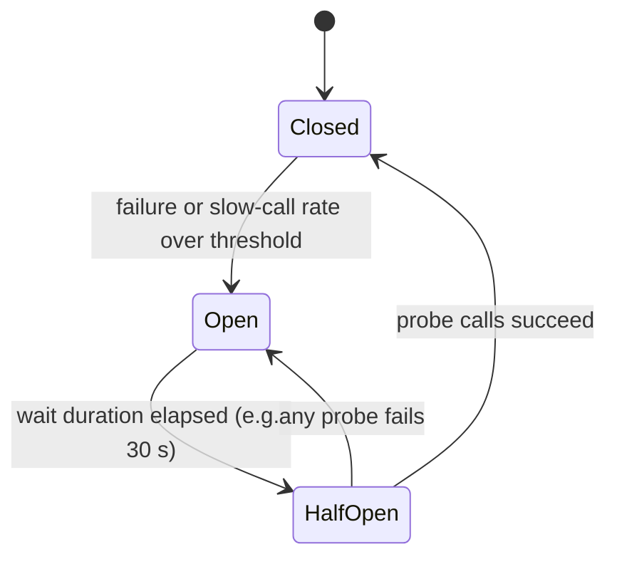
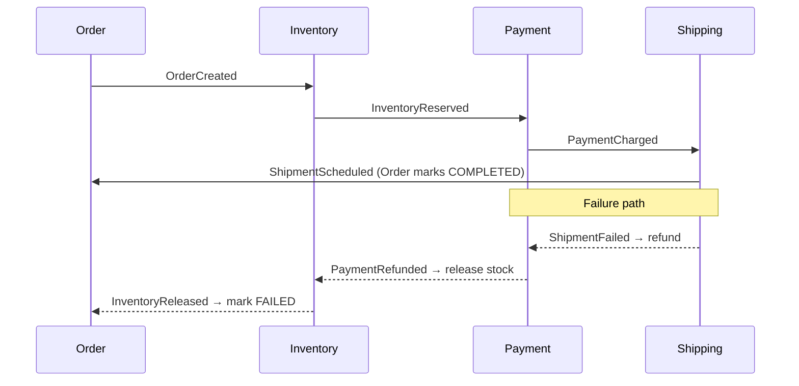

# 🏗️ Software Architecture — Staff-Level Interview Questions

> *15 questions covering service boundaries, modular monoliths, event-driven design, CQRS and event sourcing, resilience, observability, migrations, API compatibility and architecture decision records. Each answer leads with the 30-second version, then the mechanism, the trade-offs and what the interviewer asks next.*

---

## Table of Contents

1. [Microservices Decomposition: Domain-Driven Design](#1-microservices-decomposition)
2. [CQRS & Event Sourcing](#2-cqrs-event-sourcing)
3. [Event-Driven Architecture: Kafka Internals](#3-event-driven-architecture-kafka-internals)
4. [API Gateway vs Service Mesh](#4-api-gateway-vs-service-mesh)
5. [Idempotency & Exactly-Once Semantics](#5-idempotency-exactly-once-semantics)
6. [Circuit Breaker & Bulkhead Patterns](#6-circuit-breaker-bulkhead-patterns)
7. [Graceful Degradation & Fallbacks](#7-graceful-degradation-fallbacks)
8. [Observability: Logging, Metrics, Tracing](#8-observability-logging-metrics-tracing)
9. [Saga Pattern: Choreography vs Orchestration](#9-saga-pattern-choreography-vs-orchestration)
10. [Backpressure & Reactive Systems](#10-backpressure-reactive-systems)
11. [Migration Strategies: Strangler Fig](#11-migration-strategies-strangler-fig)
12. [Configuration Management & Feature Flags](#12-configuration-management-feature-flags)
13. [Modular Monolith vs Microservices](#13-modular-monolith-vs-microservices)
14. [API Versioning & Backward/Forward Compatibility](#14-api-versioning-backwardforward-compatibility)
15. [Architecture Decision Records (ADRs)](#15-architecture-decision-records-adrs)

---

## 1. Microservices Decomposition

**Q:** "We have a monolith e-commerce platform (auth, catalog, cart, orders, payments, shipping — all in one codebase). Walk me through your methodology for decomposing this into microservices using Domain-Driven Design. How do you identify bounded contexts? How do you handle shared data like user profiles?"

**What They're Really Testing:** Whether you understand DDD's strategic design patterns and can identify bounded contexts vs sub-domains vs aggregate roots.

!!! tip "30-second answer"
    Run event storming with domain experts to find **bounded contexts**: areas where a term (e.g. "product", "user") has one consistent meaning. Each context owns its data and is a *candidate* service. Split along contexts, not along entities or layers, and only extract what has a reason to be independent (different scaling, release cadence, team, or compliance scope); everything else can stay as a module in a [modular monolith](#13-modular-monolith-vs-microservices). Shared data such as the user profile is never a shared table: one context owns it and the others keep the subset they need, updated by events, behind an anti-corruption layer.

### Answer

**Vocabulary interviewers expect you to keep straight:**

| Term | Meaning | Decomposition role |
|------|---------|--------------------|
| **Subdomain** | Part of the *problem space* (core, supporting, generic) | Tells you where to invest: build core, buy generic (auth, payments processor) |
| **Bounded context** | Part of the *solution space* where one model and language apply | Unit of ownership; usually the service boundary |
| **Aggregate** | Cluster of entities changed together under one invariant (e.g. `Order` + `OrderLines`) | Transaction boundary: one aggregate per transaction; never split an aggregate across services |
| **Context map** | How contexts relate (customer/supplier, conformist, ACL, shared kernel, published language) | Shows coupling and who has to adapt to whom |

**Event Storming — Identifying Bounded Contexts:**

```
Domain Events (key moments in the system):
─→ User Registered
─→ Product Added to Catalog
─→ Item Added to Cart
─→ Cart Checked Out
─→ Order Placed
─→ Payment Authorized
─→ Payment Captured
─→ Order Shipped
─→ Item Delivered
─→ Order Cancelled

Bounded Contexts (grouped by ubiquitous language):

┌────────────────────┐  ┌────────────────────┐  ┌────────────────────┐
│ Identity & Auth    │  │ Catalog            │  │ Cart               │
│                    │  │                    │  │                    │
│ • User             │  │ • Product          │  │ • Cart             │
│ • Credential       │  │ • Category         │  │ • CartItem         │
│ • Session          │  │ • Attributes       │  │ • Price (snapshot) │
│ • Role             │  │ • List price       │  │                    │
│                    │  │                    │  │                    │
│ Language: "user",  │  │ Language: "item",  │  │ Language: "cart",  │
│ "register", "login"│  │ "catalog", "SKU"   │  │ "checkout","add"   │
└────────────────────┘  └────────────────────┘  └────────┬───────────┘
                                                          │
                                                          ▼
┌────────────────────┐  ┌────────────────────┐  ┌────────────────────┐
│ Orders             │  │ Payments           │  │ Shipping           │
│                    │  │                    │  │                    │
│ • Order            │  │ • Authorization    │  │ • Shipment         │
│ • OrderLine        │  │ • Capture          │  │ • Tracking         │
│ • OrderStatus      │  │ • Refund           │  │ • Carrier          │
│                    │  │ • Transaction      │  │ • Label            │
│                    │  │                    │  │                    │
│ Language: "order", │  │ Language: "pay",   │  │ Language: "ship",  │
│ "fulfill", "cancel"│  │ "refund", "auth"   │  │ "carrier","track"  │
└────────────────────┘  └────────────────────┘  └────────────────────┘

Stock levels live in a separate Warehouse/Fulfilment context; Catalog reaches
them through the anti-corruption layer shown below.
```

### 🎬 Animated Sequence Diagram
<p align="center">
  <video controls width="900" style="border-radius: 12px; box-shadow: 0 4px 24px rgba(0,0,0,0.3);" loop playsinline preload="metadata">
    <source src="../../../assets/videos/arch-microservices-decomposition.mp4" type="video/mp4" />
    Your browser does not support the video tag.
  </video>
  <br/>
  <em>🎬 Animated Sequence — Microservices Decomposition — Monolith → Bounded Contexts with Anti-Corruption Layer. Click ▶ to play/pause. Created with <a href="https://remotion.dev">Remotion</a>.</em>
</p>

**Shared Data — User Profiles Across Contexts:**

```yaml
# The problem: every context needs SOME user data, but they can't all
#              share the User table.
#
# Solution: each context gets its OWN representation:

# Identity context (source of truth):
users:
  id: uuid
  email: string
  password_hash: string
  roles: string[]

# Orders context (local read copy, maintained from events):
order_users:
  user_id: uuid            # PK; no cross-service foreign key
  email: string            # copied from UserRegistered
  shipping_address: string # updated from UserAddressChanged

# The event flows:
UserRegistered:
  → Orders service creates order_users record
  → Cart service creates cart for user
  → Shipping service creates empty profile

# This means:
# - Orders never calls Identity synchronously on the hot path
# - If Identity is down, orders still process (local copy)
# - Data is eventually consistent; the order should SNAPSHOT the address
#   it shipped to, so later profile edits don't rewrite history
# - Costs: consumers must be idempotent, handle out-of-order events,
#   and you need a backfill/replay path for new consumers
```

**Anti-Corruption Layer:**

```python
from dataclasses import dataclass

@dataclass(frozen=True)
class StockLevel:            # Catalog's own model
    sku: str
    quantity: int
    warehouse: str

class InventoryAcl:
    """Anti-Corruption Layer: Catalog talks to the Warehouse context through
    this class only, so Warehouse's model never leaks into Catalog code."""

    def __init__(self, warehouse_client):
        self.warehouse = warehouse_client

    def get_stock(self, sku: str) -> StockLevel:
        # Warehouse says "item_code" and "units_available"
        raw = self.warehouse.get_stock_level(item_code=sku)
        return StockLevel(sku=sku, quantity=raw["units_available"],
                          warehouse=raw["location_name"])

    def reserve_stock(self, sku: str, quantity: int) -> None:
        # Warehouse calls it "allocate", Catalog calls it "reserve"
        self.warehouse.allocate(item_code=sku, units=quantity)
```

**Failure modes to call out:**

- **Entity services** ("UserService", "ProductService") instead of capability services: every use case then needs a chatty call across several services and a distributed transaction.
- **Distributed monolith**: services that share a database or must be deployed together. You pay network and ops costs and get none of the independence.
- **Splitting too early**: boundaries in a new domain are usually wrong at first; moving a boundary inside a monolith is a refactor, across services it is a migration.

**What they probe next:** How do you handle a query that needs data from three contexts (API composition or a read-model built from events)? What happens when two contexts disagree on an order's state (one owner per fact; others hold copies)? How do you migrate there from the monolith (see [Q11](#11-migration-strategies-strangler-fig))?

### 🔍 Staff-Level Evaluation

| Criterion | What I'm Looking For |
|-----------|----------------------|
| **Bounded contexts** | Identifies them by ubiquitous language, not by department or by entity |
| **Shared data** | One owner per fact; others keep event-fed local copies, not shared tables |
| **ACL** | Mentions anti-corruption layer for translating between contexts |
| **Aggregate boundaries** | Understands transaction boundaries (one aggregate per transaction) |
| **Restraint** | Asks whether each split is worth it; a modular monolith is a valid outcome |

---

## 2. CQRS & Event Sourcing

**Q:** "Design a banking system using CQRS and event sourcing. Show me the write path (command → event → aggregate) and read path (materialized view). How do you handle eventual consistency between the command and query sides when a user makes a transfer and immediately checks their balance?"

**What They're Really Testing:** Whether you understand CQRS as a consistency trade-off, not just a pattern, and can design for the read-your-write problem.

!!! tip "30-second answer"
    Commands go to an `Account` aggregate that validates against its current state (rebuilt from its event stream) and appends new events with an **expected-version check**, so concurrent writers can't both succeed. Projectors consume the events asynchronously into read models such as balances and statements. Because projections lag, the user's own balance needs a read-your-writes mechanism: return the new balance from the command, or have the query wait until the projection reaches the position the command wrote. A transfer spans two aggregates, so it is a saga, not one transaction. The hard parts are event schema evolution, replay time and GDPR deletion, not the happy path.

### Answer

**CQRS + Event Sourcing Architecture:**

```
Write Side (Command Model)                  Read Side (Query Model)
┌─────────────────────────┐                 ┌──────────────────────┐
│ Command Bus             │                 │ Materialized Views   │
│                         │                 │                      │
│ ┌─────────────────────┐ │                 │ ┌──────────────────┐ │
│ │ Command: Transfer   │ │                 │ │ account_summary  │ │
│ │ From: A              │ │                 │ │ - balance        │ │
│ │ To: B                │ │                 │ │ - last_10_txns   │ │
│ │ Amount: 100          │ │                 │ └──────────────────┘ │
│ └─────────┬───────────┘ │                 │                      │
│           │             │                 │ ┌──────────────────┐ │
│           ▼             │                 │ │ daily_report    │ │
│ ┌─────────────────────┐ │                 │ │ - total_txns    │ │
│ │ Aggregate: Account  │ │                 │ │ - total_volume   │ │
│ │                     │ │                 │ └──────────────────┘ │
│ │ Validate: balance ≥ │ │                 └──────┬───────────────┘
│ │          100         │ │                        │
│ │ Apply: deduct 100   │ │                        │ (async projection)
│ │ Append event to     │ │                        │
│ │ event store          │ │                        │
│ └─────────┬───────────┘ │                        │
│           │             │                        │
└───────────┼─────────────┘                        │
            │                                      │
            ▼                                      │
┌─────────────────────────┐                        │
│ Event Store             │                        │
│ (immutable append-log)  │                        │
│                         │                        │
│ ┌─────────────────────┐ │                        │
│ │ Account A:          │ │                        │
│ │ - Opened(0)        │ │                        │
│ │ - Deposited(1000)  │ │                        │
│ │ - Transferred(-100)│ │────────────────────────►│
│ └─────────────────────┘ │  Event Bus (Kafka)     │
└─────────────────────────┘                        │
                                                   │
                                                   ▼
                                          ┌──────────────────────┐
                                          │ Read Model Projector  │
                                          │                       │
                                          │ on Transferred:       │
                                          │   UPDATE balance      │
                                          │   INSERT transaction  │
                                          └──────────────────────┘
```

### 🎬 Animated Sequence Diagram
<p align="center">
  <video controls width="900" style="border-radius: 12px; box-shadow: 0 4px 24px rgba(0,0,0,0.3);" loop playsinline preload="metadata">
    <source src="../../../assets/videos/arch-cqrs-event-sourcing.mp4" type="video/mp4" />
    Your browser does not support the video tag.
  </video>
  <br/>
  <em>🎬 Animated Sequence — CQRS + Event Sourcing — Command → Aggregate → Event Store → Projector → Materialized View. Click ▶ to play/pause. Created with <a href="https://remotion.dev">Remotion</a>.</em>
</p>

**Command Model (Aggregate) with optimistic concurrency:**

```python
from dataclasses import dataclass

@dataclass(frozen=True)
class Debited:
    account_id: str
    amount: int          # minor units (cents), never floats for money
    transfer_id: str

@dataclass(frozen=True)
class Credited:
    account_id: str
    amount: int
    transfer_id: str

class InsufficientFunds(Exception): ...
class ConcurrencyConflict(Exception): ...

class Account:
    """Aggregate = consistency boundary for ONE account's balance."""

    def __init__(self, account_id: str, history: list = ()):
        self.id, self.balance, self.version = account_id, 0, 0
        for event in history:              # state is rebuilt by replaying events
            self._apply(event)

    # Command handlers decide and return events; they don't mutate state.
    def debit(self, amount: int, transfer_id: str) -> list:
        if amount > self.balance:
            raise InsufficientFunds(self.id)
        return [Debited(self.id, amount, transfer_id)]

    def credit(self, amount: int, transfer_id: str) -> list:
        return [Credited(self.id, amount, transfer_id)]

    def _apply(self, event):
        if isinstance(event, Debited):
            self.balance -= event.amount
        elif isinstance(event, Credited):
            self.balance += event.amount
        self.version += 1

class EventStore:
    def __init__(self):
        self.streams: dict[str, list] = {}

    def load(self, stream_id: str) -> list:
        return list(self.streams.get(stream_id, []))

    def append(self, stream_id: str, events: list, expected_version: int):
        stream = self.streams.setdefault(stream_id, [])
        if len(stream) != expected_version:   # someone else wrote first
            raise ConcurrencyConflict(stream_id)
        stream.extend(events)

def handle_debit(store: EventStore, account_id: str, amount: int, transfer_id: str):
    account = Account(account_id, store.load(account_id))
    events = account.debit(amount, transfer_id)
    # Two concurrent debits both read version N; only one append succeeds.
    # The loser reloads and re-validates, so the balance can't go negative.
    store.append(account_id, events, expected_version=account.version)
    return events
```

**A transfer touches two aggregates.** Account A's aggregate must not emit `Credited` for account B: that would change B without checking B's invariants or B's version. Model the transfer as a small saga (process manager): `TransferRequested` → debit A (`Debited`) → credit B (`Credited`) → `TransferCompleted`, with a compensating credit back to A if B rejects (closed account). Each step is idempotent on `transfer_id`, because the process manager will retry.

**Read-your-writes — the options:**

The command side commits at time T; the projector updates the read model at T + lag. A user who transfers and then refreshes sees the old balance unless you do one of these:

| Option | How | Cost |
|--------|-----|------|
| **Return the result from the command** | The command response carries the new balance (computed by the aggregate) and the UI shows it | Simplest; only covers the screen that issued the command |
| **Wait for the projection** | The command returns the stream position it wrote; the query passes `min_position` and the read side waits (bounded, e.g. 500 ms) until its checkpoint ≥ that position, else falls back | Adds latency on that one read; needs projectors to expose checkpoints |
| **Read from the write model** | For "my own account right now", load the aggregate (or its snapshot) instead of the view | Couples that query to the write side; fine for single-entity reads |
| **Synchronous projection** | Update the critical view in the same DB transaction as the event append | Gives up independent scaling of that view and slows writes; only works when both live in one database |
| **Optimistic UI** | Client applies the change locally and reconciles later | No server guarantee; fine for low-stakes data, not for money |

A common production answer: synchronous or "wait for position" for the user's own balance, asynchronous projections for everything else (statements, analytics, search).

**CQRS / event sourcing pitfalls (what staff interviews probe):**

- **Not every service needs it.** CQRS (separate read and write models) is useful on its own; event sourcing is a much bigger commitment. Use event sourcing when the history *is* the domain (ledgers, audit-heavy workflows), not for CRUD.
- **Event schema evolution.** Events are stored forever, so you can't migrate them like rows. Add fields only with defaults; for breaking changes write a new event type and **upcast** old events when loading. Version every event type.
- **Replay cost.** Long streams make loads slow: take **snapshots** every N events. Rebuilding a projection from zero over billions of events can take hours or days; plan blue/green projections (build the new view alongside, switch reads when caught up).
- **Projector correctness.** Projectors see events at least once and must be idempotent (store last processed position in the same transaction as the view update). Ordering is only guaranteed within a stream (partition), not across them.
- **Set-based invariants.** "Usernames must be unique" spans many aggregates; an event-sourced aggregate can't check it. Use a reservation table with a unique constraint, or accept and compensate.
- **Deleting data (GDPR).** Immutable events conflict with the right to erasure. Keep personal data out of events or use **crypto-shredding** (encrypt per-subject, delete the key).
- **Events are a public API.** Once other teams consume them, internal domain events become a contract; publish separate, stable integration events rather than leaking internal ones.

**What they probe next:** How do you fix a bug that wrote wrong events (append corrective events, never edit history)? How do you add a new read model a year later (replay from the store or from compacted topics)? What's your Kafka vs dedicated event store choice (Kafka has no per-stream optimistic concurrency check, so it is a poor primary event store for aggregates; use a database or EventStoreDB and publish to Kafka)?

### 🔍 Staff-Level Evaluation

| Criterion | What I'm Looking For |
|-----------|----------------------|
| **Aggregate design** | Aggregates as consistency boundaries; one aggregate per transaction; transfer as a saga |
| **Concurrency** | Expected-version check on append prevents lost updates |
| **Event immutability** | Knows events are appended, never modified; corrections are new events |
| **Read-your-writes** | Picks a concrete mechanism and states its cost |
| **Trade-off** | Acknowledges CQRS/ES complexity (schema evolution, replays, GDPR) and justifies it |

---

## 3. Event-Driven Architecture: Kafka Internals

**Q:** "Design an event-driven order processing system using Kafka. Trace a message from producer to consumer. How does Kafka achieve its throughput? Specifically, explain the log-segment structure, ISR replication, and consumer group rebalancing. When is event-driven the wrong choice?"

**What They're Really Testing:** Whether you know Kafka's mechanics well enough to reason about ordering, durability and rebalances, and whether you can weigh event-driven design against plain request/response.

!!! tip "30-second answer"
    A topic is split into partitions; each partition is an append-only log stored as segment files, replicated to followers. The producer hashes the key (e.g. `order_id`) to pick a partition, so all events for one order stay **ordered**. With `acks=all`, the leader acknowledges once every replica in the **in-sync replica set (ISR)** has the record, and refuses writes if the ISR shrinks below `min.insync.replicas`. Consumers in a group split the partitions between them and track progress as committed offsets. Throughput comes from sequential disk I/O, the OS page cache, batching plus compression, and zero-copy transfer. Since Kafka 4.0, metadata runs on KRaft (ZooKeeper is removed) and the broker-driven KIP-848 rebalance protocol is GA.

### Answer

**Trace of one message:**

```
Producer                    Broker (leader of orders-3)          Followers        Consumer group "shipping"
   │ key=order-42                 │                                  │                     │
   │ partition = hash(key) % N    │                                  │                     │
   │── batch (linger.ms, compress)►│ append to active segment         │                     │
   │                              │ (page cache, not fsync)          │                     │
   │                              │◄──────── fetch ──────────────────│ followers PULL      │
   │                              │ high watermark advances when     │                     │
   │                              │ all ISR members have the record  │                     │
   │◄──────── ack (acks=all) ─────│                                  │                     │
   │                              │◄──────────────────────── fetch(offset) ─────────────────│
   │                              │── records up to high watermark (sendfile zero-copy) ───►│
   │                              │◄──────────────────────── commit offset ─────────────────│
```

**Log segment structure:**

```
Topic: orders, Partition: 0   (directory orders-0/)

00000000000000000000.log        offsets 0 … 4 999     (closed segment)
00000000000000000000.index      sparse offset → byte position
00000000000000000000.timeindex  sparse timestamp → offset
00000000000000005000.log        offsets 5 000 …        (ACTIVE segment, appended to)
00000000000000005000.index
00000000000000005000.timeindex

- Files are named after the first (base) offset they contain.
- The index is SPARSE (an entry every ~4 KB, index.interval.bytes), so a
  lookup is a binary search on the index, then a short scan of the log.
- Segments roll on size (segment.bytes, 1 GiB default) or time (segment.ms).
- Retention and compaction work on whole closed segments: delete old ones
  (retention.ms / retention.bytes) or keep only the latest value per key
  (cleanup.policy=compact).
```

**Why it's fast:**

| Technique | Effect |
|-----------|--------|
| Append-only log, sequential I/O | Disk throughput close to sequential bandwidth; no random seeks |
| OS page cache instead of an app cache | Recent data is served from memory; no double buffering, survives broker JVM restart |
| Batching + compression (`linger.ms`, `batch.size`, lz4/zstd) | Fewer requests, fewer bytes; compressed batches stay compressed on disk |
| Zero-copy (`sendfile`) to consumers | Page cache → socket without copying to user space (not possible with TLS, which needs encryption in user space) |
| Partitions | Parallelism across brokers and consumers; ordering only within a partition |

**Replication and durability:**

```
- Each partition: one leader, RF-1 followers that FETCH from the leader.
- ISR = replicas caught up within replica.lag.time.max.ms (30 s default).
- acks=all: leader waits for ALL current ISR members, not a fixed count.
- min.insync.replicas (e.g. 2 with RF=3): if the ISR shrinks below this,
  acks=all writes fail with NotEnoughReplicas instead of silently
  becoming less durable.
- Leader failure: the controller elects a new leader from the ISR.
  unclean.leader.election.enable=false (default) means an out-of-sync
  replica is never elected, trading availability for no data loss.
- Kafka acks after the write reaches memory on the ISR, not after fsync;
  durability comes from replication across brokers/AZs.
```

**Consumer groups and rebalancing:**

| Protocol | How assignment works | Behaviour during rebalance |
|----------|---------------------|----------------------------|
| Classic, eager (`RangeAssignor`, `RoundRobinAssignor`) | JoinGroup/SyncGroup; a client "group leader" computes the assignment | Every consumer revokes everything and waits: stop-the-world |
| Classic, cooperative (`CooperativeStickyAssignor`, KIP-429, Kafka 2.4+) | Same handshake, but only partitions that move are revoked, over two rounds | Unaffected partitions keep processing |
| **Consumer protocol (KIP-848, GA in Kafka 4.0)**, `group.protocol=consumer` | The broker's group coordinator computes assignments; consumers heartbeat and reconcile incrementally | No global barrier; one slow member no longer stalls the group |

Also useful: **static membership** (`group.instance.id`) avoids a rebalance on a rolling restart. With more consumers than partitions, the extras sit idle; Kafka 4.2 made **share groups** (KIP-932, "queues for Kafka") production-ready, letting several consumers process one partition with per-record acknowledgement when you need queue semantics rather than ordering.

**Delivery semantics in one paragraph:** commit offsets *after* processing gives at-least-once (duplicates on crash, so consumers must be idempotent, see [Q5](#5-idempotency-exactly-once-semantics)). Commit *before* processing gives at-most-once. Kafka's exactly-once (idempotent producer, on by default since 3.0, plus transactions with `read_committed` consumers) covers read-process-write *within Kafka*; side effects in other systems still need idempotency or an outbox.

**Event-driven trade-offs (the part staff interviews care about):**

| Benefit | Cost you are signing up for |
|---------|-----------------------------|
| Temporal decoupling: producer doesn't need consumers up | Eventual consistency; UX must tolerate "processing…" states |
| New consumers without changing the producer | Hidden coupling via event schemas; need a schema registry and compatibility rules |
| Natural audit trail and replay | Duplicates and reordering are normal; every consumer must be idempotent |
| Absorbs load spikes (buffer) | Debugging a flow spread across services needs tracing and correlation IDs |
| | Failure handling moves to retries, DLQs and poison-message handling |

Choose the **event style** deliberately:

- **Event notification** ("OrderPlaced, id=42"): small payload, but consumers call back for details, so you keep runtime coupling.
- **Event-carried state transfer** (full order in the event): consumers keep local copies and never call back, at the cost of bigger events and duplicated data.
- **Commands over a queue** ("ChargeCard"): one intended handler. Don't disguise commands as events; if the sender needs to know the outcome, it is a request.

Event-driven is the **wrong choice** when the caller needs an immediate answer (validate a card, check stock before showing "Buy"), when a strong invariant spans the steps, or when there's one producer and one consumer with no need for replay; a direct call is simpler to build, test and debug.

**What they probe next:** How many partitions (target throughput ÷ per-partition consumer throughput, with headroom; increasing later re-maps keys and breaks per-key ordering)? A poison message blocks a partition: what do you do (bounded retries, then DLQ topic, alert)? How do you evolve the event schema (Avro/Protobuf with a registry, backward-compatible changes only; see [Q14](#14-api-versioning-backwardforward-compatibility))?

---

## 4. API Gateway vs Service Mesh

**Q:** "You're designing the infrastructure layer for 50 microservices. Compare Kong/NGINX (API Gateway) vs Istio/Linkerd (Service Mesh). When would you use both?"

!!! tip "30-second answer"
    A **gateway** handles north-south traffic: it is the single front door for external clients and does client-facing work (authentication, rate limits per API key, request routing, TLS termination, API versioning). A **mesh** handles east-west traffic between services and adds mTLS identity, retries, timeouts, traffic splitting and uniform telemetry without changing application code. They solve different problems, so at 50 services the usual answer is both: gateway at the edge, mesh inside. The mesh is the optional one: adopt it when you need zero-trust mTLS or consistent traffic policy across many teams and languages, because it adds an operational layer you have to run and debug.

### Answer

| | API Gateway | Service Mesh |
|---|---|---|
| Traffic | North-south (client → cluster) | East-west (service → service) |
| Concerns | AuthN of external callers (OAuth/JWT, API keys), quotas, request/response transformation, API productisation, WAF | mTLS and workload identity, authorization between services, retries/timeouts, canary splits, golden-signal metrics, tracing headers |
| Deployment | A few replicas at the edge (Kong, Envoy Gateway, AWS API Gateway, Apigee) | A proxy per pod (sidecar) or per node (Istio ambient `ztunnel` + optional waypoint proxies); Linkerd uses its Rust `linkerd2-proxy` sidecar |
| Config owner | API/platform team, product-facing | Platform team, policy-facing |

```
Client ──TLS──► API Gateway (authN, rate limit, routing /v1 /v2)
                    │
                    ▼
              Service A ──mTLS (mesh)──► Service B ──mTLS──► Service C
                    retries, timeouts, authz policy, telemetry
```

**Current state worth knowing (2026):**

- **Kubernetes Gateway API** (`Gateway`, `HTTPRoute`, `GRPCRoute`) is the standard successor to `Ingress`, and most gateways and meshes implement it. The community **ingress-nginx** controller was retired in March 2026 (no more fixes or security patches), so new designs should use a Gateway API implementation.
- **Istio ambient mode** (GA since Istio 1.24, late 2024) removes per-pod sidecars: a per-node `ztunnel` handles L4 mTLS, and L7 policy runs in optional per-namespace **waypoint** proxies. This saves a lot of memory and makes upgrades easier, because pods don't need restarting to update the proxy.

**Failure modes and trade-offs:**

- **Retry storms.** Retries at the client, the mesh and the gateway multiply (3 × 3 × 3 = 27 attempts). Retry at one layer only, with budgets and only for idempotent calls.
- **The gateway as a bottleneck or "smart pipe".** Business logic creeping into gateway plugins recreates an ESB. Keep it to cross-cutting edge concerns; use a BFF (backend-for-frontend) service for per-client aggregation.
- **Mesh cost.** Sidecars add latency per hop (sub-millisecond to low milliseconds) and memory per pod, and create a new failure domain (control plane, certificate rotation). You don't need a mesh for 5 services in one language; a shared client library or gRPC interceptors can do retries and metrics.

**What they probe next:** Where does end-user identity live inside the mesh (the gateway validates the token and forwards a signed JWT or claims; the mesh proves *workload* identity with SPIFFE-style certificates; you usually need both)? How would you canary a service (mesh traffic split by weight or header, watch SLOs, automate rollback)?

---

## 5. Idempotency & Exactly-Once Semantics

**Q:** "Design a payment processing system that guarantees exactly-once processing. How do you handle retries, duplicate requests, and failures at the infrastructure level? Walk me through the idempotency key pattern and the transactional outbox pattern."

**What They're Really Testing:** Whether you understand that exactly-once is about idempotency + deduplication, not about preventing failures. They want to see you handle the distributed systems reality of at-least-once delivery paired with idempotent consumers.

!!! tip "30-second answer"
    Exactly-once *delivery* is impossible over an unreliable network. What you build is **at-least-once delivery plus idempotent processing**, which gives exactly-once *effects*. Three pieces: (1) the client sends an **idempotency key**; the server claims it atomically (unique constraint) *before* doing the work, stores the response, and replays it on retries; the same key is forwarded to the payment provider. (2) A **transactional outbox** writes the business change and the event in one local transaction, and a relay publishes the event afterwards, which removes the DB-vs-broker dual write. (3) **Consumers deduplicate** by message ID in the same transaction as their side effect.

### Answer

**The Problem:**

```
Client                    Payment Service              Payment Gateway
  │                             │                            │
  │──── POST /charge (1) ──────►│                            │
  │                             │─── charge() ──────────────►│ (succeeds)
  │                             │◄──── response lost ─ ─ ─ ─ │
  │◄──── 504 timeout ───────────│                            │
  │  (client retries)           │                            │
  │──── POST /charge (2) ──────►│  Duplicate! Without a key, │
  │                             │  we charge the card twice. │
```

**Solution 1: Idempotency Key Pattern**

```sql
CREATE TABLE idempotency_keys (
    key            TEXT PRIMARY KEY,     -- uniqueness makes the claim atomic
    request_hash   TEXT NOT NULL,        -- detect key reuse with a different body
    status         TEXT NOT NULL,        -- IN_PROGRESS | DONE
    response_code  INTEGER,
    response_body  TEXT,
    created_at     TIMESTAMP DEFAULT CURRENT_TIMESTAMP   -- expire after e.g. 24 h
);
```

```python
import json
import sqlite3

class Conflict(Exception):
    """409: same key still in flight, or reused with a different payload."""

class PaymentService:
    def __init__(self, db: sqlite3.Connection, gateway):
        self.db, self.gateway = db, gateway

    def charge(self, key: str, payload: dict) -> tuple[int, dict]:
        request_hash = json.dumps(payload, sort_keys=True)
        # 1. Claim the key FIRST. The PRIMARY KEY makes the claim atomic, so
        #    two concurrent retries cannot both reach the gateway.
        try:
            with self.db:
                self.db.execute(
                    "INSERT INTO idempotency_keys (key, request_hash, status) "
                    "VALUES (?, ?, 'IN_PROGRESS')", (key, request_hash))
        except sqlite3.IntegrityError:
            status, stored_hash, code, body = self.db.execute(
                "SELECT status, request_hash, response_code, response_body "
                "FROM idempotency_keys WHERE key = ?", (key,)).fetchone()
            if stored_hash != request_hash:
                raise Conflict("key reused with a different request")
            if status == "IN_PROGRESS":
                raise Conflict("original request still in progress; retry later")
            return code, json.loads(body)  # replay the stored response

        # 2. Call the provider, forwarding OUR key as THEIR idempotency key, so
        #    a crash between steps 2 and 3 is safe to retry end to end.
        try:
            result = self.gateway.charge(payload["amount"], payload["currency"],
                                         idempotency_key=key)
            code, body = 200, result
        except ValueError as e:  # definite, non-retriable failure (e.g. card declined)
            code, body = 402, {"error": str(e)}
        except Exception:
            # Unknown outcome (timeout, 5xx): release the claim so the client's
            # retry re-asks the provider, which dedupes on the same key.
            with self.db:
                self.db.execute("DELETE FROM idempotency_keys WHERE key = ?", (key,))
            raise

        # 3. Record the final response.
        with self.db:
            self.db.execute(
                "UPDATE idempotency_keys SET status='DONE', response_code=?, "
                "response_body=? WHERE key = ?", (code, json.dumps(body), key))
        return code, body
```

Points to say out loud: the check-then-insert version (SELECT, then do work, then INSERT) has a race where two retries both pass the SELECT; claiming first closes it. A crashed request leaves an `IN_PROGRESS` row, so give claims a lease/timeout. The key's scope is per client/merchant, and its retention must exceed the client's retry window (Stripe keeps keys for 24 hours).

**Solution 2: Transactional Outbox Pattern**

```
Problem: the charge is committed to the DB, then the Kafka publish fails
(or the process dies in between). The customer is charged, the event is lost.
Publishing first and then writing the DB has the opposite failure.

                  ┌──────────────┐
     Request ────►│  API Handler │
                  └──────┬───────┘
                         │ ONE local transaction
                ┌────────▼─────────┐
                │ UPDATE payments  │
                │ INSERT outbox    │
                └────────┬─────────┘
                         │
                ┌────────▼─────────┐
                │  Outbox relay    │  polls (or tails the WAL via CDC),
                │  (separate proc) │  publishes, then marks/deletes rows
                └────────┬─────────┘
                         ▼
                    Kafka topic
```

```python
class OutboxRelay:
    """Publishes outbox rows. At-least-once: a crash after produce() but
    before the UPDATE re-sends the row, so consumers must dedupe on event id."""

    def poll_and_publish(self):
        with self.db.transaction():                 # row locks need a transaction
            rows = self.db.query("""
                SELECT id, topic, msg_key, payload FROM outbox
                WHERE published_at IS NULL
                ORDER BY id
                LIMIT 100
                FOR UPDATE SKIP LOCKED              -- lets several relays run
            """)
            for row in rows:
                # key = aggregate id, so events for one payment stay ordered
                self.producer.produce(row.topic, key=row.msg_key, value=row.payload,
                                      headers={"event_id": str(row.id)})
            self.producer.flush()                   # wait for broker acks
            self.db.execute("UPDATE outbox SET published_at = now() WHERE id = ANY(:ids)",
                            {"ids": [r.id for r in rows]})
```

Polling is simple but adds latency and load. **CDC** (e.g. Debezium reading the Postgres WAL or MySQL binlog, with its outbox event router) gives lower latency and no polling, at the cost of running Kafka Connect. With several relays, `SKIP LOCKED` lets two relays publish different rows for the same aggregate out of order; if per-key order matters, shard relays by key or use one relay per partition.

**Solution 3: Idempotent consumer**

```python
class PaymentEventConsumer:
    def handle(self, msg):
        event_id = msg.headers["event_id"]
        with self.db.transaction():
            # Dedup record and side effect commit TOGETHER. A separate Redis
            # "seen" set can't do this: crash between the two writes and you
            # either lose the effect or repeat it.
            inserted = self.db.execute(
                "INSERT INTO processed_events (event_id) VALUES (:id) "
                "ON CONFLICT DO NOTHING", {"id": event_id}).rowcount
            if inserted:
                self.apply_side_effect(msg.value)
        self.consumer.commit(msg)   # commit offset only after the DB commit
```

If the side effect is an external call (send an email, call a provider), pass the event ID as that call's idempotency key; you can't put it in your transaction.

**Exactly-once, layer by layer:**

| Layer | Technique | What it actually guarantees |
|-------|-----------|-----------------------------|
| Client → API | Idempotency key, stored response | A retried request has one effect |
| Producer → Kafka | Idempotent producer (`enable.idempotence=true`, default since Kafka 3.0) | No duplicates from producer retries within a session, per partition |
| Kafka → Kafka | Transactions + `isolation.level=read_committed` | Atomic read-process-write *inside Kafka* (Kafka Streams `exactly_once_v2`) |
| Broker durability | `acks=all`, RF=3, `min.insync.replicas=2` | No loss of acknowledged writes unless two brokers fail |
| DB → broker | Transactional outbox / CDC | No lost events (at-least-once, so duplicates are possible) |
| Consumer → its DB | Dedup table in the same transaction | Exactly-once effect |

**What they probe next:** What if the client reuses the key with a different amount (reject with 409/422 using the stored request hash)? How long do you keep keys (longer than the longest retry window)? Two different keys for the same logical purchase (dedupe on a business key too, e.g. `order_id` unique on the payments table)?

### 🔍 Staff-Level Evaluation

| Criterion | What I'm Looking For |
|-----------|----------------------|
| **Idempotency key** | Claims the key atomically *before* side effects; stores and replays the response; forwards the key downstream |
| **Transactional outbox** | Can explain why dual writes fail and how the outbox (or CDC) fixes it |
| **Dedup scope** | Dedup window exceeds max retry interval; dedup record committed with the side effect |
| **Failure modes** | Distinguishes definite failures from unknown outcomes (timeouts); dead-letter queues |
| **Precision** | Says "exactly-once effects", not "exactly-once delivery" |

---

## 6. Circuit Breaker & Bulkhead Patterns

**Q:** "Your payment service depends on three external providers (Stripe, PayPal, Braintree). If Braintree starts timing out, it's exhausting your thread pool and causing Stripe calls to also fail. Design a solution using circuit breaker and bulkhead patterns."

**What They're Really Testing:** Whether you understand that circuit breakers prevent cascading failures and bulkheads isolate failure domains. They want to see you combine both patterns with concrete thresholds and recovery strategies.

!!! tip "30-second answer"
    The real bug is **shared capacity**: one slow dependency holds every thread. A **bulkhead** gives each provider its own small pool or semaphore, so Braintree can only exhaust *its* slots. A **circuit breaker** per provider watches failures and slow calls. Once they cross a threshold it opens and fails fast, which stops callers queuing behind a dead dependency and gives it room to recover. After a cool-down it lets a few probe requests through (half-open) and closes if they succeed. Add **timeouts** on every call (they are what turn a hang into a counted failure) and a fallback. For payments, only fail over when you know the first attempt didn't charge.

### Answer

**Circuit Breaker State Machine:**



**Bulkhead — isolate each dependency's capacity:**

```
Without bulkhead (one shared pool of 10 threads):
  Braintree hangs → its calls pile up → all 10 threads blocked
  → Stripe and PayPal requests can't get a thread → total outage

With bulkheads (separate pools/semaphores):
  ┌─────────────────┐  ┌─────────────────┐  ┌─────────────────┐
  │ Stripe  (4)     │  │ PayPal  (3)     │  │ Braintree (3)   │
  │ working         │  │ working         │  │ all stuck       │
  └─────────────────┘  └─────────────────┘  └─────────────────┘
  Braintree's failure is contained to its 3 slots; when they are full,
  new Braintree calls are rejected immediately instead of waiting.
```

**Implementation (runs as-is; providers are stubbed):**

```python
import threading
import time
from concurrent.futures import ThreadPoolExecutor
from concurrent.futures import TimeoutError as FutureTimeout
from enum import Enum


class CircuitOpenError(Exception):
    pass


class State(Enum):
    CLOSED = "closed"
    OPEN = "open"
    HALF_OPEN = "half_open"


class CircuitBreaker:
    """Consecutive-failure breaker. Production libraries (Resilience4j, Polly)
    use a sliding window of failure *rate* plus slow-call rate instead."""

    def __init__(self, name, failure_threshold=5, recovery_timeout=30.0, half_open_max=1):
        self.name = name
        self.failure_threshold = failure_threshold
        self.recovery_timeout = recovery_timeout
        self.half_open_max = half_open_max
        self._state = State.CLOSED
        self._failures = 0
        self._opened_at = 0.0
        self._probes = 0
        self._lock = threading.Lock()

    def _acquire_permission(self) -> bool:
        with self._lock:  # every state read/transition happens under the lock
            if self._state is State.OPEN:
                if time.monotonic() - self._opened_at < self.recovery_timeout:
                    return False
                self._state, self._probes = State.HALF_OPEN, 0
            if self._state is State.HALF_OPEN:
                if self._probes >= self.half_open_max:
                    return False
                self._probes += 1
            return True

    def _on_success(self):
        with self._lock:
            self._state, self._failures = State.CLOSED, 0

    def _on_failure(self):
        with self._lock:
            self._failures += 1
            if self._state is State.HALF_OPEN or self._failures >= self.failure_threshold:
                self._state, self._opened_at = State.OPEN, time.monotonic()

    def call(self, fn, *args, **kwargs):
        if not self._acquire_permission():
            raise CircuitOpenError(self.name)
        try:
            result = fn(*args, **kwargs)
        except Exception:
            self._on_failure()
            raise
        self._on_success()
        return result


class BulkheadFullError(Exception):
    pass


class Bulkhead:
    """Caps concurrent calls to ONE dependency with its own thread pool."""

    def __init__(self, name, max_concurrent=3, max_queued=10):
        self.name = name
        self._pool = ThreadPoolExecutor(max_workers=max_concurrent, thread_name_prefix=name)
        self._slots = threading.BoundedSemaphore(max_concurrent + max_queued)

    def call(self, fn, *args, timeout=2.0, **kwargs):
        if not self._slots.acquire(blocking=False):  # fail fast, don't queue callers
            raise BulkheadFullError(self.name)
        future = self._pool.submit(fn, *args, **kwargs)
        # Release the slot when the work actually finishes, not when the caller
        # gives up: a timed-out call still occupies a pool thread.
        future.add_done_callback(lambda _: self._slots.release())
        try:
            return future.result(timeout=timeout)
        except FutureTimeout:
            future.cancel()  # only helps if it has not started yet
            raise TimeoutError(f"{self.name} timed out after {timeout}s")


class AllProvidersFailed(Exception):
    pass


class PaymentRouter:
    def __init__(self, clients: dict):
        self.clients = clients  # name -> object with .charge(amount, idempotency_key)
        self.bulkheads = {n: Bulkhead(n, max_concurrent=3, max_queued=5) for n in clients}
        self.breakers = {n: CircuitBreaker(n, failure_threshold=5, recovery_timeout=30) for n in clients}

    def _charge_one(self, name, amount, key):
        # Breaker OUTSIDE bulkhead: an open breaker rejects without using a slot,
        # and bulkhead-full / timeout errors count as failures.
        return self.breakers[name].call(
            self.bulkheads[name].call, self.clients[name].charge, amount, key
        )

    def charge(self, amount, idempotency_key, order=("stripe", "paypal", "braintree")):
        errors = {}
        for name in order:  # iterate, don't recurse into charge() from a fallback
            try:
                return name, self._charge_one(name, amount, idempotency_key)
            except (CircuitOpenError, BulkheadFullError) as e:
                errors[name] = e  # never reached the provider: safe to try the next
            except TimeoutError as e:
                # Outcome UNKNOWN: the charge may have gone through. Failing over
                # now risks a double charge. Reconcile first (query by key).
                raise
            except Exception as e:
                # Definite failure (connection refused, provider 4xx).
                # A card DECLINE should not fail over: the bank said no.
                errors[name] = e
        raise AllProvidersFailed(errors)
```

Details that matter in review:

- **The timed-out thread is still running.** `future.result(timeout=…)` only stops *waiting*; Python can't kill the thread. That's why the slot is released in a done-callback. Releasing it in `finally` (a common bug) lets new work pile onto a pool whose threads are all stuck. The real fix is a client-level timeout (HTTP connect and read timeouts) so the call itself ends.
- **Breaker outside, bulkhead inside**, so an open breaker costs nothing and a full bulkhead counts as a failure.
- **Production breakers use rates, not counts**: Resilience4j opens on failure rate ≥ X% over a sliding window (count- or time-based) once a minimum number of calls is reached, and also on *slow-call rate*. A consecutive-failure counter is fine for a whiteboard but flaps under mixed traffic.
- **Fallback must not recurse.** A fallback that calls `charge()` again, which falls back again, can fan out across all providers per request. Iterate over an explicit list instead.
- **Ambiguous failures.** A timeout to Stripe doesn't mean the charge failed. Failing over to PayPal can double-charge; reconcile first using the idempotency key ([Q5](#5-idempotency-exactly-once-semantics)).
- **Async services** use semaphore bulkheads (`asyncio.Semaphore`) rather than thread pools; the principle is identical.

**What they probe next:** How do you pick pool sizes (Little's law: concurrency ≈ throughput × latency, e.g. 50 req/s × 0.2 s = 10, plus headroom)? Breaker state is per instance: is that a problem (usually fine, since each instance learns independently; sharing state adds a dependency)? How do you test it (fault injection, chaos experiments in staging)?

### 🎬 Animated Sequence Diagram
<p align="center">
  <video controls width="900" style="border-radius: 12px; box-shadow: 0 4px 24px rgba(0,0,0,0.3);" loop playsinline preload="metadata">
    <source src="../../../assets/videos/arch-circuit-breaker.mp4" type="video/mp4" />
    Your browser does not support the video tag.
  </video>
  <br/>
  <em>🎬 Animated Sequence — Circuit Breaker Pattern — Closed → Open → Half-Open states protecting against cascading failures. Click ▶ to play/pause. Created with <a href="https://remotion.dev">Remotion</a>.</em>
</p>

### 🔍 Staff-Level Evaluation

| Criterion | What I'm Looking For |
|-----------|----------------------|
| **Circuit states** | Explains Closed → Open → Half-Open with concrete thresholds |
| **Bulkhead isolation** | Uses separate thread pools/semaphores per dependency |
| **Combined pattern** | Applies circuit breaker ON TOP OF bulkhead (failure detection + isolation) |
| **Fallback strategy** | Fails over to other providers only on definite failures; reconciles ambiguous ones |
| **Timeouts** | Every remote call has a timeout; knows a timed-out thread keeps running |
| **Recovery** | Half-Open probing with gradual recovery, not immediate reset |

---

## 7. Graceful Degradation & Fallbacks

**Q:** "Your recommendation service depends on a real-time ML model. If the model service goes down, what happens to your product pages? Design a graceful degradation strategy that keeps the site functional."

**What They're Really Testing:** Whether you distinguish between critical-path and non-critical-path dependencies, and can design fallback chains that degrade features without crashing the whole page.

!!! tip "30-second answer"
    Rank every dependency of the page as critical (catalog, price: fail the page without it), important (stock: show "check availability") or optional (recommendations, reviews: hide or serve stale). Optional calls get tight timeouts, a breaker and a fallback chain: personalised → cached → precomputed trending → empty. The page assembles within a fixed latency budget, so a slow optional dependency costs its slot, never the page. Then make degradation **visible**: count fallback hits as a metric and alert on them, or you'll serve "trending" for a week without noticing.

### Answer

**Degradation Hierarchy:**

```
Product Page Dependencies (ranked by criticality):

CRITICAL (page cannot render without these):
  └── Product catalog DB
  └── Price service

IMPORTANT (degrade gracefully):
  └── Inventory/stock status       → show "Check availability"
  └── User session/auth            → show cached/guest view

NICE-TO-HAVE (silently disable):
  └── Personalized recommendations → show generic "Trending"
  └── Reviews & ratings            → show cached snapshot
  └── Recently viewed              → hide section
  └── ML-powered search ranking    → fall back to keyword match
```

```python
class ProductPageService:
    def __init__(self):
        self.cache = RedisCache()
        self.catalog = CatalogClient()
        self.inventory = InventoryClient()
        self.recommendations = RecommendationClient()
        self.reviews = ReviewClient()

    def get_product_page(self, product_id: str, user_id: str | None):
        # 1. Critical path — no fallback, must succeed
        product = self.catalog.get_product(product_id)

        # 2. Inventory — degraded fallback
        inventory = self._get_inventory_with_fallback(product_id)

        # 3. Recommendations — degraded fallback
        recommendations = self._get_recommendations_with_fallback(user_id, product_id)

        # 4. Reviews — degraded fallback
        reviews = self._get_reviews_with_fallback(product_id)

        return self._assemble_page(product, inventory, recommendations, reviews)

    def _get_inventory_with_fallback(self, product_id: str) -> dict:
        try:
            return self.inventory.check_stock(product_id)
        except (TimeoutError, ConnectionError):
            # Fallback 1: Try cache
            cached = self.cache.get(f"inventory:{product_id}")
            if cached:
                return cached

            # Fallback 2: Return stale/unknown status
            logger.warning(f"Inventory unavailable for {product_id}, showing unknown")
            return {
                "in_stock": None,        # Frontend shows "Check availability"
                "quantity": 0,
                "estimated_delivery": None
            }

    def _get_recommendations_with_fallback(self, user_id: str | None, product_id: str):
        if not user_id:
            return self._get_generic_recommendations()

        try:
            return self.recommendations.get_personalized(user_id, product_id)
        except Exception:
            # Fallback 1: Cached recommendations
            cached = self.cache.get(f"recs:{user_id}:{product_id}")
            if cached:
                return cached

            # Fallback 2: Generic trending products
            return self._get_generic_recommendations()

    def _get_generic_recommendations(self):
        # Pre-computed, refreshed every hour
        return self.cache.get("trending:products") or []

    def _get_reviews_with_fallback(self, product_id: str):
        try:
            return self.reviews.get_reviews(product_id)
        except Exception:
            # Fallback: Cached snapshot (stale, but better than nothing)
            cached = self.cache.get(f"reviews:{product_id}:snapshot")
            if cached:
                logger.info(f"Serving stale reviews for {product_id}")
                return cached
            # Last resort: No reviews section
            return []
```

**Fallback chain as data (the Hystrix/Resilience4j idea, without the framework):**

```python
import asyncio
import logging

async def first_successful(chain, *, default):
    """Try each (name, call, timeout) in order; return the first non-empty result."""
    for name, make_call, timeout_s in chain:
        try:
            result = await asyncio.wait_for(make_call(), timeout_s)
            if result:
                return name, result
        except Exception as e:          # includes TimeoutError
            logging.warning("recs source %s failed: %r", name, e)
    return "default", default

async def get_recommendations(ml_client, cache, user_id, product_id):
    chain = [
        ("personalized", lambda: ml_client.recommend(user_id, product_id), 0.10),
        ("cached",       lambda: cache.get(f"recs:{user_id}:{product_id}"), 0.02),
        ("trending",     lambda: cache.get("trending:products"),            0.02),
    ]
    return await first_successful(chain, default=[])
```

A sequential chain adds up timeouts (here up to 140 ms). If that busts the page budget, run the cheap fallback **in parallel** with the primary and take the primary only if it arrives in time. Netflix Hystrix has been in maintenance mode since 2018; on the JVM use Resilience4j, in a mesh use its timeouts and outlier detection.

**Timeout budget — fetch in parallel, cut off at the deadline:**

The `ProductPageService` above calls dependencies one after another for readability; in production, start them concurrently and give the whole page one deadline:

```python
import asyncio

async def assemble_page(fetchers: dict, critical: set, budget_s: float = 0.5):
    """Start every dependency at once; wait at most budget_s overall.
    Critical ones must succeed; optional ones fall back to None."""
    tasks = {name: asyncio.create_task(fn()) for name, fn in fetchers.items()}
    done, pending = await asyncio.wait(tasks.values(), timeout=budget_s)
    for t in pending:
        t.cancel()                                # stop paying for late answers
    page = {}
    for name, task in tasks.items():
        ok = task in done and task.exception() is None
        if name in critical and not ok:
            raise RuntimeError(f"critical dependency {name} failed")  # → error page / 503
        page[name] = task.result() if ok else None                    # → render fallback
    return page
```

Propagate the remaining budget downstream (gRPC deadlines, or a `X-Request-Deadline` header) so services deeper in the call graph stop working on requests the caller has already abandoned.

**What they probe next:** How stale may cached reviews or prices be (prices: never stale at checkout; recompute and re-validate at payment time)? How do you test degradation (inject faults per dependency in staging, game days)? What if the *cache* is the thing that's down (fallbacks must not depend on the same failing component)?

### 🔍 Staff-Level Evaluation

| Criterion | What I'm Looking For |
|-----------|----------------------|
| **Criticality tiers** | Separates dependencies into must-have vs nice-to-have |
| **Fallback chain** | Multiple fallbacks: primary → cache → generic → empty |
| **Stale data tolerance** | Understands when stale data is acceptable and for how long |
| **Timeout budgets** | Manages page assembly time; cancels non-critical requests |

---

## 8. Observability: Logging, Metrics, Tracing

**Q:** "Your platform has 50 microservices. A customer reports that their order was charged but never shipped. Walk me through how you'd debug this using logs, metrics, and traces. What specific tools and data formats would you use?"

**What They're Really Testing:** Whether you understand the three pillars of observability and can connect them to debug production issues. They want to see you trace a request across services using correlation IDs, RED metrics, and distributed tracing.

!!! tip "30-second answer"
    Start from the business symptom and narrow down. Find the order's `trace_id` (stored on the order or logged with `order_id`). Open the trace to see which hop is missing or failed. Pivot to that service's logs filtered by `trace_id`, then use metrics to learn whether this is one order or a pattern (error rate on the publish path, consumer lag, DLQ depth). The tooling that makes this possible: **OpenTelemetry** for traces, metrics and logs with W3C `traceparent` propagation (including through Kafka headers), **structured JSON logs** carrying `trace_id`, and **RED** metrics per service plus **USE** for resources. "Charged but not shipped" is usually a lost event, so the fix is a transactional outbox plus an alert on orders paid but not shipped within N minutes.

### Answer

**The Three Pillars in Action:**

```
┌─────────────────────────────────────────────────────────┐
│                   OBSERVABILITY TRIFECTA                │
├────────────┬────────────────────┬───────────────────────┤
│  LOGS      │    METRICS         │     TRACES            │
├────────────┼────────────────────┼───────────────────────┤
│ Structured │ RED:               │ Distributed spans:    │
│ JSON lines │   Rate             │   order-service       │
│ {           │   Errors           │     → payment-svc    │
│   ts,       │   Duration         │       → stripe-api   │
│   level,    │ USE:               │     → shipping-svc   │
│   msg,      │   Utilization      │       → warehouse    │
│   trace_id, │   Saturation       │                       │
│   service,  │   Errors           │ OpenTelemetry:        │
│   duration  │                    │   W3C traceparent     │
│ }           │ Prometheus +       │   header propagation  │
│             │ Grafana dashboards │                       │
└────────────┴────────────────────┴───────────────────────┘
```

**1. Structured Logging — The Right Way:**

```python
import structlog

structlog.configure(processors=[
    structlog.contextvars.merge_contextvars,      # pulls in bound request context
    structlog.processors.add_log_level,
    structlog.processors.TimeStamper(fmt="iso"),
    structlog.processors.JSONRenderer(),
])
log = structlog.get_logger()

# DON'T: log.info(f"Order {order_id} created for user {user_id}")
#   → free text; can't filter or aggregate by field

# DO: an event name plus fields
def handle_request(trace_id: str, order_id: str, user_id: str):
    # bind once per request (e.g. in middleware); every later log line carries it
    structlog.contextvars.bind_contextvars(trace_id=trace_id, service="order-service")
    log.info("order.created", order_id=order_id, user_id=user_id,
             amount_cents=10000, currency="USD")
# {"trace_id": "4bf9…", "service": "order-service", "order_id": "ord_123",
#  "user_id": "usr_456", "amount_cents": 10000, "currency": "USD",
#  "event": "order.created", "level": "info", "timestamp": "2026-…"}
```

In practice the OpenTelemetry logging integration injects `trace_id`/`span_id` for you, which is what lets you jump from a trace to its log lines.

**2. RED Metrics — Service Health at a Glance:**

```python
from prometheus_client import Counter, Histogram, Gauge

# RED: Rate, Errors, Duration
orders_total = Counter("orders_total", "Total orders", ["status"])
order_duration = Histogram(
    "order_duration_seconds",
    "Order processing time",
    buckets=[0.1, 0.25, 0.5, 1.0, 2.5, 5.0, 10.0],
)
active_requests = Gauge("active_requests", "Currently processing requests")

# Per-endpoint metrics
request_rate = Counter("http_requests_total", "HTTP requests", ["method", "path", "status"])
request_latency = Histogram(
    "http_request_duration_seconds",
    "HTTP latency",
    ["method", "path"],
    buckets=[0.01, 0.05, 0.1, 0.5, 1.0],
)

# USE: Utilization, Saturation, Errors (for infrastructure)
cpu_usage = Gauge("node_cpu_usage_percent", "CPU utilization", ["host"])
db_connections = Gauge("db_connections_active", "Active DB connections")
queue_depth = Gauge("queue_depth", "Message queue depth")

# Production SLIs:
#   Order creation latency: p99 < 2s
#   Payment success rate: > 99.5%
#   Error rate: < 0.1%
#   Queue depth: < 1000
```

**3. Distributed Tracing — Following a Request Across Services:**

```
Trace: abc123 (order creation)
│
├── Span: POST /orders [order-service, 245ms]
│   ├── Span: validate_user [order-service → auth-service, 50ms]
│   │   └── Tags: user_id="usr_456", auth_method="token"
│   │
│   ├── Span: check_inventory [order-service → inventory-service, 30ms]
│   │   └── Tags: sku="SKU-001", quantity=2, in_stock=true
│   │
│   ├── Span: process_payment [order-service → payment-service, 145ms]
│   │   ├── Span: authorize [payment-service → stripe-api, 120ms]
│   │   │   └── Tags: amount=100.00, currency="USD", status="authorized"
│   │   └── Span: update_balance [payment-service → ledger-db, 20ms]
│   │
│   └── Span: create_shipment [order-service → shipping-service, 20ms]
│       └── Span: reserve_package [shipping-service → warehouse-db, 15ms]
│           └── Tags: warehouse_id="WH-01", estimated_ship="2026-07-20"
│
└── Trace Tags: order_id="ord_123", user_id="usr_456", total=100.00
```

**OpenTelemetry Implementation:**

```python
from opentelemetry import trace
from opentelemetry.exporter.otlp.proto.grpc.trace_exporter import OTLPSpanExporter
from opentelemetry.instrumentation.requests import RequestsInstrumentor
from opentelemetry.sdk.resources import Resource
from opentelemetry.sdk.trace import TracerProvider
from opentelemetry.sdk.trace.export import BatchSpanProcessor

provider = TracerProvider(resource=Resource.create({"service.name": "order-service"}))
provider.add_span_processor(BatchSpanProcessor(OTLPSpanExporter(endpoint="http://otel-collector:4317")))
trace.set_tracer_provider(provider)

RequestsInstrumentor().instrument()   # outgoing HTTP calls get spans + traceparent headers
tracer = trace.get_tracer("order-service")

def process_order(order_id: str):
    with tracer.start_as_current_span("process_order") as span:
        span.set_attribute("order.id", order_id)
        with tracer.start_as_current_span("charge_payment"):
            result = payment_client.charge(order_id)   # context propagates automatically
        if result["status"] == "failed":
            span.set_status(trace.Status(trace.StatusCode.ERROR, result["reason"]))
```

Sampling is the cost lever: head sampling (decide at the root, e.g. 10%) is cheap but drops the rare failing trace; **tail sampling** in the OTel Collector keeps all error and slow traces and samples the rest. Kafka hops need the trace context in message headers (the OTel Kafka instrumentations do this), otherwise the trace ends at the producer.

**Debugging the "Charged but Not Shipped" Scenario:**

```
1. Find the trace:    look up order ord_123 → its stored trace_id
                      (or search logs: order_id="ord_123")
2. Read the trace:    process_order → charge_payment ✔ (Stripe 200)
                      no "publish OrderPaid" span, no shipping-service span
3. Pivot to logs:     service=order-service trace_id=…
                      → "kafka publish failed: TimeoutException"
4. Size it:           metrics: publish error rate spiked 10:00–10:07;
                      query DB: orders PAID with no shipment = 312 orders
5. Root cause:        payment committed, then a separate Kafka publish failed
                      (dual write); no retry, no reconciliation
6. Fix + prevent:     transactional outbox (Q5); replay the 312 events;
                      alert on "paid but not shipped after 30 min" and on DLQ depth
```

The staff-level point: the alert that would have caught this is a **business-level invariant check** (paid orders without shipments), not a CPU graph. Define SLOs on user journeys and alert on burn rate, not on every metric.

**What they probe next:** Cardinality (never put `user_id` or `order_id` in metric labels; they belong in logs and traces; use exemplars to link a latency bucket to a trace). Cost control at 50 services (sampling, log levels, retention tiers). "Three pillars" is a simplification: continuous profiling is being added to OpenTelemetry as a fourth signal, and the goal is correlating signals, not owning three tools.

### 🔍 Staff-Level Evaluation

| Criterion | What I'm Looking For |
|-----------|----------------------|
| **Structured logging** | JSON format with trace_id, service, and correlation IDs |
| **RED metrics** | Monitors Rate/Errors/Duration per endpoint |
| **USE metrics** | Monitors Utilization/Saturation/Errors for infrastructure |
| **Distributed tracing** | Uses OpenTelemetry/W3C traceparent; can trace across services |
| **Debugging workflow** | Connects logs + metrics + traces to pinpoint root cause |
| **SLIs/SLOs** | Defines concrete targets (p99 < 2s, error rate < 0.1%) |

---

## 9. Saga Pattern: Choreography vs Orchestration

**Q:** "Design an order fulfillment flow: reserve inventory → charge payment → schedule shipment. If payment fails, release inventory. If shipment fails, refund payment. Compare choreography-based (event-driven) vs orchestration-based (central coordinator) sagas."

**What They're Really Testing:** Whether you understand sagas as a pattern for distributed transactions without distributed locking. They want to see you handle compensating transactions and compare the two approaches with concrete trade-offs.

!!! tip "30-second answer"
    A saga replaces one distributed transaction with a sequence of **local transactions**, each paired with a **compensating action** (release inventory, refund payment) that semantically undoes it if a later step fails. In **choreography**, services react to each other's events and there is no coordinator. It works well for 2 to 4 steps, but the flow exists only implicitly and is hard to see or change. In **orchestration**, one component (often a durable workflow engine such as Temporal, AWS Step Functions or Camunda) persists the saga state and calls each step explicitly, which is easier to monitor, retry and evolve. Either way: steps and compensations must be idempotent, a saga has no isolation (others can see intermediate states), and a compensation that fails needs retries and then a human.

### Answer

**Saga Structure:**

```
Saga: Order Fulfillment

Forward Operations:
  1. Reserve Inventory    → compensate: Release Inventory
  2. Charge Payment       → compensate: Refund Payment
  3. Schedule Shipment    → compensate: Cancel Shipment

If any step fails → execute compensating transactions
in REVERSE order (rollback).
```

**Approach 1: Choreography (Event-Driven)**



```python
# Choreography: Each service listens for events and emits new events
# No central coordinator

# Order Service
class OrderSaga:
    def create_order(self):
        order = self.db.create_order(status="PENDING")
        self.event_bus.publish(OrderCreated(order.id, order.items, order.total))
        # Done — the rest is reactive

    def on_order_completed(self, event: OrderCompleted):
        self.db.update_order(event.order_id, status="COMPLETED")

    def on_order_failed(self, event: OrderFailed):
        self.db.update_order(event.order_id, status="FAILED")

# Inventory Service
class InventorySaga:
    @subscribe(OrderCreated)
    def reserve(self, event: OrderCreated):
        try:
            self.inventory.reserve(event.items)
            self.event_bus.publish(InventoryReserved(event.order_id))
        except InsufficientStock:
            self.event_bus.publish(OrderFailed(event.order_id, "out_of_stock"))

    @subscribe(PaymentFailed)
    @subscribe(PaymentRefunded)          # shipment failed after payment
    def release(self, event):
        # Compensating transaction
        self.inventory.release(event.order_id)
        self.event_bus.publish(InventoryReleased(event.order_id))

# Payment Service
class PaymentSaga:
    @subscribe(InventoryReserved)
    def charge(self, event: InventoryReserved):
        try:
            self.payment.charge(event.order_id, event.amount)
            self.event_bus.publish(PaymentCharged(event.order_id))
        except PaymentDeclined:
            self.event_bus.publish(PaymentFailed(event.order_id))

    @subscribe(ShipmentFailed)
    def refund(self, event: ShipmentFailed):
        # Compensating transaction
        self.payment.refund(event.order_id)
        self.event_bus.publish(PaymentRefunded(event.order_id))

# Shipping Service
class ShippingSaga:
    @subscribe(PaymentCharged)
    def schedule(self, event: PaymentCharged):
        try:
            self.shipping.schedule(event.order_id, event.address)
            self.event_bus.publish(ShipmentScheduled(event.order_id))
        except ShippingUnavailable:
            self.event_bus.publish(ShipmentFailed(event.order_id))
```

**Approach 2: Orchestration (Central Coordinator)**

```
┌──────────────────────────────────────────────────────┐
│              Saga Orchestrator                       │
│  ┌────────────┐  ┌────────────┐  ┌──────────────┐   │
│  │ Step 1:    │  │ Step 2:    │  │ Step 3:      │   │
│  │ Reserve    │──► Charge     │──► Schedule     │   │
│  │ Inventory  │  │ Payment    │  │ Shipment     │   │
│  │  (call     │  │  (call     │  │  (call       │   │
│  │   Inventory│  │   Payment  │  │   Shipping)  │   │
│  │   Service) │  │   Service) │  │              │   │
│  └─────┬──────┘  └─────┬──────┘  └──────┬───────┘   │
│        │               │                │           │
│        ▼               ▼                ▼           │
│  ┌─────────────────────────────────────────────┐   │
│  │ Compensating Transactions (if any step fails) │   │
│  │ Step 3 fail → refund payment → release inv   │   │
│  └─────────────────────────────────────────────┘   │
└──────────────────────────────────────────────────────┘
```

```python
class SagaOrchestrator:
    """Central coordinator — holds saga state and manages execution."""

    def __init__(self):
        self.saga_store = PostgreSQL()     # Persists saga state
        self.inventory = InventoryClient()
        self.payment = PaymentClient()
        self.shipping = ShippingClient()

    def execute_order_saga(self, order_id: str, items: list, amount_cents: int, address: str):
        saga = Saga(order_id, steps=[
            SagaStep(
                name="reserve_inventory",
                action=lambda: self.inventory.reserve(items),
                compensate=lambda: self.inventory.release(order_id),
            ),
            SagaStep(
                name="charge_payment",
                action=lambda: self.payment.charge(order_id, amount_cents),
                compensate=lambda: self.payment.refund(order_id),
            ),
            SagaStep(
                name="schedule_shipment",
                action=lambda: self.shipping.schedule(order_id, address),
                compensate=lambda: self.shipping.cancel(order_id),
            ),
        ])
        self.saga_store.save(saga)
        return self._execute(saga)

    def _execute(self, saga: Saga):
        completed = []

        for step in saga.steps:
            try:
                step.action()
                completed.append(step)
                saga.current_step = step.name
                self.saga_store.save(saga)
            except Exception as e:
                logger.error(f"Saga {saga.id} failed at {step.name}: {e}")
                # Compensate in REVERSE order
                self._compensate(completed[::-1])
                saga.status = "FAILED"
                self.saga_store.save(saga)
                raise SagaFailedError(saga.id, step.name, e)

        saga.status = "COMPLETED"
        self.saga_store.save(saga)

    def _compensate(self, steps_to_undo: list[SagaStep]):
        for step in steps_to_undo:
            try:
                step.compensate()
                logger.info(f"Compensation succeeded for {step.name}")
            except Exception as e:
                # Compensations must be retried (they are idempotent);
                # after N attempts, park the saga and page a human.
                logger.error(f"COMPENSATION FAILED for {step.name}: {e}")
                self._alert_oncall(step.name, str(e))
```

**Comparison:**

| Characteristic | Choreography | Orchestration |
|----------------|--------------|---------------|
| Coordination | Each service reacts to events | Orchestrator sends commands, waits for replies |
| Where the flow lives | Implicit, spread across services | Explicit, in one workflow definition |
| Coupling | Services depend on each other's *events*; adding a step means changing several services | Orchestrator depends on every participant's API; participants don't know each other |
| Visibility | Needs tracing to reconstruct "where is order 42?" | Saga state is one query (or the workflow UI) |
| Failure handling | Each service must know which events trigger its compensation | Central, explicit compensation order, timeouts and retries |
| Risk | Cyclic event dependencies, "pinball" flows | Orchestrator becomes a god service if business logic leaks into it |
| Fits | Few steps, stable flow, autonomous teams | Many steps, branching, timeouts, human tasks, compliance audit |

**Choosing Between Them:**

```python
# Use CHOREOGRAPHY when:
# - 2-3 simple steps, clear linear flow
# - Each step has clear compensating event
# - Teams own their event schema independently
# Example: User registration → Send welcome email → Create default workspace

# Use ORCHESTRATION when:
# - Complex branching (if/then/else in saga)
# - Need visibility into long-running sagas
# - Multiple teams, need strict coordination
# Example: Order fulfillment with inventory checks,
#          payment routing, shipping carrier selection
```

**Design rules that interviewers probe:**

- **Order steps by how hard they are to undo.** Put reversible steps (reserve stock, authorize the card) first, the **pivot** transaction (capture payment) next, and steps that only need retrying (send email) last, so you rarely have to compensate something irreversible.
- **No isolation.** Between steps, other requests see "reserved but not paid". Use semantic locks (status `PENDING`), commutative updates, or re-read values before the pivot.
- **Idempotency everywhere.** The orchestrator retries after crashes, and brokers redeliver. Each step takes a saga ID as its idempotency key.
- **Persist before acting.** The orchestrator code above saves state between steps but is still a toy: a crash mid-step needs replay from the stored state. That's exactly what durable-execution engines (Temporal, Step Functions) give you, so don't hand-roll this for production.
- **Sagas aren't 2PC.** 2PC gives atomicity and isolation but blocks on coordinator failure and is rarely available across services or SaaS APIs.

### 🔍 Staff-Level Evaluation

| Criterion | What I'm Looking For |
|-----------|----------------------|
| **Compensating transactions** | Understands each forward operation needs a reverse operation |
| **Choreography vs orchestration** | Can compare both approaches with trade-offs |
| **Failure handling** | Saga fails at step 3 → compensates step 2, then step 1 (reverse order) |
| **State persistence** | Saves saga progress to DB — survives crashes |
| **Compensation failure** | Knows when compensation fails, needs manual/alert intervention |

---

## 10. Backpressure & Reactive Systems

**Q:** "Your order service processes 10,000 orders/minute from the web tier, but the downstream inventory service can only handle 2,000 updates/minute. Design a backpressure mechanism that prevents inventory service from crashing."

**What They're Really Testing:** Whether you understand the producer-consumer throughput mismatch problem and can design pull-based backpressure, not just rate limiting.

!!! tip "30-second answer"
    First do the arithmetic: 10,000/min in and 2,000/min out is a **sustained** 5× mismatch. A buffer only absorbs *bursts*; with a sustained gap, any queue grows by 8,000 items a minute until something breaks. So the answer has two parts. **Backpressure** is the mechanism: bounded buffers and pull-based consumption, so overload becomes a visible signal (a full queue, rising consumer lag) instead of memory exhaustion. Then a **policy** decides what happens on that signal: scale the consumer (more partitions and workers, batch updates), slow or reject producers (429 with `Retry-After`), or shed low-priority work. You can't backpressure a human clicking "Buy", so at the edge it becomes admission control.

### Answer

**The problem:**

```
Producer (web tier): 10,000/min ──► unbounded queue ──► Inventory: 2,000/min
                                    grows 8,000/min → latency ↑ → OOM / timeouts
```

**Option 1: Put a durable log between them and let the consumer pull.** With Kafka, the consumer fetches at its own pace, so backpressure is built in and the "queue" is disk, not RAM. Consumer lag becomes the signal: alert on lag growth and autoscale consumers on it (e.g. KEDA's Kafka scaler). Partition count caps consumer parallelism, so size it for the peak. This is usually the right first answer.

**Option 2: Bounded in-process buffer + pull-based workers + load shedding:**

```python
import asyncio


class Overloaded(Exception):
    """Map to HTTP 429/503 with Retry-After at the edge."""


class InventoryPipeline:
    def __init__(self, max_buffer=500, workers=4, enqueue_timeout=0.05):
        self.queue: asyncio.Queue = asyncio.Queue(maxsize=max_buffer)  # bounded = no OOM
        self.workers = workers
        self.enqueue_timeout = enqueue_timeout
        self.rejected = 0

    async def submit(self, update) -> None:
        """Producer side. A full queue pushes back: wait briefly, then shed."""
        try:
            await asyncio.wait_for(self.queue.put(update), self.enqueue_timeout)
        except asyncio.TimeoutError:
            self.rejected += 1
            raise Overloaded("inventory backlog full")

    async def _worker(self, apply_update):
        while True:
            update = await self.queue.get()  # pull: a worker takes work only when free
            try:
                await apply_update(update)
            finally:
                self.queue.task_done()

    def start(self, apply_update):
        return [asyncio.create_task(self._worker(apply_update)) for _ in range(self.workers)]


class AIMDLimiter:
    """Concurrency limit tuned like TCP congestion control: additive increase
    while healthy, multiplicative decrease on overload signals."""

    def __init__(self, initial=10, min_limit=1, max_limit=200, target_latency_ms=100):
        self.limit = initial
        self.min_limit, self.max_limit = min_limit, max_limit
        self.target = target_latency_ms
        self.in_flight = 0

    def try_acquire(self) -> bool:
        if self.in_flight >= self.limit:
            return False  # caller sheds or queues
        self.in_flight += 1
        return True

    def release(self, latency_ms: float, overloaded: bool = False):
        self.in_flight -= 1
        if overloaded or latency_ms > self.target:
            self.limit = max(self.min_limit, int(self.limit * 0.7))   # back off fast
        else:
            self.limit = min(self.max_limit, self.limit + 1)          # probe slowly
```

`asyncio.Queue(maxsize=…)` is the core of it: `put()` blocks when the queue is full, which pushes back on the producer. Reactive Streams (`request(n)` in Project Reactor, RxJava, Akka Streams) formalises the same idea: the consumer signals demand and the producer never sends more than requested. gRPC and HTTP/2 flow-control windows do it at the transport layer.

**Option 3: Adaptive concurrency limits (AIMD).** The `AIMDLimiter` above adapts like TCP congestion control: it raises the limit by 1 while latency is healthy and cuts it by 30% when latency rises or the downstream returns 429/503. Netflix's `concurrency-limits` library and Envoy's adaptive concurrency filter do this (with gradient algorithms) so producers find the downstream's real capacity without a hand-tuned rate.

**Option 4: Make the consumer cheaper.** Often the real fix: batch the 2,000 updates into fewer writes (aggregate per SKU per second), make updates commutative (`stock = stock - n` rather than read-modify-write), or partition inventory by SKU so it scales horizontally.

**Backpressure strategies compared:**

| Strategy | How it works | Data loss? | Best for |
|----------|--------------|------------|----------|
| Durable log + pull (Kafka) | Consumer reads at its pace; lag grows on disk | No (within retention) | Async work that can wait |
| Bounded queue + block | Producer waits when full | No, but producer latency rises | In-process pipelines |
| Bounded queue + reject (429/503) | Caller retries later with backoff | Caller decides | Request/response APIs |
| Load shedding by priority | Drop low-value work first (analytics before checkout) | Yes, deliberately | Overload protection |
| Adaptive concurrency (AIMD) | Limit in-flight requests from feedback | No | Variable downstream capacity |
| Circuit breaker | Stop calling a failing downstream | Fail fast | Downstream down, not just slow |

**Failure modes:** unbounded queues anywhere in the path (thread-pool queues, HTTP client pools, `asyncio.Queue()` with no `maxsize`); retries without backoff and jitter, which add load exactly when the system is overloaded; and queues so deep that work is stale by the time it runs (set a TTL and drop expired items).

**What they probe next:** What does the user see when you shed (a fast, honest error beats a 30 s timeout)? How do you prioritise checkout over browse traffic (separate queues or priority classes, shed lowest first)? How do you size the buffer (Little's law: items ≈ arrival rate × acceptable wait)?

### 🔍 Staff-Level Evaluation

| Criterion | What I'm Looking For |
|-----------|----------------------|
| **Pull-based flow** | Consumer requests N items, producer sends at most N |
| **Bounded queues** | Fixed-size buffer prevents OOM |
| **Feedback loop** | Consumer health metrics adjust producer rate |
| **Overflow policy** | Explicit strategy for queue-full scenarios (drop, reject, shed) |
| **Monitoring** | Tracks queue depth, utilization, dropped count |

---

## 11. Migration Strategies: Strangler Fig

**Q:** "Your team has a 10-year-old monolith processing 1M orders/day. You need to migrate to microservices without downtime. Walk me through your migration strategy using the Strangler Fig pattern."

**What They're Really Testing:** Whether you understand incremental migration vs big-bang rewrites. They want to see concrete routing, data migration, and rollback strategies.

!!! tip "30-second answer"
    Never do a big-bang rewrite. Put a routing layer (proxy/gateway) in front of the monolith, then move **one capability at a time**. For each: build the new service, **shadow** traffic to it and compare responses, canary it to 1% → 5% → 50% → 100% with automatic rollback on SLO breach, then delete the old code. The routing is the easy part; the **data** is the hard part. Give the new service its own store, keep the two in sync with CDC (not ad-hoc dual writes), switch the system of record only after reconciliation shows zero diffs, and change shared schemas with **expand → migrate → contract** so every step is reversible. Start with a capability that has few dependencies and real value, not with the core of the monolith.

### Answer

**Strangler Fig Pattern — Three Phases:**

```
Phase 1: Intercept & Route
                          ┌─────────────────┐
Client ──► Proxy ──┬────►│  Monolith       │
(Legacy URL)       │     │  (handles ALL)  │
                   │     └─────────────────┘
                   │
                   └────►│  New Service    │  (new feature only)
                         └─────────────────┘

Phase 2: Incremental Migration
                          ┌─────────────────┐
Client ──► Proxy ──┬────►│  Monolith       │
                   │     │  (orders ONLY)   │
                   │     └─────────────────┘
                   │
                   ├────►│  Auth Service   │  (migrated)
                   ├────►│  Catalog        │  (migrated)
                   └────►│  Payments       │  (migrated)

Phase 3: Monolith Retired
                          ┌─────────────────┐
Client ──► Proxy ──┬────►│  Auth Service   │
                   ├────►│  Catalog        │
                   ├────►│  Orders         │
                   └────►│  Payments       │
                         └─────────────────┘
             (Monolith decommissioned)
```

**Implementation — Proxy Layer (Feature Flags + Routing):**

```python
class MigrationProxy:
    """
    Routes traffic to monolith or new service based on feature flag.
    Can route by user_id, percentage, or specific criteria.
    """

    def __init__(self):
        self.migration_config = self._load_config()

    def route_request(self, request):
        path = request.path
        user_id = request.headers.get("X-User-Id")

        # Check if this path is migrated for this user
        migration = self.migration_config.get_migration(path)

        if not migration:
            # No migration configured → monolith
            return self._call_monolith(request)

        if migration.should_route(user_id):
            # Route to new service
            return self._call_microservice(request, migration.target_service)
        else:
            # Still on monolith
            return self._call_monolith(request)

    def _call_monolith(self, request):
        return httpx.post(
            "http://monolith.internal",
            content=request.body,
            headers=request.headers,
        )

    def _call_microservice(self, request, service):
        return httpx.post(
            f"http://{service}.internal",
            content=request.body,
            headers=self._transform_headers(request, service),
        )

# Configuration (canary deployment)
canary_config = {
    "routes": [
        {
            "path": "/api/orders/**",
            "target": "orders-service",
            "rollout": {"type": "percentage", "value": 5},          # 5% of traffic
            # "rollout": {"type": "user_ids", "values": ["1", "42"]},  # Specific users
            # "rollout": {"type": "internal_only", "ips": ["10.x.x.x"]}, # Internal testing
        }
    ]
}
```

**Data Migration — keep two stores in sync without dual writes:**

Writing to MySQL and then Postgres from application code is **not** a transaction: if the second write fails or the process dies between them, the stores diverge silently. Use one system of record at a time and replicate:

```
Phase A  Monolith DB = system of record
         Monolith ──writes──► MySQL ──CDC (Debezium)──► Kafka ──► new service's Postgres
         Backfill history in batches; CDC carries live changes; reads still go to the monolith.

Phase B  Verify
         Shadow-read: serve from the monolith, also read from the new service, diff, log mismatches.
         Reconciliation job compares row counts and checksums per id range until diffs = 0.

Phase C  Flip the system of record (per capability, behind a flag)
         New service owns writes; CDC/events flow BACK to the monolith's tables
         for any monolith code that still reads them.

Phase D  Contract
         Remove the reverse sync and the old tables once nothing reads them.
```

```python
class Reconciler:
    """Compares the two stores by key range. Run continuously during migration."""

    def verify_range(self, start_id: int, end_id: int) -> list[int]:
        old = {r["id"]: self._normalize(r) for r in self.legacy_db.query(
            "SELECT * FROM orders WHERE id >= %s AND id < %s", (start_id, end_id))}
        new = {r["legacy_id"]: self._normalize(r) for r in self.new_db.query(
            "SELECT * FROM orders WHERE legacy_id >= %s AND legacy_id < %s", (start_id, end_id))}
        missing = old.keys() - new.keys()
        mismatched = [k for k in old.keys() & new.keys() if old[k] != new[k]]
        return sorted(missing) + mismatched   # re-sync these, alert if the count grows
```

**Expand → migrate → contract (parallel change)** is how you change a schema or an API without a coordinated deploy. Example: splitting `name` into `first_name` + `last_name`:

| Step | Database | Code | Rollback? |
|------|----------|------|-----------|
| 1. Expand | Add nullable `first_name`, `last_name` | Writes both old and new columns (same DB, same transaction) | Yes, drop new columns |
| 2. Migrate | Backfill new columns in batches | Reads new columns, falls back to old | Yes |
| 3. Switch | — | Reads and writes only new columns | Yes, old column still populated until step 4 |
| 4. Contract | Drop `name` once no deployed version reads it | — | No: this is the one-way door, do it last |

Every intermediate state is compatible with both the previous and the next code version, which is what makes rolling deploys and instant rollback safe. The same pattern applies to APIs and event schemas ([Q14](#14-api-versioning-backwardforward-compatibility)).

**Related techniques to name:** *branch by abstraction* (put an interface in front of the module inside the monolith, then switch the implementation behind it) when the thing you're extracting isn't reachable by URL; *event interception* (the monolith publishes events that the new service consumes); and *parallel run* (both compute, compare, only old one's answer is used) for high-risk logic like pricing or tax.

**Rollback Strategy:**

```python
from collections import defaultdict


class RollbackManager:
    """Compare error rates PER TARGET over the same window; roll back if the
    new service is clearly worse."""

    def __init__(self, min_requests=200, max_ratio=2.0, max_error_rate=0.05):
        self.calls = defaultdict(int)
        self.errors = defaultdict(int)
        self.min_requests, self.max_ratio, self.max_error_rate = min_requests, max_ratio, max_error_rate

    def record(self, target: str, success: bool):
        self.calls[target] += 1
        self.errors[target] += 0 if success else 1

    def rate(self, target: str) -> float:
        return self.errors[target] / self.calls[target] if self.calls[target] else 0.0

    def should_rollback(self) -> bool:
        if self.calls["new"] < self.min_requests:
            return False                          # not enough evidence yet
        new, old = self.rate("new"), self.rate("monolith")
        return new > self.max_error_rate or new > max(old, 0.001) * self.max_ratio
```

Rollback is instant only while the monolith is still the system of record (or still receives reverse sync). Once the new service has accepted writes the monolith never saw, "rollback" means replaying those writes back, so plan the reverse path before flipping.

**Failure modes:** the strangler stalls at 80% and you run two systems forever (set an explicit decommission milestone per capability); the new services share the monolith's database (a distributed monolith); and migrating the hardest, most coupled part first.

**What they probe next:** How do you pick the first service (low coupling, high change rate, clear owner)? How do you handle a transaction that spans old and new (saga, or keep both sides in the same service until the boundary is clean)? How do you know you're done (traffic to the monolith route is zero and the code is deleted)?

### 🔍 Staff-Level Evaluation

| Criterion | What I'm Looking For |
|-----------|----------------------|
| **Incremental approach** | Migrates one feature at a time, not big-bang |
| **Proxy/routing** | Feature flags or proxy layer to split traffic |
| **Data sync** | One system of record at a time; CDC or events for sync, not app-level dual writes |
| **Expand-contract** | Schema and API changes in reversible steps |
| **Verification** | Compares old vs new data for consistency |
| **Rollback** | Automatic rollback if error rate exceeds threshold |
| **Backfill** | Batches historical data migration during low traffic |

---

## 12. Configuration Management & Feature Flags

**Q:** "Design a configuration management system for 200 microservices across 5 environments (dev, staging, prod-us, prod-eu, prod-asia). How do you manage feature flags, rollouts, and detect configuration drift?"

**What They're Really Testing:** Whether you understand that configuration is code and should follow the same CI/CD pipelines. They want to see GitOps-based config management with drift detection.

!!! tip "30-second answer"
    Separate three things that change at different speeds and carry different risks. **Static config** (pool sizes, endpoints) lives in Git, is validated in CI and is applied by a GitOps controller (Argo CD, Flux) as Kubernetes ConfigMaps, with rollout like any deploy. **Secrets** live in a secrets manager (Vault, AWS Secrets Manager) and are synced at runtime, never committed. **Feature flags** are runtime decisions evaluated per request with deterministic bucketing and a kill switch, served by a flag service through a vendor-neutral SDK (OpenFeature). Drift detection compares desired state in Git with live state; GitOps controllers do this continuously and can auto-revert. Most outages here come from config pushes, so config changes get the same canarying and rollback as code.

### Answer

**Architecture: Centralized Config with GitOps**

```
                           ┌─────────────────────┐
                           │  Git Repository      │
                           │  (configs as code)   │
                           │                     │
                           │  dev/config.yaml     │
                           │  staging/config.yaml │
                           │  prod/config.yaml    │
                           └──────────┬──────────┘
                                      │
                                      │ git push
                                      ▼
                          ┌─────────────────────┐
                          │  Config Controller   │
                          │  (ArgoCD / Flux)     │
                          │                     │
                          │  Applies ConfigMaps/ │
                          │  CRDs from git;      │
                          └──────────┬──────────┘
                                      │
                          ┌───────────┴───────────┐
                          │                       │
                          ▼                       ▼
                   ┌──────────────┐      ┌──────────────┐
                   │  ConfigMaps  │      │  Feature Flag │
                   │  (or Consul) │      │  Service      │
                   │              │      │  (LaunchDarkly│
                   │  /config/    │      │   /Flagsmith) │
                   │   prod/db/   │      │              │
                   │   port: 5432 │      │  flags:       │
                   └──────┬───────┘      │  new-checkout:│
                          │              │    prod: 10%  │
                          │              └──────┬───────┘
                          │                     │
                          └─────────┬───────────┘
                                    │
                          ┌─────────▼─────────┐
                          │  Service Sidecars  │
                          │  (config watchers) │
                          │                    │
                          │  Watch config      │
                          │  changes → hot     │
                          │  reload            │
                          └────────────────────┘
```

**1. Configuration As Code (GitOps):**

```yaml
# prod/config.yaml — Centralized config
database:
  host: "postgres-cluster.prod.svc"
  port: 5432
  pool_size: 20
  max_connections: 100

redis:
  host: "redis-cluster.prod.svc"
  port: 6379
  timeout_ms: 500

observability:
  log_level: "INFO"
  tracing_sample_rate: 0.1   # 10% sampling in prod
  metrics_interval: 15        # seconds
```

```python
class ConfigManager:
    """Hot-reloads config from Etcd on changes."""

    def __init__(self, service_name: str, environment: str):
        self.service = service_name
        self.env = environment
        self.config = {}
        self._watch_config()

    def _watch_config(self):
        config_path = f"/config/{self.env}/{self.service}"

        # Initial load
        self.config = self._load_from_etcd(config_path)

        # Watch for changes
        def on_change(new_config):
            logger.info(f"Config changed: {new_config}")
            self.config = new_config
            # Trigger hot-reload hooks
            self._on_config_changed()

        self.etcd.watch(config_path, on_change)

    def get(self, key: str, default=None):
        # Support nested keys: "database.pool_size"
        keys = key.split(".")
        value = self.config
        for k in keys:
            if isinstance(value, dict):
                value = value.get(k)
            else:
                return default
        return value if value is not None else default
```

**2. Feature Flags — Gradual Rollouts:**

```python
import hashlib
from dataclasses import dataclass, field


@dataclass
class User:
    id: str
    region: str = ""
    plan: str = ""
    attrs: dict = field(default_factory=dict)


def bucket(flag: str, user_id: str) -> int:
    """Stable 0-99 bucket. Do NOT use Python's hash(): str hashing is salted
    per process (PYTHONHASHSEED), so every pod would bucket users differently."""
    digest = hashlib.sha256(f"{flag}:{user_id}".encode()).digest()
    return int.from_bytes(digest[:8], "big") % 100


def is_enabled(flag: str, cfg: dict | None, user: User) -> bool:
    if not cfg or cfg.get("killed"):              # 1. kill switch wins
        return False
    if user.id in cfg.get("allow_users", ()):     # 2. explicit overrides
        return True
    if user.id in cfg.get("deny_users", ()):
        return False
    for rule in cfg.get("rules", ()):             # 3. targeting rules, first match wins
        if user.attrs.get(rule["attr"]) in rule["values"]:
            return rule["enabled"]
    return bucket(flag, user.id) < cfg.get("rollout_percentage", 0)  # 4. % rollout

# Flag config (served by the flag service, cached in each process)
flag_config = {
    "new_checkout_flow": {
        "killed": False,                                    # emergency off switch
        "allow_users": ["user_1", "user_42"],              # internal testers
        "rules": [{"attr": "plan", "values": ["enterprise"], "enabled": True}],
        "rollout_percentage": 10,                           # everyone else: 10%
    }
}
```

Two bugs that are easy to ship: using Python's built-in `hash()` for bucketing (it's salted per process, so a user flips between variants depending on which pod serves them), and checking the percentage *before* targeting rules (so the rules never apply to 90% of users). Hashing `flag:user_id` rather than just `user_id` keeps different flags' 10% cohorts independent.

**Operating flags at scale:** evaluate locally from a cached ruleset streamed from the flag service, so a flag-service outage doesn't take down checkout (fall back to the coded default). Use **OpenFeature** (CNCF) as the SDK so the vendor (LaunchDarkly, Flagsmith, Unleash, flagd) is swappable. Give every flag an owner and an expiry date; stale flags are dead code with combinatorial test paths. Distinguish release flags (short-lived) from ops kill switches and entitlements (long-lived).

**3. Configuration Drift Detection:**

```python
class DriftDetector:
    """
    Detects when a service's actual config differs from
    the Git-defined desired config.
    """

    def __init__(self):
        self.desired_config = self._load_from_git()
        self.actual_config = {}  # Reported by services

    def report_actual(self, service: str, environment: str, config: dict):
        """Called by services on startup and config change."""
        key = f"{environment}/{service}"
        self.actual_config[key] = config
        self._check_drift(key)

    def _check_drift(self, key: str):
        desired = self.desired_config.get(key, {})
        actual = self.actual_config.get(key, {})

        diff = self._deep_diff(desired, actual)
        if diff:
            logger.warning(f"Config drift detected for {key}: {diff}")
            self._alert(
                severity="warning",
                message=f"Config drift: {key}",
                details={"desired": desired, "actual": actual, "diff": diff},
            )

    def _deep_diff(self, desired, actual, path=""):
        diffs = []
        all_keys = set(desired.keys()) | set(actual.keys())

        for key in all_keys:
            full_path = f"{path}.{key}" if path else key

            if key not in desired:
                diffs.append(f"{full_path}: extra in actual")
            elif key not in actual:
                diffs.append(f"{full_path}: missing in actual")
            elif isinstance(desired[key], dict) and isinstance(actual[key], dict):
                diffs.extend(self._deep_diff(desired[key], actual[key], full_path))
            elif desired[key] != actual[key]:
                diffs.append(f"{full_path}: {desired[key]} ≠ {actual[key]}")

        return diffs
```

In a GitOps setup you rarely hand-write this: Argo CD and Flux continuously diff live cluster state against Git, report "OutOfSync" and can self-heal. A custom detector like this is only needed for config outside Kubernetes (feature-flag values, cloud console settings, where tools like Terraform plan or AWS Config play the same role).

**4. Secrets Management (not in config files):**

```python
# NEVER store secrets in config files!
# Use a dedicated secrets manager:

class SecretsManager:
    def __init__(self, vault_client, env: str):
        self.vault = vault_client
        self.env = env

    def get_secret(self, path: str) -> str:
        # Prefer files/env injected at deploy time, or runtime reads with
        # short-lived (dynamic) credentials that Vault rotates for you.
        # Env vars leak into crash dumps and child processes; mounted files
        # can be rotated without a restart.
        return self.vault.read(f"secrets/{self.env}/{path}")

# In deployment pipeline:
#   k8s deployment gets secrets from Vault, not from git
#   k8s SealedSecrets: encrypted in git, decrypted by controller

# Example: Kubernetes External Secrets Operator
# apiVersion: external-secrets.io/v1   # v1beta1 is no longer served since ESO v0.17
# kind: ExternalSecret
# spec:
#   refreshInterval: "1h"
#   secretStoreRef:
#     name: vault-backend
#   target:
#     name: my-service-secrets
#   data:
#   - secretKey: db_password
#     remoteRef:
#       key: /prod/db/password
```

### 🔍 Staff-Level Evaluation

| Criterion | What I'm Looking For |
|-----------|----------------------|
| **GitOps** | Config stored in git, synced by controller (ArgoCD/Flux) |
| **Hot reload** | Watches config changes and reloads without restart |
| **Feature flags** | Gradual rollout (percentage, target groups, geo, A/B) |
| **Drift detection** | Compares desired (git) vs actual (running) config; alerts on mismatch |
| **Secrets** | Uses Vault/external-secrets-operator, NOT git for secrets |
| **Kill switch** | Emergency off-switch that bypasses all other flag rules |

---

## 13. Modular Monolith vs Microservices

**Q:** "We're a 40-engineer company with a Rails/Spring monolith that's getting painful. Leadership wants microservices. What do you recommend, and how would you decide?"

**What They're Really Testing:** Whether you treat microservices as a trade-off that has to pay for itself rather than as a default, and whether you can name the real cause of "the monolith is painful".

!!! tip "30-second answer"
    Most monolith pain is **missing modularity**, not the deployment unit: everything can call everything, and every table is shared. Fix that first with a **modular monolith**: modules aligned to bounded contexts, each with a public API and private internals and data, and boundaries enforced by tooling. You keep in-process calls, one deploy and ACID transactions. Extract a module into a service only when it has a concrete reason: a different scaling profile, an independent release cadence for a separate team, fault or compliance isolation, or a different tech stack. A clean module boundary makes that extraction cheap later; a premature service boundary is expensive to move.

### Answer

| Dimension | Modular monolith | Microservices |
|-----------|-----------------|---------------|
| Calls between parts | In-process, nanoseconds, typed | Network: latency, partial failure, retries, versioning |
| Transactions | Local ACID across modules | Sagas, outbox, eventual consistency |
| Deploy | One artifact; one pipeline; whole-app rollback | Independent deploys per service; needs mature CI/CD |
| Scaling | Scale the whole app (often fine; use read replicas, caches, workers) | Scale hot services independently |
| Team autonomy | Shared release train; merge contention beyond ~50–100 engineers | Teams own, release and run their services |
| Fault isolation | A memory leak or bad deploy takes down everything | Failures can be contained (if you built bulkheads) |
| Operational cost | One thing to monitor | Service discovery, tracing, mesh, per-service on-call, platform team |
| Refactoring boundaries | IDE refactor | Cross-team migration with data moves |

**What makes a monolith "modular" (and keeps it that way):**

- **One module per bounded context**, with a small public interface (a facade or service class) and everything else package-private/internal.
- **Data ownership per module**: separate schemas or table prefixes; no module reads another's tables. Cross-module joins go through the public API or a read model.
- **Enforced boundaries**, because conventions decay: Spring Modulith or ArchUnit (Java), Packwerk (Ruby, from Shopify), `import-linter` (Python), Go `internal/` packages.
- **In-process events** between modules (e.g. Spring Modulith's event publication registry, which is a transactional outbox) so modules are already event-shaped if one is extracted later.

**Signals that a module should become a service:**

| Signal | Example |
|--------|---------|
| Very different load profile | Image processing that needs GPUs or scales 50× at peak |
| Independent team and cadence blocked by the shared release train | Search team ships 10×/day, payments needs change control |
| Isolation requirement | PCI scope for card data, a noisy batch job starving the web tier |
| Different runtime or language | ML inference in Python next to a JVM monolith |

**Failure modes:** the **distributed monolith** (services that share a database or must be deployed in lockstep); splitting by technical layer (a "data service", a "business logic service"); and adopting microservices without the platform: no CI/CD per service, no tracing, no on-call ownership. Conway's law applies in both directions: service boundaries end up mirroring team boundaries, so design them together (the "inverse Conway manoeuvre").

Real-world calibration: Shopify runs one of the largest Rails monoliths as a modular monolith; Amazon Prime Video's monitoring team wrote in 2023 that moving one distributed, serverless pipeline into a single process cut its infrastructure cost by about 90%. Neither is an argument against services. Both are arguments for having a concrete reason.

**What they probe next:** How do you stop the modular monolith from eroding (boundary checks in CI, module owners in CODEOWNERS)? How do you extract the first service (strangler plus CDC, [Q11](#11-migration-strategies-strangler-fig))? What changes at 200 engineers (deploy contention and blast radius usually start to justify a split)?

### 🔍 Staff-Level Evaluation

| Criterion | What I'm Looking For |
|-----------|----------------------|
| **Diagnosis** | Separates "poor modularity" from "wrong deployment model" |
| **Trade-offs** | Names the costs microservices add (network failure, consistency, ops) |
| **Enforcement** | Boundaries checked by tooling, data owned per module |
| **Extraction criteria** | Concrete reasons per service, not "best practice" |

---

## 14. API Versioning & Backward/Forward Compatibility

**Q:** "You own a public REST API and an internal gRPC/Kafka contract used by 30 teams. How do you evolve them without breaking clients? When do you introduce a new version?"

**What They're Really Testing:** Whether you can define compatibility precisely, know which changes are breaking, and run a deprecation process instead of a "v2 big bang".

!!! tip "30-second answer"
    Prefer **evolution over versions**: make only additive, compatible changes, and keep one version for as long as you can. **Backward compatible** means existing clients keep working against the new server, and new code can read old data. **Forward compatible** means old code can handle data or responses from a newer version, typically by ignoring unknown fields. You need both during a rolling deploy, because old and new versions run side by side. Breaking changes (removing or renaming fields, changing types or semantics, new required inputs) get a new major version that runs in parallel with the old one, plus a published deprecation and sunset date, usage telemetry per client, and contract tests that catch breaks in CI.

### Answer

**Change classification (REST/JSON, gRPC/Protobuf, Avro events):**

| Change | Safe? | Why |
|--------|-------|-----|
| Add optional response field | Yes, if clients are **tolerant readers** (ignore unknown fields) | Strict deserializers that reject unknown fields turn this into a break |
| Add optional request field with a default | Yes | Old clients don't send it; the default keeps old behaviour |
| Add a **required** request field | **No** | Old clients don't send it |
| Remove or rename a field | **No** | Do it as add new → migrate clients → stop writing old → remove (expand-contract) |
| Change a field's type or units (`price` dollars → cents) | **No** | Same name, different meaning is the worst kind: no error, wrong data |
| Add an enum value | **Risky** | Clients with exhaustive `switch`/`match` may fail; document "unknown values possible" from day one |
| Tighten validation | **No** | Previously valid requests now fail |
| Change default sort order, pagination size, error codes | **Behavioural break** | Hyrum's law: someone depends on it |
| Protobuf: reuse a field number, or change a field's type | **No** | Old bytes decode as garbage; `reserved` removed numbers and names |
| Protobuf: add a field with a new number | Yes | Old readers skip unknown fields (and proto3 preserves them on re-serialisation) |

**Schema-registry compatibility modes (Avro/Protobuf/JSON Schema on Kafka):**

| Mode | Guarantee | Upgrade order |
|------|-----------|---------------|
| `BACKWARD` (Confluent default) | Consumers on the new schema can read data written with the previous one | Upgrade **consumers first** |
| `FORWARD` | Consumers on the previous schema can read data written with the new one | Upgrade **producers first** |
| `FULL` | Both | Any order |
| `*_TRANSITIVE` | Checked against all earlier versions, not just the last | Needed when consumers replay old data (event sourcing, compacted topics) |

**Versioning schemes for public HTTP APIs:**

| Scheme | Example | Trade-off |
|--------|---------|-----------|
| URI major version | `/v1/orders`, `/v2/orders` | Visible, cache- and gateway-friendly; coarse; the most common choice |
| Header / media type | `Accept: application/vnd.acme.v2+json` | Clean URLs; harder to test in a browser and to route at some gateways |
| Date-based pinning | `Stripe-Version: 2024-06-20`; account pinned to its first version | Many small breaking changes without "v2"; server keeps a chain of transformations from new → old shape (more server complexity) |
| gRPC package version | `acme.orders.v1.OrderService` | Breaking change = new package; run both services side by side |

**Deprecation process (what "staff" looks like here):**

1. **Measure**: log API version and client ID on every call, so you know who still uses v1.
2. **Announce**: changelog, docs, and machine-readable headers: `Deprecation` (RFC 9745) and `Sunset` (RFC 8594) with the date, plus a `Link` to the migration guide.
3. **Migrate**: provide a migration guide, SDK updates, and reach out to top callers directly. Internal: open the PRs for the consuming teams yourself if needed.
4. **Brownouts**: before the sunset, fail v1 for short scheduled windows so stragglers notice before the real turn-off.
5. **Remove** once traffic is zero (or contractually ended), then delete the code.

**Guardrails in CI:** consumer-driven contract tests (Pact) so a provider can't merge a change that breaks a known consumer; `buf breaking` for Protobuf; schema-registry compatibility checks on publish; OpenAPI diff tools (e.g. `oasdiff`) to flag breaking REST changes in review.

**What they probe next:** How long do you support an old version (as long as the contract or SLA says, typically 6–24 months for public APIs; internally, as short as you can drive migration)? Mobile apps you can't force-upgrade (support N-2 app versions, server-driven feature flags, a minimum-version kill switch)? How do events differ from APIs (you can't see who reads a topic, and old events are replayed for years, so be stricter: transitive compatibility, new topic for a true break)?

### 🔍 Staff-Level Evaluation

| Criterion | What I'm Looking For |
|-----------|----------------------|
| **Precise definitions** | Backward vs forward compatibility, and why rolling deploys need both |
| **Change classification** | Knows the non-obvious breaks: enums, semantics, validation, field reuse |
| **Process** | Telemetry, deprecation headers, migration support, brownouts |
| **Automation** | Contract tests and schema checks in CI rather than review-by-eyeball |

---

## 15. Architecture Decision Records (ADRs)

**Q:** "How do you make and record significant architecture decisions on a team of teams? Walk me through an ADR you'd write for 'adopt Kafka for inter-service events'."

**What They're Really Testing:** Whether you can drive decisions with written reasoning, separate reversible from irreversible choices, and leave a trail that the next engineer can trust.

!!! tip "30-second answer"
    An **ADR** is a short, dated document (one or two pages) recording **one** significant decision: the context and forces, the options considered, the decision, and its **consequences**, good and bad. It lives in the repo next to the code (`docs/adr/0007-use-kafka-for-domain-events.md`), goes through normal code review, and is never edited after acceptance. If the decision changes, a new ADR **supersedes** it. Write one when a decision is costly to reverse, affects several teams, or will make someone ask "why did we do this?" in a year. The value is less the document than the discussion it forces, and the context it preserves when the authors have moved on.

### Answer

**Template (Michael Nygard's format, extended with options as in MADR):**

```markdown
# ADR-0007: Use Kafka for inter-service domain events

Status: Accepted (2026-09-14)        <!-- Proposed | Accepted | Deprecated | Superseded by ADR-00xx -->
Deciders: platform team, orders, payments, shipping leads

## Context
Services integrate through synchronous REST calls; a Shipping outage blocks checkout.
We need temporal decoupling, replay for new consumers, ~5k events/s peak, ordering per order.

## Options considered
1. Keep synchronous REST + retries        (no new infra; keeps runtime coupling)
2. RabbitMQ                               (simple queues; no long retention or replay)
3. Kafka (managed: MSK / Confluent Cloud) (replay, per-key ordering, ecosystem; ops cost)

## Decision
Option 3, managed Kafka. Events are published through the transactional outbox;
Avro schemas in a registry with BACKWARD_TRANSITIVE compatibility; topics owned by
the producing team.

## Consequences
+ Checkout no longer depends on Shipping being up; new consumers can replay 7 days.
- Every consumer must be idempotent; eventual consistency becomes visible in the UI.
- New skills and on-call surface; ~$X/month. Platform team owns the cluster.
Follow-ups: ADR-0008 (event naming and envelope), runbook for DLQ handling.
```

**Practices that make ADRs useful:**

- **Scope**: one decision per ADR. "Our architecture" is not an ADR.
- **When**: write it *before* the decision is final (status `Proposed`) so the review is the discussion. Writing one afterwards is documentation, which is still better than nothing.
- **Immutability**: never rewrite history. Supersede, and link both ways.
- **Right-size the process**: a two-way-door decision (easy to reverse, e.g. a library choice inside one service) needs a short ADR or none; a one-way door (datastore, public API shape, service boundary, event backbone) needs options, consequences and sign-off from the affected teams.
- **ADR vs RFC/design doc**: a design doc explores a problem and a solution in depth and can be long; the ADR is the short, durable record of the decision that came out of it. Many orgs link the two.
- **Discoverability**: an index file or a tool (`adr-tools`, Log4brains) and links from code comments ("see ADR-0007") at the place where the decision shows up.

**Failure modes:** ADRs written after the fact to justify a decision already made; ADRs that list only benefits (the consequences section is the most valuable part); and an ADR backlog nobody reads because they're stored in a wiki disconnected from the code.

**What they probe next:** How do you get consensus across teams that disagree (make the criteria explicit and weighted first, then score options; escalate with a written recommendation and a deadline rather than letting it stall)? Tell me about a decision you'd reverse now (show what you learned and that the ADR made the reversal cheaper to reason about).

### 🔍 Staff-Level Evaluation

| Criterion | What I'm Looking For |
|-----------|----------------------|
| **Structure** | Context, options, decision, consequences (including the negatives) |
| **Judgement** | Distinguishes one-way from two-way doors and scales the process |
| **Durability** | Stored with the code, reviewed, immutable, superseded rather than edited |
| **Influence** | Uses ADRs to drive cross-team alignment, not as after-the-fact paperwork |

---

> *Related: [Design Patterns](DESIGN_PATTERNS.md) for the object-level patterns (Strategy, Adapter, Facade, Command, State) that appear inside these services.*
