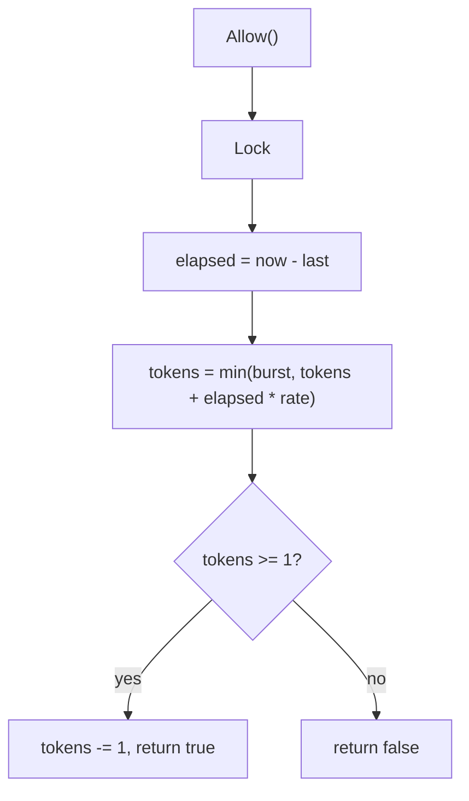
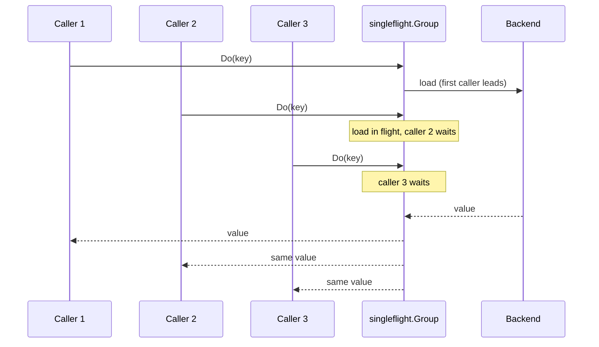
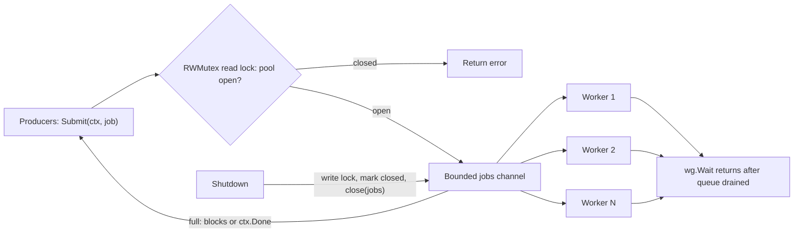
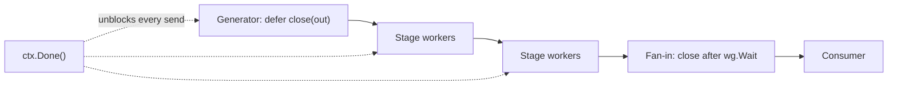
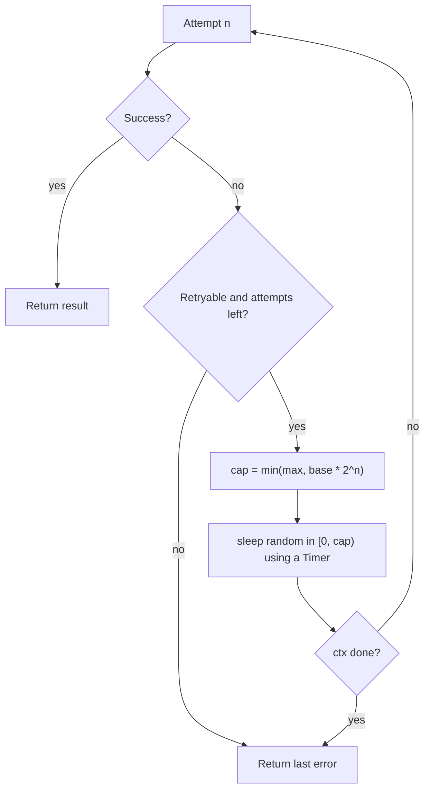

# 🧩 Go Concurrency Coding Challenges

> **Seven interview-style problems with complete, tested solutions.** Each is the kind of 30–45 minute coding round a staff Go interview uses. Every solution passes `go vet` and `go test -race -count=3` (Go 1.26, `golang.org/x/sync` v0.23).
>
> Read [Concurrency Notes](CONCURRENCY_NOTES.md) first for the primitives.

---

## How to run these in an interview

1. **Clarify** ordering, error handling, cancellation, and expected scale before typing.
2. **State the concurrency contract:** who owns each goroutine, who closes each channel, how it stops.
3. **Write the simplest correct version,** then say what you'd harden.
4. **Name the failure modes** (leaks, races, send-on-closed, stampedes, unbounded memory) before the interviewer asks.

All seven solutions are in one package (`package chal`); the imports shown at the top of each block are the only ones it needs.

---
## Challenge 1: Bounded parallel map (errgroup)

**Problem:** Fan out N calls with at most K in flight, keep result order, cancel on first error.

```go
// c1_parallel.go
package chal

import (
	"context"

	"golang.org/x/sync/errgroup"
)

// ParallelMap applies fn to every input with at most `limit` goroutines in
// flight. Results keep input order; the first error cancels the rest.
func ParallelMap[In, Out any](ctx context.Context, in []In, limit int, fn func(context.Context, In) (Out, error)) ([]Out, error) {
	out := make([]Out, len(in)) // each goroutine writes its own index: no lock needed
	g, gctx := errgroup.WithContext(ctx)
	g.SetLimit(limit)
	stopped := false
	for i, v := range in {
		if gctx.Err() != nil { // first error or caller cancel: don't start more work
			stopped = true
			break
		}
		g.Go(func() error { // Go 1.22+: i and v are per-iteration
			r, err := fn(gctx, v)
			if err != nil {
				return err
			}
			out[i] = r
			return nil
		})
	}
	if err := g.Wait(); err != nil {
		return nil, err
	}
	if stopped { // cancelled by the caller with no fn error: don't return a partial result as success
		return nil, context.Cause(ctx)
	}
	return out, nil
}
```

**What to say:**

- **Why `out[i]` needs no mutex:** every goroutine writes a distinct index, and `g.Wait()` establishes happens-before for the reader.
- **`SetLimit` blocks `g.Go`** when K goroutines are running, so the loop itself provides backpressure. No semaphore channel needed.
- **Follow-up:** *"Return all errors, not just the first?"* Collect with `errors.Join` under a mutex and don't rely on the derived ctx for cancellation.
- **Follow-up:** *"Unbounded input?"* Stream from a channel rather than a slice so memory stays O(K).

---

## Challenge 2: Token-bucket rate limiter

**Problem:** Allow `rate` events/s with bursts, thread-safe, testable without sleeping.

```go
// c2_ratelimit.go
package chal

import (
	"sync"
	"time"
)

// TokenBucket allows `rate` events per second with bursts up to `burst`.
// Tokens are refilled lazily on each call, so there is no background goroutine
// to leak or stop. The clock is injectable so tests need no sleeping.
type TokenBucket struct {
	mu     sync.Mutex
	rate   float64 // tokens per second
	burst  float64
	tokens float64
	last   time.Time
	now    func() time.Time
}

func NewTokenBucket(rate float64, burst int, now func() time.Time) *TokenBucket {
	if now == nil {
		now = time.Now
	}
	return &TokenBucket{rate: rate, burst: float64(burst), tokens: float64(burst), last: now(), now: now}
}

func (b *TokenBucket) Allow() bool { return b.AllowN(1) }

func (b *TokenBucket) AllowN(n int) bool {
	b.mu.Lock()
	defer b.mu.Unlock()
	t := b.now()
	b.tokens = min(b.burst, b.tokens+t.Sub(b.last).Seconds()*b.rate)
	b.last = t
	if b.tokens < float64(n) {
		return false
	}
	b.tokens -= float64(n)
	return true
}
```

**What to say:**

- **Lazy refill** (compute tokens from elapsed time) means no ticker goroutine to leak or stop.
- **Injectable clock** makes the test deterministic. Interviewers like hearing this unprompted.
- **Production note:** use `golang.org/x/time/rate` (it also has `Wait(ctx)` and reservations). Per-key limits need a map with eviction (LRU or TTL) or you leak memory under key churn.
- **Distributed version:** a Redis Lua script holding `(tokens, last)` per key, or a sliding-window counter. A local limiter is per-instance, so the real limit is `rate × instances`.

*Lazy refill: tokens are recomputed from elapsed time on each call, so no ticker goroutine is needed.*



---

## Challenge 3: Cache with stampede protection (singleflight)

**Problem:** Many goroutines miss on the same key at once: hit the backend once.

```go
// c3_cache.go
package chal

import (
	"context"
	"sync"
	"time"

	"golang.org/x/sync/singleflight"
)

type entry[V any] struct {
	val     V
	expires time.Time
}

// LoadingCache returns cached values, and on a miss runs at most one concurrent
// load per key no matter how many goroutines ask at once (cache-stampede protection).
type LoadingCache[V any] struct {
	mu    sync.RWMutex
	items map[string]entry[V]
	ttl   time.Duration
	load  func(ctx context.Context, key string) (V, error)
	group singleflight.Group
	now   func() time.Time
}

func NewLoadingCache[V any](ttl time.Duration, load func(context.Context, string) (V, error)) *LoadingCache[V] {
	return &LoadingCache[V]{items: map[string]entry[V]{}, ttl: ttl, load: load, now: time.Now}
}

func (c *LoadingCache[V]) Get(ctx context.Context, key string) (V, error) {
	c.mu.RLock()
	e, ok := c.items[key]
	c.mu.RUnlock()
	if ok && c.now().Before(e.expires) {
		return e.val, nil
	}
	// All concurrent callers for this key share one execution of the closure.
	// The shared load must not die because the *first* caller's ctx was cancelled,
	// so it runs on a detached context with its own timeout.
	v, err, _ := c.group.Do(key, func() (any, error) {
		// Re-check: a flight that finished after our miss may have filled the cache,
		// and we would otherwise start a second load for the same key.
		c.mu.RLock()
		if e, ok := c.items[key]; ok && c.now().Before(e.expires) {
			c.mu.RUnlock()
			return e.val, nil
		}
		c.mu.RUnlock()
		lctx, cancel := context.WithTimeout(context.WithoutCancel(ctx), 5*time.Second)
		defer cancel()
		val, err := c.load(lctx, key)
		if err != nil {
			return nil, err // errors are not cached
		}
		c.mu.Lock()
		c.items[key] = entry[V]{val: val, expires: c.now().Add(c.ttl)}
		c.mu.Unlock()
		return val, nil
	})
	if err != nil {
		var zero V
		return zero, err
	}
	return v.(V), nil
}
```

**What to say:**

- **`singleflight.Group.Do`** collapses concurrent calls per key into one execution; everyone gets the same result.
- **The subtle bug:** if the shared load used the *first caller's* ctx, that caller cancelling would fail every waiter. `context.WithoutCancel` plus its own timeout fixes it.
- **Errors are not cached** here. For a failing backend, add negative caching with a short TTL or you will hammer it on every request.
- **Missing on purpose (say it out loud):** no max size or eviction, no stale-while-revalidate, no jittered TTLs (synchronized expiry causes the next stampede).

*singleflight collapses concurrent misses on one key into a single backend load, and every waiter gets the same result.*



---

## Challenge 4: Worker pool with backpressure and graceful shutdown

**Problem:** Fixed workers, bounded queue, `Submit` respects ctx, `Shutdown` drains.

```go
// c4_pool.go
package chal

import (
	"context"
	"sync"
)

// Pool runs submitted jobs on a fixed number of workers. Submit applies
// backpressure (blocks when the queue is full) and respects ctx; Shutdown
// stops intake, drains queued work, and waits for the workers.
type Pool struct {
	jobs chan func()
	wg   sync.WaitGroup
	mu   sync.RWMutex // guards closed so Submit never sends on a closed channel
	done bool
}

func NewPool(workers, queue int) *Pool {
	p := &Pool{jobs: make(chan func(), queue)}
	for range workers {
		p.wg.Go(func() {
			for job := range p.jobs {
				job()
			}
		})
	}
	return p
}

type ErrPoolClosed struct{}

func (ErrPoolClosed) Error() string { return "pool closed" }

func (p *Pool) Submit(ctx context.Context, job func()) error {
	p.mu.RLock()
	defer p.mu.RUnlock()
	if p.done {
		return ErrPoolClosed{}
	}
	select {
	case p.jobs <- job:
		return nil
	case <-ctx.Done():
		return ctx.Err()
	}
}

func (p *Pool) Shutdown() {
	p.mu.Lock()
	if !p.done {
		p.done = true
		close(p.jobs)
	}
	p.mu.Unlock()
	p.wg.Wait()
}
```

**What to say:**

- **The classic crash:** `send on closed channel`. The `RWMutex` makes `Submit` and `Shutdown` mutually exclusive so a send can never race a close.
- **Backpressure over unbounded queues:** a full queue blocks (or fails) the producer instead of eating memory.
- **`wg.Go` (Go 1.25)** replaces `Add(1)` / `go` / `defer Done()`.
- **Trade-off:** `Submit` holds a read lock while blocked, and a concurrent `Shutdown` waits for it. If that matters, return `ErrQueueFull` using `select` with `default`.

*Bounded queue gives backpressure on `Submit`; `Shutdown` stops intake under the lock, closes the queue, and waits for workers to drain it.*



---

## Challenge 5: In-process pub/sub with a slow-consumer policy

**Problem:** Topics, bounded subscriber buffers, safe unsubscribe and close.

```go
// c5_pubsub.go
package chal

import "sync"

// Broker fans messages out to subscribers. Each subscriber has a bounded
// buffer; if it is full the message is DROPPED for that subscriber, so one slow
// consumer can never stall the publisher or the other subscribers.
type Broker[T any] struct {
	mu     sync.RWMutex
	subs   map[string]map[*Sub[T]]struct{}
	closed bool
}

type Sub[T any] struct {
	C       <-chan T
	ch      chan T
	topic   string
	b       *Broker[T]
	dropped int // guarded by b.mu
}

func NewBroker[T any]() *Broker[T] { return &Broker[T]{subs: map[string]map[*Sub[T]]struct{}{}} }

func (b *Broker[T]) Subscribe(topic string, buf int) *Sub[T] {
	ch := make(chan T, buf)
	s := &Sub[T]{C: ch, ch: ch, topic: topic, b: b}
	b.mu.Lock()
	defer b.mu.Unlock()
	if b.closed {
		close(ch)
		return s
	}
	if b.subs[topic] == nil {
		b.subs[topic] = map[*Sub[T]]struct{}{}
	}
	b.subs[topic][s] = struct{}{}
	return s
}

// Publish returns how many subscribers received the message.
func (b *Broker[T]) Publish(topic string, msg T) int {
	b.mu.Lock() // write lock: we mutate s.dropped; sends below never block
	defer b.mu.Unlock()
	n := 0
	for s := range b.subs[topic] {
		select {
		case s.ch <- msg:
			n++
		default:
			s.dropped++
		}
	}
	return n
}

func (s *Sub[T]) Dropped() int {
	s.b.mu.RLock()
	defer s.b.mu.RUnlock()
	return s.dropped
}

// Unsubscribe is safe to call more than once. Channels are closed only while
// holding the lock that Publish takes, so no send can race with the close.
func (s *Sub[T]) Unsubscribe() {
	s.b.mu.Lock()
	defer s.b.mu.Unlock()
	if set, ok := s.b.subs[s.topic]; ok {
		if _, ok := set[s]; ok {
			delete(set, s)
			if len(set) == 0 {
				delete(s.b.subs, s.topic) // don't leak an empty map per churned topic
			}
			close(s.ch)
		}
	}
}

func (b *Broker[T]) Close() {
	b.mu.Lock()
	defer b.mu.Unlock()
	if b.closed {
		return
	}
	b.closed = true
	for _, set := range b.subs {
		for s := range set {
			close(s.ch)
		}
	}
	b.subs = map[string]map[*Sub[T]]struct{}{}
}
```

**What to say:**

- **The design decision is the slow-consumer policy:** drop (here), block (stalls everyone), or disconnect the subscriber. State the choice and why.
- **Close channels only while holding the lock `Publish` takes,** otherwise `Unsubscribe` races a send and panics.
- **`Unsubscribe` and `Close` are idempotent.** Double close panics, so make it impossible.
- **At-least-once delivery or replay?** That is a different system (a log like Kafka). Mention offsets and consumer groups.

---

## Challenge 6: Pipeline that never leaks goroutines

**Problem:** Generator → stage → fan-in, with early exit.

```go
// c6_pipeline.go
package chal

import (
	"context"
	"sync"
)

// Gen emits nums until ctx is cancelled. Every stage selects on ctx.Done() when
// sending, which is what prevents leaked goroutines if the consumer stops early.
func Gen(ctx context.Context, nums ...int) <-chan int {
	out := make(chan int)
	go func() {
		defer close(out)
		for _, n := range nums {
			select {
			case out <- n:
			case <-ctx.Done():
				return
			}
		}
	}()
	return out
}

func Square(ctx context.Context, in <-chan int) <-chan int {
	out := make(chan int)
	go func() {
		defer close(out)
		for n := range in {
			select {
			case out <- n * n:
			case <-ctx.Done():
				return
			}
		}
	}()
	return out
}

// Merge fans several channels into one; it closes `out` only after every input
// is drained, which is the WaitGroup-then-close idiom.
func Merge[T any](ctx context.Context, ins ...<-chan T) <-chan T {
	out := make(chan T)
	var wg sync.WaitGroup
	for _, in := range ins {
		wg.Go(func() {
			for v := range in {
				select {
				case out <- v:
				case <-ctx.Done():
					return
				}
			}
		})
	}
	go func() { wg.Wait(); close(out) }()
	return out
}
```

**What to say:**

- **Every blocking send is paired with `<-ctx.Done()`.** If the consumer stops reading, stages exit instead of blocking forever.
- **`defer close(out)` in the producer;** the receiver never closes.
- **Fan-in closes after `wg.Wait()`** in a separate goroutine.
- **Prove it:** in tests use `testing/synctest` (1.25) or compare `runtime.NumGoroutine()` before/after, and the `goroutineleak` profile (1.27) in production.

*Pipeline ownership: each producer closes its own output, every send is paired with `ctx.Done()`, and fan-in closes only after all workers finish.*



---

## Challenge 7: Retry with exponential backoff and full jitter

**Problem:** Retry transient failures without causing a retry storm.

```go
// c7_retry.go
package chal

import (
	"context"
	"math/rand/v2"
	"time"
)

// Retry calls fn up to attempts times with exponential backoff and full jitter
// (sleep a random duration in [0, min(maxDelay, base*2^i))). Full jitter avoids
// synchronized retry storms. Permanent errors stop immediately.
func Retry(ctx context.Context, attempts int, base, maxDelay time.Duration, retryable func(error) bool, fn func(context.Context) error) error {
	var err error
	for i := 0; i < attempts; i++ {
		if err = fn(ctx); err == nil || !retryable(err) {
			return err
		}
		if i == attempts-1 {
			break
		}
		ceiling := base // double per attempt, stopping at maxDelay (base<<i would overflow)
		for j := 0; j < i && ceiling < maxDelay; j++ {
			ceiling *= 2
		}
		ceiling = max(time.Nanosecond, min(ceiling, maxDelay)) // rand.N panics on <= 0
		timer := time.NewTimer(rand.N(ceiling))
		select {
		case <-timer.C:
		case <-ctx.Done():
			timer.Stop()
			return context.Cause(ctx)
		}
	}
	return err
}
```

**What to say:**

- **Full jitter** (random in `[0, cap)`) spreads clients out; plain exponential backoff keeps them synchronized.
- **Retry only idempotent operations,** or send an idempotency key. Retrying a non-idempotent POST double-charges.
- **Cap attempts and total time;** respect `ctx`. Use a `Timer` and `Stop` it on the ctx path to free it promptly (needed before Go 1.23 to avoid a leak).
- **Retry budgets:** at scale, cap retries to a fraction of traffic (e.g. ~10%), or a partial outage becomes a full one.

*Exponential backoff with full jitter: the cap doubles each attempt, the actual sleep is random in `[0, cap)`, and ctx or the attempt limit stops it.*



---

## The test file

The race detector is the grader. Run it with `go test -race -count=3 ./...`.

??? example "chal_test.go (all seven tests)"

    ```go
    package chal

    import (
    	"context"
    	"errors"
    	"sync"
    	"sync/atomic"
    	"testing"
    	"time"
    )

    func TestParallelMap(t *testing.T) {
    	var cur, peak atomic.Int32
    	in := make([]int, 50)
    	for i := range in {
    		in[i] = i
    	}
    	out, err := ParallelMap(context.Background(), in, 4, func(_ context.Context, v int) (int, error) {
    		n := cur.Add(1)
    		for {
    			p := peak.Load()
    			if n <= p || peak.CompareAndSwap(p, n) {
    				break
    			}
    		}
    		time.Sleep(time.Millisecond)
    		cur.Add(-1)
    		return v * 2, nil
    	})
    	if err != nil || out[49] != 98 || peak.Load() > 4 {
    		t.Fatal(err, out[49], peak.Load())
    	}
    	boom := errors.New("boom")
    	_, err = ParallelMap(context.Background(), in, 4, func(_ context.Context, v int) (int, error) {
    		if v == 7 {
    			return 0, boom
    		}
    		return v, nil
    	})
    	if !errors.Is(err, boom) {
    		t.Fatal(err)
    	}
    }

    func TestTokenBucket(t *testing.T) {
    	now := time.Unix(0, 0)
    	b := NewTokenBucket(10, 5, func() time.Time { return now })
    	for i := 0; i < 5; i++ {
    		if !b.Allow() {
    			t.Fatal("burst should pass", i)
    		}
    	}
    	if b.Allow() {
    		t.Fatal("should be empty")
    	}
    	now = now.Add(300 * time.Millisecond) // 3 tokens
    	if !b.AllowN(3) || b.Allow() {
    		t.Fatal("refill wrong")
    	}
    	now = now.Add(time.Hour)
    	if b.AllowN(6) || !b.AllowN(5) {
    		t.Fatal("cap at burst")
    	}
    }

    func TestLoadingCacheSingleflight(t *testing.T) {
    	var loads atomic.Int32
    	c := NewLoadingCache(time.Minute, func(_ context.Context, k string) (string, error) {
    		loads.Add(1)
    		time.Sleep(50 * time.Millisecond)
    		return "v-" + k, nil
    	})
    	var wg sync.WaitGroup
    	for range 100 {
    		wg.Go(func() {
    			v, err := c.Get(context.Background(), "a")
    			if err != nil || v != "v-a" {
    				t.Error(v, err)
    			}
    		})
    	}
    	wg.Wait()
    	if loads.Load() != 1 {
    		t.Fatal("loads =", loads.Load())
    	}
    }

    func TestPool(t *testing.T) {
    	p := NewPool(3, 2)
    	var n atomic.Int32
    	for range 20 {
    		if err := p.Submit(context.Background(), func() { time.Sleep(time.Millisecond); n.Add(1) }); err != nil {
    			t.Fatal(err)
    		}
    	}
    	p.Shutdown()
    	if n.Load() != 20 {
    		t.Fatal(n.Load())
    	}
    	if err := p.Submit(context.Background(), func() {}); !errors.As(err, &ErrPoolClosed{}) {
    		t.Fatal(err)
    	}
    	p.Shutdown() // idempotent
    	ctx, cancel := context.WithCancel(context.Background())
    	q := NewPool(1, 0)
    	block := make(chan struct{})
    	_ = q.Submit(ctx, func() { <-block })
    	cancel()
    	if err := q.Submit(ctx, func() {}); !errors.Is(err, context.Canceled) {
    		t.Fatal(err)
    	}
    	close(block)
    	q.Shutdown()
    }

    func TestBroker(t *testing.T) {
    	b := NewBroker[int]()
    	fast, slow := b.Subscribe("t", 10), b.Subscribe("t", 1)
    	for i := 0; i < 5; i++ {
    		b.Publish("t", i)
    	}
    	if len(fast.C) != 5 || slow.Dropped() != 4 {
    		t.Fatal(len(fast.C), slow.Dropped())
    	}
    	slow.Unsubscribe()
    	slow.Unsubscribe()
    	var wg sync.WaitGroup
    	for range 8 {
    		wg.Go(func() {
    			for i := 0; i < 200; i++ {
    				b.Publish("t", i)
    			}
    		})
    	}
    	wg.Go(func() { fast.Unsubscribe() })
    	wg.Wait()
    	b.Close()
    	b.Close()
    }

    func TestPipeline(t *testing.T) { // checks results and early stop; add synctest.Test for a real leak check
    	ctx, cancel := context.WithCancel(context.Background())
    	out := Merge(ctx, Square(ctx, Gen(ctx, 1, 2, 3)), Square(ctx, Gen(ctx, 4, 5, 6)))
    	sum := 0
    	for v := range out {
    		sum += v
    	}
    	if sum != 91 {
    		t.Fatal(sum)
    	}
    	cancel()
    	// early stop: read one value then cancel; stages must exit
    	ctx2, cancel2 := context.WithCancel(context.Background())
    	o2 := Square(ctx2, Gen(ctx2, 1, 2, 3, 4, 5))
    	<-o2
    	cancel2()
    }

    func TestRetry(t *testing.T) {
    	calls := 0
    	err := Retry(context.Background(), 5, time.Millisecond, 4*time.Millisecond, func(error) bool { return true },
    		func(context.Context) error {
    			calls++
    			if calls < 3 {
    				return errors.New("transient")
    			}
    			return nil
    		})
    	if err != nil || calls != 3 {
    		t.Fatal(err, calls)
    	}
    	perm := errors.New("perm")
    	calls = 0
    	err = Retry(context.Background(), 5, time.Millisecond, time.Millisecond, func(e error) bool { return e != perm },
    		func(context.Context) error { calls++; return perm })
    	if err != perm || calls != 1 {
    		t.Fatal(err, calls)
    	}
    }
    ```

---

## Other problems to practise

Same toolbox, different wrapper. Try each yourself before looking up solutions.

| Problem | Core idea |
|---|---|
| Thread-safe LRU cache | Mutex + `container/list` + map; then shard by key hash to cut contention |
| Concurrent web crawler with dedupe | Visited set under a mutex, bounded workers, termination detection via a pending counter |
| Semaphore with `Acquire(ctx)` | Buffered channel of tokens, or `x/sync/semaphore` for weighted |
| Debounce / throttle | `time.Timer` reset in a single owner goroutine |
| Ordered output from unordered workers | Index results, or a reorder buffer keyed by sequence number |
| Barrier / "N goroutines wait for each other" | `sync.Cond` broadcast, or channel close as a one-shot signal |
| Dining philosophers / deadlock avoidance | Global lock ordering, or a "waiter" semaphore of N-1 |
| Rate-limited fan-out HTTP client | `errgroup.SetLimit` + `rate.Limiter.Wait(ctx)` |

## Common review comments (what interviewers flag)

- `go func() { ... }()` with no way to stop it or learn its error.
- `time.After` in a loop on Go < 1.23 (timers live until they fire). On 1.23+ it is collectable, but a reusable `time.Timer` with `Reset` still avoids a per-iteration allocation.
- Closing a channel from the receiver, or from more than one sender.
- Holding a mutex across a channel operation, a network call, or a callback.
- Passing `context.Context` in a struct field instead of the first parameter.
- Unbounded `go` per item. Bound it, even if "it's only a few hundred."
- Sharing a `*rand.Rand` or map across goroutines without synchronization.
