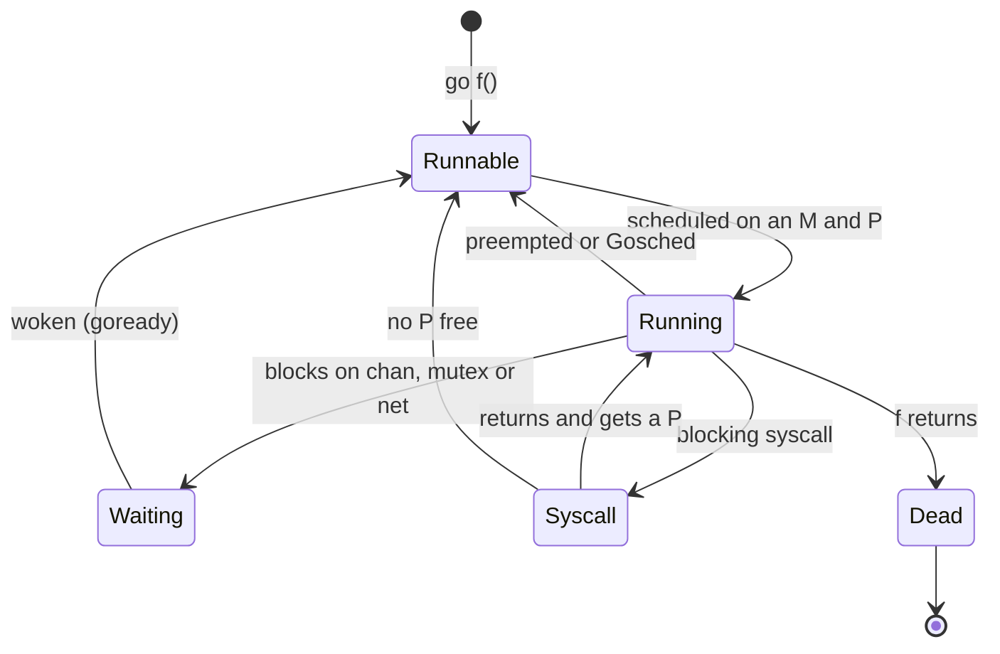
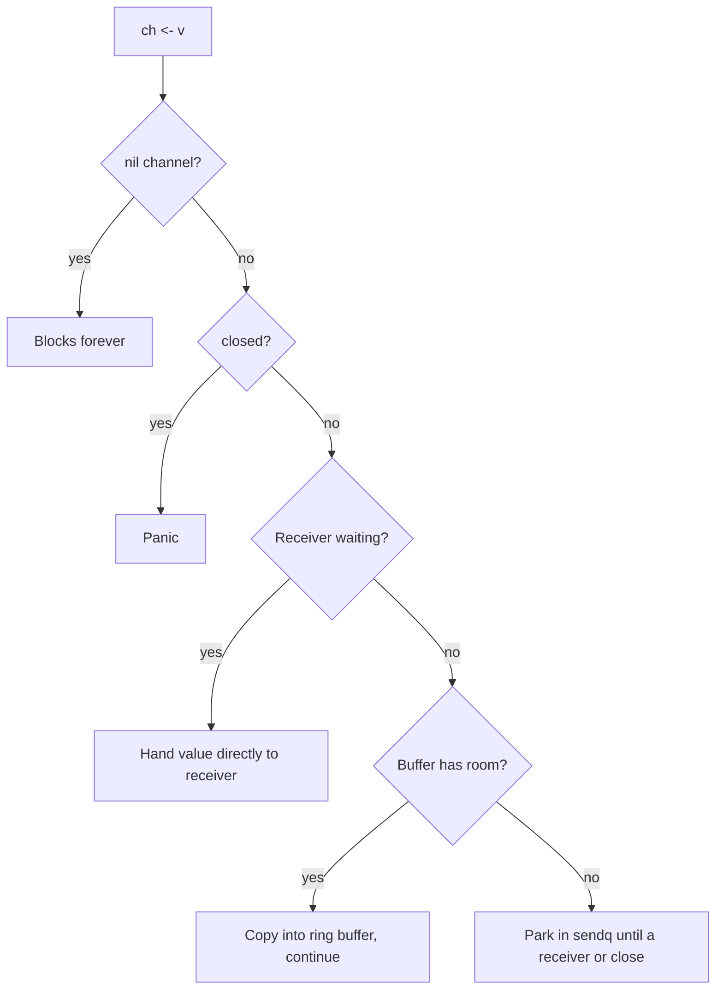
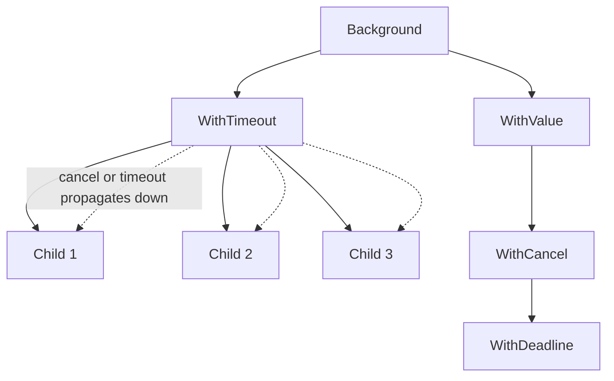
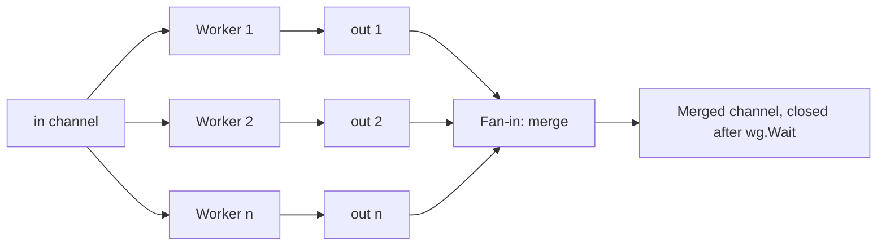
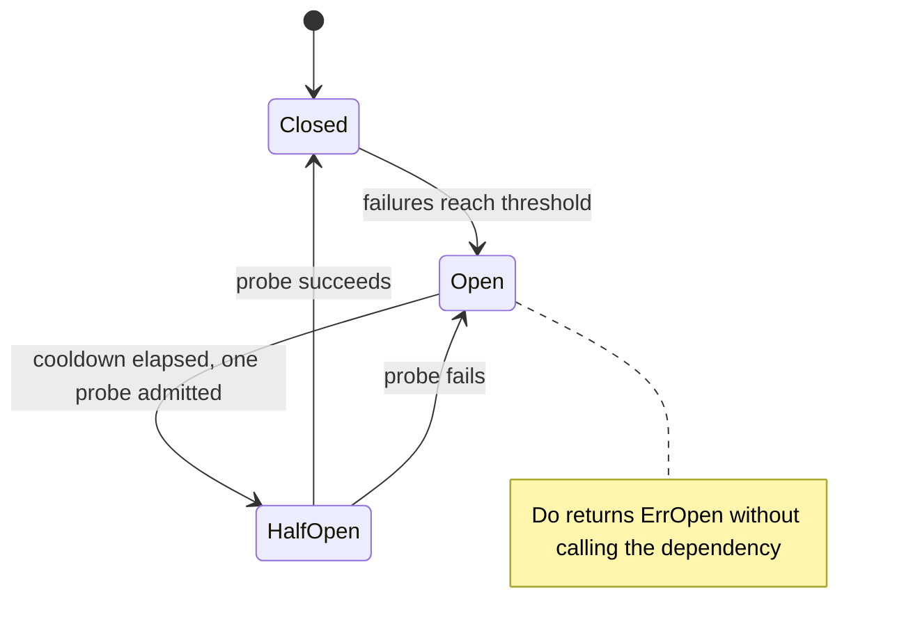

# 🦦 Go Concurrency & Multithreading — Practical Notes

> **A hands-on guide to writing concurrent Go code: goroutines, channels, synchronization, and production patterns**
> *From basics to staff-level depth. Current as of Go 1.27 (August 2026); version-specific behaviour is tagged, e.g. (Go 1.25+). Code assumes a module with `go 1.22` or later in `go.mod` (per-iteration loop variables).*

---

## Table of Contents

1. [Concurrency vs Parallelism vs Multithreading](#1-concurrency-vs-parallelism-vs-multithreading)
2. [Goroutines — The Lightweight Thread](#2-goroutines-the-lightweight-thread)
3. [Channels — Communicating Between Goroutines](#3-channels-communicating-between-goroutines)
4. [Moving Data Through Channels](#4-moving-data-through-channels)
5. [Structs and Channels](#5-structs-and-channels)
6. [The Select Statement](#6-the-select-statement)
7. [Synchronization Primitives](#7-synchronization-primitives)
8. [sync/atomic — Lock-Free Operations](#8-syncatomic-lock-free-operations)
9. [Context — Cancellation & Deadlines](#9-context-cancellation-deadlines)
10. [Production Concurrency Patterns](#10-production-concurrency-patterns)
11. [Common Pitfalls & Debugging](#11-common-pitfalls-debugging)
12. [Concurrency & Parallelism Interview Questions](#12-concurrency-parallelism-interview-questions)

---

## 1. Concurrency vs Parallelism vs Multithreading

### Definitions

**Concurrency** is a property of program *structure*: independently executing tasks that may overlap in time. **Parallelism** is a property of *execution*: tasks literally running at the same instant on different cores. Rob Pike: "Concurrency is about dealing with lots of things at once. Parallelism is about doing lots of things at once." In Go you write concurrent code with goroutines. The runtime turns it into parallel execution on up to `GOMAXPROCS` cores.

```go
// ── CONCURRENCY: the design ─────────────────────────────────
go handle(conn) // many in-flight tasks, interleaved; works on one core too

// ── PARALLELISM: the execution ─────────────────────────────
// At most GOMAXPROCS goroutines run Go code simultaneously.
// Default (Go 1.25+): number of usable CPUs, lowered to the container's
// cgroup CPU limit on Linux, and re-checked periodically.
// Before 1.25 the default ignored container limits, a common cause of CPU throttling.
fmt.Println(runtime.GOMAXPROCS(0)) // 0 = query without changing

// ── MULTITHREADING: the mechanism ───────────────────────────
// M:N scheduling: many goroutines (G) multiplexed onto a few OS threads (M);
// a thread needs a P (one per GOMAXPROCS) to run Go code.
//
//   G G G G G   ← goroutines (cheap, millions possible)
//   P P P P     ← GOMAXPROCS scheduling contexts, each with a run queue
//   M M M M M   ← OS threads (extra ones exist while blocked in syscalls)
```

### Go's Approach

| Concept | OS thread | Goroutine |
|---------|---------------|----|
| Stack | Fixed, reserved up front (commonly 8 MB on Linux, 512 KB–1 MB elsewhere) | Starts at 2 KB, grows and shrinks by copying (max 1 GB on 64-bit) |
| Creation | Syscall (`clone`), roughly 10 µs | User-space, well under 1 µs |
| Context switch | Kernel, roughly 1–2 µs plus cache effects | User-space, roughly 100–200 ns |
| Communication | Shared memory + locks | Channels and `sync` (both are idiomatic) |
| Scheduler | Kernel, preemptive, priorities | Go runtime: work-stealing, async preemption every 10 ms, no priorities |

The numbers are orders of magnitude and vary by hardware. The point is the ratio: you can afford a goroutine per connection, but not a thread per connection.

### When to Use What

| Workload | Approach |
|---|---|
| I/O-bound (network, DB) | A goroutine per request or connection is fine: blocked goroutines cost only memory. Bound fan-out to *downstream* services with a semaphore or `errgroup.SetLimit` |
| CPU-bound | About `GOMAXPROCS` workers. More goroutines than cores adds scheduling overhead with no extra throughput |
| Blocking syscalls / cgo / file I/O | Bound concurrency: each blocked call holds an OS thread (default max 10,000 threads) |
| Producer/consumer with bursts | Buffered channel sized to the measured burst |
| Shared state with simple updates | `sync.Mutex` or atomics, not a goroutine plus channel |

---

## 2. Goroutines — The Lightweight Thread

### Creating Goroutines

```go
// ── Basic goroutine ─────────────────────────────────────────
go fmt.Println("Hello from goroutine") // arguments are evaluated NOW, in the caller

// ── Anonymous function ──────────────────────────────────────
go func() {
    result := expensiveComputation()
    fmt.Println("Result:", result)
}()

// ── Goroutines you wait for (Go 1.25+: WaitGroup.Go) ────────
var wg sync.WaitGroup
for i := range 10 {          // Go 1.22+: i is a new variable each iteration,
    wg.Go(func() {           // so capturing it is safe (no `i := i`, no parameter)
        fmt.Printf("Worker %d starting\n", i)
        time.Sleep(time.Second)
    })
}
wg.Wait()

// Pre-1.25 equivalent:
//   wg.Add(1)                  // BEFORE the go statement
//   go func() { defer wg.Done(); work(i) }()
```

If you need the first error, cancellation of the others, or a concurrency limit, use `golang.org/x/sync/errgroup` (`g.Go`, `g.Wait`, `g.SetLimit(n)`), not a bare WaitGroup.

### Goroutine Lifecycle

```
            go f()
 _Gidle ──────────► _Grunnable ◄──────────────────────────┐
                        │  scheduled on an M+P              │ woken (goready)
                        ▼                                   │
                    _Grunning ── blocks on chan/mutex/net ─► _Gwaiting
                     │  │  │
                     │  │  └── preempted / Gosched ───────► _Grunnable
                     │  ▼
                     │ _Gsyscall ── returns, gets a P ───► _Grunning
                     │            ── no P free ───────────► _Grunnable
                     ▼
                  f returns ─► _Gdead (struct cached for reuse)
```

*Goroutine states: it becomes runnable on `go f()`, runs on an M+P, parks while waiting, and the struct is cached for reuse when `f` returns.*



### Key Properties

```go
// 1. Stack starts at 2 KB (since Go 1.19 the initial size adapts to the
//    average stack use seen so far) and grows by copying, up to 1 GB on 64-bit.
//    → 100K goroutines ≈ a few hundred MB at most; fine for most servers.

// 2. Goroutines are NOT garbage collected.
//    A goroutine blocked forever keeps its stack AND everything reachable
//    from it alive. It's a leak until the process exits.

// 3. Goroutines share the address space.
//    → Data races are possible; synchronize with channels, sync, or atomics.

// 4. No handle, no return value, no ID, no way to kill one from outside.
//    → Results come back via channels / shared memory; stopping is
//      cooperative via context cancellation.

// 5. An unrecovered panic in ANY goroutine crashes the whole process.
//    → Recover at goroutine boundaries you own (worker loops, handlers).
```

### Goroutine Leaks — The #1 Mistake

```go
// 🔴 LEAK: sender blocks forever when nobody receives
func leak() int {
    ch := make(chan int) // unbuffered
    go func() {
        ch <- compute() // blocks forever if the caller returns early
    }()
    select {
    case v := <-ch:
        return v
    case <-time.After(time.Second):
        return -1 // caller gave up → sender is stuck for good
    }
}

// ✅ FIX: buffer of 1, so the send always completes even if nobody reads
func noLeak() int {
    ch := make(chan int, 1)
    go func() { ch <- compute() }()
    select {
    case v := <-ch:
        return v
    case <-time.After(time.Second):
        return -1 // goroutine finishes and is collected
    }
}
// (Better still: pass a ctx into compute so the work itself stops.)

// 🔴 LEAK: ranging over a channel that is never closed
func leakReader() {
    ch := make(chan int)
    go func() {
        for v := range ch { // waits forever after the last value
            fmt.Println(v)
        }
    }()
    ch <- 1
}

// ✅ FIX: the sender closes when done (and/or the reader also selects on ctx.Done())
func noLeakReader() {
    ch := make(chan int)
    done := make(chan struct{})
    go func() {
        defer close(done)
        for v := range ch {
            fmt.Println(v)
        }
    }()
    ch <- 1
    close(ch) // range ends after draining
    <-done    // optional: wait for the reader to finish
}
```

Finding leaks: the goroutine count over time (`runtime.NumGoroutine`, `/sched/goroutines:goroutines`), `pprof` `goroutine?debug=1` grouped by stack, `go.uber.org/goleak` in tests, and *(Go 1.27)* the **`goroutineleak` profile** (`/debug/pprof/goroutineleak`). That profile uses the GC to report goroutines blocked on channels or locks that no runnable goroutine can still reach.

---

## 3. Channels — Communicating Between Goroutines

### Channel Anatomy

```go
// ── Channel internals (runtime/chan.go) ────────────────────
//
// type hchan struct {
//     qcount   uint           // Elements in buffer
//     dataqsiz uint           // Buffer capacity (0 = unbuffered)
//     buf      unsafe.Pointer // Circular buffer
//     elemsize uint16         // Element size
//     closed   uint32         // 0 = open, 1 = closed
//     timer    *timer         // Go 1.23+: set for time.Timer/Ticker channels
//     elemtype *_type
//     sendx    uint           // Send index in circular buffer
//     recvx    uint           // Receive index in circular buffer
//     recvq    waitq          // Goroutines blocked on receive
//     sendq    waitq          // Goroutines blocked on send
//     lock     mutex          // Protects the channel
// }

// ── Creating channels ───────────────────────────────────────

// Unbuffered: synchronous — send blocks until someone receives
unbuf := make(chan int)

// Buffered: asynchronous — send blocks only when buffer is full
buf := make(chan int, 100)

// Directional channels (compile-time enforced):
var sendOnly chan<- int  // Can only send
var recvOnly <-chan int  // Can only receive

// Bidirectional converts implicitly to either direction:
ch := make(chan int)
var out chan<- int = ch  // OK
var in <-chan int = ch   // OK
// The reverse is a compile error: you can't turn `in` back into a chan int.
// (make(chan<- int) compiles, but a send-only channel nobody can receive from is useless.)
```

### Channel Operations

```go
// ── SEND ────────────────────────────────────────────────────
ch <- value  // Unbuffered: blocks until a receiver takes it
             // Buffered:   blocks only while the buffer is full
             // nil channel: blocks forever
             // closed channel: PANICS

// ── RECEIVE ─────────────────────────────────────────────────
value := <-ch         // Blocks until data available (nil channel: forever)
value, ok := <-ch     // ok == false only when the channel is closed AND drained

// ── CLOSE ───────────────────────────────────────────────────
close(ch)  // Panics if already closed (or nil)
// After close: buffered values are still delivered, then receives return
// the zero value immediately with ok == false; sends panic.
// len(ch) / cap(ch) report buffered count / capacity (racy snapshot, for metrics only).

// ── NIL CHANNEL ─────────────────────────────────────────────
var ch chan int  // nil
ch <- 1          // Blocks FOREVER (handy in select: disable cases)
<-ch             // Blocks FOREVER
close(ch)        // PANIC: close of nil channel
```

*What a send or receive does depends on channel state: a nil channel blocks forever, a closed one panics on send, and an unbuffered one needs a partner.*



### Channel Types

```go
// ── UNBUFFERED CHANNEL (synchronous) ───────────────────────
// Use: guaranteed synchronization, rendezvous
func unbuffered() {
    ch := make(chan int)
    
    go func() {
        ch <- 42  // Will block until main goroutine receives
        fmt.Println("Sent!") // runs only after the receiver has taken the value
    }()
    
    time.Sleep(time.Second) // Simulate work
    val := <-ch             // Unblocks the sender
    fmt.Println("Received:", val)
}

// ── BUFFERED CHANNEL (asynchronous) ─────────────────────────
// Use: decouple sender/receiver, burst handling, bounded queues
func buffered() {
    ch := make(chan int, 3)
    
    ch <- 1  // No block (buffer: [1, _, _])
    ch <- 2  // No block (buffer: [1, 2, _])
    ch <- 3  // No block (buffer: [1, 2, 3])
    // ch <- 4  // BLOCK (buffer full)
    
    fmt.Println(<-ch) // 1 (buffer: [_, 2, 3])
    fmt.Println(<-ch) // 2
    fmt.Println(<-ch) // 3
}

// ── CHANNEL OF CHANNELS (multiplexing) ──────────────────────
// Use: reply channels, RPC patterns
type Request struct {
    Data   string
    RespCh chan Response
}

func handler(requests <-chan Request) {
    for req := range requests {
        result := process(req.Data)
        req.RespCh <- Response{Result: result}
    }
}

// ── ZERO-SIZE CHANNEL (signaling only) ──────────────────────
// Use: signal events (no data needed)
var done = make(chan struct{}) // struct{} is zero bytes
// close(done) signals — all receivers get zero value immediately
```

---

## 4. Moving Data Through Channels

### Basic Data Flow

```go
// ── One producer, one consumer ──────────────────────────────
func produce(ctx context.Context, out chan<- int) {
    defer close(out)
    for i := 0; i < 10; i++ {
        select {
        case out <- i:
        case <-ctx.Done():
            return
        }
    }
}

func consume(ctx context.Context, in <-chan int) {
    for v := range in {
        fmt.Println("Got:", v)
    }
}

// ── Multiple producers, single consumer ─────────────────────
func merge(ctx context.Context, producers ...<-chan int) <-chan int {
    out := make(chan int)
    var wg sync.WaitGroup
    
    // Start a goroutine for each producer
    for _, p := range producers {
        wg.Add(1)
        go func(ch <-chan int) {
            defer wg.Done()
            for v := range ch {
                select {
                case out <- v:
                case <-ctx.Done():
                    return
                }
            }
        }(p)
    }
    
    // Close output when all producers are done
    go func() {
        wg.Wait()
        close(out)
    }()
    
    return out
}

// ── Single producer, multiple consumers ─────────────────────
func distribute(ctx context.Context, in <-chan int, n int) []<-chan int {
    channels := make([]<-chan int, n)
    for i := 0; i < n; i++ {
        ch := make(chan int)
        channels[i] = ch
        go func(out chan<- int) {
            defer close(out)
            for v := range in {
                select {
                case out <- v:
                case <-ctx.Done():
                    return
                }
            }
        }(ch)
    }
    return channels
}
```

### Channel Direction for Data Flow

```go
// ── Using function signatures to enforce data flow ─────────

// Producer: can only SEND
func gen(ctx context.Context) <-chan int {
    out := make(chan int)
    go func() {
        defer close(out)
        for i := 0; i < 100; i++ {
            select {
            case out <- i:
            case <-ctx.Done():
                return
            }
        }
    }()
    return out
}

// Transformer: receives, processes, sends
func square(ctx context.Context, in <-chan int) <-chan int {
    out := make(chan int)
    go func() {
        defer close(out)
        for v := range in {
            select {
            case out <- v * v:
            case <-ctx.Done():
                return
            }
        }
    }()
    return out
}

// Consumer: can only RECEIVE
func sink(ctx context.Context, in <-chan int) {
    for v := range in {
        fmt.Println(v)
    }
}
```

### Closing Channels — Rules & Patterns

```go
// ── RULE: The sender closes, never the receiver ─────────────
// Closing means "no more values". Only the side that knows that (the sender)
// can close safely; a receiver closing would make a still-running sender panic.
// Many senders → a coordinator closes after ALL of them finish (wg.Wait(); close(ch)).
// You don't HAVE to close: an unreachable channel is garbage-collected. Close
// only when receivers need the "done" signal (range loops, broadcast).

// ── PATTERN: Deferred close ─────────────────────────────────
func producer(out chan<- int) {
    defer close(out) // Always close when done
    for i := 0; i < 10; i++ {
        out <- i
    }
}

// ── PATTERN: Closing with sync.Once ─────────────────────────
// For multiple goroutines that might close the same channel
type SafeClose struct {
    once sync.Once
    ch   chan struct{}
}

func (s *SafeClose) Close() {
    s.once.Do(func() {
        close(s.ch)
    })
}

// ── PATTERN: "close once" with many potential closers ───────
// If several goroutines might close, that's usually a design smell: prefer ONE
// owner, or signal with a context instead. The Once above is the fallback.
// (Merging channels with the nil-channel trick is shown in Section 6.)
```

### Ring Buffer Channel (Bounded Queue)

A buffered channel **already is** a bounded FIFO ring buffer, safe for many senders and receivers. When full, it blocks the sender (backpressure). Build your own only when you need *different* full-buffer behaviour. The common case is **drop-oldest**: telemetry, "latest N events", UI updates.

```go
// Drop-oldest ring: Push never blocks; when full it overwrites the oldest item.
type Ring[T any] struct {
    mu      sync.Mutex
    buf     []T
    head, n int // index of oldest item, number of items
    dropped int
}

func NewRing[T any](capacity int) *Ring[T] { return &Ring[T]{buf: make([]T, capacity)} }

func (r *Ring[T]) Push(v T) {
    r.mu.Lock()
    defer r.mu.Unlock()
    if r.n == len(r.buf) { // full: overwrite oldest, advance head
        r.buf[r.head] = v
        r.head = (r.head + 1) % len(r.buf)
        r.dropped++
        return
    }
    r.buf[(r.head+r.n)%len(r.buf)] = v
    r.n++
}

func (r *Ring[T]) Pop() (T, bool) {
    r.mu.Lock()
    defer r.mu.Unlock()
    var zero T
    if r.n == 0 {
        return zero, false
    }
    v := r.buf[r.head]
    r.buf[r.head] = zero // don't keep a reference alive for the GC
    r.head = (r.head + 1) % len(r.buf)
    r.n--
    return v, true
}

// Push 1..5 into NewRing[int](3), then Pop until empty → 3 4 5 (dropped = 2)
```

A "drop-newest" policy is even simpler with a plain channel:

```go
select {
case ch <- v:
default:
    droppedTotal.Add(1) // buffer full: shed load instead of blocking
}
```

---

## 5. Structs and Channels

### Channels of Structs

```go
// ── Passing structured data through channels ────────────────
type Task struct {
    ID      int
    Payload string
    Priority int
    Created time.Time
}

type Result struct {
    TaskID   int
    Output   string
    Duration time.Duration
    Err      error
}

// Producer sends Tasks
func taskProducer(ctx context.Context, tasks []Task) <-chan Task {
    out := make(chan Task, len(tasks))
    go func() {
        defer close(out)
        for _, t := range tasks {
            select {
            case out <- t:
            case <-ctx.Done():
                return
            }
        }
    }()
    return out
}

// Worker receives Tasks, sends Results
func worker(ctx context.Context, id int, tasks <-chan Task, results chan<- Result) {
    for task := range tasks {
        start := time.Now()
        
        // Process task
        output, err := processTask(task)
        
        select {
        case results <- Result{
            TaskID:   task.ID,
            Output:   output,
            Duration: time.Since(start),
            Err:      err,
        }:
        case <-ctx.Done():
            return
        }
    }
}
```

### Structs Containing Channels

```go
// ── Worker pool using struct with embedded channels ─────────
type Worker struct {
    ID       int
    JobQueue chan Job
    Quit     chan struct{}
}

func NewWorker(id int) *Worker {
    return &Worker{
        ID:       id,
        JobQueue: make(chan Job),
        Quit:     make(chan struct{}),
    }
}

func (w *Worker) Start(ctx context.Context, results chan<- Result) {
    go func() {
        defer fmt.Printf("Worker %d stopped\n", w.ID)
        for {
            select {
            case job := <-w.JobQueue:
                result := w.execute(job)
                select {
                case results <- result:
                case <-ctx.Done():
                    return
                }
            case <-w.Quit:
                return
            case <-ctx.Done():
                return
            }
        }
    }()
}

func (w *Worker) Stop() {
    close(w.Quit)
}

func (w *Worker) execute(job Job) Result {
    // ... process job
    return Result{TaskID: job.ID, Output: fmt.Sprintf("done by worker %d", w.ID)}
}

// ── Dispatcher manages the pool ─────────────────────────────
type Dispatcher struct {
    workers   []*Worker
    jobQueue  chan Job
    results   chan Result
    maxWorkers int
}

func NewDispatcher(maxWorkers int) *Dispatcher {
    return &Dispatcher{
        workers:    make([]*Worker, maxWorkers),
        jobQueue:   make(chan Job, 100),
        results:    make(chan Result, 100),
        maxWorkers: maxWorkers,
    }
}

func (d *Dispatcher) Start(ctx context.Context) {
    for i := 0; i < d.maxWorkers; i++ {
        worker := NewWorker(i)
        worker.Start(ctx, d.results)
        d.workers[i] = worker
    }
    
    // Distribute jobs to workers
    go func() {
        for job := range d.jobQueue {
            // Static assignment by ID: simple, but one slow job blocks every
            // later job routed to the same worker (head-of-line blocking).
            worker := d.workers[job.ID%d.maxWorkers]
            select {
            case worker.JobQueue <- job:
            case <-ctx.Done():
                return
            }
        }
    }()
}

// Channel as struct field — advanced patterns
type Service struct {
    // Request channel — external callers send here
    requestCh chan Request
    
    // Internal channels
    stopCh    chan struct{}
    readyCh   chan struct{}
    
    // State
    lastValue string
    client    *http.Client
}

func NewService() *Service {
    s := &Service{
        requestCh: make(chan Request, 10),
        stopCh:    make(chan struct{}),
        readyCh:   make(chan struct{}),
        client:    &http.Client{Timeout: 5 * time.Second},
    }
    go s.loop()
    return s
}

func (s *Service) loop() {
    // ... initialization that must finish before requests are served ...
    close(s.readyCh) // signal readiness to every WaitReady caller at once
    
    for {
        select {
        case req := <-s.requestCh:
            s.handleRequest(req)
        case <-s.stopCh:
            return
        }
    }
}

func (s *Service) Handle(ctx context.Context, req Request) error {
    select {
    case s.requestCh <- req:
        return nil
    case <-s.stopCh: // without this, callers block forever after Stop
        return errors.New("service stopped")
    case <-ctx.Done():
        return ctx.Err()
    }
}

func (s *Service) WaitReady() {
    <-s.readyCh
}

func (s *Service) Stop() {
    close(s.stopCh)
}
```

**Design note:** per-worker queues plus a dispatcher are rarely better than the simplest pool: N workers all ranging over **one shared** `jobs` channel. The runtime then hands each job to whichever worker is free, with no head-of-line blocking and no dispatcher goroutine (see [Worker Pool](#worker-pool)). Use per-worker queues only when a job *must* go to a particular worker, for example to keep per-key ordering. Shard by key then, not by round-robin.

### Immutable Structs Through Channels

```go
// ── Immutable state by passing snapshots through channels ───

// State is private to the owning goroutine
type CounterState struct {
    value    int64
    lastUpdated time.Time
}

func (c CounterState) Value() int64 {
    return c.value
}

// Operations are commands passed through channels
type CounterCommand interface {
    Apply(CounterState) CounterState
}

type Increment struct{}
func (Increment) Apply(s CounterState) CounterState {
    s.value++
    s.lastUpdated = time.Now()
    return s
}

type Add struct {
    N int64
}
func (a Add) Apply(s CounterState) CounterState {
    s.value += a.N
    s.lastUpdated = time.Now()
    return s
}

type Reset struct{}
func (Reset) Apply(s CounterState) CounterState {
    s.value = 0
    s.lastUpdated = time.Now()
    return s
}

// Counter actor — state encapsulated in goroutine
type Counter struct {
    commands chan CounterCommand
    queries  chan chan int64
}

func NewCounter(initial int64) *Counter {
    c := &Counter{
        commands: make(chan CounterCommand, 100),
        queries:  make(chan chan int64),
    }
    go c.run(CounterState{
        value:       initial,
        lastUpdated: time.Now(),
    })
    return c
}

func (c *Counter) run(state CounterState) {
    for {
        select {
        case cmd := <-c.commands:
            state = cmd.Apply(state) // New state, old state discarded
        case resp := <-c.queries:
            resp <- state.Value()
        }
    }
    // Production version: add `case <-ctx.Done(): return` so the actor can be
    // stopped; as written, this goroutine lives for the life of the process.
}

func (c *Counter) Increment() {
    c.commands <- Increment{}
}

func (c *Counter) Add(n int64) {
    c.commands <- Add{N: n}
}

func (c *Counter) Value() int64 {
    resp := make(chan int64)
    c.queries <- resp
    return <-resp
}
```

Trade-off: the actor style removes locks from *your* code, but every operation goes through a channel, and every query is a round trip with a goroutine switch. On one Apple M5 machine with Go 1.27 and 10 goroutines contending, the costs per operation were: actor increment about 127 ns, actor `Value()` about 267 ns (plus one allocation for the reply channel), mutex increment about 77 ns, `atomic.Int64.Add` about 35 ns. Use an actor when the state is complex and the operations are coarse, or when you need ordering and serialization, not for a counter.

---

## 6. The Select Statement

### Basic Patterns

```go
// ── Basic select — wait for either channel ──────────────────
select {
case v := <-ch1:
    fmt.Println("Got from ch1:", v)
case v := <-ch2:
    fmt.Println("Got from ch2:", v)
}

// ── Select with default — non-blocking ──────────────────────
select {
case v := <-ch:
    fmt.Println("Got:", v)
default:
    fmt.Println("No data available, moving on")
}

// ── Select with timeout ─────────────────────────────────────
select {
case v := <-ch:
    fmt.Println("Got:", v)
case <-time.After(5 * time.Second): // fine for a one-off wait; Go 1.23+ collects the
    fmt.Println("Timeout waiting for data") // timer once unreferenced, even if it never fired
}
// Usually better: a ctx with a deadline, so the timeout propagates to callees too.

// ── Rules worth knowing ─────────────────────────────────────
// • If several cases are ready, one is chosen uniformly at random (no priority,
//   no source order); this prevents starvation.
// • All channel expressions and send values are evaluated ONCE, on entry,
//   even for cases that aren't chosen.
// • select {} blocks forever; a select with only nil channels and no default too.

// ── Select with send and receive ────────────────────────────
select {
case ch <- value:
    fmt.Println("Sent to channel")
case v := <-ch:
    fmt.Println("Received from channel")
case <-ctx.Done():
    fmt.Println("Cancelled:", ctx.Err())
}
```

### The Nil Channel Trick

```go
// ── Dynamically enable/disable select cases ─────────────────
//
// A nil channel is NEVER chosen in select.
// So setting a channel to nil "disables" that case.

func merge(ctx context.Context, ch1, ch2 <-chan int) <-chan int {
    out := make(chan int)
    go func() {
        defer close(out)
        
        // Both channels alive initially
        for ch1 != nil || ch2 != nil {
            select {
            case v, ok := <-ch1:
                if !ok {
                    ch1 = nil // Disable this case
                    continue
                }
                select {
                case out <- v:
                case <-ctx.Done():
                    return
                }
            case v, ok := <-ch2:
                if !ok {
                    ch2 = nil // Disable this case
                    continue
                }
                select {
                case out <- v:
                case <-ctx.Done():
                    return
                }
            case <-ctx.Done():
                return
            }
        }
    }()
    return out
}
```

### Priority Select

```go
// ── Simulate priority: prefer one channel over another ──────

func prioritySelect(ctx context.Context, high, low <-chan int) <-chan int {
    out := make(chan int)
    go func() {
        defer close(out)
        for {
            select {
            case v := <-high:
                // Process high priority immediately
                select {
                case out <- v:
                case <-ctx.Done():
                    return
                }
            default:
                // No high priority — try low
                select {
                case v := <-high: // both ready → random pick, so this is
                                  // best-effort priority, not strict
                    select {
                    case out <- v:
                    case <-ctx.Done():
                        return
                    }
                case v := <-low:
                    select {
                    case out <- v:
                    case <-ctx.Done():
                        return
                    }
                case <-ctx.Done():
                    return
                }
            }
        }
    }()
    return out
}
```

---

## 7. Synchronization Primitives

### sync.WaitGroup

```go
// ── WaitGroup: wait for a known set of goroutines ───────────
func processBatch(items []Item) []Result {
    results := make([]Result, len(items)) // each goroutine writes its own index: no lock needed
    var wg sync.WaitGroup
    for i, it := range items {
        wg.Go(func() { results[i] = process(it) }) // Go 1.25+; i and it are per-iteration (1.22+)
    }
    wg.Wait()
    return results
}

// ── Pre-1.25 form and its classic bug ───────────────────────
func bad(wg *sync.WaitGroup) {
    // 🔴 Add inside the goroutine: Wait may run before Add and return early
    go func() {
        wg.Add(1)
        defer wg.Done()
        doWork()
    }()
}

func good(wg *sync.WaitGroup) {
    // ✅ Add before the go statement (or just use wg.Go)
    wg.Add(1)
    go func() {
        defer wg.Done()
        doWork()
    }()
}
// go vet's `waitgroup` analyzer (Go 1.25) reports the bad form.

// ── Collecting errors ───────────────────────────────────────
// All errors: a mutex-protected slice, then errors.Join (Go 1.20).
func parallelWork(items []string) error {
    var (
        wg   sync.WaitGroup
        mu   sync.Mutex
        errs []error
    )
    for _, item := range items {
        wg.Go(func() {
            if err := processOne(item); err != nil {
                mu.Lock()
                errs = append(errs, fmt.Errorf("%s: %w", item, err))
                mu.Unlock()
            }
        })
    }
    wg.Wait()
    return errors.Join(errs...) // nil if errs is empty; errors.Is/As see every entry
}

// First error + cancel the rest + limit concurrency: errgroup.
func fetchAll(ctx context.Context, urls []string) error {
    g, ctx := errgroup.WithContext(ctx) // golang.org/x/sync/errgroup
    g.SetLimit(8)                       // at most 8 in flight
    for _, u := range urls {
        g.Go(func() error { return fetch(ctx, u) }) // ctx is cancelled on the first error
    }
    return g.Wait()
}
```

### sync.Mutex & sync.RWMutex

```go
// ── Mutex — mutual exclusion ────────────────────────────────
type SafeCounter struct {
    mu    sync.Mutex
    value int64
}

func (c *SafeCounter) Increment() {
    c.mu.Lock()
    c.value++  // Only one goroutine at a time
    c.mu.Unlock()
}

func (c *SafeCounter) Value() int64 {
    c.mu.Lock()
    defer c.mu.Unlock()
    return c.value
}

// ── RWMutex — reader/writer lock ────────────────────────────
type SafeCache struct {
    mu    sync.RWMutex
    data  map[string]any
}

func (c *SafeCache) Get(key string) any {
    c.mu.RLock()          // Multiple readers allowed
    defer c.mu.RUnlock()
    return c.data[key]
}

func (c *SafeCache) Set(key string, value any) {
    c.mu.Lock()           // Exclusive — no readers or writers
    defer c.mu.Unlock()
    c.data[key] = value
}

// RWMutex helps only when reads dominate AND hold the lock for a while.
// Every RLock/RUnlock is an atomic op on a shared counter, so with tiny
// critical sections on many cores a plain Mutex is often as fast or faster.
// Benchmark before choosing. Neither lock is reentrant: RLock while holding
// Lock (or Lock while holding RLock) on the same mutex deadlocks.

// ── Deadlock example ────────────────────────────────────────
// 🔴 BAD: lock ordering depends on argument order
type Account struct {
    ID      int64
    mu      sync.Mutex
    balance int64 // cents: never use float64 for money
}

func Transfer(a, b *Account, amount int64) {
    a.mu.Lock()
    defer a.mu.Unlock()
    b.mu.Lock()
    defer b.mu.Unlock()
    a.balance -= amount
    b.balance += amount
}
// Goroutine 1: Transfer(x, y, 100) holds x, wants y
// Goroutine 2: Transfer(y, x, 50)  holds y, wants x  → DEADLOCK
// (The runtime only reports deadlock when EVERY goroutine is blocked;
//  in a server the two just hang silently.)

// ✅ GOOD: a global lock order on a stable key
func SafeTransfer(a, b *Account, amount int64) {
    if a == b {
        return // locking the same mutex twice would self-deadlock
    }
    first, second := a, b
    if b.ID < a.ID {
        first, second = b, a
    }
    first.mu.Lock()
    defer first.mu.Unlock()
    second.mu.Lock()
    defer second.mu.Unlock()
    a.balance -= amount
    b.balance += amount
}
// Order by a stable ID, not by pointer address: addresses are stable for heap
// objects in today's runtime, but an ID is explicit and survives refactors.
```

**Mutex internals worth knowing:** a fast path that is one CAS. Then brief spinning on multicore. Then the goroutine parks on a runtime semaphore. If a waiter has waited more than 1 ms, the mutex enters **starvation mode** and hands ownership directly to the oldest waiter (FIFO), trading throughput for bounded tail latency. Don't copy a struct containing a `Mutex` after first use. `go vet`'s `copylocks` check catches most cases, such as value receivers and passing by value.

### sync.Once

```go
// ── Lazy init with an error: OnceValues (Go 1.21) ───────────
var getDB = sync.OnceValues(func() (*sql.DB, error) {
    db, err := sql.Open("pgx", os.Getenv("DATABASE_URL"))
    if err != nil {
        return nil, err
    }
    // sql.Open doesn't connect; Ping does. Note the error is cached FOREVER:
    // a transient failure at startup is never retried.
    return db, db.Ping()
})

func handler() {
    db, err := getDB() // first caller runs the func; everyone else waits, then reuses the result
    _ = db
    _ = err
}

// ── Classic form ────────────────────────────────────────────
type Singleton struct {
    once     sync.Once
    instance *ExpensiveDB
    err      error
}

func (s *Singleton) Get() (*ExpensiveDB, error) {
    s.once.Do(func() { s.instance, s.err = NewExpensiveDB() })
    return s.instance, s.err
}
// If f panics, Once considers it done (later calls do nothing); OnceFunc/OnceValue
// re-panic with the same value on every call. Calling once.Do from inside f deadlocks.
// If you need "retry until success", use a mutex + a done flag instead of Once.
```

### sync.Cond

```go
// ── Condition variable: wait until a predicate becomes true ─
type Queue struct {
    mu    sync.Mutex
    cond  *sync.Cond
    items []int
}

func NewQueue() *Queue {
    q := &Queue{}
    q.cond = sync.NewCond(&q.mu)
    return q
}

func (q *Queue) Enqueue(item int) {
    q.mu.Lock()
    q.items = append(q.items, item)
    q.mu.Unlock()
    q.cond.Signal() // wake one waiter (signalling after Unlock is allowed)
}

func (q *Queue) Dequeue() int {
    q.mu.Lock()
    defer q.mu.Unlock()
    for len(q.items) == 0 { // ALWAYS a loop: wake-ups can be spurious or stolen
        q.cond.Wait()       // atomically unlocks, sleeps, re-locks
    }
    item := q.items[0]
    q.items = q.items[1:]
    return item
}

// Broadcast wakes all waiters (state changes that every waiter must re-check).
```

`Cond` has two big limitations: `Wait` can't be combined with a timeout, `select`, or `ctx.Done()`, and missed signals are easy to cause. In most Go code, a channel (or a mutex plus a channel that is closed and replaced on each state change) is the better choice. `Cond` earns its place with many waiters and a rapidly changing predicate.

### sync.Pool

```go
// ── Object pool: reuse short-lived scratch objects ──────────
var bufferPool = sync.Pool{
    New: func() any { return new(bytes.Buffer) },
}

func render(data []byte) string {
    buf := bufferPool.Get().(*bytes.Buffer)
    buf.Reset()
    defer func() {
        if buf.Cap() <= 64<<10 { // don't let one huge request pin a huge buffer forever
            bufferPool.Put(buf)
        }
    }()
    buf.Write(data)
    // ... processing ...
    return buf.String() // String() copies, so it's safe to reuse buf afterwards
}
```

How it behaves:
- Per-P local caches make Get/Put nearly contention-free.
- Pooled objects are **dropped across GC cycles**: a victim cache keeps them for one more cycle. So a pool is a cache of *garbage*, not a resource pool. Never pool connections or files.
- Reset objects before reuse, and never use an object after `Put`: another goroutine may already own it.
- Put pointers (`*bytes.Buffer`), not values. Putting a slice or struct value boxes it into `any`, which allocates and defeats the purpose (staticcheck SA6002).
- Measure. For small objects the allocator is fast, and a pool adds complexity for little gain.

---

## 8. sync/atomic — Lock-Free Operations

### Atomic Types (Go 1.19+)

```go
// ── Atomic counter ──────────────────────────────────────────
var counter atomic.Int64

func increment() {
    counter.Add(1)
}

func value() int64 {
    return counter.Load()
}

// ── Atomic boolean (flag) ──────────────────────────────────
var ready atomic.Bool

func setReady() {
    ready.Store(true)
}

func isReady() bool {
    return ready.Load()
}

// ── Compare and swap (CAS): read-modify-write for logic Add can't express ──
var peak atomic.Int64

func recordPeak(v int64) {
    for {
        old := peak.Load()
        if v <= old || peak.CompareAndSwap(old, v) {
            return // not a new max, or we installed it
        }
        // CAS failed: another goroutine changed peak; reload and retry
    }
}
// (For plain increments use Add: one instruction, no retry loop.)

// ── Atomic pointer: lock-free reads of an immutable snapshot ──
type Config struct {
    mu  sync.Mutex // serializes WRITERS only (read-modify-write updates)
    cur atomic.Pointer[ConfigData]
}

func NewConfig(initial ConfigData) *Config {
    c := &Config{}
    c.cur.Store(&initial) // Load would return nil before the first Store
    return c
}

func (c *Config) Get() *ConfigData { return c.cur.Load() } // treat as read-only!

func (c *Config) Update(mutate func(*ConfigData)) {
    c.mu.Lock()
    defer c.mu.Unlock()
    next := *c.cur.Load() // copy (deep-copy any maps/slices you will modify)
    mutate(&next)
    c.cur.Store(&next) // readers see the old or the new snapshot, never a mix
}
```

### Lock-Free Data Structures

```go
// ── Lock-free stack (Treiber stack) ─────────────────────────
type LockFreeStack[T any] struct {
    top atomic.Pointer[node[T]]
}

type node[T any] struct {
    value T
    next  *node[T]
}

func (s *LockFreeStack[T]) Push(value T) {
    n := &node[T]{value: value}
    for {
        n.next = s.top.Load()
        if s.top.CompareAndSwap(n.next, n) {
            return
        }
        // CAS failed: top changed under us; retry
    }
}

func (s *LockFreeStack[T]) Pop() (T, bool) {
    for {
        old := s.top.Load()
        if old == nil {
            var zero T
            return zero, false // Empty
        }
        if s.top.CompareAndSwap(old, old.next) {
            return old.value, true
        }
        // CAS failed: retry
    }
}
```

Why this is safe in Go but subtle in C: the classic **ABA problem** is that a node is popped, freed and *reused at the same address* while another thread's CAS still holds the old pointer. That can't happen here, because the GC never frees or reuses a node while any goroutine holds a reference to it. Two other caveats: lock-free is not automatically faster, since under contention every failed CAS is wasted work and cache-line traffic. And a mutex-protected slice is often quicker and easier to make correct. Benchmark before choosing.

### Memory Ordering

```go
// ── Go's atomics are sequentially consistent (memory model, Go 1.19) ──
// All goroutines observe all atomic operations in one global order.
// x86-64: loads are plain MOV (TSO already gives acquire); stores use XCHG
//         (an implicit full fence), so atomic STORES are the expensive part.
// ARM64:  LDAR / STLR; read-modify-write uses LSE atomics (LDADDAL, CASAL)
//         when available.
// There are no relaxed/acquire-only variants in Go, by design.

// ── Happens-before with atomics ─────────────────────────────
var data atomic.Pointer[LargeData]

// Goroutine 1: writer
func writer() {
    d := computeExpensive()
    data.Store(&d) // Store happens BEFORE any Load that sees it
}

// Goroutine 2: reader
func reader() {
    d := data.Load()
    if d == nil {
        return // not published yet
    }
    fmt.Println(d.Value) // the Store is synchronized before this Load, so
                         // everything computeExpensive wrote is visible
}

// ── This is the "publication" pattern ───────────────────────
// atomic Store = publish (at least release semantics)
// atomic Load  = subscribe (at least acquire semantics)
// It also works with a plain atomic.Bool flag guarding ordinary writes, as
// long as nothing writes those fields after the flag is set.
```

---

## 9. Context — Cancellation & Deadlines

### Context Trees

```go
// ── Context hierarchy ───────────────────────────────────────
//                    background
//                        │
//                   ┌────┴────┐
//                   │         │
//               timeout    value
//                   │         │
//              ┌────┼────┐   │
//              │    │    │   │
//            sub1 sub2 sub3  └── withCancel
//              │                   │
//           value              withDeadline

// ── Parent cancels → all children cancel (never the reverse) ──
func handle(ctx context.Context) error {
    // The child's deadline is min(parent deadline, now+5s).
    childCtx, cancel := context.WithTimeout(ctx, 5*time.Second)
    defer cancel() // releases the timer and unlinks the child from the parent
    return process(childCtx)
}
```

Useful additions (Go 1.20–1.21): `WithCancelCause` / `context.Cause(ctx)` to record *why* something was cancelled. `WithTimeoutCause`. `AfterFunc(ctx, f)` runs `f` once ctx is done, without you spawning a watcher goroutine. `WithoutCancel(ctx)` keeps values but drops cancellation, for work that must outlive the request.

### Propagation Patterns

```go
// ── Propagate context through channel operations ────────────
func fetchData(ctx context.Context, url string) (<-chan Data, <-chan error) {
    dataCh := make(chan Data, 1)
    errCh := make(chan error, 1)
    
    go func() {
        defer close(dataCh)
        defer close(errCh)
        
        req, _ := http.NewRequestWithContext(ctx, "GET", url, nil)
        resp, err := http.DefaultClient.Do(req)
        if err != nil {
            errCh <- err
            return
        }
        defer resp.Body.Close()
        
        var data Data
        if err := json.NewDecoder(resp.Body).Decode(&data); err != nil {
            errCh <- err
            return
        }
        
        select {
        case dataCh <- data:
        case <-ctx.Done():
        }
    }()
    
    return dataCh, errCh
}

// ── Fan-out with context ────────────────────────────────────
func fanOutWithContext[T any](ctx context.Context, in <-chan T, workers int) []<-chan T {
    channels := make([]<-chan T, workers)
    
    for i := 0; i < workers; i++ {
        ch := make(chan T)
        channels[i] = ch
        
        go func(out chan<- T) {
            defer close(out)
            for {
                select {
                case val, ok := <-in:
                    if !ok {
                        return
                    }
                    select {
                    case out <- val:
                    case <-ctx.Done():
                        return
                    }
                case <-ctx.Done():
                    return
                }
            }
        }(ch)
    }
    
    return channels
}
```

### Graceful Shutdown with Context

```go
func main() {
    // ctx is cancelled on the first SIGINT/SIGTERM; stop() restores default
    // handling, so a second Ctrl-C kills the process immediately.
    ctx, stop := signal.NotifyContext(context.Background(), syscall.SIGINT, syscall.SIGTERM)
    defer stop()

    results := make(chan Result)
    var wg sync.WaitGroup
    for id := range 10 {
        wg.Go(func() { runWorker(ctx, id, results) }) // must return when ctx is done
    }
    go func() {
        wg.Wait()
        close(results) // only after every sender has exited
    }()

    for r := range results { // ends once all workers have stopped
        fmt.Println(r)
    }
    fmt.Println("shut down cleanly")
}
```

Put a time bound on the drain in real services: after cancellation, wait for `wg` with a deadline and exit anyway if it passes. In Kubernetes the kill (SIGKILL) arrives `terminationGracePeriodSeconds` after SIGTERM, 30 s by default.

*Context tree: cancelling a parent cancels every descendant, never the reverse, and a child's deadline is the earlier of its own and its parent's.*



---

## 10. Production Concurrency Patterns

### Worker Pool

```go
// ── Bounded concurrency, results in input order, fail fast ──
func WorkerPool[T, U any](ctx context.Context, jobs []T, workers int,
    process func(context.Context, T) (U, error)) ([]U, error) {
    ctx, cancel := context.WithCancelCause(ctx)
    defer cancel(nil)

    results := make([]U, len(jobs)) // each index written by exactly one worker: no lock
    idx := make(chan int)           // send INDEXES, so results keep input order
    var wg sync.WaitGroup
    for range max(1, min(workers, len(jobs))) {
        wg.Go(func() {
            for i := range idx {
                v, err := process(ctx, jobs[i])
                if err != nil {
                    cancel(err) // first error wins; stops the feeder and other workers
                    return
                }
                results[i] = v
            }
        })
    }
feed:
    for i := range jobs {
        select {
        case idx <- i:
        case <-ctx.Done():
            break feed // error or caller cancellation: stop handing out work
        }
    }
    close(idx)
    wg.Wait()
    if err := context.Cause(ctx); err != nil { // the worker's error, or the parent's ctx error
        return nil, err
    }
    return results, nil
}

// results, err := WorkerPool(ctx, []int{1, 2, 3, 4, 5}, 3, square) → [1 4 9 16 25] <nil>
// If any job fails: nil, <that job's error> (verified with go test -race)
```

The same thing with `errgroup`: `g, ctx := errgroup.WithContext(ctx)`, `g.SetLimit(workers)`, then `g.Go` per job writing to `results[i]`. It's shorter and well-tested, so prefer it in real code. Sizing: about `GOMAXPROCS` workers for CPU-bound jobs. For I/O-bound jobs, size by what the **downstream** can take (DB pool size, the partner API's rate limit), not by core count.

### Pipeline Pattern

```go
// ── A stage is a function from an input channel to an output channel ──
type Stage[T any] func(context.Context, <-chan T) <-chan T

func Compose[T any](stages ...Stage[T]) Stage[T] {
    return func(ctx context.Context, in <-chan T) <-chan T {
        for _, s := range stages {
            in = s(ctx, in) // each stage's output feeds the next
        }
        return in
    }
}

// MapStage lifts a plain function into a cancellable stage.
func MapStage[T any](f func(T) T) Stage[T] {
    return func(ctx context.Context, in <-chan T) <-chan T {
        out := make(chan T)
        go func() {
            defer close(out)
            for v := range in {
                select {
                case out <- f(v):
                case <-ctx.Done():
                    return
                }
            }
        }()
        return out
    }
}

func genNumbers(ctx context.Context, nums ...int) <-chan int {
    out := make(chan int)
    go func() {
        defer close(out)
        for _, n := range nums {
            select {
            case out <- n:
            case <-ctx.Done():
                return
            }
        }
    }()
    return out
}

// Usage:
// p := Compose(MapStage(func(n int) int { return n * 2 }),
//              MapStage(func(n int) int { return n + 1 }))
// for v := range p(ctx, genNumbers(ctx, 1, 2, 3)) { fmt.Print(v, " ") } // 3 5 7
```

Stages that change type (`int` → `string`) can't share one `Stage[T]` type in a slice. Compose them by plain function calls instead: `format(ctx, square(ctx, gen(ctx)))`. Pipeline costs: every hop is a channel operation plus a goroutine wake-up. For cheap per-item work, batch items (send `[]T`) or fuse stages, or the channel overhead dominates.

### Fan-Out / Fan-In

```go
// ── Fan-Out: Distribute work ────────────────────────────────
func fanOut[T any](in <-chan T, n int) []<-chan T {
    channels := make([]<-chan T, n)
    for i := 0; i < n; i++ {
        ch := make(chan T)
        channels[i] = ch
        go func(out chan<- T) {
            defer close(out)
            for v := range in {
                out <- v
            }
        }(ch)
    }
    return channels
}

// ── Fan-In: Merge results ───────────────────────────────────
func fanIn[T any](ctx context.Context, channels ...<-chan T) <-chan T {
    out := make(chan T)
    var wg sync.WaitGroup
    
    for _, ch := range channels {
        wg.Add(1)
        go func(c <-chan T) {
            defer wg.Done()
            for v := range c {
                select {
                case out <- v:
                case <-ctx.Done():
                    return
                }
            }
        }(ch)
    }
    
    go func() {
        wg.Wait()
        close(out)
    }()
    
    return out
}

// ── Full example ────────────────────────────────────────────
func processBatch(ctx context.Context, items []int, workers int) []int {
    // Stage 1: Source
    source := make(chan int, len(items))
    for _, v := range items {
        source <- v
    }
    close(source)
    
    // Stage 2: Fan out to workers
    pipelines := fanOut(source, workers)
    
    // Stage 3: Each worker doubles (could be any processing)
    double := MapStage(func(n int) int { return n * 2 })
    processed := make([]<-chan int, workers)
    for i, p := range pipelines {
        processed[i] = double(ctx, p)
    }
    
    // Stage 4: Fan in results
    merged := fanIn(ctx, processed...)
    
    // Collect all results (order is NOT preserved across workers)
    var results []int
    for v := range merged {
        results = append(results, v)
    }
    return results
}
```

`fanOut` here gives each worker its own channel. That is only needed when stages differ per worker. For identical workers, let them all `range` over the same input channel, and the runtime load-balances for free.

*Fan-out: workers share one input channel and each writes to its own output; fan-in merges the outputs and closes after all of them finish.*



### Tee (Split One Channel)

```go
// ── Duplicate every value to two consumers ─────────────────
func tee[T any](ctx context.Context, in <-chan T) (<-chan T, <-chan T) {
    out1, out2 := make(chan T), make(chan T)
    go func() {
        defer close(out1)
        defer close(out2)
        for val := range in {
            // Local copies of the channel variables, so each can be set to nil
            // (disabled) after its send without touching the real channels.
            o1, o2 := out1, out2
            for range 2 {
                select {
                case o1 <- val:
                    o1 = nil
                case o2 <- val:
                    o2 = nil
                case <-ctx.Done():
                    return
                }
            }
        }
    }()
    return out1, out2
}
```

The two consumers run in **lockstep**: the slower one throttles the faster one. Decouple them with buffered outputs, or with a per-consumer queue if their speeds differ a lot. If the values are pointers or contain slices or maps, both consumers share the underlying data. Copy it, or treat it as read-only.

### Circuit Breaker

```go
// ── Closed → Open after N CONSECUTIVE failures; after a cooldown, ONE probe
//    request (Half-Open) decides between Closed and Open again ──
var ErrOpen = errors.New("circuit open")

type State int

const (
    Closed State = iota
    Open
    HalfOpen
)

type Breaker struct {
    mu            sync.Mutex
    state         State
    failures      int // consecutive failures while Closed
    threshold     int
    cooldown      time.Duration
    openedAt      time.Time
    probeInFlight bool
    now           func() time.Time // injectable clock for tests
}

func NewBreaker(threshold int, cooldown time.Duration) *Breaker {
    return &Breaker{threshold: threshold, cooldown: cooldown, now: time.Now}
}

func (b *Breaker) Do(fn func() error) error {
    probe, err := b.admit()
    if err != nil {
        return err // fail fast: don't even try the dependency
    }
    err = fn() // NOT under the lock
    b.record(probe, err)
    return err
}

func (b *Breaker) admit() (probe bool, err error) {
    b.mu.Lock()
    defer b.mu.Unlock()
    switch b.state {
    case Open:
        if b.now().Sub(b.openedAt) < b.cooldown {
            return false, ErrOpen
        }
        b.state = HalfOpen
        fallthrough
    case HalfOpen:
        if b.probeInFlight { // exactly one trial request at a time
            return false, ErrOpen
        }
        b.probeInFlight = true
        return true, nil
    }
    return false, nil // Closed
}

func (b *Breaker) record(probe bool, err error) {
    b.mu.Lock()
    defer b.mu.Unlock()
    if probe {
        b.probeInFlight = false
        if err != nil {
            b.state, b.openedAt = Open, b.now() // still broken: another cooldown
        } else {
            b.state, b.failures = Closed, 0
        }
        return
    }
    if err == nil {
        b.failures = 0 // successes reset the streak
        return
    }
    if b.failures++; b.failures >= b.threshold && b.state == Closed {
        b.state, b.openedAt = Open, b.now()
    }
}

// threshold=2: Do(fail), Do(fail) → Open; Do(ok) → ErrOpen without calling ok.
// After the cooldown, Do(ok) runs as the probe → Closed. (Verified with a fake clock.)
```

Production points:
- Count only failures that indicate the **dependency** is unhealthy: timeouts, 5xx, connection errors. Not 4xx or `context.Canceled`.
- Many libraries use a failure *rate* over a sliding window with a minimum request count, rather than a consecutive streak. Good options: `sony/gobreaker` or a service mesh.
- One breaker per dependency (or per host), not one global breaker.
- Pair it with timeouts and retries that use backoff and jitter. The breaker stops retry storms from hammering a dependency that is already down.

*Circuit breaker: consecutive failures open it, after the cooldown one probe request decides between closing and re-opening.*



### Rate Limiter (Token Bucket)

```go
// ── Token bucket rate limiter using channels ────────────────
type RateLimiter struct {
    tokens chan struct{}
    ticker *time.Ticker
    closeCh chan struct{}
}

func NewRateLimiter(rate int, burst int) *RateLimiter {
    rl := &RateLimiter{
        tokens:  make(chan struct{}, burst),
        ticker:  time.NewTicker(time.Second / time.Duration(rate)),
        closeCh: make(chan struct{}),
    }
    
    // Fill bucket to capacity initially
    for i := 0; i < burst; i++ {
        rl.tokens <- struct{}{}
    }
    
    // Refill tokens
    go func() {
        for {
            select {
            case <-rl.ticker.C:
                select {
                case rl.tokens <- struct{}{}:
                default:
                    // Bucket full, discard
                }
            case <-rl.closeCh:
                rl.ticker.Stop()
                return
            }
        }
    }()
    
    return rl
}

func (rl *RateLimiter) Wait(ctx context.Context) error {
    select {
    case <-rl.tokens:
        return nil
    case <-ctx.Done():
        return ctx.Err()
    }
}

func (rl *RateLimiter) Close() {
    close(rl.closeCh)
}
```

This channel version is good for explaining the idea, but it has costs: a goroutine and a ticker per limiter, a granularity of one tick, and a divide-by-zero panic if `rate` is 0. In real code use `golang.org/x/time/rate`. It computes tokens lazily from timestamps, so it has no goroutine, and it offers `Allow()`, `Wait(ctx)` and `Reserve()`. Keep one limiter per client key (with eviction) for per-tenant limits. For limits across many instances you need shared state, such as Redis with a token bucket or GCRA in a Lua script.

---

## 11. Common Pitfalls & Debugging

### Pitfall Checklist

```go
// 🔴 1. Goroutine leaks (see Section 2)
//     → Every goroutine needs a guaranteed exit: closed input, ctx.Done(), or a buffered result slot.

// 🔴 2. Closing a channel twice / closing from the receiver
//     → One owner closes. sync.Once only as a last resort.

// 🔴 3. Sending on a closed channel → panic
//     → Senders must stop before close: wg.Wait() then close(ch).

// 🔴 4. Never closing a channel that receivers range over
//     → Receivers leak waiting for a close that never comes.

// 🔴 5. Inconsistent lock ordering → deadlock
//     → Global order by a stable key; hold one lock at a time where possible.

// 🔴 6. wg.Add inside the goroutine
//     → Use wg.Go (1.25) or Add before `go`. go vet's waitgroup check catches it.

// 🔴 7. Copying a struct that contains a Mutex / WaitGroup / atomic value
//     → Use pointer receivers on such types; go vet's copylocks check flags copies.
//     type Safe struct { mu sync.Mutex; n int }
//     func (s *Safe) Inc() { s.mu.Lock(); s.n++; s.mu.Unlock() } // ✅ pointer receiver

// 🔴 8. Forgetting cancel() from WithCancel/WithTimeout
//     → defer cancel() immediately; go vet's lostcancel check catches most cases.

// 🔴 9. Concurrent map access
//     → Built-in maps are not safe for concurrent writes. The runtime detects
//       some cases and dies with "fatal error: concurrent map writes", which
//       recover() can't catch. Use a mutex, sync.Map, or a sharded map.

// 🔴 10. Pre-1.22 loop-variable capture in goroutines
//     → In modules with `go 1.22`+ in go.mod each iteration has its own variable;
//       in older modules all goroutines may see the LAST value.

// 🔴 11. Idle timeout inside a loop
for {
    select {
    case v := <-ch:
        fmt.Println(v)
    case <-time.After(time.Second): // allocates a new timer every iteration
        fmt.Println("idle for 1s")
    }
}
// Since Go 1.23 this no longer LEAKS (unreferenced timers are collected
// before they fire), but it still allocates a timer per message on hot loops.

// ✅ Reuse one timer and reset it after each message.
idle := time.NewTimer(time.Second)
defer idle.Stop()
for {
    select {
    case v := <-ch:
        fmt.Println(v)
        idle.Reset(time.Second) // Go 1.23+: Reset never leaves a stale value in idle.C
    case <-idle.C:
        fmt.Println("idle for 1s")
        idle.Reset(time.Second)
    }
}
// Note: a Ticker is NOT a fix. It fires every second regardless of activity,
// which is a different behaviour from "no message for 1s".
```

### Debugging Tools

```go
// ── 1. Race detector ─────────────────────────────────────────
// go test -race ./...    go build -race    go run -race main.go
// Finds unsynchronized access that actually happens during the run.
// Cost (per Go docs): 5-10x memory, 2-20x execution time. Use in CI and
// tests; at most a small race-enabled canary in production.

// ── 2. Goroutine dumps ───────────────────────────────────────
// SIGQUIT (Ctrl+\) prints every goroutine's stack AND EXITS the process
// (GOTRACEBACK=all/system controls detail). For a live, non-fatal dump:
//   curl localhost:6060/debug/pprof/goroutine?debug=2   (net/http/pprof)
// Or programmatically:
func dumpGoroutines(w io.Writer) {
    pprof.Lookup("goroutine").WriteTo(w, 2) // runtime/pprof; debug=1 groups identical stacks
}

// ── 3. GODEBUG ───────────────────────────────────────────────
// GODEBUG=gctrace=1              one line per GC cycle
// GODEBUG=schedtrace=1000        scheduler summary every 1000 ms
// GODEBUG=schedtrace=1000,scheddetail=1   per-P/M/G detail

// ── 4. pprof (import _ "net/http/pprof", serve on an ADMIN port) ──
// go tool pprof http://localhost:6060/debug/pprof/goroutine
// go tool pprof http://localhost:6060/debug/pprof/heap
// go tool pprof http://localhost:6060/debug/pprof/profile?seconds=30   (CPU)
// go tool pprof http://localhost:6060/debug/pprof/block   (needs runtime.SetBlockProfileRate)
// go tool pprof http://localhost:6060/debug/pprof/mutex   (needs runtime.SetMutexProfileFraction)
// go tool pprof http://localhost:6060/debug/pprof/goroutineleak   (Go 1.27)

// ── 5. Execution tracer: scheduling latency, GC, blocking ────
// curl -o trace.out localhost:6060/debug/pprof/trace?seconds=5
// go tool trace trace.out
// Go 1.25: runtime/trace.FlightRecorder keeps the last few seconds in memory,
// so you can snapshot a trace right AFTER something rare goes wrong.

// ── 6. Channel occupancy ─────────────────────────────────────
// len(ch) and cap(ch) are built-ins; export len(ch)/cap(ch) as a gauge to
// spot a backed-up stage. (No reflection needed.)
```

---

## 12. Concurrency & Parallelism Interview Questions

### Beginner

<details>
<summary><b>Q1: What is the difference between concurrency and parallelism?</b></summary>

**Answer:** Concurrency is about dealing with many things at once (structuring a program as independently executing tasks). Parallelism is about doing many things at once (actually executing on multiple cores). Concurrency enables parallelism but is not required for it. A concurrent program can run on a single core by interleaving tasks, while parallelism requires multiple cores.

In Go: you design with concurrency (goroutines), the runtime and hardware provide parallelism if available.
</details>

<details>
<summary><b>Q2: How do you create a goroutine? What is the minimum stack size?</b></summary>

**Answer:** Use `go f()` or `go func() { ... }()`. The arguments are evaluated in the calling goroutine, right away. A goroutine starts with a 2 KB stack. Since Go 1.19 the starting size adapts to the program's average stack use. The stack grows and shrinks by copying, up to 1 GB on 64-bit. That is why hundreds of thousands of goroutines are practical. An OS thread reserves a fixed stack, commonly 8 MB of virtual memory on Linux, and costs a kernel call to create.
</details>

<details>
<summary><b>Q3: What is the difference between buffered and unbuffered channels?</b></summary>

**Answer:** An unbuffered channel (`make(chan T)`) synchronizes the sender and receiver — the send blocks until a receive is ready. A buffered channel (`make(chan T, N)`) allows N sends without blocking — the sender only blocks when the buffer is full. Unbuffered channels guarantee that send and receive happen at the same time, providing stronger synchronization.
</details>

### Intermediate

<details>
<summary><b>Q4: What happens when you send on a closed channel? Receive from a closed channel?</b></summary>

**Answer:** Sending on a closed channel causes a panic. Receiving from a closed channel returns the zero value immediately — use the `value, ok := <-ch` form where `ok` is `false` when the channel is closed and empty. You can use range (`for v := range ch`) to safely read until the channel is closed.
</details>

<details>
<summary><b>Q5: How do you prevent a goroutine leak?</b></summary>

**Answer:**
1. Every goroutine needs a guaranteed exit path — use a `done` channel or `context.Context`
2. Use `select` with context cancellation in every goroutine that does I/O or channel operations
3. Close channels from the sender side to signal no more data
4. Use `sync.WaitGroup` to track goroutine completion
5. For long-running goroutines, always check `ctx.Done()` in the loop
6. Use `defer` for cleanup actions that must run on goroutine exit

Tools: `runtime.NumGoroutine()` trends, the `pprof` goroutine profile (which stacks are piling up), `go.uber.org/goleak` in tests, `testing/synctest` (a test fails if bubble goroutines are left blocked), and the `goroutineleak` profile *(Go 1.27)*, which reports goroutines blocked on primitives that nothing runnable can still reach.
</details>

<details>
<summary><b>Q6: Explain the select statement. How does the runtime choose when multiple cases are ready?</b></summary>

**Answer:** `select` lets a goroutine wait on multiple channel operations. When multiple cases are ready simultaneously, the runtime picks one pseudo-randomly (not round-robin or first-come-first-served). This prevents starvation. The `default` case makes the select non-blocking. A `nil` channel is never chosen, allowing you to dynamically disable cases.
</details>

<details>
<summary><b>Q7: How does Go's scheduler decide which goroutine to run next?</b></summary>

**Answer:** Go uses the GMP scheduler. When a goroutine blocks, yields, exits, or is preempted after about 10 ms, the M runs `findRunnable` for its P:
1. A GC mark worker, if the GC needs one on this P
2. Every 61st scheduling round, the **global** queue first (so it can't starve)
3. `runnext`: a **single slot** holding the goroutine this P most recently readied (e.g. the other end of a channel), for locality
4. The P's local run queue (up to 256 Gs)
5. The global run queue
6. Non-blocking network poll (goroutines whose sockets are ready)
7. Steal **half** of another P's local queue (Ps visited in random order)
8. Otherwise release the P and park the thread (possibly blocking in netpoll)

Work stealing balances load across Ps. Network I/O parks goroutines on the netpoller (epoll/kqueue/IOCP) without holding a thread. Blocking syscalls *do* hold a thread, and the P is handed to another thread so parallelism is kept.
</details>

<details>
<summary><b>Q8: When would you use sync.Mutex vs channels in Go?</b></summary>

**Answer:**
- **Channels** when you are *transferring ownership* of data (a job, a result), *coordinating* goroutines (pipelines, worker pools, done signals), or need `select` with timeouts and cancellation.
- **Mutexes** when several goroutines *share state* that stays in place (a cache, a counter, a connection map) and critical sections are short. A mutex is faster and simpler for that. A goroutine plus channel guarding a map is usually over-engineering.
- **Atomics** for single words: counters, flags, and pointer swaps of immutable snapshots.

Go proverb: "Don't communicate by sharing memory; share memory by communicating." The Go wiki's *MutexOrChannel* page also says: use whichever is most expressive or simplest, and don't be afraid to use a `sync.Mutex`.
</details>

### Advanced

<details>
<summary><b>Q9: Write a program that detects if a goroutine is stuck (blocked forever).</b></summary>

**Answer:** "Blocked forever" can't be decided in general, so in practice you use one of three approaches:

1. **In tests:** assert that no goroutines remain after the test. `goleak` retries for a short while, so goroutines that are still exiting don't cause flakes:
```go
func TestMain(m *testing.M) { goleak.VerifyTestMain(m) } // go.uber.org/goleak
```
   Or run the code under `synctest.Test`. Goroutines in the bubble that are still blocked when the test function returns make the test fail with a deadlock report.

2. **In production, Go 1.27+:** the `goroutineleak` profile (`/debug/pprof/goroutineleak` or `pprof.Lookup("goroutineleak")`). During a GC the runtime finds goroutines blocked on channels, mutexes or conds that no runnable goroutine can still reach. Those can provably never wake.

3. **Heuristic watchdog (any version):** watch for goroutines stuck in the *same* blocking state for too long:
```go
// Snapshot all stacks; the header line includes the wait reason and duration,
// e.g. "goroutine 42 [chan receive, 15 minutes]:".
func longBlocked(min time.Duration) []string {
    var buf bytes.Buffer
    pprof.Lookup("goroutine").WriteTo(&buf, 2)
    re := regexp.MustCompile(`(?m)^goroutine \d+ \[([^,\]]+), (\d+) minutes\]:`)
    var out []string
    for _, m := range re.FindAllStringSubmatch(buf.String(), -1) {
        if mins, _ := strconv.Atoi(m[2]); time.Duration(mins)*time.Minute >= min {
            out = append(out, m[0])
        }
    }
    return out
}
```
The minutes value appears only once a goroutine has been blocked for at least a minute. Alert on a steadily growing count, not on single entries: long-lived idle goroutines, such as a server's accept loop, look "stuck" too.
</details>

<details>
<summary><b>Q10: Implement a concurrent, scalable rate limiter that works across multiple goroutines.</b></summary>

**Answer:**
```go
// ── Sliding window rate limiter ─────────────────────────────
type SlidingWindowRateLimiter struct {
    mu       sync.Mutex
    requests map[string]*window
    rate     int
    interval time.Duration
}

type window struct {
    timestamps []time.Time
}

func NewSlidingWindowRateLimiter(rate int, interval time.Duration) *SlidingWindowRateLimiter {
    return &SlidingWindowRateLimiter{
        requests: make(map[string]*window),
        rate:     rate,
        interval: interval,
    }
}

func (rl *SlidingWindowRateLimiter) Allow(key string) bool {
    rl.mu.Lock()
    defer rl.mu.Unlock()
    
    w, exists := rl.requests[key]
    if !exists {
        w = &window{}
        rl.requests[key] = w
    }
    
    now := time.Now()
    cutoff := now.Add(-rl.interval)
    
    // Remove expired timestamps
    i := 0
    for i < len(w.timestamps) && w.timestamps[i].Before(cutoff) {
        i++
    }
    w.timestamps = w.timestamps[i:]
    
    if len(w.timestamps) >= rl.rate {
        return false
    }
    
    w.timestamps = append(w.timestamps, now)
    return true
}

// ── Concurrent usage ────────────────────────────────────────
func main() {
    limiter := NewSlidingWindowRateLimiter(100, time.Second)
    var wg sync.WaitGroup
    
    for i := 0; i < 200; i++ {
        wg.Add(1)
        go func(id int) {
            defer wg.Done()
            if limiter.Allow("user:123") {
                fmt.Printf("Request %d allowed\n", id)
            } else {
                fmt.Printf("Request %d rate limited\n", id)
            }
        }(i)
    }
    
    wg.Wait()
}
```

What to say about this design:
- It is a **sliding-window log**: exact, but memory is O(limit) timestamps per key. At 10K req/s per key that is a lot. A **sliding-window counter** (two fixed windows, weighted) or a **token bucket** / GCRA is O(1) per key.
- One global mutex serializes every key, so it is not "scalable" yet. Shard the map by key hash (see Q15), or keep a `x/time/rate.Limiter` per key in a `sync.Map`.
- The map grows forever. Evict idle keys (a TTL sweep, or an LRU bound) or one client can drive the process out of memory.
- In-process limits are per instance. With N replicas the effective limit is N × rate, unless the state is shared (Redis) or the load balancer pins keys to instances.
</details>

<details>
<summary><b>Q11: Explain the "happens-before" guarantees of different channel operations.</b></summary>

**Answer** (Go memory model, revised 2022 / Go 1.19):
1. **Send → receive:** a send is synchronized before the *completion* of the corresponding receive. The receiver sees everything the sender wrote before sending.
2. **Unbuffered, the other direction:** a receive is synchronized before the *completion* of the corresponding send. When an unbuffered send returns, the sender knows the receiver has the value and sees everything the receiver did before receiving.
3. **Buffered, capacity C:** the k-th receive is synchronized before the (k+C)-th send completes. This is what makes `make(chan struct{}, C)` a correct counting semaphore that limits concurrency to C.
4. **Close:** `close(ch)` is synchronized before any receive that returns because the channel is closed. That is why `close(done)` works as a broadcast.
5. **`sync.Mutex`:** for n < m, the n-th `Unlock` is synchronized before the m-th `Lock` returns.
6. **`sync/atomic`:** if atomic B observes atomic A's effect, A is synchronized before B. All atomics are sequentially consistent.

Practical implication: if goroutine A writes a variable and then sends on a channel, and goroutine B receives that send and then reads the variable, B sees the write. No lock is needed. Without such an edge, even a "harmless" flag read is a data race.
</details>

<details>
<summary><b>Q12: How does Go 1.14+ signal-based preemption work? What problem did it solve?</b></summary>

**Answer:** Before Go 1.14, preemption was **cooperative**. The only check was in function prologues, piggybacking on the stack-growth check. A loop with no function calls, like `for { sum++ }`, could hold its P indefinitely. That delayed other goroutines, and above all it blocked the GC's stop-the-world, so the whole program could stall.

Go 1.14 added **asynchronous preemption**:
1. `sysmon` notices a goroutine that has been running for more than 10 ms. It sets the goroutine's preempt flag (for the cooperative path) and sends **`SIGURG`** to the thread running it. `SIGURG` was chosen because programs rarely use it, and it's ignored by default.
2. The signal handler inspects the interrupted PC. If it is an **async safe point**, meaning the compiler's metadata says every register and stack slot can be described precisely for the GC, the handler changes the signal context so the thread "calls" `asyncPreempt` as soon as the handler returns.
3. `asyncPreempt` saves **all** registers and enters the scheduler, so the goroutine is descheduled right there, mid-loop, with no function call in user code.
4. If the PC isn't at a safe point (runtime code, some assembly, rare compiler-sensitive sequences), the runtime simply retries later.

The same mechanism lets the GC stop goroutines quickly for stack scanning and stop-the-world phases. `GODEBUG=asyncpreemptoff=1` disables it, which is mainly useful for debugging signal-related issues (e.g., `EINTR` from syscalls in cgo code).
</details>

<details>
<summary><b>Q13: Design an actor-based system using goroutines and channels (no external framework).</b></summary>

**Answer:** An actor is a goroutine that owns some state plus a mailbox (channel). Only that goroutine touches the state, so it needs no locks. Others interact by `Tell` (fire-and-forget) or `Ask` (request with a reply channel).

```go
type Message struct {
    Type    string
    Payload any
    reply   chan Response // set by Ask; nil for Tell
}

type Response struct {
    Data any
    Err  error
}

// Handler runs on the actor's goroutine, so it may touch actor state freely.
type Handler func(msg Message) (any, error)

type Actor struct {
    inbox    chan Message
    handlers map[string]Handler // fixed before Start; read-only afterwards
}

func NewActor(mailbox int, handlers map[string]Handler) *Actor {
    return &Actor{inbox: make(chan Message, mailbox), handlers: handlers}
}

func (a *Actor) Start(ctx context.Context) {
    go func() {
        for {
            select {
            case msg := <-a.inbox:
                var resp Response
                if h, ok := a.handlers[msg.Type]; ok {
                    resp.Data, resp.Err = h(msg)
                } else {
                    resp.Err = fmt.Errorf("unknown message type %q", msg.Type)
                }
                if msg.reply != nil {
                    msg.reply <- resp // buffered(1): never blocks the actor
                }
            case <-ctx.Done():
                return
            }
        }
    }()
}

// Tell blocks while the mailbox is full (backpressure) and gives up when ctx ends.
func (a *Actor) Tell(ctx context.Context, msg Message) error {
    select {
    case a.inbox <- msg:
        return nil
    case <-ctx.Done():
        return ctx.Err()
    }
}

func (a *Actor) Ask(ctx context.Context, msg Message) (any, error) {
    msg.reply = make(chan Response, 1) // buffered: a late reply after we give up doesn't block the actor
    if err := a.Tell(ctx, msg); err != nil {
        return nil, err
    }
    select {
    case r := <-msg.reply:
        return r.Data, r.Err
    case <-ctx.Done():
        return nil, ctx.Err()
    }
}

// A counter actor: state lives in the closure, owned by the actor goroutine.
func NewCounterActor(ctx context.Context) *Actor {
    count := 0
    a := NewActor(64, map[string]Handler{
        "inc": func(Message) (any, error) { count++; return nil, nil },
        "get": func(Message) (any, error) { return count, nil },
    })
    a.Start(ctx)
    return a
}

// 100 concurrent Tell(inc), then Ask(get) → 100 <nil>   (verified with -race)
```

Design points: handlers must never block for long, because a slow handler stalls the whole mailbox. Push slow work to other goroutines and reply later. Mailbox size is a backpressure decision: an unbounded queue just moves the problem to memory. A registry (`map[ID]*Actor` behind an `RWMutex`) adds addressing. Supervision (restart on panic) means wrapping the loop in `recover`, which Go gives you no help with: that is where Erlang/OTP or Akka-style frameworks earn their keep.
</details>

<details>
<summary><b>Q14: What is the difference between CSP (Communicating Sequential Processes) and the Actor model? Where does Go fit?</b></summary>

**Answer:**

| Feature | CSP (Hoare 1978) / Go channels | Actor model (Hewitt 1973; Erlang, Akka) |
|---------|---------|--------------------------|
| What you send to | A **channel**: anonymous, first-class, shareable by many senders and receivers | A specific **actor** by address (PID / ActorRef) |
| Synchrony | Classic CSP is a synchronous rendezvous; Go adds buffered channels | Asynchronous send; the sender never waits for the receiver |
| Mailbox | Channel capacity is fixed: 0 (rendezvous) or N | One mailbox per actor, **unbounded by default** in Erlang and Akka (bounded mailboxes are opt-in) |
| Waiting on several sources | `select` over many channels | Selective receive / pattern matching on one mailbox |
| Identity | Goroutines have no identity or handle | Actors are addressable; they can be monitored or linked |
| Failure handling | Error values; a panic kills the whole process unless recovered | "Let it crash" + supervisor trees restart failed actors |
| Distribution | In-process only | Location-transparent across nodes (Erlang, Akka Cluster) |
| Shared memory | Allowed (mutexes, atomics) | None: isolated state is enforced (Erlang) or a convention (Akka) |

Go took its channel ideas from CSP via Newsqueak, Alef and Limbo. Unlike pure CSP it makes channels first-class values and also allows shared memory with locks. In practice Go code is a hybrid: channels for coordination and ownership transfer, mutexes for shared state. You can build actors on top (Q13), but you don't get supervision or distribution for free.
</details>

<details>
<summary><b>Q15: How would you implement a distributed rate limiter using consistent hashing and goroutines?</b></summary>

**Answer:** Split it into the two separate problems.

**1. Route each key to one owner node** with a consistent-hash ring. Each node owns the buckets for its keys, so no cross-node coordination is needed per request. Adding or removing a node remaps only about 1/N of the keys.

```go
type HashRing struct {
    hashes []uint64          // sorted virtual-node positions
    owner  map[uint64]string // vnode position → node
    seed   maphash.Seed      // every process must use the SAME hash: in a real cluster use a
}                            // fixed hash (xxhash, FNV), since maphash seeds are per-process

func NewHashRing(nodes []string, vnodes int) *HashRing {
    r := &HashRing{owner: map[uint64]string{}, seed: maphash.MakeSeed()}
    for _, n := range nodes {
        for v := range vnodes { // ~100+ vnodes per node evens out the load
            h := maphash.String(r.seed, n+"#"+strconv.Itoa(v))
            r.hashes = append(r.hashes, h)
            r.owner[h] = n
        }
    }
    slices.Sort(r.hashes)
    return r
}

func (r *HashRing) Node(key string) string {
    h := maphash.String(r.seed, key)
    i, _ := slices.BinarySearch(r.hashes, h) // first vnode clockwise
    if i == len(r.hashes) {
        i = 0 // wrap around the ring
    }
    return r.owner[r.hashes[i]]
}
```

**2. On the owner, keep buckets in a lock-striped map,** so different keys rarely contend:

```go
type shard struct {
    mu      sync.Mutex
    buckets map[string]*rate.Limiter // golang.org/x/time/rate token buckets
}

type LocalLimiter struct {
    seed   maphash.Seed
    shards [64]shard
    rate   rate.Limit
    burst  int
}

func (l *LocalLimiter) Allow(key string) bool {
    s := &l.shards[maphash.String(l.seed, key)%64]
    s.mu.Lock()
    lim, ok := s.buckets[key] // (init each shard's map in the constructor)
    if !ok {
        lim = rate.NewLimiter(l.rate, l.burst)
        s.buckets[key] = lim
    }
    s.mu.Unlock()
    return lim.Allow() // rate.Limiter is itself goroutine-safe
}
// Plus a background sweep that deletes idle keys, or memory grows without bound.
```

Trade-offs to discuss:
- **Hop cost:** a request that lands on a non-owner node must be forwarded, or the load balancer must route by key (header-based consistent hashing in Envoy, Nginx or a service mesh).
- **Rebalancing:** when membership changes, moved keys start with fresh buckets, so there is a brief burst allowance. That is usually acceptable.
- **Alternative: centralized state.** Redis with an atomic Lua script (token bucket or GCRA) keeps one source of truth, at the price of a network round trip per request. Combine it with a small local pre-check to save calls.
- **Approximate but cheap:** each of N nodes enforces `limit/N` locally. No coordination, but inaccurate when traffic is skewed.

(Hashing a key modulo a fixed shard count is fine **inside** one process. It is not consistent hashing, because changing N remaps almost every key.)
</details>

<details>
<summary><b>Q16: How does the Go race detector work under the hood?</b></summary>

**Answer:** `-race` links ThreadSanitizer (TSan, a C++ runtime from LLVM) into the binary:
1. **Instrumentation:** the compiler inserts a call before every memory read and write (`racefuncenter`, `raceread`, `racewrite`), and the runtime reports synchronization events: channel operations, mutexes, WaitGroup, atomics, goroutine creation.
2. **Vector clocks:** each goroutine has a vector clock. Sync operations merge clocks to record happens-before edges.
3. **Shadow memory:** for every 8 bytes of application memory TSan keeps a few shadow cells: recent accesses with goroutine ID, clock and read/write flag. On each access it compares against the shadow cells. Two accesses with at least one write and no happens-before order produce a report with both stacks.
4. **Precision:** no false positives (every report is a real race), but **false negatives** are common. It only sees interleavings that actually happen, and it remembers a limited history per word. Run real concurrent workloads, repeatedly.
5. **Cost:** memory grows 5–10× and execution time 2–20× (Go docs). There is a limit of 8,128 simultaneously alive goroutines. Requires cgo support on most platforms.
6. **Blind spots:** races inside C code reached through cgo, in hand-written assembly, and on memory accessed through `syscall` or mmap that isn't instrumented.
</details>

<details>
<summary><b>Q17: Implement a lock-free, concurrent hash map using atomic operations.</b></summary>

**Answer:** A simple correct design is a fixed array of buckets, each an `atomic.Pointer` to an **immutable** slice of entries. Readers load a bucket with no locks. Writers copy the bucket, modify the copy, and install it with **CAS**, retrying if another writer got there first.

```go
type entry[K comparable, V any] struct {
    key K
    val V
}
type bucket[K comparable, V any] struct{ entries []entry[K, V] } // never mutated once published

type COWMap[K comparable, V any] struct {
    seed    maphash.Seed
    buckets []atomic.Pointer[bucket[K, V]]
}

func NewCOWMap[K comparable, V any](n int) *COWMap[K, V] {
    return &COWMap[K, V]{seed: maphash.MakeSeed(), buckets: make([]atomic.Pointer[bucket[K, V]], n)}
}

func (m *COWMap[K, V]) slot(k K) *atomic.Pointer[bucket[K, V]] {
    // maphash.Comparable (Go 1.24) hashes any comparable key without fmt.Sprintf
    return &m.buckets[maphash.Comparable(m.seed, k)%uint64(len(m.buckets))]
}

func (m *COWMap[K, V]) Load(k K) (V, bool) {
    if b := m.slot(k).Load(); b != nil {
        for _, e := range b.entries {
            if e.key == k {
                return e.val, true
            }
        }
    }
    var zero V
    return zero, false
}

func (m *COWMap[K, V]) Store(k K, v V) {
    s := m.slot(k)
    for {
        old := s.Load()
        var entries []entry[K, V]
        if old != nil {
            entries = slices.Clone(old.entries) // copy: readers may be iterating the old one
        }
        if i := slices.IndexFunc(entries, func(e entry[K, V]) bool { return e.key == k }); i >= 0 {
            entries[i].val = v
        } else {
            entries = append(entries, entry[K, V]{k, v})
        }
        if s.CompareAndSwap(old, &bucket[K, V]{entries}) {
            return
        }
        // Lost the race to another writer: retry on top of its bucket.
        // A plain Store here would silently drop the other writer's key.
    }
}
// 100 concurrent Stores of distinct keys, then 100 Loads: all present (verified with -race).
```

Limitations to state: no resizing (fixed bucket count, so a bad size means long buckets), O(bucket size) copying on every write, and readers can see a slightly old bucket, though never a torn one. For real use, the standard library's `sync.Map` (a concurrent hash-trie since Go 1.24) or a sharded `map` plus mutex is the right answer. A production lock-free map with resizing (split-ordered lists, Cliff Click's NonBlockingHashMap) is a research-grade data structure.
</details>

---

## 📊 Quick Reference: Go Concurrency at a Glance

| Pattern | Primitive | When to Use |
|---------|-----------|-------------|
| One-to-one | Unbuffered channel | Synchronous handoff |
| N-to-1 | Buffered channel | Decoupled producer/consumer |
| N-to-M | Fan-in, Fan-out | Work distribution |
| Broadcast | `close(ch)` | Signal all waiters |
| Timeout | `context.WithTimeout` (or `time.After` + select) | Deadline for an operation and everything it calls |
| Cancellation | `context.Context` + select | Graceful shutdown |
| Mutual exclusion | `sync.Mutex` | Protect shared state |
| Reader/Writer | `sync.RWMutex` | Read-heavy workloads |
| Coordination | `sync.WaitGroup` (`wg.Go`, 1.25) / `errgroup` | Wait for goroutines / first error + limit |
| One-time init | `sync.Once` / `sync.OnceValue(s)` | Lazy initialization |
| Lock-free | `sync/atomic` | High-performance counters |
| Object reuse | `sync.Pool` | Reduce GC pressure |
| Signal/wait | `sync.Cond` | Many waiters on a changing predicate (prefer channels) |
| Concurrent map | `sync.Map` / sharded map+mutex | Read-mostly keys / write-heavy |
| Limit concurrency | buffered chan as semaphore, `errgroup.SetLimit` | Protect downstreams |

---

> *Use these notes as a practical reference for writing concurrent Go code. The Go mantra: "Do not communicate by sharing memory; instead, share memory by communicating."*
