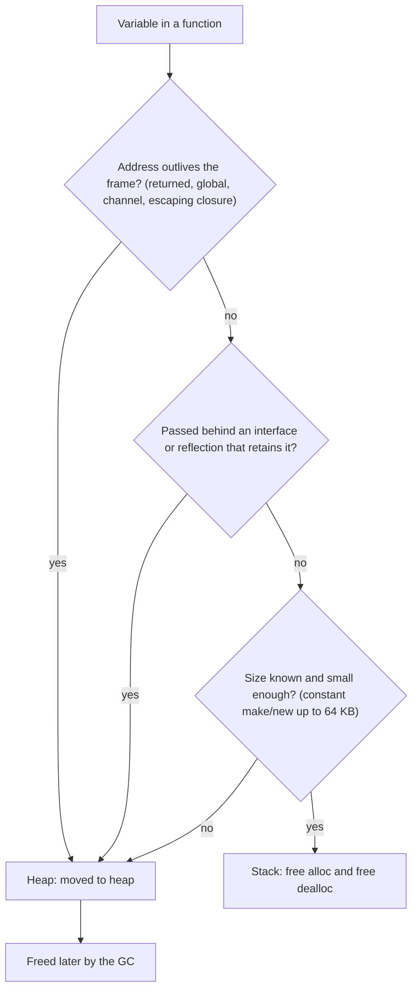
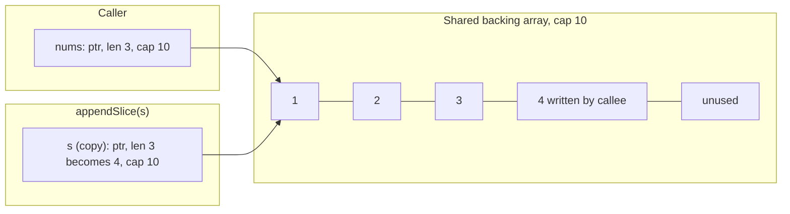
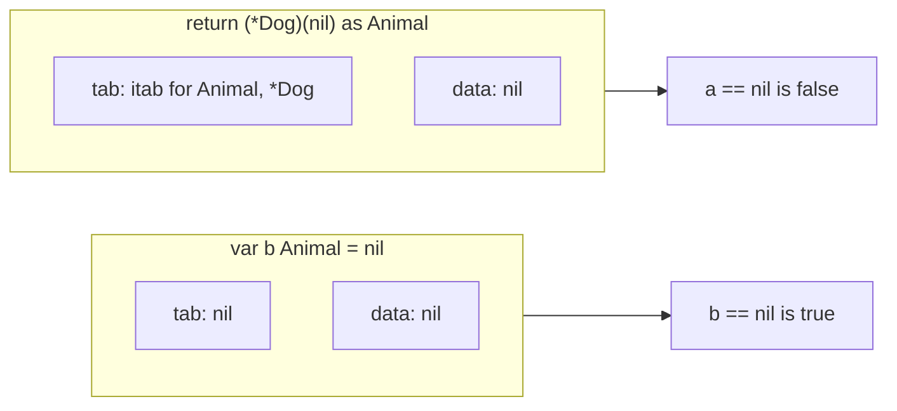
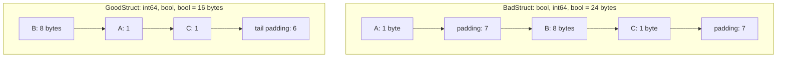
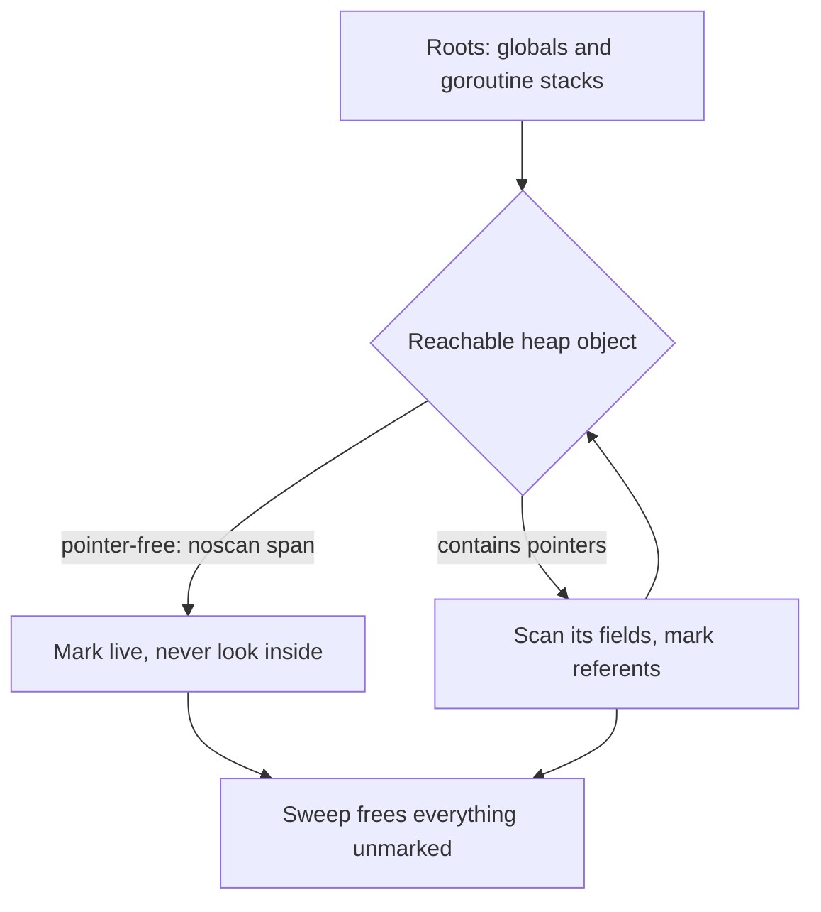

# 📍 Go — Pointers, Addresses, Memory & Object Handling

> **Category:** Language Fundamentals — Memory Model & Pointer Semantics  
> **Target Level:** Staff/Principal Engineer (10+ years)  
> **Why this matters at Staff level:** Aliasing bugs (shared slice backing arrays, captured pointers), the nil-interface trap, and allocation-heavy hot paths are among the most common Go production problems. Staff engineers can explain *where* a value lives, *who* can see it, and *what it costs the GC*.  \
> **Current as of:** Go 1.27. Escape-analysis output below was produced with `go build -gcflags=-m` on Go 1.27.1; exact messages vary slightly by version.

---

## Table of Contents

1. [The `&` and `*` Operators — What They Really Do](#1-the-and-operators-what-they-really-do)
2. [How Objects Are Handled: Value vs Pointer Semantics](#2-how-objects-are-handled-value-vs-pointer-semantics)
3. [Stack vs Heap Allocation & Escape Analysis](#3-stack-vs-heap-allocation-escape-analysis)
4. [Pass by Value — But Everything Is a Copy](#4-pass-by-value-but-everything-is-a-copy)
5. [Pointer Arithmetic — Why Go Doesn't Have It (Usually)](#5-pointer-arithmetic-why-go-doesnt-have-it-usually)
6. [Nil Pointers, Zero Values & The Interface Nil Trap](#6-nil-pointers-zero-values-the-interface-nil-trap)
7. [Memory Alignment & Padding](#7-memory-alignment-padding)
8. [`unsafe.Pointer` & `uintptr` — The Escape Hatch](#8-unsafepointer-uintptr-the-escape-hatch)
9. [GC & Pointer Impact on Garbage Collection](#9-gc-pointer-impact-on-garbage-collection)
10. [Common Pitfalls & Production Bugs](#10-common-pitfalls-production-bugs)
11. [Interview Questions](#11-interview-questions)

---

## 1. The `&` and `*` Operators — What They Really Do

### `&` (Address-of Operator)

The `&` operator returns a **pointer to the memory location** of a variable. It creates a new pointer value pointing to an existing variable.

```go
x := 42
p := &x  // p is *int, holds the memory address of x

fmt.Println(p)  // 0xc0000b2008 (some memory address)
fmt.Println(*p) // 42
```

**What happens at the machine level (simplified Go/Plan 9 amd64 assembly, when `x` and `p` live in the stack frame):**

```asm
// x := 42
MOVQ $42, x-16(SP)    // store 42 into x's stack slot

// p := &x
LEAQ x-16(SP), AX     // compute x's address (no memory read)
MOVQ AX, p-8(SP)      // store that address into p
```

`LEAQ` (Load Effective Address) computes an address without touching memory, so taking the address of a stack variable is essentially free. In optimized code `x` usually lives in a register and `&x` forces it into memory. If `&x` escapes, `x` moves to the heap instead (Section 3).

### `*` (Dereference Operator)

The `*` operator **accesses the value at the memory address** stored in a pointer.

```go
p := &x
y := *p  // Reads the value at address p, copies it to y
*p = 100 // Writes 100 to the address p points to
```

**Assembly:**

```asm
// y := *p          (AX holds p)
MOVQ (AX), BX         // load the int at address AX
MOVQ BX, y-24(SP)     // store into y

// *p = 100
MOVQ $100, (AX)       // store 100 at the address in AX
// (If AX could be nil, the load/store faults and the runtime turns the
//  SIGSEGV into a "nil pointer dereference" panic.)
```

### Declaration Syntax — T vs *T

```go
var a int      // a holds an int value (8 bytes on 64-bit)
var b *int     // b holds a pointer to an int (8 bytes, holds address)

a = 42         // Stores 42 in a's memory
b = &a         // Stores a's address in b's memory
*b = 43        // Writes 43 to wherever b points (a's memory)
```

**Key insight:** `*int` is a type. It's an 8-byte value that holds an address. When you write `*b = 43`, you're saying "follow the address in b and write 43 there."

### The `new()` Built-in

```go
p := new(int)  // a new zero-valued int variable; p is *int
*p = 42

// Exactly equivalent to:
var x int
q := &x

// Go 1.26+: new accepts an expression and uses it as the initial value
age := new(42)               // *int pointing at 42
name := new(strings.ToUpper("go")) // *string → "GO"
// Handy for optional pointer fields: Person{Age: new(yearsSince(born))}
```

`new(T)` creates a variable and returns its address. It says nothing about **where** the variable lives: `new(int)` and `&x` are both stack-allocated when they don't escape, and both move to the heap when they do. Escape analysis decides, not the syntax (verified: `new(int) does not escape` in `-m` output).

---

## 2. How Objects Are Handled: Value vs Pointer Semantics

### Value Semantics (Copies)

```go
type User struct {
    Name string
    Age  int
}

// Value receiver — operates on a COPY
func (u User) Print() {
    fmt.Printf("%+v\n", u)
}

// Value receiver — modifying has NO effect on caller
func (u User) Birthday() {
    u.Age++  // Only modifies the copy!
}
```

**When to use value semantics:**
- The type is small, roughly up to a few machine words (a heuristic, not a rule)
- It behaves like a value: `time.Time`, `netip.Addr`, `color.RGBA`, money amounts. Callers expect copies to be independent
- You want callers to be unable to mutate shared state through it

### Pointer Semantics (References)

```go
// Pointer receiver — operates on the ORIGINAL
func (u *User) Birthday() {
    u.Age++  // Modifies the original!
}

// Also works:
func (u *User) Print() {
    fmt.Printf("%+v at %p\n", *u, u)
}
```

**When to use pointer semantics:**
- You need to mutate the receiver
- The type contains a `sync.Mutex`, `WaitGroup`, atomics, or a `noCopy` marker (copying them is a bug; `go vet` copylocks)
- The type is large enough that copying shows up in profiles
- The type has identity: a connection, a server, a cache. Two copies would be two different things

### The Mixing Rule — Consistency is Key

**🔴 BAD — mixing value and pointer receivers:**

```go
type Config struct {
    Timeout time.Duration
}

func (c Config) GetTimeout() time.Duration { return c.Timeout }
func (c *Config) SetTimeout(d time.Duration) { c.Timeout = d }  // Mixed!
```

**✅ GOOD — be consistent:**

```go
// If one method needs pointer, ALL should be pointer
func (c *Config) GetTimeout() time.Duration { return c.Timeout }
func (c *Config) SetTimeout(d time.Duration) { c.Timeout = d }
```

**The Rule of Thumb (Go Code Review Comments):** be consistent per type, and if in doubt use pointer receivers. Mixing is legal and sometimes deliberate, but it makes the method sets of `T` and `*T` differ. Only `*Config` would satisfy an interface that needs `SetTimeout`, which surprises people.

### Factory Functions — Return Value or Pointer?

```go
// Returns a value — caller gets a copy
func NewUser(name string, age int) User {
    return User{Name: name, Age: age}
}

// Returns a pointer: heap-allocated UNLESS the call is inlined and the
// caller doesn't let it escape (then it can live on the caller's stack)
func NewUserPtr(name string, age int) *User {
    return &User{Name: name, Age: age}
}
```

**When to return pointer:**
- The caller needs to mutate the returned value
- The type is large (avoids copying)
- The type is expected to be used as a pointer (e.g., database models)

**When to return value:**
- The type is small and immutable
- The caller is expected to own the data independently
- You want to encourage value semantics

---

## 3. Stack vs Heap Allocation & Escape Analysis

### The Stack

- Each goroutine has its own stack. It starts at 2 KB (adaptive since Go 1.19) and grows by **copying** to a bigger block, which is why Go code never holds raw pointers into stacks across growth.
- Allocation is free: the function's frame size is fixed at compile time, and entering the function adjusts SP once for all locals.
- Deallocation is free: the frame disappears on return. The GC still *scans* live stack frames for pointers, but never frees anything there.
- Hot in cache, and nothing to collect.

### The Heap

- Managed by the GC. Allocation is fast: per-P `mcache`, size classes, bump-pointer-like for small objects, and Go 1.27 adds size-specialized allocation routines for objects under 80 bytes. But each allocation adds to the GC's work and to how often GC runs.
- Freed only by the GC: mark (proportional to *live, pointer-containing* memory) plus sweep.
- Objects can be scattered across memory, so following pointers costs cache misses.

**Cost model to remember:** a heap allocation is cheap *at the moment it happens* (tens of ns). The real bill is paid later as GC CPU, roughly proportional to allocation rate × live heap / GOGC. Reducing allocations in hot paths is the most effective GC tuning there is.

### Escape Analysis — The Compiler's Decision

The compiler keeps a variable on the stack if it can **prove** the variable is not referenced after the function returns, and that its size is known and small enough. Otherwise the variable "escapes" to the heap. The analysis is static, works per function, and is conservative.

```go
// ── Example 1: Stays on stack ────────────────────────────
func sum() int {
    x := 42
    y := 58
    return x + y // no address taken: probably just registers
}

// ── Example 2: Escapes: the address outlives the frame ──
func newUser() *User {
    u := User{Name: "Alice"}
    return &u // -m: "moved to heap: u" (unless newUser is inlined into a caller
              //     that keeps the pointer local: then it stays on that stack)
}

// ── Example 3: Interface conversion passed to fmt ────────
func printAny(v any) {
    fmt.Println(v) // -m: "leaking param: v". fmt stores args in an []any it passes on
}

func demo() {
    x := 1000
    printAny(x) // -m: "1000 escapes to heap": x is boxed into an interface.
                // (Values 0–255, single bytes and constants are boxed without
                //  allocating: the runtime points at static data.)
}

// ── Example 4: Closure escape ───────────────────────────
func adder() func(int) int {
    sum := 0
    return func(x int) int { // -m: "func literal escapes to heap"
        sum += x             // -m: "moved to heap: sum" (shared by the closure)
        return sum
    }
}
```

### Checking Escape Analysis

```bash
go build -gcflags='-m' ./...      # decisions for each allocation site
go build -gcflags='-m=2' ./...    # with the reasoning chain ("flow: ... ")

# Real output (Go 1.27.1) for the examples on this page:
# ./main.go:10:16: leaking param: name
# ./main.go:11:9: &Config{...} escapes to heap
# ./main.go:21:2: moved to heap: sum
# ./main.go:22:9: func literal escapes to heap
# ./main.go:33:10: new(int) does not escape
# ./main.go:35:11: make([]int, 10000) escapes to heap
# ./main.go:36:11: make([]int, 1000) does not escape
```

Confirm with a benchmark: `-benchmem` or `testing.AllocsPerRun` show actual allocations. Some "escapes to heap" boxing lines turn out not to allocate (static data for small values).

### Real-World Optimization

```go
type Response struct {
    Status int
    Data   []byte
}

// Version A: returns *Response. The Response header escapes (one allocation),
// and so does the 1 KB buffer (a second allocation).
func ProcessA() *Response {
    return &Response{Data: make([]byte, 1024)}
}

// Version B: returns a value. The Response itself needs no allocation, but the
// buffer still escapes, because it is reachable from the returned value.
func ProcessB() Response {
    return Response{Data: make([]byte, 1024)}
}

// Version C: the CALLER owns the buffer and can reuse it across calls,
// so the steady state has zero allocations.
func ProcessC(dst *Response, buf []byte) {
    dst.Data = buf[:0]
    dst.Data = append(dst.Data, "payload"...)
}
```

Measured with `testing.AllocsPerRun` (functions marked `//go:noinline`): A = 2 allocations, B = 1, C = 0. This is the same pattern the standard library uses: `strconv.AppendInt(dst, …)`, `fmt.Appendf`, `io.ReadFull(r, buf)`, `hash.Sum(b)`. Let the caller pass the destination and the callee won't allocate.

**Key insight:** returning a pointer does not *always* mean a heap allocation. If the constructor is inlined (small functions are) and the caller doesn't let the pointer escape, the object lives on the caller's stack. In the test program above, `Process(NewConfig("a", 1))` reported `&Config{...} does not escape` at the call site after inlining.

### Escape Analysis Rules Summary

| Situation | Escapes? | Why |
|-----------|----------|--------|
| `return &x` (not inlined away) | ✅ Yes | Address outlives the frame |
| Stored into a global, a heap object, or a channel | ✅ Yes | Reachable after return |
| Captured by a closure that escapes (returned, `go func`) | ✅ Yes | Closure and captured variables move to the heap |
| Converted to an interface and passed somewhere that retains it (`fmt.Println`, `json.Marshal`) | ✅ Usually | The analysis loses track behind interfaces and reflection |
| `make([]int, 1000)` (8 KB, constant size, stays local) | ❌ No | Constant-size `make`/`new`/`&T{}` up to **64 KB** can be stack-allocated |
| `make([]int, 10000)` (80 KB) | ✅ Yes | Larger than the 64 KB implicit-allocation limit (explicit `var` arrays: 128 KB) |
| `make([]T, n)` with variable `n`, non-escaping | ⚠️ Depends | Go 1.25/1.26 stack-allocate small variable-size backing stores (a 32-byte stack buffer used when `n` is small) and fall back to the heap otherwise |
| `var x int; p := &x`, `p` stays local | ❌ No | Address never leaves the frame |
| Calling a method through an interface | ⚠️ Maybe | The *call* doesn't allocate. Arguments can escape because the compiler can't see the callee, unless it devirtualizes (PGO helps) |
| Method values `f := x.M` used locally | ❌ No | The bound closure can live on the stack (`l.Log does not escape`) |

*Escape analysis is a static, conservative proof: if the compiler cannot show a variable is unreferenced after return (or its size is not small and known), it moves to the heap.*



---

## 4. Pass by Value — But Everything Is a Copy

**Go is ALWAYS pass-by-value.** There is no pass-by-reference in Go. When you pass a variable to a function, Go makes a copy.

```go
func increment(x int) {
    x++  // Only modifies the copy
}

func main() {
    a := 10
    increment(a)
    fmt.Println(a)  // 10 (not 11!)
}
```

### But What About Pointers?

Passing a pointer is still pass-by-value — it copies the pointer itself (the address).

```go
func incrementPtr(p *int) {
    *p++  // Follows the pointer to modify the original
    // p itself is a copy of the address — modifying p wouldn't affect caller
}

func main() {
    a := 10
    incrementPtr(&a)
    fmt.Println(a)  // 11
}
```

**What's being copied:** The 8-byte address value. Both `p` (in function) and `&a` (in caller) point to the same memory, but `p` is a distinct variable containing the same address.

### What About Slices, Maps, and Channels?

These are often called "reference types". The spec doesn't use the term, but the idea is right: the value you copy is a small descriptor that *contains* a pointer to shared underlying data.

```go
func modifySlice(s []int) {
    s[0] = 999  // Modifies the underlying array
}

func main() {
    nums := []int{1, 2, 3}
    modifySlice(nums)
    fmt.Println(nums[0])  // 999
}
```

**BUT** — the slice header (ptr + len + cap) is still **copied by value**:

```go
func appendSlice(s []int) {
    s = append(s, 4)  // Only modifies the local copy of the header
}

func main() {
    nums := make([]int, 3, 10)
    nums[0], nums[1], nums[2] = 1, 2, 3
    appendSlice(nums)
    fmt.Println(nums)  // [1 2 3] (not [1 2 3 4]!)
    fmt.Println(nums[:4]) // [1 2 3 4]: the 4 WAS written into the shared array
}
```

The subtle part: because `cap` was 10, `append` wrote `4` into the caller's backing array without changing the caller's `len`. A later `append` by the caller silently overwrites it. That is the source of the aliasing bugs in Question 7.

**Slice layout** (what the runtime calls `slice`; 24 bytes on 64-bit):

```go
type slice struct {
    array unsafe.Pointer // first element of the backing array
    len   int
    cap   int
}
// Strings are the same minus cap: {ptr, len}, 16 bytes.
// reflect.SliceHeader / StringHeader are DEPRECATED (Go 1.20+): their Data
// field is a uintptr the GC doesn't track. Use unsafe.Slice, unsafe.SliceData,
// unsafe.String and unsafe.StringData instead.
```

*Passing a slice copies only the 24-byte header, so element writes are shared, but an `append` in the callee changes only its own copy of `len`.*



### The `map` Gotcha

```go
func modifyMap(m map[string]int) {
    m["key"] = 42  // This DOES modify the original map
    m = nil        // But this does NOT affect caller's m
}

func main() {
    data := map[string]int{"a": 1}
    modifyMap(data)
    fmt.Println(data["key"])  // 42
    fmt.Println(data == nil)  // false
}
```

**Why?** A map value is a single pointer to a runtime map header. Since Go 1.24 that is the Swiss-table `internal/runtime/maps.Map`; before, it was `hmap`. Copying the map variable copies the pointer, so both copies refer to the same table. The same holds for channels (`*hchan`). Two more map facts: a `nil` map can be read but **panics on write**, and `&m[k]` is illegal because entries move when the table grows.

---

## 5. Pointer Arithmetic — Why Go Doesn't Have It (Usually)

### Go Explicitly Disallows Pointer Arithmetic

```go
arr := [3]int{1, 2, 3}
p := &arr[0]

// 🔴 COMPILE ERROR: Go doesn't allow this
q := p + 1  // invalid operation: p + 1 (type *int does not support +)
```

**Why?** Memory safety. Unchecked pointer arithmetic is behind whole classes of C/C++ vulnerabilities (buffer overflows, out-of-bounds reads). Go puts bounds checks on slices and strings and gives you no way to forge a pointer without `unsafe`. That also lets the GC know exactly where every pointer is.

### How to Work Around (When You Absolutely Must)

```go
import "unsafe"

arr := [3]int{1, 2, 3}

// Go 1.17+: unsafe.Add does the arithmetic without a uintptr round-trip
base := unsafe.Pointer(&arr[0])
second := (*int)(unsafe.Add(base, unsafe.Sizeof(arr[0])))
fmt.Println(*second) // 2

// Older equivalent (legal ONLY as a single expression; see Section 8):
// (*int)(unsafe.Pointer(uintptr(base) + unsafe.Sizeof(arr[0])))

// Usually you want a slice view instead of arithmetic:
s := unsafe.Slice(&arr[0], len(arr)) // []int over the same memory
```

**⚠️ WARNING:** The rules are documented in the `unsafe.Pointer` docs and `go vet` checks some misuse. But nothing stops you from walking past the end of the object, and the result is memory corruption, not a panic. Only use it for:
- Interfacing with C code (cgo)
- Extreme performance optimization (proven via profiling)
- Implementing low-level data structures

---

## 6. Nil Pointers, Zero Values & The Interface Nil Trap

### Nil Pointer Dereference

```go
var p *int  // p is nil (zero value for pointer types)

// 🔴 PANIC: runtime error: invalid memory address or nil pointer dereference
fmt.Println(*p)
```

**Always check for nil before dereferencing:**

```go
if p != nil {
    fmt.Println(*p)
}
```

### The Interface Nil Trap — Staff-Level Essential

**This is the #1 trick question in Go interviews:**

```go
type Animal interface {
    Speak() string
}

type Dog struct{}
func (d *Dog) Speak() string { return "Woof!" }

func NewAnimal() Animal {
    var d *Dog = nil  // typed nil
    return d          // Returns interface with type *Dog, value nil
}

func main() {
    a := NewAnimal()
    fmt.Println(a == nil)  // false !!!
    
    var b Animal = nil
    fmt.Println(b == nil)  // true
}
```

**Why?** An interface value is `(type, value)`. When you return `(*Dog)(nil)`, the interface becomes `(*Dog, nil)` — the type `*Dog` is set, so the interface is NOT nil even though the underlying value is nil.

**The memory layout:**

```go
// a = iface{tab: &itab{inter: Animal, _type: *Dog}, data: nil}
// `a == nil` is true only if BOTH words are nil. tab is not, so it's false.
```

**🔴 What happens when you call methods on this "nil" interface?**

```go
a := NewAnimal()
fmt.Println(a.Speak())  // "Woof!": the method never dereferences d, so a nil receiver is fine
```

**Yes — Go allows calling methods on nil receivers!** This is intentional and useful:

```go
func (d *Dog) Speak() string {
    if d == nil {
        return "silence"  // Handle nil receiver gracefully
    }
    return "Woof!"
}

a := NewAnimal()
fmt.Println(a.Speak())  // "silence"
```

**Production pattern — nil receivers as tree sentinels:**

```go
type Node struct {
    Value int
    Left  *Node
    Right *Node
}

func (n *Node) Sum() int {
    if n == nil {
        return 0  // nil receiver is the base case!
    }
    return n.Value + n.Left.Sum() + n.Right.Sum()
}
```

*An interface is a `(type, value)` pair, so returning a typed nil pointer yields a non-nil interface: only both words nil compare equal to `nil`.*



---

## 7. Memory Alignment & Padding

### Why Alignment Matters

Each type has an alignment (`unsafe.Alignof`): its address must be a multiple of it. Go's compiler inserts padding so every field is naturally aligned, so you never get misaligned access in safe Go. Alignment matters to you for three reasons:
- **Size:** padding wastes memory, which matters for structs stored by the million (cache entries, graph nodes)
- **64-bit atomics on 32-bit platforms** (386, ARM, 32-bit MIPS): `int64` there is only 4-byte aligned, but 64-bit atomic instructions need 8-byte alignment, so misaligned atomic operations panic
- **Cache lines / false sharing:** independent hot fields that share a 64-byte line slow each other down (pad them apart; see the sharded counter in the interview questions)

### Struct Padding

```go
// ── BAD: Poor alignment ────────────────────────────────
type BadStruct struct {
    A bool    // 1 byte  + 7 bytes padding
    B int64   // 8 bytes
    C bool    // 1 byte  + 7 bytes padding
} // Total: 24 bytes (8 × 3)
//   Layout: [b|_ _ _ _ _ _ _|B B B B B B B B|b|_ _ _ _ _ _ _]

// ── GOOD: Optimal alignment ─────────────────────────
type GoodStruct struct {
    B int64   // 8 bytes
    A bool    // 1 byte
    C bool    // 1 byte  + 6 bytes padding (tail only)
} // Total: 16 bytes (8 × 2)
//   Layout: [B B B B B B B B|b b|_ _ _ _ _ _]
```

**Rule:** order fields by **alignment**, largest first (8-byte: `int64`, `float64`, pointers, strings, slices, interfaces; then 4, 2, 1). That minimizes padding. The `fieldalignment` analyzer (`golang.org/x/tools/go/analysis/passes/fieldalignment`) finds and fixes such structs. Readability beats a few bytes for structs that aren't allocated in bulk. Also note: a zero-size field (`struct{}`) at the **end** of a struct gets padding, so the struct can't point past its own allocation.

### Using `unsafe.Sizeof`, `unsafe.Offsetof`, `unsafe.Alignof`

```go
import "unsafe"

type Point struct {
    X float64  // 8 bytes
    Y float64  // 8 bytes
}

fmt.Println(unsafe.Sizeof(Point{}))    // 16
fmt.Println(unsafe.Alignof(Point{}))   // 8
fmt.Println(unsafe.Offsetof(Point{}.Y)) // 8

// ── 64-bit atomics on 32-bit platforms ─────────────────────
type BadCounter struct {
    flag  bool  // offset 0
    value int64 // 64-bit: offset 8. 386/arm: offset 4, because int64 is only 4-byte aligned there
}
// atomic.AddInt64(&c.value, 1) on 386/arm → panic: unaligned 64-bit atomic operation
// (offsets checked with go/types.SizesFor("gc", "386"/"arm"): [0 4])

// ✅ Fix 1 (Go 1.19+, preferred): typed atomics are always 8-byte aligned
type GoodCounter struct {
    flag  bool
    value atomic.Int64
}

// ✅ Fix 2 (legacy): put the int64 FIRST. sync/atomic guarantees that the first
// word of an allocated struct, array or slice, and of a global variable, is
// 64-bit aligned. (This does NOT hold for a struct embedded inside another one.)
```

*Field order changes padding: putting the 8-byte field first shrinks the struct from 24 to 16 bytes.*



---

## 8. `unsafe.Pointer` & `uintptr` — The Escape Hatch

### The Three Pointer Types

```go
// 1. Typed pointer — safe, checked by compiler
var p *int

// 2. unsafe.Pointer — pointer to any type, like C's void*
//   - Can convert any typed pointer to unsafe.Pointer
//   - Can convert unsafe.Pointer to any typed pointer
//   - Arithmetic via unsafe.Add (Go 1.17+); GC-visible
var up unsafe.Pointer = unsafe.Pointer(p)

// 3. uintptr — an integer large enough to hold a pointer address
//   - Can do arithmetic
//   - NOT a pointer — GC doesn't track it!
var addr uintptr = uintptr(up)
```

### The GC Trap with uintptr

```go
// 🔴 INVALID: a uintptr kept in a variable is just a number
func dangerous() {
    obj := &SomeLargeStruct{}
    addr := uintptr(unsafe.Pointer(obj)) // GC does not see this as a reference

    // obj is no longer used, so the GC may free it here. And if obj lived on
    // a goroutine stack, the stack may be MOVED when it grows: addr then points
    // to the old copy.
    p := (*SomeLargeStruct)(unsafe.Pointer(addr)) // possible use-after-free
    _ = p
}

// ✅ VALID: keep unsafe.Pointer (GC-visible) and do arithmetic in ONE expression
func fieldPtr(obj *SomeLargeStruct, off uintptr) unsafe.Pointer {
    return unsafe.Add(unsafe.Pointer(obj), off) // or unsafe.Pointer(uintptr(p) + off) in one expression
}
```

**The rules** (from the `unsafe.Pointer` docs): a `uintptr` → `unsafe.Pointer` conversion is valid only in the specific patterns listed there. The main ones are arithmetic inside a single expression, and the argument list of a `syscall.Syscall` call. Never store a Go pointer as a `uintptr` and convert it back later. `go vet` (the `unsafeptr` check) flags many violations, and `-gcflags=all=-d=checkptr` (enabled automatically by `-race` and `-msan`) checks some of them at runtime.

### Real-World Use: Zero-Copy String Conversion

```go
// Go 1.20+: the supported way. No reflect headers, no struct-layout assumptions.
func bytesToString(b []byte) string {
    return unsafe.String(unsafe.SliceData(b), len(b))
}

func stringToBytes(s string) []byte {
    return unsafe.Slice(unsafe.StringData(s), len(s))
}
```

Both are zero-copy views over the same memory, and both are only safe under strict conditions:
- `bytesToString`: **nobody may modify `b` afterwards**, or the "immutable" string changes under its users. Map keys, for example, would then be corrupted. `strings.Builder.String()` uses exactly this trick, safely, because the Builder never writes those bytes again.
- `stringToBytes`: the result must be **read-only**. String data may live in read-only memory (literals), so writing to it can segfault, and other holders of the string would see the change anyway.
- The old `*(*string)(unsafe.Pointer(&b))` cast and the `reflect.StringHeader`/`SliceHeader` versions rely on the header layout, and the header types are deprecated. Don't use them in new code.
- Often you don't need either. The compiler already avoids the copy for `string(b)` in map lookups (`m[string(b)]`), comparisons, `switch string(b)`, and concatenations whose result is immediately consumed. Small non-escaping conversions also use a stack buffer. Profile before reaching for `unsafe`.

---

## 9. GC & Pointer Impact on Garbage Collection

### Pointer Density Affects GC Performance

The Go GC must scan all pointers to find reachable objects. More pointers = more work for GC.

```go
// ── High pointer density — GC intensive ────────────────
type Node struct {
    Left  *Node    // pointer
    Right *Node    // pointer
    Data  []byte   // pointer (slice header)
    Meta  *Metadata // pointer
} // 4 pointers per node

// ── Low pointer density — GC friendly ──────────────────
type FlatNode struct {
    Index int32    // no pointer
    Left  int32    // index into array, not pointer
    Right int32    // index into array, not pointer
    Size  int64    // no pointer
    Flags uint32   // no pointer
} // 0 pointers per node
```

### GC Scanning Cost

```go
// The GC marks from the roots (globals, every goroutine's stack) and then
// scans every reachable heap object that CONTAINS pointers.
//
// What the cost depends on:
//   • Mark work ≈ the live heap that contains pointers, plus stacks and globals.
//   • Pointer-free objects ([]byte, []int64, structs of scalars) are allocated
//     in "noscan" spans: the GC marks them live but NEVER looks inside them.
//     A 1 GB []byte costs about the same to mark as a 1-byte one.
//   • Hidden pointers count too: string, slice, map, chan, func, interface and
//     time.Time (via its *Location) fields all contain pointers.
//   • GC frequency ≈ allocation rate / (heap goal - live heap). Allocating less
//     means fewer cycles, whatever each cycle costs.

// ── Before: every entry has 3+ pointers to scan, and 3 extra objects ──
type CacheEntry struct {
    Key   string   // pointer + len
    Value []byte   // pointer + len + cap
    Tags  []string // pointer to an array of more pointers
}

// ── After: pointer-free entries in one big slice (one noscan allocation) ──
type FlatCacheEntry struct {
    KeyOff, KeyLen uint32 // offsets into one shared []byte arena
    ValOff, ValLen uint32
    TagBitmap      uint64 // a bitset instead of []string
}
type FlatCache struct {
    arena   []byte           // all keys and values, back to back (noscan)
    entries []FlatCacheEntry // noscan
    index   map[uint64]uint32 // hash → entry index; uint64/uint32 keys and values are pointer-free
}
```

This is the technique behind "GC-free" caches such as `bigcache` and `freecache`, and behind large in-memory indexes. The trade-offs: you manage space yourself (deletes leave holes, so you need compaction), lookups need hashing plus collision checks, and the code is harder to read. Use it for multi-GB heaps where profiles show GC mark time, not by default. Since Go 1.26 the **Green Tea** collector scans small objects span by span with better locality, which makes pointer-heavy heaps cheaper than before. It doesn't change the basic rule that pointer-free memory is the cheapest kind to have.

*The GC marks from roots (globals and goroutine stacks) and scans only objects that contain pointers; pointer-free ("noscan") objects are marked live but never read.*



### Practical GC Optimization

```go
// ✅ Pre-size slices and maps when the size is known
func Build(data []int) []Item {
    items := make([]Item, 0, len(data)) // one allocation instead of ~log2(n) growths + copies
    for _, v := range data {
        items = append(items, Item{Value: v})
    }
    return items
}
// m := make(map[string]int, n) also avoids repeated table growth.

// ✅ Reuse scratch buffers with sync.Pool (dropped across GCs: scratch only, never resources)
var bufferPool = sync.Pool{New: func() any { return new(bytes.Buffer) }}

func Process() {
    buf := bufferPool.Get().(*bytes.Buffer)
    buf.Reset()
    defer bufferPool.Put(buf)
    // ... use buf; don't keep references to it after Put ...
}

// ✅ Avoid accidental retention: a small sub-slice pins the whole backing array
func firstLine(file []byte) []byte {
    i := bytes.IndexByte(file, '\n')
    if i < 0 {
        i = len(file)
    }
    return bytes.Clone(file[:i]) // copy, so the 100 MB file can be freed
}

// ✅ Weak references for canonicalizing caches (Go 1.24): entries vanish when unused
// p := weak.Make(obj); later: if v := p.Value(); v != nil { ... }
// unique.Make (Go 1.23) interns comparable values (e.g. repeated strings) for you.
```

---

## 10. Common Pitfalls & Production Bugs

### Pitfall 1: Loop Variable Capture (pre-Go 1.22)

**Status in 2026:** fixed by the language. From Go 1.22, every iteration of every `for` loop (three-clause and `range`) has its own copy of the loop variables. The new semantics apply to packages whose module declares **`go 1.22` or later** in `go.mod`, whatever toolchain builds them.

```go
var prints []func()
for i := 0; i < 3; i++ {
    prints = append(prints, func() { fmt.Print(i, " ") })
}
for _, p := range prints {
    p()
}
// module `go 1.22`+ : 0 1 2
// module `go 1.21`  : 3 3 3    (verified by building the same file under both go.mod versions)

// The pre-1.22 fix, still seen in older code: shadow the variable
for i := 0; i < 3; i++ {
    i := i // redundant in 1.22+ modules; `go fix` (1.26 modernizers) removes it
    go func() { fmt.Println(i) }()
}
```

Interview tip: if a question claims "this prints 3 3 3" or "all goroutines see the last value", answer that this was true before Go 1.22 and in modules still on `go 1.21` or lower. For a modern module the closures see 0, 1, 2. Taking `&v` of a range variable likewise now gives a distinct address per iteration.

### Pitfall 2: Slice Append After Passing to Function

```go
// 🔴 BUG: Appending to a copied slice header
func addItem(items []int) {
    items = append(items, 4)  // Caller's items unaffected
}

items := []int{1, 2, 3}
addItem(items)
fmt.Println(items)  // [1 2 3] — NOT updated!

// ✅ FIX (idiomatic): return the new slice, like append itself does
func withItem(items []int) []int {
    return append(items, 4)
}
items = withItem(items)
fmt.Println(items) // [1 2 3 4]

// Also valid: pass *[]int when the function's job is to mutate the caller's slice
func appendItem(items *[]int) { *items = append(*items, 4) }
```

### Pitfall 3: Range Copies Values (Not References)

```go
type Person struct {
    Name string
}

people := []Person{{"Alice"}, {"Bob"}}

// 🔴 BUG: p is a COPY, doesn't modify original
for _, p := range people {
    p.Name = "Changed"  // Only modifies copy
}

// ✅ FIX: Use index or pointer slice
for i := range people {
    people[i].Name = "Changed"
}

// Or use pointer slice:
people2 := []*Person{{"Alice"}, {"Bob"}}
for _, p := range people2 {
    p.Name = "Changed"  // Works! p is a pointer
}
```

### Pitfall 4: Returning Local Pointer After Inlining

This is a **non-issue**, a misconception carried over from C. Returning the address of a local is always safe in Go. The compiler either moves the variable to the heap or, after inlining, keeps it in the caller's frame when it can prove that is safe. You never get a dangling pointer.

```go
func create() *int {
    x := 42
    return &x // safe: "moved to heap: x" when create isn't inlined
}

func caller() {
    p := create()   // if inlined and p stays local, x can live in caller's frame
    fmt.Println(*p) // either way: always 42, never garbage
}
```

The real cost question is only *heap vs stack*, which affects performance, never correctness.

### Pitfall 5: Method Value vs Method Expression

```go
type Counter struct{ Value int }

func (c *Counter) Inc() { c.Value++ }

// Method VALUE: the receiver is evaluated and saved WHEN f IS CREATED
c := &Counter{}
f := c.Inc              // binds the pointer currently in c (the first Counter)
c = &Counter{Value: 42} // reassigning c later doesn't affect f
f()                     // increments the FIRST Counter
fmt.Println(c.Value)    // 42 (verified)

// Method EXPRESSION: no receiver bound; it becomes the first parameter
g := (*Counter).Inc // func(*Counter)
g(c)
fmt.Println(c.Value) // 43
```

**The real trap: `defer` with a value receiver.** `defer x.M()` evaluates the receiver when the `defer` statement runs. A *value* receiver is therefore copied at that point:

```go
type Stats struct{ N int }

func (s Stats) Print()     { fmt.Println("value receiver sees N =", s.N) }
func (s *Stats) PrintPtr() { fmt.Println("pointer receiver sees N =", s.N) }

func work() {
    s := Stats{}
    defer s.Print()    // copies s NOW (N = 0)
    defer s.PrintPtr() // captures &s now; reads N when it runs
    s.N = 10
}
// Output (deferred calls run LIFO):
// pointer receiver sees N = 10
// value receiver sees N = 0

// ✅ To see the final state with a value receiver, defer a closure:
// defer func() { s.Print() }()
```

The same rule applies to deferred function **arguments**: `defer log.Println("took", time.Since(start))` evaluates `time.Since(start)` immediately, so it logs about 0 s. Wrap it in a closure.

---

## 11. Interview Questions

### Question 1: Escape Analysis

**Problem:** Look at this code and predict what escapes to heap. Explain your reasoning.

```go
type Config struct {
    Name string
    Port int
}

func NewConfig(name string, port int) *Config {
    return &Config{Name: name, Port: port}
}

func Process(config *Config) {
    fmt.Println(config.Name)
}
```

<details>
<summary>🎯 Answer</summary>

Actual `go build -gcflags=-m` output (Go 1.27.1; line numbers are from the test file):

```
./main.go:10:16: leaking param: name               ← name's string data flows into the result
./main.go:11:9:  &Config{...} escapes to heap      ← in NewConfig itself
./main.go:14:14: leaking param content: config     ← what config POINTS TO reaches fmt…
./main.go:15:20: config.Name escapes to heap       ← …because config.Name is boxed into an interface
./main.go:15:13: ... argument does not escape      ← fmt.Println's []any slice stays on the stack
```

- `NewConfig`: `&Config{}` escapes **when compiled as a standalone function**. But `NewConfig` is tiny, so it gets inlined. At a call site like `Process(NewConfig("a", 1))`, the output says `&Config{...} does not escape`, and the `Config` lives on the caller's stack.
- `name` "leaks" to the result: the string header is copied into the `Config`. The bytes of the string are not copied.
- In `Process`, the **pointer** `config` doesn't escape ("leaking param **content**" means the pointee is reachable from somewhere that escapes). The allocation that can happen is `config.Name` being converted to `any` for `fmt.Println`: a 16-byte string header boxed on the heap.

**Key insight:** "escapes" is decided per allocation site and per call path, after inlining. Read `-m` output with inlining in mind, and confirm with `-benchmem`.

</details>

### Question 2: The Nil vs Non-Nil Interface

**Problem:** What does this print, and why? How do you prevent it?

```go
type Handler interface {
    Handle()
}

type MyHandler struct{}

func (h *MyHandler) Handle() {}

func NewHandler() Handler {
    return nil
}

func NewBetterHandler() Handler {
    var h *MyHandler = nil
    return h
}

func main() {
    h := NewBetterHandler()
    fmt.Println(h == nil)  // What does this print?
}
```

<details>
<summary>🎯 Answer</summary>

Prints `false`. `NewBetterHandler` returns an interface with type `*MyHandler` and value `nil`. Since the type is set, the interface is not nil.

`NewHandler()` returns an interface with type `nil` and value `nil` — that one IS nil.

**Prevention:**
1. When a function's result type is an interface, return the **literal** `nil` on the "nothing" path. Never return a typed pointer variable that might be nil:
   ```go
   func NewHandler(cfg Config) Handler {
       var h *MyHandler
       if cfg.Enabled {
           h = &MyHandler{}
       }
       if h == nil {
           return nil // untyped nil → a nil interface
       }
       return h
   }
   ```
2. Applies doubly to `error`: return `error`, never `*MyError`, from functions.
3. Detecting it after the fact needs reflection (`v := reflect.ValueOf(h); v.Kind() == reflect.Pointer && v.IsNil()`). `IsNil` panics for kinds that can't be nil, such as structs, so check the kind first. Needing this is a design smell.

</details>

### Question 3: Stack or Heap?

**Problem:** For each variable below, will it be stack or heap allocated? Explain.

```go
func main() {
    var a int                                       // ?
    b := 42                                         // ?
    c := new(int)                                   // ?
    d := make([]int, 10)                            // ?
    e := make([]int, 10000)                         // ?
    
    var f [100]int                                  // ?
    g := &f                                         // ?
    
    h := struct{ x int }{42}                        // ?
    i := &struct{ x int }{42}                       // ?
    
    s := "hello"                                    // ?
    t := s[0]                                       // ?
}
```

<details>
<summary>🎯 Answer</summary>

Verified with `-gcflags=-m` (Go 1.27.1), with each variable passed to a non-inlined function that doesn't retain it:

| Var | Location | Reason |
|-----|----------|--------|
| `a`, `b` | Stack (or just registers) | Scalars, no address taken |
| `c := new(int)` | **Stack** | `new(int) does not escape`. `new` does not mean heap |
| `d := make([]int, 10)` | Stack | Constant size (80 B), doesn't escape |
| `e := make([]int, 10000)` | **Heap** | 80 KB is over the 64 KB limit for implicit stack allocations (`make`, `new`, `&T{}`) |
| `f` `[100]int` | Stack | 800 B, explicit variable (limit 128 KB) |
| `g := &f` | Stack | The pointer is a local. `f` stays on the stack because `g` doesn't escape |
| `h` | Stack | Small struct value |
| `i := &struct{x int}{42}` | **Stack** | `&struct {...}{...} does not escape`. Taking an address alone doesn't force the heap; escaping does |
| `s := "hello"` | Header on stack; bytes in the binary's read-only data | String literals aren't allocated |
| `t := s[0]` | Stack | A byte |

If any of these were returned, stored in a global, sent on a channel, or captured by a goroutine, they would move to the heap.

</details>

### Question 4: Pointer Copy Semantics

**Problem:** What does this code print?

```go
type User struct {
    Name string
    Age  int
}

func main() {
    users := []User{{"Alice", 30}, {"Bob", 25}}
    
    for _, u := range users {
        u.Age += 10
    }
    
    fmt.Println(users[0].Age)  // ?
    
    for i := range users {
        users[i].Age += 10
    }
    
    fmt.Println(users[0].Age)  // ?
}
```

<details>
<summary>🎯 Answer</summary>

First print: `30`. The `for _, u := range users` creates a copy of each `User`. Modifying `u.Age` only modifies the copy.

Second print: `40`. Using index `users[i]` accesses the actual element in the slice, so the modification persists.

</details>

### Question 5: Memory Alignment Bug

**Problem:** This code works on 64-bit but panics on 32-bit ARM. Why?

```go
type Stats struct {
    active    bool
    requests  int64
    errors    int64
}

var stats Stats
atomic.AddInt64(&stats.requests, 1)
```

<details>
<summary>🎯 Answer</summary>

On 32-bit platforms, `sync/atomic` requires 8-byte alignment for `int64` fields. The struct layout on 32-bit:

- `active bool` at offset 0 (1 byte)
- 3 bytes padding
- `requests int64` at offset 4 (NOT 8-byte aligned!)
- `errors int64` at offset 12 (NOT 8-byte aligned!)

**Fix:** Put 8-byte atomic fields first. `sync/atomic` guarantees 64-bit alignment for the first word of an allocated struct and of a global variable. `stats` is a global, so this works:

```go
type Stats struct {
    requests int64 // offset 0: aligned (first word of the global)
    errors   int64 // offset 8: also aligned
    active   bool
}
```

The guarantee does not cover a `Stats` *embedded* inside another struct at a non-aligned offset. That is one reason `atomic.Int64` is the better fix.

Or, preferably, use `atomic.Int64` (Go 1.19+). It is guaranteed 8-byte aligned on every platform, and it makes non-atomic access impossible by construction.

</details>

### Question 6: Using `unsafe` — Structure Size Optimization

**Problem:** How can you use `unsafe.Sizeof` to determine the optimal field order and reduce struct size?

<details>
<summary>🎯 Answer</summary>

```go
import "unsafe"

func AnalyzeStruct[T any]() {
    var v T
    t := reflect.TypeOf(v)
    
    fmt.Printf("Struct %s: %d bytes\n", t.Name(), unsafe.Sizeof(v))
    
    for i := 0; i < t.NumField(); i++ {
        f := t.Field(i)
        fmt.Printf("  %s: offset=%d, size=%d, align=%d\n",
            f.Name,
            f.Offset,
            f.Type.Size(),
            f.Type.Align(),
        )
    }
}

// Rule: order fields by alignment, largest first:
// 8 (int64, float64, pointers, string/slice/interface headers) → 4 (int32, float32)
// → 2 (int16) → 1 (bool, int8, byte)
type Optimized struct {
    A int64   // 8-byte align, offset 0
    B int32   // 4-byte align, offset 8
    C int16   // 2-byte align, offset 12
    D bool    // 1-byte align, offset 14
    // padding: 1 byte at offset 15 to make struct size multiple of 8
    // Total: 16 bytes (verified with unsafe.Sizeof)
}
// Reverse order (D, C, B, A) would be 1+1pad+2+4 = 8, then A at 8 → also 16;
// a bad order like (D bool, A int64, C int16, B int32) is 24.
// Tooling: fieldalignment -fix ./... (golang.org/x/tools) automates this.
```

</details>

### Question 7: Slice Header — Day in the Life

**Problem:** Trace the memory state through this code. What's happening at each step?

```go
func main() {
    s := make([]int, 3, 5)         // Step 1
    s[0], s[1], s[2] = 1, 2, 3    // Step 2
    t := s[:2]                     // Step 3
    t[0] = 99                      // Step 4
    s = append(s, 4)               // Step 5
    t = append(t, 5)               // Step 6 — what happens here?
}
```

<details>
<summary>🎯 Answer</summary>

```
Step 1: s = {Data: 0xc000010400, Len: 3, Cap: 5}
  Underlying array: [_, _, _, _, _]

Step 2: Underlying array: [1, 2, 3, _, _]

Step 3: t = {Data: 0xc000010400, Len: 2, Cap: 5}
  Both s and t share the same underlying array

Step 4: Underlying array: [99, 2, 3, _, _]
  Both s[0] and t[0] see this change

Step 5: s = {Data: 0xc000010400, Len: 4, Cap: 5}
  Underlying array: [99, 2, 3, 4, _]

Step 6: t = append(t, 5)
  t has Cap: 5, Len: 2, so append uses capacity
  Underlying array: [99, 2, 5, 4, _]
  s[2] is now 5 (not 3!) — s and t still share the array!
```

**🔴 KEY INSIGHT:** The slice created by `s[:2]` shares the same underlying array as `s`. Appending to `t` overwrites `s[2]`! This is a common source of subtle bugs.

**Fix:** Use `s[:2:2]` (full slice expression with capacity limit) if you want `t` to have its own independent capacity.

</details>

### Question 8: Method Value Receiver vs Pointer Receiver Escape

**Problem:** Does the code below cause heap allocation? If so, where?

```go
type Logger struct {
    prefix string
}

func (l Logger) Log(msg string) {
    fmt.Println(l.prefix + ": " + msg)
}

func (l *Logger) Error(msg string) {
    fmt.Println(l.prefix + ": ERROR: " + msg)
}

func main() {
    l := Logger{prefix: "app"}
    
    f1 := l.Log    // Method value — value receiver
    f2 := l.Error  // Method value — pointer receiver
    
    f1("hello")
    f2("world")
}
```

<details>
<summary>🎯 Answer</summary>

`-gcflags=-m` (Go 1.27.1) on this code inside a test file (line numbers are from that file):

```
./main.go:27:7: l does not escape
./main.go:65:9: l.Log does not escape
./main.go:66:9: l.Error does not escape
./main.go:27:66: l.prefix + ": " + msg escapes to heap
```

- `f1 := l.Log` creates a method value. Since `Log` has a value receiver, a **copy** of `l` is bound into a small closure. `f2 := l.Error` binds `&l`.
- Neither closure escapes: `f1` and `f2` are only called locally. So both closures, and `l` itself, stay **on the stack**. No heap allocation comes from the method values.
- The allocation that does happen is the **string concatenation** passed to `fmt.Println`: the result is boxed into `any`, so it escapes.

**When method values do allocate:** when the func value escapes. That happens if you store it in a struct field or global, pass it to something that retains it (`http.HandleFunc("/", s.handle)` stores it in the mux), return it, or start it with `go`. Then the closure, and for value receivers the receiver copy, goes to the heap. That's usually fine at setup time. Avoid creating method values per call inside hot loops when they escape.

</details>

---

## Summary

| Concept | Key Takeaway |
|---------|-------------|
| `&` | Address-of: on the stack it's an `LEAQ`; if the address escapes, the variable moves to the heap |
| `*` | Dereference: a load/store through the address; nil → runtime panic |
| `new(T)` / `new(expr)` | Creates a variable and returns its address; stack vs heap is still escape analysis' call. `new(expr)` since Go 1.26 |
| Pass by value | Everything is copied, including pointers and slice/map/chan descriptors (which share underlying data) |
| Escape analysis | Static, per allocation site, after inlining. Check `-gcflags=-m`, confirm with `-benchmem` |
| Interface nil trap | An interface holding `(*T)(nil)` is not `nil`. Return a literal `nil` |
| Memory alignment | Order fields by alignment; use `atomic.Int64` for 64-bit atomics on 32-bit targets |
| `unsafe.Pointer` vs `uintptr` | GC tracks `unsafe.Pointer`, not `uintptr`. Use `unsafe.Add/Slice/String` |
| Range copies | `for _, v := range s` copies elements. Index to mutate |
| Slice sharing | Sub-slices and appends within capacity share the backing array. Use `s[:n:n]` or `slices.Clone` to isolate |
| Loop variables | Per-iteration since Go 1.22 (module `go` version decides) |
| GC pointers | Pointer-free memory is never scanned; fewer pointers and fewer allocations mean less GC work |
