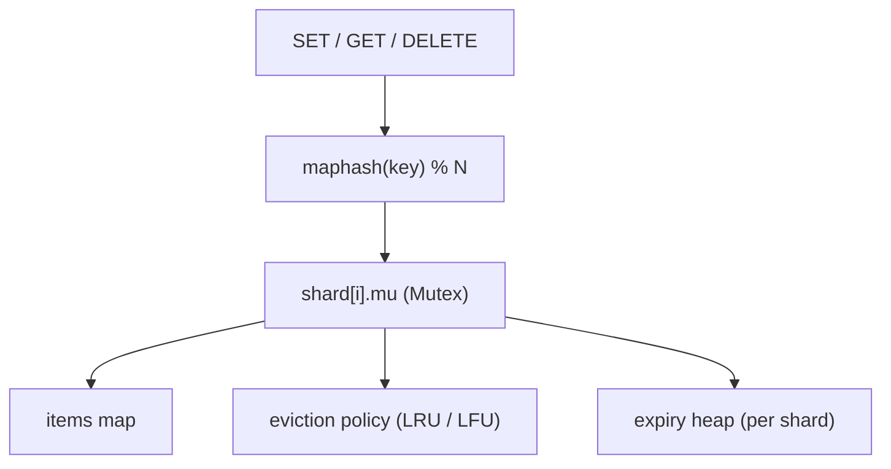
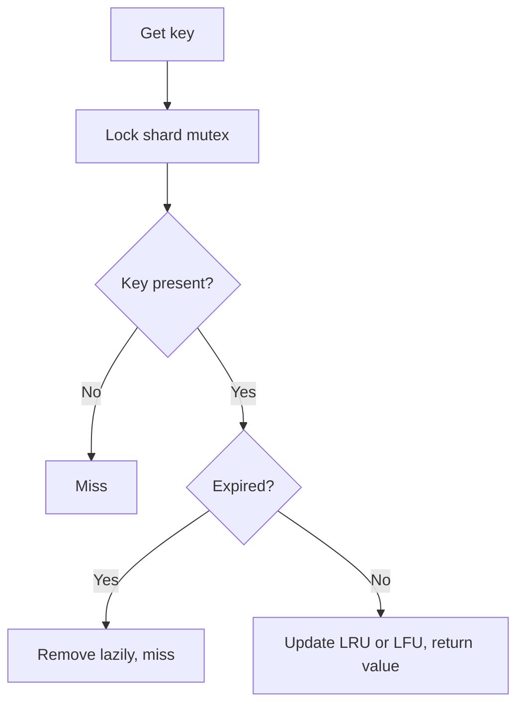

# 🗄️ In-Memory KV Store — High-Level Design

> **Target Level:** Senior/Staff Engineer
> **Focus:** Concurrent data store, eviction policies, TTL, persistence

---

## 1. SYSTEM OVERVIEW

**Purpose:** High-performance in-memory key-value store with configurable eviction policies and TTL support.

**Scale (single node):** millions of keys, sub-millisecond latency. A striped in-process map does roughly 10–50 M ops/s across cores. Behind a network API, the per-node ceiling is about 100 k–1 M ops/s, limited by syscalls and serialisation rather than the map.

---

## 2. SYSTEM ARCHITECTURE

```
┌─────────────────────────────────────────────────────────┐
│                     KV Store                              │
├─────────────────────────────────────────────────────────┤
│                                                          │
│  ┌──────────┐   ┌──────────┐   ┌──────────────────┐     │
│  │  SET     │   │  GET     │   │  DELETE          │     │
│  └────┬─────┘   └────┬─────┘   └──────┬───────────┘     │
│       │              │                │                  │
│       ▼              ▼                ▼                  │
│  ┌──────────────────────────────────────────┐            │
│  │  maphash(key) % N  →  shard[i].mu (Mutex) │            │
│  └──────────────────────────────────────────┘            │
│       │              │                │                  │
│       ▼              ▼                ▼                  │
│  ┌──────────┐   ┌──────────┐   ┌──────────────────┐     │
│  │  items   │   │eviction  │   │ expiry heap      │     │
│  │  map     │   │policy    │   │ (indexed, per    │     │
│  │          │   │(LRU/LFU) │   │  shard)          │     │
│  └──────────┘   └──────────┘   └──────────────────┘     │
│                                                          │
│  ┌──────────────────────────────────────────┐            │
│  │  Watchers (prefix) · Snapshot/Restore    │            │
│  └──────────────────────────────────────────┘            │
└─────────────────────────────────────────────────────────┘
```

*Figure: every operation hashes the key to one shard and takes only that shard lock.*



## 3. EVICTION POLICIES

| Policy | Algorithm | Complexity | Best For |
|--------|-----------|------------|----------|
| **LRU** | Doubly-linked list + map | O(1) | General purpose; weak against scans |
| **LFU** | Frequency buckets + `minFreq` (LRU tie-break) | O(1) | Stable hot sets; needs aging in production |
| **TTL expiry** (not an eviction policy) | Indexed min-heap per shard, lazy + active | O(log n) | Reclaiming dead keys before evicting live ones |

## 4. CONCURRENCY MODEL

Every operation takes exactly one shard `Mutex`. Reads take it exclusively too, because LRU and LFU update recency or frequency on every `Get`.

| Operation | Lock | Rationale |
|-----------|------|-----------|
| Get / GetVersioned | shard Mutex | Moves the key in the LRU/LFU structure; may lazily expire it |
| Set / CAS / Delete / Expire / Persist | shard Mutex | Mutation |
| DeleteExpired (janitor) | each shard's Mutex in turn | Never stalls the whole store |
| Keys / Stats / Snapshot | each shard's Mutex in turn | Consistent per shard, **not** point-in-time across shards |
| Watch registration / publish | `watchMu` (Lock / RLock), always taken after a shard lock | Close cannot race with send |

*Figure: Get takes the shard lock because it mutates recency or frequency, and expires lazily.*



## 5. TRADE-OFF ANALYSIS

| Decision | Choice | Rationale |
|----------|--------|-----------|
| Locking | N-way sharded `sync.Mutex` | RWMutex gives nothing when reads mutate; striping cuts contention about N× |
| Eviction scope | Per shard | Approximates global LRU; `Shards: 1` gives exact LRU |
| Eviction | Pluggable Strategy | Different workloads need different policies |
| TTL tracking | Indexed min-heap + lazy check | Bounded heap; readers never see dead keys |
| CAS versions | Store-wide monotonic counter | ABA-safe across delete/re-create and restore |
| Watch delivery | Non-blocking, drop + count | Writer latency independent of slow consumers |
| Persistence | JSON snapshot to `io.Writer` | Simple; a database would add a WAL and point-in-time snapshots |
| Capacity | Pluggable cost function (default 1 per entry) | Same code covers item limits and byte limits |

## 6. FAILURE MODES & PRODUCTION CONCERNS

| Failure / concern | Effect | Mitigation |
|---|---|---|
| Process crash | Everything since the last snapshot is lost | AOF/WAL with `fsync` every second (lose ≤ ~1 s) or on every write (slow); replay after loading the snapshot |
| Hot key | One shard (or node) saturates | Client-side near-cache with a short TTL; replicate reads of that key; split the value |
| Thundering herd on expiry | Many clients miss at once and stampede the backing DB | Add TTL jitter; single-flight per key; serve stale while revalidating |
| Mass expiry at one instant | Janitor holds a shard lock for a long time | Cap the work per tick (Redis samples 20 keys and repeats while > 25% are expired) |
| Slow watcher | Events dropped (`DroppedEvents`) | Watch from a version and re-list on gap (etcd model) |
| GC pauses with tens of millions of pointer-rich entries | Latency spikes | Pointer-free byte arenas (BigCache, FreeCache) or off-heap storage |
| Snapshot during heavy writes | Not point-in-time across shards | fork + COW (Redis `BGSAVE`), or a brief all-shard lock in fixed order |

**Capacity sketch:** 10 M keys × (~150 B overhead + 1 KB value) ≈ 11.5 GB, so plan for a 16 GB node, or shard across nodes with consistent hashing and 2–3× replication.
