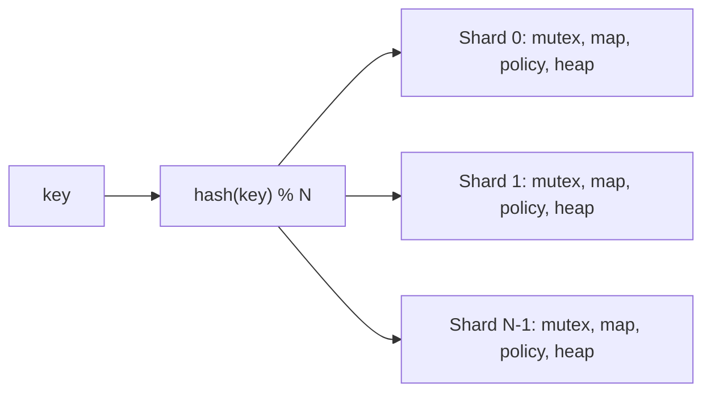
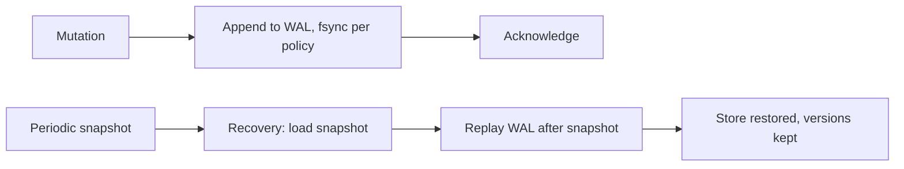

# 🗄️ In-Memory KV Store — Interview Questions

## Q1: Compare LRU vs LFU eviction. When would you use each?

**Answer:**
- **LRU** evicts whatever was touched least recently. It suits most caching (DB query cache, sessions) where recent use predicts reuse. Its weakness is **scan pollution**: one sequential scan over cold keys flushes the hot set.
- **LFU** evicts whatever has the lowest access count. It keeps "evergreen" hot keys through scans. Its weakness: keys that were popular once keep a high count forever. Fix that with **aging/decay**: Redis's LFU uses a logarithmic counter that decays over time.
- In practice, **W-TinyLFU** (Caffeine, Ristretto) combines both. A small LRU window feeds a frequency-filtered main region, with a Count-Min Sketch as the admission filter.
- Both are O(1) here. LFU uses frequency buckets plus `minFreq`, with LRU order inside each bucket for ties.

## Q2: How do you handle concurrent access efficiently?

**Answer:**
- An `RWMutex` only helps if reads don't write. **With LRU or LFU they do**: every `Get` reorders the list. So a global `RWMutex` either races (if you mutate under `RLock`) or behaves like a plain `Mutex`.
- **Shard (stripe) the keyspace**: hash the key to one of N shards, each with its own mutex, map, policy and heap. Contention drops roughly N-fold. The cost is that eviction becomes per-shard, an approximate global LRU.
- To make reads truly read-only: use sampled LRU (Redis stores a last-access timestamp per key, updated atomically, and evicts the oldest of K random samples), or buffer access events and apply them in batches (Caffeine's read buffer).
- `sync.Map` fits append-mostly or disjoint-key workloads. It doesn't help with eviction bookkeeping.

*Figure: sharding the keyspace so each shard has its own lock, map, policy and heap.*

## Q3: How would you implement distributed sharding?

**Answer:**
- Use consistent hashing with virtual nodes, so adding a node moves only about 1/N of the keys. Redis Cluster uses 16,384 fixed hash slots instead, which makes rebalancing an explicit slot migration.
- Replicate each shard 2–3×. For a cache, asynchronous primary→replica replication is the norm. You accept losing the last few writes on failover.
- Track membership through gossip (Redis Cluster, Dynamo) or a coordinator (ZooKeeper/etcd).
- Read repair and anti-entropy (Merkle trees) matter for a Dynamo-style leaderless store. A primary-replica cache doesn't need them.

## Q4: How would you add persistence and recovery?

**Answer:**
- **WAL / AOF:** append every mutation before acknowledging it. The fsync policy is the knob: every write (durable, slow), every second (Redis's default `appendfsync everysec`, which loses up to about 1 s), or leave it to the OS.
- **Snapshots:** a periodic full dump, like Redis RDB, which uses `fork()` and copy-on-write to get a point-in-time image without blocking writers. Recover by loading the snapshot and then replaying the WAL from the snapshot's offset.
- This implementation's `Snapshot` is consistent per shard, not per store. To make it point-in-time you'd have to briefly lock all shards in a fixed order, or use copy-on-write.
- Keep versions across restore, otherwise a CAS issued before the restart could succeed against a different value.

*Figure: recovery loads the snapshot, then replays the WAL written after it.*

## 🔁 Follow-ups interviewers actually push on

### "Make `Get` faster. It's 95% of traffic."
More shards, first. Then make the read path read-only: sampled LRU with an atomic `lastAccess` per entry, which lets you use an `RWMutex` (or a lock-free map) for lookups. Or buffer access records and drain them under the lock in batches. Measure before and after with `go test -bench` and `-cpu=1,4,16`.

### "Add `INCR`."
Clients can loop on `GetVersioned` + `CompareAndSwap` (shown in the demo). But under contention that loop retries a lot. A server-side `Update(key, fn)` that runs `fn` under the shard lock is atomic, with no retries. Warn that `fn` must be fast and must not call back into the store, or it deadlocks.

### "What happens if a watcher is slow?"
`publish` runs under the shard lock. A blocking send would stall every writer on that shard behind the slowest consumer. So the send is non-blocking, and drops are counted. Alternatives: a per-watcher goroutine with an unbounded queue (now memory is unbounded), or disconnecting the slow watcher and letting it resync from a version (what etcd does: watch from a revision, and if it's compacted, re-list).

### "Can a write evict the key being written?"
Not here: replace is remove-then-insert, and the cost check happens before the old value is touched. This is a classic bug. A naive "evict until it fits" loop can pick the key itself and double-subtract its size.

### "Why are versions global and not per key?"
ABA. With per-key versions, `delete(k)` followed by `set(k)` restarts at 1, and a client still holding version 1 overwrites the new value. A store-wide monotonic counter never reuses a value.

### "How do you test TTL without sleeping?"
Inject the clock (`Options.Clock`) and advance a `ManualClock`. The tests check lazy expiry, janitor purging, `Persist`, and that an overwrite without a TTL drops the old deadline, all in microseconds.

### "How do you test the concurrency?"
`go test -race` on a CAS-counter test: the final count must equal workers × increments. Add a mixed-operation stress test that checks the shard invariants afterwards: the cost sum equals `shard.cost`, `cost ≤ maxCost`, and the heap size is at most the item count. Finally, check that `RunJanitor` and watcher goroutines exit after cancellation, so nothing leaks.

### "Memory overhead per key?"
In Go: map bucket slot + `*entry` (key string header 16 B, value, version 8 B, `time.Time` 24 B, cost 8 B, heap index 8 B) + list element (about 48 B) + key bytes. That's roughly 150–200 B of overhead per key before the value. At 10 M keys that's about 2 GB just for overhead. That's when you reach for a byte-arena design (BigCache/FreeCache) that hides pointers from the GC.

## ⚠️ Common mistakes
- Using an `RWMutex` and calling LRU `MoveToFront` (or `value.AccessCount++`) under `RLock`. That's a data race.
- Giving the eviction policy its own lock *and* calling it under the store lock. Double locking, and policies that call back into the store deadlock.
- A lazy-deletion expiry heap with no cap. Hot keys overwritten with long TTLs grow it without bound.
- Expiring only lazily. Keys nobody reads never free their memory.
- Sending to watcher channels while holding a lock, with a blocking send.
- Letting more than one party close a channel (for example, both the subscriber and the store).
- Starting a background goroutine in the constructor with no way to stop it.
- Using `interface{}` values and JSON snapshots: numbers come back as `float64`.

## 🎯 Senior vs Staff signal
- **Senior:** working LRU + TTL with correct locking. Explains lazy vs active expiry. Writes a race-detector test. Knows sharding reduces contention.
- **Staff:** spots that LRU turns reads into writes, and from that picks striping over `RWMutex` and discusses sampled LRU. Designs CAS to be ABA-safe. Defines who owns and closes each channel, and the backpressure policy. Says up front what the snapshot guarantees (per shard vs point-in-time). Connects the design to Redis, Caffeine and etcd, and to capacity numbers (bytes per key, GC pressure).
