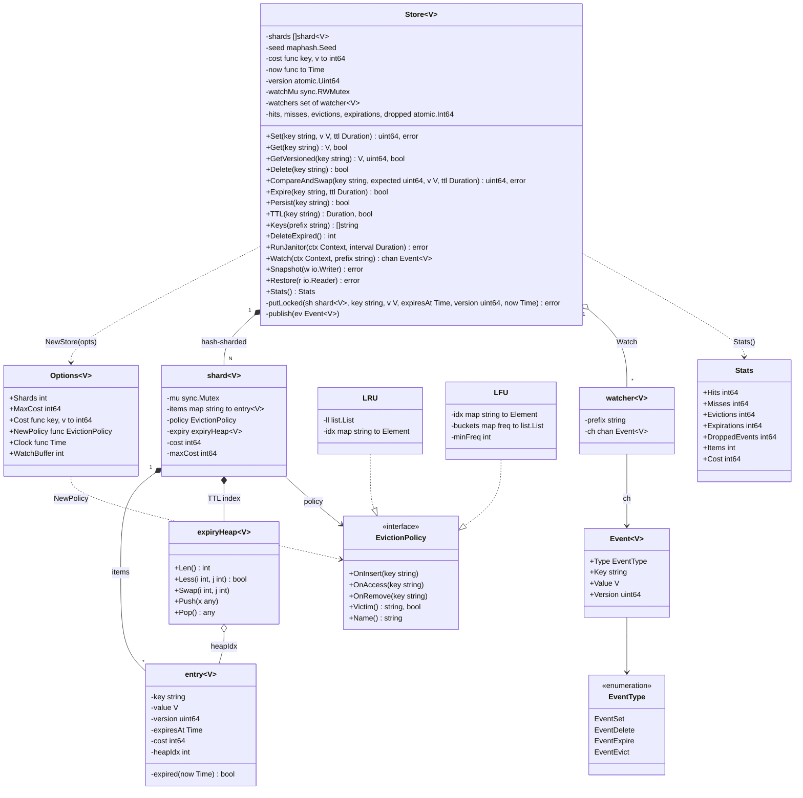

# 🧠 In-Memory KV Store — Thought Process

## 📊 Class Diagram

---

## Problem Breakdown

### Step 1: Core Data Structure
- A map gives O(1) get/set/delete.
- Make values generic (`Store[V any]`) so callers get typed values back and snapshots round-trip without type loss.
- Track a per-entry *cost*. The default is 1 per entry, so capacity means "max items". Plug in a byte-based cost function if the interviewer wants a memory limit.

### Step 2: Concurrency
- First instinct: `sync.RWMutex`. Then notice that **LRU makes every read a write**, because `Get` moves the key in the recency list. An `RWMutex` buys nothing and invites a race.
- So: shard the keyspace. Each shard has its own `sync.Mutex`, map, policy and heap. Contention drops by roughly N.
- Trade-off to say out loud: per-shard eviction approximates global LRU. One shard gives exact LRU.

### Step 3: Eviction Policies
- Strategy interface: `OnInsert`, `OnAccess`, `OnRemove`, `Victim`. Policies are not thread-safe. The shard lock guards them.
- LRU: `container/list` plus a map, O(1).
- LFU: frequency buckets plus `minFreq`, O(1). A heap would be O(log n) and needs decrease-key handling.

### Step 4: TTL
- Lazy expiry on every access, plus an active janitor so keys nobody reads still free their memory.
- Indexed min-heap per shard, so overwrite and `Persist` can remove the old deadline in O(log n).
- Inject the clock so tests don't `time.Sleep`.

### Step 5: CAS, Watch, Snapshot
- Versions come from a store-wide atomic counter. Per-key counters reset on re-create and cause ABA.
- `Watch(ctx, prefix) <-chan Event`: the store owns and closes the channel, and cancelling `ctx` unsubscribes. Sends are non-blocking, so a slow watcher can't stall writers.
- Snapshot to an `io.Writer` as JSON. Restore skips anything that expired in the meantime.

## Key Decisions

| Decision | Why |
|----------|-----|
| Sharded `sync.Mutex` over a global `RWMutex` | LRU/LFU mutate on read; striping is what actually reduces contention |
| Policies not goroutine-safe | One lock per operation; no lock-ordering bugs |
| Replace = remove + insert | A write can never evict itself; cost accounting stays exact |
| Indexed expiry heap | Bounded heap size; O(log n) TTL changes |
| Lazy + active expiry | Reads never see dead keys; unread keys still get reclaimed |
| Global monotonic version | CAS is ABA-safe across delete/re-create and restarts |
| Non-blocking watch fan-out | Writers' latency is independent of the slowest consumer |

## ⏱️ How to run this in a 45–60 min interview

| Time | Phase | What to do | What to say out loud |
|------|-------|-----------|----------------------|
| 0–5 | Clarify | Ask the questions below and write the API on the board | "I'll assume a single process, in-memory, item-count capacity, and that I can extend to bytes." |
| 5–10 | Entities | `Store`, `entry`, `EvictionPolicy`, expiry heap | "Eviction is the obvious axis of change, so it's an interface from the start." |
| 10–25 | Core | Map + LRU + `Set`/`Get`/`Delete` with capacity | "Replace removes first, so a write never evicts itself." |
| 25–35 | TTL | Lazy check in `Get`, heap, `DeleteExpired` | "Lazy expiry alone leaks memory for keys nobody reads, so I add a janitor." |
| 35–45 | Concurrency | One mutex, then shards | "RWMutex is a trap here, because LRU writes on read." |
| 45–60 | Extension | CAS, Watch or LFU, whichever they ask for | Show that the change touches one place. |

### Clarifying questions worth asking
- Is capacity a number of items or a number of bytes? What happens to a single value bigger than capacity?
- Do we need TTL? Must expiry be exact, or only exact as far as readers can see?
- What's the read/write ratio, and how many concurrent clients?
- Which eviction policy: LRU, LFU, or pluggable?
- Do we need durability across restarts, or is it a cache?
- Do we need conditional writes (CAS / SETNX) or change notifications?
