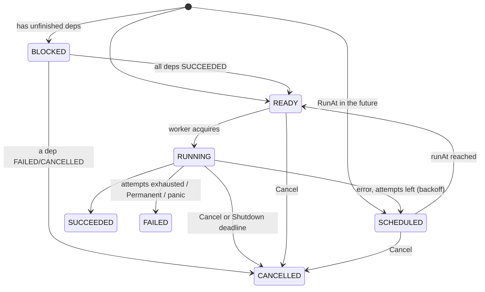

# Task Queue / Worker Pool — Go Implementation

> An in-process task queue with priority scheduling, delayed tasks, retries with exponential backoff, per-attempt timeouts, task dependencies, cancellation, dead letters and graceful shutdown.

## 📦 Core Implementation

### Key Abstractions

| Type | Responsibility | Pattern |
|------|---------------|---------|
| `Queue` | `Submit`, `Start`, `Cancel`, `Wait`, `Shutdown`, `Stats`, `DeadLetters` | Facade |
| `TaskSpec` / `TaskResult` | What callers submit and get back | Value objects |
| `Handler` / `HandlerFunc` | Processes one attempt of one task type | Strategy (+ adapter, like `http.HandlerFunc`) |
| `task` | Internal state: status, attempts, heap index, dependents, done channel | |
| `taskHeap` | Indexed binary heap with a pluggable `less` | Heap |
| `Permanent(err)` | Marks an error as non-retryable | Error wrapping |
| `ExponentialBackoff` | `base·2^(n-1)` capped, with full jitter | |

### Task lifecycle



All terminal transitions go through `finalizeLocked`. It runs exactly once per task, closes the `done` channel, appends to the dead-letter list on `FAILED`, and then unblocks or cascade-cancels the dependents.

### Key design decisions

**1. One mutex, handlers outside it.** All of the state (ready heap, delayed heap, task index, counters) sits behind one `sync.Mutex`. The critical sections are a few O(log n) heap operations. The handler, the slow part, runs with no lock held. Sharding the lock wouldn't buy anything until well past 10⁵ tasks/s.

**2. Workers pull, and sleep on a broadcast channel.** `acquire()` either returns a task, or returns `(q.changed, wait)`. The worker then `select`s on `changed`, a timer for the earliest delayed task, and `baseCtx.Done()`. Every state change calls `notifyLocked()`, which **closes and replaces** `changed`, waking every idle worker. This is `sync.Cond.Broadcast` that composes with `select`. There's no lost wake-up, because the channel is captured under the same lock as the emptiness check. There's no 100 ms polling either.

**3. Delays live in a heap, not in `time.AfterFunc`.** Delayed tasks and retry backoffs go into `delayed` (ordered by `runAt`, then `seq`). A timer callback that fires after shutdown, or that a cancel can't find, is a classic leak. Here everything waiting stays visible to `Cancel` and `Shutdown`.

**4. Strict total order.** The ready heap orders by `(priority desc, seq asc)`. The comparator must not read `time.Now()`. The previous version did, which breaks the heap invariant because comparisons change over time.

**5. Dependencies can't form cycles.** `DependsOn` may only name tasks that are already submitted, so the graph is a DAG by construction. A task with unfinished dependencies waits in `BLOCKED`, outside both heaps. It doesn't sit at the top of the ready heap stalling everything behind it. Each dependency keeps a list of `dependents`, and on success it decrements their `waitingOn`.

**6. Retries.** `attempts < MaxAttempts` and the error isn't `Permanent` → re-enqueue with `runAt = now + Backoff(attempt)`. The default backoff is exponential with **full jitter** (`rand.N(d+1)`), so a burst of failures doesn't retry in lockstep. Panics are recovered into `Permanent` errors, so one bad payload can't kill a worker.

**7. Cancellation is cooperative.** A queued task is removed immediately: it records `heapIdx`, and `finalizeLocked` calls `heap.Remove`. A running task has its attempt context cancelled. When the handler returns, `finish` sees `cancelRequested` and marks it `CANCELLED` without retrying. A handler that ignores `ctx` can't be stopped. Go has no goroutine kill, so that's a contract the `Handler` docs state.

**8. Shutdown(ctx).** First it sets `closing`, so `Submit` returns `ErrClosed`. Workers keep draining, delayed retries included, until `outstanding == 0`. If `ctx` expires first, `hardStop()` cancels `baseCtx`, the parent of every attempt context. In-flight handlers return, the workers exit, and every remaining task is finalized as `CANCELLED`. A small goroutine waits on the `WaitGroup` so `Shutdown` can `select` on it against `ctx`. It always exits, because hard stop makes the workers return.

**9. Results via `Wait(ctx, id)`, not a shared results channel.** A buffered results channel that nobody reads fills up and blocks every worker. A per-task `done` channel that is closed exactly once can't block anyone.

### Where to extend

| Requirement | Change |
|---|---|
| Per-type concurrency limits | A `map[type]chan struct{}` semaphore checked in `acquire`. Skip tasks whose type is saturated, which needs a heap per type. |
| Starvation of low priority | Aging: the effective priority rises with wait time. That has to be a periodic re-heap, never `time.Now()` inside `Less`. |
| Rate limiting | A token bucket per type, consulted before handing out a task |
| Durable queue | Replace the heaps with a DB table or Redis ZSET. Make `acquire` a lease (`SELECT … FOR UPDATE SKIP LOCKED` + `lease_until`). See HIGH_LEVEL_DESIGN. |
| Bounded memory for finished tasks | Today `tasks` keeps every finished task for `Wait` and idempotency. Add a retention window, or move results to a store with a TTL. |
| Redrive from the dead-letter list | Resubmit with a new ID (old dependents were already cancelled) |

## ▶️ How to Run

```bash
cd golang-low-level-design/task-queue
go run task_queue.go
go test -race task_queue.go task_queue_test.go
```

## 🧩 Design Patterns

| Pattern | Where | Why |
|---------|-------|-----|
| **Worker Pool** | `Start` / `worker` | Bounded concurrency, fixed goroutine count |
| **Strategy** | `Handler` per task type | New task types without touching the queue |
| **Adapter** | `HandlerFunc` | Plain functions as handlers |
| **Priority Queue** | `taskHeap` × 2 | O(log n) dispatch by priority and by time |
| **Exponential Backoff + Jitter** | `ExponentialBackoff` | Avoid synchronized retry storms |
| **Dead Letter** | `DeadLetters()` | Park poison tasks for inspection instead of retrying forever |

## 📄 Full Source

<!-- source: task_queue.go -->
```go
// Task Queue / Worker Pool - Low Level Design (Go)
// --------------------------------------------------
// An in-process task queue: priority scheduling, delayed tasks, retries with
// exponential backoff, per-attempt timeouts, dependencies (DAG), cancellation,
// a dead-letter list and graceful shutdown with a deadline.
//
// Key design decisions:
//   - One mutex guards all queue state (two heaps + task index). Handlers run
//     outside the lock, so the critical sections are a few heap operations.
//   - Workers pull. When idle they block on a "changed" channel that is
//     closed and replaced on every state change (a broadcast that, unlike
//     sync.Cond, composes with select/ctx/timers), or on a timer for the next
//     delayed task. No polling loop.
//   - Delayed tasks and retry backoff live in a second heap ordered by runAt,
//     not in time.AfterFunc callbacks, so shutdown can see and cancel them.
//   - Ready heap order: priority desc, then submission sequence: a strict,
//     time-independent total order (FIFO within a priority).
//   - Dependencies must already be submitted, which makes cycles impossible.
//     A task becomes ready when all of its dependencies succeed; if any fails
//     or is cancelled, the dependent is cancelled (cascading).
//   - Every task has a done channel closed exactly once on its terminal state;
//     Wait(ctx, id) selects on it. No global results channel that can fill up
//     and block workers.
//   - Shutdown(ctx): stop accepting, drain everything already submitted; if
//     ctx expires first, cancel the base context (in-flight handlers see
//     ctx.Done()) and mark everything left Cancelled.

package main

import (
	"container/heap"
	"context"
	"errors"
	"fmt"
	"math/rand/v2"
	"strings"
	"sync"
	"time"
)

// ============================================================
// PUBLIC TYPES
// ============================================================

type Priority int

const (
	PriorityLow Priority = iota
	PriorityNormal
	PriorityHigh
	PriorityCritical
)

type Status int

const (
	StatusBlocked   Status = iota // waiting on dependencies
	StatusScheduled               // waiting for runAt (delayed task or retry backoff)
	StatusReady                   // in the priority heap
	StatusRunning
	StatusSucceeded
	StatusFailed // exhausted attempts or permanent error; dead-lettered
	StatusCancelled
)

func (s Status) String() string {
	return [...]string{"BLOCKED", "SCHEDULED", "READY", "RUNNING", "SUCCEEDED", "FAILED", "CANCELLED"}[s]
}

func (s Status) Terminal() bool { return s >= StatusSucceeded }

var (
	ErrClosed            = errors.New("taskqueue: queue is shut down")
	ErrUnknownHandler    = errors.New("taskqueue: no handler for task type")
	ErrUnknownDependency = errors.New("taskqueue: unknown dependency")
	ErrNotFound          = errors.New("taskqueue: task not found")
	ErrAlreadyFinished   = errors.New("taskqueue: task already finished")
	ErrDependencyFailed  = errors.New("taskqueue: dependency did not succeed")
	ErrCancelled         = errors.New("taskqueue: task cancelled")
)

// Handler processes one task attempt. It must honour ctx: that is the only
// way to stop it on timeout, Cancel or Shutdown.
type Handler interface {
	Handle(ctx context.Context, payload any) (any, error)
}

// HandlerFunc adapts a function to Handler (like http.HandlerFunc).
type HandlerFunc func(ctx context.Context, payload any) (any, error)

func (f HandlerFunc) Handle(ctx context.Context, p any) (any, error) { return f(ctx, p) }

// Permanent marks an error as non-retryable (bad input, 4xx, ...).
func Permanent(err error) error { return &permanentError{err} }

type permanentError struct{ err error }

func (e *permanentError) Error() string { return "permanent: " + e.err.Error() }
func (e *permanentError) Unwrap() error { return e.err }

type TaskSpec struct {
	ID          string // idempotency key; generated if empty
	Type        string // selects the Handler
	Payload     any
	Priority    Priority
	MaxAttempts int           // default 3
	Timeout     time.Duration // per attempt; 0 = none
	RunAt       time.Time     // zero = as soon as possible
	DependsOn   []string      // IDs of already-submitted tasks
}

type TaskResult struct {
	ID       string
	Status   Status
	Value    any
	Err      error
	Attempts int
}

type Options struct {
	Workers  int                             // default 4
	Handlers map[string]Handler              // fixed at construction: read without locking
	Backoff  func(attempt int) time.Duration // delay before retry #attempt; default exp + full jitter
}

// ExponentialBackoff returns base*2^(attempt-1) capped at max, with "full
// jitter" (uniform in [0, d]) so retries from a burst of failures spread out.
func ExponentialBackoff(base, max time.Duration) func(int) time.Duration {
	return func(attempt int) time.Duration {
		d := base << (attempt - 1)
		if d > max || d <= 0 { // d <= 0 guards shift overflow
			d = max
		}
		return rand.N(d + 1)
	}
}

// ============================================================
// INTERNAL TASK + HEAPS
// ============================================================

type task struct {
	spec       TaskSpec
	seq        uint64
	status     Status
	attempts   int
	runAt      time.Time
	heapIdx    int
	waitingOn  int     // unfinished dependencies
	dependents []*task // tasks waiting on this one

	ctx             context.Context    // set while running
	cancel          context.CancelFunc // set while running
	cancelRequested bool

	value any
	err   error
	done  chan struct{} // closed on terminal status
}

type taskHeap struct {
	items []*task
	less  func(a, b *task) bool
}

func (h *taskHeap) Len() int           { return len(h.items) }
func (h *taskHeap) Less(i, j int) bool { return h.less(h.items[i], h.items[j]) }
func (h *taskHeap) Swap(i, j int) {
	h.items[i], h.items[j] = h.items[j], h.items[i]
	h.items[i].heapIdx = i
	h.items[j].heapIdx = j
}
func (h *taskHeap) Push(x any) {
	t := x.(*task)
	t.heapIdx = len(h.items)
	h.items = append(h.items, t)
}
func (h *taskHeap) Pop() any {
	n := len(h.items)
	t := h.items[n-1]
	h.items[n-1] = nil
	h.items = h.items[:n-1]
	t.heapIdx = -1
	return t
}
func (h *taskHeap) peek() *task { return h.items[0] }

func byPriority(a, b *task) bool {
	if a.spec.Priority != b.spec.Priority {
		return a.spec.Priority > b.spec.Priority
	}
	return a.seq < b.seq
}

func byRunAt(a, b *task) bool {
	if !a.runAt.Equal(b.runAt) {
		return a.runAt.Before(b.runAt)
	}
	return a.seq < b.seq
}

// ============================================================
// QUEUE
// ============================================================

type Queue struct {
	handlers map[string]Handler
	backoff  func(int) time.Duration
	workers  int

	baseCtx  context.Context // parent of every attempt's ctx
	hardStop context.CancelFunc

	mu          sync.Mutex
	tasks       map[string]*task
	ready       taskHeap
	delayed     taskHeap
	changed     chan struct{} // closed + replaced on every state change
	seq         uint64
	outstanding int // non-terminal tasks
	closing     bool
	started     bool
	deadLetters []TaskResult
	retries     int

	wg sync.WaitGroup
}

func New(opts Options) *Queue {
	if opts.Workers <= 0 {
		opts.Workers = 4
	}
	if opts.Backoff == nil {
		opts.Backoff = ExponentialBackoff(100*time.Millisecond, 10*time.Second)
	}
	ctx, cancel := context.WithCancel(context.Background())
	return &Queue{
		handlers: opts.Handlers,
		backoff:  opts.Backoff,
		workers:  opts.Workers,
		baseCtx:  ctx,
		hardStop: cancel,
		tasks:    make(map[string]*task),
		ready:    taskHeap{less: byPriority},
		delayed:  taskHeap{less: byRunAt},
		changed:  make(chan struct{}),
	}
}

// Start launches the workers. Tasks may be submitted before Start.
func (q *Queue) Start() {
	q.mu.Lock()
	defer q.mu.Unlock()
	if q.started {
		return
	}
	q.started = true
	for i := 0; i < q.workers; i++ {
		q.wg.Add(1)
		go q.worker()
	}
}

func (q *Queue) notifyLocked() {
	close(q.changed)
	q.changed = make(chan struct{})
}

// Submit enqueues a task. It is idempotent on ID: re-submitting an existing
// ID returns that ID without enqueuing a duplicate.
func (q *Queue) Submit(spec TaskSpec) (string, error) {
	if _, ok := q.handlers[spec.Type]; !ok {
		return "", fmt.Errorf("%w: %q", ErrUnknownHandler, spec.Type)
	}
	if spec.MaxAttempts <= 0 {
		spec.MaxAttempts = 3
	}
	q.mu.Lock()
	defer q.mu.Unlock()
	if q.closing {
		return "", ErrClosed
	}
	q.seq++
	if spec.ID == "" {
		spec.ID = fmt.Sprintf("task-%d", q.seq)
	}
	if _, dup := q.tasks[spec.ID]; dup {
		return spec.ID, nil
	}
	deps := make([]*task, 0, len(spec.DependsOn))
	for _, id := range spec.DependsOn {
		d, ok := q.tasks[id]
		if !ok {
			return "", fmt.Errorf("%w: %q", ErrUnknownDependency, id)
		}
		deps = append(deps, d)
	}
	t := &task{spec: spec, seq: q.seq, heapIdx: -1, runAt: spec.RunAt, done: make(chan struct{})}
	q.tasks[spec.ID] = t
	q.outstanding++
	for _, d := range deps {
		switch {
		case d.status == StatusSucceeded:
		case d.status.Terminal():
			q.finalizeLocked(t, StatusCancelled, nil, fmt.Errorf("%w: %s", ErrDependencyFailed, d.spec.ID))
			return t.spec.ID, nil
		default:
			t.waitingOn++
			d.dependents = append(d.dependents, t)
		}
	}
	if t.waitingOn > 0 {
		t.status = StatusBlocked
	} else {
		q.enqueueLocked(t)
	}
	return t.spec.ID, nil
}

// enqueueLocked puts a runnable task in the delayed or ready heap.
func (q *Queue) enqueueLocked(t *task) {
	if !t.runAt.IsZero() && time.Now().Before(t.runAt) {
		t.status = StatusScheduled
		heap.Push(&q.delayed, t)
	} else {
		t.status = StatusReady
		heap.Push(&q.ready, t)
	}
	q.notifyLocked()
}

// finalizeLocked moves t to a terminal status exactly once and resolves its
// dependents: unblock them on success, cancel them (recursively) otherwise.
func (q *Queue) finalizeLocked(t *task, st Status, v any, err error) {
	if t.status.Terminal() {
		return
	}
	switch t.status { // remove from wherever it is queued
	case StatusReady:
		heap.Remove(&q.ready, t.heapIdx)
	case StatusScheduled:
		heap.Remove(&q.delayed, t.heapIdx)
	}
	t.status, t.value, t.err = st, v, err
	q.outstanding--
	if st == StatusFailed {
		q.deadLetters = append(q.deadLetters, t.resultLocked())
	}
	close(t.done)
	for _, d := range t.dependents {
		if d.status.Terminal() {
			continue
		}
		if st == StatusSucceeded {
			if d.waitingOn--; d.waitingOn == 0 {
				q.enqueueLocked(d)
			}
		} else {
			q.finalizeLocked(d, StatusCancelled, nil, fmt.Errorf("%w: %s", ErrDependencyFailed, t.spec.ID))
		}
	}
	t.dependents = nil
	q.notifyLocked()
}

func (t *task) resultLocked() TaskResult {
	return TaskResult{ID: t.spec.ID, Status: t.status, Value: t.value, Err: t.err, Attempts: t.attempts}
}

// acquire returns the next task to run, or (nil, wake, wait) to sleep on, or
// (nil, nil, 0) when the worker should exit.
func (q *Queue) acquire() (*task, <-chan struct{}, time.Duration) {
	q.mu.Lock()
	defer q.mu.Unlock()
	if q.baseCtx.Err() != nil {
		return nil, nil, 0
	}
	now := time.Now()
	for q.delayed.Len() > 0 && !now.Before(q.delayed.peek().runAt) {
		t := heap.Pop(&q.delayed).(*task)
		t.status = StatusReady
		heap.Push(&q.ready, t)
	}
	if q.ready.Len() > 0 {
		t := heap.Pop(&q.ready).(*task)
		t.status = StatusRunning
		t.attempts++
		ctx, cancel := context.WithCancel(q.baseCtx)
		if t.spec.Timeout > 0 {
			ctx, cancel = context.WithTimeout(q.baseCtx, t.spec.Timeout)
		}
		t.ctx, t.cancel = ctx, cancel
		return t, nil, 0
	}
	if q.closing && q.outstanding == 0 {
		return nil, nil, 0
	}
	var wait time.Duration
	if q.delayed.Len() > 0 {
		wait = q.delayed.peek().runAt.Sub(now)
	}
	return nil, q.changed, wait
}

func (q *Queue) worker() {
	defer q.wg.Done()
	for {
		t, wake, wait := q.acquire()
		if t != nil {
			q.run(t)
			continue
		}
		if wake == nil {
			return
		}
		var timer *time.Timer
		var timerC <-chan time.Time
		if wait > 0 {
			timer = time.NewTimer(wait)
			timerC = timer.C
		}
		select {
		case <-wake:
		case <-timerC:
		case <-q.baseCtx.Done():
		}
		if timer != nil {
			timer.Stop()
		}
	}
}

// run executes one attempt outside the lock, then records the outcome.
func (q *Queue) run(t *task) {
	v, err := safeHandle(t.ctx, q.handlers[t.spec.Type], t.spec.Payload)
	t.cancel()
	q.finish(t, v, err)
}

// safeHandle turns a handler panic into an error so one bad task cannot
// kill a worker goroutine (and with it, silently, the pool's capacity).
func safeHandle(ctx context.Context, h Handler, p any) (v any, err error) {
	defer func() {
		if r := recover(); r != nil {
			err = Permanent(fmt.Errorf("handler panic: %v", r))
		}
	}()
	return h.Handle(ctx, p)
}

func (q *Queue) finish(t *task, v any, err error) {
	q.mu.Lock()
	defer q.mu.Unlock()
	t.ctx, t.cancel = nil, nil
	var perm *permanentError
	switch {
	case err == nil:
		q.finalizeLocked(t, StatusSucceeded, v, nil)
	case t.cancelRequested || q.baseCtx.Err() != nil:
		q.finalizeLocked(t, StatusCancelled, nil, fmt.Errorf("%w: %v", ErrCancelled, err))
	case t.attempts < t.spec.MaxAttempts && !errors.As(err, &perm):
		q.retries++
		t.err = err
		t.runAt = time.Now().Add(q.backoff(t.attempts))
		q.enqueueLocked(t)
	default:
		q.finalizeLocked(t, StatusFailed, nil, err)
	}
}

// Cancel stops a task. A queued or blocked task is removed immediately; a
// running task has its context cancelled and is marked Cancelled when the
// handler returns. Dependents are cancelled too.
func (q *Queue) Cancel(id string) error {
	q.mu.Lock()
	defer q.mu.Unlock()
	t, ok := q.tasks[id]
	switch {
	case !ok:
		return ErrNotFound
	case t.status.Terminal():
		return ErrAlreadyFinished
	case t.status == StatusRunning:
		t.cancelRequested = true
		t.cancel()
	default:
		q.finalizeLocked(t, StatusCancelled, nil, ErrCancelled)
	}
	return nil
}

// Wait blocks until the task reaches a terminal status or ctx is done.
func (q *Queue) Wait(ctx context.Context, id string) (TaskResult, error) {
	q.mu.Lock()
	t, ok := q.tasks[id]
	q.mu.Unlock()
	if !ok {
		return TaskResult{}, ErrNotFound
	}
	select {
	case <-t.done:
		q.mu.Lock()
		defer q.mu.Unlock()
		return t.resultLocked(), nil
	case <-ctx.Done():
		return TaskResult{}, ctx.Err()
	}
}

// Shutdown stops accepting tasks and waits for everything already submitted
// (including delayed tasks and pending retries) to finish. If ctx expires
// first, in-flight attempts are cancelled via their context, the remaining
// tasks are marked Cancelled, and ctx.Err() is returned. A handler that
// ignores ctx will still delay the return: Go cannot kill a goroutine.
func (q *Queue) Shutdown(ctx context.Context) error {
	q.mu.Lock()
	q.closing = true
	if !q.started { // nobody would drain: start workers so Shutdown terminates
		q.mu.Unlock()
		q.Start()
		q.mu.Lock()
	}
	q.notifyLocked()
	q.mu.Unlock()

	drained := make(chan struct{})
	go func() { q.wg.Wait(); close(drained) }()
	select {
	case <-drained:
		return nil
	case <-ctx.Done():
	}
	q.hardStop()
	<-drained // workers exit once their current handler returns
	q.mu.Lock()
	defer q.mu.Unlock()
	for _, t := range q.tasks {
		q.finalizeLocked(t, StatusCancelled, nil, fmt.Errorf("%w: shutdown", ErrCancelled))
	}
	return ctx.Err()
}

type Stats struct {
	ByStatus    map[Status]int
	Retries     int
	DeadLetters int
}

func (q *Queue) Stats() Stats {
	q.mu.Lock()
	defer q.mu.Unlock()
	st := Stats{ByStatus: make(map[Status]int), Retries: q.retries, DeadLetters: len(q.deadLetters)}
	for _, t := range q.tasks {
		st.ByStatus[t.status]++
	}
	return st
}

// DeadLetters returns tasks that failed permanently, oldest first.
func (q *Queue) DeadLetters() []TaskResult {
	q.mu.Lock()
	defer q.mu.Unlock()
	return append([]TaskResult(nil), q.deadLetters...)
}

// ============================================================
// DEMO
// ============================================================

func main() {
	var mu sync.Mutex
	var order []string
	record := func(s string) { mu.Lock(); order = append(order, s); mu.Unlock() }
	flakyCalls := 0

	handlers := map[string]Handler{
		"echo": HandlerFunc(func(ctx context.Context, p any) (any, error) {
			record(p.(string))
			return p, nil
		}),
		"flaky": HandlerFunc(func(ctx context.Context, p any) (any, error) {
			mu.Lock()
			flakyCalls++
			n := flakyCalls
			mu.Unlock()
			if n < 3 {
				return nil, fmt.Errorf("transient error #%d", n)
			}
			return "ok on attempt 3", nil
		}),
		"broken": HandlerFunc(func(ctx context.Context, p any) (any, error) {
			return nil, errors.New("downstream 503")
		}),
		"invalid": HandlerFunc(func(ctx context.Context, p any) (any, error) {
			return nil, Permanent(errors.New("payload failed validation"))
		}),
		"sleep": HandlerFunc(func(ctx context.Context, p any) (any, error) {
			select {
			case <-time.After(p.(time.Duration)):
				return "slept", nil
			case <-ctx.Done():
				return nil, ctx.Err()
			}
		}),
	}
	fixedBackoff := func(attempt int) time.Duration { return time.Duration(attempt) * 5 * time.Millisecond }
	bg := context.Background()
	show := func(q *Queue, id string) {
		r, _ := q.Wait(bg, id)
		fmt.Printf("  %-10s %-9s attempts=%d value=%v err=%v\n", r.ID, r.Status, r.Attempts, r.Value, r.Err)
	}

	fmt.Println("--- Priority + FIFO (1 worker, submitted before Start) ---")
	q := New(Options{Workers: 1, Handlers: handlers, Backoff: fixedBackoff})
	q.Submit(TaskSpec{ID: "low", Type: "echo", Payload: "low", Priority: PriorityLow})
	q.Submit(TaskSpec{ID: "high-1", Type: "echo", Payload: "high-1", Priority: PriorityHigh})
	q.Submit(TaskSpec{ID: "normal", Type: "echo", Payload: "normal", Priority: PriorityNormal})
	q.Submit(TaskSpec{ID: "high-2", Type: "echo", Payload: "high-2", Priority: PriorityHigh})
	q.Submit(TaskSpec{ID: "high-1", Type: "echo", Payload: "dup"}) // idempotent: ignored
	q.Start()
	q.Shutdown(bg)
	fmt.Println("  execution order:", strings.Join(order, " -> "))

	fmt.Println("--- Retries, permanent errors, dead letters ---")
	q = New(Options{Workers: 4, Handlers: handlers, Backoff: fixedBackoff})
	q.Start()
	q.Submit(TaskSpec{ID: "flaky", Type: "flaky", MaxAttempts: 5})
	q.Submit(TaskSpec{ID: "broken", Type: "broken", MaxAttempts: 3})
	q.Submit(TaskSpec{ID: "invalid", Type: "invalid", MaxAttempts: 5})
	for _, id := range []string{"flaky", "broken", "invalid"} {
		show(q, id)
	}
	fmt.Println("  dead letters:", len(q.DeadLetters()))

	fmt.Println("--- Dependencies (DAG) ---")
	q.Submit(TaskSpec{ID: "extract", Type: "echo", Payload: "extract"})
	q.Submit(TaskSpec{ID: "transform", Type: "echo", Payload: "transform", DependsOn: []string{"extract"}})
	q.Submit(TaskSpec{ID: "load", Type: "echo", Payload: "load", DependsOn: []string{"transform"}})
	q.Submit(TaskSpec{ID: "report", Type: "echo", Payload: "report", DependsOn: []string{"broken"}})
	for _, id := range []string{"extract", "transform", "load", "report"} {
		show(q, id)
	}

	fmt.Println("--- Delayed task, timeout, cancel ---")
	q.Submit(TaskSpec{ID: "delayed", Type: "echo", Payload: "delayed", RunAt: time.Now().Add(30 * time.Millisecond)})
	q.Submit(TaskSpec{ID: "timeout", Type: "sleep", Payload: time.Second, Timeout: 20 * time.Millisecond, MaxAttempts: 1})
	q.Submit(TaskSpec{ID: "cancelme", Type: "sleep", Payload: time.Minute})
	time.Sleep(10 * time.Millisecond) // let a worker pick "cancelme" up
	q.Cancel("cancelme")
	for _, id := range []string{"delayed", "timeout", "cancelme"} {
		show(q, id)
	}
	q.Shutdown(bg)

	fmt.Println("--- Shutdown with a deadline ---")
	q = New(Options{Workers: 1, Handlers: handlers})
	q.Start()
	q.Submit(TaskSpec{ID: "long", Type: "sleep", Payload: time.Minute})
	q.Submit(TaskSpec{ID: "queued", Type: "echo", Payload: "never runs"})
	ctx, cancel := context.WithTimeout(bg, 50*time.Millisecond)
	defer cancel()
	fmt.Println("  Shutdown:", q.Shutdown(ctx))
	show(q, "long")
	show(q, "queued")
	_, err := q.Submit(TaskSpec{Type: "echo"})
	fmt.Println("  submit after shutdown:", err)
}
```
<!-- /source -->
