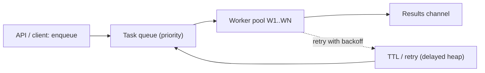
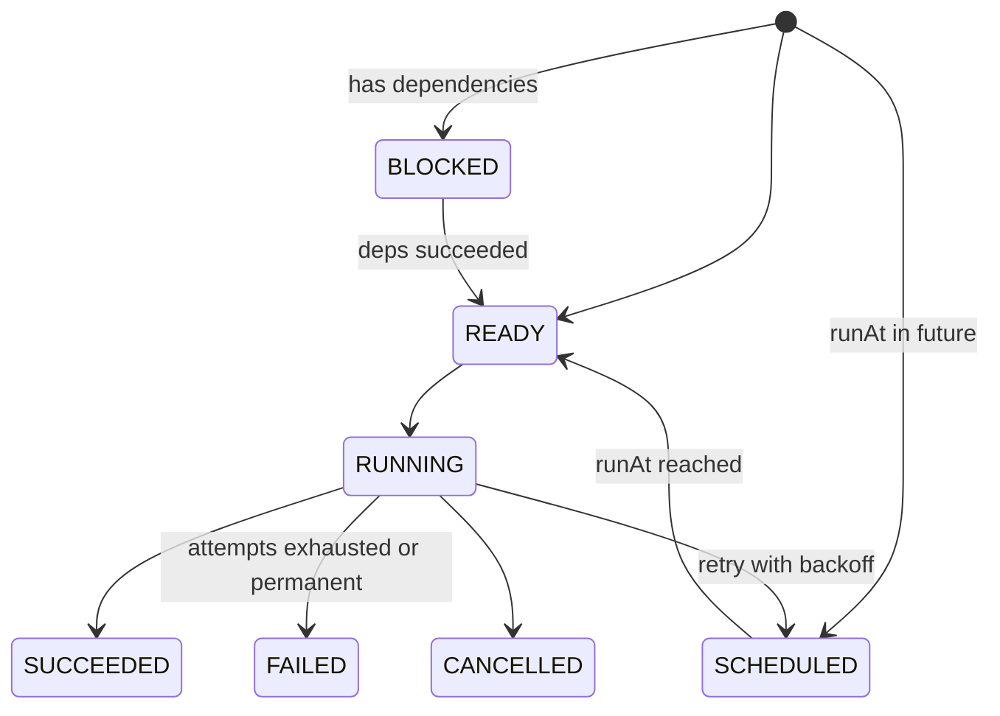
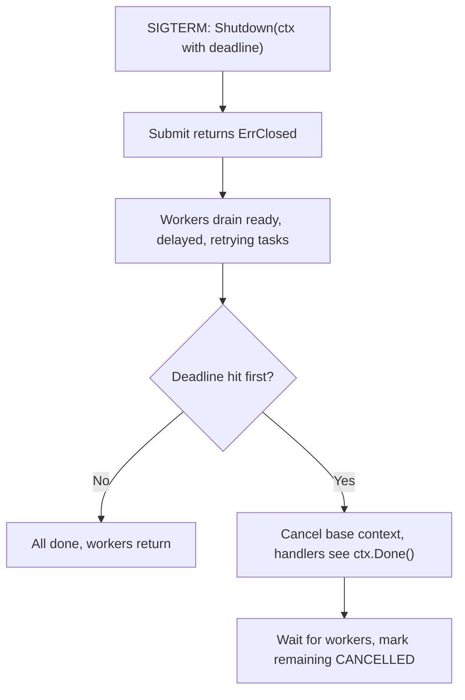
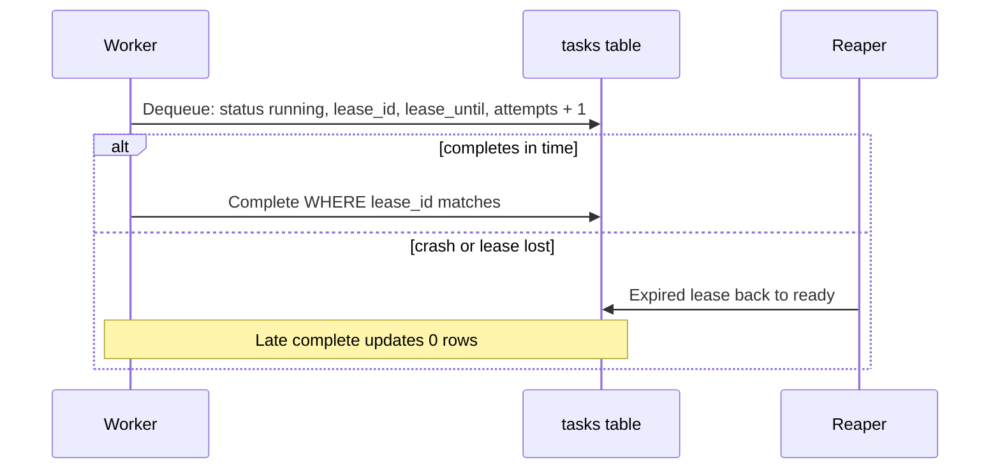

# 📋 Task Queue / Worker Pool — High-Level Design

> **Target Level:** Senior/Staff Engineer
> **Focus:** Async task processing, worker management, retry strategies

---

## 1. SYSTEM OVERVIEW

**Purpose:** Reliable async task processing with priority scheduling, retries, and graceful shutdown.

**Scale:** 100K tasks/day averages only about 1.2 tasks/s. Design for bursts of 100× that (about 100–200 tasks/s), 10–100 concurrent workers, and sub-second dispatch latency. A single Postgres table using `SKIP LOCKED` comfortably handles low thousands of dequeues per second, so the database is not the bottleneck at this scale.

---

## 2. SYSTEM ARCHITECTURE

```
┌─────────────────────────────────────────────────────────┐
│                    Task Queue System                      │
├─────────────────────────────────────────────────────────┤
│                                                          │
│  ┌──────────────┐          ┌──────────────────────┐     │
│  │  API / Client │          │    Worker Pool        │     │
│  │  (Enqueue)    │          │    ┌────┐ ┌────┐    │     │
│  └──────┬───────┘          │    │ W1 │ │ W2 │    │     │
│         │                  │    └──┬─┘ └──┬─┘    │     │
│         ▼                  │    ┌────┐ ┌────┐    │     │
│  ┌──────────────┐          │    │ W3 │ │ WN │    │     │
│  │  Task Queue   │ ───────→│    └──┬─┘ └──┬─┘    │     │
│  │  (Priority)   │         │       │       │      │     │
│  └──────┬───────┘          │       ▼       ▼      │     │
│         │                  │  ┌────────────────┐  │     │
│         ▼                  │  │  Results Chan  │  │     │
│  ┌──────────────┐          │  └────────────────┘  │     │
│  │  TTL / Retry │          └──────────────────────┘     │
│  └──────────────┘                                       │
└─────────────────────────────────────────────────────────┘
```

*Figure: clients enqueue into a priority queue served by a worker pool.*



## 3. TASK LIFECYCLE

```
SUBMIT ─┬─> BLOCKED ──(deps succeeded)──┐
        ├─> SCHEDULED ──(runAt reached)─┤
        └───────────────────────────────┴─> READY ─> RUNNING ─┬─> SUCCEEDED
                                              ^               ├─> FAILED  (attempts exhausted / permanent) ─> dead letters
                                              └── SCHEDULED <─┤   (retry with backoff)
                                                              └─> CANCELLED (Cancel / shutdown deadline / dependency failed)
```

*Figure: task lifecycle.*



## 4. RETRY STRATEGY

Delay before retry *n* = `rand(0, min(cap, base · 2^(n-1)))`. This is **full jitter**: the expected delay is half the exponential value, and clients that failed together don't retry together. With base 100 ms and cap 10 s:

| Retry | Exponential ceiling | Actual delay |
|---------|---------|------------|
| 1 | 100 ms | uniform 0–100 ms |
| 2 | 200 ms | uniform 0–200 ms |
| 3 | 400 ms | uniform 0–400 ms |
| 8+ | 10 s (cap) | uniform 0–10 s |

Handlers wrap non-retryable errors (validation, 4xx) with `Permanent(err)`, so they skip straight to dead letters. Panics are treated as permanent too.

## 5. GRACEFUL SHUTDOWN

```
1. SIGTERM → Shutdown(ctx with deadline): Submit now returns ErrClosed
2. Workers drain: ready, delayed and retrying tasks, until none are outstanding
3. Deadline hit → cancel the base context → in-flight handlers see ctx.Done()
4. Wait for workers to return; mark every remaining task CANCELLED
5. (Durable version) nothing to save: un-acked leases expire and other workers pick them up
```

*Figure: graceful shutdown sequence.*



## 6. TRADE-OFF ANALYSIS

| Decision | Choice | Rationale |
|----------|--------|-----------|
| Queue storage | In-memory heaps (ready + delayed) | Fastest; durability is the distributed version's job |
| Locking | One mutex; handlers run unlocked | Critical sections are O(log n); simplest correct design |
| Wake-up | Close-and-replace broadcast channel | No polling, no lost wake-ups, composes with timers and ctx |
| Retry backoff | Exponential + full jitter, in the delayed heap | Avoids retry storms; retries remain cancellable |
| Task routing | Handler registry by type, fixed at construction | Read without locks |
| Results | Per-task done channel + `Wait` | A slow consumer can never block workers |
| Delivery | At-least-once | Exactly-once comes from idempotent handlers, not the queue |

## 7. DISTRIBUTED VERSION

```sql
CREATE TABLE tasks (
  id            TEXT PRIMARY KEY,          -- client idempotency key
  type          TEXT NOT NULL,
  payload       JSONB NOT NULL,
  priority      SMALLINT NOT NULL,
  status        TEXT NOT NULL,             -- ready | running | succeeded | failed | cancelled
  run_at        TIMESTAMPTZ NOT NULL DEFAULT now(),
  attempts      INT NOT NULL DEFAULT 0,
  max_attempts  INT NOT NULL,
  lease_id      UUID,
  lease_until   TIMESTAMPTZ,
  last_error    TEXT
);
CREATE INDEX tasks_dequeue ON tasks (priority DESC, run_at) WHERE status = 'ready';
```

- **Dequeue:** `UPDATE tasks SET status='running', lease_id=$1, lease_until=now()+'30s', attempts=attempts+1 WHERE id IN (SELECT id FROM tasks WHERE status='ready' AND run_at<=now() ORDER BY priority DESC, run_at LIMIT 10 FOR UPDATE SKIP LOCKED) RETURNING *`.
- **Complete:** `UPDATE … SET status='succeeded' WHERE id=$1 AND lease_id=$2`. The `lease_id` check is the fencing token. Zero rows updated means the lease was lost and someone else owns the task now.
- **Reaper:** `UPDATE … SET status='ready' WHERE status='running' AND lease_until < now()`.

*Figure: lease-based dequeue in the distributed version; lease_id fences stale workers.*



## 8. FAILURE MODES

| Failure | Effect | Mitigation |
|---|---|---|
| Worker crash mid-task | Task stuck "running" | Lease expiry + reaper; at-least-once redelivery |
| Side effect done, ack lost | Duplicate execution | Idempotency key in the same transaction as the effect |
| Poison message | Burns every attempt, crashes workers | Panic recovery, `Permanent` errors, dead letters with alerting |
| Downstream outage | Retry storm, queue backlog | Jittered backoff, a circuit breaker per downstream, alert on queue depth/age |
| Low priority starvation | Old tasks never run | Aging or weighted fair queuing; alert on oldest-task age per priority |
| Slow handler ignoring ctx | Shutdown overruns its deadline | Handler contract and timeouts; pod `terminationGracePeriodSeconds` > drain deadline |
| Unbounded finished-task retention | Memory or table growth | TTL / partition-and-drop on terminal tasks |
