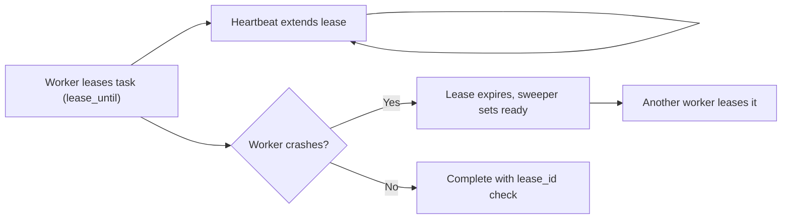

# 📋 Task Queue / Worker Pool — Interview Questions

## Q1: How does priority scheduling work? Can a low-priority task starve?

**Answer:**
- The ready heap orders by `(priority desc, seq asc)`, so strict priority is FIFO within a level.
- Yes, starvation is possible: a steady stream of high-priority work means low priority never runs.
- Fixes:
  1. **Aging:** effective priority = base + wait time / k. Re-heap periodically, and never read the clock inside `Less`.
  2. **Weighted fair queuing:** one queue per priority, served in a weighted round-robin (for example 8:4:2:1), so every level gets a guaranteed share.
  3. **Separate worker pools per class:** simplest operationally. It's what most Sidekiq/Celery deployments do.

## Q2: How do you handle graceful shutdown with in-flight tasks?

**Answer:** `Shutdown(ctx)`:
1. Set `closing`. `Submit` now returns `ErrClosed`.
2. Workers keep draining everything already accepted, retries in backoff included, until nothing is outstanding.
3. If `ctx` expires first: cancel the base context. Every attempt context derives from it, so handlers see `ctx.Done()`. Wait for workers to return, then mark everything left `CANCELLED`.
- Go can't kill a goroutine. A handler that ignores `ctx` delays shutdown. In Kubernetes, set `terminationGracePeriodSeconds` above your drain deadline.
- In a durable queue you don't drain at all. You stop leasing new work and let in-flight leases expire, and another worker picks them up.

## Q3: How would you make this a distributed task queue across multiple machines?

**Answer:**
- **Storage:** a Postgres `tasks` table, or Redis. Postgres: `SELECT … WHERE status='ready' AND run_at <= now() ORDER BY priority DESC, id LIMIT n FOR UPDATE SKIP LOCKED`, then set `status='running', lease_until=now()+30s`. Redis: a ZSET scored by `run_at` for delays, with lists or streams per priority.
- **Leases (visibility timeout), not leader election.** A worker that crashes simply stops renewing its lease. A sweeper (or the dequeue query itself) returns expired leases to `ready`. This is how SQS visibility timeouts and Redis Streams `XAUTOCLAIM` work.
- **Heartbeats** extend the lease for long tasks. Keep the lease about 3× the heartbeat interval.
- **Fencing:** completion must check `lease_id`, so a worker whose lease expired can't overwrite the new owner's result.
- Kafka is a poor fit for per-task retries, priorities and delays, because it's an ordered log. Use it for streams, not job queues.

*Figure: a crashed worker simply stops renewing its lease; the task becomes ready again and a new owner takes it.*

## Q4: How do you handle duplicate task execution (at-least-once vs exactly-once)?

**Answer:**
- Any queue with leases or acks is **at-least-once**. A worker can finish the side effect and crash before acking.
- "Exactly-once" in practice means **at-least-once delivery plus idempotent effects**:
  - an idempotency key per task, stored in the *same transaction* as the side effect (`INSERT … ON CONFLICT DO NOTHING` on a processed-keys table), or
  - naturally idempotent operations (`SET status='paid' WHERE id=?`), or
  - for external APIs, pass the idempotency key through (Stripe's `Idempotency-Key`).
- Writing "task ID in completed set" in a *separate* step before or after executing doesn't work: there's always a crash window between the two writes.
- Here, `Submit` is idempotent on `TaskSpec.ID`, which protects against duplicate *submissions*. Handlers still have to be idempotent for retries.

## 🔁 Follow-ups interviewers actually push on

### "Now add per-type concurrency limits (max 2 `video-encode` at once)."
Use a semaphore per type. The catch: if the top of the heap is a saturated type, a naive worker either blocks or busy-loops. Keep one ready heap per type and have `acquire` choose the highest-priority head among unsaturated types. Re-broadcast `changed` when a slot frees up.

### "How do you know the wake-up logic has no lost wake-ups?"
The worker captures `q.changed` under the same lock where it saw "nothing ready". Any later state change happens after that, under the lock, and closes that exact channel. A `chan struct{}` with buffer 1 used as a signal wakes only one of N idle workers. A `sync.Cond` can't be combined with a timer or `ctx` in a `select`.

### "What if the handler panics?"
`safeHandle` recovers and turns the panic into a `Permanent` error. The task goes to the dead letters and the worker survives. Without it, one panic crashes the whole process (an unrecovered panic in any goroutine does). Most real queues also log the stack trace.

### "Retry storms?"
Exponential backoff alone still synchronizes clients that failed at the same moment. Full jitter (`rand(0, base·2^n)`) spreads them out (see the AWS Architecture Blog, "Exponential Backoff and Jitter"). Cap the backoff, cap the attempts, and add a circuit breaker per downstream so you stop hammering a dependency that's down.

### "Cancel a task that's already running?"
Cancel its attempt context and let the handler return. Record `cancelRequested` so the error isn't treated as retryable. If the handler finishes successfully anyway, it wins the race and the result is `SUCCEEDED`. Say this explicitly; it's the honest semantics of cooperative cancellation.

### "Testing strategy?"
- Deterministic order: submit before `Start()` with 1 worker.
- Inject `Backoff` to record attempt numbers and keep the tests fast.
- Use channels (`started`), not sleeps, to sequence "cancel while running".
- `-race` stress test with concurrent producers, then assert every task is terminal, the dead-letter count matches the failed count, and `runtime.NumGoroutine()` returns to the baseline (no leaks).

### "Memory growth?"
`tasks` keeps finished tasks for `Wait` and idempotency, so it's unbounded in a long-running process. Options: a retention TTL on terminal tasks, or a results store with an expiry (Celery's result backend, Sidekiq's dead set has a size cap + TTL).

## ⚠️ Common mistakes
- `time.Now()` inside the heap comparator. The ordering changes while the elements sit in the heap.
- Popping a blocked or not-yet-due task and pushing it back. This is head-of-line blocking, and often a hot loop.
- `time.AfterFunc` for retries. Callbacks fire after shutdown, and cancel can't find the task.
- A shared results channel that workers send to while nobody reads. Every worker blocks.
- Polling with `time.After(100ms)` in the idle path. It adds latency and burns CPU.
- `context.WithTimeout(ctx, 0)` when "no timeout" was meant. The context is already expired.
- Taking two locks in opposite orders (queue → DLQ in `Fail`, DLQ → queue in `Requeue`).
- Retrying non-retryable errors (validation, 4xx) until the attempts run out.

## 🎯 Senior vs Staff signal
- **Senior:** correct worker pool, priority heap, retries with backoff, context-based shutdown, race-free code with a `-race` test.
- **Staff:** names the delivery guarantee (at-least-once) and pushes idempotency to the right layer. Uses leases and fencing, not leader election, for the distributed version. Designs the shutdown contract (drain → deadline → hard cancel) and admits Go can't kill goroutines. Spots starvation and head-of-line blocking. Proves there are no goroutine leaks. Knows where the in-memory design stops scaling: finished-task retention and a single lock past about 10⁵ tasks/s.
