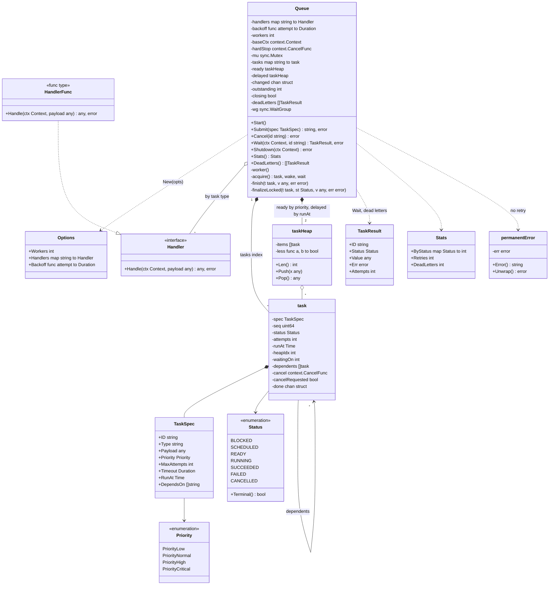

# 🧠 Task Queue / Worker Pool — Thought Process

## 📊 Class Diagram

---

## Problem Breakdown

### Step 1: Core Components
- **TaskSpec:** type, payload, priority, max attempts, per-attempt timeout, optional `RunAt` and `DependsOn`.
- **Queue:** a priority heap (priority, then FIFO by sequence number) plus a delayed heap ordered by `runAt`.
- **Workers:** N goroutines that pull. When idle they block on a broadcast channel, not a poll loop.
- **Handler:** one per task type (Strategy). Must honour `ctx`.

### Step 2: Priority Ordering
- A heap gives O(log n) push and pop.
- Break ties with a monotonic sequence number, **not** a timestamp, and never with `time.Now()` inside `Less`.

### Step 3: Retry with Backoff
- Retry transient errors up to `MaxAttempts`. Fail `Permanent` errors and panics immediately.
- Exponential backoff with full jitter. Backed-off tasks wait in the delayed heap, where `Cancel` and `Shutdown` can still find them.
- Out of attempts → `FAILED` + dead-letter list.

### Step 4: Dependencies
- Dependencies must already exist, so the graph is a DAG by construction.
- Blocked tasks stay out of the ready heap. Success unblocks dependents. Failure or cancel cascades.

### Step 5: Graceful Shutdown
- Stop accepting → drain (including retries) → if the deadline passes, cancel the base context and mark the rest `CANCELLED`.
- Prove there are no goroutine leaks in a test.

## Key Decisions

| Decision | Why |
|----------|-----|
| One mutex, handlers run unlocked | Tiny critical sections; simplest correct design |
| Close-and-replace "changed" channel | Broadcast wake-up that composes with `select`, timers and ctx |
| Delayed heap instead of `time.AfterFunc` | Every waiting task stays cancellable and visible to shutdown |
| Sequence number tie-break | Deterministic, strict total order |
| Per-task `done` channel + `Wait` | No shared results channel that can fill up and block workers |
| `Permanent(err)` wrapper | The handler decides what's retryable; the queue stays generic |
| Idempotent `Submit` on ID | Safe client retries of the submit call itself |

## ⏱️ How to run this in a 45–60 min interview

| Time | Phase | What to do | What to say out loud |
|------|-------|-----------|----------------------|
| 0–5 | Clarify | Questions below; write `Submit/Cancel/Wait/Shutdown` | "In-process, at-least-once, handlers are idempotent. I'll call out what changes when it becomes distributed." |
| 5–12 | Entities | `TaskSpec`, `task`, `Handler`, `Queue`, status enum + state diagram | "Every terminal transition goes through one function, so done-channel closing and cascades happen exactly once." |
| 12–25 | Core | Priority heap + N workers + Submit, with no retries yet | "Workers pull under one mutex; handlers run outside it." |
| 25–35 | Concurrency | Wake-up mechanism; `Shutdown(ctx)` | "No polling: I broadcast by closing a channel. Shutdown drains, then hard-cancels at the deadline." |
| 35–45 | Retries | Backoff into the delayed heap, `Permanent`, dead letters | "No `AfterFunc`: a timer callback after shutdown is a leak." |
| 45–60 | Extension | Dependencies, cancel, per-type limits, or "make it distributed" | Show that the change is local; mention leases and idempotency. |

### Clarifying questions worth asking
- In-process library or a distributed service? Must tasks survive a crash?
- Delivery guarantee: at-most-once or at-least-once? Are handlers idempotent?
- Is priority strict, or must low priority get a minimum share (starvation)?
- Retry policy: how many attempts, which errors are retryable, is there a backoff cap?
- Do we need delayed or cron tasks, dependencies, cancellation of running tasks?
- What should shutdown do with queued work: drain, persist, or drop?
