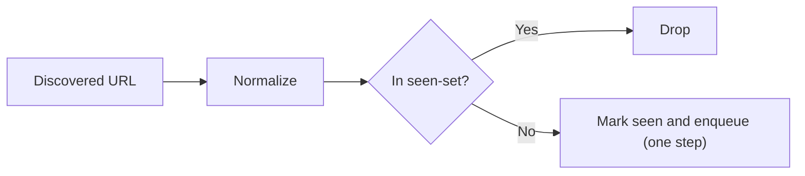
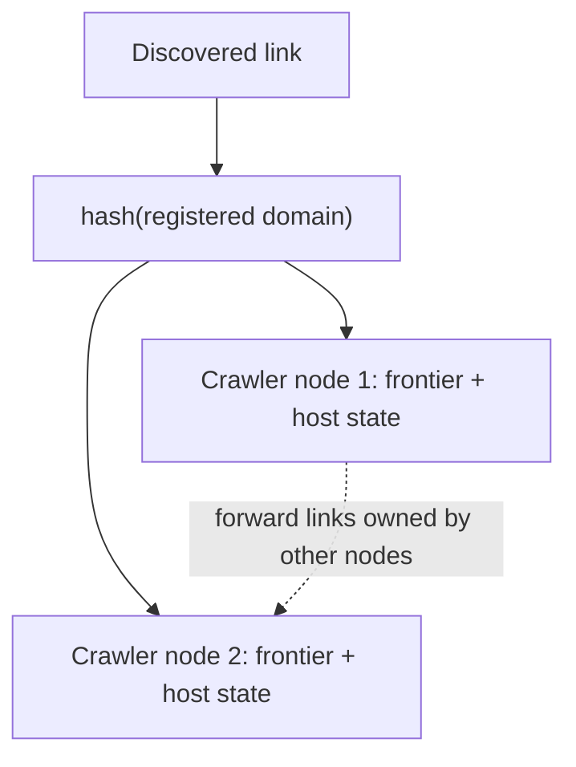

# 🕷️ Web Crawler — Interview Questions

## Q1: How do you handle rate limiting and politeness?

**Answer:**
- **robots.txt per host**, fetched once and cached (Google caches for up to 24 h). Under RFC 9309, a 4xx means no restrictions and a 5xx or unreachable host means *assume full disallow*. The longest matching rule wins, and Allow wins a tie. `*` and `$` wildcards are supported.
- **Minimum gap between requests to one host**: `max(our default, Crawl-delay)`. Crawl-delay is non-standard; Google ignores it, Bing honours it. Claim the turn after waking, under the host lock, so the gap holds between *actual* request starts.
- **A per-host connection cap** (1–2), separate from the global worker count.
- **Back off on 429/503**, honour `Retry-After`, and stop crawling a host whose error rate spikes.
- An identifiable User-Agent with a contact URL.

## Q2: How do you prevent duplicate crawling?

**Answer:**
- **URL-level:** normalize, then check an exact set. Normalization lower-cases the scheme and host, drops default ports, fragments and tracking params, and sorts the query. Be careful with paths: `/A` vs `/a` and trailing slashes can be distinct resources.
- **Mark on enqueue, atomically.** In this design the single coordinator goroutine owns the set, so the check and the insert are one step. With a shared `sync.Map`, use `LoadOrStore` and *nothing else*. A separate `Load` then `Store` is a race. `rel=canonical` and redirect targets also feed the set.
- **Content-level:** an exact hash (SHA-256) for mirrors, and SimHash/MinHash for near-duplicates (Google's 2007 paper: 64-bit SimHash, Hamming distance ≤ 3).
- **At scale:** a Bloom filter in front of a disk or KV set. 1 B URLs at a 1% false-positive rate is about 1.2 GB (9.6 bits per element). A false positive means a page is wrongly skipped, which is usually acceptable for a crawler.

*Figure: URL dedup before a link enters the frontier.*

## Q3: How would you distribute crawling across multiple machines?

**Answer:**
- **Partition by host** (hash of the registered domain → crawler node). Politeness and robots state then stay local to one node, and no cross-node coordination is needed per request. Consistent hashing limits reshuffling when nodes join or leave.
- Links to hosts owned by another node are **forwarded** to it in batches, through Kafka topics partitioned by host hash, or by RPC.
- The **frontier per node** follows the Mercator design: front queues by priority, back queues one per host, and a heap of hosts keyed by the next allowed fetch time.
- **Checkpoint** the frontier and seen-set (RocksDB, or a DB). On node failure its host partition moves and resumes from the checkpoint. Pages fetched since the checkpoint are refetched, which is at-least-once and fine for crawling.
- The original answer of "Redis BRPOPLPUSH + heartbeat" works for small fleets, but it centralizes the frontier and puts politeness state on the hot path of a shared store.

*Figure: partition crawling by host so politeness state stays on one node.*

## Q4: How do you handle JavaScript-rendered pages?

**Answer:**
- Fetch statically first. Render with headless Chrome only when the static HTML is clearly an app shell: almost no text, a `
`, `<noscript>` hints.
- Rendering costs 10–100× more CPU and seconds per page, so run it as a separate, smaller pool with its own queue, and budget by domain.
- Block images, fonts and media during rendering. Cache the rendered DOM keyed by URL + content hash.

## 🔁 Follow-ups interviewers actually push on

### "How does your crawler know it's done?"
It's done when the frontier is empty **and** no fetch is in flight. Only the coordinator knows both, which is why it owns the state. Common wrong answers: "the queue is empty" (in-flight pages still add links), "a timeout", or `wg.Wait()` on workers that are themselves blocked waiting for work.

### "Why not a `sync.Map` + workers that push links into a buffered channel?"
If the channel is bounded, a worker that discovers links blocks on a full queue that only workers drain. That deadlocks. Dropping on full (`select default`) silently loses URLs. Unbounded growth needs a slice anyway. And a `sync.Map` visited-set still needs `LoadOrStore`, used correctly, plus an atomic page budget. The coordinator removes all of that.

### "Add a `MaxPages` limit. Is it exact?"
Here it is: the coordinator counts dispatches. With a shared counter, `if count.Load() < max { fetch; count.Add(1) }` overshoots by up to the number of workers. To make it exact, the counter needs `CompareAndSwap`, or a reservation before fetching.

### "One host is slow. What happens?"
A worker waits out that host's gap or its slow response while the others keep going. With a single FIFO frontier, though, a run of same-host URLs makes several workers wait on the same host: head-of-line blocking. The fix is Mercator back queues, so the coordinator only dispatches hosts whose turn has come.

### "How do you stop cleanly on Ctrl-C?"
Use `signal.NotifyContext`, then pass ctx to `Crawl`. Every wait (politeness timer, fetch, send on `results`) selects on `ctx.Done()`, and `crawlGroup.Wait()` joins every goroutine before `Crawl` returns. `OnPage` returning an error does the same through the group's cancel.

### "Spider traps?"
Calendars, infinite query permutations, session IDs in URLs. Defences: a depth limit, a per-host page budget, a max URL length, de-duplicating query permutations by sorting, and detecting repeating path segments (`/a/b/a/b/…`).

### "Testing strategy?"
- A `Fetcher` interface plus an in-memory web: deterministic graphs and request counts (each URL fetched exactly once).
- Unit tables for `Normalize`, `ExtractLinks`, `AllowHosts` (the `notexample.com` case) and robots longest-match/wildcards.
- Timing tests for politeness that assert on request *start* times per host.
- `-race` runs, plus tests for cancellation and abort-on-error that check `runtime.NumGoroutine()` returns to its baseline.

## ⚠️ Common mistakes
- Marking a URL visited at discovery time and checking the *same* set again at fetch time, which skips everything that was discovered.
- Two goroutines `range`-ing over the same results channel. Each gets a random subset.
- Termination by timeout or polling instead of in-flight accounting.
- `time.Sleep` for politeness. It ignores cancellation.
- A rate limiter that sleeps "a bit" and then fetches anyway.
- Substring checks for robots rules or host allow-lists (`strings.Contains(host, "example.com")`).
- Stripping trailing slashes or lower-casing paths, which merges distinct URLs.
- Reading unbounded response bodies (`io.ReadAll` without `io.LimitReader`).
- A variable named `url` shadowing `net/url`.

## 🎯 Senior vs Staff signal
- **Senior:** a working concurrent crawler with dedup, depth limits, robots, a per-host delay, context cancellation and race-free code.
- **Staff:** single-owner state with exact termination and an exact budget. Explains channel ownership and why the coordinator `select`s on both directions. Proves there are no goroutine leaks. Knows RFC 9309 details and why robots 5xx means disallow. Designs the distributed version by host partitioning with Mercator queues. Sizes the seen-set (Bloom math) and discusses spider traps and content dedup.
