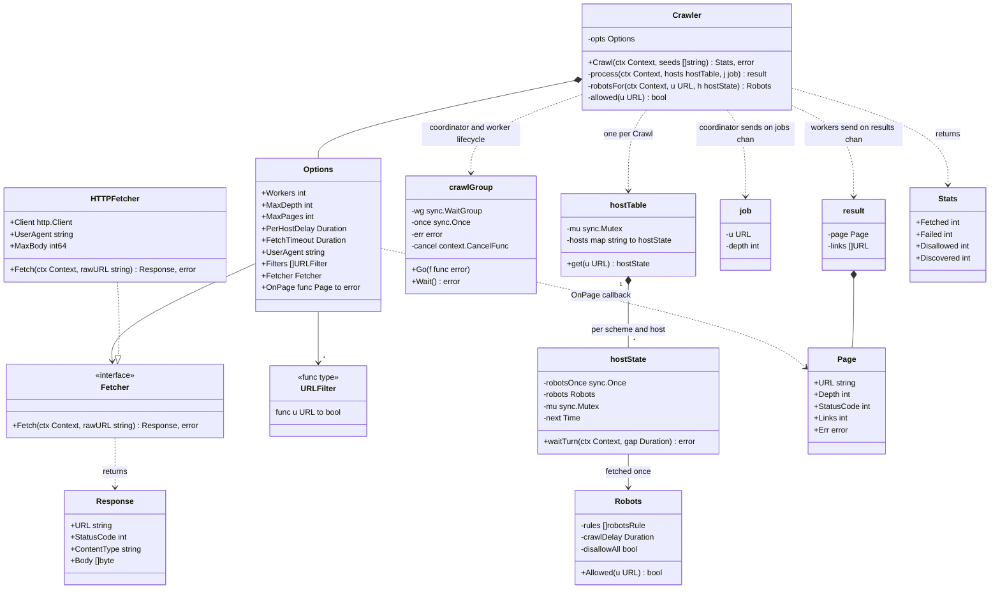

# 🧠 Web Crawler — Thought Process

## 📊 Class Diagram

---

## Problem Breakdown

### Step 1: Core Components
- **Frontier:** URLs waiting to be crawled. A FIFO gives BFS by depth.
- **Seen-set:** normalized URL → already enqueued. Mark it on *enqueue*, not on fetch.
- **Fetcher:** an interface, so tests run against an in-memory web.
- **Link extractor + filters:** resolve relative links, normalize, scope by host, scheme and extension.

### Step 2: Concurrency Model
- Crawling is I/O-bound, so a worker pool of goroutines fits.
- **One coordinator goroutine owns the frontier, the seen-set and the counters.** Workers only do I/O. No shared mutable crawl state means no locks and no check-then-act races.
- Termination: frontier empty **and** nothing in flight.
- `select` with a nil-channel case lets the coordinator send jobs and receive results without deadlocking.

### Step 3: Politeness
- robots.txt once per host (`sync.Once`), longest-match rules, Crawl-delay.
- Minimum gap between requests to one host, claimed under the host lock after a ctx-aware wait.
- An explicit User-Agent.

### Step 4: Bounds and Shutdown
- `MaxDepth`, an exact `MaxPages` budget, a per-request timeout, a body size limit.
- errgroup-style lifecycle: the first error or ctx cancel stops everything, and `Crawl` returns only after every goroutine exits.

## Key Decisions

| Decision | Why |
|----------|-----|
| Coordinator owns state (no `sync.Map`) | Atomic dedup and exact budgets without locks |
| Mark seen on enqueue | Each URL dispatched once; no duplicate jobs in the frontier |
| Unbuffered `jobs`/`results` + `select` | Backpressure; no arbitrary buffer sizes to tune |
| Synchronous `Crawl` with an `OnPage` callback | The caller can't leak goroutines by not draining a channel |
| `Fetcher` interface + `FakeWeb` | Deterministic, offline demo and tests |
| Conservative normalization | Wrongly merging two distinct URLs is worse than crawling one twice |

## ⏱️ How to run this in a 45–60 min interview

| Time | Phase | What to do | What to say out loud |
|------|-------|-----------|----------------------|
| 0–5 | Clarify | Questions below; sketch `Crawl(ctx, seeds)` and `Fetcher` | "I'll put fetching behind an interface so I can test without the network." |
| 5–12 | Entities | `job`, `result`, `Page`, `Options`, filters, `Normalize` | "Dedup key = the normalized URL; I'll be conservative about what I normalize." |
| 12–25 | Core | Single-threaded BFS first, then split into coordinator + workers | "One goroutine owns the frontier and seen-set, so I don't need locks there." |
| 25–35 | Concurrency | Termination (`inFlight`), nil-channel `select`, errgroup, ctx | "Empty frontier isn't 'done': in-flight pages can add links." |
| 35–45 | Politeness | robots.txt + per-host gap | "RFC 9309: robots 5xx means stay out. Longest rule wins." |
| 45–60 | Extension | MaxPages, per-host concurrency, distributed version | Show the change is local; talk about Mercator queues and a Bloom filter. |

### Clarifying questions worth asking
- Scope: one site, a list of domains, or the open web? Do we follow subdomains?
- Bounds: max depth, max pages, time budget?
- Politeness: obey robots.txt? Default delay per host? Max concurrent connections per host?
- What do we produce per page: links only, content, metadata? Do we store bodies?
- Do we render JavaScript-heavy pages?
- What counts as "the same page": exact URL, normalized URL, or same content?
