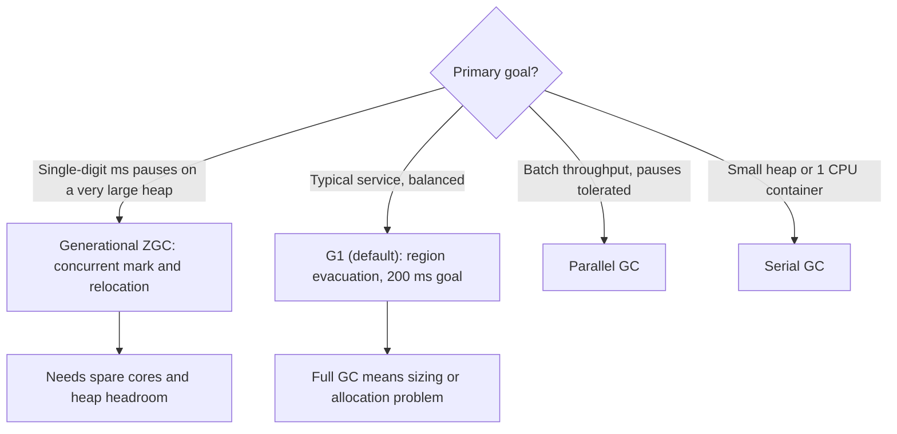
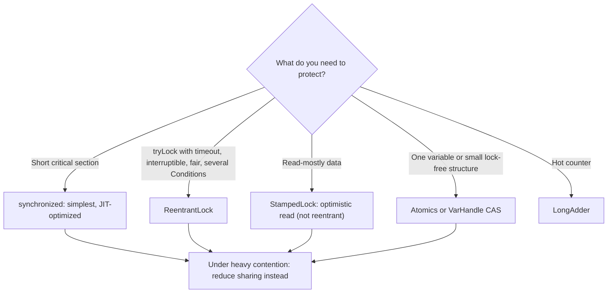
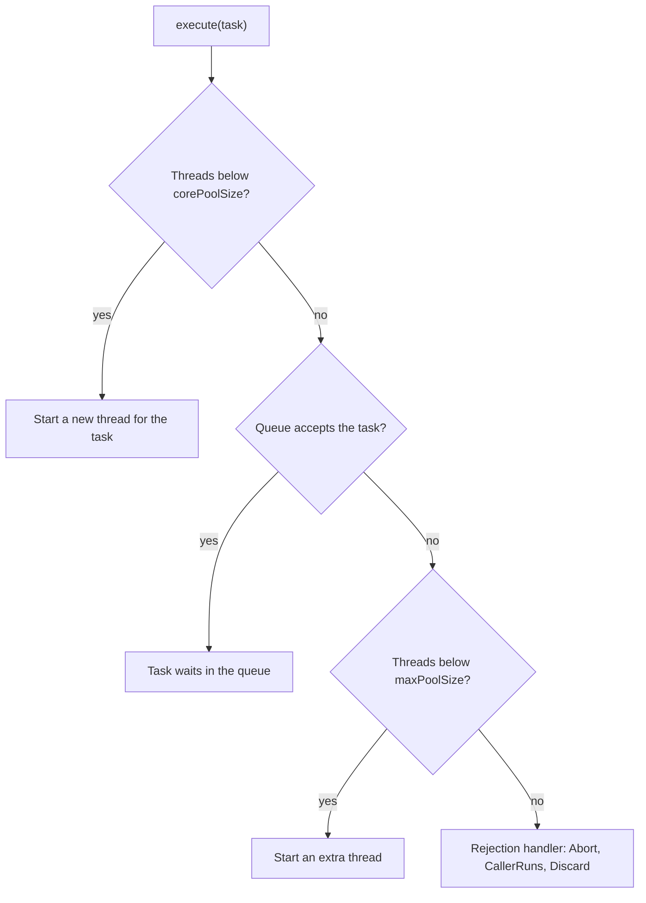
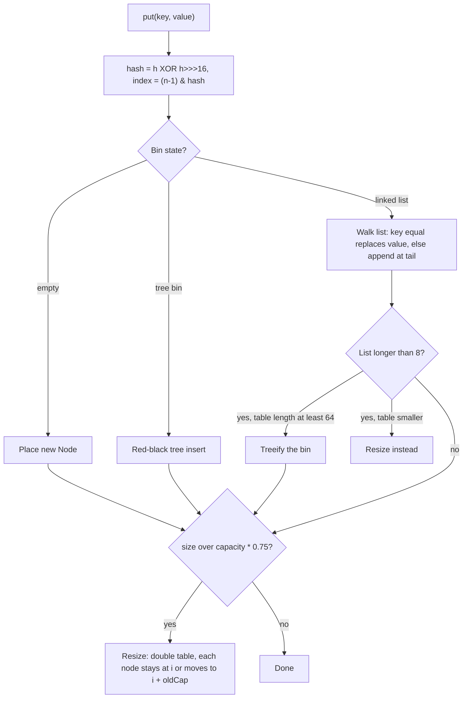
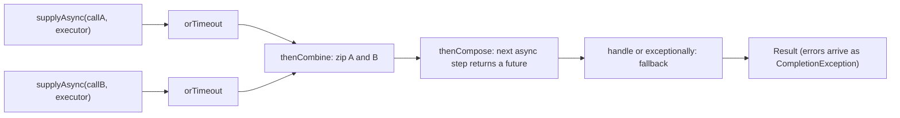

# ☕ Java — Staff-Level Interview Questions & Answers

> **Interviewer Persona:** Principal Software Engineer, 15+ years in distributed systems and JVM-based infrastructure  
> **Target Level:** Staff/Principal Engineer (10+ years)  
> **Evaluation Focus:** JVM internals, concurrency models, garbage collection, Spring Boot internals, production system design
> **Versions:** current as of October 2026: JDK 25 (latest LTS) and JDK 27 (current release), Spring Boot 3.5 / 4.0. Code samples were run on JDK 25 unless marked as Spring/JMH fragments.

Each question opens with a **30-second answer** to say first, then the mechanism, then trade-offs and what interviewers ask next.

| # | Topic | # | Topic |
|---|-------|---|-------|
| 1 | [Java Memory Model, volatile, synchronized](#question-1-jvm-memory-model-happens-before-volatile) | 8 | [Spring transactions](#question-8-spring-transactions-propagation-isolation-and-transaction-management) |
| 2 | [Garbage collection: G1 and ZGC](#question-2-garbage-collection-from-serial-to-g1-to-zgc) | 9 | [Streams and parallelism](#question-9-java-8-streams-lambdas-parallelism-and-performance) |
| 3 | [Locks vs lock-free](#question-3-the-synchronized-vs-lock-vs-lock-free-showdown) | 10 | [Class loading and bytecode](#question-10-class-loading-bytecode-when-java-gets-its-hands-dirty) |
| 4 | [Spring Boot auto-configuration and DI](#question-4-spring-boot-auto-configuration-di-container-internals) | 11 | [CompletableFuture](#question-11-completablefuture-async-programming-without-external-libraries) |
| 5 | [Executors, ForkJoin, virtual threads](#question-5-concurrency-executors-forkjoin-and-virtual-threads) | 12 | [Performance investigation](#question-12-performance-tuning-profiling-jmh-and-optimization) |
| 6 | [Collections internals](#question-6-java-collections-framework-internals-performance) | 13 | [Modern Java 17 → 25](#question-13-modern-java-17-25-what-changed-and-why-it-matters) |
| 7 | [Safepoints, JIT, barriers](#question-7-java-memory-model-safepoints-barriers-and-jit-compilation) | | |

---

## Question 1: JVM Memory Model — Happens-Before & Volatile

**Interviewer:** *"Explain the Java Memory Model. What guarantees does `volatile` provide? What does `synchronized` actually do at the memory level? Walk me through a case where `volatile` is NOT enough."*

### Expected Answer (Staff Level)

!!! tip "30-second answer"
    The JMM (JLS chapter 17, from JSR-133 in Java 5) says a read is only guaranteed to see a write if the write **happens-before** the read. `volatile` gives visibility and ordering (a volatile write is a *release*, a volatile read is an *acquire*) but **not atomicity**, so `count++` on a volatile still loses updates. `synchronized` gives mutual exclusion **and** the same release/acquire edges on unlock/lock. `volatile` is not enough whenever correctness depends on a read-modify-write or on an invariant across several variables: use a lock, an `Atomic*`/`VarHandle` CAS, or an immutable snapshot.

**What the JMM does and does not promise:**

Without a happens-before edge, a thread may see a stale value forever (the JIT can hoist a non-volatile read out of a loop), or see writes from another thread in a different order than they were made. Two things it never allows: "out-of-thin-air" values, and torn reads of `int`/references. Plain `long`/`double` writes *may* tear into two 32-bit halves (JLS §17.7), though no 64-bit HotSpot does that in practice.

```java
// Without synchronization: no atomicity AND no visibility guarantee
class BrokenCounter {
    int count = 0;
    void increment() { count++; }   // read, add, write: three steps, updates can be lost
    int get() { return count; }     // may return a stale value indefinitely
}
```

**The happens-before rules (JLS §17.4.5) you should be able to list:**

| Rule | Edge |
|------|------|
| Program order | Each action in a thread happens-before every later action in that thread |
| Monitor lock | An unlock of monitor M happens-before every later lock of M |
| Volatile | A write to volatile `v` happens-before every later read of `v` (that sees it) |
| Thread start | `t.start()` happens-before every action in `t` |
| Thread termination | Every action in `t` happens-before another thread returns from `t.join()` (or sees `t.isAlive() == false`) |
| Interruption | `t.interrupt()` happens-before `t` detects the interrupt |
| Finalizer / default values | Writing default values happens-before any other action; a constructor's end happens-before its finalizer |
| Transitivity | A hb B and B hb C ⇒ A hb C |

Two more guarantees come from elsewhere and are asked about just as often: **final fields** (JLS §17.5: if `this` doesn't escape the constructor, every thread sees the final fields' constructed values without synchronization, which is why immutable objects are safe to share) and **class initialization** (JLS §12.4.2: the JVM runs `<clinit>` under a lock, so static initializers are safely published). `java.util.concurrent` classes document their own edges ("actions prior to placing an object into a `BlockingQueue` happen-before actions after its removal").

**`volatile` under the hood:**

```java
// volatile guarantees:
// 1. VISIBILITY: a read of v sees the latest write to v in the synchronization order
// 2. ORDERING (release/acquire, plus total order of volatile accesses):
//    - nothing before a volatile WRITE may move after it   (release)
//    - nothing after a volatile READ may move before it    (acquire)
//    - a volatile write followed by a volatile read can't be reordered (needs StoreLoad)
//    Ordinary accesses CAN still move "into" the region (later stores before a volatile
//    write, earlier loads after a volatile read); that is allowed and harmless.

// What HotSpot emits:
// - x86-64 (TSO): volatile read = plain MOV.
//                 volatile write = MOV followed by `lock addl $0,(rsp)`, a locked no-op
//                 that acts as a StoreLoad fence (cheaper than MFENCE on most CPUs).
// - AArch64:      volatile read = LDAR (load-acquire), volatile write = STLR (store-release).
//                 LDAR/STLR are sequentially consistent with each other, so no extra DMB.

// volatile does NOT make compound actions atomic
public class VolatileDemo {
    private volatile int counter = 0;

    public void increment() {
        counter++;   // volatile read, add, volatile write: two threads can both read 5
                     // and both write 6. Use AtomicInteger/LongAdder or a lock.
    }
}
```

**Where `volatile` is the fix: double-checked locking.**

```java
// BROKEN: the reference can be published before the object is fully constructed
class BrokenSingleton {
    private static BrokenSingleton instance;          // not volatile

    public static BrokenSingleton getInstance() {
        if (instance == null) {                       // check 1: no lock, no hb edge
            synchronized (BrokenSingleton.class) {
                if (instance == null) {               // check 2: under the lock
                    instance = new BrokenSingleton();
                    // The JIT/CPU may make the store to `instance` visible BEFORE the
                    // constructor's field stores. Thread B, at check 1, sees non-null
                    // and reads default (0/null) fields. B never takes the lock, so
                    // the monitor rule gives it nothing.
                }
            }
        }
        return instance;
    }
}

// FIXED: volatile makes the publishing store a release. All constructor writes
// happen-before it, and B's volatile read (acquire) at check 1 sees them.
class CorrectSingleton {
    private static volatile CorrectSingleton instance;

    public static CorrectSingleton getInstance() {
        CorrectSingleton local = instance;            // one volatile read on the fast path
        if (local == null) {
            synchronized (CorrectSingleton.class) {
                local = instance;
                if (local == null) {
                    instance = local = new CorrectSingleton();
                }
            }
        }
        return local;
    }
}

// Usually better: initialization-on-demand holder. Lazy, lock-free after init,
// safe because class initialization is synchronized by the JVM (JLS §12.4.2).
class HolderSingleton {
    private HolderSingleton() {}
    private static class Holder {
        static final HolderSingleton INSTANCE = new HolderSingleton();
    }
    public static HolderSingleton getInstance() { return Holder.INSTANCE; }
}
// (Or an enum singleton. JDK 25+ also previews LazyConstant / StableValue for this.)
```

**Where `volatile` is NOT enough:**

- **Read-modify-write:** `counter++`, `if (!started) started = true` (check-then-act). Use `AtomicInteger.incrementAndGet`, `compareAndSet`, or a lock.
- **Invariants across fields:** `volatile int lower, upper` with `lower <= upper`. Each field is visible, but a reader can see the new `lower` with the old `upper`. Lock both, or publish one immutable `record Range(int lower, int upper)` through a single volatile/`AtomicReference`.
- **Publishing a mutable object:** a volatile reference makes the object's state at publication visible, not later mutations to it.

**`synchronized` internals:**

```java
// Bytecode: a synchronized METHOD has the ACC_SYNCHRONIZED flag (no instructions);
// a synchronized BLOCK compiles to monitorenter / monitorexit, with a second
// monitorexit in an exception handler (see Question 10).

// HotSpot lock states (JDK 21+; the details changed a lot recently):
// - Biased locking: deprecated and disabled by default in JDK 15 (JEP 374),
//   code removed in JDK 18. Don't describe it as current.
// - Lightweight locking: uncontended lock = a CAS on the object's mark word plus a
//   push onto a small per-thread "lock stack" (the default since JDK 23; the older
//   "stack locking" stored a pointer to a displaced header on the thread's stack).
// - Inflated monitor (ObjectMonitor): created on contention, wait()/notify(), or
//   lock-stack overflow. Contended threads spin adaptively, then park.
//
// The mark word (64-bit, legacy 12-byte header layout), unlocked state:
// | unused:25 | identity hash:31 | unused:1 | age:4 | unused:1 | lock:2 |
// With compact object headers (JEP 519, product in JDK 25, default in JDK 27)
// the whole header is 8 bytes and the class pointer lives in the mark word too.

// Memory effects:
// monitor enter = acquire, monitor exit = release.
// Everything a thread wrote before releasing M is visible to the next thread
// that acquires the SAME M. Locking a different object gives no guarantee.

// JIT optimizations: lock elision (escape analysis proves the object is
// thread-local), lock coarsening (merges adjacent blocks on the same lock),
// adaptive spinning before parking.

// Virtual threads: before JDK 24, blocking inside synchronized PINNED the
// virtual thread to its carrier. JEP 491 (JDK 24) fixed that; see Question 5.
```

**Happens-before in action:**

```java
public class HappensBeforeDemo {
    private int x = 0;
    private volatile boolean flag = false;

    // Thread A
    public void writer() {
        x = 42;          // (1) plain write
        flag = true;     // (2) volatile write (release)
    }

    // Thread B
    public void reader() {
        if (flag) {      // (3) volatile read (acquire) that sees (2)
            int r = x;   // (4) guaranteed to read 42
            // (1) hb (2) program order; (2) hb (3) volatile rule;
            // (3) hb (4) program order; so (1) hb (4) by transitivity.
        }
    }
}
// Drop `volatile` and B may see flag == true and x == 0, or spin forever on a
// hoisted read of flag.
```

**What they probe next:** "Is `final` enough to share an object?" (yes, if `this` doesn't escape the constructor and the fields are themselves immutable). "Why does `ConcurrentHashMap.get` need no lock?" (volatile/acquire reads of the bin plus safe publication of nodes). "What's the cost of a volatile write?" (a full StoreLoad fence on x86, which drains the store buffer; reads are nearly free). "How would you test this?" (jcstress, not unit tests: races are probabilistic).

### Staff-Level Evaluation

| Criterion | What I'm Looking For |
|-----------|----------------------|
| **Happens-before rules** | Lists the core rules plus final-field and class-init guarantees; reasons with transitivity |
| **volatile semantics** | Release/acquire, visibility, no atomicity; knows x86 needs a fence only for StoreLoad and ARM uses LDAR/STLR |
| **DCL problem** | Explains *why* the reference can be seen before construction completes, fixes it with volatile or the holder idiom |
| **Synchronized internals** | Knows biased locking is gone, lightweight vs inflated monitors, lock elision and coarsening |

---

## Question 2: Garbage Collection — From Serial to G1 to ZGC

**Interviewer:** *"You have a latency-sensitive trading application with a 300GB heap. Design the GC strategy. Walk me through ZGC's colored pointers and load barriers. Then explain G1's region-based heap and remembered sets."*

### Expected Answer (Staff Level)

!!! tip "30-second answer"
    For a 300 GB heap with a single-digit-millisecond pause budget, use **Generational ZGC** (`-XX:+UseZGC`, the only ZGC mode since JDK 24). Its pauses are sub-millisecond and do not grow with heap or live-set size, because marking, relocation and reference fixing are concurrent: **colored pointers** carry GC state in the reference itself, a **load barrier** fixes up stale references when the application reads them, and **store barriers** feed marking and the old-to-young remembered set. **G1** (the default) splits the heap into equal regions, collects young regions plus the "garbagiest" old regions in stop-the-world evacuation pauses, and uses per-region **remembered sets** so it never scans the whole heap. It targets 200 ms by default and is the right answer for most services; at this heap size its evacuation pauses are the risk. The price of ZGC is CPU and memory headroom: it needs spare cores for concurrent work and enough free heap to absorb allocation while a cycle runs.

**GC landscape (as of JDK 25 LTS / JDK 27):**

| Collector | Flag | Model | Status / notes |
|-----------|------|-------|----------------|
| Serial | `-XX:+UseSerialGC` | Single-threaded, STW young copying + old mark-compact | Small heaps, 1 CPU containers. Until JDK 27, the JVM picked it automatically on machines with < 2 CPUs or < 1792 MB RAM; JDK 27 makes G1 the default everywhere (JEP 523) |
| Parallel | `-XX:+UseParallelGC` | Multi-threaded, STW everything | Best raw throughput for batch jobs that tolerate pauses |
| CMS | — | Concurrent mark-sweep, no compaction | Deprecated JDK 9, **removed JDK 14** |
| G1 | `-XX:+UseG1GC` | Regions, STW evacuation, concurrent marking | **Default since JDK 9** (JEP 248). Default pause goal 200 ms |
| ZGC | `-XX:+UseZGC` | Concurrent mark + concurrent compaction | Production JDK 15 (JEP 377); generational JDK 21 (JEP 439), default mode JDK 23 (JEP 474), **non-generational mode removed JDK 24 (JEP 490)** |
| Shenandoah | `-XX:+UseShenandoahGC` | Concurrent mark + concurrent compaction | Production JDK 15 (JEP 379); generational mode product in JDK 25 (JEP 521). Not in Oracle's JDK builds, available in most OpenJDK builds |
| Epsilon | `-XX:+UseEpsilonGC` | Allocates, never collects | Benchmarks and short-lived jobs only |

Pause time in the STW collectors is proportional to the **live** data they copy or mark, not to heap size; that is why young collections are cheap (most objects die young).

**G1: region-based heap**

```java
// G1 divides the heap into equal-sized regions (power of two, 1 MB to 32 MB chosen
// ergonomically for ~2048 regions; up to 512 MB if set by hand since JDK 18).
// Each region is currently Eden, Survivor, Old, Humongous, or Free.
//
// [E][E][S][O][O][H][H][O][F][E][O][F][E]...
//  Humongous: an object >= half a region gets its own contiguous run of regions.
//
// REMEMBERED SETS: per-region record of WHERE pointers into that region come from,
// at card granularity (512-byte cards). Maintained by a post-write barrier that
// dirties cards; concurrent refinement threads turn dirty cards into RSet entries.
//
// What gets recorded: pointers from OLD regions into young regions, and into old
// regions that are candidates for the next mixed collections. Pointers FROM young
// regions are never recorded, because young regions are always collected and
// scanned anyway. So for "old object X in region 12 references young object Y in
// region 5": region 5's RSet contains region 12's card holding X.
//
// COLLECTION SET (CSet): the regions evacuated in one pause.

// G1 CYCLE
// 1. Young-only phase
//    - Young pause (STW, parallel): evacuate live Eden/Survivor objects to
//      Survivor/Old regions. Roots = thread stacks + RSets of young regions.
//    - When old occupancy crosses the IHOP threshold (initial 45%, then ADAPTIVE by
//      default from observed allocation and marking times), the next young pause is
//      a "Concurrent Start" pause that also marks roots.
//    - Concurrent marking (SATB, snapshot-at-the-beginning): pre-write barrier logs
//      overwritten references so nothing live at the snapshot is missed.
//    - Remark (STW): finish marking, process references, unload classes.
//    - Cleanup (STW, short): compute region liveness, free fully-empty regions,
//      pick old-region candidates sorted by reclaimable space.
// 2. Space-reclamation phase
//    - Mixed pauses (STW): young regions + a slice of old candidates, chosen so the
//      pause fits MaxGCPauseMillis (spread over up to G1MixedGCCountTarget=8 pauses).
// 3. Full GC (STW) only when evacuation runs out of space ("to-space exhausted")
//    or a humongous allocation can't be satisfied. Parallel since JDK 10 (JEP 307),
//    but still proportional to the live heap: seconds on large heaps. In logs:
//    "Pause Full (G1 Compaction Pause)". Treat any Full GC as a tuning bug.

// TUNING (start with almost nothing; G1 is designed around one knob)
// -XX:MaxGCPauseMillis=200            pause GOAL (default 200); G1 sizes young gen to meet it
// -Xms = -Xmx                         avoid resize churn in servers
// -XX:G1HeapRegionSize=16m            bigger regions when many objects are humongous
// -XX:InitiatingHeapOccupancyPercent  only the starting point; adaptive IHOP overrides it
// -XX:G1ReservePercent=10             free space held back to avoid to-space exhaustion
// (G1NewSizePercent / G1MaxNewSizePercent are EXPERIMENTAL flags; avoid in prod.)
```

**ZGC: colored pointers and barriers (Generational ZGC, JDK 21+)**

```java
// Design goals: pauses < 1 ms independent of heap size; heaps from hundreds of MB
// to 16 TB; compaction done concurrently with the application.
//
// HEAP: "pages" (ZGC's regions) of three size classes: small (2 MB, objects up to
// 256 KB), medium (sized ergonomically, typically 32 MB), and large (one object per page,
// multiple of 2 MB). Two generations, young and old, collected independently.
//
// COLORED POINTERS: every heap reference stores GC metadata bits alongside the
// address. Generational ZGC puts the metadata in the LOW-order bits and the
// address in the high-order bits; references in the heap are "colored", references
// in registers/stack are plain addresses. (Pre-JDK 21 ZGC put 4 color bits —
// Marked0, Marked1, Remapped, Finalizable — above a 42-44-bit address and needed
// multi-mapped virtual memory. That layout is gone with non-generational ZGC.)
//
// The color says whether the reference is "good" for the current GC phase:
// already remapped to the object's current address, and already marked in the
// current young/old marking cycle.
//
// LOAD BARRIER (on every reference load from the heap, e.g. Object o = obj.field):
//   fast path: one shift-and-test of the color bits; if good, strip them and use.
//   slow path: the object may have moved -> look up the forwarding table (or
//              relocate the object itself), then write the good colored pointer back
//              into the field ("self-healing"), so that field never takes the slow
//              path again in this cycle.
// STORE BARRIER (on reference stores): colors the new pointer, records old->young
//   pointers in the remembered set (a pair of bitmaps per old page, not a card
//   table), and marks the overwritten value during marking (SATB-like).
//
// CYCLE (per generation; young cycles run often, old cycles less often):
//   Pause Mark Start     STW, < 1 ms: flip the "good" color, set up roots
//   Concurrent Mark      trace the graph; thread stacks are scanned concurrently
//                        too (JEP 376 stack watermarks)
//   Pause Mark End       STW, < 1 ms: confirm marking finished
//   Concurrent Prepare   process soft/weak/phantom refs, choose the relocation set
//                        (pages with the most garbage)
//   Pause Relocate Start STW, < 1 ms: switch to relocation, fix up the few roots
//   Concurrent Relocate  copy live objects out, filling forwarding tables;
//                        stale pointers are fixed lazily by load barriers, and the
//                        remaining ones by the NEXT marking cycle (remap is folded
//                        into marking).
//
// No pause does work proportional to heap or live-set size; root sets are small.
// Pauses can still be dwarfed by "allocation stalls": if the application allocates
// faster than ZGC reclaims, threads block until memory frees up. That, not pause
// length, is the ZGC failure mode to monitor (log tag gc,alloc or JFR ZAllocationStall).
```

**GC strategy for the trading application (300 GB heap, < 5 ms pause budget):**

```java
// RECOMMENDATION: Generational ZGC, minimal flags.
//
// -XX:+UseZGC                      (generational is the only mode on JDK 24+;
//                                   on JDK 21-22 add -XX:+ZGenerational)
// -Xms300g -Xmx300g                fixed heap: no resizing, memory committed up front
// -XX:+AlwaysPreTouch              fault pages in at startup, not on the hot path
// -XX:+UseLargePages / -XX:+UseTransparentHugePages   fewer TLB misses on huge heaps
// -XX:SoftMaxHeapSize=260g         ask ZGC to try to stay below this, keeping headroom
//                                   for allocation spikes before stalls occur
// -Xlog:gc*:file=gc.log            plus JFR in production
//
// Leave ConcGCThreads, ZAllocationSpikeTolerance etc. at defaults until GC logs or
// allocation stalls show a reason; ZGC sizes its concurrent threads dynamically.
//
// Why not G1 here:
// - 300 GB at the ergonomic 32 MB maximum region size is ~9,600 regions. Evacuation
//   pauses scale with the live data copied and RSet scanning, so mixed collections
//   on a large old generation routinely exceed a few ms.
// - Any to-space exhaustion falls back to a Full GC over hundreds of GB: seconds.
// Why not Parallel: every old collection is a full STW compaction of the live set.
//
// Why ZGC fits, and what it costs:
// + Pauses stay sub-millisecond regardless of heap size.
// + Concurrent compaction: no fragmentation-driven Full GCs.
// - Barrier overhead and concurrent GC threads cost throughput (single-digit %
//   to more, workload-dependent); needs spare CPU.
// - Generational ZGC does have remembered sets (old->young); its advantage is not
//   "no remembered sets" but that no work proportional to heap size happens in a pause.
//
// Also question the premise: for trading, the cheapest pause is the one you never
// trigger. Cut allocation on the hot path (reuse buffers, primitives, off-heap via
// the FFM API) so the GC rarely has work to do; that is what low-latency shops do.
```

**What they probe next:** "How would you prove GC is the cause of a p99 spike?" (correlate request latency with `-Xlog:gc*,safepoint` and JFR GC/safepoint events; look at time-to-safepoint, not just GC time). "What's an allocation stall?" "Why is G1 the default if ZGC pauses are lower?" (better throughput and footprint for typical heaps). "What does SATB guarantee?" (anything live at mark start survives the cycle, so concurrent marking can't miss an object; the cost is floating garbage).

### Staff-Level Evaluation

| Criterion | What I'm Looking For |
|-----------|----------------------|
| **GC history** | Serial → Parallel → CMS (removed) → G1 (default) → ZGC/Shenandoah, with *why* each appeared; knows non-generational ZGC is gone |
| **G1 internals** | Regions, humongous objects, RSets and what they record, SATB, adaptive IHOP, mixed GCs, why Full GC is a failure |
| **ZGC colored pointers** | Metadata in the pointer, "good color" per phase, generational layout change |
| **Barriers** | Load barrier self-healing and concurrent relocation; store barrier for remembered set and marking |
| **Real tuning** | Sizes the heap and headroom, minimal flags, monitors allocation stalls, questions the allocation rate itself |

*Collector choice by goal: pause-sensitive large heaps go to generational ZGC, general services to G1 (the default), pause-tolerant batch to Parallel, tiny heaps or single CPU to Serial.*



---

## Question 3: The `synchronized` vs `Lock` vs `Lock-Free` Showdown

**Interviewer:** *"You need a high-throughput concurrent data structure. Walk me through `synchronized`, `ReentrantLock`, `StampedLock`, and `VarHandle`. When would you use each? Implement a lock-free stack using `VarHandle`."*

### Expected Answer (Staff Level)

!!! tip "30-second answer"
    Default to `synchronized` for short critical sections: simplest, JIT-optimized, and since JDK 24 it no longer pins virtual threads. Reach for `ReentrantLock` when you need `tryLock` with a timeout, interruptible acquisition, fairness, or several `Condition`s. Use `StampedLock` for read-mostly data where an **optimistic read** (no write to shared memory at all) beats a read lock; remember it is **not reentrant**. Use atomics / `VarHandle` CAS for a single variable or a small lock-free structure like a Treiber stack, and `LongAdder` for hot counters. Under heavy contention every option degrades; the real fix is to reduce sharing (striping, per-thread state, immutable snapshots).

**The four tools:**

```java
import java.lang.invoke.MethodHandles;
import java.lang.invoke.VarHandle;
import java.util.concurrent.TimeUnit;
import java.util.concurrent.locks.ReentrantLock;
import java.util.concurrent.locks.StampedLock;

// ═══════════════════════════════════════════════════════════════
// 1. synchronized: built in, simplest, best supported by the JIT
// ═══════════════════════════════════════════════════════════════
class SynchronizedCounter {
    private int count = 0;

    // JIT optimizations: lock elision (escape analysis), lock coarsening,
    // adaptive spinning before parking. (Biased locking was disabled in JDK 15
    // and removed in JDK 18.)
    public synchronized void increment() { count++; }
    public synchronized int get() { return count; }
}

// ═══════════════════════════════════════════════════════════════
// 2. ReentrantLock: same semantics + extra features, explicit unlock
// ═══════════════════════════════════════════════════════════════
class LockCounter {
    // Non-fair is the default and much faster: fairness forces a hand-off to the
    // longest waiter, defeating barging. Use fair=true only for starvation problems.
    private final ReentrantLock lock = new ReentrantLock();
    private int count = 0;

    public void increment() {
        lock.lock();
        try {
            count++;
        } finally {
            lock.unlock();   // always in finally
        }
    }

    public boolean tryIncrement(long timeout, TimeUnit unit) throws InterruptedException {
        if (!lock.tryLock(timeout, unit)) return false;   // bounded wait: deadlock escape hatch
        try {
            count++;
            return true;
        } finally {
            lock.unlock();
        }
    }
    // Extras over synchronized: tryLock(timeout), lockInterruptibly(), fairness,
    // multiple Conditions per lock, introspection (getQueueLength, isLocked).
    // ReentrantReadWriteLock is a separate class for read/write separation.
}

// ═══════════════════════════════════════════════════════════════
// 3. StampedLock: optimistic reads for read-mostly state
// ═══════════════════════════════════════════════════════════════
class Point {
    private final StampedLock sl = new StampedLock();
    private double x, y;

    void move(double dx, double dy) {
        long stamp = sl.writeLock();
        try { x += dx; y += dy; } finally { sl.unlockWrite(stamp); }
    }

    double distanceFromOrigin() {
        long stamp = sl.tryOptimisticRead();   // no CAS, no write to shared memory
        double cx = x, cy = y;                 // read into LOCALS; may be inconsistent
        if (!sl.validate(stamp)) {             // a writer got in: retry under a read lock
            stamp = sl.readLock();
            try { cx = x; cy = y; } finally { sl.unlockRead(stamp); }
        }
        return Math.hypot(cx, cy);             // act only on validated values
    }
}
// Gotchas: NOT reentrant (re-acquiring in the same thread deadlocks); no Conditions;
// code between tryOptimisticRead and validate must tolerate torn/inconsistent
// values (never dereference or loop on them). Interruptible variants exist
// (readLockInterruptibly / writeLockInterruptibly).

// ═══════════════════════════════════════════════════════════════
// 4. VarHandle (JDK 9+): CAS and explicit memory-ordering modes on a field
// ═══════════════════════════════════════════════════════════════
class CasCounter {
    private volatile int count = 0;
    private static final VarHandle COUNT;
    static {
        try {
            COUNT = MethodHandles.lookup().findVarHandle(CasCounter.class, "count", int.class);
        } catch (ReflectiveOperationException e) {
            throw new ExceptionInInitializerError(e);
        }
    }

    public void increment() {
        int prev;
        do {
            prev = count;                                     // volatile read
        } while (!COUNT.compareAndSet(this, prev, prev + 1)); // lock-free, not wait-free
        // (In real code: COUNT.getAndAdd(this, 1) or AtomicInteger, which compile
        //  to a single LOCK XADD on x86 instead of a CAS retry loop.)
    }
}
// VarHandle access modes, weakest to strongest: plain, opaque, acquire/release,
// volatile. Use the weakest that is correct (e.g. setRelease to publish).
```

**Lock-free stack (Treiber stack) with `VarHandle`:**

```java
import java.lang.invoke.MethodHandles;
import java.lang.invoke.VarHandle;

public class TreiberStack<T> {
    private static final class Node<T> {
        final T value;
        Node<T> next;              // plain field: safely published by the CAS on top
        Node(T value) { this.value = value; }
    }

    private volatile Node<T> top;
    private static final VarHandle TOP;
    static {
        try {
            TOP = MethodHandles.lookup().findVarHandle(TreiberStack.class, "top", Node.class);
        } catch (ReflectiveOperationException e) {
            throw new ExceptionInInitializerError(e);
        }
    }

    public void push(T value) {
        Node<T> node = new Node<>(value);
        Node<T> oldTop;
        do {
            oldTop = top;          // volatile read
            node.next = oldTop;
        } while (!TOP.compareAndSet(this, oldTop, node));   // volatile CAS publishes node
    }

    public T pop() {
        Node<T> oldTop;
        do {
            oldTop = top;
            if (oldTop == null) return null;               // empty
        } while (!TOP.compareAndSet(this, oldTop, oldTop.next));
        return oldTop.value;
    }

    public static void main(String[] args) throws InterruptedException {
        TreiberStack<Integer> s = new TreiberStack<>();
        Thread[] ts = new Thread[8];
        for (int t = 0; t < ts.length; t++) {
            ts[t] = new Thread(() -> {
                for (int i = 0; i < 100_000; i++) { s.push(i); s.pop(); s.push(i); }
            });
            ts[t].start();
        }
        for (Thread t : ts) t.join();
        int n = 0;
        while (s.pop() != null) n++;
        System.out.println(n);     // 800000 (8 threads x net 100_000 pushes)
    }
}
```

**ABA, precisely:** ABA means a CAS succeeds because `top` went A → B → A between your read and your CAS, while `A.next` changed underneath you. In C/C++ it happens when node A is freed and its memory reused. In Java, **the GC prevents it for this stack**: as long as a thread holds a reference to A, A can't be reclaimed and re-pushed as a "new" A, and every push allocates a fresh node. ABA does come back if you **pool and reuse nodes** or CAS on values rather than identities (e.g. an `int` index); then use `AtomicStampedReference` (version + reference) or avoid reuse.

**Cost model (qualitative; measure with JMH on your hardware):**

- An uncontended `synchronized` or `ReentrantLock` acquire is one CAS: tens of cycles. JDK `Atomic*` and `VarHandle` CAS cost about the same.
- An optimistic `StampedLock` read is just two volatile reads: no write to shared memory, so readers don't bounce the cache line between cores. That, not "lock-free", is why it scales for readers.
- Under contention the cost is **cache-line ping-pong**: every CAS or lock acquisition moves the line between cores. CAS loops burn CPU retrying; locks park threads after spinning (context switches cost microseconds).
- For hot counters, `LongAdder` stripes the count across cells and beats a single `AtomicLong` by a wide margin under contention (reads are slower: `sum()` adds the cells).

**Decision matrix:**

| | `synchronized` | `ReentrantLock` | `StampedLock` | Atomics / `VarHandle` |
|---|---|---|---|---|
| Simplicity | Best | Good (must `unlock` in `finally`) | Tricky | Tricky beyond one variable |
| Reentrant | Yes | Yes | **No** | n/a |
| Timeout / interruptible acquire | No | Yes | Yes | n/a |
| Multiple conditions | No (one wait set) | Yes | No | n/a |
| Optimistic read | No | No | **Yes** | n/a |
| Read-heavy | OK | Use `ReentrantReadWriteLock` | Best | Good (immutable snapshot + `AtomicReference`) |
| Write-heavy, single variable | OK | OK | Poor | Best (`LongAdder` for counters) |
| Virtual-thread friendly | Yes since JDK 24 (JEP 491); pinned before | Yes | Yes | Yes |

**What they probe next:** "When is a lock-free algorithm *worse* than a lock?" (high contention: retries waste CPU; a lock serializes cheaply). "What's false sharing?" (two hot fields on one 64-byte cache line; `@jdk.internal.vm.annotation.Contended` in the JDK, padding in libraries). "How do you detect lock contention in production?" (JFR `jdk.JavaMonitorEnter` / `jdk.ThreadPark`, async-profiler `-e lock`).

### Staff-Level Evaluation

| Criterion | What I'm Looking For |
|-----------|----------------------|
| **Choosing the tool** | Picks by required features (timeout, conditions, optimistic reads), not fashion; knows StampedLock isn't reentrant |
| **Lock-free stack** | Correct Treiber stack; explains when ABA can and can't happen in a GC'd language |
| **Cost model** | Reasons about CAS, cache-line contention, spinning vs parking, `LongAdder` striping rather than quoting nanoseconds |
| **JIT and runtime** | Lock elision and coarsening; biased locking removed; virtual-thread pinning history |

*Picking a locking tool: `synchronized` by default, `ReentrantLock` for timeouts, interruptibility, fairness or conditions, `StampedLock` for read-mostly data, atomics or `LongAdder` for single variables and counters.*



---

## Question 4: Spring Boot Auto-Configuration & DI Container Internals

**Interviewer:** *"Explain how Spring Boot auto-configuration works under the hood. How does `@Conditional` work? How does Spring resolve circular dependencies? Walk me through the bean lifecycle from `@PostConstruct` to `@PreDestroy`."*

### Expected Answer (Staff Level)

!!! tip "30-second answer"
    `@SpringBootApplication` includes `@EnableAutoConfiguration`, which imports `AutoConfigurationImportSelector`. It reads the candidate classes listed in `META-INF/spring/org.springframework.boot.autoconfigure.AutoConfiguration.imports` on the classpath, orders them, and registers each one only if its `@Conditional...` annotations match (class present, bean missing, property set). Auto-configurations are processed **after** your own configuration, which is why `@ConditionalOnMissingBean` lets your bean win. A bean is instantiated, populated, given its `Aware` callbacks, passed through `BeanPostProcessor`s (where `@PostConstruct` runs and **AOP proxies are created**), and destroyed via `@PreDestroy`. Circular dependencies between field/setter-injected singletons *can* be resolved with the three-level singleton cache, but Spring Boot **forbids them by default since 2.6**; constructor-injected cycles never work. Treat a cycle as a design smell.

**Auto-configuration mechanism:**

```java
// 1. @SpringBootApplication = three annotations:
@SpringBootConfiguration      // a @Configuration
@EnableAutoConfiguration      // imports AutoConfigurationImportSelector
@ComponentScan                // scans this package and sub-packages
public @interface SpringBootApplication {}

// 2. AutoConfigurationImportSelector is a DeferredImportSelector: it runs after all
//    user @Configuration classes are parsed. It loads candidates from
//    META-INF/spring/org.springframework.boot.autoconfigure.AutoConfiguration.imports
//    (Boot 2.7+; Boot 2.x used META-INF/spring.factories, and Boot 3 dropped that
//    for auto-configuration). Boot 4 splits the old monolithic
//    spring-boot-autoconfigure jar into per-technology modules, each with its own
//    imports file, but the mechanism is the same.
//
//    Sample lines:
//    org.springframework.boot.autoconfigure.web.servlet.WebMvcAutoConfiguration
//    org.springframework.boot.autoconfigure.jdbc.DataSourceAutoConfiguration
//
// 3. Filtering happens in two stages:
//    - Cheap pre-filter on annotation metadata (OnClass/OnBean/OnWebApplication)
//      using precomputed metadata, WITHOUT loading the classes.
//    - Full condition evaluation when each configuration class is processed.
//    Ordering: @AutoConfiguration(before/after = ...), @AutoConfigureOrder.

// 4. A simplified auto-configuration:
@AutoConfiguration
@ConditionalOnClass({ DataSource.class, HikariDataSource.class })  // driver/pool on classpath
@ConditionalOnMissingBean(DataSource.class)                        // user didn't define one
@EnableConfigurationProperties(DataSourceProperties.class)
public class MyDataSourceAutoConfiguration {

    @Bean
    public HikariDataSource dataSource(DataSourceProperties properties) {
        return properties.initializeDataSourceBuilder().type(HikariDataSource.class).build();
    }
}
// (The real DataSourceAutoConfiguration is split into nested pooled/embedded
//  configurations, but the conditions are the same idea.)

// 5. Common conditions:
// @ConditionalOnClass / @ConditionalOnMissingClass   classpath
// @ConditionalOnBean / @ConditionalOnMissingBean     bean definitions registered SO FAR
//    (order-sensitive, which is why auto-config runs after user config)
// @ConditionalOnProperty                             environment property
// @ConditionalOnResource                             resource exists
// @ConditionalOnWebApplication                       servlet / reactive context
// @ConditionalOnThreading(Threading.VIRTUAL)         spring.threads.virtual.enabled (Boot 3.2+)
// @ConditionalOnExpression                           SpEL
// All are built on the Condition SPI below.

// Debugging: run with --debug (or management endpoint /actuator/conditions) to get
// the CONDITIONS EVALUATION REPORT: which auto-configs matched and why not.
```

**Condition SPI and a custom condition:**

```java
public class OnFeatureFlagCondition implements Condition {
    @Override
    public boolean matches(ConditionContext context, AnnotatedTypeMetadata metadata) {
        // Conditions run at startup, possibly many times: keep them cheap,
        // deterministic, and side-effect free. Check classpath/properties/beans.
        return context.getEnvironment()
                      .getProperty("features.redis-cache.enabled", Boolean.class, false);
    }
}

@Configuration(proxyBeanMethods = false)
@Conditional(OnFeatureFlagCondition.class)
public class RedisCacheConfiguration {
    @Bean
    public RedisTemplate<String, Object> redisTemplate(RedisConnectionFactory factory) {
        RedisTemplate<String, Object> template = new RedisTemplate<>();
        template.setConnectionFactory(factory);
        return template;
    }
}
// Anti-pattern: a condition that opens a socket to check "is Redis reachable?".
// It slows startup, makes the bean graph depend on network weather, and breaks
// AOT/native images, where conditions are evaluated at BUILD time. Use health
// checks and resilience at runtime instead.
```

**Bean lifecycle:**

```java
// For each singleton (eagerly, at context refresh):
//  1. Instantiate (constructor; constructor injection happens here)
//  2. Populate properties (field / setter injection)
//  3. Aware callbacks: BeanNameAware, BeanClassLoaderAware, BeanFactoryAware
//  4. BeanPostProcessor.postProcessBeforeInitialization for every BPP
//     - ApplicationContextAware etc. are invoked here
//     - @PostConstruct runs here (CommonAnnotationBeanPostProcessor)
//  5. InitializingBean.afterPropertiesSet()
//  6. Custom init-method (@Bean(initMethod = ...))
//  7. BeanPostProcessor.postProcessAfterInitialization
//     -> AOP PROXIES are created here (AbstractAutoProxyCreator) for
//        @Transactional, @Cacheable, @Async, @Validated, aspects...
//     -> the returned proxy REPLACES the raw bean in the container
//  8. Ready. After all singletons: SmartInitializingSingleton, then
//     SmartLifecycle.start(), then ContextRefreshedEvent / ApplicationReadyEvent.
// On close (reverse dependency order):
//  9. @PreDestroy  10. DisposableBean.destroy()  11. destroy-method
//     (prototype beans are never destroyed by the container)

// BeanPostProcessor: the extension point behind most Spring "magic"
@Component
public class TimingBeanPostProcessor implements BeanPostProcessor {
    @Override
    public Object postProcessAfterInitialization(Object bean, String beanName) {
        if (bean instanceof SomeService) {
            return Proxy.newProxyInstance(          // JDK proxy: interface methods only
                bean.getClass().getClassLoader(),
                bean.getClass().getInterfaces(),
                (proxy, method, args) -> {
                    long start = System.nanoTime();
                    try {
                        return method.invoke(bean, args);
                    } catch (InvocationTargetException e) {
                        throw e.getCause();         // don't leak the reflection wrapper
                    } finally {
                        System.out.printf("%s.%s took %d µs%n",
                            beanName, method.getName(), (System.nanoTime() - start) / 1000);
                    }
                });
        }
        return bean;
    }
}
// Real code would use Spring AOP or Micrometer @Timed/@Observed instead of
// hand-rolled proxies. Note: a BPP bean (and anything it depends on) is created
// early and is NOT itself eligible for auto-proxying ("is not eligible for getting
// processed by all BeanPostProcessors" in the log).
```

**Circular dependency resolution:**

```java
// Since Spring Boot 2.6, circular references are PROHIBITED by default
// (spring.main.allow-circular-references=false): startup fails with
// "The dependencies of some of the beans in the application context form a cycle".
// The mechanism below only applies if you re-enable them (plain Spring Framework
// still allows them).
//
// DefaultSingletonBeanRegistry keeps three maps:
//   1. singletonObjects       fully initialized singletons
//   2. earlySingletonObjects  early references already handed out
//   3. singletonFactories     ObjectFactory that can produce an early reference
//
//   @Service class A { @Autowired B b; }
//   @Service class B { @Autowired A a; }
//
// 1. Create A: constructor runs -> raw A. Register an ObjectFactory for A in map 3.
//    Populate A -> needs B.
// 2. Create B: constructor -> raw B, factory in map 3. Populate B -> needs A.
//    A is "currently in creation": not in map 1 or 2, found in map 3.
//    The factory calls getEarlyBeanReference(), which lets
//    SmartInstantiationAwareBeanPostProcessors wrap A early: if A needs an AOP
//    proxy, B receives the PROXY now (the auto-proxy creator remembers this so it
//    won't create a second proxy later). Result moves to map 2; B gets it.
// 3. B finishes initialization -> map 1.
// 4. A gets B, finishes initialization. If some other BPP still wraps A in a
//    DIFFERENT object at this point, Spring fails with
//    BeanCurrentlyInCreationException ("...has been injected into other beans in
//    its raw version..."), e.g. with @Async on a bean in a cycle.
//
// CONSTRUCTOR INJECTION cycles can never be resolved: A's constructor needs a B,
// B's constructor needs an A, and no early reference exists before a constructor
// returns. -> BeanCurrentlyInCreationException.
//
// FIXES, best first:
// 1. Break the cycle: extract the shared logic into a third bean, or invert one
//    dependency with an event (ApplicationEventPublisher).
// 2. Inject lazily: @Lazy on one constructor parameter (injects a lazy-resolution
//    proxy) or ObjectProvider<B> and call getObject() on use.
// 3. Last resort: spring.main.allow-circular-references=true.
```

**AOP internals: JDK proxy vs CGLIB**

```java
// Spring creates proxies for @Transactional, @Cacheable, @Async, @PreAuthorize, aspects.
//
// JDK dynamic proxy (java.lang.reflect.Proxy):
//   - implements the bean's interfaces; only interface methods are intercepted
//   - inject by interface type only (injecting the concrete class fails)
// CGLIB proxy (Spring's repackaged org.springframework.cglib):
//   - generates a SUBCLASS; intercepts public/protected/package-private
//     non-final methods; final methods and final classes can't be proxied
//
// DEFAULTS: plain Spring Framework uses a JDK proxy when the bean has interfaces.
// SPRING BOOT sets spring.aop.proxy-target-class=true (since 2.0), so Boot apps get
// CGLIB class proxies by default, interfaces or not.

// THE SELF-INVOCATION PROBLEM
@Service
public class UserService {
    @Transactional
    public void createUser(User user) {
        save(user);
        sendWelcomeEmail(user.getEmail());   // this.sendWelcomeEmail(): bypasses the proxy
    }

    @Transactional(propagation = Propagation.REQUIRES_NEW)
    public void sendWelcomeEmail(String email) {
        // Called via `this`, the REQUIRES_NEW attribute is ignored: this code simply
        // runs inside createUser's transaction. Called from ANOTHER bean, it would
        // suspend that transaction and start a new one.
    }
}
// Why: callers hold the proxy; the proxy applies the advice and then calls the
// target method on the raw object. Inside the target, `this` is the raw object.

// FIXES:
// 1. Move the method to another bean (cleanest; usually reveals a missing abstraction)
// 2. Programmatic transactions: TransactionTemplate.execute(...) with
//    PROPAGATION_REQUIRES_NEW for that block
// 3. Self-injection through the proxy: @Lazy @Autowired UserService self;
//    (needs @Lazy or ObjectProvider because of the Boot 2.6+ cycle ban; reads badly)
// 4. AspectJ weaving (compile- or load-time): advice is woven into the class
//    itself, so self-calls are intercepted. Heavier build setup.
```

**What they probe next:** "How do you override one auto-configured bean?" (define your own bean of that type; or `exclude` the auto-configuration; or properties). "Why `proxyBeanMethods = false`?" (avoids CGLIB-enhancing the `@Configuration` class; faster startup and AOT-friendly, but `@Bean` methods calling each other then create new instances). "How does this work in a native image?" (Spring AOT evaluates conditions and generates bean definitions at build time; the classpath is fixed, so `@ConditionalOnProperty` on a runtime property can't flip bean structure).

### Staff-Level Evaluation

| Criterion | What I'm Looking For |
|-----------|----------------------|
| **Auto-configuration** | Imports file, deferred import, condition evaluation, why user beans win, how to debug with the conditions report |
| **Bean lifecycle** | Correct order, knows `@PostConstruct` is a BPP and proxies are created in post-processing |
| **Circular deps** | 3-level cache incl. early proxies, why constructor cycles fail, knows Boot 2.6+ bans cycles and prefers redesign |
| **AOP proxy** | JDK vs CGLIB and Boot's default, self-invocation and its fixes |

---

## Question 5: Concurrency — Executors, Fork/Join, and Virtual Threads

**Interviewer:** *"Design a task execution system that handles 100K tasks per second with varying execution times (1μs to 10s). Compare ThreadPoolExecutor, ForkJoinPool, and Virtual Threads (Project Loom). Where does each excel and fail?"*

### Expected Answer (Staff Level)

!!! tip "30-second answer"
    Split the workload by what tasks *wait on*. **CPU-bound** work wants about one thread per core: a bounded `ThreadPoolExecutor` or a `ForkJoinPool` (work-stealing, great for recursive divide-and-conquer). **Blocking I/O** work wants one **virtual thread** per task (JDK 21+): blocking unmounts the virtual thread from its carrier, so 100K concurrent waits cost heap memory, not OS threads. Virtual threads do not make CPU work faster, and they are not a pool: limit concurrency to a downstream with a `Semaphore`, not by pool size. Whatever you use, bound the queue and decide what happens on overload (reject, shed, or push back with `CallerRunsPolicy`). `StructuredTaskScope` ties forked subtasks to a scope so failures cancel siblings, but it is **still a preview API** (7th preview in JDK 27).

**ThreadPoolExecutor: the workhorse**

```java
import java.util.concurrent.*;

public class BoundedPool {
    // Parameters:
    // corePoolSize   threads kept alive even when idle
    // maxPoolSize    upper bound on threads
    // keepAliveTime  idle time before threads above core are retired
    // workQueue      where tasks wait when all CORE threads are busy
    // handler        what happens when the queue is full AND maxPoolSize is reached
    //
    // The non-obvious ordering: core threads first, then the QUEUE, and only when the
    // queue is full does the pool grow towards maxPoolSize.

    // Queue choices:
    // 1. LinkedBlockingQueue() — unbounded (used by Executors.newFixedThreadPool)
    //    -> the queue never fills, so maxPoolSize is never used
    //    -> under overload the backlog grows until latency explodes or the heap does
    // 2. SynchronousQueue — zero capacity, direct hand-off (Executors.newCachedThreadPool)
    //    -> every task needs an idle thread or a new one; thread count can explode
    //       unless maxPoolSize is bounded
    // 3. ArrayBlockingQueue(n) — bounded: the production default
    //    -> bounded memory, explicit overload behaviour via the rejection handler

    private final ThreadPoolExecutor executor = new ThreadPoolExecutor(
        16,                                     // core: ~cores for CPU work
        32,                                     // max: only used once the queue is full
        60, TimeUnit.SECONDS,
        new ArrayBlockingQueue<>(10_000),
        Thread.ofPlatform().name("worker-", 0).factory(),   // named threads (JDK 21+)
        new ThreadPoolExecutor.CallerRunsPolicy());          // backpressure

    // Rejection handlers:
    // AbortPolicy (default)  throw RejectedExecutionException (caller decides: 429/503)
    // CallerRunsPolicy       run in the submitting thread: natural backpressure, but it
    //                        blocks that thread (bad if it's an event-loop/acceptor thread)
    // DiscardPolicy          drop silently (almost never what you want)
    // DiscardOldestPolicy    drop the oldest queued task
    // Custom                 e.g. count + shed + emit a metric

    public Future<?> submit(Runnable task) { return executor.submit(task); }

    // Export these as metrics (Micrometer's ExecutorServiceMetrics does it for you):
    // getActiveCount(), getPoolSize(), getQueue().size(), getCompletedTaskCount().
    // Queue depth is the leading indicator of overload; latency lags it.
}
```

**ForkJoinPool: work-stealing for divide-and-conquer**

```java
import java.util.Arrays;
import java.util.concurrent.ForkJoinPool;
import java.util.concurrent.RecursiveTask;

public class ParallelSum extends RecursiveTask<Long> {
    private static final int THRESHOLD = 10_000;
    private final int[] array;
    private final int start, end;

    public ParallelSum(int[] array, int start, int end) {
        this.array = array; this.start = start; this.end = end;
    }

    @Override
    protected Long compute() {
        int length = end - start;
        if (length <= THRESHOLD) {                     // base case: sequential
            long sum = 0;
            for (int i = start; i < end; i++) sum += array[i];
            return sum;
        }
        int mid = start + length / 2;
        ParallelSum left = new ParallelSum(array, start, mid);
        ParallelSum right = new ParallelSum(array, mid, end);
        left.fork();                                   // push onto this worker's deque
        long rightResult = right.compute();            // do the other half ourselves
        return left.join() + rightResult;              // join: may run/steal work while waiting
    }

    public static void main(String[] args) {
        int[] array = new int[10_000_000];
        Arrays.fill(array, 1);
        try (ForkJoinPool pool = new ForkJoinPool()) { // parallelism = available processors
            System.out.println("Sum: " + pool.invoke(new ParallelSum(array, 0, array.length)));
        }                                              // prints Sum: 10000000
    }
}

// ForkJoinPool vs ThreadPoolExecutor:
// ForkJoinPool
// - one deque per worker; a worker pushes/pops its own tasks LIFO at the top
//   (hot in cache), idle workers STEAL from the other end (FIFO, oldest = biggest
//   chunks), so stealing rarely contends with the owner
// - best for CPU-bound, recursive, fine-grained tasks; also backs parallel streams
//   (ForkJoinPool.commonPool(), parallelism = cores - 1) and CompletableFuture's
//   default async executor
// - blocking inside FJP tasks starves the pool (ManagedBlocker is the escape hatch)
// ThreadPoolExecutor
// - one shared queue (contention point at very high task rates), FIFO
// - best for coarse, independent tasks with explicit bounds and rejection
```

**Virtual threads (JDK 21+, JEP 444)**

```java
import java.util.concurrent.*;

public class VirtualThreadDemo {

    // Platform threads: concurrency capped by pool size (each thread = OS thread,
    // ~1 MB reserved stack by default, kernel scheduling)
    static void platformPool() {
        try (var executor = Executors.newFixedThreadPool(200)) {   // ExecutorService is
            for (int i = 0; i < 10_000; i++) {                     // AutoCloseable since JDK 19
                int id = i;
                executor.submit(() -> handleRequest(id));          // at most 200 in flight
            }
        }
    }

    // Virtual threads: one per task, no pooling
    static void virtualPerTask() {
        try (var executor = Executors.newVirtualThreadPerTaskExecutor()) {
            for (int i = 0; i < 10_000; i++) {
                int id = i;
                executor.submit(() -> handleRequest(id));          // 10,000 in flight
            }
        }                                                          // close() waits for all
    }

    // Limiting concurrency to a downstream: a semaphore, not a pool
    static final Semaphore DB_PERMITS = new Semaphore(50);
    static void callDatabase() throws InterruptedException {
        DB_PERMITS.acquire();
        try { /* query */ } finally { DB_PERMITS.release(); }
    }

    static void handleRequest(int id) {
        try {
            Thread.sleep(100);   // parks the VIRTUAL thread; the carrier runs other work
        } catch (InterruptedException e) {
            Thread.currentThread().interrupt();
        }
    }
}

// HOW IT WORKS
// - A virtual thread is a java.lang.Thread whose stack lives in the HEAP as
//   "stack chunk" objects, run by a continuation.
// - Scheduler: a dedicated FIFO-mode ForkJoinPool (NOT the common pool) with
//   parallelism = number of cores (jdk.virtualThreadScheduler.parallelism).
// - When a virtual thread blocks in a JDK operation that supports it (sleep,
//   socket/channel I/O, locks, BlockingQueue, Object.wait, synchronized since
//   JDK 24), it UNMOUNTS: its frames are copied to the heap and the carrier
//   picks the next runnable virtual thread. On wake-up it is re-mounted, and
//   frames are copied back lazily as the stack unwinds.
// - File I/O and some other syscalls can't unmount; the scheduler temporarily
//   compensates by adding a carrier.
//
// PINNING (the virtual thread can't unmount and blocks its carrier):
// - JDK 21-23: blocking inside synchronized or Object.wait() pinned. The advice
//   was "replace synchronized with ReentrantLock around blocking calls".
// - JDK 24+ (JEP 491): synchronized and Object.wait() no longer pin. Remaining
//   cases are rare: blocking inside a class initializer, waiting for another
//   thread to initialize a class, class loading, and native code (JNI/FFM) that
//   calls back into Java and blocks.
// - Diagnose with the JFR event jdk.VirtualThreadPinned (the old
//   -Djdk.tracePinnedThreads property was removed in JDK 24).
//
// OTHER GOTCHAS
// - ThreadLocal works but each of a million virtual threads gets its own copy:
//   don't cache expensive objects in ThreadLocals. Use ScopedValue (final in
//   JDK 25, JEP 506) to pass immutable context like a request id.
// - Never pool virtual threads; they're cheap and pooling defeats the point.
// - CPU-bound work: no benefit, and long CPU loops hog a carrier (no time slicing).
// - Unbounded concurrency moves the bottleneck downstream: connection pools,
//   rate limits, memory. Add semaphores or bulkheads deliberately.
```

**Decision framework for 100K tasks/sec:**

| Task profile | Use | Why |
|--------------|-----|-----|
| Short CPU-bound (µs–ms) | `ForkJoinPool` / bounded TPE sized to cores | Threads beyond cores only add context switches |
| Recursive / data-parallel | `ForkJoinPool`, parallel streams | Work-stealing balances uneven splits |
| Blocking I/O (ms–s) | Virtual thread per task + semaphores for downstream limits | Concurrency limited by memory, not OS threads |
| Long CPU-bound (> 1 s) | Separate bounded TPE (bulkhead) | Keep it from starving latency-sensitive work |
| Mixed | Virtual threads for the request flow, offload heavy CPU steps to a bounded CPU pool | Don't let CPU work hog carriers |

Little's law sizes all of this: concurrency = throughput × latency. 100K tasks/s × 100 ms average wait = 10,000 tasks in flight, which is trivial for virtual threads and prohibitive for a platform pool. If they were CPU-bound at 1 ms each, you'd need 100 cores' worth of CPU no matter the threading model.

**Structured concurrency (preview: JDK 21 through JDK 27)**

The API has changed between previews (JDK 25 replaced the `ShutdownOnFailure` / `ShutdownOnSuccess` subclasses with `StructuredTaskScope.open(Joiner)`), so learn the idea and the current shape, and don't ship preview APIs to production without a plan to track changes. Runs with `--enable-preview` on JDK 25:

```java
import java.util.List;
import java.util.concurrent.StructuredTaskScope;
import java.util.concurrent.StructuredTaskScope.Subtask;

public class Sts {
    record User(long id, String name) {}
    record Product(long id, double price) {}
    record Order(User user, List<Product> products, double total) {}

    static User fetchUser(long id) throws InterruptedException { Thread.sleep(50); return new User(id, "ada"); }
    static List<Product> fetchProducts(List<Long> ids) { return ids.stream().map(i -> new Product(i, 10.0)).toList(); }
    static double price(List<Long> ids) {
        if (ids.isEmpty()) throw new IllegalArgumentException("no items");
        return ids.size() * 10.0;
    }

    static Order processOrder(long userId, List<Long> productIds) throws Exception {
        // Default joiner: wait for all subtasks; on the first failure, cancel the rest and throw.
        try (var scope = StructuredTaskScope.open()) {
            Subtask<User> user = scope.fork(() -> fetchUser(userId));     // each fork = a virtual thread
            Subtask<List<Product>> products = scope.fork(() -> fetchProducts(productIds));
            Subtask<Double> total = scope.fork(() -> price(productIds));
            scope.join();          // throws if any subtask failed; siblings get interrupted
            return new Order(user.get(), products.get(), total.get());
        }                          // close() guarantees no subtask outlives this block
    }

    public static void main(String[] args) throws Exception {
        System.out.println(processOrder(7, List.of(1L, 2L)));
        try { processOrder(7, List.of()); }
        catch (Exception e) { System.out.println(e.getClass().getSimpleName() + " caused by " + e.getCause()); }
    }
}
// $ java --enable-preview --source 25 Sts.java
// Order[user=User[id=7, name=ada], products=[Product[id=1, price=10.0], Product[id=2, price=10.0]], total=20.0]
// FailedException caused by java.lang.IllegalArgumentException: no items
//
// JDK 27 (7th preview) adds a third type parameter for the exception join() throws
// (ExecutionException by default) and reworks timeouts (configured via open(joiner, config)).
// Other joiners: Joiner.anySuccessfulOrThrow() (race replicas, take the first),
// Joiner.allSuccessfulOrThrow() (collect results as a list).
```

Compared with `ExecutorService` + `Future`: if `fetchUser` fails, the other subtasks are cancelled instead of running on as orphans; the parent can't return before its children finish; and thread dumps show the parent/child tree.

**What they probe next:** "Your service moved to virtual threads and the database fell over: why?" (concurrency is no longer capped by the thread pool; the connection pool or the DB becomes the limit, add semaphores/bulkheads). "How do you size a CPU pool vs an I/O pool?" (cores vs Little's law). "What happens to `ThreadLocal`-based MDC/transactions with virtual threads?" (they work, each virtual thread has its own; context isn't inherited by executor tasks, so propagate explicitly). "How do you cancel work?" (interrupts; `Future.cancel(true)`; structured scopes do it for you).

### Staff-Level Evaluation

| Criterion | What I'm Looking For |
|-----------|----------------------|
| **Queue trade-offs** | Core → queue → max ordering, unbounded queue hides overload, rejection policy as an explicit decision |
| **Work-stealing** | Per-worker deques, LIFO local / FIFO steal, why blocking starves FJP |
| **Virtual threads** | Mount/unmount, heap-allocated stacks, dedicated scheduler, JEP 491 pinning change, semaphores for limits |
| **Structured concurrency** | Knows it's preview, the scope/joiner model, cancellation and no-orphan guarantee |
| **Sizing** | Uses Little's law and the CPU vs I/O split rather than guessing pool sizes |

*ThreadPoolExecutor order of decisions: core threads first, then the queue, and only when the queue is full does the pool grow toward max, after which the rejection handler decides.*



---

## Question 6: Java Collections Framework — Internals & Performance

**Interviewer:** *"Walk me through the internal structure of HashMap, ConcurrentHashMap, and TreeMap. When would you use a LinkedHashMap over a TreeMap? What happens when HashMap reaches its load factor? How does ConcurrentHashMap achieve thread-safety without locking the entire map?"*

### Expected Answer (Staff Level)

!!! tip "30-second answer"
    `HashMap` is an array of bins (power-of-two length). The bin index is `(n - 1) & (h ^ (h >>> 16))`. A bin is a linked list that turns into a red-black tree once it exceeds 8 nodes (only if the table has at least 64 slots, otherwise the map resizes instead). When `size > capacity × loadFactor` (0.75), the table doubles, and each node either stays at index `i` or moves to `i + oldCap`, decided by one hash bit. `ConcurrentHashMap` (Java 8+) has no segments: reads are lock-free volatile reads, an insert into an empty bin is a CAS, collisions `synchronized` on the bin's head node only, and a resize is done cooperatively by several threads. `TreeMap` is a red-black tree: O(log n), sorted, range queries. `LinkedHashMap` adds a doubly-linked list for insertion or access order, which makes a 10-line LRU cache.

**HashMap internals (Java 8+):**

```java
// Node<K,V>[] table          length is a power of two (default 16, allocated lazily)
// Each bin is: null | Node (singly linked list) | TreeBin of TreeNodes (red-black tree)

// HASH -> INDEX
// static int hash(Object key) { int h; return key == null ? 0 : (h = key.hashCode()) ^ (h >>> 16); }
// index = (table.length - 1) & hash      // fast modulo for power-of-two lengths
// The XOR folds the high 16 bits into the low bits, because a small table only
// looks at the low bits and many hashCodes vary mostly in the high ones.

// PUT (simplified)
// 1. hash -> index; empty bin -> place a new Node
// 2. tree bin -> red-black tree insert
// 3. list -> walk: key equal? replace value. Else append at the TAIL
//    (Java 7 inserted at the head, which made concurrent resize able to form a
//     cycle and spin forever: the famous "HashMap infinite loop" in production)
// 4. list longer than 8 (TREEIFY_THRESHOLD) -> treeify, but only if
//    table.length >= 64 (MIN_TREEIFY_CAPACITY); otherwise resize instead
// 5. ++size > threshold (capacity * loadFactor) -> resize

// RESIZE: capacity doubles. hashCode is NOT recomputed and nodes are NOT reinserted
// one by one: each bin is split into a "lo" list (stays at i) and a "hi" list
// (moves to i + oldCap), decided by the single bit (hash & oldCap). Relative order
// is preserved. This is one reason capacities are powers of two.
// Pre-size when you know the count: HashMap.newHashMap(expectedSize) (JDK 19+)
// accounts for the load factor; new HashMap<>(n) does NOT (it resizes at 0.75n).

// TREE BINS
// - O(log n) per bin instead of O(n): protects against hash flooding / bad hashCode()
// - Keys should be Comparable; otherwise ties are broken by class name and
//   identityHashCode, and lookups may need to search both subtrees
// - Untreeify when a bin shrinks to <= 6 (UNTREEIFY_THRESHOLD) during a resize
//   split; the gap between 8 and 6 avoids flip-flopping
// - Why 8? With a good hash and load factor 0.75, bin sizes follow roughly a Poisson
//   distribution with lambda ≈ 0.5; P(bin size = 8) ≈ 0.00000006 (from the HashMap
//   source comments). Trees should only appear with poor or adversarial hashes.
// - A TreeNode is 56 bytes vs 32 for a Node (compressed oops), so trees are a
//   fallback, not the default.
```

**ConcurrentHashMap internals (Java 8+):**

```java
// Java 7: 16 Segments, each a ReentrantLock-protected mini hash table.
// Java 8+: one table; CAS for empty bins, synchronized on the head node of a bin
// for collisions. Concurrency scales with the number of bins, not a fixed 16.

// GET: no locking at all
// V get(Object key) {
//     int h = spread(key.hashCode());
//     Node<K,V>[] tab; Node<K,V> e; K ek; int n;
//     if ((tab = table) != null && (n = tab.length) > 0 &&
//         (e = tabAt(tab, (n - 1) & h)) != null) {          // acquire read of the bin
//         if (e.hash == h && ((ek = e.key) == key || (ek != null && key.equals(ek))))
//             return e.val;                                  // val and next are volatile
//         if (e.hash < 0)                                    // TreeBin or ForwardingNode
//             return (e = e.find(h, key)) != null ? e.val : null;
//         while ((e = e.next) != null)
//             if (e.hash == h && ((ek = e.key) == key || (ek != null && key.equals(ek))))
//                 return e.val;
//     }
//     return null;
// }
// tabAt() is Unsafe.getReferenceAcquire on the array slot. Because nodes are
// published with CAS / under the bin lock, a reader sees fully built nodes.
// Reads are weakly consistent: they see the latest COMPLETED update to that key.

// PUT (putVal, simplified)
// for (Node<K,V>[] tab = table;;) {
//     if (tab == null)                    tab = initTable();        // CAS on sizeCtl
//     else if ((f = tabAt(tab, i)) == null) {
//         if (casTabAt(tab, i, null, new Node<>(hash, key, value))) break;  // no lock
//     }
//     else if (f.hash == MOVED)          tab = helpTransfer(tab, f);  // join the resize
//     else synchronized (f) {                                         // lock this bin only
//         if (tabAt(tab, i) == f) { /* list or tree insert/replace */ }
//     }
// }
// addCount(1L, binCount);

// SIZE: a LongAdder-style baseCount + CounterCell[] (striped by thread probe) so
// that inserts on different cores don't fight over one counter. size() /
// mappingCount() sum the cells: cheap (bounded by the number of cells, about the
// number of CPUs), but only an ESTIMATE while updates are in flight.

// RESIZE (transfer): cooperative. Threads that touch the map during a resize claim
// strides of bins via CAS on transferIndex, copy them to the new table, and leave a
// ForwardingNode (hash = MOVED) in each finished bin. get() on a forwarded bin
// follows it to the new table, so reads never block during a resize.

// API NOTES
// - null keys and values are rejected: get() returning null must mean "absent",
//   otherwise you couldn't distinguish it without a second (racy) call.
// - compute/computeIfAbsent/merge are atomic per key; they hold the bin lock while
//   your function runs, so keep the function short and NEVER modify the same map
//   inside it (can deadlock or throw IllegalStateException "Recursive update").
// - Iterators are weakly consistent: no ConcurrentModificationException.
```

**TreeMap (red-black tree) vs LinkedHashMap:**

```java
// Red-black invariants: every node red or black; root black; no red node has a red
// child; every root-to-leaf path has the same number of black nodes.
// => height <= 2·log2(n+1), so get/put/remove are O(log n).
// Insert: at most 2 rotations; delete: at most 3 rotations (plus recoloring).

// TreeMap
//   - sorted by Comparable or a Comparator (must be consistent with equals, or
//     the map's notion of "same key" differs from equals())
//   - O(log n); NavigableMap: floorKey, ceilingKey, headMap, tailMap, subMap
//   - Use for: ordered iteration, range queries, "next event after time t"
//   - Concurrent equivalent: ConcurrentSkipListMap
// LinkedHashMap
//   - HashMap + doubly linked list in insertion order (or access order)
//   - O(1); predictable iteration order; removeEldestEntry() hook
//   - Use for: stable iteration order, simple LRU caches
//   - JDK 21: implements SequencedMap (firstEntry, lastEntry, pollFirstEntry, reversed)
```

**LinkedHashMap as an LRU cache:**

```java
import java.util.LinkedHashMap;
import java.util.Map;

public class LRUCache<K, V> extends LinkedHashMap<K, V> {
    private final int maxEntries;

    public LRUCache(int maxEntries) {
        super(16, 0.75f, true);          // accessOrder = true: get() moves an entry to the end
        this.maxEntries = maxEntries;
    }

    @Override
    protected boolean removeEldestEntry(Map.Entry<K, V> eldest) {
        return size() > maxEntries;      // called after each put; evicts the head (LRU)
    }

    public static void main(String[] args) {
        LRUCache<String, Integer> cache = new LRUCache<>(2);
        cache.put("a", 1);
        cache.put("b", 2);
        cache.get("a");                  // "a" becomes most recently used
        cache.put("c", 3);               // evicts "b"
        System.out.println(cache.keySet());   // [a, c]
    }
}
// Not thread-safe, and in access-order mode even get() mutates the structure, so a
// "read-only" concurrent get can corrupt it. Collections.synchronizedMap works but
// serializes everything. ConcurrentHashMap has no access order. In production use
// Caffeine (W-TinyLFU admission, concurrent, size/time-based eviction).
```

**Per-entry cost (64-bit HotSpot, compressed oops; measured with JOL on JDK 25):**

| Structure | Per-entry object | Size (12-byte headers) | With compact headers (JEP 519) | Plus |
|-----------|------------------|-----------------------|-------------------------------|------|
| `HashMap` | `HashMap.Node` (hash, key, value, next) | 32 B | 24 B | 4 B table slot (more at low fill) |
| `LinkedHashMap` | `LinkedHashMap.Entry` (+ before, after) | 40 B | 32 B | table slot |
| `TreeMap` | `TreeMap.Entry` (key, value, left, right, parent, color) | 40 B | 32 B | none |
| `ConcurrentHashMap` | `ConcurrentHashMap.Node` | 32 B | 24 B | table slot, counter cells |
| tree bin in `HashMap` | `HashMap.TreeNode` | 56 B | 56 B | |

Add the key and value objects themselves (a boxed `Integer` is another 16 B). Complexity: `HashMap`/`LinkedHashMap`/`ConcurrentHashMap` get/put are O(1) expected, O(log n) worst case with tree bins; `TreeMap` is O(log n). Iterating a `HashMap` is O(capacity + n), a `LinkedHashMap` O(n). `CopyOnWriteArrayList` copies the array on every write (O(n)), so it suits read-mostly listener lists only.

**What they probe next:** "What happens if a key's `hashCode` changes after insertion?" (the entry becomes unreachable: lookups go to the wrong bin). "Why is `ConcurrentHashMap.size()` approximate?" "How would you build a concurrent LRU?" (Caffeine; or striped locks + per-segment LRU). "Why did Java 7's `HashMap` loop forever under concurrent use?" (head insertion reversed lists during resize and could create a cycle; Java 8 preserves order, but concurrent `HashMap` use is still a data race that can lose entries).

### Staff-Level Evaluation

| Criterion | What I'm Looking For |
|-----------|----------------------|
| **HashMap resize** | Power of two, hi/lo split on one bit, treeify thresholds incl. the 64-capacity rule, pre-sizing |
| **CHM reads** | Lock-free acquire reads, safe publication of nodes, weakly consistent iteration |
| **CHM writes and resize** | CAS on empty bin, per-bin lock, cooperative transfer with ForwardingNode, striped size counter |
| **LRU cache** | `accessOrder` + `removeEldestEntry`, knows its thread-safety limits and reaches for Caffeine |

*HashMap put: index is `(n-1) & hash`, an empty bin takes a new node, a long list treeifies only when the table has at least 64 slots, and crossing the load threshold doubles the table.*



---

## Question 7: Java Memory Model — Safepoints, Barriers, and JIT Compilation

**Interviewer:** *"Your latency-critical application shows occasional multi-millisecond latency spikes. You discover they correlate with safepoint operations. What are safepoints? What triggers them? How do you diagnose and mitigate safepoint-related pauses?"*

### Expected Answer (Staff Level)

!!! tip "30-second answer"
    A **safepoint** is a state in which every Java thread is stopped at a known point (a poll in compiled code, or blocked/in native), so the VM can safely inspect and change stacks and the heap: STW GC phases, deoptimization, class redefinition, some thread dumps. A safepoint pause has two parts: **time-to-safepoint** (TTSP, waiting for the *slowest* thread to reach a poll) and the operation itself. Spikes that GC logs don't explain are often TTSP: a thread in a long loop without a poll, or one stuck in a page fault. Diagnose with `-Xlog:safepoint` (JDK 9+ unified logging) and JFR, which report "Reaching safepoint" separately. Mitigate by avoiding global safepoints (JDK 10+ thread-local handshakes, concurrent collectors like ZGC), keeping polls in loops (C2 loop strip mining, on by default), and avoiding swapping and page faults (`AlwaysPreTouch`, no swap).

**Safepoints: what they are and why they exist**

```java
// At a global safepoint every Java thread is either:
//  1. stopped at a safepoint poll in interpreted/compiled code, or
//  2. in a state the VM already considers safe: blocked, parked, or running
//     NATIVE code (a thread in JNI keeps running native code; it just can't
//     return to Java until the safepoint ends).
// The VM thread then runs the "VM operation" and releases everyone.
//
// Needed for (global safepoint or per-thread handshake):
// - STW GC phases (all of Serial/Parallel/G1 pauses; ZGC's short pauses)
// - Deoptimization (e.g. a class load invalidates a JIT assumption)
// - Class redefinition / retransformation (agents, HotSwap)
// - Some diagnostics: heap dumps, certain jcmd operations
// - Historically: biased-lock revocation (biased locking removed in JDK 18)
//
// JDK 10+ THREAD-LOCAL HANDSHAKES (JEP 312) let the VM stop ONE thread at a time
// for per-thread operations. Many things that used to be global safepoints
// (stack walks for thread dumps, deoptimizing one thread, ZGC's stack scanning)
// now use handshakes, which removes the "everyone waits for the slowest thread"
// cost.

// HOW THE POLL WORKS
// Each thread has a thread-local polling word/page. To request a safepoint or
// handshake, the VM "arms" it. Compiled code polls at method returns and loop
// back-edges, roughly:
//    cmp  rsp, [r15 + polling_word_offset]   ; return poll (x86-64, r15 = thread)
//    test eax, [r10]                         ; loop poll: load from the polling page
// If armed, the poll branches to a stub (or faults on a protected page) and the
// thread blocks. Unarmed, it's a load that hits L1: nearly free.
// The interpreter polls by switching its dispatch table.
```

**Diagnosing safepoint pauses (JDK 9+):**

```java
// The JDK 8 flags (-XX:+PrintSafepointStatistics, -XX:+PrintGCApplicationStoppedTime)
// are gone. Use unified logging and JFR:
//
// -Xlog:safepoint                         one line per safepoint
// -Xlog:safepoint*=debug                  more detail
// -Xlog:gc*,safepoint:file=gc.log:time,uptime,level,tags
// JFR events: jdk.SafepointBegin / jdk.SafepointStateSynchronization / jdk.SafepointEnd,
//             jdk.ExecuteVMOperation
// -XX:+SafepointTimeout -XX:SafepointTimeoutDelay=1000
//     log the threads that haven't reached the safepoint after 1000 ms
//
// Real output (JDK 25, -Xlog:safepoint,gc):
// [0.166s][info][gc       ] GC(2) Pause Young (Normal) (G1 Evacuation Pause) 34M->34M(64M) 1.141ms
// [0.166s][info][safepoint] Safepoint "G1CollectForAllocation", Time since last: 709916 ns,
//     Reaching safepoint: 1000 ns, At safepoint: 1151625 ns, Leaving safepoint: 1459 ns,
//     Total: 1154084 ns, Threads: 0 runnable, 12 total
//
// Reading it: "Reaching safepoint" is TTSP. "At safepoint" is the operation
// (here, the GC pause). If application latency spikes are much larger than the GC
// pause, compare Total vs the GC time: a large "Reaching" value means some thread
// was slow to stop and EVERY other thread waited for it.

// COMMON CAUSES OF LONG TIME-TO-SAFEPOINT
// 1. Long-running compiled loops with the poll removed. Historically C2 removed
//    polls from "counted" int loops; since JDK 10, loop strip mining
//    (-XX:+UseCountedLoopSafepoints, -XX:LoopStripMiningIter=1000, both default)
//    keeps a poll every ~1000 iterations, so this is mostly fixed on modern JDKs.
// 2. Large intrinsified operations: a huge System.arraycopy / Arrays.fill / array
//    clone on a multi-GB array runs without polls.
// 3. The OS, not the JVM: page faults on first touch of heap memory, swapping,
//    transparent huge page compaction, or CPU throttling in containers
//    (cgroup CPU quota) delaying the thread that has to reach the poll.
// 4. NOT JNI and NOT Thread.sleep: threads in native code or sleeping are
//    already "safe" and don't delay the safepoint.
```

**Mitigating safepoint-induced pauses:**

```java
// 1. Find the straggler: -XX:+SafepointTimeout names it; JFR
//    jdk.SafepointStateSynchronization shows the TTSP distribution; async-profiler
//    in wall-clock mode shows where threads were.
// 2. Remove the reason for the safepoint:
//    - GC: a concurrent collector (ZGC, Shenandoah) has only tiny pauses
//    - Deoptimization storms: look for class loading or megamorphic call sites
//      late in the run (-Xlog:deoptimization=debug, JFR jdk.Deoptimization)
//    - Agents retransforming classes at runtime (APM tools!)
// 3. Keep loop polls (don't disable UseCountedLoopSafepoints); chunk giant
//    array operations.
// 4. Remove OS causes: -Xms = -Xmx with -XX:+AlwaysPreTouch, no swap, THP set to
//    madvise, CPU limits sized for GC + JIT threads, not just app threads.
// 5. Profile accurately: -XX:+UnlockDiagnosticVMOptions -XX:+DebugNonSafepoints
//    makes profilers (async-profiler, JFR) attribute samples accurately instead of
//    to the nearest safepoint. It's about profiling accuracy, not about pauses.
```

**JIT compilation tiers:**

```java
// Tiered compilation (default since JDK 8) has FIVE levels:
//   0  interpreter (collects basic counters)
//   1  C1, no profiling      (trivial methods, e.g. getters: C2 couldn't do better)
//   2  C1, light profiling   (used when the C2 queue is long)
//   3  C1, full profiling    <- the normal path for warm code
//   4  C2, fully optimized using the profile from level 3
//
//   level 0 ──(invocations/loops)──> level 3 ──(profile mature)──> level 4
//      ^                                                          │
//      └──────────── deoptimization (assumption broken) ─────────┘
//
// Thresholds (JDK 25 defaults, scaled dynamically by compile-queue length):
//   Tier3InvocationThreshold=200, Tier3CompileThreshold=2000  (0 -> 3)
//   Tier4InvocationThreshold=5000, Tier4CompileThreshold=15000 (3 -> 4)
//   Loops trigger on-stack replacement (OSR) via back-edge counters.
//   (CompileThreshold=10000 only applies with -XX:-TieredCompilation.)
//
// C2 speculates from the profile: inlining through monomorphic/bimorphic call
// sites, eliding null checks, assuming untaken branches are never taken. If a
// speculation fails, the method DEOPTIMIZES back to the interpreter (via an
// uncommon trap) and is recompiled later with the new profile.
//
// Compiler threads: CICompilerCount is chosen ergonomically from the core count
// (it grows roughly logarithmically; 4 on a typical laptop) and threads are
// added/removed dynamically (UseDynamicNumberOfCompilerThreads).
//
// WARM-UP
// - A cold JVM runs slowly for seconds to minutes depending on traffic, and the
//   first requests also pay for class loading. Latency SLOs during deploys suffer.
// - Mitigations: warm-up traffic before joining the load balancer; Project Leyden
//   AOT cache (JDK 24+ JEP 483 class loading/linking, JDK 25 JEP 514 easier
//   -XX:AOTCacheOutput, JDK 25 JEP 515 stored method profiles so C2 starts sooner);
//   CRaC (checkpoint/restore, vendor builds); GraalVM Native Image (no JIT
//   warm-up at all, at the cost of peak throughput and dynamic features).
```

**Memory barriers: the hardware view**

```java
// The JMM is defined in terms of happens-before; the JIT implements it with
// compiler barriers (don't reorder) plus CPU fences where the hardware needs them.
//
// x86-64 is TSO (total store order): the only reordering the CPU does is a later
// load passing an earlier store (store buffer). So:
//   LoadLoad, LoadStore, StoreStore: free (compiler-only barriers)
//   StoreLoad: needs a real fence. HotSpot uses `lock addl $0,(rsp)` (a locked
//              no-op) rather than MFENCE, because it's usually cheaper.
//
// AArch64 is weakly ordered: all four reorderings can happen. HotSpot uses
//   volatile read  -> LDAR (load-acquire)
//   volatile write -> STLR (store-release)
//   and DMB ISH where a full fence is needed (e.g. some Unsafe/VarHandle fences).
//   LDAR/STLR together give sequential consistency for volatiles, so a volatile
//   write doesn't need a trailing DMB.
//
// Cost model (orders of magnitude; measure with JMH on target hardware):
//   plain or volatile READ on x86: same as a normal load
//   volatile WRITE on x86: tens of cycles; it waits for the store buffer to drain
//   uncontended lock: one CAS (atomic RMW), similar cost
//   contended anything: cache-line transfers between cores (~100+ cycles each),
//   which dominate everything above
```

**What they probe next:** "A JFR recording shows a 300 ms `Reaching safepoint`; what do you do?" "Why might a JIT-compiled method get slower after running fine for hours?" (deoptimization after a new class load or a type profile change, e.g. a call site going megamorphic). "How do you make startup fast?" (AOT cache, CDS, CRaC, native image, and their trade-offs).

### Staff-Level Evaluation

| Criterion | What I'm Looking For |
|-----------|----------------------|
| **Safepoint mechanics** | Thread-local polls, what counts as "safe" (native, blocked), handshakes vs global safepoints |
| **Diagnosis** | Uses `-Xlog:safepoint` and JFR, separates TTSP from operation time, knows realistic TTSP causes |
| **JIT tiers** | 5 levels, profiling, speculation and deoptimization, warm-up mitigations including Leyden |
| **Architecture barriers** | x86 needs a fence only for StoreLoad; ARM uses LDAR/STLR; reasons in cache-line terms |

---

## Question 8: Spring Transactions — Propagation, Isolation, and Transaction Management

**Interviewer:** *"Design a transaction management strategy for a financial application that requires: (1) A REQUIRES_NEW transaction inside a parent transaction; (2) A read-only transaction for reporting; (3) Compensation logic for failed transactions. Explain how Spring's @Transactional works with AOP proxies, and how propagation levels are implemented."*

### Expected Answer (Staff Level)

!!! tip "30-second answer"
    `@Transactional` is applied by a proxy: `TransactionInterceptor` asks the `PlatformTransactionManager` to begin, join, suspend or create a savepoint according to the **propagation**, binds the connection to the current thread via `TransactionSynchronizationManager` (thread-local), and commits or rolls back when the method returns. By default it rolls back only on unchecked exceptions. `REQUIRES_NEW` **suspends** the outer transaction and takes a **second connection**, so an audit write can commit even if the outer transaction rolls back. The catch is that nested connection demand can deadlock a small pool. `readOnly = true` skips Hibernate dirty checking and hints the driver/DB. For a multi-step financial flow, don't stretch one DB transaction across services: use local transactions, a **transactional outbox** for events, and **idempotent compensations** (a saga).

**Propagation: how it works internally**

```java
// TransactionInterceptor -> PlatformTransactionManager (DataSourceTransactionManager,
// JpaTransactionManager, ...). State lives in TransactionSynchronizationManager,
// which is thread-bound:
//   - resources:       DataSource -> ConnectionHolder, EntityManagerFactory -> EntityManagerHolder
//   - synchronizations: callbacks (beforeCommit, afterCommit, afterCompletion)
//   - current transaction name, read-only flag, isolation level
// Consequence: a transaction does NOT follow work onto other threads (@Async,
// CompletableFuture, parallel streams, executor tasks). Each runs outside it.

// PROPAGATION
// REQUIRED (default)  join the current tx, or start one
// REQUIRES_NEW        suspend the current tx, start an independent one, resume afterwards
// NESTED              savepoint inside the current tx (JDBC savepoints; works with
//                     DataSourceTransactionManager, not with JPA's EntityManager)
// MANDATORY           must already be in a tx, else exception
// SUPPORTS            use a tx if present, otherwise run non-transactionally
// NOT_SUPPORTED       suspend any current tx, run without one
// NEVER               exception if a tx is present

@Service
public class PaymentService {
    private final AuditService auditService;        // a DIFFERENT bean: calls go through its proxy
    PaymentService(AuditService auditService) { this.auditService = auditService; }

    @Transactional
    public void processPayment(Order order) {
        deductBalance(order);
        try {
            auditService.logPayment(order);           // REQUIRES_NEW: separate tx, commits now
        } catch (RuntimeException e) {
            // Must catch here. An exception escaping a REQUIRED participant would mark
            // the outer tx rollback-only; REQUIRES_NEW keeps the failure isolated.
            log.warn("Audit failed, continuing payment", e);
        }
        updateInventory(order);
    }                                                 // outer tx commits here
}

@Service
public class AuditService {
    @Transactional(propagation = Propagation.REQUIRES_NEW)
    public void logPayment(Order order) {
        // Runs in its own transaction on its own connection. It commits even if
        // processPayment later rolls back: right for audit trails, wrong for data
        // that must be consistent with the payment.
        auditRepository.save(new AuditRecord(order));
    }
}
```

**What happens during `REQUIRES_NEW`:**

```java
// processPayment() -> TX1 begins (connection C1 bound to the thread)
//   auditService.logPayment() -> interceptor sees TX1 exists + REQUIRES_NEW
//   1. SUSPEND TX1: unbind its resources (ConnectionHolder for C1 and, with JPA,
//      the EntityManager) from the thread into a SuspendedResourcesHolder. C1 stays
//      checked out and its transaction stays open (and keeps its row locks).
//   2. BEGIN TX2: borrow C2 from the pool, setAutoCommit(false), bind it (and a
//      NEW EntityManager with its own persistence context).
//   3. Run logPayment() in TX2.
//   4. COMMIT TX2, run its afterCommit/afterCompletion callbacks, return C2.
//   5. RESUME TX1: rebind C1 / the original EntityManager.
//
// TWO CONSEQUENCES
// a) Self-deadlock on rows: if TX2 updates a row TX1 already locked, TX2 waits for
//    TX1, which is waiting for TX2 to return. Hangs until a lock timeout.
// b) Pool deadlock: each request needs 2 connections at the same time. With a pool
//    of 10 and 10 concurrent requests all holding C1, nobody can get C2: all block
//    until connectionTimeout (Hikari default 30 s), then fail.
//    Sizing rule from HikariCP's "About Pool Sizing": pool >= Tn x (Cm - 1) + 1,
//    where Tn = max threads and Cm = max connections one thread holds at once.
//    Better: keep REQUIRES_NEW off hot paths, or do the second write after commit.
```

**Isolation levels and what PostgreSQL actually does:**

| Level | Prevents | PostgreSQL behaviour |
|-------|----------|----------------------|
| `READ_UNCOMMITTED` | nothing in theory | Treated as READ COMMITTED (Postgres never shows dirty data) |
| `READ_COMMITTED` (Postgres, Oracle, SQL Server default) | dirty reads | Each **statement** sees a fresh snapshot. Lost updates possible with read-modify-write in application code |
| `REPEATABLE_READ` (MySQL/InnoDB default) | + non-repeatable reads | Snapshot per **transaction** (snapshot isolation; also no phantoms in Postgres). Updating a row changed concurrently fails: `could not serialize access due to concurrent update`. Write skew still possible |
| `SERIALIZABLE` | all anomalies | SSI: tracks read/write dependencies with non-blocking predicate locks and aborts one transaction of a dangerous cycle: `could not serialize access due to read/write dependencies` |

`DEFAULT` means "whatever the database/connection is set to". Isolation is set per transaction at its start. Spring applies it only when it **starts** a transaction (a joining REQUIRED method's isolation is ignored).

```java
@Transactional(isolation = Isolation.REPEATABLE_READ)
public void transferMoney(Long fromId, Long toId, BigDecimal amount) {
    Account from = accountRepo.findById(fromId).orElseThrow();
    Account to = accountRepo.findById(toId).orElseThrow();
    if (from.getBalance().compareTo(amount) < 0) throw new InsufficientFundsException();
    from.setBalance(from.getBalance().subtract(amount));
    to.setBalance(to.getBalance().add(amount));
    // If another tx updated either row since our snapshot, Postgres raises
    // SQLSTATE 40001. Spring translates it into a PessimisticLockingFailureException
    // (the exact subtype depends on the translator and Spring version; JPA providers
    // may wrap it differently), so catch the ConcurrencyFailureException family.
    // The whole TRANSACTION must be retried (e.g. Spring Retry @Retryable on a method
    // OUTSIDE the @Transactional boundary, so each attempt is a fresh tx).
}

// Alternatives to "high isolation + retry":
// PESSIMISTIC: lock rows up front (SELECT ... FOR UPDATE). Lock in a consistent
// order (e.g. lower id first) so two opposite transfers can't deadlock.
@Lock(LockModeType.PESSIMISTIC_WRITE)
@Query("select a from Account a where a.id = :id")
Optional<Account> findByIdForUpdate(@Param("id") Long id);

// OPTIMISTIC: version column; UPDATE ... WHERE id = ? AND version = ?
@Entity
public class Account {
    @Version
    private Long version;   // conflict -> ObjectOptimisticLockingFailureException -> retry
}
// Or make the database do the arithmetic atomically:
// UPDATE account SET balance = balance - :amt WHERE id = :id AND balance >= :amt
// and check the affected-row count.
```

**Patterns for a financial flow: compensation and outbox**

```java
// Orchestrator is a SEPARATE bean from the transactional steps. Calling
// this.processWithdrawal() from the same class would bypass the proxy and none
// of the @Transactional annotations below would apply (see Question 4).
@Service
public class WithdrawalOrchestrator {
    private final AccountSteps steps;
    private final NotificationClient notifications;

    public void withdraw(UUID operationId, long accountId, BigDecimal amount) {
        steps.debit(operationId, accountId, amount);              // local tx 1, commits
        try {
            notifications.send(accountId, "Withdrawal: " + amount); // remote call, no tx
        } catch (Exception e) {
            steps.compensateDebit(operationId, accountId, amount); // local tx 2
            throw new WithdrawalFailedException(operationId, e);
        }
    }
}

@Service
public class AccountSteps {
    @Transactional
    public void debit(UUID operationId, long accountId, BigDecimal amount) {
        Account account = accountRepo.findByIdForUpdate(accountId).orElseThrow();
        account.debit(amount);
        ledgerRepo.save(LedgerEntry.debit(operationId, accountId, amount));
    }

    @Transactional
    public void compensateDebit(UUID operationId, long accountId, BigDecimal amount) {
        // Compensations can fail too: make them IDEMPOTENT (keyed by operationId,
        // e.g. a unique constraint on (operation_id, type)) and retry them from a
        // durable record, not just from this catch block. A crash between the
        // debit and this line otherwise leaves the debit in place forever.
        if (ledgerRepo.existsByOperationIdAndType(operationId, "COMPENSATION")) return;
        Account account = accountRepo.findByIdForUpdate(accountId).orElseThrow();
        account.credit(amount);
        ledgerRepo.save(LedgerEntry.compensation(operationId, accountId, amount));
    }
}

// TRANSACTIONAL OUTBOX: never "write DB, then publish to Kafka" as two steps; one
// can fail without the other. Write the event to an outbox table in the SAME
// transaction as the business change.
@Transactional
public void debitWithEvent(UUID operationId, long accountId, BigDecimal amount) {
    Account account = accountRepo.findByIdForUpdate(accountId).orElseThrow();
    account.debit(amount);
    outboxRepo.save(OutboxEvent.of("Account", accountId,
        json(new WithdrawalEvent(operationId, accountId, amount))));
}   // account change and event commit atomically

// Relay: either CDC on the outbox table (Debezium reading the WAL/binlog) or a poller:
//   SELECT ... FROM outbox WHERE status = 'PENDING' ORDER BY id LIMIT 100
//   FOR UPDATE SKIP LOCKED      -- lets several poller instances share the work
// publish, then mark SENT. Delivery is AT-LEAST-ONCE (a crash after publishing but
// before marking SENT re-sends), so consumers must deduplicate by event id.
// Don't hold a DB transaction open across slow broker sends for large batches.
```

**Knowledge checklist:**

```java
// ❓ @Transactional on a private method?
//    -> Ignored: proxies can't intercept private methods. Since Spring 6.0,
//       protected and package-private methods ARE supported with class-based
//       (CGLIB) proxies. Interface-based proxies only see interface methods.
//
// ❓ Self-invocation?  -> Bypasses the proxy; no transaction semantics (Question 4).
//
// ❓ Default rollback rules?
//    -> Roll back on RuntimeException and Error; COMMIT on checked exceptions.
//       rollbackFor = Exception.class to change that. Catching an exception inside
//       the method means no rollback at all, unless you call
//       TransactionAspectSupport.currentTransactionStatus().setRollbackOnly().
//
// ❓ "Transaction silently rolled back because it has been marked as rollback-only"?
//    -> An inner REQUIRED method threw, the interceptor marked the SHARED tx
//       rollback-only, the outer method caught the exception and tried to commit:
//       UnexpectedRollbackException.
//
// ❓ What does readOnly = true do?
//    -> JPA/Hibernate: flush mode MANUAL and read-only session, so no dirty checking
//       and no snapshot copies of loaded entities.
//    -> JDBC: Connection.setReadOnly(true). PgJDBC then runs the transaction as
//       READ ONLY; routing DataSources can send it to a replica.
//    -> It is a hint plus optimizations, not a security boundary.
//
// ❓ Open Session In View?
//    -> spring.jpa.open-in-view is TRUE by default in Spring Boot (it logs a
//       warning at startup). The EntityManager stays open for the whole web
//       request, so lazy loading "works" in controllers/serializers: N+1 queries
//       hide outside the service layer and a connection can be held while the
//       response renders. Set it to false and fetch what you need explicitly
//       (fetch joins, @EntityGraph, DTO projections).
//
// ❓ Where should @Transactional go?
//    -> On service methods that define a business unit of work, not on
//       controllers or repositories; keep remote calls OUT of transactions.
```

**What they probe next:** "How do you make the payment and the Kafka event consistent?" (outbox + CDC; exactly-once is end-to-end idempotency, not a broker setting). "Two transfers A→B and B→A deadlock: why and how do you prevent it?" (lock ordering). "How would you retry serialization failures safely?" (retry the whole transaction, bounded, with jitter, outside the transactional proxy). "Does `@Transactional` work with virtual threads / reactive?" (virtual threads: yes, it's thread-bound and each virtual thread is a thread; WebFlux: use `ReactiveTransactionManager`, context travels in the Reactor context, not a ThreadLocal).

### Staff-Level Evaluation

| Criterion | What I'm Looking For |
|-----------|----------------------|
| **Propagation internals** | Suspension and resource binding, second connection, thread-bound context, rollback-only semantics |
| **REQUIRES_NEW deadlock** | Pool exhaustion and row self-deadlock, sizing formula, avoiding the pattern |
| **Isolation in practice** | Knows what Postgres/MySQL really do at each level, 40001 retries, locking alternatives |
| **Distributed consistency** | Outbox + idempotent consumers, compensations that are themselves idempotent and durable |
| **readOnly / OSIV** | Hibernate flush/snapshot behaviour, Boot's OSIV default and why to disable it |

---

## Question 9: Java 8+ Streams & Lambdas — Parallelism and Performance

**Interviewer:** *"You have a Stream of 10M records that need filtering, transformation, and aggregation. Walk me through when to use parallelStream, how the Spliterator works, and what pitfalls exist. Then implement a custom Spliterator for a data source with backpressure."*

### Expected Answer (Staff Level)

!!! tip "30-second answer"
    A stream pipeline is lazy: intermediate operations build a chain of stages, and the terminal operation pushes each element through a fused **sink chain** in one pass. Stateful operations (`sorted`, `distinct`, and `limit` in parallel) buffer or coordinate. `parallelStream()` splits the source with its `Spliterator` and runs the pieces as fork/join tasks on the **common pool**. It pays off only for large, CPU-bound, stateless work on well-splitting sources (arrays, `ArrayList`, ranges). It hurts with blocking I/O (it starves the shared pool), shared mutable state, order-sensitive operations, and poorly splitting sources (`LinkedList`, `Stream.iterate`, I/O). For I/O fan-out use virtual threads; for custom intermediate operations, JDK 24+ has **Gatherers**.

**Stream pipeline internals:**

```java
// Intermediate (lazy): filter, map, flatMap, mapMulti, peek, distinct, sorted,
//                      limit, skip, takeWhile, dropWhile, gather (JDK 24+)
// Terminal (eager):    collect, toList (JDK 16+), forEach, reduce, count,
//                      anyMatch/allMatch/noneMatch, findFirst/findAny, min/max

Stream.of(1, 2, 3, 4, 5)
    .filter(x -> x % 2 == 0)      // StatelessOp
    .map(x -> x * x)              // StatelessOp
    .sorted()                     // StatefulOp: a barrier, buffers everything
    .toList();                    // terminal: triggers evaluation

// Building the pipeline creates a linked list of stages: Head -> filter -> map -> sorted.
// The terminal op wraps them into a chain of Sinks and pushes elements through:
// each element goes filter -> map -> into sorted's buffer; when the upstream is
// exhausted, sorted sorts and pushes downstream. Short-circuiting ops (findFirst,
// anyMatch, limit) stop pulling from the source early.
// Stream flags (SIZED, SORTED, DISTINCT, ORDERED) let stages skip work, e.g.
// sorted() on an already-SORTED stream is a no-op, and count() on a SIZED
// stream without filters may not traverse at all (JDK 9+): so don't rely on
// peek() for side effects.

// SPLITERATOR: the source abstraction behind both sequential and parallel streams
//   boolean tryAdvance(Consumer<? super T> action)  // process one element if present
//   Spliterator<T> trySplit()                        // hand off a prefix, or null
//   long estimateSize()
//   int characteristics()                            // ORDERED, SIZED, SUBSIZED, ...
//
// PARALLEL: the framework calls trySplit() recursively (target: about 4 tasks per
// worker thread) and runs leaves as ForkJoinTasks on ForkJoinPool.commonPool()
// (parallelism = cores - 1, plus the calling thread). Quality of trySplit matters:
// ArrayList/arrays/IntStream.range split in O(1) into exact halves (SUBSIZED);
// LinkedList and Iterator-based sources split badly (copy batches into arrays).
```

**Custom Spliterator over a bounded queue (backpressure comes from the queue):**

```java
import java.util.Spliterator;
import java.util.Spliterators;
import java.util.concurrent.ArrayBlockingQueue;
import java.util.concurrent.BlockingQueue;
import java.util.concurrent.TimeUnit;
import java.util.function.Consumer;
import java.util.stream.StreamSupport;

/** Streams items from a bounded queue until the producer signals completion. */
public class QueueSpliterator<T> extends Spliterators.AbstractSpliterator<T> {
    private final BlockingQueue<T> queue;
    private volatile boolean producerDone = false;

    public QueueSpliterator(BlockingQueue<T> queue) {
        super(Long.MAX_VALUE, Spliterator.ORDERED | Spliterator.NONNULL);   // size unknown
        this.queue = queue;
    }

    @Override
    public boolean tryAdvance(Consumer<? super T> action) {
        try {
            while (true) {
                T item = queue.poll(100, TimeUnit.MILLISECONDS);
                if (item != null) {          // contract: return true ONLY after calling action
                    action.accept(item);
                    return true;
                }
                if (producerDone && queue.isEmpty()) return false;   // end of stream
            }
        } catch (InterruptedException e) {
            Thread.currentThread().interrupt();
            return false;
        }
    }

    public void signalDone() { producerDone = true; }

    public static void main(String[] args) throws Exception {
        BlockingQueue<Integer> queue = new ArrayBlockingQueue<>(100);   // bounded
        QueueSpliterator<Integer> source = new QueueSpliterator<>(queue);
        Thread producer = Thread.ofPlatform().start(() -> {
            try {
                for (int i = 1; i <= 10_000; i++) queue.put(i);   // BLOCKS when the consumer lags:
            } catch (InterruptedException e) {                   // that is the backpressure
                Thread.currentThread().interrupt();
            }
            source.signalDone();
        });
        long sum = StreamSupport.stream(source, false)   // sequential: a single consumer
                .filter(i -> i % 2 == 0)
                .mapToLong(Integer::longValue)
                .sum();
        producer.join();
        System.out.println(sum);   // 25005000
    }
}
// Streams are pull-based per element but have no demand signalling; the bounded
// queue is what slows the producer. For real streaming with backpressure across
// async boundaries, use java.util.concurrent.Flow / Reactor / Kafka consumers.
```

**Parallel stream pitfalls:**

```java
// PITFALL 1: shared mutable state
List<Integer> list = new ArrayList<>();
IntStream.range(0, 10_000).parallel().forEach(list::add);
// Data race: lost elements, nulls, or ArrayIndexOutOfBoundsException during growth.
// Fix: let the framework accumulate per-thread containers and merge them:
List<Integer> safe = IntStream.range(0, 10_000).parallel().boxed().toList();

// PITFALL 2: blocking I/O in parallel streams
ids.parallelStream().map(id -> httpClient.send(requestFor(id), ofString())).toList();
// Blocks common-pool workers; every other parallel stream and default-executor
// CompletableFuture in the JVM now waits behind it, and you only get ~cores-1
// concurrent calls anyway.
// The old trick "run it inside a custom ForkJoinPool" relies on an undocumented
// implementation detail. Use virtual threads for I/O fan-out instead:
try (var exec = Executors.newVirtualThreadPerTaskExecutor()) {
    List<Future<HttpResponse<String>>> futures = ids.stream()
        .map(id -> exec.submit(() -> httpClient.send(requestFor(id), ofString())))
        .toList();
    // collect results with future.get()
}

// PITFALL 3: ordering costs in parallel
stream.parallel().filter(expensive).findFirst();   // must return the FIRST match in
                                                   // encounter order: waits on earlier splits
stream.parallel().filter(expensive).findAny();     // any match: can stop at the first hit

// PITFALL 4: limit()/skip() on ordered parallel streams
stream.parallel().filter(p).limit(10);              // must track encounter order across splits
stream.parallel().unordered().filter(p).limit(10);  // any 10 matches: much cheaper

// PITFALL 5: is it even worth it? Brian Goetz's rule of thumb: N × Q > 10,000,
// where N = number of elements and Q = cost per element in "simple operations"
// (an addition is ~1). Summing 1,000 ints (N×Q ≈ 1,000) is faster sequentially;
// hashing 100,000 documents is a good fit. Also check: is the source splittable,
// is the combine step cheap, and is the machine otherwise idle? In a busy web
// server, parallel streams steal cores from other requests.
```

**Custom Collector for parallel aggregation:**

```java
import java.util.List;
import java.util.stream.Collector;
import java.util.stream.DoubleStream;

public class Stats {
    record Summary(long count, double sum, double min, double max) {}

    static final class Acc {
        long count; double sum;
        double min = Double.POSITIVE_INFINITY;   // NOT Double.MAX_VALUE / MIN_VALUE:
        double max = Double.NEGATIVE_INFINITY;   // MIN_VALUE is the smallest POSITIVE double
        void add(double v) { count++; sum += v; min = Math.min(min, v); max = Math.max(max, v); }
        Acc merge(Acc o) {
            count += o.count; sum += o.sum;
            min = Math.min(min, o.min); max = Math.max(max, o.max);
            return this;
        }
    }

    static Collector<Double, Acc, Summary> summarizing() {
        return Collector.of(
            Acc::new,                 // supplier: one container per split
            Acc::add,                 // accumulator: each container used by one thread
            Acc::merge,               // combiner: merges containers from parallel splits
            a -> new Summary(a.count, a.sum, a.min, a.max),
            Collector.Characteristics.UNORDERED);
        // NOT CONCURRENT: that flag means "one shared container, accumulated from
        // many threads at once", which Acc can't handle. NOT IDENTITY_FINISH: the
        // finisher does real work.
    }

    public static void main(String[] args) {
        List<Double> data = DoubleStream.iterate(-500, d -> d + 1).limit(1001).boxed().toList();
        System.out.println(data.parallelStream().collect(summarizing()));
        // Summary[count=1001, sum=0.0, min=-500.0, max=500.0]

        // In real code, use the built-in:
        System.out.println(data.parallelStream().mapToDouble(Double::doubleValue).summaryStatistics());
    }
}
```

**Gatherers (JDK 24+, JEP 485): custom intermediate operations**

```java
// Before: anything not built in (windows, scans, rate limiting) needed a custom
// Spliterator or collecting everything first. Now:
List<List<Integer>> windows = Stream.of(1, 2, 3, 4, 5, 6, 7)
    .gather(Gatherers.windowFixed(3))
    .toList();                                  // [[1, 2, 3], [4, 5, 6], [7]]
// Built-ins: windowFixed, windowSliding, fold, scan, mapConcurrent(maxConcurrency, fn).
// mapConcurrent runs fn on VIRTUAL threads with bounded concurrency and keeps
// encounter order: the idiomatic answer to "parallel I/O inside a stream".
```

**What they probe next:** "Why is `forEach` on a parallel stream unordered but `forEachOrdered` slow?" "What makes a `Spliterator` split well?" (`SUBSIZED`, O(1) splits into balanced halves). "Why shouldn't lambdas in a stream have side effects?" (laziness, fusion and short-circuiting mean they may run fewer times, in a different order, or on other threads).

### Staff-Level Evaluation

| Criterion | What I'm Looking For |
|-----------|----------------------|
| **Pipeline fusion** | Lazy stages, sink chain, stateful barriers, short-circuiting, stream flags |
| **Spliterator** | Honors the `tryAdvance` contract, knows where backpressure really comes from, what makes splitting efficient |
| **Parallel pitfalls** | Shared state, common-pool blocking, ordering costs, splittability; uses virtual threads or `mapConcurrent` for I/O |
| **Collectors** | Correct supplier/accumulator/combiner semantics and characteristics; knows the built-ins |

---

## Question 10: Class Loading & Bytecode — When Java Gets Its Hands Dirty

**Interviewer:** *"Design a custom ClassLoader that can load and modify classes at runtime for AOP weaving. Explain the delegation model, why it exists, and when you would break it. Then walk me through the bytecode of a simple `synchronized` method and the monitorenter/monitorexit instructions."*

### Expected Answer (Staff Level)

!!! tip "30-second answer"
    Class loaders form a parent chain: **bootstrap** (core modules such as `java.base`), **platform** (other JDK modules), **application/system** (class path and module path), then any custom loaders. `loadClass` is **parent-first**: ask the parent, and only if it can't find the class call your own `findClass`. That guarantees there is exactly one `java.lang.Object` and that application code can't replace core classes. A class's runtime identity is *(binary name, defining loader)*, so the same bytes loaded by two loaders are two incompatible types (the classic `ClassCastException: Foo cannot be cast to Foo`). You break parent-first on purpose for isolation (servlet containers load the webapp first, plugin systems, hot reload). For bytecode changes, prefer a **Java agent** (`ClassFileTransformer`) or build-time weaving over a custom loader. A `synchronized` block compiles to `monitorenter` plus two `monitorexit`s (normal path and exception handler); a `synchronized` method is just a flag. A lambda compiles to a private method plus an `invokedynamic` that `LambdaMetafactory` links to a generated hidden class.

**The ClassLoader hierarchy and delegation model:**

```java
// BOOTSTRAP loader (inside the JVM, C++; represented as null in Java)
//   └── Loads java.base and other core modules from the runtime image
//       ($JAVA_HOME/lib/modules, a jimage file). There is no rt.jar since JDK 9.
//
// PLATFORM loader (JDK 9+; replaced Java 8's "extension" loader and lib/ext)
//   └── Loads the remaining JDK modules (java.sql, java.net.http, ...)
//
// APPLICATION (system) loader: ClassLoader.getSystemClassLoader()
//   └── Loads the class path and module path: your code and libraries
//   └── Spring Boot fat jars add their own LaunchedClassLoader on top, which
//       reads the nested jars in BOOT-INF/lib
//
// CUSTOM loaders
//   └── Your subclasses of ClassLoader (plugins, isolation, generated code)

// DELEGATION MODEL (parent-first):
// loadClass(name):
//   1. Check if already loaded (findLoadedClass)
//   2. Delegate to parent loader (parent.loadClass(name))
//   3. If parent fails → findClass(name) — load from custom source
//   4. If both fail → ClassNotFoundException
//
// WHY DELEGATION?
// - java.lang.Object must be the SAME class for ALL loaders
// - Prevents multiple class definitions from different loaders
// - Type safety: classes loaded by different loaders are DIFFERENT types
//   even if the same bytecode!
//
// WHEN TO BREAK DELEGATION?
// - Servlet containers (Tomcat): the webapp loader looks in WEB-INF first so each
//   app can ship its own library versions (but still delegates java.* first)
// - Plugin systems / hot reload: a fresh loader per version; the old classes are
//   unloaded only when the loader and ALL its classes and instances are
//   unreachable. A single leaked reference (a ThreadLocal, a static cache, a JDBC
//   driver registration, a running thread) pins the whole loader: the classic
//   Metaspace leak after redeploys.
// - Thread context class loader (TCCL): how frameworks and ServiceLoader in a
//   parent loader find classes that only a child loader can see.
```

**Custom ClassLoader with bytecode transformation:**

```java
import java.io.ByteArrayInputStream;
import java.io.IOException;
import java.nio.file.Files;
import java.nio.file.Path;
import javassist.*;   // or ASM / ByteBuddy / the JDK ClassFile API (final in JDK 24, JEP 484)

/** Child-first loader for one package, instrumenting the classes it defines. */
public class InstrumentingClassLoader extends ClassLoader {
    static { registerAsParallelCapable(); }      // allow concurrent loading of different classes

    private final Path classesDir;
    private final boolean instrument;

    public InstrumentingClassLoader(Path classesDir, boolean instrument) {
        super(ClassLoader.getSystemClassLoader());  // parent = application loader
        this.classesDir = classesDir;
        this.instrument = instrument;
    }

    @Override
    protected Class<?> loadClass(String name, boolean resolve) throws ClassNotFoundException {
        if (!name.startsWith("com.myapp.")) {
            return super.loadClass(name, resolve);  // JDK and libraries: normal parent-first
        }                                           // (defining java.* yourself throws SecurityException)
        synchronized (getClassLoadingLock(name)) {  // one definition per name per loader
            Class<?> clazz = findLoadedClass(name);
            if (clazz == null) {
                byte[] bytes = loadClassBytes(name);
                if (bytes == null) return super.loadClass(name, resolve);   // not ours: delegate
                if (instrument) bytes = transformClass(name, bytes);
                clazz = defineClass(name, bytes, 0, bytes.length);  // defined by THIS loader
            }
            if (resolve) resolveClass(clazz);
            return clazz;
        }
    }

    private byte[] loadClassBytes(String className) {
        Path file = classesDir.resolve(className.replace('.', '/') + ".class");
        try {
            return Files.exists(file) ? Files.readAllBytes(file) : null;
        } catch (IOException e) {
            return null;
        }
    }

    // Bytecode transformation using ASM or Javassist
    private byte[] transformClass(String className, byte[] originalBytes) {
        try {
            ClassPool pool = ClassPool.getDefault();
            CtClass cc = pool.makeClass(new ByteArrayInputStream(originalBytes));
            
            // Add timing to every method
            for (CtMethod method : cc.getDeclaredMethods()) {
                if (!method.isEmpty() && Modifier.isPublic(method.getModifiers())) {
                    method.addLocalVariable("__startTime", CtClass.longType);
                    method.insertBefore(
                        "__startTime = System.nanoTime();"
                    );
                    method.insertAfter(
                        "System.out.println(\"" + className + "." 
                        + method.getName() + " took \" + "
                        + "(System.nanoTime() - __startTime) / 1000 + \"μs\");"
                    );
                }
            }
            
            return cc.toBytecode();
            
        } catch (Exception e) {
            // If transformation fails, use original
            return originalBytes;
        }
    }
}
```

**Java Agent — bytecode transformation at load time:**

```java
// Usually the better tool: java.lang.instrument transforms classes for EVERY
// loader, without changing how the application loads classes.
import java.io.ByteArrayInputStream;
import java.lang.instrument.ClassFileTransformer;
import java.lang.instrument.Instrumentation;
import java.security.ProtectionDomain;
import javassist.*;

public class TimingAgent {

    // With -javaagent, the JVM calls premain before main()
    public static void premain(String args, Instrumentation inst) {
        System.out.println("Agent loaded with args: " + args);
        inst.addTransformer(new TimingTransformer(), true);
    }
    
    static class TimingTransformer implements ClassFileTransformer {
        @Override
        public byte[] transform(
                ClassLoader loader,
                String className,          // Internal name: com/example/MyClass
                Class<?> classBeingRedefined,
                ProtectionDomain protectionDomain,
                byte[] classfileBuffer) {
            
            if (className == null || !className.startsWith("com/myapp")) {
                return null;  // Skip — return null = no change
            }
            
            try {
                ClassPool pool = ClassPool.getDefault();
                CtClass cc = pool.makeClass(new ByteArrayInputStream(classfileBuffer));
                
                // Add timing to all public methods
                for (CtMethod method : cc.getDeclaredMethods()) {
                    if (!method.isEmpty() && Modifier.isPublic(method.getModifiers())) {
                        method.addLocalVariable("__elapsed", CtClass.longType);
                        method.insertBefore("__elapsed = System.nanoTime();");
                        method.insertAfter(
                            "System.out.println(\"" 
                            + className.replace('/', '.') 
                            + "." + method.getName() 
                            + " -> \" + (System.nanoTime() - __elapsed) / 1000 + \"μs\");"
                        );
                    }
                }
                
                return cc.toBytecode();
                
            } catch (Exception e) {
                e.printStackTrace();
                return null;  // Return unmodified bytecode
            }
        }
    }
}

// META-INF/MANIFEST.MF:
// Premain-Class: com.myapp.TimingAgent
// Can-Retransform-Classes: true
// Can-Redefine-Classes: true
//
// Run with: java -javaagent:timing.jar -jar myapp.jar
//
// Notes for current JDKs:
// - Loading an agent into an ALREADY RUNNING JVM (attach API: agentmain) prints a
//   warning since JDK 21 (JEP 451) and is planned to be disallowed by default;
//   start with -javaagent, or allow it explicitly with -XX:+EnableDynamicAgentLoading.
// - Production agents (OpenTelemetry Java agent, APM tools) use ByteBuddy/ASM rather
//   than Javassist; the JDK's own ClassFile API (java.lang.classfile, final in
//   JDK 24 via JEP 484) is the new standard way to parse and generate class files.
// - Retransforming loaded classes triggers deoptimization and a safepoint; mass
//   retransformation at runtime shows up as latency spikes (see Question 7).
```

**Bytecode of a synchronized method:**

```java
// Java source:
public class SyncExample {
    public synchronized void syncMethod() {
        System.out.println("Hello");
    }
    
    public void syncBlock() {
        synchronized(this) {
            System.out.println("Hello");
        }
    }
}

// Bytecode of syncMethod():
// 
// public synchronized void syncMethod();
//   flags: ACC_PUBLIC, ACC_SYNCHRONIZED    ← Method-level flag!
//   Code:
//      0: getstatic     #7  // Field java/lang/System.out
//      3: ldc           #13 // String "Hello"
//      5: invokevirtual #15 // Method java/io/PrintStream.println
//      8: return
//
// NOTE: ACC_SYNCHRONIZED flag means JVM acquires the monitor
// on entry and releases it on exit (normal or exceptional).
// The JVM handles this automatically — no monitorenter/monitorexit.

// Bytecode of syncBlock():
//
// public void syncBlock();
//   Code:
//      0: aload_0                    // Load 'this'
//      1: dup                        // Duplicate for monitorexit
//      2: astore_1                   // Store 'this' in local 1
//      3: monitorenter               ← ENTER MONITOR
//      4: getstatic     #7           // System.out
//      7: ldc           #13          // "Hello"
//      9: invokevirtual #15          // println
//     12: aload_1                    // Load stored 'this'
//     13: monitorexit                ← EXIT MONITOR
//     14: goto          22           // Normal exit — jump to return
//     17: astore_2                   // ← EXCEPTION HANDLER
//     18: aload_1                    // Load stored 'this'
//     19: monitorexit                ← EXIT MONITOR (on exception!)
//     20: aload_2                    // Load exception
//     21: athrow                     // Re-throw
//     22: return
//   
//   Exception table:
//     from  to  target  type
//      4    14    17    any        ← any exception in the body → handler at 17
//     17    20    17    any        ← if the handler's own monitorexit throws, retry it
//
// (Verified with javac/javap on JDK 25.)
// KEY: javac emits a SECOND monitorexit in a catch-all handler, so the monitor is
// released on every exit path. Without it, any exception would leave the monitor
// held forever and every other thread would block on it.
// The JVM spec ("structured locking") lets the VM check that every monitorenter
// is matched by exactly one monitorexit on each path.

// The JIT can remove the lock entirely when escape analysis proves the object is
// thread-local (lock elision), or merge adjacent blocks on the same object
// (lock coarsening).
```

**Bytecode of a simple lambda:**

```java
// Java source:
List<String> names = List.of("Alice", "Bob");
names.stream()
    .filter(name -> name.startsWith("A"))
    .toList();

// javac compiles the lambda to:
//   1. a private synthetic method holding the body. Static if it doesn't use
//      `this`, an instance method if it does:
//        private static boolean lambda$main$0(String name) { return name.startsWith("A"); }
//   2. an invokedynamic instruction whose bootstrap method is
//      LambdaMetafactory.metafactory. Real javap output (JDK 25):
//
//   BootstrapMethods:
//     0: REF_invokeStatic java/lang/invoke/LambdaMetafactory.metafactory:(...)
//       Method arguments:
//         (Ljava/lang/Object;)Z                       // erased signature of Predicate.test
//         REF_invokeStatic Main.lambda$main$0:(Ljava/lang/String;)Z   // implementation
//         (Ljava/lang/String;)Z                       // instantiated signature
//
// The JVM supplies the other bootstrap arguments: the caller's Lookup, the
// interface method name ("test"), and the call site's factory type, here
// ()Predicate. A capturing lambda's factory type takes the captured values as
// parameters, e.g. (String)Predicate.

// FIRST execution of the call site: metafactory spins a HIDDEN class (JDK 15+,
// JEP 371; earlier, a VM-anonymous class) implementing Predicate, whose test()
// calls lambda$main$0, and links the call site to a factory for it. Later
// executions skip the bootstrap entirely.
//
// WHY invokedynamic instead of compiling an anonymous inner class?
// 1. No extra .class file per lambda and no class loading until first use.
// 2. The translation strategy lives in the JDK, not in every compiled class file,
//    so it can change without recompiling (it did: hidden classes, and CDS/AOT
//    caches can now archive lambda classes to speed up startup).
// 3. Capture: a non-capturing lambda evaluates to the same instance each time
//    (an implementation behaviour, not a spec guarantee); a capturing lambda
//    allocates a new instance holding the captured values, which escape analysis
//    can often eliminate.
// 4. A lambda is not an inner class: `this` inside it means the enclosing instance.
```

**What they probe next:** "You see `ClassCastException: com.x.Foo cannot be cast to com.x.Foo`. Why?" (two loaders defined `Foo`). "Metaspace grows after every redeploy: how do you find the leak?" (heap dump, find the old loader instance, follow GC roots). "`ClassNotFoundException` vs `NoClassDefFoundError`?" (the first is thrown by an explicit lookup like `Class.forName`; the second means a class that was present at compile time can't be loaded or failed static initialization when the JVM links code that uses it).

### Staff-Level Evaluation

| Criterion | What I'm Looking For |
|-----------|----------------------|
| **Delegation model** | Parent-first, why it exists, when to break it, class identity = name + loader |
| **Loader leaks** | Knows why redeploys leak Metaspace and what pins a loader |
| **Bytecode of synchronized** | Reads monitorenter/monitorexit, explains the exception-handler exit and the ACC_SYNCHRONIZED flag |
| **Lambda metafactory** | invokedynamic + LambdaMetafactory, hidden classes, capture mechanics |
| **Instrumentation** | Prefers agents/ClassFile API to custom loaders, knows the dynamic-attach restrictions |

---

## Question 11: CompletableFuture — Async Programming Without External Libraries

**Interviewer:** *"Implement an async workflow that: (1) Fetches user profile; (2) Fetches user's recent orders; (3) Fetches product details for each order; (4) Aggregates all into a response. Handle timeouts, errors, and cancellations. Use only java.util.concurrent — no external libraries."*

### Expected Answer (Staff Level)

!!! tip "30-second answer"
    Start independent calls together (`supplyAsync` on an executor **you** choose), combine them with `thenCombine` (two results) or `allOf` (N results), and use `thenCompose` whenever the next step is itself asynchronous (map vs flatMap: `thenApply` returning a future gives you a nested `CompletableFuture<CompletableFuture<T>>`). Give each call its own timeout (`orTimeout`, or `completeOnTimeout` with a fallback) and fallback (`exceptionally` / `handle`), plus an overall deadline. Know the sharp edges: `cancel()` and timeouts **don't interrupt** the running task, the default async executor is the shared common pool, and exceptions arrive wrapped in `CompletionException`. On JDK 21+, plain blocking code on virtual threads (or structured concurrency) is often simpler than long future chains.

**CompletableFuture fundamentals:**

```java
// Composition (CompletionStage):
// thenApply(fn)           map: T -> U
// thenAccept / thenRun    consume / side effect
// thenCompose(fn)         flatMap: T -> CompletionStage<U> (chain async steps)
// thenCombine(other, fn)  zip two independent futures
// allOf(...) / anyOf(...) wait for all / the first (allOf returns CF<Void>)
// exceptionally(fn)       recover from failure
// handle(fn) / whenComplete(fn)   see both result and exception
// orTimeout / completeOnTimeout   JDK 9+: fail / substitute a value after a delay
// delayedExecutor(...)    JDK 9+: an Executor that runs tasks after a delay
//
// Which thread runs a stage?
// thenApply(fn)                  whichever thread completes the previous stage, or
//                                the CALLER if it's already complete: unpredictable;
//                                keep these functions cheap and non-blocking
// thenApplyAsync(fn)             ForkJoinPool.commonPool() (shared, ~cores-1 threads)
// thenApplyAsync(fn, executor)   your executor: use this for anything that blocks
```

**Production-ready async workflow (runs as-is on JDK 21+):**

```java
import java.util.*;
import java.util.concurrent.*;

public class Async {
    record User(long id, String name) { static final User UNKNOWN = new User(-1, "unknown"); }
    record Order(long id, List<Long> productIds) {}
    record Product(long id, String name) {}
    record OrderWithProducts(Order order, List<Product> products) {}
    record Dashboard(User user, List<OrderWithProducts> orders) {}

    // These calls block on I/O, so run them on virtual threads (JDK 21+).
    // On older JDKs: a dedicated, bounded ThreadPoolExecutor, never the common pool.
    private final ExecutorService io = Executors.newVirtualThreadPerTaskExecutor();

    // Stand-ins for remote calls; product 11 always fails.
    User fetchUser(long id) { return new User(id, "ada"); }
    List<Order> fetchRecentOrders(long id) { return List.of(new Order(1, List.of(10L, 11L)), new Order(2, List.of(12L))); }
    Product fetchProduct(long id) { if (id == 11) throw new IllegalStateException("boom"); return new Product(id, "p" + id); }

    CompletableFuture<Dashboard> buildDashboard(long userId) {
        // Phase 1: user and orders in parallel, each with its own timeout + fallback
        CompletableFuture<User> user = CompletableFuture
            .supplyAsync(() -> fetchUser(userId), io)
            .completeOnTimeout(User.UNKNOWN, 2, TimeUnit.SECONDS)   // timeout -> fallback value
            .exceptionally(ex -> User.UNKNOWN);                     // failure -> fallback value

        CompletableFuture<List<Order>> orders = CompletableFuture
            .supplyAsync(() -> fetchRecentOrders(userId), io)
            .orTimeout(5, TimeUnit.SECONDS)                         // timeout -> TimeoutException
            .exceptionally(ex -> List.of());

        // Phase 2: when both are done, fan out per order. The step is itself async,
        // so it's thenCompose (thenCombine/thenApply here would nest futures).
        return user
            .thenCombine(orders, Map::entry)
            .thenCompose(e -> {
                List<CompletableFuture<OrderWithProducts>> details =
                    e.getValue().stream().map(this::fetchOrderDetails).toList();
                return CompletableFuture.allOf(details.toArray(CompletableFuture[]::new))
                    .thenApply(v -> new Dashboard(e.getKey(),
                        details.stream().map(CompletableFuture::join).toList()));  // all done: join won't block
            })
            .orTimeout(10, TimeUnit.SECONDS);                       // overall deadline
    }

    CompletableFuture<OrderWithProducts> fetchOrderDetails(Order order) {
        List<CompletableFuture<Product>> products = order.productIds().stream()
            .map(id -> CompletableFuture.supplyAsync(() -> fetchProduct(id), io)
                .orTimeout(3, TimeUnit.SECONDS)
                .exceptionally(ex -> null))                         // partial result: skip failed products
            .toList();
        return CompletableFuture.allOf(products.toArray(CompletableFuture[]::new))
            .thenApply(v -> new OrderWithProducts(order,
                products.stream().map(CompletableFuture::join).filter(Objects::nonNull).toList()));
    }

    public static void main(String[] args) throws Exception {
        Async a = new Async();
        System.out.println(a.buildDashboard(42).get());
        a.io.close();
    }
}
// Dashboard[user=User[id=42, name=ada], orders=[OrderWithProducts[order=Order[id=1,
//   productIds=[10, 11]], products=[Product[id=10, name=p10]]], OrderWithProducts[...
//   products=[Product[id=12, name=p12]]]]]
```

**Cancellation and timeouts: the part most answers get wrong**

- `orTimeout` / `completeOnTimeout` complete the *future*; the underlying task keeps running and holding its connection. Same for `future.cancel(true)`: in `CompletableFuture` the `mayInterruptIfRunning` flag has no effect.
- To really stop work: pass a deadline down (HTTP client and JDBC timeouts), or run tasks with something that interrupts (`ExecutorService.submit` + `Future.cancel(true)`, or a `StructuredTaskScope` that cancels its subtasks).
- Failures arrive wrapped: inside `exceptionally`/`handle` the exception is often a `CompletionException` whose `getCause()` is the real one; `get()` throws `ExecutionException`, `join()` throws `CompletionException`.
- A future nobody observes swallows its exception silently: always end a chain with handling or logging.

**Retry with exponential backoff, without blocking a thread while waiting:**

```java
// Add to the class above (needs java.util.function.Supplier)
static <T> CompletableFuture<T> retry(Supplier<T> call, int maxAttempts, long baseDelayMs, Executor executor) {
    return attempt(call, 1, maxAttempts, baseDelayMs, executor, executor);
}

private static <T> CompletableFuture<T> attempt(Supplier<T> call, int n, int max, long baseMs,
                                                Executor executor, Executor runOn) {
    return CompletableFuture.supplyAsync(call, runOn)
        .handle((value, err) -> {
            if (err == null) return CompletableFuture.completedFuture(value);
            if (n >= max) return CompletableFuture.<T>failedFuture(err);
            long delay = Math.min(baseMs << (n - 1), 30_000)                 // exponential, capped
                       + ThreadLocalRandom.current().nextLong(baseMs);       // jitter
            Executor later = CompletableFuture.delayedExecutor(delay, TimeUnit.MILLISECONDS, executor);
            return attempt(call, n + 1, max, baseMs, executor, later);
        })
        .thenCompose(f -> f);                                   // flatten CF<CF<T>>
}
// retry(() -> flakyCall(), 5, 50, io).get()  -> succeeds on the 3rd attempt in a test
// where the first two calls throw.
//
// Production rules: retry only idempotent operations, and only on retryable errors
// (timeouts, 503), not on 400s. Bound total time, not just attempts. Add jitter so
// clients don't retry in lockstep. Pair with a circuit breaker so retries don't
// amplify an outage. In practice, use Resilience4j rather than hand-rolling this.
```

**CompletableFuture vs reactive streams vs virtual threads:**

| | `CompletableFuture` | Reactor / RxJava | Virtual threads (+ structured concurrency) |
|---|---|---|---|
| Values | Exactly one result or error | 0..N over time | Plain return values |
| Model | Push: callbacks run when the value arrives | Push, with subscriber-driven **demand** (backpressure) | Blocking style, the JVM unmounts while waiting |
| Strength | Fan-out/fan-in of a few calls, in the JDK | Streams, backpressure, rich operators (window, retryWhen) | Readable code, normal stack traces, normal try/catch |
| Weakness | Error handling and cancellation are awkward; chains get long | Steep learning curve, hard debugging, viral APIs | Need explicit concurrency limits; structured concurrency still preview |
| Use when | Composing a handful of async calls | Event streams, WebFlux, Kafka pipelines | New request/response services on JDK 21+ |

**What they probe next:** "What's the difference between `thenApply` and `thenApplyAsync` without an executor?" (thread choice; the latter uses the common pool). "How do you propagate MDC/trace context across async stages?" (context-propagation library, Micrometer `ContextSnapshot`, or wrapping the executor). "Why might this deadlock?" (blocking `join()` inside a stage running on a bounded pool that the joined task also needs).

### Staff-Level Evaluation

| Criterion | What I'm Looking For |
|-----------|----------------------|
| **Parallel composition** | `thenCombine` for 2, `allOf` for N, `thenCompose` for async steps; no nested futures |
| **Error isolation** | Per-call timeout and fallback, overall deadline, partial results where acceptable |
| **Cancellation** | Knows timeouts don't stop the underlying work and how to actually stop it |
| **Executor control** | Chooses the executor deliberately (virtual threads for I/O), avoids the common pool |
| **Retries** | Non-blocking backoff with jitter, idempotency, retry budgets, circuit breaker |

*CompletableFuture composition: independent calls start together, `thenCombine` zips two results, `thenCompose` chains an async step, and timeout plus fallback guard each call.*



---

## Question 12: Performance Tuning — Profiling, JMH, and Optimization

**Interviewer:** *"Your Spring Boot application serving 50K req/s has a 99th percentile latency of 500ms. Walk me through your performance investigation and optimization approach from end to end."*

### Expected Answer (Staff Level)

!!! tip "30-second answer"
    Don't guess: measure, isolate the layer, fix the biggest contributor, re-measure. Use tracing to find *which span* is slow for the slow 1%, then profile *that* in **wall-clock** mode (p99 problems are usually waiting, not CPU: pool queues, locks, GC or safepoint pauses, downstream calls), check GC and safepoint logs against the latency timeline, and check pools (DB, HTTP client, Tomcat threads). Only then optimize, typically in this order: remove waiting (pool sizing, timeouts, N+1 queries, caching), then reduce work (serialization, allocation), then tune the JVM. Validate with load tests at production concurrency and with JMH only for isolated hot code.

**Step 1: Define the problem and collect a baseline**

```java
// p99 = 500 ms means 1% of requests take >= 500 ms. At 50K req/s that's 500
// slow requests EVERY SECOND: a systemic cause, not a rare fluke.
// First questions:
// - Which endpoints? All of them (shared resource: GC, pool, CPU, network) or one
//   (that endpoint's code path or dependency)?
// - Did it start at a deploy, a traffic change, or a dependency incident?
// - Is p50 fine? A healthy p50 with a bad p99 points to queueing, contention,
//   pauses, or a slow subset of inputs (big tenants, cache misses), not to code
//   that is uniformly slow.
// - Coordinated omission: load-test tools that wait for a response before sending
//   the next request under-report tail latency. Use open-model generators
//   (wrk2, Gatling open injection, k6 arrival-rate).
//
// Tools, in the order you usually reach for them:
// 1. Metrics (Micrometer -> Prometheus): latency histograms per endpoint, pool
//    usage, GC pause time, CPU, error rate
// 2. Distributed tracing (OpenTelemetry; Spring Boot via Micrometer Tracing):
//    which span dominates the slow traces?
// 3. Profilers: async-profiler, JFR
// 4. GC and safepoint logs
// 5. Database: slow query log, pg_stat_statements, EXPLAIN (ANALYZE, BUFFERS)
```

**Step 2: JVM profiling**

```java
// async-profiler (Linux/macOS; CLI is `asprof` since 3.0, older releases: profiler.sh)
//   asprof -d 60 -e cpu   -f cpu.html   <pid>   # on-CPU flame graph (perf_events)
//   asprof -d 60 -e wall  -f wall.html  <pid>   # wall clock: includes waiting threads.
//                                               # THE mode for latency problems
//   asprof -d 60 -e alloc -f alloc.html <pid>   # allocation flame graph (TLAB-based sampling)
//   asprof -d 60 -e lock  -f lock.html  <pid>   # lock contention
// Low overhead, no safepoint bias (uses AsyncGetCallTrace / its own stack walker),
// shows Java + native + kernel frames.

// JFR (built into the JDK): production-safe, ~1% overhead with the default settings
//   java -XX:StartFlightRecording=duration=60s,filename=rec.jfr,settings=profile ...
//   jcmd <pid> JFR.start duration=60s filename=rec.jfr
//   jfr print --events jdk.GCPhasePause rec.jfr   # or open in JDK Mission Control
// Useful events: jdk.ExecutionSample, jdk.ObjectAllocationSample, jdk.JavaMonitorEnter,
// jdk.ThreadPark, jdk.SocketRead, jdk.GCPhasePause, jdk.SafepointBegin,
// jdk.VirtualThreadPinned. JDK 25 adds CPU-time sampling on Linux (JEP 509,
// experimental) and method timing/tracing (JEP 520).

// Thread dumps: jcmd <pid> Thread.print (or jstack). Take 3-5 a few seconds apart.
// Many threads BLOCKED on one monitor = lock contention; many WAITING in
// HikariPool.getConnection = pool exhaustion. For virtual threads:
// jcmd <pid> Thread.dump_to_file -format=json dump.json

// EXAMPLE: the CPU flame graph is flat and boring, but the wall-clock graph shows
// 30% of request time in HikariPool.getConnection -> the pool is the bottleneck,
// not the code.
```

**Step 3: GC and safepoint analysis**

```java
// -Xlog:gc*,safepoint:file=gc.log:time,uptime,level,tags:filecount=5,filesize=50m
//
// JDK 9+ log lines look like:
// [2026-03-02T10:30:00.123+0000][info][gc] GC(42) Pause Young (Normal) (G1 Evacuation Pause) 1234M->456M(4096M) 15.234ms
//
// What to look for (G1):
// 1. Pause time vs your budget, and pauses lined up with the latency spikes
// 2. Young pauses too frequent: allocation rate is high. Reduce allocation first;
//    G1 sizes the young gen itself from MaxGCPauseMillis
// 3. "Pause Full (G1 Compaction Pause)" or "To-space exhausted": G1 fell behind.
//    Usually the heap is too small for the live set, or marking starts too late.
//    Increase the heap, and if needed START marking EARLIER (lower
//    InitiatingHeapOccupancyPercent or increase G1ReservePercent); adaptive IHOP
//    normally handles this. ("Concurrent mode failure" is CMS vocabulary.)
// 4. Humongous allocations ("G1 Humongous Allocation" as the GC cause): objects
//    >= half a region. Larger regions (-XX:G1HeapRegionSize=16m/32m) or smaller
//    buffers.
// 5. Safepoint lines: large "Reaching safepoint" = time-to-safepoint (Question 7)
// Visualize with GCeasy / GCViewer, or JFR in Mission Control.
//
// If GC pauses really are the p99 problem and the heap is large, try
// Generational ZGC (Question 2) before micro-tuning G1.
```

**Step 4: JMH microbenchmarks for isolated hot code**

```java
import org.openjdk.jmh.annotations.*;
import java.util.concurrent.TimeUnit;

@BenchmarkMode(Mode.AverageTime)
@OutputTimeUnit(TimeUnit.NANOSECONDS)
@State(Scope.Thread)
@Fork(2)                                  // separate JVMs: profiles don't leak between benchmarks
@Warmup(iterations = 5, time = 1)         // let C2 compile before measuring
@Measurement(iterations = 5, time = 1)
public class ParseBenchmark {

    private String data = "user_id:12345,amount:99.99,currency:USD";   // non-final field: no constant folding

    @Benchmark
    public int splitAndSum() {
        int sum = 0;
        for (String part : data.split(",")) sum += part.length();
        return sum;                       // returned values are consumed by JMH (no dead-code elimination)
    }

    @Benchmark
    public int charLoop() {               // no array or substring allocation
        int sum = 0, start = 0;
        for (int i = 0; i < data.length(); i++) {
            if (data.charAt(i) == ',') { sum += i - start; start = i + 1; }
        }
        return sum + data.length() - start;
    }

    @Benchmark
    public String concat() {
        // Since JDK 9 (JEP 280) `+` compiles to invokedynamic/StringConcatFactory,
        // which is usually as fast as or faster than a hand-written StringBuilder.
        // Rewriting `+` into StringBuilder is a pre-Java-9 habit; measure, don't assume.
        return "User: " + data + ", ts: " + System.nanoTime();
    }
}
// Run: mvn package && java -jar target/benchmarks.jar -prof gc   (shows allocation/op)
// Pitfalls JMH protects you from: dead-code elimination (return the result or use
// Blackhole.consume when you produce several values), constant folding (state in
// non-final fields), missing warm-up, and profile pollution across benchmarks (forks).
// It does NOT tell you whether the code matters at all: only a profile of the real
// system does.
```

**Step 5: Typical fixes, roughly in order of payoff**

```java
// 1. Remove waiting
// - DB pool (HikariCP): size from measured concurrency, not "bigger is better";
//   watch hikaricp_connections_pending. A few tens of connections per instance
//   is common; the database, not the app, sets the limit.
// - HTTP client pools: library defaults are small (e.g. Apache HttpClient 5:
//   25 total / 5 per route). Set connect/read timeouts on every call.
// - Tomcat: server.tomcat.threads.max (default 200; it replaced server.tomcat.max-threads
//   in Boot 2.3). On JDK 21+, spring.threads.virtual.enabled=true (Boot 3.2+)
//   removes the thread cap: then the DB pool becomes the limit, by design.
// - N+1 queries: find them with SQL logging / Hibernate statistics / tests that
//   assert query counts; fix with fetch joins, @EntityGraph, batch fetching or
//   DTO projections. Turn off open-in-view.
// 2. Avoid work
// - Caching: Caffeine in-process, Redis shared. Decide TTLs and invalidation, and
//   protect against stampedes (request coalescing, early refresh).
// 3. Make the remaining work cheaper
// - Serialization: reuse the ObjectMapper (thread-safe), avoid serializing huge
//   graphs; Jackson's Blackbird module (the successor to Afterburner, which no
//   longer works well on modern JDKs) can help; binary formats (Protobuf) between
//   internal services.
// - Allocation: cut garbage on hot paths (streams over tiny collections, boxing,
//   String.format, exceptions for control flow). Primitive collections (fastutil,
//   Eclipse Collections) for large numeric maps.
// - Object POOLING is usually a pessimization on modern GCs (pooled objects live
//   long, get promoted, need synchronization). Pool only truly expensive resources:
//   connections, threads, large direct buffers.
// 4. JVM/GC tuning (Question 2) and container sizing: CPU limits that throttle GC
//    and JIT threads show up as tail latency.
```

**Step 6: Verify and keep it fixed**

```java
// After each change, compare against the baseline under the same load:
// p50/p99/p99.9 latency, throughput, CPU, allocation rate, GC time, error rate.
// Change one thing at a time; otherwise you can't attribute the improvement.
//
// "The First Rule of Program Optimization: Don't do it. The Second Rule of
//  Program Optimization (for experts only!): Don't do it yet." (Michael A. Jackson)
//
// Keep it fixed:
// - Dashboards: RED (rate, errors, duration) per endpoint; JVM (heap, GC pauses,
//   allocation rate, threads); pools (active, pending, timeouts); dependencies
// - SLO-based alerts on p99, not on averages
// - Continuous profiling (async-profiler/JFR shipped to Pyroscope, Datadog, etc.)
//   so the next regression comes with a flame graph already attached
// - A performance test in CI or pre-prod for the critical endpoints
```

**What they probe next:** "CPU is at 30% but p99 is bad: where do you look?" (wall-clock profile, pool wait times, GC/safepoint logs, downstream latency). "How do you know the load test is realistic?" (production traffic mix, data volume, open-model load, coordinated omission). "When do you stop optimizing?" (when you meet the SLO with margin and the remaining cost isn't worth it).

### Staff-Level Evaluation

| Criterion | What I'm Looking For |
|-----------|----------------------|
| **Systematic approach** | Baseline, isolate the layer, one change at a time, re-measure; reasons about p50 vs p99 |
| **Tool proficiency** | async-profiler (cpu vs wall vs alloc), JFR, thread dumps, tracing; knows what each can't show |
| **GC log analysis** | Reads JDK 9+ logs, knows G1 failure modes (to-space exhausted, humongous), ties pauses to latency |
| **JMH correctness** | Warm-up, forks, dead-code elimination, constant folding; knows stale "optimizations" like StringBuilder-for-`+` |
| **Prioritization** | Fixes waiting before CPU, pool sizing and N+1 before micro-optimizations |

---

## Question 13: Modern Java (17 → 25) — What Changed and Why It Matters

**Interviewer:** *"We're moving a large service from Java 17 to 25. What language and runtime changes would you actually use, which ones change how we design code, and what could break?"*

### Expected Answer (Staff Level)

!!! tip "30-second answer"
    JDK 21 (Sept 2023) and JDK 25 (Sept 2025) are the LTS releases; JDK 27 (Sept 2026) is the current feature release. The design-changing features are **records + sealed types + pattern matching for `switch`** (algebraic data types with compiler-checked exhaustiveness, final in 21), **virtual threads** (21, with the `synchronized` pinning fix in 24) and **scoped values** (final in 25). Runtime wins come for free or for a flag: Generational ZGC, **compact object headers** (product in 25, default in 27), and **Leyden AOT caches** for startup. The things that break upgrades are removals and integrity rules: the **Security Manager is permanently disabled** (24), **finalization is deprecated for removal**, `sun.misc.Unsafe` memory access warns, and the JDK increasingly refuses deep reflection, dynamic agent loading and mutation of `final` fields unless you opt in.

**Data-oriented programming: records, sealed types, patterns (runs on JDK 21+; `_` needs 22+):**

```java
import java.math.BigDecimal;

public class Modern {
    sealed interface Payment permits Card, BankTransfer, Wallet {}
    record Card(String last4, BigDecimal amount) implements Payment {}
    record BankTransfer(String iban, BigDecimal amount) implements Payment {}
    record Wallet(String provider, BigDecimal amount) implements Payment {}

    // Record patterns deconstruct; guards refine; `case null` is explicit (JDK 21).
    static String describe(Object o) {
        return switch (o) {
            case Card(var last4, var amt) when amt.compareTo(BigDecimal.valueOf(10_000)) > 0
                                           -> "manual review: card *" + last4;
            case Card(var last4, _)        -> "card *" + last4;        // unnamed pattern (JDK 22+)
            case BankTransfer(var iban, _) -> "transfer from " + iban.substring(0, 4);
            case Wallet w                  -> "wallet " + w.provider();
            case null                      -> "null payment";
            default                        -> "unknown";
        };
    }

    // Exhaustive over a sealed type: no default. Adding a new permitted subtype
    // turns every switch that doesn't handle it into a COMPILE error, which is the
    // point: the compiler finds every place that needs updating.
    static BigDecimal fee(Payment p) {
        return switch (p) {
            case Card c         -> c.amount().multiply(new BigDecimal("0.029"));
            case BankTransfer _ -> BigDecimal.ZERO;
            case Wallet w       -> w.amount().multiply(new BigDecimal("0.01"));
        };
    }

    public static void main(String[] args) {
        System.out.println(describe(new Card("4242", BigDecimal.valueOf(50_000))));  // manual review: card *4242
        System.out.println(describe(new BankTransfer("DE89370400440532013000", BigDecimal.TEN)));  // transfer from DE89
        System.out.println(describe(null));                                          // null payment
        System.out.println(fee(new Wallet("paypal", BigDecimal.valueOf(200))));      // 2.00
    }
}
```

Why it matters: this is the alternative to the Visitor pattern and to `instanceof` chains. Operations live outside the data, the compiler checks that every case is handled, and records give you immutable carriers with `equals`/`hashCode`/`toString` for free. Records are shallowly immutable (a `List` component is still mutable unless you copy it with `List.copyOf` in the compact constructor) and can't extend classes. Jackson, JPA projections and Spring `@ConfigurationProperties` all bind to records; JPA **entities** still can't be records (they need mutability and proxies).

**The features worth knowing, by release:**

| Area | Feature | Status |
|------|---------|--------|
| Language | Records (16), sealed classes (17), pattern matching for `switch` + record patterns (21), unnamed variables `_` (22) | Final |
| Language | Flexible constructor bodies (statements before `super(...)`), module import declarations, compact source files / instance `main` | Final in 25 |
| Language | Primitive types in patterns; String Templates | Preview (5th in 27); String Templates were **withdrawn** after JDK 22 |
| Concurrency | Virtual threads (21); `synchronized` no longer pins (24, JEP 491); scoped values (25, JEP 506) | Final |
| Concurrency | Structured concurrency | Preview (7th in 27) |
| Libraries | Sequenced collections (`getFirst`, `reversed`, 21); FFM API for native code and off-heap memory (22); stream gatherers (24); ClassFile API (24) | Final |
| Libraries | Lazy constants (formerly Stable Values) | Preview |
| GC / memory | Generational ZGC (21), non-generational ZGC removed (24); generational Shenandoah (25); compact object headers (experimental 24, product 25, **default 27**); G1 default in all environments (27) | Final |
| Startup | Leyden AOT cache: class loading and linking (24, JEP 483), `-XX:AOTCacheOutput` one-step workflow and method profiles (25, JEPs 514/515), AOT object caching with any GC incl. ZGC (26, JEP 516) | Final |
| Observability | JFR CPU-time profiling (25, experimental), method timing and tracing (25) | |

**Startup with the AOT cache (JDK 25):**

```bash
# Training run: records loaded/linked classes and method profiles into a cache
java -XX:AOTCacheOutput=app.aot -jar app.jar        # exercise the app, then exit
# Production runs: start from the cache (same JDK, same class path)
java -XX:AOTCache=app.aot -jar app.jar
# (Verified on JDK 25. The class path must consist of JAR files, not directories.)
```

It typically cuts startup and warm-up substantially without changing code. Unlike GraalVM Native Image, the app is still a normal JVM with JIT and full dynamic features. Spring Boot documents both CDS (since 3.3) and the AOT cache (on Java 24+), including how to do the training run at build time.

**What can break when upgrading from 17:**

- **Security Manager:** deprecated for removal in 17 (JEP 411), **permanently disabled in 24** (JEP 486): `System.setSecurityManager` throws and `-Djava.security.manager` fails at startup. Code that relied on it for sandboxing needs process/container isolation instead.
- **Finalization:** deprecated for removal since 18 (JEP 421). `finalize()` still runs by default; test with `--finalization=disabled` and move cleanup to try-with-resources and `java.lang.ref.Cleaner`.
- **Strong encapsulation:** JDK internals have been closed since 17 (JEP 403); libraries that reflect into them need `--add-opens`. `sun.misc.Unsafe` memory-access methods warn at runtime since 24 (JEP 498); JDK 26 starts warning when deep reflection mutates `final` fields (JEP 500).
- **Agents:** dynamically attaching an agent prints a warning since 21 (JEP 451); profilers and APM tools that attach at runtime need `-XX:+EnableDynamicAgentLoading` or `-javaagent` at startup.
- **Removed:** the 32-bit x86 port (25), the Applet API (26), non-generational ZGC (24). Biased locking was removed in 18.
- **Defaults that change behaviour:** UTF-8 as the default charset (18, JEP 400), compact headers on by default in 27 (changes object sizes; anything that assumes layout, like JOL-based tests or off-heap tricks, should be rechecked).
- **Build chain:** bump Maven/Gradle plugins, bytecode libraries (ASM, ByteBuddy, Mockito, Lombok) and frameworks (Spring Boot 3.x supports Java 17–25; Boot 4 targets Java 17+ and is tested on 25) before the JDK.

**What they probe next:** "Would you adopt virtual threads everywhere?" (yes for blocking request handling; check connection-pool limits, `ThreadLocal`-heavy libraries and CPU-bound paths). "When would you *not* use a record?" (identity matters, mutable state, JPA entities, need to hide representation). "Preview features in production?" (no: they change between releases and need `--enable-preview` on every run).

### Staff-Level Evaluation

| Criterion | What I'm Looking For |
|-----------|----------------------|
| **Feature status** | Knows what is final vs preview, and which release made each change |
| **Design impact** | Uses sealed types + records + exhaustive `switch` as a modelling tool, knows their limits |
| **Runtime choices** | Can explain virtual threads, compact headers, generational ZGC and the AOT cache, and when each helps |
| **Upgrade risk** | Security Manager, finalization, encapsulation, agents, library versions: has a migration plan, not just a feature list |

---

## 📊 Staff-Level Evaluation Rubric

| Score | What It Looks Like |
|-------|-------------------|
| **5 — Exceptional** | Cites JVM source code (HotSpot source, JVM specification), references JEP/JSR by number. Discusses trade-offs without prompting. Has shipped production workarounds for JVM bugs. |
| **4 — Strong** | Deep understanding of JMM, GC algorithms, Spring DI container internals. Can read bytecode, profile production apps, tune GC. Knows the few flags that matter and why. |
| **3 — Competent** | Good Java developer. Knows streams, lambdas, CompletableFuture, Spring Boot. But doesn't understand JVM internals or memory model deeply. |
| **2 — Developing** | Proficient with Java syntax but doesn't understand why things work. No production experience at scale. |
| **1 — Needs Growth** | Can write basic Java but doesn't understand concurrency, memory management, or enterprise patterns. |

---

> *Built for experienced Java engineers targeting Staff/Principal roles at top-tier companies*
