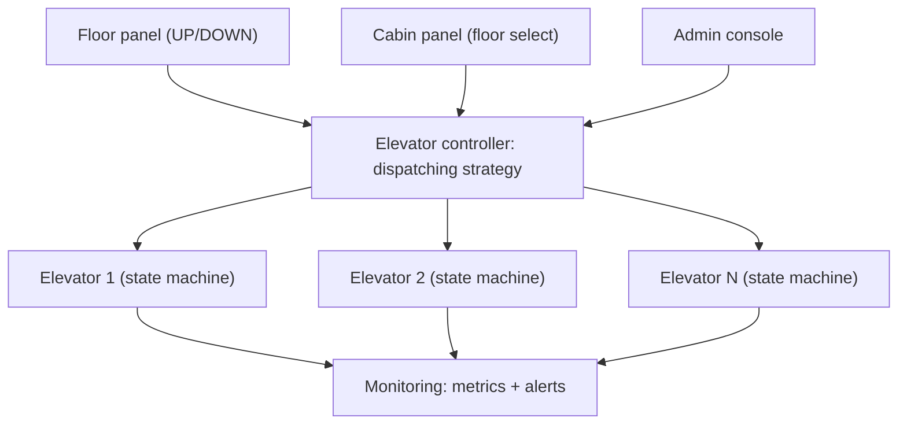
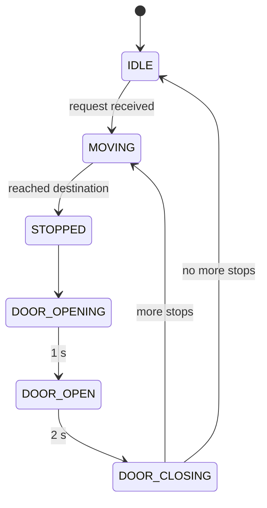
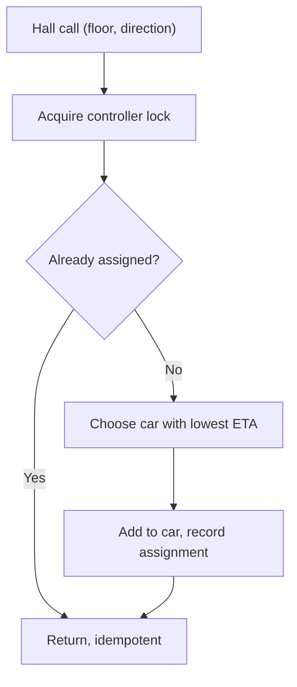

# 🏗️ Elevator System — High-Level Design

> **Target Level:** Senior/Staff Engineer
> **Focus:** Multi-car dispatching, state management, concurrency, resilience

---

## 1. SYSTEM OVERVIEW

**Purpose:** Control a bank of elevators in a multi-floor building with optimal dispatching.

**Scale:** 4–8 cars per bank, up to ~50 floors. A car completes roughly one round trip a minute at peak, so a bank handles on the order of 5–15K trips/day and a few hall calls per second at most. The constraint is latency and safety, not throughput: assign a car within ~100 ms of a button press, and never act on stale position data.

**Domain:** Building automation / IoT with real-time monitoring and failover.

---

## 2. SYSTEM ARCHITECTURE

```
┌──────────────┐    ┌──────────────┐    ┌──────────────┐
│ Floor Panel  │    │ Cabin Panel  │    │ Admin Console│
│ (UP/DOWN)    │    │ (Floor Sel)  │    │ (Monitoring) │
└──────┬───────┘    └──────┬───────┘    └──────┬───────┘
       │                   │                   │
       └───────────────────┼───────────────────┘
                           │
              ┌────────────▼────────────┐
              │   Elevator Controller   │
              │  (Dispatching Strategy) │
              └────────────┬────────────┘
                           │
         ┌─────────────────┼─────────────────┐
         │                 │                 │
  ┌──────▼──────┐  ┌──────▼──────┐  ┌──────▼──────┐
  │  Elevator 1 │  │  Elevator 2 │  │  Elevator N │
  │ (State M/C) │  │ (State M/C) │  │ (State M/C) │
  └─────────────┘  └─────────────┘  └─────────────┘
         │                 │                 │
         └─────────────────┼─────────────────┘
                           │
              ┌────────────▼────────────┐
              │   Monitoring Service    │
              │  (Metrics + Alerts)     │
              └─────────────────────────┘
```

*Figure: panels feed one controller that dispatches to cars; monitoring watches the cars.*



## 3. ELEVATOR STATE MACHINE

```
                  ┌──────────┐
                  │  IDLE    │
                  └────┬─────┘
                       │ request received
                       ▼
              ┌──────────────────┐
         ┌────│    MOVING        │◄────────────┐
         │    │ (UP / DOWN)      │              │
         │    └────────┬─────────┘              │
         │             │ reached destination    │
         │             ▼                        │
         │    ┌──────────────────┐              │
         │    │    STOPPED       │              │
         │    └────────┬─────────┘              │
         │             │                        │
         │             ▼                        │
         │    ┌──────────────────┐              │
         │    │   DOOR_OPENING  │              │
         │    └────────┬─────────┘              │
         │             │ 1 sec                  │
         │             ▼                        │
         │    ┌──────────────────┐   more       │
         │    │   DOOR_OPEN      │──stops───────┘
         │    └────────┬─────────┘
         │             │ 2 sec
         │             ▼
         │    ┌──────────────────┐
         │    │  DOOR_CLOSING   │
         │    └────────┬─────────┘
         │             │ 1 sec
         │             ▼
         │         MOVING ──────────────────────┘
         │         (if more stops)
         │             │ no more stops
         │             ▼
         └─────────> IDLE
```

*Figure: elevator car state machine (the LLD collapses STOPPED and the door states into DOORS_OPEN).*



## 4. DISPATCHING ALGORITHMS

| Algorithm | Strategy | Best For | Trade-offs |
|-----------|----------|----------|------------|
| **Nearest Car** | Closest car by distance | Very low traffic | Ignores direction (wrong-way pickups); causes bunching |
| **SCAN / LOOK** (per car) | Continue direction, reverse at the end (SCAN) or at the last request (LOOK) | Stop ordering inside every car | Bounded wait; it is SSTF, not SCAN, that starves edge floors |
| **ETA-based** (`LookEtaStrategy`) | Floors to travel before pickup under each car's current sweep | General purpose | Needs the car's sweep extent; ignores dwell time unless you add a per-stop penalty |
| **Zoning** | Each car serves a floor range | Up-peak | Idle capacity in quiet zones |
| **Destination dispatch** | Passenger enters target floor at the lobby; group by destination | High-rise up-peak | Needs keypads and passenger re-education |

## 5. CONCURRENCY & EDGE CASES

| Scenario | Approach |
|----------|----------|
| Concurrent button presses | Per-car lock around sorted `TreeSet` stops; one controller lock makes dispatch (check assignment → choose → assign) atomic, so duplicate presses are idempotent |
| Overload detection | Capacity threshold + notify dispatch another car |
| Emergency stop | Immediate stop + MAINTENANCE mode |
| Power failure | Auto-stop at nearest floor + door open |
| Re-levelling | Fine-tune floor alignment during stop |

*Figure: hall call dispatch is atomic under the controller lock, so duplicates and races are harmless.*



## 6. TRADE-OFF ANALYSIS

| Decision | Choice | Rationale | Alternative |
|----------|--------|-----------|-------------|
| Dispatching | ETA under LOOK | Direction-aware, cheap to compute | Nearest car (simpler, worse) |
| Motion model | One floor per tick | Deterministic, testable simulation | Continuous model with accel/decel profiles (needed for real ETAs) |
| State storage | In-memory | Sub-millisecond | Database (persistent but slower) |
| Communication | Polling | Simple, reliable | Pub/Sub (event-driven but complex) |

> **Mapping to the code:** the LLD collapses `STOPPED`, `DOOR_OPENING` and `DOOR_CLOSING` into a single `DOORS_OPEN` state that lasts one tick. A hardware controller needs the finer states because door motion, obstruction sensing and timers are real events.

## 7. FAILURE MODES & CONSISTENCY

| Failure | Detection | Response |
|---------|-----------|----------|
| Car stops responding | Heartbeat from car controller missed (e.g. 3 × 200 ms) | Mark out of service, re-dispatch its hall calls (as `setMaintenance` does), alert |
| Group controller crashes | Standby misses primary heartbeat | Standby takes over; it rebuilds state by querying each car (cars are the source of truth for position and car calls). Meanwhile each car runs local LOOK on its own calls, and hall calls are answered by a fixed fallback (e.g. every car stops for every hall call) |
| Duplicate / replayed button events | Same `(floor, direction)` already assigned | Idempotent by construction: the assignment map is keyed by the hall call |
| Stale position used for dispatch | Inherent: positions change while you decide | Acceptable for optimality; safety never depends on dispatch, it is enforced in the car controller (door interlocks, overspeed governor) |
| Power failure | Mains loss | Automatic rescue device drives the car to the nearest floor on battery and opens the doors; group controller resumes from a cold rebuild |
| Car overloaded | Load-weighing sensor | Car refuses to close doors; dispatcher excludes it from hall calls until load drops |

**Consistency choice:** the group controller holds soft state (assignments, ETAs) that can always be rebuilt; hard state (where the car is, which buttons are lit inside it) lives in the car. That split is what makes controller failover simple.

