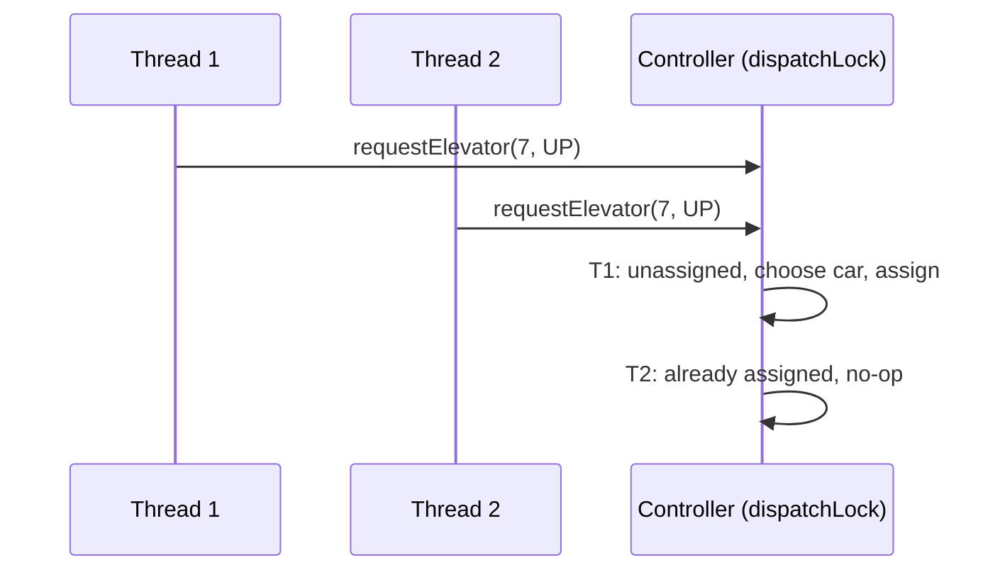
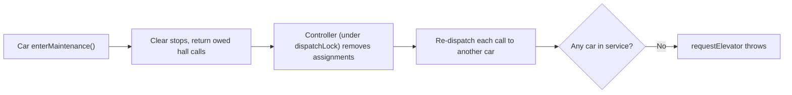

# 🏗️ Elevator System — Interview Questions

## Q1: Design the dispatching algorithm for a 6-car bank in a 40-floor building

**Key Points:**
- Separate the two problems: **per-car stop ordering** (LOOK) and **cross-car assignment** (dispatcher).
- Per car: keep car stops and hall calls in sorted sets, hall calls split by direction. Serve everything ahead in the current direction, reverse at the last request.
- Dispatcher: compute an ETA per car under its current sweep (see `LookEtaStrategy`), pick the minimum. A car moving toward the caller in the caller's direction is cheap; a car moving away pays for its whole sweep plus the return trip.
- An idle car parks where it stopped; a parking policy (send idle cars to the lobby in the morning) is a separate, swappable rule.
- For high traffic: zoning (cars serve floor ranges) or destination dispatch.

## Q2: SCAN vs. LOOK vs. SSTF vs. FCFS — which and why?

**Answer:**
- **FCFS:** fair in order but zig-zags; terrible throughput.
- **SSTF / nearest-first:** good average, but can **starve** floors at the edges when requests keep arriving near the car.
- **SCAN:** sweep end to end; bounded wait (at most about two full sweeps), but runs empty to the top and bottom.
- **LOOK:** SCAN that reverses at the last pending request. Same bounded wait, less wasted travel. This is what the code implements.

## Q3: How do you handle peak-hour traffic (8–10 AM up, 5–7 PM down)?

**Answer:**
- **Morning up-peak:** park idle cars at the lobby; consider zoning (cars 1–3 serve 1–20, 4–6 serve 21–40) so each car makes fewer stops per trip.
- **Evening down-peak:** park idle cars spread across upper floors.
- **Destination dispatch:** passengers key in their floor at the lobby, so the system groups people going to the same floors. This is the biggest real-world win at up-peak.
- Implement each as a `DispatchStrategy` (plus a parking policy), switchable by time of day.

## Q4: How do you prevent elevator bunching?

**Answer:**
- Bunching is a symptom of nearest-car dispatch: every idle car is "nearest" to the same cluster of calls.
- ETA-based dispatch already spreads load because a car that just took a call has a longer sweep.
- Add a **load penalty** (ETA + k × pending stops) and a **parking policy** that distributes idle cars.
- Optional re-optimisation: periodically re-evaluate unserved hall calls and move them to a better car.

## Q5: Two people press UP on floor 7 at the same time. What happens?

**Answer:**
- Both calls reach `requestElevator(7, UP)` on different threads. The controller's `dispatchLock` makes "is it already assigned? → choose car → add to car → record assignment" one atomic step. The second caller sees the existing assignment and gets the same car back.
- Without the lock this is a classic check-then-act race: both threads see "unassigned", both dispatch, two cars arrive.
- `HallCall` is a record, so `(7, UP)` from both threads is the same map key.

*Figure: two UP presses on floor 7 serialize on dispatchLock, so only one car is sent.*

## Q6: Why fire listener callbacks after releasing the car's lock?

**Answer:**
- The controller's `onHallCallServed` handler takes `dispatchLock` to clear the assignment. Dispatch takes `dispatchLock` and then a car lock (`snapshot()`, `addHallCall`).
- If the callback ran under the car lock, the ticker would hold car → want controller while a dispatcher holds controller → want car: a deadlock.
- Rule: one global lock order (controller → car), and never call out to foreign code while holding a lock.

## Q7: A car goes into maintenance with hall calls assigned. What happens to them?

**Answer:**
- `Elevator.enterMaintenance()` clears its stops and returns the hall calls it owed. The controller, under `dispatchLock`, removes those assignments and re-dispatches each one to the remaining cars.
- Car calls are dropped: in reality the car is taken out of service at a floor and passengers get out.
- If no car is in service, `requestElevator` throws; the hall lamp should not light for a request nobody will serve.

*Figure: a car entering maintenance hands back its hall calls for re-dispatch.*

## Q8: Now add capacity. A full car should not stop for hall calls.

**Answer:**
- Add `load` and `capacity` to the car and to `ElevatorSnapshot`.
- `serveCurrentFloor` still honours car stops (people need to get out) but skips hall calls while full.
- The dispatcher filters out full cars, or penalises near-full ones.
- Edge case: a full car holding a hall call it will now skip. Either hand the call back to the controller for re-dispatch, or keep it and serve it once load drops. Handing it back is clearer.

## Q9: Now add fire service recall.

**Answer:**
- New state `FIRE_RECALL`. On entering: clear all stops, return hall calls to the controller (which stops dispatching), add a single car stop at the recall floor, reject new calls.
- At the recall floor the car opens its doors and stays there. Exiting requires an explicit reset (firefighter key), not a timer.
- It touches `step()` and the admission checks in `addHallCall`/`addCarCall`, nothing else. That is the payoff of keeping the state machine in one method.

## Q10: How would you test this?

**Answer:**
- **Deterministic unit tests** by calling `tick()` and asserting the order of stops (LOOK ordering, direction-aware pickup, turnaround at the top). No sleeps, no flakiness.
- **Strategies are pure functions over snapshots:** construct `ElevatorSnapshot`s by hand and assert the chosen car and the ETA values.
- **Concurrency test:** many threads pressing buttons while the real ticker runs; assert every distinct call was served and the assignment map drains (catches leaks and deadlocks).
- **Invariants** to check after every tick in a property test: floor within bounds; doors only open when not moving; no hall call assigned to a car in maintenance.

## Q11: How would you add real-time monitoring and predictive maintenance?

**Answer:**
- Hang a metrics listener off `ElevatorListener`: stops, door cycles, travel distance, call-to-pickup latency (record press time in the controller, completion in `onHallCallServed`).
- Ship events to a time-series store; alert on drift (door cycle time creeping up suggests a worn door operator).

---

## ⚠️ Common mistakes

- Hall requests without a direction, so cars pick up passengers going the wrong way.
- One global "stops" set across all cars, or one shared queue that every car polls (no ownership, so two cars race for the same call).
- `Thread.sleep` inside `synchronized` methods to "simulate" movement: it blocks every request to that car for seconds.
- Claiming SCAN starves edge floors (it is SSTF that starves; SCAN/LOOK bound the wait).
- Calling observers while holding a lock, then having the observer call back into the controller.
- Check-then-act on the assignment map without a lock (`if (!map.containsKey(c)) map.put(...)` from two threads).
- Non-deterministic demos (random obstruction, random requests) that can't serve as tests.

## 🎯 Senior vs Staff signal

- **Senior:** splits hall calls from car calls, implements LOOK correctly, picks cars with a direction-aware cost, gets the locking right and can explain the check-then-act race on duplicate presses. Tests are deterministic.
- **Staff:** additionally drives the design from what is being optimised (average vs. worst-case wait, up-peak), names the lock order and why callbacks run outside locks, treats failover (maintenance, whole bank down) as a first-class flow, and explains where the in-memory controller stops being enough: the controller is a single point of failure, so in production it runs as a primary/standby pair with the cars' own controllers able to run a safe local LOOK if the group controller disappears.
