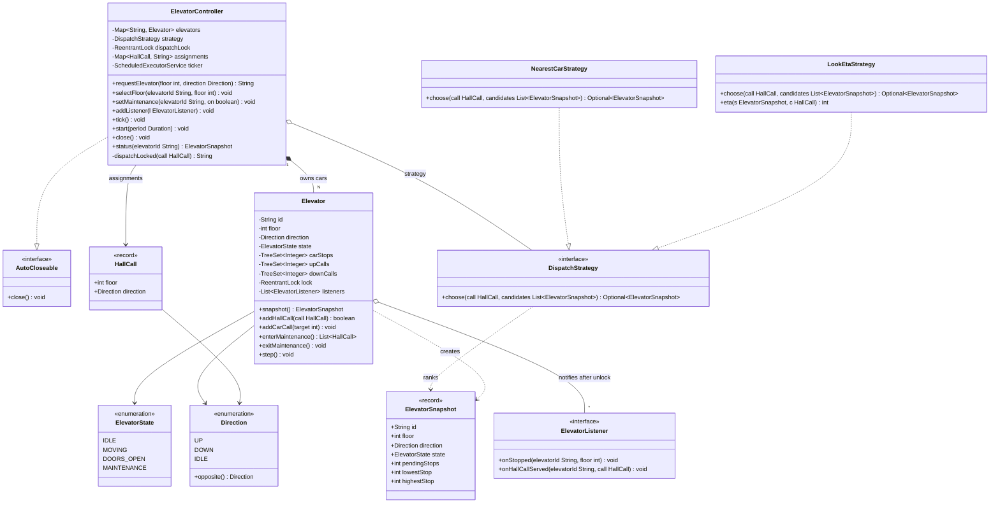

# 🧠 Elevator System — Thought Process

## 📊 Class Diagram

---

## Problem Breakdown

### Step 1: Core Entities
- **Elevator (car):** position, direction, state, and its own pending stops
- **HallCall:** `(floor, UP|DOWN)`, pressed on a landing, assigned to one car
- **Car call:** a floor pressed inside a car; no direction, belongs to that car
- **ElevatorController:** owns the cars, dispatches hall calls, handles maintenance

The hall-call / car-call split is the insight interviewers look for. Without a direction on hall calls, a car going up will stop for someone who wants to go down, and they will ride the wrong way.

### Step 2: State Machine
`IDLE → MOVING → DOORS_OPEN → (MOVING | IDLE)`, plus `MAINTENANCE` from anywhere. An enum with a single `step()` method that switches on it is enough; a full State-pattern class hierarchy is overkill for four states.

### Step 3: Two Scheduling Problems, Not One
1. **Inside a car:** in which order to visit its stops → LOOK (keep going while there is work ahead, then reverse).
2. **Across cars:** which car answers a hall call → `DispatchStrategy`. Start with an ETA estimate that understands direction; mention nearest-car only as the naive baseline.

### Step 4: Time and Testability
Model time as discrete ticks: `step()` does one action. Real time is a `ScheduledExecutorService` calling `tick()`; tests call `tick()` themselves. This removes `Thread.sleep` from the domain and makes every scenario reproducible.

### Step 5: Concurrency
- Buttons are pressed from many threads; one ticker thread advances the cars.
- One lock per car; one controller lock around the dispatch check-then-act.
- Fire listener callbacks after releasing the car lock, so the lock order is always controller → car.

## Key Decisions

| Decision | Why |
|----------|-----|
| LOOK, not SCAN | Same bounded wait as SCAN without running empty to the end of the shaft |
| Direction-split hall-call sets | A car only picks up passengers going its way, except when turning around at that floor |
| Tick-driven `step()` | Deterministic tests; no sleeping while holding a lock |
| Immutable `ElevatorSnapshot` for strategies | Strategies are pure functions; no torn reads of a moving car |
| `HallCall → car` map under one lock | Re-pressing a button is idempotent; two presses never get two cars |
| Maintenance hands back hall calls | Failover is explicit: the controller re-dispatches them |

---

## ⏱️ How to run this in a 45–60 min interview

| Time | Step | What to say out loud |
|------|------|----------------------|
| 0–7 min | **Clarify** | "One car or a bank? Do hall buttons have direction? Is this a simulation or the controller for real hardware? Do you care about capacity, fire mode, VIP? I'll assume N cars, UP/DOWN hall buttons, and a simulated clock." |
| 7–15 min | **Entities and interfaces** | Write `Direction`, `ElevatorState`, `HallCall`, `DispatchStrategy`, and the controller's public API (`requestElevator`, `selectFloor`, `setMaintenance`, `tick`). "Hall calls are dispatched, car calls are not." |
| 15–35 min | **Core code** | `Elevator.step()` with the state switch, then `serveCurrentFloor` and `chooseDirection` (LOOK). Walk one example: car going up from 0 with stops 2, 5, 8 and a DOWN call at 4. Then `LookEtaStrategy`. |
| 35–45 min | **Concurrency** | "Buttons come from many threads, the ticker is one thread. Per-car lock, one dispatch lock for the dedupe map, callbacks fire after unlocking so we never take the locks in the opposite order." |
| 45–60 min | **Extension** | Take whatever they add (capacity, fire recall, zoning, maintenance) and show it is a strategy filter or a new state, not a rewrite. |

### Clarifying questions worth asking
- How many cars and floors? Basements?
- Do hall panels have UP/DOWN buttons, or destination keypads (destination dispatch)?
- What should be optimised: average wait, worst-case wait, energy?
- What happens when a car fails or goes into maintenance with passengers waiting?
- Is capacity / weight in scope? Fire service mode? Priority (VIP, freight) cars?
- Simulation or real hardware? (Decides whether time is a tick or a sensor event.)

### What to avoid
- Starting with 10 enums for fire, earthquake, bomb threat. Model the core first; emergencies are one extra state.
- `Thread.sleep` inside `synchronized` methods: it blocks every button press for that car.
- Treating every request as a floor number with no direction.
