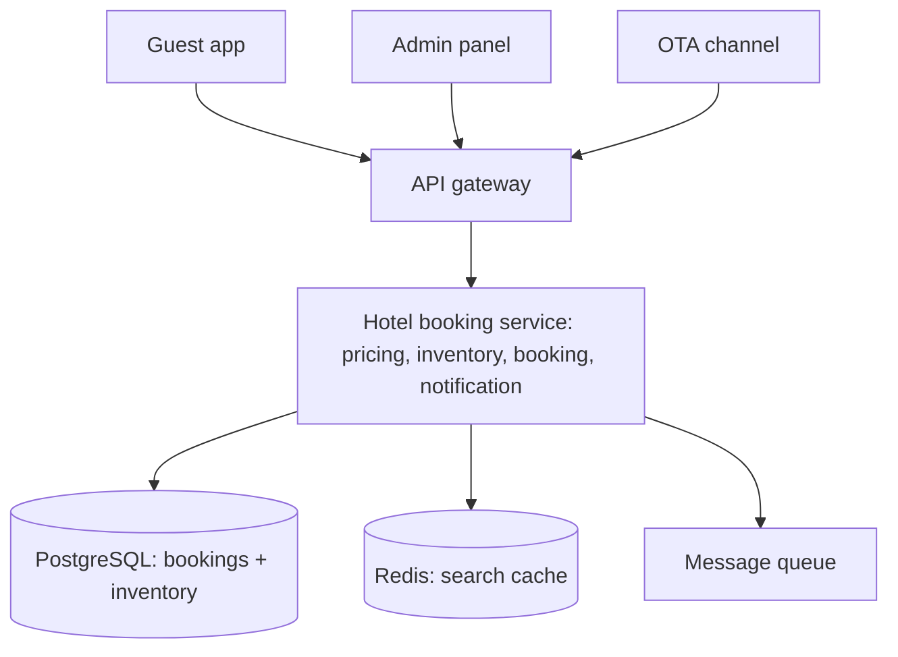
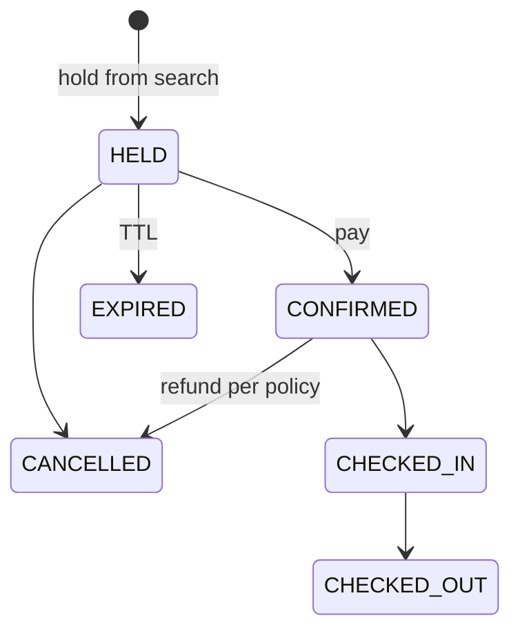
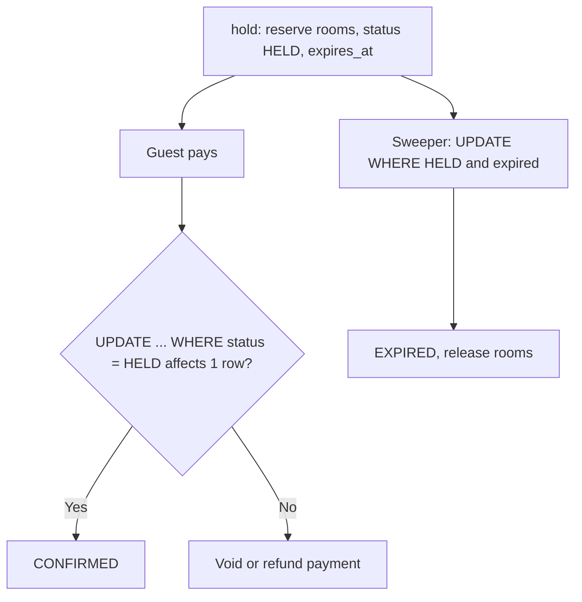

# 🏗️ Hotel Booking System — High-Level Design

> **Target Level:** Senior/Staff Engineer
> **Focus:** Inventory management, pricing strategies, booking lifecycle

---

## 1. SYSTEM OVERVIEW

**Purpose:** Online hotel reservation system with dynamic pricing and inventory management.

**Scale:** a chain of ~1,000 properties × ~200 rooms = 200K rooms. At ~70% occupancy and ~2.5 nights per stay that is roughly 55K new bookings/day (~1/s average, ~10/s at peak). Search is 100–1000× booking volume (look-to-book ratio), so reads and writes need different paths. (A single 500-room hotel cannot produce 100K bookings/month: 500 rooms × 30 nights = 15K room-nights.)

---

## 2. SYSTEM ARCHITECTURE

```
┌──────────────┐    ┌──────────────┐    ┌──────────────┐
│ Guest App    │    │ Admin Panel  │    │ OTA Channel  │
│ (Web/Mobile) │    │ (Management) │    │ (Booking.com)│
└──────┬───────┘    └──────┬───────┘    └──────┬───────┘
       │                   │                   │
       └───────────────────┼───────────────────┘
                           │
              ┌────────────▼────────────┐
              │    API Gateway (REST)   │
              └────────────┬────────────┘
                           │
              ┌────────────┴────────────┐
              │  Hotel Booking Service  │
              │  (Java - Spring Boot)   │
              ├─────────────────────────┤
              │ Pricing | Inventory     │
              │ Booking | Notification  │
              └────────────┬────────────┘
                           │
         ┌─────────────────┼─────────────────┐
         │                 │                 │
  ┌──────▼──────┐  ┌──────▼──────┐  ┌──────▼──────┐
  │ PostgreSQL  │  │    Redis    │  │  Message Q  │
  │ (Bookings + │  │ (Search     │  │ (Kafka /    │
  │  Inventory) │  │  cache)     │  │  RabbitMQ)  │
  └─────────────┘  └─────────────┘  └─────────────┘
```

*Figure: clients, booking service and stores.*



## 3. BOOKING LIFECYCLE

```
SEARCH (no state) → HELD ──pay──▶ CONFIRMED ──▶ CHECKED_IN ──▶ CHECKED_OUT
                      │  └─TTL──▶ EXPIRED          │
                      └─────────▶ CANCELLED ◀──────┘ (refund per policy)
```

*Figure: booking lifecycle.*



## 4. PRICING STRATEGY

| Strategy | Logic | Effect |
|----------|-------|--------|
| Base Rate | RoomType.baseRate × nights | Minimum revenue |
| Seasonal | 1.0-2.5× multiplier by month | Captures peak demand |
| Loyalty | 5-30% discount by tier | Repeat customer retention |
| Last Minute | 20% discount within 3 days | Fills unsold inventory |
| Extended Stay | 10% discount for 7+ nights | Increases occupancy |

## 5. CONCURRENCY & EDGE CASES

| Scenario | Approach |
|----------|----------|
| Double booking | DB constraint is the source of truth: `UNIQUE(room_id, night)` or an exclusion constraint on `(room_id, daterange)`; or a conditional decrement `UPDATE inventory SET available = available - 1 WHERE type=? AND night BETWEEN ? AND ? AND available > 0` that must touch exactly `nights` rows, else roll back |
| Payment failure | Hold with TTL (`expires_at`); sweeper expires stale holds with a conditional `UPDATE ... WHERE status='HELD'`; late payment for an expired hold is refunded |
| Overbooking tolerance | Allow 5% overbooking, VIP guests bumped last |
| Cancellation | Release inventory, process refund by policy |
| No-show | Mark NO_SHOW the morning after the check-in date, charge per policy, release the remaining nights |

## 6. TRADE-OFF ANALYSIS

| Decision | Choice | Rationale |
|----------|--------|-----------|
| Inventory granularity | Per-night rows (DB) / per-room interval set (LLD) | Per-night rows make the constraint and the conditional decrement trivial; an interval set is O(log n) in memory |
| Pricing calculation | At booking time, not check-out | Customer knows price upfront |
| Notifications | Async via observer | Non-blocking, extensible |
| Room assignment | At booking (LLD) vs at check-in (most hotels) | Late assignment enables overbooking and better packing; early assignment guarantees a specific room |

## 7. CONSISTENCY, IDEMPOTENCY & FAILURE MODES

**Consistency choice:** inventory and bookings live in the same relational database and are changed in one transaction. Strong consistency is non-negotiable on the write path (a double booking costs a walked guest); search can be eventually consistent and served from a cache that is a few seconds stale, because `hold` re-validates against the database.

**Partitioning:** shard by `property_id`. A booking only ever touches one property's inventory, so every transaction is single-shard and no distributed transaction is needed.

| Failure | Response |
|---------|----------|
| Client retries after a timeout | `Idempotency-Key` header; `idempotency(key PK, request_hash, booking_id)` written in the booking transaction; a retry returns the stored result |
| Payment captured, then confirm fails (hold expired, crash) | Outbox/saga: record the payment, and a reconciler either confirms (if inventory still held) or refunds. Never leave money taken without a booking |
| Crash between reserving rooms and writing the booking | Both happen in one DB transaction, so the reservation rolls back with it |
| Same room sold via an OTA (Booking.com) and direct | The channel manager pushes availability to OTAs with a delay, so OTAs can oversell. Accept OTA bookings into the same constraint-checked path; on conflict, reject or relocate and treat it as an overbooking case |
| Cache shows rooms that are gone | Expected; `hold` fails cleanly with "no longer available" and the cache entry is invalidated |
| Sweeper and confirm race on one hold | Conditional `UPDATE ... WHERE status='HELD'`; whichever commits first wins, the other affects 0 rows |

*Figure: hold with TTL; confirm and the sweeper both use a conditional update, so exactly one wins.*



**Capacity:** 55K bookings/day is trivial for one Postgres primary per region; the hard part is search (~50M searches/day at a 1000:1 look-to-book ratio, ~600/s average, a few thousand/s at peak), which is why search runs off a cache or search index rather than the booking database.

