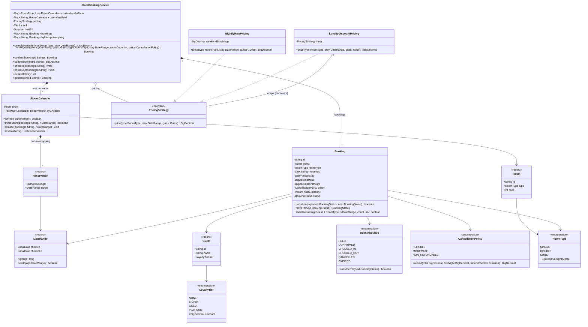

# 🧠 Hotel Booking System — Thought Process

## 📊 Class Diagram

---

## Problem Breakdown

### Step 1: Core Entities
- **Room:** id, type, floor. The unit that can actually be double-booked.
- **Guest:** id, name, loyalty tier.
- **DateRange:** half-open `[checkIn, checkOut)`.
- **Booking:** guest, assigned room(s), stay, locked price, cancellation policy, status.

### Step 2: Date Range Model
- Half-open ranges, so the checkout day is free for the next guest. Get this wrong and back-to-back stays conflict.
- Overlap test: `a.in < b.out && b.in < a.out`.
- Per room, keep reservations in a `TreeMap` keyed by check-in; only the neighbours of a new check-in can overlap it, so the check is O(log n).

### Step 3: Where does double booking get prevented?
- At the moment of reservation, not at search time. Search is advisory and can be stale.
- Check-and-insert must be one atomic step per room (`RoomCalendar.tryReserve`). In a database the same thing is a unique key on `(room_id, night)` or a Postgres exclusion constraint.

### Step 4: Booking Lifecycle
- `HELD` (rooms reserved, price locked, TTL) → `CONFIRMED` after payment → `CHECKED_IN` → `CHECKED_OUT`; `CANCELLED` and `EXPIRED` are terminal.
- Holds exist because payment is slow and can fail; without a TTL, abandoned checkouts leak inventory.

### Step 5: Pricing and Refunds
- Strategy for the base rule, Decorator to stack discounts. `BigDecimal`, never `double`.
- Price computed once at hold time and stored.
- Refund depends on policy and time before check-in, so inject a `Clock`.

### Step 6: Concurrency
- Per-room locks, no global lock.
- Status changes are compare-and-set; only the winner releases rooms, so inventory is never released twice.
- Idempotency key on `hold` so client retries are safe.

## Key Decisions

| Decision | Why |
|----------|-----|
| Assign a specific room at hold time | Double booking is a property of a room, not a type; you can't prove its absence with type-level counts alone in an LLD |
| Half-open `DateRange` | Checkout day is sellable |
| `TreeMap` per room | O(log n) conflict check using floor/higher neighbours |
| Hold with TTL, then confirm | Payment is slow and fallible; inventory must come back if it fails |
| Price locked at hold | Guest pays what they were quoted |
| `BigDecimal` + injected `Clock` | Exact money, deterministic tests |

---

## ⏱️ How to run this in a 45–60 min interview

| Time | Step | What to say out loud |
|------|------|----------------------|
| 0–7 min | **Clarify** | "One hotel or many? Book a room type or a specific room? Do we need payment, holds, cancellation refunds, group bookings? I'll assume one hotel, the guest picks a type, we assign a room, and payment happens between hold and confirm." |
| 7–15 min | **Entities and interfaces** | `DateRange` (state half-open explicitly), `Room`, `Guest`, `Booking`, `BookingStatus`, `PricingStrategy`, and the service API: `searchAvailable`, `hold`, `confirm`, `cancel`, `checkIn`, `checkOut`. |
| 15–35 min | **Core code** | `overlaps`, `RoomCalendar.isFree` with floor/higher entries, `tryReserve`, `hold` walking candidate rooms. Walk an example: `[5,8)` then `[8,10)` on the same room succeeds, `[7,9)` fails. |
| 35–45 min | **Concurrency** | "Search is a hint; correctness is check-and-insert under the room's lock. Two people racing for the last room: one `tryReserve` wins. Status changes are CAS so a late confirm and the expiry sweeper can't both release the room." |
| 45–60 min | **Extension** | Group booking (all-or-nothing with rollback), idempotent retries, modify dates (new hold before releasing the old), overbooking, or moving the invariant into the database. |

### Clarifying questions worth asking
- Does the guest book a room type or a specific room? When is the room number assigned?
- Is payment in scope? Do we hold inventory during checkout, and for how long?
- Cancellation rules: free until when, and what is charged after?
- Multi-room / group bookings: all-or-nothing?
- One property or a chain? (Changes the sharding answer in the HLD part.)
- Is overbooking allowed?

### What to avoid
- Closed-interval overlap (`<=`), so back-to-back stays conflict.
- Checking availability in one call and reserving in another without holding a lock (check-then-act).
- Releasing inventory on checkout, or on every call to cancel.
- `double` for money; `LocalDate.now()` sprinkled through the code.
