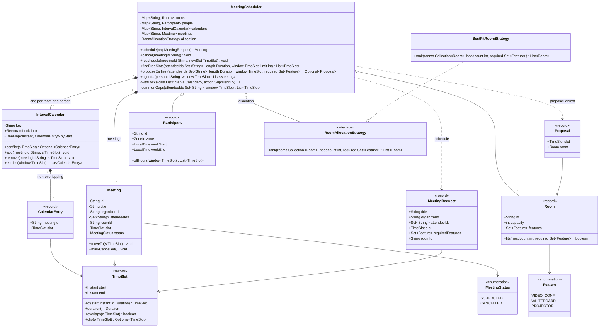

# 🧠 Meeting Scheduler — Thought Process

## 📊 Class Diagram

---

## Problem Breakdown

### Step 1: Core Entities
- **TimeSlot:** half-open `[start, end)` on `Instant` (absolute time; zones only matter for working hours).
- **Participant:** id, `ZoneId`, working hours.
- **Room:** capacity, features.
- **Meeting:** organizer, attendees, room, slot, status.
- **Calendar:** one per person and one per room. Both are "a set of non-overlapping intervals".

### Step 2: Conflict Detection
- A meeting conflicts if the room **or any attendee** already has an overlapping entry.
- Sorted map per calendar keyed by start: only the floor and higher neighbours can overlap → O(log n).
- Half-open intervals so back-to-back meetings are allowed.

### Step 3: Atomic Booking Across Many Calendars
- A booking touches 1 room + k people. It must succeed everywhere or nowhere.
- Lock all involved calendars in a canonical order (sorted key), check all, insert all, unlock. Ordered acquisition prevents deadlock; holding every lock makes check-then-insert atomic.

### Step 4: Room Allocation
- Filter rooms by capacity and features, rank by best fit (smallest that works), take the first free one. Strategy pattern so the policy can change.

### Step 5: Finding Free Slots
- Merge the busy intervals of all attendees (their meetings + their off-hours in their own zone), sweep once to find gaps, emit grid-aligned candidates. O(N log N).
- Optionally require a room too: walk candidates in time order, take the first with a free fitting room.

## Key Decisions

| Decision | Why |
|----------|-----|
| `Instant` + per-person `ZoneId` | Meetings are absolute; working hours are local |
| Half-open `TimeSlot` | Back-to-back meetings are legal |
| `TreeMap` per calendar | O(log n) conflict check, O(log n + k) agenda |
| Ordered multi-lock booking | All-or-nothing without a global lock, and no deadlock |
| Sweep-line over merged busy intervals | One pass instead of probing every 15-minute candidate against every calendar |
| Best-fit room strategy | Keeps big rooms free for big meetings |

---

## ⏱️ How to run this in a 45–60 min interview

| Time | Step | What to say out loud |
|------|------|----------------------|
| 0–7 min | **Clarify** | "Rooms only, or people's calendars too? Time zones? Must every attendee be free, or are some optional? Do we pick the room or does the organizer? Recurrence in scope?" |
| 7–15 min | **Entities and interfaces** | `TimeSlot` (say "half-open" out loud), `Participant`, `Room`, `Meeting`, `IntervalCalendar`, `RoomAllocationStrategy`, and the API: `schedule`, `cancel`, `reschedule`, `findFreeSlots`. |
| 15–30 min | **Core code** | `overlaps`, `IntervalCalendar.conflict` with floor/higher, then `schedule` with best-fit room. Walk an example with an 8:00–12:00 meeting and a new 11:00–11:30 request. |
| 30–40 min | **Free slots** | The sweep: collect busy, sort, walk with a cursor, emit gaps. Mention working hours per zone and the 15-minute grid. |
| 40–50 min | **Concurrency** | "Two people book overlapping meetings that share Bob. Each locks its calendars in sorted order, so one waits for the other; the second sees Bob busy and fails cleanly. No partial writes, no deadlock." |
| 50–60 min | **Extension** | Recurrence, optional attendees, RSVP, or how this maps to a database (exclusion constraint on room + time range). |

### Clarifying questions worth asking
- Are people's calendars in scope, or only rooms?
- Do attendees live in different time zones? Whose working hours apply?
- Are all attendees required, or can some be optional?
- Does the organizer pick the room, or do we allocate one?
- Recurring meetings? Edits to a single occurrence?
- Should tentative/unanswered invites block a person's time?
- What granularity do suggested slots need (15 minutes is typical)?

### What to avoid
- Closed-interval overlap (back-to-back meetings conflict).
- Checking the room and the attendees in separate, independently locked steps (another booking slips in between).
- Locking calendars in arbitrary order (deadlock when two bookings share people).
- Using `LocalDateTime` for meetings across time zones.
- Probing every 15-minute candidate against every calendar instead of merging busy intervals once.
