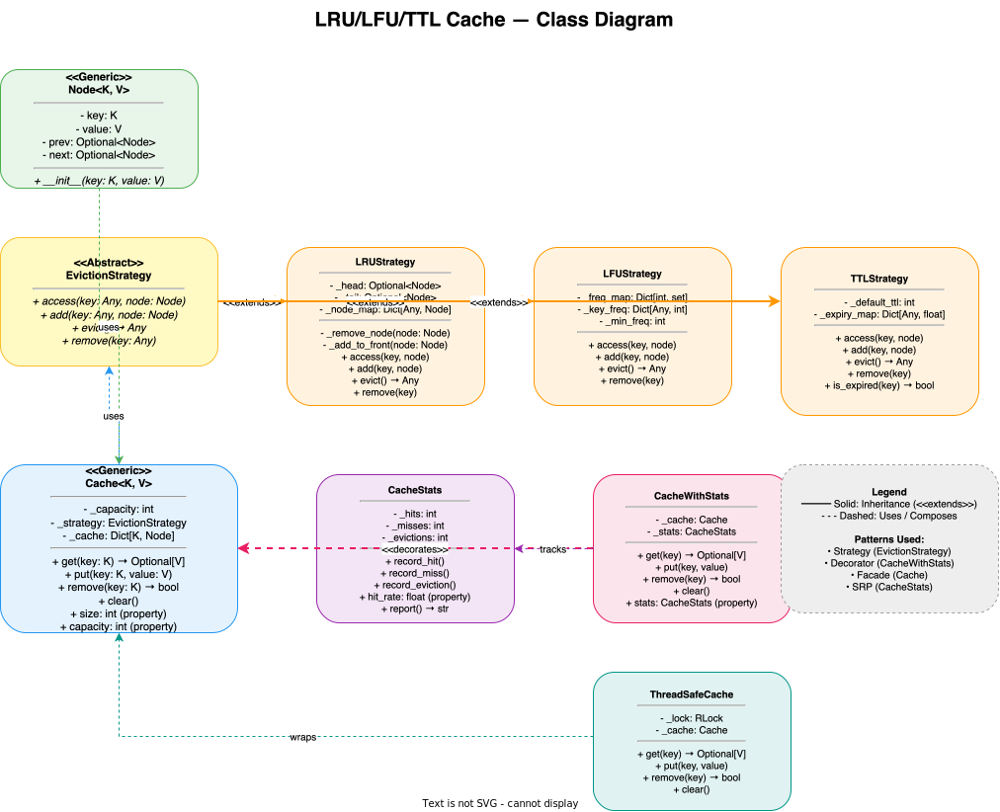

# 🏗️ Distributed Cache System — High-Level Design

> **Target Level:** Senior/Staff Engineer | **Focus:** Distributed caching, consistency, eviction, high availability

---

## 1. SYSTEM OVERVIEW

**Purpose:** Multi-layered distributed cache providing low-latency data access with pluggable eviction policies.

**Scale:** 10M requests/second peak, 500GB cache capacity, 99.999% availability

**Users:** Internal microservices, API endpoints, Database query layer

**Use Cases:** Session caching, API response caching, Database query result caching, Rate limiter backing store

**Constraints:** p99 latency <5ms, no data loss on single node failure, support LRU/LFU/TTL/ARC

---

## 2. HIGH-LEVEL ARCHITECTURE

```
┌──────────────────────────────────────────────┐
│              Client Applications               │
│  (Microservices, API Servers, Worker Pods)    │
└──────────────────────┬───────────────────────┘
                       │
              ┌────────▼────────┐
              │  Cache Client   │
              │  (Sidecar/Lib)  │
              │  - Consistent   │
              │    hashing      │
              │  - Circuit      │
              │    breaker      │
              └────────┬────────┘
                       │
          ┌────────────┼────────────┐
          │            │            │
    ┌─────▼─────┐┌─────▼─────┐┌─────▼─────┐
    │ Cache     ││ Cache     ││ Cache     │
    │ Shard 1   ││ Shard 2   ││ Shard N   │
    │ (Primary) ││ (Primary) ││ (Primary) │
    └─────┬─────┘└─────┬─────┘└─────┬─────┘
          │            │            │
    ┌─────▼─────┐┌─────▼─────┐┌─────▼─────┐
    │ Replica   ││ Replica   ││ Replica   │
    │ (Read)    ││ (Read)    ││ (Read)    │
    └───────────┘└───────────┘└───────────┘

          ┌────────────────────────────────┐
          │         Cluster Manager         │
          │  (Raft/Consul for consensus)    │
          │  - Node membership              │
          │  - Shard rebalancing            │
          │  - Leader election              │
          └────────────────────────────────┘
```

### 🎬 Animated Sequence Diagram

<p align="center">
  <video controls width="900" style="border-radius: 12px; box-shadow: 0 4px 24px rgba(0,0,0,0.3);" loop playsinline preload="metadata">
    <source src="../../../assets/videos/lru-cache-sequence.mp4" type="video/mp4" />
    Your browser does not support the video tag.
  </video>
  <br/>
  <em>🎬 Animated LRU Cache Sequence — Get/Set → Eviction Check → Cache Update → Return. Click ▶ to play/pause. Created with <a href="https://remotion.dev">Remotion</a>.</em>
</p>

---

## 2.5 CLASS DIAGRAM



> **📥 Download:** [LRU Cache Architecture Diagram (draw.io)](lru-cache-class-diagram.drawio) — Open in [draw.io](https://app.diagrams.net/) to edit.

---

## 3. KEY COMPONENTS & INTERVIEW Q&A

### Cache Node (Go/C++)
- In-memory hash table + eviction data structures
- LRU: Doubly linked list + HashMap O(1)
- LFU: Frequency list + HashMap O(1) amortized
- TTL: Priority queue of expiry times

**🔴 Interview Question:** *"How does consistent hashing distribute keys across nodes?"*

**✅ Answer:**
```python
class ConsistentHashRing:
    def __init__(self, nodes, vnodes=150):
        self._ring = {}
        for node in nodes:
            for i in range(vnodes):  # Virtual nodes for balance
                hash_val = hash(f"{node}:{i}")
                self._ring[hash_val] = node
    
    def get_node(self, key):
        hash_val = hash(key)
        # Binary search for nearest clockwise node
        keys = sorted(self._ring.keys())
        idx = bisect_left(keys, hash_val)
        if idx == len(keys):
            idx = 0  # Wrap around
        return self._ring[keys[idx]]
```

**Why virtual nodes?** Without them, adding/removing a node causes disproportionate key redistribution. With 150 virtual nodes per physical node, distribution is nearly uniform.

---

### Replication Layer
- **Leader-follower per shard:** Writes go to primary, async replication to replica
- **Read from replica:** Cache-aside pattern, primary for write-through
- **Failover:** If primary fails, promote replica (30s detection + 10s promotion)

**🔴 Interview Question:** *"What happens during cache replication lag?"*

**✅ Answer:** After a write, subsequent reads from stale replicas see old data. Mitigation:
1. **Read-your-writes:** Track writes in client session, route reads for recently-written keys to primary
2. **Configurable consistency:** `--consistency=strong` → always read from primary
3. **Version vector:** Each key has version; replica rejects stale version reads

---

### Cluster Manager
- Gossip protocol for node membership
- Raft consensus for configuration changes
- Automatic shard rebalancing on scale events

**🔴 Interview Question:** *"How does cache rebalancing work when adding a new node?"*

**✅ Answer (Detailed):**

When a new cache node joins the cluster, rebalancing happens in **5 phases** to minimise disruption:

1. **Membership detection** — The new node announces itself via gossip protocol. Within seconds, every node in the cluster knows about the addition. The cluster manager (Raft leader) confirms the join.

2. **Consistent hash ring update** — The new node adds N virtual nodes (e.g., 150) to the ring. Each virtual node hashes to a position on the ring. Keys whose nearest clockwise node was previously shard X now map to the new node. Approximately **1/N of all keys** remap (where N is the new total node count).

3. **Lazy key migration (no mass invalidation)** — Rather than invalidating all remapped keys upfront (which would cause a thundering herd against the DB), the system uses **lazy migration**:
   - Client library caches the ring state locally.
   - On a cache miss, the client sends the request to the *old* node.
   - The old node detects the key no longer belongs to it and returns a **MOVED redirect** (identical to Redis Cluster's approach).
   - Client updates its ring cache and retries against the correct node.

4. **Proactive hot-key migration** — A background goroutine/thread walks the keyspace and migrates frequently-accessed ("hot") keys before they're requested. This avoids the MOVED redirect penalty for popular keys.

5. **Rolling rebalancing completion** — The cluster operator monitors:
   - Redirect rate (should decay to near-zero within minutes)
   - Per-node memory utilisation (should converge to uniform)
   - Client error rates (should remain flat)

**Failure scenarios:**
- **Node crashes during rebalance:** The cluster manager detects failure via gossip timeout. The rebalance pauses, the dead node's virtual nodes are removed from the ring, and its keys remap to remaining nodes.
- **Network partition:** During a split, both sides continue operating. When the partition heals, the cluster manager reconciles via Raft — the side with the higher term wins and triggers a full rebalance if needed.

---

## 4. CACHE STRATEGIES COMPARISON

| Strategy | Read | Write | Consistency | Use Case |
|----------|------|-------|-------------|----------|
| **Cache-aside** | Miss → load from DB | Write DB, invalidate cache | Eventual | General purpose |
| **Write-through** | Same as aside | Write cache + DB | Strong | Write-heavy |
| **Write-behind** | Same as aside | Write cache, async to DB | Eventual | High throughput |
| **Refresh-ahead** | Predict and pre-load | — | Eventual | Predictable access |

---

## 5. EVICTION STRATEGY SELECTION

| Strategy | When to Use | When NOT to Use |
|----------|-------------|-----------------|
| **LRU** | Temporal locality (session cache) | Scan-heavy workloads (bulk reads thrash) |
| **LFU** | Popularity-driven access (product cache) | New items never get cached |
| **TTL** | Fixed expiry (rate limiter counters) | No access pattern awareness |
| **ARC** | Mixed workloads | Implementation complexity |
| **2Q** | Good balance | Tuning parameters needed |

---

## 6. SCALABILITY & RELIABILITY

**Bottleneck:** Single node memory capacity

**Solution:** Shard by key hash. Each shard = Redis node or memcached instance. 500GB / 50GB per node = 10 shards + 10 replicas = 20 nodes.

**Cache avalanche prevention:**
1. **Uniform TTL + jitter:** `TTL = base_TTL + random(0, TTL_jitter)` — prevents mass expiry
2. **Circuit breaker:** If DB can't handle reload traffic, return stale cache instead
3. **Rate limiting per origin:** Limit number of concurrent cache misses

**Thundering herd protection:** Mutex per key — first request loads from DB, subsequent requests wait for completion.

---

## 7. COST (Monthly)

| Component | Nodes | Cost |
|-----------|-------|------|
| Cache nodes (r6g.xlarge) | 10 | $3,200 |
| Replica nodes | 10 | $3,200 |
| Cluster manager (3-node) | 3 | $600 |
| Bandwidth + Monitoring | — | $500 |
| **Total** | | **$7,500** |
